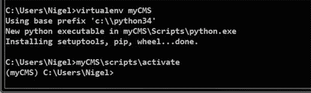

# 二、安装 django CMS

django CMS 是一个基于 Django web 框架的基于 web 的开源内容管理系统。它由位于苏黎世的商业网站开发公司 Divio AG 维护。但是在你开始学习如何使用 django CMS 之前，你必须先在你的电脑上安装一些软件。幸运的是，这是一个简单的三步过程:

Install Python.   Install a Python Virtual Environment.   Install django CMS.  

如果这听起来不熟悉，不要担心；在这一章中，我假设你以前从未从命令行安装过软件，我将一步一步地引导你。

虽然 Mac OSX 和 Linux 的用户群一直在增长，但我为大多数使用 Windows 的人写了这一节。您的计算机可以运行任何最新版本的 Windows 操作系统(Windows Vista、Windows 7、Windows 8.1 或 Windows 10)。

这个过程在运行 Mac OSX 和 Linux 的机器上非常相似。如果您使用的是 Mac 或 Linux，不要担心，因为互联网上有大量关于在这些系统上安装 Python 和 django CMS 的说明。有关在这些系统上安装软件的更多信息，请参见第 11 章。

Note

Windows 用户，根据您的计算机的配置，您很可能需要以具有管理员权限的用户帐户运行，以便能够安装软件并运行一些命令和命令提示符。

## 安装 Python

安装 Python 非常简单，但是首先您需要检查 Python 是否已经安装在您的系统上。为此，我们使用一些 Windows 用户可能不熟悉的工具——命令提示符。如果您习惯使用命令提示符，请随意浏览这一部分。

### 检查是否安装了 Python

命令提示符其实挺有用的。当你学习 django CMS 时，你会经常用到它，所以如果你以前没有用过，现在是时候熟悉一下这个工具了。

要启动命令提示符，需要找到`cmd.exe`并运行程序。

在 Windows 7 和 Vista 中，单击开始按钮并在搜索程序和文件框中键入`cmd`。

在 Windows 8.1 和 10 中，在搜索网页和 Windows 框中键入`cmd`。

在所有版本的 Windows 中，都会出现一个列表—查找名为`cmd.exe`的文件。点击该文件运行它，你应该会看到一个类似于图 [2-1](#Fig1) 中的黑框。

图 2-1。

The Windows command prompt Tip

当程序运行时，右键单击任务栏中的 cmd.exe 图标(文本中带有 c:\ _ 的黑色图标)并选择“固定到任务栏”。这样，每当你想运行程序时，你就可以很容易地访问它。

现在我们已经打开了命令窗口，我们需要检查 Python 是否已经安装。这很简单——只需在提示符下键入`python`,然后按回车键:

`C:\Users\YourUsername>python`

如果没有安装 Python，您将收到如下消息:

`'python' is not recognized as an internal or external command,`

`Operable program or batch file.`

如果安装了 Python，你会得到一个类似于图 [2-2](#Fig2) 所示的消息，它会打开 Python 交互提示。我们将很快回到 Python 的交互提示。

图 2-2。

The Python interactive prompt Warning

如果您的系统列出的 Python 版本以 2 开头(如 2.7.x)，您运行的是旧版本的 Python，需要安装 Python 3，因为本书中的所有代码都是用 Python 3 编写的。如果需要安装 Python 3，请按照下一节的说明进行操作。

完成后，关闭命令窗口。

### 下载并安装 Python

假设您的系统中没有安装 Python，我们首先需要获得安装程序。进入 [`https://www.python.org/downloads/`](https://www.python.org/downloads/) ，点击黄色的大按钮下载 Python 3.x.x

在撰写本文时，Python 的最新版本是 3.4.3，但在您阅读本文时，它可能已经更新了，因此数字可能略有不同。

不要下载 2.7.x 版本，因为这是 Python 的旧版本。本书中的所有代码都是用 Python 3 编写的，所以如果您试图在 Python 2 上运行代码，将会出现编译错误。如果出于某种原因，您必须使用 Python 2 而不是 Python 3，您将需要修改一些代码。在大多数情况下，这就像将`__str__()`函数改回`__unicode__()`并将`print()`函数修改回`print`语句一样简单；但是，可能会出现其他错误。有关两个版本之间差异的完整参考链接，请参见[第 11 章](11.html)。

下载完 Python 安装程序后，转到下载文件夹，双击文件`python-3.x.x.msi`运行安装程序。

安装过程和其他任何 Windows 程序一样，所以如果你以前安装过软件，这里应该没有问题；然而，有一个非常重要的定制您必须做。

Caution

不要忘记下一步，因为它将解决 Windows 中因不正确映射`pythonpath`(Python 安装的一个重要变量)而产生的大多数问题。

当安装程序打开定制窗口时，没有选择“将 python.exe 添加到路径”选项；您必须将其更改为“将安装在本地硬盘上”，如图 [2-3](#Fig3) 所示。

图 2-3。

The Add python.exe to Path option

一旦 Python 安装完毕，你应该能够重新打开命令窗口，并在命令提示符下键入`python`，得到与图 [2-2](#Fig2) 相同的输出。现在就这样做，以确保 Python 已经安装并正常工作。

当你在做的时候，还有一件更重要的事情要做。

通过键入 Ctrl-C 退出 Python。在命令提示符下键入以下内容并按 Enter 键:

`C:\Users\YourUsername>python –m pip install –U pip`

您现在不需要理解这个命令到底是做什么的；简单来说，`pip`是 Python 包管理器。它用于安装 Python 包:`pip`实际上是“Pip Installs Packages”的递归缩写。`Pip`对于我们安装过程的下一阶段很重要，但是首先我们需要确保我们运行的是最新版本的`pip`，这正是这个命令所要做的。

## 安装 Python 虚拟环境

计算机上的所有软件都是相互依赖地运行的，每个程序都有它所依赖的其他软件(称为依赖关系)以及它需要用来查找文件和其他需要运行的软件的设置(称为环境变量)。当你在写新软件的时候，这是可能的(也是常见的！)来修改其他软件所依赖的依赖关系和环境变量。这可能会导致许多问题，因此应该避免。

Note

Python 虚拟环境允许您在自己的机器上运行独立的 Python 实例，不应该与虚拟机混淆。后者是允许你运行整个操作系统和应用程序的软件，就像它们是一台物理计算机一样。

Python 虚拟环境解决了这个问题，它将新软件所需的所有依赖项和环境变量打包到一个文件系统中，该文件系统独立于计算机上的其他软件。Python 中的虚拟环境工具叫做`virtualenv`，我们使用`pip`从命令行安装(图 [2-4](#Fig4) ):

图 2-4。

Pip installed successfully

`C:\Users\YourUsername>pip install virtualenv`

一旦安装了`virtualenv`，你需要为你的项目创建一个虚拟环境(图 [2-5](#Fig5) ):

图 2-5。

Python `virtualenv` active

`C:\Users\YourUsername>virtualenv myCMS`

在这种情况下，我将新的虚拟环境称为`myCMS`，但是您可以随意称呼它。一旦`virtualenv`完成了新虚拟环境的设置，打开 Windows 资源管理器，看看`virtualenv`为你创建了什么。

在您的主目录中，您将会看到一个名为`\myCMS`的文件夹(或者您给虚拟环境起的名字)。如果打开该文件夹，您将看到以下内容:

`\Include`

`\Lib`

`\Scripts`

`\src`

`Virtualenv`已经为您创建了一个完整的 Python 安装，与您的其他软件分开，因此您可以在不影响系统上任何其他软件的情况下处理您的项目。要使用这个新的 Python 虚拟环境，我们必须激活它，因此让我们返回到命令提示符并键入以下内容:

`C:\Users\YourUsername>myCMS\scripts\activate`

这将在虚拟环境的`\scripts`文件夹中运行`activate`脚本。您会注意到您的命令提示符现在已经更改:

`(myCMS) C:\Users\YourUsername>`

命令提示符开头的`(myCMS)`让您知道您正在虚拟环境中运行。我们的下一步是安装 django CMS 项目。

## 安装 django CMS

安装 django CMS 的第一步是安装 django CMS 安装程序。这是通过`pip`完成的:

`(myCMS) C:\Users\YourUsername>pip install djangocms-installer`

然后，我们必须为 django CMS 项目创建一个项目目录，并进入该目录:

`(myCMS) C:\Users\YourUsername>mkdir myCMS-tutorial`

`(myCMS) C:\Users\YourUsername>cd myCMS-tutorial`

最后，我们需要安装 django CMS 支持的网站:

`(myCMS) C:\Users\YourUsername\myCMS-tutorial>djangocms –p . mysite`

不要忘记“.”在`-p`和`mysite`之间！

django CMS 安装程序现在会问你几个问题。在大多数情况下，您只需接受默认设置；但是，有些选项您应该更改。我用粗体突出显示了它们。

`Database configuration (in URL format) [default sqlite://localhost/project.db]:`

`django CMS version (choices: 2.4, 3.0, 3.1, stable, develop) [default stable]:`

`Django version (choices: 1.4, 1.5, 1.6, 1.7, 1.8, stable) [default stable]:`

`Activate Django I18N / L10N setting (choices: yes, no) [default yes]:`

`Install and configure reversion support (choices: yes, no) [default yes]:`

`Languages to enable. Option can be provided multiple times, or as a comma separated list. Only language codes supported by Django can be used here:` `en`

`Optional default time zone [default <your timezone>]:`

`Activate Django timezone support (choices: yes, no) [default yes]:`

`Activate CMS permission management (choices: yes, no) [default yes]:`

`Use Twitter Bootstrap Theme (choices: yes, no) [default no]:` `yes`

`Use custom template set [default no]:`

`Load a starting page with examples after installation (english language only). Choose "no" if you use a custom template set. (choices: yes, no) [default no]:` `yes`

`Creating the project`

`Please wait while I install dependencies`

`##lots more messages…`

`Creating admin user`

`Username (leave blank to use '<yourusername>'):`

`Email address:` `enter email address`

`Password:` `enter a password`

`Password (again):`

`Superuser created successfully.`

`All done!`

一旦安装了 django CMS，您应该能够运行您的全新项目了。在您的项目目录中(如果您在安装后直接启动，您应该还在那里)，您用以下命令运行 Django 开发服务器:

`(myCMS) C:\Users\YourUsername\myCMS-tutorial>python manage.py runserver`

一旦开发服务器开始运行，你可以在浏览器中输入 [`http://127.0.0.1:8000`](http://127.0.0.1:8000/) ，默认的 django CMS 模板将会加载，给你一个类似于图 [2-6](#Fig6) 的屏幕。

图 2-6。

Success! Tip

Windows 用户可能也想考虑安装 Git BASH，它是 Git for Windows 包( [`https://git-for-windows.github.io/`](https://git-for-windows.github.io/) )的一部分。大多数在线示例都假设您正在运行某种形式的 Unix，因此安装 Git BASH 将允许您运行 Unix 格式的命令行工具，而无需将示例翻译成 Windows shell 命令。

## 摘要

在这一章中，我们已经介绍了 Python 和 django CMS 的安装和配置，结果是一个漂亮干净(尽管是空的)的 django CMS 网站。在下一章，我们将探索 django CMS 背后的整体结构和设计理念。