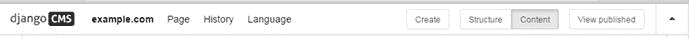
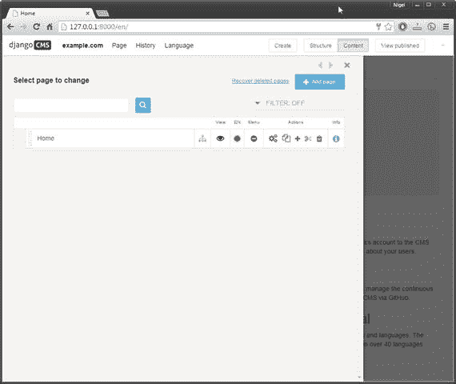

# 三、django CMS 简介

基于 Django 还有许多其他的 CMS 应用；然而，在撰写本文时，django CMS 是最受欢迎的【1】，并且受到大量用户和开发人员的支持。

就其本身而言，django CMS 并不是一个“即插即用”的网站建设者，非程序员可以选择一个模板，添加一些内容，并在几个小时内建立和运行一个网站。它被特别设计来给开发者和设计者更多的自由来定制他们的网站。

## 设计原理

可以把 django CMS 想象成一盒乐高积木和一个模型车套件——两者都可以用来建造一辆模型车，但是使用乐高，你几乎可以完全自由地建造任何你喜欢的汽车，而使用套件，你只能得到盒子里的汽车(假设你按照说明操作)。

理解 django CMS 是内容不可知的也是有帮助的，因为它不会对你的内容强加任何固定的结构。django CMS 旨在为您的内容提供发布框架，但是如何构建内容取决于您；您可以自由地做任何事情，从用插件格式化页面上的文本，到放入整个 Django 应用并将它们与 django CMS 菜单和管理挂钩。

django CMS 继承了 django 的大部分设计理念；它执行以下所有操作:

*   实现模型视图控制器(MVC)架构，将表示逻辑与业务逻辑分开。
*   提供可插拔架构，允许轻松添加自包含插件和应用(app ),以扩展网站的功能。
*   默认情况下使用搜索引擎友好的 URL。
*   默认情况下支持多种语言。

为了增强 Django 的内容管理能力，它增加了以下特性:

*   前端编辑—允许结构和内容修改，而不需要专门的管理后端。
*   全触摸界面支持，重点是领先供应商的平板电脑和触摸笔记本电脑。许多手机也可以工作，但你应该注意，django CMS 的触摸功能明确不支持它们。
*   一系列用于常见内容管理任务(如页面编辑)和第三方应用集成(如社交媒体)的预构建插件。
*   所有内容页面的版本控制(历史)。
*   内容创建者轻松的权限管理—可分配的创建/编辑/发布授权。
*   媒体资产管理—文件、图像、视频和动画(Flash)。

当然，没有一个软件包是完美的:django CMS 确实有缺点，有些是因为 django 的局限性，有些是因为 django CMS 的设计方式:

*   它不是为开箱即用的简单内容管理而设计的；你不能像其他 CMS 应用一样，创建一个页面就开始输入内容。您首先需要一个带有占位符的模板；然后，您必须添加至少一个插件，配置插件，并添加您的内容。
*   这对于非常简单的站点来说过于复杂，因为没有简单的方法将 Django 项目从数据库中分离出来，所以即使您不需要数据库，您仍然需要配置一个。
*   在撰写本文时，还没有大量的第三方插件可用。随着 django CMS 越来越受欢迎，可用插件的数量也在不断增加，但是在更成熟的 CMS 应用中有许多功能是现成的，您必须在 django CMS 中自己编写代码。
*   因为 django CMS 和 django 都是正在开发中的开源项目，所以与一些插件和 Django 应用的向后兼容性有时会出现问题。

django CMS 的强大和灵活性很好地弥补了这些缺点。通常，对于构建完全定制的 CMS 比从头构建 CMS 要快得多的应用，您会选择 django CMS，这种应用需要更积极地管理 CMS 的更多技术方面。

## django CMS 的结构

django CMS 的结构允许大部分 CMS 管理功能从网站的前端执行，而不是有一个单独的管理后端。django CMS 与大多数其他 cmse 的不同之处在于，它允许您从前端编辑内容和结构，这使得更新、预览和发布基本设计和内容更改变得非常容易。

访问站点编辑器非常简单，只需将字符串`?edit`附加到主页 URL 上——在我们的示例中，这将是 [`http://127.0.0.1:8000/en/?edit`](http://127.0.0.1:8000/en/?edit) 。如果您输入的网址正确，您将看到演示网站的首页如图 3-1 所示。

图 3-1。

DjangoCMS home page with edit toolbar displayed

使用您在第一章中输入的管理员用户名和密码登录您的演示网站。登录后，工具栏会变为登录状态，如图 3-2 所示。

图 3-2。

django CMS toolbar changed to edit mode

一旦 django CMS 处于编辑模式，你可以通过下拉菜单访问工具栏中的一系列功能。每个菜单的可用选项将取决于您的访问级别。目前，您以管理员身份登录，因此您将拥有对该站点的完全访问权限。我们将在下一节更详细地探讨工具栏中的功能。

您还可以直接编辑文本和页面结构。将鼠标悬停在(或点击)页面的某些部分会弹出一个上下文编辑链接，允许您编辑内容(图 3-3 )和结构(图 3-4 )。

图 3-4。

Link to edit page structure

图 3-3。

Link to edit page content

你将在第八章中看到如何编辑页面结构和内容。

### django CMS 工具栏

对于内容和布局编辑以及网站管理员来说，django CMS 工具栏通过四个下拉菜单提供了管理和更新网站所需的所有工具:

*   站点下拉菜单(默认安装中的 example.com)有许多菜单选项，允许站点管理员管理页面、用户和 Django 管理后端。内容和布局编辑者通常无法访问它。我们将在第八章的中更详细地探讨站点下拉菜单。
*   页面下拉菜单提供对所有页面功能的访问，包括添加页面、编辑、发布和删除页面。根据权限设置，编辑者还可以更改页面模板、页面权限和许多高级设置。第八章也涵盖了下拉页面。
*   历史下拉菜单提供对完整页面历史的访问，能够查看页面更改并恢复到页面的早期版本。更多信息请见第八章。
*   语言下拉菜单允许您管理页面的各种翻译。在这本介绍性的书中，我们将只使用英语，所以我们不会探究这个菜单的功能。

工具栏右侧的四个按钮都与页面结构和编辑相关，将在第八章的中详细介绍。

### django CMS 侧窗格

在继续构建我们的演示站点之前，我们还需要了解编辑界面的一个结构元素:侧窗格。如果您选择 example.com➤页面，您将看到侧窗格弹出，如图 3-5 所示。

图 3-5。

The Side pane

几个下拉菜单选项将打开侧窗格，允许您输入附加信息。您会注意到侧窗格右上角的三个小导航选项卡。使用< >箭头显示和隐藏侧面板，使用 X 关闭侧面板。

## 面向设计者和开发者的 django CMS

网站设计者和开发者会注意到，前端几乎没有什么设计和编码。这是由设计决定的，并遵循与 Django 相同的哲学——设计、代码和内容是三个截然不同的学科，因此需要相互分离。

但是不用担心；django CMS 对于设计人员和开发人员来说和内容编辑人员一样容易使用:

*   对于设计师来说，django CMS 使用一个干净、简单的基于 HTML 的模板系统，不需要任何编码。它还完全支持引导和丰富的内容。第四章和第五章对此有详细介绍。
*   对于开发者来说，django CMS 遵循 django 的可插拔的、面向应用的架构。django CMS 通过插件和 Django apphooks 实现了这一点。我们将在第六章、 7 、 9 和 10 中详细探讨这些话题。

## 摘要

在这一章中，我们对 django CMS 进行了高层次的观察，查看了它的结构、功能和设计理念。我们研究了它的优点和缺点，并探索了它的设计如何满足设计者和开发者的不同需求。

在下一章中，我们将深入探讨 django CMS 站点模板，向您介绍 django 模板系统的 django CMS 实现，以及它的自定义模板标签，我们将为您自己的博客网站创建站点模板奠定基础。

Footnotes 1

[`https://www.djangopackages.com/grids/g/cms/`](https://www.djangopackages.com/grids/g/cms/)