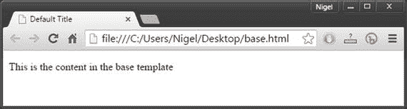

# 四、网站模板

在这一章中，我们将深入探讨 django CMS 站点模板。我们将从详细回顾 django CMS 模板构建所基于的技术开始。我们将逐步完成 django CMS 安装程序创建的模板，并将它们与您所学的内容联系起来，从而结束这一章。

如果理论一开始让你有点害怕，不要担心；在下一章，我们开始真正有趣的东西，但不要太快跳到前面。一旦你吸收了本章的所有内容，你就再也不会抱怨不懂模板了！

## Django 模板 101

django CMS 继承并扩展了 django 的模板系统，因此了解该系统设计背后的核心原则非常重要，即:

*   遗产
*   逻辑和表现的分离
*   展开性

### 遗产

大多数现代网站都有一个通用的站点范围的设计，其中页面上的某些元素——如页眉、页脚和菜单——在每个页面上重复出现。Django 模板系统使用一种设计模式，其中每个页面都继承了一个基础模板的设计属性，这个模板按照惯例被命名为`base.html`。(你会在`/mysite/templates`目录中找到由 django CMS 安装程序创建的`base.html`模板。)

作为快速复习，让我们看看 Django 的模板继承是如何工作的。基本模板是一个完整的 HTML 文件；清单 4-1 展示了一个`base.html`文件的最小但有效的实现。

Listing 4-1\. A Minimal `base.html` File

`<!doctype html>`

`<html>`

`<head>`

`<title>Default Title</title>`

`</head>`

`<body>`

``

`This is the content in the base template`

``

`</body>`

`</html>`

图 4-1 显示了这个基本模板将如何在浏览器中呈现。

图 4-1。

Rendering of a simple base template

这个最小的例子介绍了 Django 继承背后的关键元素:block 标签。在继承自`base.html`的子模板中，``和``标签之间的任何内容都可以被覆盖。例如，让我们考虑一个基本的子模板(清单 4-2 )。

Listing 4-2\. Basic Child Template

`#child.html`

``

`Title of Child Page`

``

`
This text will override the block content tag in base.html 
`

``

图 4-2 显示了子模板将如何在浏览器中呈现。请注意，页面的内容和标题已经在子模板中被覆盖。

图 4-2。

Child template overrides the block tags in base template

在这里发挥全部魔力的元素是``标签。这告诉模板呈现器`child.html`扩展(继承)了`base.html`模板。当渲染器在子模板中找到与基础模板相同的块标记时，子模板中的块将被发送到浏览器。

或者换句话说，当`child.html`在你的浏览器中呈现时，它的标题和内容块将覆盖基本模板中的块，从而允许每个页面呈现定制内容，而不必复制或修改整个站点的内容。很酷，是吧？

要了解继承在真实的模板中是如何工作的，请看一下`mysites/templates`中的`page.html`和`feature.html`。不要担心其中的许多内容现在没有意义，因为我们很快就会更详细地浏览这些模板。

### 逻辑和表现的分离

Django 不允许在页面模板中执行任意代码。这意味着您不能在模板中编写代码、分配变量或执行任何类型的程序逻辑。这有一些很好的理由，我在第一章中提到了。然而，关于设计最重要的，也是值得再次提及的是 Django 假设(正确！)大多数网页设计师都不是程序员，不要把程序代码和 HTML 混在一起是非常重要的。

然而，Django 确实提供了许多模板标签和模板过滤器，允许您做出与表示相关的决定。如果您对 Django 比较陌生，那么内置的模板系统非常简单，由四种主要的标记类型组成:

*   变量的格式为`{{ value }}`。当模板引擎遇到一个变量时，它会对它求值并用结果替换它。变量可以是任何 Python 数据类型。
*   过滤器的格式为`{{ value|filter }}`。过滤器用于修改变量的显示方式。
*   标签的格式为``。它们非常通用，模板引擎可以使用它们来
    *   在输出中创建文本
    *   控制程序流程并执行逻辑
    *   加载外部信息
*   注释的格式为`{# comment #}`。它们的功能类似于 HTML 注释:注释块中的任何文本都将保留在模板中，为模板设计者或程序员提供信息，但不会呈现给浏览器。这种格式仅适用于单行注释；对于多行，你必须使用`...`块标签。

Django 的模板标签提供了许多有用的函数来显示应用中的数据。例如，`for/endfor`标签允许简单地迭代列表项，而`if/else/endif`标签允许简单地决定显示什么内容。Django 的模板过滤器允许对数据进行排序、过滤和格式化。过滤器直接应用于由管道字符分隔的模板变量(在大多数键盘上位于`\`上方)；比如`{{ title|upper }}`。您也可以创建自己的自定义模板标签库。自定义模板标签超出了本书的范围；然而，如果你有兴趣，更多信息可以在 [`https://docs.djangoproject.com/en/1.8/howto/custom-template-tags/`](https://docs.djangoproject.com/en/1.8/howto/custom-template-tags/) 找到。表 4-1 总结了 Django 最常用的模板标签和过滤器。

表 4-1。

Common Django Template Tags and Filters

<colgroup><col> <col></colgroup> 
| 普通 Django 模板标签 | 描述 |
| --- | --- |
| `` `` | 如果`statement`为真，则呈现标签之间的内容。例如:`` `
There are some articles published
` `` |
| `` `` | 可选标签为`if/endif`流量控制标签。提供与 Python `elif`和`else`语句相同的功能。例如:`` `
There are articles published
` `` `
There are some articles in draft
` `` `
No articles sorry!
` `` |
| `` `` | 允许轻松迭代一系列项目。例如:`<ul>` `` `<li>{{ article.title }}</li>` `` `</ul>` |
| `` | 可选标签，用于在`for/endfor`语句中的列表为空时呈现错误或消息。例如:`# ... for statement` `` `
No articles sorry!
` `` |
| `upper``lower` | 大写、小写和标题大小写格式。示例:`{{ title&#124;upper }}`如果`title`是“开始 DJANGO”，则输出将是“开始 Django” |
| `date` | 如果变量是 datetime 对象，它将根据格式字符串进行格式化。示例:`{{ today&#124;date: "D d M Y" }}`将输出 2015 年 9 月 19 日星期六。`date`格式字符串遵循与 PHP 格式字符串相同的约定。实现这一点是为了让设计人员更容易从 PHP 切换到 Django。 |
| `Default` | 如果变量为空，则输出默认值。示例:`{{ value&#124;default:"empty" }}`如果`value`为空，输出将是字符串“empty” |
| `first` `last` | 返回列表中的第一个(或最后一个)项目。示例:`{{ article_list&#124;first }}`将输出文章列表中的第一篇文章。 |
| `truncatechars` `truncatewords` | 将变量截断到指定的字符/单词数。例如:`{{ title&#124;truncatechars:7 }}`会将“这是标题”截断为“这是”，而`{{ title&#124;truncatewords:3 }}`会输出“这是” |

这只是所有可用的 Django 模板标签和过滤器的一小部分。完整列表请见 [`http://masteringdjango.com/django-built-in-template-tags-and-filters/`](http://masteringdjango.com/django-built-in-template-tags-and-filters/) 。

### 展开性

Django 的模板系统被设计成可扩展的。现在详细说明 django 如何实现这一点并不重要，但是理解 django CMS 如何利用 Django 的可扩展性是很重要的；也就是说，有几个扩展的标记库，包括:

*   `cms_tags`
*   `sekizai_tags`
*   `menu_tags`

CMS 标签

django CMS 实现了 19 个自定义模板标签(列于表 4-2 )。为了加载 django CMS 标签，我们使用 django 的`load`模板标签:

表 4-2。

django CMS Custom Template Tags

<colgroup><col> <col></colgroup> 
| django CMS 自定义标签 |   |
| --- | --- |
| `placeholder``static_placeholder``render_placeholder``render_uncached_placeholder``show_placeholder``show_uncached_placeholder``page_lookup``page_url``page_attribute` | `render_plugin``render_plugin_block``render_model``render_model_block``render_model_icon``render_model_add``render_model_add_block``page_language_url``language_chooser``cms_toolbar` |

``

这个加载标签必须放在你的`base.html`文件的顶部。

我们将在本书的后面使用许多这样的标签，但是现在我们来看看三个最重要的自定义标签:

*   `placeholder`
*   `static_placeholder`
*   `cms_toolbar`

#### 占位符

标签定义了模板中的一个占位符。占位符用作编辑页面时放置插件的容器；例如，这个标签:

``

在模板中放置一个占位符，当您第一次添加基于模板的页面时，该占位符将呈现为一个空容器。然后，您可以从前端编辑器向容器添加插件，以在页面上呈现内容。

占位符接受编辑器中可用的任何插件，插件可以嵌套。因此，例如，您可以添加一个多列插件来添加两列，然后用一个文本插件填充每一列，以在页面上呈现两列文本。您将在本书的稍后部分看到如何做到这一点。

占位符的名称无关紧要。我在这里使用了名称`"content"`,因为最好的做法是使你的变量名尽可能具有描述性，但是你也可以把占位符称为任何东西。关于占位符名称的主题，请注意，占位符对于页面是唯一的，因此您可以在两个不同的页面上有一个名为`"content"`的占位符，它们将引用不同的对象。如果你想让一个占位符为多个页面所共有，你需要使用`static_placeholder`。

如果占位符为空，还可以使用`or`参数呈现附加内容。要使用`r`，必须添加一个``结束标签。例如:

`Coming Soon!`

`placeholder`标签也可以从它上面的任何有同名占位符的父页面继承。所以包含这个标签的模板:

``

将从包含名为`"content"`的占位符的继承树中它上面的第一个父页面继承`content`占位符。

可以将`inherit`与`or`结合起来，为继承的页面创建一个完整的回退解决方案:

`No content anywhere!`

#### 静态 _ 占位符

`static_placeholder`标签在功能上与`placeholder`标签相似；但是，它可以在模板中的任何地方使用，通常用于显示站点上任何地方的内容，包括在其他应用中。例如，如果我们创建这个占位符:

``

并把它放在一个模板文件中(不管是哪一个)，添加一个文本插件和来自前端编辑器的文本`"Copyright 2015"`，每个实现了名为`"footer"`的静态占位符的页面也会显示`"Copyright 2015"`。

当然，将静态占位符放在您的`base.html`文件中更有意义，尤其是如果它是页脚或页眉之类的东西，但是并不要求您这样做。另一个好处是，如果你决定改变占位符的内容，你可以从任何页面编辑它，它会自动更新其余的内容；您不必返回到基础页面进行编辑。

`static_placeholder`标签还带有`or`参数和一个额外的`site`参数，以允许静态占位符在多站点安装中特定于站点。例如:

``

`No footer on mysite.`

``

注意，多站点安装超出了本书的范围，但是这个例子确实给出了 django CMS 的简单可伸缩性的概念。

#### cms _ 工具栏

定制标签`cms_toolbar`使模板引擎能够呈现 django CMS 工具栏。`cms_toolbar`标签应放在`base.html`中的`<body>`标签之后，并且不得包含在块标签中:

`# template header information`

`. . .`

`<body>`

``

`# rest of the template`

`. . .`

#### 关斋标签

Django-sekizai 是一个第三方库，它使用块来呈现 CSS 和 JavaScript 之类的静态媒体文件(sekizai 是日语中“块”的意思)。Sekizai 允许设计人员在模板中扩展和/或添加 CSS 和 JavaScript 文件，而无需编辑底层 Python 文件。

Django-sekizai 提供了`css`和`js`名称空间，允许 Django 视图在不改变模板的情况下添加媒体；例如，`cms_toolbar`定制模板标签会自动将 CSS 和 JavaScript 添加到 sekizai 名称空间中，而无需修改模板。Django-sekizai 还会自动删除重复的内容，因此当媒体文件被多次包含时不会有膨胀的风险。

因为 Django-sekizai 是 django CMS 所必需的，所以安装程序会将必要的模块和设置添加到您的项目中。要将 Django-sekizai 包含在您的模板中，您可以将它加载到您的`base.html`文件的顶部:

``

Django-sekizai 使用起来极其简单；要将它添加到您的模板中，您只需要两个标签:

*   `render_block`
*   `addtoblock`

然而，为了让 Django-sekizai 工作，你必须遵守一些规则

*   `render_block`标记不能在包含的模板中；它们必须在您的`base.html`文件中。
*   `render_block`标记不能放在 Django 块标记内。
*   如果`addtoblock`在一个扩展模板中使用(使用``标签)，它必须包含在块标签中。

Caution

请密切注意这些规则，因为在使用 Django-sekizai 时，它们通常是“无效块标签”错误的来源。更多信息请参见 [`https://django-sekizai.readthedocs.org/en/latest/#restrictions`](https://django-sekizai.readthedocs.org/en/latest/#restrictions) 。

实际上，这些规则很容易遵守。将``放在标题中，将``放在`base.html`文件的结束体标签之前。例如，清单 4-1 中的基本模板现在看起来像清单 4-3 。

Listing 4-3\. Minimal base.html file with Sekizai Tags Added

``

`<!doctype html>`

`<html>`

`<head>`

`<title>Default Title</title>`

``

`</head>`

`<body>`

``

``

`</body>`

`</html>`

然后，当你想要添加 CSS 或 JavaScript 文件到你的一个子模板时，你只需要确保`addtoblock`被包含在块标签中(清单 4-4 )。

Listing 4-4\. Basic Child Template With Sekizai Tags

`#child.html (fragment)`

``

`. . .`

``

``

`# Add extra scripts here`

`. . .`

``

``

#### 标记菜单

`menus`应用实现了四个额外的定制模板标签，用于在 django CMS 中呈现菜单:

*   `show_menu`
*   `show_menu_below_id`
*   `show_sub_menu`
*   `show_breadcrumb`

我们现在最感兴趣的标签是`show_menu`(我们将在`C`章节 `10` 中讨论其余部分)。为了在模板中启用菜单标签，我们使用 Django 的 load 标签:

``

##### 显示菜单

`show_menu`标签呈现页面的默认导航菜单。菜单的位置取决于模板的设计。在 django CMS 安装程序创建的演示站点中，默认菜单沿页面顶部水平显示，如图 4-3 所示。

图 4-3。

The Default django CMS menu

在这个例子中，我添加了几个页面和一个子页面。请注意，菜单会自动格式化菜单标题并创建子页面的下拉列表；模板引擎创建菜单(在 Bootstrap 的帮助下),不需要您的任何输入。我们稍后将深入探讨 Bootstrap。添加页面将在本书的稍后部分介绍。

`show_menu`标签有八个可选参数:

*   `from_level`。开始呈现菜单的节点级别。默认为`"0"`(根节点)。
*   `to_level`。要渲染的节点深度。默认为`"100"`，实际意义上是指所有子节点。
*   `extra_inactive`。要在当前非活动节点下呈现的节点数。默认值是`"0"`，它有效地隐藏了当前活动菜单项下的所有子节点。
*   `extra_active`。要在当前活动节点下呈现的节点数。默认值是`"100"`，它有效地展开了当前活动菜单项下的所有子节点。
*   `template`。如果指定了一个模板(例如`"menu.hml"`)，django CMS 将在您的应用文件夹中呈现文件`/templates/menu.html`。如果没有指定，django CMS 将呈现默认的`menu.html`文件(隐藏在 django 的`site-packages`目录中)。有关这方面的更多信息，请参见附带的注意事项。
*   `namespace`。模板的名称空间。模板名称空间超出了本书的范围。
*   `root_id`。菜单根页面的 ID。这在呈现子菜单时使用。
*   `next_page`。这将检索指定页面 ID 的所有子页面，并将它们呈现在菜单中。

Caution

使用`show_menu`时，最好总是指定一个模板。Django 的核心理念之一是可移植性，因此所有特定于应用的模板都应该位于该应用的模板目录中。如果您不这样做，对 django CMS 默认模板的更改可能会破坏您的站点。

因为传入位置参数(而不是关键字参数)更容易、更简洁，所以垂直菜单最常见的`show_menu`形式如下:

``

这将显示从根开始的整个菜单，非活动子菜单折叠，活动菜单展开。对于水平菜单(如我们的演示应用)，它看起来像这样:

``

这将只显示菜单中的顶级页面，并展开活动菜单项上的子菜单项。

你可能会问自己为什么`extra_inactive`是`100`而不是`0`，因为将它设置为`100`会展开所有非活动菜单项的子菜单，这是我们不想要的——对吗？

是的，但是我们使用这个技巧来利用 Bootstrap 的一个特性—非活动节点会自动折叠，Bootstrap 会显示下拉箭头图标，这样您就知道父菜单项有子菜单项。如果您将`extra_inactive`设置为`0`，您将看不到下拉箭头，除非菜单项处于活动状态。

## 引导程序

回到第一章，我说过一个现代的网站必须是移动友好的，以迎合现在连接到互联网的众多设备。但是手机友好到底是什么意思呢？

虽然这个问题有许多有时是矛盾的答案，但灵活性是关键:移动设备类型的数量以及它们运行的操作系统多得令人难以置信，一个支持尽可能多的设备的网站需要具有适应性。为了具有灵活性和适应性，站点功能可以归结为三个简单的要求:

*   反应灵敏。这是一个行业术语，但它意味着您的网站将根据设备自动调整大小和重新排列内容。一个设计良好的响应型网站将为使用智能手机的访问者提供与使用 28 英寸显示器的桌面浏览相同的积极用户体验。
*   合规。Android、iOS、OSX、Windows、Linux:他们都有不同的做事方式，不兼容的系统软件，不同的字体和多个浏览器版本。一个移动友好的网站必须能够提供在不同系统上正确呈现的内容。
*   速度。移动数据速度通常较慢，与台式机和笔记本电脑相比，移动设备的处理能力通常较弱。如果你的网站加载速度不快，大多数移动用户会转向竞争对手的网站。

虽然在互联网的服务器端仍然有大量的多样性，但这些需求已经将浏览器端缩减为三种基本技术——CSS、HTML 和 JavaScript。

但是，将这些技术结合起来从头开始构建一个网站是非常困难的，这导致了许多前端 web 框架的出现，这些框架使得使用这些技术的网站的设计、开发和管理变得更加简单。

Bootstrap 最初是两名 Twitter 员工的想法，于 2011 年作为开源技术发布。在此后的四年中，它已经成为前端框架中 800 磅重的大猩猩。Bootstrap 是如此受欢迎，以至于它现在是几乎所有 CMSes 和大型定制站点实现响应式设计的默认框架。

对 Bootstrap 的全面解释超出了本书的范围；然而，对一些关键概念的简单介绍将使设计 django CMS 响应式模板变得容易得多。

### 自举网格系统

引导网格是一个 12 列、无限行的流体网格系统，可以根据设备自动重新格式化和缩放。网格的确切布局以及它在每个屏幕尺寸上的行为是由预定义的 CSS 类控制的(见下一节)。网格的每个单元格都包含一个 HTML `
...
`块，您可以在其中放置任何合法放置在无响应模板的`div`标记之间的内容。用一个简单的例子来说明这一点更容易。图 4-4 显示了一个带有两栏和右键菜单的简单页面在台式电脑上的样子。

图 4-4。

Responsive template on a desktop computer

在像平板电脑这样的小屏幕上，设计可能看起来像图 4-5 。

图 4-5。

Responsive template on a tablet

在智能手机上，这种设计可能看起来像图 4-6 。

图 4-6。

Responsive template on a smartphone

这是一个非常简单的例子，但是 Bootstrap 足够灵活和强大，可以创建非常复杂的设计，并且不需要任何程序代码。我听到你问，它是怎么做到的？这就是我们接下来要看的——CSS 类和组件。

### 引导 CSS 类

Bootstrap 用非常复杂的样式表实现了它的格式化魔力，这些样式表定义了 600 多个用于格式化和样式化 HTML 元素的类。这些类别分为八个功能组:

*   网格系统。根据设备大小格式化网格的类别—超小型(`xs`)、小型(`sm`)、中型(`md`)和大型(`lg`)—带有列跨越修饰符。例如，`col-xs-4`类在一个特别小的屏幕(智能手机)上跨越四列。
*   排版。文本样式，如标题、正文、内联文本格式、对齐和特殊格式，如块引号、地址和文本转换。
*   代码。内联和代码块、用户输入和变量格式。
*   桌子。格式和颜色、大小和鼠标交互。
*   表格。表单和表单控件的复杂格式。
*   纽扣。显示选项、颜色和大小。
*   图像。图像大小调整和整形。
*   助手功能。用于上下文着色、clearfix、屏幕阅读器功能以及根据屏幕大小显示和隐藏列的杂项类。

Bootstrap 的 CSS 使用 Less，这是一个 CSS 预处理器，它添加了许多函数，包括变量、混合和编译 CSS 的函数。例子包括:

*   灰度颜色，如，`@gray, @gray-dark, @gray-light`。
*   语义色彩，比如`@brand-primary, @brand_info`。
*   CSS 中颜色变量的使用，比如`background-color: @brand-primary`。
*   排印基底，如`@font-family-base, @font-size-base`。
*   排版混合，如`@font-size-h1: floor((@font-size-base* 2.6));`
*   链接样式，如`@link-color, @link-hover-color`

我们将不会在这里进一步探索引导类；我只是想让你在使用 Bootstrap 时体验一下所有有用的设计元素，并帮助你理解当你用 django CMS 构建一个站点设计时，你不必重新发明轮子。要全面了解自举，请参考 [`http://getbootstrap.com/css/`](http://getbootstrap.com/css/) 。

django CMS 利用了 Bootstrap 的强大功能，因此，django CMS 的默认模板不仅利用了 Bootstrap 类，而且您还可以在自己的模板中轻松实现它们。

### 引导组件

为了结束我们关于 Bootstrap 的部分，我们只需要简单地谈一谈另一件事——组件。引导组件是可重用的代码，通常是 CSS 和 JavaScript 的混合。django CMS 使用了许多引导组件，包括下拉菜单、导航、提醒和大屏幕。其他组件包括:

*   图像(glyph)
*   按钮组和下拉列表
*   页码
*   面包屑
*   拇指甲
*   进度条
*   面板和井

Note

我们仅仅触及了 Bootstrap 的表面。虽然没有必要更深入地研究 Bootstrap 来理解这本书的其余部分，但是通过书签`getbootstrap.com/getting-started/`和花几个小时深入理解 Bootstrap 及其功能，你作为一名职业程序员的未来将会受益匪浅。

## 把这一切联系在一起

我们在这一章已经讲了很多内容，现在是时候把你所学的东西联系起来了。我们将通过检查由 django CMS 安装程序生成的模板文件来做到这一点。

假设您使用了与第二章中的安装示例相同的文件名，您将在中找到这些模板

`C:\users\<yourusername>\myCMS-tutorial\mysite\templates\`

我们将从清单 4-5 中所示的`base.html`文件开始(注意:为了提高可读性，一些 URL 被缩短了):

Listing 4-5\. Complete sample `base.html` file

`1.  `

`2.  <!doctype html>`

`3.  <html>`

`4.    <head>`

`5.      <meta charset="utf-8">`

`6.      <title>`

`7.        `

`8.          This is my new project home page`

`9.        `

`10.     </title>`

`11.     <meta name="viewport" content="width=device-width,initial-scale=1">`

`12.     <link rel="stylesheet" href="``https://cdnjs ... bootstrap.min.css`

`13.     <link rel="stylesheet" href="``https:// ... bootstrap-theme.min.css`

`14.     `

`15.   </head>`

`16.   <body>`

`17.     `

`18.     
`

`19.       
`

`20.         
`

`21.           <button type="button" class="navbar-toggle"` 

`data-toggle="collapse" data-target=".navbar-collapse">`

`22.             Toggle navigation`

`23.                  `

`24.                  `

`25.                  `

`26.                </button>`

`27.                <a class="navbar-brand" href="#">Project name</a>`

`28.             
`

`29.             
`

`30.                 <ul class="nav navbar-nav">`

`31.                     `

`32.                 </ul>`

`33.             
`

`34.         
`

`35.         `

`36.     
`

`37.     <script src="``https://cdnjs ... jquery.min.js`

`38.     <script src="``https://cdnjs ... bootstrap.min.js`

`39.     `

`40.   </body>`

`41\. </html>`

现在，您面前已经有了完整的列表，让我们来看一下最重要的部分:

*   一号线。Django 的`load`标签接受多个参数，所以我们一次性加载了所有的扩展标签库。
*   第 7 到 9 行。这里 Django 的块标签用于定义页面的标题块。此代码将被定义标题栏的任何子模板覆盖。
*   第 14 行。这是 Sekizai `render_block`标记，用于在文件顶部呈现 CSS。
*   第 17 行。这是我们将 django CMS 工具栏加载到页面中的地方。
*   第 19 到 34 行。这是在 Bootstrap 中实现的页面导航栏。为了让导航条显示任何东西，你必须给它传递一个列表，我们在第 31 行用我们的`show_menu`标签做了这个。出于好奇，第 21 到 26 行是 Bootstrap 如何呈现小屏幕上显示的“hamburger”图标，而不是完整的菜单。
*   第 35 行。这里 Django 的 block 标签用于定义页面的内容块。这将被定义内容块的任何子模板覆盖。
*   第 39 行。这是 Sekizai `render_block`标记，用于在页面底部呈现 JavaScript。使用它是提高页面加载速度的最佳实践。

正如你所看到的，一旦你知道每一行是做什么的，这就很容易理解了。作为练习，我留下了剩下的三个示例模板— `page.html, feature.html`和`menu.html`—供您自己检查，以提高您的理解，但这里有一些快速注释可以帮助您:

*   `Page.html`和`feature.html`对应 Django 编辑器前端的`page`和`page with feature`模板。我们将在下一章深入探讨页面模板。
*   `page.html`和`feature.html`都扩展了`base.html`。
*   You will notice that our sample home page (Figure 2-6) uses the `feature.html` template. The banner at the top is rendered by Bootstrap’s `jumbotron` class. Add a new page and select the “page” template, and you will see a blank page template (Figure 4-7).

    

    图 4-7。

    The blank `page` template
*   注意在`page.html`和`feature.html`中 django CMS 占位符标签的使用。
*   注意`menu.html`如何使用 Django 的`if/endif`和`for/endfor`标签迭代菜单中列出的所有页面。

## 摘要

本章到此为止。我们已经非常详细地介绍了模板，现在您应该对如何构建 django CMS 模板有了非常扎实的基础。您还应该熟悉 Bootstrap 的基础知识，以及 django CMS 如何利用 Bootstrap 的 CSS 类来创建一个在大多数设备上都很好看的现代站点模板。

在下一章，我们将继续有趣的东西——设计你自己的模板。