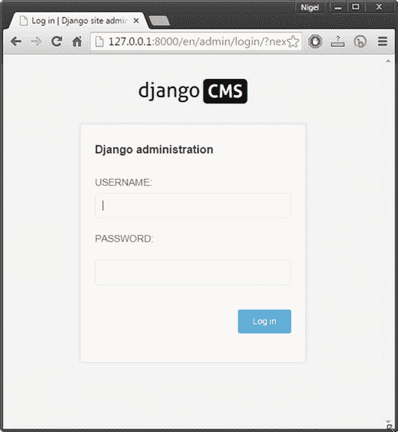
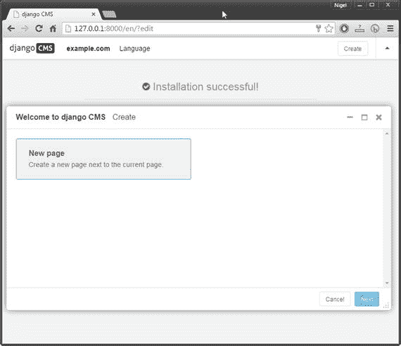
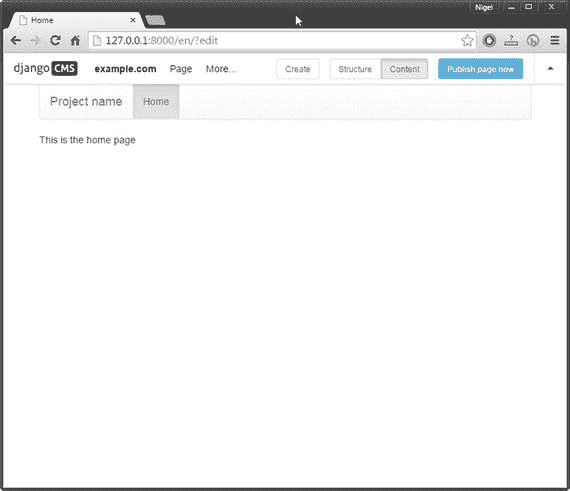
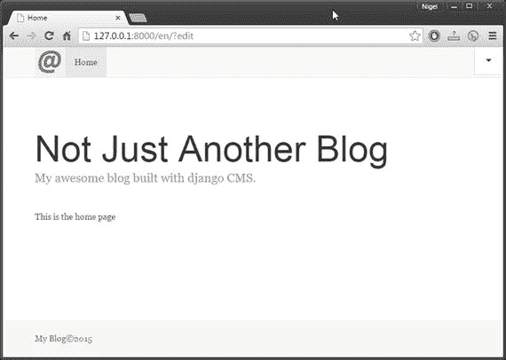
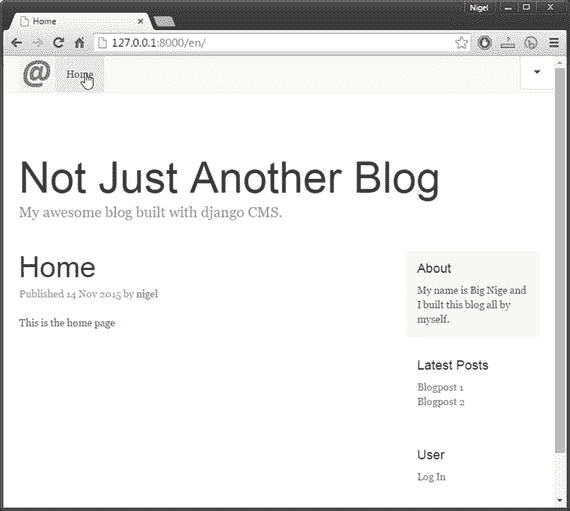

# 五、你的博客网站：模板

现在您已经对 django CMS 模板的构造有了一个全面的了解，是时候为您的博客网站构建模板了。在本章中，您将:

Start with a fresh, empty install of django CMS.   Create your own `base.html` template.   Create a CSS file to apply custom styling to your blog.   Create a new template, `blogpage.html`, that will display a single blog post along with a right sidebar menu listing all posts.   Edit your setting file to apply the new templates to your blog site.   Note

本章中的所有源代码都可以从该书的网站上下载；但是，建议您第一次通过自己键入文件。有时候这可能会很乏味，但是这样做你肯定会学到更多。

## 创建全新安装

我们想为我们的博客站点安装一个完全空的 django CMS，所以第一步是创建一个新的虚拟环境(称之为`myBlog`)并将 django CMS 安装在一个名为`myBlogProject`的新项目目录中。

创建新安装的步骤与您在第二章中所采取的步骤几乎相同，但是我将简要地一步一步来提醒您(所有命令都是在命令提示符下输入的):

Enter `Virtualenv myBlog`.   Enter `myBlog\scripts\activate`, and the command prompt should change to `(myBlog) C:\Users\YourUsername>`.   Enter `pip install djangocms-installer`.   Enter `mkdir myBlogProject`.   Enter `cd myBlogProject`.   Enter `djangocms -p . myblog`.   Configuration is almost the same: accept all defaults, except enter `en` for language and `yes` to use Bootstrap. This time we don’t was the demo starting page, so we accept the default `no` for the last question.  

我在清单 5-1 中包含了您的命令窗口输出的编辑版本，让您对应该看到的内容有所了解。不会完全一样，但应该很接近。如果一切按计划进行，当您在浏览器中导航到 [`http://127.0.0.1:8000/`](http://127.0.0.1:8000/) 时，您应该看到 django CMS 登录页面(图 5-1 )。

图 5-1。

A clean install of django CMS Listing 5-1\. Command Window Output

`Microsoft Windows [Version 10.0.10240]`

`(c) 2015 Microsoft Corporation. All rights reserved.`

`C:\Users\Nigel>virtualenv myBlog`

`Using base prefix 'c:\\python34'`

`New python executable in myBlog\Scripts\python.exe`

`Installing setuptools, pip, wheel...done.`

`C:\Users\Nigel>myBlog\scripts\activate`

`(myBlog) C:\Users\Nigel>pip install djangocms-installer`

`Collecting djangocms-installer`

`Downloading djangocms_installer ... #elipsis = additional text removed`

`...`

`Installing collected packages: ...`

`Successfully installed ...`

`(myBlog) C:\Users\Nigel>mkdir myBlogProject`

`(myBlog) C:\Users\Nigel>cd myBlogProject`

`(myBlog) C:\Users\Nigel\myBlogProject>djangocms -p . myblog`

`Database configuration (in URL format) [default sqlite://localhost/project.db]:`

`django CMS version (choices: 2.4, 3.0, 3.1, stable, develop) [default stable]:`

`Django version (choices: 1.4, 1.5, 1.6, 1.7, 1.8, stable) [default stable]:`

`Activate Django I18N / L10N setting (choices: yes, no) [default yes]:`

`Install and configure reversion support (choices: yes, no) [default yes]:`

`Languages to enable. Option can be provided multiple times, or as a comma separated list. Only language codes supported by Django can be used here:` `en`

`Optional default time zone [default Australia/Sydney]:`

`Activate Django timezone support (choices: yes, no) [default yes]:`

`Activate CMS permission management (choices: yes, no) [default yes]:`

`Use Twitter Bootstrap Theme (choices: yes, no) [default no]: yes`

`Use custom template set [default no]:`

`Load a starting page with examples after installation (english language only). Choose "no" if you use a custom template set. (choices: yes, no) [default no]:` `no`

`Creating the project`

`Please wait while I install dependencies`

`...`

`Dependencies installed`

`Creating the projectOperations to perform:`

`...`

`Synchronizing apps without migrations:`

`Creating tables...`

`Installing custom SQL...`

`Installing indexes...`

`Running migrations:`

`...`

`Creating admin user`

`Username (leave blank to use 'nigel'):`

`Email address:` `<your email>`

`Password:` `<enter a password>`

`Password (again):`

`Superuser created successfully.`

`All done!`

`Get into "C:\Users\Nigel\myBlogProject" directory and type "python manage.py runserver" to start your project`

`(myBlog) C:\Users\Nigel\myBlogProject>`

登录后，您将看到 django CMS 内容创建向导，这是一个简单的自动化工具，用于向您的 django CMS 网站添加内容。目前，我们只有默认的新页面内容向导(图 5-2 )。我们将在第十章中更深入地讨论内容向导。

图 5-2。

The django CMS content creation wizard

继续并选择下一步创建您的新页面。如果需要，输入主页作为页面标题和一些内容。在这个阶段，内容是可选的，因为我们将在本书的稍后部分向该页面添加更多内容。选择屏幕右下角的 Create，刷新你的浏览器，你的站点应该如图 5-3 所示。

图 5-3。

Your new but completely empty website

## 创建您的基础模板

在这个阶段，你的博客站点看起来很空很无聊，所以是时候建立我们的新模板了。我们将从基础模板开始。为此，我们需要

Rename `\myblog\templates\base.html` to `base.html.old`.   Create our new `base.html` file (Listing 5-2) and save it to `\myblog\templates\`.   Create our custom CSS file, `myblog.css` (Listing 5-3), and save it to `\myblog\static\`.   Create a 50×50 pixel logo and save it to `\myblog\static\logo.png`. It does not matter what the logo is, but a simple design on a transparent background works best. You can use a program like Microsoft Paint or GIMP to do this (or Photoshop if you have it). I have also included a simple logo in the source code if you don’t want to create your own.   Download `ie10-viewport-bug-workaround.js` `` [1 `]` and save it to `\myblog\static\`. This is a workaround put out by Bootstrap (introduced in Chapter 4) to solve a bug in Internet Explorer on Windows 10\. If you are not planning to deploy your website, you don’t have to add this file.   Listing 5-2\. Our `base.html` File

``

`<!DOCTYPE html>`

`<html>`

`<head>`

`<meta charset="utf-8">`

`<meta http-equiv="X-UA-Compatible" content="IE=edge">`

`<meta name="viewport" content="width=device-width, initial-scale=1">`

`<link rel="icon" href="favicon.ico">`

`<title>MyBlog Title</title>`

`<link href="`[`https://cdnjs.cloudflare.com/ajax/libs/twitter-bootstrap/3.3.4/css/bootstrap.min.css`](https://cdnjs.cloudflare.com/ajax/libs/twitter-bootstrap/3.3.4/css/bootstrap.min.css)

`<!-- MyBlog custom styles -->`

`<link href="" rel="stylesheet">`

`<!-- HTML5 shim and Respond.js for IE8 support of HTML5 elements and media queries -->`

`<!--[if lt IE 9]>`

``

``

`</body>`

`</html>`

清单 5-2 中的代码在功能上与上一章中的清单 4-5 相同，因此请参考该讨论以获得更详细的逐行分析。请注意以下更改:

*   我已经将 HTML 头更新为当前的引导头。基本上，这为跨浏览器兼容性增加了一些额外的支持，并为引导脚本增加了不同的内容交付网络(CDN)。您可以从 [`http://getbootstrap.com/getting-started/#template`](http://getbootstrap.com/getting-started/#template) 获得最新的引导模板(您可以将其用作您自己的 django CMS 模板的基础)。
*   我已经将 navbar(顶部菜单)类从`navbar-default`改为`navbar-static-top`以防止 django CMS 工具栏浮动在 navbar 的顶部并遮挡你的顶部菜单。
*   我已经删除了“项目名称”文本锚，并将其替换为一个徽标图像。
*   我在页面内容前添加了一个博客标题。这给了你的网站一个横幅式的标题，这在很多博客上都很常见。

Listing 5-3\. The `myblog.css` File

`html {`

`position: relative;`

`min-height: 100%;`

`}`

`body {`

`/* Margin bottom by footer height */`

`margin-bottom: 60px;`

`font-family: Georgia, "Times New Roman", Times, serif;`

`color: #555;`

`}`

`h1, .h1, h2, .h2, h3, .h3, h4, .h4, h5, .h5,h6, .h6 {`

`margin-top: 0;`

`font-family: "Helvetica Neue", Helvetica, Arial, sans-serif;`

`font-weight: normal;`

`color: #333;`

`}`

`.footer {`

`position: absolute;`

`bottom: 0;`

`width: 100%;`

`height: 60px;`

`background-color: #f5f5f5;`

`}`

`.blog-header {`

`padding-top: 20px;`

`padding-bottom: 20px;`

`}`

`.blog-title {`

`margin-top: 30px;`

`margin-bottom: 0;`

`font-size: 60px;`

`font-weight: normal;`

`}`

`.blog-description {`

`font-size: 20px;`

`color: #999;`

`}`

`.sidebar-module {`

`padding: 15px;`

`margin: 0 -15px 15px;`

`}`

`.sidebar-module-inset {`

`padding: 15px;`

`background-color: #f5f5f5;`

`border-radius: 4px;`

`}`

`.sidebar-module-inset p:last-child,`

`.sidebar-module-inset ul:last-child,`

`.sidebar-module-inset ol:last-child {`

`margin-bottom: 0;`

`}`

`.pager {`

`margin-bottom: 60px;`

`text-align: left;`

`}`

`.pager > li > a {`

`width: 140px;`

`padding: 10px 20px;`

`text-align: center;`

`border-radius: 30px;`

`}`

`.blog-post {`

`margin-bottom: 60px;`

`}`

`.blog-post-title {`

`margin-bottom: 5px;`

`font-size: 40px;`

`}`

`.blog-post-meta {`

`margin-bottom: 20px;`

`color: #999;`

`}`

`body > .container {`

`padding: 15px 15px 0;`

`}`

`.container .text-muted {`

`margin: 20px 0;`

`}`

`.footer > .container {`

`padding-right: 15px;`

`padding-left: 15px;`

`}`

`. row {`

`margin-right: 0px!important;`

`}`

清单 5-3 ，`myblog.css`，是一个标准的 CSS 文件。关于 CSS 的细节已经超出了本书的范围。如果你需要温习你的 CSS 知识，可以在 [`http://www.w3schools.com/css/`](http://www.w3schools.com/css/) 找到很棒的资源。

如果一切按计划进行，当你重新加载你的主页时，你会看到一个看起来像图 5-4 的网站(注意，我已经折叠了这个截图中的 django CMS 工具栏，这样你就可以看到完整的模板)。

图 5-4。

Your New Blog Base Template

## 创建您的博客模板

虽然我们的博客看起来比我们开始时漂亮多了，但它看起来仍然不太像一个博客。首先，没有通常的侧边栏列出最近的帖子。其实连帖子都没有！这就是我们现在要做的:清单 5-4 显示了我们博客页面的基本模板`page.html`。这个页面可以用作许多不同类型的博客页面的基础，而不仅仅是博客文章(例如，列出最新文章的博客卷)。

清单 5-5 显示了我们的博客文章页面`blogpage.html`，它继承了我们的`page.html`模板。

您会注意到侧边栏在这些页面中，而不是基本模板中。如果你想知道为什么，那是因为我们的网站有最大的灵活性。我们希望能够显示没有侧边栏的页面(例如，创建全屏阅读页面)，或者甚至在某些页面上显示完全不同的侧边栏。以我们的博客为例，这使得以后把它变成一个可重用的应用或 django CMS 插件变得更加容易。

尽可能保持基本模板的通用性几乎总是一件好事。将这一理念与 Django 强大的模板继承能力相结合，随着时间的推移，您会发现您正在收集一个基本模板的组合，它允许您满足最苛刻的设计挑战，而不必每次都从头开始。

Listing 5-4\. Our `page.html` Template

``

``

``

``

`
`

`
`

``

``

``

`
`

`
`

`
`

`<h4>About</h4>`

`
My name is Big Nige and I built this blog all by myself.
`

`
`

`
`

`<h4>Latest Posts</h4>`

`<ol class="list-unstyled">`

`<li><a href="#">Blogpost 1</a></li>`

`<li><a href="#">Blogpost 2</a></li>`

`</ol>`

`
`

`
`

`<h4>User</h4>`

`<ol class="list-unstyled">`

`<li><a href="?edit">Log In</a></li>`

`</ol>`

`
`

`
`

`
`

``

清单 5-4 中的代码应该非常容易理解；需要注意的几件事是:

*   我使用 Bootstrap 的 12 列布局来创建一个 8 列的内容区域，其中有一列偏移，然后是一个 3 列的右侧边栏。
*   我已经提供了一些填充文本，在侧边栏中创建一个虚拟菜单。这是为了让我们可以直观地检查模板。它将被第九章中的占位符代替。
*   我在右侧边栏的底部添加了一个登录链接，使登录变得更容易，而不是每次你想登录时都必须在 URL 上添加`?edit`。

Listing 5-5\. The `blogpage.html` Template

``

``

``

``

``

`
`

`<h2 class="blog-post-title"></h2>`

`
Published {{` 

`request.current_page.creation_date|date:'d M Y' }} by` 

`<a href="#">{{ request.current_page.created_by }}</a>
`

``

``

`
`

``

感谢 Django 的模板继承，我们的博客文章模板非常简单，因为所有繁重的工作都由`base.html`和`page.html`完成了。`blogpage.html`所做的就是用一篇格式化的博客文章替换`` block 标签，该博客文章显示文章标题、作者和日期信息作为标题，并为社交媒体分享按钮提供一个占位符，我们稍后将在第九章中添加这些按钮。请注意，我们正在访问一些页面属性，这些属性由 django CMS 的标题和页面模型方便地传递给页面上下文。

现在我们终于写好了所有的模板，我们只需要向 django CMS 注册它们。幸运的是，这很容易做到；只需在文本编辑器中打开`myblog\setting.py`，将`CMS_TEMPLATES`设置更改为如下:

`CMS_TEMPLATES = (`

`## Customize this`

`('page.html', 'Page'),`

`('blogpage.html', 'Blog Page with Sidebar'),`

`)`

保存文件并刷新您的主页。从 django CMS 工具栏中，选择带有侧边栏的页面➤模板➤博客页面，您的模板应该会变成如图 5-5 所示。

图 5-5。

Your completed blog template

就这样！伸个懒腰，拍拍自己的背。这是一个可怕的大量输入(假设你没有作弊和下载文件)，但我希望你同意，结果是值得的。

## 摘要

在这一章中，我们为你的博客网站创建了一套模板；通过这样做，您对 Django 的模板继承以及 Bootstrap 如何使创建响应性页面模板变得容易有了更多的了解。

在下一章，我们将继续为你的网站创建一些页面，我将向你介绍 django CMS 最强大的特性之一:插件。

Footnotes 1

【1】[`https://github.com/twbs/bootstrap/blob/master/docs/assets/js/ie10-viewport-bug-workaround.js`](https://github.com/twbs/bootstrap/blob/master/docs/assets/js/ie10-viewport-bug-workaround.js)