# 六、Django CMS 插件

django CMS 灵活性的核心是一个被设计成可插拔的开放结构。从概念上讲，这不同于大多数其他可用的 CMS 软件。对于大多数其他 CMSes，您只能控制作为单个实体(页面或文章)显示在页面上的内容，并且内容通常是从管理后端编辑的。

django CMS 采取了一种不同的方法——它的插件架构提供了灵活的嵌入式容器，可以直接从前端编辑。这些容器旨在方便地包含所有形式的内容，从简单的 HTML 标签到复杂的嵌入式应用。

django CMS 不限制页面布局；例如，你可以将一个横幅放在页面顶部，写一篇文章放在它下面，然后在文章下面放一个社交媒体插件。您可以自由地将这种布局复制到其他页面，或者在每个页面上做一些完全不同的事情。我们将在第八章中讨论这样做的步骤。然而，在接下来的两章中，我们将首先探索您已经拥有的所有插件。在这一章中，你将学习内置的 django CMS 插件是如何工作的。

## 入门指南

理解这是如何工作的最好方法是直接投入进去。点击你在上一章创建的主页，然后点击 django CMS 工具栏中间的结构按钮。你的屏幕应该看起来如图 6-1 所示。

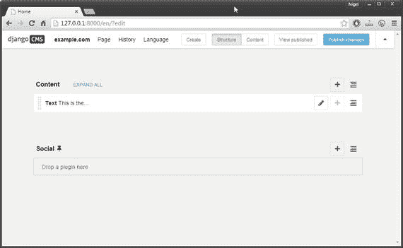

图 6-1。

An empty template in structural view

页面上的内容栏和社交栏与模板中同名的占位符相对应。这些是容器，您可以在其中放置任何想要添加到页面的插件。例如，我们的内容向导已经向内容占位符添加了一个文本插件。如果你查看底层的 HTML 代码(通过选择 View Source ),你会发现它们实际上只是 HTML divs。

每个容器的右侧都有一个上下文菜单。如果您点击加号(+)图标，屏幕中央将出现一个弹出覆盖图(图 6-2 )。列表中的每一项都是一个插件。在本章的剩余部分，我们将依次看看这些插件，你将学会如何使用它们为你的网站创建不同种类的内容。

图 6-2。

A placeholder context menu

## 默认插件

django CMS 安装了 11 个默认插件；它们共同提供了显示和格式化常见 web 内容(如文本、视频和音频、图像和文件)所需的所有基本功能。django CMS 项目团队和第三方提供了更多的 django CMS 插件，您可以通过复制和增强其中一个默认插件，或者从头开始构建自己的插件，轻松添加自己的定制插件。我们将在下一章讨论第三方插件，并在第八章中构建你自己的定制插件，但首先让我们更详细地看看默认插件。

Note

如果你已经使用了 django CMS 的早期版本，请注意占位符和插件不再从管理后端管理；现在，必须从结构视图的前端对它们进行管理。

### 安装默认插件

如果你已经遵循了第二章中的安装说明，这一步是不必要的，但是，如果你必须重新安装，或者想在自定义站点上使用它，了解如何安装默认插件是值得的。

安装一个默认插件非常简单；只需执行以下操作:

Install the plugin using `pip`.   Add it to your `INSTALLED_APPS` in `settings.py`.  

例如，您可以安装带有`pip install django-cms-file`的文件插件，并将`'djangocms_file',`添加到您的`INSTALLED_APPS`中，以便在您的应用中可用。

有关单独安装所有默认插件的说明，请参见 [`http://www.django-cms.org/en/addons/`](http://www.django-cms.org/en/addons/) 。

### 文本插件

如果你曾经使用过在线的、基于浏览器的文本编辑器，你会对这个文本插件很熟悉。如果您还没有，不要担心，因为它非常简单，工作起来就像一个简化的文字处理器。你会经常使用文本插件，肯定会比系统中的其他插件更多，所以真正理解它的工作原理是值得的。从下拉菜单中选择文本插件，一个如图 6-3 所示的窗口将会弹出到您的屏幕上。

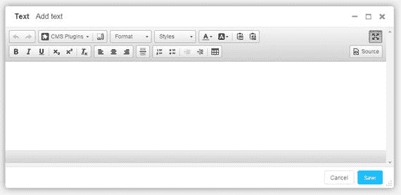

图 6-3。

The django CMS Text plugin

与文字处理器或高级 HTML 编辑器相比，编辑器的功能似乎很基本，但在网页内容创作中，越多不一定越好。表 6-1 列出了基本编辑器的每个功能。

表 6-1。

Django CMS Text Plugin Toolbar Functions

<colgroup><col> <col></colgroup> 
| 图标 | 功能 |
| --- | --- |
|  | 退回/重做 |
| 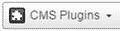 | 插入文件/链接/图片或视频。这些插件的行为与直接在页面上使用时完全一样。 |
| 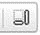 | 显示区块。在页面上显示 HTML 块的虚线轮廓。用于可视化布局和检测空 HTML 标签。 |
|  | 段落格式下拉列表。选项包括标题、普通文本和其他格式。 |
|  | 应用特殊的文本样式，如代码格式、删除的文本和引号。 |
|  | 选择文本前景色和背景色。 |
|  | 粘贴纯文本和从 Word 粘贴。后者清除微软工作格式化标签。 |
|  | 文本格式:粗体、斜体、下划线、下标和上标。 |
| 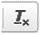 | 清除所选文本的格式。 |
| 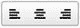 | 文本对齐方式:左对齐、居中对齐或右对齐。 |
|  | 插入一条水平线。 |
| 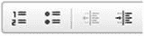 | 列表。编号，子弹。列表缩进和突出。 |
|  | 插入表格。这将打开另一个窗口，您可以在其中输入行、列和表格的宽度和高度信息。 |
|  | 直接编辑 HTML 源代码。 |

文本插件有一些限制——没有所见即所得的表格或嵌入插件(图像、文件和视频)的大小调整，任何高级 HTML 都需要直接编辑源代码。

实际上，这些问题并没有你想象的那么大。

对于初学者来说，在表中使用固定宽度的列几乎总是一件坏事，因为它们在小屏幕上不能正常缩放和流动；你永远不应该用表格来布局。通过切换到内容视图可以快速预览媒体文件，插件系统使布局变得非常简单。

要理解的最重要的概念是，你不需要用一个单独的文本插件来布局整个页面。这可能是刚接触 django CMS 的人犯的第一个错误；尤其是如果他们过去使用过其他的 CMSes。让我通过扩展我在本章开始时介绍的快速示例来说明。假设你有一个相当标准的页面:横幅在顶部，接下来是一些介绍性的文本，一个图像浮动在左侧或右侧，还有一些文本浮动在图像旁边并继续在下面。通常在这种情况下，是图像元素和横幅让页面作者摆弄 HTML 以使一切看起来正确。

在 django CMS 中，你可以在横幅上放一个图片插件，然后放一个介绍文字插件。在这下面，你可以使用一个多栏插件，拆分百分比宽度以适应图像，将图像放在一栏，文章文本放在另一栏。然后你用下面的另一个文本插件完成，它包含了文章的其余部分(这个例子中提到的附加插件将很快被完整解释)。

注意，这不是一个很好的例子；通常情况下，你不应该有任何问题的文字流动周围的图像为主要文章，所以你不会去这样一个精心布局，但它真的很重要的是要明白，你有这种灵活性，如果你有更高的布局要求。

最后，没有什么可以阻止你使用一个外部的 HTML 编辑器，将源代码直接粘贴到文本插件中。“从 Word 粘贴”按钮甚至允许您将 Word 用作 HTML 编辑器(但请不要这样做)。

### 链接插件

链接插件(图 6-4 )将链接插入页面内容。它也可以用来在文本插件和多栏插件中插入链接。有五种可用的链接类型—链接(URL)、链接到网站上的页面、链接到锚、电子邮件链接和电话链接。

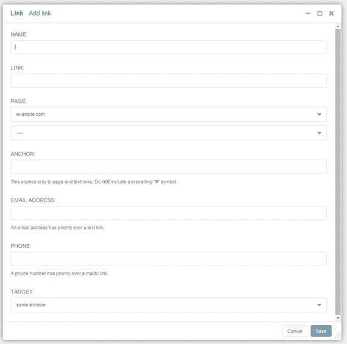

图 6-4。

The Link plugin Note

如果您输入多个链接，链接插件不会抛出错误，所以请确保您只填写了一个链接字段。

关于链接插件，有一些事情需要注意:

*   当您在链接字段中输入 URL 时，它必须带有`http://`或`http://`前缀，原始 URL 会导致错误。
*   您需要自己在页面中创建锚点，方法是选择 Edit Source 并输入`<a name="anchor_name" />`(用您的锚点名称替换`anchor_name`)。然后将锚点字段链接到您的锚点名称。有一个针对文本插件的黑客可以解决这个问题，但对于书中的这一点来说有点超前。我已经将它包含在附带的侧边栏中。
*   电话链接将插入一个`tel://`...链接到您的页面。根据您电脑或平板电脑上的软件，这可能会启动另一个应用。在智能手机上，它会简单地拨打电话号码。

Adding “Insert Anchor” to the text plugin

在源代码中添加锚点非常简单，适合大多数内容创建工作；然而，如果你发现你在你的页面中输入了很多锚点，那么在文本插件中添加它们的工具将会非常有用。

幸运的是，文本插件工具栏是基于一个名为 CKEditor 的 JavaScript HTML 编辑器。CKEditor 真正酷的地方是它已经有了一个插入锚点工具，我们要做的就是启用它。

打开您的`settings.py`,并将其添加到文件底部:

`CKEDITOR_SETTINGS = {`

`'toolbar':[`

`['Undo', 'Redo'],`

`['cmsplugins', '-', 'ShowBlocks'],`

`['Format', 'Styles'],`

`['TextColor', 'BGColor', '-', 'PasteText', 'PasteFromWord'],`

`['Maximize', ''],`

`'/',`

`['Bold', 'Italic', 'Underline', '-', 'Subscript', 'Superscript', '-', 'RemoveFormat'],`

`['JustifyLeft', 'JustifyCenter', 'JustifyRight'],`

`['HorizontalRule'],`

`['Anchor'],`

`['NumberedList', 'BulletedList', '-', 'Outdent', 'Indent', '-', 'Table'],`

`['Source']`

`],`

`}`

重新加载您的页面(您可能需要清空浏览器缓存并重启开发服务器)，您将在水平标尺按钮旁边看到一个漂亮的标志图标(也称为插入锚点工具)。

如果你喜欢冒险，你还可以做很多其他的事情来修改编辑器，但是一定要先备份你的文件！

### 图片插件

图片插件(图 6-5 )将图片插入你的页面。它也可以在文本插件和多栏插件中使用。图片插件不允许上传时调整图像大小，也不做任何自动缩略图转换；因此，在你上传之前，你的图片大小合适是很重要的。

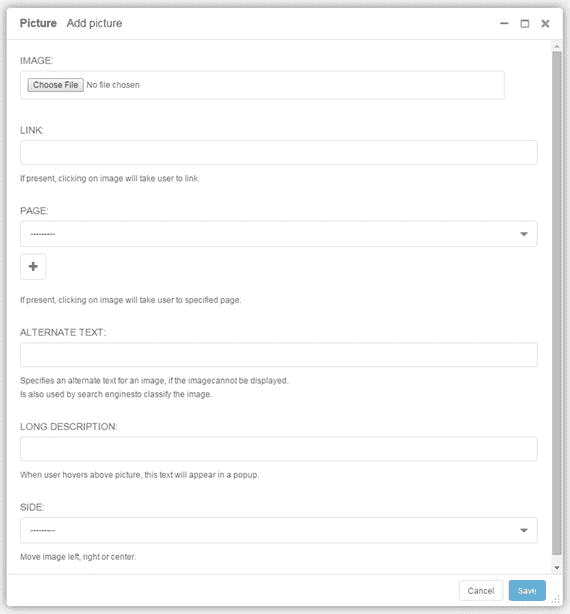

图 6-5。

The Picture plugin Tip

要创建一个缩略图，您可以点击它来显示全尺寸图像，将全尺寸图像保存到`myBlogProject\media\`，然后将链接:缩略图上的文本设置为`"../media/<full size image filename>`。我们稍后将安装一个插件，它可以帮助简化这个过程，但首先它有助于了解如何用默认设置实现这个结果。

### 文件插件

文件插件(图 6-6 )将文件插入你的页面。像图片插件一样，它也可以用在文本和多栏插件中。这是一个非常简单的工具——你只需要选择要上传的文件，并选择一个标题(这将被用作你的锚文本)。

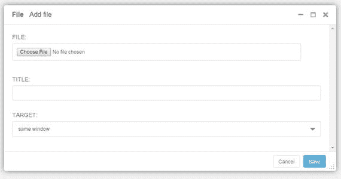

图 6-6。

The File plugin

文件插件只提供最基本的文件嵌入功能。对于您将定期嵌入文件的更复杂的站点，建议您安装并使用 Django-Filer 插件，这将在下一章中介绍。

### 视频插件

视频插件(图 6-7 )将视频嵌入你的页面。它也可以在文本和多列插件中使用。嵌入的视频可以是您网站上的文件，也可以是指向外部网站(如 YouTube 或 Vimeo)上的视频的嵌入链接。使用视频插件时，请记住以下几点:

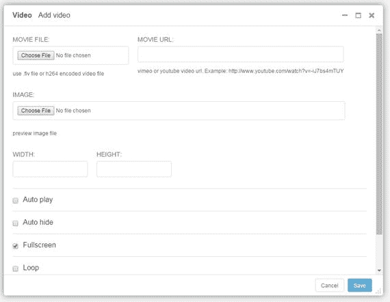

图 6-7。

The Video plugin

*   如果你想嵌入你自己的视频，你可能不得不使用编码来得到你想要的结果。一般来说，任何常见的视频容器(。avi，. mp4，. m4v，.mkv)将在使用 H.264 编解码器的情况下工作。如果遇到问题，网上有大量关于如何转码视频文件的信息。
*   宽度和高度是必填字段。如果您使用预览图像，请将这些设置为图像尺寸；如果您链接到外部视频，最好保持与原始视频相同的宽高比，例如 4:3 视频的宽高比为 400。
*   视频插件配置屏幕底部的“显示颜色”选项卡允许您为嵌入的视频自定义一系列颜色设置。

Tip

如果您想将自定义设置(包括颜色设置)应用到您网站上的所有视频，可以将它们添加到您的`settings.py`文件中。可用的设置如下:

`VIDEO_AUTOPLAY ((default: False)`

`VIDEO_AUTOHIDE (default: False)`

`VIDEO_FULLSCREEN (default: True)`

`VIDEO_LOOP (default: False)`

`VIDEO_AUTOPLAY (default: False)`

`VIDEO_BG_COLOR (default: "000000")`

`VIDEO_TEXT_COLOR (default: "FFFFFF")`

`VIDEO_SEEKBAR_COLOR (default: "13ABEC")`

`VIDEO_SEEKBARBG_COLOR (default: "333333")`

`VIDEO_LOADINGBAR_COLOR (default: "828282")`

`VIDEO_BUTTON_OUT_COLOR (default: "333333")`

`VIDEO_BUTTON_OVER_COLOR (default: "000000")`

`VIDEO_BUTTON_HIGHLIGHT_COLOR (default: "FFFFFF")`

### 多列插件

多列插件(图 6-8 )允许你以列的形式格式化你的页面内容。它不仅对多列文本有用；它是任何其他默认 django CMS 插件以及兼容的第三方和自定义插件的容器。你甚至可以嵌套多列插件。

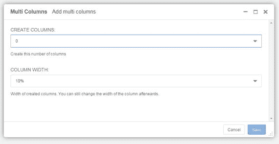

图 6-8。

Multi Columns plugin

使用多列插件非常简单——选择你想要的列数和默认的列宽。这两种设置以后都可以很容易地更改。

### 样式插件

样式插件(图 6-9 )允许你为放置在其中的页面元素添加自定义样式。例如，如果您想要将自定义样式应用到文本插件，您可以将文本插件放在样式插件中。

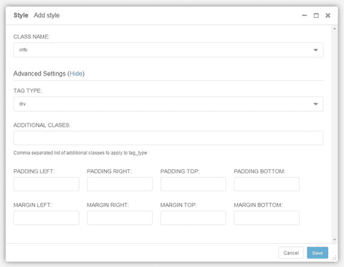

图 6-9。

The Style plugin

使用样式插件很简单；只需从列表中选择一个类名。这将把类名应用到 HTML div。然后在自定义 CSS 文件中设置样式格式。例如，如果您选择了`info`类，它将应用 CSS 文件中`.info`类的样式。

默认类没有什么特别的；通过修改您的`settings.py`文件，您可以添加更多的类或者完全替换它们。例如，要在下拉列表中添加一个新的类`mystyle`，请在设置中添加以下内容:

`CMS_STYLE_NAMES = (`

`('info', ("info")),`

`('new', ("new")),`

`('hint', ("hint")),`

`('mystyle', ("mystyle")),`

`)`

还有许多高级设置可以添加到样式插件中，包括:

*   使用 HTML 5 文章或章节标签代替默认的 div 标签
*   应用附加类
*   设置填充和边距

Tip

您可以将引导程序类添加到附加类列表中。如果你想应用 Bootstrap 上下文类(比如。`warning`，或。`danger`)到内容。

### 预告插件

预告插件(图 6-10 )显示一个图像，上面有一个标题，下面有一个纯文本块。它最好用在多列标签中，使它在页面文本中左右浮动，但是像 django CMS 中的其他东西一样，它的用途只受你的想象力的限制。

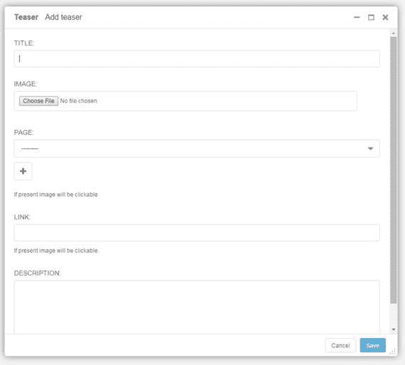

图 6-10。

The Teaser plugin

因为描述是纯文本，并且将呈现与你的正文相同的内容，所以将你的预告插件封装在一个样式插件中，以对预告应用自定义样式也是值得的。

### Flash 插件

Flash 插件(图 6-11 )是另一个非常简单的插件——只需选择你的 Flash (swf)文件并指定宽度和高度。

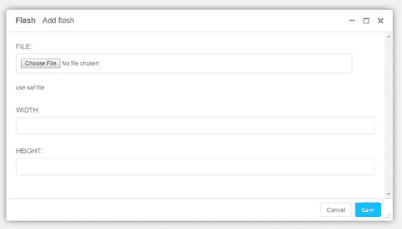

图 6-11。

The Flash plugin Warning

因为我们正在做一个手机友好的网站，应该注意到 Flash 文件在几个平台上有很多兼容性问题。一般的建议是不要使用 Flash，除非你有非常好的理由这样做。

### 谷歌地图插件

谷歌地图插件(图 6-12 )在你的页面中嵌入了谷歌地图。设置很简单；但是，有几件事需要注意:

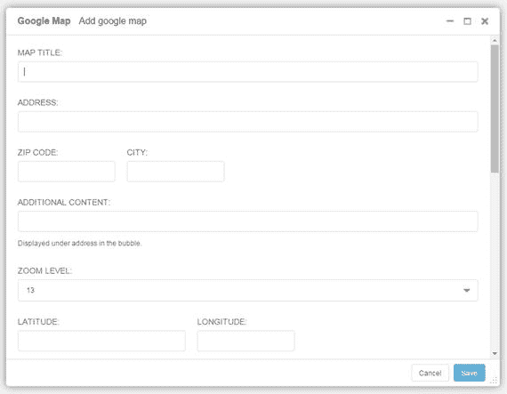

图 6-12。

The Google Map plugin

*   在美国之外，通过在 City:字段中输入`<city>, <state/province>, <country>`,您将更有可能显示正确的地图参考。
*   纬度和经度设置不是直接的地图参考；它们用于微调地图图钉的确切位置。

### 创建别名插件

创建别名插件为所选插件创建一个别名，这允许它在你的网站的任何页面上使用，并且对别名插件的一个实例的任何更新将自动应用到所有其他实例。它不是被设计成单独使用的，而是作为一种将插件复制到你的站点的多个页面上的方式，并且当插件内容改变时，插件内容会自动更新。图 6-13a 和 6-13b 说明了别名过程。

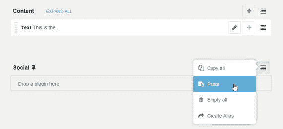

图 6-13(b)。

Adding the aliased plugin to a page

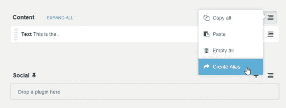

图 6-13(a)。

Copying a plugin with Create Alias

在图 6-13a 中，我已经使用 Create Alias 为页面上的文本插件创建了一个别名。

创建插件的链接副本就像将别名粘贴到页面上的占位符或插件中一样简单，如图 6-13b 所示。请注意，出于演示的目的，我粘贴到了同一页面上；在一个真实的网站中，你可以把它粘贴到另一个页面上。

## 摘要

在这一章中，我们简要地看了 django CMS 中内置插件提供的功能。我们将在第八章中使用这些插件。

在下一章，我们将通过添加一些其他开发者为 django CMS 开发的优秀插件来增加基本插件的功能。