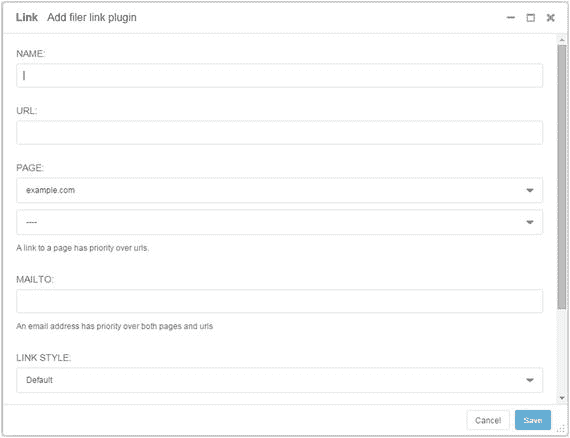

# 七、高级插件

在前一章中，我们介绍了 django CMS 预装的所有默认插件。对于内容不经常变化的简单网站，这些对于创建和管理网站来说已经足够了。

然而，一旦你有了一个内容更复杂的网站，并且需要更经常地发布和更新内容，有许多第三方插件可以让你更容易地在 django CMS 网站上创建和管理内容。

本章介绍了一些扩展和增强 django CMS 插件功能的第三方应用程序。在下一章中，我们将开始使用它们来为你的博客站点构建内容。

## 简易缩略图

如果您还记得上一章，为了用默认的图像插件创建缩略图，您必须手动调整源图像的大小来创建缩略图，然后链接到源图像以获得全分辨率视图。

因为这是 CMS 中非常常见的任务，所以已经开发了许多用于创建缩略图的应用程序；轻松缩略图就是这样一个应用。最初是为 Django 创建的，Easy Thumbnails 也可以很好地与 django CMS 配合使用。它是为动态创建缩略图而设计的——根据一个简单的模板，为您放在页面中的图像自动创建缩略图。

Note

简易缩略图最适合不需要复杂媒体处理的小型网站。如果你的网站更复杂，你最好使用 CMSplugin-filer，它有简单的缩略图。CMSplugin filer 的最新版本可以从 [`https://github.com/stefanfoulis/cmsplugin-filer`](https://github.com/stefanfoulis/cmsplugin-filer) 下载。

要使用简易缩略图，您必须首先使用`pip`安装它:

`$ pip install easy-thumbnails`

一旦安装了简易缩略图，我们需要将它添加到我们的项目中。首先，将它添加到您在`settings.py`中安装的应用程序中:

`INSTALLED_APPS = (`

`...`

`'easy_thumbnails',`

`)`

然后运行`migrate`命令将必要的表添加到您的项目中:

`$ python manage.py migrate easy_thumbnails`

一旦 Easy Thumbnails 安装到您的项目中，它就需要一个模板文件来正确地调整图像大小并创建缩略图文件。清单 [7-1](#FPar2) 中显示了一个简单的模板文件。要在您的项目中启用模板，请将文件命名为`picture.html`，并将其保存到`\myBlog\templates\cms\plugins`。(你需要在你的`templates`目录下创建新的文件夹。)

Listing 7-1\. The Easy Thumbnails Template File (`picture.html`)

``

`<a href="{{ link }}">`

``

``

``

``

``

``

``

`</a>`

这个模板非常简单。要查看它在做什么，让我们来看一下代码:

*   我们首先需要用``将自定义缩略图标签加载到模板中。
*   外部的`if/else`语句根据 django CMS 页面模板中的占位符选择正确的缩略图大小。我们在第二章的[中创建了`content`占位符。注意，为了实际工作，您需要修改您的基础(或子模板)来包含`authorbio`占位符。](02.html)
*   缩略图创建魔术由``标签执行。它设置缩略图的大小，在作者头像的情况下，裁剪图像。
*   如果有链接附加到图像，附加的`if/else`标签创建一个锚点，如果这些元素存在，为图像创建`alt`和`title`标签。

关于配置简易缩略图的最后一点说明。如果你打算重复使用你的应用，或者想要保持整个网站的一致性和灵活性，使用别名比硬编码缩略图大小更好，例如，通过将以下内容添加到你的`settings.py`:

`THUMBNAIL_ALIASES = {`

`'': {`

`'avatar': {'size': (50, 50), 'crop': True},`

`},`

`}`

还要修改您的模板，以便:

`1](#Fn1) 。

## CMSplugin 文件

CMSplugin-filer 将 Django 的文件管理器 Django-filer 添加到 django CMS 中。它提供了许多您期望从文件管理应用程序中获得的功能:

*   创建、重命名和删除文件夹。
*   上传、重命名和删除任何类型的文件(尽管您很可能只管理常见的媒体文件，如图像、视频、PDF 和文档文件。
*   整理服务器上的媒体文件。
*   应用文件权限和安全下载(编写本文时的实验特性)。

要安装 CMSplugin-filer，我们首先用`pip`安装应用程序文件:

`pip install cmsplugin-filer`

为了确保 CMSplugin-filer 安装正确，我们必须首先将 Django-filer 添加到我们的项目中。将以下内容添加到您的`settings.py`:

`INSTALLED_APPS = (`

`. . .`

`'filer',`

`'easy_thumbnails',`

`)`

然后，您需要将应用程序表安装到项目中。为此，运行两个命令:

`python manage.py makemigrations`

`python manage.py migrate`

第一个命令确保我们所有的迁移同步，第二个命令执行实际的迁移。现在是安装 CMSplugin-filer 应用程序文件的时候了。首先，我们必须对`settings.py`进行一些更改:

`INSTALLED_APPS = (`

`. . .`

`'cmsplugin_filer_file',`

`'cmsplugin_filer_folder',`

`'cmsplugin_filer_link',`

`'cmsplugin_filer_image',`

`'cmsplugin_filer_teaser',`

`'cmsplugin_filer_video',`

`)`

`. . .`

`MIGRATION_MODULES = {`

`. . .`

`'cmsplugin_filer_file': 'cmsplugin_filer_file.migrations_django',`

`'cmsplugin_filer_folder': 'cmsplugin_filer_folder.migrations_django',`

`'cmsplugin_filer_link': 'cmsplugin_filer_link.migrations_django',`

`'cmsplugin_filer_image': 'cmsplugin_filer_image.migrations_django',`

`'cmsplugin_filer_teaser': 'cmsplugin_filer_teaser.migrations_django',`

`'cmsplugin_filer_video': 'cmsplugin_filer_video.migrations_django'`

`}`

然后我们只需要再次运行`migrate`来确保我们已经将所有必要的表添加到项目中:

`python manage.py migrate`

如果安装成功，您将有六个新的插件选项添加到您的页面结构编辑器中(图 [7-1](#Fig1) ):

*   文件*
*   文件夹
*   图像*
*   链接*
*   戏弄者
*   视频*

图 7-1。

Plugins added by CMSplugin-filer

*这些插件也被添加到文本插件中。

顺便说一下，一旦你安装了 CMSplugin-filer，你就不太可能再使用相应的默认插件了。为了减少插件下拉列表中的选项数量，你只需要删除重复的选项。您可以通过注释掉您的`settings.py`中的重复项来轻松做到这一点:

`INSTALLED_APPS = (`

`. . .`

`'djangocms_column',`

`#'djangocms_file',`

`'djangocms_flash',`

`'djangocms_googlemap',`

`'djangocms_inherit',`

`#'djangocms_link',`

`#'djangocms_picture',`

`#'djangocms_teaser',`

`#'djangocms_video',`

`. . .`

`)`

我们将在下一章的实际例子中使用每个文件管理器插件。为了便于参考，下面提供了每个插件的介绍。我们将从文件管理器开始，它是所有插件共有的，然后依次讨论每个插件。

### 文件管理器

所有六个新的 CMSplugin-filer 插件的共同点是文件管理器(图 [7-2](#Fig2) )。通过点击搜索图标()从每个插件中打开文件管理器。要选择一个文件，单击您想要插入的文件旁边的选择图标()。

图 7-2。

The CMSplugin-filer file manager

使用文件管理器，您有以下选择:

*   新文件夹。在选定文件夹下添加新文件夹。在本例中，我添加了一个名为`siteimages`的新文件夹。
*   上传。允许您将新文件从您的计算机上传到选定的文件夹。当您第一次上传文件时，它会被添加到屏幕右侧的剪贴板中，您可以将它添加到当前目录中，如果您改变主意，也可以放弃上传。
*   搜索。在所有文件夹中搜索文件。
*   改变。允许您更改文件属性和元数据。可用选项取决于上传的文件类型。当我们查看单个插件时，您将了解更多关于更改选项的信息。

Note

CMSplugin-filer 安装了完整的 Django-filer 应用程序，它提供了一个有效的媒体管理器，不仅可以从前端(如这些示例中所示)访问，还可以通过管理后端访问。我们将在下一章讨论更多的管理后端。

### 文件插件

filer 文件插件很简单(图[7-3](#Fig3))；只需输入您的标题(这将成为文件锚文本)和您想要嵌入的文件。

图 7-3。

The CMSplugin-filer File plugin

### 文件夹插件

文件夹插件(图 [7-4](#Fig4) )将文件夹的内容呈现为项目符号列表或幻灯片。它对于创建图像幻灯片非常有用；然而，它也是一个在网页上列出目录内容的方便工具。

图 7-4。

The Folder plugin

文件夹插件的配置很简单；只需为插件输入一个标题，并选择您希望附加的文件夹。如果您选择“列表”风格，文件夹中的每个文件将作为链接到您的文件的锚列在您的页面上，如果您选择“幻灯片”风格，文件夹中的所有图像将显示为幻灯片。

### 图像插件

CMSplugin-filer 中的图片插件(图 [7-5](#Fig5) )对基本图片插件进行了大量增强。可以通过文件管理器添加图像，也可以使用备选图像 URL 字段直接链接图像。您还可以添加标题以及常用的替代文本。

图 7-5。

The Image plugin

图像插件还提供图像缩放选项和高级链接(图 [7-6](#Fig6) )。图像缩放和链接选项非常简单。需要注意的事项:

图 7-6。

Additional options for the Image plugin

*   使用原始图像。这将覆盖所有其他设置，并且只显示图像而不调整大小。
*   宽度/高度。您可以指定宽度或高度来获得成比例的大小，但是要进行裁剪，您必须同时指定两者。
*   高档。简单地调整图像大小，无需任何重采样。请注意，如果放大，小图像的质量可能会很低。
*   缩略图选项。允许应用预定义的缩略图大小设置。单击绿色加号(+)添加新设置。您添加的任何新设置将适用于所有图像。
*   使用自动缩放。允许图像插件尝试根据上下文缩放图像。请注意，根据图像所在的占位符，图像的缩放比例会有所不同。
*   图像对齐。不对图像应用任何样式，只是一个 HTML 类。您可以在一个定制的 CSS 文件中提供样式(在我们的例子中是`blog.css`)。
*   链接原始图像。打开全尺寸图像。
*   描述。django CMS 将把你放在这个字段中的任何内容作为文本呈现在一个`span`标签中。应用样式由您决定(参见随附的注释)。

Note

图像标题和描述是以 HTML `span`标签的形式添加的，因此它们将与图像内联呈现，而不是像您所期望的那样位于图像下方。幸运的是，这很容易解决。django CMS 将类应用于图像标题和描述(分别是`title`和`desc`)。将这些类添加到您的`blog.css`文件中，以在图像下方显示标题和描述:

`.title, .desc {`

`display: block;`

`}`

### 链接插件

CMSplugin-filer 链接插件(图 [7-7](#Fig7) )与基本链接插件非常相似，唯一的主要区别是增加了文件管理器。名称字段是锚文本，您可以选择直接链接(URL)、页面、邮件和文件链接。与基本版本一样，如果您填写多个链接字段，这个链接插件不会抛出错误，因此请确保您只在您想要的字段中输入信息。

图 7-7。

The Link plugin

### 预告插件

CMSplugin-filer 中的 Teaser 插件(图 [7-8](#Fig8) )的功能也与其基本版本非常相似，只是在“更多”链接下增加了文件管理器和图像大小调整选项。

图 7-8。

The Teaser plugin Note

标题呈现为 HTML `H2`标签，描述呈现为基本段落(`p`标签),没有默认的 HTML 类，所以建议将 CMSplugin-filer Teaser 插件放在 Style 插件中，就像基本版本一样。

### 视频插件

视频插件的 CMSplugin-filer 版本(图 [7-9](#Fig9) )与基本版本相同，除了增加了文件管理器和默认大小 320×240。

图 7-9。

The Video plugin

## djangocms-表单

djangocms-forms 是由 Mishbah Razzaque 创建的 djangocms 的第三方表单插件。它提供了你需要的所有表单域，以及添加 CAPTCHA 来过滤垃圾邮件和在数据库中保存表单提交的能力；所有这些都不需要编写一行代码。要在我们的项目中使用 djangocms-forms，首先我们需要安装它:

`pip install djangocms-` `forms`

然后我们需要把`djangocms_forms`加到`INSTALLED_APPS`上:

`INSTALLED_APPS = (`

`...`

`'djangocms_forms',`

`...`

`)`

最后，我们同步数据库:

`python manage.py migrate`

Tip

到目前为止，我们已经一次安装了一个插件。这可能是一个很好的时机来注意所有你希望包含在你的网站中的插件(和应用程序)可以使用一个需求文件一次安装。因为需求文件是 pip 的一个特性，而不是 django CMS 的，所以我不会在这里深入讨论，但是如果你有兴趣，可以看看 [`https://pip.readthedocs.org/en/1.1/requirements.html`](https://pip.readthedocs.org/en/1.1/requirements.html) 。

为了在我们的应用程序中使用 djangocms-forms 插件，我们需要将它挂接到我们的项目中。首先，我们需要将表单 URL 添加到项目中。打开`\myblog\urls.py`并将以下内容添加到您的`urlpatterns`中:

`urlpatterns = patterns(`

`...`

`url(r'^', include('djangocms_forms.urls')),`

`...`

`)`

然后，你应该能够通过进入➤高级设置➤应用程序页面并从下拉列表中选择表单，将表单插件挂入你的页面。如果表单选项没有出现在下拉列表中，您可能需要重新启动开发服务器。

保存页面设置，现在当你编辑你的页面时，你将会看到通用下的表单选项。选择插件，你应该会看到一个类似图 [7-10](#Fig10) 的弹出窗口。

图 7-10。

The Djangocms-forms plugin (partial)

不要被所有可能的选择吓倒；创建一个详细的表单实际上非常容易，但是首先我们必须注意一件事。

因为我们正在开发中，我们没有设置我们的电子邮件，所以我们不能测试表单。幸运的是，Django 提供了一个基于文件的电子邮件后端，专门用于帮助开发人员测试电子邮件，而无需首先配置电子邮件服务器。要让我们的电子邮件后端运行，请在您的`settings.py`末尾添加以下内容:

`EMAIL_BACKEND = 'django.core.mail.backends.filebased.EmailBackend'`

`EMAIL_FILE_PATH = '/Users/<your username>/maildump'`

您不需要创建`maildump`文件夹；Django 会在你第一次尝试发送电子邮件时帮你完成。当你尝试发送电子邮件时，你会发现这个文件夹中包含一些名为`20151009-100625-98201520.log`的文件。在这个日志文件中是您的完整消息，包括所有邮件头和错误消息。非常便于测试。

### 创建表单

图 [7-10](#Fig10) 显示了创建表单时弹出窗口的局部视图。配置屏幕很长，但所有字段都很简单:

*   表单名称。表单名称将显示在您网站的管理后端，这样您就可以知道提交了哪个表单。下一节将详细介绍表单管理。
*   标题。这是将在您的页面中显示的标题。
*   描述。这将显示在您页面的标题下。您可以在这里使用 HTML 标签来格式化您的代码。
*   提交按钮文本。默认为“提交”，但您可以更改。
*   发布提交消息。用户提交表单后将在页面上显示的消息。您可以在这里使用 HTML 标签来格式化您的代码。提示:在这里使用 Bootstrap 类`alert alert-success`来获得一个非常格式化的成功框。
*   重定向？如果您希望在提交表单后重定向用户，请选择一个目标。
*   提交设置。设置收件人、发件人和电子邮件主题。还允许您设置验证码。参见 [`https://github.com/mishbahr/djangocms-forms`](https://github.com/mishbahr/djangocms-forms) 了解更多关于在 djangocms-forms 中使用验证码的信息。

### 添加表单域

添加表单字段非常简单，只需单击表单创建弹出窗口底部的绿色加号(+)图标。这将扩展窗口，显示类似于图 [7-11](#Fig11) 的配置屏幕。

图 7-11。

Adding form fields

字段编辑器有以下选项:

*   名字。将显示在表单中字段的左侧。
*   字段类型。字段的数据类型。可用选项包括:
    *   文本、文本区域、电子邮件、号码、电话、URL、复选框、多选框、下拉列表、单选、文件上传、日期、时间、密码和隐藏。
    *   Djangocms-form 为所有相关字段(如电子邮件和号码)提供自动验证。如果所有标记为“必填”的字段为空，也会引发错误。
*   默认值。设置预填充值。请注意，这将覆盖您在占位符文本中输入的任何内容。
*   占位符文本。字段中的灰色提示文本。在大多数现代 web 表单中，这是用来代替工具提示的。
*   描述。将出现在字段正下方的字段的简短描述。

### 表单管理

配置表单时选择“保存到数据库”会将所有表单域保存到您的项目数据库中。如果您导航到根(`example.com`)管理，从侧边栏中选择表单提交，并扩展到全屏，您将看到一个类似图 [7-12](#Fig12) 的窗口。

图 7-12。

Form Submissions in the Admin tool

“表单提交”窗口允许您删除提交的表单，以及将所有提交的表单导出到外部文件。可用的格式有 CSV、JSON、YAML 和 Microsoft Excel。对于导出表单数据用于外部程序，甚至导入邮件列表管理器非常有用。

## 摘要

本章我们只讨论了三个插件，Easy Thumbnails，CMSplugin-filer 和 Djangocms-forms；django CMS 有这么多可用的插件，每周都有更多的插件被添加进来，以至于没有足够的空间来涵盖它们。

如果你想自己探索 django CMS 可用的全部插件，一个好的起点是 django CMS 项目网站: [`http://www.django-cms.org/en/addons/`](http://www.django-cms.org/en/addons/) `.`

在下一章中，我们将把这三个插件，连同第六章的基本插件一起，很好地用于为我们的站点创建一些内容。

Footnotes [1](#Fn1_source)

[T2`http://easy-thumbnails.readthedocs.org/en/2.1/`](http://easy-thumbnails.readthedocs.org/en/2.1/)