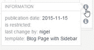
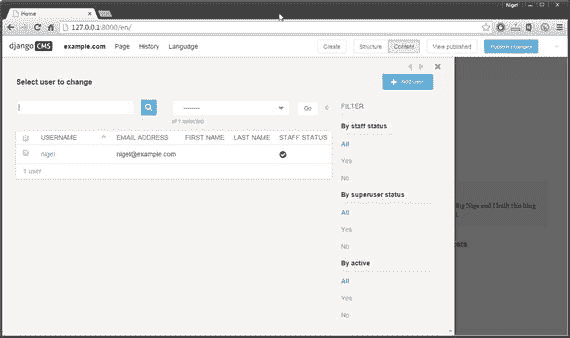
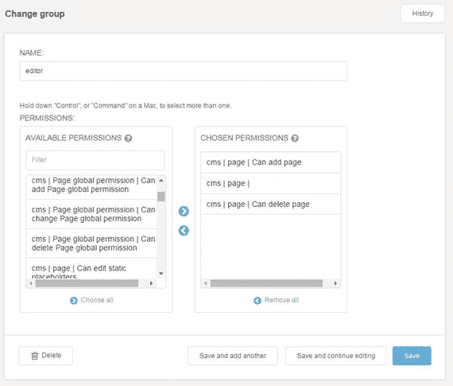

# 八、在 django CMS 中创作

在前七章中，我们着重于设计我们的网站模板和探索 django CMS 的功能。在这一章中，我们将会把我们所学到的应用到实践中，为你的观众创造你的网站中最重要的部分:内容。

凭借前端编辑和灵活的插件架构，django CMS 为管理员和网站内容创建者提供了强大的内容格式化和编辑功能。

本章首先概述了 django CMS 工具栏及其功能。然后，我们将使用 django CMS 的内置插件，以及我们在上一章探讨的第三方插件，为您的网站创建三个页面——主页、关于页面和联系页面。一旦你的博客应用开始运行，我们还会为你创建一些博客文章，供你在后面的章节中使用。

在本章的后面，我们将详细探讨网站管理；特别是，我们将深入挖掘 Django 的`auth.user`模型，并将设置用户组和权限，这样我们的网站就像一个专业的 CMS——拥有适当的用户、作者、编辑和管理员角色以及仅限会员的内容。

## django CMS 工具栏

django CMS 工具栏提供了对站点创作中所有重要功能的访问。

### 网站根目录(example.com)

网站的根菜单(图 8-1 )提供了页面和用户管理的快速链接，以及完整管理后端的链接。如果您没有在管理界面中更改默认的站点描述，它将被称为`example.com`。我将在本章的后面告诉你如何改变这一点。

图 8-1。

The django CMS root menu

这些菜单选项仅对拥有完全管理权限的用户可用。我们将在本章后面介绍管理功能。根菜单还允许任何注册用户(不仅仅是管理员)修改用户设置，包括管理界面中的默认语言，以及禁用工具栏。后者对于预览没有工具栏的网站很有用。

根菜单还提供对 django CMS 剪贴板的访问，剪贴板将包含最新复制的插件或最后创建的插件别名。

Tip

要重新启用工具栏，请返回编辑模式(`/?edit`)。

### 页

页面菜单(图 8-2 )提供对 django CMS 中所有页面管理功能的访问。

图 8-2。

The django CMS Page menu

### 添加页面

向 django CMS 添加页面有三个选项:

*   新页面
*   新建子页面
*   复制此页

这些选项的页面设置是相同的，并通过弹出覆盖图进行设置(图 8-3 )。子页被添加到浏览器中当前选定的页面下；但是，这很容易更改(请参阅本章后面的页面管理部分)。所有这些设置都是不言自明的，添加页面应该没有问题。不要担心在这个阶段试图理解页面类型，因为我们很快就会讨论它。

图 8-3。

Adding new pages

django CMS 提供了开箱即用的基本页面设置集合；然而，页面模型是可扩展的。您将在第十章中学习如何扩展页面模型和添加额外的字段。

### 页面设置

页面设置菜单项提供与图 8-3 相同的设置。

### 模板

为页面选择一个模板。如果你遵循了第四章的说明，你应该有两个选择:页面和带侧边栏的博客页面。

### 高级设置

高级设置菜单允许您设置和修改许多高级页面设置(图 8-4 )。

*   覆盖 URL。用页面的自定义 URL 替换系统生成的 URL。
*   重定向。用于将旧页面重定向到新的 URL。也可用于重定向到外部 URL。
*   模板。与在页面设置中更改页面模板的效果相同。
*   身份证。这是一个超出本书范围的高级选项。它用于高级内部链接的模板标签中。
*   软根。在此页面创建软根。用于创建子菜单；当附加到菜单时，被检查为软根的页面将不显示任何祖先。下一章将详细介绍菜单。
*   附菜单。附加到此页面的自定义菜单。下一章将详细介绍菜单。
*   申请。向 Django 应用提供 apphook。你将在第十章中了解 apphooks。
*   x 框架选项。设置页面是否可以嵌入到另一个页面中。用于防止您的网页在其他网站中被非法陷害。

图 8-4。

Page advanced settings

### 许可

可以通过权限菜单修改单个页面的权限(图 8-5 )。与全局用户和组权限相比，页面权限提供了更细粒度的页面控制。

图 8-5。

Page permissions

使用页面权限，您可以:

*   要求用户登录才能访问该页面。
*   隐藏菜单导航中的页面，只为特定用户显示菜单中的页面链接。
*   限制某些用户和组查看该页面。
*   添加或删除特定用户和组的页面编辑权限。

### 出版日期

发布日期菜单选项(图 8-6 )允许您设置页面发布的日期范围。可以为只在有限时间内显示的页面设置结束日期。

图 8-6。

Page publishing dates

### 在导航中隐藏

如果您不想在顶部菜单导航中显示页面，请选择此选项。

### 发布/取消发布页面

从出版物中发布或删除以前发布的页面。未发布的页面仅对编辑和管理员可见，并且不再出现在普通用户的导航菜单中。

### 删除页面

从 CMS 中删除页面。删除的页面可以在页面管理界面中恢复(请参阅本章后面的内容)。

### 另存为页面类型

页面类型是为特定类型的内容创建通用布局的非常有用的工具。例如，您可能有一个产品评论网站，其中每篇文章都有一张图片、一个摘要、详细信息，还可能有一个表格或选项卡来显示规格和建议。由于这种布局在您的网站上的所有产品评论中是通用的，但在一般的网站上不是通用的，所以您不希望修改网站模板。

将您的第一篇产品评论保存为页面类型可让您在所有产品评论中重复使用该格式。同样的原则也适用于您站点上任何想要复制格式或内容的内容。页面类型的另一个用途是在每篇文章的末尾有一个作者简介，在这里你不需要开发一个定制的插件。

请注意，当您第一次创建网站时，页面类型下拉列表是空的；没有默认的页面类型，您需要自己定义。

### 历史

django CMS 保留了对每个页面所做更改的详细历史记录。完整的页面历史可通过历史菜单访问(图 8-7 )。

图 8-7。

The History menu

History 菜单非常简单:有一个选项可以撤销当前的更改，也可以恢复到 live 版本，这将清除所有更改，恢复到当前发布的版本。

Caution

“恢复到实时”还会清除页面的所有已保存草稿。

查看历史将显示一个页面的完整历史(图 8-8 )。选择修订日期将为您提供恢复到所选修订的选项。

图 8-8。

Full page history

### 工具栏按钮

django CMS 工具栏的最后一个功能是工具栏按钮。这些按钮是上下文相关的，因此对于未发布的页面，工具栏看起来如图 8-9a ，而对于之前发布的页面，它看起来如图 8-9b 。“结构”和“内容”按钮提供了在编辑页面结构和编辑内容之间的轻松切换,“查看发布的”将从页面的草稿版本切换到当前发布的版本,“发布更改”就是这样做的:将当前页面发布到您的站点，以便所有用户都可以看到它(取决于页面权限)。

图 8-9b。

The toolbar buttons for an unpublished page

图 8-9a。

The toolbar buttons for an unpublished page

一旦你开始编辑，django CMS 会自动保存任何页面的草稿。这对于对页面进行较大的更改，或者当其他用户必须在发布更改之前批准更改时特别有用，因为在发布之前，除了编辑和管理员之外，其他所有人都看不到任何更改。这是对 WordPress 等 CMSes 的一大改进，在 WordPress 中，一旦页面发布，你就不能保存页面的编辑草稿。

Create 按钮启动 django CMS 内容创建向导。在默认安装中，可用的向导用于创建页面和子页面。它们的功能与页面创建工具栏选项的功能相同。

Note

django CMS 内容创建向导是 3.2 版的新增功能。可以使用类似于菜单和 apphooks 的注册过程将你自己的向导添加到 django CMS 中。向导超出了本书的范围，但是如果您想探索如何创建它们，请参见:

[`http://docs.django-cms.org/en/develop/how_to/wizards.html`](http://docs.django-cms.org/en/develop/how_to/wizards.html)

## 向您的网站添加内容

既然您已经了解了所有可用的不同插件并探索了工具栏，那么是时候将您的新知识付诸实践了。为了让你能够完成剩下的章节，你的网站需要一些内容，所以在这一部分我给你设置了一个练习。

Exercise: Creating your site content

这个练习的目的是让你使用前两章中的所有插件，不仅是为了学习如何使用插件来创建真实的内容，还因为我们需要网站中的一些内容，这样我们就可以完成书中的剩余章节。

我已经提供了完整的示例网站作为本书源代码的一部分；但是，强烈建议您仅使用 if 作为参考，因为您将通过自己创建页面学到最多的东西。

在本练习中，我们将创建商业网站上最常见的三个页面:

*   主页
*   “关于我们”页面
*   联系页面

我们还将创建两个页面，稍后将成为博客帖子。我们现在要创建它们，这样当我们在下一章创建边菜单时，你就有东西可以在你的网站上显示了。

阶段 1:创建主页

Add a new page to your site and call it Home.   Switch to structure view and add an Image plugin to the content placeholder. Upload an image of your choice. For a challenge, you might want to try a Folder plugin instead and create an image slider to show several banner images, just like many popular websites.   Add a Text plugin to the page and enter a couple of introductory paragraphs.   Add a Multi Columns plugin with two columns set to 50%.   In the first column, add a Style plugin and then a Teaser plugin. Add some styles to format the teaser description. In the second column add another Text plugin and some text.   Add a final Text plugin and some closing text for the page.  

保存并发布页面。我在图 8-10 中包含了一个主页样本。请注意，您的页面不必看起来完全像这样；重要的是练习使用插件。

图 8-10。

A sample home page

阶段 2:创建“关于我们”页面

Add a new page to your site and call it About.   Insert a single Text plugin and then insert all the content into the Text plugin. I suggest you add another image and a video and maybe a table—I’ll leave the details up to your imagination.  

保存并发布页面。图 8-11 显示了这个页面可能的样子。

图 8-11。

A sample about page

阶段 3:创建联系人页面

Add a new page to your site and call it Contact   Add a Form plugin to the content placeholder.   At a minimum, your form should contain:

*   文本字段类型的名称字段
*   电子邮件类型的电子邮件字段
*   textarea 类型的消息字段

如果您想创建一个更高级的表单，您可以添加单选按钮或组合框来询问站点访问者他们第一次在哪里听说您的公司，并添加一个复选框来给访问者发送表单的机会。

保存并发布页面。图 8-12 展示了你的联系方式。如您所见，它非常简单，格式也很简单。作为进一步的练习，添加一个样式插件，并对表单应用一些样式，使其看起来更专业。请记住，您必须将表单插件拖到结构编辑器的样式插件中，以便将新样式应用到表单中。

图 8-12。

A sample contact page

阶段 4:创建博客文章

使用部分或全部插件，创建另外两个名为“blogpost1”和“blogpost2”的页面然后选择页面➤隐藏在导航中，使这些页面不显示在顶部菜单中，并发布每个页面。我们将在下一章把这些页面链接到侧边菜单，稍后，一旦你学会了如何扩展页面模型，我们将创建一个名为“博客”的页面类别，以便在我们的侧边菜单和最新的文章页面上显示它们和任何后续的博客文章。

这就是目前的内容创作。接下来，我们将探讨如何管理 django CMS 网站。

## django CMS 管理局

django CMS 管理界面通过根菜单(图 8-1 )选择 example.com➤管理进入。默认的管理仪表板如图 8-13 所示。根据您安装的第三方插件，您的管理仪表板可能会有所不同。

图 8-13。

Default administration dashboard (shown maximized)

如果您以前使用过 Django，您应该对此很熟悉:显示了标准的 Django 身份验证和授权以及站点面板，以及一个用于 django CMS 功能的自定义面板。在管理界面中执行的三个最常见的管理任务是:

Adding, editing and deleting pages   Changing user permission settings   Modifying user and group authentication and authorization settings   Tip

如果你想把你的根菜单标题从`example.com`改成类似于`My Blog`的标题，去站点，选择`example.com`链接，把显示名称改成一个新标题。当您刷新页面时，工具栏根将从 example.com 更改为您的新标题。

### 页面管理

django CMS 页面管理界面如图 8-14 所示。可从 django CMS ➤页面下的管理仪表板或通过工具栏根(`example.com` ) ➤页面访问。图 8-14 显示了在你完成之前的练习后，你的页面管理界面会是什么样子。如果您已经跳到前面，页面列表将是空白的。

图 8-14。

django CMS page administration

可以从页面管理界面执行许多页面管理功能:

*   通过右上角的按钮添加新页面和恢复删除的页面。
*   Reorder pages in the menu hierarchy by selecting the drag handle ( ) and dragging the page to the desired location.

    

    ) and dragging the page to the desired location.
*   The toolbar on the right of the page listing provides some handy page management tools. Table 8-1 details each of the available tools.

    表 8-1。

    Page Administration Page Tools

    <colgroup><col> <col></colgroup> 
    | 工具 | 功能 |
    | --- | --- |
    |  | 根图标。如果页面是根页面，则显示。 |
    |  | 查看页面。选择以使此页面成为当前页面。 |
    |  | 已发布图标。如果页面已发布，则为绿色；如果页面有未发布的更改，则为蓝色；如果页面未发布，则为灰色。可以通过选择图标进行切换。 |
    |  | 在菜单图标中。已检查页面是否在顶部导航菜单中。通过选择图标可以直接切换该设置。 |
    |  | 编辑页面属性。编辑页面设置。您也可以按住 Shift 键选择以访问高级设置。请注意，您不能从管理员那里编辑页面内容或结构，只能编辑设置。 |
    |  | Copy page. When it is selected, the insert inside () icon will appear next to each page in your page list. Select the page you want to insert the page under. If you want to copy the page to the root level, first insert and then use the drag handle () to move the page to the desired position in the menu. |
    |  | 将子页面添加到当前页面。 |
    |  | Cut page. When it is selected, the insert inside () icon will appear next to each page in your page list; similar to the copy function. Select the page you want to insert the page under. If you want to insert the page at root level, it’s better to use the drag handle () to move the page to the desired position in the menu, rather than cut and reinsert. |
    |  | 删除该页面。可以通过选择右上角的“恢复删除的页面”按钮来恢复。 |
    |  | Page information iconn Hover for basic page information. Example: |

### 用户管理

django CMS 用户管理如图 8-15 所示。可以从 django CMS ➤用户下的管理仪表板访问它，也可以通过工具栏 root(example.com)➤用户访问它。

图 8-15。

The User admin interface

django CMS 提供了许多简单明了的工具来管理用户:

*   更改用户的用户名、密码、电子邮件以及名字和姓氏。
*   将用户标记为活动或非活动。
*   修改、添加和删除用户权限和组(请参见下一节)。
*   检查用户的历史记录、注册日期和上次登录日期。

要修改用户信息，请选择他们的用户名，编辑窗口将会打开。

### 授权和用户权限

在我们继续创建和修改用户权限之前，我们需要理解它们所基于的底层身份验证模型:用户模型和分配权限。

#### 用户模型

django CMS 权限系统建立在 django 的用户认证系统之上，增加了一些特殊的权限来简化 CMS 的管理。

Django 实现了基于用户的认证模型，最基本的元素是用户对象。

用户对象获得三种基本权限:

The ability to add an object   The ability to change an object   The ability to delete an object  

Django 自动为您的`INSTALLED_APPS`中定义的每个 Django 模型创建所有这三种权限。要授予用户在 django CMS 中添加、更改或删除任何对象的权限，您需要添加权限。

要了解如何操作，请转到用户管理仪表板，选择一个用户名来编辑该用户。向下滚动页面到权限面板；我们要检查的字段是员工状态和超级用户状态复选框以及组和用户权限水平过滤器。

对于只有一个或两个管理员的简单站点，每个人都有对站点的完全访问权可能是可以的。在这种情况下，您只需要确保为每个用户检查职员状态和超级用户状态，不需要再设置任何权限；每个用户将有充分的访问该网站。

另一方面，如果你想控制对网站的访问，你需要设置权限。那么首先，我们来学习如何在 Django 中设置用户权限。如果您查看用户权限过滤器(图 8-16 ，您会看到左侧有一个权限列表，可以为每个对象选择权限。

图 8-16。

Setting user permissions

列表中有几十种权限；但是，它们都遵循相同的格式:`<app> | <model> | <permission>`，每个模型有三个权限，允许您分配添加、更改和/或删除权限。所有与 django CMS 核心相关的权限都列在 CMS 应用(`cms| …`)下，所有默认的插件应用权限都以`djangocms_`开头(例如，`djangocms_column`表示多列插件)。如果你遵循了书中的其他例子，你也会看到`filer`和`easythumbnails`插件的权限。

#### 组

Django 组(图 8-17 )是一种创建类别的通用方法，可以将组权限应用于个人用户。分配给某个组的用户将继承分配给该组的所有权限。用户可以属于多个组。

图 8-17。

Django user groups

对于 CMS 来说，组提供了一个明显的优势，即能够定义一组权限(对于一个作者或一个编辑)，然后可以应用到单个用户。在这个阶段，您可能很想这样做:创建作者和编辑组，并分别分配每个权限，但是 django CMS 附带了对 django 默认权限的扩展，使这变得容易多了。

#### django CMS 中的权限

django CMS 扩展了 django 的用户模型，并为在 django CMS 页面上设置权限提供了两个新模型:

*   用户组(第页)
*   用户(第页)

用户(页面)模型与 Django 模型几乎完全相同，所以我们在这里不再赘述，但是用户组(页面)模型(图 8-18 )增加了一些有用的功能，使得为常见的 CMS 任务设置权限变得非常简单。

图 8-18。

Adding a user group

例如，让我们创建一个名为 Editor 的新组。为新组添加以下权限:

*   页面权限:添加、更改和删除
*   用户和组权限:全部未选中
*   页面权限管理:全部未选中

这些权限反映了您对页面编辑器的期望:他们可以添加、更改和删除页面，但不能添加、更改或删除其他用户的权限。

如果您导航回管理仪表板并打开身份验证和授权➤组➤编辑器，您应该会看到类似图 8-19 的内容。

图 8-19。

Permissions have been added automatically to a group

您可以在这里看到，django CMS 根据您在创建用户组时选择的权限设置添加了许多权限。在练习中，创建一个新用户并将他们分配到编辑组。保存新用户时，请确保选中了员工状态，并且未选中超级用户状态。如果您注销并以新用户的身份重新登录，您会马上注意到一些事情:工具栏中的页面菜单不见了，您不能编辑任何东西！

什么给的？

django CMS 和 django 一样，有一个自底向上的权限系统，通常被称为“默认拒绝”。要向用户提供完整的权限集，您需要添加权限来增加访问权限，而不是取消权限来限制访问权限。这提供了一个更加健壮和安全的身份验证模型。

当您创建您的用户和编辑组时，您的新组仅被授予页面编辑权限，但没有编辑页面所需的插件的实际访问权限。也没有为您提供对页面菜单的工具栏访问，因为这需要全局页面访问。

你可能会觉得不自动添加像文本插件这样的基本插件很奇怪，因为它们是编辑任何东西所必需的。我同意，但是 django CMS 遵循 Python“显式优于隐式”的哲学，让您来设置权限。

一家公司的网站就是一个很好的例子，可以证明这是一件好事。因为站点管理员能够单独限制插件，所以他们可以允许用户向公司网站添加和编辑文本，但是可以通过不提供使用这些插件的权限来限制用户插入链接和视频。是的，他们可以通过编写普通的 HTML 来绕过这一点，但是这种方法对于潜在的安全问题(和潜在的不适当的内容)是非常有效的。)是由在文字处理器之外经验有限的用户添加的。

因此，为了给我们的新用户适当的权限来编辑页面，我们需要添加更多的权限。以新用户身份注销，然后以管理员身份重新登录。

Tip

权限设置可能不正确，因此当您以其他用户身份登录时，工具栏会消失。这是一个问题，因为没有工具栏你就不能再次退出。如果您发现自己处于这种情况，仍然可以通过将`/admin`附加到您的 URL 来访问 Django 管理界面。以管理员身份重新登录，您将再次拥有完全访问权限来修复任何被破坏的权限。

首先，从管理仪表板中，选择“页面全局权限”，然后选择顶部的“添加页面全局权限”按钮。您需要将组下拉列表设置为您的编辑组，并选中除“查看受限”和“保存记录”之外的所有复选框。

完成此操作后，返回“身份验证和授权➤组➤编辑器”(从“管理控制面板”),选择以下所有权限(添加、更改、删除):

*   cms |别名插件模型
*   厘米|内容管理系统插件
*   cms |页面
*   cms |占位符
*   cms |静态占位符
*   cms | title |可以添加标题
*   cmsplugin_filer_ *
*   djangocms_*
*   简易缩略图
*   文件编档员

将这些权限添加到编辑组并保存后，您的新用户应该能够执行与您的管理员相同的所有页面编辑功能，但不能访问网站的任何管理功能。

## 摘要

本章到此为止。现在，您应该有几个页面和文章添加到您的网站，并完全了解如何管理用户和组织内容。

在下一章中，我们将通过侧边栏菜单向用户展示你全新的博客页面，同时查看网站的其他导航工具:面包屑和网站地图。