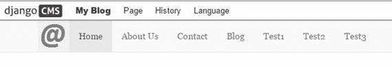
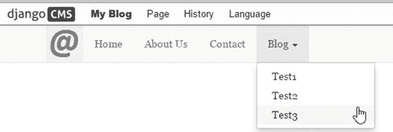
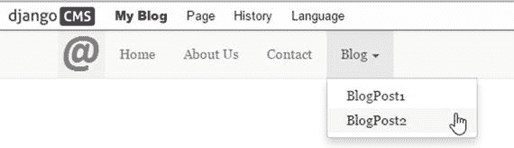
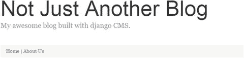
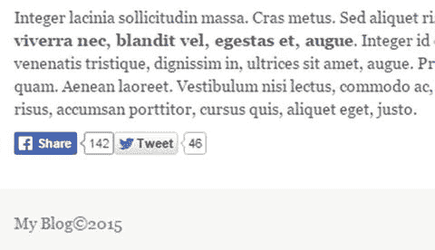
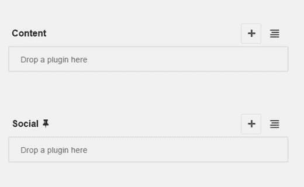
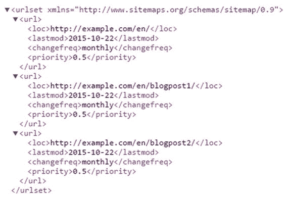

# 九、菜单和导航

在这个阶段，我们完整的博客网站开始成型:我们已经建立了自己的模板，了解了所有 django CMS 插件的工作方式，并使用它们为我们的网站创建了一些内容。然而，我们还有一段路要走，因为我们的网站导航仍然非常基础。

在这一章中，我们将添加一些常见的导航元素，从一个包含博客文章链接的自定义菜单开始。

在这一章的后面，我们将添加社交媒体按钮和一个网站地图来帮助你的第二重要的网站访问者:搜索引擎。

这一章也是我们第一次深入编写一些 Django 代码，所以如果你还不太了解 Django 和 Python，现在是时候更新这些技能了。在第 11 章中有一些关于 Django 和 Python 的链接。

## 自定义菜单

django CMS 菜单系统既灵活又可扩展。到目前为止，我们只看到了 django CMS 如何自动将页面添加到我们的主菜单中，但这并不是其功能的极限——使用 django CMS，您可以执行以下所有操作:

*   用自定义条目静态扩展现有菜单。
*   创建链接到您的应用程序和插件的自定义菜单。
*   将自定义菜单附加到页面。
*   创建将修改整个菜单树的导航修饰符(例如，应用特殊格式)。

我们将在下一章探索更高级的功能，但是第一次做的时候会有点复杂，所以在这一章，我将通过展示如何将一个定制的博客菜单附加到我们的主菜单来介绍定制菜单。

Note

本章假设您已经根据第 8 章中的练习创建了博客页面。如果您还没有这样做，请确保您发布了至少两个新页面，并选择页面➤在导航中隐藏以在根菜单中隐藏它们。

首先，我们需要创建一个新页面。将新页面命名为 Blog，并选择带有侧边栏模板的博客页面。我们将把自定义菜单附加到此页面。

### 创建自定义菜单

有两个选项可用于自定义菜单:您可以静态扩展现有的主菜单，或者将自定义菜单附加到主菜单中的特定页面。

这两个选项之间的唯一区别是在构建菜单时扩展了哪个 django CMS 类:

*   为了静态扩展主菜单，您的自定义菜单类必须扩展`menus.base.Menu`。
*   要将自定义菜单附加到现有页面，您的自定义菜单类必须扩展`cms.menu_bases.CMSAttachMenu`。

这用一个例子就容易理解多了。在你的应用程序目录(`/myblog/`)中创建一个名为`menu.py`的新文件，并输入清单 [9-1](#FPar2) 中所示的代码。

Listing 9-1\. Custom Menu Attached to Root

`#menu.py`

`from menus.base import Menu, NavigationNode`

`from menus.menu_pool import menu_pool`

`from django.utils.translation import ugettext_lazy as _`

`class BlogMenu(Menu):`

`def get_nodes(self, request):`

`nodes = []`

`n1 = NavigationNode(_('Test1'), "/newpost1/", 1)`

`n2 = NavigationNode(_('Test2'), "/newpost2/", 2)`

`n3 = NavigationNode(_('Test3'), "/newpost3/", 3)`

`nodes.append(n1)`

`nodes.append(n2)`

`nodes.append(n3)`

`return nodes`

`menu_pool.register_menu(BlogMenu)`

让我们来看看这段代码:

*   在第 1 行，我们从`menus.base`导入了类`Menu`和`NavigationNode`，这意味着菜单将被附加到根菜单(主菜单)。
*   然后我们创建我们的`BlogMenu`类，它扩展了`Menu`类。
*   `get_nodes`函数通过追加由`NavigationNode`类创建的菜单节点列表来构建菜单。
*   最后，我们向 django CMS 注册新的定制菜单，将其添加到菜单池中。

The `NavigationNode` class

我们新的定制菜单类的核心是`NavigationNode`类，它构建了我们的菜单项。`get_nodes`函数向您的应用程序返回一个`NavigationNode`实例的列表，这样它们就可以呈现在菜单中。`NavigationNode`采用以下参数:

*   `Title`。菜单链接中的锚文本。
*   `url`。菜单项链接到的页面(内部或外部)的 URL。
*   `Id`。此菜单项的唯一 ID。
*   `parent_id`。可选；默认= `None`。如果这是子节点，则为父节点的 ID。
*   `parent_namespace`。可选；默认= `None`。这是一个高级设置；更多信息请参见 django CMS 文档。
*   `Attr`。可选；默认= `None`。这是一个高级设置；更多信息请参见 django CMS 文档。
*   `Visible`。可选；默认= `True`。设置为`False`隐藏该菜单项。

保存您的`menu.py`文件并重启开发服务器。当你刷新你的浏览器时，你应该看到来自你的`PostMenu`自定义菜单的项目被附加到菜单的末尾(图 [9-1](#Fig1) )。

图 9-1。

Custom menu appended to the main menu

以这种方式扩展根菜单的一个实际应用是添加链接到外部应用程序的菜单项(我们将在第 10 章中这样做)以及其他网站。

为了创建一个可以附加到页面上的菜单，我们需要对我们的文件做一些修改(清单 [9-2](#FPar4) )。我用粗体突出显示了这些变化。

Listing 9-2\. Custom Menu Attached to Page

`from menus.base import NavigationNode` `#Menu has been removed`

`from menus.menu_pool import menu_pool`

`from django.utils.translation import ugettext_lazy as _`

`from cms.menu_bases import CMSAttachMenu`

`class PostMenu(``CMSAttachMenu`T2】

`#Menu Name (shows in dropdown)`

`name = _("post menu")`

`def get_nodes(self, request):`

`nodes = []`

`n1 = NavigationNode(_('Test1'), "/newpost1/", 1)`

`n2 = NavigationNode(_('Test2'), "/newpost2/", 2)`

`n3 = NavigationNode(_('Test3'), "/newpost3/", 3)`

`nodes.append(n1)`

`nodes.append(n2)`

`nodes.append(n3)`

`return nodes`

`menu_pool.register_menu(PostMenu)`

一旦您保存了`menu.py`，您需要将自定义菜单附加到页面上。我们将把它附加到您的新博客页面，所以在菜单上选择它，然后转到 django CMS 工具栏，选择页面➤高级设置➤附加➤邮报。您可能需要在高级设置框中向下滚动一点才能找到附加的菜单设置。保存您的更改。你的主菜单现在应该如图 [9-2](#Fig2) 所示。

图 9-2。

Custom menu attached to a page

虽然我们新的定制菜单令人印象深刻，但它并没有多大用处；菜单链接只是指向不存在的页面。如果链接指向我们的博客文章，它就会变得有用。我们这样做的方式非常简单；我们只需要用实际博客文章的标题和 URL 替换示例值`title`和`url`。

这很容易做到，但首先我们必须多理解 django CMS `Page`和`Title`模型。简而言之，django CMS 不会在一个模型中存储页面的所有信息；主要是它有一个`Title`模型，存储关于页面不同版本的信息(例如，语言版本、元数据和草稿版本)。`Page`模型存储与页面相关的信息，如发布日期、安全设置和页面模板。

`Title`和`Page`模型中的字段比我们在这里讨论的时间要多得多；我鼓励您浏览 django CMS 文档，以全面了解这些模型，因为它们是 django CMS 中更高级编程的核心。出于自定义菜单的目的，我们只对博客文章的标题及其 URL 感兴趣。容易吗？

不完全是。有几个需要注意的地方，理解发生了什么的最好方法是让我们稍微偏离一下主题，用 Python 交互式提示来探索一下`Page`和`Title`模型。打开一个命令窗口，确保您已经启动了虚拟环境。您的命令提示符应该如下所示:

`(myBlog) c:\Users\<your username>\MyBlogProject>`

在项目目录中，输入以下内容:

`python manage.py shell`

您应该会看到一些启动消息，后面是 Python 交互提示(`>>>`)。输入下面的代码，按回车键(不要输入三个点；Python 自动插入它们):

`>>> from cms.models import Title`

`>>> for t in Title.objects.all():`

`...     print(t.title)`

这是直接的 Django (Python)代码。我们循环访问数据库中的所有`Title`对象，并打印每个对象的标题字段。在我的机器上，该命令输出以下内容:

`...`

`Home`

`Home`

`About Us`

`Contact`

`BlogPost1`

`BlogPost2`

`Blog`

显然这是不好的——遍历标题会给你数据库中的所有页面，而不仅仅是博客文章，所以我们需要把它们分开。你还会注意到`Home`是重复的。这是因为 django CMS 还为任何有草稿版本的页面保留了一个标题条目，所以我们也必须排除任何页面的草稿版本。

找出一个页面是否是草稿很容易；django CMS `Page`模型包含一个名为`publisher_is_draft`的布尔(真/假)属性。因为我们在主菜单中隐藏了博客文章，所以我们将使用另一个名为`in_navigation`的布尔页面属性从页面列表中提取博客页面。

在你抱怨之前，是的，我同意，`in_navigation`不是识别博客文章的好方法，因为任何隐藏在主菜单中的页面都会出现在博客菜单中。因为我们要到下一章才会学习如何扩展`Page`和`Title`模型(添加一个类别字段)，所以把这看作一个说明性的例子，而不是一个实用的例子！

让我们用交互式控制台对此进行测试:

`>>> from cms.models import Title`

`>>> for t in Title.objects.all():`

`...     print(t.title, t.page.in_navigation,t.page.publisher_is_draft)`

`...`

`Home True True`

`Home True False`

`About Us True True`

`Contact True True`

`BlogPost1 False True`

`BlogPost2 False True`

`Blog True True`

从这里，我们可以看到第一个主页确实是一个草稿，这两篇博文是唯一不在主导航菜单中的页面(`in_navigation=False`)。注意，我们在这里没有加载`Page`模型；由于`page`是`Title`模型的外键，我们可以从带点(.)运算符:`Title.page.<attribute>`。

所以现在我们要把新发现的知识转化成一些有用的代码。我们仍然需要找到博客页面的 URL 我们通过`path`属性来实现:

`>>> from cms.models import Title`

`>>> for t in Title.objects.all():`

`...     if t.page.in_navigation==False and t.page.publisher_is_draft==False:`

`...             print(t.title, t.path)`

`...`

`BlogPost1 blogpost1`

`BlogPost2 blogpost2`

`>>>`

现在你已经理解了这一切是如何工作的，新的`menu.py`代码(列表 [9-3](#FPar5) )应该很容易理解(新代码以粗体显示)。

Listing 9-3\. The `menu.py` File with Modifications

`#menu.py`

`from menus.base import NavigationNode #Menu has been removed`

`from menus.menu_pool import menu_pool`

`from django.utils.translation import ugettext_lazy as _`

`from cms.menu_bases import CMSAttachMenu`

`from cms.models import Title`

`class PostMenu(CMSAttachMenu):`

`#Menu Name (shows in dropdown)`

`name = _("post menu")`

`def get_nodes(self, request):`

`nodes = []`

`for t in Title.objects.all():`

如果 t.page.in_navigation==False 并且

`t.page.publisher_is_draft==False:`

`n = NavigationNode(_(t.title), "/" + t.path + "/", 1)`

`nodes.append(n)`

`return nodes`

`menu_pool.register_menu(PostMenu)`

刷新您的浏览器(您可能需要重启开发服务器)，您的博客定制菜单现在应该如图 [9-3](#Fig3) 所示。

图 9-3。

Complete custom blog menu

正如我前面所说，这只是一个例子，说明在 django CMS 中构建自定义菜单是多么容易。我不建议将它作为显示博客文章的实用解决方案；对于初学者来说，一旦你有了更多的博客条目，这将创建一个笨拙的菜单。

在下一章中，一旦你学会了如何扩展`Title`和`Page`模型，你将能够构建更加实用的定制菜单。例如，一旦您为每个页面添加了一个类别字段，该菜单就可以链接到特定类别中的所有页面，并使用 Blog Roll 模板显示最新的五篇文章。

## 面包屑

术语面包屑或面包屑痕迹是指网站上的一行二级导航，显示用户在页面结构中的当前位置。面包屑通常显示在网页正文的上方。

为了给网站添加面包屑，django CMS 提供了一个方便的模板标签`show_breadcrumb`。它有三个可选参数:

`start_level`. Where to start in the navigation hierarchy. Default = 0 (root).   `template`. The breadcrumb template to use. For portability, you should always create a custom template for your app. By convention, it’s a file named `breadcrumb.html`, but you can name the template file anything you wish. We need to create this file for the breadcrumbs to work. In Listing [9-5](#FPar7) you’ll see a simple `breadcrumb.html` file.   `only_visible`. Only show pages that are visible in the menu navigation. Default = `1` (true); set to `0` to show all pages.  

要在您的应用程序中呈现面包屑轨迹，您需要使用以下格式将模板标签添加到页面模板:

``

所以让我们开始吧。用清单 [9-4](#FPar6) 中所示的代码修改您的`base.html`文件。我已经包括了一些现有的代码，所以你可以看到新代码放在哪里。

Listing 9-4\. Modifications to `base.html` for Breadcrumbs

`#modify base.html`

`. . .`

`
`

`<h1 class="blog-title">Not Just Another Blog</h1>`

`
My awesome blog built with django CMS.
`

`
`

`
`

``

`
`

``

`
`

`. . .`

这里的代码很简单；我们从根开始显示面包屑，并且我们使用了`breadcrumb.html`定制模板。现在我们需要创建模板本身(清单 [9-5](#FPar7) )。将文件`breadcrumb.html`保存到`/myblog/templates`。

还要注意，我已经将类`breadcrumb`应用于 breadcrumb 模板标签周围的 div 是一个引导类，它会自动将一些漂亮的格式应用到我们的面包屑轨迹中。

Listing 9-5\. Our `breadcrumb.html` Template File

`#breadcrumb.html`

``

``

`<a href="{{ ancestor.get_absolute_url }}">` 

`{{ ancestor.get_menu_title }}</a>`

` | `

``

`{{ ancestor.get_menu_title }}`

``

``

浏览清单 [9-5](#FPar7) ，我们可以看到 Django 代码循环遍历导航层次结构并显示每个祖先，用管道字符(“|”)分隔。在最后一次循环中，`if`语句失败，执行`else`语句，将当前页面附加到 breadcrumb trail。假设你得到了所有正确的代码，你的页面现在应该看起来如图 [9-4](#Fig4) 所示。

图 9-4。

Our pages with the breadcrumb trail added

## 社交按钮

像脸书和推特这样的社交媒体网站非常受欢迎，可以分享各种内容，包括最喜欢的博客文章；如此受欢迎，以至于几乎所有受欢迎的博客网站上都有喜欢和分享社交媒体按钮。

django CMS 有几个第三方插件来实现与社交媒体平台的交互，包括喜欢和分享按钮；然而，在这一节，我将教你如何将简单的社交媒体功能直接嵌入到你的网站中。这是一项需要学习的有用技能，因为它可以应用于大量需要嵌入 HTML 片段和加载 JavaScript 库的应用程序、其他社交媒体网站和工具(如 Google Analytics)。

django CMS 让嵌入社交媒体功能变得非常简单；我们将使用一个静态占位符，一些来自脸书和 Twitter 的嵌入代码，以及一些 JavaScript 库的组合。一旦我们完成，你的博客文章底部会有分享按钮，如图 [9-5](#Fig5) 。

图 9-5。

Social media Share buttons added to blog pages

如果您还记得第 5 章中的[，我们已经为`blogpage.html`添加了以下静态占位符:](05.html)

``

从右侧导航菜单中选择一篇博客文章，并将其模板设置为带侧边栏的博客页面(带侧边栏的页面➤模板➤博客页面)。如果您切换到结构视图，您会注意到您已经切换到博客模板，该模板添加了社交按钮占位符(图 [9-6](#Fig6) )。

图 9-6。

Blog template with additional placeholders

向社交占位符添加一个文本插件，并输入清单 [9-6](#FPar9) 中的文本。

Caution

在输入文本之前，将文本插件切换到源模式；否则是不行的。

Listing 9-6\. Code to Embed Social Buttons

`
`

`
`

`
<a class="twitter-share-button"`

`href="`[`https://twitter.com/intent/tweet`](https://twitter.com/intent/tweet)`?`T5】

`text=check%20this%20out%3A%20 ">Tweet</a>`

`
`

第一个`div`嵌入了脸书分享按钮，第二个`div`嵌入了推特分享按钮。

接下来，我们需要添加脸书和 Twitter 的 JavaScript 库。为此，我们必须修改两个模板文件:`base.html`和`blogpage.html`。

在`base.html`中，我们需要为脸书添加一个锚点，以便能够将元素附加到 HTML DOM 中。将下面的代码放在 body 标签的正下方:

`

`

然后在底部，就在``模板标签的上方，添加另一个模板标签:

``

因为我们将把 JavaScript 添加到扩展模板中，所以这个新块是必需的，以便`django-sekizai`知道在我们的扩展模板中添加额外的脚本。继续之前保存`base.html`。

现在我们需要修改`blogpage.html`。由于这是一个相当大的修改，我复制了清单 [9-7](#FPar10) 中的文件，并用粗体显示了修改。

Listing 9-7\. `Blogpage.html` with Modifications

`#blogpage.html`

``

``

``

``

``

``

``

``

``

``

``

``

``

`
`

`<h2 class="blog-post-title">Sample blog post</h2>`

`
October 1, 2015 by <a href="#">Nige</a>
`

``

``

``

`
`

``

Tip

Twitter 的最新脚本可以在 [`https://dev.twitter.com/web/javascript/loading`](https://dev.twitter.com/web/javascript/loading) 找到，脸书的最新脚本可以在 [`https://developers.facebook.com/docs/plugins/share-button`](https://developers.facebook.com/docs/plugins/share-button) 找到。

从清单中可以看到，我们使用了`django-sekizai `标签来插入来自 Twitter 和脸书的 JavaScript 库。还要注意，我只为每个``标签加载了一个脚本。这是使用`django-sekizai`的最佳实践，也是`django-sekizai`能够防止重复 JavaScript 库所必需的。

如果你保存`blogpage.html`并刷新你的网站，你会在每篇文章的末尾看到脸书和推特分享按钮，如图 [9-5](#Fig5) 所示。

正如我在本节开始时所说的，这种方法不仅对嵌入社交媒体工具有用；它可以用于任何需要在页面中添加 HTML 代码片段和加载 JavaScript 的工具或应用程序。

## 网站地图

虽然关于网站地图是否有用还有很多争论，但是网站开发者创建网站地图的主要原因——谷歌——表明这是一个好主意，特别是对于新网站。幸运的是，django CMS 使得添加一个站点地图变得如此简单，以至于我的建议总是相同的:考虑到它花费的精力如此之少，添加一个站点地图。

网站地图是一个 XML 文件，搜索引擎用它来索引你的网站。你可以使用谷歌网站管理员工具等工具向搜索引擎提供你的`sitemap.xml`文件的链接。

Django 内置了一个 sitemap 框架:`django.contrib.sitemaps`。django CMS 用一个名为`CMSSitemap`的新类扩展了这个框架，该类负责将标题、出版物信息和位置信息编入站点地图，因此您不必创建自己的 django 站点地图类。

向您的站点添加站点地图就像以下步骤一样简单:

Add `django.contrib.sitemaps` to your project’s `INSTALLED_APPS` setting (should be installed by default).   Add `from cms.sitemaps import CMSSitemap` to the top of your main `urls.py.`   Add `url(r'^sitemap\.xml$', 'django.contrib.sitemaps.views.sitemap', {'sitemaps': {'cmspages': CMSSitemap}})` to your `urlpatterns`.  

清单 [9-8](#FPar12) 显示了`urls.py`的一个部分，其中包含相关的修改(变化以粗体显示)。

Listing 9-8\. `urls.py` Sitemap Modifications

`#urls.py (partial)`

`. . .`

`from django.contrib import admin`

`from django.conf import settings`

`from cms.sitemaps import CMSSitemap`

`admin.autodiscover()`

`urlpatterns = i18n_patterns('',`

`url(r'^admin/', include(admin.site.urls)),  # NOQA`

`url(r'^sitemap\.xml$', 'django.contrib.sitemaps.views.sitemap',`

`{'sitemaps': {'cmspages': CMSSitemap}}),`

`url(r'^select2/', include('django_select2.urls')),`

`url(r'^', include('cms.urls')),`

url(r'^sitemap\.xml$ '，' django . contib . site maps . views . site map '，

`{'sitemaps': {'cmspages': CMSSitemap}}),`

`)`

`. . .`

如果你导航到 [`http://127.0.0.1:8000/en/sitemap.xml`](http://127.0.0.1:8000/en/sitemap.xml) ，你应该会看到一个类似于图 [9-7](#Fig7) 的网站地图。

图 9-7。

Snapshot of your sitemap file

## 摘要

在这一章中，我们已经讨论了 django CMS 中菜单和导航的一些更高级的主题。我们已经了解了如何创建自定义菜单、扩展默认导航菜单、创建面包屑导航以及添加一些社交共享按钮。

在下一章，我们将更深入地研究定制 django CMS。我们将编写一些代码来扩展 django CMS，您将看到如何为它编写您自己的定制应用程序和插件。