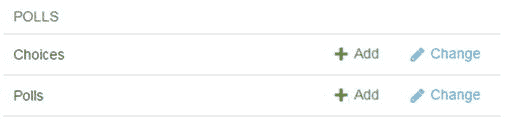

# 十、扩展 django CMS

django CMS 是高度可扩展的；这部分归功于 Django 固有的可扩展性，部分归功于 django CMS 的开放和可插拔设计。这是 django CMS 最大的能力，也是它的核心。

因为这是一个很深很详细的主题，所以本章只能涵盖一些扩展 django CMS 的更重要的方法。对于那些想更深入了解的人，我鼓励你去探索 django CMS 文档，以及许多更详细讨论 django 和 django CMS 的在线论坛(参考资料见第十一章)。

首先，我将向您展示如何通过为您的 CMS 页面创建一个类别字段来扩展 django CMS 中的`Page`和`Title`模型。这个类别将在以后构建自定义菜单插件时使用。

然后，我们将探讨如何向您的网站添加任何类型的 Django 应用，无论是第三方应用还是您自己构建的应用。在这个练习中，我们将使用 Django 教程中的 Polls 应用，而不是从头开始构建自己的程序。然后，我将向您展示如何使用 django CMS apphook 将应用附加到您的网站上。

然后我们将看看 django CMS 的另一个可扩展部分——工具栏。我将向您介绍通过添加我们的投票应用来扩展工具栏，以便它可以从您的网站前端编辑。

最后，我将介绍自定义插件，并教你如何创建和实现你自己的自定义插件，用于你的应用，以及与其他 django CMS 用户共享。

## 扩展页面和标题模型

在前一章中，我使用了我们的博客页面来演示如何创建一个定制菜单，但是我注意到这不是一个健壮的例子，因为我们使用了`in_navigation`属性来标识博客文章。最好是一个类别属性，这样我们就可以通过类别来识别页面:一个页面类别用于网站上的静态页面，一个文章类别用于博客文章。

开箱即用，`Title`模型和`Page`模型都没有这样的属性。幸运的是，`Page`和`Title`模型都是可扩展的。扩展这些模型的能力是 django CMS 的强大特性之一。

扩展每个模型的过程是相同的，所以我在这里只向您展示如何扩展`Page`模型，但是您可以在清单中找到注释，在那里您可以更改代码来扩展`Title`模型。要向您的每个页面添加类别，我们需要完成四个步骤:

Create the models.   Register the models with Django admin.   Create a toolbar item.   Add a category to each page.  

### 创建模型

首先，我们需要为自己构建几个模型(列表 10-1 )。将此文件另存为`models.py`到您的应用目录(/ `myblog` /)。

Listing 10-1\. The `Category` and `CategoryExtension` Models

`from django.db import models`

`from cms.extensions import PageExtension #TitleExtension`

`from cms.extensions.extension_pool import extension_pool`

`class Category(models.Model):`

`category = models.CharField(max_length=20)`

`class Meta:`

`verbose_name_plural = 'Categories'`

`def __str__(self):`

`return self.category`

`class CategoryExtension(PageExtension): #TitleExtension`

`category = models.ForeignKey(Category)`

`extension_pool.register(CategoryExtension)`

逐句通过这段代码，请注意以下几点:

*   我们正在从`cms.extensions`类中导入`PageExtension`和`extension_pool`。
*   `Category`类是一个标准的 Django 模型。`Meta`类和`__str__(self)`函数确保模型在管理界面中显示人性化的文本。
*   我们的`CategoryExtension`类扩展了`Page`模型。它有一个链接到我们类别列表的外键字段。
*   最后，我们向扩展池注册我们的扩展类。
*   要修改这段代码以扩展`Title`模型，我们所要做的就是用`TitleExtension`替换`PageExtension`的每个实例。

一旦我们创建了新的模型，我们需要将它们添加到我们的应用中。为此，只需运行以下语句:

`python manage.py makemigrations`

`python manage.py migrate`

### 向 Django 管理员注册模型

接下来，我们需要向管理界面注册我们的新模型，这样我们就可以编辑它们了。继续在你的应用目录中创建一个新的`admin.py`文件，并输入清单 10-2 中所示的代码。

Listing 10-2\. Registering our Models With Django Admin

`from django.contrib import admin`

`from cms.extensions import PageExtensionAdmin #TitleExtensionAdmin`

`from .models import Category, CategoryExtension`

`class CategoryAdmin(admin.ModelAdmin):`

`pass`

`class CategoryExtensionAdmin(PageExtensionAdmin): #TitleExtensionAdmin`

`pass`

`admin.site.register(Category, CategoryAdmin)`

`admin.site.register(CategoryExtension, CategoryExtensionAdmin)`

和前面的清单一样，这是标准的 Django 代码。我们已经创建了两个类存根，并向 Django 管理应用注册了它们，这样我们就可以从后端编辑模型。一旦您重启了开发服务器，您应该有一个新的面板添加到您的管理界面(图 10-1 )。

图 10-1。

Categories model added to admin interface

在管理控制台中，继续添加页面和文章类别。完成后，你的类别列表应该如图 10-2 所示。

图 10-2。

Categories list

### 创建工具栏项目

您会注意到，我们的扩展字段没有出现在管理界面中。这是因为在默认的管理应用中不能直接编辑`Page`模型。要将扩展字段附加到页面上，我们需要创建一个工具栏项目。为此，我们需要在我们的应用目录中创建一个名为`cms_toolbar.py`(列表 10-3 )的文件。django CMS 将在启动时查找这个文件，如果它存在，将文件中的类加载到工具栏中。

Listing 10-3. `cms_toolbar.py`

`from cms.toolbar_pool import toolbar_pool`

`from cms.extensions.toolbar import ExtensionToolbar`

`from django.utils.translation import ugettext_lazy as _`

`from .models import CategoryExtension`

`@toolbar_pool.register`

`class CategoryExtensionToolbar(ExtensionToolbar):`

`model = CategoryExtension`

`def populate(self):`

`current_page_menu = self._setup_extension_toolbar()`

`if current_page_menu:`

`page_extension, url = self.get_page_extension_admin()`

`if url:`

`current_page_menu.add_modal_item(_('Page Category'),` 

`url=url, disabled=not self.toolbar.edit_mode)`

逐句通过代码，请注意以下事项:

*   我们用`toolbar_pool.register`装饰器注册工具栏类。
*   我们让 django CMS 知道我们想要为工具栏项目使用`CategoryExtension`模型。
*   为了将我们的模型添加到工具栏中，我们从`ExtensionToolbar`中调用`_setup_extension_toolbar()`函数。这为我们的工具栏项目做了所有的初始化和设置。如果失败，它返回`False`,所以如果你的扩展模型有问题，这个函数会通过不加载你的类而优雅地失败。

输入代码后，保存`cms_toolbar.py`文件并重启服务器。如果您输入的一切都正确，现在您的页面菜单上会有一个新选项(图 10-3 )。

图 10-3。

Page extended field added to toolbar

### 向您的页面添加类别

你现在可以给你的每个页面添加一个类别了(图 10-4 )。因为我们将在本章的下一节使用类别，所以继续将博客类别分配给你的每篇博客文章，将页面类别分配给其他三个页面。

图 10-4。

Adding a category to a page

## 应用和应用挂钩

通常，您会希望将 django CMS 扩展到核心功能之外，以扩展整个网站的功能。扩展网站的两种方式是添加或创建 Django 应用(Django apps)和添加或创建 django CMS 插件。

两者之间的根本区别在于，应用是一个独立的应用，附加到您的网站上，可以通过 URL 访问(或附加一个 apphook)，而插件是一个放在页面占位符中的对象。

在这一部分，我们将学习应用和应用挂钩；我们将很快介绍插件。向 django CMS 添加应用的流程与向 django 添加应用的流程相同:

Add a new app folder with `startapp` (or copy an existing app into your project directory).   Link to the app from your `urls.py` file.  

对于这一章，我们将使用 Django 教程中的 Polls 应用，而不是从头开始编写应用。要在项目中安装应用，请按照以下步骤操作:

Download the Polls app from [`https://github.com/big-nige/django-polls`](https://github.com/big-nige/django-polls) . (Select the Download .ZIP button on the right of the page.)   Extract the downloaded zip file to your computer.   Open the extracted folder and copy the `polls` directory to your project directory.   Add the Polls app to your `settings.py` (Listing 10-4)   Add the Polls app to your `urls.py` (Listing 10-5)   Run `python manage.py migrate polls` from your virtual environment command prompt.   Listing 10-4\. Adding the Polls App to `settings.py`

`INSTALLED_APPS = (`

`. . .`

`'polls',`

`)`

Listing 10-5\. Adding the Polls App URLs to `urls.py`

`urlpatterns = i18n_patterns('',`

`. . .`

`url(r'^polls/', include('polls.urls', namespace='polls')),`

`url(r'^', include('cms.urls')),`

`. . .`

`)`

完成这些步骤后，项目目录应该如下所示:

`/MyBlogProject`

`. . .`

`/myBlog/`

`/polls/`

`. . .`

如果您导航到您的管理仪表板(通过工具栏)，您应该会看到一个为我们的投票应用添加的新面板(图 10-5 )。

图 10-5。

Polls app added to the admin interface

继续添加几个投票。完成后，您可以导航到 [`http://127.0.0.1:8000/polls/`](http://127.0.0.1:8000/polls/) 来查看您的投票应用的运行情况。

您会注意到这是一个没有格式的普通页面。这是因为您尚未将投票应用更改为使用您的网站模板。要更改这一点，请编辑`myBlogProject\polls\templates\polls\base.html`以匹配清单 10-6 。

Listing 10-6\. The Modified Polls Base Template

``

``

``

``

``

当你刷新你的`/polls/`页面时，你的投票应用现在应该使用你的站点模板(图 10-6 )。

图 10-6。

Polls app modified to use site template

### Apphooks

虽然将应用添加到 django CMS 项目非常简单，正如我们的示例投票应用所展示的那样，但它仍然没有集成到 django CMS 中，因此它可以通过站点菜单访问或从前端修改。

apphook 允许你将一个应用附加到一个空的 django CMS 页面上，这样就可以通过主菜单访问它。在本节中，您将学习如何创建 apphook。

从前端修改 Polls 应用需要一个工具栏扩展，我们将在接下来讨论。

为了收集和注册 apphooks，django CMS 在应用的根目录中查找一个名为`cms_apps.` `py`的文件。一个基本的`cms_apps.py`文件如清单 10-7 所示。现在，在您的`\polls\`目录中创建这个文件。

Caution

注意，模块名是`cms_apps.py`。在 django CMS 的以前版本中，该模块被命名为`cms_app.py`。如果您使用的是较旧的 Django 或 django CMS 应用，您需要将它们更新为新的命名约定。

Listing 10-7. `cms_apps.` `py`

`from cms.app_base import CMSApp`

`from cms.apphook_pool import apphook_pool`

`from django.utils.translation import ugettext_lazy as _`

`class PollsApp(CMSApp):`

`name = _("Poll App")`

`urls = ["polls.urls"]`

`app_name = "polls"`

`apphook_pool.register(PollsApp)`

逐句通过这段代码，请注意以下几点:

*   首先我们必须导入`CMSApp`和`ApphookPool`类(`apphook` _pool 是类的别名)。
*   `CMSApp`类非常简单:我们的`PollsApp`将它子类化并设置三个属性:
    *   名字。设置 apphook 名称。这是显示在页面高级属性中的名称。
    *   网址。链接到您的应用`urls.py`文件。
    *   App_name。根据您的`INSTALLED_APPS`设置，这是应用的名称。
*   一旦我们创建了 apphook 类，我们就把它添加到 apphook 池中。

保存您的`cms_apps.py`文件并重启开发服务器，以允许新的 apphook 可用。

Note

请注意，每当我们添加或删除 apphook，更改包含 apphook 的页面的 slug，或者更改包含带有 apphook 的后代的页面的 slug 时，我们都必须重新启动服务器来重新加载 URL 缓存。

接下来，您需要添加一个新页面，并导航到页面➤高级设置。

向下滚动直至找到应用下拉列表，并从列表中选择投票应用。

刷新页面，您会发现 Polls 应用现在可以直接从新的 django CMS 页面获得(图 10-7 )。

图 10-7。

Polls app hooked to the main menu Note

因为 Polls 应用已经通过 apphook 附加到您的项目，所以您不再需要在您的`urls.py`中引用它。开始`url(r'^polls/', . . .`的行可以安全删除。

为了完成我们的投票应用在博客网站中的集成，我们希望添加从前端添加和修改投票的能力。幸运的是，django CMS 还允许我们扩展工具栏。

## 扩展工具栏

当我们向 django CMS 添加应用时，能够从前端编辑器使用它们非常方便。django CMS 提供了轻松扩展工具栏的能力。

与其他扩展一样，django CMS 将在应用的根文件夹中查找一个特殊文件(在本例中为`cms_toolbar.py`)，该文件包含一个或多个类型为`CMSToolbar`的类。每个类都将被注册为一个工具栏扩展。在这个练习中，在您的投票应用中创建一个新的`cms_toolbar.py`文件(清单 10-8 )。

Listing 10-8. `cms_toolbar.` `py`

`from django.utils.translation import ugettext_lazy as _`

`from cms.toolbar_pool import toolbar_pool`

`from cms.toolbar_base import CMSToolbar`

`from cms.utils.urlutils import admin_reverse`

`from polls.models import Poll`

`@toolbar_pool.register`

`class PollToolbar(CMSToolbar):`

`watch_models = [Poll,]`

`def populate(self):`

`if not self.is_current_app:`

`return`

`menu = self.toolbar.get_or_create_menu('poll-app', _('Polls'))`

`menu.add_sideframe_item(`

`name=_('Poll list'),`

`url=admin_reverse('polls_poll_changelist'),`

`)`

`menu.add_modal_item(`

`name=_('Add new poll'),`

`url=admin_reverse('polls_poll_add'),`

`)`

逐句通过这段代码，请注意以下几点:

*   首先我们必须导入`CMSToolbar`和`ToolbarPool`类(`toolbar` _pool 是类的别名)。注意与前面使用 apphooks 的例子的相似性。django CMS 类遵循一个通用的结构，这使得使用和记住每个类更加容易。
*   我们在`PollToolbar`类中子类化`CMSToolbar`。
*   注意，这次我们使用了`@register`装饰器(`@toolbar_pool.register`)。我们可以很容易地在文件末尾使用`toolbar_pool.register(PollToolbar)`。
*   我们设置了`watch_models`，每当通过前端编辑器创建或保存实例时，它允许前端编辑器将用户重定向到模型实例`get_absolute_url`。
*   然后我们定义一个`populate()`方法，将一个项目添加到菜单中。`populate()`方法检查我们是否在属于这个应用的页面中，如果是，它做三件事:
    *   如果没有菜单，则创建一个菜单。
    *   添加一个菜单项，将所有投票列为侧框(选中时将从 Django admin 调用`polls.changelist()`)。
    *   添加一个菜单项来添加一个新的投票作为一个模态窗口(选中时将从 Django admin 调用`polls.add()`)。

保存`cms_toolbar.py`文件，一旦开发服务器重启，你的网站应该看起来如图 10-8 (注意你必须在投票页面上才能看到)。

图 10-8。

Polls app added to the toolbar

选择“添加新投票”，将弹出一个新窗口或选项卡(图 10-9 ，允许您输入新投票。

图 10-9。

Adding a new poll from the django CMS toolbar

另一方面，选择“投票列表”，将会展开侧边栏向您显示投票列表(图 10-10 )。

图 10-10。

Polls list sidebar Note

这是一个很基本的例子。django CMS 具有扩展工具栏的广泛能力；例如，您可以将菜单项添加到根目录，但这超出了本书的范围。更多信息，请访问 [`http://docs.django-cms.org/en/latest/how_to/toolbar.html`](http://docs.django-cms.org/en/latest/how_to/toolbar.html) 。

## 自定义插件

我们在第六章和第七章中介绍了 django CMS 可用的一些插件。虽然有插件可以为 django CMS 添加各种功能，但用不了多久，您就会遇到可用插件无法满足的客户需求。当这种情况发生时，是时候创建你自己的定制插件了。

把 django CMS 中的一个插件看作是一种特殊的应用是很有帮助的，它可以放在任何 django CMS 占位符中。在这方面，创建一个插件并不比创建(或添加)一个应用和创建一个 apphook 更难，就像你在本章前面所做的那样。

django CMS 插件有三个部分:

*   插件编辑器，在每次部署时配置插件。这是插件模型，存储在插件的`models.py`文件中。
*   插件发布者。这是你的插件类，它选择呈现给浏览器的内容。这个类驻留在`cms_plugins.py`文件中，您必须在您的插件应用的根目录中创建这个文件。
*   插件模板。这是一个标准 django CMS 模板文件。这个文件可以存储在任何地方，但是必须被你的插件类的`render_template`属性引用。

您会注意到 django CMS 插件设计遵循了与 django 相同的模型-模板-视图结构。对于插件来说，发布者就是视图。为了演示创建一个自定义插件是多么容易，我们将从创建一个自定义插件开始，它将在一个方便的侧边栏导航菜单中显示您的所有博客文章。

## 侧边栏导航

尽管它在移动友好网站上变得越来越不常见，但大多数用户仍然希望在侧边栏中找到二级菜单和链接(例如，到博客帖子和文章的链接)。左边栏还是右边栏能提供更好的用户体验，这是一个不可能解决的争论。我选右只是因为我喜欢右边的边栏。如果你是一个“左撇子”，请随意使用`page.html`模板文件。无论你使用哪种模板，本章中的所有代码都可以工作(这也是 MVC 是最佳设计模式的另一个原因)。

### 开始之前

在我们开始之前，确保你的网页有一个类似图 10-11 的侧边栏。如果没有，您将需要返回到第五章的并确保您已经正确构建了模板，并且它们已经被添加到`settings.py`中。

图 10-11。

Right sidebar navigation

为了开始使用我们的定制插件，我们还需要创建一个新的 Django 应用。在 Python 虚拟环境命令提示符下，输入

`python manage.py startapp menu_plugin`

这将在您的`/myblog/`目录中创建一个新的 Django 应用。一旦你完成了这两个设置步骤，你就可以创建你的工具条插件了。在本节中，我们将

Create the publisher and template for your plugin.   Add a new placeholder to your page template.   Enhance your plugin by adding a configuration option.  

### 创建插件发布者

因为我们将从一个非常简单的定制插件开始，所以在这个阶段我们不需要模型，所以我们的下一步是创建我们的发布者/视图(清单 10-9 )。然后，在接下来的部分，我们将创建我们的模板(清单 10-10 )。

Listing 10-9\. Custom Plugin Publisher (`cms_plugins.py`)

`from cms.plugin_base import CMSPluginBase`

`from cms.plugin_pool import plugin_pool`

`from cms.models.pluginmodel import CMSPlugin`

`from django.utils.translation import ugettext_lazy as _`

`from myblog.models import Category, CategoryExtension`

`from cms.models import Title`

`class MenuPlugin(CMSPluginBase):`

`model = CMSPlugin`

`name = _("Menu Plugin")`

`render_template = "menu_plugin.html"`

`cache = False`

`def render(self, context, instance, placeholder):`

`blogposts = []`

`for t in Title.objects.all():`

`if t.page.publisher_is_draft==False:`

`try:`

`if str(t.page.categoryextension.category) == 'post':`

`anchor = (t.title,t.path)`

`blogposts.append(anchor)`

`except:`

`pass`

`context['blogposts'] = blogposts`

`return context`

`plugin_pool.register_plugin(MenuPlugin)`

清单 10-9 看起来有点复杂，但实际上很简单；在前面的章节中，您已经看到了大部分内容:

*   您会注意到这段代码遵循了与 apphooks 和 extensions 类似的格式:导入一些自定义类，设置一些属性，并向池注册插件，以便 django CMS 可以找到它。
*   `MenuPlugin`类继承了`CMSPluginBase`并设置了一些必需的属性:
    *   模特。必选。这是插件编辑器，允许自定义插件配置。因为我们在这个阶段没有使用自定义设置，所以我们简单地从`CMSPlugin`继承。
    *   名字。必需的。将在前端编辑器的插件下拉列表中显示的名称。
    *   渲染模板。必选。插件模板的 URL。由于我们没有提供路径信息，django CMS 将在`\menu_plugin\templates`中查找这个文件。
    *   缓存。可选。定义我们是否想要缓存插件内容。
*   `MenuPlugin`类还提供了一个`render()`方法，将一个`context`和`instance`传递回你的模板。因为这是代码中最复杂的部分，所以接下来我会单独解释。

django CMS `render()`方法与 django 的`render()`方法基本相同，因为它返回用给定上下文呈现的给定模板的`HTTPResponse`对象。

在我们的插件中，模板是`menu_plugin.html`，我们将元组列表添加到上下文中(`blogposts`)。复杂性来自于我们需要访问本章开始时对`Page`模型的扩展的方式。

为了在我们的侧边菜单中创建锚文本和 URL，我们需要访问页面的标题和路径。如果你还记得第九章，`title`和`path`都是`Title`模型的属性，但是我们的范畴扩展是在`Page`模型上。我们遵循的逻辑类似于我们在第九章中创建博客菜单时使用的逻辑:

*   我们遍历所有的`Title`对象，但是只选择那些已发布的对象(`publisher_is_draft==False`)。
*   然后，我们检查类别是否是`post`，如果是，就在 blogposts 列表中添加一个`(title, path)`元组。
*   当页面没有被分配类别时，`try/except`是阻止 Django 抛出错误所必需的。
*   然后，我们将 blogposts 列表添加到模板要呈现的上下文中。

Note for advanced users: CMSPluginBase

`cms.plugin_base.` `CMSPluginBase`类实际上是`django.contrib.admin.options.ModelAdmin`的子类。因为`CMSPluginBase`是`ModelAdmin`的子类，CMS 插件开发者也可以使用几个重要的`ModelAdmin`选项。这些是最常用的:

*   `exclude`
*   `fields`
*   `fieldsets`
*   `form`
*   `formfield_overrides`
*   `inlines`
*   `radio_fields`
*   `raw_id_fields`
*   `readonly_fields`

然而，请注意，并不是所有的`ModelAdmin`选项在 CMS 插件中都有效。特别是，`changelist`功能专用的任何选项都将无效。详见 [`http://docs.django-cms.org/en/latest/how_to/custom_plugins.html`](http://docs.django-cms.org/en/latest/how_to/custom_plugins.html) 。

### 创建插件模板

接下来，我们需要创建我们的插件模板。在你的`menu_plugin`应用中创建一个`\templates\`目录，并将清单 10-10 保存到一个名为`menu_plugin.html`的文件中。

Listing 10-10\. Our Custom Plugin Template (`menu_plugin.html`)

`<ol class="list-unstyled">`

``

``

`<li><a href="{{ full_url }}">{{ anchortext }}</a></li>`

``

``

`<li>There are no published blog posts</li>`

``

`</ol>`

逐句通过这段代码，请注意以下几点:

*   我们使用一个`for`循环来遍历在`blogposts`中传递给浏览器的元组列表。
*   ``标签提供了一种简单有效的方法来将一个文本字符串(在本例中是一个正斜杠/)连接到模板变量的开头。Django 的标准标签``在这里不起作用，因为不能在前面加上/。
*   列表中的每个元组都用来构建一个 HTML 锚标记，以显示锚文本和到你的每篇博客文章的链接。

一旦你创建了你的插件模板，你需要做的就是将`'menu_plugin'`添加到`INSTALLED_APPS`(在`settings.py`中)并重启开发服务器。你的新菜单插件现在可以安装到你页面上的任何占位符中了(图 10-12 )。

图 10-12。

Custom menu plugin added to plugins

### 向页面模板添加占位符

当然，我们的自定义菜单在页面中间用处不大；我们需要能够将它添加到我们的侧边栏菜单。如果你还记得《??》第五章，我们在页面模板(`page.html`)中创建了一些虚拟文本作为占位符。我们现在需要用 django CMS 占位符替换这段代码。清单 10-11 显示了您需要对`page.html`进行的更改。

Listing 10-11\. Modified `page.html` template

`. . .`

`<h4>Latest Posts</h4>`

``

`<ol class="list-unstyled">` `#delete this line`

`<li><a href="#">Blogpost 1</a></li>` `#delete this line`

`<li><a href="#">Blogpost 2</a></li>` `#delete this line`

`</ol>  #delete this line`

`. . .`

刷新你的浏览器，切换到你的一篇博客文章(或者任何有右边栏的页面)。切换到工具栏上的结构模式，你的页面应该有一个文章占位符(图 10-13 )。

图 10-13。

Posts placeholder in right sidebar

将我们的自定义菜单插件添加到这个占位符，保存它，切换回内容视图，你应该会看到一个功能齐全的右菜单(图 10-14 )，显示你所有的博客文章。

图 10-14。

Completed right menu with blog posts

虽然我们的右侧菜单现在按设计运行，但它确实有一个缺陷——如果你有数百篇博客文章呢？一个流行的答案是创建一个菜单，提供年和月的存档列表，而不是在一个页面上列出每个帖子。由于本书没有足够的篇幅来构建这样一个详细的模型，我将向您展示一个更简单的解决方案:提供一个插件配置选项来限制列表中显示的博客文章的数量。

### 向插件添加配置选项

在我们的第一个菜单插件版本中，我们没有为插件创建编辑器(`model.py`)。为了使我们的菜单插件可配置，我们将为我们的插件创建一个自定义模型，这样我们就可以设置有多少博客文章将显示在右边的菜单中。

我们将开始创建你的新插件模型(清单 10-12 )。将该文件保存到`\menu_plugin\models.py`。

Listing 10-12\. Menu Plugin ( `models.py)`

`from cms.models.pluginmodel import CMSPlugin`

`from django.db import models`

`class MaxEntries(CMSPlugin):`

`max_entries = models.SmallIntegerField(default=0 ,` 

`verbose_name='Maximum Entries')`

这个代码应该很容易理解:

*   `MaxEntries`类是`CMSPlugin`类的子类。
*   我们正在设置一个配置字段(`max_entries`)，它将保存菜单中允许的最大条目数。我们使用默认值零；这将对应于无限的条目。当我们开始修改模板时，您将看到我们是如何实现这个逻辑的。

我们还需要对我们的`cms_plugins.py`文件进行一些修改(清单 10-13 )。我用粗体显示了这些变化。

Listing 10-13\. `cms_plugins.py` Updated to Use New Model

`. . .`

`from myblog.models import Category, CategoryExtension`

`from cms.models import Title`

`from .models import MaxEntries`

`class MenuPlugin(CMSPluginBase):`

`model =` `MaxEntries`

`name = _("Menu Plugin")`

`render_template = "menu_plugin.html"`

`cache = False`

`def render(self, context, instance, placeholder):`

`categoryID = Category.objects.get(category='post')`

`posts = CategoryExtension.objects.filter(category_id=categoryID)`

`blogposts = []`

`for post in posts:`

`if not Title.objects.get` 

`(page_id=post.extended_object_id).publisher_is_draft:`

`anchor =` 

`((Title.objects.get(page_id=post.extended_object_id).title),)`

`anchor +=` 

`((Title.objects.get(page_id=post.extended_object_id).path),)`

`blogposts.append(anchor)`

`context['instance'] = instance`

`context['blogposts'] = blogposts`

`return context`

`plugin_pool.register_plugin(MenuPlugin)`

我们在本章的前面已经详细研究了这个文件，所以我将只解释修改。我们执行以下操作来将新的编辑器添加到菜单插件中:

*   导入`MaxEntries`模型。
*   将我们的插件模型从通用的`CMSPlugin`改为我们的`MaxEntries`模型。
*   当插件代码被调用时，将模型的一个实例传递回浏览器。这个实例将包含我们的`MaxEntries`字段，因此它可以被模板的渲染逻辑使用。

现在我们已经创建了新的插件编辑器，我们需要更新数据库以包含插件模型。在 Python 虚拟环境命令提示符下，输入

`python manage.py makemigrations`

这将为您的新插件模型创建一个迁移。然后，我们需要迁移数据库以包含您的新模型:

`python manage.py migrate`

一旦您完成了迁移并刷新了浏览器，您的插件现在应该有一个`MaxEntries`配置选项。回到你的博客页面，编辑你之前添加的菜单插件。你的编辑器窗口现在应该有一个最大条目选项(图 10-15 )。

图 10-15。

Maximum Entries configuration option

因为我们在这个阶段只有几个博客条目，为了测试我们的更改，将这个设置为 1 并保存插件。

接下来，我们必须更新我们的插件模板，以便它在菜单中显示正确数量的条目(清单 10-14 )。变化以粗体显示。

Listing 10-14\. Modified `menu_plugin.html`

`<ol class="list-unstyled">`

``

``

``

`<li><a href="{{ full_url }}">{{ anchortext }}</a></li>`

``

`<li><a href="{{ full_url }}">{{ anchortext }}</a></li>`

``

``

``

`<li>There are no published blog posts</li>`

``

`</ol>`

清单 10-14 中的基本逻辑与清单 10-10 中的相同，只是增加了一条`if … elif`语句。这个新代码基本上是说，如果`max_entries`是零(0)，为所有的博客文章创建锚点；否则，仅在当前计数小于或等于`max_entries`时创建锚点。

刷新你的浏览器，假设你将`max_entries`设置为 1，你将只能在菜单中看到第一篇博客文章。编辑你的菜单插件，把`max_entries`改成 0，保存插件，刷新浏览器，两篇博文都会重新出现。

## 摘要

在这一章中，我们探讨了 django CMS 的一些更高级的特性。您学习了如何扩展`Page`和`Title`模型，以及如何向我们的项目添加 Django 应用和创建 apphook。我们使用 Django 教程中的 Polls 应用来演示应用和 apphooks 是如何被构建并集成到 django CMS 项目中的。

我们还扩展了工具栏，这样我们就可以从前端访问我们的新应用。最后，我们学习了定制插件是如何构建的，并将我们的知识用于为我们的博客站点创建合适的侧边栏菜单。

这一章也是我们对 django CMS 介绍的结尾。我们在这 10 章中涉及了大量的内容；现在你应该对 django CMS 有了足够的了解，能够构建自己的高性能专业网站。

在这么说的时候，你也应该注意到这仅仅是你与 django CMS 之旅的开始。因为这是一本介绍性的书，所以我无法对许多更深入的主题进行更详细的探讨。这本书更多的是介绍 django CMS 的工作原理，而不是用 django CMS 构建专业网站的最佳实践。

如需更多参考资料和下一步该怎么走的指示，请查看第十一章的部分，该部分被恰当地称为后续步骤…