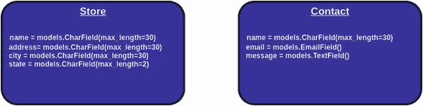
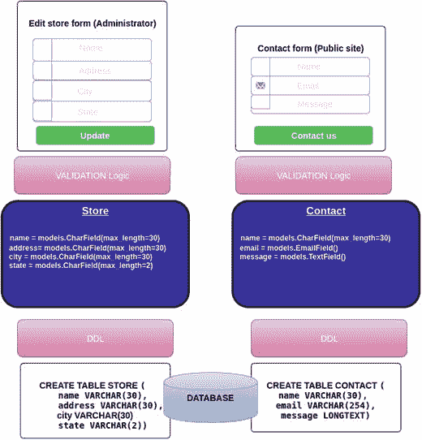
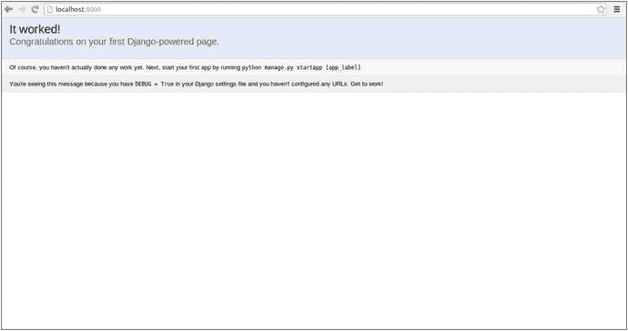
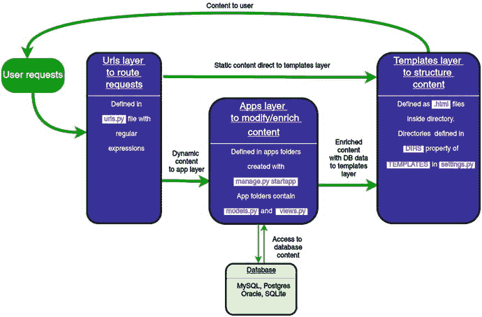
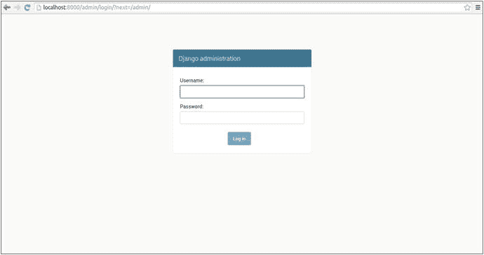
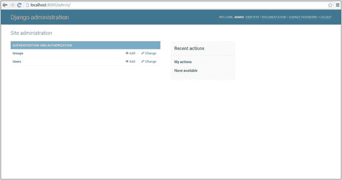
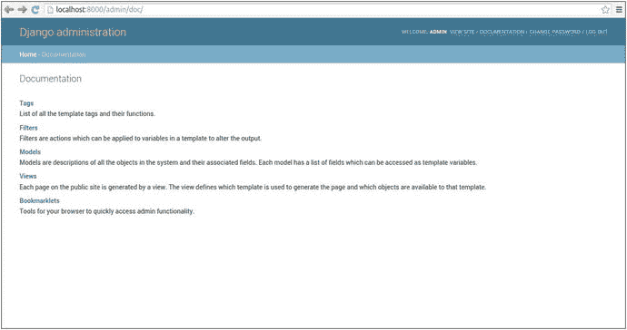

# 一、Django 框架介绍

Django 框架始于 2003 年，是由美国堪萨斯州劳伦斯的《世界日报》的 Adrian Holovaty 和 Simon Willison 完成的一个项目。2005 年，Holovaty 和 Willison 发布了该框架的第一个公开版本，并以比利时-法国吉他手坦哥·雷恩哈特的名字命名。

快进到 2017 年——Django 框架现在在 Django 软件基金会(DSF)的指导下运行，框架核心有超过 1000 个贡献者，有超过 15 个发布版本，有超过 3000 个专门设计用于 Django 框架的包。 [<sup>1</sup>](#Fn1)

Django 框架仍然忠实于它的起源，即模型-视图-控制器(MVC)服务器端框架，设计用于操作关系数据库。尽管如此，Django 仍然通过第三方包紧跟大多数 web 开发趋势，与非关系数据库(NoSQL)、实时互联网通信和现代 JavaScript 实践等技术一起运行。所有这些都说明了一点，Django 框架现在是许多组织选择的 web 开发框架，包括照片共享网站 Instagram [<sup>2</sup>](#Fn2) 和 Pinterest[<sup>3</sup>](#Fn3)；公共广播系统[<sup>4</sup>](#Fn4)；美国国家地理[<sup>5</sup>](#Fn5)；而借助这本书，你的组织！

在这一章中，你将学习 Django 框架设计原则，这是理解日常使用 Django 框架的关键。接下来，您将学习如何以各种方式安装 Django:作为 tar.gz 文件，使用 pip，使用 git，以及使用 virtualenv。

一旦安装了 Django 框架，您将学习如何启动一个 Django 项目，以及如何用关系数据库来设置它。接下来，您将了解 Django 框架中的核心构件——URL、模板和应用——以及它们如何相互协作来设置内容。最后，您将学习如何设置 Django 管理站点，这是一个基于 web 的界面，用于访问连接到 Django 项目的关系数据库。

## Django 框架设计原则

如果你在 web 开发领域工作了足够长的时间，你最终会得出这样的结论:你可以用任何 web 框架和编程语言产生相同的结果。但是，虽然您实际上可以产生相同的结果，但是差异很大的是您创建解决方案所花费的时间:创建原型的时间、添加新功能的时间、进行测试的时间、进行调试的时间、部署到规模的时间等等。

从这个意义上来说，Django 框架使用了一套设计原则，与许多其他 web 框架相比，它产生了最有生产力的 web 开发过程之一。注意，我并不是说 Django 是银弹(例如，最好的原型，最具伸缩性)；我是说，最终，Django 框架包含了一组设计原则和权衡，使其成为构建大多数大中型 web 应用所需特性的最有效的框架之一。

现在，虽然你可能认为我有偏见——毕竟我正在写一本关于这个主题的书——我将首先列出这些设计原则，这样你可以更好地理解是什么赋予了 Django 框架这种优势。

### 不重复自己(干)的原则

重复可能有助于强调一个观点，但是对于 web 开发来说，这只会导致额外的耗时工作。事实上，web 开发的本质是跨多个交互层(例如，HTML 模板、业务逻辑方法和数据库)进行操作，这本身就是重复的。

Django 框架确实试图强迫你不要重复自己，所以让我们看看 Django 是如何强制不要重复自己的，以及为什么这是一件好事。

假设您想要构建一个 coffeehouse 应用来发布关于商店的信息，并为客户提供一个联系表单。你需要做的第一件事是确定商店和联系表格需要什么样的信息。图 [1-1](#Fig1) 展示了每个实体的两个 Django 模型的实体模型。



图 1-1。

Django models for store and contact entities

请注意图 [1-1](#Fig1) 中的 Django 模型每个都有不同的字段名称和数据类型来限制值。例如，语句`name = models.CharField(max_length=30)`告诉 Django 商店名称应该最多包含 30 个字符，而语句`email = models.EmailField()`告诉 Django 联系人实体应该包含有效的电子邮件值。如果咖啡馆像大多数 web 应用一样，您通常会为商店和联系人实体做以下事情:

*   创建关系数据库表来保存实体信息。
*   创建业务逻辑以确保实体符合需求。
*   创建 HTML 表单以允许为实体提交数据。
*   创建允许管理用户访问数据库中实体的界面。
*   创建 REST 服务来公开移动应用版本的实体。

完成这最后一个任务列表的关键是，您可能会在数据库定义语言(DDL)、HTML 表单、业务验证逻辑和 URL 等方面重复许多类似的信息(例如名称、值限制),这一过程不仅耗时，而且容易出错。

基于像`models.CharField(max_length=30)`这样的语句，您可以生成一个 HTML 表单输入，一个 DDL 语句，并自动验证信息只包含 30 个字符，这不是更容易吗？这正是 Django 的干设计原则所做的。

图 [1-2](#Fig2) 展示了与图 [1-1](#Fig1) 相同的 Django 模型，以及您可以从相同的模型中生成的各种构造，而无需重复。



图 1-2。

Django models create separate constructs based on DRY principle

正如您在图 [1-2](#Fig2) 中看到的，代表 Django 模型的实体能够生成向公众展示的 HTML 表单、管理实体的管理界面、实施实体值的验证逻辑，以及生成代表实体的数据库表的 DDL。

虽然现在讨论从 Django 模型生成这种结构的实际技术还为时过早，但不用说，这比在 HTML 表单、DDL、验证逻辑和其他位置跟踪同一事物(例如，姓名、电子邮件)的多个引用要简单得多。

从这个意义上说，Django 真正帮助你在一个地方定义事物，而不必在其他地方重复它们。注意，总是有可能重复自己来获得定制的行为，但是在默认情况下，Django 在几乎所有你用它做的事情中都执行 DRY 原则。

### 显性比隐性好

Django 使用的编程语言 Python 有一个类似咒语的声明，称为“Python 的禅”，被定义为该语言的 Python 增强建议(PEP)的一部分，特别是 PEP 20。PEP 20 中的一个声明是“显式比隐式更好”,并且 Django 是基于 Python 的，这个原则也被牢记在心。

显式导致 web 应用容易被更多的人理解和维护。对于最初没有编写 web 应用的人来说，添加新功能或理解 web 应用背后的逻辑可能已经够难了，但是如果您加入了具有隐式行为的 mix 构造，用户在试图弄清楚隐式地做了什么时只会面临更大的挫折。Explicit 确实需要更多的输入工作，但是当您将它与您可能面临的调试或解决问题的潜在努力相比较时，这是非常值得的。

让我们快速看一下 Django 在一个跨不同 MVC 框架使用的通用 web 开发结构中的显式性:一个视图方法。视图方法充当 MVC 框架中的 C(controller ),负责处理传入的请求，应用业务逻辑，然后用适当的响应路由请求。

为了更好地理解这种明确性，我将给出一个 Django 视图方法和一个等价的 Ruby on Rails 视图方法，这两个方法执行相同的逻辑，即通过给定的 id 获取存储并将响应路由到模板。以下代码片段是 Ruby on Rails 版本；请注意带有`#`的行，它们是注释，表示正在发生的事情。

```py
class StoresController < ApplicationController
  def show
    # Automatic access to params, a ruby hash with request parameters and view parameters
    @store = Store.find(params[:id])
    # Instance variables like @store are automatically passed on to view template
    # Automatically uses template views/stores/show.html.erb
  end
end

```

尽管非常简洁，但请注意访问数据、将数据传递给模板和分配模板的过程中的所有隐式行为。下面的代码片段是一个等价的 Django 视图方法。

```py
# Explicit request variable contains request parameters
# Other view parameters must be explicitly passed to views
def detail(request, store_id):
    store = Store.objects.get(id=store_id)
    # Instance variables must be explicitly passed on to a view template
    # Explicit template must be assigned
    return render(request, 'stores/detail.html', {'store': store})

```

请注意，在最后这段代码中，没有猜测输入参数来自哪里，它们被显式声明为 view 方法中的参数。此外，值被显式传递给模板，并且模板也被显式声明，因此逻辑对新来者来说更加友好。

Ruby on Rails 视图方法的隐含性通常被称为“魔力”,甚至被许多人认为是一种特性。之所以称之为‘魔法’，是因为某些行为是在幕后提供的。然而，除非你对框架和应用了如指掌，否则很难确定为什么会发生某些事情，这使得修复或更新变得更加困难。因此，尽管“魔术”可能在开始时为您节省几分钟或几个小时的开发时间，但它最终会花费您几个小时或几天的维护时间。

所以就像在 Python 中一样，Django 框架总是偏爱显式方法而不是隐式技术。

需要指出的是，显式不等于冗长或多余。虽然与隐式驱动的 web 框架(例如 Rails)相比，您最终肯定会在 Django 中键入更多的代码，但正如在前面的 DRY principle 部分中所描述的那样，Django 框架尽力避免在 web 应用中引入不必要的代码。

最后，显式也不意味着没有默认值。Django 框架尽可能使用合理的缺省值，只是在不明显的地方不使用缺省值。本质上，Django 框架使用默认值，但是避免使用会产生“神奇”结果的默认值。

### 松散耦合架构

Django 框架是一个 MVC 框架，跨多个层运行(例如，HTML 模板、业务逻辑方法和数据库)。然而，Django 非常注意维护跨这些层运行的所有组件的松散耦合架构。

松散耦合意味着组成 Django 应用的各个部分之间没有严格的依赖关系。例如，在 Django 中，直接从 HTML 模板提供内容是完全有效的，不需要使用业务逻辑或建立数据库。就像在 Django 中一样，放弃使用 HTML 模板并直接从业务逻辑方法返回原始数据也是完全有效的(例如，对于 REST 服务)。

本章后面的“设置内容:理解 URL、模板和应用”一节将更详细地举例说明 Django 的松散耦合架构是如何工作的。

## 安装 Django

安装 Django 框架有多种方法。你可以从 Django 的主站点 [<sup>7</sup>](#Fn7) 下载 Django，然后像安装普通的 Python 应用一样安装它。您也可以通过操作系统(OS)包管理工具下载并安装 Django，比如 Linux 发行版上提供的`apt-get`。

另一个选择是通过 Python 包管理器`pip`下载安装 Django。还有一种方法是直接在 github 上安装 Django。[<sup>8</sup>](#Fn8)Django 安装选项列表及其优缺点如表 [1-1](#Tab1) 所示。

表 1-1。

Django installation options - Pros and Cons

<colgroup><col> <col> <col></colgroup> 
| 方法 | 赞成的意见 | 骗局 |
| --- | --- | --- |
| 使用`pip` Python 包管理器下载/安装。(推荐选项) | 允许在虚拟 Python 环境中安装。依赖关系是自动处理的。 | 最新版本可能不可用。 |
| 从主站点下载为`tar.gz`文件。 | 最容易获得最新的 Django 稳定版本。 | 需要手动下载和安装。需要额外管理 Django 依赖项(如果不使用 pip)。 |
| 从 Git 下载。 | 访问最新的 Django 特性。 | 可能包含 bug。需要额外管理 Django 依赖项(如果不使用 pip)。 |
| 从操作系统软件包管理器下载/安装(`apt-get`)。 | 易于安装。依赖关系是自动处理的。 | 最新版本可能不可用。安装在全球 Python 环境中。 |

正如表 [1-1](#Tab1) 中所强调的，安装 Django 的推荐选项是使用 Python `pip`包管理器，因为它提供了最大的灵活性。接下来，我将描述使用这种方法安装 Django 的每个步骤，更重要的是如何启动并运行`pip`。

一旦我完成了这些步骤，我还将描述从一个`tar.gz`文件和从 git——使用`pip`——安装 Django 的步骤，如果您想尝试最新的 Django 特性，这可能会很有帮助。

### 安装 Python(先决条件)

由于 Django 是基于 Python 构建的，所以首先需要安装 Python 来运行 Django。最新的 Django 长期版本(LTS)是 1.11 版，这也是本书的重点。Django 1.11 要求您要么拥有 Python 2.7.x 版本，要么拥有 Python 3.4 或更高版本(3.5 或 3.6)。

如果这是你第一次使用 Python，注意 Python 2 和 Python 3 有很大的不同是很重要的。虽然 Python 3 确实是未来，但要知道，自 2008 年第一个 Python 3 版本问世以来，未来就一直在酝酿之中，Python 2 一直顽固不化，直到 2016 年 12 月 Python 2.7.13 才问世。

那么 Django 应该用 Python 2 还是 Python 3 呢？就 Django 的核心而言，它兼容两者，因此您可以轻松地在 Python 2 和 Python 3 之间切换。当涉及到第三方 Python 包和您计划自己编写的 Django Python 代码时，事情变得有点棘手。

虽然许多第三方 Python 包已经升级到可以在 Python 3 上运行，但这个过程一直很缓慢。正如我已经指出的，Python 3 的开发已经进行了将近 10 年，所以请注意，如果您选择 Python 3 路线，您可能会遇到无法与 Python 3 兼容的第三方 Python 包。

当涉及到您自己的 Django 应用代码时，理想的选择是让您的代码兼容 Python 2 和 Python 3——就像 Django 的核心一样——这并不难，我将在整本书中使用这种技术。侧栏包含更多关于编写 Python 2 和 Python 3 兼容代码的细节。

现在，如果你想坚持使用 Python 2，请注意 Django 1.11 将是最后一个支持 Python 2 的 Django 版本——计划支持到 2020 年 4 月左右——所以如果你最终升级到比 Django 1.11 更高的版本，你还需要将所有应用代码升级到 Python 3——这就是为什么我推荐 Python 2 和 Python 3 双重兼容技术。如果你想坚持使用 Python 3，那是未来的趋势，只是要注意，如前所述，一些第三方包可能无法与 Python 3 兼容。

Django Compatibility With Python 2 and Python 3

Django 使用 6 个 [<sup>9 个</sup>](#Fn9) 来运行 Python 2 和 Python 3 兼容的逻辑。Six 是一组实用程序，涵盖了 Python 2 和 Python 3 之间的差异，允许相同的逻辑在 Python 2 和 Python 3 中同等地运行。Django 框架的内部——很少需要检查或修改——已经使用了这种技术。

但是，如果您计划编写与 Python 2 和 Python 3 都兼容的 Django 应用代码，那么您需要对如何编写代码有更多的了解。Django 发布了自己的关于各种语法和技术的指南，您需要遵循这些指南来使 Django 应用代码与 Python 2 和 Python 3、 [<sup>10</sup>](#Fn10) 技术一起工作，这些技术也在整本书中使用。

如果您使用 Unix/Linux 操作系统，Python 很可能安装在您的系统上。如果您在 Unix/Linux 终端上键入`which python`，它会返回一个响应(例如`/usr/bin/python`)，这表示 Python 可执行文件的位置，如果没有响应，则表示 Python 可执行文件在系统上不可用。

如果您的系统上没有 Python，并且您使用的是 Debian 或 Ubuntu Linux 发行版，那么您可以使用 OS package manager apt-get 通过键入:`apt-get install python`来安装 Python。如果您的 Unix/Linux 发行版不是 Debian 或 Ubuntu，并且您需要安装 Python，请查阅您的 Unix/Linux 文档以获得可用的 Python 包，或者从 [`http://python.org/download/`](http://python.org/download/) 下载 Python 源代码来进行安装。

如果你有一个运行在 Windows 操作系统或 macOS 上的系统，Python 安装程序可以从 [`http://python.org/download/`](http://python.org/download/) 下载。

无论您的系统是什么操作系统，一旦您完成 Python 安装，请确保 Python 安装正确，并且可以从系统的任何地方访问。打开一个终端并键入`python`，您应该会进入一个 Python 交互式会话，如清单 [1-1](#Par65) 所示。

```py
[user@∼]$ python
Python 2.7.12 (default, Nov 19 2016, 06:48:10)
[GCC 5.4.0 20160609] on linux2
Type "help", "copyright", "credits" or "license" for more information.
Listing 1-1.Python interactive session

```

如果您无法进入 Python 交互式会话，请查看 Python 安装过程，因为您将无法继续以下部分。

### 更新或安装 pip 软件包管理器(先决条件)

为了使 Python 包的安装和管理更容易，Python 使用了一个名为 pip 的包管理器。如果您使用的是 Python 2.7.9(或更高版本的 2.x 分支)或 Python 3.4(或更高版本的 3.x 分支)，默认情况下会安装 pip。现在让我们在您的系统上升级 pip，如清单 [1-2](#Par68) 所示，如果您的系统上没有 pip，我将简要说明如何获得它。

```py
[user@∼]$ pip install --upgrade pip
Collecting pip
  Downloading pip-9.0.1-py2.py3-none-any.whl (1.3MB)
Installing collected packages: pip
  Found existing installation: pip 8.1.1
Successfully installed pip-9.0.1
Listing 1-2.Update pip package manager

```

正如您在清单 [1-2](#Par68) 中看到的，为了更新 pip，您调用带有参数`install --upgrade pip`的`pip`可执行文件。在执行时，pip 通过提供的名称搜索一个包——在本例中是 pip 本身——下载它，并在已经安装的情况下执行升级。如果您系统上的安装输出类似于清单 [1-2](#Par68) 中的输出——没有任何错误——您已经成功更新了 pip。

如果您看到一个错误，如程序“pip”当前未安装或 pip 未找到，这意味着您的 Python 安装没有配备 pip。在这种情况下，您需要通过下载 [`https://bootstrap.pypa.io/get-pip.py`](https://bootstrap.pypa.io/get-pip.py) 来安装 pip 可执行文件，然后使用命令`python get-pip.py`执行下载的文件。一旦安装了`pip`可执行文件，运行清单 [1-2](#Par68) 中的 pip 更新程序。

有了系统上的 pip，您就可以进入下一步了。

### 安装 virtualenv(可选先决条件)

Virtualenv 对于开发 Django 应用并不重要，但是我强烈建议您使用它，因为它允许您在单个系统上创建虚拟 Python 环境。通过使用虚拟 Python 环境，应用可以在独立于其他 Python 应用的“沙箱”中运行。最初，virtualenv 似乎没有什么好处，但它对于将开发环境复制到生产环境以及避免不同应用之间可能出现的版本冲突等任务来说，可能会有巨大的帮助。

没有 virtualenv，您仍然可以使用 pip 继续安装 Django 和任何其他 Python 包，但问题是所有包都安装在全局 Python 安装下。最初这看起来很方便，因为在全局 Python 安装中只需要安装一次包。但是如果你思考下面的一些问题，就没那么方便了。

如果在你的第一个项目之后发布了一个新的 Django 版本，而你想开始第二个项目，会发生什么？您是升级第一个项目以便在新的 Django 版本上运行，还是启动第二个项目，就好像新的 Django 版本不存在一样？第一个选项需要额外的工作，而第二个选项需要您在过时的 Django 版本上进行开发。通过使用虚拟 Python 环境，可以避免这个问题，因为每个项目都可以独立运行自己的 Django 版本。

如果您考虑到任何 Python 包的潜在版本冲突，您就会明白为什么我推荐您使用 virtualenv。许多 Python 包都有特定的版本依赖关系(例如，包 A 依赖于包 B 版本 2.3 和包 C 版本 1.5)。如果您用特定的交叉依赖版本更新一个新的包，如果您使用的是全局 Python 安装，那么中断 Python 安装是非常容易的。使用 virtualenv，您可以拥有多个 Python 安装，而不会相互干扰。

既然我已经解释了 virtualenv 的好处，让我们用 pip 安装`virtualenv`可执行文件，如清单 [1-3](#Par77) 所示。

```py
[user@∼]$  pip install virtualenv
Downloading/unpacking virtualenv
  Downloading virtualenv-15.1.0.tar.gz (1.8Mb): 1.8Mb downloaded
  Running setup.py egg_info for package virtualenv
  Installing collected packages: virtualenv
  Running setup.py install for virtualenv
  Installing virtualenv script to /usr/local/bin
  Installing virtualenv-2.7 script to /usr/local/bin
Successfully installed virtualenv
Cleaning up...
Listing 1-3.Install virtualenv

with pip

```

如清单 [1-3](#Par77) 所示，`pip`自动下载并安装所请求的包。类似于`pip`可执行文件，还安装了一个`virtualenv`可执行文件，可以从系统的任何地方访问。`virtualenv`可执行文件允许您创建虚拟 Python 环境。清单 [1-4](#Par79) 展示了如何用`virtualenv`创建一个虚拟的 Python 环境。

```py
[user@∼]$ virtualenv --python=python3 mydjangosandbox
Already using interpreter /usr/bin/python3
Using base prefix '/usr'
New python executable in /mydjangosandbox/bin/python3
Also creating executable in /mydjangosandbox/bin/python
Installing setuptools, pkg_resources, pip, wheel...done.
Listing 1-4.Create virtual Python environment

with virtualenv

```

`virtualenv`可执行文件接受几个参数。清单 [1-4](#Par79) 中的任务利用了`--python`标志，它告诉 virtualenv 基于`python3`可执行文件创建一个虚拟 Python，从而创建一个 Python 3 虚拟环境。当一个操作系统上有多个 Python 版本(例如 Python 2 和 Python 3)并且需要指定创建 virtualenv 的 Python 版本时，这是一个常见的选项。可以省略`--python`标志；请注意，这样做 virtualenv 是用默认的操作系统`python`可执行文件创建的。

默认情况下，virtualenv 会创建一个原始的虚拟 Python 环境，就像您最初进行 Python 全局安装时的环境一样。在 virtualenv 参数之后，您只需要为虚拟 Python 环境的名称指定一个参数，在清单 [1-4](#Par79) 的情况下是`mydjangosandbox`。在执行时，virtualenv 创建一个包含虚拟 Python 环境的目录，其内容如清单 [1-5](#Par82) 所示。

```py
+<virtual_environment_name>
|
|
+---+-<bin>
|   |
|   +-activate
|   +-easy_install
|   +-pip
|   +-python
    +-python-config
|   +-wheel
|
+---+-<include>
|
+---+-<lib>
|
+---+-<local>
†

|
+---+-<share>
Listing 1-5.Virtual Python environment directory structure

```

Tip

取决于用于创建 virtualenv 的 Python 版本，bin 目录可以包含同一命令的多个别名或版本(例如，除了`python`、`python2.7`和`python3`；除了`activate`、`activate.csh`、`activate_this.py`。

Note

本地文件夹仅包含在 Python 2 virtualenv 中，并链接到虚拟目录的顶级目录以模拟 Python 安装。

如清单 [1-5](#Par82) 所示，虚拟 Python 环境的目录结构类似于全局 Python 安装。`bin`目录包含虚拟环境的可执行文件，`include`目录链接到全局 Python 安装头文件，`lib`目录是全局 Python 安装库的副本，也是安装虚拟环境的包的地方，`share`目录用于放置共享的 Python 包。

虚拟环境最重要的部分是`bin`目录下的可执行文件。如果您使用这些可执行文件中的任何一个，比如`pip`、`easy_install`、`python,`或`wheel,`，它们将在虚拟 Python 环境的上下文中执行。例如，`bin`文件夹下的`pip`为虚拟环境安装软件包。类似地，在`bin`文件夹下的`python`可执行文件上运行的应用只能加载安装在虚拟 Python 环境中的包。这就是我之前提到的“沙盒”行为。

尽管访问不同的虚拟 Python 环境和可执行文件是一个强大的特性，但是对于多个虚拟 Python 环境和全局 Python 安装本身的可执行文件使用不同的`pip`和`python`可执行文件，会由于长的访问路径和相对路径而变得混乱。

出于这个原因，virtualenv 有一个加载虚拟环境的机制，这样，如果您从系统上的任何地方执行`pip`、`python,`或任何其他可执行文件，就会使用来自所选虚拟环境的可执行文件(而不是默认的全局 Python 安装可执行文件)。这是通过`bin`目录中的`activate`可执行文件实现的，清单 [1-6](#Par89) 展示了这个过程。

```py
[user@∼]$ source ./bin/activate
[(mydjangosandbox)user@∼] $
# NOTE: source is a Unix/Linux specific command, for other OS just execute activate
Listing 1-6.
Activate

virtual Python environment

```

请注意清单 [1-6](#Par89) 中调用`activate`可执行文件后，命令提示符如何在括号中添加虚拟环境名称。这意味着虚拟 Python 环境`mydjangosandbox`的`bin`目录下的可执行文件将优先于全局 Python 安装中的文件使用。要退出一个虚拟 Python 环境，只需键入`deactivate`就可以回到使用全局 Python 安装可执行文件。

正如您现在所了解的，virtualenv 透明地工作，允许您维护不同的 python 安装，每个安装都有自己的一组可执行文件，如主 Python 解释器和 pip 包管理器。您只需要在虚拟环境之间切换，以便在适当的虚拟环境中安装和运行 Python 应用。

Note

在以后的章节中，我不会提到 virtualenv(例如`mydjangosandbox`)，因为它与 Django 没有直接关系。虽然我建议您使用 virtualenv，但是如果您希望继续使用全局 Python 安装`python`和`pip`可执行文件来处理任何事情，或者如果您希望让虚拟 Python 环境拥有自己的可执行文件以使 Python 应用管理更容易，我会让您自己决定。因此，当你在书中看到 Python 可执行文件时，假设它们是全局的或者来自 virtualenv，无论你使用哪个。

### 安装 Django

一旦您的系统上运行了所有以前的工具，实际的 Django 安装就非常简单了。清单 [1-7](#Par94) 展示了如何使用 pip 安装 Django。

```py
[user@∼]$ pip install Django==1.11
Downloading/unpacking Django==1.11
Collecting Django==1.11
  Downloading Django-1.11-py2.py3-none-any.whl (6.9MB)
    100% |███████████████████| 6.9MB 95kB/s
Collecting pytz (from Django==1.11)
  Downloading pytz-2017.2-py2.py3-none-any.whl (484kB)
    100% |███████████████████| 491kB 735kB/s
Installing collected packages: pytz, Django
Successfully installed Django-1.11 pytz-2017.2
Listing 1-7.Install Django with pip

```

清单 [1-7](#Par94) 中的`pip install`任务使用`Django==1.11`语法告诉 pip 下载并安装 Django 1.11 版本。使用同样的语法，您可以安装任何特定的 Django 版本。如果您不指定软件包版本，pip 会下载并安装指定软件包的最新可用版本。

有时 Django 版本可能需要几天才能通过 pip 获得，在这种情况下，您会收到一个错误。在这种情况下，您可以直接从 Django 主网站 [`https://www.djangoproject.com/download/`](https://www.djangoproject.com/download/) 下载该版本。一旦下载了 tar.gz 格式的发布文件，就可以使用 pip 进行安装，如清单 [1-8](#Par97) 所示。

```py
[user@∼]$ pip install /home/Downloads/Django-1.11.tar.gz
Processing /home/Downloads/Django-1.11.tar.gz
Collecting pytz (from Django==1.11)
  Using cached pytz-2017.2-py2.py3-none-any.whl
Building wheels for collected packages: Django
  Running setup.py bdist_wheel for Django ... done
  Stored in directory: /home/ubuntu/.cache/pip/wheels/56/bf/24/f44162e115f4fe0cfeb4b0ae99b570fb55a741a8d090c9894d
Successfully built Django
Installing collected packages: pytz, Django
Successfully installed Django-1.11 pytz-2017.2
Listing 1-8.Install Django from local tar.gz file with pip

```

请注意清单 [1-8](#Par97) 中 pip 如何能够直接从本地文件系统上的压缩文件安装 Python 包。

### 从 Git 安装 Django

如果您想使用 Django 中最新的功能，那么您需要从它的 Git 存储库中安装 Django。Git 存储库包含对 Django 的最新更改。尽管 Django Git 版本可能会不稳定，但这是使用最新的 Django 特性进行开发或获取尚未在公开发行版中提供的问题的 bug 修复的唯一方法。

Note

您需要安装 Git 来执行以下任务。你可以在 [`http://git-scm.com/`](http://git-scm.com/) 下载几个操作系统的 Git

就像前面的 pip 安装示例一样，pip 非常灵活，可以从 Git 安装 Django。在 Git 中使用 pip 有两种选择。您可以提供远程 Django Git 存储库，在这种情况下，pip 在本地克隆存储库，并在安装后丢弃它，如清单 [1-9](#Par102) 所示。或者您可以在本地克隆 Django Git 存储库——稍后您可以在这里进行修改——然后运行 pip 进行安装，如清单 [1-10](#Par103) 所示。

```py
[user@∼]$ pip install git+https://github.com/django/django.git
Collecting git+https://github.com/django/django.git
  Cloning https://github.com/django/django.git to ./pip-31j_bcqa-build

Requirement already satisfied: pytz in /python/mydjangosandbox/lib/python3.5/site-packages (from Django==2.0.dev20170408112615)
Installing collected packages: Django
      Successfully uninstalled Django-1.11
  Running setup.py install for Django ... done
Successfully installed Django-2.0.dev20170408112615

Listing 1-9.Install Django from remote Git with pip

```

```py
[user@∼]$ git clone https://github.com/django/django.git
Cloning into django...
remote: Counting objects: 388550, done.
remote: Compressing objects: 100% (19/19), done.
remote: Total 388550 (delta 5), reused 0 (delta 0), pack-reused 388531
Receiving objects: 100% (388550/388550), 158.63 MiB | 968.00 KiB/s, done.
Resolving deltas: 100% (281856/281856), done.
Checking connectivity... done.

# Assuming Django Git download made to /home/Downloads/django/
[user@∼]$ pip install /home/Downloads/django/
Processing /home/Downloads/django
Collecting pytz (from Django==2.0.dev20170408112615)
  Using cached pytz-2017.2-py2.py3-none-any.whl
Installing collected packages: pytz, Django
  Running setup.py install for Django ... done
Successfully installed Django-2.0.dev20170408112615 pytz-2017.2

Listing 1-10.Download Django from Git and install locally with pip

```

注意在清单 [1-9](#Par102) 中，下载远程 Git 存储库的语法是`git+`后跟远程 Git 位置。在本例中， [`https://github.com/django/django.git`](https://github.com/django/django.git) 表示 Django Git 存储库。在清单 [1-10](#Par103) 中，Django Git 存储库首先被本地克隆，然后用本地 Git 存储库目录的参数执行`pip`。

## 启动 Django 项目

要启动 Django 项目，您必须使用 Django 附带的`django-admin`可执行文件或`django-admin.py`脚本。在你安装 Django 之后，这个可执行文件和脚本应该可以从你系统上的任何目录中访问(例如，安装在一个 virtualenv 的`/usr/bin/`、`/usr/local/bin/`或`/bin/`目录下)。请注意，可执行文件和脚本提供了相同的功能；因此，今后我将交替使用`django-admin`这一术语。

`django-admin`提供了各种子命令，您将在 Django 项目的日常工作中广泛使用这些命令。但是您将首先使用的是`startproject`子命令，因为它创建了 Django 项目的初始结构。`startproject`子命令接收一个参数来表示项目的名称，如下面的代码片段所示。

```py
#Create a project called coffeehouse
django-admin startproject coffeehouse
#Create a project called sportstats
django-admin startproject sportstats

```

Django 项目名称可以由数字、字母或下划线组成。项目名称不能以数字开头，只能以字母或下划线开头。此外，项目名称中不允许出现特殊字符和空格，这主要是因为 Django 项目名称是目录和 Python 包的命名约定。

在执行`django-admin startproject <project_name>`时，会创建一个名为`<project_name>`的目录，其中包含默认的 Django 项目结构。清单 [1-11](#Par110) 显示了 Django 项目的默认结构。

```py
+<BASE_DIR_project_name>
|
+----manage.py
|
+---+-<PROJECT_DIR_project_name>
    |
    +-__init__.py
    +-settings.py
    +-urls.py
    +-wsgi.py
Listing 1-11.Django project structure

```

如果您检查目录布局，您会注意到有两个目录带有`<project_name>`值。我将顶层 Django 项目目录称为`BASE_DIR`，它包括`manage.py`文件和基于项目名称的其他子目录。我将把第二级子目录——包括`__init__.py`、`settings.py`、`urls.py`和`wsgi.py`文件——称为`PROJECT_DIR`。接下来，我将描述清单 [1-11](#Par110) 中每个文件的用途。

*   `manage.py`。-运行项目特定任务。正如`django-admin`用于执行系统范围的 Django 任务一样，`manage.py`用于执行项目特定的任务。
*   `__init__.py`。- Python 文件，允许从 Python 包所在的目录中导入 Python 包。注意`__init__.py`不是 Django 特有的，它是一个在几乎所有 Python 应用中使用的通用文件。
*   `settings.py`。-包含 Django 项目的配置设置。
*   `urls.py`。-包含 Django 项目的 URL 模式。
*   `wsgi.py`。-包含 Django 项目的 WSGI 配置属性。WSGI 是在生产环境中部署 Django 应用的推荐方法(例如，面向公众)。开发 Django 应用不需要设置 WSGI。

Tip

给项目的`BASE_DIR`重新命名。在一个 Django 项目中有两个同名的嵌套目录会导致混淆，尤其是在处理 Python 包导入问题时。为了避免麻烦，我建议您将`BASE_DIR`重命名为不同于项目名称的名称(例如，重命名、大写或缩短名称，使其不同于`PROJECT_DIR`)。

Caution

不要重命名`PROJECT_DIR`。`PROJECT_DIR`名称被硬编码到一些项目文件中(例如`settings.py`和`wsgi.py`，所以不要更改它的名称。如果你需要重命名`PROJECT_DIR`，用一个新名字创建另一个项目更简单。

现在您已经熟悉了默认的 Django 项目结构，让我们在浏览器中查看默认的 Django 项目。所有 Django 项目都有一个内置的 web 服务器，当项目文件发生变化时，它可以在浏览器中观察应用。放在 Django 项目的`BASE_DIR`中——这里是`manage.py`文件——运行命令`python manage.py runserver`,如清单 [1-12](#Par120) 所示。

```py
[user@coffeehouse ∼]$ python manage.py runserver
Performing system checks...

System check identified no issues (0 silenced).

You have 13 unapplied migration(s). Your project may not work properly until you apply the migrations for app(s): admin, auth, contenttypes, sessions.
Run 'python manage.py migrate' to apply them.

May 23, 2017 - 22:41:20
Django version 1.11, using settings 'coffeehouse.settings'
Starting development server at http://127.0.0.1:8000/
Quit the server with CONTROL-C.

Listing 1-12.Start Django development web server

provided by manage.py

```

如清单 [1-12](#Par120) 所示，命令`python manage.py runserver`在`http://127.0.0.1:8000/`上启动一个开发 web 服务器——这是您系统上的本地地址。暂时不要担心`'unapplied migration(s)'`的消息，我将在接下来关于为 Django 项目建立数据库的章节中解决这个问题。接下来，如果你打开一个浏览器并指向地址`http://127.0.0.1:8000/`，你应该会看到 Django 项目的默认主页，如图 [1-3](#Fig3) 所示。



图 1-3。

Default home page for a Django project

有时更改Django开发 web 服务器的默认地址和端口很方便。这可能是因为默认端口正被另一个服务占用，或者需要将 web 服务器绑定到非本地地址，以便远程计算机上的某个人可以查看开发服务器。这很容易通过将端口或完整地址:端口字符串附加到`python manage.py runserver`命令来实现，如列表 [1-13](#Par123) 中的各种示例所示。

```py
# Run the development server on the local address and port 4345 (http://127.0.0.1:4345/)
python manage.py runserver 4345
# Run the dev server on the 96.126.104.88 address and port 80 (http://96.126.104.88/)
python manage.py runserver 96.126.104.88:80
# Run the dev server on the 192.168.0.2 address and port 8888 (http://192.168.0.2:8888/)
python manage.py runserver 192.168.0.2:8888
Listing 1-13.Start Django development web server on different address and port

```

## 为 Django 项目建立数据库

“开箱即用”状态下的 Django 被设置为与 SQLite 通信——一个包含在 Python 发行版中的轻量级关系数据库。所以默认情况下，Django 会自动为您的项目创建一个 SQLite 数据库。

除了 SQLite，Django 还支持其他流行的数据库，包括 PostgreSQL、MySQL 和 Oracle。连接到数据库的 Django 配置是在 Django 项目的`settting.py`文件中的`DATABASES`变量中完成的。

如果您打开 Django 项目的`settings.py`文件，您会注意到`DATABASES`变量有一个默认的 Python 字典，其值如清单 [1-14](#Par127) 所示。

```py
# Build paths inside the project like this: os.path.join(BASE_DIR, ...)
import os
BASE_DIR = os.path.dirname(os.path.dirname(os.path.abspath(__file__)))

DATABASES = {
    'default': {
        'ENGINE': 'django.db.backends.sqlite3',
        'NAME': os.path.join(BASE_DIR, 'db.sqlite3'),
    }
}

Listing 1-14.Default Django DATABASES dictionary

```

Tip

如果您想要最快的数据库设置，请使用 SQLite。

数据库设置本身可能很耗时。如果您想要最快的设置来为 Django 启用一个数据库，请保持之前的配置不变。SQLite 不需要额外的凭证或 Python 包来建立 Django 数据库连接。请注意，SQLite 数据库是一个平面文件，Django 基于`NAME`变量值创建 SQLite 数据库。在清单 [1-14](#Par127) 的情况下，在 Django 项目的`BASE_DIR`下，作为一个名为`db.sqlite3`的平面文件。

Note

如果使用 SQLite，可以跳到本节的最后一步“测试 Django 数据库连接并构建 Django 基表”

Django `DATABASES`变量定义了键值对。每个键代表一个数据库引用名，值是一个带有数据库连接参数的 Python 字典。在清单 [1-14](#Par127) 中，您可以观察到`default`数据库引用。`default`引用名用于表示在 Django 项目中声明的任何数据库相关操作都将针对该连接执行。这意味着，除非另有说明，所有数据库 CRUD(创建-读取-更新-删除)操作都是针对用`default`键定义的数据库进行的。

在这种情况下，默认数据库的数据库连接参数是键`ENGINE`和`NAME`，它们分别代表数据库引擎(即品牌)和数据库实例的名称。

Django 数据库连接最重要的参数是`ENGINE`值。与数据库相关联的 Django 应用逻辑是平台中立的，这意味着无论选择什么样的数据库，您总是以相同的方式编写数据库 CRUD 操作。然而，对不同数据库进行的 CRUD 操作之间存在微小的差异，这一点需要加以考虑。

Django 通过支持不同的后端或引擎来解决这个问题。因此，根据您计划用于 Django 应用的数据库品牌，`ENGINE`值必须是表 [1-2](#Tab2) 中所示的值之一。

表 1-2。

Django `ENGINE` value for different databases

<colgroup><col> <col></colgroup> 
| 数据库ˌ资料库 | Django `ENGINE`值 |
| --- | --- |
| 关系型数据库 | `django.db.backends.mysql` |
| 神谕 | `django.db.backends.oracle` |
| 一种数据库系统 | `django.db.backends.postgresql_psycopg2` |
| 数据库 | `django.db.backends.sqlite3` |

Django 数据库连接参数`NAME`用于标识一个数据库实例，其值的约定可能因数据库品牌而异。例如，对于 SQLite 来说,`NAME`表示平面文件的位置，而对于 MySQL 来说，它表示实例的逻辑名称。

Django 数据库连接参数的完整设置在表 [1-3](#Tab3) 中描述。

表 1-3。

Django database connection parameters based on database brand

<colgroup><col> <col> <col></colgroup> 
| Django 连接参数 | 缺省值 | 笔记 |
| --- | --- | --- |
| `ATOMIC_REQUESTS` | `False` | 对每个查看请求强制执行(或不执行)一个事务。默认情况下设置为 False，因为为每个视图打开一个事务会有额外的开销。对性能的影响取决于应用的查询模式以及数据库处理锁定的能力。 |
| `AUTOCOMMIT` | `True` | 默认情况下设置为 True，因为否则将需要显式事务来执行提交。 |
| `CONN_MAX_AGE` | `0` | 数据库连接的生存期(秒)。默认为 0，在每个请求结束时关闭数据库连接。对于无限制的持久连接，请使用 None。 |
| `ENGINE` | `''`(空字符串) | 要使用的数据库后端。数值选项见表 [1-2](#Tab2) 。 |
| `HOST` | `''`(空字符串) | 定义数据库主机，其中空字符串表示本地主机。对于 MySQL:如果该值以正斜杠('/')开头，MySQL 将通过 Unix 套接字连接到指定的套接字(例如，" HOST": '/var/run/mysql ')。如果该值不以正斜杠开头，则该值被假定为主机。对于 PostgreSQL:默认情况下(')，通过 UNIX 域套接字(pg_hba.conf 中的' local '行)连接到数据库。如果 UNIX 域套接字不在标准位置，请使用 postgresql.conf 中 unix_socket_directory 的相同值。如果要通过 TCP 套接字进行连接，请将 host 设置为“localhost”或“127 . 0 . 0 . 1”(pg _ HBA . conf 中的“HOST”行)。在 Windows 上，您应该始终定义主机，因为 UNIX 域套接字不可用。 |
| `NAME` | `''`(空字符串) | 要使用的数据库的名称。对于 SQLite，它是数据库文件的完整路径。指定路径时，请始终使用正斜杠，即使在 Windows 上也是如此(例如，C:/www/STORE/db.sqlite3)。 |
| `OPTIONS` | `{}`(空字典) | 连接到数据库时使用的额外参数。可用参数因数据库后端而异，请查阅后端模块自己的文档。有关后端模块的列表，请参见表 [1-2](#Tab2) 。 |
| `PASSWORD` | `''`(空字符串) | 连接到数据库时使用的密码。不用于 SQLite。 |
| `PORT` | `''`(空字符串) | 连接到数据库时使用的端口。空字符串表示默认端口。不用于 SQLite。 |
| `USER` | `''`(空字符串) | 连接到数据库时使用的用户名。不用于 SQLite。 |

### 安装 Python 数据库包

除了配置 Django 连接到数据库，您还需要安装必要的 Python 包来与您的数据库品牌通信——唯一的例外是 SQLite，它包含在 Python 发行版中。

每个数据库依赖于不同的软件包，但是使用 pip 软件包管理器，安装过程非常简单。如果您的系统上没有 pip 可执行文件，请参阅本章前面的“安装 Django”一节中的“安装 pip”小节。

表 [1-4](#Tab4) 中列举了 Django 支持的每个数据库的 Python 包。此外，表 [1-4](#Tab4) 还包括安装每个包的 pip 命令。

表 1-4。

Python packages for different databases

<colgroup><col> <col> <col></colgroup> 
| 数据库ˌ资料库 | Python 包 | pip 安装语法 |
| --- | --- | --- |
| 一种数据库系统 | `psycopg2` | `pip install psycopg2` |
| 关系型数据库 | `mysql-python` | `pip install mysql-python` |
| 神谕 | `cx_Oracle` | `pip install cx_Oracle` |
| 数据库 | 包含在 Python 2.5+中 | 不适用的 |

Database Development Libraries

如果您在尝试安装表 [1-4](#Tab4) 中的一个 Python 数据库包时收到错误，请确保您的系统上安装了数据库开发库。数据库开发库是构建连接到数据库的软件所必需的。

数据库开发库与 Python 或 Django 无关，因此您需要咨询数据库供应商或操作系统文档(例如，在 Debian Linux 或 Ubuntu Linux 系统上，您可以使用以下 apt-get 任务安装 MySQL 开发库:apt-get install libmysql client-dev)。

### 测试 Django 数据库连接并构建 Django 基表

一旦用数据库凭证更新了 Django `settings.py`文件，就可以测试它，看看 Django 应用是否可以与数据库通信。在整个 Django 项目中，有几项任务需要与数据库进行通信，但是现在测试数据库连接最常见的任务之一是将项目的数据结构迁移到数据库中。

Django 数据库迁移过程确保与数据库相关的所有 Django 项目逻辑都反映在数据库本身中(例如，数据库具有 Django 项目所需的必要表格)。当您开始一个 Django 项目时，Django 需要进行一系列的迁移，这些迁移需要创建表来跟踪管理员和会话。这总是 Django 项目对数据库运行的第一个迁移过程。因此，为了测试 Django 数据库连接，让我们在数据库上运行第一次迁移，以创建这组基表。

要针对数据库运行 Django 项目的迁移，在项目的`BASE_DIR`中使用带有`migrate`参数的`manage.py`脚本(例如，`python manage.py migrate`)。第一次执行这个命令时，输出应该类似于清单 [1-15](#Par145) 。

```py
[user@coffeehouse ∼]$ python manage.py migrate
Operations to perform:
  Apply all migrations: admin, auth, contenttypes, sessions
Running migrations:
  Applying contenttypes.0001_initial... OK
  Applying auth.0001_initial... OK
  Applying admin.0001_initial... OK
  Applying admin.0002_logentry_remove_auto_add... OK
  Applying contenttypes.0002_remove_content_type_name... OK
  Applying auth.0002_alter_permission_name_max_length... OK
  Applying auth.0003_alter_user_email_max_length... OK
  Applying auth.0004_alter_user_username_opts... OK
  Applying auth.0005_alter_user_last_login_null... OK
  Applying auth.0006_require_contenttypes_0002... OK
  Applying auth.0007_alter_validators_add_error_messages... OK
  Applying auth.0008_alter_user_username_max_length... OK
  Applying sessions.0001_initial... OK
Listing 1-15.Run first Django migrate operation to create base database tables

```

如清单 [1-15](#Par145) 所示，如果数据库连接成功，Django 会应用一系列迁移来创建数据库表，以管理项目的用户、组、权限和会话。目前，不要太担心这些 Django 迁移是如何工作的或者它们位于哪里——我将在后面提供细节——只需要知道 Django 需要这些迁移来提供一些基本的功能。

Tip

直接连接到数据库。如果您在尝试连接到数据库或迁移 Django 项目以创建初始数据库表集时收到错误，请尝试使用相同的 Django 参数直接连接到数据库。

在许多情况下，Django 变量 NAME、USER、PASSWORD、HOST 或 PORT 中的输入错误会导致进程失败，或者凭据甚至无法直接连接到数据库。

## 设置内容:了解 URL、模板和应用

Django 项目中的内容使用三个主要的构件:URL、模板和应用。您分别创建和配置 Django 的 URL、模板和应用，尽管您将它们相互连接以实现内容交付，这是 Django 松散耦合架构设计原则的一部分。

URL 定义了访问内容的入口点或位置。模板定义了赋予最终内容形式的端点。应用充当 URL 和模板之间的中间件，改变或添加来自数据库或用户交互的内容。要运行静态内容，您只需要创建和配置 Django urls 和模板。要运行动态内容——从数据库或用户交互中构建——除了 URL 和模板之外，还需要创建和配置 Django 应用。

但在描述如何创建和配置 URL、模板和应用之前，了解这些部分如何相互配合非常重要。图 [1-4](#Fig4) 显示了 Django 处理用户请求的工作流程，以及他们如何处理 Django urls、模板和应用。



图 1-4。

Django workflow for urls, templates, and apps

正如您在图 [1-4](#Fig4) 中看到的，有两条独立的管道来传递静态或动态内容。更重要的是，注意每个不同的 Django 层是如何松散耦合的(例如，如果不需要应用层，您可以放弃它，而 URL 层和模板层仍然能够相互通信)。

### 创建和配置 Django Urls

Django urls 的主要入口点是启动项目时创建的`urls.py`文件——如果您不熟悉 Django 项目结构，请参见本章前面的清单 [1-11](#Par110) 。如果你打开`urls.py`文件，你会注意到它只有一个到`/admin/`的活动 url，那就是 Django admin——我将在本章的下一节也是最后一节讨论 Django admin。

现在您已经熟悉了`urls.py`文件的语法，让我们激活一个 url 来查看 Django 项目主页上的定制内容。

Django urls 使用正则表达式来匹配传入的请求。匹配主页的正则表达式模式是`^$`——下一章包括一个关于在 Django urls 中使用正则表达式的专门章节。除了正则表达式模式之外，还需要在拦截到匹配模式的请求时做什么的动作(例如，发送来自特定模板的内容)。

打开`urls.py`文件，添加第 3 行——在`django.contrib import admin`下面的一行——和第 9 行——在`url(r'^admin/', admin.site.urls),`下面的一行——如清单 [1-16](#Par157) 所示。

```py
from django.conf.urls import url
from django.contrib import admin

from django.views.generic import TemplateView

...
...

urlpatterns = [
    url(r'^admin/', admin.site.urls),
    url(r'^$',TemplateView.as_view(template_name='homepage.html')),

]

Listing 1-16.Django url for home page to template

```

如清单 [1-16](#Par157) 所示，`urlpatterns`是一个`url()`语句的 Python 列表。`url`方法来自`django.conf.urls`包。您刚刚添加的`url`方法定义了主页的模式——正则表达式`^$`——后跟动作`TemplateView.as_view(template_name='homepage.html')`。最后一个动作是一个帮助器方法，将请求方指向一个采用参数`template_name='homepage.html'`的模板。

总之，您在清单 [1-16](#Par157) 中添加的`url`方法告诉 Django 对主页的请求应该返回模板`homepage.html`中的内容。`url`方法是非常通用的，可以接受多种变化，我将在下一章简要而详细地描述。

现在让我们测试一下主页。通过在 Django 项目的`BASE_DIR`上执行`python manage.py runserver`来启动开发 web 服务器。打开浏览器上的默认地址`http://127.0.0.1:8000/`。你看到了什么？带有`Exception Type: TemplateDoesNotExist homepage.html`的错误页面。这个错误是因为 Django 找不到为 url 定义的`homepage.html`模板。在下一节中，我将向您展示如何配置和创建模板。

Caution

如果您收到错误`OperationalError - no such table: django_session`而不是错误`TemplateDoesNotExist homepage.html`，这意味着 Django 项目的数据库仍然没有正确设置。您需要在项目的`BASE_DIR`中运行`python manage.py migrate`，这样 Django 就会创建必要的表来跟踪会话。有关更多详细信息，请参见上一节关于设置数据库的内容。

### 创建和配置 Django 模板

默认情况下，Django 模板被解释为 HTML。这意味着 Django 模板应该有一个标准的 HTML 文档结构和 HTML 标签(例如，`<html>`、`<body>`)。您可以使用常规的文本编辑器来创建 Django 模板，并使用`.html`扩展名保存文件。

让我们为过去部分的 url 创建一个模板。在文本编辑器中，创建一个名为`homepage.html`的文件，并将清单 [1-17](#Par164) 的内容放入其中。将文件保存在您的系统上，在 Django 项目的`PROJECT_DIR.`的子目录`templates`中

```py
<html>
 <body>
  <h4>Home page for Django</h4>
 </body>
</html>
Listing 1-17.Template homepage.html

```

一旦有了包含 Django 模板的目录，就需要配置一个 Django 项目，这样它就可以在这个目录中找到模板。在 Django 项目的`settings.py`文件中，需要在`TEMPLATES`变量的`DIRS`属性中定义模板目录。`DIRS`属性是一个列表，因此您可以定义几个目录来定位模板，尽管我建议您只使用一个带有各种子目录的目录来进行分类。

正如我之前推荐的，你应该把 Django 模板放在子目录中——在 Django 项目的`PROJECT_DIR`中使用一个像`templates`这样明显的名字。例如，如果 Django 项目`PROJECT_DIR`的绝对路径是`/www/STORE/coffeehouse/`，那么`DIRS`值的推荐位置就是`/www/STORE/coffeehouse/templates/`。清单 [1-18](#Par167) 展示了在`settings.py`中使用在`settings.py`顶部动态设置的`PROJECT_DIR`引用变量的示例`DIRS`定义。

```py
BASE_DIR = os.path.dirname(os.path.dirname(os.path.abspath(__file__)))
PROJECT_DIR = os.path.dirname(os.path.abspath(__file__))

TEMPLATES = [
    {
        'BACKEND': 'django.template.backends.django.DjangoTemplates',
        'DIRS': ['%s/templates/' % (PROJECT_DIR),],
        'APP_DIRS': True,
        'OPTIONS': {
            'context_processors': [
                'django.template.context_processors.debug',
                'django.template.context_processors.request',
                'django.contrib.auth.context_processors.auth',
                'django.contrib.messages.context_processors.messages',
            ],
        },
    },
]

Listing 1-18.TEMPLATES and DIRS definition in settings.py

```

清单 [1-18](#Par167) 的一个重要特点是它没有使用硬编码的目录路径；相反，它使用动态确定的`PROJECT_DIR`变量。这在目前看起来可能是微不足道的，但是一旦 Django 项目的位置有改变的趋势(例如，组开发，部署到生产)，这就是一个好的实践。

最后，再次启动 Django 开发 web 服务器，并在默认地址`http://127.0.0.1:8000/`上打开一个浏览器。您现在应该在主页上看到模板`homepage.html`的内容，而不是您在上一节中看到的错误页面。

### 创建和配置 Django 应用

Django 应用用于对应用功能进行分组。如果你想处理来自数据库或用户交互的内容，你必须创建和配置 Django 应用。一个项目可以包含任意数量的应用。例如，如果您有一个咖啡馆项目，您可以创建一个商店应用、另一个菜单项应用、另一个关于信息的应用，并根据需要创建其他应用。一个项目中的应用数量没有硬性规定。无论是简化代码管理还是将应用工作委托给团队，Django apps 的目的都是将应用功能分组以使工作更容易。

Django 应用通常包含在项目的子目录中。这种方法使得使用 Python 引用和命名约定更加容易。如果项目名为 coffeehouse，名为 stores 的应用的功能很容易通过 Python 包引用为`coffeehouse.stores`。

因为应用提供了一种组合应用功能的模块化方法，所以其他人或团体分发具有流行功能的 Django 应用是很常见的。例如，如果一个 Django 项目需要论坛功能，而不是从头开始编写一个论坛应用，您可以利用几个 Django 论坛应用中的一个。你寻找的功能越通用，你就越有可能找到第三方开发的 Django 应用。

You Already Worked With Django Apps!

您可能没有意识到这一点，但是在上一节中，当您为 Django 项目设置数据库时，您已经在调用 migrate 操作时使用了 Django apps。

默认情况下，所有 Django 项目都启用了框架提供的六个应用。这些应用分别是`django.contrib.admin`、`django.contrib.auth`、`django.contrib.contenttypes`、`django.contrib.sessions`、`django.contrib.messages`和`django.contrib.staticfiles`。当您触发迁移操作时，Django 为这些预安装的应用创建了数据库模型。

接下来，让我们创建一个小的 Django 应用。转到`PROJECT_DIR`——`urls.py`和`settings.py`文件所在的位置——执行命令`django-admin startapp about`创建一个名为 about 的应用。一个名为`about`的子目录被创建，其中包含该应用。默认情况下，创建应用时，其子目录包括以下内容:

*   `__init__.py`。- Python 文件，允许从其他目录导入应用包。注意`__init__.py`不是一个 Django 特定的文件，它是一个在几乎所有 Python 应用中使用的通用文件。
*   `migrations`。-包含应用于应用数据库定义(即模型类)的迁移的目录。
*   `admin.py`。-包含应用管理定义的文件-从 Django admin 访问模型类实例需要这些定义。
*   `apps.py`。-包含应用配置参数的文件。
*   `models.py`。-包含应用数据库定义(即模型类)的文件。
*   `tests.py`。-应用的测试定义文件。
*   `views.py`。-包含应用视图定义(即控制器方法)的文件。

接下来，打开`views.py`文件并添加清单 [1-19](#Par184) 中的内容。

```py
from django.shortcuts import render

def contact(request):
    # Content from request or database extracted here
    # and passed to the template for display
    return render(request,'about/contact.html')

Listing 1-19.
Handler view method
in views.py

```

清单 [1-19](#Par184) 中的`contact`方法——像`views.py`文件中的所有其他方法一样——是一个访问用户 web 请求的控制器方法。注意，联系方法的输入名为`request`。在这种类型的方法中，您可以使用`request`引用访问来自 web 请求的内容(例如，IP 地址、会话),或者访问来自数据库的信息，以便最终将这些信息传递给模板。如果您查看 contact 方法的最后一行，它以 Django helper 方法`render`的返回语句结束。在这种情况下，render 方法将控制权返回给`about/contact.html`模板。

因为清单 [1-19](#Par184) 中的`contact`方法将控制权返回给模板`about/contact.html`，所以您还需要在您的`templates`目录中创建一个名为`about`的子目录，其中包含一个名为`contact.html`的模板(即在`TEMPLATES`变量的`DIRS`属性中定义的模板)。

`contact`方法本身什么也不做，它需要被 url 调用。清单 [1-20](#Par188) 展示了如何向链接到清单 [1-19](#Par184) 中`contact`方法的`urls.py`文件添加一个 url。

```py
from django.conf.urls import url
from django.contrib import admin
from django.views.generic import TemplateView

from coffeehouse.about import views as about_views

urlpatterns = [
    url(r'^admin/', admin.site.urls),
    url(r'^$',TemplateView.as_view(template_name='homepage.html')),
    url(r'^about/', about_views.contact),
]

Listing 1-20.Django url for view method

```

清单 [1-20](#Par188) 中声明的第一件事是一个 import 语句，用于访问清单 [1-19](#Par184) 中的`contact`方法。在这种情况下，因为应用被命名为`about`，并且它位于`coffeehouse`项目文件夹下，所以它显示为`from coffeehouse.about`，后跟`import views`，这使我们可以访问应用的`views.py`文件，其中有`contact`方法。

import 语句以`as about_views`结束，以分配一个唯一的限定符，如果您计划使用多个应用，这很重要。例如，没有`as`关键字的导入语句，如`from coffeehouse.about import views`、`from coffeehouse.items import views`或`from coffeehouse.stores import views`可以导入冲突的视图方法引用(例如，三个名为 index 的方法)，因此`as`限定符是一种保护措施，以确保您不会无意中使用另一个应用中同名的方法。

清单 [1-20](#Par188) 中的新 url 定义使用正则表达式来匹配`about` url 目录(例如`http://127.0.0.1:8000/about/`)上的请求，而不是将请求定向到模板，而是将控制权交给`about_views.contact`方法——其中`about_views`指的是上一段中描述的导入引用。

接下来，启动 Django 开发 web 服务器，并在地址`http://127.0.0.1:8000/about/`上打开一个浏览器。注意`about` url 目录上的请求如何显示在`views.py`的`contact`方法中定义的底层`about/contact.html`模板。

最后，虽然您现在可以访问应用的`views.py`方法，但是您还需要在项目的`settings.py`文件中配置应用。这最后一步很重要，这样 Django 就可以找到您稍后创建的其他应用构造(例如，数据库模型定义、静态资源、定制模板标签)。

打开 Django 项目的`settings.py`文件并寻找`INSTALLED_APPS`变量。你会看到一系列已经在`INSTALLED_APPS`上定义的应用。注意安装的应用是如何属于`django.contrib`包的，这意味着它们是由 Django 框架本身提供的。将`coffeehouse.about`应用添加到列表中，如清单 [1-21](#Par195) 的第 8 行所示。

```py
INSTALLED_APPS = [
    'django.contrib.admin',
    'django.contrib.auth',
    'django.contrib.contenttypes',
    'django.contrib.sessions',
    'django.contrib.messages',
    'django.contrib.staticfiles',
    'coffeehouse.about',

]
Listing 1-21.Add app to INSTALLED_APPS in Django settings.py

```

如清单 [1-21](#Par195) 的第 8 行所示，要将应用添加到项目中，您需要将应用包作为字符串添加到`INSTALLED_APPS`变量中。虽然`coffeehouse.about`应用实际上仍然是空的，但是将应用添加到`INSTALLED_APPS`变量中是未来操作的重要配置步骤，例如数据库操作和与应用相关的静态资源，等等。

## 设置 Django 管理站点

Django 管理站点提供了一个基于 web 的界面来访问连接到 Django 项目的数据库。即使对于有经验的技术管理员来说，直接在数据库上进行数据库 CRUD(创建-读取-更新-删除)操作也是困难和耗时的，因为需要发出原始 SQL 命令和导航数据库结构。对于非技术用户来说，直接在数据库上进行数据库 CRUD 操作可能会令人望而生畏，如果不是不可能的话。Django 管理站点解决了这个问题。

Django 管理站点可以公开链接到数据库的所有 Django 项目相关的数据结构，因此专家和新手都可以轻松地执行数据库 CRUD 操作。随着 Django 项目的增长，Django 管理站点可以成为管理与 Django 项目相关的数据库中不断增长的大量信息的重要工具。

Django 管理站点是作为 Django 应用构建的；这意味着设置 Django 管理站点唯一需要做的事情就是像其他 Django 应用一样配置和安装应用。如果您不熟悉 Django app 这个术语，请阅读上一节“设置内容:理解 URL、模板和应用”

Django 管理站点要求您预先配置一个数据库并安装 Django 基表。因此，如果您还没有这样做，请参阅上一节“为 Django 项目设置数据库”

### 配置并安装 Django 管理站点应用

默认情况下，所有 Django 项目都启用了 Django 管理。如果你打开一个 Django 项目的`urls.py`文件，在`urlpatterns`变量中你会看到行`url(r'^admin/', admin.site.urls)`。最后一个正则表达式模式告诉 Django 在`/admin` url 目录(例如`http://127.0.0.1:8000/admin/`)上启用管理站点应用。

接下来，如果你打开项目的`settings.py`文件，转到`INSTALLED_APPS`变量，在这个变量的顶部附近，你会看到一行`django.contrib.admin`,表示 Django 管理站点应用已启用。

通过在 Django 的`BASE_DIR`上执行`python manage.py runserver`来启动开发 web 服务器。在 Django 管理网站`http://127.0.0.1:8000/admin/`上打开浏览器。你会看到如图 [1-5](#Fig5) 所示的登录屏幕。



图 1-5。

Django admin site login

接下来，让我们创建一个 Django 超级用户或管理员，通过图 [1-5](#Fig5) 中的界面访问 Django admin。要创建 Django 超级用户，你可以使用清单 [1-22](#Par205) 中的`manage.py`命令。

```py
[user@coffeehouse ∼]$ python manage.py createsuperuser
Username (leave blank to use 'admin'):
Email address: admin@coffeehouse.com
Password:
Password (again):
The password is too similar to the email address.
This password is too short. It must contain at least 8 characters.
This password is too common.
Password:
Password (again):
Superuser created successfully.
Listing 1-22.Create Django superuser for admin interface

```

Caution

如果您收到错误`OperationalError - no such table: auth_user`，这意味着 Django 项目的数据库仍然没有正确设置。您需要在项目的 BASE_DIR 中运行`python manage.py migrate`,这样 Django 就会创建必要的表来跟踪用户。更多细节请参见上一节“为 Django 项目设置数据库”。

Tip

默认情况下，Django 强制用户密码符合最低安全级别。例如，在清单 [1-22](#Par205) 中，您可以看到在尝试使用密码 coffee 之后，Django 拒绝了这个任务，并给出了一系列错误消息，强制进行新的尝试。您可以在`setttings.py`的`AUTH_PASSWORD_VALIDATORS`变量中修改这些密码验证规则。

最后这个过程创建了一个超级用户，其信息存储在连接到 Django 项目的数据库中，具体地说是存储在`auth_user`表中。现在您可能会问自己，如何更新这个用户的名称、密码或电子邮件？虽然您可以直接进入数据库表并执行更新，但这是一条曲折的路线；更好的方法是依赖 Django admin，它可以让您非常友好地查看 Django 项目中的数据库表。

接下来，将刚刚创建的超级用户用户名和密码引入图 [1-5](#Fig5) 的界面。一旦你在管理站点上提供了超级用户的用户名和密码，你将访问如图 [1-6](#Fig6) 所示的管理站点的主页。



图 1-6。

Django admin site home page

在 Django 管理网站的主页上，如图 [1-6](#Fig6) 所示，点击“用户”链接。您将看到有权访问 Django 项目的用户列表。目前，您只能看到您在上一步中创建的超级用户。您可以更改该用户的凭证(如密码、电子邮件、用户名)或直接从 Django 管理站点屏幕添加新用户。

这种修改或添加存储在与 Django 项目相关的数据库中的记录的灵活性使得 Django 管理站点如此强大。例如，如果您开发了一个咖啡馆项目，并添加了商店、饮料或客户等应用，Django admin 授权用户可以对这些对象进行 CRUD 操作(例如，创建商店、更新饮料、删除客户)。从内容管理的角度来看，这是非常强大的，特别是对于非技术用户。最重要的是，在项目的应用上启用 Django 管理站点几乎不需要额外的开发工作。

这里介绍的 Django 管理站点任务只是功能上的“冰山一角”;下一章将更详细地介绍 Django 管理站点的功能。

### 配置并安装 Django 管理站点文档应用

Django 管理站点也有自己的文档应用。Django 管理站点文档应用不仅提供关于管理站点本身操作的信息，还包括关于 Django 模板的 Django 过滤器的其他通用文档。更重要的是，Django admin site documentation 应用会对所有已安装的项目应用的源代码进行自省，以呈现关于控制器方法和模型对象的文档(即嵌入在应用`models.py`和`views.py`文件的源代码中的文档)。

要安装 Django 管理站点文档应用，您首先需要安装 docutils Python 包，使用 pip 包管理器执行以下命令:`pip install docutils`。一旦安装了 docutils 包，就可以像安装其他 Django 应用一样安装 Django 管理站点文档应用。

添加 url 以访问 Django 管理站点文档应用。如果打开项目的`urls.py`文件，在`urlpatterns`变量中添加下面一行:

```py
 url(r'^admin/doc/', include('django.contrib.admindocs.urls'))

```

请确保在`url(r'^admin/'…`行之前添加此内容，以便在底部保留更多通用匹配表达式，在顶部保留同一 url 路径上的更多粒度表达式(例如`/admin`)。最后一个正则表达式模式告诉 Django 启用/admin/doc/ url 目录下的管理站点文档应用(例如`http://127.0.0.1:8000/admin/doc/`)。

接下来，打开项目的`settings.py`文件，转到`INSTALLED_APPS`变量。在这个变量的最终值附近添加一行`django.contrib.admindocs`来启用 Django 管理站点文档应用。

随着开发 web 服务器的运行，在地址`http://127.0.0.1:8000/admin/doc/`上打开一个浏览器，您应该会看到如图 [1-7](#Fig7) 所示的页面。



图 1-7。

Django admin site doc home page

如果您注销了 Django 管理站点，您将需要再次登录来访问文档，因为它也需要用户认证。登录后，您将能够看到 Django 管理站点的文档主页——如图 [1-7](#Fig7) 所示——以及关于项目的控制器方法和模型对象的文档。

Footnotes [1](#Fn1_source)

[T2`https://djangopackages.org/`](https://djangopackages.org/)

  [2](#Fn2_source)

[T2`https://engineering.instagram.com/what-powers-instagram-hundreds-of-instances-dozens-of-technologies-adf2e22da2ad#.pui97g5jk`](https://engineering.instagram.com/what-powers-instagram-hundreds-of-instances-dozens-of-technologies-adf2e22da2ad#.pui97g5jk)

  [3](#Fn3_source)

[T2`https://www.quora.com/Pinterest/What-is-the-technology-stack-behind-Pinterest-1`](https://www.quora.com/Pinterest/What-is-the-technology-stack-behind-Pinterest-1)

  [4](#Fn4_source)

[T2`http://open.pbs.org/`](http://open.pbs.org/)

  [5](#Fn5_source)

[T2`https://github.com/natgeo`](https://github.com/natgeo)

  [6](#Fn6_source)

[T2`https://www.python.org/dev/peps/pep-0020/`](https://www.python.org/dev/peps/pep-0020/)

  [7](#Fn7_source)

[T2`https://www.djangoproject.com/download/`](https://www.djangoproject.com/download/)

  [8](#Fn8_source)

[T2`https://github.com/django/django/`](https://github.com/django/django/)

  [9](#Fn9_source)

[T2`https://pythonhosted.org/six/`](https://pythonhosted.org/six/)

  [10](#Fn10_source)

[T2`https://docs.djangoproject.com/en/1.11/topics/python3/`](https://docs.djangoproject.com/en/1.11/topics/python3/)