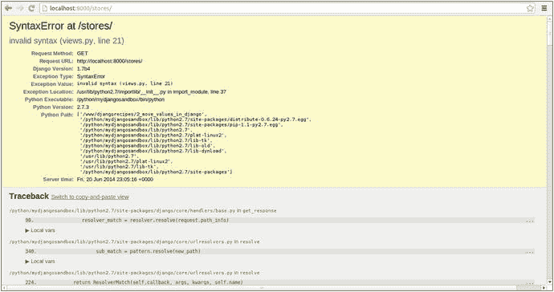
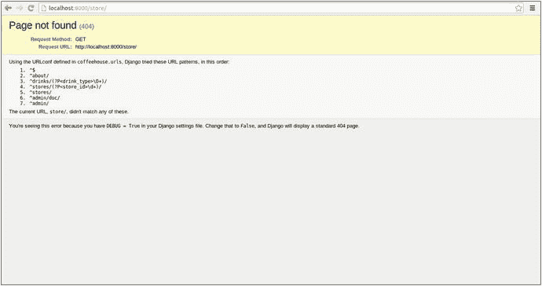
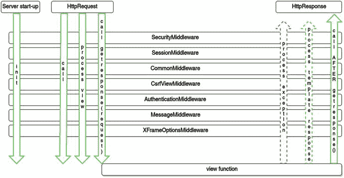
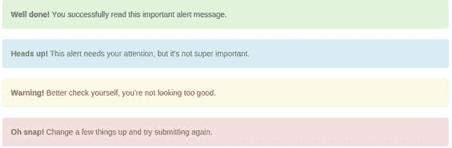

# 2.Django Urls 和视图

在第 [1](01.html) 章中，你学习了 Django 的核心构建模块，包括什么是视图、模型和 URL。在这一章中，您将了解更多关于 Django urls 的内容，它是 Django 应用程序工作流的入口点。您将学习如何创建复杂的 url 正则表达式，如何在视图方法和模板中使用 url 值，如何构造和管理 URL，以及如何命名 URL。

在 URL 之后，Django 视图代表了几乎所有 Django 工作流的下一步，视图负责检查请求、执行业务逻辑、查询数据库和验证数据，以及生成响应。在本章中，您将学习如何创建带有可选参数的 Django 视图，视图请求和响应的结构，如何使用视图中间件，以及如何创建基于类的视图。

## Url 正则表达式

正则表达式在所有编程语言中都提供了一种强大的方法来确定模式。然而，强大的同时也带来了复杂性，甚至有整本书都在讨论正则表达式。 [<sup>1</sup>](#Fn1)

尽管大多数 Django URL 的复杂性不会超过许多正则表达式书中所描述的一小部分，但是理解 Django URL 中正则表达式的一些底层行为和最常见的模式是很重要的。

### 优先规则:粒度 URL 优先，广义 URL 最后

Django urls 需要遵循一定的顺序和语法才能正常工作。广义 url 正则表达式应该最后声明，并且只能在更细粒度的 url 正则表达式之后声明。

这是因为 Django url 正则表达式匹配不使用短路行为，就像嵌套条件语句(例如，if/elif/elif/elif/else)一样，只要满足一个条件，其余选项就会被忽略。在 Django urls 中，如果一个传入的 url 请求有不止一个匹配的正则表达式，那么将会触发最顶层的一个操作。匹配 url 正则表达式的优先级从顶部(即第一个声明的)到底部(即最后一个声明的)给出。

你不应该低估引入两个匹配相同模式的 url 正则表达式有多容易，特别是如果你从来没有使用过正则表达式，因为语法可能很神秘。清单 [2-1](#Par9) 展示了声明 Django urls 的正确方式，更细粒度的正则表达式在顶部，更宽泛的正则表达式在底部。

```py
from django.views.generic import TemplateVieww

urlpatterns = [
    url(r'^about/index/',TemplateView.as_view(template_name='index.html')),
    url(r'^about/',TemplateView.as_view(template_name='about.html')),
]

Listing 2-1.Correct precedence for Django url regular expressions

```

基于清单 [2-1](#Par9) ，让我们看看如果 Django 收到对 url `/about/index/`的请求会发生什么。最初，Django 匹配最后一个正则表达式，即“匹配`^about/`”。接下来，Django 继续向上检查正则表达式，并到达与请求 url `/about/index/`完全匹配的‘match`^about/index/'`,因此触发这个动作将控制发送到`index.html`模板。

现在让我们浏览一个对 url `/about/`的请求。最初，Django 匹配最后一个正则表达式“匹配`^about/`”。接下来，Django 继续向上检查正则表达式，寻找潜在的匹配。因为没有找到匹配——因为‘match`^about/index/'`是一个更细粒度的正则表达式——Django 触发第一个动作，将控制发送给`about.html`模板，这是唯一的正则表达式匹配。

正如您所看到的，清单 [2-1](#Par9) 产生了可以说是预期的行为。但是现在让我们颠倒 url 正则表达式的顺序，如清单 [2-2](#Par13) 所示，并分解为什么向底部声明更细粒度的正则表达式是声明 Django url 正则表达式的错误方式。

```py
from django.views.generic import TemplateVieww

urlpatterns = [
    url(r'^about/',TemplateView.as_view(template_name='about.html')),
    url(r'^about/index/',TemplateView.as_view(template_name='index.html')),
]

Listing 2-2.Wrong precedence for Django url regular expressions

```

当请求 url `/about/index/`时，清单 [2-2](#Par13) 中的问题出现了。最初，Django 匹配最后一个正则表达式，即“匹配`^about/index/`”。然而，Django 继续检查正则表达式，并到达‘match`^about/'`，这是对请求 url `/about/index/`的更广泛的匹配，但仍然是匹配！因此 Django 触发了这个动作，并将控制权发送给了`about.html`模板，而不是第一次匹配时预期的`index.html`模板。

### 精确 Url 模式:放弃广泛匹配

在上一节中，我有意使用了允许广泛 url 匹配的正则表达式。根据我的经验，随着 Django 项目的增长，你最终会面临使用这种类型的 url 正则表达式的需求——但是稍后会详细解释为什么会这样。

事实证明，使用精确的 url 正则表达式是可能的。精确的 url 正则表达式消除了由于 Django url 正则表达式的声明顺序而引入的任何歧义。

让我们修改清单 [2-2](#Par13) 中的 url 正则表达式，使它们成为精确的正则表达式，这样它们的顺序就无关紧要了。清单 [2-3](#Par18) 在清单 [2-2](#Par13) 的基础上展示了精确的正则表达式。

```py
from django.views.generic import TemplateVieww

urlpatterns = [
    url(r'^about/$',TemplateView.as_view(template_name='about.html')),
    url(r'^about/index/$',TemplateView.as_view(template_name='index.html')),
]

Listing 2-3.Exact regular expressions, where url order doesn’t matter

```

注意清单 [2-3](#Par18) 中的正则表达式以`$`字符结束。这是表示行尾的正则表达式符号，这意味着正则表达式 URL 只匹配一个精确的模式。

例如，如果 Django 接收到对 url `/about/index/`的请求，它将只匹配清单 [2-3](#Par18) 中的最后一个正则表达式，即“匹配`^about/index/$`”。然而，它不会匹配更高级的`^/about/$`正则表达式，因为这个正则表达式说与`about/`完全匹配，因为`$`表示模式的结束。

然而，尽管`$`字符对于创建更严格的 url 正则表达式很有用，但是分析它的行为也很重要。如果您计划使用 url 搜索引擎优化(SEO)、A/B 测试技术，或者只是希望允许多个 URL 运行相同的操作，那么使用更严格的正则表达式`$`最终需要做更多的工作。

例如，如果您开始使用像`/about/index/`、`/about/email/`、`/about/address/`这样的 URL，并且它们都使用相同的模板或视图进行处理，精确正则表达式只会使您声明的 URL 数量更大。类似地，如果您使用 A/B 测试或 SEO，其中相同 url 的较长变体以相同的方式处理(例如，`/about/landing/a/`、`/about/landing/b/`、`/about/the+coffeehouse+in+san+diego/`)，宽泛的 url 匹配比声明精确的 url 模式要简单得多。

最后，无论您是否选择使用以`$`结尾的精确 url 正则表达式，我仍然建议您保持将更细粒度的 url 正则表达式放在顶部而将更广泛的 url 正则表达式放在底部的做法，因为这可以避免当不止一个正则表达式匹配一个 URL 请求时出现清单 [2-2](#Par13) 中描述的意外行为。

### 常见 Url 模式

尽管 url 正则表达式可以有无限多种变化——几乎不可能描述每种可能性——但我将提供一些您更可能使用的最常见 url 模式的示例。表 [2-1](#Tab1) 显示了 Django urls 的单个正则表达式字符，表 [2-2](#Tab2) 显示了 url 模式的一系列更具体的例子。

表 2-2。

Common Django url patterns and their regular expressions, with samples

<colgroup><col> <col> <col></colgroup> 
| Url 正则表达式 | 描述 | 示例 URL |
| --- | --- | --- |
| URL(r ' ^ $ ') | 空字符串(主页) | 匹配项:http://127.0.0.1/ |
| url(r'^stores/'，.....) | 有尾随字符吗 | 火柴: [`http://127.0.0.1/stores/`](http://127.0.0.1/stores/) [`http://127.0.0.1/stores/long+string+with+anything+12345`](http://127.0.0.1/stores/long+string+with+anything+12345) |
| url(r'^about/contact/$'，.....) | 精确，无尾随字符 | 匹配: [`http://127.0.0.1/about/contact/`](http://127.0.0.1/about/contact/) 不匹配: [`http://127.0.0.1/about/`](http://127.0.0.1/about/) |
| url(r'^stores/\d+/'，..…) | 数字 | 匹配: [`http://127.0.0.1/stores/2/`](http://127.0.0.1/stores/2/) [`http://127.0.0.1/stores/34/`](http://127.0.0.1/stores/34/) 不匹配: [`http://127.0.0.1/stores/downtown/`](http://127.0.0.1/stores/downtown/) |
| URL(r ' ^ drinks/\ d+/'， | 非数字 | 匹配: [`http://127.0.0.1/drinks/mocha/`](http://127.0.0.1/drinks/mocha/) 不匹配: [`http://127.0.0.1/drinks/324/`](http://127.0.0.1/drinks/324/) |
| url(r'^drinks/mocha&#124;espresso/'，.....) | 单词选项，任何尾随字符 | 匹配:[`http://127.0.0.1/drinks/mocha/`](http://127.0.0.1/drinks/mocha/)[`http://127.0.0.1/drinks/mochaccino/`](http://127.0.0.1/drinks/mochaccino/)[`http://127.0.0.1/drinks/espresso/`](http://127.0.0.1/drinks/espresso/)不匹配: [`http://127.0.0.1/drinks/soda/`](http://127.0.0.1/drinks/soda/) |
| url(r'^drinks/mocha$&#124;espresso/$'，.....) | 单词选项精确，无尾随字符 | 匹配: [`http://127.0.0.1/drinks/mocha/`](http://127.0.0.1/drinks/mocha/) 不匹配: [`http://127.0.0.1/drinks/mochaccino/`](http://127.0.0.1/drinks/mochaccino/) 匹配: [`http://127.0.0.1/drinks/espresso/`](http://127.0.0.1/drinks/espresso/) 不匹配: [`http://127.0.0.1/drinks/espressomacchiato/`](http://127.0.0.1/drinks/espressomacchiato/) |
| url(r'^stores/\w+/'，.....) | 单词字符(任何小写或大写字母、数字或下划线) | 匹配:[`http://127.0.0.1/stores/sandiego/`](http://127.0.0.1/stores/sandiego/)[`http://127.0.0.1/stores/LA/`](http://127.0.0.1/stores/LA/)[`http://127.0.0.1/stores/1/`](http://127.0.0.1/stores/1/)不匹配: [`http://127.0.0.1/san-diego/`](http://127.0.0.1/san-diego/) |
| url(r'^stores/[-\w]+/'，.....) | 单词字符或破折号 | 火柴: [`http://127.0.0.1/san-diego/`](http://127.0.0.1/san-diego/) |
| url(r'^state/[A-Z]{2}/'，.....) | 两个大写字母 | 匹配: [`http://127.0.0.1/CA/`](http://127.0.0.1/CA/) 不匹配: [`http://127.0.0.1/Ca/`](http://127.0.0.1/Ca/) |

表 2-1。

Regular expression syntax for Django urls: Symbol (Meaning)

<colgroup><col> <col> <col> <col></colgroup> 
| url 的开头) | url 的结尾) | \(对解释的值进行转义) | &#124;(或) |
| + (1 次或多次出现) | ？(出现 0 次或 1 次) | {n}(出现 n 次) | {n，m}(出现次数介于 n 和 m 之间) |
| [](字符分组) | (?P <name>___)(捕获与 regexp ___ 匹配的匹配项，并将其分配给 name</name> | 。(任何字符) | \d+(一个或多个数字)。注意 escape，没有 escape 按字面意思匹配' d+'。 |
| \D+(一个或多个非数字)。注意转义，没有转义匹配' D+' | [a-zA-Z0-9_]+(一个或多个单词字符、小写或大写字母、数字或下划线) | \w+(一个或多个单词字符，相当于[a-zA-Z0-9_])。注意 escape，没有 escape 按字面意思匹配‘w+’。 | [-@\w]+(一个或多个单词字符，破折号。或者在符号处)。请注意，\w 没有转义，因为它被括在括号中(即分组)。 |

Django Urls Don’T Inspect Url Query Strings

在某些 URL 上——那些由 HTTP GET 请求生成的 URL，常见于 HTML 表单或 REST 服务中——参数被添加到 URL 中，其中`?`后跟由`&`分隔的`parameter_name=parameter_value`(例如，`/drinks/mocha/?type=cold&size=large`)。这些值集被称为查询字符串，Django 出于 url 模式匹配的目的忽略了它们。

如果您需要使用这些值作为 url 参数——这是下一节探讨的主题——您可以通过请求引用在 Django 视图方法中访问这些值。另一种方法是改变 url 结构以适应正则表达式(例如，用`/drinks/mocha/cold/large/`代替`/drinks/mocha/?type=cold&size=large`)。

## Url 参数、额外选项和查询字符串

您刚刚学习了如何使用各种各样的正则表达式为您的 Django 应用程序创建 URL。然而，如果你回头看看清单 [2-1](#Par9) 、 [2-2](#Par13) 和 [2-3](#Par18) ，你会注意到 URL 上提供的信息被丢弃了。

有时将 url 信息作为参数传递给处理结构是有帮助的，甚至是必要的。例如，如果你有几个类似于`/drinks/mocha/`、`/drinks/espresso/`和`/drinks/latte/`的 url，URL 的最后一部分代表一个饮料名称。因此，将此 url 信息传递给处理模板以在视图中显示它或以其他方式使用它(例如，查询数据库)可能是有帮助的或必要的。为了传递这些信息，url 需要将这些信息作为一个参数。

为了处理 url 参数，Django 对命名组使用 Python 的标准正则表达式语法。 [<sup>2</sup>](#Fn2) 清单 [2-4](#Par31) 显示了一个创建名为`drink_name`的参数的 url。

```py
urlpatterns = [
    url(r'^drinks/(?P<drink_name>\D+)/',TemplateView.as_view(template_name='drinks/index.html')),
]
Listing 2-4.Django url parameter definition for access in templates

```

注意清单 [2-4](#Par31) 中的`(?P<drink_name>\D+)`语法。`?P<>`语法告诉 Django 将正则表达式的这一部分视为命名组，并将值赋给在`<>`之间声明的名为`drink_name`的参数。最后一块`\D+`是确定匹配值的正则表达式；在这种情况下，匹配值是一个或多个非数字字符，如表 [2-1](#Tab1) 所述。

非常重要的一点是，您必须理解，只有当提供的值与指定的正则表达式匹配时，参数才会被捕获(例如，\D+表示非数字)。例如，对于 url 请求`/drinks/mocha/`，值`mocha`被分配给`drink_name`参数，但是对于像`/drinks/123/`这样的 url，正则表达式模式不匹配——因为`123`是数字——所以不采取任何行动。

如果清单 [2-4](#Par31) 中出现 url 匹配，请求将被直接发送到模板`drinks/index.html`。Django 通过同名的 Django 模板上下文变量提供对以这种方式定义的所有参数的访问。因此，要访问参数，您可以直接在模板中使用参数名`drink_type`。例如，要输出参数`drink_name`的值，您可以使用标准的`{{}}` Django 模板语法(例如，`{{drink_name}}`)。

除了将 url 的一部分视为参数，还可以在 url 定义中定义额外的选项，以便在 Django 模板中将它们作为上下文变量来访问。这些额外的选项在一个字典中定义，该字典被声明为 url 定义的最后一部分。

例如，请看清单 [2-4](#Par31) 中修改后的 url Django 定义:

```py
url(r'^drinks/(?P<drink_name>\D+)', TemplateView.as_view(template_name='drinks/index.html'), {'onsale':True}),

```

注意一个带有键值的字典是如何被添加到 url 定义的末尾的。以这种方式，`onsale`键成为一个 url 额外选项，它作为一个上下文变量被传递给底层模板。Url 额外选项可以像 url 参数一样作为模板上下文变量来访问。因此，为了输出额外的选项`onsale`，你可以使用`{{onsale}}`语法。

接下来，让我们看看清单 [2-5](#Par40) 中展示的 url 参数的另一种变体，它将控制发送给 Django 视图方法。

```py
# Project main urls.py
from coffeehouse.stores import views as stores_views

urlpatterns = patterns[
    url(r'^stores/(?P<store_id>\d+)/',stores_views.detail),
]

Listing 2-5.Django url parameter definition for access in view methods in main urls.py file

```

注意清单 [2-5](#Par40) 中的`(?P<store_id>\d+)`语法与清单 2-4 中的非常相似。发生变化的是参数现在被命名为`store_id`，正则表达式是`\d+`来匹配数字。因此，举例来说，如果向 url `/stores/1/`发出请求，则值 1 被赋给`store_id`参数，如果向类似`/stores/downtown/`的 url 发出请求，则正则表达式模式不匹配——因为`downtown`是字母而不是数字——所以不采取任何行动。

如果清单 [2-5](#Par40) 出现 url 匹配，请求将被直接发送到 Django 视图方法`coffeehouse.stores.views.detail`。其中`coffeehouse.stores`是包名，`views.py`是 stores 应用程序中的文件，`detail`是视图方法的名称。清单 [2-6](#Par43) 展示了访问`store_id`参数的`detail`视图方法。

```py
from django.shortcuts import render

def detail(request,store_id):
    # Access store_id with 'store_id' variable
    return render(request,'stores/detail.html')

Listing 2-6.Django view method

in views.py to access url parameter

```

注意清单 [2-6](#Par43) 中的`detail`方法有两个参数。第一个参数是一个`request`对象，它对于所有 Django 视图方法都是相同的。第二个参数是 url 传递的参数。需要注意的是，url 参数的名称必须与方法参数的名称相匹配。在这种情况下，注意清单 [2-5](#Par40) 中的参数名是`store_id`，而清单 [2-6](#Par43) 中的方法参数也被命名为`store_id`。

通过 view method 参数访问 url 参数，该方法可以使用该参数执行逻辑(例如，查询数据库)，然后可以将该参数传递给 Django 模板以供呈现。

Caution

无论正则表达式如何，Django url 参数总是被视为字符串。例如，\d+捕捉数字，但值 1 被视为“1”(字符串)，而不是 1(整数)。如果您计划在视图方法中使用 url 参数，并执行需要字符串以外的内容的操作，这一点尤其重要。

由视图方法处理的 url 参数的另一个可用选项是使它们成为可选的，这反过来允许您对多个 URL 使用相同的视图方法。通过为视图方法参数分配默认值，可以使参数成为可选的。清单 [2-7](#Par48) 显示了一个新的 url，它调用了同一个视图方法(`coffeehouse.stores.views.detail`)，但是没有定义参数。

```py
from coffeehouse.stores import views as stores_views

urlpatterns = patterns[
    url(r'^stores/',stores_views.detail),
    url(r'^stores/(?P<store_id>\d+)/',stores_views.detail),
]

Listing 2-7.Django urls with optional parameters leveraging the same view method

```

如果您调用 url `/stores/`而没有修改清单 [2-6](#Par43) 中的`detail`方法，您会得到一个错误。出现错误是因为`detail`视图方法需要一个`store_id`参数，而第一个 url 没有提供这个参数。要解决这个问题，您可以在视图方法中为`store_id`定义一个默认值，如清单 [2-8](#Par50) 所示。

```py
from django.shortcuts import render

def detail(request,store_id='1'):
    # Access store_id with 'store_id' variable
    return render(request,'stores/detail.html')

Listing 2-8.Django view method

in views.py with default value

```

注意清单 [2-8](#Par50) 中的`store_id`参数如何赋值`='1'`。这意味着如果调用视图方法时没有使用`store_id`，参数将会有一个默认值`'1'`。这种方法允许您利用同一个视图方法来处理带有可选参数的多个 URL。

除了在视图方法中访问 url 参数之外，还可以从 url 定义中访问额外的选项。这些额外的选项在一个字典中定义，该字典被声明为 url 定义中的最后一个参数。在视图方法声明之后，添加一个字典，其中包含您希望在视图方法中访问的键-值对。下面的代码片段展示了清单 [2-7](#Par48) 中 url 语句的修改版本。

```py
url(r'^stores/',stores_views.detail,{'location':'headquarters'})

```

在这种情况下，`location`键成为一个 url 额外选项，作为参数传递给 view 方法。访问 Url 额外选项就像访问 url 参数一样，因此要访问 view 方法中的 url 额外选项，您需要修改方法签名以接受与 url 额外选项同名的参数。在这种情况下，方法签名:

```py
def detail(request,store_id='1'):

```

需要更改为:

```py
def detail(request,store_id='1',location=None):

```

请注意，`location`参数通过赋予默认值`None`而成为可选参数。

最后，还可以在 Django 视图方法中访问由`?`和`&`分隔的 url 参数——技术上称为查询字符串。使用`request`对象可以在视图方法中访问这些类型的参数。

以 url `/stores/1/?hours=sunday&map=flash`为例，清单 [2-9](#Par61) 展示了如何使用`request.GET`从这个由`?`和`&`分隔的 url 中提取参数。

```py
from django.shortcuts import render

def detail(request,store_id='1',location=None):
    # Access store_id param with 'store_id' variable and location param with 'location' variable
    # Extract 'hours' or 'map' value appended to url as
    # ?hours=sunday&map=flash
    hours = request.GET.get('hours', '')
    map = request.GET.get('map', '')
    # 'hours' has value 'sunday' or '' if hours not in url
    # 'map' has value 'flash' or '' if map not in url
    return render(request,'stores/detail.html')

Listing 2-9.Django view method extracting url parameters with request.GET

```

清单 [2-9](#Par61) 使用了语法`request.GET.get(<parameter>, '')`。如果参数出现在`request.GET`中，它提取值并将其赋给一个变量以备将来使用；如果参数不存在，那么参数变量被赋予一个默认的空值`''`——你同样可以使用`None`或任何其他默认值——因为这是 Python 的标准字典`get()`方法语法的一部分，以获得默认值。

最后一个过程被设计成从 HTTP GET 请求中提取参数；然而，Django 还支持从 HTTP POST 请求中提取参数的语法`request.POST.get`,这将在 Django 表单一章和本章后面的 Django 视图方法请求一节中详细描述。

## Url 整合和模块化

默认情况下，Django 会在项目主目录下的`urls.py`文件中查找 url 定义——值得一提的是，这是因为`settings.py`中的`ROOT_URLCONF`变量。然而，一旦一个项目超过了几个 URL，在这个文件中管理它们就变得困难了。例如，看看清单 [2-10](#Par65) 中所示的`urls.py`文件。

```py
from django.conf.urls import url
from django.views.generic import TemplateView
from coffeehouse.about import views as about_views
from coffeehouse.stores import views as stores_views

urlpatterns = [
    url(r'^$',TemplateView.as_view(template_name='homepage.html')),
    url(r'^about/',about_views.index),
    url(r'^about/contact/',about_views.contact),
    url(r'^stores/',stores_views.index),
    url(r'^stores/(?P<store_id>\d+)/',stores_views.detail,{'location':'headquarters'}),
   ]

Listing 2-10.Django urls.py with no url consolidation

```

正如您在清单 [2-10](#Par65) 中看到的，有几个 URL 有多余的根- `about/`和`stores/`。将这些 URL 分开分组会很有帮助，因为这样可以将常见的 URL 保存在各自的文件中，避免了对一个大的`urls.py`文件进行修改的困难。

清单 [2-11](#Par68) 显示了`urls.py`文件的更新版本，其中`about/`和`stores/`根放在不同的文件中。

```py
from django.conf.urls import include, url
from django.views.generic import TemplateView

urlpatterns = [
    url(r'^$',TemplateView.as_view(template_name='homepage.html')),
    url(r'^about/',include('coffeehouse.about.urls')),
    url(r'^stores/',include('coffeehouse.stores.urls'),{'location':'headquarters'}),
   ]

Listing 2-11.Django urls.py with include to consolidate urls

```

清单 [2-11](#Par68) 利用`include`参数从完全独立的文件中加载 URL。在这种情况下，`include('coffeehouse.about.urls')`告诉 Django 从 Python 模块`coffeehouse.about.urls`加载 url 定义，这与 Django 基目录的分离对应于文件路径`/coffeehouse/about/urls.py`。在这种情况下，我继续使用`urls.py`文件名，并把它放在相应的 Django about app 目录下，因为它处理的是`about/`URL。但是，您可以使用任何您喜欢的文件名或路径来定义 url(例如，`coffeehouse.allmyurl.resturls`从文件路径`/coffeehouse/allmyurls/resturls.py`加载 URL)。

清单 [2-11](#Par68) 中的第二个 include 语句与第一个一样，其中`include('coffeehouse.stores.urls')`告诉 Django 从 Python 模块`coffeehouse.stores.urls`加载 url 定义。但是，请注意，第二条语句附加了一个额外的字典作为 url 额外选项，这意味着 include 语句中的所有 URL 也将收到这个额外选项。

清单 [2-12](#Par72) 展示了通过`include('coffeehouse.about.urls')`链接的文件`/coffeehouse/about/urls.py`的内容。

```py
from django.conf.urls import url
from . import views

urlpatterns = [
    url(r'^$',views.index),
    url(r'^contact/$',views.contact),
]

Listing 2-12.Django /coffeehouse/about/urls.py loaded via include

```

快速浏览清单 [2-12](#Par72) ，您可以看到其结构与主`urls.py`文件非常相似；然而，还是有一些细微的区别。虽然 url 正则表达式`r'^$'`看起来像是匹配主页，但事实并非如此。因为清单 [2-12](#Par72) 中的文件通过主`urls.py`文件中的`include`链接，Django 将 url 正则表达式与父 url 正则表达式连接起来。所以清单 [2-12](#Par72) 中的第一个 url 实际上匹配`/about/`，清单 [2-12](#Par72) 中的第二个 url 实际上匹配`/about/contact/`。还因为清单 [2-12](#Par72) 中的`urls.py`文件放在应用程序的`views.py`文件旁边，所以导入语句使用相对路径`from . import views`语法。

除了使用`include`选项引用带有 url 定义的单独文件之外，`include`选项还可以接受作为 Python 列表的 url 定义。本质上，这允许你在主`urls.py`文件中保留所有的 url 定义，但是给它更多的模块性。清单 [2-13](#Par75) 中说明了这种方法。

```py
from django.conf.urls import include, url
from django.views.generic import TemplateView

from coffeehouse.about import views as about_views
from coffeehouse.stores import views as stores_views

store_patterns = [
    url(r'^$',stores_views.index),
    url(r'^(?P<store_id>\d+)/$',stores_views.detail),
]

about_patterns = [
    url(r'^$',about_views.index),
    url(r'^contact/$',about_views.contact),
]

urlpatterns = [
    url(r'^$',TemplateView.as_view(template_name='homepage.html')),
    url(r'^about/',include(about_patterns)),
    url(r'^stores/',include(store_patterns),{'location':'headquarters'}),
   ]

Listing 2-13.Django urls.py with inline include statements

```

清单 [2-13](#Par75) 中 url 模式的结果与清单 [2-11](#Par68) 和 [2-12](#Par72) 相同。区别在于清单 [2-13](#Par75) 使用主`urls.py`文件声明多个 url 列表，而清单 [2-11](#Par68) 和 [2-12](#Par72) 依赖于在不同文件中声明的 url 列表。

## Url 命名和名称空间

项目的内部链接或 url 引用(例如`<a href='/'>Home Page</a>`)往往是硬编码的，无论是在视图方法中将用户重定向到特定位置，还是在模板中提供足够的用户导航。随着项目的增长，硬编码链接会带来严重的维护问题，因为它会导致难以检测和修复的链接。Django 提供了一种命名 URL 的方法，因此很容易在视图方法和模板中引用它们。

命名 Django urls 最基本的技术是将`name`属性添加到`urls.py`中的`url`定义中。清单 [2-14](#Par79) 展示了如何命名一个项目的主页，以及如何从一个视图方法或模板中引用这个 url。

```py
# Definition in urls.py
url(r'^$',TemplateView.as_view(template_name='homepage.html'),name="homepage")

# Definition in view method
from django.http import HttpResponsePermanentRedirect
from django.core.urlresolvers import reverse

def method(request):
    ....
    return HttpResponsePermanentRedirect(reverse('homepage'))

# Definition in template
<a href="">Back to home page</a>

Listing 2-14.Django url using name

```

清单 [2-14](#Par79) 中的 url 定义使用了正则表达式`r'^$'`，它被翻译成`/`或主页，也称为根目录。注意带有`homepage`值的`name`属性。通过给 url 分配一个`name`,您可以在视图方法和模板中使用这个值作为参考，这意味着将来对 url 正则表达式的任何更改，都会自动更新视图方法和模板中的所有 url 定义。

接下来在清单 [2-14](#Par79) 中，您可以看到一个视图方法示例，它将控制重定向到`reverse('homepage')`。Django `reverse`方法试图通过给定的名称查找 url 定义——在本例中是`homepage`——并相应地替换它。类似地，清单 [2-14](#Par79) 中的链接示例`<a href="">Back to home page</a>`利用了 Django ``标签，该标签试图通过其第一个参数来查找 url 在本例中是`homepage`——并相应地替换它。

同样的命名和替换过程也适用于更复杂的 url 定义，比如那些带有参数的定义。清单 [2-15](#Par83) 显示了带有参数的 url 的过程。

```py
# Definition in urls.py
url(r'^drinks/(?P<drink_name>\D+)/',TemplateView.as_view(template_name='drinks/index.html'),name="drink"),

# Definition in view method
from django.http import HttpResponsePermanentRedirect
from django.core.urlresolvers import reverse

def method(request):
    ....
    return HttpResponsePermanentRedirect(reverse('drink', args=(drink.name,)))

# Definition in template
<a href="">Drink on sale</a>

<a href="">Drink on sale</a>

Listing 2-15.Django url with arguments using name

```

清单 [2-15](#Par83) 中的 url 定义使用了一个更复杂的正则表达式，它带有一个参数，可以转换成形式为`/drinks/latte/`或`/drinks/espresso/`的 URL。在这种情况下，url 被赋予参数名`drink_name`。

因为 url 使用一个参数，`reverse`方法和``标记的语法略有不同。`reverse`方法要求 url 参数作为元组提供给`args`变量，而``标签要求 url 参数作为值列表提供。注意，在清单 [2-15](#Par83) 中，参数同样可以是变量或硬编码值，只要它匹配 url 参数正则表达式类型——在本例中是非数字。

对于有多个参数的 url 定义，使用`reverse`和``的方法是相同的。对于`reverse`方法，您传递给它一个带有所有必要参数的元组，对于``标记，您传递给它一个值列表。

Caution

小心使用反向和的无效 url 定义。Django 总是在启动时检查所有反向和定义是否有效。这意味着如果您在反向方法或标记定义中出错——比如 url 名称中的输入错误或参数类型与正则表达式不匹配——应用程序将不会启动并抛出 HTTP 500 内部错误。

这种情况的误差是`NoReverseMatch at....Reverse for 'urlname' with arguments '()' and keyword arguments '{}' not found. X pattern(s) tried`。如果您查看错误堆栈，您将能够指出这是在哪里发生的，并纠正它。请注意，这是一个致命的错误，如果它没有被隔离到发生它的视图或页面，它将在启动时停止整个应用程序。

有时使用属性本身不足以对 URL 进行分类。如果您有两个或三个索引页面，会发生什么情况？或者，如果您有两个符合详细信息条件的 URL，但一个是商店的，另一个是饮料的？

一种简单的方法是使用复合名称(例如，drink_details、store_details)。然而，在这种形式中使用复合名称会导致难以记忆的命名约定和松散的层次结构。Django 支持的一种更简洁的方法是通过`namespace`属性。

属性允许用一个唯一的限定符来标识一组 URL。因为`namespace`属性与一组 URL 相关联，所以它与前面描述的`include`方法一起使用来合并 URL。

清单 [2-16](#Par93) 展示了一系列 url 定义，它们利用了包含的名称空间属性。

```py
# Main urls.py
from django.conf.urls import include, url

urlpatterns = [
    url(r'^$',TemplateView.as_view(template_name='homepage.html'),name="homepage"),
    url(r'^about/',include('coffeehouse.about.urls',namespace="about")),
    url(r'^stores/',include('coffeehouse.stores.urls',namespace="stores")),
]

# About urls.py
from . import views

urlpatterns = [
    url(r'^$',views.index,name="index"),
    url(r'^contact/$',views.contact,name="contact"),
]

# Stores urls.py
from . import views

urlpatterns = [
    url(r'^$',views.index,name="index"),
    url(r'^(?P<store_id>\d+)/$',views.detail,name="detail"),
)

# Definition in view method
from django.http import HttpResponsePermanentRedirect
from django.core.urlresolvers import reverse

def method(request):
    ....
    return HttpResponsePermanentRedirect(reverse('about:index'))

# Definition in template
<a href="">Back to stores index</a>

Listing 2-16.Django urls.py

with namespace attribute

```

清单 [2-16](#Par93) 以一组典型的 Django `urls.py`主文件的`include`定义开始。注意这两个定义都使用了`namespace`属性。接下来，您可以看到在主`urls.py`文件中引用的`urls.py`文件，这些文件利用了前面示例中描述的`name`属性。注意 about 和 stores `urls.py`文件都有一个带`name='index'`的 url。

要用名称空间限定 url 名称，可以使用语法`<namespace>:<name>`。正如您在清单 [2-16](#Par93) 的底部看到的，要引用 about `urls.py`中的索引，您使用`about:index`，要引用 stores `urls.py`文件中的索引，您使用`stores:index.`

namespace 属性也可以嵌套使用语法`<namespace1>:<namespace2>:<namespace3>:<name>`来引用 URL。清单 [2-17](#Par97) 展示了一个嵌套名称空间属性的例子。

```py
# Main urls.py
from django.conf.urls import include, url
from django.views.generic import TemplateView

urlpatterns = [
    url(r'^$',TemplateView.as_view(template_name='homepage.html'),name="homepage"),
    url(r'^stores/',include('coffeehouse.stores.urls',namespace="stores")),
]

# Stores urls.py
from . import views

urlpatterns = [
    url(r'^$',views.index,name="index"),
    url(r'^(?P<store_id>\d+)/$',views.detail,name="detail"),
    url(r'^(?P<store_id>\d+)/about/',include('coffeehouse.about.urls',namespace="about")),
]

# About urls.py
from . import views

urlpatterns = [
    url(r'^$',views.index,name="index"),
    url(r'^contact/$',views.contact,name="contact"),
]

# Definition in view method
from django.http import HttpResponsePermanentRedirect
from django.core.urlresolvers import reverse

def method(request):
    ....
    return HttpResponsePermanentRedirect(reverse('stores:about:index', args=(store.id,)))

# Definition in template
<a href="">See about for {{store.name}}</a>

Listing 2-17.Django urls.py with nested namespace attribute

```

清单 [2-17](#Par97) 中的 url 结构与清单 [2-16](#Par93) 的不同之处在于，它为每个商店(例如`/stores/1/about/`)创建了 about url，而不是拥有一个通用的 about URL(例如`/about/`)。在清单 [2-17](#Par97) 的顶部，我们使用`namespace="stores"`来限定 stores `urls.py`文件中的所有 URL。

接下来，在 stores `urls.py`文件中，注意还有另一个带有`namespace="about"`的`include`元素来限定 about `urls.py`中的所有 URL。最后，在 about `urls.py`文件中，有一些 URL 只使用了`name`属性。在清单 [2-17](#Par97) 的最后一部分，您可以看到嵌套的名称空间是如何与`reverse`方法和``标签一起使用的，它们使用一个`:`来分隔名称空间。

在 99%的 Django urls 中，你可以像描述的那样使用`name`和`namespace`参数。然而，当您在同一个项目中部署同一个 Django 应用程序的多个实例时，`namespace`参数具有特殊的意义。

因为 Django 应用程序是具有 url 定义的自包含单元，所以即使 Django 应用程序使用 url 名称空间，也会出现边缘情况。如果 Django 应用程序使用名称空间 X，但是您想在同一个项目中部署该应用程序两次或三次，会发生什么情况？假设每个应用程序都使用名称空间 X，那么如何引用它们的 URL 呢？这就是术语实例名称空间和`app_name`属性的由来。

让我们看一个场景，这个场景使用同一个 Django 应用程序的多个实例来说明这个与 url 名称空间相关的边缘情况。假设您开发了一个名为 banners 的 Django 应用程序来显示广告。横幅应用程序的构建方式是，它必须在不同的 URL 上运行(例如，`/coffeebanners/`、`/teabanners/`、`/foodbanners/`)，以简化横幅的选择。本质上，您需要在同一个项目中运行横幅应用程序的多个实例，每个实例位于不同的 URL 上。

那么多个 app 实例和 url 命名有什么问题呢？它与使用需要根据当前应用程序实例动态改变的命名 URL 有关。这个问题通过一个例子最容易理解，所以让我们跳到清单 [2-18](#Par104) 中的例子。

```py
# Main urls.py
from django.conf.urls import include, url

urlpatterns = [
    url(r'^$',TemplateView.as_view(template_name='homepage.html'),name="homepage"),
    url(r'^coffeebanners/',include('coffeehouse.banners.urls',namespace="coffee-banners")),
    url(r'^teabanners/',include('coffeehouse.banners.urls',namespace="tea-banners")),
    url(r'^foodbanners/',include('coffeehouse.banners.urls',namespace="food-banners")),
]

# Banners urls.py
from django.conf.urls import url
from . import views

urlpatterns = [
    url(r'^$',views.index,name="index"),
]

# Definition in view method
from django.http import HttpResponsePermanentRedirect
from django.core.urlresolvers import reverse

def method(request):
    ....
    return HttpResponsePermanentRedirect(reverse('coffee-banners:index'))
    return HttpResponsePermanentRedirect(reverse('tea-banners:index'))
    return HttpResponsePermanentRedirect(reverse('food-banners:index'))

# Definition in template
<a href="">Coffee banners</a>
<a href="">Tea banners</a>
<a href="">Food banners</a>

Listing 2-18.Django urls.py with multiple instances

of the same app

```

在清单 [2-18](#Par104) 中，你可以看到我们有三个指向同一个`coffeehouse.banners.urls`文件的 URL，每个都有自己独特的名称空间。接下来，让我们看看清单 [2-18](#Par104) 中的各种`reverse`方法和``标记示例。

清单 [2-18](#Par104) 中的`reverse`方法和``标记示例都使用`<namespace>:<name>`语法解析为三个不同的 url 名称。所以你可以使用`namespace`和`name`有效地部署同一个 Django 应用的多个实例。

然而，仅仅依靠`namespace`和`name`，解析的 url 名称无法动态适应不同的应用实例，这是与内部应用逻辑相关的边缘情况，必须包含内部应用逻辑以支持 Django 应用的多个实例。现在让我们来看看一个视图和模板场景，它展示了这个场景以及`app_name`属性如何解决这个问题。

假设在横幅应用程序中，您想要将控制重定向到应用程序的主索引 url(例如，由于异常)。现在戴上应用设计师的帽子，你会如何解决这个问题？作为一名应用程序设计师，你甚至不知道咖啡横幅、茶横幅或食物横幅名称空间，因为这些是部署名称空间。您如何在应用程序中内部集成重定向，以适应正在部署的应用程序的多个实例？这就是`app_name`参数的用途。

清单 [2-19](#Par110) 展示了如何利用`app_name`属性来动态确定重定向到哪里。

```py
# Main urls.py
from django.conf.urls import include, url

urlpatterns = [
    url(r'^$',TemplateView.as_view(template_name='homepage.html'),name="homepage"),
    url(r'^coffeebanners/',include('coffeehouse.banners.urls',namespace="coffee-banners")),
    url(r'^teabanners/',include('coffeehouse.banners.urls',namespace="tea-banners")),
    url(r'^foodbanners/',include('coffeehouse.banners.urls',namespace="food-banners")),
]

# Banners urls.py
from django.conf.urls import url
from . import views

app_name = 'banners_adverts'
urlpatterns = [
    url(r'^$',views.index,name="index"),
]

# Logic inside Banners app
from django.http import HttpResponsePermanentRedirect
from django.core.urlresolvers import reverse

def method(request):
    ....
    try:
       ...
    except:
       return HttpResponsePermanentRedirect(reverse('banners_adverts:index'))

Listing 2-19.Django redirect that leverages app_name to determine url

```

注意横幅应用程序的清单 [2-19](#Par110) 中的`urls.py`文件在声明`urlpatterns`值之前设置了`app_name`属性。接下来，注意清单 [2-19](#Par110) 中的`reverse`方法使用了`banners_adverts:index`值，其中`banners_adverts`代表`app_name`。这是一个重要的约定，因为 Django 依赖相同的语法来搜索`app_name`或`namespace`匹配。

那么你认为`banners_adverts:index`会解析到什么 url 呢？这完全取决于导航发生在哪里，它是动态的！如果用户在咖啡横幅应用实例(即 url `coffeebanners`)中导航，那么 Django 将`banners_adverts:index`解析为咖啡横幅实例索引，如果用户在茶横幅应用实例(即 url `teabanners`)中导航，那么 Django 将`banners_adverts:index`解析为茶横幅实例索引，以此类推任何其他数量的实例。如果用户在 banners 应用程序实例之外导航(即没有应用程序实例)，Django 默认将`banners_adverts:index`解析为`urls.py`中最后定义的实例，这将是 food-banners。

以这种方式并基于用户来自的请求路径实例(例如，如果用户在带有`/coffeebanners/`或`/teabanners/`的路径上)，反向方法将`banners_adverts:index`动态解析为三个 url 应用实例之一，而不是硬编码特定的 url 名称空间，如清单 [2-18](#Par104) 所示。

现在让我们假设 banners 应用程序有一个内部模板，里面有一个到应用程序主`index` url 的链接。同样，考虑到多个应用程序实例的可能性，您将如何在模板中生成这个链接？依靠相同的`app_name`参数解决了清单 [2-20](#Par115) 中所示的模板链接的问题。

```py
# template banners/index.html
<a href=""></a>
Listing 2-20.Django template link

that leverages app_name to determine url

```

注意清单 [2-20](#Par115) 中的``标签指向`banners_adverts:index`。`banners_adverts:index`的解析过程与前面使用`reverse`方法的方法示例中概述的过程相同。

如果用户在咖啡横幅应用实例(即 url `coffeebanners`)中导航，那么 Django 将`banners_adverts:index`解析为咖啡横幅实例索引，如果用户在茶横幅应用实例(即 url `teabanners`)中导航，那么 Django 将`banners_adverts:index`解析为茶横幅实例索引，以此类推任何其他数量的实例。如果用户在横幅应用实例之外导航(即没有应用实例)，Django 默认将`banners_adverts:index`解析为`urls.py`中最后定义的实例，即`food-banners`。

正如您所看到的，`app_name`属性的目的是为 Django 应用程序设计者提供一种内部机制，通过这种机制，可以为动态适应同一应用程序的多个实例的命名 URL 集成逻辑。由于这个原因，它没有被广泛用于 url 命名，并且在大多数情况下可以被放弃，只使用`namespace`和`name`属性。

## 查看方法请求

到目前为止，您已经使用了 Django 视图方法及其输入——`request`对象和参数——以及它们的输出，包括生成直接响应或依赖模板生成响应。然而，现在是时候更深入地了解视图方法请求中的可用内容以及生成视图方法响应的各种替代方法了。

到目前为止，您毫无疑问地放在视图方法中的`request`引用是`django.http.request.HttpRequest`类的一个实例。 [<sup>3</sup>](#Fn3) 这个`request`对象包含由视图方法之前存在的实体设置的信息:用户的 web 浏览器、运行应用程序的 web 服务器或应用程序上配置的 Django 中间件类。

下面的列表显示了一些在`request`参考中最常见的属性和方法:

*   `request.method`。-包含用于请求的 HTTP 方法(例如，`GET`、`POST`)。
*   `request.GET`或`request.POST`。-包含分别作为 GET 或 POST 请求的一部分添加的参数。参数被括为一个`django.http.request.QueryDict` [<sup>4 个</sup>](#Fn4) 实例。
    *   `request.POST.get('name',default=None)`。-获取 POST 请求中的`name`参数的值，如果该参数不存在，则获取`None`。注意`default`可以用自定义值覆盖。
    *   `request.GET.getlist('drink',default=None)`。-获取 GET 请求中的`drink`参数的值列表，或者如果参数不存在，则获取空列表`None`。注意`default`可以用自定义值覆盖。
*   `request.META`。-包含由浏览器或 web 服务器作为请求的一部分添加的 HTTP 标头。参数包含在一个标准的 Python 字典中，其中键是 HTTP 头名称——大写和下划线(例如，`Content-Length`作为键`CONTENT_LENGTH`)。
    *   `request.META['REMOTE_ADDR']`。-获取用户的远程 IP 地址。
*   `request.user`。-包含链接到请求的 Django 用户的信息(如用户名、电子邮件)。注意`user`指的是`django.contrib.auth`包中的用户，通过 Django 中间件设置，这将在本章后面描述。

正如您可以从这个简短的列表中证明的那样，`request`引用包含许多可操作的信息来满足业务逻辑(例如，您可以基于来自用户`'`的 IP 地址的地理位置信息来响应某些内容)。在`django.http.request.HttpRequest`和`django.http.request.QueryDict`属性和方法之间有超过 50 个`request`选项可用，所有这些都在书中相关的部分进行了解释——但是你可以在上一页的脚注链接中查看`request`选项的完整范围。

一旦您完成了从`request`引用中提取信息并对其进行相关的业务逻辑处理(例如，查询数据库，从第三方 REST 服务中获取数据)，您就需要在一个视图方法中设置数据，以将其作为响应的一部分发送出去。

要在 Django 视图方法中设置数据，首先需要在方法体中声明或提取数据。您可以声明字符串、数字、列表、元组、字典或任何其他 Python 数据结构。

一旦在视图方法中声明或提取了数据，就可以创建一个字典来使数据在 Django 模板上可访问。字典键代表模板的引用名，而值是数据结构本身。清单 [2-21](#Par135) 展示了一个视图方法，它声明了多个数据结构并将它们传递给 Django 模板。

```py
from django.shortcuts import render

def detail(request,store_id='1',location=None):
    # Create fixed data structures to pass to template
    # data could equally come from database queries
    # web services or social APIs
    STORE_NAME = 'Downtown'
    store_address = {'street':'Main #385','city':'San Diego','state':'CA'}
    store_amenities = ['WiFi','A/C']
    store_menu = ((0,''),(1,'Drinks'),(2,'Food'))
    values_for_template = {'store_name':STORE_NAME, 'store_address':store_address, 'store_amenities':store_amenities, 'store_menu':store_menu}
    return render(request,'stores/detail.html', values_for_template)

Listing 2-21.Set up dictionary in Django view method for access in template

```

注意清单 [2-21](#Par135) 中的`render`方法是如何包含`values_for_template`字典的。在前面的例子中，`render`方法只包含了`request`对象和一个处理请求的模板。在清单 [2-21](#Par135) 中，字典作为最后一个`render`参数被传递。通过将一个字典指定为最后一个参数，该字典对模板可用——在本例中是`stores/detail.html`。

Tip

如果您计划在多个模板上访问相同的数据，而不是在多个视图上声明它，您可以使用上下文处理器来声明它一次，并使它在所有项目模板上都可以访问。关于 Django 模板的下一章将讨论这个主题。

清单 [2-21](#Par135) 中的字典包含键和值，它们是在方法体中声明的数据结构。字典键成为访问 Django 模板中的值的引用。

Output View Method Dictionary in Django Templates

虽然下一章将深入讨论 Django 模板，但是下面的代码片段显示了如何使用{{}}语法输出清单 [2-21](#Par135) 中的字典值。

```py
<h4>{{store_name}} store</h4>
<p>{{store_address.street}}</p>
<p>{{store_address.city}},{{store_address.state}}</p>
<hr/>
<p>We offer: {{store_amenities.0}} and {{store_amenities.1}}</p>
<p>Menu includes : {{store_menu.1.1}} and {{store_menu.2.1}}</p>

```

第一个声明`{{store_name}}`使用独立键显示`Downtown`值。其他访问声明使用点(`.`)符号，因为值本身是复合数据结构。

`store_address`键包含一个字典，因此要访问内部字典值，可以使用由点(`.`)分隔的内部字典键。`store_address.street`显示街道值，`store_address.city`显示城市值，`store_address.state`显示州值。

store _ 市容键包含一个使用类似点(.)符号来访问内部值。然而，因为 Python 列表没有键，所以使用列表索引号。store _ facilities . 0 显示列表 store _ facilities 和 store _ facilities 中的第一项。1 显示列表 store _ facilities 中的第二项。

`store_menu key`包含一个元组，由于缺少键，它也需要一个数字。`{{store_menu.1.1}}`显示`store_menu`的第二元组值的第二元组值，`{{store_menu.2.1}}`显示`store_menu`的第三元组的第二元组值。

## 查看方法响应

到目前为止，生成视图方法响应的`render()`方法实际上是一种快捷方式。你可以在清单 [2-21](#Par135) 的顶部看到，`render()`方法是`django.shortcuts`包的一部分。

这意味着除了生成视图响应的`render()`方法之外，还有其他方法，尽管`render()`方法是最常用的技术。对于初学者来说，有三种类似的方法来生成带有模板支持的数据的视图方法响应，如清单 [2-22](#Par147) 所示。

```py
# Option 1)
from django.shortcuts import render

def detail(request,store_id='1',location=None):
    ...
    return render(request,'stores/detail.html', values_for_template)

# Option 2)
from django.template.response import TemplateResponse

def detail(request,store_id='1',location=None):
    ...
    return TemplateResponse(request, 'stores/detail.html', values_for_template)

# Option 3)
from django.http import HttpResponse
from django.template import loader, Context

def detail(request,store_id='1',location=None):
     ...
     response = HttpResponse()
     t = loader.get_template('stores/detail.html')
     c = Context(values_for_template)
     return response.write(t.render(c))

Listing 2-22.Django view method response alternatives

```

清单 [2-22](#Par147) 中的第一个选项是`django.shortcuts.render()`方法，它显示了生成响应的三个参数:(必需的)`request`引用、(必需的)模板路由和(可选的)字典——也称为上下文——以及要传递给模板的数据。

清单 [2-22](#Par147) : `content_type`中没有显示`render()`方法的另外三个(可选)参数，这些参数为响应设置 HTTP `Content-Type`头，默认为`settings.py`中的`DEFAULT_CONTENT_TYPE`参数，后者本身默认为`text/html`；`status`为默认为`200`的响应设置 HTTP `Status`代码；和`using`来指定模板引擎——或者是`jinja2`或者是`django`——来生成响应。下一节关于`render()`方法的 HTTP 处理描述了如何使用`content_type & status`，而第 [3](03.html) 和 [4](04.html) 章讨论了 Django 和 Jinja 模板引擎。

清单 [2-22](#Par147) 中的第二个选项是`django.template.response.TemplateResponse()`类，它在输入方面与`render()`方法几乎相同。这两种变体的区别在于，一旦一个视图方法完成后,`TemplateResponse()`可以改变响应(例如，通过中间件),而`render()`方法被认为是视图方法完成后生命周期中的最后一步。当您预见到需要在多个视图方法完成工作后修改它们的视图方法响应时，您应该使用`TemplateResponse()`，这种技术将在本章关于视图方法中间件的后续章节中讨论。

清单 [2-22](#Par147) : `content_type`中没有显示的`TemplateResponse()`类还有四个(可选)参数，默认为`text/html`；`status`默认为`200`；`charset`设置来自 HTTP `Content-Type`头或`settings.py`中的`DEFAULT_CHARSET`的响应编码，其本身默认为`utf-8`；和`using`来指示模板引擎——或者`jinja2`或者`django`——来生成响应。

清单 [2-22](#Par147) 中的第三个选项代表了最长的，但也是最灵活的响应创建过程。这个过程首先创建一个原始的`HTTPResponse`实例，然后用`django.template.loader.get_template()`方法加载一个模板，创建一个`Context()`类将值加载到模板中，最后将一个呈现的模板及其上下文写到`HTTPResponse`实例中。虽然这是三个选项中最长的一个，但是当视图方法响应需要高级选项时，这是首选。即将到来的关于内联和流式内容的内置响应快捷方式的部分，有更多关于`HTTPResponse`响应类型的细节。

### HTTP 状态和内容类型标头的响应选项

浏览器在请求中设置 HTTP 头，告诉应用程序在处理时考虑某些特征。类似地，应用程序在响应中设置 HTTP 头，告诉浏览器考虑发送内容的某些特征。Django 等应用程序设置的最重要的 HTTP 头是`Status`和`Content-Type`。

HTTP `Status`头是一个三位数的代码，表示给定请求的响应状态。`Status`值的例子有`200`，它是成功的 HTTP 请求的标准响应，以及`404`，它用于指示无法找到请求的资源。HTTP `Content-Type`报头是一个 MIME(多用途互联网邮件扩展)类型的字符串，用于指示响应中的内容类型。`Content-Type`值的例子有`text/html`，它是 HTML 内容响应的标准，以及`image/gif`，它用于指示响应是 GIF 图像。

默认情况下，除非有错误，所有用`django.shortcuts.render()`、`TemplateResponse()`类或`HttpResponse()`类创建响应的 Django 视图方法——如清单 [2-22](#Par147) 所示——创建一个响应，将 HTTP `Status`值设置为`200`，将 HTTP `Content-Type`设置为`text/html`。虽然这些默认值是最常见的，但是如果您想要发送不同类型的响应(例如，错误或非 HTML 内容)，就有必要修改这些值。

覆盖清单 [2-22](#Par147) 中三个选项中任意一个的 HTTP `Status`和`Content-Type`头值就像提供额外的参数`status`和/或`content_type`一样简单。清单 [2-23](#Par157) 展示了这个过程的各种例子。

```py
from django.shortcuts import render

# No method body(s) and only render() example provided for simplicity

# Returns content type text/plain, with default HTTP 200
return render(request,'stores/menu.csv', values_for_template, content_type='text/plain')

# Returns HTTP 404, wtih default text/html
# NOTE: Django has a built-in shortcut & template 404 response, described in the next section
return render(request,'custom/notfound.html',status=404)

# Returns HTTP 500, wtih default text/html
# NOTE: Django has a built-in shortcut & template 500 response, described in the next section
return render(request,'custom/internalerror.html',status=500)

# Returns content type application/json, with default HTTP 200
# NOTE: Django has a built-in shortcut JSON response, described in the next section
return render(request,'stores/menu.json', values_for_template, content_type='application/json')

Listing 2-23.HTTP Content-type and HTTP Status for Django view method responses

```

清单 [2-23](#Par157) 中的第一个例子旨在返回一个包含纯文本内容的响应。注意`render`方法的`content_type`参数。清单 [2-23](#Par157) 中的第二个和第三个例子将 HTTP `Status`代码设置为`404`和`500`。因为 HTTP Status `404`代码用于未找到的资源，所以`render`方法为此使用了一个特殊的模板。类似地，因为 HTTP `Status 500`代码用于指示错误，`render`方法也为此使用了一个特殊的模板。

Tip

Django 有内置的快捷方式和模板来处理 HTTP `Status`代码`404`和`500`，以及 JSON 快捷方式响应，所有这些都将在下一节中描述，您可以使用它们来代替清单 [2-23](#Par157) 中的示例。

清单 [2-23](#Par157) 中的第四个也是最后一个例子旨在返回一个带有 JavaScript 对象符号(JSON)内容的响应。HTTP `Content-Type application/json`是通过异步 JavaScript (AJAX)消费 JavaScript 数据的浏览器发出的请求的常见要求。

### 常见 HTTP 状态的内置响应快捷方式和模板:404(未找到)、500(内部服务器错误)、400(错误请求)和 403(禁止)

虽然 Django 在找不到页面时会自动触发 HTTP 404 `Status` (Not Found)响应，并且在视图中出现未处理的异常时也会触发 HTTP 500 `Status`(内部服务器错误)响应，但是它有内置的快捷方式和模板，当您知道最终用户应该获得它们时，这些快捷方式和模板就应该在 Django 视图中明确使用。表 [2-3](#Tab3) 说明了触发特定 HTTP 状态响应的不同快捷方式。

表 2-3。

Django shortcut exceptions to trigger HTTP statuses

<colgroup><col> <col></colgroup> 
| HTTP 状态代码 | Python 代码示例 |
| --- | --- |
| 404(未找到) | 从 django.http 导入 Http404 引发 Http404 |
| 500(内部服务器错误) | 引发异常 |
| 400(错误请求) | 从 django.core.exceptions 导入可疑操作提出可疑操作 |
| 403(禁止) | 从 django.core.exceptions 导入权限拒绝提升权限拒绝 |

*Django automatically handles not found pages raising HTTP 404 and unhandled exceptions raising HTTP 500

正如你在表 [2-3](#Tab3) 的例子中看到的，快捷方式的语法很简单。例如，您可以在 Django 视图中进行评估，如`if article_id < 100:`或`if unpayed_subscription:`，并基于结果从表 [2-3](#Tab3) 中抛出异常，以便最终用户获得正确的 HTTP 状态响应。

那么当表 [2-3](#Tab3) 中的异常被触发时，除了 HTTP 状态之外，响应中发送的实际内容是什么呢？HTTP `400`(错误请求)和 HTTP `403`(禁止请求)的默认设置是一个单行 HTML 页面，分别显示“`Bad Request (400)`和“`403 Forbidden`”。对于 HTTP `404`(未找到)和 HTTP `500`(内部服务器错误)，取决于`settings.py`中的`DEBUG`值。

如果 Django 项目在`settings.py`中有`DEBUG=True`，HTTP `404`(未找到)生成一个带有可用 URL 的页面——如图 [2-1](#Fig1) 所示——HTTP`500`(内部服务器错误)生成一个带有详细错误的页面——如图 [2-2](#Fig2) 所示。如果 Django 项目在`settings.py`中有`DEBUG=False`，HTTP `404`(未找到)会生成一个单行 HTML 页面，显示为“`Not Found. The requested URL <url_location> was not found on this server.`”，HTTP `500`(内部服务器错误)会生成一个单行 HTML 页面，显示为“`A server error occurred. Please contact the administrator"`。



图 2-2。

HTTP 500 for Django project when DEBUG=True



图 2-1。

HTTP 404 for Django project when DEBUG=True

还可以用定制模板覆盖所有以前的 HTTP 代码的默认响应页面。要使用定制的响应页面，您需要用所需的 HTTP 代码和`.html`扩展名创建一个模板。例如，对于 HTTP `403`，您将创建`403.html`模板，对于 HTTP `500`，您将创建`500.html`模板。所有这些定制的 HTTP 响应模板都需要放在`TEMPLATES`变量的`DIRS`列表中定义的文件夹中，以便 Django 在使用默认的 HTTP 响应模板之前找到它们。

Caution

自定义 404.html 和 500.html 页面仅在 DEBUG=False 时有效。

如果`DEBUG=True`，无论在正确的位置是否有`404.html`或`500.html`模板，Django 都使用默认的响应行为，分别如图 [2-1](#Fig1) 和图 [2-2](#Fig2) 所示。您需要设置`DEBUG=False`以使自定义`404.html`和`500.html`模板工作。

在某些情况下，使用定制的 HTTP 响应模板可能还不够。例如，如果您想将上下文数据添加到处理 HTTP 响应的自定义模板中，您需要自定义内置的 Django HTTP view 方法本身，因为没有其他方法可以将数据传递到这种类型的模板中。要定制内置的 Django HTTP 视图方法，您需要在项目的`urls.py`文件中声明特殊的处理程序。清单 [2-24](#Par169) 展示了带有 Django 内置 HTTP `Status`视图方法的定制处理程序的`urls.py`文件。

```py
# Overrides the default 400 handler django.views.defaults.bad_request
handler400 = 'coffeehouse.utils.views.bad_request'
# Overrides the default 403 handler django.views.defaults.permission_denied
handler403 = 'coffeehouse.utils.views.permission_denied'
# Overrides the default 404 handler django.views.defaults.page_not_found
handler404 = 'coffeehouse.utils.views.page_not_found'
# Overrides the default 500 handler django.views.defaults.server_error
handler500 = 'coffeehouse.utils.views.server_error'

urlpatterns = [....
]

Listing 2-24.Override built-in Django HTTP Status

view methods in urls.py

```

Caution

如果 DEBUG=True，handler404 和 handler500 处理程序将无法工作，Django 将继续使用内置的 Django HTTP 视图方法。要使 handler404 和 handler500 处理程序工作，需要设置 DEBUG=False。

正如您在清单 [2-24](#Par169) 中看到的，在标准`urlpatterns`变量的正上方`urls.py`中有一系列变量。清单 [2-24](#Par169) 中的每个变量代表一个 HTTP `Status`处理程序，其值对应于一个定制的 Django 视图来处理请求。例如，`handler400`表示所有 HTTP `400`请求都应该由 Django 视图方法`coffeehouse.utils.views.bad_request`处理，而不是默认的`django.views.defaults.bad_request`。对于使用`handler403`的 HTTP `403`请求、使用`handler404`的 HTTP `404`请求和使用`handler500`的 HTTP 500 请求，采取相同的方法。

就定制 Django 视图方法的实际结构而言，它们与任何其他 Django 视图方法都是相同的。清单 [2-26](#Par183) 显示了清单 [2-25](#Par173) 中使用的定制视图方法的结构。

```py
from django.shortcuts import render

def page_not_found(request):
    # Dict to pass to template, data could come from DB query
    values_for_template = {}
    return render(request,'404.html',values_for_template,status=404)

def server_error(request):
    # Dict to pass to template, data could come from DB query
    values_for_template = {}
    return render(request,'500.html',values_for_template,status=500)

def bad_request(request):
    # Dict to pass to template, data could come from DB query
    values_for_template = {}
    return render(request,'400.html',values_for_template,status=400)

def permission_denied(request):
    # Dict to pass to template, data could come from DB query
    values_for_template = {}
    return render(request,'403.html',values_for_template,status=403)

Listing 2-25.Custom views to override built-in Django HTTP view methods

```

正如您在清单 [2-26](#Par183) 中看到的，定制的 HTTP 视图方法使用了与前面的视图方法示例相同的来自`django.shortcut` s 的`render`方法。这些方法指向一个由 HTTP `Status`代码命名的模板，使用一个可以在模板上访问的定制数据字典，并使用`status`参数来指示 HTTP 状态代码。

### 内联和流式内容的内置响应快捷方式

所有先前的视图响应示例都是基于通过模板结构化的内容来工作的。然而，有时使用模板输出响应是不必要的(例如，一行响应说“这里没有什么可看的”)。

其他时候，响应使用模板是没有意义的，例如 HTTP `301`(永久重定向)或 HTTP `302`(重定向)，其中响应只需要一个重定向 url。表 [2-4](#Tab4) 说明了触发 HTTP 重定向的不同快捷方式。

表 2-4。

Django shortcuts for HTTP redirects

<colgroup><col> <col></colgroup> 
| HTTP 状态代码 | Python 代码示例 |
| --- | --- |
| 301(永久重定向) | 从 django.http 导入 HttpResponsePermanentRedirect 返回 HttpResponsePermanentRedirect("/") |
| 302(重定向) | 从 django.http 导入 httpresponserdirect 返回 httpresponserdirect("/") |

表 [2-4](#Tab4) 中的两个示例都重定向到应用程序的主页(即`"/"`)。但是，您也可以将重定向设置为任何应用程序 url，甚至是不同域上的完整 url(例如， [`http://maps.google.com/`](http://maps.google.com/) )。

除了响应重定向快捷方式，Django 还提供了一系列响应快捷方式，您可以在其中添加内联响应。表 [2-5](#Tab5) 说明了具有内嵌内容响应的 HTTP 状态代码的各种其他快捷方式。

表 2-5。

Django shortcuts for inline and streaming content responses

<colgroup><col> <col></colgroup> 
| 目的或 HTTP 状态代码 | Python 代码示例 |
| --- | --- |
| 304(未修改) | 从 django.http 导入 HttpResponseNotModified 返回 HttpResponseNotModified()* |
| 400(错误请求) | 从 django.http 导入 HttpResponseBadRequest 返回 HttpResponseBadRequest("

#### 请求看起来不对劲

") |
| 404(未找到) | 从 django.http 导入 HttpResponseNotFound 返回 HttpResponseNotFound("

#### Ups，我们找不到那个页面

") |
| 403(禁止) | 从 django.http 导入 HttpResponseForbidden 返回 HttpResponseForbidden("这里什么都看不到"，content_type="text/plain ") |
| 405(不允许的方法) | 从 django.http 导入 HttpResponseNotAllowed 返回 HttpResponseNotAllowed("

#### 方法不允许使用

") |
| 410(走了) | 从 django.http 导入 HttpResponseGone 返回 HttpResponseGone("不再在这里"，content_type="text/plain ") |
| 500(内部服务器错误) | 从 django.http 导入 httpresponseserverror 返回 httpresponseserverror("

#### Ups，这是我们的失误，抱歉！

)) |
| 将数据序列化为 JSON 的内联响应(默认为 HTTP 200 和内容类型 application/json) | 从 django.http 导入 JSON response data _ dict = { ' name ':' Downtown '，' address':'Main #385 '，' city':'San Diego '，' state':'CA'}返回 JsonResponse(data_dict) |
| 流数据内联响应(默认为 HTTP 200 和流内容，它是字符串的迭代器) | 从 django.http 导入 StreamingHttpResponse 返回 streaming httpresponse(large _ data _ structure) |
| 流二进制文件的内联响应(默认为 HTTP 200 和流内容) | 从 django.http 导入文件响应返回文件响应(open('Report.pdf '，' rb ')) |
| 带有任何 HTTP 状态代码的内联响应(默认为 HTTP 200) | 从 django.http 导入 HttpResponse 返回 HttpResponse("

#### Django 内联响应

") |

* The HTTP 304 status code indicates a “Not Modified” response, so you can't send content in the response, it should always be empty.

正如您在表 [2-5](#Tab5) 的示例中所看到的，有多种快捷方式可以生成带有内嵌内容的不同 HTTP 状态响应，并且完全不需要使用模板。另外，你可以看到表 [2-5 中的快捷键](#Tab5)也可以接受`content_type`参数，如果内容是 HTML 以外的东西(即`content_type=text/html`)。

由于非 HTML 响应在 web 应用程序中变得非常普遍，您可以看到表 [2-5](#Tab5) 还显示了三个 Django 内置的响应快捷方式来输出非 HTML 内容。`JsonResponse`类用于将内联响应转换成 JavaScript 对象符号(JSON)。因为这个响应将有效负载转换为 JSON 数据结构，所以它会自动将内容类型设置为`application/json`。`StreamingHttpResponse`类的设计目的是在不需要将整个有效负载放在内存中的情况下传输响应，这种情况有助于大型有效负载响应。`FileResponse`类是`StreamingHttpResponse`的子类，旨在传输二进制数据(如 PDF 或图像文件)。

这将我们带到表 [2-5](#Tab5) 中的最后一个条目，即`HttpResponse`类。事实证明，表 [2-5](#Tab5) 中的所有快捷方式都是`HttpResponse`类的定制子类，我最初在清单 [2-22](#Par147) 中将其描述为创建视图响应的最灵活的技术之一。

`HttpResponse`方法有助于为没有直接快捷方法的 HTTP 状态代码创建响应(例如，HTTP`408`[请求超时]，HTTP`429`[太多请求])，或者包含性地利用模板来生成内联响应，如清单 [2-26](#Par183) 所示。

```py
from django.http import HttpResponse
from django.utils import timezone
from django.template import loader, Context

response = HttpResponse(content_type='text/csv')
response['Content-Disposition'] = 'attachment; filename=Users_%s.csv' % str(timezone.now().today())
t = loader.get_template('dashboard/users_csvexport.html')
c = Context({'users': sorted_users,})
response.write(t.render(c))
return response

Listing 2-26.HttpResponse with template and custom CSV file download

```

清单 [2-26](#Par183) 中的`HTTPResponse`对象是用`text/csv`内容类型生成的，用来通知请求方(例如浏览器)它即将接收 CSV 内容。接下来，`Content-Disposition`报头还告诉请求方(例如浏览器)尝试下载名为`Users_%s.csv`的内容，其中用当前服务器日期替换了`%s`。

接下来，使用`loader`模块，我们使用`get_template`方法加载模板`users_csvexport.html`，该模板将具有类似 CSV 的结构，带有数据占位符。然后我们创建一个`Context`对象来保存将填充模板的数据，在本例中，它只是一个名为 u `sers`的变量。接下来，我们用`context`对象调用模板的`render`方法，以便用数据填充模板的数据占位符。最后，通过`write`方法将渲染后的模板写入`response`对象，并返回`response`对象。

`HttpResponse`类在属性和方法之间提供了 20 多个选项， [<sup>5</sup>](#Fn5) 以及`content_type`和`status`参数。

## 视图方法中间件

在大多数情况下，在视图方法中，请求和响应中的数据是以逐段的方式添加、删除或更新的。然而，有时将这些更改应用于所有请求和响应会很方便。

例如，如果您想在所有视图方法上访问某些数据，使用中间件类使这些数据可以跨所有请求访问会更容易。就像您想对所有响应进行安全检查一样，使用中间件类更容易在全局范围内完成。

因为中间件是一个相当抽象的概念，所以在我描述 Django 中间件类的结构之前，我将带您浏览各种内置的 Django 中间件类，这样您就可以更好地理解中间件在哪里是好的设计选择。

### 内置中间件类

Django 配备了一系列中间件类，其中一些在所有 Django 项目中默认启用。如果你打开 Django 项目的`settings.py`文件，你会注意到`MIDDLEWARE`变量，其默认内容如清单 [2-27](#Par192) 所示。

```py
MIDDLEWARE = [
    'django.middleware.security.SecurityMiddleware',
    'django.contrib.sessions.middleware.SessionMiddleware',
    'django.middleware.common.CommonMiddleware',
    'django.middleware.csrf.CsrfViewMiddleware',
    'django.contrib.auth.middleware.AuthenticationMiddleware',
    'django.contrib.messages.middleware.MessageMiddleware',
    'django.middleware.clickjacking.XFrameOptionsMiddleware',
]
Listing 2-27.Default Django middleware classes in MIDDLEWARE

```

正如您在清单 [2-27](#Par192) 中看到的，Django 项目在开箱即用状态下启用了七个中间件类，因此所有请求和响应都被设置为通过这七个类运行。如果您计划利用 Django 的主要特性，我建议您不要删除这些默认的中间件类。但是，如果您愿意，可以将`MIDDLEWARE`变量留空；请注意这样做可能会破坏 Django 的某些功能。

为了让您更好地理解清单 [2-27](#Par192) 中的 Django 中间件类的功能，并帮助您做出是否禁用它们的更明智的决定，表 [2-6](#Tab6) 描述了每个中间件类的功能。

表 2-6。

Django default middleware classes and functionality

<colgroup><col> <col></colgroup> 
| 中间件类 | 功能 |
| --- | --- |
| django . middleware . security . security 中间件 | 提供安全性增强，例如:基于 SECURE_SSL_REDIRECT 和 SECURE_SSL_HOST 设置的 SSL 重定向。通过各种设置实现严格的运输安全。 |
| django . contrib . sessions . middleware . session middleware | 启用会话支持。 |
| django . middleware . common . common 中间件 | 提供一组通用的功能，例如:禁止访问 DISALLOWED_USER_AGENTS 设置中的用户代理，该设置可以是已编译的正则表达式对象的列表。根据 APPEND_SLASH 和 PREPEND_WWW 设置执行 url 重写，以便规范化 URL。为非流式响应设置 HTTP Content-Length 标头。 |
| django . middleware . csrf . csrfview middleware | 通过在发布表单中添加隐藏的表单域并检查请求的正确值，来防止跨站点请求伪造。 |
| django . contraib . auth . middleware . authenticationmiddleware | 将表示当前登录用户的用户属性添加到每个传入的 HttpRequest 对象中。注意:这个中间件类依赖于中间件 django . contrib . sessions . middleware . session middleware 的功能，必须出现在它的后面。 |
| django . IB . messages . middleware . message middleware .讯息中介软体 | 启用基于 cookie 和基于会话的消息支持。注意:这个中间件类依赖于中间件 django . contrib . sessions . middleware . session middleware 的功能，必须出现在它的后面。 |
| django . middleware . click packing . xframoptions middleware . django .中介软体 | 通过 X-Frame-Options 标题提供点击劫持保护。关于什么是点击劫持的更多细节请参见: [`http://en.wikipedia.org/wiki/Clickjacking`](http://en.wikipedia.org/wiki/Clickjacking) 。 |

正如您在表 [2-6](#Tab6) 中所看到的，尽管各种默认中间件类的目的差异很大，但它们的功能适用于需要在项目中所有请求或响应中应用的特性。

表 [2-6](#Tab6) 中中间件类的另一个重要因素是一些依赖于另一些。例如，`AuthenticationMiddleware`类的设计是基于这样的假设，即它可以访问由`SessionMiddleware`类提供的功能。这种依赖性很重要，因为它使得中间件类定义顺序相关(例如，在`MIDDLEWARE`中，某些中间件类需要在其他类之前定义)，这个主题我将在下一节中详细阐述。

除了表 [2-6](#Tab6) 中给出的默认中间件类，Django 还提供了其他中间件类。表 [2-7](#Tab7) 展示了你可以在你的项目中利用的 Django 中间件类的剩余集合，这对你没有必要从头开始编写中间件类很有帮助。

表 2-7。

Other Django middleware classes and functionality

<colgroup><col> <col></colgroup> 
| 中间件类 | 功能 |
| --- | --- |
| django . middleware . cache .updatecache 中间件 | 响应阶段缓存中间件，如果响应可缓存，则更新缓存。注意:UpdateCacheMiddleware 必须是中间件中的第一部分，以便在响应阶段最后调用它。 |
| django . middleware . cache . fetchfromcachemiddleware | 从缓存中获取页面的请求阶段缓存中间件。注意:FetchFromCacheMiddleware 必须是中间件中的最后一部分，这样它将在请求阶段最后被调用。 |
| django . middleware . common . broken link mail middleware | 向经理发送断开链接通知电子邮件。 |
| django，中间件，exceptionmiddleware | Django 使用这个中间件，不管您是否将它包含在中间件中；但是，如果您自己的中间件需要将它处理的异常转换成适当的响应，您可能希望创建子类。 |
| django . middleware . gzip . gzip middleware | 为理解 GZip 压缩的浏览器压缩内容。注意:GZipMiddleware 应该放在任何其他需要读取或写入响应体的中间件之前，以便压缩发生在之后。只有当请求方在 HTTP Accept-Encoding 头上发送 gzip，并且内容大于 200 个字节，并且响应没有设置 HTTP Content-Encoding 头时，这个中间件才会进行压缩。 |
| django.middleware.http | 处理条件 GET 操作。如果响应没有 HTTP ETag 头，则会添加一个。如果响应有一个 ETag 或 Last-Modified 头，而请求有 If-None-Match 或 If-Modified-Since，则响应被替换为 HttpNotModified。 |
| 姜戈，中间件，本地，本地 | 解析请求并决定在当前线程上下文中安装什么翻译对象。这允许页面被动态地翻译成用户想要的语言。 |
| django . contrib . sites . middleware . currentsitemiddleware | 将表示当前站点的站点属性添加到每个传入的 HttpRequest 对象中。 |
| django . contraib . auth . middleware . persistent treomeusermiddleware | 添加 REMOTE_USER -在请求中可用。META -通过外部来源(如 web 服务器)进行 Django 认证。 |
| django . contraib . auth . middleware . remote user middleware | 允许 web 服务器提供的身份验证。如果 request.user 没有通过身份验证，这个中间件会尝试对 REMOTE_USER 请求头中传递的用户名进行身份验证。如果身份验证成功，用户将自动登录，以便将用户保留在会话中。 |
| django . contraib . flatpages . middleware . flatpagefallback middleware . django . flatpages 回退中间件 | 每当 Django 应用程序引发 404 错误时，这个中间件都会检查 flatpages 数据库中所请求的 url，这是最后的手段。 |
| django . contrib . redirects . middleware . redirectfallback middleware | 每次 Django 应用程序引发 404 错误时，这个中间件都会检查重定向数据库中请求的 url，这是最后一招。 |

现在您已经了解了 Django 的内置中间件类以及它们的用途，让我们来看看中间件类的结构及其执行过程。

### 中间件结构和执行过程

Django 中间件类有两个必需的方法和三个可选的方法，它们在视图请求/响应生命周期的不同点执行。清单 [2-28](#Par200) 展示了一个示例中间件类及其各个部分。

```py
class CoffeehouseMiddleware(object):

    def __init__(self, get_response):
        self.get_response = get_response
        # One-time configuration and initialization on start-up

    def __call__(self, request):
        # Logic executed on a request before the view (and other middleware) is called.

        # get_response call triggers next phase
        response = self.get_response(request)

        # Logic executed on response after the view is called.

        # Return response to finish middleware sequence
        return response

    def process_view(self, request, view_func, view_args, view_kwargs):
        # Logic executed before a call to view
        # Gives access to the view itself & arguments

    def process_exception(self,request, exception):
        # Logic executed if an exception/error occurs in the view

    def process_template_response(self,request, response):
        # Logic executed after the view is called,
        # ONLY IF view response is TemplateResponse, see listing 2-22

Listing 2-28.Django middleware class structure

```

为了让视图方法执行清单 [2-28](#Par200) 中的 Django 中间件类，必须将中间件类添加到`settings.py`中的`MIDDLEWARE`变量中。例如，如果清单 [2-28](#Par200) 中的`CoffeehouseMiddleware`类存储在`coffeehouse/utils/`项目文件夹下名为`middleware.py`的文件/模块中，您可以将`coffeehouse.utils.middleware.CoffeeMiddleware`语句添加到`settings.py`中的`MIDDLEWARE`值列表中。

接下来，我将描述清单 [2-28](#Par200) 中显示的所有 Django 中间件类中所需的两个方法:

*   `__init__`。-在所有 Python 类中用于引导对象实例。Django 中间件类中的`__init__`方法只在支持 Django 应用程序的 web 服务器启动时被调用一次。Django 中间件中的`__init__`方法必须声明一个`get_response`输入，它表示对先前中间件类响应的引用。`get_response`输入被分配给一个实例变量——也称为`get_response`——稍后用于中间件类的主处理逻辑。当我扩展 Django 中间件的执行过程时，`get_response`引用的目的将会变得更加清晰。
*   `__call__`。-在所有 Python 类中使用，将对象实例作为函数调用。每个应用程序请求都会调用 Django 中间件类中的`__call__`方法。正如您在清单 [2-28](#Par200) 中看到的，`__call__`方法声明了一个`request`输入，它表示视图方法使用的同一个`HttpRequest`对象。`__call__`方法分为三个阶段:
    *   在视图方法调用之前。-一旦触发了`__call__`方法，您就有机会在将`request`引用传递给视图方法之前对其进行修改。如果你想在`request`中添加或修改一些东西，在它被移交给一个视图方法之前，这就是要做的阶段。
    *   触发视图方法调用。-在您修改(或不修改)原始的`request`之后，您必须将控制权移交给 view 方法，以便它能够运行。当您将`request`传递给在`__init__`方法中设置的`self.get_response`参考时，该阶段被触发。这个阶段实际上是在说，“我已经完成了对`request`的修改，继续把它交给视图方法，这样它就可以运行了。”
    *   Post 视图方法调用。-一旦查看方法完成，结果将被分配给`__call__`中的`response`引用。在这个阶段，您有机会在视图方法完成后执行逻辑。您可以通过简单地从视图方法返回`response`引用(即`return response`)来退出这个阶段。

这是这两个必需方法执行的每个 Django 中间件类背后的核心逻辑。现在让我们看看清单 [2-28](#Par200) 中给出的三个可选中间件类方法:

*   `process_view`。-所需的中间件方法——`__init__`和`__call__`——缺乏任何关于他们正在使用的视图方法的知识。在视图方法被触发之前，`process_view`方法允许您访问视图方法及其参数。如果存在，`process_view`中间件方法在`__call__`之后和调用`self.get_response(request)`之前被调用，这触发了视图方法。
*   `process_exception`。-如果视图方法的逻辑中出现错误，就会调用`process_exception`中间件方法，让您有机会执行错误后清理逻辑。
*   `process_template_response`。-在调用 self.get_response(request)并且视图方法完成后，可能需要更改响应本身以对其执行附加逻辑(例如，修改上下文或模板)。如果存在的话，`process_template_response`中间件方法会在视图方法完成后被调用，让您有机会修改响应。

Warning

只有当视图方法返回 TemplateResponse 时，才会触发 process_template_response 中间件方法。如果视图方法使用 render()生成响应，则不会触发 process_template_response。更多细节请参见查看方法响应的清单 [2-22](#Par147) 。

总之，单个中间件类的执行过程如下:

1.  `__init__`方法被触发(在服务器启动时)。
2.  `__call__`触发的方法(针对每个请求)。
3.  如果声明，`process_view()`方法被触发。
4.  查看方法从`__call__`中的`self.get_response(request)`语句开始。
5.  如果声明，`process_exception()`方法在视图中发生异常时触发。
6.  查看方法完成。
7.  如果声明，当视图返回`TemplateResponse`时`process_template_response()`被触发。

尽管理解单个中间件类的执行过程很重要，但更重要的方面是理解多个中间件类的执行过程。正如我在本节开始时提到的，Django 项目支持清单 [2-27](#Par192) 中所示的七个中间件类，因此多个中间件类的执行更像是常态而不是例外。

Django 中间件类是背靠背执行的，但是 view 方法代表了它们执行顺序中的一个转折点。清单 [2-27](#Par192) 中默认中间件类的执行顺序如下:

```py
Server start-up

__init__ on django.middleware.security.SecurityMiddleware called
__init__ on django.contrib.sessions.middleware.SessionMiddleware called
__init__ on django.middleware.common.CommonMiddleware called
__init__ on django.middleware.csrf.CsrfViewMiddleware called
__init__ on django.contrib.auth.middleware.AuthenticationMiddleware called
__init__ on django.contrib.messages.middleware.MessageMiddleware called
__init__ on django.middleware.clickjacking.XframeOptionsMiddleware called

request for index() view method

__call__ on django.middleware.security.SecurityMiddleware called
process_view on django.middleware.security.SecurityMiddleware called (if declared)
__call__ on django.contrib.sessions.middleware.SessionMiddleware called
process_view on django.contrib.sessions.middleware.SessionMiddleware called (if declared)
__call__ on django.middleware.common.CommonMiddleware called
process_view on django.middleware.common.CommonMiddleware called (if declared)
__call__ on django.middleware.csrf.CsrfViewMiddleware called
process_view on django.middleware.csrf.CsrfViewMiddleware called (if declared)
__call__ on django.contrib.auth.middleware.AuthenticationMiddleware called
process_view on django.contrib.auth.middleware.AuthenticationMiddleware called (if declared)
__call__ on django.contrib.messages.middleware.MessageMiddleware called
process_view on django.contrib.messages.middleware.MessageMiddleware called (if declared)
__call__ on django.middleware.clickjacking.XframeOptionsMiddleware called
process_view on django.middleware.clickjacking.XframeOptionsMiddleware called (if declared)

start index() view method logic

if an exception occurs in index() view
process_exception on django.middleware.clickjacking.XframeOptionsMiddleware called (if declared)
process_exception on django.contrib.messages.middleware.MessageMiddleware called (if declared)
process_exception on django.contrib.auth.middleware.AuthenticationMiddleware called(if declared)
process_exception on django.middleware.csrf.CsrfViewMiddleware called (if declared)
process_exception on django.middleware.common.CommonMiddleware called (if declared)
process_exception on django.contrib.sessions.middleware.SessionMiddleware called (if declared)
process_exception on django.middleware.security.SecurityMiddleware called (if declared)

if index() view returns TemplateResponse
process_template_response on django.middleware.clickjacking.XframeOptionsMiddleware called (if declared)
process_template_response on django.contrib.messages.middleware.MessageMiddleware called (if declared)
process_template_response on django.contrib.auth.middleware.AuthenticationMiddleware called(if declared)
process_template_response on django.middleware.csrf.CsrfViewMiddleware called (if declared)
process_template_response on django.middleware.common.CommonMiddleware called (if declared)
process_template_response on django.contrib.sessions.middleware.SessionMiddleware called (if declared)
process_template_response on django.middleware.security.SecurityMiddleware called (if declared)

```

请注意，在进入视图方法的执行之前，中间件类的执行顺序遵循声明的顺序(即，先声明的先运行，最后声明的最后运行)。但是，一旦执行了视图方法，中间件的执行顺序就会颠倒(即，最后声明的先运行，首先声明的最后运行)。

这种行为类似于拔塞钻，要到达中心(视图方法)，您需要向一个方向移动(1 到 7)，要向外移动，您需要向相反的方向移动(7 到 1)。因此中间件方法`process_exception`和`process_template_response`以`__init__`、`__call__`和`process_view`的相反顺序执行。

清单 [2-27](#Par192) 中默认 Django 中间件类的执行过程如图 [2-3](#Fig3) 所示。



图 2-3。

Django middleware execution process

## 查看方法中的中间件 Flash 消息

当用户执行一个操作(例如，提交一个表单)时，通常会使用快速消息，并且有必要告诉他们该操作是成功的还是有某种错误。其他时候，快速消息用作网页上的一次性通知，告诉用户某些事件(例如，网站维护或特殊折扣)。图 [2-4](#Fig4) 显示了一组示例简讯。



图 2-4。

Web page flash messages Django Flash Messages Require a Django App, Middleware, and a Template Context Processor

默认情况下，所有 Django 项目都支持 flash 消息。但是，如果您调整了项目的 settings.py 文件，您可能会无意中禁用了 flash 消息。

为了使 Django flash 消息工作，您必须确保在 settings.py 中设置以下值:变量 INSTALLED_APPS 具有 django.contrib.messages 值，变量 MIDDLEWARE 具有 Django . contrib . messages . messages . message MIDDLEWARE 值，并且模板变量的选项中的 context_processors 列表具有 Django . contrib . messages . context _ processors . messages 值。

正如您在图 [2-4](#Fig4) 中看到的，可以有不同类型的 flash 消息，在技术上称为级别。Django 遵循标准的 Syslog 标准严重性级别，并支持表 [2-8](#Tab8) 中描述的五个内置消息级别。

表 2-8。

Django built-in flash messages

<colgroup><col> <col> <col> <col></colgroup> 
| 水平常数 | 标签 | 价值 | 目的 |
| --- | --- | --- | --- |
| 调试 | 调试 | Ten | 在生产部署中将被忽略(或删除)的开发相关消息。 |
| 信息 | 信息 | Twenty | 用户的信息性消息。 |
| 成功ˌ成就 | 成功 | Twenty-five | 操作成功，例如，“联系信息已成功发送” |
| 警告 | 警告 | Thirty | 故障没有发生，但可能即将发生。 |
| 错误 | 错误 | Forty | 操作不成功或发生了其他故障。 |

### 添加即时消息

Django flash 消息是基于每个请求进行管理的，并被添加到视图方法中，因为这是确定 flash 消息是否被授权的最佳位置。要添加消息，您可以使用`django.contrib.messages`包。

用`django.contrib.messages`包添加 flash 消息有两种技术:一种是通用的`add_message()`方法，另一种是表 [2-8](#Tab8) 中描述的不同级别的快捷方式方法。清单 [2-29](#Par233) 展示了不同的技术。

```py
from django.contrib import messages

# Generic add_message method
messages.add_message(request, messages.DEBUG, 'The following SQL statements were executed: %s' % sqlqueries) # Debug messages ignored by default
messages.add_message(request, messages.INFO, 'All items on this page have free shipping.')
messages.add_message(request, messages.SUCCESS, 'Email sent successfully.')
messages.add_message(request, messages.WARNING, 'You will need to change your password in one week.')
messages.add_message(request, messages.ERROR, 'We could not process your request at this time.')

# Shortcut level methods
messages.debug(request, 'The following SQL statements were executed: %s' % sqlqueries) # Debug messages ignored by default
messages.info(request, 'All items on this page have free shipping.')
messages.success(request, 'Email sent successfully.')
messages.warning(request, 'You will need to change your password in one week.')
messages.error(request, 'We could not process your request at this time.')

Listing 2-29.Techniques to add Django flash messages

```

清单 [2-29](#Par233) 中的第一组样本使用`add_message()`方法，而第二组样本使用快捷方式级别方法。清单 [2-29](#Par233) 中的两组样本产生相同的结果。

如果你仔细观察清单 [2-29](#Par233) ，你会注意到两个`DEBUG`级消息都有行尾注释`# Ignored by default`。Django 消息框架默认处理所有高于`INFO`级别的消息，这意味着`DEBUG`消息——如表 [2-8](#Tab8) 所述，是一个较低级别的消息阈值——被忽略，即使它们可能被定义。

您可以更改默认的 Django 消息级别阈值，以包含所有消息级别，或者包含性地降低默认的`INFO`阈值。默认的消息级别阈值可以用两种方法之一来改变:用清单 [2-30](#Par237) 中所示的`MESSAGE_LEVEL`变量在`settings.py`中全局地(即对于整个项目)改变，或者用清单 [2-31](#Par238) 中所示的`django.contrib.messages`包的`set_level`方法在每个请求的基础上改变。

```py
# Reduce threshold to DEBUG level in settings.py
from django.contrib.messages import constants as message_constants
MESSAGE_LEVEL = message_constants.DEBUG

# Increase threshold to WARNING level in setting.py
from django.contrib.messages import constants as message_constants
MESSAGE_LEVEL = message_constants.WARNING

Listing 2-30.Set default Django message level globally in settings.py

```

```py
# Reduce threshold to DEBUG level per request
from django.contrib import messages
messages.set_level(request, messages.DEBUG)

# Increase threshold to WARNING level per request
from django.contrib import messages
messages.set_level(request, messages.WARNING)

Listing 2-31.Set default Django message level on a per request basis

```

清单 [2-30](#Par237) 中的第一个`MESSAGE_LEVEL`定义将默认消息级别更改为`DEBUG`，这意味着所有消息级别定义都会得到处理，因为`DEBUG`是最低的阈值。清单 [2-30](#Par237) 中的第二个`MESSAGE_LEVEL`定义将默认消息级别更改为`WARNING`，这意味着处理高于`WARNING`(含)的消息级别(即`WARNING`和`ERROR`)。

清单 [2-31](#Par238) 中的第一个`set_level`定义将默认的请求消息级别更改为`DEBUG`，这意味着所有的消息级别定义都会得到处理，因为`DEBUG`是最低的阈值。清单 [2-31](#Par238) 中的第二个`set_level`定义将默认消息级别更改为`WARNING`，这意味着处理高于`WARNING`(含)的消息级别(即`WARNING`和`ERROR`)。

如果您同时定义了两个默认的消息级别机制，默认的请求消息级别优先于默认的全局消息级别定义(例如，如果您定义了`messages.set_level(request, messages.WARNING)`，则处理高于`WARNING`(包含)的消息级别，即使全局`MESSAGE_LEVEL`变量被设置为`MESSAGE_LEVEL = message_constants.DEBUG`以包含所有消息。

除了设置 flash 消息和了解忽略来自某个级别的消息的内置阈值机制之外，您还必须认识到清单 [2-29](#Par233) 中的消息定义假设 Django 消息框架的先决条件在`settings.py`中声明——如本节开始的侧栏中所述。

因为您最终可能会将 Django 项目发布给第三方，并且无法控制最终的部署`settings.py`文件，所以 Django messages 框架提供了在必要的先决条件没有在`settings.py.`中声明的情况下静默忽略消息定义的能力。为了在没有声明先决条件的情况下静默忽略消息定义，您可以向任何一种添加消息的技术添加`fail_silently=True`属性，如清单 [2-32](#Par244) 所示。

```py
from django.contrib import messages

# Generic add_message method, with fail_silently=True
messages.add_message(request, messages.INFO, 'All items on this page have free shipping.',fail_silently=True)

# Shortcut level method, with fail_silently=True
messages.info(request, 'All items on this page have free shipping.',fail_silently=True)

Listing 2-32.Use of the fail_silently=True attribute to ignore errors in case Django messages framework not installed

```

现在您已经知道了如何添加消息以及添加消息时需要记住的重要方面，让我们来看看如何访问消息。

### 访问即时消息

您最常访问 Django flash 消息的地方是显示给最终用户的 Django 模板。作为一种快捷方式，感谢上下文处理器`django.contrib.messages.context_processors.messages` Django flash 消息通过`messages`变量在所有模板上可用。但是在我们开始实际的模板示例之前，让我们快速看一下 Django flash 消息的结构。

当您使用上一节描述的技术之一添加 Django flash 消息时，Django 会创建一个`storage.base.Message`类的实例。表 [2-9](#Tab9) 描述了`storage.base.Message`级的结构。

表 2-9。

Django storage.base.Message structure

<colgroup><col> <col> <col></colgroup> 
| 属性 | 描述 | 例子 |
| --- | --- | --- |
| 消息 | 消息的实际文本。 | 此页面上的所有项目都有免费送货。 |
| 水平 | 描述消息类型的整数(见表 [2-8](#Tab8) 中的值列)。 | Twenty |
| 标签 | 由空格分隔的所有消息标记(extra_tags 和 level_tag)组合而成的字符串。 | 信息 |
| 额外标签 | 包含此消息的自定义标记的字符串，用空格分隔。 | 默认情况下为空。 |
| 级别标签 | 级别的字符串表示形式。 | 信息 |

正如您在表 [2-9](#Tab9) 中看到的，您可以利用几个属性在 Django 模板中显示。清单 [2-33](#Par249) 显示了样板模板代码，您可以用它来显示请求中设置的所有 flash 消息。

```py

<ul class="messages">
    
    <li>
        <div class="alert alert-{{msg.level_tag}}" role="alert">
        {{msg.message}}
        </div>
    </li>
    
</ul>

Listing 2-33.
Boilerplate code

to use in Django template to display Django flash messages

```

清单 [2-33](#Par249) 从检查`messages`变量是否存在开始——它包含所有的 flash 消息——如果存在，那么一个 HTML 列表从`<ul>`开始。接下来，对`messages`中的所有元素进行循环，其中每个元素对应于一个`storage.base.Message`实例。对于这些元素中的每一个，都创建了一个列表和部分标签——`<li>`和`<div>`——将`level_tag`属性作为 CSS 类输出，将消息属性作为`<div>`内容输出。

您可以根据需要修改清单 [2-33](#Par249) 中的样板代码，例如，添加条件并输出特定的消息级别，或者利用其他`storage.base.Message`属性，等等。

Note

清单 [2-33](#Par249) 中的 HTML 代码使用 CSS class = " alert alert-{ { msg . level_tag } } "，该代码根据 level _ tag 属性呈现为 class="alert alert-info "或 class="alert alert-success "。这些 CSS 类是 CSS 引导框架的一部分。通过这种方式，你可以快速格式化 flash 消息，看起来如图 [2-2](#Fig2) 所示。

虽然您通常会在 Django 模板中访问 Django flash 消息，但这并不意味着您不能在其他地方访问它们，比如视图方法。您还可以通过`django.contrib.messages`包的`get_messages()`方法访问请求中的 Django flash 消息。清单 [2-34](#Par254) 展示了使用`get_messages()`方法的代码片段。

```py
from django.contrib import messages

the_req_messages = messages.get_messages(request)
for msg in the_req_messages:
    do_something_with_the_flash_message(msg)

Listing 2-34.Use of get_messages() method

to access Django flash messages

```

在清单 [2-34](#Par254) 中，`get_messages()`方法接收`request`作为输入，并将结果赋给`the_req_messages`变量。接下来，对`the_req_messages`中的所有元素进行循环，其中每个元素都对应于一个`storage.base.Message`实例。对于这些元素中的每一个，都会调用方法`do_something_with_the_flash_message`来处理每个 flash 消息。

访问 Django flash 消息时需要理解的一个重要方面是消息本身的持续时间。Django flash 消息被标记为在主 messages 实例上发生迭代时被清除，并在处理响应时被清除。

对于 Django 模板中的访问，这意味着如果你不能在 Django 模板中像清单 [2-33](#Par249) 中那样进行迭代，并且请求中有 flash 消息，这可能会导致陈旧或幻影消息出现在其他地方，直到进行迭代并处理响应。对于 Django 视图方法中的访问(即使用`get_messages()`)，这没有影响，因为即使您可以对主消息实例进行迭代——因此，将消息标记为待清除——在 Django 视图方法中不会处理响应，因此消息永远不会被清除，只是被标记为待清除。

## 基于类的视图

在第 [1 章](01.html)和本章的开始——在清单[2-1](#Par9)——你看到了如何定义一个 Django url 并使它在不需要视图方法的情况下使用 Django 模板操作。这可能是由于`django.views.generic.TemplateView`类，它被称为基于类的视图。

与使用 Django `HttpRequest`输入参数并输出 Django `HttpResponse`的标准 Python 方法支持的 Django 视图方法不同，基于类的视图通过成熟的 Python 类提供其功能。这反过来又允许 Django 视图按照面向对象编程(OOP)原则(例如封装、多态和继承)进行操作，从而提高可重用性并缩短实现时间。

尽管基于 Django 类的视图代表了一种更强大的创建 Django 视图的方法，但它们只是到目前为止您所使用的视图方法的一种替代方法。如果您想在 Django 请求上快速执行业务逻辑，您可以继续使用视图方法，但是对于要求更高的视图需求(例如表单处理、样板模型查询)，基于类的视图可以节省您大量的时间。

### 内置的基于类的视图

由`django.views.generic.TemplateView`基于类的视图提供的功能确实节省了时间。虽然可以配置一个 url 来执行一个空视图方法，然后将控制发送给一个模板，但是`TemplateView`类允许这个过程在一行中完成。

除了`TemplateView`基于类的视图之外，Django 还提供了许多其他内置的基于类的视图，使用类似 OOP 的原则来缩短普通 Django 视图操作的创建过程。表 [2-10](#Tab10) 展示了 Django 的内置视图类。

表 2-10。

Built-in classes for views

<colgroup><col> <col></colgroup> 
| 班级 | 描述 |
| --- | --- |
| django.views.generic.View | 所有基于类的视图的父类，提供核心功能。 |
| django . views . generic . template view | 允许 url 返回模板的内容，而不需要视图。 |
| django . views . generic . redirect view | 允许 url 执行重定向，而不需要视图。 |
| django . views . generic . archive index view django . views . generic . yeararchiveview django . views . generic . monthararchiveview django . views . generic . weekarchiveview django . views . generic . dayarchiveview django . views . generic . todayarchiveview django . views . generic . date detail view | 允许视图返回基于日期的对象结果，而无需显式执行 Django 模型查询。 |
| django . views . generic . create view django . views . generic . detail view django . views . generic . update view django . views . generic . delete view django . views . generic . listview django . views . generic . formview | 允许视图执行创建-读取-更新-删除(CRUD)操作，而不需要显式执行 Django 模型查询。 |

在本章接下来也是最后一节，我将解释表 [2-10](#Tab10) 上半部分的类，这样你可以更好地理解 Django 基于类的视图的结构和执行过程。表 [2-10](#Tab10) 下半部分中涉及 Django 模型的基于类的视图在关于 Django 模型的单独章节中描述。

### 基于类的视图结构和执行

要创建基于类的视图，您需要创建一个从表 [2-10](#Tab10) 中的一个类继承而来的类。清单 [2-35](#Par265) 显示了使用这种继承技术的基于类的视图，以及执行基于类的视图的相应 url 定义。

```py
# views.py
from django.views.generic import TemplateView

class AboutIndex(TemplateView):
      template_name = 'index.html'

      def get_context_data(self, **kwargs):
         # **kwargs contains keyword context initialization values (if any)
         # Call base implementation to get a context
         context = super(AboutIndex, self).get_context_data(**kwargs)
         # Add context data to pass to template
         context['aboutdata'] = 'Custom data'
         return context

#urls.py
from coffeehouse.about.views import AboutIndex

urlpatterns = [
    url(r'^about/index/',AboutIndex.as_view(),{'onsale':True}),
]

Listing 2-35.Class-based view inherited from TemplateView

with url definition

```

我选择首先创建一个继承自`TemplateView`的视图，因为它很简单，而且您已经知道了这个类的用途。清单 [2-35](#Par265) 中的例子和本章中清单 [2-1](#Par9) 中的第一个例子产生了几乎相同的结果。

不同之处在于，清单 [2-1](#Par9) 直接声明了一个`TemplateView`类实例作为 url 的一部分(例如`TemplateView.as_view(template_name='index.html'))`，而清单 [2-35](#Par265) 声明了一个名为`AboutIndex`的`TemplateView`子类的实例。比较这两种方法，您可以对基于类的视图的 OOP 行为有一个初步的感觉。

清单 [2-35](#Par265) 的第一部分声明了基于`AboutIndex`类的视图，它从`TemplateView`类继承了它的行为。注意这个类声明了`template_name`属性和`get_context_data()`方法。

`AboutIndex`类中的`template_name`值充当基于类的视图的默认模板。但是在 OOP 方式中，相同的值可以通过在实例创建时提供一个值来覆盖(例如，`AboutIndex.as_view(template_name='other.html')`使用`other.html`模板)。

`AboutIndex`类中的`get_context_data`方法允许您向类视图模板添加上下文数据。请注意，`get_context_data`方法的签名使用`**kwargs`来访问上下文初始化值(例如，在 url 或父类视图中声明的值),并根据标准 OOP Python 实践使用 Python `super()`方法调用父类的`get_context_data`方法。接下来，`get_context_data`方法使用`aboutdata`键添加额外的上下文数据，并返回修改后的`context`引用。

在清单 [2-35](#Par265) 的第二部分中，您可以看到基于`AboutIndex`类的视图是如何首先导入到一个`urls.py`文件中，然后连接到一个 url 定义。注意基于类的视图是如何使用`as_view()`方法在`url`定义上声明的。此外，请注意 url 定义如何声明 url 额外选项`{'onsale':True}`，该选项作为上下文数据传递给基于类的视图(即在`get_context_data`方法的`**kwargs`中)。

Tip

所有基于类的视图都使用 as_view()方法集成到 url 定义中。

现在您已经对 Django 基于类的视图有了基本的了解，清单 [2-36](#Par274) 展示了另一个基于类的视图，它有不同的实现细节。

```py
# views.py
from django.views.generic import View
from django.http import HttpResponse
from django.shortcuts import render

class ContactPage(View):
    mytemplate = 'contact.html'
    unsupported = 'Unsupported operation'

    def get(self, request):
        return render(request, self.mytemplate)

    def post(self, request):
        return HttpResponse(self.unsupported)

#urls.py
from coffeehouse.contact.views import ContactPage

urlpatterns = [
    url(r'^contact/$',ContactPage.as_view()),
]

Listing 2-36.Class-based view inherited from View with multiple HTTP handling

```

清单 [2-36](#Par274) 中的第一个区别是基于类的视图继承了通用类`django.views.generic.View`的行为。如表 [2-10](#Tab10) 所示，`View`类为所有基于类的视图提供核心功能。所以事实上，清单 [2-35](#Par265) 中使用的`TemplateView`类是`View`的子类，这意味着使用`TemplateView`的基于类的视图可以访问使用`View`的基于类的视图的相同功能。

您选择一个类而不是另一个类来实现基于类的视图的原因根植于 OOP 多态性原则。例如，在 OOP 中你可以有一个饮料→咖啡→拿铁的类层次结构，其中饮料类提供了可用于饮料、咖啡和拿铁实例的通用功能；Coffee 类提供了更多适用于 Coffee 和后续实例的特定功能；Latte 类提供了仅适用于 Latte 实例的最具体的功能。

因此，如果您事先知道您需要一个基于类的视图来放弃对模板的控制，而不应用复杂的业务逻辑或定制的请求和响应处理，那么与更通用的`View`类相比，`TemplateView`类提供了最快的解决方案。扩展同样的原则，一旦你开始使用 Django 模型和视图，你会发现表 [2-10](#Tab10) 中一些更专业的基于类的视图也比创建一个从通用`View`类继承的基于类的视图提供更快的解决方案。现在你知道了为什么你会选择一个基于`View`类的视图而不是一个更专业的类，让我们来分解清单 [2-36](#Par274) 中的功能。

注意基于类的视图`ContactPage`声明了两个属性:`mytemplate`和`unsupported`。这些是通用的类属性，我使用了`mytemplate`名称来说明与清单 [2-35](#Par265) 和`TemplateView`基于类的视图中使用的`template_name`属性没有关系。从`TemplateView`派生的基于类的视图需要一个`template_name`值，并自动使用这个模板来生成响应。然而，从`View`类派生的基于类的视图并不期望特定的模板，而是期望您实现如何生成响应，这就是清单 [2-36](#Par274) 中的`get`和`post`方法发挥作用的地方。

`get`方法用于处理视图上的 HTTP GET 请求，而`post`方法用于视图上的 HTTP POST 请求。这提供了一种更加模块化的方法来处理不同的 HTTP 操作，而标准视图方法需要显式地检查请求并创建条件来处理不同的 HTTP 操作。目前，不要担心 HTTP GET 和 HTTP POST 视图处理；Django 表格中对此进行了更详细的探讨，其中主题更具相关性。

接下来，注意到`get`和`post`方法都声明了一个`request`输入，它表示一个 Django `HttpRequest`实例，就像标准视图方法一样。在这两种情况下，方法都会立即返回响应，但是在生成响应之前，可以检查请求值或执行任何业务逻辑，就像在标准视图方法中一样。

`get`方法使用`django.shortcuts.render`方法生成响应，而`post`方法使用`HttpResponse`类生成响应，这两种方法都是在标准视图方法中用于生成响应的相同技术。清单 [2-36](#Par274) 中唯一微小的区别是`render`方法和`HttpResponse`类都使用实例属性(例如`self.mytemplate`、`self.unsupported`)来生成响应，但除此之外，您可以自由地返回一个 Django `HttpResponse`，其中包含本章已经解释过的任何变体(例如，清单 [2-22](#Par147) 响应替代，表 [2-5](#Tab5) 快捷响应)。

最后，清单 [2-36](#Par274) 中的最后一部分展示了如何将`ContactPage`基于类的视图导入到`urls.py`文件中，然后使用`as_view()`方法连接到一个 url。

为了结束对基于类的视图和本章的讨论，我们来看一下`django.views.generic.RedirectView`类。类似于`TemplateView`基于类的视图允许您快速生成响应而不需要视图方法，而`RedirectView`基于类的视图允许您快速生成 HTTP 重定向——就像表 [2-4](#Tab4) 中描述的那样——不需要视图方法。

`RedirectView`类支持以下列表中描述的四个属性:

*   `permanent`。-默认为`False`执行表 [2-4](#Tab4) 中描述的`HttpResponseRedirect`类支持的非永久重定向。如果设置为`True`，则使用表 [2-4](#Tab4) 中描述的`HttpResponsePermanentRedirect`类进行永久重定向。
*   `url`。-默认为`None`。定义执行重定向的 url 值。
*   `pattern_name`。-默认为`None`。定义一个 url 名称，通过`reverse`方法生成一个重定向 url。注意`reverse`方法在本章前面的 url 命名和名称空间部分已经解释过了。
*   `query_string`。-默认为`False`将查询字符串附加到重定向 url。如果提供，重定向 url 的`query_string`值。

至此，我们结束了对 Django 视图和 URL 的探索。在接下来的两章中，您将了解 Django 模板和 Jinja 模板。

Footnotes [1](#Fn1_source)

[T2`http://www.apress.com/la/book/9781590594414`](http://www.apress.com/la/book/9781590594414)

  [2](#Fn2_source)

[T2`https://docs.python.org/3/howto/regex.html#non-capturing-and-named-groups`](https://docs.python.org/3/howto/regex.html#non-capturing-and-named-groups)

  [3](#Fn3_source)

[T2`https://docs.djangoproject.com/en/1.11/_modules/django/http/request/#HttpRequest`](https://docs.djangoproject.com/en/1.11/_modules/django/http/request/#HttpRequest)

  [4](#Fn4_source)

[T2`https://docs.djangoproject.com/en/1.11/_modules/django/http/request/#QueryDict`](https://docs.djangoproject.com/en/1.11/_modules/django/http/request/#QueryDict)

  [5](#Fn5_source)

[T2`https://docs.djangoproject.com/en/1.11/ref/request-response/#django.http.HttpResponse`](https://docs.djangoproject.com/en/1.10/ref/request-response/%23django.http.HttpResponse)