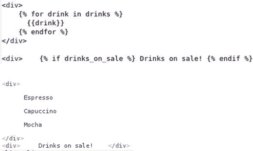
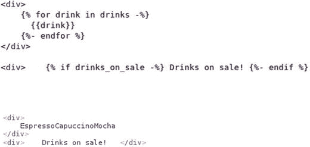
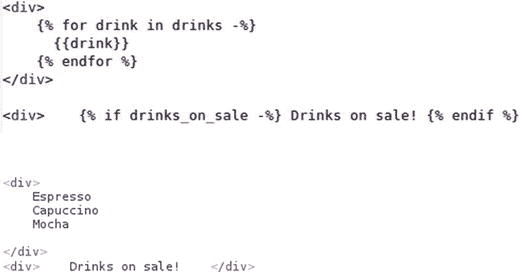
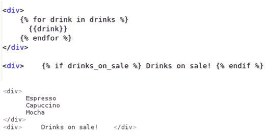
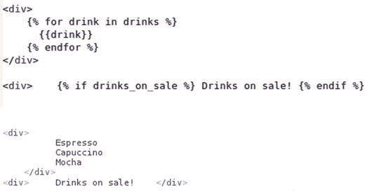

# 四、Django 的 Jinja 模板

除了 Django 模板，Django 框架还支持 Jinja 模板。Jinja 是一个独立的模板引擎项目 [<sup>1</sup>](#Fn1) 与 Django 的内置模板系统非常相似。

然而，Django 项目中 Jinja 模板的采用和增长部分是由于 Django 模板的设计限制，自 Django 创建以来，这些模板几乎没有变化。

## 金贾的优势和劣势

为了让您对 Jinja 模板有一个高层次的了解，并了解它们是否适合您的 Django 项目，我将首先列举 Jinja 模板的一些主要优点和缺点。先说优点:

*   速度和性能。- Jinja 在首次加载时将模板源代码编译成 Python 字节码，因此模板只需解析一次，从而获得更好的运行时性能。此外，Jinja 还支持提前编译选项，这也可以获得更好的性能。尽管速度和性能是 Jinja 模板最有争议的优势，但考虑到影响速度和性能基准的许多因素(例如，数据库查询/负载、服务器配置)。一般来说，在所有条件相同的情况下，Jinja 模板做的事情和 Django 模板完全一样，Jinja 版本将比 Django 版本快。

Note

公平地说，Django 模板也支持带缓存的定制加载器，以提高速度和性能——如前一章所述——但这需要在 Django 中做进一步的配置工作。

*   灵活性。- Jinja 模板在内容方面非常灵活，支持宏和更多类似 Python 的结构。虽然 web 模板不鼓励这些做法，但是您会逐渐喜欢上 Django 模板中没有的或者受到严重限制的一些特性。
*   类似于 Django 模板。- Jinja 实际上是受 Django 模板的启发，所以这两个系统之间有很多共同点。模板继承和块等强大的特性也以同样的方式工作，所以在 Django 项目中使用 Jinja 的学习曲线比您可能意识到的要小。此外，安全特性(例如，自动转义)也紧密集成到了 Jinja 中，就像它们在 Django 模板中一样。
*   异步执行。-模板有时会加载大量数据或使用需要长时间运行的功能，导致模板延迟，模板必须“等待”后台任务完成(即它们是同步的)。Jinja 模板支持异步执行，这允许支持任务运行它们的进程——没有保留模板——并且稍后在完成时用模板重新集合。注意该特性需要使用异步生成器， [<sup>2</sup>](#Fn2) ，这仅在 Python 3.6 或更新版本中可用。

现在还有一些金贾模板的缺点:

*   很少或没有第三方软件包支持。-因为 Django 对 Jinja 模板的官方支持相对较新-从 Django 1.8 开始，这是本书所基于的 Django 1.11 的早期长期支持(LTS)版本-几乎所有第三方软件包(例如 Django admin)仍然是用 Django 模板设计的。这使得很难有一个纯粹的 Jinja 模板 Django 项目，并要求 Jinja 模板与 Django 模板共存，这反过来会在需要模板定制时导致困难和混乱。
*   新概念。-如果你习惯了 Django 模板，一些 Jinja 特性需要额外的练习才能理解和正确使用(例如，Jinja 宏、Jinja 过滤器)。虽然如果你是 Django 的新手，这应该不是问题，因为每个概念都是新的，需要一些实践。

## 从 Django 模板过渡到 Jinja 模板

如果你习惯于使用 Django 模板，这一节描述了你在使用 Jinja 模板时需要注意的细节，比如你可以在 Jinja 模板中利用哪些 Django 模板知识，与 Django 模板相比，Jinja 模板的工作方式有什么不同，以及你需要学习哪些新的东西，你会逐渐喜欢上 Jinja 模板。

如果您从未使用过 Django 模板，您可以跳到下一节关于 Django 中 Jinja 模板配置的内容，因为接下来的大部分内容是为有经验的 Django 模板用户准备的。

### Jinja 和 Django 模板中的工作方式是一样的

仅仅因为 Jinja 是一个完全不同的模板引擎，并不意味着它与 Django 的内置模板引擎完全不同。对于变量和块、条件和循环、注释以及空格和特殊字符，您可以使用相同的方法。

#### 变量和块

花括号`{}`在 Jinja 模板中被广泛使用，就像在 Django 模板中一样。要在 Jinja 中输出一个变量，可以使用相同的`{{myvariable}}`语法。类似地，您也可以用` `语法命名块来继承模板之间的代码片段。此外，Jinja 还使用相同的 Django ``语法来创建模板之间的父/子关系。

#### 条件句和循环

Jinja 使用相同的 Django 语法创建条件:{ `% if variable %}`。此外，Jinja 还使用了与 Django 相同的 for 循环语法:`{{item}}`。

#### 评论

Jinja 也使用了和 Django 一样的评论标签:`{# This is a template comment that isn't rendered #}`。然而，note Jinja 对单行和多行注释都使用了`{# #}`标记。

#### 间距和特殊字符

由于 Jinja 模板的灵感来自 Django 模板，Jinja 使用类似的方法来处理空格和特殊字符。例如，间距过滤器(例如，`center`和`wordwrap`)和特殊字符处理(例如，`safe`和`escape`过滤器)在 Jinja 模板中的工作方式与在 Django 模板中的相同。

### 与 Django 模板相比，Jinja 模板有什么不同

然而，在 Jinja 模板中，并不是所有的东西都以同样的方式工作；这里有一些 Django 模板技术，你需要重新学习使用 Jinja 模板。

#### 过滤

尽管 Jinja 使用相同的管道符号`|`将过滤器应用于变量，但 Jinja 过滤器在技术上分为过滤器和测试。在 Django 模板中，只有执行测试的过滤器(例如，`divisibleby`)，但在 Jinja 中，这些类型构造被称为测试，并使用条件语法``而不是标准管道符号`|`。

此外，Jinja 过滤器和测试由标准方法支持。这样做的好处是，向 Jinja 过滤器和测试传递参数就像方法调用一样简单(例如，`{{variable|filesizeformat(true)}}`)，而 Django 过滤器的参数语法不直观，需要使用冒号，甚至需要在自定义的 Django 过滤器中解析参数(例如，`{{variable|get_digit:"1"}}`)。

除了与 Django 内置过滤器相似的内置 Jinja 过滤器和测试之外，还可以创建定制的 Jinja 过滤器和测试。然而，与通过``标签加载到模板中的 Django 过滤器不同，Jinja 定制过滤器和测试是全局注册的，可以像 Django 上下文处理器一样被所有 Jinja 模板访问。

#### 上下文处理器

上下文处理器允许 Django 模板访问项目中每个模板的变量集合，但是在 Jinja 中，这种功能被称为全局变量。这是您可能会错过 Django 模板功能的一个方面，它只是简单地声明上下文处理器和访问变量集。然而，创建 Jinja 全局变量变得可以在所有 Jinja 模板上访问并充当 Django 上下文处理器是相对容易的。

#### 没有像标记这样的日期元素，也没有像 time 和 timesince 这样的过滤器

Jinja 在开箱即用状态下不提供标签或过滤器来处理日期或时间。尽管 Jinja 确实提供了`format`过滤器，其工作方式就像 Python 的标准方法一样，可以用于日期格式化，但是您需要编写自己的定制过滤器和标签，以更高级的方式处理日期和时间元素。

#### 不支持标记

Jinja 使用`{# #}`标签来定义单行或多行注释，所以不支持``，在 Django 模板中，T1 用于多行注释。

#### 不支持标记

在 Jinja 中，不支持导入定制标签和过滤器的``标签。在 Jinja 中，自定义标签和过滤器是全局注册的，并自动可供所有 Jinja 模板访问。

#### 使用{{super()}}而不是{{block.super}}

在 Django 模板中，使用语法`{{ block.super }}`来访问父模板块的内容。在 Jinja 中，您必须使用`{{super()}}`语法来访问父模板块的内容。

#### 不支持标记，请使用 csrf_input 或 csrf_token 变量

在 Django 模板中，当您创建一个具有 HTTP POST 动作的表单时，您将``标记放在表单体中，以生成一个避免 XSS 的特殊标记(“跨站点脚本”)。要在 Jinja 中复制这种行为，您必须使用`csrf_input`变量(例如，`{{csrf_input}}`生成类似`<input type="hidden" name="csrfmiddlewaretoken" value="4565465747487">`的字符串)或使用包含原始 CSRF 令牌的`csrf_token`变量(例如，`4565465747487`)。

#### 循环变量

在 Django 模板中，``循环的上下文提供了对一系列变量的访问(例如，计数器、第一次和最后一次迭代)。Jinja 模板在``的上下文中提供了一个类似的变量，但它们并不相同。

#### 循环中不支持标记，请使用标记

Django 模板中的循环支持将``子句作为最后一个参数，以便在迭代为空时生成逻辑或消息。在 Jinja ``循环中，当迭代为空时，可以使用``子句作为最后一个参数来生成逻辑或消息。

#### 不支持标记，请使用 groupby 筛选器

Django 模板支持``标签来根据不同的属性重新排列字典或对象。在 Jinja 中你可以实现同样的功能，但是你必须通过 Jinja `groupby`过滤器中描述的`groupby`过滤器来实现。

#### 不支持标记，请在循环中使用 cycler 函数或 loop.cycle 变量

Django 模板支持``标签来循环遍历一系列值。在 Jinja 中，这种功能有两种形式。如果需要循环之外的功能，可以使用`cycler`方法。或者您可以使用所有``循环中可用的`loop.cycle`功能。

#### 不支持标记，请使用 lipsum 函数

Django 模板支持``标签来生成随机的拉丁文本作为填充内容。在 Jinja 中，您可以使用`lipsum`函数实现相同的功能。

#### 不支持其他杂项标记，如、、和

像``和``这样的一系列 Django 模板标签在 Jinja 中根本就没有。然而，有些第三方项目已经将这些和许多其他 Django 模板标签移植到了 Jinja 扩展中。本章后面关于 Jinja 扩展的部分将讨论这些选项。

### Jinja 模板与 Django 模板中的新概念和新特性

现在您已经知道了可以利用哪些 Django 模板知识，以及需要重新学习哪些技术才能有效地使用 Jinja 模板，让我们来看看一些只适用于 Jinja 模板的概念。

#### 更有用的内置过滤器、测试，与 Python 环境更相似

Jinja 模板提供了 Django 模板中所缺少的各种内置过滤器和测试。例如，像检查变量类型这样简单的事情(例如，字符串、数字、iterable 等。)，Jinja 为此提供了一系列内置测试，而在 Django 中，这需要创建自定义过滤器。

与 Django 模板相比，Jinja 模板对复杂数据类型(例如对象和字典)的访问和操作也得到了极大的改进。例如，Jinja 提供了诸如`reject`、`select`和`map`之类的过滤器来修剪、过滤或更改模板上的数据子集，这种技术虽然被纯粹主义者(即那些只在视图中操作数据的袖手旁观人)所不喜欢，但在实际和时间受限的项目中却是一种非常常见的需求。

Jinja 模板还支持更符合标准 Python 环境的语法。例如，在 Django 中，像通过变量访问字典键这样的事情需要定制过滤器，而在 Jinja 模板中，这与标准 Python 语法一起工作(例如，如果您有变量`stores={"key1":"value1", "key2":"value2"}`和`var="key1"`，Django 模板不能执行标准 Python 语法的`stores.get(var)`，但是在 Jinja 中，这与 Python 环境的预期一样开箱即用)。

#### 全局函数

Jinja 还支持一系列全局函数。例如，Jinja 提供了`range`函数，它的工作方式就像 Python 中在循环中有用的标准函数一样(例如``)。此外，Jinja 还提供了全局函数`lipsum`来生成虚拟占位符内容、`dict`来生成字典、`cycler`来生成元素循环、`joiner`来连接节。

#### 灵活的标签嵌套、条件和引用

Jinja 在嵌套标签方面非常灵活，尤其是与 Django 模板相比。例如，在 Jinja 中，你甚至可以有条件地应用``标签(例如``)或者使用带有内嵌条件的变量引用名称(例如``)——这在 Django 模板中是不可能的。

#### 宏指令

在 Jinja 中，宏允许定义具有复杂布局的类似函数的片段，可以从任何具有不同实例值的模板中调用这些片段。宏对于限制复杂布局在模板间的传播特别有用。使用宏，您可以一次定义一个复杂的布局(即，作为一个宏)，并使用不同的参数调用它，以每次输出定制的复杂布局，就像是一个函数一样。

#### 范围限制较少的模板中的灵活变量赋值

在 Jinja 中，您可以使用``标签来定义变量，使其在模板结束之前都具有有效的作用域。尽管 Jinja 也支持``标签——就像 Django 模板版本一样——``标签对于多个变量定义来说可能会变得很麻烦，因为它需要每次都用``来结束作用域。对于全局模板变量来说，``是一个很好的选择，因为您只需要初始定义，作用域传播到模板的末尾，而不必担心关闭作用域。

#### 行语句

Jinja 在其所谓的行语句中支持逻辑语句的定义。默认情况下，line 语句前面有一个`#`符号，可以作为标记语法的替代。例如，``标记语句``可以使用等价的行语句`# for item in items`，正如标记语句``可以使用等价的行语句`# endfor.`行语句，更重要的是，与使用需要``语法的标记语句相比，给模板一种 Python 的感觉，可以使复杂的逻辑更容易破译。

## Django 中的 Jinja 模板配置

在 Django 中使用 Jinja 的第一步是用命令`pip install Jinja2`安装核心包。请注意，安装的是版本 2(即 Jinja2)，这是最新的版本。虽然 Jinja 1 仍然可用，但是 Django 不提供对版本 1 的内置支持，所以要特别注意确保安装版本 2。

接下来，您需要在`settings.py`文件中的 Django 项目中配置 Jinja。清单 [4-1](#Par50) 展示了 Django 的一个基本 Jinja 配置。

```py
import os
BASE_DIR = os.path.dirname(os.path.dirname(os.path.abspath(__file__)))
PROJECT_DIR = os.path.dirname(os.path.abspath(__file__))

TEMPLATES = [
    {
        'BACKEND':'django.template.backends.jinja2.Jinja2',
        'DIRS': ['%s/jinjatemplates/'% (PROJECT_DIR),],
        'APP_DIRS': True,
        },
    {
        'BACKEND': 'django.template.backends.django.DjangoTemplates',
        'DIRS': [],
        'APP_DIRS': True,
        'OPTIONS': {
            'context_processors': [
                'django.template.context_processors.debug',
                'django.template.context_processors.request',
                'django.contrib.auth.context_processors.auth',
                'django.contrib.messages.context_processors.messages',
            ],
        },
    },
]

Listing 4-1.Jinja configuration in Django settings.py

```

正如您在清单 [4-1](#Par50) 中看到的，在`TEMPLATES`中声明了两个配置，一个是 Jinja 模板配置的字典，另一个是默认 Django 模板配置的字典。由于 Django 模板仍然被诸如 Django admin 和许多第三方软件包使用，我强烈推荐你使用清单 [4-1](#Par50) 中的基本配置，因为它可以防止你无法控制的其他东西被破坏。

清单 [4-1](#Par50) 中的金贾配置是最基本的配置之一。在这种情况下，`BACKEND`变量使用`django.template.backends.jinja2.Jinja2`值来激活 Jinja 模板，紧接着是`DIRS`和`APP_DIRS`变量，它们告诉 Django 在哪里定位 Jinja 模板。

### 模板搜索路径

`APP_DIRS`变量允许在名为`jinja2`的特殊应用子目录中查找模板。如果您希望将 Jinja 模板包含到应用中，这是很有帮助的，但是要注意模板搜索路径并不知道应用的名称空间。例如，如果你有两个应用都依赖于一个名为`index.html`的模板——如清单 [4-2](#Par54) 所示——并且两个应用都在`views.py`中有一个方法将控制权返回给`index.html`模板(例如`render(request,'index.html')`)，那么两个应用都将使用`INSTALLED_APPS`中最顶层声明的应用中的`index.html`，因此一个应用不会使用预期的`index.html`。

```py
# Templates directly under jinja2 folder can cause loading conflicts
+---+-<PROJECT_DIR_project_name_conflict>
    |
    +-__init__.py
    +-settings.py
    +-urls.py
    +-wsgi.py
    |
    +-about(app)-+
    |            +-__init__.py
    |            +-models.py
    |            +-tests.py
    |            +-views.py
    |            +-jinja2-+
    |                     |
    |                     +-index.html
    +-stores(app)-+
                 +-__init__.py
                 +-models.py
                 +-tests.py
                 +-views.py
                 +-jinja2-+
                          |
                          +-index.html

# Templates classified with additional namespace avoid loading conflicts
+---+-<PROJECT_DIR_project_name_namespace>
    |
    +-__init__.py
    +-settings.py
    +-urls.py
    +-wsgi.py
    |
    +-about(app)-+
    |            +-__init__.py
    |            +-models.py
    |            +-tests.py
    |            +-views.py
    |            +-jinja2-+
    |                     |
    |                     +-about-+
    |                             |
    |                             +-index.html
    +-stores(app)-+
                 +-__init__.py
                 +-models.py
                 +-tests.py
                 +-views.py
                 +-jinja2-+
                          |
                          +-stores-+
                                   |
                                   +-index.html

Listing 4-2.Django apps with jinja2 dirs with potential conflict and namespace qualification

```

为了解决这个潜在的冲突，推荐的做法是在每个`jinja2`目录中添加一个额外的子文件夹作为名称空间，如清单 [4-2](#Par54) 中的第二组文件夹所示。这样，您就可以使用这个额外的命名空间子文件夹将控件重定向到模板，以避免任何歧义。因此，要将控制权发送给`about/index.html`模板，您应该声明`render(request,'about/index.html')`，要将控制权发送给`stores/index.html`，您应该声明`render(request,'about/index.html')`。

如果您希望禁止这种允许从这些内部应用子文件夹加载模板的行为，您可以通过将`APP_DIRS`设置为`FALSE`来实现。

Jinja 模板更常见的方法是用一个或多个文件夹——位于应用结构之外——来保存 Jinja 模板。Django 首先在第一个`DIRS`值中寻找匹配的 Jinja 模板，然后在应用的`jinja2`文件夹中寻找——如果`APP_DIRS`是`TRUE`——直到找到匹配的模板或者抛出`TemplateDoesNotExist`错误。

对于清单 [4-1](#Par50) 所示的情况，唯一的`DIRS`值依赖于一个名为`jinjatemplates`的目录，该目录相对于由`PROJECT_DIR`变量确定的路径。当在不同的机器上部署 Django 项目时，这种可变技术很有帮助，因为路径是相对于顶层 Django 项目目录的(即`settings.py`和主`urls.py`文件所在的位置)，并且不管 Django 项目安装在哪里(例如`/var/www/`、`/opt/website`、`C://website/`)，都会动态调整。

与 Django 模板`OPTIONS`变量类似，Jinja 也通过`OPTIONS`变量支持一系列定制。在 Jinja 的例子中，`OPTIONS`变量是一个键值字典，对应于 Jinja 环境的初始化参数。 [<sup>3</sup>](#Fn3)

默认情况下，Django 在内部设置一系列 Jinja 环境初始化参数，以使 Jinja 的模板行为与 Django 模板的行为一致。然而，您可以很容易地用`OPTIONS`变量覆盖这些设置。接下来的部分描述了这些重要的设置。

### 自动转义行为

Django 默认启用 Jinja 模板自动转义，这种行为在 Jinja 引擎的开箱即用状态下实际上是禁用的。自动转义的症结在于，一方面，它在预防和安全性方面出错——限制了在 HTML 中破坏输出或引入 XSS(跨站点脚本)漏洞的可能性——但另一方面，它也在模板引擎中引入了额外的处理，这会导致性能问题。

默认情况下，Django 模板自动转义模板变量的所有输出——`<`被转换为`&lt;` , `>`被转换为`&gt;` , `'`(单引号)被转换为`'` , `"`(双引号)被转换为`&quot;`并且`&`被转换为`&amp –`，除非您明确禁用此行为。Jinja 在开箱即用状态下不会自动转义任何东西，当您想要自动转义某些东西时，您需要明确地告诉它。

因为 Django 的 Jinja 模板集成是由 Django 设计者完成的，所以为了安全起见，Jinja 自动转义被启用，就像 Django 模板一样。但是，您可以使用`OPTIONS`中的`autoescape`参数禁用 Jinja 自动转义，如清单 [4-3](#Par65) 所示。

```py
import os
BASE_DIR = os.path.dirname(os.path.dirname(os.path.abspath(__file__)))
PROJECT_DIR = os.path.dirname(os.path.abspath(__file__))

TEMPLATES = [
    {
        'BACKEND':'django.template.backends.jinja2.Jinja2',
        'DIRS': ['%s/jinjatemplates/'% (PROJECT_DIR),],
        'APP_DIRS': True,
        'OPTIONS': {
            'autoescape': False
        },
    }
]

Listing 4-3.Jinja disable auto-escaping in Django

```

正如你在清单 [4-3](#Par65) 中看到的，`autoescape`被赋值为`False`，随着这一变化，Jinja 模板的行为就像 Jinja 设计者想要的那样(也就是说，你需要明确地检查哪里需要自动转义，而 Django 模板检查哪里不需要自动转义)。

### 自动重新加载模板行为和缓存

在开箱即用状态下，Jinja 的模板加载器会在每次请求模板时进行检查，以查看源代码是否发生了变化；如果已经更改，Jinja 会重新加载模板。这在模板的源代码不断变化的开发中很有帮助，但在生产中也会影响性能，因为模板的源代码很少变化，检查会导致延迟。

默认情况下，Django 框架 Jinja 集成采用了一种明智的方法，并基于`settings.py`中的`DEBUG`变量启用 Jinja 模板自动重载。如果`DEBUG=True` -开发中的常用设置- Jinja 模板自动重装设置为`True`，如果`DEBUG=False` -生产中的常用设置- Jinja 模板自动重装设置为`False`。然而，您可以用`OPTIONS`中的`auto_reload`参数显式设置 Jinja 的自动加载行为。

默认情况下，Jinja 引擎还可以缓存多达 400 个模板。这意味着当加载模板 401 时，Jinja 清除最近最少使用的模板，如果以后需要，后者必须从其原始位置重新加载。Jinja 缓存限制可通过`OPTIONS`中的`cache_size`参数进行调整(如`cache_size=1000`，设置 1000 个模板缓存)。将`cache_size`设置为 0(零)禁用缓存，将`cache_size`设置为-1 启用无限制缓存。

Jinja 模板中另一个可用的缓存机制是字节码缓存。当您创建 Python 源文件(即那些带有`.py`扩展名的文件)时，Python 会生成带有包含字节码的`.pyc`扩展名的镜像文件。生成这些字节码文件需要时间，但它们是 Python 运行时过程的自然组成部分。基于 Python 的 Jinja 模板也需要转换成字节码，但这是一个你可以用`OPTIONS`中的`bytecode_cache`参数定制的过程。

可以为`bytecode_cache`参数分配一个定制的字节缓存 [<sup>4</sup>](#Fn4) 或者 Jinja 的一个内置字节码缓存，它包括对标准文件系统缓存的支持或者使用 memcached 的更专门的缓存。

### 无效的模板变量

当在 Jinja 模板中遇到无效变量时，您可以设置各种行为。Django 为 Jinja 设置了两个默认行为，一个用于 when`DEBUG=True`——开发中的常见设置——另一个用于 when`DEBUG=False`——生产中的常见设置。

如果在 Jinja 模板中设置了`DEBUG=True`和一个无效变量，Jinja 使用`jinja2.DebugUndefined`类来处理它。`jinja2.DebugUndefined`类逐字输出变量进行呈现(例如，如果模板有`{{foo}}`语句，而变量在上下文中不存在，Jinja 输出`{{foo}}`，这样更容易发现无效变量)。

如果在 Jinja 模板中设置了`DEBUG=False`和一个无效变量，Jinja 使用`jinja2.Undefined`类来处理它。`jinja2.Undefined`类在变量的位置输出一个空格用于呈现(例如，如果模板有`{{bar}}`语句，而变量在上下文中不存在，Jinja 输出一个空格)。值得一提的是，最后一种行为符合 Django 模板中无效变量的默认行为。

除了`jinja2.DebugUndefined`和`jinja2.Undefined`类，Jinja 还支持`jinja2.StrictUndefined`类。`jinja2.StrictUndefined`类用于生成即时错误，而不是继续渲染，这有助于更快地诊断无效变量。然而，要注意最后一个类基于`DEBUG`变量改变了它的行为；它要么生成一个带有无效变量名的堆栈错误(即当`DEBUG=True`时)，要么生成一个标准的 HTTP 500 错误页面(即当`DEBUG=False`时)。

清单 [4-4](#Par78) 展示了如何通过`settings.py`中的`OPTIONS`参数配置一个 Jinja 类来处理无效变量。

```py
import os
BASE_DIR = os.path.dirname(os.path.dirname(os.path.abspath(__file__)))
PROJECT_DIR = os.path.dirname(os.path.abspath(__file__))

import jinja2

TEMPLATES = [
   {
        'BACKEND':'django.template.backends.jinja2.Jinja2',
        'DIRS': ['%s/jinjatemplates/'% (PROJECT_DIR),],
        'APP_DIRS': True,
        'OPTIONS': {
            'undefined':jinja2.StrictUndefined
        },
    }
]

Listing 4-4.Generate error for invalid variables in Jinja with jinja2.StrictUndefined

```

正如你在清单 [4-4](#Par78) 中看到的，我们首先声明`import jinja2`来访问`settings.py`中 Jinja 的类。接下来，我们在`OPTIONS`参数中声明了`undefined`键，并将其分配给 Jinja 类来处理无效变量。在这种情况下，当遇到无效模板变量时，我们使用`jinja2.StrictUndefined`类来获取错误，但是您同样可以使用其他两个 Jinja 类中的任何一个来处理无效变量(即`jinja2.DebugUndefined`或`jinja2.Undefined`)。

### 模板加载器

Jinja 模板加载器是 Python 类，它实现了搜索和加载模板所需的实际逻辑。在前面的“模板搜索路径”一节中，我描述了 Jinja 如何使用`DIRS`和`APP_DIRS`变量搜索模板，这是 Django 模板配置的一部分。然而，我有意忽略了与这个模板搜索过程相关的一个更深层的方面:每个搜索机制都由一个模板加载器支持。

在大多数情况下，你不需要处理 Jinja 模板加载器，因为 Jinja 加载器是在后台处理的，只需要依靠`DIRS`和`APP_DIRS`变量。但是如果您需要从这些位置之外的地方加载 Jinja 模板(例如，从内存结构或数据库)，您可以在`OPTIONS`参数中用`loader`键指定模板加载器。

像 Django 模板加载器一样，除了使用类似于 Django 模板提供的内置 Jinja 模板加载器(例如，从 Python 字典加载模板)，Jinja 还提供创建定制模板加载器、[<sup>【5】</sup>](#Fn5)的能力。

Tip

您可以在选项中为任何 Jinja 环境初始化参数 [<sup>6</sup>](#Fn6) 设置自定义值。前面的部分只是四个最常见的 Jinja 模板参数；后面的部分描述了其他可用的选项。

Note

OPTIONS 仅用于 Jinja 环境的初始化参数；其他 Jinja 环境设置需要配置单独的 Jinja 环境类(例如，Jinja 全局、Jinja 自定义过滤器和测试以及 Jinja 策略)。

## 创建可重用的 Jinja 模板

模板倾向于具有在多个实例中同等使用的公共部分。例如，无论一个项目有 5 个还是 100 个模板，所有模板的页眉和页脚部分很少改变。其他模板部分，如菜单和广告，也属于这种在多个模板中保持不变的内容类别。所有这些都会导致多个模板的重复，这可以通过创建可重用的模板来避免。

使用可重用的 Jinja 模板，您可以在单独的模板上定义公共部分，并在其他模板中重用它们。此过程使创建和管理项目模板变得容易，因为单个模板更新会影响所有模板。

可重用的 Jinja 模板还允许您定义页面块来逐页覆盖内容。此过程使项目的模板更加模块化，因为您定义了顶级块来建立整体布局并逐页定义内容。

让我们通过探索 Jinja 内置的``标签，向构建可重用的 Jinja 模板迈出第一步。清单 [4-5](#Par91) 展示了一个名为`base.html`的带有几个``标签的模板的第一行。

```py
<!DOCTYPE html>
<html lang="en">
  <head>
    <meta charset="utf-8">
    <title>Default title</title>
    <meta name="description" content="">
    <meta name="keywords" content="">
Listing 4-5.Jinja template with  tags

```

注意清单 [4-5](#Par91) 中的语法``。每个``标签都有一个引用名。其他 Jinja 模板使用该引用名称来覆盖每个块的内容。例如，HTML `<title>`标签中的``标签定义了一个网页标题。如果另一个模板重用清单 [4-5](#Par91) 中的模板，它可以通过覆盖标题块来定义自己的网页标题。如果未在模板上覆盖块，则块将接收块中的默认内容。对于标题栏，默认内容是`Default title`，对于`metadescription`和`metakeywords`栏，默认内容是一个空字符串。

清单 [4-5](#Par91) 中所示的相同机制可以用来定义任意数量的块(例如，内容、菜单、页眉、页脚)。值得一提的是``的`<name>`参数是可选的，仅使用``来结束一个 block 语句是有效的；但是，前一种技术使得 block 语句的结束位置更加清晰，这在一个模板有多个块时尤其有用。

尽管可以通过 Django 视图方法或 url 请求直接调用清单 [4-5](#Par91) 中的模板，但这种模板的目的是将其用作其他模板的基础模板。要重用 Jinja 模板，您可以使用 Jinja 内置的``标签。

``标签使用语法``来重用另一个模板的布局。这意味着为了重用在文件`base.html`中定义的清单 [4-5](#Par91) 中的布局，您使用语法``，如清单 [4-6](#Par96) 所示。

```py

Coffeehouse home page
Listing 4-6.Jinja template with  and  tag

```

看看清单 [4-6](#Par96) 如何使用包裹在``语句周围的``。如果定义了`user`变量，Jinja 扩展了`base.html`模板；否则它扩展了`signup_base.html`模板。这种条件语法在 Django 模板中是不可能的。

此外，注意清单 [4-6](#Par96) 是如何用内容`Coffeehouse home page`定义``标签的。清单 [4-6](#Par96) 中的块覆盖了`base.html`模板中的`title`块。那么清单 [4-6](#Par96) 中的 HTML `<title>`标签在哪里呢？没有，你也不需要。Jinja 自动重用来自`base.html`或`signup_base.html`模板的布局，并在必要的地方替换块的内容。

重用其他模板的 Jinja 模板倾向于使用有限的布局元素(例如 HTML 标签)和更多的 Jinja 块语句来覆盖内容。这是有益的，因为正如我前面所概述的，它允许您一次建立整体布局，并在逐页的基础上定义内容。

Jinja 模板的可重用性可以多次出现。例如，你可以有模板 A、B 和 C，其中 B 需要重用 A，但是 C 需要重用 B 的一部分，唯一的区别是模板 C 需要使用``标签而不是``标签。但是由于模板 B 重用了 A，模板 C 也可以访问模板 A 中的相同元素。

当重用 Jinja 模板时，也可以从父模板访问块内容。Jinja 通过`super()`方法公开父模板中的块内容。清单 [4-7](#Par102) 展示了三个模板，展示了包含网页路径或“面包屑”的块的这种机制。

```py
# base.html template
<p>Home</p>

# index.html template

Main

# detail.html template

 {{super()}} : Detail 

Listing 4-7.Jinja templates use of super() with three reusable templates

```

清单 [4-7](#Par102) 中的`base.html`模板用默认值`Home`定义了`breadcrumb`块。接下来，`index.html`模板重用`base.html`模板并用值`Main`覆盖面包屑块。最后，`detail.html`模板重用`index.html`模板并覆盖`breadcrumb`块值。但是，请注意最终块覆盖中的`{{super()}}`语句。因为`{{super()}}`在`breadcrumb`块中，`{{super()}}`告诉 Jinja 从父模板块中获取内容。

Jinja 模板支持的另一个可重用功能是将一个 Jinja 模板包含在另一个 Jinja 模板中。Jinja 通过``标签支持这一功能。

默认情况下，``标签需要一个模板的名称。例如，``在声明模板的位置插入`footer.html`模板的内容。``标签也让底层模板知道变量。这意味着`footer.html`模板可以有变量定义(例如`{{year}}`，如果调用模板有这些变量定义，``标签会自动替换这些值。

此外，还可以提供一个模板列表作为后备机制。例如，``告诉 Jinja 首先尝试定位`special_sidebar.html`模板，如果没有找到就尝试定位`sidebar.html`模板；如果两个模板都没有找到，最后一个参数`ignore missing`告诉 Jinja 不要渲染任何东西。注意`ignore missing`参数也可以用在单独的语句中(例如``，以及列表)。此外，如果没有使用`ignore missing`语句，并且 Jinja 找不到在``中声明的匹配模板，Jinja 会引发一个异常。

标签允许跨模板定义可重用的内容片段。例如，如果您需要合并精细标记来显示具有共同特征的元素，您可以在一个``语句中定义一次精细标记，然后重用这个``来输出为每个元素实例定制的标记。

宏非常有用，因为如果您决定更改标记，只需在一个位置进行更改，更改就会传播到其他位置。清单 [4-8](#Par109) 展示了``语句的定义及其在模板中的用法。

```py
# base.html template

    <a id="{{id}}"></a>
    <h4>{{name}}</h4>
    <p>{{address}} {{city}},{{state}}</p>
    <p><a href='mailto:{{email}}'>{{email}}</a></p>


# index.html template calls inherited macro directly

{{coffeestore('Downtown',1,'Horton Plaza','San Diego','CA','downtown@coffeehouse.com')}}
# detail.html template with no extends, uses  to access macro in base.html

{{base.coffeestore('Downtown',1,'Horton Plaza','San Diego','CA','downtown@coffeehouse.com')}}

# otherdetail.html template with no extends, uses  to access macro in base.html

{{mycoffeestoremacro('Downtown',1,'Horton Plaza','San Diego','CA','downtown@coffeehouse.com')}}

Listing 4-8.Jinja  definition and use of 

```

清单 [4-8](#Par109) 中做的第一件事是在`base.html`模板中声明的``定义。注意，在`{% macro`片段之后，有一个名为`coffeestore`的常规方法，它对应于带有六个输入参数的宏的名称，其中五个有默认值。接下来，在``和``语句中，您可以看到一些精心制作的 HTML 标记，它们利用标准的`{{ }}`语法来输出在给定宏实例上传递的任何变量值。

由于清单 [4-8](#Par109) 中的``是在`base.html`模板中定义的，任何其他使用`base.html`模板的模板都可以访问该宏，并调用带有实例的宏(例如`{{coffeestore('Downtown',1,'Horton Plaza','San Diego','CA','downtown@coffeehouse.com')}}` -为简单起见是硬编码的值)来呈现用实例值定制的 HTML 标记。

如果你想在其他模板中访问一个``，你有三个选择，也在清单 [4-8](#Par109) 中给出。如果一个模板扩展了另一个模板(如``)，那么默认情况下，它也将获得对父模板``定义的访问权。也可以用``语句访问另一个模板的``定义。例如，语句``将`base.html`定义导入到另一个具有基本名称空间的模板中，在这种情况下，要调用名为`coffeestore`的``，您将使用`{{base.coffeestore(...}}`语法。最后，也可以用``语句有选择地导入``定义。例如，语句``从`base.html`模板导入`coffeestore`定义，并将其放在`mycoffeestoremacro`名称下，在这种情况下，您将使用`{{mycoffeehousemacro(...}}`语法来调用``。

``标签是另一个选项，与``标签一起使用，有利于宏本身的可重用性。``标签的第一个使用场景是调用一个``，它需要一个占位符，用于在调用宏之前定义的内容。清单 [4-9](#Par114) 展示了``标签和``标签的基本场景。

```py
# macro definition

   <div class="col-md-{{adcolumn_width}}">
    Sidebar ads
   </div>
   <div class="col-md-{{contentcolumn_width}}">
      {{ caller() }}
   </div>
   <div class="col-md-{{adcolumn_width}}">
    Sidebar ads
   </div>


# macro call/invocation

  <ul>
    <li>This is my list</li>
  </ul>


# rendering
<div class="col-md-3">
    Sidebar ads
</div>
<div class="col-md-6">
  <ul>
    <li>This is my list</li>
  </ul>
</div>
<div class="col-md-3">
    Sidebar ads
</div>

Listing 4-9.Jinja  and 

use

```

在清单 [4-9](#Par114) 中，我们首先定义一个与清单 [4-8](#Par109) 结构相似的``；但是，请注意在``中的`{{ caller() }}`语句。``中的`caller()`方法作为占位符被调用实体替换。

接下来，在清单 [4-9](#Par114) 中，您可以看到``语句是用宏调用声明的——在本例中是`contentlist()`—``语句的主体包含一个 HTML 列表。当 Jinja 执行``语句时，``内容被放在` {{caller()}}`声明的位置。

带有``的``标签的一个更高级的场景是让`caller()`语句使用引用，这个过程对于本质上是递归的数据来说更自然(例如，宏在宏之上)。清单 [4-10](#Par118) 展示了``标签和``的递归场景。

```py
# macro definition

   <div class="col-md-{{adcolumn_width}}">
    Sidebar ads
   </div>
   <div class="col-md-{{contentcolumn_width}}">
     
      {{ caller(item) }}
     
   </div>
   <div class="col-md-{{adcolumn_width}}">
    Sidebar ads
   </div>


# variable definition


# macro call/invocation

    <a id="{{item.id}}"></a>
    <h4>{{item.name}}</h4>
    <p>{{item.address}} {{item.city}},{{item.state}}</p>
    <p><a href='mailto:{{item.email}}'>{{item.email}}</a></p>


# rendering
<div class="col-md-3">
    Sidebar ads
</div>
<div class="col-md-6">
    <a id="0"></a>
    <h4>Corporate</h4>
    <p>624 Broadway San Diego,CA</p>
    <p><a href="mailto:corporate@coffeehouse.com">corporate@coffeehouse.com</a></p>

    <a id="1"></a>
    <h4>Downtown</h4>
    <p>Horton Plaza San Diego,CA</p>
    <p><a href="mailto:downtown@coffeehouse.com">downtown@coffeehouse.com</a></p>

    <a id="2"></a>
    <h4>Uptown</h4>
    <p>1240 University Ave San Diego,CA</p>
    <p><a href="mailto:uptown@coffeehouse.com">uptown@coffeehouse.com</a></p>

    <a id="3"></a>
    <h4>Midtown</h4>
    <p>784 W Washington St San Diego,CA</p>
    <p><a href="mailto:midtown@coffeehouse.com">midtown@coffeehouse.com</a></p>
</div>
<div class="col-md-3">
    Sidebar ads
</div>

Listing 4-10.Jinja  and  recursive calls

```

正如您在清单 [4-10](#Par118) 中看到的，``定义现在有了一个名为`itemlist`的参数，它在这个参数上创建了一个迭代，并为每个条目调用了`{{caller(item)}}`。还要注意清单 [4-10](#Par118) 中的``语句现在是``，其中 item 表示从宏发送的回调项，而`contentlist(coffeestores)`是对名为`contentlist`的宏的实际调用及其输入`coffeestores`，这是一个字典列表。当 Jinja 执行``语句时，``内容在每一项上递归运行，结果输出显示在清单 [4-10](#Par118) 的底部。

Tip

与使用变量的语句相比，Jinja 内置过滤器一节中描述的内置`` statemen t 为静态内容块提供了更简单的重用功能。(如{ % set advertisement % }<div class = ' banner '> < /div > 创建广告变量，可以输出模板中任意位置和之间的内容。

## Jinja Globals:访问所有 Jinja 模板上的数据，比如 Django 上下文处理器

就像 Django 模板提供了上下文处理器来帮助访问所有 Django 模板上的数据一样，Jinja 也提供了自己版本的相同特性，称为 globals。Jinja 在它的开箱即用状态中没有全局变量，但是在它的 Django 集成模式中包括三个全局变量来模仿 Django 最常见的上下文处理器，这些全局变量是`request`、`csrf_input`和`csrf_token`。

这意味着您可以访问三个 Django 上下文处理器，比如 Django 项目中使用的所有 Jinja 模板中的变量。然而，要设置额外的全局变量，您需要使用 Jinja 的环境。

要设置 Jinja 全局变量，你需要访问 Jinja 的环境，全局变量存储在一个名为`globals`的变量中。默认情况下，Django-Jinja 配置使用 Jinja 的内置`jinja2.Environment`环境。为了在 Django 中访问 Jinja 的环境并设置全局变量，最简单的方法是创建自己的 Jinja 环境，并使用它来初始化 Django-Jinja 配置。清单 [4-11](#Par124) 展示了一个定制的 Jinja 环境类，它设置了名为`static`和`url`的全局变量。

```py
from jinja2.environment import Environment
from django.contrib.staticfiles.storage import staticfiles_storage
from django.core.urlresolvers import reverse

class JinjaEnvironment(Environment):
    def __init__(self,**kwargs):
        super(JinjaEnvironment, self).__init__(**kwargs)
        self.globals['static'] = staticfiles_storage.url
        self.globals['reverse'] = reverse

Listing 4-11.Custom Jinja environment with global variable

```

正如您在清单 [4-11](#Par124) 中看到的，自定义`JinjaEnvironment`类是`jinja2.Environment`类的子类；这就是为什么定制类继承了 Jinja 提供的基类的大部分特性。接下来，你可以看到我们使用`__init__`方法来初始化基类。

在退出该类的初始化方法之前，您还可以看到我们访问了实例的`globals`变量。`globals`由一个字典组成，其中的键值分别对应于 Jinja 模板变量名和值。在这种情况下，我们创建静态变量，并将其赋给 Django 的`django.contrib.staticfiles.storage.staticfiles_storage.url`方法。这赋予了`static`全局变量与 Django 的 staticfiles 应用相同的行为，这样就可以像在 Django 中一样声明静态资源(例如，Jinja 可以做``)——这个主题在关于静态资源管理的第 [5](05.html) 章中有更详细的描述，但这里提到这一点很重要，因为它填补了 Jinja 在这方面缺乏功能的空白。

清单 [4-11](#Par124) 中的第二个全局变量创建了 url 变量，并将其赋给 Django 的`django.core.urlresolvers.reverse`方法。这使得`url`全局变量具有与 Django 的``标签相同的行为，因此可以基于名称解析 URL——如第 [2](02.html) 章 Django url 管理和反向匹配中所述——就像在 Django 中完成的一样(例如，Jinja 可以做`<a href="{{ url('homepage') }}">Go to homepage</a>`)—注意这是另一个重要的空白，因为 Jinja 在这方面缺乏功能。

正如您可以添加这最后两个全局变量来模拟 Jinja 模板中缺少的 Django 应用和标签的行为一样，您可以以相同的方式添加更多的全局变量，或者根据需要增加 Jinja 全局变量的复杂性。

一旦定制的 Jinja 环境准备好了，您需要在 Django 的`settings.py`文件中设置它，这样就可以用它来初始化 Jinja。清单 4-12 展示了如何在 Django 中设置一个定制的 Jinja 环境。

```py
TEMPLATES = [
    {
        'BACKEND':'django.template.backends.jinja2.Jinja2',
        'DIRS': ['%s/templates/'% (PROJECT_DIR),],
        'APP_DIRS': True,
        'OPTIONS': {
            'environment': 'coffeehouse.jinja.env.JinjaEnvironment'
            }
        },
    ]
Listing 4-12.Configure custom Jinja environment in Django setttings.py

```

Jinja 环境通过`environment`键设置，作为`OPTIONS`变量的一部分。环境键的值是一个带有点符号的字符串，它指向一个定制的 Jinja 环境类。在这种情况下，可以看到值对应于`coffeehouse.jinja.env.JinjaEnvironment`，其中`JinjaEnvironment`是类，`env`是文件/模块名，`coffeehouse.jinja`是目录路径。

为了更好地展示包含定制 Jinja 环境的`env.py`文件的位置，清单 [4-13](#Par133) 展示了一个包含额外 Django 项目文件的目录结构以供参考。

```py
+---+-<PROJECT_DIR_coffeehouse>
    |
    +-__init__.py
    +-settings.py
    +-urls.py
    +-wsgi.py
    |
    +-jinja-+
            +-__init__.py
            +-env.py
Listing 4-13.Directory structure and location of custom Jinja environment

```

## Jinja 内置的语句/标签和函数(如 Django 模板标签)

Jinja 提供了几个内置的语句/标签，可以直接访问 Jinja 模板上的复杂操作。我将把这些内置的语句/标签和函数分成几个部分，这样更容易识别它们；注意，我将添加引用(Function)来表明它引用了一个 Jinja 函数。我将使用的类别是比较操作、循环、Python 和过滤器操作、空格和特殊字符以及模板结构。

### 比较操作

*   ``同` `。-``语句是评估条件的主要构件。``语句通常与``和``语句结合使用，以评估多个条件。如果变量存在且不为空，或者变量包含真布尔值，则带有自变量变量的``语句计算为真。清单 [4-14](#Par137) 展示了一系列``语句示例。

    ```py
                               
      We have drinks!                We have drinks              We have drinks
                                        
                                    No drinks,sorry              We have drinks on sale!
                                                  
                                                                 No drinks, sorry
                                                             
    Listing 4-14.Jinja  statement with  and 

    ```

Note

变量必须既存在又不为空才能匹配条件。只存在且为空的变量不符合条件。

*   ``带`and`、`or`和`not`操作符。-``语句还支持`and`、`or`和`not`操作符来创建更复杂的条件。这些运算符允许您比较多个变量是否为非空(如``)、一个或另一个变量是否为非空(如``)或一个变量是否为空(如``)。
*   ``带`==`、`!=`、`<`、`>`、`<=`和`>=`操作符。-``语句还支持等于、不等于、大于和小于运算符，以创建将变量与固定字符串或数字进行比较的条件。这些运算符允许您比较变量是否等于字符串或数字(如``)、变量是否不等于变量或数字(如``)或变量是否大于或小于数字(如``)。
*   ``和``。-``语句还支持`in`和`not in`操作符来验证常量或变量的存在。例如，``测试值`"mocha"`是否在`drinks`列表变量中，或者``测试值`2`是否不在`stores`列表变量中。虽然`in`和`not in`操作符通常用于测试列表变量，但是也可以测试字符串中是否存在字符(例如``)。此外，还可以比较一个变量的值是否出现在另一个变量中(如``)。

### 环

*   ``和``同``。-``语句迭代字典、列表、元组或字符串变量上的项目。``语句语法是``，其中`<reference>`在每次迭代中被赋予一个来自`<variable>`的新值。根据变量的性质，可以有一个或多个引用(例如，对于列表有一个引用，对于字典有两个引用)。``语句还支持``语句，该语句在循环中没有迭代的情况下被处理(即主变量为空)。清单 [4-15](#Par145) 展示了一个``和一个``和``循环示例。

```py
<ul>                                  <ul>
              
 <li>{{ drink.name }}</li>               <li><a href="/stores/{{storeid}}/">{{store.name}}</a></li>
                             
 <li>No drinks, sorry</li>            </ul>

</ul>
Listing 4-15.Jinja  statement and  with 

```

``语句还生成一系列变量来管理迭代过程，例如迭代计数器、第一次迭代标志和最后一次迭代标志。表 [4-1](#Tab1) 说明了``语句变量。

表 4-1。

Jinja  statement variables

<colgroup><col> <col></colgroup> 
| 可变的 | 描述 |
| --- | --- |
| 循环索引 | 循环的当前迭代(1 索引)。 |
| 循环.索引 0 | 循环的当前迭代(索引为 0)。 |
| walk.revindex | 从循环结束开始的迭代次数(以 1 为索引)。 |
| loop.revindex0 | 从循环结束开始的迭代次数(以 0 为索引)。 |
| 循环优先 | 如果是第一次通过循环，则为 True。 |
| loop.last | 如果是最后一次循环，则为 True。 |
| 循环长度 | 序列中的项目数。 |
| 循环 | 在序列列表之间循环的辅助函数。 |
| 循环深度 | 指示当前渲染在递归循环中的深度，从级别 1 开始 |
| 循环深度 0 | 指示当前渲染在递归循环中的深度，从级别 0 开始。 |

Nested Jinja Loops: Use Reference Variable and Cycle Variable

在某些情况下，您可能需要嵌套多个语句并访问父循环项。在 Django 模板中，这很容易，因为有一个专门用于这个目的的变量。然而，正如你在表 [4-1](#Tab1) 中看到的，Jinja 模板没有这个变量。Jinja 模板中的一个解决方案是在进入子循环以访问父循环之前用定义一个引用变量，如下面的代码片段所示。

```py
<ul>



  

  

    <li> {{ chapterloop.index }}.{{ loop.index }}">{{ section }}</li>

  



</ul>

```

Jinja 模板中的另一个嵌套循环特性是 cycle，这在 Django 模板中是不存在的(至少作为一个变量，它作为一个标签存在)。cycle 的主要用途是定义 CSS 类，以便每次迭代接收不同的 CSS 类，并且在渲染时每次迭代以不同的颜色显示。下面的代码片段说明了循环变量的用法。

```py


 <li class="{{ loop.cycle('odd', 'even') }}">{{ drink.name }}</li>



```

Note cycle 可以顺序迭代任意数量的字符串或变量(如`{{ loop.cycle('red' 'white' 'blue') }}`)。

*   ``同`if`。-``语句还支持包含`if`语句来过滤字典、列表、元组或字符串变量的迭代。通过这种方式，您可以将迭代限制为通过或未通过某个标准的元素。带有`if`子句的``语句语法是``(例如``)
*   ``带`recursive`关键字。-``语句还支持嵌套字典、列表、元组或字符串变量的递归。您可以使用递归在每个嵌套结构上重用相同的布局，而不是创建多个嵌套的``语句。清单 [4-16](#Par155) 展示了 Jinja 中一个递归循环的例子。

    ```py
    # Dictionary definition
    coffees={
        'espresso':
             {'nothing else':'Espresso',
              'water': 'Americano',
              'steamed milk': {'more steamed milk than milk foam': 'Latte',
                               'chocolate syrup': {'Whipped cream': 'Mocha'}
               },
               'more milk foam than steamed milk': 'Capuccino'
         }
    }

    # Template definition with for and recursive
    
        <li>{{ ingredient }}
        
            <ul>{{ loop(result.iteritems()) }}</ul>
        
             YOU GET:  {{ result }}
        </li>
    

    # Output
    espresso
         water YOU GET: Americano
         steamed milk
              more steamed milk than milk foam YOU GET: Latte
              chocolate syrup
                   Whipped cream YOU GET: Mocha
         more milk foam than steamed milk YOU GET: Capuccino
         nothing else YOU GET: Espresso

    Listing 4-16.Jinja  statement with recursive keyword

    ```

*   ``和``。-``和``语句在``语句中可用，允许你跳出循环或继续下一次迭代，就像常规 Python 循环中可用的相同关键字一样。

Note

和需要启用内置的 jinja2.ext.loopcontrols 扩展。请参阅本章倒数第二节，了解如何启用 Jinja 扩展。

*   `range`(功能)。-`range`函数的工作方式就像 Python 的标准函数一样，当您想要在从 I 到 j-1 的给定数字范围内生成一个循环时非常有用。例如，`range(0,5)`生成范围`[0,1,2,3,4]`。此外，range 功能还支持在第三个位置覆盖步数-默认为 1(例如，`range(0,11,2)`生成`[0,2,4,6,8,10]`)。
*   `cycler`(函数))。-`cycler`功能允许您在一系列值之间循环。它的工作就像在``循环中可用的`loop.cycle`变量，除了`cycler`函数可以在循环外使用。`cycler`函数使用其`next()`方法前进一项，使用`reset()`方法循环到第一项，使用当前属性返回当前项。清单 [4-17](#Par161) 展示了一个带有 CSS 类的 cycler 方法定义，然后在多个``循环中使用它来定义一个列表，其中每个项目基于循环迭代被分配一个不同的 CSS 类。

    ```py
    

    <ul>
    
      <li class="{{ row_class.next() }}">{{ item }}</li>
    
    
      <li class="{{ row_class.next() }}">{{ otheritem }}</li>
    

    # Output
    <ul>
      <li class="white">Item 1</li>
      <li class="lightgrey">Item 2 </li>
      <li class="grey">Item 3 </li>
      <li class="white">Item 4</li>
      <li class="lightgrey">Item 5</li>
      <li class="grey">Other item 1</li>
      <li class="white">Other item 2</li>
    </ul>

    Listing 4-17.Jinja cycler function

    ```

*   `joiner`(功能)。-`joiner`函数允许您将一系列不同的部分连接起来，并用给定的分隔符将它们连接起来，分隔符默认为逗号空格(“【T2”)。joiner 函数的一个特性是，除了第一次在部分依赖于条件的情况下给出正确的外观之外，它在每次调用时都返回分隔符字符串。清单 [4-18](#Par163) 展示了一个 joiner 方法定义，用斜杠空格(“`/`”)作为分隔符，然后用它来连接一列部分。

    ```py
    

    User:  {{ slash_joiner() }}
        {{username}}
    
     {{ slash_joiner() }}
        {{alias}}
    
     {{ slash_joiner() }}
        {{nickname}}
    

    # Output
    # If all variables are defined
    User: username / alias / nickname
    # If only nickname is defined
    User: nickname
    # If only username and alias is defined
    User: username / alias
    # Etc, the joiner function avoids any unnecessary preceding slash because it doesn't print anything the first time its called

    Listing 4-18.Jinja joiner function

    ```

### Python 和过滤器操作

*   ``。-``语句允许您在 Jinja 模板的上下文中定义变量。当您需要为 Django view 方法没有公开的值创建变量时，或者当一个变量与一个重量级操作相关联时，这很有用。下面是这个声明``的一个示例声明。在``语句中定义的变量的范围是从它的声明开始直到模板结束。``语句也可以定义内容块。例如，语句`<div class'banner'></div>`创建变量`advertisement`，其内容包含在``和``之间，以后可以在模板的其他部分重用(例如`{{advertisement}}`)。内置的``语句——在模板结构一节中描述——为内容块提供了更高级的重用功能。
*   ``(该语句需要启用内置的 jinja2.ext.do 扩展；有关更多详细信息，请参见启用 Jinja 扩展一节)。-``语句是一个表达式求值器，其工作方式类似于`{{ }}`变量语法，只是它不产生输出。例如，要增加一个变量的值或添加一个新元素而不产生任何输出，可以使用``语句(例如，{ `% do itemlist.append('Forgot to add this other item') %}`)。

Note

和需要启用内置的 jinja2.ext.loopcontrols 扩展。请参阅本章倒数第二节，了解如何启用 Jinja 扩展。

*   ``。-``语句类似于``语句；唯一的区别是``语句用``语句限制了变量的范围(例如，`...`中声明的任何元素...可以访问`myvar`变量)。在``和``语句中声明``语句来限制变量的范围也是有效的(例如`...`)。

Note

需要启用内置的 jinja2.ext.with_ extension。请参阅本章倒数第二节，了解如何启用 Jinja 扩展。

*   ``。-``语句用于将 Jinja 过滤器应用于模板部分。默认情况下，Jinja 过滤器单独应用于模板变量，但有时将 Jinja 过滤器应用于整个模板部分会很有帮助。例如，如果您声明了``，那么`lower`过滤器将应用于该语句和``语句之间的所有内容——注意`lower`过滤器语句将所有内容转换为小写；本章的下一个主要部分描述了 Jinja 的内置过滤器。
*   `dict`(功能)。-`dict`函数提供了一种不用文字定义字典的方法(例如，`{'id':1}`相当于`dict(id=1)`)。

### 间距和特殊字符

默认情况下，Jinja 保持模板中定义的所有间距(例如制表符、空格、换行符)不变。图 [4-1](#Fig1) 展示了 Jinja 中模板片段的默认呈现。



图 4-1。

Default space rendering in Jinja template

在图 [4-1](#Fig1) 中可以看到，``和``语句本身的前后空格是按原样生成的。虽然这种间距是自然的，但它有利于使用处理大量数据的模板创建更紧凑的输出。附加在语句开头或结尾的减号`-`(例如``)告诉 Jinja 去掉它后面的新行。这在图 [4-2](#Fig2) 和图 [4-3](#Fig3) 中的例子中得到最好的说明。



图 4-3。

Space rendering in Jinja template with double -



图 4-2。

Space rendering in Jinja template with single -

如图 [4-2](#Fig2) 所示，关闭``语句前的`-`符号使 Jinja 在每次迭代后消除新行。在图 [4-2](#Fig2) 中的``语句中，`-`符号没有影响，因为没有与该语句相关的换行符。在图 [4-3](#Fig3) 中，你可以看到在``语句的开始处有一个额外的`-`符号，它让 Jinja 在每次迭代开始前消除换行符。在``语句也是图 [4-3](#Fig3) 的情况下，额外的`-`符号没有影响，因为没有与该语句相关联的换行符。

因为向每个 Jinja 语句添加`-`符号会变得令人厌烦，所以可以配置 Jinja，使其默认使用这种行为(即，就像添加了`-`)。要改变 Jinja 的默认间距行为，您可以使用两个 Jinja 环境参数:`trim_blocks`和`lstrip_blocks`，它们都默认为`False`。请注意，在 Django 中，您将 Jinja 环境参数设置为`settings.py`中的`OPTIONS`变量的一部分，如前面关于在 Django 中设置 Jinja 模板配置的部分所述。

图 [4-4](#Fig4) 展示了当`trim_blocks`设置为`True`时代码片段的渲染，而图 [4-5](#Fig5) 展示了当`trim_blocks`和`lstrip_blocks`都设置为`True`时代码片段的渲染。



图 4-5。

Space rendering in Jinja template with both trim_blocks and lstrip_blocks set to True



图 4-4。

Space rendering in Jinja template with trim_blocks

正如您在图 [4-4](#Fig4) 和 [4-5](#Fig5) 中看到的，通过改变`trim_blocks`和`lstrip_blocks` Jinja 环境变量产生的渲染与使用`-`符号开始和结束 Jinja 语句非常相似。值得一提的是，如果您将`lstrip_blocks`设置为`True`,并希望省略它在某些部分的行为，您可以通过在语句的开头或结尾添加加号`+`来做到这一点——就像您使用减号`-`来实现其相反的行为一样。

*   ``。-``语句用于逐字输出任何 Jinja 保留字符，直到到达``语句。如果您想要呈现大块的 Jinja 模板代码，或者如果您有许多包含特殊 Jinja 模板字符(例如，`{{`，`{%`)的文本，那么``语句是理想的。

Tip

您可以单独输出特殊的 Jinja 模板字符，方法是将它们作为硬编码字符串变量的一部分(例如，输出{{ use {{ '{{' }})而不是使用语句。

*   ``。-``语句让您从模板部分转义 HTML 字符，有效地覆盖 Django 的 Jinja 默认自动转义行为。``接受两个参数`true`或`false`中的一个。使用``时，该语句和``语句之间的所有模板内容都被 HTML 转义，使用``时，该语句和``语句之间没有模板内容被 HTML 转义。

Note

需要启用内置的 jinja2.ext.auto-escape 扩展。请参阅本章倒数第二节，了解如何启用 Jinja 扩展。

*   `lipsum`(功能)。-`lipsum`函数用于显示随机的拉丁文本，这对模板上的填充符很有用。调用`lipsum`函数有四个参数:`lipsum(n=5, html=True, min=20, max=100)`。其中`n`是要生成的段落数，如果未提供，默认`n`为`5`；`html`默认为`True`返回 HTML 或者你可以设置为`False`返回常规文本；而`min`和`max`代表每段随机词的最小和最大数量。要使用 lipsum 函数，您只需用它和输出定义一个变量来生成随机拉丁文本(例如，``然后`{{latinblurb}}`输出随机拉丁文本)。

### 模板结构

*   ``。-``语句用于定义可以在不同的 Jinja 模板上覆盖的页面部分。请参阅上一节关于创建可重用 Jinja 模板的内容，以获得该语句的详细示例。
*   `{# #}`。-`{# #}`语句用于包含 Jinja 模板上的注释。放置在`{#`和`#}`之间的任何内容都会被 Jinja 绕过，不会出现在最终呈现的网页中。
*   ``。-``语句用于重用另一个 Jinja 模板的布局。请参阅上一节关于创建可重用 Jinja 模板的内容，以获得该语句的详细示例。
*   ``。-``语句用于将一个 Jinja 模板嵌入到另一个 Jinja 模板中。注意，默认情况下，``语句可以访问当前的模板实例值(即它的上下文)。如果你想禁止访问模板的上下文，你可以使用``语句或者将关键字`without context`传递到``语句的末尾(例如``)。此外，``语句还接受`ignore missing`关键字，它告诉 Jinja 如果要包含的模板不存在，就忽略该语句。请参阅上一节关于创建可重用 Jinja 模板的内容，以获得该语句的详细示例。
*   ``。-``语句是一个模板函数，用于输出内容。它非常适合重复的内容片段，在这里你定义一个``语句，然后在任何模板上用不同的变量多次执行它——就像一个函数。请参阅上一节关于创建可重用 Jinja 模板的内容，以获得该语句的详细示例。还值得一提的是内置的``语句——在 Python 和过滤器操作一节中描述——为内容块提供了更简单的重用功能。
*   ``。-``语句与``语句结合使用，以引用``语句中的`caller()`方法。如果您定义了一个带有`caller()`引用的``语句作为其内容的一部分，那么您可以依靠``语句来调用``，并用``语句的内容替换`caller()`方法。请参阅上一节关于创建可重用 Jinja 模板的内容，以获得该语句的详细示例。
*   ``和``。-``语句用于从其他模板中访问元素。与 Python 的标准导入类似，您也可以使用`from`和`as`关键字来限制或重命名导入到模板中的元素。注意，默认情况下，由于其缓存行为，``语句不能访问当前模板实例值(即其上下文)，它只能访问全局变量(如变量和宏)。如果你想访问一个模板的上下文，你可以使用``语句或者将关键字`with context`传递到``语句的末尾来禁用缓存并访问一个模板的上下文(例如``)。请参阅上一节关于创建可重用 Jinja 模板的内容，以获得该语句的详细示例。

## Jinja 内置过滤器和测试(如 Django 过滤器)

Jinja 文档明确区分了过滤器和测试。唯一的区别是 Jinja 测试用于评估条件，而 Jinja 过滤器用于格式化或转换值。在 Django 中没有这样的命名差异，在 Django 中等价的 Jinja 测试被简单地称为 Django 过滤器。

将 Jinja 过滤器应用于模板变量的语法是竖线字符`|`，在 Unix 环境中也称为“管道”(例如`{{variable|filter}}`)。值得一提的是，您可以对同一个变量应用多个过滤器(例如，`{{variable|filter|filter}}`)。应用 Jinja 测试的语法使用`is`关键字和常规条件来评估测试的有效性(例如`do something`)。

在接下来的部分中，我将添加引用(Test ),以表明它指的是 Jinja 测试与 Jinja 滤波器。我还将把每个 Django 内置过滤器和测试分类到功能部分，这样它们更容易识别。我将为适用于大多数场景的过滤器和测试定义最广泛的类别“字符串、列表、字典、数字和对象”，然后为每种数据类型定义更专业的部分，包括“字符串和列表”、“字典和对象”、字符串、数字、空格和特殊字符、开发和测试以及 URL。

### 字符串、列表、词典、数字和对象

*   `default`或`d`。-`default`或`d`过滤器用于在变量未定义或为假(即不存在或为空)时指定默认值。例如，只有当变量未定义时，过滤语句`{{variable|default("no value")}}`才输出`no value`；否则它输出变量值。此外，如果您想要为评估为 false、无或是空字符串的变量提供默认值，您必须添加`true`作为第二个过滤器参数(例如，如果变量未定义、为 false、为无或是空字符串，则`{{variable|default("no value",true)}}`输出`no value`)。
*   `defined`(测试)。-`defined`测试用于检查变量是否已定义，如果变量已定义，则该测试返回 true。清单 [4-19](#Par202) 展示了一个`defined`测试的例子。

    ```py
    
        value of variable: {{ variable }}
    
        variable is not defined
    
    Listing 4-19.Jinja defined test

    ```

*   `none`(测试)。-`none`测试用于检查变量是否为 none，如果变量为 None，该测试返回 true。
*   `length`或`count`。-`length`过滤器用于获取值的长度。例如，如果变量包含`latte`，过滤语句`{{variable|length}}`输出 5。对于包含`['a','e','i']`的列表变量，过滤语句`{{variable|length}}`输出 3。
*   `equalto`(测试)。-`equalto`测试检查一个对象是否与另一个对象具有相同的值。比如说` coffee prices equals 1.99 `。这就像`==`一样工作，但当与其他过滤器如`selectattr`一起使用时更有帮助(例如`{{ users|selectattr("email", "equalto", "webmaster@coffeehouse.com") }}`，让用户收到电子邮件`webmaster@coffeehouse.com`)。
*   `string`(测试)。-`string`测试检查变量是否是一个字符串(例如，`Yes, the variable is a string!`)。
*   `number`(测试)。-`number`如果变量是一个数字，测试返回 true。
*   `iterable`(测试)。-`iterable`测试检查是否有可能迭代一个对象。
*   `sequence`(测试)。-`sequence`测试检查对象是否是一个序列(如发电机)。
*   `mapping`(测试)。-`mapping`测试检查对象是否是映射(例如，字典)。
*   `callable`(测试)。-callable 测试验证对象是否可调用。在 Python 中，带有 __call__ 方法的函数、类和对象实例是可调用的。
*   `sameas`(测试)。-`sameas`测试验证一个对象是否指向与另一个对象相同的内存地址。

### 字符串和列表

*   `reverse`。-反向过滤器用于获取值的反向表示。例如，如果一个变量包含`latte`，过滤语句`{{variable|reverse}}`生成`ettal`。
*   `first`。-`first`过滤器返回列表或字符串中的第一项。例如，对于包含`['a','e','i','o','u']`的列表变量，过滤语句`{{variable|first}}`输出`a`。
*   `join`。-`join`过滤器用一个字符串连接一个列表。`join`滤镜的工作方式就像 Python 的`str.join(list)`一样。例如，对于包含`['a','e','i','o','u']`的列表变量，过滤语句`{{variable|join("--)}}`输出`a--e--i--o--u`。`join`过滤器也支持连接对象的某些属性(例如`{{ users|join(', ', attribute='username') }}).`
*   `last`。-`last`过滤器返回列表或字符串中的最后一项。例如，对于包含`['a','e','i','o','u']`的列表变量，过滤语句`{{variable|last}}`输出`u`。
*   `map`。-`map`过滤器允许你应用过滤器或者查找属性，就像标准的 Python `map`方法一样。例如，如果您有用户列表，但只对输出用户名列表感兴趣，那么地图就很有帮助(例如`{{ users|map(attribute='username')|join(', ') }}`)。此外，还可以通过传递过滤器的名称和参数来调用过滤器(例如，`{{ titles|map('lower')|join(', ') }}`将`lower`过滤器应用于`titles`中的所有元素，然后连接由逗号分隔的项目)。
*   `random`。-`random`过滤器返回一个列表中的随机项目。例如，对于包含`['a','e','i','o','u']`的列表变量，过滤语句`{{variable|random}}`可以输出`a`、`e`、`i`、`o`或`u`。
*   `reject`。-`reject`过滤器移除通过特定测试的元素--参见本章中标有(测试)的小节中的项目符号，了解可接受的值。例如，对于一个包含`[1,2,3,4,5]`的列表变量，带有这个过滤器`{{var}}`的循环语句——其中`odd`是 Jinja 测试——拒绝奇数元素，因此它的输出是`2`和`4`。
*   `select`。-`select`过滤器选择通过特定测试的元素-参见本章中标有(测试)的章节中的项目符号，了解可接受的值。例如，对于一个包含`[1,2,3,4,5]`的列表变量，带有这个过滤器`{{var}}`的循环语句——其中`odd`是 Jinja 测试——选择奇数的元素，因此它的输出是`1`、`3`和`5`。
*   `slice`。-`slice`过滤器返回列表的一部分。例如，对于包含`["Capuccino"]`的变量，过滤语句`{{var}}`输出`['C', 'a', 'p'],['u', 'c'],['c', 'i'], ['n', 'o']`。可以使用`fill_with`作为第二个参数——默认为 None——所以所有段都包含相同数量的元素，并填充给定值。比如`{{var}}`输出:`['C', 'a', 'p'],['u', 'c','FILLER'],['c', 'i','FILLER'], ['n', 'o','FILLER']`。
*   `batch`。-`batch`过滤器返回一批列表。例如，包含`["Capuccino"]`的变量过滤语句`{{var}}`输出`['C', 'a', 'p', 'u'],['c', 'c', 'i', 'n'],['o']`。可以使用`fill_with`作为第二个参数——默认为 None——所以所有段都包含相同数量的元素，并填充给定值。比如`{{var}}`输出:`['C', 'a', 'p', 'u'],['c', 'c', 'i', 'n'],['o','FILLER','FILLER','FILLER']`。
*   `sort`。-`sort`过滤器按升序对元素进行排序。例如，如果一个变量包含`['e','u','a','i','o']`，语句`{{variable|sort}}`输出`['a','e','i','o','u']`。可以通过将第一个参数设置为 true 来指示降序(例如，`{{variable|sort(true)}}`输出`['u','o','i','e','a']`)。此外，如果一个列表是由字符串组成的，那么第二个参数可以用来表示区分大小写——默认情况下是禁用的——以执行排序操作(例如，`{{variable|sort(true,true)}}`)。最后，如果一个列表是由对象组成的，也可以在给定的属性上指定排序操作(例如，`variable|sort(attribute='date')`根据`date`属性对元素进行排序)。

### 字典和对象

*   `dictsort`。-`dictsort`过滤器按关键字对字典排序，不区分大小写。例如，如果一个变量包含`{'name':'Downtown','city':'San Diego','state':'CA'}`过滤器``，那么`newdict`变量被赋予字典`{'city':'San Diego','name':'Downtown','state':'CA'}`。此外，`dictsort`可以接受两个参数，区分大小写和按键/值排序。默认行为是不区分大小写的按键排序(如`variable|dictsort`)，使用区分大小写的按键排序使用 true 作为第一个参数(如`variable|dictsort(true)`)，使用按值排序是值作为第二个参数(如`variable|dictsort(false,'value')`执行不区分大小写的按值排序)。
*   `attr`。-`attr`过滤器返回一个对象的属性(例如，`{{coffeehouse.city}}`输出`coffeehouse`对象的`city`属性值)。注意`attr`过滤器只试图查找一个属性，而不是一个条目(例如，如果`coffeehouse`是一个字典而`city`是一个关键条目，那么它就不会被找到)。或者，您可以只使用标准 Python 语法`variable.name`——它首先尝试在`variable`上定位一个名为`name`的属性，然后返回`variable`上的`name`项，或者如果没有任何内容匹配一个未定义的对象——或者`variable['name']`——它首先尝试在`variable`上定位`name`项，然后返回一个名为`variable`的属性，或者如果没有任何内容匹配一个未定义的对象。
*   `rejectattr`。—`rejectattr`过滤器删除不包含属性的对象或某个属性未通过测试的对象——有关可接受的值，请参阅本章中标有(测试)一节中的项目符号。例如，``为没有`closedon`属性的`coffeehouse`对象生成一个循环，或者``为没有`email` None 的`user`对象生成一个循环——注意第二个参数`none`代表测试。
*   `selectattr`。-`selectattr`过滤器选择包含某一属性的对象或某一属性通过测试的对象——有关可接受的值，请参阅本章中标有(测试)一节中的项目符号。例如，``为具有`superuser`属性的`user`对象生成一个循环，或者``为具有`email` None 属性的`user`对象生成一个循环——注意第二个参数`none`代表测试。
*   `groupby`。-`groupby`过滤器用于根据公共属性将字典或对象列表的内容重新排列到不同的组对象序列中。清单 [4-20](#Par231) 展示了一个`groupby`过滤器的例子。

    ```py
    # Dictionary definition
    stores = [
        {'name': 'Downtown', 'street': '385 Main Street', 'city': 'San Diego'},
        {'name': 'Uptown', 'street': '231 Highland Avenue', 'city': 'San Diego'},
        {'name': 'Midtown', 'street': '85 Balboa Street', 'city': 'San Diego'},
        {'name': 'Downtown', 'street': '639 Spring Street', 'city': 'Los Angeles'},
        {'name': 'Midtown', 'street': '1407 Broadway Street', 'city': 'Los Angeles'},
        {'name': 'Downton', 'street': '50 1st Street', 'city': 'San Francisco'},
    ]

    <ul>
    
        <li>{{ group.grouper }}
        <ul>
            
              <li>{{ item.name }}: {{ item.street }}</li>
            
        </ul>
        </li>
    
    </ul>

    # Output
    Los Angeles
        Downtown: 639 Spring Street
        Midtown: 1407 Broadway Street
    San Diego
        Downtown : 385 Main Street
        Uptown : 231 Highland Avenue
        Midtown : 85 Balboa Street
    San Francisco
        Downtown: 50 1st Street

    # Alternate shortcut syntax, produces same output
    <ul>
    
        <li>{{ grouper }}
        <ul>
            
              <li>{{ item.name }}: {{ item.street }}</li>
            
        </ul>
        </li>
    
    </ul>

    Listing 4-20.Jinja groupby filter

    ```

*   `tojson`。-`tojson`过滤器将数据结构输出到 JavaScript 对象符号(JSON)(例如`{{variable|tojson}}`)。`tojson`过滤器接受`indent`参数——该参数被设置为`None`—以生成给定数量空格的漂亮输出(例如，`{{variable|tojson(indent=2)}}`生成缩进两个空格的输出)。

Tip

您可以通过 Jinja 策略全局设置 tojson 过滤器的选项，如本章最后一节所述。

### 用线串

*   `capitalize`。-`capitalize`过滤器将字符串变量的第一个字符大写。例如，如果一个变量包含`hello world`，过滤语句`{{variable|capitalize}}`输出`Hello world`。
*   `list`。-`list`过滤器用于返回字符列表。例如，如果一个变量包含`latte`，那么过滤语句`{{variable|list}}`将生成`['l','a','t','t','e']`。
*   `lower`。-`lower`过滤器将字符串变量的所有值转换成小写。例如，如果变量包含`Hello World`，过滤语句`{{variable|lower}}`输出`hello world`。
*   `lower`(测试)。-`lower`如果变量是小写的，测试返回 true。例如，如果`variable`是小写的，则`Yes, the variable is lowercase!`输出该语句。
*   `replace`。-`replace`过滤器就像 Python 的标准`replace`字符串一样工作。第一个参数是应该被替换的子字符串，第二个参数是替换字符串。如果给定了可选的第三个参数数量，则只替换出现的数量。例如`{{ "Django 1.8"|replace("1.8", "1.9") }}`输出`Django 1.9`，而`{{"oooh Django!"|replace("o", "",2) }}`输出`oh Django!`。
*   `string`。-`string`过滤器将一个字符串转换成 unicode，如果它还不是。
*   `title`。-`title`过滤器将字符串变量的所有第一个字符值转换为大写。例如，如果一个变量包含`hello world`，过滤语句`{{variable|title}}`输出`Hello World`。
*   `upper`。-`upper`过滤器将字符串变量的所有值转换为大写。例如，如果一个变量包含`Hello World`，过滤语句`{{variable|upper}}`输出`HELLO WORLD`。
*   `upper`(测试)。-`upper`测试返回 true，如果变量是大写的。例如，如果`variable`是大写的，则`Yes, the variable is uppercase!`输出该语句。
*   `wordcount`。-`wordcount`过滤器对字符串中的单词进行计数。例如，如果变量包含`Coffeehouse started as a small store`，过滤语句`{{variable|wordcount}}`输出 6。

### 民数记

*   `abs`。-`abs`返回数字自变量的绝对值。例如，如果一个变量包含`-5`，过滤语句`{{variable|abs}}`输出`5`。
*   `filesizeformat`。-`filesizeformat`过滤器将多个字节转换成友好的文件大小字符串。例如，如果一个变量包含 250，过滤语句`{{variable|filesizeformat}}`输出 250 字节，如果它包含 2048，输出是 2 kB，如果它包含 2000000000，输出是 2.0 GB。默认情况下，使用十进制前缀(例如 Giga、Mega、Kilo)，如果您传递一个带有 true 的附加布尔参数(例如`{{variable|filesizeformat(true)}}`，则使用二进制前缀(例如 Gibi、Mebi、Kibi)。
*   `float`。-`float`过滤器将值转换成浮点数。如果转换不成功，它将返回 0.0 或自定义值参数(例如，如果`variable`不能转换为浮点数，`variable|float("It didn't work")`将返回`"It didn't work"`)。
*   `int`。-`int`过滤器将值转换成整数。如果转换不成功，它返回 0 或一个自定义值作为过滤器的第一个参数——就像`float`过滤器一样。您还可以用第二个 filter 参数覆盖默认的基数 10，该参数分别为基数 2、8 和 16 处理带有前缀 0b、0o 和 0x 的输入(例如，`{{'0b001111'|int(0,2)}}`基数 2 的数字输出 15。
*   `round`。-`round`过滤器将数字舍入到给定的精度，其中第一个参数是精度——默认为 0——第二个参数是舍入方法——默认为“`common`”向上或向下舍入。例如，`{{ 33.55|round }}`假设“`common`”舍入到输出`34.0`。除了'【T6]'之外，还可以使用'`ceil`'始终向上舍入或'`floor`'始终向下舍入(例如，`{{ 33.55|round(1,'floor') }}`输出`33.5`)。请注意，即使舍入到默认的 0 精度，也会返回一个浮点数。如果您需要一个整数，您可以应用`int`过滤器(例如`{{ 33.55|round|int }}`输出`34`)。
*   `sum`。-`sum`过滤器返回一系列数字的和，加上 start 参数提供的值，缺省值为 0。此外，还可以对一系列对象的某些属性求和`{{ items|sum(attribute='price') }}`。
*   `divisibleby`(测试)。-`divisibleby`测试检查变量是否能被给定的数整除。例如，如果一个变量包含 20，过滤语句`Variable is divisible by 5!`输出条件语句。
*   `even`(测试)。-`even`测试检查数字是否为偶数。
*   `odd`(测试)。-`odd`测试检查数字是否为奇数。

### 间距和特殊字符

*   `center`。-`center`过滤器中心对齐一个值并用额外的空白字符填充它，直到它到达给定的字符参数。例如，如果变量包含`mocha`，过滤语句`{{variable|center(width="15")}}`输出`"     mocha     "`。
*   `escape`或`e`。-`escape`或`e`过滤器从一个值中转义 HTML 字符。具体用`escape`滤镜:`<`转换为`&lt;,>`转换为`&gt;`，`'`(单引号)转换为`'`，`"`(双引号)转换为`&quot;`，`&`转换为`&amp`。
*   `escaped`(测试)。-转义测试检查值是否被转义。
*   `forceescape`。-`forceescape`过滤器像转义过滤器一样对值中的 HTML 字符进行转义。两个过滤器的区别在于`forceescape`过滤器被立即应用，并返回一个新的转义字符串。在极少数情况下，当您需要多次转义或想要对转义结果应用其他过滤器时，这很有用。通常，您会使用`escape`滤镜。
*   `format`。-`format`过滤器用于将 Python 字符串格式应用于变量。例如，语句`{{ "%s and %s"|format("Python", "Django!") }}`输出`Python and Django!`。
*   `indent`。-`indent`过滤器用于输出一个字符串，除了缩进四个空格的第一行。可以用额外的过滤器参数改变空格数和首行缩进(例如，`{{ textvariable|indent(2, true) }}``2`表示两个空格，`true`表示首行缩进)。
*   `safe`。-`safe`过滤器将一个字符串标记为不需要进一步的 HTML 转义。当此过滤器与没有自动转义的环境一起使用时，它不起作用。
*   `striptags`。-`striptags`过滤器从一个值中删除所有 HTML 标签。例如，如果一个变量包含`<b>Coffee</b>house, the <i>best</i> <span>drinks</span>`，过滤语句`{{variable|striptags}}`输出`Coffeehouse, the best drinks`。
*   `trim`。-`trim`过滤器用于去除开头和结尾的空白，就像 Python 的字符串`strip()`方法一样。
*   `truncate`。-`truncate`过滤器将字符串截断成给定的字符数——默认为 255 个字符——并附加一个省略号序列。例如，如果变量包含`Coffeehouse started as a small store`，过滤语句`{{variable|truncate(20)}}`输出`Coffeehouse ...`，一直到第 20 个字符，然后丢弃最后一个完整的单词，最后添加省略号。您可以添加`true`作为第二个参数，这样字符串就会被精确地切割(例如，`{{variable|truncate(20,true)}}`输出`Coffeehouse start...`包括省略号)。可以提供不同于传递第二个参数的省略号的符号(例如，`{{variable|truncate(20,true,"!!!")}}`将输出！！！而不是椭圆形)。最后，`truncate`过滤器接受第四个参数`leeway`来指定字符的字符串容差——默认为 5——以避免截断字符串(例如，这可以避免截断少于 5 个字符的单词)。

Tip

如本章最后一节所述，您可以通过 Jinja 策略全局设置截断过滤器的偏航值。

*   `wordwrap`。-`wordwrap`过滤器在给定的字符行长度参数处换行。默认情况下，换行发生在 79 个字符之后，这可以通过提供带有字符数的第一个参数来覆盖。如果将第二个参数设置为 false，Jinja 不会拆分超过换行字符长度的单词。此外，换行生成一个在环境中定义的换行符——通常是\n 字符——但是这可以通过指定`wrapstring`关键字参数来改变(例如，`{{variable|wordwrap(40,true,'-')`使用连字符作为换行字符)。清单 [4-21](#Par269) 展示了一个`wordwrap`过滤器的例子。

    ```py
    # Variable definition
    Coffeehouse started as a small store

    # Template definition with wordwrap filter for every 12 characters
    {{variable|wordwrap(12)}}

    # Output
    Coffeehouse
    started as a
    small store

    Listing 4-21.Jinja wordwrap filter

    ```

*   `xmlattr`。-`xmlattr`过滤器用于根据字典或对象中的项目创建 SGML/XML 属性字符串。一旦创建了包含属性名和引用值的字典结构，就可以通过`xmlattr`过滤器来生成属性字符串。默认情况下，所有既不是 none 也不是 undefined 的值都会被自动转义，但是您可以通过将 false 作为第一个筛选器参数来覆盖这种行为。清单 [4-22](#Par271) 展示了一个`xmlattr`过滤器的例子。

    ```py
    # Variable definition
    {% set stores = [
        {'id':123,'name': 'Downtown', 'street': '385 Main Street', 'city': 'San Diego'},
        {'id':243,'name': 'Uptown', 'street': '231 Highland Avenue', 'city': 'San Diego'},
        {'id':357,'name': 'Midtown', 'street': '85 Balboa Street', 'city': 'San Diego'},
        {'id':478,'name': 'Downtown', 'street': '639 Spring Street', 'city': 'Los Angeles'},
        {'id':529,'name': 'Midtown', 'street': '1407 Broadway Street', 'city': 'Los Angeles'},
        {'id':653,'name': 'Downton', 'street': '50 1st Street', 'city': 'San Francisco'},
    ] %}

    # Template definition
    <ul>
    
      <li {{ {'id':'%d'|format(store.id),'class':'%s'|format(store.city|lower|replace(' ','-')) }|xmlattr }}> {{store.city}} {{store.name}}</li>
    
    </ul>

    # Output
    <ul>
      <li id="123" class="san-diego"> San Diego Downtown</li>
      <li id="243" class="san-diego"> San Diego Uptown</li>
      <li id="357" class="san-diego"> San Diego Midtown</li>
      <li id="478" class="los-angeles"> Los Angeles Downtown</li>
      <li id="529" class="los-angeles"> Los Angeles Midtown</li>
      <li id="653" class="san-francisco"> San Francisco Downton</li>
    </ul>

    Listing 4-22.Django xmlattr filter

    ```

### 开发和测试

*   `pprint`。-`pprint`过滤器是 Python 的`pprint.pprint()`的包装器。`pprint`过滤器在开发和测试期间很有用，因为它输出对象的格式化表示。默认情况下，`pprint`过滤器并不冗长，但是您可以通过向其传递 true 参数(例如，`{{variable|pprint(true)}}`)来使其冗长。

### 资源定位符

*   urlencode。urlencode 筛选器转义用于 URL 的值。例如，如果变量包含 http://localhost/drinks？type = cold & size = large the filter 语句{{variable|urlencode}}输出 http % 3A//localhost/drinks % 3f type % 3d cold % 26 size % 3d large。
*   urlize。urlize 过滤器将文本 URL 转换为可点击的 HTML 链接。您可以向过滤器传递一个额外的整数来缩短可见的 url(例如，{{ variable|urlize(40)}}链接被缩短为 40 个字符加一个省略号)。还可以添加第二个参数作为布尔值，使 URL“no follow”(例如，{{ variable|urlize(40，true)}}链接被缩短为 40 个字符，并用 rel="nofollow "定义)。最后，还可以添加 target 参数来定义链接目标(例如，{{ variable|urlize(40，target="_blank")}}链接被缩短为 40 个字符，并在新窗口中打开)。

Tip

您可以通过 Jinja 策略为 urlize 过滤器全局设置 rel 和 target 值，如本章最后一节所述。

## Jinja 中的自定义过滤器和测试

定制的 Jinja 过滤器和测试很容易创建，因为它们由常规的 Python 方法支持。对于定制的 Jinja 过滤器，方法应该返回期望的格式化值，对于 Jinja 测试，方法应该包含返回布尔值的逻辑。

### 结构

自定义 Jinja 过滤器或测试的支持方法具有对应于变量本身的参数——作为第一个参数——以及由过滤器或测试作为其他方法参数传递的任何剩余值(例如，`variable|mycustomfilter("<div>")`由类似 def `mycustomfilter(variable,htmltag="<p>"):`的方法支持——注意，`htmltag`参数具有默认值，以防过滤器没有用类似`variable|mycustomfilter`的语句指定该值)。

在创建支持 Python 方法时，您需要考虑的唯一 Jinja 特定逻辑与 Jinja 过滤器中的字符安全有关。默认情况下，如果 Jinja 过滤器的支持方法返回一个字符串，它被认为是不安全的，因此会被转义(例如，如果过滤器的结果返回`<div>`，Jinja 会将结果呈现为`&lt;div&gt;`)——这与自定义 Django 过滤器的行为相同。

为了将结果标记为安全的字符串，Jinja 过滤器使用的后备 Python 方法必须返回一个`jinja2.Markup`类型，这个过程在清单 [4-23](#Par282) 中的一个示例过滤器中进行了说明。清单 [4-23](#Par282) 展示了定制 Jinja 过滤器和测试的各种支持方法。

```py
import jinja2

def customcoffee(value,arg="muted"):
    return jinja2.Markup('%s' % (arg,value))

import math

def squarerootintext(value):
    return "The square root of %s is %s" % (value,math.sqrt(value))

def startswithvowel(value):
    if value.lower().startswith(("a", "e", "i", "o","u")):
        return True
    else:
        return False

Listing 4-23.Backing Python methods for Jinja custom filters and tests.

```

清单 [4-23](#Par282) 中的第一个方法返回包装在 HTML `<span>`标签中的`value`参数，并附加一个带有`arg`参数的 CSS 类——注意，在没有提供值的情况下，方法定义中的`arg`参数默认为`muted`值。还要注意的是，`customcoffee`方法返回了一个`jinja2.Markup`类型；这样做是为了让 Jinja 将输出呈现为安全字符串，并将`<span>`标签解释为 HTML。

清单 [4-23](#Par282) 中的第二个方法计算给定值的平方根并返回标准字符串`"The square root of %s is %s"`，其中第一个`%s`表示传入的`value`，第二个`%s`表示计算的平方根。清单 [4-23](#Par282) 中的第三个方法采用`value`参数，将其转换为小写，并检查`value`是否以元音开头；如果是，则返回布尔值 True，否则返回布尔值 False。

### 安装和进入

一旦您为定制的 Jinja 过滤器和测试创建了支持方法，您需要在 Jinja 的环境配置中将它们声明为过滤器和/或测试变量的一部分，这将在下一节中描述。注意，这里假设清单 [4-23](#Par282) 中的支持方法放在目录路径`coffeehouse.jinja`下名为 filters 的文件/模块中。

为了更好地展示包含定制 Jinja 扩展的文件`filters.py`的位置，清单 [4-24](#Par287) 展示了一个包含额外 Django 项目文件的目录结构以供参考。

```py
+---+-<PROJECT_DIR_coffeehouse>
    |
    +-__init__.py
    +-settings.py
    +-urls.py
    +-wsgi.py
    |
    +-jinja-+
            +-__init__.py
            +-env.py
            +-filters.py
Listing 4-24.Directory structure and location of custom Jinja filters and tests

```

Jinja 过滤器和测试是作为 Jinja 环境配置的一部分设置的。清单 [4-25](#Par289) 展示了一个定制的 Jinja 环境定义，它通过名为 filters 和 tests 的变量来设置一系列定制的 Jinja 过滤器。

```py
from jinja2.environment import Environment
from coffeehouse.jinja.filters import customcoffee, squarerootintext, startswithvowel

class JinjaEnvironment(Environment):
    def __init__(self,**kwargs):
        super(JinjaEnvironment, self).__init__(**kwargs)
        self.filters['customcoffee'] = customcoffee
        self.filters['squarerootintext'] = squarerootintext
        self.filters['startswithvowel'] = startswithvowel
        self.tests['startswithvowel'] = startswithvowel

Listing 4-25.Custom Jinja environment with custom filters and tests

```

正如您在清单 [4-25](#Par289) 中看到的，每个支持 Python 方法首先被导入到定制的 Jinja 环境中。接下来，要注册定制的 Jinja 过滤器，你需要访问`self.filters`并给它分配一个变量键名——对应于过滤器名称——以及过滤器的支持方法。为了注册定制的 Jinja 测试，您可以访问`self.tests`,并为它分配一个变量键名——对应于测试名——以及测试的支持方法。

清单 [4-25](#Par289) 的一个有趣的方面是将`startswithvowel`注册为过滤器和测试，这意味着相同的支持方法——返回 True 或 False——可以用于这两种情况。这种双重注册允许`startswithvowel`使用管道(即作为过滤器`{{variable|startwithvowel}}`逐字输出真或假)或条件关键字`is`(即作为测试`variable starts with vowel`)。

一旦定制的 Jinja 环境被创建，你需要在`settings.py`的`OPTIONS`变量中设置它作为 Django 配置的一部分，如清单 [4-26](#Par293) 所示。

```py
TEMPLATES = [
    {
        'BACKEND':'django.template.backends.jinja2.Jinja2',
        'DIRS': ['%s/templates/'% (PROJECT_DIR),],
        'APP_DIRS': True,
        'OPTIONS': {
            'environment': 'coffeehouse.jinja.env.JinjaEnvironment'
            }
        },
    ]
Listing 4-26.Configure custom Jinja environment in Django setttings.py

```

在这种情况下，您可以在清单 [4-26](#Par293) 中看到环境值对应于`coffeehouse.jinja.env.JinjaEnvironment`，其中`JinjaEnvironment`是类入清单 [4-25](#Par289) - `env`是文件/模块名，`coffeehouse.jinja`是目录路径。为了更好地说明`env.py`文件的位置，请看一下清单 [4-24](#Par287) 中的目录结构。

一旦您完成了最后的注册步骤，所有声明的自定义 Jinja 过滤器和测试在所有 Jinja 模板上都变得可用，就像上一节中描述的常规内置过滤器和标签一样。

Note

清单 [4-25](#Par289) 中用于自定义 Jinja 过滤器和测试的自定义 Jinja 环境与清单 [4-11](#Par124) 中用于声明 Jinja 全局变量的技术相同。

## Jinja 扩展

Jinja 扩展对于 Jinja 模板来说就像一个库对于编程语言来说一样:包含在特定格式中的一组可重用的特性，从而不必不断地“重新发明轮子”。

Jinja 本身包括各种需要启用才能使用的扩展。此外，还有各种第三方的 Jinja 扩展，在某些情况下会对你有所帮助(例如，模仿 Django 模板标签的 Jinja 语句)。表 [4-2](#Tab2) 包含一个扩展列表，包括用于启用它们的技术名称。

正如您在表 [4-2](#Tab2) 中看到的，每个扩展提供的功能各不相同，如果您在互联网上搜索“Jinja2 扩展”，您一定会找到更多选项，可以节省您的时间并在各方面开展工作。

表 4-2。

Jinja extensions with description and technical name

<colgroup><col> <col> <col></colgroup> 
| 扩展功能 | 描述 | 技术名称 |
| --- | --- | --- |
| 和语句 | 提供在模板循环中中断和继续的能力，就像标准的中断和继续 Python 关键字一样。 | jinja2.ext.loopcontrols |
| 语句 | 提供在不产生输出的情况下计算表达式的能力。 | jinja2.ext.do |
| 语句 | 提供定义变量和限制变量范围的能力。 | jinja2.ext.with_ |
| 语句 | 提供启用/禁用 HTML 字符从模板部分转义的功能。 | 金贾 2 号车 |
| 、、、和语句 | 提供了使用同名 Django 标签提供的等效功能的能力。 | * jdj _ tags . extensions . django compat(对于所有标记)请参阅扩展文档以了解更详细的语句导入名称。 |

* All extensions with the exception of jdj_tags.extensions.DjangoCompat are part of Jinja itself, so they require no additional installation. To install jdj_tags.extensions.DjangoCompat use pip install jinja2-django-tags.

要创建一个定制的 Jinja 扩展，你需要重用 Jinja 的`jinja2.ext.Extension`类提供的功能，并使用 Jinja 的 API 来创建你所追求的定制逻辑。一旦您创建了一个定制的 Jinja 扩展并将其添加到您的 Django 项目中，您还必须使用`settings.py`中的`OPTIONS`变量的`extensions`键来启用它。

### 启用 Jinja 扩展

Jinja 扩展是作为 Jinja 环境配置的一部分设置的，在 Django 中，它是在`settings.py`的`OPTIONS`变量中配置的，如前一节在 Django 中配置 Jinja 模板所述。清单 [4-27](#Par302) 展示了一个支持一系列 Jinja 扩展的 Django 配置示例。

```py
TEMPLATES = [
    {
        'BACKEND':'django.template.backends.jinja2.Jinja2',
        'DIRS': ['%s/templates/'% (PROJECT_DIR),],
        'APP_DIRS': True,
        'OPTIONS': {
            'extensions': [
                'jinja2.ext.loopcontrols',
                'jdj_tags.extensions.DjangoCompat',
                'coffeehouse.jinja.extensions.DjangoNow',
                ],
        }
   }
]
Listing 4-27.Jinja extension configuration

in Django

```

正如你在清单 [4-27](#Par302) 中看到的，我们使用了 Jinja 扩展的名称——如表 [4-2](#Tab2) 中所描述的——并将其添加到一个列表中，该列表被分配给`OPTIONS`变量的`extensions`键，该变量本身是 Jinja 在`settings.py`中的`TEMPLATES` Django 配置的一部分。注意清单 [4-27](#Par302) 中的第三个扩展`coffeehouse.jinja.extensions.DjangoNow`是一个自定义的 Jinja 扩展，我将在本章的下一节也是最后一节创建它。

这是在所有 Jinja 模板上启用 Jinja 扩展所必需的。现在您已经知道了如何启用 Jinja 扩展，下一节将探索如何创建定制的 Jinja 扩展。

### 创建 Jinja 扩展

Jinja 有自己的扩展 API，它被完整地记录在 [<sup>7</sup>](#Fn7) 中，可以处理所有你可能需要扩展的情况。我不会尝试使用 API 的所有功能，因为在一个例子中几乎不可能做到这一点；相反，我将专注于创建一个实用的扩展，并在这个过程中演示定制 Jinja 扩展的布局和部署过程。

在 Django 模板中，当您想要输出当前日期或时间时，有一个名为``的标签就是为了这个目的；Jinja 没有这样的声明，所以我将创建一个 Jinja 扩展来模拟与 Django 模板``标签相同的行为。Jinja ``语句的功能就像 Django 模板版本一样，接受一个格式字符串，也可以使用`as`关键字定义一个带有值的变量。

清单 [4-28](#Par309) 展示了生成 Jinja ``语句的定制 Jinja 扩展的源代码。

```py
from jinja2 import lexer, nodes
from jinja2.ext import Extension
from django.utils import timezone
from django.template.defaultfilters import date
from django.conf import settings
from datetime import datetime

class DjangoNow(Extension):
    tags = set(['now'])

    def _now(self, date_format):
        tzinfo = timezone.get_current_timezone() if settings.USE_TZ else None
        formatted = date(datetime.now(tz=tzinfo),date_format)
        return formatted

    def parse(self, parser):
        lineno = next(parser.stream).lineno
        token = parser.stream.expect(lexer.TOKEN_STRING)
        date_format = nodes.Const(token.value)
        call = self.call_method('_now', [date_format], lineno=lineno)
        token = parser.stream.current
        if token.test('name:as'):
            next(parser.stream)
            as_var = parser.stream.expect(lexer.TOKEN_NAME)
            as_var = nodes.Name(as_var.value, 'store', lineno=as_var.lineno)
            return nodes.Assign(as_var, call, lineno=lineno)
        else:
            return nodes.Output([call], lineno=lineno)

Listing 4-28.Jinja custom extension for Jinja  statement

```

在清单 [4-28](#Par309) 中的各种导入语句之后，您可以看到我们创建了从`jinja2.ext.Extension`类继承其行为的`DjangoNow`类，后者是 Jinja 的一部分，用于所有定制扩展。接下来，您可以看到我们用`set(['now'])`值定义了 tags 字段，这是设置语句/标记名所必需的。如果您希望自定义语句/标签被称为``，那么您应该声明`tags = set(['mytimer'])`。

接下来在清单 [4-28](#Par309) 中你可以看到`_now`和`parse`方法。`_now`方法执行实际的当前日期或时间计算，并在`settings.py`中检查 Django 项目的时区配置——这个过程就像 Django 的``标记。`parse`方法表示执行定制``语句/标签的入口点，在这里它使用 Jinja 扩展 API 来分析输入，并根据``声明(例如``、``)执行`_now`方法并返回结果。

一旦创建了定制的 Jinja 扩展，就需要在 Jinja 的环境配置中将它声明为`extensions`变量的一部分，如清单 [4-27](#Par302) 所示。

为了更好地展示包含定制 Jinja 扩展的文件`extensions.py`的位置，清单 [4-29](#Par314) 展示了一个包含额外 Django 项目文件的目录结构以供参考。

```py
+---+-<PROJECT_DIR_coffeehouse>
    |
    +-__init__.py
    +-settings.py
    +-urls.py
    +-wsgi.py
    |
    +-jinja-+
            +-__init__.py
            +-extensions.py
Listing 4-29.Directory structure and location of custom Jinja extension

```

注意，基于清单 [4-27](#Par302) - `coffeehouse.jinja.extensions.DjangoNow`中导入自定义 Jinja 扩展的语句，假设清单 [4-28](#Par309) 中的`DjangoNow`类被放置在`coffeehouse.jinja`目录路径下名为`extensions.py`的文件/模块中。

## 金贾政策

Jinja 策略用于设置 Jinja 内置过滤器和其他模板构造的全局行为。Jinja 策略是在 Jinja 环境中设置的——就像清单 [4-11](#Par124) 中的 Jinja globals 或清单 [4-25](#Par289) 中的自定义 Jinja 过滤器和测试一样。

例如，您可以使用 Jinja 策略来改变默认情况下`json`或`urlize`内置过滤器的运行方式。清单 [4-30](#Par318) 展示了一个定制的 Jinja 环境，它改变了 Jinja 内置的`truncate`过滤器，并将`leeway`选项设置为`0`。

```py
from jinja2.environment import Environment
from coffeehouse.jinja.filters import customcoffee, squarerootintext, startswithvowel

class JinjaEnvironment(Environment):
    def __init__(self,**kwargs):
        super(JinjaEnvironment, self).__init__(**kwargs)
        self.policies['truncate.leeway'] = 0

Listing 4-30.Custom Jinja environment with policies

```

正如您在清单 [4-30](#Par318) 中看到的，要注册 Jinja 策略，您需要访问`self.policies`，并为其分配策略键名[<sup>8</sup>](#Fn8)——在本例中对应于`truncate.leeway`——以及策略值——在本例中对应于`0`。通过设置清单 [4-30](#Par318) 中的 Jinja 策略，在 Jinja 模板中使用`truncate`过滤器时，`leeway`将被设置为`0`，而不是默认的`5`。

Footnotes [1](#Fn1_source)

[T2`http://jinja.pocoo.org/`](http://jinja.pocoo.org/)

  [2](#Fn2_source)

[T2`https://www.python.org/dev/peps/pep-0525/`](https://www.python.org/dev/peps/pep-0525/)

  [3](#Fn3_source)

[T2`http://jinja.pocoo.org/docs/dev/api/#jinja2.Environment`](http://jinja.pocoo.org/docs/dev/api/#jinja2.Environment)

  [4](#Fn4_source)

[T2`http://jinja.pocoo.org/docs/2.9/api/#bytecode-cache`](http://jinja.pocoo.org/docs/2.9/api/#bytecode-cache)

  [5](#Fn5_source)

[T2`http://jinja.pocoo.org/docs/2.9/api/#loaders`](http://jinja.pocoo.org/docs/2.9/api/#loaders)

  [6](#Fn6_source)

[T2`http://jinja.pocoo.org/docs/dev/api/#jinja2.Environment`](http://jinja.pocoo.org/docs/dev/api/#jinja2.Environment)

  [7](#Fn7_source)

[T2`http://jinja.pocoo.org/docs/2.9/extensions/`](http://jinja.pocoo.org/docs/2.9/extensions/)

  [8](#Fn8_source)

[T2`http://jinja.pocoo.org/docs/2.9/api/#policies`](http://jinja.pocoo.org/docs/2.9/api/#policies)