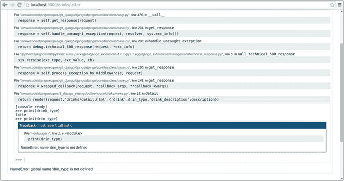

# 五、Django 应用管理

像所有现代应用开发框架一样，Django 要求您最终管理任务来支持项目的核心操作。这可以从有效地设置 Django 应用以在现实世界中运行，到管理应用的静态资源(例如 CSS、JavaScript、图像文件)。

此外，其他例行应用管理任务可以包括以下内容:建立日志记录策略以实施问题检测，为应用用户和/或管理员设置电子邮件传递，以及调试任务以检查复杂操作的结果。在这一章中，您将了解这些以及其他与 Django 应用管理相关的常见主题。

## Django settings.py 用于真实世界

`settings.` `py`是所有 Django 项目的中心配置。在前面的章节中，您已经使用了这个文件中的一系列变量来配置 Django 应用、数据库、模板和中间件等等。

尽管`settings.py`文件对几乎所有变量都使用了合理的默认值，但是当 Django 应用过渡到现实世界时，您需要考虑一系列调整，以便高效地运行 Django 应用，为最终用户提供简化的体验，并控制潜在的恶意攻击者。

### 将调试切换到 False

在现实世界中启动 Django 应用首先要做的事情之一是将变量`DEBUG`改为`False`。我在前面的章节中已经简单地提到了 Django 在从`DEBUG=False`切换到`DEBUG=True`时的行为变化。所有这些与`DEBUG`变量相关的行为变化都是为了增强项目的安全性。表 [5-1](#Tab1) 说明了使用`DEBUG=False`和`DEBUG=True`运行项目的区别。

表 5-1。

Django behavior differences between DEBUG=True and DEBUG=False

<colgroup><col> <col> <col></colgroup> 
| 功能 | 调试=真实行为 | 调试=错误行为 |
| --- | --- | --- |
| 错误处理和通知 | 在请求页面上显示完整的错误堆栈，以便快速分析。 | 显示默认的“普通”或自定义错误页面，没有任何堆栈详细信息，以限制安全威胁或尴尬。向项目管理员发送错误电子邮件。(有关电子邮件通知的更多详细信息，请参见本节中的“为管理员和管理者定义管理员”一节。) |
| 静态资源 | 为简单起见，默认设置在项目的/static/ URL 上。 | 禁用自动安装以避免安全漏洞，并要求整合到单独的目录中，以便在单独的 web 服务器上运行静态资源。(请参阅下一节中的设置静态网页资源-图像、CSS、JavaScript。)。) |
| 主机/站点限定符 | 接受对所有主机/站点的请求进行处理。 | 有必要确定项目可以处理请求的主机/站点。如果站点/主机不合格，所有请求都会被拒绝。(有关更多详细信息，请参见本节中的“定义允许的主机”一节。) |

正如您在表 [5-1](#Tab1) 中所看到的，通过将`DEBUG=True`更改为`DEBUG=False`而实施的更改旨在用于可公开访问的应用(即生产环境)。您可能不喜欢适应这些变化的麻烦，但是它们是为了在现实世界中运行的所有 Django 项目上保持更高的安全性而强制实施的。

### 定义允许的主机

默认情况下，`settings.py`中的`ALLOWED_HOSTS`变量为空。`ALLOWED_HOSTS`的目的是验证请求的 HTTP `Host`报头。进行验证是为了防止恶意用户发送伪造的 HTTP `Host`报头，这些报头可能会毒害缓存和带有恶意主机链接的密码重置电子邮件。由于该问题只能在不受控制的用户环境下出现(即公共/生产服务器)，因此仅在`DEBUG=False`时进行验证。

如果切换到`DEBUG=False`而`ALLOWED_HOSTS`为空，Django 拒绝服务请求，而是用 HTTP 400 错误请求页面来响应，因为它不能验证传入的 HTTP `Host`头。清单 [5-1](#Par9) 展示了`ALLOWED_HOSTS`的示例定义。

```py
ALLOWED_HOSTS = [
    '.coffeehouse.com',
    '.bestcoffeehouse.com',
]
Listing 5-1.Django ALLOWED_HOSTS definition

```

正如您在清单 [5-1](#Par9) 中看到的，`ALLOWED_HOSTS`值是一个字符串列表。在这种情况下，它定义了两个主机域，允许`bestcoffeehouse.com`充当`coffeehouse.com`的别名。领头的。(点)表示子域也是允许的主机域(例如，`static.coffeehouse.com`或`shop.coffeehouse.com`对`.coffeehouse.com`有效)。

如果您想接受一个完全限定的域(FQDN)，您可以定义`ALLOWED_HOSTS=['` [`www.coffeehouse.com`](http://www.coffeehouse.com) `']`，它只接受带有 HTTP `Host` [`www.coffeehouse.com`](http://www.coffeehouse.com) 的请求。类似地，如果您想接受任何 HTTP 主机——有效地绕过验证——您可以定义`ALLOWED_HOSTS=['*']`,它表示一个通配符。

### 小心使用 SECRET_KEY 值

`settings.py`中的`SECRET_KEY`值是另一个与安全相关的变量，如`ALLOWED_HOSTS`。然而，与`ALLOWED_HOSTS`不同的是，`SECRET_KEY`被赋予一个默认值和一个很长的值(例如`'oubrz5ado&%+t(qu^fqo_#uhn7*+q*#9b3gje0-yj7^#g#ronn'`)。

`SECRET_KEY`值的目的是对某些易被篡改的数据结构进行数字签名。具体来说，Django 默认使用敏感数据结构上的`SECRET_KEY`,比如会话标识符、cookies 和密码重置标记。但是您可以依靠`SECRET_KEY`值来加密保护 Django 项目中的任何敏感数据结构。 [<sup>1</sup>](#Fn1)

用`SECRET_KEY`签名的默认数据结构的一个共同点是，它们被发送给更广泛的互联网上的用户，然后被发送回应用以代表用户触发动作。正是在这种情况下，我们进入了信任问题。发回应用的数据可信吗？如果恶意用户试图模拟另一个用户的 cookie 或会话数据来劫持他的访问，该怎么办？这是数字签名数据所阻止的。

在 Django 向互联网上的用户发送任何这些敏感的数据结构之前，它会用项目的`SECRET_KEY`给它们签名。当数据结构返回来完成一个动作时，Django 再次对照`SECRET_KEY`检查这些敏感的数据结构。如果对数据结构有任何篡改，签名检查就会失败，Django 会中止这个过程。

流氓用户成功发动这种攻击的唯一可能性是`SECRET_KEY`被破坏——因为攻击者可能会创建一个与项目的`SECRET_KEY`相匹配的修改过的数据结构。因此，你应该小心暴露你的项目的`SECRET_KEY`。如果您怀疑某个项目的`SECRET_KEY`由于任何原因已经被破坏，您应该立即替换它——只有少数短暂的数据结构(即会话、cookies)会随着这种改变而变得无效，直到用户再次重新登录，新的`SECRET_KEY`用于重新生成这些数据结构。

### 为管理员和经理定义管理员

一旦最终用户可以访问 Django 项目，您就会希望通过某种方式接收与安全或其他关键因素相关的重要事件的通知。Django 有两套管理组，分别在`settings.py` : `ADMINS`和`MANAGERS`中定义。默认情况下，`ADMINS`和`MANAGERS`都是空的。分配给这两个变量的值必须是元组，其中元组的第一个值是一个名称，元组的第二部分是一封电子邮件。清单 [5-2](#Par19) 显示了`ADMINS`和`MANAGERS`的示例定义。

```py
ADMINS = (('Webmaster','webmaster@coffeehouse.com'),('Administrator','admin@coffeehouse.com'))

MANAGERS = ADMINS

Listing 5-2.Django ADMINS and MANAGERS definition

```

正如您在清单 [5-2](#Par19) 中看到的，变量`ADMINS`被赋予了两个具有不同管理员的元组。接下来，你可以看到`ADMINS`的值被赋给了`MANAGERS`变量。当然，您可以使用与`ADMINS`相同的语法为`MANAGERS`定义不同的值，但是在这种情况下，为了简单起见，我给了两个变量相同的值。

在`settings.py`中有这两个管理组的目的是让 Django 发送项目事件的电子邮件通知。默认情况下，这些事件是有限的，并且在特定情况下发生。毕竟，你不希望每分钟 24/7 向管理员发送 10 封电子邮件通知。

默认情况下，当且仅当`DEBUG=False`出现与`django.request`或`django.security`包相关的错误时，会向`ADMINS`发送电子邮件通知。这是一个非常狭窄的标准，因为它只打算通知最严重的错误——对于请求和安全性——并且只针对生产环境，也就是当`DEBUG=False`出现时。因为没有其他事件或条件，所以`ADMINS`通过电子邮件通知。

默认情况下，当且仅当`DEBUG=False`和 Django 中间件`django.middleware.common.BrokenLinkEmailsMiddleware`启用时，才会向`MANAGERS`发送断开链接的电子邮件通知(即 HTTP 404 页面请求)。因为 HTTP 404 页面请求不是一个严重的问题，默认情况下`BrokenLinkEmailsMiddleware`是禁用的。这是一个比`ADMINS`更窄的标准，因为不管项目是在开发中(`DEBUG=True`)还是在生产中(`DEBUG=False`)，都需要将`BrokenLinkEmailsMiddleware`类添加到`settings.py`中的`MIDDLEWARE`变量中，以便`MANAGERS`获得通知。因为没有其他事件或条件，所以`MANAGERS`通过电子邮件通知。

既然您已经知道了`ADMINS`和`MANAGERS`的用途，那么就在您的项目中添加您认为合适的用户和电子邮件。记住，对于 Django 项目中的其他定制逻辑，您总是可以利用`ADMINS`和`MANAGERS`中的值(例如，通知管理员用户注册)。

Modify Logging to Stop Email Notifications to Admins

默认情况下，一旦您切换到 DEBUG=False，ADMINS 中的用户就开始收到错误电子邮件——这与管理器不同，管理器永远不会收到电子邮件，除非您将 BrokenLinkEmailsMiddleware 添加到 MIDDLEWARE_CLASSES。

要在 DEBUG=False 时停止向管理员发送电子邮件通知，您可以修改 Django 的日志设置，这将在本章的日志一节中介绍。您也可以不定义 ADMINS，这样就不会发送电子邮件，但这会使您的项目没有可能对其他用途有用的 ADMINS 定义。

### 使用动态绝对路径

在`settings.py`中有一些依赖于目录位置的 Django 变量，例如`STATIC_ROOT`，它为项目的静态文件定义了一个合并目录，或者`TEMPLATES`变量的`DIRS`列表，它定义了项目模板的位置，等等。

依赖于目录位置的变量的问题是，如果您在不同的服务器上运行项目或者与其他用户共享项目，那么很难在一系列环境中跟踪或保留相同的目录。要解决这个问题，您可以定义变量来动态确定项目的绝对路径。清单 [5-3](#Par29) 展示了一个 Django 项目目录结构，部署到`/www/`系统目录中。

```py
+-/www/+
       |
       +--STORE--+
                 |
                 +---manage.py
                 |
                 +---coffeestatic--+
                 |                 |
                 |                 +-(Consolidated static resources)
                 |
                 +---coffeehouse--+
                                  |
                                  +-__init__.py
                                  +-settings.py
                                  +-urls.py
                                  +-wsgi.py
                                  |
                                  +---templates---+
                                                  +-app_base_template.html
                                                  +-app_header_template.html
                                                  +-app_footer_template.html
Listing 5-3.Django project structure deployed to /www/

```

通常 Django `settings.py`文件会定义`TEMPLATES`中`STATIC_ROOT`和`DIRS`的值，如清单 [5-4](#Par31) 所示。

```py
# Other configuration variables omitted for brevity
STATIC_ROOT = '/www/STORE/coffeestatic/'

# Other configuration variables omitted for brevity
TEMPLATES = [
{
'BACKEND': 'django.template.backends.django.DjangoTemplates',
'DIRS': ['/www/STORE/coffeehouse/templates/',],
}
]

Listing 5-4.Django settings.py with absolute path values

```

清单 [5-4](#Par31) 中设置的问题是，如果您将 Django 应用部署到一个没有`/www/`目录的服务器上，它将需要编辑(例如，由于限制或 Windows 操作系统中目录以字母 C:/开头)。

清单 [5-5](#Par34) 中展示的一种更简单的方法是定义变量来动态确定项目的绝对路径。

```py
import os
BASE_DIR = os.path.dirname(os.path.dirname(os.path.abspath(__file__)))
PROJECT_DIR = os.path.dirname(os.path.abspath(__file__))

# Other configuration variables omitted for brevity
STATIC_ROOT = '%s/coffeestatic/' % (BASE_DIR)

# Other configuration variables omitted for brevity
TEMPLATES = [
{
'BACKEND': 'django.template.backends.django.DjangoTemplates',
'DIRS': ['%s/templates/'% (PROJECT_DIR),],
}
]

Listing 5-5.Django settings.py with dynamically determined absolute path

```

清单 [5-5](#Par34) 顶部定义的变量依赖于 Python `os`模块来动态确定相对于`settings.py`文件的绝对系统路径。`PROJECT_DIR=os.path.dirname(os.path.abspath(__file__))`语句被翻译成`/www/STORE/coffeehouse/`值，这是像`settings.py`这样的文件的绝对系统目录。要访问`/www/STORE/coffeehouse/`的父级，只需用另一个对`os.path.dirname`的调用包装相同的语句，并定义`BASE_DIR`变量，这样它就被转换成`/www/STORE/`值。

清单 [5-5](#Par34) 中的其余语句使用标准的 Python 字符串替换来使用`PROJECT_DIR`和`BASE_DIR`来设置`STATIC_ROOT`和`TEMPLATE_DIRS`变量中的绝对路径。通过这种方式，您不需要为任何 Django 配置变量硬编码绝对路径；不管应用部署目录如何，变量都会自动调整到任何绝对目录。

### 为 Django 使用多个环境或配置文件

在每个 Django 项目中，你最终会意识到你必须将`settings.py`分成多个环境或文件。这可能是因为`settings.py`中的值需要在开发和生产服务器之间进行更改，有许多人在不同的需求下工作于同一个项目(例如，Windows 和 Linux)，或者您需要将敏感的`settings.py`信息(例如，密码)保存在不与他人共享的本地文件中。

在 Django 中，没有最好的或标准的方法将`settings.py`分割成多个环境或文件。事实上，有许多技术和库可以让 Django 项目用一个分割的`settings.py`文件运行。接下来，我将展示我在项目中使用的三个最流行的选项。根据您的需求，您可能会觉得使用一种方法比使用另一种方法更合适，或者混合使用两种或所有三种方法来实现最终解决方案。

#### 选项 1)同一个 settings.py 文件中的多个环境，带有一个控制变量

`settings.py`文件被视为普通的 Python 文件，因此使用 Python 库或条件来获得某些行为没有限制。这意味着您可以基于固定值(例如，服务器主机名)轻松引入控制变量，以有条件地设置某些变量值。

例如，更改`DATABASES`变量——因为密码和数据库名称在开发和生产之间会发生变化——更改`EMAIL_BACKEND`变量——因为您不需要像在生产中那样在开发中发送实际的电子邮件——或者更改`CACHES`变量——因为您不需要像在生产中那样在开发中使用缓存来提高性能。

清单 [5-6](#Par42) 展示了基于 Python 的`socket`模块设置一个名为`DJANGO_HOST`的控制变量；然后，该变量用于根据服务器的主机名加载不同组的 Django 变量。

```py
# Import socket to read host name
import socket
# If the host name starts with 'live', DJANGO_HOST = "production"
if socket.gethostname().startswith('live'):
    DJANGO_HOST = "production"
# Else if host name starts with 'test', set DJANGO_HOST = "test"
elif socket.gethostname().startswith('test'):
    DJANGO_HOST = "testing"
else:
# If host doesn't match, assume it's a development server, set DJANGO_HOST = "development"
    DJANGO_HOST = "development"

# Define general behavior variables for DJANGO_HOST and all others
if DJANGO_HOST == "production":
    DEBUG = False
    STATIC_URL = 'http://static.coffeehouse.com/'
else:
    DEBUG = True
    STATIC_URL = '/static/'

# Define DATABASES variable for DJANGO_HOST and all others
if DJANGO_HOST == "production":
   # Use mysql for live host
   DATABASES = {
    'default': {
        'NAME': 'housecoffee',
        'ENGINE': 'django.db.backends.mysql',
        'USER': 'coffee',
        'PASSWORD': 'secretpass'
    }
  }
else:
   # Use sqlite for non live host
   DATABASES = {
    'default': {
        'ENGINE': 'django.db.backends.sqlite3',
        'NAME': os.path.join(BASE_DIR, 'coffee.sqlite3'),
    }
  }

# Define EMAIL_BACKEND variable for DJANGO_HOST
if DJANGO_HOST == "production":
    # Output to SMTP server on DJANGO_HOST production
    EMAIL_BACKEND = 'django.core.mail.backends.smtp.EmailBackend'
elif DJANGO_HOST == "testing":
    # Nullify output on DJANGO_HOST test
    EMAIL_BACKEND = 'django.core.mail.backends.dummy.EmailBackend'
else:
    # Output to console for all others
    EMAIL_BACKEND = 'django.core.mail.backends.console.EmailBackend'

# Define CACHES variable for DJANGO_HOST production and all other hosts
if DJANGO_HOST == "production":
   # Set cache
   CACHES = {
        'default': {
            'BACKEND': 'django.core.cache.backends.memcached.MemcachedCache',
            'LOCATION': '127.0.0.1:11211',
            'TIMEOUT':'1800',
            }
        }
   CACHE_MIDDLEWARE_SECONDS = 1800
else:
   # No cache for all other hosts
   pass

Listing 5-6.Django settings.py with control variable with host name to load different sets of variables

```

清单 [5-6](#Par42) 中的第一行导入 Python `socket`模块来访问主机名。接下来，使用`socket.gethostname()`声明一系列条件，以确定控制变量`DJANGO_HOST`的值。如果主机名以字母`live`开头，则`DJANGO_HOST`变量被设置为`"production"`，如果主机名以`test`开头，则`DJANGO_HOST`被设置为`"testing"`，如果主机名不是以前面的选项开头，则`DJANGO_HOST`被设置为`"development"`。

在这个场景中，字符串方法`startswith`用于确定如何根据主机名设置控制变量。然而，您可以轻松地使用任何其他 Python 库甚至标准(例如，IP 地址)来设置控制变量。此外，由于控制变量是基于字符串的，您可以根据需要引入任意多的配置变量。在这种情况下，我们使用三种不同的变量来设置`settings.py`变量——`"production"`、`"testing"`和`"development"`——但是如果你需要如此多的不同设置，你可以很容易地定义五个或十几个变量。

#### 选项 2)使用 configparser 的多个环境文件

split `settings.py`的另一个变化是依赖 Python 内置的 configparser 模块。configparser 允许 Django 从文件中读取配置变量，这些文件使用的数据结构类似于 Microsoft Windows INI 文件中使用的数据结构。清单 [5-7](#Par46) 展示了一个样本 configparser 文件。

```py
[general]
DEBUG: false
STATIC_URL: http://static.coffeehouse.com/

[databases]
NAME: housecoffee
ENGINE: django.db.backends.mysql
USER: coffee
PASSWORD: secretpass

[security]
SECRET_KEY: %%ea)cjy@v9(7!b(20gl+4-6iur28dy=tc4f$-zbm-v=!t

Listing 5-7.Python configparser sample file production.cfg

```

正如您在清单 [5-7](#Par46) 中看到的，configparser 文件的格式由括号中声明的各个部分构成(例如，`[general]`，`[databases]`)，每个部分下面是不同的键和值。清单 [5-7](#Par46) 中的变量代表了一个放置在名为`production.cfg`的文件中的生产环境。我为这个文件选择了`.cfg`扩展名，但是如果你愿意，你也可以使用`.config`或`.ini`扩展名；扩展名与 Python 无关——唯一重要的是文件本身的数据格式。

类似于`production.cfg`中的内容，您可以为其他环境创建不同变量的其他文件(如`testing.cfg`、`development.cfg`)。一旦有了 configparser 文件，就可以将它们导入到 Django `settings.py`中。清单 [5-8](#Par49) 显示了一个使用 configparser 文件中的值的示例`settings.py`。

```py
import os

BASE_DIR = os.path.dirname(os.path.dirname(os.path.abspath(__file__)))
PROJECT_DIR = os.path.dirname(os.path.abspath(__file__))

# Access configparser to load variable values
from django.utils.six.moves import configparser
config = configparser.SafeConfigParser(allow_no_value=True)

# Import socket to read host name
import socket
# If the host name starts with 'live', load configparser from "production.cfg"
if socket.gethostname().startswith('live'):
    config.read('%s/production.cfg' % (PROJECT_DIR))
# Else if host name starts with 'test', load configparser from "testing.cfg"
elif socket.gethostname().startswith('test'):
    config.read('%s/testing.cfg' % (PROJECT_DIR))
else:
# If host doesn't match, assume it's a development server, load configparser from "development.cfg"
    config.read('%s/development.cfg' % (PROJECT_DIR))

DEBUG = config.get('general', 'DEBUG')
STATIC_URL = config.get('general', 'STATIC_URL')

DATABASES = {
    'default': {
        'NAME': config.get('databases', 'NAME'),
        'ENGINE': config.get('databases', 'ENGINE'),
        'USER': config.get('databases', 'USER'),
        'PASSWORD': config.get('databases', 'PASSWORD')
    }
  }

SECRET_KEY = config.get('security', 'SECRET_KEY')

Listing 5-8.Django settings.py with configparser import

```

Note

清单 [5-8](#Par49) 中的配置假设主机名以名称 live 开始，以便加载清单 [5-7](#Par46) 中的 configparser production.cfg。调整清单 [5-8](#Par49) 开头的条件以匹配主机名并加载适当的 configparser 文件。

正如您在清单 [5-8](#Par49) 中看到的，configparser 通过`django.utils.six.moves`加载到 Django 中，这是一个允许 Python 2 和 Python 3 之间交叉导入的实用程序。在 Python 2 中，configparser 包实际上被命名为`ConfigParser`，但是这个实用程序允许我们在 Python 2 或 Python 3 中使用相同的 import 语句。导入之后，我们使用带有参数`allow_no_value=True`的`SafeConfigParser`类来允许处理 configparser 键中的空值。

然后，我们依靠相同的现有技术，使用 Python 的`socket`模块来访问主机名，并确定要加载哪个 configparser 文件。使用`SafeConfigParser`实例的 read 方法加载 configparser 文件。此时，所有 configparser 变量都已加载并准备好供访问。清单 [5-8](#Par49) 的剩余部分显示了一系列标准 Django `settings.py`变量，这些变量使用`SafeConfigParser`实例的`get`方法赋值，其中第一个参数是 configparser 部分，第二个参数是 key 变量。

因此，在如何将`settings.py`中的变量拆分到多个环境中，您有了另一种选择。正如我在开始时提到的，做这件事没有最好或标准的方法。有些人更喜欢 configparser，因为它将值拆分到单独的文件中，避免了选项 1 的许多条件，但其他人可能讨厌 configparser，因为需要处理特殊的语法和单独的文件。选择最适合你的项目的。

#### 选项 3)每个环境有多个不同名称的 settings.py 文件

最后，将 Django 变量拆分到多个环境的另一个选项是创建多个不同名称的`settings.py`文件。默认情况下，Django 会在项目基本目录的`settings.py`文件中查找配置变量。

然而，可以告诉 Django 加载一个不同名称的配置文件。Django 为此使用了操作系统变量`DJANGO_SETTINGS_MODULE`。默认情况下，Django 将这个 OS 变量设置为位于任何 Django 项目的基目录下的`manage.py`文件中的`<project_name>.settings`。由于`manage.py`文件用于引导 Django 应用，该文件中的`DJANGO_SETTINGS_MODULE`值保证配置变量总是从`<project_name>`子目录中的`settings.py`文件加载。

所以让我们假设您为 Django 应用创建了不同的`settings.py`文件——与`settings.py`放在同一个目录中——命名为`production.py`、`testing.py`和`development.py`。您有两种选择来加载这些不同的文件。

一种选择是将项目的`manage.py`文件中的`DJANGO_SETTINGS_MODULE`定义更改为具有所需配置的文件(例如，`os.environ.setdefault("DJANGO_SETTINGS_MODULE", "coffeehouse.production")`加载`production.py`配置文件)。然而，硬编码这个值是不灵活的，因为您需要根据期望的配置不断地改变`manage.py`中的值。这里，您可以在`manage.py`中使用一个控制变量，根据主机名动态确定`DJANGO_SETTINGS_MODULE`的值——类似于前面选项 1 中针对`settings.py`描述的过程。

设置`DJANGO_SETTINGS_MODULE`而不改变`manage.py`的另一种可能性是在操作系统级别定义`DJANGO_SETTINGS_MODULE`，这样它会覆盖`manage.py`中的定义。清单 [5-9](#Par59) 展示了如何在 Linux/Unix 操作系统上设置`DJANGO_SETTINGS_MODULE`变量，以便使用`testing.py`文件中的应用变量来代替`settings.py`文件。

```py
$ export DJANGO_SETTINGS_MODULE=coffeehouse.load_testing
$ python manage.py runserver
Validating models...

0 errors found
Django version 1.11, using settings 'coffeehouse.load_testing'
Development server is running at http://127.0.0.1:8000/
Quit the server with CONTROL-C.

Listing 5-9.Override DJANGO_SETTINGS_MODULE to load application variables from a file called testing.py and not the default settings.py

```

在清单 [5-9](#Par59) 中，我们使用标准的 Linux/Unix 语法`export variable_name=variable_value`来设置环境变量。一旦完成，注意使用开发服务器的 Django 应用显示启动消息`"using settings 'coffeehouse.load_testing'"`。

如果您计划在操作系统级别覆盖`DJANGO_SETTINGS_MODULE`来加载不同的 Django 应用变量，请注意默认情况下操作系统变量不是永久的或继承的。这意味着您可能需要为启动 Django 的每个 shell 定义`DJANGO_SETTINGS_MODULE`,并将其定义为运行时环境(例如 Apache)的一个局部变量。

## 设置静态网页资源——图像、CSS、JavaScript

如果项目使用`DEBUG=True`或`DEBUG=False`运行，Django 项目中静态资源的设置过程会有很大的不同。这意味着静态资源部署取决于您是在开发环境中工作——通常使用`DEBUG=True`——还是在生产环境中工作——通常使用`DEBUG=False`。

考虑到您总是在开发环境中启动 Django 项目，然后迁移到生产环境，我将首先描述开发设置过程，然后描述生产设置过程。

### 在开发环境中设置静态资源(DEBUG=False)

默认情况下，当`DEBUG=False`时，Django 自动从两个主要位置设置静态资源。第一个位置是所有 Django 应用中的`static`文件夹，第二个位置是在`settings.py`的`STATICFILES_DIR`变量中声明的文件夹。

虽然您需要在 Django apps 中手动创建`static`文件夹，但是在项目中设置静态资源非常容易。因为 Django 为每个项目应用设置了所有的`static`文件夹，所以建议在`static`文件夹中进一步添加一个子目录(例如`<app_folder>/static/<app_name>/<static_files_here>`)，以限定静态资源并避免潜在的命名冲突。清单 [5-10](#Par66) 展示了一个静态资源的样本目录结构。

```py
+-<BASE_DIR_project_name>
|
+-manage.py
|
+-bootstrap-3.1.1-dist+
|                     +-bootstrap.min.js
|
+-jquery-1-11-1-dist+
|                   +jquery.min.js
|
+-jquery-ui-1.10.4+
|                 +jquery-ui.min.js
|
+-website-static-default+
|                       +-favicon.ico
|                       +-robots.txt
|
|
+---+-<PROJECT_DIR_project_name>
    |
    +-__init__.py
    +-settings.py
    +-urls.py
    +-wsgi.py
    |
    +-about(app)-+
    |            +-__init__.py
    |            +-models.py
    |            +-tests.py
    |            +-views.py
    |            +-static-+
    |                     |
    |                     +-about-+
    |                             +-img-+
    |                             |     +-logo.png
    |                             |
    |                             +-css-+
    |                                   +-custom.css
    +-stores(app)-+
                 +-__init__.py
                 +-models.py
                 +-tests.py
                 +-views.py
                 +-static-+
                          |
                          +-stores-+
                                   +-img-+
                                   |     +-coffee.gif
                                   |
                                   +-css-+
                                         +-custom.css
Listing 5-10.Django app structure with static directories

```

如清单 [5-10](#Par66) 所示，所有 Django 应用目录都有一个包含静态资源的`static`子目录。这些静态子目录下的任何内容都是为访问而设置的。

还要注意清单 [5-10](#Par66) 中的应用名称子目录在`static`子目录中作为名称空间的重要性。如果静态资源直接放在所有应用中的`static`文件夹下，在这种情况下，会导致两个相同的文件路径名为`/static/css/custom.css`，在这种情况下，调用加载这个静态资源会导致冲突。从技术上讲，Django 总是使用它找到的第一个文件，但是第一个文件是正确的吗？通过使用`static`内的应用名称子目录，它避免了任何潜在的冲突，一个静态资源设置在`/static/about/css/custom.css`而另一个设置在`/static/stores/css/custom.css`。

因为可能存在不一定属于特定项目应用的静态资源，所以 Django 还支持设置存储在任何子目录中的静态资源的能力。

如果您再次查看清单 [5-10](#Par66) ，在`BASE_DIR`和`PROJECT_DIR`之间，您将会看到包含流行静态资源库- `jquery`、`jquery-ui`和`bootstrap`的各种子文件夹，以及包含网站标准静态资源-`robots.txt & favicon.ico`的子文件夹`website-static-default`。

为了设置这些额外的静态资源，您在`settings.py`的`STATICFILES_DIR`变量中定义这些目录的位置。清单 [5-11](#Par72) 展示了一个`STATICFILES_DIR`定义的例子。

```py
BASE_DIR = os.path.dirname(os.path.dirname(os.path.abspath(__file__)))

STATICFILES_DIRS = ('%s/website-static-default/'% (BASE_DIR),
                    ('bootstrap','%s/bootstrap-3.1.1-dist/'% (BASE_DIR)),
                    ('jquery','%s/jquery-1-11-1-dist/'% (BASE_DIR)),
                    ('jquery-ui','%s/jquery-ui-1.10.4/'% (BASE_DIR)),)

Listing 5-11.Django STATICFILES_DIR definition with namespaces in settings.py

```

正如您在清单 [5-11](#Par72) 中看到的，`STATICFILES_DIRS`接受一个目录列表。在这种情况下，所有目录都在 Django 项目的`BASE_DIR`下，所以它使用了动态确定父目录的`BASE_DIR`变量。清单 [5-11](#Par72) 中目录列表的另一个方面是你可以选择声明一个名称空间，类似于应用的`static`子目录中使用的方法。

清单 [5-11](#Par72) 中的第一个目录定义是一个简单的字符串(也就是说，它没有名称空间)，这意味着`website-static-default`中的静态资源是用直接访问模式建立的。其余的目录定义是元组而不是字符串。通过使用元组，它将元组的第一部分定义为名称空间，第二部分定义为包含静态资源的目录。带有名称空间的定义意味着给定目录下的所有静态资源将在其访问模式中使用前缀名称空间(例如，要访问`bootstrap-3.1.1-dist`上的静态资源，访问模式应该以`bootstrap`为前缀)。

现在您已经知道了在哪里以及如何设置所有静态资源，让我们快速看一下 Django 如何可视化这些静态资源，以理解静态资源的最终访问模式是什么样子的。清单 [5-12](#Par76) 展示了前面清单中呈现的静态资源的可视化。

```py
+-favicon.ico
+-robots.txt
|
+-jquery+
|       +jquery.min.js
|
+-jquery-ui+
|          +jquery-ui.min.js
|
+-bootstrap+
|          +-bootstrap.css
|
+-about-+
|       +-img-+
|       |     +-logo.png
|       |
|       +-css-+
|             +-custom.css
|
+-stores-+
         +-img-+
         |     +-coffee.gif
         |
         +-css-+
               +-custom.css
Listing 5-12.Django visualization of static resources in apps and STATICFILES_DIRS

```

清单 [5-12](#Par76) 中的文件`favicon.ico`和`robots.txt`位于可视化的顶层，因为它们的源目录`website-static-default`在`STATICFILES_DIRS`中没有命名空间。

其余的静态资源都分组在子文件夹中，因为我们要么在`STATICFILES_DIRS`中为它们定义了一个名称空间，要么在应用的`static`子目录中将子文件夹定义为名称空间。

现在您已经理解了 Django 如何将静态资源可视化为一个组，以及这如何决定静态资源的最终访问模式，让我们将注意力转向`settings.py`中的`STATIC_URL`变量。

`STATIC_URL`用于定义清单 [5-12](#Par76) 中显示的 Django 静态资源可视化的 URL 入口点。默认情况下，`STATIC_URL`被赋予`/static/`值。这意味着如果`STATIC_URL='/static/'`，静态资源`robots.txt`在 URL `/static/robots.txt`变得可访问，就像`stores/img/coffee.gif`在 URL `/static/stores/img/coffee.gif`变得可访问一样。

这意味着您在`/static/` URL 上访问静态资源，或者如果您更改了`STATIC_URL`值，则在不同的 URL 上访问静态资源。但是，不要在模板上硬编码这些静态资源路径！(如``)。您应该使用一个变量，以便在`STATIC_URL`改变的情况下动态确定最终路径。下一节将描述如何在 Django 模板中做到这一点。

Caution

对静态资源的自动访问只适用于 Django 的内置 web 服务器，并且 DEBUG=True。

之前静态资源的设置过程有 Django 的“幕后”帮助。它只与 Django 的内置 web 服务器(即`python manage.py runserver`)一起工作，并且只有在`DEBUG=True`的情况下。一旦你换到一个不同的 web 服务器或者切换`DEBUG=False`甚至使用 Django 的内置 web 服务器，就没有静态资源可用，如清单 [5-12](#Par76) 所示。

这种行为背后的主要原因是因为从应用的主 web 服务器/URL 结构(例如，`/static/`)保留和调度静态资源是非常低效的。所以这只是为了方便使用 Django 的内置 web 服务器进行开发。当然，您可以将一个完整的 URL 域分配给`STATIC_URL`(例如 [`http://static.coffeehouse.com/`](http://static.coffeehouse.com/) )，但是这假设您已经在一个类似生产的环境中设置了项目的静态资源，在我描述如何访问 Django 和 Jinja 模板中的静态资源时，我将很快讨论这个问题。

### 访问 Django 模板中的静态资源

推荐在 Django 模板中引用静态资源的方法是通过 staticfiles 应用，通过``标签。清单 [5-13](#Par86) 展示了 staticfiles 应用语法的各种例子。

```py


# For static resource at about/img/logo.png


# For static resource at bootstrap/bootstrap.css
<link href="" rel="stylesheet">

# For static resource at jquery/jquery.min.js
<script src=""></script>

Listing 5-13.Django  tag to reference static resources

```

首先，重要的是要注意清单 [5-13](#Par86) 中的``标签可以通过 staticfiles 应用获得，该应用默认安装在所有 Django 项目的`INSTALLED_APPS`变量中。如果出于某种原因，你修改了`INSTALLED_APPS`中的默认值，确保你在`INSTALLED_APPS`变量中有`django.contrib.staticfiles`的值，否则接下来的都不会起作用。

正如您在清单 [5-13](#Par86) 中看到的，在模板的顶部，您总是声明``语句。一旦完成，模板就可以使用``标签为静态资源生成动态路径。在大多数情况下，``标签依赖于`settings.py`中的`STATIC_URL`变量来生成静态资源的适当路径。

对于更高级的情况，``标签使用相同的`STATIC_URL`变量和后备存储技术(例如，CDN-‘内容交付网络’)配置的组合来生成静态资源的适当路径。

例如，请注意清单 [5-13](#Par86) 中的``标签后面总是跟有一个文件路径，该路径与清单 [5-12](#Par76) 中静态资源的 Django 可视化相同。由于`STATIC_URL`变量的值为`/static/`，这意味着清单 [5-13](#Par86) 中的``语句被替换为该值(例如``变成了`/static/bootstrap/bootstrap.css`)。

当 Django 项目使用非标准的后端来提供静态资源时,``标签被替换为不同于`STATIC_URL`变量的东西——最后一种情况将在下面的侧栏中简要讨论。

Why Use the Staticfiles  Tag Vs. Using the Static_Url Variable Directly in Templates?

在 Django 的早期版本中，Django 模板在模板中直接使用了 STATIC_URL 变量(例如)。事实上，您仍然可以通过 Django . template . context _ processors . STATIC 上下文处理器访问所有 Django 模板上的 STATIC_URL 变量。

然而，随着服务静态资源的底层技术变得越来越复杂，STATIC_URL 变量本身被证明是不够的。例如，像 CDNs 或亚马逊 S3 这样的静态服务技术经常使用特殊的令牌来实施认证或缓存策略。这意味着类似于的语句需要转换成类似于 [ `http://cdnprovider.com/about/img/logo.gif?token=e354534566` ](http://cdnprovider.com/about/img/logo.gif?token=e354534566) " >或< img src=" [ `http://staticresources.com/about/img/logo32AzTB9r5.gif` ](http://staticresources.com/about/img/logo32AzTB9r5.gif) " >的语句。虽然可以将 STATIC_URL 变量更改为完整的域，但是很难修改静态资源的路径本身。

用像这样的标签重写静态资源的路径很容易。因为可以接受静态资源的基本字符串(例如，about/img/logo.gif ),并使用 STATIC_URL 变量和底层静态服务技术所需的任何特殊标记动态生成完整路径。这个过程是通过使用一个定制的存储类来实现的，该存储类是为静态服务技术而设计的。

当然，并不是所有的项目都需要使用先进的静态服务技术。但是通过使用 staticfiles 应用的标记来声明 Django 模板中的静态资源，您可以确保 Django 项目能够使用任何静态服务技术，从最基本的到最高级的。

### 访问 Jinja 模板中的静态资源

如前一章所述，Jinja 模板提供了 Django 自己的模板的替代品。但是与 Django 模板不同，你必须遵循不同的设置来使用 Jinja 模板中 staticfiles 应用的 Django 的``标签。

为了能够在 Jinja 模板中使用相同的 staticfiles app / ``标记行为，您需要设置一个名为 static 的全局变量来挂钩这个功能。在前面关于 Jinja 模板的章节中,“在 Django 中为所有 Jinja 模板(如 Django 上下文处理器)上的访问设置数据”一节描述了如何用这个功能创建一个全局变量。

### 在生产环境中设置静态资源(DEBUG=True)

当您将 Django 项目的`DEBUG`变量切换到`True`或者切换到不同的 web 服务器(例如 Apache、Nginx)时，您会惊讶地发现项目中不再出现任何静态资源。不要惊慌，这是故意的。当`DEBUG=True`使用 Django 的内置 web 服务器或者如果你切换到第三方 web 服务器时，设置 Django 来服务静态资源并不太困难。

Tip

您可以访问静态资源，使 Django 的内置 web 服务器在实际设置为 DEBUG=True 时提供静态资源，就像 DEBUG=False 一样。使用- insecure 标志运行 web 服务器:python manage . py run server–insecure。

Caution

虽然前面的解决方法是可用的，但我建议您不要使用它，以防标志名本身不安全不足以阻止您使用它。

Django 的内置 web 服务器(即`python manage.py runserver`)确实是一个快速启动和运行的便利工具，作为这种便利的一部分，它还在`DEBUG=False`时提供静态资源。

然而，允许同一个 web 服务器进程同时处理动态内容(Django web 页面)和静态资源(图像、CSS、JavaScript)确实是一种浪费。推荐的方法是完全使用一个单独的 web 服务器来服务静态资源，这就是为什么 Django 在切换`DEBUG=True`时打破了内置 web 服务器的便利性。

当`DEBUG=True`出现时，您需要做的第一件事是创建一个目录来保存 Django 可视化为静态资源的所有静态资源的副本。之前你已经了解到当`DEBUG=False`时，Django 将来自几个位置和子目录的静态资源可视化在一个单独的树中——如清单 [5-12](#Par76) 所示。Django 设想的正是这一棵树，您需要创建一个副本来在生产环境中运行。

你需要在`settings.py.`中定义`STATIC_ROOT`变量，你分配给`STATIC_ROOT`的值应该是一个目录，Django 将在那里复制你项目的所有静态资源——与 Django 在清单 [5-12](#Par76) 中展示的`DEBUG=True`时可视化它们的方式相同。请注意，此目录应该为空，因为每次执行同步过程时，它都会被不断覆盖。根据您的需要，该目录的位置可以是系统中的任何位置。为了简单起见，我将把 Django 项目的`BASE_DIR`下的`STATIC_ROOT`目录保留为`STATIC_ROOT = '%s/coffeestatic/'% (BASE_DIR`。

要触发同步过程(即，将所有静态资源复制到`STATIC_ROOT`，您需要使用`manage.py`脚本中可用的`collectstatic`命令。清单 [5-14](#Par106) 展示了同步过程的示例输出。

```py
[user@coffeehouse ∼]$ python manage.py collectstatic

You have requested to collect static files at the destination
location as specified in your settings:

    /www/STORE/coffeestatic

This will overwrite existing files!
Are you sure you want to do this?

Type 'yes' to continue, or 'no' to cancel: yes
yes
Copying '/www/STORE/website-static-default/sitemap.xml'
Copying '/www/STORE/website-static-default/robots.txt'
Copying '/www/STORE/website-static-default/favicon.ico'
....
....
....
Copying '/www/STORE/coffeehouse/about/static/css/custom.css'

732 static files copied to '/www/STORE/coffeestatic'.

Listing 5-14.Django collectstatic command to copy all static resources

```

一旦你将所有项目的静态资源收集到一个单独的文件夹中——在这个例子中是`/www/STORE/coffeestatic`——它们就可以在一个生产服务器上进行设置了(例如，Apache、Nginx 或 AWS S3)。请记住，`collectstatic`生成的目录/文件结构与清单 [5-12](#Par76) 中展示的上一节中 Django 可视化的目录/文件结构相同。

您需要做的最后一步是更新`settings.py`中的`STATIC_URL`值，以反映静态资源的新位置。例如，如果您在 Apache 或 Nginx 上的 [`http://static.coffeehouse.com/`](http://static.coffeehouse.com/) 域下挂载`/www/STORE/coffeestatic/`目录，您将设置`STATIC_URL='` [`http://static.coffeehouse.com`](http://static.coffeehouse.com) `'`。类似地，如果您将`/www/STORE/coffeestatic/`中的静态资源复制到一个名为 [`http://coffeehouse.s3.amazonaws.com`](http://coffeehouse.s3.amazonaws.com) 的 Amazon AWS S3 存储桶，您将设置`STATIC_URL='` [`http://coffeehouse.s3.amazonaws.com`](http://coffeehouse.s3.amazonaws.com) `'`

一旦进行了最后的修改，Django 模板中所有使用``标签的语句都将更新为新的全域 URL，在这种情况下，像`/www/STORE/coffeestatic/bootstrap/bootstrap.css`这样的资源将在[`http://static.coffeehouse.com/bootstrap/bootstrap.css`T5 或](http://static.coffeehouse.com/bootstrap/bootstrap.css) [`http://coffeehouse.s3.amazonaws.com/bootstrap/bootstrap.css`](http://coffeehouse.s3.amazonaws.com/bootstrap/bootstrap.css) 可用。

## Django 伐木公司

日志是最有用的应用管理实践之一，也是使用最少的应用管理实践之一。如果您仍然没有在 Django 项目中使用日志，或者使用 Python `print()`语句来深入了解应用正在做什么，那么您就错过了很多功能。接下来，您将学习 Python 核心日志概念，如何设置 Django 定制日志，以及如何使用监控服务来跟踪日志消息。

### Python 核心日志记录概念

Django 构建在 Python 的日志包之上。Python 日志包提供了一种健壮而灵活的方法来设置应用日志。如果您从未使用过 Python 的日志包，我将简要概述它的核心概念。Python 日志记录中有四个核心概念:

*   伐木工人。-提供日志消息分组的初始入口点。通常，每个 Python 模块(即，py 文件)有一个单独的日志记录器来分配它的日志消息。然而，也可以在同一个模块中定义多个记录器(例如，一个记录器用于业务逻辑，另一个记录器用于数据库逻辑，等等)。).此外，还可以在多个 Python 模块之间使用同一个日志记录器。py 文件。
*   经手人。-用于将日志消息(由记录器创建)重定向到目标。目的地可以包括平面文件、服务器控制台、电子邮件或 SMS 消息以及其他目的地。可以在多个记录器中使用同一个处理程序，就像一个记录器可以使用多个处理程序一样。
*   过滤器。-提供一种对日志消息应用规则的方法。例如，您可以使用过滤器将同一记录器生成的日志消息发送到不同的处理程序。
*   格式化程序。-用于指定日志消息的最终格式。

简要概述了 Python 日志概念之后，让我们直接开始探索 Django 的默认日志功能。

### Django 默认日志记录

Django 项目的日志配置在`settings.py`的`LOGGING`变量中定义。目前，甚至不要麻烦打开你的项目的`settings.py`文件，因为你不会在其中看到`LOGGING`。当您创建一个项目时，这个变量不是硬编码的，但是如果它没有被声明，它确实有一些有效的日志记录值。清单 [5-15](#Par119) 显示默认的`LOGGING`值，如果它没有在`settings.py`中声明的话。

```py
LOGGING = {
    'version': 1,
    'disable_existing_loggers': False,
    'filters': {
        'require_debug_false': {
            '()': 'django.utils.log.RequireDebugFalse',
        },
        'require_debug_true': {
            '()': 'django.utils.log.RequireDebugTrue',
        },
    },
    'handlers': {
        'console': {
            'level': 'INFO',
            'filters': ['require_debug_true'],
            'class': 'logging.StreamHandler',
        },
        'null': {
            'class': 'logging.NullHandler',
        },
        'mail_admins': {
            'level': 'ERROR',
            'filters': ['require_debug_false'],
            'class': 'django.utils.log.AdminEmailHandler'
        }
    },
    'loggers': {
        'django': {
            'handlers': ['console'],
        },
        'django.request': {
            'handlers': ['mail_admins'],
            'level': 'ERROR',
            'propagate': False,
        },
        'django.security': {
            'handlers': ['mail_admins'],
            'level': 'ERROR',
            'propagate': False,
        },
        'py.warnings': {
            'handlers': ['console'],
        },
    }
}
Listing 5-15.Default LOGGING in Django projects

```

总之，清单 [5-15](#Par119) 中所示的默认 Django 日志记录设置具有以下日志记录行为:

*   控制台日志记录或`console`处理程序仅在`DEBUG=True`时完成，对于比`INFO`更差的日志消息(含)且仅针对 Python 包`django` -及其子包(如`django.request`、`django.contrib` ) -以及 Python 包`py.warnings`。
*   管理日志或`mail_admins`处理程序——向`ADMINS`发送电子邮件——仅在`DEBUG=False`时完成，用于比`ERROR`更糟糕的日志消息(包括 T3 ),并且仅用于 Python 包`django.request`和`django.security`。

我们先来分解一下清单 [5-14](#Par106) 中的`handlers`部分。处理程序定义发送日志消息的位置，清单 [5-14](#Par106) 中有三个位置:`console`、`null`和`mail_admins`。处理程序名本身什么也不做——它们只是引用名——相关的操作在相关的属性字典中定义。所有的处理程序都有一个`class`属性，该属性定义了执行实际工作的支持 Python 类。

`console`处理程序被分配了`logging.StreamHandler`类，它是核心 Python 日志包的一部分。这个类将日志输出发送到流，如标准输入和标准错误，正如处理程序名称所暗示的，从技术上讲，这是 Django 运行的系统控制台或屏幕。

`null`处理程序被分配了 l `ogging.NullHandler`类，它也是核心 Python 日志包的一部分，不生成任何输出。

`mail_admins`处理程序被分配了`django.utils.log.AdminEmailHandler`类，这是一个 Django 定制处理程序实用程序，它将日志输出作为电子邮件发送给在`settings.py`中被定义为`ADMINS`的人——有关`ADMINS`变量的更多信息，请参见上一节关于为真实世界设置`settings.py`的内容。

处理程序中的另一个属性是`level`，它定义了处理程序必须接受日志消息的阈值级别。Python 日志记录有五个阈值级别，从最差到最差依次是`CRITICAL`、`ERROR`、`WARNING`、`INFO`和`DEBUG`。`console`处理程序的`INFO`级别表示所有差于或等于`INFO`的日志消息——除了`DEBUG`之外的每个级别——都应该由处理程序处理，这是一个合理的设置，因为控制台可以处理许多消息。`mail_admins`处理程序的`ERROR`级别表示只有比`ERROR`(也就是`CRITICAL`)更差或相同的消息才应该由处理程序处理，这是一个合理的设置，因为只有两种最差类型的错误消息才应该触发给管理员的电子邮件。

处理程序中的另一个属性是`filters`，它定义了一个额外的层来限制处理程序的日志消息。处理程序可以接受多个过滤器，这就是为什么`filters`属性接受 Python 列表的原因。`console`处理器有一个过滤器`require_debug_true`，而`mail_admins`处理器有一个过滤器`require_debug_false`。

正如您在清单 [5-15](#Par119) 中所看到的，过滤器是在它们自己的块中定义的。`require_debug_false`过滤器由`django.utils.log.RequireDebugFalse`类支持，该类检查 Django 项目是否有`DEBUG=False`，而`require_debug_true`过滤器由`django.utils.log.RequireDebugTrue`类支持，该类检查项目是否有`DEBUG=True`。这意味着如果 Django 项目有`DEBUG=True`，那么`console`处理程序只接受日志消息，如果 Django 项目有`DEBUG=False`，那么`mail_admins`处理程序只接受日志消息。

现在您已经理解了处理程序和过滤器，让我们来看看`loggers`部分。记录器定义通常直接映射到 Python 包，并且具有父子关系。例如，属于名为`coffeehouse`的包的 Python 模块(即`.py`文件)一般有一个名为`coffeehouse`的记录器，属于`coffeehouse.about`的包的 Python 模块一般有一个名为`coffeehouse.about`的记录器。记录器名称中的点符号也代表父子关系，因此`coffeehouse.about`记录器被认为是`coffeehouse`记录器的子记录器。

在清单 [5-15](#Par119) 中有四个记录器:`django`、`django.request`、`django.security`和`py.warnings`。`django`日志记录器指示所有与其相关的日志消息及其子代都由`console`处理程序处理。

`django.request` logger 表示所有与其相关的日志消息及其子代都由`mail_admins`处理程序处理。`django.request`日志记录器还有`'level':'ERROR'`属性来提供日志记录器应该接受日志消息的阈值级别——这个属性覆盖了`handler`级别属性。此外，`django.request`记录器还具有`'propagate':'False'`语句，用于指示记录器不应将消息传播给父记录器(例如，`django`是`django.request`的父记录器)。

接下来，我们有一个与`django.request`记录器功能相同的`django.security`记录器。以及`py.warnings`,表示所有与其相关的日志消息及其子节点都将由`console`处理程序处理。

最后，清单 [5-15](#Par119) 中的前两行通常与 Python 日志记录相关。`version`键将配置版本标识为`1`，这是目前唯一的 Python 日志版本。而`disable_existing_loggers`键用于禁用所有现有的 Python 记录器。如果`disable_existing_loggers`为`False`，则保持先前存在的记录器值，如果设置为`True`，则禁用所有先前存在的记录器值。请注意，即使您在自己的`LOGGING`变量中使用了`'disable_existing_loggers': False`，您也可以重新定义/覆盖一些或所有预先存在的记录器值。

现在您已经对 Django 日志记录在默认状态下的功能有了很好的理解，我将描述如何在 Django 项目中创建日志消息，然后描述如何创建定制的`LOGGING`配置。

### 创建日志消息

在任何 Python 模块或`.py`文件的顶部，你可以通过使用 Python `logging`包的`getLogger`方法来创建记录器。`getLogger`方法接收记录器的名称作为其输入参数。清单 [5-16](#Par137) 展示了使用`__name__`和硬编码的`dba`名称创建两个记录器实例。

```py
# Python logging package
import logging

# Standard instance of a logger with __name__
stdlogger = logging.getLogger(__name__)

# Custom instance logging with explicit name
dbalogger = logging.getLogger('dba')

Listing 5-16.Define loggers in a Python module

```

清单 [5-16](#Par137) 中用于`getLogger`的 Python `__name__`语法自动将包名指定为记录器名。这意味着，如果在应用目录`coffeehouse/about/views.py`下的模块中定义了记录器，记录器将获得名称`coffeehouse.about.views`。因此，依靠`__name__`语法，基于日志消息的来源自动创建记录器。

不要担心 Django 项目中的每个模块或`.py`文件都有几十或几百个记录器。如前一节所述，Python 日志记录与继承一起工作，因此您可以为父日志记录器(例如，`coffeehouse`)定义一个处理程序来处理所有子日志记录器(例如，`coffeehouse.about`、`coffeehouse.about.views`、`coffeehouse.drinks`、`coffeehouse.drinks.models`)。

有时，定义一个带有明确名称的日志记录器来对某些类型的消息进行分类是很方便的。在清单 [5-16](#Par137) 中，您可以看到一个名为`dba`的日志记录器，用于记录与数据库问题相关的消息。这样，数据库管理员可以查阅自己的日志流，而不需要查看来自应用其他部分的日志消息。

一旦模块或`.py`文件中有了记录器，就可以根据需要报告的消息的严重程度，用几种方法中的一种来定义日志消息。下面的列表说明了这些方法:

*   <logger_name>。关键()。-最严重的日志记录级别。使用它来报告潜在的灾难性应用事件(例如，可能导致应用暂停或崩溃的事件)。</logger_name>
*   <logger_name>。错误()。-第二严重的日志记录级别。使用它来报告重要事件(例如，导致最终用户看到错误的意外行为或情况)。</logger_name>
*   <logger_name>。警告()。-中级日志级别。使用它来报告相对重要的事件(例如，不应该发生的意外行为或情况，但不会导致最终用户注意到该问题)。</logger_name>
*   <logger_name>。信息()。-信息记录级别。使用它来报告应用中的信息性事件(例如，应用里程碑或用户活动)。</logger_name>
*   <logger_name>。调试()。-调试日志记录级别。使用它来报告难以编写的分步逻辑(例如，复杂的业务逻辑或数据库查询)。</logger_name>
*   <logger_name>。日志()。-使用它手动发出特定日志级别的日志消息。</logger_name>
*   <logger_name>。异常()。-使用它来创建错误级别日志记录消息，用当前异常堆栈包装。</logger_name>

您使用什么方法来记录项目中的消息完全取决于您自己。就日志记录级别而言，只要尽量与选择标准保持一致即可。您可以随时调整运行时日志记录级别，以停用特定级别的日志消息。

此外，我还建议您尽可能使用最具描述性的日志消息来最大化日志记录的好处。清单 [5-17](#Par151) 展示了使用几种日志记录方法和消息的一系列例子。

```py
# Python logging package
import logging

# Standard instance of a logger with __name__
stdlogger = logging.getLogger(__name__)

# Custom instance logging with explicit name
dbalogger = logging.getLogger('dba')

def index(request):
    stdlogger.debug("Entering index method")

def contactform(request):
    stdlogger.info("Call to contactform method")

    try:
         stdlogger.debug("Entering store_id conditional block")
         # Logic to handle store_id
    except Exception, e:
         stdlogger.exception(e)

    stdlogger.info("Starting search on DB")
    try:
         stdlogger.info("About to search db")
         # Loging to search db
    except Exception, e:
         stdlogger.error("Error in searchdb method")
         dbalogger.error("Error in searchdb method, stack %s" % (e))

Listing 5-17.Define log messages in a Python module

```

正如您在清单 [5-17](#Par151) 中看到的，使用清单 [5-16](#Par137) 中描述的两个日志记录器，有不同级别的各种日志消息。日志消息根据它们在方法体或 try/except 块中的级别展开。

如果您将清单 [5-17](#Par151) 中的记录器和日志语句放在 Django 项目中，您会发现在日志方面什么也没有发生！事实上，您将在控制台中看到的是形式为`'No handlers could be found for logger ...<logger_name>'`的消息。

这是因为默认情况下 Django 不知道任何关于你的记录器的事情！它只知道清单 [5-15](#Par119) 中描述的默认记录器。在下一节中，我将描述如何创建一个定制的`LOGGING`配置，这样您就可以看到您的项目日志消息。

### 自定义日志记录

由于 Django 日志中有四种不同的组件可以混合使用(即日志记录器、处理程序、过滤器和格式化程序)，因此创建定制日志配置的变化几乎是无穷无尽的。

在接下来的部分中，我将描述 Django 项目的一些最常见的定制日志配置，包括覆盖默认的 Django 日志行为(例如，不发送电子邮件)，定制日志消息的格式，以及将日志输出发送到不同的记录器(例如，文件)。

清单 [5-18](#Par158) 展示了一个定制的`LOGGING`配置，您可以将它放在一个项目的`settings.py`文件中，涵盖了这些常见的需求。接下来的部分解释了每个配置选项。

```py
LOGGING = {
    'version': 1,
    'disable_existing_loggers': True,
    'filters': {
        'require_debug_false': {
            '()': 'django.utils.log.RequireDebugFalse',
        },
        'require_debug_true': {
            '()': 'django.utils.log.RequireDebugTrue',
        },
    },
    'formatters': {
        'simple': {
            'format': '[%(asctime)s] %(levelname)s %(message)s',
            'datefmt': '%Y-%m-%d %H:%M:%S'
        },
        'verbose': {
            'format': '[%(asctime)s] %(levelname)s [%(name)s.%(funcName)s:%(lineno)d] %(message)s',
            'datefmt': '%Y-%m-%d %H:%M:%S'
        },
    },
    'handlers': {
        'console': {
            'level': 'DEBUG',
            'filters': ['require_debug_true'],
            'class': 'logging.StreamHandler',
            'formatter': 'simple'
        },
        'development_logfile': {
            'level': 'DEBUG',
            'filters': ['require_debug_true'],
            'class': 'logging.FileHandler',
            'filename': '/tmp/django_dev.log',
            'formatter': 'verbose'
        },
        'production_logfile': {
            'level': 'ERROR',
            'filters': ['require_debug_false'],
            'class': 'logging.handlers.RotatingFileHandler',
            'filename': '/var/log/django/django_production.log',
            'maxBytes' : 1024*1024*100, # 100MB
            'backupCount' : 5,
            'formatter': 'simple'
        },
        'dba_logfile': {
            'level': 'DEBUG',
            'filters': ['require_debug_false','require_debug_true'],
            'class': 'logging.handlers.WatchedFileHandler',
            'filename': '/var/log/dba/django_dba.log',
            'formatter': 'simple'
        },
    },
    'root': {
        'level': 'DEBUG',
        'handlers': ['console'],
    },
    'loggers': {
        'coffeehouse': {
            'handlers': ['development_logfile','production_logfile'],
         },
        'dba': {
            'handlers': ['dba_logfile'],
        },
        'django': {
            'handlers': ['development_logfile','production_logfile'],
        },
        'py.warnings': {
            'handlers': ['development_logfile'],
        },
    }
}
Listing 5-18.Custom LOGGING Django configuration

```

Caution

使用日志文件时，请确保目标文件夹存在(例如/var/log/dba/)，并且 Django 进程的所有者拥有文件访问权限。

#### 禁用默认 Django 日志记录配置

清单 [5-18](#Par158) 顶部的`'` `disable_existing_loggers'` `:True`语句禁用清单 [5-15](#Par119) 中 Django 的默认日志配置。这保证了没有默认的日志行为被应用到 Django 项目中。

禁用 Django 默认日志记录行为的另一种方法是在单个基础上覆盖默认日志记录定义，因为`settings.py`中的任何显式`LOGGING`配置优先于 Django 默认配置，即使在`'disable_existing_loggers':False`时也是如此。例如，要对`console`记录器应用不同的行为(例如，输出`debug`级别的消息，而不是默认的`info`级别),您可以在`settings.py`中为具有`debug`级别的`console`定义一个处理程序——如清单 [5-18](#Par158) 所示。

但是，如果您想确保没有默认的日志配置意外地出现在 Django 项目中，您必须将`'disable_existing_loggers'`设置为`True`。因为清单 [5-18](#Par158) 设置了`'disable_existing_loggers':True`，注意清单 [5-15](#Par119) 中相同的默认过滤器被重新声明，因为默认过滤器由于`'disable_existing_loggers':True.`而丢失

#### 日志格式化程序:消息输出

默认情况下，Django 没有定义一个日志记录`formatters`部分，您可以在清单 [5-15](#Par119) 中确认。然而，清单 [5-18](#Par158) 声明了一个`formatters`部分来生成带有更简单或更详细输出的日志消息。

默认情况下，所有 Python 日志消息都遵循格式`%(levelname)s:%(name)s:%(message)s`，这意味着“输出日志消息级别，后跟日志记录器的名称和日志消息本身。”

然而，通过 Python 日志记录可以获得更多的信息，从而使日志消息更加全面。正如您在清单 [5-18](#Par158) 中看到的，`simple`和`verbose`格式化程序使用了一种特殊的语法和一系列不同于默认的字段。表 [5-2](#Tab2) 说明了不同的 Python 格式化程序字段，包括它们的语法和含义。

表 5-2。

Python logging formatter fields

<colgroup><col> <col></colgroup> 
| 字段语法 | 描述 |
| --- | --- |
| %(名称)s | 记录器的名称(记录通道) |
| %（级别）s | 消息的数字日志记录级别(调试、信息、警告、错误、严重) |
| %(levelname)s | 消息的文本日志记录级别(“调试”、“信息”、“警告”、“错误”、“严重”) |
| %(路径名)s | 发出日志记录调用的源文件的完整路径名(如果可用) |
| %(文件名)s | 路径名的文件名部分 |
| %(模块)s | 模块(文件名的名称部分) |
| %（lineno）d | 发出日志记录调用的源代码行号(如果可用) |
| %(funcName)s | 函数名 |
| %(已创建)f | 创建日志记录的时间(time.time()返回值) |
| %（asctime）s | 创建日志记录的文本时间 |
| %(毫秒)d | 创建时间的毫秒部分 |
| %(相对创建的)d | 创建日志记录的时间(以毫秒为单位)，相对于加载日志记录模块的时间(通常在应用启动时) |
| %(线程)d | 线程 ID(如果可用) |
| %（线程名称） | 线程名称(如果可用) |
| %(流程)d | 流程 ID(如果可用) |
| %(消息)s | record.getMessage()的结果，在发出记录时进行计算 |

您可以根据表 5-2 中的字段向每个`formatter`的`format`字段添加或删除字段。除了每个`formatter`的`format`字段之外，还有一个`datefmt`字段，允许您定制`formatter`中`%(asctime)s`格式字段的输出(例如，当`datefmt`字段设置为`%Y-%m-%d %H:%M:%S`时，如果在 2018 年午夜出现日志消息，`%(asctime)`输出 2018-01-01 00:00:00)。

Note

`datefmt`字段的语法遵循 Python 的 strftime()格式。 [<sup>2</sup>](#Fn2)

#### 日志处理程序:位置、类、过滤器和日志阈值

清单 [5-18](#Par158) 中的第一个处理程序是`console`处理程序，它提供了默认`console`处理程序清单 [5-15](#Par119) 的定制行为。清单 [5-18](#Par158) 中的`console`处理程序将日志级别提升到`DEBUG`级别，以处理所有日志消息，而不考虑它们的级别。此外，`console`处理程序使用定制的`simple`格式化程序——在上一节中已经介绍过——并使用相同的默认`console`过滤器和类，它告诉 Django 在`DEBUG=True`(即`'filters': ['require_debug_true']`)时处理日志消息，并将日志输出发送到一个流(即`'class': 'logging.StreamHandler'`)。

在清单 [5-18](#Par158) 中，您还可以看到其余每个处理程序都有三个不同的`class`值:`logging.FileHandler`，它将日志消息发送到一个标准文件；`logging.handlers.RotatingFileHandler`，向根据给定阈值大小变化的文件发送日志消息；以及`logging.handlers.WatchedFileHandler`，它将日志消息发送到由第三方工具管理的文件中(例如，logrotate)。

`development_logfile`处理程序被配置为处理比`DEBUG`(包含)更差的日志消息——从技术上讲是所有日志消息——并且由于`require_debug_true`过滤器，只有当`DEBUG=True`时才工作。此外，`development_logfile`处理程序被设置为使用自定义的`verbose`格式化程序，并将输出发送到`/tmp/django_dev.log`文件。

`production_logfile`处理程序被配置为处理比`ERROR`(含)更差的日志消息——这只是`ERROR`和`CRITICAL`日志消息——并且由于`require_debug_false`过滤器，只有当`DEBUG=False`时才工作。此外，该处理程序使用自定义的`simple`格式化程序，并被设置为将输出发送到文件`/var/log/django_production.log`。每当日志文件达到 100 MB(即`maxBytes`)时，日志文件就会旋转，旧的日志文件会通过附加一个数字(例如`django_production.log.1,django_production.log.2`)备份到`backupCount`。

由于使用了`require_debug_true`和`require_debug_false`过滤器，`dba_logfile`被配置为处理比`DEBUG`(包括 T1)更差的日志消息——从技术上讲，T1 是所有日志消息——以及当`DEBUG=True`或`DEBUG=False`出现时。此外，该处理程序使用自定义的`simple`格式化程序，并被设置为将输出发送到文件`/var/log/django_dba.log`。

`dba_logfile`处理程序由`WatchedFileHandler`类管理，它比`development_logfile`处理程序使用的基本`FileHandler`类功能多一点。`WatchedFileHandler`类被设计用来检查一个文件是否改变，如果它改变了一个文件被重新打开；这反过来允许日志文件由 logrotate 之类的 Linux 日志实用程序管理/更改。像 logrotate 这样的日志实用程序的好处是，它允许 Django 使用更复杂的日志文件特性(例如，压缩、日期旋转)。注意，如果不使用像 logrotate 这样的第三方工具来管理使用`WatchedFileHandler`的日志文件，日志文件会无限增长。

Caution/Tip

清单 [5-18](#Par158) 中的 RotatingFileHandler 日志处理类对于多进程应用来说是不安全的。使用 ConcurrentLogHandler 日志处理程序类 [<sup>3</sup>](#Fn3) 在多进程应用上运行。

Tip

核心 Python 日志包包括许多其他日志处理程序类，用于处理 Unix 系统日志、电子邮件(SMTP)和 HTTP 之类的消息。 [<sup>4</sup>](#Fn4)

#### 日志记录器:使用日志记录的 Python 包

清单 [5-18](#Par158) 中的`loggers`部分定义了附加到 Python 包的处理程序——从技术上来说，附件是附加到记录器名称上的，但是我使用这个术语是因为记录器通常以 Python 包命名。我将很快提供这个“Python 包=记录器名称”的一个例外，这样您可以更好地理解这个概念。

第一个日志记录器`coffeehouse`告诉 Django 将自己及其子节点(例如`coffeehouse.about`、`coffeehouse.about.views`和`coffeehouse.drinks`)的所有日志消息附加到`development_logfile`和`production_logfile`处理程序。通过分配两个处理程序，来自`coffeehouse`记录器(及其子进程)的日志消息被发送到两个地方。

回想一下，通过使用 Python 的`__name__`语法来定义记录器——参见清单 [5-16](#Par137) 和[5-17](#Par151)——记录器的名称最终基于 Python 包结构。

接下来，您可以看到`dba`记录器将其所有日志消息链接到`dba_logfile`处理程序。在这种情况下，记录器以 Python 包命名的规则是一个例外。正如你在清单 [5-17](#Par151) 中看到的，一个日志记录器可以被特意命名为`dba`，而放弃使用`__name__`或其他与 Python 包相关的约定。

接下来，`django`和`py.warnings`记录器被重新声明以获得 Django 的一些默认行为，假设清单 [5-18](#Par158) 使用了`'disable_existing_loggers': True`。`django`日志记录器将其所有日志消息链接到`development_logfile`和`production_logfile`处理程序，因为我们希望与`django`包/日志记录器及其子项(例如`django.request`、`django.security`)相关的日志消息进入两个日志文件。

注意清单 [5-18](#Par158) 没有为`django.request`和`django.security`声明显式的记录器，不像清单 [5-15](#Par119) 中的 Django 默认值。因为`django`记录器自动处理其子代，我们不需要每个记录器有不同的处理程序——就像默认的日志行为——清单 [5-18](#Par158) 只声明了`django`记录器。

在清单 [5-18](#Par158) 的末尾，`py.warnings`记录器将其所有日志消息链接到`development_logfile`处理器，以避免`py.warnings`日志消息在生产日志中留下任何痕迹。

最后，清单 [5-18](#Par158) 中有一个`root`键，虽然它是在`loggers`部分之外声明的，但实际上是所有记录器的根记录器。`root`键告诉 Django 处理来自所有记录器的消息——无论在配置中是否声明——并以给定的方式处理它们。在这种情况下，`root`告诉 Django 所有日志消息——因为`DEBUG`级别包括所有消息——由任何日志记录器(`coffeehouse, dba, django, py.warnings`或任何其他)生成，由`console`处理程序处理。

#### 出错时禁止向管理员发送电子邮件

您可能会感到惊讶，清单 [5-18](#Par158) 没有使用清单 [5-15](#Par119) 中默认定义的`mail_admins`处理程序。正如我在上一节关于 Django 默认日志记录中提到的，对于由`django.request`或`django.security`包/记录器生成的日志消息，`mail_admins`处理程序发送一个电子邮件错误通知。

虽然这看起来是一个令人惊奇的特性——避免了查看日志文件的麻烦——但是一旦项目开始增长，它就会变得非常不方便。默认日志电子邮件错误通知机制或`mail_admins`处理程序的问题是，每当触发与`django.request`或`django.security`软件包/日志程序相关的错误时，它都会发送一封电子邮件。

如果一个 Django 站点每小时有 100 个访问者，并且他们都遇到了同样的错误，这意味着在同一小时内发送了 100 封电子邮件通知。如果你在`ADMINS`有 3 个人，那么就意味着每小时至少有 300 封邮件通知。所有这些很快就会累积起来，所以几个不同的错误和一天几千个访问者会导致电子邮件超载。因此，尽管获取电子邮件日志错误通知看起来很方便，但您应该关闭此功能。

我建议您坚持使用老方法来持续检查日志文件，或者如果您需要通过电子邮件提供相同的实时日志错误通知，您可以使用专用的报告系统，如 Sentry，这将在下一节中介绍。

### 哨兵伐木

尽管日志记录是一种强大的发现机制，但检查和理解日志消息可能是一项艰巨的任务。Django 和 Python 项目在这方面没有什么不同。如前一节所述，依赖核心日志记录包仍然会导致日志消息被发送到应用控制台或文件，其中理解日志消息(例如，最相关或最常见的日志消息)可能会导致数小时的分析。

进入 Sentry，一个报告和聚合应用。Sentry 通过一个基于 web 的界面方便了日志消息的检查，在这里您可以快速确定最相关和最常见的日志消息。

要使用 Sentry，您需要遵循两个步骤:设置 Sentry 接收您的项目日志消息，并设置您的 Django 项目向 Sentry 发送日志消息。

Why Sentry?

尽管有替代产品提供与 Sentry 类似的日志监控功能(例如 OverOps、Airbrake、Raygun)，但让 Sentry 与众不同的是它是作为 Django 应用构建的！

尽管 Sentry 已经发展到了非常复杂的 Django 应用的地步，但 Sentry 是基于 Django 的开源项目这一事实使得它几乎成为监控 Django 项目的自然选择，因为您可以使用您的 Django 知识来安装和扩展它——尽管有软件即服务 Sentry 的替代方案。

#### 设置岗哨的申请

您可以通过两种方式设置 Sentry:自己安装或使用软件即服务 Sentry 提供商。

Sentry 是一个 Django 开源项目，因此所有人都可以免费获得完整的源代码。 [<sup>5</sup>](#Fn5) 但是在你直接下载 Sentry 并继续安装之前， [<sup>6</sup>](#Fn6) 当心 Sentry 已经从它的 Django 根成长了相当大。Sentry 现在需要一个 Docker 环境、关系 Postgres 数据库和 NoSQL Redis 数据库。不幸的是，Sentry 发展到支持各种各样的编程语言和平台，它变得越来越复杂，不再是一个简单的 Django 应用安装。因此，如果你从头开始安装 Sentry，预计要花几个小时来设置它。

Tip

早期的 Sentry 版本(例如，v. 5.0 [<sup>7</sup>](#Fn7) )没有这样严格的依赖关系，可以像基本的 Django 应用一样运行(例如，任何 Django 关系数据库，没有 Docker，没有 NoSQL 数据库)。对于简单的哨兵安装来说，它们是一个很好的选择，尽管它们需要过时的 Django 版本(例如 v. Django 1.4)。

哨兵创建者和维护者运行软件即服务: [`https://sentry.io`](https://sentry.io) 。Sentry 软件即服务提供三种不同的计划:爱好者计划，每月免费参加多达 10，000 次活动，专为一个用户设计；每月 12 美元的专业计划，从每月 50，000 次活动开始，为无限用户设计；以及针对数百万事件和无限用户的定制定价的企业计划。

由于你可以在几分钟内免费设置 Sentry，只需你的电子邮件——无需信用卡——来自 [`https://sentry.io`](https://sentry.io) 的 Sentry 软件即服务是试用 Sentry 的一个好选择。即使在试用后，每月 50，000 次活动的成本为 12 美元，每次额外活动的成本为 0.00034 美元，这也是一个很好的价值-考虑到一个每月生成 50，000 次活动的应用应该有相当多的受众来证明这个价格是合理的。

一旦你创建了一个 sentry.io 帐户，你将进入主仪表板。创建新的 Django 项目。注意客户端密钥或 DSN，它是一个包含@sentry.io 片段的长 url 这是配置 Django 项目向这个特定的 Sentry Django 项目发送日志消息所必需的。如果您错过了项目客户端密钥或 DSN，请点击图 [5-1](#Fig1) 中所示的右上角“项目设置”按钮，并选择左下角选项“客户端密钥(DSN)”以查看该值。


图 5-1。

Sentry SaaS project dashboard

正如你在图 [5-1](#Fig1) 中所看到的，哨兵 SaaS 项目仪表板作为一个中央存储库来查阅所有的项目日志记录活动。在图 [5-1](#Fig1) 中，您还可以看到各种操作按钮，这些按钮允许不同用户对日志消息进行分类、搜索、绘制图表以及管理。所有这些创建了一个非常高效的环境，可以在其中实时分析任何 Django 日志记录活动。

一旦设置了 Sentry，就可以配置 Django 项目向 Django 项目发送日志消息。

#### 设置 Django 应用来使用 Sentry

要在 Django 项目中使用 Sentry，您需要一个名为 Raven 的包来建立双方之间的通信。简单地做`pip install raven`来安装最新的 Raven 版本。

一旦安装了 Raven，就必须在项目的`settings.py`文件的`INSTALLED_APPS`列表中声明它，如清单 [5-19](#Par209) 所示。此外，还需要通过清单 [5-19](#Par209) 中显示的`RAVEN_CONFIG`变量，配置 Raven 通过 DSN 值与特定的 Sentry 项目通信。

```py
INSTALLED_APPS = [
    ...
    'raven.contrib.django.raven_compat',
    ...
]

RAVEN_CONFIG = {
    'dsn': '<your_dsn_value>@sentry.io/<your_dsn_value>',
}

Listing 5-19.Django project configuration to communicate

with Sentry via Raven

```

正如您在清单 [5-19](#Par209) 中所看到的，`RAVEN_CONFIG`变量应该声明一个`dsn`键，其值对应于 Sentry 项目中接收日志消息的 DSN 值。

在设置了这个最低限度的 Raven 配置之后，您可以从 Django 项目的命令行发送运行`python manage.py raven test`命令的测试消息。如果测试成功，您将在如图 [5-1](#Fig1) 所示的 Sentry 仪表盘中看到一条测试消息。

一旦您确认 Django 项目和 Sentry 之间的通信成功，您就可以设置 Django 日志来向 Sentry 发送日志消息。对于 Django 的日志记录机制，Sentry 被视为任何其他处理程序(例如文件、流)，因此您必须首先使用`raven.contrib.django.handlers.SentryHandler`类将 Sentry 声明为日志记录处理程序，如清单 [5-20](#Par213) 所示。

```py
LOGGING = {
...
'handlers': {
       ....
        'sentry': {
            'level': 'ERROR',
            'class': 'raven.contrib.django.handlers.SentryHandler',
        },
       ...
  }
Listing 5-20.Django logging handler

for Sentry/Raven

```

清单 [5-20](#Par213) 中的`sentry`处理程序告诉 Django 通过 Sentry 处理具有`ERROR`级别的日志消息。一旦有了 Sentry 处理程序，最后一步是使用 loggers 上的`sentry`处理程序来分配哪些包/loggers 通过 Sentry 处理(例如，`django.request`或`root` logger，如前面的“日志记录器”一节所述)。

## Django 电子邮件服务

电子邮件已经成为生活在网络上的几乎所有应用的主要部分。无论应用是否需要发送电子邮件来注册、通知或确认购买，很难想象 web 应用不需要某种电子邮件功能。

对于 Django 项目，设置电子邮件有两个主要方面。第一步是建立与电子邮件服务器的连接，第二步是撰写电子邮件。

### 设置到电子邮件服务器的默认连接

Django 支持连接到任何电子邮件服务器，还提供了各种选项来模拟电子邮件服务器连接。电子邮件模拟在开发和测试期间尤其强大，因为在这期间发送真实的电子邮件是不必要的。Django 电子邮件服务器的设置在`settings.py`中完成。根据电子邮件服务器的连接，您可能需要在`settings.py`中设置几个变量。表 [5-3](#Tab3) 显示了 Django 的各种电子邮件服务器选项。

表 5-3。

Django email server configurations

<colgroup><col> <col> <col></colgroup> 
| Django 电子邮件后端 | 配置 | 描述/注释 |
| --- | --- | --- |
| 用于开发(调试=真) |
| 控制台电子邮件 | EMAIL _ back end = ' django . core . mail . back ends . console . EMAIL back end ' | 将所有电子邮件输出发送到运行 Django 的控制台。 |
| 文件电子邮件 | ' EMAIL _ back end = ' django . core . mail . backends . FILE based . EMAIL back end ' EMAIL _ FILE _ PATH = '/tmp/django-EMAIL-dev ' | 将所有电子邮件输出发送到电子邮件文件路径中指定的平面文件。 |
| 内存电子邮件 | EMAIL _ back end = ' django . core . mail . backends . locmem . EMAIL back end ' | 将所有电子邮件输出发送到 django.core.mail.outbox 中的内存属性。 |
| 取消电子邮件 | EMAIL _ back end = ' django . core . mail . backends . dummy . EMAIL back end ' | 不处理所有电子邮件输出。 |
| Python 电子邮件服务器模拟器 | EMAIL _ back end = ' django . core . mail . backends . SMTP . EMAIL back end ' EMAIL _ HOST = 127 . 0 . 0 . 1 EMAIL _ PORT = 2525 还需要 Python 命令行电子邮件服务器:Python-m smtpd-n-c debuggings server localhost:2525 | 将所有电子邮件输出发送到通过命令行设置的 Python 电子邮件服务器。这类似于控制台电子邮件选项，因为 Python 电子邮件服务器将内容输出到控制台。 |
| 用于生产(调试=假) |
| SMTP 电子邮件服务器(标准) | EMAIL _ back end = ' django . core . mail . backends . SMTP . EMAIL back ends '<sup>1</sup>EMAIL _ HOST = 127 . 0 . 0 . 1<sup>1</sup>EMAIL _ PORT = 25<sup>2</sup>EMAIL _ HOST _ USER =<SMTP _ USER><sup>2</sup>EMAIL _ HOST _ PASSWORD =<SMTP _ USER _ pwd> | 将所有电子邮件输出发送到 SMTP 电子邮件服务器。 |
| SMTP 电子邮件服务器( <sup>*</sup> Secure-TLS) | EMAIL _ back end = ' django . core . mail . backends . SMTP . EMAIL back ends '<sup>1</sup>EMAIL _ HOST = 127 . 0 . 0 . 1<sup>1</sup>EMAIL _ PORT = 587<sup>2</sup>EMAIL _ HOST _ USER =<SMTP _ USER><sup>2</sup>EMAIL _ HOST _ PASSWORD =<SMTP _ USER _ pwd>EMAIL _ USE _ TLS = True | 将所有电子邮件输出发送到安全的 SMTP (TLS)电子邮件服务器。 |
| SMTP 电子邮件服务器( <sup>*</sup> 安全-SSL) | EMAIL _ back end = ' django . core . mail . backends . SMTP . EMAIL back ends '<sup>1</sup>EMAIL _ HOST = 127 . 0 . 0 . 1<sup>1</sup>EMAIL _ PORT = 465<sup>2</sup>EMAIL _ HOST _ USER =<SMTP _ USER><sup>2</sup>EMAIL _ HOST _ PASSWORD =<SMTP _ USER _ pwd>EMAIL _ USE _ SSL = True | 将所有电子邮件输出发送到安全的 SMTP (SSL)电子邮件服务器。 |

<sup>1</sup> If the SMTP email server is running on a network or a different port than the default, adjust EMAIL_HOST and EMAIL_PORT accordingly. <sup>2</sup> In today’s email, spam-infested Internet, nearly all SMTP email servers require authentication to send email. If your SMTP server doesn’t require authentication you can omit EMAIL_HOST_USER and EMAIL_HOST_PASSWORD. <sup>*</sup> The terms SSL and TLS are often used interchangeably or in conjunction with each other (TLS/SSL). There are differences, though, in terms of their underlying protocol. From a Django setup prescriptive, you only need to ensure what type of secure email server you connect to, as they operate differently and on different ports.

您在`settings.py`中的表格 [5-3](#Tab3) 中设置的任何电子邮件连接都被视为 Django 项目的默认连接，并在执行任何与电子邮件相关的任务时使用——除非您在执行电子邮件任务时另外指定。

### 设置到第三方电子邮件提供商的默认连接

上一节提供了在 Django 中设置到电子邮件服务器的默认连接的最通用的方法。然而，由于当今世界运行电子邮件服务器的复杂性——即垃圾邮件过滤和安全问题——使用第三方服务将来自 Django 项目的电子邮件转发给外界可能会更容易、更实用。

尽管您可以使用上一节的配置连接到任何第三方电子邮件服务，但是设置第三方电子邮件服务的配置还是有一些微妙之处。在这一节中，我将提供我认为最流行的三种第三方电子邮件服务的 Django 配置细节。

Django with Exim, Postfix, or Sendmail

虽然您可以设置 Django 将电子邮件发送到本地电子邮件应用(即运行在 127.0.0.1 上)，如 Exim、Postfix 或 Sendmail，然后这些应用将电子邮件发送到第三方提供商。我个人不推荐这种替代方案，因为它增加了另一个组件来设置、维护和担心。更不用说这超出了 Django 的范围，因为它涉及到用第三方电子邮件服务设置不同的电子邮件应用。

以下部分描述了如何设置 Django 直接与第三方电子邮件提供商连接。

#### 使用 Google Gmail/Google Apps 发送电子邮件

谷歌提供通过 Gmail 或谷歌应用发送电子邮件的能力，最后一个是用于定制域(如 coffeehouse.com)的 Gmail 版本。一旦你有了 Gmail 或 Google Apps 帐户，你需要在`settings.py`中设置帐户的用户名/密码凭证。

如果不在你的应用中的某个地方硬编码你的账户凭证，你将无法使用谷歌的电子邮件服务。如果您厌倦了对`settings.py`中的用户名/密码凭证进行硬编码，我建议您为此创建一个单独的帐户来限制漏洞，考虑使用 Django 的多个环境或配置文件来将用户名/密码保存在不同的文件中，或者使用前一个侧栏中描述的凭证设置一个本地电子邮件服务器。

清单 [5-21](#Par226) 展示了设置 Django 通过 Gmail 或 Google Apps 账户发送电子邮件所需的配置。

```py
EMAIL_BACKEND='django.core.mail.backends.smtp.EmailBackend'
EMAIL_HOST='smtp.gmail.com'
EMAIL_PORT=587
EMAIL_HOST_USER='username@gmail.com/OR/username@coffeehouse.com'
EMAIL_HOST_PASSWORD='password'
EMAIL_USE_TLS=True
Listing 5-21.Django email configuration for Gmail or Google Apps account

```

正如你在清单 [5-21](#Par226) 中看到的，配置参数与表 [5-3](#Tab3) 中描述的非常相似。这就是在 Django 中设置 Gmail 或 Google Apps 的默认电子邮件连接所需的全部内容。

Caution

当心用谷歌发太多邮件。由于谷歌的电子邮件服务是免费的，它不是为转发太多电子邮件而设计的。如果你的 Django 应用每小时发送几封电子邮件，你可能不会有问题，但如果你的应用每秒发送一封电子邮件，或者在几分钟内发送数百封电子邮件，该帐户可能会被封。如果帐户被阻止，您将需要等待几个小时或手动登录帐户(例如，通过浏览器)以解除阻止。如果该帐户由于您发送的电子邮件数量而不断被阻止，您应该尝试另一个电子邮件服务提供商。

Note

Google 会用 Google 帐户值覆盖 From: email 字段，除非它是作为别名添加的。Django 允许您将电子邮件的 From:字段设置为您想要的任何值，并默认为 settings.py 中的 EMAIL_HOST_USER 值。但是，为了避免欺骗，如果 From: email 值不是 Gmail 或 Google App 帐户中的别名，Google 会将该字段覆盖到 Google 帐户电子邮件中。这意味着，如果你在 Django 中发送一封发件人:support@coffeehouse.com 的电子邮件，并且该电子邮件没有在 Gmail 或谷歌应用帐户中设置为别名，则最终的电子邮件会显示为谷歌帐户的主电子邮件。

#### 使用亚马逊简单电子邮件服务(SES)发送电子邮件

SES 是由 Amazon.com 运营的 AWS 提供的另一项电子邮件服务。与谷歌的电子邮件服务不同，SES 是一项付费服务，每封电子邮件的平均成本为 0.0001 美分(每 1000 封电子邮件 10 美分)。用 SES 设置 Django 最简单的方法是通过 Python 库 boto 和一个名为 django-ses 的自定义 Django 电子邮件后端。

清单 [5-22](#Par232) 说明了安装 boto 的 pip 要求，boto 是一个使用 Python 和 django-ses 集成多个 AWS 服务的库，django-ses 是一个开源项目，专门设计用于使用 Django 运行 SES。

```py
pip install boto
pip install django-ses
Listing 5-22.Python pip requirements for Amazon.com SES with Django

```

一旦您使用 pip 安装了清单 [5-22](#Par232) 中的 Python 包，您就可以继续在`settings.py`中配置 SES。清单 [5-23](#Par234) 展示了设置 Django 使用 SES 的必要变量。

```py
EMAIL_BACKEND = 'django_ses.SESBackend'
AWS_ACCESS_KEY_ID = 'FZINISSZ3542DPIO32CQ'
AWS_SECRET_ACCESS_KEY = '3Nto4vknl+xeZR+1tF3L645EUyOS+zZy/uPJ1rN'
Listing 5-23.Django email configuration for Amazon.com SES

```

正如您在清单 [5-23](#Par234) 中看到的，变量`EMAIL_BACKEND`被设置为自定义类`django_ses.SESBackend`，它提供了连接 SES 所需的所有钩子。

要连接到 SES，您还需要提供变量`AWS_ACCESS_KEY_ID`和`AWS_SECRET_ACCESS_KEY`，这是与您的 AWS 帐户相关的访问凭证。这些最后的值在您的 AWS 帐户中提供.. [<sup>8</sup>](#Fn8)

这就是你需要设置一个默认的电子邮件连接到亚马逊简单电子邮件服务(SES)的全部内容。不需要在`settings.py`中设置任何其他变量，例如`EMAIL_HOST`或`EMAIL_HOST_USER`——一切都由自定义电子邮件后端处理。

#### 带有 SparkPost 的电子邮件

SparkPost 是 Twitter、Oracle 和 PayPal 等大公司使用的另一种第三方电子邮件服务。Pricing wise SparkPost 是前两种服务的混合体；每月前 100，000 封电子邮件是免费服务，但在此之后，这是一项付费服务，平均每封电子邮件的费用为 0.0002 美分(每月接下来的 1000 封电子邮件为 20 美分)，一旦每月发送 100 万封电子邮件，每封电子邮件的费用会更低。

用 SparkPost 设置 Django 最简单的方法是直接在清单`settings.py.`中 [5-24](#Par241) 展示了设置 Django 使用 SparkPost 的必要变量。

```py
EMAIL_BACKEND='django.core.mail.backends.smtp.EmailBackend'
EMAIL_HOST = 'smtp.sparkpostmail.com'
EMAIL_PORT = 587
EMAIL_HOST_USER = 'SMTP_Injection'
EMAIL_HOST_PASSWORD = '<sparkpost_api_key>'
EMAIL_USE_TLS = True
Listing 5-24.Django email configuration for SparkPost

```

正如您在清单 [5-24](#Par241) 中看到的，配置参数与表 [5-3](#Tab3) 中描述的标准电子邮件连接非常相似。请注意，除了`EMAIL_HOST_USER`值为`SMTP_Injection`——SparkPost 的要求——您还需要为`EMAIL_HOST_PASSWORD`分配一个 SparkPost API 键。SparkPost API 密钥是在您的 SparkPost 帐户中创建的。 [<sup>9</sup>](#Fn9)

既然您已经了解了在 Django 项目中建立电子邮件连接的各种方法，那么让我们来研究一下电子邮件的实际组成。

### 内置助手发送电子邮件

发送电子邮件可能涉及许多选项和步骤。为了简化这个过程，Django 提供了四种快捷方法，您可以在应用的任何地方使用(例如，注册时、购买时、出现严重错误时)。表 [5-4](#Tab4) 说明了各种电子邮件快捷方式。

表 5-4。

Django email shortcut methods

<colgroup><col> <col> <col></colgroup> 
| 快捷方式和描述 | 带所有参数的快捷方式* | 参数描述和注释 |
| --- | --- | --- |
| send_mail 是发送电子邮件最常见的选项。 | send_mail(主题，消息，from _ email =设置。DEFAULT_FROM_EMAIL，recipient_list，fail _ silently = False，auth_user=None，auth_password=None，connection=None，html_message=None) | 主题。-电子邮件主题字符串。消息。-电子邮件消息字符串。from_email。-电子邮件发件人:字段。如果没有提供，它会从 settings.py 设置为 DEFAULT_FROM_EMAIL，默认情况下是 webmaster@localhost。收件人 _ 列表。-字符串列表形式的电子邮件收件人。无声地失败。-能够在无法发送电子邮件时绕过错误。默认情况下设置为 False，这意味着任何试图发送电子邮件的错误都会引发一个 smtplib。SMTPException 异常。auth_user。SMTP 服务器的身份验证用户。如果提供，它将覆盖 settings.py. auth_password 中的变量 EMAIL_HOST_USER。SMTP 服务器的身份验证密码。如果提供，它将覆盖 settings.py. connection 中的变量 EMAIL_HOST_PASSWORD。- Django 电子邮件后端发送邮件。如果提供，它会覆盖 settings.py 中的变量 EMAIL_BACKEND。有关选项，请参见表 [5-3](#Tab3) 。html_message。-发送 HTML 和文本电子邮件消息的 HTML 字符串。如果提供，生成的电子邮件是多部分/替代电子邮件，其中 message 为文本/纯文本内容类型，html_message 为文本/html 内容类型。 |
| send_mass_mail 比 send_mail 方法效率更高。这是发送多封电子邮件时的首选，因为它会打开到电子邮件服务器的单个连接，并发送元组中包含的所有消息。请注意，send_mass_mail 不支持 send_mail 这样的 HTML 消息。 | send_mass_mail(datatuple，fail _ silently = False，auth_user=None，auth_password=None，connection=None) | 数据元组。-是一个元组，包含以(subject，message，from_email=settings)形式表示电子邮件结构的元组。DEFAULT_FROM_EMAIL，recipient_list)。 |
| mail_admins 向 settings.py 的 admins 变量中定义的所有用户发送电子邮件。 | mail_admins(subject，message，fail _ silently = False，connection=None，html_message=None) | 发送电子邮件时，会将 From:字段设置为 settings.py 中的变量 SERVER_EMAIL，默认情况下是 root@localhost。电子邮件主题的前缀是 settings.py 中的变量 EMAIL_SUBJECT_PREFIX，默认情况下是'[Django]'。 |
| mail_managers 向 settings.py 的 managers 变量中定义的所有用户发送电子邮件。 | mail_managers(subject，message，fail _ silently = False，connection=None，html_message=None) | 发送电子邮件时，会将 From:字段设置为 settings.py 中的变量 SERVER_EMAIL，默认情况下是 root@localhost。电子邮件主题的前缀是 settings.py 中的变量 EMAIL_SUBJECT_PREFIX，默认情况下是'[Django]'。 |

* Method arguments without a default value (e.g. subject,message) must always be provided. Method arguments with a default value (e.g. fail_silently=False, connection=None) are optional. Note

如果一旦项目进入生产阶段，你就开始收到带有错误信息的电子邮件(例如，DEBUG=False)，这是因为 mail_admins 快捷方式是自动连接的。这是由于 Django 的默认日志工作方式造成的。要禁用此行为，您需要清除 settings.py 中 ADMINS 的所有值，或者覆盖默认的日志记录行为，如上一节日志记录中所述。

### 自定义电子邮件:电子邮件的附件、标题、抄送、密件抄送等

虽然以前的电子邮件快捷方式可以在大多数情况下使用，但它们不支持附件、抄送、密件抄送或其他电子邮件标题。如果你想完全控制在 Django 中发送电子邮件，前面的快捷方式是行不通的。

Django `EmailMessage`类被以前的 Django 快捷方法“秘密”使用，并为在 Django 中发送电子邮件提供了最大的灵活性。表 [5-5](#Tab5) 中描述了`EmailMessage`类支持的各种参数和方法。

表 5-5。

Django EmailMessage class parameters and methods

<colgroup><col> <col></colgroup> 
| 参数和/或方法 | 描述 |
| --- | --- |
| 科目 | 电子邮件的主题行。 |
| 身体 | 作为纯文本消息的正文文本。 |
| 发件人电子邮件 | 发件人的地址。普通电子邮件(如`webmaster@coffeehouse.com`)和全名加电子邮件(如`Webmaster <webmaster@coffeehouse.com>`)格式均可接受。如果省略，则使用 settings.py 中的默认发件人电子邮件值。 |
| 到 | 收件人地址的列表或元组。 |
| 复写的副本 | 发送电子邮件时，在电子邮件抄送标题中使用的收件人地址列表或元组。 |
| 体形立方晶格 | 发送电子邮件时用作密件抄送邮件头的地址列表或元组。 |
| 关系 | 电子邮件后端实例。如果希望多个消息使用同一个连接，请使用此参数。如果省略，则在调用 send()时创建一个新连接。 |
| 附件 | 要放在邮件上的附件列表。这些可以是电子邮件。MIMEBase.MIMEBase 实例，或(文件名，内容，mimetype)三元组。 |
| 头球 | 要放在消息上的额外标头的字典。关键字是标题名，值是标题值。调用者负责确保邮件头名称和值的格式正确无误。对应的属性是 extra_headers。 |
| 发送(fail _ silently = False) | 发送消息。如果在构造电子邮件时指定了连接，则使用该连接。否则，将实例化并使用默认后端的一个实例。如果关键字参数 fail _ silently 为 True，则忽略发送消息时引发的异常。空的收件人列表不会引发异常。 |
| 消息() | 当扩展 EmailMessage 类以覆盖您想要的内容并将其放入 MIME 对象时非常有用。构造一个 django.core.mail.SafeMIMEText 对象(Python 的 email 的子类。MIMEText.MIMEText 类)或保存要发送的消息的 django . core . mail . safemimemultipart 对象。 |
| 收件人() | 在扩展 EmailMessage 类时非常有用，因为在发送邮件时，SMTP 服务器需要被告知完整的收件人列表。它返回邮件所有收件人的列表，无论他们是记录在“收件人”、“抄送”还是“密件抄送”属性中。 |
| 附加() | 创建文件附件并将其添加到邮件中。有两种方法可以调用 attach()。你可以传递给它一个参数，就是一封电子邮件。MIMEBase.MIMEBase 实例，它直接插入到生成的消息中，或者您可以向它传递三个参数:文件名、内容和 mimetype(例如，message.attach('menu.png '，img_data，' image/png ')，其中文件名是将出现在电子邮件中的文件附件的名称，内容是将包含在附件中的数据，mimetype 是附件的可选 MIME 类型。如果省略 mimetype，MIME 内容类型将根据附件的文件名进行猜测。 |
| 附加文件() | 使用文件系统中的文件创建附件。可以使用要附加的文件的路径来调用它(例如，message . attach _ fileimg/menu . png ')，也可以选择使用用于附件的 MIME 类型(例如，message . attach _ fileimg/menu . png '，' image/png ')。如果省略 MIME 类型，则根据文件名进行猜测。 |

对表 [5-5](#Tab5) 中的`EmailMessage`类提供的功能有了一个清晰的概念，让我们来看一些你会使用 EmailMessage 类发送电子邮件的典型案例。

清单 [5-25](#Par251) 提供了一个基本的电子邮件示例，它使用了像 CC、BCC 这样的选项。和回复头，上一节中的 Django 电子邮件快捷方式不支持它们。

```py
from django.core.mail.message import EmailMessage

# Build message
email = EmailMessage(subject='Coffeehouse specials', body='We would like to let you know about this week\'s specials....', from_email='stores@coffeehouse.com',
            to=['ilovecoffee@hotmail.com', 'officemgr@startups.com'], bcc=['marketing@coffeehouse.com'], cc=['ceo@coffeehouse.com']
            headers = {'Reply-To': 'support@coffeehouse.com'})

# Send message with built-in send() method
email.send()

Listing 5-25.Send basic email with EmailMessage class

```

正如您在清单 [5-25](#Par251) 中看到的，EmailMessage 实例是通过指定它的各种类参数创建的。一旦完成，您只需调用`send()`方法来发送电子邮件。就这么简单。因为在清单 [5-25](#Par251) 中的`EmailMessage`实例中没有提供连接值，Django 使用在`settings.py`中定义的默认后端连接。

`EmailMessage` `send()`方法的一个缺点是，每次调用它时，它都会打开一个到电子邮件服务器的连接。如果你一次发送数百或数千封电子邮件，效率会很低。根据上一节的`send_mass_mail()`快捷方式的精神，也可以用`EmailMessage`打开一个到邮件服务器的连接，发送多封邮件。清单 [5-26](#Par254) 展示了如何通过`EmailMessage`使用单个连接发送多个电子邮件。

```py
from django.core import mail
connection = mail.get_connection()

# Manually open the connection
connection.open()

# Build message
email = EmailMessage(subject='Coffeehouse specials', body='We would like to let you know about this week\'s specials....', from_email='stores@coffeehouse.com',
            to=['ilovecoffee@hotmail.com', 'officemgr@startups.com'], bcc=['marketing@coffeehouse.com'], cc=['ceo@coffeehouse.com']
            headers = {'Reply-To': 'support@coffeehouse.com'})
# Build message
email2 = EmailMessage(subject='Coffeehouse coupons', body='New coupons for our best customers....', from_email='stores@coffeehouse.com',
            to=['officemgr@startups.com','food@momandpopshop.com'], bcc=['marketing@coffeehouse.com'], cc=['ceo@coffeehouse.com']
            headers = {'Reply-To': 'support@coffeehouse.com'})

# Send the two emails in a single call
connection.send_messages([email, email2])
# The connection was already open so send_messages() doesn't close it.
# We need to manually close the connection.
connection.close()

Listing 5-26.Send multiple emails in a single connection with EmailMessage class

```

在清单 [5-26](#Par254) 中，第一步是使用`mail.get_connection()`创建到电子邮件服务器的连接，然后使用`open()`方法打开连接。接下来，创建各种`EmailMessage`实例。一旦准备好了电子邮件实例，您就可以调用连接的`send_messages()`方法，该方法带有一个对应于每个`EmailMessage`实例的参数列表。最后，一旦发送了电子邮件，您调用连接的`close()`方法来断开到电子邮件服务器的连接。

另一个常见的电子邮件场景是发送 HTML 电子邮件。Django 为此提供了`EmailMultiAlternatives`类，它是`EmailMessage`类的子类。作为一个子类，这意味着你可以利用与`EmailMessage`相同的功能(例如，抄送、密件抄送)，但你不需要做很多工作，因为子类`EmailMultiAlternatives`是专门为处理多种类型的消息而设计的。清单 [5-27](#Par257) 展示了如何使用`EmailMultiAlternatives`类。

```py
from django.core.mail import EmailMultiAlternatives

subject, from_email, to = 'Important support message', 'support@coffeehouse.com', 'ceo@coffeehouse.com'
text_content = 'This is an important message.'
html_content = '
This is an important message.

'
msg = EmailMultiAlternatives(subject=subject, body=text_content, from_email=from_email, to=[to])
msg.attach_alternative(html_content, "text/html")
msg.send()

Listing 5-27.Send HTML (w/text) emails with EmailMultiAlternatives, a subclass of the EmailMessage class

```

清单 [5-27](#Par257) 首先定义了所有的电子邮件字段，包括电子邮件的文本和 HTML 版本。请注意，拥有文本和 HTML 版本的电子邮件内容是常见的做法，因为不能保证最终用户会允许或能够阅读 HTML 电子邮件，所以提供文本版本作为备份。接下来，定义一个`EmailMultiAlternatives`类的实例；注意这些参数与那些`EmailMessage`类的参数是内联的。

接下来，在清单 [5-27](#Par257) 中，您可以看到对`attach_alternative`方法的调用，它特定于`EmailMultiAlternatives`类。这个方法的第一个参数是 HTML 内容，第二个参数是对应于`text/html`的内容类型。最后，清单 [5-27](#Par257) 调用`send()`方法——是`EmailMessage`类的一部分，但也是 to `EmailMultiAlternatives`的一部分，因为它是一个子类——来发送实际的电子邮件。

在可以保证所有终端用户都能够查看 HTML 电子邮件的受控环境(例如，公司电子邮件)中，只发送电子邮件的 HTML 版本并完全绕过文本版本可能是实用的。在这些情况下，您实际上可以直接使用`EmailMesssage`类，只需稍加修改。清单 [5-28](#Par261) 展示了如何用`EmailMessage`类发送 HTML 电子邮件。

```py
subject, from_email, to = 'Important support message', 'support@coffeehouse.com', 'ceo@coffeehouse.com'
html_content = '
This is an important message.

'
msg = EmailMessage(subject=subject, body=html_content, from_email=from_email, to=[to])
msg.content_subtype = "html"  # Main content is now text/html
msg.send()

Listing 5-28.Send HTML emails

with EmailMessage class

```

清单 [5-28](#Par261) 看起来像一个标准的`EmailMessage`过程定义；然而，第四行——`msg.content_subtype`——是清单 [5-28](#Par261) 与众不同的地方。如果发送的 HTML 内容没有行设置`msg.content_subtype`，最终用户将收到 HTML 内容的一字不差的版本(即，没有呈现 HTML 标签)。这是因为默认情况下，`EmailMessage`类将内容类型指定为文本。为了切换一个`EmailMessage`实例的默认内容类型，在第四行调用将`content_subtype`设置为`html`。通过这一更改，电子邮件内容类型被设置为 HTML，最终用户能够查看呈现为 HTML 的内容。

Beware of Just Sending Html Email Versions to the Public

虽然发送 HTML 电子邮件版本比发送文本和 HTML 电子邮件版本更快，但如果您不能确定最终用户在哪里阅读他们的电子邮件，这可能会有问题。出于安全原因，某些用户会禁用查看 HTML 电子邮件的功能，某些电子邮件产品也不能或不太擅长呈现 HTML 电子邮件。因此，如果你只是发送一个 HTML 版本的电子邮件，可能会有一部分最终用户无法看到电子邮件的内容。

由于这个原因，如果你发送电子邮件给你无法控制其环境的最终用户(即电子邮件阅读器)，最好发送文本和 HTML 电子邮件版本——如清单 [5-27](#Par257) 所示——而不是发送清单 [5-28](#Par261) 所示的 HTML 电子邮件版本。

发送电子邮件时的另一个常见做法是附加文件。清单 [5-29](#Par266) 展示了如何将 PDF 附加到电子邮件中。

```py
from django.core.mail.message import EmailMessage

# Build message
email = EmailMessage(subject='Coffeehouse sales report', body='Attached is sales report....', from_email='stores@coffeehouse.com',
            to=['ceo@coffeehouse.com', 'marketing@coffeehouse.com']
            headers = {'Reply-To': 'sales@coffeehouse.com'})
# Open PDF file
attachment = open('SalesReport.pdf', 'rb')
# Attach PDF file
email.attach('SalesReport.pdf',attachment.read(),'application/pdf')

# Send message with built-in send() method
email.send()

Listing 5-29.Send email with PDF attachment

with EmailMessage class

```

正如您在清单 [5-29](#Par269) 中看到的，在创建了一个`EmailMessage`实例之后，您只需使用 Python 的标准`open()`方法打开 PDF 文件。接下来，使用来自`EmailMessage`的`attach()`方法，该方法有三个参数:文件名、文件内容和文件内容类型或 MIME 类型。最后，调用`send()`方法来发送邮件。

## 调试 Django 应用

纠正应用中意外行为的第一步通常是检查您认为有问题的源代码部分和相应的日志。有时，虽然这些审查是没有结果的，要么是因为应用变得越来越复杂，要么是因为不可预料的行为源自不太明显的位置。

在这种情况下，下一步是在工具的帮助下开始调试过程，以便更容易检测和修复问题。在接下来的章节中，我将描述一些调试 Django 应用的最流行的工具。

### django Shell:Python manage . py Shell

就像 Python 的 CLI('命令行界面')shell 可以评估表达式(例如，1+3，mystring = 'django ')，django 通过`python manage.py shell`命令提供了自己的 shell 版本——其中`manage.py`是每个 Django 项目中的顶级文件。

Django 的 shell 非常有用，因为它可以自动加载项目的依赖项和应用，因此您可以评估与 Django 项目相关的表达式(例如查询、方法),而不必经历繁琐的设置过程。清单 [5-30](#Par272) 展示了从 Django 的 shell 运行的一系列示例表达式。

```py
[user@coffeehouse ∼]$ python manage.py shell
Python 2.7.3
[GCC 4.6.3] on linux2
Type "help", "copyright", "credits" or "license" for more information.
(InteractiveConsole)
>>> from coffeehouse.items.models import *
>>> Drink.objects.filter(item__price__lt=2).filter(caffeine__lt=100).count()
2
>>> from django.test import Client
>>> c = Client()
>>> response = c.get('/stores/1/')
>>> response.content
'<!DOCTYPE html>\n<html....
....
....
<\html>
>>> c.get('/stores/5/')
Not Found: /stores/5/
<HttpResponseNotFound status_code=404, "text/html">
Listing 5-30.Django shell sample expressions

```

清单 [5-30](#Par272) 中的第一个代码片段使用`from import`语法来访问 Django 项目的模型类，之后对模型进行查询以验证结果。注意不需要导入额外的库或定义数据库连接；所有的依赖项和配置都是从 Django 项目本身加载的。

清单 [5-30](#Par272) 中的第二个片段使用 Django 的测试库来模拟客户端/浏览器对`/stores/1/`和`/stores/5/`URL 的请求，之后您可以检查内容响应或 HTTP 状态代码(例如，404 Not Found)。这里再次注意，不需要启动 web 服务器或打开浏览器；您可以从 Django shell 中快速验证 Django 项目的 URL 及其响应。

### Django 调试工具栏

与 Django shell 相比，Django 调试工具栏为调试 Django 应用提供了更直观的体验。Django 调试工具栏通过滑动侧边栏提供每页信息，这些信息涉及资源使用(即时间)、Django 设置、HTTP 头、SQL 查询、缓存和日志记录等。图 [5-2](#Fig2) 和 [5-3](#Fig3) 显示了 Django 调试工具栏折叠和非折叠的屏幕截图。


图 5-3。

Django debug toolbar collapsed


图 5-2。

Django debug toolbar hidden

正如您在图 [5-2](#Fig2) 中所看到的，Django 调试工具栏可以通过每个 Django 项目页面右上角的小标签来访问。图 [5-3](#Fig3) 展示了 Django 调试工具栏的折叠版本，在这里你可以看到它的各个部分；单击任何部分都会弹出一个窗口，显示每个部分的详细信息。

您可以用`pip install django-debug-toolbar`命令安装 Django 调试工具栏。一旦安装了`django-debug-toolbar`，您还需要将`debug_toolbar`行添加到`settings.py`中的`INSTALLED_APPS`变量中，这样 Django 就可以启用工具栏。

Note

Django 调试工具栏只有在项目使用 DEBUG=True 时才起作用。

除了 UI 工具栏，Django 调试工具栏还提供了`debugsqlshell`实用程序。这个实用程序的工作方式类似于 Django 的标准 shell，但是它输出与任何 Django 模型操作相关联的支持 SQL，如清单 [5-31](#Par280) 所示。

```py
[user@coffeehouse ∼]$ python manage.py debugsqlshell
Python 2.7.3
[GCC 4.6.3] on linux2
Type "help", "copyright", "credits" or "license" for more information.
(InteractiveConsole)
>>> from coffeehouse.items.models import *
>>> Drink.objects.filter(item__price__lt=2).filter(caffeine__lt=100).count()
SELECT COUNT(*) AS "__count"
FROM "items_drink"
INNER JOIN "items_item" ON ("items_drink"."item_id" = "items_item"."id")
WHERE ("items_item"."price" < 2.0
       AND "items_drink"."caffeine" < 100) [0.54ms]
Listing 5-31.Django debugsqlshell

sample expressions

```

Note

debugsqlshell 是 Django 调试工具栏的一部分；因此，必须按照前面段落中的描述进行安装(例如，`pip install django-debug-toolbar`并作为`debug_toolbar`添加到`settings.py`中的`INSTALLED_APPS`变量)。

正如您在清单 [5-31](#Par280) 中看到的，`debugsqlshell`实用程序可以通过`manage.py`命令获得——就像 Django 的内置 shell 一样——并且在您运行 Django 模型操作之后，它还会输出操作的 SQL 查询。

关于定制 Django 调试工具栏的详细信息，请参阅其官方文档。[<sup>10</sup>T3】](#Fn10)

### Django pdb

pdb 是“Python Debugger”的缩写，是一个 Python 核心包，用于交互式调试源代码。使用 Python pdb，您可以逐行检查任何 Python 应用的执行情况。为了在 Django 应用的上下文中简化 Python pdb 的过程(例如，调试请求方法),您可以使用 Django pdb 包。

要安装 Python pdb，运行`pip install django-pdb`，然后在第一个位置将`django_pdb`添加到`settings.py`中的`INSTALLED_APPS`变量——这个位置很重要，这样其他 Django 应用就不会覆盖 Django pdb 的行为(例如，覆盖 runserver 和 test 命令)。请注意 Django pdb 包仅在`DEBUG=True`时有效。

用 Django 运行 pdb 有多种方法；最简单的方法是将`?pdb`参数附加到您想用 pdb 分析的任何 Django URL 上。例如，清单 [5-32](#Par288) 显示了`http://localhost:8000/drinks/mocha/?pdb` URL 的调试序列。

```py
[user@coffeehouse ∼]$ python manage.py runserver
INFO "GET /drinks/mocha/ HTTP/1.1" 200 11716
GET /drinks/mocha/?pdb
function "detail" in drinks/views.py:8
args: ()
kwargs: {'drink_type': u'mocha'}
()
> /python/djangodev/local/lib/python2.7/site-packages/django/core/handlers/base.py(79)make_view_atomic()
-> non_atomic_requests = getattr(view, '_non_atomic_requests', set())
(Pdb) n
> /python/djangodev/local/lib/python2.7/site-packages/django/core/handlers/base.py(80)make_view_atomic()
-> for db in connections.all():
...
...
...
--Call--
> /www/code/djangorecipes/5_django_settings/coffeehouse/drinks/views.py(8)detail()
-> def detail(request,drink_type):
(Pdb)
> /www/code/djangorecipes/5_django_settings/coffeehouse/drinks/views.py(9)detail()
(Pdb) c
Listing 5-32.Django pdb sequence

```

您可以看到清单 [5-32](#Par288) 从 Django 的内置 web 服务器开始，并立即接收和发送对常规 URL `/drinks/mocha/`的响应。到目前为止，一切都是标准的；但是，请注意对 URL `/drinks/mocha/?pdb`的下一个请求以及随后的详细输出。

详细输出告诉您请求进入应用的位置，包括参数，以及在`django.core.handlers.base.py`包中进入 Django 核心框架的初始入口点。

在最初的详细输出之后，执行在第一个`(Pdb)`实例处停止。此时，您遇到了一个断点，因此运行`runserver`的控制台和请求客户端(即浏览器)会冻结，直到您在控制台上提供额外的输入。在清单 [5-32](#Par288) 中，您可以看到字母`n`代表下一个被引入，执行向前移动到另一行，之后您将看到另一个`(Pdb)`提示或断点。此时，您只需按下`Enter`键即可重新调用之前的命令(即`n`)并向前移动。

如果您想前进而不碰到另一个断点，您可以键入`c`表示 continue，这样执行会正常继续，不会再次暂停。

正如您所看到的，使用 Django 的 pdb 的强大之处在于，除了能够交互式地分析和设置变量之外，您还可以以非常精细的方式遍历任何部分的执行周期。表 [5-6](#Tab6) 描述了与 pdb 相关的最基本命令。

表 5-6。

Python pdb commands used at (Pdb) prompt

<colgroup><col> <col></colgroup> 
| Pdb 命令 | 描述 |
| --- | --- |
| (回车)(按键) | 重新执行上一个命令。 |
| n | 将执行移动到下一个断点。 |
| c | 继续执行，不再有断点。 |
| q | 立即退出执行。 |
| p<variable></variable> | 打印变量。 |
| l (L 小写) | 显示当前断点处的源代码列表，共 11 行:断点行、前 5 行和后 5 行。有助于提供背景。 |
| s | 进入子程序。在非方法相关断点中，s 和 n 都移动到下一个断点。在与方法相关的断点中，s 进入方法或子例程。 |
| r | 中断子程序。用在 s 之后，返回主例程。 |

除了在 Django 应用中向 URL 附加`?pdb`参数以输入 pdb 之外，还有两种选择。您可以将`--pdb`标志附加到`runserver`上，以便在对应用的每个请求上输入 pdb(例如，`python manage.py runserver --pdb`)。您还可以使用`--pm`标志，仅当视图中出现异常时才进入 pdb(例如`python manage.py runserver –pm`)。

有关 pdb 本身的更多信息，请参考位于 [`https://docs.python.org/3/library/pdb.html`](https://docs.python.org/3/library/pdb.html) 的官方 Python 文档。有关 Django pdb 的更多信息，请在 [`https://github.com/tomchristie/django-pdb`](https://github.com/tomchristie/django-pdb) 查阅项目文档。

### Django 扩展

Django 扩展是为 Django 项目设计的工具集合。顾名思义，它为 Django 的标准工具在功能上趋于平衡的许多领域提供了扩展。出于调试的目的，Django extensions 提供了两个工具，我认为这是最值得研究的:runserver_plus 和 runprofileserver。

要使用 Django 扩展，你首先需要安装`pip install django-extensions`，然后将`django_extensions`添加到`settings.py`中的`INSTALLED_APPS`。一旦设置了 Django 扩展，就可以通过`python manage.py`命令使用它的各种工具，就像 Django 的标准工具一样。

Django extensions `runserver_plus`命令为 Django 项目提供了交互式和增强的调试。要使用`runserver_plus`，你首先需要安装 Werkzeug 工具- `pip install Werkzeug`。一旦安装了 Werkzeug，只需用`python manage.py runserver_plus`而不是 Django 的标准`python manage.py runserver`启动一个 Django 应用。乍一看，`runserver_plus`命令的工作方式就像 Django 的`runserver`；然而，如果您碰巧遇到一个异常，您将会看到如图 [5-4](#Fig4) 和 [5-5](#Fig5) 所示的错误页面。



图 5-5。

Django extensions runserver_plus with interactive console


图 5-4。

Django extensions runserver_plus

在图 [5-4](#Fig4) 中，你可以看到 Django 异常页面与 Django 默认异常页面略有不同。这种不同的布局是由 Werkzeug 生成的，但布局本身并不是这种方法的有趣之处:如果你将鼠标悬停在堆栈跟踪的任何部分，你就可以启动一个交互式调试会话，如图 [5-5](#Fig5) 所示。这是一种更加简单和强大的调试方法，因为它是直接在浏览器中完成的！

另一个强大的 Django 扩展工具是`runprofileserver`，它可以为 Django 应用页面创建一个 Python cProfile。Python cProfile 提供了一组统计数据，描述了程序的各个部分执行的频率和时间，这有助于确定加载缓慢和资源密集型 Django 应用页面的解决方案。

使用`runprofileserver`的第一件事是创建一个文件夹来保存概要文件(例如`mkdir /tmp/django-coffeehouse-profiles/`)。接下来，简单地用`python manage.py runprofileserver --use-cprofile --prof-path=/tmp/django-coffeehouse-profiles/`而不是 Django 的标准`python manage.py server`启动 Django 应用——注意`--prof-path`标志值指向保存概要文件的目录。

打开浏览器，进入 Django 应用。并在其中导航。如果您打开保存配置文件的文件夹，您会看到类似于`root.000037ms.1459139463.prof`、`stores.000061ms.1459139465.prof`和`stores.2.000050ms.1459139470.prof`的文件，其中每个文件代表一个页面点击的 cProfile。

尽管深入研究 cProfile 分析超出了本书的范围，更不用说有许多工具可以用于此目的，但是如果您想要一个快速简单的工具来打开 Python cProfile 文件，我会推荐 SnakeViz。只需做`pip install snakeviz`然后运行`snakeviz <file_name>`即可。一旦你在一个文件上运行`snakeviz`，你会看到 Python cProfile 的细节，如图 [5-6](#Fig6) 和 [5-7](#Fig7) 所示。


图 5-7。

SnakeViz cProfile listing sorted by run time


图 5-6。

SnakeViz cProfile image

正如我在开始时提到的，除了`runserver_plus`和`runprofileserver`之外，Django 扩展还提供了许多工具，我认为这些工具最适合调试任务。尽管如此，我还是建议您查看位于 [`https://django-extensions.readthedocs.org/en/latest/`](https://django-extensions.readthedocs.org/en/latest/) 的 Django 扩展文档，探索其他可能在您自己的项目中有用的工具(例如，show_urls 工具显示 Django 项目的 url 路由，graph_models 工具为 Django 项目的模型生成图形)。

## Django 管理命令

在前面的章节中——包括这一章——您依赖于通过所有 Django 项目中包含的`manage.py`脚本调用的管理命令。例如，为了启动 Django 项目的开发服务器，您使用了`runserver`命令(例如`python manage.py runserver`)，为了合并项目的静态资源，您使用了`collectstatic`命令(例如`python manage.py collectstatic`)。

Django 管理命令是 Django 应用的一部分，旨在通过一个关键字命令行指令完成重复或复杂的任务。每个 Django 管理命令都有一个脚本支持，该脚本包含一步一步的 Python 逻辑来完成其职责。因此，当您键入`python manage.py runserver`时，Django 会在幕后触发一个更加复杂的 Python 例程。

如果你在 Django 项目上输入`python manage.py`(即没有命令)，你会看到一个按 app 分类的 Django 管理命令列表(例如`auth`、`django`、`staticfiles`)。从这个列表中，您可以深入了解所有 Django 应用中可用的各种管理命令。

我将在书中描述与核心或第三方 Django 应用相关的 Django 管理命令的用途，就像我到目前为止所做的那样(例如，静态文件主题中的静态文件管理命令，模型主题中的模型管理命令)。

接下来我将描述如何在 Django 应用中创建定制的管理命令，这样您就可以通过一条指令来简化常规或复杂任务的执行。

### 定制管理命令结构

定制管理命令被构造为 Python 类，这些类从 Django `django.core.management.base.BaseCommand`类继承它们的行为。最后一个类提供了必要的结构来执行任何 Python 逻辑(例如，文件系统、数据库或特定于 Django 的)，同时处理通常与 Django 管理命令一起使用的参数。清单 [5-33](#Par311) 展示了最可能的 Django 管理命令之一。

```py
from django.core.management.base import BaseCommand, CommandError
from django.conf import settings

class Command(BaseCommand):
    help = 'Send test emails'

    def handle(self, *args, **options):
        for admin_name,email in settings.ADMINS:
            try:
                self.stdout.write(self.style.WARNING("About to send email to %s" % (email)))
                # Logic to send email here
                # Any other Python logic can also go here
                self.stdout.write(self.style.SUCCESS('Successfully sent email to "%s"' % email))
                raise Exception
            except Exception:
                raise CommandError('Failed to send test email')

Listing 5-33.Django management command class with no arguments

```

注意在清单 [5-33](#Par311) 中，管理命令类必须被命名为`Command`，并从 Django `BaseCommand`类继承其行为。接下来，有一个`help`属性来描述管理命令的目的。如果您键入`python manage.py help <task_file_name>`或`python manage.py <task_file_name> --help`，Django 将输出`help`属性的值。

`handle`方法包含核心命令逻辑，在调用命令时自动运行。注意 handle 方法声明了三个输入参数:`self`来引用类实例；`*args`引用方法本身的论据；和`**options`来引用作为管理命令的一部分传递的参数。清单 [5-33](#Par311) 中的任务逻辑只使用了`self`引用。另一个任务管理的例子——在清单 [5-34](#Par326) 中——展示了如何使用参数。

清单 [5-33](#Par311) 中的任务逻辑仅限于循环`settings.py`中的`ADMINS`值并输出任务结果。然而，在 handle 方法中可以执行的逻辑没有限制，只要它是有效的 Python。

尽管标准的 Python try/except 块在 Django 管理任务中可以正常工作，但是在创建 Django 管理任务时，有两个语法细节需要注意:输出消息和错误处理。

要在执行任务逻辑时发送输出消息——成功或信息——您可以看到清单 [5-33](#Par311) 使用了`self.stdout.write`引用，它代表管理任务运行的标准输出通道。此外，您可以看到`self.stdout.write`同时使用了`self.style.WARNING`和`self.style.SUCCESS`来声明要输出的实际消息。在`self.style.*`中包装消息是可选的，但是根据 Django 语法着色角色输出彩色格式化的消息(例如，绿色字体的成功，黄色字体的警告)。 [<sup>11</sup>](#Fn11)

要在执行任务逻辑时发送错误消息，可以使用`self.stderr.write`引用，它代表管理任务运行的标准错误通道。为了由于错误而终止管理任务的执行，您可以`raise`这个`django.core.management.base.CommandError`异常——如清单 [5-33](#Par311) 中所做的那样——它接受一个错误消息，该消息被发送到`self.stderr.write`通道。

在大多数情况下，很少有像清单 [5-33](#Par311) 中这样的固定 Django 管理命令，它不使用任何参数来改变其逻辑工作流。例如，Django `runserver`命令接受像`addrport`和`--nothreading`这样的参数来影响 web 服务器的启动方式。

Django 管理命令可以使用两种类型的参数:位置参数——声明它们的顺序赋予它们意义；或者命名参数——在名称前加两个破折号(也叫旗帜)来给出它们的含义。

尽管`handle()`方法的`**options`参数——如清单 [5-33](#Par311) 所示——提供了对管理命令参数的访问，以改变逻辑工作流，为了在自定义 Django 管理命令中使用参数，您还必须声明`add_arguments()`方法。

`add_arguments()`方法必须定义管理任务的参数，包括它们的类型——位置的或命名的——默认值、选择值和帮助消息，等等。本质上，`add_arguments()`方法作为命令参数的预处理程序，然后在`handle()`方法的`**options`参数中提供这些参数。

`add_arguments(self,parser)`签名的`parser`引用是一个基于标准 Python argparse 包 [<sup>12</sup>](#Fn12) 的参数解析器，旨在轻松处理 Python 脚本的命令行参数。

要在`add_arguments()`方法中添加命令参数，可以通过`parser.add_argument()`方法，如清单 [5-34](#Par326) 所示。

```py
from django.core.management.base import BaseCommand, CommandError
from django.conf import settings

class Command(BaseCommand):
    help = 'Clean up stores'

    def add_arguments(self, parser):
        # Positional arguments are standalone name
        parser.add_argument('store_id')

        # Named (optional) arguments start with --
        parser.add_argument(
            '--delete',
            default=False,
            help='Delete store instead of cleaning it up',
        )

    def handle(self, *args, **options):
        # Access arguments inside **options dictionary
        #options={'store_id': '1', 'settings': None, 'pythonpath': None,
        #         'verbosity': 1, 'traceback': False, 'no_color': False, 'delete': False}

Listing 5-34.Django management task class with arguments

```

清单 [5-34](#Par326) 中的管理命令声明了位置参数和命名参数。注意，这两个参数都是用`parser.add_argument()`方法添加的。不同之处在于，命名参数使用前导破折号——如果省略，参数被认为是位置性的。

根据定义，位置参数是必需的。所以在清单 [5-34](#Par326) 的情况下，需要`store_id`参数(例如`python manage.py cleanupstores 1`，其中`1`是`store_id`)，否则 Django 抛出“参数太少”错误。

命名参数总是可选的。因为命名参数是可选的，你可以在清单 [5-34](#Par326) 中看到`--delete`参数声明了一个`default=False`值，确保参数总是接收一个默认值来运行`handle()`方法中的逻辑。

清单 [5-34](#Par326) 中的`--delete`参数也使用`help`属性来定义关于参数用途的描述性文本。除了`default`和`help`之外，`parser.add_argument()`方法还基于 Python argparse 包支持各种各样的属性——参见前面的脚注，了解该方法支持的一些参数。

最后，您可以在清单 [5-34](#Par326) 中看到，`handle()`方法通过`**options`字典访问命令参数，其中的值可以用于构建命令逻辑。请注意`**options`—`settings`、`pythonpath`等中的附加论点。–由于`BaseCommand`类，默认情况下被继承。

### 自定义管理命令安装

所有 Django 管理任务都放在单独的 Python 文件中(即每个文件一个命令),并存储在`/management/commands/`文件夹下的 app 目录结构中。清单 [5-35](#Par333) 显示了几个带有自定义管理任务的应用的文件夹结构。

```py
+-<BASE_DIR_project_name>
|
+-manage.py
|
|
+---+-<PROJECT_DIR_project_name>
    |
    +-__init__.py
    +-settings.py
    +-urls.py
    +-wsgi.py
    |
    +-about(app)-+
    |            +-__init__.py
    |            +-models.py
    |            +-tests.py
    |            +-views.py
    |            +-management-+
    |                         +-__init__.py
    |                         +-commands-+
    |                                    +-__init__.py
    |                                    |
    |                                    |
    |                                    +-sendtestemails.py
    |
    +-stores(app)-+
                 +-__init__.py
                 +-models.py
                 +-tests.py
                 +-views.py
                 +-management-+
                              +-__init__.py
                              +-commands-+
                                         +-__init__.py
                                         |
                                         |
                                         +-cleanupstores.py
                                         +-updatemenus.py
Listing 5-35.Django management task folder structure and location

```

正如你在清单 [5-35](#Par333) 中看到的，`about`应用在`/management/commands/`文件夹中有一个管理命令，`stores`应用在自己的`/management/commands/`文件夹中嵌套了两个管理命令。

Caution

为了确保应用管理命令的可见性，不要忘记添加空的 __init__。py 文件到/management/和/commands/文件夹中，如清单 [5-35](#Par333) 所示，并在项目的 settings.py 文件中将应用声明为 INSTALLED_APPS 的一部分。

### 管理指挥自动化

Django 管理命令通常从命令行运行，需要人工干预。然而，有时从其他位置(例如，Django 视图方法或 shell)自动执行管理命令是有帮助或必要的。

例如，如果一个用户在 Django 应用中上传了一个图像，并且您希望该图像可以公开访问，那么您需要运行`collectstatic`命令，这样该图像就可以到达公开和合并位置(`STATIC_ROOT`)。类似地，您可能想在用户每次登录时运行一个`cleanuprofile`命令。

为了自动化管理命令的执行，Django 提供了`django.core.management.call_command()`方法。清单 [5-36](#Par339) 展示了使用`call_command()`方法的各种方式。

```py
from django.core import management

# Option 1, no arguments
management.call_command('sendtestemails')

# Option 2, no pause to wait for input
management.call_command('collectstatic', interactive=False)

# Option 3, command input with Command()
from django.core.management.commands import loaddata
management.call_command(loaddata.Command(), 'stores', verbosity=0)

# Option 4, positional and named command arguments
management.call_command('cleanupdatastores', 1, delete=True)

Listing 5-36.Django management automation with call_command()

```

清单 [5-35](#Par333) 中的第一个选项执行一个没有任何参数的管理。清单 [5-35](#Par333) 中的第二个选项使用 i `nteractive=False`参数来表示命令不能因为用户输入而暂停(例如，`collectstatic`总是询问你是否确定要覆盖先前存在的文件，`interactive=False`参数避免了这种暂停和输入的需要)。

清单 [5-35](#Par333) 中的第三个选项调用管理命令，首先导入它，然后直接调用它的`Command()`类，而不是使用命令字符串值。最后，第四个选项——就像清单 [5-35](#Par333) 中的第三个选项一样，使用了一个位置参数——声明为独立值(例如`'stores'`、`1`)和一个命名参数——声明为`key=value`(例如`verbosity=0`、`delete=True`)。

Footnotes [1](#Fn1_source)

[T2`https://docs.djangoproject.com/en/1.11/topics/signing/`](https://docs.djangoproject.com/en/1.11/topics/signing/)

  [2](#Fn2_source)

[T2`https://docs.python.org/3/library/time.html#time.strftime`](https://docs.python.org/3/library/time.html#time.strftime)

  [3](#Fn3_source)

[T2`https://pypi.python.org/pypi/ConcurrentLogHandler/0.9.1`](https://pypi.python.org/pypi/ConcurrentLogHandler/0.9.1)

  [4](#Fn4_source)

[T2`https://docs.python.org/3/library/logging.handlers.html`](https://docs.python.org/3/library/logging.handlers.html)

  [5](#Fn5_source)

[T2`https://github.com/getsentry/sentry`](https://github.com/getsentry/sentry)

  [6](#Fn6_source)

[T2`https://docs.sentry.io/server/installation/`](https://docs.sentry.io/server/installation/)

  [7](#Fn7_source)

[T2`https://github.com/getsentry/sentry/releases/tag/5.0.21`](https://github.com/getsentry/sentry/releases/tag/5.0.21)

  [8](#Fn8_source)

[T2`http://docs.aws.amazon.com/general/latest/gr/aws-sec-cred-types.html#access-keys-and-secret-access-keys`](http://docs.aws.amazon.com/general/latest/gr/aws-sec-cred-types.html#access-keys-and-secret-access-keys)

  [9](#Fn9_source)

[T2`https://support.sparkpost.com/customer/portal/articles/1933377-create-api-keys`](https://support.sparkpost.com/customer/portal/articles/1933377-create-api-keys)

  [10](#Fn10_source)

[T2`http://django-debug-toolbar.readthedocs.org/`](http://django-debug-toolbar.readthedocs.org/)

  [11](#Fn11_source)

[T2`https://docs.djangoproject.com/en/1.11/ref/django-admin/#syntax-coloring`](https://docs.djangoproject.com/en/1.11/ref/django-admin/#syntax-coloring)

  [12](#Fn12_source)

[T2`https://docs.python.org/3/library/argparse.html`](https://docs.python.org/3/library/argparse.html)