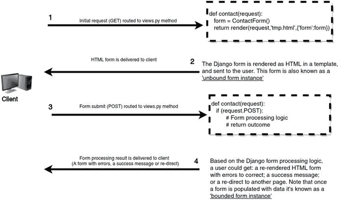
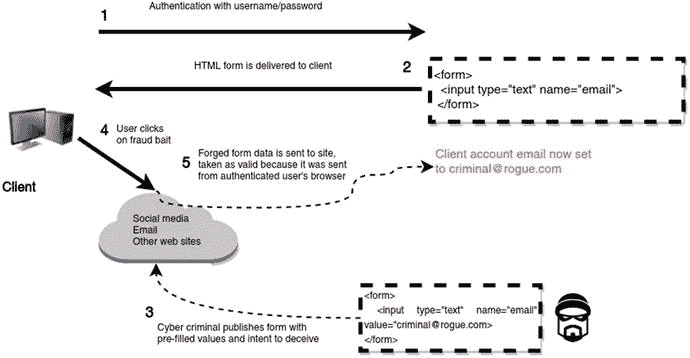
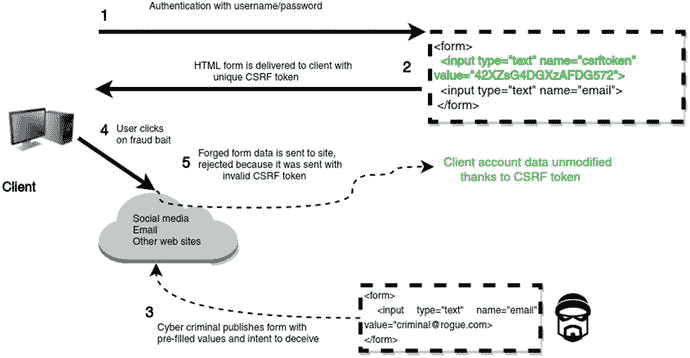

# 6.Django 表单

表单是用户在 web 应用程序中输入或编辑数据的标准方式。在最底层，表单由具有特殊含义的 HTML 标签组成。虽然您可以直接向 Django 或 Jinja 模板添加 HTML 表单标记，但是您确实希望避免这种情况，并使用 Django 的内置表单支持来简化表单处理。

在这一章中，你将学习如何构建 Django 表单以及表单所经历的工作流程。您还将了解 Django 表单支持的各种字段类型和小部件，如何验证表单数据并管理其错误，以及如何在模板中布置表单及其错误。

一旦您对 Django 表单背后的基础有了牢固的理解，您将学习如何创建定制的表单字段和窗口小部件。最后，您将学习更复杂的 Django 表单处理技术，例如部分表单处理、使用 AJAX 的表单处理、如何处理通过 Django 表单发送的文件，以及如何使用 Django 表单集处理同一页面上的多个表单。

## Django 表单结构和工作流程

Django 有一个特殊的表单包，它提供了一种处理表单的综合方法。这个包的特性包括在单一位置定义表单功能的能力、数据验证、与 Django 模型的紧密集成等等。让我们先来看看清单 [6-1](#Par5) 中的一个独立 Django 表单类，它用于支持一个联系人表单。

```py
# forms.py in app named 'contact'
from django import forms

class ContactForm(forms.Form):
      name = forms.CharField(required=False)
      email = forms.EmailField(label='Your email')
      comment = forms.CharField(widget=forms.Textarea)

Listing 6-1.Django form class definition

```

Note

Django 并不希望表单出现在特定的位置。您同样可以将 Django 表单类放在应用程序中它们自己的文件中(例如 forms.py)，或者放在其他应用程序文件中(例如 models.py、views.py)。您可以稍后将 Django 表单类导入到需要它们的地方，就像 Django 视图或 Python 包一样。

清单 [6-1](#Par5) 中要注意的第一个重要方面是 Django 表单定义是`forms.Form`类的子类，所以它自动拥有这个父类的所有基本功能。接下来，您可以看到 form 类有三个属性，两个类型为`forms.CharField`，一个类型为`forms.EmailField`。这些表单域定义将输入限制为某些特征。

例如，`forms.CharField`表示输入应该是一组字符，而`forms.EmailField`表示输入应该是电子邮件。此外，你可以看到每个表单字段都包括属性(如`required`)来进一步限制输入的类型。目前，关于 Django 表单字段类型，这已经足够详细了；，关于 Django 表单字段类型的下一节将更详细地讨论这个主题。

接下来，让我们将清单 [6-1](#Par5) 中的 Django 表单集成到 Django 视图方法中，这样就可以在 Django 模板中传递和呈现它。清单 [6-2](#Par10) 展示了这个视图方法的初始迭代。

```py
# views.py in app named 'contact'
from django.shortcuts import render
from .forms import ContactForm

def contact(request):
    form = ContactForm()
    return render(request,'about/contact.html',{'form':form})

Listing 6-2.Django view method that uses a Django form

```

清单 [6-2](#Par10) 中的视图方法首先实例化`ContactForm`表单类，并将其分配给`form`引用。然后这个`form`引用作为一个参数被传递到`about/contact.html`模板中。

接下来，在 Django 模板中，您可以将 Django 表单作为常规变量输出。清单 [6-3](#Par13) 展示了使用标准模板语法`{{form.as_table}}`时 Django 表单是如何呈现的。

```py
<tr><th><label for="id_name">Name:</label></th><td><input id="id_name" name="name" type="text" /></td></tr>
<tr><th><label for="id_email">Your email:</label></th><td><input id="id_email" required name="email" type="email" /></td></tr>
<tr><th><label for="id_comment">Comment:</label></th><td><textarea cols="40" id="id_comment" required name="comment" rows="10">
</textarea></td></tr>
Listing 6-3.Django form instance rendered in template as HTML

```

在清单 [6-3](#Par13) 中，您可以看到 Django 表单是如何被翻译成 HTML 标签的！注意 Django 表单如何为每个表单字段生成适当的 HTML `<input>`标签(例如，`forms.EmailField(label='Your email')`创建指定的`<label>`和一个 HTML 5 `type="email"`来执行电子邮件的客户端验证)。此外，请注意`name`字段缺少 HTML 5 `required`属性，这是因为清单 [6-1](#Par5) 中的表单字段使用了`required=False`语句。

如果仔细观察清单 [6-3](#Par13) ，Django 表单实例的 HTML 输出只是内部 HTML 表格标签(即`<tr>`、`<th>`、`<td>`)。输出缺少一个 HTML `<table>`包装器标签和支持 HTML 表单标签(即，`<form>`标签和`action`属性，用于指示将表单发送到哪里，以及一个`submit`按钮)。这意味着您需要将缺少的 HTML 表单标签添加到模板中来创建一个工作的 web 表单——这个过程将在清单 [6-4](#Par21) 中简要描述。

此外，如果您不想像清单 [6-3](#Par13) 那样输出被 HTML 表格元素包围的整个表单域，有许多其他的语法变体可以输出精细的表单域并去掉 HTML 标签。在这种情况下，模板中的`{{form.as_table}}`引用是用来简化事情的，但是本章的下一节“在模板中设置 Django 表单的布局”将详细阐述在模板中输出 Django 表单的不同语法变化。

接下来，让我们看一下图 [6-1](#Fig1) ，它显示了 Django 表单的工作流程，以更好地说明 Django 表单是如何从头到尾工作的。



图 6-1。

Django forms workflow

图 [6-1](#Fig1) 中工作流程的前两步是我到目前为止所描述的。它包括用户点击一个 URL，该 URL 由一个 view 方法处理，该方法根据 Django 表单类定义返回一个空表单。清单 [6-3](#Par13) 显示了 Django 表单的原始 HTML 输出，但是正如我已经提到的，该表单缺少一些元素以成为一个功能性的 web 表单；接下来，我将描述获得一个功能性 web 表单需要添加的元素。

### Django 表单的功能性 Web 表单语法

到目前为止，您已经了解了如何将 Django 表单类定义快速转换成 HTML 表单。但是这种自动 HTML 生成只是使用 Django 表单类定义的好处的一部分；您还可以更快地验证表单值并向最终用户显示错误。

要执行最后这些操作，首先需要有一个功能性的 web 表单。清单 [6-4](#Par21) 展示了从 Django 表单创建功能性 web 表单的模板语法。

```py
<form method="POST">
  

<table>
{{form.as_table}}
</table>
<input type="submit" value="Submit form">
</form>

Listing 6-4.Django form template declaration for functional web form

```

关于清单 [6-4](#Par21) 要注意的第一件事是表单被包装在 HTML `<form>`标签中，这是所有 web 表单的标准。Django 强迫您显式设置`<form>`标签的原因是因为它的属性决定了 web 表单的大部分行为，并且会根据表单的用途而变化。

在清单 [6-4](#Par21) 中，`method`属性告诉 web 浏览器，当表单被提交时，它将数据发送到服务器。POST 方法值是处理用户数据的 web 表单中的标准做法——另一个方法选项值是 GET，但它不是传输用户提供的数据的典型选择。POST 方法的使用应该很快就会变得更加清晰，但是要了解更多关于表单`method`属性的背景知识，您可以参考许多关于 HTTP 请求方法的互联网参考资料。[T5 1T7】](#Fn1)

另一个重要的`<form>`属性——在清单 [6-4](#Par21) 中实际上是没有的——是`action`,它告诉 web 浏览器将表单提交到哪里(即哪个 URL 负责处理表单)。在这种情况下，因为清单 [6-4](#Par21) 没有`action`属性，浏览器的行为是将数据发送到当前所在的同一个 URL，这意味着如果浏览器从`/contact/` URL 获得表单，它会将数据发送到同一个`/contact/` URL。如果您想将表单发布到一个单独的 URL，那么您可以将 action 属性(例如，`action="/urltoprocessform/"`)添加到`<form>`标签中。

请记住，因为同一个 URL 通过 GET 请求交付初始表单，还必须通过 POST 请求处理表单数据，所以 URL 的 backing view 方法必须设计为处理这两种情况。在下一节中，我将描述清单 [6-2](#Par10) 的修改版本——它只处理 GET 请求情况——也处理 POST 情况。

清单 [6-4](#Par21) 中的``语句是一个 Django 标签。``是一个特殊的标记，用于通过 POST 提交 web 表单并由 Django 处理的情况。csrf 首字母的意思是跨站点请求伪造，这是 Django 实施的默认安全机制。虽然可以禁用 CSRF 而不在表单中包含`` Django 标签，但我不建议这样做，并建议您继续将`` Django 标签添加到 POST 的所有表单中，因为 CSRF 是一种保护措施，并且主要在幕后工作。第一部分的最后一小节更详细地描述了 CSRF 背后的推理以及它在 Django 是如何运作的。

清单 [6-4](#Par21) 中的下一个是包装在`<table>`标签中的`{{form.as_table}}`片段，它表示 Django 表单实例并输出清单 [6-3](#Par13) 中所示的 HTML 输出。最后，还有`<input type="submit">`标记，它生成表单的提交按钮——当用户点击时提交表单——和结束的`</form>`标记。

### Django 查看流程表单的方法(后期处理)

一旦在 Django 中有了一个功能性的 web 表单，就有必要创建一个视图方法来处理它。在上一节中，我提到了同一个 URL(通过扩展，view 方法)如何处理空白 HTML 表单的生成，以及带有数据的 HTML 表单的处理。清单 [6-5](#Par30) 展示了清单 [6-2](#Par10) 中视图方法的一个修改版本，它就是这样做的。

```py
from django.shortcuts import render
from django.http import HttpResponseRedirect
from .forms import ContactForm

def contact(request):
    if request.method == 'POST':
        # POST, generate form with data from the request
        form = ContactForm(request.POST)
        # check if it's valid:
        if form.is_valid():
            # process data, insert into DB, generate email,etc
            # redirect to a new URL:
            return HttpResponseRedirect('/about/contact/thankyou')
    else:
        # GET, generate blank form
        form = ContactForm()
    return render(request,'about/contact.html',{'form':form})

Listing 6-5.Django view method that sends and processes Django form

```

清单 [6-5](#Par30) 的视图方法中最重要的构造是检查`request`方法类型的 if/else 条件。如果请求方法类型是 POST(即数据提交或图 [6-1](#Fig1) 中的步骤 3)，则处理表单的数据，但如果`request`方法类型是其他类型(即初始请求或图 [6-1](#Fig1) 中的步骤 1)，则生成一个空表单，产生与清单 [6-2](#Par10) 相同的行为。注意清单 [6-5](#Par30) 中的最后一行是一个`return`语句，该语句分配表单实例——无论是空的(也称为未绑定的)还是填充的(也称为绑定的)——并将其返回给模板进行呈现。

现在让我们仔细看看清单 [6-5](#Par30) 中的 POST 逻辑。如果`request`方法类型是 POST，这意味着有传入的用户数据，所以我们用`request.POST`引用访问传入的数据，并用它初始化 Django 表单。但是请注意，没有必要访问单个表单字段或进行逐段赋值——尽管如果您想的话，您可以这样做，这一过程将在本章后面的章节中介绍——使用`request.POST`作为 Django 表单类的参数就足以用用户数据填充 Django 表单实例；就这么简单！值得一提的是，以这种方式(即使用用户提供的数据)创建的 Django 表单实例被称为绑定表单实例。

此时，我们仍然不知道用户提供的关于 Django 表单的字段定义的数据是否有效(例如，值是文本还是有效的电子邮件)。要验证表单的数据，必须在绑定的表单实例上使用`is_valid()` helper 方法。如果`form.is_valid()`为`True`，则处理数据并采取后续行动；在清单 [6-5](#Par30) 中，这个额外的动作包括将控制重定向到`/about/contact/thankyou` URL。如果`form.is_valid()`是`False`，这意味着表单数据有错误，在这之后，控制落到最后一个`return`语句，该语句现在传递一个绑定的表单实例来呈现模板。在最后一种情况下，通过使用绑定表单实例，用户得到一个填充了初始数据提交和错误的呈现表单，这样他就能够纠正数据，而无需从头开始重新引入值。

我故意不提关于`is_valid()` helper 方法或错误消息显示的更多细节，因为 Django 表单处理可能会有点复杂。下一节“Django 表单处理:初始化、字段访问、验证和错误处理”涵盖了您需要了解的关于 Django 表单处理的所有内容，因此不会影响到本介绍性章节。

### CSRF:这是什么？它是如何与姜戈一起工作的？

CSRF 或跨站请求伪造是网络犯罪分子使用的一种技术，目的是迫使用户在 web 应用程序上执行不想要的操作。当用户与 web 表单交互时，他们会执行各种状态更改任务，从下订单(例如，产品、汇款)到更改数据(例如，姓名、电子邮件、地址)。大多数用户在与 web 表单交互时会有一种增强的安全感，因为他们看到了一个 HTTPS/SSL 安全符号，或者他们在与 web 表单交互之前使用了用户名/密码，所有这些都会让人觉得网络罪犯无法窃听、猜测或干扰他们的行为。

CSRF 攻击在很大程度上依赖于社交工程和 web 应用程序松散的应用程序安全性，因此攻击媒介是开放的，与其他安全措施无关(例如，HTTPS/SSL、强密码)。图 [6-2](#Fig2) 展示了一个 web 应用程序的 CSRF 漏洞场景。



图 6-2。

Web application with no CSRF protection

在用户“X”与网络应用“A”交互之后(例如，下订单、更新他的电子邮件)，他简单地导航离开并转到其他站点。像大多数 web 应用程序一样，web 应用程序“A”将有效的用户会话保持几个小时或几天，以防用户回来决定做其他事情而不必再次登录。同时，网络罪犯也使用了站点“A ”,并且确切地知道其所有网络表单在哪里以及如何工作(例如，URL、诸如电子邮件、信用卡之类的输入参数)。

接下来，网络犯罪分子创建链接或页面，模仿在 web 应用程序“a”上提交 web 表单。例如，这可能是一个更改用户电子邮件地址以控制帐户或从用户帐户转移资金以窃取资金的表单。然后，网络罪犯通过电子邮件、社交媒体或其他带有诱人或可怕标题的网站，在互联网上植入这些链接或页面:“从网站‘A’获得 100 美元优惠券”、“紧急:由于安全风险，请更改您在网站‘A’的密码”。实际上，这些链接或页面并不像它们宣传的那样，而是在一次点击中模仿来自站点“A”的 web 表单提交(例如，更改用户的电子邮件或转移资金)。

现在让我们把注意力转向几小时或几天前访问过站点 A 的不知情用户 X。他瞥了一眼这些最后的广告，心想:“哇，我不能错过这个机会。”考虑到点击会造成什么危害，他点击了虚假广告，然后用户被发送到一个合法网站的“A”页面，或者点击“看起来”什么也没做。用户“X”对此毫不在意，继续执行其他任务。如果站点“A”没有带 CSRF 保护的 web 窗体，那么用户“X”只是无意中——在一次单击中——在站点“A”上执行了一个他没有意识到的操作。

如您所见，为了实施 CSRF 攻击，用户只需在给定的网站上进行一次活动会话，并且网络犯罪分子足够狡猾，可以诱骗用户点击在所述网站上执行操作的链接或页面。因此这个术语的名字是:“跨站点”，因为请求不是来自原始站点，而“请求伪造”是因为这是一个网络罪犯伪造的请求。

为了防止 web form CSRF 攻击，web 应用程序信任经过身份验证的用户是不够的，因为正如我刚才描述的，经过身份验证的用户可能无意中触发了他们没有意识到的操作。Web 表单必须配备一个惟一的标识符——通常称为 CSRF 令牌——它对用户来说是惟一的，并且有一个过期时间，类似于会话标识符。通过这种方式，如果一个经过身份验证的用户向一个站点发出请求，只有与他的 CSRF 令牌相匹配的请求才被认为是有效的，所有其他请求都被丢弃，如图 [6-3](#Fig3) 所示。



图 6-3。

Web application with CSRF protection

如图 [6-3](#Fig3) 所示，在 web 表单中包含 CSRF 令牌使得伪造用户请求变得非常困难。

在 Django 中，在 web 表单中生成一个 CSRF 令牌，该令牌带有一个以`<input type="hidden" name="csrfmiddlewaretoken" value="32_character_string">`形式生成 HTML 标签的``标签，其中 32 个字符的字符串值因用户而异。以这种方式，如果 Django 应用程序发出 POST 请求——就像 web 表单发出的请求一样——它只接受 CSRF 令牌存在且对给定用户有效的请求；否则将产生“403 禁止”页面错误。

请注意，CSRF 在所有 Django 应用程序上是默认启用的，这要归功于其开箱即用的中间件设置，包括负责实施 CSRF 功能的`django.middleware.csrf.CsrfViewMiddleware`类。如果您希望完全禁用 Django 应用程序中的 CSRF 支持，您可以从`settings.py`中的`MIDDLEWARE`变量中删除`django.middleware.csrf.CsrfViewMiddleware`类。

如果希望在某些 web 表单上启用或禁用 CSRF，可以有选择地在处理 web 表单 POST 请求的视图方法上使用`@csrf_exempt()`和`@csrf_protect`装饰器。

要在所有 web 表单上启用 CSRF，并在某些 web 表单上禁用 CSRF 行为，请在`MIDDLEWARE`中保留`django.middleware.csrf.CsrfViewMiddleware`类，并使用`@csrf_exempt()`装饰器将不需要的视图方法装饰为 CSRF 验证，如清单 [6-6](#Par47) 所示。

```py
from django.views.decorators.csrf import csrf_exempt

@csrf_exempt
def contact(request):
    # Any POST-processing inside view method
    # ignores if there is or isn't a CSRF token

Listing 6-6.Django view method decorated with @csrf_exempt() to bypass CSRF enforcement

```

要在所有 web 表单上禁用 CSRF，并在某些 web 表单上启用 CSRF 行为，请从`MIDDLEWARE`中移除`django.middleware.csrf.CsrfViewMiddleware`类，并用`@csrf_protect()`装饰器装饰您想要 CSRF 验证的视图方法，如清单 [6-7](#Par49) 所示。

```py
from django.views.decorators.csrf import csrf_protect

@csrf_protect
def contact(request):
    # Any POST processing inside view method
    # checks for the presence of a CSRF token
    # even when CsrfViewMiddleware is removed

Listing 6-7.Django view method decorated with @csrf_protect() to enforce CSRF when CSRF is disabled at the project level

```

## Django 表单处理:初始化、字段访问、验证和错误处理

因为 Django 表单处理可以有很多变化，所以我将从上一节中解释的相同的表单和视图方法开始讨论，现在合并到清单 [6-8](#Par51) 中。

```py
from django import forms
from django.shortcuts import render

class ContactForm(forms.Form):
      name = forms.CharField(required=False)
      email = forms.EmailField(label='Your email')
      comment = forms.CharField(widget=forms.Textarea)

def contact(request):
    if request.method == 'POST':
        # POST, generate form with data from the request
        form = ContactForm(request.POST)
        # Reference is now a bound instance with user data sent in POST
        # process data, insert into DB, generate email, redirect to a new URL,etc
    else:
        # GET, generate blank form
        form = ContactForm()
        # Reference is now an unbound (empty) form
    # Reference form instance (bound/unbound) is sent to template for rendering
    return render(request,'about/contact.html',{'form':form})

Listing 6-8.Django form class with backing processing view method

```

### 初始化表单:字段和表单的 Initial、__init__ 方法、label_suffix、auto_id、field_order 和 use_required_attribute

当用户请求由 Django 表单支持的页面时，他们会收到一个空表单(也称为未绑定表单)，由清单 [6-8](#Par51) 中的 GET 部分和`ContactForm()`实例表示。虽然从用户数据的角度来看，表单总是空的，但是表单可以包含来自的数据，作为其初始化序列的一部分(例如，带有用户电子邮件或姓名的预填充表单)。

要执行这种 Django 表单初始化，您有三种选择。第一种技术是通过 view 方法中声明的表单实例上的`initial`参数，用值字典初始化表单。清单 [6-9](#Par54) 展示了这种技术。

```py
def contact(request):
        ....
        ....
    else:
        # GET, generate blank form
        form = ContactForm(initial={'email':'johndoe@coffeehouse.com','name':'John Doe'})
        # Form is now initialized for first presentation to display these values
    # Reference form instance (bound/unbound) is sent to template for rendering
    return render(request,'about/contact.html',{'form':form})
Listing 6-9.Django form instance with initial argument declared in view method

```

`ContactForm()`现在使用`initial={'email':'johndoe@coffeehouse.com','name':'John Doe'}`生成一个预填充的表单实例，其中包含电子邮件和姓名字段的值，这样最终用户就不必麻烦地自己从头开始键入这些值。

清单 [6-9](#Par54) 中的技术是针对一次性的或者特定于实例的初始化值。如果你想不断地为一个给定的表单域提供相同的值，一个更合适的技术是直接在表单域上使用相同的`initial`参数，如清单 [6-10](#Par57) 所示。

```py
from django import forms

class ContactForm(forms.Form):
      name = forms.CharField(required=False,initial='Please provide your name')
      email = forms.EmailField(label='Your email', initial='We need your email')
      comment = forms.CharField(widget=forms.Textarea)

def contact(request):
        ....
        ....
    else:
        # GET, generate blank form
        form = ContactForm()
        # Form is now initialized for first presentation and is filled with initial values in form definition
    # Reference form instance (bound/unbound) is sent to template for rendering
    return render(request,'about/contact.html',{'form':form})

Listing 6-10.Django form fields with initial argument

```

请注意清单 [6-10](#Par57) 中的表单字段是如何配备了`initial`参数的。值得一提的是，如果在表单实例和表单字段上都使用了`initial`参数，则表单实例值优先于任何表单字段(例如，如果将清单 [6-9](#Par54) 和清单 [6-10](#Par57) 中的语句组合在一起，表单将总是用清单 [6-9](#Par54) 中的`email='johndoe@coffeehouse.com' and name='John Doe'`预先填充)。

在像清单 [6-10](#Par57) 这样的表单字段中使用`initial`参数的一个缺点是，值不能在运行时动态改变(也就是说，你不能像清单 [6-9](#Par54) 那样根据谁调用表单来个性化`initial`值)。为了解决这个问题并为最复杂的表单初始化场景提供最大的灵活性，第三种技术使用了清单 [6-11](#Par60) 中所示的表单类的`__init__`方法。

```py
from django import forms

class ContactForm(forms.Form):
      name = forms.CharField(required=False)
      email = forms.EmailField(label='Your email')
      comment = forms.CharField(widget=forms.Textarea)

      def __init__(self, *args, **kwargs):
            # Get 'initial' argument if any
            initial_arguments = kwargs.get('initial', None)
            updated_initial = {}
            if initial_arguments:
                  # We have initial arguments, fetch 'user' placeholder variable if any
                  user = initial_arguments.get('user',None)
                  # Now update the form's initial values if user
                  if user:
                        updated_initial['name'] = getattr(user, 'first_name', None)
                        updated_initial['email'] = getattr(user, 'email', None)
            # You can also initialize form fields with hardcoded values
            # or perform complex DB logic here to then perform initialization
            updated_initial['comment'] = 'Please provide a comment'
            # Finally update the kwargs initial reference
            kwargs.update(initial=updated_initial)
            super(ContactForm, self).__init__(*args, **kwargs)

def contact(request):
        ....
        ....
    else:
        # GET, generate blank form
        form = ContactForm(initial={'user':request.user,'otherstuff':'otherstuff'})
        # Form is now initialized via the form's __init__ method
    # Reference form instance (bound/unbound) is sent to template for rendering
    return render(request,'about/contact.html',{'form':form})

Listing 6-11.Django form initialized with __init__ method

```

清单 [6-11](#Par60) 中第一个重要的方面是如何在视图方法中初始化表单；注意，它使用了相同的`initial`参数，但是字典值现在是`{'user':request.user,'otherstuff':'otherstuff'}`。这些值看起来奇怪吗？该表单甚至没有名为`user`或`otherstuff`的字段，这是怎么回事呢？

这些最后的值完全有效，在其他情况下会被忽略，因为 Django 表单确实没有这些名称的字段，但是因为我们将在`__init__`方法中操作表单初始化过程的内部，我们可以访问这些占位符值用于间接初始化目的。更重要的是，使用这些占位符值说明了如何使用上下文数据或不相关的表单数据来初始化 Django 表单字段。

接下来，让我们将注意力转向 Django 表单的`__init__`方法，当您创建一个表单实例时会调用该方法。`__init__`方法的参数`*args`、`**kwargs`是标准的 Python 语法——如果您从未见过最后一种语法，请查看 Python 基础的附录:方法:默认、可选、*参数& **kwargs 参数。

`__init__`中的第一步是检查初始值，并创建一个引用来保存新值以初始化表单。如果有一个`initial`值，检查一个`user`值，将这些值用于表单的实际`name`和`email`字段。接下来，不考虑任何传入的值，对表单的`comment`字段进行直接赋值。

最后，用一组反映表单实际字段的新值更新表单的`initial`引用，导致使用表单上下文之外的数据(例如，请求数据、数据库查询等)初始化表单。).作为`__init__`方法的最后一步，调用`super()`方法，这样基类/父类初始化过程就开始了。

Always Use the Initial Argument or __Init__ Method to Populate Forms with Initialization Data and Keep Them Unbound.

需要注意的是，前面所有的初始化技术都保持表单未绑定，这个术语用于描述没有填充用户数据的表单实例。术语“绑定”是为用用户数据填充表单的字段值而保留的。当您进入下一节中描述的 Django 表单的验证阶段时，绑定和未绑定之间的细微差别非常重要。

这也意味着语法 contact form(initial = { ' email ':' John Doe @ coffee house . com '，' name':'John Doe'})不等同于 contact form({ ' email ':' John Doe @ coffee house . com '，' name':'John Doe'})。第一种变体使用初始参数创建一个未绑定表单实例，而第二种变体通过直接传递值而不使用任何参数来创建一个绑定表单实例。

除了初始化 Django 表单上加载的第一组数据之外，Django 表单还有另外四个初始化选项，它们会影响模板中表单的布局:`label_suffix`、`auto_id`、`field_order`和`use_required_attribute`。

当您在模板中为 Django 表单生成输出时——这个主题将在本章后面的“在模板中设置 Django 表单的布局”中详细描述——表单字段通常伴随着所谓的字段标签，这是对人类友好的描述符的另一个名称。例如，如果您有名为`name`和`email`的字段，它们的默认标签分别是`Your name`和`Your email`。为了将字段标签从字段的 HTML 标记中分离出来(例如，`<input type="text">`)，Django 定义了一个标签后缀(默认为`: (`冒号符号)来产生带有模式`<field_label>:<input type="<field_type>">`的输出。通过`label_suffix`你可以定义一个自定义的标签后缀符号来分隔每个表单域和它的标签。因此，例如，`ContactForm(label_suffix='...')`语法输出由`...`分隔的每个表单字段标签(例如，`Your email...<input type="text">`)。

Tip

单个表单域也可以使用 label_suffix 属性；参见 Django 表单字段类型部分。如果在表单域和表单初始化中都声明了 label_suffix，则前者优先。

Django 表单的另一个初始化选项是`auto_id`，它为每个表单字段自动生成一个`id`和`label`。默认情况下，Django 表单总是被设置为`auto_id=True`，所以当输出带有`form.as_table()`的表单时，您总是会得到自动生成的 HTML ids 和标签，如清单 [6-12](#Par72) 的第一部分所示。

```py
<!-- Option 1, default auto_id=True -->
<tr><th><label for="id_name">Name:</label></th><td><input id="id_name" name="name" type="text" /></td></tr>
<tr><th><label for="id_email">Your email:</label></th><td><input id="id_email" name="email" type="email" /></td></tr>
<tr><th><label for="id_comment">Comment:</label></th><td><textarea cols="40" id="id_comment" name="comment" rows="10">
</textarea></td></tr>

<!-- Option 2 auto_id=False -->
<tr><th>Name:</th><td><input name="name" type="text" /></td></tr>
<tr><th>Your email:</th><td><input name="email" type="email" /></td></tr>
<tr><th>Comment:</th><td><textarea cols="40" name="comment" rows="10">\r\n</textarea></td></tr>

Listing 6-12.Django form with automatic ids

(default auto_id=True option) and no automatic ids auto_id=False option

```

注意清单 [6-12](#Par72) 顶部输出中的`field`标签是如何围绕`<label for="id_field_name"> <label>`的，并且字段 HTML 标签包含了`id="id_field_name"`属性。在大多数情况下，这是一个理想的输出，因为它允许容易地引用字段来附加 JavaScript 事件或 CSS 类。然而，在其他情况下`auto_id=True`会产生非常冗长的输出和包含冲突的 HTML 标签(例如，如果在同一个页面上有两个相同类型的表单实例，就会有两个相同的 id)。

要关闭 id 和标签的自动生成，您可以用`auto_id=False`选项初始化一个表单。例如，`ContactForm(auto_id=False)`语法生成清单 [6-12](#Par72) 的后半部分中的输出。

另一个影响表单布局的未绑定表单实例的初始化选项是`field_order`选项。默认情况下，表单字段按照声明的顺序输出，所以清单 [6-10](#Par57) 中的表单定义遵循输出顺序:`name`、`email`、`comment`。您可以通过使用`field_order`选项来覆盖这个默认的字段输出，该选项接受一个带有期望输出顺序的字段名列表。`field_order`选项可以声明为初始化过程的一部分，也可以包含在内，就像它是一个表单字段一样。

例如，`ContactForm(field_order=['email','comment','name'])`语法确保首先输出`email`字段，然后是`comment`和`name`。值得一提的是，`field_order`选项可以接受一个不完整的字段列表，比如`ContactForm(field_order=['email']),`输出`email`字段，然后是剩余的表单字段，按照它们声明的顺序，在本例中是`name`，然后是`comment`。如果您经常设置`field_order`来初始化表单的字段顺序，一个更快的解决方案是设置默认的`field_order`作为表单本身的一部分:

```py
class ContactForm(forms.Form):
      name = forms.CharField(required=False)
      email = forms.EmailField(label='Your email')
      comment = forms.CharField(widget=forms.Textarea)
      field_order = ['email','comment','name'] # Sets order email,comment,name

```

如果将`field_order`声明为表单本身的一部分，在初始化时，初始化`field_order`优先。下一节“在模板中设置 Django 表单的布局”包含了更多关于在模板中实际使用`field_order`的细节。

最后，`use_required_attribute`选项允许您设置 HTML 5 `required`属性的总体用途。默认情况下`use_required_attribute=True`，这意味着所有必需的表单域都用 HTML 5 `required`属性输出，确保浏览器总是提供这些表单域。通过用`use_required_attribute=False`初始化表单，可以禁用这个 HTML 5 客户端验证`required`属性。请注意，设置`use_required_attribute=False`不会影响 Django 服务器端对表单字段的验证(例如，如果表单字段是必需的，Django 服务器端验证仍然会捕获未提供的字段，而不管`use_required_attribute`选项如何)。

### 访问表单值:请求。发布和清理 _ 数据

一旦用户填写了 Django 表单，该表单将被发送回服务器进行处理，并对用户数据执行一个操作(例如，创建订单、发送电子邮件、将数据保存到数据库)——这一步在清单 [6-8](#Par51) 的 POST 部分中有所描述。

Django 表单处理的一个主要优点是可以使用`request.POST`变量创建绑定表单实例。尽管`request.POST`变量是用用户数据填充 Django 表单的初始访问点，但是除了初始化表单实例之外，不应该使用这些数据，因为`request.POST`中的数据对于直接访问来说太原始了。

例如，在`request.POST`中，你仍然不知道用户提供的数据是否有效。此外，`request.POST`中的数据仍然被视为字符串，因此如果您的 Django 表单碰巧有一个`IntegerField()`或`DateField()`，它仍然需要手动转换为预期的数据类型(例如，“6”到 6 整数，“2017-01-01”到 2017-01-01 日期时间)，这只是 Django 表单的另一部分处理的不必要的工作。

一旦用`request.POST`变量生成了绑定表单，就可以通过`cleaned_data`字典访问表单的每个字段值。例如，如果绑定表单有一个名为`name`的表单字段，您可以使用语法`form.cleaned_data['name']`来访问用户提供的`name`值。更重要的是，如果表单字段是名为`age`的`IntegerField()`，语法`form.cleaned_data['age']`会产生一个整数值，这种格式化行为也适用于其他非字符串数据类型的表单字段(例如`DateField()`)。

Caution

在对表单调用 is_valid()之前，您不能访问 cleaned_data。

按照设计，除非首先调用`is_valid()`方法，否则不可能访问表单实例的`cleaned_data`字典。如果你试图在调用`is_valid()`之前访问`cleaned_data`，你会得到错误`AttributeError: 'form_reference' object has no attribute 'cleaned_data'`。

如果你考虑一下，这是一个好的实践，毕竟，你为什么要访问未经验证的数据呢？下一节描述了`is_valid()`方法。

### 验证表单值:is_valid()、validators、clean_ <field>()和 clean()</field>

`is_valid()`方法是 Django 表单处理的重要部分之一。一旦用`request.POST`创建了绑定表单，就调用实例上的`is_valid()`方法来确定包含的值是否符合表单的字段定义(例如，`EmailField()`值是否是有效的电子邮件)。尽管`is_valid()`方法返回布尔值`True`或`False`，但它有两个重要的副作用:

调用`is_valid()`还会在表单实例上创建`cleaned_data`字典来保存通过验证规则的表单字段值。

*   调用`is_valid()`还会在表单实例上创建`errors`字典，为每个没有通过验证规则的字段保存表单错误。

清单 [6-13](#Par91) 展示了清单 [6-8](#Par51) 使用`is_valid()`方法的修改版本。

```py
from django.http import HttpResponseRedirect

def contact(request):
    if request.method == 'POST':
        # POST, generate form with data from the request
        form = ContactForm(request.POST)
        # Reference is now a bound instance with user data sent in POST
        # Call is_valid() to validate data and create cleaned_data and errors dict
        if form.is_valid():
           # Form data is valid, you can now access validated values in the cleaned_data dict
           # e.g. form.cleaned_data['email']
           # process data, insert into DB, generate email
           # Redirect to a new URL
           return HttpResponseRedirect('/about/contact/thankyou')
        else:
           pass # Not needed
           # is_valid() method created errors dict, so form reference now contains errors
           # this form reference drops to the last return statement where errors
           # can then be presented accessing form.errors in a template
    else:
        # GET, generate blank form
        form = ContactForm()
        # Reference is now an unbound (empty) form
    # Reference form instance (bound/unbound) is sent to template for rendering
    return render(request,'about/contact.html',{'form':form})

Listing 6-13.Django form is_valid() method

for form processing

```

注意在清单 [6-13](#Par91) 中，在绑定表单实例创建之后，调用了`is_valid()`方法。如果所有的表单字段值都符合表单字段数据类型，我们输入一个条件，在这里可以通过`cleaned_data`字典访问表单值，执行任何必要的业务逻辑，并将控制权交给另一个页面，在清单 [6-13](#Par91) 中是执行重定向。

如果任何表单字段值未能通过规则，那么`is_valid()`返回`False`，并在此过程中创建一个`errors`字典，其中包含未能通过规则的值的详细信息。因为最后自动创建了`errors`，所以在`is_valid()`返回`False`之后，所有需要做的就是返回相同的表单实例，以便向最终用户显示`errors`字典，这样他就可以纠正错误。

但是对于 Django 表单处理来说，与`is_valid()`方法同样重要的是，它的验证只是针对表单字段的数据类型进行的。例如，`is_valid()`可以验证一个值是否为空，一个值是否匹配给定的数字范围，或者一个值是否是有效的日期:本质上是 Django 表单字段类型支持的任何东西。

但是如果您想在`is_valid()`之后执行更复杂的验证呢？比如在认为一个值有效之前对照数据库检查该值，或者对照两个值进行检查(例如，对照提供的城市值检查提供的邮政编码值)。虽然您可以在调用`is_valid()`之后直接添加这些验证检查，但是 Django 提供了三种更有效的方法来执行高级规则，方法是将它们添加到表单字段或表单类定义中。

如果您想要一个可以跨多个 Django 表单域使用的可重用验证机制，最好的选择是通过表单域的`validators`选项分配一个验证器。`validators`表单域选项需要一个方法列表，用于在值不符合预期规则的情况下引发`forms.ValidationError`错误。清单 [6-14](#Par97) 展示了一个 Django 表单，它的一个字段通过`validators`选项使用一个定制的验证器方法。

```py
from django import forms
import re

def validate_comment_word_count(value):
      count = len(value.split())
      if count < 30:
            raise forms.ValidationError(('Please provide at least a 30 word message, %(count)s words is not descriptive enough'), params={'count': count},)

class ContactForm(forms.Form):
      name = forms.CharField(required=False)
      email = forms.EmailField(label='Your email')
      comment = forms.CharField(widget=forms.Textarea,validators=[validate_comment_word_count])

Listing 6-14.Django form field validators option with custom validator method for form processing

```

清单 [6-14](#Par97) 中的第一部分展示了自定义的`validate_command_word_count()`方法，它(初步地)检查`message`是否至少有 30 个单词。如果方法的输入不是至少 30 个单词，Django 的`forms.ValidationError`错误就会被抛出，以表明违反了规则。

在清单 [6-14](#Par97) 的下半部分，您可以看到一个修改过的`ContactForm`，其中`comment`字段使用了`validators=[validate_csv]`选项。这告诉 Django，在运行了`is_valid()`并且所有的表单字段都根据它们的数据类型检查了错误之后，它还应该根据为`comment`字段提供的值运行`validate_comment_word_count`验证器方法。如果注释值不符合这条规则，那么就会产生一个`ValidatioError`错误，这个错误会被添加到表单`errors`字典中——这个字典与上一节中描述的字典相同，用于根据字段值的数据类型检查字段值。

从清单 [6-14](#Par97) 中的例子可以看出，通过`validators`选项，你同样可以在同一个表单或另一个 Django 表单中的任何其他表单字段上重用自定义的`validate_comment_word_count()`方法。此外，您还可以对一个字段应用多个验证器，因为`validators`选项接受一个验证器列表。最后，值得一提的是`django.core.validators`包包含了一系列验证器，你也可以重用 [<sup>2</sup>](#Fn2) ，这些验证器由某些表单域数据类型在后台使用。

除了表单字段`validators`选项，还可以通过`clean_<field>()`和`clean()`方法添加验证表单规则，它们是作为 Django 表单类的一部分创建的——就像前面描述的`__init__()`。就像在表单字段`validators`选项中指定的方法一样，`clean_<field>()`和`clean()`方法在`is_valid()`方法运行时被自动调用。清单 [6-15](#Par103) 展示了两种`clean_<field>()`方法的使用。

```py
from django import forms

class ContactForm(forms.Form):
      name = forms.CharField(required=False)
      email = forms.EmailField(label='Your email')
      comment = forms.CharField(widget=forms.Textarea)

      def clean_name(self):
          # Get the field value from cleaned_data dict
          value = self.cleaned_data['name']
          # Check if the value is all upper case
          if value.isupper():
             # Value is all upper case, raise an error
             raise forms.ValidationError("Please don't use all upper case for your name, use lower case",code='uppercase')
          # Always return value
          return value

      def clean_email(self):
          # Get the field value from cleaned_data dict
          value = self.cleaned_data['email']
          # Check if the value end in @hotmail.com
          if value.endswith('@hotmail.com'):
             # Value ends in @hotmail.com, raise an error
             raise forms.ValidationError("Please don't use a hotmail email, we simply don't like it",code='hotmail')
          # Always return value
          return value

Listing 6-15.Django form field validation with clean_<field>() methods

```

在清单 [6-15](#Par103) 中，有两个`clean_<field>()`方法来为`name`和`email`字段添加验证规则。Django 会自动搜索以`clean_`为前缀的表单方法，并尝试将表单的字段名与剩余的名称进行匹配，以对有问题的字段进行验证。这意味着你可以拥有和表单域一样多的`clean_<field>()`方法。

每个`clean_<field>()`方法内部的逻辑遵循与`validators`方法相似的模式。首先，通过代表表单实例的`self`引用从表单的`cleaned_data`字典中提取一个字段的值。接下来，对字段值运行您想要的任何规则或逻辑，如果您认为该值不符合，您将引发一个`forms.ValidationError`，它将错误添加到表单实例中。最后，这与`validators`方法唯一不同的是，您必须返回字段值，而不管是否引发错误或更改其值。

有时有必要应用一个不一定属于特定领域的规则，在这种情况下，通用的`clean()`方法是优于`clean_<field>()`方法的方法。清单 6-16 展示了`clean()`方法的使用。

```py
from django import forms

class ContactForm(forms.Form):
      name = forms.CharField(required=False)
      email = forms.EmailField(label='Your email')
      comment = forms.CharField(widget=forms.Textarea)

      def clean(self):
          # Call clean() method to ensure base class validation
          super(ContactForm, self).clean()

          # Get the field values from cleaned_data dict
          name = self.cleaned_data.get('name','')
          email = self.cleaned_data.get('email','')

          # Check if the name is part of the email
          if name.lower() not in email:
             # Name is not in email, raise an error
             raise forms.ValidationError("Please provide an email that contains your name, or viceversa")

Listing 6-16.Django form field validation with clean() method

```

在清单 [6-16](#Par107) 中，你可以看到与清单 [6-15](#Par103) 中之前的`clean_<field>()`方法相似的方法。但是因为`clean()`方法是一个类范围的方法，并且你要自己覆盖它，它与`clean_<field>()`方法的不同之处在于，你必须首先显式调用基类/父窗体类的`clean()`方法(即`super(...).clean()`)来确保基类验证被应用。表单字段值提取也是通过`cleaned_data`数据字典完成的，验证逻辑也是如此，并引发`forms.ValidationError`来指示违反规则。最后，`clean()`方法与`clean_<field>()`方法的不同之处在于它不返回值。

从功能上讲，`clean()`方法是不同的，因为它是在`validators`选项和`clean_<field>()`方法中的所有方法之后被调用的，这一行为很重要，因为所有这些方法都依赖于`cleaned_data`字典中的数据。这意味着如果一个`validators`或`clean_<field>()`方法引发了一个`ValidationError`错误，它将不会返回任何值，并且`cleaned_data`字典也不会包含这个字段的值。因此，当运行`clean()`方法时，如果在`validators`或`clean_<field>()`方法中有一个被短路，那么`cleaned_data`字典可能不一定具有所有的表单字段值，这就是为什么在`cleaned_data`字典没有给定字段的情况下，`clean()`方法使用更安全的字典访问语法`cleaned_data.get('<field>','')`来分配默认值。

`clean()`方法、`clean_<field>()`和`validators`方法之间另一个重要的行为差异是它们如何对待`forms.ValidationError`。当一个`forms.ValidationError`在一个`validators`或`clean_<field>()`方法中被引发时，错误被分配给表单的`errors`字典中有问题的`<field>`——这对显示很重要。但是当在`clean()`方法中引发一个`forms.ValidationError`时，错误被分配给一个名为`__all__`的特殊占位符字段——也称为“非字段错误”——它也被放在表单的`errors`字典中。

如果你想将`clean()`方法中的错误分配给特定的表单字段，你可以使用清单 [6-17](#Par107) 中所示的`add_error()`方法。

```py
def clean(self):
    # Call clean() method to ensure base class validation
    super(ContactForm, self).clean()

    # Get the field values from cleaned_data dict
    name = self.cleaned_data.get('name','')

    # Check if the name is part of the email
    if name.lower() not in email:
       # Name is not in email, raise an error
       message = "Please provide an email that contains your name, or viceversa"
       self.add_error('name', message)
       self.add_error('email', forms.ValidationError(message))
       self.add_error(None, message)

Listing 6-17.Django form field error assignment with add_error()

in clean() method

```

注意清单 [6-17](#Par107) 是如何在表单实例上使用`add_error()`方法而不是`raise forms.ValidationError()`语法的。`add_error()`方法接受两个参数:第一个是要分配错误的表单字段名称，第二个可以是错误消息字符串或`ValidationError`类的实例。

清单 [6-17](#Par107) 中的前两个`add_error()`方法分别将错误分配给`name`和`email`字段。带有`None`键的第三个`add_error()`方法将错误分配给`__all__`占位符，使其等同于清单 [6-16](#Par103) 中的`raise forms.ValidationError()`。

### 错误表单值:错误

在调用`is_valid()`方法后，前面章节中描述的表单错误会自动添加到`errors`字典中的表单实例中。包容地说，不像`cleaned_data`字典，不需要调用`is_valid()`方法就可以直接访问`errors`字典。

字典很重要，因为所有的表单错误都在上面。无论错误是因为值不符合表单字段数据类型还是不符合`clean()`方法、`clean_<field>()`方法、`validators`方法或`clean()`方法中的`add_error()`方法中的 raise `forms.ValidationError()`而引发的，所有错误最终都将出现在表单的`errors`字典中。

`errors`字典遵循`{'<field_name>':'<error_message>'}`模式，这使得识别视图方法或模板中的表单错误变得容易。最后一种模式的唯一例外是表单错误不是特定于字段的(例如，在`clean()`方法中创建的那些)，在这种情况下，表单错误被分配给一个名为`__all__`的特殊键，这种错误也称为非字段错误。

虽然您可以像访问任何其他 Python 字典一样访问`errors`字典，但是 Django 提供了表 [6-1](#Tab1) 中描述的一系列方法，使得处理错误更加容易。

表 6-1。

Django form errors methods

<colgroup><col> <col></colgroup> 
| 方法 | 描述 |
| --- | --- |
| 表单.错误 | 允许您访问原始错误字典。 |
| form.errors.as_data() | 输出包含原始 ValidationError 实例的字典。例如，如果 errors 输出{'email':['此字段是必需的']}，则 errors.as_data()输出{'email':[ValidationError(['此字段是必需的'])]}。 |
| form . errors . as _ JSON(escape _ html = False) | 输出包含错误字典内容的 JSON 结构。例如，如果 errors 输出{'email':['此字段是必需的']}，则 errors.as_json()输出{'email':[{'message ':'此字段是必需的'，' code ':'必需的' }]}。请注意，默认情况下，as_json()不会对其输出进行转义，如果您希望对错误进行转义，请使用 escape_html 标志(例如，as_json(escape_html=True))。 |
| form.add_errorfield，message) | 将错误信息与给定的表单域相关联。尽管通常在 clean()方法中使用，但如果需要，也可以在视图方法中使用。请注意，如果未指定 field，则错误消息将成为被视为非字段错误的错误中 __all__ 占位符键的一部分。 |
| form.has_error(字段，代码=无) | 如果给定字段有错误，则返回 True 或 False 值。请注意，默认情况下，如果任何错误类型与某个字段相关联，has_error 将返回 True。要针对特定的错误类型执行评估，可以使用 code 关键字(例如，form.has_error('email '，code='required '))。要检查表单是否有非字段错误，可以使用 NON_FIELD_ERRORS 作为字段值。 |
| form.non_field_errors() | 返回与表单相关联的非表单错误列表(即 __all__ 占位符键)。这些错误通常通过 ValidationError 或 add_error(None，' message ')在 clean() clean 方法中创建。 |

您可能已经注意到，在所有前面的例子中创建的`ValidationError`类实例使用不同的参数，这意味着有多种方法来创建`ValidationError`实例。例如，一些`ValidationError`实例使用一个简单的字符串，但是也可以用一系列`ValidationError`实例创建一个`ValidationError`实例，并指定一个`code`属性来进一步分类错误类型。清单 [6-18](#Par120) 展示了一系列使用这些变体的`ValidationError`类实例。

```py
from django import forms

# Placed inside def clean_email(self):
raise forms.ValidationError("Please don't use a hotmail email, we simply don't like it",code='hotmail')

# Placed inside def clean(self):
raise forms.ValidationError([
     forms.ValidationError("Please provide an email that matches your name, or viceversa",code='custom'),
     forms.ValidationError("Please provide your professional email, %(value)s doesn't look professional ",code='required',params={'value':self.cleaned_data.get('email') })

Listing 6-18.Django form ValidationError

instance creation

```

清单 [6-18](#Par120) 中的`ValidationError`实例变体都是可选的，但是当需要在模板上显示或过滤错误消息时，这个过程将在本章后面的“在模板中设置 Django 表单的布局”一节中详细描述。

## Django 表单字段类型:小部件、选项和验证

由于 Internet 不受控制的特性——它有许多类型的设备、浏览器和用户体验级别——它对 web 表单必须处理的数据类型提出了各种各样的要求，以及如何净化数据以符合 web 表单的原始目的的各种各样的要求。

当您为 Django 应用程序创建 web 表单时，您依赖于由表单字段组成的 Django 表单类。每个 Django 表单字段都很重要，因为它规定了最终构成 web 表单整体行为的一小部分功能。

Django 表单域定义了两种类型的功能，表单域的 HTML 标记和它的服务器端验证工具。例如，Django 表单字段转换成实际的 HTML 表单标记(例如，`<input>`、`<select>`或`<textarea>`标签)、HTML 标记属性(例如，长度、字段是否可以留空，或者字段是否必须禁用)，以及对表单字段的数据轻松执行服务器端验证的必要挂钩。

Django 表单字段出于需要定义了这两种类型的 web 表单功能。尽管随着 HTML5 等技术的发展，浏览器已经取得了巨大的进步，通过 HTML 标记本身(无需 JavaScript)提供了开箱即用的表单字段验证，但浏览器仍然完全控制着最终用户，只要有足够的知识，最终用户就可以绕过表单，将他想要的任何数据输入表单。因此，一旦用户提交了表单域数据，标准的做法是进一步检查它是否符合表单的规则，由于使用了 Django 表单域，这个过程变得非常容易。

表 [6-2](#Tab2) 展示了各种 Django 表单字段，包括它们的类型、它们生成的 HTML、它们的默认小部件以及它们的验证行为。

表 6-2。

Django form field types, generated HTML, default widget, and validation behavior

<colgroup><col> <col> <col> <col> <col></colgroup> 
| 字段类型 | Django 表单字段类型 | HTML 输出 | 默认 Django 小部件 | 验证行为 |
| --- | --- | --- | --- | --- |
| 布尔代数学体系的 | 表格。布尔字段() | <input type="’checkbox’" ...=""> | forms.widgets.CheckboxInput() | 生成 HTML 复选框输入标记以获取布尔值 True 或 False 未选中复选框时返回 False，选中复选框时返回 True。 |
| 布尔代数学体系的 | 表格。NullBooleanField() | <select><option value="“1”" selected="“selected”">未知</option>T3】是 T5】否 T7】</select> | forms . widgets . nullbooleanselect() | 就像 BooleanField 一样工作，但也允许“未知”值；选择未知(1)值时返回 None，选择是(2)值时返回 True，选择否(3)值时返回 False。 |
| 文本 | 表格。夏菲尔德() | <input type="“text”" ...=""> | forms.widgets.TextInput() | 生成 HTML 文本输入标记。 |
| 文本(专业) | 表格。电子邮件字段() | <input type="“email”" ...=""> | forms.widgets.EmailInput() | 生成 HTML 电子邮件输入标记。请注意，HTML5 标记用于客户端电子邮件验证，仅当浏览器支持 HTML5 时才有效。如果浏览器不支持 HTML5，那么它会将这个标记视为常规文本输入。Django 服务器端的表单验证是针对电子邮件进行的，与 HTML5 支持无关。 |
| 文本(专业) | 表格。GenericIPAddressField() | <input type="“text”" ...=""> | forms.widgets.TextInput() | 工作原理与 CharField 类似，但是服务器端 Django 验证(文本)值是否可以转换为 IPv4 或 IPv6 地址(例如，192.46.3.2，2001:0db 8:85a 3:0000:0000:8a2e:0370:7334)。 |
| 文本(专业) | 表格。regex field(regex = ' regular _ expression ') | <input type="“text”" ...=""> | forms.widgets.TextInput() | 就像 CharField 一样工作，但是服务器端 Django 验证(文本)值是否符合 regex 中定义的正则表达式。注意 regex 可以是表示正则表达式的字符串(例如\。以. com$结尾的字符串。com)或来自 Python 的 re 包的编译的 Python 正则表达式(例如，re.compile('\。com$ '))。 |
| 文本(专业) | 表格。斯拉格菲尔德() | <input type="“text”" ...=""> | forms.widgets.TextInput() | 就像 CharField 一样工作，但是服务器端 Django 验证(文本)值可以转换为 slug。在 Django 中,“slug”是一个仅包含小写字母、数字、下划线和连字符的值，通常用于净化 URL 和文件名(例如,“什么是 slug？！“消毒过的绳子”是一根消毒过的绳子。 |
| 文本(专业) | 表格。URLField() | <input type="“url”" ...=""> | forms.widgets.URLInput() | 生成 HTML url 输入标记。请注意，HTML5 标记用于客户端 url 验证，仅当浏览器支持 HTML5 时才起作用。如果浏览器不支持 HTML5，那么它会将该标记视为常规文本输入。Django 服务器端的表单验证是针对 url 进行的，与 HTML5 支持无关。 |
| 文本(专业) | 表格。UUIDField() | <input type="“text”" ...=""> | forms.widgets.TextInput() | 就像 CharField 一样工作，但是服务器端 Django 验证(文本)值是否可转换为 UUID(通用唯一标识符)。 |
| 文本(专业) | 表格。组合字段(fields=[field_type1，field_type1]) | <input type="“text”" ...=""> | forms.widgets.TextInput() | 工作原理与 CharField 类似，但是服务器端 Django 对 Django 表单字段列表强制执行数据传递规则(例如，combo field(fields =[CharField(max _ length = 50)，SlugField()])强制数据为最大长度为 50 个字符的 slug 字段)。 |
| 文本(专业) | 表格。多值字段(字段=[字段类型 1，字段类型 1]) | 因字段列表而异(例如，对于三个 char field:<input type="text" ...=""><input type="text" ...=""><input type="text" ...="">；<input type="text" ...="">为两个夏菲尔德:<input type="text" ...=""> | forms.widgets.TextInput() | 旨在创建由多个预先存在的表单字段组成的自定义表单字段(例如，由三个 CharField()组成的社会保险表单字段)。它需要一个子类实现(例如，SocialSecurityField(MultiValueField):)来包含新字段的基本表单字段和验证逻辑。 |
| 文本(专业)/文件 | 表格。文件路径字段(路径= '目录') | <select><option value="“directory/file_1”">文件 _1</option> <option value="“directory/file_2”">文件 _2</option> <option value="“directory/file_2”">文件 _2</option></select> | forms.widgets.Select() | 从位于服务器端路径目录中的文件生成 HTML 选择列表。注意值由路径+文件名组成，并且只显示文件名。 |
| 文件 | 表格。文件字段() | <input type="“file”" ...=""> | forms . widgets . clearable file input() | 生成 HTML 文件输入标记，以便最终用户能够通过其 web 浏览器选择文件。此外，它还提供了各种实用程序来处理文件的后期处理。 |
| 文件(专用) | 表格。图像字段() | <input type="“file”" ...=""> | forms . widgets . clearable file input() | 生成 HTML 文件输入标记，以便最终用户能够通过其 web 浏览器选择图像文件。工作方式与 FileField 类似，但使用 Pillow 软件包提供了额外的工具来处理图像的后期处理。请注意，此字段会强制您安装枕头(例如，pip 安装枕头)。 |
| 日期/时间 | 表格。日期字段() | <input type="“text”" ...=""> | forms . widgets . file output() | 工作方式与 CharField 类似，但是服务器端 Django 验证(文本)值是否可以转换为 datetime.date、datetime.datetime 或以特定日期格式(例如 2017-12-25、11/25/17)格式化的字符串。 |
| 日期/时间 | 表格。时间字段() | <input type="“text”" ...=""> | forms.widgets.TextInput() | 工作原理与 CharField 类似，但是服务器端 Django 验证(文本)值是否可以转换为 datetime.time 或以特定时间格式(例如 15:40:33，17:44)格式化的字符串。 |
| 日期/时间 | 表格。日期时间字段() | <input type="“text”" ...=""> | forms.widgets.DateTimeInput() | 工作方式与 CharField 类似，但服务器端 Django 验证(文本)值是否可以转换为 datetime.datetime、datetime.date 或以特定日期时间格式格式化的字符串(例如 2017-12-25 14:30:59、11/25/17 14:30)。 |
| 日期/时间 | 表格。DurationField() | <input type="“text”" ...=""> | forms.widgets.TextInput() | 工作原理与 CharField 类似，但是服务器端 Django 验证(文本)值是否可以转换为 timedelta。注意 Django 使用 Django . utils . date parse . parse _ duration()方法作为助手，这意味着字符串必须与格式 DD HH:MM:SS.uuuuuu 匹配(例如，2 1:10:20 表示 2 天 1 小时 10 分 20 秒的时间增量)。 |
| 日期/时间 | 表格。SplitDateTimeField() | <input type="“text”" name="“_0”" ...=""> <input type="“text”" name="“_1”" ...=""> | forms . widgets . splitdatetimewidget | 工作方式类似于 DateTimeField，但会为日期和时间生成两个单独的文本输入，这与 DateTimeField 不同，它需要一个包含日期和时间的字符串。验证方面，Django 强制将日期输入转换为 datetime.date，将时间输入转换为 datetime.time。 |
| 数字 | 表格。IntegerField() | <input type="“number”" ...=""> | forms.widgets.NumberInput() | 生成 HTML 数字输入标记。请注意，此 HTML5 标记用于客户端数字验证，仅当浏览器支持 HTML5 时才起作用。如果浏览器不支持 HTML5，那么它会将该标记视为常规文本输入。Django 服务器端表单验证是对整数进行的，与 HTML5 支持无关。 |
| 数字 | 表格。十进制菲尔德() | <input type="“number”" ...=""> | forms.widgets.NumberInput() | 生成 HTML 数字输入标记。请注意，HTML5 标记用于客户端数字验证，仅当浏览器支持 HTML5 时才起作用。如果浏览器不支持 HTML5，那么它会将该标记视为常规文本输入。Django 服务器端表单验证是针对一个十进制数进行的，与 HTML5 支持无关。 |
| 数字 | 表格。浮动字段() | <input type="“number”" ...=""> | forms.widgets.NumberInput() | 生成 HTML 数字输入标记。请注意，HTML5 标记用于客户端数字验证，仅当浏览器支持 HTML5 时才起作用。如果浏览器不支持 HTML5，那么它会将该标记视为常规文本输入。Django 服务器端表单验证是针对浮点数进行的，与 HTML5 支持无关。 |
| 预定义值 | 表格。choice field(choices = tuple _ of _ tuples) | <select><option value="“tuple1_1”" selected="“selected”">tuple 1 _ 2</option>T3】tuple _ 2 _ 2T5】tuple _ 3 _ 2T7】</select> | forms.widgets.Select() | 从通过选择定义的元组生成 HTML 选择列表(例如，((1，“美国”)、(2，“加拿大”)、(3，“墨西哥”))。注意，对于 ChoiceField，如果没有选择任何值，则传递空字符串“”进行后处理，如果选择了类似“2”的值，则传递文字字符串进行后处理，而不考虑原始数据表示。请参见 TypeChoiceField 或 clean form 方法，为空值和字符串处理重写这些最后的行为。 |
| 预定义值 | 表格。TypeChoiceField(choices = tuple _ of _ tuples，coefit = coefit _ function，empty_value=None) | <select><option value="“tuple1_1”" selected="“selected”">tuple 1 _ 2</option>T3】tuple _ 2 _ 2T5】tuple _ 3 _ 2T7】</select> | forms.widgets.Select() | 其工作方式与 ChoiceField 类似，但通过强制参数和 empty_value 参数提供了额外的后处理功能。例如，使用 TypeChoiceField，您可以使用 empty_value 参数定义不同的默认值(例如，empty_value=None ),并且可以使用 constrate 参数定义强制方法，以便将选定的值从其字符串表示形式转换过来(例如，使用 constrate = int，类似“2”的值会通过内置的 int 函数转换为 2(整数))。 |
| 预定义值 | 表格。MultipleChoiceField(choices = tuple _ of _ tuples) | <select multiple="’multiple’"><option value="“tuple1_1”" selected="“selected”">tuple 1 _ 2</option>T3】tuple _ 2 _ 2T5】tuple _ 3 _ 2T7】</select> | forms.widgets.SelectMultiple() | 从通过选择定义的元组中为多个值生成 HTML 选择列表(例如，((1，“美国”)、(2，“加拿大”)、(3，“墨西哥”))。它的工作方式类似于 ChoiceField，但允许选择多个值，这些值在后期处理中作为列表提供。 |
| 预定义值 | 表格。TypedMultipleChoiceField(choices = tuple _ of _ tuples，coefit = coefit _ function，empty_value=None) | <select multiple="’multiple’"><option value="“tuple1_1”" selected="“selected”">tuple 1 _ 2</option>T3】tuple _ 2 _ 2T5】tuple _ 3 _ 2T7】</select> | forms.widgets.Select() | 其工作方式与 MultipleChoiceField 类似，但通过强制参数和 empty_value 参数提供了额外的后处理功能。例如，使用 TypedMultipleChoiceField，您可以使用 empty_value 参数定义不同的默认值(例如，empty_value=None ),并且可以使用 constrate 参数定义一个强制方法，以便所选值从其字符串表示形式转换而来(例如，使用 constrate = int，像“2”这样的值会通过内置的 int 函数转换为 2(整数))。 |

正如你在表 [6-2](#Tab2) 中看到的，Django 表单域为几乎所有现存的 HTML 表单输入的生成提供了现成的支持，并为各种数据类型提供了必要的服务器端验证。例如，您可以使用`CharField()`表单字段类型来捕获标准文本，或者使用更专业的`EmailField()`表单字段类型来确保捕获的值是有效的电子邮件。正如您可以使用`ChoiceField()`生成一个带有预定义值的表单列表，或者使用`DateField()`强制表单值是一个有效日期。

### 小部件和表单域之间的关系

在表 [6-2](#Tab2) 中，你可以看到除了实际的 Django 表单域语法(例如`forms.CharField()`、`forms.ImageField()`)之外，每个表单域都与一个默认的小部件相关联。Django 小部件在很大程度上没有被注意到，并且经常与表单字段本身的功能混合在一起(例如，如果您想要一个 HTML 文本输入`<input type="text"..>`，您可以使用`forms.CharField()`)。但是，当您需要更改表单域生成的 HTML 或者表单域数据最初的处理方式时，您需要使用小部件。

更令人困惑的是，您在表单字段上指定的许多选项最终都被用作小部件的一部分。例如，表单字段`forms.CharField(max_length=25)`告诉 Django 在处理时将一个值限制为最多 25 个字符，但是这个相同的`max_length`选项被传递给`forms.widgets.TextInput()`小部件以生成 HTML `<input type="text" maxlength="25"...>`，从而通过 HTML `maxlength="25"`属性在浏览器上执行相同的规则。所以在这种情况下，您实际上可以通过一个表单域选项来更改 HTML 输出，甚至不需要了解小部件！

那么，您真的需要使用小部件来改变表单字段产生的 HTML 吗？答案是视情况而定。许多表单域选项被自动传递给幕后的小部件，实际上改变了生成的 HTML，但是不要搞错，它是一个负责生成 HTML 而不是表单域的小部件。如果表单域的选项不能实现期望的 HTML 输出，那么就有必要改变表单域的小部件来实现自定义的 HTML 输出。

在本章接下来的章节中，我将详述 Django 窗口小部件的主题，并描述如何覆盖和定制 Django 表单字段的默认窗口小部件。现在您已经知道了 Django 小部件的存在以及它们与 Django 表单字段的关系，我将继续 Django 表单字段的主题，并解释各种 Django 表单字段选项及其验证行为。

Django ‘Hidden’ Built-in Widgets

表 [6-2](#Tab2) 显示了 Django 中所有内置的表单字段，这可能会误导您认为同一个表也显示了所有 Django 内置的表单小部件。事实并非如此。表 [6-2](#Tab2) 中的 widget 列仅显示分配给所有内置表单域的默认 widget。forms.widgets. package 中还包含一些 Django 内置的小部件:

*   密码输入。-密码字段的小部件(例如，当用户键入文本时显示****)。还支持在验证错误后重新显示字段值。
*   HiddenInput。-隐藏字段的小部件(如<input type="‘hidden’...">)。
*   MultipleHiddenInput。-类似 HiddenInput，但用于多个值(即一个列表)。
*   文本区域。-文本区域字段的小部件(如 <textarea></textarea> )。

无线电选择。-类似于 Select 小部件，但生成一个单选按钮列表(如

*   <input type="radio">

)。

复选框选择多个。-类似于 SelectMultiple 小部件，但生成一个复选框列表(如

*   [ ] 

)。

时间输入。-类似于 DateTimeInput 小部件，但仅用于时间输入(例如，13:54，13:54:59)。

选择日期小工具。- widget 生成三个选择日期的 widget(例如，选择日期的 widget、选择月份的 Widget、选择年份的 Widget)。

SplitHiddenDateTimeWidget。-类似 SplitDateTimeWidget 小部件，但是使用隐藏的日期和时间输入。

文件输入。-类似于 ClearableFileInput 小部件，但是没有复选框输入来清除字段的值。

本章后面的章节描述了表单域的小部件参数以及如何定制 Django 小部件，提供了更多关于如何以及何时使用这些额外的内置小部件的上下文。

### 空值、默认值和预定值:必需值、初始值和选项

默认情况下，所有 Django 表单字段都被标记为 required，这意味着每个字段都必须包含一个值才能通过验证。`required`参数对表 [6-2](#Tab2) 中描述的所有 Django 表单字段都有效，除了在服务器端强制值不为空，HTML 5 `required`属性也被分配给表单字段，因此用户的浏览器也强制验证。

Tip

可以用 use_required_field=False 初始化表单，以放弃使用 HTML 5 required 属性。请参阅上一小节“初始化表单”

如果你想让一个字段值为空- `None`或空字符串`''` -那么一个字段必须被赋予`required=False`参数。

您还可以通过`initial`参数为字段分配默认值。初始参数对表 [6-2](#Tab2) 中描述的所有 Django 表单字段同样有效，并在前面的小节“初始化表单”中有详细描述

如果您不想让用户为字段引入开放式值，您可以通过`choices`参数将字段值限制为一组预先确定的值。如果您想使用`choices`属性，您必须使用一个表单域数据类型，该数据类型被设计用来生成一个 HTML `<select>`列表，如`forms.ChoiceField()`、`forms.MultipleChoiceField`或`forms.FielPathField()`。`choices`参数不能用于像`forms.CharField()`这样为开放式输入设计的数据类型。

### 限制文本值:max_length、min_length、strip 和验证器

接受文本(如`CharField()`、`EmailField()`以及表 [6-2](#Tab2) 中描述的其他文本)的表单字段数据类型可以接受`max_length`和`min_length`参数，以将字段值分别限制为最大和最小字符长度。

`strip`参数用于将 Python 的`strip()`方法应用于字段值——该方法去除了所有尾随和前导空格。`strip`参数只能用于两种 Django 字段数据类型，默认为`strip=True,`的`CharField()`和默认为`strip=False`的`RegexField()`。

要对接受文本值的字段应用更高级的限制规则，请参阅上一小节“验证表单值”，该小节描述了限制字段值的`validators`和其他技术。

### 限制数值:最大值、最小值、最大位数、小数位数和验证器

接受数字如`IntegerField()`、`DecimalField()`和`FloatField()`的表单字段数据类型可以接受`max_value`和`min_value`参数，分别限制字段数值的上限和下限。

此外，`DecimalField()`数据类型接受更精细的数字类型，可以使用`max_digits`参数来限制值中的最大位数，或者使用`decimal_places`参数来指定值中的最大小数位数。

要对接受数字值的字段应用更高级的限制规则，请参阅上一小节“验证表单值”，该小节描述了限制字段值的`validators`和其他技术。

### 错误消息:错误消息

每个 Django 字段数据类型都有内置的错误消息。例如，当一个字段的数据类型是`required`并且用户没有添加任何值时，Django 会将错误消息`This field is required`分配给该字段，作为表单的`errors`字典的一部分。类似地，如果一个字段数据类型使用了`max_length`参数，并且用户提供的值超过了这个阈值，Django 就会创建错误消息`Ensure this value has at most X characters (it has X)`。

如清单 [6-18](#Par120) 中所述，除了错误消息本身，Django 错误消息通常还会给出一个消息错误代码。正是这些消息错误代码用于通过`error_messages`参数分配定制消息。

`error_messages`参数需要一个字典，其中每个键是消息错误代码，其值是自定义错误消息。例如，为了给`required`代码提供一个定制的消息，你可以使用语法`forms.CharField(error_messages={"required":"Please, pretty please provide a comment"})`。类似地，如果您希望一个表单字段违反它的`max_length`值，您可以通过`max_length`代码(例如`error_messages={"max_length":"This value exceeds its max length value"}`)指定一个定制的错误消息。

错误代码通常直接映射到它们违反的规则(例如，如果一个`forms.IntegerField`违反了它的`max_value`，Django 使用`max_value`代码分配一个默认的错误消息，您可以使用这个代码覆盖它)。然而，有二十多个内置错误消息代码(例如`'missing'`、`'contradiction'`)，其中一些并不太明显。例如，`forms.ImageField`可以生成错误消息`'Upload a valid image. The file you uploaded was either not an image or a corrupted image.'`，它使用`'invalid_image'`错误代码，这意味着要覆盖这个默认的错误消息，您需要事先知道错误代码，以将其声明为`error_messages`的一部分。

在大多数情况下，很少需要为一些更深奥的错误代码定制错误消息。但是如果您在为给定字段定制错误消息时遇到了麻烦，因为您无法确定它的错误代码，那么在表单错误字典上进行一点日志调试(例如，`form.errors.as_json()`或表 [6-1](#Tab1) 中的一些其他方法)可以快速地为您找到表单的错误代码，以覆盖带有`error_messages`参数的消息。

### 字段布局值:标签、标签后缀、帮助文本

当你在一个模板中输出一个表单域时，除了基本的 HTML 表单域标记(例如`<input type="text">`)之外，它几乎总是伴随着一个人类友好的描述符来指示一个域是做什么用的(例如`Email: <input type="text">`)。这个对人友好的描述符被称为标签，在 Django 中默认情况下，它被赋予与字段名相同的值。

要定制一个表单域的标签，你可以使用`label`参数。例如，要为名为 email 的字段提供更具描述性的标签，可以使用语法`email = EmailField(label="Please provide your email")`。默认情况下，表单上的所有标签都带有一个`:`符号，它的作用相当于一个后缀。您可以使用单个表单字段或表单实例本身的`label_suffix`参数进一步定制字段标签的输出。

例如，语法`email = EmailField(label_suffix='-->')`覆盖了电子邮件字段中用于`-->`符号的默认后缀标签。

Tip

label_suffix 也可以用来初始化一个表单(例如，`form = ContactForm(label_suffix='-->')`)，这样所有的字段都会收到一个标签后缀，而不是一个字段一个字段地初始化。有关更多细节，请参见前面的“初始化表单”一节。

在某些情况下，向表单域添加更明确的说明会很有帮助；对于这种情况，您可以使用`help_text`参数。根据您使用的模板布局，`help_text`值被添加到 HTML 表单字段标记的右侧。

例如，语法`comment = CharField(help_text="Please be as specific as possible to receive a quick response")`生成紧挨着`comment`输入字段的给定的`html_text`值(例如`Please be as specific as possible to receive a quick response <input type="text">`)。下一节“在模板中设置 Django 表单的布局”将更详细地介绍`help_text`和其他表单布局属性的使用。

## 在模板中设置 Django 表单的布局

当您将 Django 表单(未绑定的或绑定的)传递给模板时，有许多选项可以生成它的布局。您可以使用 Django 的一个预构建的 HTML 助手来快速生成表单的输出，或者粒度化地输出每个字段来创建一个高级的表单布局(例如，响应式设计 [<sup>3</sup>](#Fn3) )。此外，还可以有许多方式来输出表单错误(例如，除了字段本身之外或者在表单的顶部)。接下来，我将描述在模板中输出 Django 表单的各种选项。

清单 [6-19](#Par169) 显示了我将在其余布局部分使用的 Django 表单——这与本章中使用的表单相同。

```py
from django import forms

class ContactForm(forms.Form):
      name = forms.CharField(required=False)
      email = forms.EmailField(label='Your email')
      comment = forms.CharField(widget=forms.Textarea)

Listing 6-19.Django form class definition

```

### 输出表单字段:form.as_table、form.as_p、form.as_ul 和按字段粒度

Django 表单提供了三个助手方法来简化所有表单字段的输出。语法`form.as_table` o 输出一个表单的字段来容纳一个 HTML `<table>`，如清单 [6-20](#Par172) 所示。语法`form.as_p`输出带有 HTML `<p>`标签的表单字段，如清单 [6-21](#Par173) 所示。Where as 语法`form.as_ul`输出一个表单的字段来容纳一个 HTML `<ul>`列表标签，如清单 [6-22](#Par174) 所示。

Caution

如果您使用 form.as_table、form.as_p、form.as_ul，您必须声明开始/结束 HTML 标签、换行

<form>标签、Django 标签和<input type="submit">按钮，如本章开头部分“Django 表单的功能性 web 表单语法”所述。</form>

```py
<tr>
    <th><label for="id_name">Name:</label></th>
    <td><input id="id_name" name="name" type="text" /></td>
</tr>\n
<tr>
    <th><label for="id_email">Your email:</label></th>
    <td><input id="id_email" name="email" type="email" required/></td>
</tr>\n
<tr>
    <th><label for="id_comment">Comment:</label></th>
    <td><textarea cols="40" id="id_comment" name="comment" rows="10" required>\r\n</textarea></td>
</tr>
Listing 6-20.Django form output with form.as_table

```

```py
<p>
    <label for="id_name">Name:</label> <input id="id_name" name="name" type="text" />
</p>\n
<p>
    <label for="id_email">Your email:</label> <input id="id_email" name="email" type="email" required/>
</p>\n
<p>
    <label for="id_comment">Comment:</label> <textarea cols="40" id="id_comment" name="comment" rows="10" required>\r\n</textarea>
</p>'
Listing 6-21.Django form output with form.as_p

```

```py
<li>
    <label for="id_name">Name:</label> <input id="id_name" name="name" type="text" />
</li>\n
<li>
    <label for="id_email">Your email:</label> <input id="id_email" name="email" type="email" required/>
</li>\n
    <li><label for="id_comment">Comment:</label> <textarea cols="40" id="id_comment" name="comment" rows="10" required>\r\n</textarea>
</li>
Listing 6-22.Django form output with form.as_ul

```

Tip

通过用`auto_id=False`初始化表单，可以使`form.as_table`、`form.as_p & form.as_ul`输出不那么冗长——省略标签和 id 属性。此外，您还可以通过使用`label_suffix`变量初始化表单，来更改分隔标签名称的符号(默认为`:`)和另一个符号。也可以使用`field_order`选项改变输出场顺序。

在某些情况下，前面的帮助器方法都不足以实现特定的表单布局。例如，要创建响应式设计，您需要手动输出每个字段，以适应特定的布局要求(例如，引导 CSS 网格列)。为了实现字段的自定义输出，每个表单实例都允许使用表 [6-3](#Tab3) 中的属性通过`form.<field_name>`语法访问其字段。

表 6-3。

Django form field attributes accessible in templates

<colgroup><col> <col></colgroup> 
| 属性名 | 描述 |
| --- | --- |
| { {表单。 <field_name>}}(即没有属性，只有字段名本身)</field_name> | 输出与字段相关联的 HTML 表单标记——技术上称为 Django 小部件(例如，<input type="“text”">)。) |
| { {表单。<field_name>。姓名}}</field_name> | 输出在 form 类中定义的字段名称。 |
| { {表单。<field_name>。值}}</field_name> | 输出分配了初始数据或用户提供的数据的字段的值。如果您需要单独输出 HTML 表单标记的 value 属性(例如，对于<input type="“text”" name="“name”" value="“John" doe="">，{{form.name.value}}输出 John Doe)，这很有用。 |
| { {表单。<field_name>。标签}}</field_name> | 输出字段的标签，默认情况下使用语法“您的<field_name>”(例如，对于电子邮件字段，{{form.email.label}}输出您的电子邮件)。</field_name> |
| { {表单。<field_name>。id_for_label}}</field_name> | 输出字段的标签 id，默认情况下使用语法 id_ <field_name>(例如，对于电子邮件字段，{ { form . email . id _ for _ label } } outputs id _ email)。</field_name> |
| { {表单。<field_name>。auto_id}}</field_name> | 输出字段的自动 id，默认情况下使用语法 id_ <field_name>(例如，对于电子邮件字段，{{form.email.auto_id}}输出 id_email)。</field_name> |
| { {形式.<field_name>。label_tag}</field_name> | Helper 方法输出 HTML <label>标签以及 id_for_label 和 label(例如，对于 email 字段，{{form.email.label_tag}}输出<label for="“id_email”">您的电子邮件:</label>)。</label> |
| { {表单。<field_name>。help_text}}</field_name> | 输出与字段相关的帮助文本。 |
| { {表单。<field_name>。错误}}</field_name> | 输出与字段相关的错误。 |
| { {表单。<field_name>。css_classes}}</field_name> | 输出与字段关联的 CSS 类。 |
| { {表单。<field_name>。as_hidden}}</field_name> | 将字段的 HTML 输出为隐藏的 HTML 字段(如<input type="“hidden”">)。 |
| { {表单。<field_name>。is_hidden}}</field_name> | 字段隐藏状态的布尔结果。 |
| { {表单。<field_name>。as_text}}</field_name> | 将字段的 HTML 输出为文本 HTML 字段(如<input type="“text”">)。 |
| { {表单。<field_name>。as_textarea}}</field_name> | 将字段的 HTML 输出为 textarea HTML 字段(如 <textarea></textarea> )。 |
| { {表单。<field_name>。as_widget}}</field_name> | 输出与字段相关联的 Django 小部件；从技术上讲，生成的输出与使用语法{ { form }调用独立字段的输出相同。<field_name>} }–显示在此表格的顶部。</field_name> |

Tip

通过使用表单字段上的`label`、`label_suffix`和`help_text`选项，您可以覆盖表格 [6-4](#Tab4) 中`{{form.<field_name>.label}}`的默认输出、`{{form.<field_name>.label_tag}}`的后缀和`{{form.<field_name>.help_text}}`的默认输出。这个过程在上一节“Django 表单域类型:小部件、选项和验证”中有描述

正如您在表 [6-4](#Tab4) 中看到的，有许多字段属性可用于定制表单的布局。只是要小心，如果你输出的表单字段很细，你不会错过一个字段，因为如果你错过了一个字段，最有可能的结果是 Django 将无法处理表单，因为它不会从丢失的字段接收值。

表 6-4。

FORM_RENDERER values that influence finding and loading custom widget templates

<colgroup><col> <col></colgroup> 
| 表单渲染器类 | 描述 |
| --- | --- |
| django . forms . renderers . django templates(默认) | 从内置的 django/forms/templates/目录(即发行版)中搜索并加载小部件模板。从 INSTALLED_APPS 中声明的应用程序内的所有模板目录中搜索并加载小部件模板。 |
| django . forms . renderers . jinja templates | 从内置的 django/forms/jinja2/目录(即发行版)中搜索并加载小部件模板。从 INSTALLED_APPS 中声明的应用程序内的所有 jinja2 目录中搜索并加载小部件模板。 |
| django . forms . renderers . templates 设置 | 基于项目的模板配置(例如，其 DIRS 值)搜索和加载微件模板。注意:这个渲染器要求您将 django.forms 包声明为 INSTALLED_APPS 的一部分。 |

清单 [6-23](#Par180) 展示了一个标准的``循环，它确保你不会错过任何字段，并提供了比之前的`form.as_table`、`form.as_p & form.as_ul`方法更大的灵活性。

```py

    <div class="row">
       <div class="col-md-2">
        {{ field.label_tag }}
        
          <sup>{{ field.help_text }}</sup>
        
        {{ field.errors }}
       </div><div class="col-md-10 pull-left">
         {{ field }}
       </div>
    </div>
 
Listing 6-23.Django form  loop over all fields

```

在清单 [6-23](#Par180) 中，在`form`引用上创建了一个循环，以确保没有字段被遗漏。如果您想避免在某些表单布局中显示某个字段，那么我建议您使用`{{field.as_hidden}}` vs. `{{field}}`，因为这样可以确保该字段仍然是表单的一部分，以便进行验证，并且只是对用户隐藏——关于这种情况的更多细节将在下一节高级表单处理和部分表单中提供。

### 输出字段顺序:field_order 和 order_fields

如果您使用清单 [6-20](#Par172) 、 [6-21](#Par173) 、 [6-22](#Par174) 或 [6-23](#Par180) 中介绍的任何技术，表单字段的输出顺序与它们在清单 [6-19](#Par169) 的表单类中声明的顺序相同(即姓名、电子邮件、评论)。但是，您可以使用几种技术来改变表单域的输出顺序。

第一种也是最明显的方法是直接在表单类定义中改变表单字段的顺序。因为最后一种技术需要修改表单的源代码，Django 还提供了`field_order`选项。`field_order`选项按照您希望它们输出的顺序接受表单字段名列表(例如，`field_order=['email','name','comment']`首先输出`email`字段，然后是`name`和`comment`)。`field_order`选项非常灵活，您可以提供表单域的部分列表(例如，`field_order=['email']`首先输出电子邮件域，其余的表单域按照它们声明的顺序输出)，还可以声明不存在的域名，这些域名会被忽略，在使用表单继承时非常有用。

可以在两个位置声明`field_order`选项。首先，它可以被声明为表单类定义的一部分，如清单 [6-24](#Par185) 所示。

```py
from django import forms

class ContactForm(forms.Form):
      name = forms.CharField(required=False)
      email = forms.EmailField(label='Your email')
      comment = forms.CharField(widget=forms.Textarea)
      field_order = ['email','comment','name']

Listing 6-24.Django form field_order option to enforce field order

```

正如您在清单 [6-24](#Par185) 中看到的，`field_order`被声明为任何其他表单字段，并被分配了一个字段名列表，以确保这些字段按顺序输出:电子邮件、评论和名称。也可以使用`field_order`选项作为表单初始化过程的一部分——在表单处理部分有详细描述。值得一提的是，如果在类定义(如清单 [6-24](#Par185) 所示)和表单实例初始化上都使用了`field_order`选项，那么后者的值优先于前者。

除了`field_order`选项，Django 还提供了`order_fields`,它也希望字段名列表能够改变表单的输出字段顺序。但是与必须在表单类中声明或作为表单实例初始化的一部分的`field_order`选项不同，`order_fields`可以直接在表单实例上调用，这使得它成为在视图方法或模板中使用的一个好选项(例如，`form.order_fields(['email'])`)。

### 输出 CSS 类、样式和字段属性:error_css_class、required_css_class、小部件、定制和各种表单字段选项

默认情况下，当您输出表单字段和标签时，没有与它们相关联的 CSS 类或样式。Django 提供了几种将 CSS 类与表单字段关联起来的机制。前两种方法是`error_css_class`和`required_css_class`字段，它们以 Django 形式直接声明，如清单 [6-25](#Par185) 所示。

```py
from django import forms

class ContactForm(forms.Form):
      name = forms.CharField(required=False)
      email = forms.EmailField(label='Your email')
      comment = forms.CharField(widget=forms.Textarea)
      error_css_class = 'error'
      required_css_class = 'bold'

Listing 6-25.Django form error_css_class and required_css_class

fields to apply CSS formatting

```

正如您在清单 [6-25](#Par185) 中看到的，`error_css_class`和`required_css_class`字段被添加，就像常规的表单字段一样。当与这种表单实例相关联的字段呈现在模板上时，Django 将`error` CSS 类添加到所有标记有错误的字段中，并将`bold` CSS 类添加到所有标记为必需的字段中。

例如，除了明确使用`required=False`时，所有表单域都被视为必需的。这意味着如果您使用`form.as_p`输出清单 [6-25](#Par185) 中的一个未绑定表单实例，那么注释字段将输出为`<p class="bold">Comment: <textarea cols="40" name="comment" rows="10" required>\r\n</textarea></p>`——注意`<p>`标签中的`class`。类似地，如果与清单 [6-25](#Par185) 中的绑定表单实例相关联的字段出现错误，Django 会将`error` CSS 类添加到该字段中(例如，如果 email 字段值无效，email 字段会输出为`<p class="bold error">Your email: <input name="email" type="email" value="aninvalidemail" required /></p>`，注意`bold` CSS 类会保留，因为表单字段也是必需的)。

尽管`error_css_class`和`required_css_class`字段很有帮助，但它们仍然提供有限的 CSS 格式化功能。为了获得对 CSS 类输出的完全控制，你需要对表 [6-4](#Tab4) 中的字段使用一些更细粒度的输出选项，或者定制一个表单字段的小部件，如清单 [6-26](#Par193) 所示。

```py
from django import forms

class ContactForm(forms.Form):
      name = forms.CharField(required=False)
      email = forms.EmailField(label='Your email', widget=forms.TextInput(attrs={'class' : 'myemailclass'}))
      comment = forms.CharField(widget=forms.Textarea)

Listing 6-26.Django form with inline widget definition to add custom CSS class

```

注意清单 [6-26](#Par193) 中的 email 字段是如何用`widget=forms.TextInput(attrs={'class' : 'myemailclass'})`参数声明的。最后一条语句告诉 Django，当它输出`email`字段时，它使用定制的`forms.TextInput`小部件，该小部件用`myemailclass`值声明 CSS `class`属性。

通过使用清单 [6-26](#Par193) 中的表单定义，`email`字段被输出为`<input class="myemailclass" type="text"...>`。如果您不知道什么是 Django 小部件，请参阅前面题为“小部件和表单字段之间的关系”的部分

清单 [6-26](#Par193) 中介绍的方法是一种强大的技术，因为正如您可以声明 CSS `class`属性一样，您也可以声明任何其他表单域 HTML 属性。例如，如果你想声明定制的 HTML 属性——比如那些被像 jQuery 或 Bootstrap 这样的框架使用的属性——你可以很容易地使用同样的技术(例如，`widget=forms.TextInput(attrs={'role' : 'dialog'})`将输出`<input role="dialog" type="text"...>`)。

但是，现在需要注意的是，您已经知道在 Django 表单字段旁边输出任何 HTML 属性是多么容易。请注意，几乎所有 Django 表单字段数据类型都带有内置选项，可以转换成 HTML 属性。例如，`forms.CharField(max_length=25)`语句输出到`<input type="text" maxlength="25"...>`，这意味着表单字段`max_length`选项自动生成 HTML `maxlength="25"`属性。所以在开始使用清单 [6-26](#Par193) 中的方法添加 HTML 属性时要小心，因为它们可能已经被内置的数据类型选项所支持。有关这些内置数据类型选项的更多细节，请参见上一节“Django 表单字段类型:小部件、选项和验证”。

### 输出表单域错误:表单。<field_name>。错误，表单.错误，表单. _ field _ 错误</field_name>

正如表单域可以用不同的方式输出一样，表单域错误也可以用不同的方式输出。在清单 [6-23](#Par180) 第一部分的末尾，您可以看到我们如何使用`{{field.errors}}`语法来输出与特定字段相关的错误。然而，当以这种方式输出字段的`errors`值时，需要记住的一件重要事情是，输出是作为 HTML 格式的列表生成的:

```py
<ul class="errorlist">
    <li>Name is required.</li>
</ul>

```

正如你在清单 [6-27](#Par202) 中看到的，`{{fields.errors}}`值是带有`errorlist` CSS 类的列表——这允许你提供 CSS 行为，如背景颜色或边框——并且这些值被预先包装成列表元素。

如果你想去掉这些包装的 HTML 列表标签以获得对错误布局的更多控制(例如，创建一个响应式设计或 CSV 列表)，你可以在每个`field.errors`上创建一个循环，如清单 [6-27](#Par202) 所示。

```py
 
    <div class="row">
      <div class="col-md-2">
        {{ field.label_tag }}
        
          <sup>{{ field.help_text }}</sup>
          
          

           <div class="row">

             <div class="alert alert-danger">{{error}}</div>

           </div>

          

       </div><div class="col-md-10 pull-left">
         {{ field }}
       </div>
    </div>
  
Listing 6-27.Django loop over form.<field_name>.errors

```

您可以在清单 [6-27](#Par202) 中看到，在每个字段的循环中，对`field.errors`引用进行了另一个循环，以粒度输出并为每个字段错误分配自定义标记。

正如清单 [6-27](#Par202) 中的错误输出一样，这种布局假设除了需要在表单的字段上循环之外，你还想在每个字段旁边显示表单的错误信息。但是，如果您想在顶部或主表单旁边显示表单的错误，该怎么办呢？或者想继续使用 Django 的快捷方式(即`form.as_table`、`form.as_p & form.as_ul`)仍然显示错误？

除了清单 [6-27](#Par202) 中的`form.<field_name>.errors`语法来访问字段错误之外，Django 还可以使用清单 [6-28](#Par206) 中所示的`errors`和`non_field_errors`字典来输出表单的错误。

```py
<!-- Field errors -->
 
  <div class="row">
    
        <div class="alert alert-danger">{{field_with_error}}  {{error_messages}}</div>
    
  </div>
  

<!-- Non-field errors -->
 
  <div class="row">
    
    <div class="alert alert-danger">{{error}}</div>
    
  </div>
  

Listing 6-28.Django form.errors and form.non_field_errors

with custom HTML output

```

正如您在清单 [6-28](#Par206) 中看到的，`form.errors`字典提供了所有`form.<field_name>.errors`的聚合版本，其中每个字典键代表表单字段名称，值是一个带有错误代码的错误消息列表(例如`required`)，以进一步过滤错误列表。如果你想在一个表单/页面的顶部输出每个表单错误，要求按照代码类型过滤错误，或者想继续使用 Django 的快捷输出表单方法(例如`form.as_table`)并获得表单错误，那么在模板上使用`form.errors`是一个不错的选择。

此外，注意清单顶部的 [6-28](#Par206) 在`form.non_field_errors`字典上的循环。`form.non_field_errors`包含不属于特定表单域的错误——如前面“错误表单值:错误”一节所讨论的，以及名为`__all__`的特殊错误占位符域。因为非字段错误不适用于特定的表单字段，所以在访问`non_field_errors`字典的表单顶部输出这种类型的错误是很常见的。

请注意，如果您使用`form.errors`或`form.non_field_errors`来输出错误，默认情况下，错误引用——清单 [6-28](#Par206) 中的`{{error_messages}}`和`{{error}}`——被包装为 HTML 格式的列表(例如`<ul class="errorlist"><li>...</li></ul>`),但是您可以向错误列表添加一个额外的 for 循环——如清单 [6-27](#Par202) 所示——来创建一个定制的 HTML 错误布局。

最后，值得一提的是有一系列的辅助方法被设计来促进错误输出(例如，以 JSON 格式)；Django 表单处理部分的表 [6-1](#Tab1) 描述了这些方法。

## Django 定制表单字段和小部件

在表 [6-2](#Tab2) 中，您看到了各种各样的内置 Django 表单字段，从基本的文本和数字类型到更专业的文本类型(如 CSV、预定义选项)，包括文件和目录类型。但是，尽管这些内置表单域非常广泛，在某些情况下，还是有必要构建自定义表单域。

类似地，在表 [6-2](#Tab2) 中，您了解了所有 Django 表单域是如何链接到 Django 窗口小部件的，这些窗口小部件定义了表单域产生的 HTML。在前面的章节中(例如，清单 [6-25](#Par185) 和 [6-26](#Par193) )，您了解了如何使用表单字段的`widget`属性用自定义属性(例如，CSS `class`属性)覆盖它的默认小部件，或者给它分配一个完全不同的小部件(例如，`forms.Textarea`小部件分配给`forms.CharField`字段)，在某些情况下，使用 Django 的内置小部件(例如，添加属性或切换一个内置小部件

接下来，您将学习如何定制 Django 表单字段和小部件。

Customize Django Form Fields, Widgets, or Both?

正如您在本章中学到的，表单域和表单小部件之间存在模糊关系，当内置选项不足时，很难决定定制哪一个。

根据经验，如果您需要经常更改表单域的数据或验证逻辑，您应该使用自定义表单域。如果您需要不断地改变表单域的 HTML 输出(例如，表单标签、CSS 类、JavaScript 事件)，您应该使用定制的小部件。

### 创建自定义表单域

与其他定制 Django 构造(例如，定制模板过滤器或上下文处理器)相比，创建定制表单字段的好消息是您不必从头开始编写所有内容。由于 Django 的内置表单字段是从`forms.Form`类继承其行为的子类，所以您可以将内置表单字段进一步子类化为更专业的表单字段。因此，自定义表单域可以从内置表单域中的一组基本功能开始，然后您可以根据需要对其进行自定义。

例如，如果您发现自己在使用内置的`forms.FileField`创建表单，并不断地以某种方式对其进行自定义(例如，针对某些文件大小或类型)，您可以创建一个自定义表单字段(例如，`PdfFileField`、`MySpecialFileField`)，它继承了`forms.FileField`的行为，对其进行自定义，并直接在您的表单中使用该自定义表单字段。

清单 [6-29](#Par219) 展示了一个定制表单域，它从内置的`forms.ChoiceField`表单域继承了它的行为。

```py
class GenderField(forms.ChoiceField):
      def __init__(self, *args, **kwargs):
            super(GenderField, self).__init__(*args, **kwargs)
            self.error_messages = {"required":"Please select a gender, it's required"}
            self.choices = ((None,'Select gender'),('M','Male'),('F','Female'))
Listing 6-29.Django custom form field inherits behavior from forms.ChoiceField

```

正如您在清单 [6-29](#Par219) 中看到的，`GenderField`类从内置的`forms.ChoiceField`字段类中继承了它的行为，使它能够自动访问与后一个类相同的行为和特性。接下来，`__init__`方法——用于初始化类的实例——调用`super()`,以确保父类(即`forms.ChoiceField`)的初始化过程完成，并在值被分配给`error_messages`和`choices`字段后立即执行。

清单 [6-29](#Par219) 中的`error_messages`和`choices`字段可能看起来很熟悉，因为它们是内置`forms.ChoiceField`中通常使用的参数，也是本章前面描述的 Django 标准表单字段参数的一部分。您可以类似地添加表单域支持的任何其他参数(例如，`self.required`、`self.widget`)，以便使用表单域参数设置的行为创建自定义表单域。

一旦你有了一个定制的表单域，如清单 [6-29](#Par219) 所示，你就可以用它在 Django 表单类中声明一个表单域(例如，`gender = <pkg_location>.GenderField()` vs. `gender = forms.ChoiceField(error_messages={...},choices=...)`)。如您所见，如果您要对内置表单域进行重复的自定义，自定义表单域是一个很好的选择。

### 自定义内置小部件

在清单 [6-25](#Par185) 和 [6-26](#Par193) 中，您已经探索了一些与 Django 内置部件相关的定制。例如，在清单 [6-25](#Par185) 中，您看到了如何定制分配给表单字段的默认内置小部件，而在清单 [6-26](#Par193) 中，您看到了如何向内置小部件添加定制属性。在本节中，您将学习如何全局定制内置小部件。

回头看看表 [6-2](#Tab2) ，你可以看到，例如，`forms.widget.TextInput()`小部件产生一个类似于`<input type="text" ...>`的 HTML 输出，类似地，表 [6-2](#Tab2) 中的所有其他小部件产生它们自己特定的 HTML 输出。

考虑到许多前端设计提出的高期望，对于许多 Django 项目来说，生成这种类型的基本样板 HTML 输出是不可能的。例如，如果您想将 JavaScript jQuery 或 ReactJS 逻辑紧密集成到 HTML 表单中，那么定制由 Django 的内置小部件生成的默认 HTML 可能是必要的。在这种情况下，理想的方法是为 Django 的内置小部件生成定制的 HTML，放弃使用 Django 在开箱即用状态下定义的默认标记。

关于定制 Django 的内置小部件，您需要知道的第一件事是 Django 在哪里保存它的默认内置小部件。Django 从 Django 主发行版中的`django/forms/templates/django/forms/widgets/`目录中的 Django 模板为其内置小部件构建 HTML 输出(例如，如果您的 Python 安装位于`/python/coffeehouse/lib/python3.5/site-packages/`，则附加此目录路径以定位小部件模板)。

如果查看最后一个目录，您会发现每个内置 Django 小部件的模板(例如，`input.html`、`radio.html`)。请注意，所有这些小部件模板都不使用普通的 HTML，而是使用 Django 模板语法(例如，``标签，``条件)来支持代码重用。如果你对 Django 模板语法不熟悉，请查看第 3 章。

现在，虽然您可以在这个位置直接修改模板来改变每个小部件产生的 HTML 输出，但是不要这样做。为每个内置小部件定制输出的推荐方法是基于项目包含定制的内置小部件。因此，定制 Django 内置小部件的第一步是构建定制的内置小部件，并使它们成为 Django 项目的一部分。

Tip

将 Django 发行版中所有内置的小部件(即`django/forms/templates/django/forms/widgets/`中的模板)复制到您的项目中，并根据需要进行修改。

因为内置的小部件是 Django 模板，它们需要放在一个可以被发现的项目目录中。这意味着定制的内置小部件必须放在项目目录中，该目录是在`settings.py`的`TEMPLATES`变量中声明的`DIRS`列表的一部分。在大多数情况下，一个项目声明一个名为`templates`的目录——作为`DIRS`的一部分——它也包含一个项目的模板——但是你可以使用任何目录，只要它被声明为`DIRS`的一部分——参见第 [3](03.html) 章中的“模板搜索路径”一节以获得关于`DIRS`的更多细节。

除了使用属于`DIRS`列表的一部分的目录来定位小部件模板，Django 还期望在用于其默认内置小部件的相同路径中定位定制内置小部件(即，包括在 Django 发行版中的那些)。

因此，如果您有一个名为`templates`的项目目录作为`DIRS`列表的一部分，那么在这个`templates`目录中，您将需要创建相同的目录路径`django/forms/widgets/`，并且在这个最后的`widgets`子目录中放置定制的内置小部件(例如，要在`django/forms/templates/django/forms/widgets/input.html`定制位于 Django 发行版中的内置`input.html`小部件，您将在`<project_dir>/templates/django/forms/widgets/input.html`创建一个项目版本，这样后面的`input.html`模板优先于默认的内置发行版模板)。

一旦在项目中设置了定制的内置小部件，就需要对项目的`settings.py`进行两项配置更改。第一个配置要求您添加`FORM_RENDERER`变量，如下所示:

```py
FORM_RENDERER = 'django.forms.renderers.TemplatesSetting'

```

默认情况下，Django 内置的小部件是通过独立的 Django 模板渲染器`django.forms.renderers.DjangoTemplates`加载的，该渲染器与包含项目模板的`DIRS`列表的项目主`TEMPLATES`配置无关。因为您现在将定制的内置小部件放在声明为`DIRS`列表的一部分的目录中，所以您需要配置 Django 来使用项目的主`TEMPLATES`配置，作为表单呈现过程的一部分。通过将`FORM_RENDERER`变量设置为`django.forms.renderers.TemplatesSetting`，Django 还会检查主`TEMPLATES`配置的`DIRS`列表中的路径，以查找内置的小部件。关于小部件的最后一小节提供了关于`FORM_RENDERER`变量的更多细节。

最后，因为您正在覆盖项目中的`django.forms`包以获得定制的内置部件，所以您还必须将`django.forms`包声明为`settings.py`中的`INSTALLED_APPS`列表的一部分。

### 创建自定义表单小部件

定制表单小部件用于需要保持 Django 内置小部件功能不变，但仍需要定制小部件产生的 HTML 输出的情况。

Tip

在创建定制表单小部件之前，仔细查看表 [6-2](#Tab2) 中的内置小部件和侧栏“Django 隐藏内置小部件”中的小部件您也许能够找到您正在寻找的东西，而不需要创建自定义的小部件。

与定制表单域类似，定制表单小部件具有基于类的优势，因此可以从内置小部件继承它们的行为。例如，如果您发现自己经常以某种方式定制内置的`forms.widgets.TextInput`小部件(例如，HTML 属性或 JavaScript 事件)，您可以创建一个从`forms.widgets.TextInput`继承其行为的定制小部件(例如，`CustomerWidget`、`EmployeeWidget`)，对其进行定制，并直接在表单字段中使用定制小部件。

例如，假设您一直在修改 Django 文本小部件，使其包含 HTML 5 `placeholder`属性——该属性用于向最终用户提示输入表单字段的用途，当用户关注某个字段时，该属性就会消失。清单 [6-30](#Par241) 展示了一个定制表单小部件，它基于分配给小部件的字段`name`属性生成 HTML 5 `placeholder`属性。

```py
class PlaceholderInput(forms.widgets.Input):
      template_name = 'about/placeholder.html'
      input_type = 'text'
      def get_context(self, name, value, attrs):
            context = super(PlaceholderInput, self).get_context(name, value, attrs)
            context['widget']['attrs']['maxlength'] = 50
            context['widget']['attrs']['placeholder'] = name.title()
            return context
Listing 6-30.Django custom form widget inherits behavior from forms.widgets.Input

```

Note

`forms.widgets.Input`窗口小部件是比`forms.widgets.TextInput`更通用的窗口小部件，不包括文本输入行为；因此，由于它的基本特性集，它通常是构建定制小部件的首选。值得一提的是`forms.widgets.Input`是`forms.widgets.TextInput`、`forms.widgets.NumberInput`、`forms.widgets.EmailInput`以及表 [6-2](#Tab2) 中描述的其他输入控件的父控件。

正如您在清单 [6-30](#Par241) 中看到的，`PlaceholderInput`类从内置的`forms.widgets.Input`小部件类继承了它的行为，使它能够访问与后者相同的行为和特性。

接下来是两个类字段。`template_name`字段定义了自定义小部件的支持模板，该模板指向`'about/placeholder.html'`–注意，如果您省略了`template_name`字段，则使用父类模板(即对于`forms.widgets.Input`小部件，模板是`django/forms/widgets/input.html`)。`input_type`字段是`forms.widgets.Input`子类所必需的，用于分配 HTML 输入`type`属性，值可以包括:`text`、`number`、`email`、`url`、`password`或任何其他有效的 HTML 输入`type`值。

自定义小部件类内部是`get_context()`方法，用于设置支持小部件模板的上下文——就像标准 Django 模板一样。在这种情况下，调用`super()`以确保设置了父窗口小部件类模板(即`forms.widgets.Input`)的上下文，并且紧接着在`['widget']['attrs']`字典中的窗口小部件上下文上设置了一对属性——`maxlength`和`placeholder`——以便在窗口小部件模板内使用。注意`maxlength`的值是固定的，而`placeholder`的值取自字段`name`属性，并使用 Python 的标准`title`方法转换为标题。最后，`get_context()`方法返回更新后的`context`引用，将其传递给小部件模板。

现在让我们看看清单 [6-31](#Par247) 中的小部件模板`'about/placeholder.html'`。

```py
# about/placeholder.html
<input type="{{ widget.type }}" name="{{ widget.name }}" value="{{ widget.value }}" />

# django/forms/widgets/attrs.html
 {{ name }}="{{ value }}"

Listing 6-31.Django custom form widget inherits behavior from forms.widgets.Input

```

您可以在清单 [6-31](#Par247) 中看到，HTML `input`标签是用通过`get_context`方法设置的`widget`字典中的值生成的。`widget.type`、`widget.name`和`widget.value`的值都是在父类(即`forms.widgets.Input`)中后台设置的。此外，注意 HTML `input`标签使用了清单 [6-31](#Par247) 底部所示的内置小部件模板`django/forms/widgets/attrs.html`。最后一个小部件模板循环遍历`widgets.attrs`上下文字典中的所有元素，并生成`input`属性。由于清单 [6-30](#Par241) 中的`widgets.attrs`上下文字典被修改为包含`maxlength`和`placeholder`属性，所以`input`标签是用这些附加属性生成的(例如`<input type="text" name="email" maxlength="50" placeholder="Email">`)。

现在让我们后退一步来讨论一下`'about/placeholder.html'`小部件模板的位置。默认情况下，Django 定制小部件只在`INSTALLED_APPS`中定义的所有 Django 应用程序的`templates`文件夹中搜索。这意味着，为了让 Django 找到定制的`'about/placeholder.html'`小部件模板，它必须放在任何项目应用程序的`templates`文件夹中(例如，给定一个名为`about`的项目应用程序，定制小部件应该位于`templates/about/placeholder.html`下，其中`templates`文件夹与应用程序的`models.py`和`views.py`文件在同一级别)。在全局目录上定义定制的小部件是可能的，但是我将在关于小部件的最后一小节中讨论这一点。

最后，一旦在正确的位置定义了定制小部件，就可以将它作为 Django 表单字段的一部分(例如，`email=forms.EmailField(widget=<pkg_location>.PlaceholderInput)`)来生成一个带有默认`placeholder`属性的 HTML `input`标签。

### 自定义表单小部件配置选项

在前两节关于定制表单小部件的内容中，为了避免偏离手头的主要任务，我没有提到各种配置选项。但是现在您已经知道了如何定制 Django 的内置小部件以及如何创建定制表单小部件，我可以为您提供这些额外的细节。

第一个主题与查找和加载定制小部件模板有关。Django 通过`settings.py`中的`FORM_RENDERER`变量定义了一个表单渲染器。表 [6-4](#Tab4) 描述了`FORM_RENDERER`变量支持的三个不同值。

正如你在表 [6-4](#Tab4) 中看到的，除了前面章节中使用的其他渲染器之外，甚至还有一个 Jinja 模板渲染器允许你定制由 Jinja 模板支持的部件。

在清单 [6-30](#Par241) 中，您了解了定制小部件类如何使用字段(例如`template_name`、`input_type`)来指定某些行为。小部件类中的字段高度依赖于父小部件类。例如，尽管`template_name`对所有内置小部件都有效，但是更特殊的内置小部件可以接受额外的字段。如果有疑问，请查阅用作小部件父类的内置小部件 [<sup>4</sup>](#Fn4) 支持的字段。

在清单 [6-30](#Par241) 中，您还学习了如何通过`get_context()`方法访问和修改小部件的模板上下文。虽然在清单 [6-30](#Par241) 中，您只向`context['widget']['attrs']`字典添加了几个小部件属性，但是父`context['widget']`字典是一个大型数据结构，存储了与小部件相关的所有数据，您可以在其中包含更新小部件的字段值。下面的代码片段展示了使用清单 [6-30](#Par241) 中的`PlaceholderInput`小部件类的表单字段的`context['widget']`的内容。

```py
{'widget': {'attrs': {'placeholder': 'Email', 'maxlength': 50}, 'name': 'email', 'is_hidden': False, 'type': 'text', 'value': None, 'template_name': 'about/placeholder.html', 'required': True}}

```

正如您所看到的，除了存储在`attrs`键下的 HTML 输入属性之外，还有其他的`widget`字段键(例如`name`、`is_hidden`)可以在模板中使用，以呈现最终的输出。这也意味着您可以在`get_context()`方法中向`context['widget']`字典添加自定义数据键，将它们集成为最终模板布局的一部分(例如`'react':{<react_data>}`、`'jquery':{<jquery_data>}).`

## Django 高级表单处理:部分表单、AJAX 和文件

在大多数情况下，Django 表单处理遵循本章第一节概述的步骤和代码序列，如图 [6-1](#Fig1) 所示。然而，Django 表单处理可能需要针对某些场景进行小的调整，比如涉及部分表单处理、AJAX 表单和文件上传的场景。

### 部分表单

有时，您可能会发现自己需要使用基于预先存在的 Django 表单的部分表单。例如，您收到一个请求，请求将一个类似的表单添加到目前使用的`ContactForm`中——在清单 [6-25](#Par185) 中——但是不需要`name`和`email`字段。由于`ContactForm`经过了测试，包括必要的后处理逻辑(例如，将表单数据添加到 CRM(客户关系管理)系统)，重用`ContactForm`类是一个值得考虑的想法。但是如何部分地使用 Django 表单呢？

实现部分表单的第一种方法是对用户隐藏不需要的表单字段，允许原始表单类保持不变，同时不需要新的子类。这是侵入性最小的方法，但是您需要注意两个方面。第一个方面是表单模板布局，如清单 [6-32](#Par262) 所示。

```py
<form method="POST">
  
    <div class="row">
      <div class="col-md-2">
        {{ form.comment.label_tag }}
          
          <sup>{{ form.comment.help_text }}</sup>
          
          
           <div class="row">
             <div class="alert alert-danger">{{error}}</div>
           </div>
          
       </div><div class="col-md-10 pull-left">
         {{ form.comment }}
       </div>
    </div>
    {{form.name.as_hiddden}}

    {{form.email.as_hidden}}

<input type="submit" value="Submit form" class="btn btn-primary">
</form>
Listing 6-32.Django form with fields marked as hidden

```

首先注意清单 [6-32](#Par262) 中的表单字段是单独输出的，不使用快捷方式(如`form.as_table`)或像前面的一些表单布局例子那样循环。原因是，最后的`form`字段通过`as_hidden`方法被显式输出为隐藏——如表 [6-4](#Tab4) 所述。`as_hidden`方法生成一个表单域作为隐藏的 HTML 输入(如`<input type="hidden"...>`)，不管它的表单域数据类型。这种机制有效地对最终用户隐藏了字段，但是将字段作为表单的一部分保留下来。

为什么将字段保留为表单的一部分而不仅仅是删除它们很重要？验证。记住表单实例没有变，只有需求变了；您可能不需要这个模板页面上的`name`和`email`数据，但是表单实例和验证逻辑不知道这一点。所有这些把我们带到了你需要注意的第二个方面:必需的值。

如果您发布清单 [6-32](#Par262) 中的模板而没有考虑第二个方面，当您意识到表单从未通过验证时，您可能会感到惊讶！为什么呢？底层的`ContactForm`类根据需要处理`email`字段，因此必须给它一个值，但是由于该字段现在对最终用户是隐藏的，您必须自己给`email`字段赋值——注意`name`字段不存在这个问题，因为它是用`required=False`配置的。因此，为了让清单 [6-32](#Par262) 中的模板工作，表单必须用一个值初始化，如下所示:

```py
form = ContactForm(initial={'email':'anonymous@gmail.com'})

```

通过以这种方式初始化表单，电子邮件表单字段被赋予这个初始值作为隐藏输入。因此，一旦用户提交表单，email 值就作为表单的一部分被传输回 Django，在那里通过验证，因为后处理逻辑得到了所有预期的值。当然，如果表单的字段都是可选的(也就是说，它们标有`required=False`，这个初始化过程是不必要的，因为验证无论如何都不会期望任何值。

实现部分表单的第二种方法是从表单类创建一个子类，并删除不需要的字段。这是一种更简单的方法，但是它需要创建一个 form 子类，这对于某些场景来说可能是多余的。清单 [6-33](#Par269) 展示了如何子类化 Django 表单类并移除其父类的一些字段。

```py
from coffeehouse.about.forms import ContactForm

class ContactCommentOnlyForm(ContactForm):
    def __init__(self, *args, **kwargs):
        super(ContactCommentOnlyForm, self).__init__(*args, **kwargs)
        del self.fields['name']
        del self.fields['email']

Listing 6-33.Django form subclass with removed parent fields

```

正如您在清单 [6-33](#Par269) 中看到的，`ContactCommentOnlyForm`表单从`ContactForm`类继承了它的行为。接下来，在表单类`__init__`方法中，通过`super()`调用父类的`__init__`，并使用 Python 的`del`对`self.fields`进行两次调用，从表单子类中删除`name`和`email`字段。

一旦有了清单 [6-33](#Par269) 中的表单子类，就可以在视图方法中生成一个未绑定的实例表单，并将其传递给模板进行呈现。由于最后一个子类删除了`name`和`email`字段，所以在验证时，您不会遇到前面描述的隐藏字段缺少值的问题，因为`ContactCommentOnlyForm`表单现在只有一个字段。

### AJAX 表单提交

AJAX 是一种技术，其中网页上的 JavaScript 与服务器端应用程序通信，并根据通信结果重新呈现网页，所有这些都不需要网页转换。Django 表单通常被设计成通过 AJAX 提交数据，以创建更流畅的工作流(即，不需要用 web 表单改变原始的 web 页面)

就初始表单交付而言，使用 AJAX 的表单的工作流程(图 [6-1](#Fig1) 中的步骤 1 和 2)与常规 Django 非 AJAX 表单的工作流程相同:在 view 方法中创建一个未绑定的表单实例，该实例被传递给一个模板，以呈现给最终用户的 web 页面。

通过 AJAX 提交数据的 Django 表单的第一个不同之处是，交付未绑定表单的网页必须包含必要的 JavaScript 逻辑，以便将表单数据发送到服务器端应用程序，并处理服务器端响应。清单 [6-34](#Par275) 展示了使用 jQuery 库通过 AJAX 提交 Django 表单的 JavaScript 逻辑。

```py
# NOTE: The following is only the Django (HTML) template with AJAX logic
# See Listing 6-35 for AJAX processing views.py and urls.py
<h4>Feedback</h4>
<div class="row">
  <div id="feedbackmessage"</div>
</div>
<form method="POST" id="feedbackform" action="">
  
    <div class="row">
      <div class="col-md-12 pull-left">
         {{ form.comment }}
       </div>
    </div>
    {{form.name.as_hiddden}}
    {{form.email.as_hidden}}
<input type="submit" value="Submit feedback" class="btn btn-primary">
</form>

<script>
$(document).ready(function() {
    $("#feedbackform").submit(function(event) {
       event.preventDefault();
       $.ajax({ data: $(this).serialize(),
                type: $(this).attr('method'),
                url: $(this).attr('action'),
                success: function(response) {
                     console.log(response);
                     if(response['success']) {
                         $("#feedbackmessage").html("<div class='alert alert-success'>Succesfully sent feedback, thank you!</div>");
                         $("#feedbackform").addClass("hidden");
                     }
                     if(response['error']) {
                         $("#feedbackmessage").html("<div class='alert alert-danger'>" + response['error']['comment'] +"</div>");
                     }
                },
                error: function (request, status, error) {
                     console.log(request.responseText);
                }
       });
   });
})
</script>

Listing 6-34.JavaScript jQuery logic to submit Django form via AJAX

```

清单 [6-34](#Par275) 的第一部分是标准的 Django 表单布局。然而，请注意`<form>`标签包含了`action`属性。在以前的 Django 表单中，没有使用`action`属性，因为服务 URL——GET 请求——和处理 URL——POST 请求——是同一个属性。在清单 [6-34](#Par275) 中，`action`属性明确地告诉浏览器应该将 POST 请求发送到哪个 url——在本例中,``是一个 Django 模板标签，它被翻译成一个 URL(例如`/stores/feedback/`)。在这种情况下，不同的 URL 是必要的，因为处理 AJAX 请求/响应的 Django 视图方法不同于处理标准 web 请求/响应的 Django 视图方法。

现在让我们把注意力转向清单 [6-34](#Par275) 的下半部分和包含在`<script>`标签中的 JavaScript 逻辑。简而言之——因为描述 jQuery 语法超出了我们的讨论范围——网页等待点击`#feedbackform`表单的提交按钮。一旦检测到这个点击，使用表单数据的 AJAX POST 请求将被发送到表单的`action`属性中定义的 url。AJAX 请求完成后(即服务器端发回响应时)，将分析 JSON 格式的响应。如果 AJAX 响应包含一条`success`消息，则该消息输出在表单的顶部，并且表单被隐藏以避免多次提交。如果 AJAX 响应包含一条`error`消息，该消息将输出到表单的顶部。

现在您已经知道 Django 表单数据是如何通过 AJAX 提交到服务器端的，清单 [6-35](#Par279) 展示了处理这个 AJAX 请求有效负载所必需的 Django 视图方法。

```py
# urls.py (Main)
urlpatterns = [
    url(r'^stores/',include('coffeehouse.stores.urls',namespace="stores"))
]

# urls.py (App stores)
urlpatterns = [
    url(r'^$',views.index,name="index"),
    url(r'^feedback/$',views.feedback,name="feedback"),
]

# views.py (App stores)
from django.http import HttpResponse, JsonResponse
from coffeehouse.about.forms import ContactForm

def feedback(request):
    if request.POST:
        form = ContactForm(request.POST)
        if form.is_valid():
            return JsonResponse({'success':True})
        else:
            return JsonResponse({'error':form.errors})
    return HttpResponse("Hello from feedback!")

Listing 6-35.Django view method to process Django form via AJAX

```

关于清单 [6-35](#Par279) 中的视图方法，最重要的一点是它只处理 POST 请求。注意，如果`if request.POST:`语句不为真，view 方法总是用`Hello from feedback!`字符串来响应。

接下来，在`request.POST`段中，流程开始时非常类似于标准 Django 表单处理序列(即，创建一个绑定表单实例，并调用表单的`is_valid()`方法来验证用户提供的数据)。但是，请注意使用`JsonResponse()`的有效和无效表单数据的响应。因为 AJAX 表单提交是在 JavaScript 上下文中操作的，所以 JSON 格式响应是一种常见的格式，用于将响应发送回浏览器。

如果您将注意力转回到清单 [6-34](#Par275) ，您可以看到 JavaScript 逻辑被设计为处理和输出清单 [6-35](#Par279) 中的 view 方法返回的 JSON 响应(`success`或`error`)。

### 表单中的文件

Django 提供了几个表单域来通过表单捕获文件——如表 [6-2](#Tab2) 中描述的`forms.ImageField()`和`forms.ImageField()`。然而，尽管这些表单域生成必要的 HTML 和验证逻辑来强制文件通过表单提交，但是在表单中处理文件还是有一些微妙之处。

第一个问题是用于传输文件的表单的 HTML `<form>`标签必须显式地将编码类型设置为`enctype="multipart/form-data"`，此外还要使用`method=POST`。第二个问题是文件的内容被放在 Django `request`对象的特殊`FILES`字典键下。清单 [6-36](#Par285) 展示了一个带有文件字段的表单，它对应的视图方法，以及它的模板布局。

```py
# forms.py
from django import forms

class SharingForm(forms.Form):
    # NOTE: forms.PhotoField requires Python PIL & other operating system libraries,
    #       so generic FileField is used instead
    video = forms.FileField()
    photo = forms.FileField(widget=forms.ClearableFileInput(attrs={'multiple': True}))

# views.py
def index(request):
    if request.method == 'POST':
        # POST, generate form with data from the request
        form = SharingForm(request.POST,request.FILES)
        # check if it's valid:
        if form.is_valid():
            # Process file data in request.FILES
            # Process data, insert into DB, generate email,etc
            # redirect to a new URL:
            return HttpResponseRedirect('/about/contact/thankyou')
    else:
        # GET, generate blank form
        form = SharingForm()
    return render(request,'social/index.html',{'form':form})

# social/index.html
<form method="post" enctype="multipart/form-data">
  
  <ul>
    {{form.as_ul}}
  </ul>
    <input type="submit" value="Submit photo" class="btn btn-primary">
</form>

Listing 6-36.Django form with file fields, corresponding view method, and template layout

```

请注意 HTML `<form>`标签是如何声明所需属性的，另外请注意`request.FILES`引用是如何用于创建绑定表单的——以及标准的`request.POST`。清单 [6-36](#Par285) 中剩余的表单结构与常规的非文件表单相同(例如，创建未绑定表单，调用`is_valid()`)。

但是类似于常规的 Django 表单处理，一旦表单有效——如果`is_valid()`返回`True`——您将希望对表单数据的内容做一些事情；因此在这种情况下，你需要访问`request.FILES`来处理用户上传的文件。

但是在描述如何处理`request.FILES`中的文件内容之前，理解`request.FILES`字典的可能内容是很重要的:

```py
Option 1) request.FILES = {'photo': [<InMemoryUploadedFile>,<TemporaryUploadedFile>], 'video': [<InMemoryUploadedFile>]}
Option 2) request.FILES = {'photo': [<TemporaryUploadedFile>],'video': [<InMemoryUploadedFile>]}

```

`request.FILES`字典包含对应于文件字段名的键。在这种情况下，您可以看到`photo`和`video`键对应于清单 [6-36](#Par285) 中声明的表示文件的表单字段名称。接下来，注意每个键的值都是一个列表，不管文件表单域是否可以接受多个文件——比如`photo`,因为被覆盖的小部件具有`'multiple': True`属性——或者在`video`的情况下接受单个文件。

现在让我们分析分配给每个文件表单字段键的列表内容。每个列表元素代表一个上传的文件。但是请注意这些文件是如何由`InMemoryUploadedFile`或`TemporaryUploadedFile`类表示的——这两个类都是`django.core.files.uploadedfile.UploadedFile`类的子类。上传文件由`InMemoryUploadedFile`或`TemporaryUploadedFile`实例类表示的原因取决于上传文件的大小。

事实证明，在您决定如何处理上传的文件之前，Django 必须决定做什么以及将上传的文件放在哪里。为此，Django 依赖于上传处理程序。默认情况下，除非在`settings.py,`中的`FILE_UPLOAD_HANDLERS`变量中被显式覆盖，否则 Django 使用以下两个文件上传处理程序:

```py
FILE_UPLOAD_HANDLERS= [
    'django.core.files.uploadhandler.MemoryFileUploadHandler',
    'django.core.files.uploadhandler.TemporaryFileUploadHandler',
]

```

默认情况下，如果文件小于 2.5 MB，Django 使用`MemoryFileUploadHandler`将上传文件的内容放入内存；如果文件大于 2.5 MB，Django 使用`TemporaryFileUploadHandler`将上传文件的内容放在一个临时文件中(例如`/tmp/Af534.upload`)。

你可以在`settings.py`中定义`FILE_UPLOAD_HANDLERS`，只包含你想要的文件上传处理器(例如，如果你想节省内存资源，删除`MemoryFileUploadHandler`)。但是，请注意，文件上传处理程序必须始终处于活动状态，文件上传才能正常进行。如果您不喜欢 Django 内置文件上传处理程序的行为，那么您需要编写自己的文件上传处理程序。 [<sup>5</sup>](#Fn5)

除了在`settings.py`中定义`FILE_UPLOAD_HANDLERS`之外，您还可以在`settings.py`中声明另外两个参数来影响文件上传处理程序的行为。`FILE_UPLOAD_MAX_MEMORY_SIZE`变量设置文件保存在内存中与作为临时文件处理的阈值大小，默认为`2621440`字节(或 2.5 MB)。并且`FILE_UPLOAD_TEMP_DIR`变量设置必须保存临时上传文件的目录，默认为`None`，意味着使用操作系统的临时文件目录(例如，在 Linux OS 上`/tmp/`)。

现在您已经知道了 Django 在哪里以及如何存储上传的文件，甚至在您决定如何处理它们之前，让我们看看如何处理`request.FILES`的内容。清单 [6-37](#Par299) 显示了清单 [6-36](#Par285) 的延续，其中包含处理上传文件所需的相关代码片段。

```py
# views.py

from django.conf import settings

def save_uploaded_file_to_media_root(f):

    with open('%s%s' % (settings.MEDIA_ROOT,f.name), 'wb+') as destination:

        for chunk in f.chunks():

            destination.write(chunk)

def index(request):
    if request.method == 'POST':
        # POST, generate form with data from the request
        form = SharingForm(request.POST,request.FILES)
        # check if it's valid:
        if form.is_valid():
            for field in request.FILES.keys():

                for formfile in request.FILES.getlist(field):

                    save_uploaded_file_to_media_root(formfile)

            return HttpResponseRedirect('/about/contact/thankyou')
    else:
        # GET, generate blank form
        form = SharingForm()
    return render(request,'social/index.html',{'form':form})

Listing 6-37.Django form file processing with save procedure to MEDIA_ROOT

```

在 form `is_valid()`方法之后，您知道`request.FILES`字典中的每个键都是文件表单字段，因此创建了一个循环来获取每个文件字段(即`video`、`photo`)。接下来，使用`request.FILES`字典的`getlist()`方法，获得每个文件字段的文件实例列表(即`InMemoryUploadedFile,TemporaryUploadedFile`),并遍历每个元素以获得文件实例。最后，在每个文件实例上执行`save_uploaded_file_to_media_root()`方法。

每个文件实例——在清单 [6-37](#Par299) 中表示为`formfile`引用——要么是`InMemoryUploadedFile`要么是`TemporaryUploadedFile`实例类型。但是正如我前面提到的，这些类是从父类`django.core.files.uploadedfile.UploadedFile`派生的，这意味着文件实例也是`UploadedFile`实例。

按照设计，Django `django.core.files.uploadedfile.UploadedFile`类有一系列方法和字段，专门用于轻松处理上传文件的内容，其中一些包括:

`<file_instance>.name`。-输出文件的名称，就像在用户的计算机上一样。

*   `<file_instance>.size`。-输出文件的大小，以字节为单位。
*   `<file_instance>.content_type`。-输出分配给文件的 HTTP 内容类型头(例如，text/html、application/zip)。
*   `<file_instance>.chunks()`。-一种生成器方法，可以高效地输出文件的块内容。

通过使用这些`UploadedFile`字段和方法，您可以在清单的顶部看到[6-37](#Par299)`save_uploaded_file_to_media_root()`方法逻辑包括使用其原始名称保存上传的文件——使用 Python 的标准`with...open`语法——然后使用`chunks()`方法有效地将上传文件的所有片段写入文件系统。

Note

列表 [6-37](#Par299) 中上传的文件保存在设置下。媒体根文件夹。虽然您可以将文件保存到任何想要的位置，但是 Django 中用户上传文件的标准做法是将它们保存在 settings.py 中定义的 MEDIA_ROOT 文件夹下。

## 姜戈 formsets

因为 Django 表单代表了用户将数据引入 Django 项目的主要方式，所以 Django 表单被用作数据捕获机制并不罕见。然而，这可能导致效率问题，因为每个 web 页面都依赖一个 Django 表单。Django 表单集允许您将多个相同类型的表单集成到一个模板中——带有所有必要的验证和布局工具——通过多个表单简化数据捕获。

好消息是，到目前为止，您对 Django 表单的所有了解——表单字段、验证工作流、模板布局、小部件和所有其他主题——同样适用于 Django 表单集。这意味着表单集的学习曲线相当简单，尽管您必须学习一些新概念。

表单集初始化。尽管表单集被初始化为一组常规的 Django 表单，但是表单集初始化需要特定于表单集的参数。

*   表单集管理表单。-为了跟踪同一页面上的多个 Django 表单，表单集还使用了一种特殊的表单，称为“管理表单”。

假设您正在向 coffehouse 应用程序添加在线订购功能。您已经有了一个饮料表单，用户可以订购一种饮料，但是希望添加用户订购多种饮料的功能，因此您需要在同一页面上有多个饮料表单或一个饮料表单集。

清单 [6-38](#Par315) 展示了独立的`DrinkForm`类，生成空表单集的相应视图方法，以及用于显示表单集的模板布局。

```py
# forms.py
from django import forms

DRINKS = ((None,'Please select a drink type'),(1,'Mocha'),(2,'Espresso'),(3,'Latte'))
SIZES = ((None,'Please select a drink size'),('s','Small'),('m','Medium'),('l','Large'))

class DrinkForm(forms.Form):
    name = forms.ChoiceField(choices=DRINKS,initial=0)
    size = forms.ChoiceField(choices=SIZES,initial=0)
    amount = forms.ChoiceField(choices=[(None,'Amount of drinks')]+[(i, i) for i in range(1,10)])

# views.py

from django.forms import formset_factory

def index(request):
    DrinkFormSet = formset_factory(DrinkForm, extra=2, max_num=20)

    if request.method == 'POST':
        # TODO
    else:
        formset = DrinkFormSet(initial=[{'name': 1,'size': 'm','amount':1}])

    return render(request,'online/index.html',{'formset':formset})

# online/index.html
<form method="post">
          
    {{ formset.management_form }}

    <table>
        

        <tr><td><ul class="list-inline">{{ form.as_ul }}</ul></td></tr>
        

    </table>
    <input type="submit" value="Submit order" class="btn btn-primary">
</form>

Listing 6-38.Django formset factory initialization and template layout

```

清单 [6-38](#Par315) 中的`DrinkForm`类使用标准的 Django 表单语法，所以没有什么新东西。然而，`index`视图方法是从使用`django.forms.formset_factory`方法开始的。`formset_factory`用于从给定的表单类生成一个`FormSet`类。在这种情况下，注意`formset_factory`使用`DrinkForm`参数——代表表单类——来生成`DrinkForm`表单集。我将很快提供关于额外的`formset_factory`参数的细节。

接下来，在清单 [6-38](#Par315) 中，您可以看到一个未绑定的`Drink` `FormSet()`实例是用一个`initial`值创建的——类似于如何创建独立的未绑定表单并使用`initial`参数。然而，注意`initial`值是一个列表，不像标准表单中使用的独立字典。因为表单集是一组表单，所以表单集的`initial`值是一组字典，其中每个字典代表每个表单的`initial`值。在清单 [6-38](#Par315) 的情况下，formset 的一个表单被设置为用`{'name': 1,'size': 'm','amount':1}`值初始化。

在清单 [6-38](#Par315) 的底部，你可以看到`formset`的模板。独立表单模板的第一个区别，是输出管理表单的`{{ formset.management_form }}`语句。第二个区别是`formset`参考输出的不同形式。在这种情况下，每个 formset 表单都以完整的形式输出，而`{{form.as_ul}}`作为内嵌表单，但是您同样可以使用任何 Django 表单模板布局技术以定制的方式输出每个表单实例(例如，删除字段 id 值)。

### 表单集工厂

清单 [6-38](#Par315) 中使用的`formset_factory()`方法是使用表单集的核心方法之一。尽管清单 [6-38](#Par315) 中的例子只使用了三个参数，但是`formset_factory()`方法可以接受多达九个参数。下面的代码片段说明了`formset_factory()`方法中每个参数的名称和默认值。

```py
formset_factory(form, formset=BaseFormSet, extra=1, can_order=False, can_delete=False,
                  max_num=None, min_num=None, validate_max=False, validate_min=False)

```

正如您可以在这个代码片段中确认的那样，`formset_factory()`方法唯一需要的参数(即没有默认值)是`form`。每个参数的含义如下:

`form`。-定义要在其上创建窗体集的窗体类。

`formset`。-定义表单集基类，默认为`django.forms.formsets.BaseFormSet`。当您需要自定义窗体集进行自定义窗体集验证时会发生变化。

`extra`。-定义添加到窗体集中的空窗体的数量。如果一个表单集的表单都是空的(也就是说，它们没有被初始化)，那么一个表单集包含了`extra`个表单。如果一个窗体集的窗体包含数据(即它们被初始化)，一个窗体集包含初始化窗体的数量+ `extra`(空窗体)。

`can_order`。-将 ORDER 字段(作为一个`forms.IntegerField`)添加到表单集中的每个表单，目的是改变表单集中的表单顺序。默认为`False`。

`can_delete`。-向表单集中的每个表单添加删除字段(作为一个`forms.BooleanField`)，目的是将表单集中的一个表单标记为删除。默认为`False`。

`max_num`。-定义要在窗体集中显示的最大窗体数。默认为`None`，表示最多显示 1000 个表单实例。

`min_num`。-定义要在窗体集中显示的最小窗体数。默认为`None`，表示至少显示 0 个表单实例。

`validate_max`。-与`max_num`一起使用，以确保验证得到执行，并且表单实例不会超过`max_num`。默认为`False`。

`validate_min`。-与`min_num`一起使用，以确保实施验证，并且表单实例永远不会少于`min_num`。默认为`False`。

现在你已经知道了各种`formset_factory()`方法选项，让我们把注意力转回到清单 [6-38](#Par315) 中使用的方法:

```py
formset_factory(DrinkForm, extra=2, max_num=20)

```

这个`formset_factory`方法用`DrinkForm`类创建一个表单集；`extra=2`表示总是包含 2 个空的`DrinkForm`实例；这意味着，因为表单集是用清单 [6-38](#Par315) 中的一个`DrinkForm`实例初始化的，所以表单集中的表单总数将是 1，加上两个空表单，因为`extra=2;``max_num=20`参数表明表单集应该包含最多 20 个`DrinkForm`实例。

### 表单集管理表单和表单集处理

要理解表单集的管理表单的目的，最简单的方法是查看该表单包含的内容。清单 [6-39](#Par335) 基于清单 [6-38](#Par315) 中的例子展示了表单集管理表单的内容。

```py
<input type="hidden" name="form-TOTAL_FORMS" value="3" id="id_form-TOTAL_FORMS" />
<input type="hidden" name="form-INITIAL_FORMS" value="1" id="id_form-INITIAL_FORMS" />
<input type="hidden" name="form-MIN_NUM_FORMS" value="0" id="id_form-MIN_NUM_FORMS" />
<input type="hidden" name="form-MAX_NUM_FORMS" value="20" id="id_form-MAX_NUM_FORMS" />
Listing 6-39.Django formset management form contents and fields

```

正如您在清单 [6-39](#Par335) 中看到的，表单集管理表单的内容(即清单 [6-38](#Par315) 中的`{{formset.management_form}}`语句)是四个隐藏的输入变量。`form-TOTAL_FORMS`字段表示表单集中的表单总数；`form-INITIAL_FORMS`字段表示表单集中已初始化表单的总数；`form-MIN_NUM_FORMS`字段表示表格集中表格的最小数量；而`form-MAX_NUM_FORMS`字段表示表单集中表单的最大数量。

乍一看，清单 [6-39](#Par335) 中的变量似乎并不重要，但是一旦表单集中的各种表单进入处理和呈现阶段，它们就在表单集中扮演了重要的角色。为了更好地说明这些表单集管理字段的相关性，让我们修改清单 [6-38](#Par315) 中的表单集，以允许用户添加更多的饮料表单，这样他们就可以根据需要增加订单。

```py
#views.py
def index(request):
    extra_forms = 2
    DrinkFormSet = formset_factory(DrinkForm, extra=extra_forms, max_num=20)
    if request.method == 'POST':
        if 'additems' in request.POST and request.POST['additems'] == 'true':

            formset_dictionary_copy = request.POST.copy()

            formset_dictionary_copy['form-TOTAL_FORMS'] = int(formset_dictionary_copy['form-TOTAL_FORMS']) + extra_forms

            formset = DrinkFormSet(formset_dictionary_copy)

        else:

            formset = DrinkFormSet(request.POST)

            if formset.is_valid():

                return HttpResponseRedirect('/about/contact/thankyou')

    else:
        formset = DrinkFormSet(initial=[{'name': 1,'size': 'm','amount':1}])
    return render(request,'online/index.html',{'formset':formset})

# online/index.html
<form method="post">
          
    {{ formset.management_form }}
    <table>
        
        <tr><td>{{ form }}</td></tr>
        
    </table>
    <input type="hidden" value="false" name="additems" id="additems">

    <button class="btn btn-primary" id="additemsbutton">Add items to order</button>

    <input type="submit" value="Submit order" class="btn btn-primary">
</form>

<script>

$(document).ready(function() {

        $("#additemsbutton").on('click',function(event) {

         $("#additems").val("true");

       });

});

</script>

Listing 6-40.Django formset designed to add extra forms by user

```

清单 [6-40](#Par338) 中的第一个重要修改来自表单集模板。请注意，表单声明了一个名为`additems`的隐藏输入字段，设置为`false`，以及一个按钮，单击该按钮会将隐藏输入字段的值更改为`true`。这种机制是一个简单的控制变量，用于跟踪用户何时想要向订单添加更多的项目(例如，向表单集添加更多的饮料表单)。

现在让我们转向清单 [6-40](#Par338) 中处理表单集的视图方法。首先，注意表单集使用设置为 2 的`extra_forms`变量来定义表单集的`extra`值，所以初始表单集工厂包含两个额外的表单，就像清单 [6-38](#Par315) 中一样。

接下来是`request.POST`处理表单集部分，它有两种可能的结果。如果`request.POST`包含了`additems`字段，并且它被设置为`true`，这表明用户点击了按钮，向表单集中添加了更多的表单。如果`request.POST`不包含`additems`字段或者它被设置为 false，则表明用户点击了标准的提交按钮，因此创建了一个绑定的表单集，并在表单集上调用了`is_valid()`。现在，让我们来分析一下每种可能结果背后的逻辑。

当用户向表单集中添加更多表单时，会生成一个`request.POST`的副本——因为`request.POST`是不可变的，所以`copy()`方法是必需的。接下来，通过添加`extra_forms`变量，修改表单集的管理表单字段`form-TOTAL_FORMS`以反映附加的表单。最后，`DrinkFormSet`用这个新修改的`request.POST`字典重新绑定——用一个改变的`form-TOTAL_FORMS`。当重新绑定的表单集被发送回用户时，由于简单地修改了`form-TOTAL_FORMS`管理表单集字段，该表单集现在将包含两个额外的空表单。

如果表单集属于清单 [6-40](#Par338) 中的标准后处理和验证部分，会发生以下情况。首先，使用`request.POST`创建一个绑定表单集——就像使用常规绑定表单一样——接下来，在表单集上调用`is_valid()`方法——也像在常规绑定表单中一样。如果`is_valid()`返回 true(即表单集或单个表单中没有错误)，则重定向到成功页面。如果`is_valid()`返回 false(即在表单集或单个表单中有错误),一个`errors`字典被附加到表单集引用，控制落到最后一行—`return render(request,'online/index.html',{'formset':formset})`—它发送带有错误的`formset`实例以显示在模板上——这个过程也几乎与标准表单验证和错误管理相同。

正如您所看到的，通过对 Django 表单集的管理表单中的一个字段进行微小的修改，就可以动态地改变表单集中的表单数量。注意，在大多数情况下，没有必要直接操作表单集的管理表单字段，Django 更多时候在幕后使用这些值来跟踪处理和呈现任务。尽管一旦您创建了更高级的表单集行为(例如，订购表单、删除表单)，剩余的管理表单集字段承担了同样重要的角色，可能需要直接操作。

### 表单集自定义验证和表单集错误

表单集中的所有表单都根据上一节中解释的表单验证规则进行验证(例如，`validators`、`clean_<field>()`方法)。然而，有时有必要在一个表单集中实施表单间规则，在这种情况下，你需要构建一个自定义的表单集类，如清单 [6-41](#Par346) 所示。

```py
from django.forms import BaseFormSet

class BaseDrinkFormSet(BaseFormSet):
    def clean(self):
        # Check errors dictionary first, if there are any error, no point in validating further
        if any(self.errors):
            return
        name_size_tuples = []
        for form in self.forms:
            name_size = (form.cleaned_data['name'],form.cleaned_data['size'])
            if name_size in name_size_tuples:
                raise forms.ValidationError("Ups! You have multiple %s %s items in your order, keep one and increase the amount" % (dict(SIZES)[name_size[1]],dict(DRINKS)[int(name_size[0])]))
            name_size_tuples.append(name_size)

Listing 6-41.Django custom formset with custom validation

```

首先，注意清单 [6-41](#Par346) 中的类继承了`django.forms.BaseFormSet`类的行为，赋予它 Django 表单集的所有基本功能。接下来，自定义 formset 类定义了一个`clean()`方法，该方法与标准 Django 表单中的`clean()`方法具有相同的用途:在整体(即 formset)而不是单个部分(即表单)上实施验证规则。`clean()`方法中的验证逻辑强制规定，如果表单集中的两个表单具有相同的`name`和`size`，则会引发错误。

请注意清单 [6-41](#Par346) 中验证错误创建也使用了标准表单中使用的相同的`forms.ValidationError()`类。如果`clean()`方法引发了一个验证错误，这个错误将被分配给一个特殊的字段，这个字段在表单集的`errors`字典中被称为`non_form_errors`。清单 [6-42](#Par349) 显示了清单 [6-38](#Par315) 中表单集模板的更新版本，说明了如何消除表单集的非表单错误。

```py
<form method="post">
          
    {{ formset.management_form }}
    

      <div class="alert alertdanger">{{formset.non_form_errors}}</div>

    

     {{ formset.management_form }}
    <table>
        
        <tr><td><ul class="list-inline">{{ form.as_ul }}</ul></td></tr>
        
    </table>
</form>
Listing 6-42.Django custom formset to display non_form_errors

```

您可以在清单 [6-42](#Par349) 中的`{{formset.management_form}}`语句下面看到一个条件循环，它输出放置在表单集的`errors`字典的`non_forms_errors`键中的任何错误。虽然名称不同，但`formset.non_form_errors`的目的与常规 Django 表单的`form.non_field_errors`相同，显示与特定零件无关的错误。因为表单集使用表单构造，所以错误变量称为`non_forms_errors`，因为表单使用字段构造，所以变量称为`non_field_errors`。

请注意，如果表单集的表单中出现任何错误，它们会像在常规表单中一样被放置在表单的`error`字典中，因此您可以使用清单 [6-28](#Par206) 中概述的技术来自定义表单集中各个表单错误的输出。

Django Form Tools and Django Crispy Forms

除了你在本章中学到的 Django 内置表单功能，还有几个第三方 Django 应用程序值得一提，它们旨在解决更高级的 Django 表单问题。

Django 表单工具包 [<sup>6</sup>](#Fn6) 支持表单审核流程和表单向导的创建。在 Django 表单的数据被验证之后，表单检查过程会强制进行预览，当您希望最终用户在表单生命周期结束之前仔细检查他们的表单数据(例如，预订或采购订单)时，这个过程非常有用。表单向导由不同页面中的分组表单组成，作为序列的一部分(例如，注册或调查问卷)。Django 表单工具包的好处是，它实现了支持这些类型的 Django 表单工作流所需的所有“低级”逻辑。

Django crisp forms[<sup>7</sup>](#Fn7)是另一款专注于高级表单布局的第三方 Django 应用。Django crispy forms 是 Django 表单与 Bootstrap 库集成以及需要复杂小部件和模板布局的表单(例如，内联和水平表单)的流行选择。

Footnotes [1](#Fn1_source)

[T2`https://en.wikipedia.org/wiki/Hypertext_Transfer_Protocol#Request_methods`](https://en.wikipedia.org/wiki/Hypertext_Transfer_Protocol%23Request_methods)

  [2](#Fn2_source)

[T2`https://docs.djangoproject.com/en/1.11/ref/validators/#built-in-validators`](https://docs.djangoproject.com/en/1.11/ref/validators/%23built-in-validators)

  [3](#Fn3_source)

[T2`https://en.wikipedia.org/wiki/Responsive_web_design`](https://en.wikipedia.org/wiki/Responsive_web_design)

  [4](#Fn4_source)

[T2`https://docs.djangoproject.com/en/1.11/ref/forms/widgets/#built-in-widgets`](https://docs.djangoproject.com/en/1.11/ref/forms/widgets/%23built-in-widgets)

  [5](#Fn5_source)

[T2`https://docs.djangoproject.com/en/1.11/ref/files/uploads/#custom-upload-handlers`](https://docs.djangoproject.com/en/1.11/ref/files/uploads/%23custom-upload-handlers)

  [6](#Fn6_source)

[T2`https://django-formtools.readthedocs.io/`](https://django-formtools.readthedocs.io/)

  [7](#Fn7_source)

[T2`http://django-crispy-forms.readthedocs.io/`](http://django-crispy-forms.readthedocs.io/)