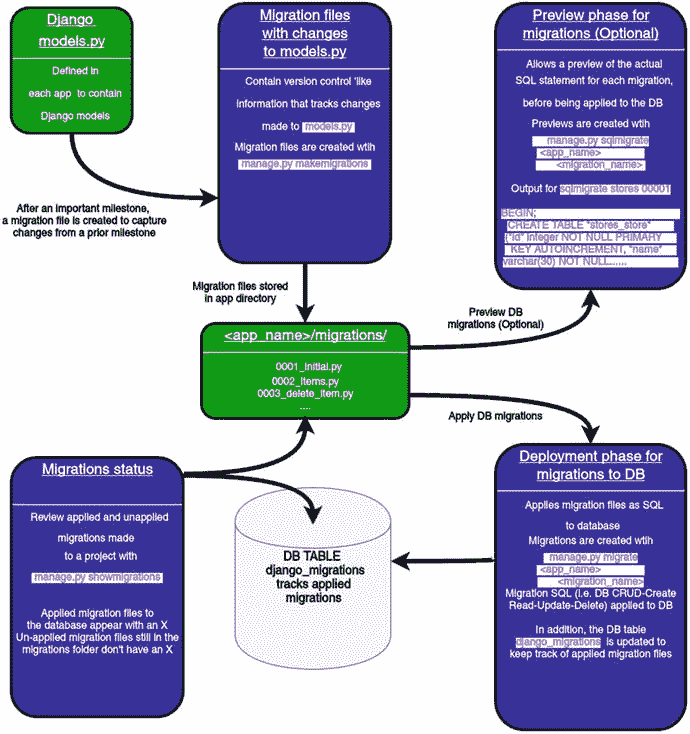
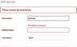

# 七、Django 模型

Django 应用与数据交互的典型方式是通过 Django 模型。Django 模型是一个面向对象的 Python 类，表示实体的特征。例如，一个实体可以是一个人、一个公司、一个产品或应用使用的一些其他概念。

因为数据是现代应用的中心，Django 框架执行 DRY(不要重复自己)原则，Django 模型经常充当 Django 项目的构建模块。一旦您有了一组代表应用实体的 Django 模型，Django 模型也可以作为简化创建其他操作数据的 Django 结构(例如表单、基于类的视图、REST 服务、Django 管理页面)的基础，因此 Django 模型在整体上非常重要。

在这一章中，您将了解 Django 模型的核心行为，包括如何创建模型和如何使用迁移，这是有效使用模型的核心。接下来，您将了解 Django 模型的默认行为，以及如何用自定义行为覆盖它们。此外，您将了解创建 Django 模型可用的不同数据类型，Django 模型可用的不同关系，以及如何使用 Django 模型管理数据库事务。

接下来，您将了解有关迁移文件的更多信息，包括创建迁移文件的各种方法、如何重命名迁移文件、如何将多个迁移文件压缩成一个迁移文件、每个迁移文件元素背后的含义以便您可以放心地编辑迁移文件，以及回滚迁移文件的过程。

此外，您将了解各种 Django 工具，这些工具旨在简化 Django 模型和数据库之间的工作，例如用 fixture 文件备份和加载模型数据，包括如何将初始数据加载到 Django 模型中。接下来，您将了解 Django 模型中支持软件观察者模式的 Django 信号。最后，您将学习如何在默认位置之外声明 Django 模型，以及如何配置多个数据库并在 Django 模型中使用它们。

本章假设您已经为 Django 项目建立了一个数据库。如果您还没有建立数据库，请参见第一章为 Django 项目建立数据库。

## Django 模型和迁移工作流

Django 的主要存储技术是关系型的(即开箱即可连接到 SQLite、Postgres、MySQL 或 Oracle)，因此 Django 模型被设计为直接映射到关系数据库表。这意味着 Django 模型的实例被存储为以模型命名的关系表的行。

例如，对于名为`Store`的 Django 模型类，默认情况下，Django 对名为`<app_name>_store`的数据库表执行数据库 CRUD(创建、读取、更新和删除)操作，其中模型的每个`Store`实例表示数据库行，模型的字段(例如，`name`、`address`、`city`、`state`)映射到数据库表列。

因为 Django 模型围绕着数据，所以它们很容易改变。例如，由于业务需求，一个名为`Store`的 Django 模型可能突然需要修改其原始字段(例如，添加一个新字段，如`email`，或者删除一个不再需要的字段，如`telephone`)。维护这些 Django 模型的变化也是 Django 模型的一个重要方面，并通过使用迁移文件来管理。

### 创建 Django 模型

Django 模型存储在 Django 应用中的`models.py`文件中。一旦创建了 Django 应用，一个空的`models.py`文件就会被添加到应用中以供将来使用。如果你不熟悉 Django app 这个术语，请参阅章节 1 中关于设置内容的部分。清单 7-1 展示了一个 Django 模型定义的例子。

Tip

记住这本书的代码在 [`https://github.com/drubio/beginningdjango`](https://github.com/drubio/beginningdjango) ，如果你觉得用一个预先输入的结构化的应用更容易理解的话。

```py
from __future__ import unicode_literals
from django.utils.encoding import python_2_unicode_compatible

from django.db import models

@python_2_unicode_compatible
class Store(models.Model):
    #id = models.AutoField(primary_key=True)# Added by default, not required explicitly
    name = models.CharField(max_length=30)
    address = models.CharField(max_length=30)
    city = models.CharField(max_length=30)
    state = models.CharField(max_length=2)
    #objects = models.Manager()# Added by default, to required explicitly
    def __str__(self):
        return "%s (%s,%s)" % (self.name, self.city, self.state)

Listing 7-1.Django model class definition in models.py

```

清单 7-1 中的前两行导入了使用 Python 2 和 Python 3 在 Django 中运行 Python 类所需的功能。如果您的 Django 项目只是在 Python 3 上运行，那么您可以省略这些 import 语句。清单 7-1 中的第三行导入了`django.db.models`包，这是在类定义中访问 Django 模型功能所必需的。接下来，您可以看到 class `Store(models.Model)`语句。在 Python 2 上运行这个类需要`@python_2_unicode_compatible`注释，但是如果你只是使用 Python 3，你可以省略这个注释。

在清单 7-1 中的主类定义之后，您可以看到四个数据类型为`models.CharField`的字段，它们将这些字段限定为字符串。进一步限制每个字段的可接受值的是`models.CharField`的`max_length`参数(例如，`max_length=30`表示字符字段的最大长度为 30 个字符)。

目前，不要担心`models.CharField`字段的定义。Django 的`models`包支持许多其他数据类型和参数，我将在下一节关于 Django 模型数据类型中描述所有这些选项。

此外，注意清单 7-1 中的 Django 模型有`id`和`objects`字段。在这种情况下，我用`#`将它们注释掉，因为你不需要显式声明它们；两者都被自动添加到所有 Django 模型中，但是我把它们放在那里，这样你就知道它们的存在了。

`id`字段是 Django `AutoField`数据类型，它在后台创建一个自动递增的整数表列。例如，当您创建第一个`Store`记录时，数据库将`id`字段设置为 1，对于第二个`Store`记录，数据库将`id`字段设置为 2，依此类推。`id`字段的目的是使记录搜索更容易、更有效。因为`id`代表一个唯一的数字来标识一个记录，所以它被用作一个引用，也用作一个数据库表的主键和一个加速记录访问的索引。虽然您可以覆盖这个默认的`id`字段的各种行为(例如，更改字段名)，但是我将把这方面的细节留到后面的部分。

`objects`字段是 Django 模型的默认模型管理器，负责管理与 Django 模型相关的所有查询操作。本章和下一章的后续章节将描述 Django 模型管理器的使用。

Tip

如果你想了解更多关于所有 Django 模型默认添加的 id 字段，表 7-1 描述了 AutoField 数据类型，这是 id 字段的基础；本章后面的“Django 模型数据类型”一节描述了 id 字段使用的 primary_key 属性的用途；本章后面的“模型方法”一节中描述的 save()方法描述了 id 字段的实际应用。

最后，在清单 7-1 中，你可以看到`__str__`的类方法定义，这是一个标准的 Python 方法——被称为‘魔法方法’的一部分——在试图查看或打印 Django 模型的实例时很有帮助。`__str__`方法定义了一个类实例的人类可读表示(例如，基于清单 7-1 的`Store`模型实例通过其`name`、`city`和`state`字段值输出)。

Django 模型定义即使放在应用的`models.py`文件中，也仍然不能被 Django 发现。为了让 Django 发现`models.py`文件中的模型定义，有必要将应用声明为`settings.py`中`INSTALLED_APPS`变量的一部分。清单 7-2 展示了在`coffeehouse.stores`应用中发现 Django 模型的`INSTALLED_APPS`定义。

```py
INSTALLED_APPS = (
    'django.contrib.admin',
    'django.contrib.auth',
    'django.contrib.contenttypes',
    'django.contrib.sessions',
    'django.contrib.messages',
    'django.contrib.staticfiles',
    'coffeehouse.stores',

)
Listing 7-2.Add app to INSTALLED_APPS in Django settings.py to detect models.py definitions

```

正如你在清单 7-2 中看到的，除了在`INSTALLED_APPS`中声明的默认应用之外，在最后还添加了`coffeehouse.stores`应用。这告诉 Django 检查`coffeehouse.stores`应用中的`models.py`文件，以考虑其中的任何 Django 模型定义。

在前面的步骤之后，`models.py`中的一个应用的 Django 模型定义就可以使用了。在下一节中，我将描述 Django 模型迁移以及与`models.py`文件中的模型相关联的工作流。

### 迁移和 Django 模型工作流

让我们从 Django models 工作流如何在混合迁移的情况下运行的例子开始。图 7-1 显示了带有迁移的 Django 模型工作流。



图 7-1。

Django workflow for models with migrations

如图 7-1 的左上方所示，当您在`models.py`文件上添加或修改 Django 模型时，工作流开始。一旦您认为对一个`models.py`文件所做的更改相当大，或者希望它们反映在数据库中，您需要创建一个迁移文件。无论您是添加、删除还是修改`models.py`文件中的内容，迁移文件都会提供对`models.py`文件所做更改的逐步快照。

为了创建迁移文件，使用`makemigrations`管理命令。当您运行这个命令时，Django 会扫描所有在`INSTALLED_APPS`中声明的 Django 应用的`models.py`文件，如果 Django 检测到对`models.py`文件的更改，它会为应用创建一个新的迁移文件。这个过程的功能就像一个版本控制系统，其中迁移文件反映了从以前的迁移文件对`models.py`所做的更改，整个系列的迁移文件讲述了一个应用的`models.py`文件的整个演变。

如图 7-1 所示，迁移文件存储在应用内的`/migrations/`子目录中，与它们跟踪的`models.py`文件放在一起。默认情况下，迁移文件使用命名约定`<number_shortdescription>`，因此很容易跟踪它们被创建的顺序以及它们包含的内容。

接下来，让我们在上一节中创建的 Django 模型上运行`makemigrations`。清单 7-3 演示了这个序列，并添加了`stores`参数来限制对`stores`应用的迁移过程——如果您不带任何参数运行`makemigrations`, Django 会检查`settings.py`中`INSTALLED_APPS`变量中定义的每个应用的`models.py`。

```py
[user@coffeehouse ∼]$ python manage.py makemigrations stores
Migrations for 'stores':
  0001_initial.py:
    - Create model Store
Listing 7-3.Django makemigrations command

to create migration file for changes made to models.py

```

运行清单 7-3 中的`makemigrations stores`后，可以看到迁移文件`0001_initial.py`。给这个文件起这个名字是因为它是第一次从空的`models.py`中迁移出来。未来对`models.py`的修改会生成名为`0002.`、`0003...`的迁移文件

将我们的注意力转回图 7-1 中的工作流，迁移文件本身只是 Django 模型工作流的第一步。接下来，您可以预览或应用这些迁移文件，以便模型成为数据库的一部分。

要在将迁移应用到数据库之前预览实际的 SQL 语句，可以运行`sqlmigrate <app_name> <migration_name>`命令。清单 7-4 展示了最后一步中迁移文件的`sqlmigrate`序列。

```py
[user@coffeehouse ∼]$ python manage.py sqlmigrate stores 0001
BEGIN;
CREATE TABLE "stores_store" ("id" integer NOT NULL PRIMARY KEY AUTOINCREMENT, "name" varchar(30) NOT NULL, "address" varchar(30) NOT NULL, "city" varchar(30) NOT NULL, "state" varchar(2) NOT NULL);

COMMIT;

Listing 7-4.Django sqlmigrate command

to preview SQL generated by migration file

```

正如您在清单 7-4 中看到的，`stores`应用的迁移文件`0001_initial.py`被设置为运行一条 SQL 语句，该语句创建一个名为`stores_store`的数据库表，其字段名对应于清单 7-1 中的 Django 模型。

Tip

您可以使用 db_table 元类选项更改 Django 模型的默认数据库表名；“模型元类”一节详细描述了这一点。

在这个阶段，预览迁移文件生成的 SQL 语句可能看起来不太令人兴奋，但在其他情况下，它会非常有帮助。例如，如果您对 Django 模型进行了复杂的更改，或者您的数据库相对较大，那么在将迁移文件直接应用到数据库之前预览 SQL 是有益的。

最后，Django 模型工作流的最后一步是使用 migrate 命令将迁移文件应用到数据库。清单 7-5 演示了这个序列，并添加了`stores`参数来限制 stores 应用的进程——如果您不带任何参数运行`migrate`, Django 会处理项目中每个应用的迁移文件。

```py
[user@coffeehouse ∼]$ python manage.py migrate stores
Operations to perform:
  Apply all migrations: stores
Running migrations:
  Applying stores.0001_initial... OK
Listing 7-5.Django migrate command

to execute migration files on database

```

在清单 7-5 中，`stores.0001_initial`迁移是针对数据库运行的。这意味着清单 7-4 中的 SQL 是针对数据库执行的。

Caution

小心不要通过 Django 迁移来直接操作数据库，因为这会导致不一致和错误。

Tip

如果不希望 Django 模型使用迁移，可以使用托管元类选项；请参阅“Django 元类”一节了解详细信息。

为了跟踪应用的迁移，在图 7-1 的左下方，您可以看到`showmigrations`管理命令的使用。`showmigrations`命令输出一个项目迁移列表，在那些已经应用到数据库的迁移文件旁边有一个 X。值得一提的是，`showmigrations`命令通过检查`migration`文件夹中的迁移文件和跟踪应用迁移的`django_migrations`数据库表来获取数据。

## Django 模型数据类型

数据需要符合特定的规则才能在任何应用中有用。如果不是因为规则，那么您可能很容易以邮政编码数字结束，而您期望的是地址信息或大量文本，而您期望的是最多 10 个字符的输入。Django 模型可以使用几种数据类型来强制模型数据符合某些规则(例如，文本、数字、电子邮件)。

理解 Django 模型数据类型在两个层上操作很重要:数据库层和 Django/Python 层。当您使用 Django 模型的数据类型定义 Django 模型并创建其初始迁移时，Django 会生成并执行模型的 DDL(数据定义语言)来创建数据库表，该 DDL 包含反映 Django 模型字段的规则(例如，Django `IntegerField`模型字段会被转换为`INTEGER` DB 列以强制执行整数值)。这意味着，如果您更改这种 Django 模型字段(例如，将一个整数字段更改为一个文本字段)，它需要生成一个新的迁移，以便数据库表也能反映任何新的规则。

除了一开始由 Django 模型在数据库层创建的规则实施之外，Django 模型字段还在 Django/Python 层实施数据规则(即，在数据库中插入/更新数据之前)。例如，Django 模型的字段参数像`choices`强制字段的值符合一组选择；当您试图创建、保存或更新 Django 模型记录时，会强制执行这种类型的规则，并且不管数据库表规则如何。这意味着您可以简单地更改与这种类型的规则相关联的 Django 模型字段，而不必创建新的迁移来更改底层数据库表——在这种情况下，更改 Python 代码就足以更改验证行为。

对于 Django 模型字段数据类型，请始终牢记这一点:一些 Django 模型更改需要创建一个迁移，而其他更改只需更改 Django 模型字段代码即可生效。表 7-1 展示了各种 Django 模型字段以及它们为 Django 支持的所有四个主要关系数据库生成的 DDL:SQLite、MySQL、PostgreSQL 和 Oracle。

表 7-1。

Django model data types and generated DDL by database

<colgroup><col> <col> <col> <col> <col> <col> <col></colgroup> 
| 数据类型 | Django 模型类型 | 数据库 DDL | 描述-验证-注释 |
| --- | --- | --- | --- |
|   |   | 数据库 | 关系型数据库 | 一种数据库系统 | 神谕 |   |
| --- | --- | --- | --- | --- | --- | --- |
| 二进制的 | 模特。二进制字段() | BLOB NOT NULL | 长 blob 非 NULL | 字节不为空 | BLOB NULL | 创建 blob 字段来存储二进制数据(例如，图像、音频或其他多媒体对象)。 |
| 布尔代数学体系的 | 模特。布尔字段() | 布尔值不为空 | 布尔值不为空 | 布尔值不为空 | NUMBER(1)NOT NULL CHECK(" VAR " IN(0，1)) | 创建一个布尔型字段来存储真/假(或 0/1)值。 |
| 布尔代数学体系的 | 模特。NullBooleanField() | 布尔空 | 布尔空 | 布尔值空值 | 数字(1)空检查(((0，1)中的“VAR”)或(“VAR”为空)) | 与 BooleanField 类似，但也允许空值。 |
| 日期/时间 | 模特。日期字段() | 日期不为空 | 日期不为空 | 日期不为空 | 日期不为空 | 创建日期字段来存储日期。 |
| 日期/时间 | 模特。时间字段() | 时间不为空 | 时间不为空 | 时间不为空 | 时间戳不为空 | 创建时间字段来存储时间。 |
| 日期/时间 | 模特。日期时间字段() | 日期时间不为空 | 日期时间不为空 | 时区不为空的时间戳 | 时间戳不为空 | 创建日期时间字段来存储日期和时间。 |
| 日期/时间 | 模特。DurationField() | bigint NOT NULL | bigint NOT NULL | 间隔不为空 | 第(9)天到第(6)天的间隔不为空 | 创建一个字段来存储时间段。 |
| 数字 | 模特。自动字段() | 整数非空自动增量 | 整数 AUTO_INCREMENT 不为空 | 序列不为空 | NUMBER(11) NOT NULL &也创建一个序列和触发器来增加字段 | 创建一个自动递增的整数，主要用于自定义主键。 |
| 数字 | 模特们。bigintegerfield() | bigint NOT NULL | bigint NOT NULL | bigint NOT NULL | 数字(19)不为空 | 创建一个大整数来适应-9223372036854775808 到 9223372036854775807 之间的数字。该范围可能因 DB 品牌而异。 |
| 数字 | 模特。DecimalField( decimal_places=X，max_digits=Y) | 小数不为空 | 数值(X，Y)不为空 | 数值(X，Y)不为空 | 数字(10，3)不为空 | 强制一个最多有 X 位数字和 Y 位小数点的数字。创建一个十进制字段来存储十进制数。注意 X 和 Y 参数都是必需的，其中 X 参数表示要存储的最大位数，Y 参数表示要存储的小数位数。 |
| 数字 | 模特。浮动字段() | 实数不为空 | 双精度不为空 | 双精度不为空 | 双精度不为空 | 创建存储浮点数的列。 |
| 数字 | 模特。IntegerField() | 整数不为空 | 整数不为空 | 整数不为空 | 数字(11)不为空 | 创建存储整数的列。 |
| 数字 | 模特。PositiveIntegerField() | 无符号整数不为空 | 无符号整数不为空 | 整数非空检查(" VAR" >= 0) | NUMBER(11)非空校验(" VAR" >= 0) | 强制使用 0 到 2147483647 之间的值。与 IntegerField 类似，但将值限制为正数。 |
| 数字 | 模特。PositiveSmallIntegerField() | smallint unsigned NOT NULL | smallint UNSIGNED NOT NULL | smallint NOT NULL CHECK （"VAR" >= 0） | NUMBER(11)非空校验(" VAR" >= 0) | 强制使用 0 到 32767 之间的值。与整数域和特殊的正整数域类似，但将数字限制在较小的正范围内。 |
| 数字 | 选项。SmallIntegerField() | smallint not null | smallint not null | smallint not null | 数字(11)不为空 | 强制数字在-32768 到 32767 的范围内。工作方式与 IntegerField 类似，但整数范围更小。 |
| 文本 | 模特。CharField( max_length=N) | varchar(N)不为空 | varchar(50)不为空 | varchar(50)不为空 | NVARCHAR2(50)空 | 创建一个文本列，其中 max_length 参数是指定最大字符长度所必需的。 |
| 文本 | 模特。文本字段() | 文本不为空 | longtext NOT NULL | 文本不为空 | NCLOB NULL | 创建一个文本字段来存储文本。 |
| 文本(专业) | 模特。CommaSeparatedIntegerField(max _ length = 50) | varchar(N)不为空 | varchar(N)不为空 | varchar(N)不为空 | NVARCHAR2(N) NULL | 强制字符串为 CSV 格式的整数。工作方式与 CharField 类似，只是 Django 在与数据库交互之前强制字符串为逗号分隔的整数值(例如，3，54，54，664，65)。 |
| 文本(专业) | 模特。电子邮件字段() | varchar(254)不为空 | varchar(254)不为空 | varchar(254)不为空 | NVARCHAR2(254)空 | 使用内部 Django EmailValidator 强制文本是有效的电子邮件，以确定什么是有效的，什么不是。工作方式与 CharField 一样，默认 max_length 为 254 个字符，并且强制该字符串是有效的电子邮件。 |
| 文本(专业) | 模特。文件字段() | varchar(100)不为空 | varchar(100)不为空 | varchar(100)不为空 | NVARCHAR2(100)空 | 实施并提供各种实用程序来处理文件(例如，打开/关闭文件、上传位置等)。).工作原理与 CharField 一样，默认 max_length 为 100 个字符，并强制该字符串是有效文件。 |
| 文本(专业) | 模特。文件路径字段() | varchar(100)不为空 | varchar(100)不为空 | varchar(100)不为空 | NVARCHAR2(100)空 | 强制执行并提供各种实用程序来限制某些文件系统目录中的文件名选择。工作方式与 CharField 一样，默认 max_length 为 100 个字符，并强制该字符串是文件系统目录中的有效文件。 |
| 文本(专业) | 模特。图像字段() | varchar(100)不为空 | varchar(100)不为空 | varchar(100)不为空 | NVARCHAR2(100)空 | 执行并提供各种实用程序来处理图像文件(例如，获取高度和宽度)。工作方式与 CharField 和专用 FileField 类似，默认 max_length 为 100 个字符，并强制字符串为有效图像。注意该字段需要 Pillow Python 库的存在(例如 pip install Pillow)。 |
| 文本(专业) | 模特。GenericIPAddressField() | char(39)不为空 | char(39)不为空 | inet 不为空 | VARCHAR2(39) NULL | 强制执行并提供各种实用程序，仅接受有效的 IPv4 或 IPv6 地址(例如，198.10.22.64 和 FE80::0202:B3FF。:FE1E:8329，以及 unpack_ipv4 和 protocol 之类的实用程序)。工作原理与 CharField 一样，默认 max_length 为 39 个字符，并强制该字符串是有效的 IP 地址。 |
| 文本(专业) | 模特。斯拉格菲尔德() | varchar(50)不为空 | varchar(50)不为空 | varchar(50)不为空 | NVARCHAR2(50)空 | 强制字符串为辅助字符串，即仅包含字母、数字、下划线或连字符的字符串。就像 CharField 默认为 50 个字符的 max_length 一样工作，并确保提供的字符串是一个 slug——这个概念通常用于清理包含空格和其他潜在无效字符(如带重音符号的字母)的 URL 字符串。 |
| 文本(专业) | 模特。URLField() | varchar(200)不为空 | varchar(200)不为空 | varchar(200)不为空 | NVARCHAR2(200)空 | 强制提供的文本值是有效的 URL。工作原理与 CharField 一样，默认的 max_length 为 200 个字符，并强制该字符串是有效的 URL。 |
| 文本(专业) | 模特。UUIDField() | char(32)不为空 | char(32)不为空 | uuid NOT NULL | VARCHAR2(32)不为空 | 强制提供的文本是一个通用唯一标识符(UUID ),就像 CharField 一样，默认的 max_length 为 32 个字符，并强制该值是一个 UUID。 |

Oracle Not Null Considered Harmful

如果您仔细查看表 7-1 中为不同 Django 模型字段生成的一些 DDL(例如，模型。CharField()，模型。FileField())，您会注意到 Oracle 使用 NULL 约束生成 DB 列，而其他三个数据库品牌使用 NOT NULL 约束生成 DB 列；这既不是一个打字错误，也不是一个错误，这是由于 Oracle 的工作方式而设计的。

尽管 Oracle 像其他数据库品牌一样支持 NOT NULL 约束，但 Oracle 也带来了副作用，即它也将空字符串“”视为非 NULL 值。这意味着，如果 Django 试图在 Oracle 数据库中存储一个空字符串' '(例如，在 CharField()或 FieldField()上)，如果存在 NOT NULL 约束，该操作将被拒绝——即使有 NOT NULL 约束，该操作在其他数据库中也完全有效。因此，为了保持跨数据库的一致性并避免这种 Oracle 特有的边缘情况，Django 选择在某些场景中不使用 NOT NULL 约束。

注意这是一个众所周知的 Oracle“特性”或“怪癖”——取决于您的观点——多年来一直为人所知:如何在不可空的列中插入空字符串(零长度)？答:不能。Oracle 在其文档中陈述了这一事实，并提到这一行为可能会在未来发生变化以符合标准(ANSI)，但在最新版本的 Oracle 12c 中，这一行为保持不变。在下一节中，我将提供一些与处理 NULL、NOT NULL 和空 string ' '问题相关的特定于 Django 的细节。

正如您在表 7-1 中看到的，Django 模型字段根据数据库品牌产生稍微不同的 DDL，尽管所有后端映射的最终行为都尽可能彼此接近，Django/Python 规则强制填补了空白。

例如，对于像`models.DurationField()`这样的 Django 模型字段，SQLite 和 MySQL 使用`bigint`数据类型，而 PostgreSQL 和 Oracle 使用更专业的`interval`数据类型。类似地，对于 Django 模型字段，如`models.CommaSeparatedIntegerField()`和`models.EmailField()`，在数据库级别，它们被表示为基本字符`varchar`数据类型——或者在 Oracle 中被表示为`NVARCHAR2`——是 Django/Python 强制文本表示分别是有效的 CSV 格式的整数或电子邮件。

了解了每个 Django 模型字段生成的初始 DDL 之后，在接下来的部分中，我将介绍各种 Django 模型字段选项以及它们与初始 DDL 和 Django/Python 验证相关的行为。

### 极限值:最大长度、最小值、最大值、最大位数和小数位数

将值限制在某个范围内是 Django 模型字段中最基本的选项之一。对于基于文本的数据类型，`max_length`选项强制值不超过一定数量的字符。在表 7-1 中，你可以看到`CharField`数据类型需要你指定`max_length`选项，对于更专业的基于文本的数据类型(例如`EmailField`)，Django 会分配一个默认的`max_length`选项值，你可以用一个显式的`max_length`值覆盖它。

对于使用`IntegerField`数据类型的字段，Django 提供了`min_value`和`max_value`选项来限制值的下限/上限(例如，`IntegerField(min_value=0,max_value=1000)`将值限制在 0 到 1000 的范围内)。类似地，对于数据类型为`DecimalField`的字段，Django 要求您指定`max_digits`和`decimal_places`选项来分别强制一个值的最大位数和小数点位数。

### 空值、Null 值和非 Null 值:空白值和 Null 值

默认情况下，所有 Django 模型字段都在数据库级别被赋予了一个`NOT NULL`限制；如果您再次查看表 7-1 ，您可以通过生成的 DDL 确认这一点——唯一的例外是 Oracle 数据库上的某些字段，这在表 7-1 下面的侧栏中有解释。

这意味着当您创建/更新一个带有`NOT NUL` L 字段的记录时，必须为该字段提供一个值，否则数据库会拒绝该操作。但是在某些情况下，可能有必要允许空字段值或数据库中的`NULL`值。为了允许 Django 模型字段在数据库级别支持`NULL`值，您必须声明`null=True`字段选项(例如，`IntegerField(null=True)`允许一个整数字段为空，并使用`NULL`而不是默认的`NOT NULL`生成 DDL)。

除了在数据库级执行的默认为`null=False`的`null`选项，Django 还支持`blank`选项。`blank`选项在所有字段上也默认为`blank=False`,用于通过在 Django 模型上工作的表单来执行 Django/Python 验证(例如，通过 Django 管理中的表单或自定义 Django 表单来创建 Django 模型记录)。如果 Django 模型字段用`blank=True`声明，Django 允许该字段在表单中留空，否则(即，如果`blank=True`没有在模型字段中显式声明), Django 拒绝该表单并强制最终用户为该字段提供一个值。

由于`null`和`blank`选项的使用可能是 Django 模型字段选项中最令人困惑的主题之一，表 7-2 展示了一个具有不同模型定义和操作的矩阵，以更好地说明这种行为。

表 7-2。

Django model validation for blank and null field options

<colgroup><col> <col> <col> <col> <col></colgroup> 
| 模型定义类 Person(模型。型号):名字=型号。CharField(max _ length = 30)middle _ name = models。CharField(max _ length = 30)last _ name = models。CharField(max_length=30) |
| --- |
| 空白和空字段组合 | Default(空白=假，null =假)middle_name =模型。CharField(max_ length=30) | null=True(默认值为 blank=False) middle_ name = models。CharField (max_length=30，null= True) | blank=True(默认值为 null=True) middle_name= models。CharField (max_length=30，blank=True) | null=True，空白=True 模型。CharField( max_length=30，null= True，blank=True) |
| Person.objects.create(名字='Johann '，中间名=None，姓氏='Bach ') | None 被视为 NULL，因此 middle_name 不能为 NULL。 | 由于 null=True，middle_name 可以为 NULL | None 被视为 NULL，因此 middle_name 不能为 NULL，blank=True 表示表单。 | 由于 null=True，middle_name 可以为 NULL |
| Person.objects.create(名字='Johann '，姓氏='Bach ') | 未指定的 middle_name 默认为空字符串“”，操作成功，因为“”被视为 not null。 | 未指定的 middle_name 默认为空字符串“”，操作成功，因为“”被视为 not null。 | 未指定的 middle_name 默认为空字符串“”，操作成功，因为“”被视为 not null。 | 未指定的 middle_name 默认为空字符串“”，操作成功，因为“”被视为 not null。 |
| Person.objects.create(名字='Johann '，中间名= ' '，姓氏='Bach ') | 显式空字符串“”被视为 not null，操作成功。 | 显式空字符串“”被视为 not null，操作成功。 | 显式空字符串“”被视为 not null，操作成功。 | 显式空字符串“”被视为 not null，操作成功。 |
| Django admin 或常规 Django 表单中的中间名为空的表单验证。 | Validation error due to empty middle_name. | Validation error due to empty middle_name. | Record creation valid even with empty middle_name due to blank=True. | Record creation valid even with empty middle_name due to blank=True. |

Tip

下一章将介绍 Django 模型表单及其验证。

### 预定值:默认值、自动开始、自动开始添加和选择

有时给 Django 模型字段分配预定的值会很有帮助。例如，为了避免在没有提供值时出现空字符串——如表 7-2 中的一些情况所示——您可以在 Django 模型字段上使用`default`选项(例如，提供一个默认的 id、城市或日期)。在大多数情况下，您将`default`选项指定为硬编码值或方法引用。清单 7-6 展示了一个使用两种方法的`default`选项的例子。

```py
def default_city():
    return "San Diego"

class Store(models.Model):
    name = models.CharField(max_length=30)
    address = models.CharField(max_length=30)
    city = models.CharField(max_length=30,default=default_city)
    state = models.CharField(max_length=2,default='CA')

Listing 7-6.Django model default option use

```

正如你在清单 7-6 中看到的，我们有两个 Django 模型字段使用了`default`选项。首先，`city`字段依赖于`default=default_city`值——注意语法中缺少括号，这使得它成为对函数的引用——该函数告诉 Django 在每次创建新记录时调用`default_city`方法来填充字段。

值得一提的是，该方法被放在 Django 模型类之外，而不是在同一个类体中声明；这是为了允许在 Python 2 项目中序列化和支持 Django 模型迁移。 <sup>1</sup> 接下来在清单 7-6 中，您可以看到`state`字段使用了`default='CA'`值，这告诉 Django 在创建新记录时使用硬编码的`CA`字符串来填充字段。

默认选项的执行完全由 Django/Python 完成(即数据库 DDL 不知道任何默认值)。这意味着当您使用类似清单 7-6 中的模型时，Django/Python 会介入提供默认值。例如，如果您创建一个 Django 模型实例作为`Person.objects.create(name='Downtown',address='Main Street #5')`，那么`city`和`state`值由 Django/Python 填充以创建记录。类似地，如果您转到 Django admin 并试图创建清单 7-6 中模型的实例，那么`city`和`state`表单字段会预先填充默认值。

尽管`default`选项的工作方式与对文本字段、数字和布尔字段的描述一样，但它对日期字段有特殊的行为——特别是`models.DateField()`和`models.DateTimeField()`——这很重要，所以让我们来研究一下，在讨论日期的同时，也了解一下与日期和时间模型字段相关的`auto_now`和`auto_now_add`选项。

```py
from datetime import date
from django.utils import timezone

class Store(models.Model):
    name = models.CharField(max_length=30)
    address = models.CharField(max_length=30)
    date = models.DateField(default=date.today)
    datetime = models.DateTimeField(default=timezone.now)
    date_lastupdated = models.DateField(auto_now=True)
    date_added = models.DateField(auto_now_add=True)
    timestamp_lastupdated = models.DateTimeField(auto_now=True)
    timestamp_added = models.DateTimeField(auto_now_add=True)

Listing 7-7.Django model default options for dates and times, as well as auto_now and auto_now_add use

```

清单 7-7 展示了清单 7-6 中的`Store`模型的修改版本，其中包含一系列日期字段变化。前两个附加字段`date`和`datetime`分别使用了使用 Python 的标准`datetime`库的带有默认值的`DateField`和使用 Django 的`django.utils.timezone`模块的带有默认值的`DateTimeField`——侧栏包含了关于为什么使用`django.utils.timezone`模块来创建日期时间值的更多细节。

在这种情况下，如果您基于清单 7-7 中的模型创建一个`Store`记录，Django/Python 会根据后台库的功能填充`date`和`datetime`字段的值。类似地，如果您转到 Django admin 并试图创建清单 7-7 中模型的实例，那么`date`和`datetime`表单字段会分别预先填充当前日期和日期时间的默认值。

Don’t Add () Parentheses to Methods in Default Values

如果仔细观察前面清单中的默认值，会发现它们的语法中缺少()，这就产生了一个重要的行为。通过省略()语法，Python 将引用分配给一个方法，并在运行时之前计算表达式，但是如果使用()语法(例如，default=timezone.now())，Python 会在编译时计算表达式。对于返回固定值的函数来说，这不是问题，但是对于返回动态计算值(例如，日期)的函数来说，这很关键；否则，您将获得在编译时计算的单个值(例如，日期或日期时间字段将包含在编译时为所有记录计算的相同值)。

Don’t Use the Basic Datetime.Now for Datetimefield Fields

由于 settings.py 中的 USE_TZ = True，Django 在默认情况下是时区敏感的。这意味着当您处理带有时间的日期(例如，在 DateTimeField 模型字段中)时，您必须提供时区敏感的日期。这就是为什么在清单 7-7 中的模型。datetime field(default = time zone . now)语句使用 Django 的 django.utils.timezone 模块，该模块生成时区感知日期。

在清单 7-7 中，有一对额外的`DateField`和`DateTimeField`字段使用了`auto_now=True`和`auto_now_add=True`选项。这两个选项的工作方式都类似于`default`选项——在某种意义上，它们添加了一个默认日期或日期&时间——但行为略有不同。第一个重要区别是`default`选项可用于多种类型的字段，而`auto_now`和`auto_now_add`选项是为`DateField`和`DateTimeField`字段设计的。

使用`auto_now`和`auto_now_add`选项的字段值在创建记录时生成。每次记录改变时，使用`auto_now`选项的字段值都会更新，而使用`auto_now_add`选项的字段值在记录的生命周期内保持冻结。默认情况下，使用`auto_now`或`auto_now_add`选项的`DateField`字段从`datetime.date.today()`生成它们的值，而使用`auto_now`或`auto_now_add`选项的`DateTimeField`字段从`django.utils.timezone.now()`生成它们的值。

与带有`default`选项的字段不同，带有`auto_now`和`auto_now_add`选项的字段不能被覆盖。这意味着，即使您创建或更新了一个记录，并为带有`auto_now`或`auto_now_add`选项的字段提供了一个值，该值也会被忽略。类似地，在 Django admin 中，默认情况下不显示使用`auto_now`和`auto_now_add`选项的字段，因为它们的值不能被修改。最后，值得一提的是`auto_now`、`auto_now_add`和`default`选项是互斥的(即，不能在一个字段中使用多个选项，否则会导致错误)。

如您所见，`auto_now`选项是跟踪记录的最后修改日期的理想选择，`auto_now_add`是跟踪记录的创建日期的理想选择，`default`选项是表单字段上的通用可修改日期。

预定值的另一个场景是使用`choices`选项将 Django 模型字段限制为一个值列表，以限制开放式值并减少不同的数据和错误(例如，一个状态列表`["CA","AR"]`，而不是让用户引入`Ca`、`Cali`、`ar`或`Arizona`)。清单 7-8 展示了一个使用`choices`选项的 Django 模型字段的例子。

```py
ITEM_SIZES = (
            ('S','Small'),
            ('M','Medium'),
            ('L','Large'),
            ('P','Portion'),
            )

class Menu(models.Model):
    name = models.CharField(max_length=30)

class Item(models.Model):
    menu = models.ForeignKey(Menu, on_delete=models.CASCADE)
    name = models.CharField(max_length=30)
    description = models.CharField(max_length=100)
    size = models.CharField(choices=ITEM_SIZES,max_length=1)

Listing 7-8.Django model choices option

```

使用`choices`选项的第一件事是创建一个元组列表，如清单 7-8 所示。`ITEMS_SIZES`元组具有四个元组，其中第一元组元素表示在数据库中使用的关键字(例如，`S`、`M`)，第二元组元素表示第一元组元素的人类友好的表示(例如，`Small`、`Medium`)。

接下来，在清单 7-8 中，您可以看到`size`字段被赋予了`choices=ITEM_SIZES`值，该值告诉 Django 使用来自`ITEM_SIZES`的键作为潜在值。注意，在这种情况下，数据库中使用的键都是对应于`CharField(max_length=1)`数据类型的单字符文本值(例如`S`、`M`)，但是您也可以使用数字或布尔值作为键，只要它们匹配目标字段数据类型。

Tip

下一章将介绍带有选择选项的 Django 表单模型。

### 唯一值:Unique、unique_for_date、unique_for_month 和 unique_for_year

可以强制字段值在所有记录中是唯一的。例如，在清单 7-7 中，如果您将`name=models.CharField(max_length=30)`改为`name=models.CharField(max_length=30, unique=True)`，它会告诉 Django 确保所有的`Store`记录都有惟一的名称值。

Django 在数据库层(即通过添加 DDL `UNIQUE` SQL 约束)以及 Django/Python 层强制执行`unique`选项。此外，`unique`选项对除`ManyToManyField`、`OneToOneField`和`FileField`之外的所有字段类型有效。

为了强制字段和`DateField`或`DateTimeField`值的唯一性，Django 提供了`unique_for_date`、`unique_for_month`和`unique_for_year`选项。例如，在清单 7-7 中，为了使`name`字段的值与`date_lastupdated`字段的`date`唯一，您可以使用`name = models.CharField(max_length=30, unique_for_date="date_lastupdated")`语句告诉 Django 只允许一个记录具有相同的`name`和`date_lastupdated`(例如，您不能有两个记录具有`name="Downtown"`和`date_lastupdated="2018-01-01"`，但是允许两个记录具有`name="Downtown"`和不同的`date_lastupdated`值)。

`unique_for_month`和`unique_for_year`选项提供了更大的范围来实施验证。例如，`name = models.CharField(max_length=30, unique_for_month="date_lastupdated")`语句告诉 Django 在同一个月只允许一个具有相同名称和`date_lastupdated`值的记录，而`name = models.CharField(max_length=30, unique_for_year="date_lastupdated")`语句告诉 Django 在同一年只允许一个具有相同`name`和`date_lastupdated`值的记录。

由于`unique_for_date`、`unique_for_month`和`unique_for_year`选项的需求更加复杂，这些选项的实施是在 Django/Python 层完成的。此外，由于验证过程的性质，这些选项仅对`DateField`和`DateTimeField`字段有效，注意对于`DateTimeField`情况，仅使用值的日期部分。

### 表单值:可编辑、帮助文本、详细名称和错误消息

当 Django 模型在表单的上下文中使用时，由 Django 模型字段支持的表单字段可以通过各种模型选项来影响。以下选项与您在上一章 Django 表单中学到的表单选项完全相同，只是这些选项作为模型字段的一部分被分配给影响表单字段。

默认情况下，表单中显示的所有 Django 模型字段都是可编辑的，但是您可以通过使用`editable=False`选项来改变这种行为。用`editable=False`设置一个模型字段告诉 Django 在一个表单中完全忽略它(例如，在 Django admin 中),因此任何与表单字段相关的验证都会被忽略。

`help_text`选项允许在表单域旁边包含额外的文本。清单 7-9 展示了`help_text`选项的使用。

```py
ITEM_SIZES = (
            ('S','Small'),
            ('M','Medium'),
            ('L','Large'),
            ('P','Portion'),
            )

class Menu(models.Model):
    name = models.CharField(max_length=30)

class Item(models.Model):
    menu = models.ForeignKey(Menu, on_delete=models.CASCADE)
    name = models.CharField(max_length=30)
    description = models.CharField(max_length=100,help_text="Ensure you provide some description of the ingredients")
    size = models.CharField(choices=ITEM_SIZES,max_length=1)
    calories = models.IntegerField(help_text="Calorie count should reflect <b>size</b> of the item")

Listing 7-9.Django model help_text option

```

在清单 7-9 中，您可以看到有两个带`help_text`选项的字段。当基于这个 Django 模型的 Django 表单呈现在模板中时，模型中定义的`help_text`继续形成最终表单布局的一部分。

默认情况下，Django 模型字段名用于生成 Django 表单字段的标题，该标题使用模型字段名的大写版本。(例如，名称、描述)。您可以使用`verbose_name`选项配置更详细的表单域标题(例如，`models.CharField (max_length=30,verbose_name="ITEM NAME")`，输出表单域的`ITEM NAME`标题)。

如果您试图在表单中保存或更新 Django 模型，并且有任何值不符合底层字段类型，Django 会为不符合的值生成默认错误消息。这些错误消息虽然有用，但本质上是通用的，因此可以使用`error_messages`选项为每个字段定制这些错误消息。`error_messages`选项接受一个键值字典，其中键表示错误代码，值表示错误消息。有关`error_messages`字典结构的详细示例，请参见上一章 Django 表单。

Tip

第九章更详细地介绍了 Django 模型表单。

### 数据库定义语言(DDL)值:db_column、db_index、db_tablespace、primary_key

默认情况下，Django 根据 Django 模型的字段名生成数据库表的列名。例如，如果 Django 模型字段名为`menu`，Django 会生成一个名为`menu`的 DB 列。使用`db_column`选项(如`name = models.CharField(max_length=30,db_column="my_custom_name")`)可以覆盖这种行为。Django 用`my_custom_name`列名生成 DDL。

Django 模型的另一个与数据库相关的选项是`db_index`选项，它告诉 Django 为字段生成一个数据库索引(例如，`size = models.CharField(choices=ITEM_SIZES,max_length=1,db_index=True)`为`size`字段生成一个数据库索引)。请注意，在以下情况下，Django 会自动创建一个数据库索引，因此针对以下场景的`db_index=True`是多余的:

*   如果一个字段使用了`unique=True`选项，Django 会自动为该字段创建一个索引。您可以禁用此行为设置`db_index=False`。
*   如果一个字段是`ForeignKey`数据类型，Django 会自动为该字段创建一个索引。您可以禁用此行为设置`db_index=False`。

Tip

meta indexes 选项还可以为单个或多个字段定义索引。有关更多详细信息，请参见下一节“元类选项”。

如果使用 PostgreSQL 或 Oracle 数据库，可以通过`db_tablespace`名称为字段索引指定 DB 表空间。默认情况下，Django 使用项目在`settings.py`中的`DEFAULT_INDEX_TABLESPACE`值来确定表空间，但是如果一个字段使用了`db_tablespace`，那么这个值优先。如果数据库品牌不支持表空间(例如 MySQL 或 SQLite ),则忽略此选项。

最后，`primary_key`选项允许您为模型定义一个主键。默认情况下，如果没有用`primary_key=True`语句设置 Django 模型字段，Django 会自动创建一个名为`id`的`AutoField`数据类型来保存主键(例如，`id = models.AutoField(primary_key=True`)。`primary_key`选项的典型用例是引用其他字段的字段(如`OneToOneField`)或由于设计限制需要自定义主键。

### 内置和自定义验证器:验证器

除了前面章节中描述的 Django 模型的数据强制选项(例如，`unique`、`default`)，Django 模型还通过`validators`选项提供值的强制，这允许通过内置或定制方法实现更高级的验证逻辑。

Django 模型在`django.core.validators`包中提供了一系列内置的验证器方法，供模型数据类型使用。例如，`models.EmailField`数据类型依赖于`django.core.validators.EmailValidator`来验证电子邮件值，正如`models.IntegerField`数据类型使用`MinValueValidator`和`MaxValueValidator`验证器来分别执行`min_value`和`max_value`选项。

除了 Django 内置的验证器方法，您还可以创建定制的验证器方法。创建定制验证器方法的唯一要求是，方法接受模型字段的输入，并在值不符合预期规则的情况下抛出`django.core.exceptions.ValidatorError`。清单 7-10 展示了一个使用内置验证器和自定义验证器的模型。

```py
ITEM_SIZES = (
            ('S','Small'),
            ('M','Medium'),
            ('L','Large'),
            ('P','Portion'),
            )

# Import built-in validator
from  django.core.validators import MinLengthValidator

# Create custom validator
from django.core.exceptions import ValidationError

def calorie_watcher(value):
    if value > 5000:
        raise ValidationError(
            ('Whoa! calories are %(value)s ? We try to serve healthy food, try something less than 5000!'),
            params={'value': value},
        )
    if value < 0:
        raise ValidationError(
            ('Strange calories are %(value)s ? This can\'t be, value must be greater than 0'),
            params={'value': value},
        )

class Menu(models.Model):
    name = models.CharField(max_length=30)

class Item(models.Model):
    menu = models.ForeignKey(Menu, on_delete=models.CASCADE)
    name = models.CharField(max_length=30,validators=[MinLengthValidator(5)])
    description = models.CharField(max_length=100)
    size = models.CharField(choices=ITEM_SIZES,max_length=1)
    calories = models.IntegerField(validators=[calorie_watcher])

Listing 7-10.Django model field validators option with built-in and custom validator

```

清单 7-10 中的第一个`validators`选项使用内置的`MinLengthValidator`验证器类来强制`name`字段的值至少包含 5 个字符。清单 7-10 中的第二个`validators`选项使用定制的`calorie_watcher`验证器方法来强制`calories`字段的值符合某个范围，并在不符合该范围的情况下使用定制消息。值得一提的是，可以使用列表语法在单个字段上使用多个验证器方法(例如，`validators=[MinLengthValidators(5),MaxLengthValidators(100)]`)。

## Django 模型默认和定制行为

当你创建一个 Django 模型类时，它总是从`django.db.models.Model`类继承它的行为，如清单 7-1 所示。这个 Django 类提供了一个具有大量功能的 Django 模型，包括通过`save()`和`delete()`等方法进行的基本操作，以及模型的命名约定和查询行为。

在大多数情况下，`django.db.models.Model`类提供的默认行为就足够了，但是在其他情况下，您可能想要提供自定义行为。接下来，我将列举通过`django.db.models.Model`类提供的 Django 模型的功能。

### 模型方法

所有 Django 模型都继承了一系列操作方法，包括保存、删除、验证、加载以及将定制逻辑应用于模型数据。在接下来的部分中，我将描述这些方法的默认行为以及如何定制它们的行为。

#### save()方法

`save()`方法为 Django 模型提供了最常见的操作之一:将记录保存(即创建或更新)到数据库。一旦创建或引用了 Django 模型实例，就可以调用`save()`方法来创建/更新数据库上的实例。清单 7-11 说明了这个过程。

```py
# Import Django model class
from coffeehouse.stores.models import Store

# Create a model Store instance
store_corporate = Store(name='Corporate',address='624 Broadway',city='San Diego',state='CA',email='corporate@coffeehouse.com')

# Invoke the save() method to create/save the record
# No record id reference, so a create operation is made and the reference is updated with id
store_corporate.save()

# Change field on instance
store_corporate.city='625 Broadway'

# Invoke the save() method to update/save the record
# Record has id reference from prior save() call, so operation is update
store_corporate.save()

Listing 7-11.Django model use of the save() method

```

在清单 7-11 中，对同一引用的`save()`方法进行了两次调用；第一个在数据库上创建记录，第二个更新数据库上的记录。

你能告诉我 Django 如何知道何时用相同的`save()`方法创建和更新记录吗？它不在众目睽睽之下，所以如果你找不到它也不用担心。

在本章的第一节中，当您创建 Django 模型时，我提到 Django 会自动添加一个`id`字段作为所有 Django 模型的主键，以使记录的搜索更加容易和高效。Django 使用这个`id`主键来确定`save()`方法是否执行创建或更新操作。

尽管在清单 7-11 中没有显式`id`主键值的痕迹，但是在 Django 创建一个实例后，模型实例会获得一个`id`值。清单 7-11 中第一次调用`save()`方法时，Django 试图创建一个新记录，因为它在实例上找不到`id`主键值。但是，如果创建操作成功，数据库会给记录分配一个返回给 Django 的`id`主键值，Django 会用这个`id`主键值更新引用。

在同一个模型引用上对`save()`方法的后续调用中，Django 检测到`id`主键值的存在，并基于这个`id`主键值执行更新操作。如果您想知道，如果您将一个显式的`id`主键值添加到一个记录引用中，Django 还会执行一个更新，因为它会查找这个标志来确定是创建还是更新一个记录，所以请注意放置一个显式的`id`主键值会更新/覆盖与给定的`id`主键值相关联的数据库记录。

既然您已经对 Django 模型的`save()`方法的默认行为有了很好的理解，我将描述一下`save()`方法的各种可用选项。`save()`方法接受一系列参数来覆盖它的默认行为；表 7-3 说明了这些参数、它们的行为以及它们的默认值。

表 7-3。

Django model save() method arguments

<colgroup><col> <col> <col></colgroup> 
| 争吵 | 默认 | 描述 |
| --- | --- | --- |
| 强制插入 | force_insert=False | 显式地告诉 Django 在记录上强制执行创建操作(例如，保存(force_insert=True)。这很少使用，但是在您不依赖或不能依赖 Django 检测创建操作(即，通过 id 主键)的情况下会很有帮助。 |
| 强制更新 | 强制更新=假 | 显式地告诉 Django 在记录上强制执行更新操作(例如，保存(force_update=True)。这种方法很少使用，但是在不依赖或不能依赖 Django 检测更新操作的情况下(例如，通过 id 主键)会很有帮助。 |
| 使用 | using=DEFAULT_DB_ALIAS，其中 DEFAULT_DB_ALIAS 是一个常量，值为 DEFAULT | 允许 save()对不是 settings.py 中默认值的数据库执行操作(例如..。save(using='oracle ')对 oracle 数据库执行操作，其中 oracle 是 settings.py 中 DATABASES 变量的一个键)请参阅多数据库一章中的后面一节。 |
| 更新 _ 字段 | 更新字段=无 | 接受要更新的字段列表(例如。save(update_fields=['name'])仅更新记录的名称值。当您拥有大型模型并希望进行更高效/更细粒度的更新时，这很有帮助，因为在默认情况下，Django 会更新所有的模型字段。 |
| 犯罪 | 提交=真 | 确保将记录保存到数据库。在某些情况下(例如，模型表单或关系操作)，commit 被设置为 False 以创建模型实例而不保存它。这允许进行额外的操作(在表单、关系上),并基于它们的结果，决定进行标准的 save()调用以将记录写入数据库。 |

表 7-3 中您可能使用最多的选项是`update_fields`，因为它通过有选择地选择要更新的字段来提高性能。然而，表格 7-3 给了你完整的选项系列，以防你用`save()`方法碰到边缘情况。

最后，为了结束我们对`save()`方法的讨论，可以在 Django 模型上定义`save()`方法的实现，以便在调用该方法时执行定制逻辑。清单 7-12 说明了这个过程。

```py
class Store(models.Model):
    name = models.CharField(max_length=30)
    address = models.CharField(max_length=30)
    city = models.CharField(max_length=30)
    state = models.CharField(max_length=2)

    def save(self, *args, **kwargs):
        # Do custom logic here (e.g. validation, logging, call third party service)
        # Run default save() method
        super(Store,self).save(*args, **kwargs)

Listing 7-12.Django model with custom save() method

```

注意清单 7-12 中的`save()`方法是与 Django 模型的字段一起声明的。在这种情况下，当对这种类型的模型(例如，`downtown.save()`)的引用调用`save()`时，Django 试图运行模型的自定义`save()`方法。这在您希望在创建或更新模型实例时执行其他操作(例如，记录消息、调用第三方服务)的情况下很有帮助。自定义`save()`方法`super(Store,self).save(*args, **kwargs)`中的最后一个片段告诉 Django 从`django.db.models.Model`运行基础`save()`方法。

Tip

参见本章后面的 Django 信号部分，在模型的 save()方法运行之前或之后执行逻辑。

#### delete()方法

`delete()`方法用于通过引用从数据库中删除记录。例如，如果在清单 7-11 中调用`store_corporate.delete()`——其中`store_corporate`是记录引用——Django 从数据库中删除记录。在底层，`delete()`方法依赖于`id`主键来删除记录，所以引用需要有`id`值来调用`delete()`方法。

当在引用上调用`delete()`方法时，它的`id`主键值被删除，但是记录的剩余值仍保留在内存中。另外，`delete()`方法用删除记录的数量来响应(例如，`(4, {u'stores.Store_amenities': 3, u'stores.Store': 1}`，表示总共删除了 4 条记录，其中有 1 条`Store`记录和 3 条`stores.Store_amenities`—`stores.Store`表示主`Store`模型上的一个关系。

与`save()`方法类似，`delete()`方法也支持两个参数:`using=DEFAULT_DB_ALIAS`和`keep_parents=False`。`using`参数允许您指定一个替代数据库来执行`delete()`操作——参见表 7-3 了解更多关于此类参数的详细信息以及本章后面的多数据库部分。当`delete()`操作发生在一个有关系的模型上，并且您希望保持父模型的数据不变——或者被删除——这是默认设置——时,`keep_parents`参数非常有用。关于使用`keep_parents`的更多细节将在本章后面的 Django 模型关系部分给出。

最后，还可以在 Django 模型类上定义一个定制的`delete()`方法——就像清单 7-12 中的`save()`——在删除记录时执行定制的逻辑(例如，创建审计跟踪)。

Tip

在模型的 delete()方法运行之前或之后执行逻辑，请参阅本章后面的 Django 信号部分。

#### 验证方法:clean_fields()、clean()、validate_unique()和 full_clean()

当您使用`save()`方法创建或更新 Django 模型实例时，Django 会强制实例值符合模型定义的值。例如，如果您使用模型字段`name = models.CharField(max_length=30)`，Django 会强制执行`name`值，它是一个最多包含 30 个字符的文本字段。

理解 Django 模型实例验证最重要的部分是它是在两层上完成的:在数据库层和 Django/Python 层，这两层都是通过您在上一节中了解的模型数据类型实现的。

我们先分析一下数据库层验证层。一旦您有了 Django 模型并创建了它的初始迁移——如本章第一节“迁移和 Django 模型工作流”所述——Django 生成数据库 DDL(数据定义语言)来根据模型定义创建一个数据库表(例如，Django 模型字段`CharField(max_length=30)`生成一个`varchar(30) NOT NULL`数据库列类型)。因此，由于这个初始数据库 DDL，所有不符合验证规则的 Django 模型值肯定会在执行验证的数据库层被拒绝。

现在让我们分析 Django/Python 验证层。尽管用于字段的 Django 模型数据类型(例如,`CharField(max_length=30))`)可以给人一种它们自动作用于模型实例的印象，但是 Django/Python 验证层要求您在模型实例上执行验证方法来实施验证。如果不使用这些验证方法——这是本节的主题——数据库验证层是模型字段数据类型的唯一执行者。

尽管依赖数据库层的验证是完全可以接受的，但是在 Django/Python 层使用模型验证的优势在于支持更复杂的验证规则，并且减少了最终会被数据库拒绝的操作的数据库负载。然而，与在 Django 模型第一次迁移后自动完成的数据库层验证不同，Django/Python 层验证要求您使用以下一些模型方法。

让我们首先探索 Django 模型验证`clean_fields()`方法。清单 7-13 展示了一个模型定义，后面是一个使用`clean_fields()`方法的调用序列。

```py
class Store(models.Model):
    name = models.CharField(max_length=30)
    address = models.CharField(max_length=30,unique=True)
    city = models.CharField(max_length=30)
    state = models.CharField(max_length=2)

# Create a model Store instance, that violates the max_length rule
store_corporate = Store(name='This is a very long name for the Corporate store that exceeds the 30 character limit',address='624 Broadway',city='San Diego',state='AZ',email='corporate@coffeehouse.com')

# No error yet

# You could call save() and let the database reject the instance...
# But you can also validate at the Django/Python level with the clean_fields() method
store_corporate.clean_fields()
Traceback (most recent call last):
    raise ValidationError(errors)
ValidationError: {'name': [u'Ensure this value has at most 30 characters (it has 84).']}

Listing 7-13.Django model use of validation clean_fields() method

```

首先，注意清单 7-13 中的模型名称字段使用了`max_length=30`选项来强制将这类值限制在 30 个字符以内。在模型定义之后，您可以看到`store_corporate`实例用一个大于 30 个字符的值破坏了这个规则，这意味着 Django 在实例创建时没有检测到破坏的模型规则。

虽然您可以尝试在最后一个实例上调用`save()`并让数据库通过它的 DDL 拒绝操作，但是您可以在实例上调用`clean_fields()`方法来告诉 Django 根据模型日期类型检查实例的值并引发一个错误。

还要注意清单 7-8 中的`clean_fields()`方法的输出是带有字典的`ValidatioError`数据类型。最后一个字典遵循键-值模式`'<model_field>'-'[<error_message_list>]'`，使得识别多个验证错误和重用这些数据用于其他目的(例如，日志记录、在模板中显示错误)变得容易。

虽然`clean_fields()`方法根据数据类型单独验证模型值，但是`clean()`方法可以用于实施更复杂的规则(例如，关系或特定值)。与您可以直接调用的`clean_fields()`方法不同，您必须用验证逻辑定义`clean()`方法的实现，如清单 7-14 所示。

```py
class Store(models.Model):
    name = models.CharField(max_length=30)
    address = models.CharField(max_length=30,unique=True)
    city = models.CharField(max_length=30)
    state = models.CharField(max_length=2)
    def clean(self):
        # Don't allow 'San Diego' city entries that have state different than 'CA'
        if self.city == 'San Diego' and self.state != 'CA':
            raise ValidationError('Wait San Diego is CA!, are you sure there is another San Diego in %s ?' % self.state)

# Create a model Store instance, that violates city/state rule
store_corporate = Store(name='Corporate',address='624 Broadway',city='San Diego',state='AZ',email='corporate@coffeehouse.com')

# To enforce more complex rules call the clean() method implemented on a model
store_corporate.clean()
Traceback (most recent call last):
    raise ValidationError('Wait San Diego is in CA!, are you sure there is another San Diego in %s ?' % (self.state))
ValidationError: [u'Wait San Diego is in CA!, are you sure there is another San Diego in AZ ?']

Listing 7-14.Django model use of validation clean() method

```

注意，在清单 7-14 中，Django 模型类定义了`clean()`方法，该方法规定如果一个实例的城市值为`San Diego`,那么它的州必须为`CA`,如果不满足这个条件，就会产生一个`ValidationError`错误。接下来，当在违反该规则的实例上调用`clean()`方法时，会引发一个`ValidationError`错误，就像`clean_fields()`方法一样。

您可以使用的另一个 Django 验证机制是`clean_unique()`方法，它强制使用唯一选项的字段中没有两个实例具有相同的值。清单 7-15 说明了使用`clean_unique()`的方法。

Note

上一节关于 Django 模型数据类型的内容描述了 Django 模型字段的各种唯一值选项:unique、unique_for_date、unique_for_month 和 unique_for_year。

```py
class Store(models.Model):
    name = models.CharField(max_length=30)
    address = models.CharField(max_length=30,unique=True)
    city = models.CharField(max_length=30)
    state = models.CharField(max_length=2)

# Create a model Store instance
store_corporate = Store(name='Downtown',address='624 Broadway',city='San Diego',state='AZ',email='corporate@coffeehouse.com')

# Save instance
store_corporate.save()

# Create another instance to violate uniqueness of address field
store_uptown = Store(name='Uptown',address='624 Broadway', city='San Diego',state='CA')

# You could call save() and let the database reject the instance...
# But you can also validate at the Django/Python level with the validate_unique() method
store_uptown.validate_unique()
Traceback (most recent call last):
    raise ValidationError(errors)
ValidationError: {'address': [u'Store with this Address already exists.']}

Listing 7-15.Django model use of validation clean_unique() method

with unique* fields

```

看看清单 7-15 中商店模型的`address`字段如何使用`unique=True`，它告诉 Django 不允许两个`Store`实例具有相同的`address`值。接下来，我们用`address='624 Broadway'`创建一个`Store`实例，并将其保存到数据库中。紧接着，我们用相同的`address='624 Broadway'`值创建另一个`Store`实例，但是因为地址模型字段有`unique`选项，这个新实例违反了规则。

因此，当您在`store_uptown`引用上调用`validate_unique()`方法时，Django 会引发一个`ValidationError`异常，表明数据库中已经有一个具有相同地址的`Store`记录。注意，即使您没有调用`validate_unique()`方法，数据库最终也会拒绝重复的记录，因为`unique=True`会产生必要的 DDL 来强制执行唯一的`address`值。

除了对标有唯一选项的字段执行验证的`clean_unique`函数之外，`clean_unique`方法还对在模型的`Meta`类中声明的`unique_together`选项执行验证。清单 7-16 中说明了这种变化。

```py
class Store(models.Model):
    name = models.CharField(max_length=30)
    address = models.CharField(max_length=30,unique=True)
    city = models.CharField(max_length=30)
    state = models.CharField(max_length=2)
    email = models.EmailField()
    class Meta:
        unique_together = ("name", "email")

# Create instance to show use of validate_unique() via Meta option
store_downtown_horton = Store(name='Downtown',address'Horton Plaza',city='San Diego',state='CA',email='downtown@coffeehouse.com')
# Save intance to DB
store_downtown_horton.save()

# Create additional instance that violated unique_together rule in Meta class
store_downtown_fv = Store(name='Downtown',address'Fashion Valley',city='San Diego',state='CA',email='downtown@coffeehouse.com')

# You could call save() and let the database reject the instance but lets use validate_unique
store_downtown_fv.validate_unique()
Traceback (most recent call last):
ValidationError: {'__all__': [u'Store with this Name and Email already exists.']}

Listing 7-16.Django model use of validation clean_unique() method

with Meta unique_together

```

注意清单 7-16 中的类如何声明`Meta`类后跟`unique_together = ("name", "email")`，这告诉 Django 不允许两个`Store`实例具有相同的`name`和`email`值。

接下来，用相同的`name`和`email`值创建两个`Store`记录。因为这违反了 Django 模型元选项`unique_together = ("name", "email")`，在您保存第一条记录`store_downtown_horton`并对第二条记录`store_downtown_fv`调用`validate_unique()`方法后，Django 抛出一个`ValidationError`异常，表明数据库中已经有一条`Store`记录具有相同的`name`和`email`值。在本节的最后，我将更详细地描述 Django 模型的元类选项。

最后，所有 Django 模型上可用的最后一个验证方法是`full_clean()`方法，这是运行`clean_fields()`、`clean()`和`validate_unique()`方法的快捷方式——按这个顺序。

#### 数据加载方法:Refresh_from_db()、from_db()和 get_deferred_fields()方法

如果您想用数据库中的数据更新一个预先存在的模型实例，或者因为数据库被另一个进程更新，或者您意外地(或故意地)更改了模型实例并想让它再次反映数据库中的数据，那么`refresh_from_db()`方法是一个有用的帮助。使用`refresh_from_db()`方法就像在模型引用上执行它一样简单(例如，`downtown.refresh_from_db()`从数据库中的值更新`downtown`实例)。

尽管调用`refresh_from_db()`方法时通常不带参数，但它支持两个可选参数。`using`参数可用于指定执行刷新操作的备用数据库，这种机制就像在`save()`和`delete()`方法中使用的选项一样，如表 7-3 所述。`fields`参数可用于有选择地刷新某些模型字段；如果没有提供字段参数列表，那么`refresh_from_db()`方法刷新所有模型字段。

在大多数情况下，Django 模型实例的初始加载机制是合理且足够的。然而，如果你想定制默认的加载机制，你可以定义`from_db()`方法。与可以在模型实例上调用的`refresh_from_db()`方法不同，`from_db()`方法不能被直接调用，而是作为模型类的一部分，在每次从数据库数据创建模型实例时被调用。那么什么是`from_db`方法的好理由呢？如果希望推迟加载模型数据。

例如，如果您开始处理大型 Django 模型(例如，超过 10 个字段)，您会很快注意到一次访问大量数据带来的性能下降。为了最小化这种性能影响，您可以创建一个`from_db`方法来延迟模型字段数据的加载，而不是让 Django 一次加载整个字段数据集，默认情况下它会这样做。

补充延迟模型字段功能的是`get_deferred_fields()`方法，它返回一个已经被延迟加载的模型字段列表。虽然`from_db()`和`get_deferred_fields()`方法没有`refresh_from_db()`方法那么多的使用场景，但是一旦您处理更大更复杂的模型，您可能会遇到对这两种模型方法的需求。下一章关于 CRUD 操作的部分将更详细地描述这些方法的使用。

#### 自定义方法

到目前为止，我描述的所有方法都来自 Django 的`django.db.models.Model`类。虽然学习如何使用这些方法并为它们提供自己的实现很重要，但这并不一定意味着 Django 模型类仅限于使用这些方法。您可以使用您自己的定制模型类方法，如清单 7-17 所示。

```py
class Store(models.Model):
    name = models.CharField(max_length=30)
    address = models.CharField(max_length=30)
    city = models.CharField(max_length=30)
    state = models.CharField(max_length=2)

    def latitude_longitude(self):
        # Call remote service to get latitude & longitude
        latitude, longitude = geocoding_method(self.address, self.city, self.state)
        return latitude, longitude

Listing 7-17.Django model with custom method

```

清单 7-17 中的`latitude_longitude`方法赋予 Django 模型在模型实例上提供通用计算的能力。例如，对于一个名为`downtown`的商店实例，您可以调用`downtown.latitude_longitude()`来获得一个基于实例的`address`、`city`和`state`值的结果，这些值由一个远程服务辅助。这种类型的定制方法很有帮助，因为它支持封装，将在 Django 模型上操作的逻辑保留在它所属的地方——模型类本身。

### 模型管理器字段:对象

`objects`字段——技术上称为默认 Django 模型管理器——在所有 Django 模型上都可用，负责管理与 Django 模型实例相关的所有查询操作。这意味着当您执行 Django 模型查询操作(例如，创建、读取、更新或删除)时，您将最终使用 Django 模型的`objects`字段或模型管理器。

Django 模型的`objects`引用直接用于模型类，而不是模型的实例。例如，要读取 id=1 的`Store`模型记录，您可以使用`Store.objects.get(id=1)`语法，要删除所有的`Store`模型记录，您可以使用`Store.objects.all().delete()`语法。

模型管理器的`objects`字段没有被明确声明为 Django 模型的一部分——正如清单 7-1 中描述的那样，它与 Django 模型的`id`字段放在一起——但是它仍然存在于所有 Django 模型中。然而，您可以定制默认的模型管理器来使用另一个字段名称(例如，如果您需要一个名为`objects`的 Django 模型字段，您可以定制模型管理器来命名为`mgr`)。清单 7-18 展示了一个模型类，它将默认的模型管理器重命名为使用`mgr`引用名。

```py
class Store(models.Model):
    name = models.CharField(max_length=30)
    address = models.CharField(max_length=30)
    city = models.CharField(max_length=30)
    state = models.CharField(max_length=2)
    mgr = models.Manager()
Listing 7-18.Django default model manager renamed

```

正如您在清单 7-18 中看到的，您用`models.Manager()`显式声明了一个模型字段，以将另一个字段标记为默认模型管理器。如果您以这种方式覆盖默认经理，您将使用`Store.mgr.get(id=1)`语法读取带有`id=1`的记录，或者使用`Store.mgr.all().delete()`语法删除所有商店记录，而不是默认的模型经理`objects`语法。

Note

Django 模型查询的下一章致力于探索默认模型管理器或`objects`引用的功能方面，包括多记录的 CRUD 操作和一些与`QuerySet`类相关的微妙行为，以及模型管理器。

### 模型元类和选项

在前面关于模型验证方法的部分中——在清单 7-16 中——我利用了 Django 模型上的`Meta`类来加强模型字段值的唯一性。在这一节中，我将详述 Django 模型的元类的用途和可用选项。

Django 模型中的`Meta`类旨在从整体上定义 Django 模型的行为，这与 Django 模型数据类型(例如`models.CharField`)不同，后者定义 Django 模型字段上的粒度行为(例如，模型字段数据的长度可以是 30 或 50 个字符)。

Django `Meta`类及其选项总是在 Django 模型的数据类型之后声明，如清单 7-19 所示。

```py
class Store(models.Model):
    name = models.CharField(max_length=30)
    address = models.CharField(max_length=30)
    city = models.CharField(max_length=30)
    state = models.CharField(max_length=2)

    class Meta:
        ordering = ['-state']

Listing 7-19.Django model with Meta class and ordering option

```

在清单 7-19 中，您可以看到`class Meta:`语句声明了`ordering = ['-state']`选项。在这种情况下，`ordering`选项告诉 Django，当对模型进行查询时，它按照`state`字段以降序对结果进行排序。`ordering`元选项很有帮助，因为它覆盖了默认的模型查询顺序——这是由模型的`id`决定的——并且它避免了不断显式声明模型查询排序顺序的需要。

现在您已经对 Django 模型的`Meta`类有了基本的了解，在接下来的章节中，我将按类别对各种元选项进行分类，这样您就可以很容易地识别它们并适当地使用它们。

#### 数据库定义语言(DDL)表选项:db_table、db_tablespace、managed、required_db_vendor、required_db_features 和 unique_together

默认情况下，Django 模型的数据库表名基于应用名称和模型，全部是小写字母，用下划线分隔。例如，对于名为`stores`的应用，名为`Amenity`的模型类默认使用`stores_amenity`数据库表。您可以使用 meta `db_table`选项为 Django 模型定义一个不同的数据库表名。

默认情况下，如果 Django 项目的后台数据库品牌(例如 Oracle)支持表空间的概念，Django 将使用`settings.py`中的`DEFAULT_TABLESPACE`变量作为默认表空间。可以通过 meta `db_tablespace`选项为 Django 模型指定一个替代表空间。注意，如果 Django 项目的后台数据库不支持表空间的概念，这个选项将被忽略。

所有 Django 模型都遵循图 7-1 中 Django 模型工作流程中描述的生命周期。作为这个生命周期的一部分，Django 管理为每个 Django 模型创建和/或销毁后台数据库表的 DDL。如果您想禁止 Django 对数据库执行模型的默认 DDL，可以使用 meta `managed=False`选项。当模型的后台数据库表是通过其他方式创建的，并且您不希望 Django 干扰这个表的管理时,`managed=False`选项非常有用。

因为 Django 可以与不同的数据库后端(例如 MySQL、Oracle、PostgreSQL)一起工作，所以您可能会遇到这样的情况:某些模型定义被设计为与并非所有数据库后端都可用的特性一起工作。为了确保针对某个数据库后端部署 Django 模型，可以使用两个元类选项。

`required_db_vendor`选项接受值`sqlite`、`postgresql`、`mysql`和`oracle`，以确保项目的底层数据库连接是给定供应商的；如果连接与指定的供应商不匹配，则不会针对数据库迁移模型。

`required_db_features`选项用于确保支持数据库连接启用了给定的特性列表，如果连接没有启用指定的特性列表，则模型不会针对数据库进行迁移。

Django 在`django.db.backends.base.features.py`中定义了超过 75 个数据库特性。一旦与数据库建立了连接，您就可以通过以下方式获得它所支持的 Django 特性:

```py
from django.db import connection
dir(connection.features)

```

前面的代码片段输出了连接到 Django 项目的数据库所支持的特性。所有品牌都支持大多数 Django 数据库特性，因此`required_db_features`选项只要求您声明深奥的数据库特性，以确保底层 Django 数据库可以支持给定的模型(例如，`gis_enabled`确保数据库支持 Django 的地理信息系统模型特性，`can_share_in_memory_db`是 SQLite 支持的特性，但 MySQL 不支持，`is_sql_auto_is_null_enabled`是 MySQL 支持的特性，但 SQLite 不支持)。

`unique_together`选项强制没有两个模型记录具有相同的一对值。例如，`unique_together('city','state')`确保只有一个记录具有城市/州值(例如，加利福尼亚州圣地亚哥)，并拒绝所有其他创建具有相同城市/州值的记录的尝试。`unique_together`选项创建 DDL 来在数据库级别执行这个规则。`unique_together`选项还支持通过元组列表指定多个唯一字段对的能力(例如，`unique_together(('city','state'),('city','zipcode'))`强制城市/州和城市/邮政编码字段都是唯一的)。

#### 数据库定义语言(DDL)索引选项:Indexes 和 index_together

索引在关系数据库记录的高效查找中起着重要的作用。简而言之，索引是一种特殊的结构，它包含某些记录列值，可以确保查询速度比查询主数据库表中的完整记录值更快。

Django 元类提供了两个选项来生成必要的 DDL(例如，创建索引...)来创建 Django 模型字段的数据库索引:`indexes`和`index_together`。

Tip

默认情况下，标记为主键和唯一的字段不需要显式创建索引。请参阅前面模型数据类型中的“db_index”、“primary_key”一节。

`index`元选项接受一列`models.Index`引用。一个`model.Index`引用接受一个`fields`值——它本身是一个创建索引的模型字段列表——和一个可选的`name`值——它是一个命名索引的字符串。清单 7-20 展示了`index`元选项的使用。

```py
class Store(models.Model):
    name = models.CharField(max_length=30)
    address = models.CharField(max_length=30)
    city = models.CharField(max_length=30)
    state = models.CharField(max_length=2)

    class Meta:
        indexes = [
             models.Index(fields=['city','state']),
             models.Index(fields=['city'],name='city_idx')
         ]

Listing 7-20.Django model with meta class and index option

```

如清单 7-20 所示，`Store`模型定义了两个索引。用于`city`和`state`字段的两字段索引，以及用于名为`city_idx`的`city`字段的索引。如果没有为索引提供`name`值，Django 会自动为索引命名。

Tip

默认情况下，Django 为所有关系数据库品牌创建 B *树索引。但是，如果您使用 PostgreSQL，Django 也支持 Brin 和 Gin 索引。 <sup>2</sup>

`index_together`元选项允许您在 Django 模型上定义多字段索引，就像索引元选项中的`model.Index`引用一样。唯一的区别是`index_together`选项是元类的顶级选项(例如，`index_together=['city','state']`相当于清单 7-20 中的第一个索引)。

#### 命名约定选项:详细名称、详细名称复数、标签、标签下限和应用标签

默认情况下，Django 模型由它们的类名引用。在大多数情况下，依赖这个名字是没有问题的——就像清单 7-20 中的类`Store`,一个`Store`就是你看到的商店。但是在其他情况下，一个模型类名可以使用一个缩略词或缩写词，虽然对于开发来说是合理的，但是对于其他人来说是不可表达的(例如，在一个用户界面(UI)元素上，比如一个模板或 Django admin)。

Django 模型可以使用`verbose_name`和`verbose_name_plural`元类选项来指定更明确的模型名称。例如，如果一个模型类被命名为`SSN`，您可以声明元类选项`verbose_name='Social Security Number'`来在依赖于模型实例的 ui 上使用这个最后的值。默认情况下，当引用一个 Django 模型类的多个实例时，Django 通过附加一个`s`来复数化一个模型类(例如，`Store`变成了`Stores`)。`verbose_name_plural`元类选项允许您在字母 s 不适用时定义一个定制的复数值(例如，带有`verbose_name_plural='Strawberries'`的模型类`Strawberry`在复数上下文中变成了`Strawberries`，而不是默认的不正确的`Straberrys`)。

要访问 Django 模型元类的`verbose_name`和`verbose_name_plural`值，可以使用语法`<class_name>._meta.verbose_name`和`<class_name>._meta.verbose_name_plural.`

Tip

如果您想为单个模型字段分配一个 verbose name 值，请参阅上一节中关于 Django 模型数据类型的 verbose_name。

Django 模型标签指的是一个`<app_name>.<model_class>`的组合，当模型被用作表单或 UI 组件的一部分时，这有时是必要的。Django 模型元类提供了`label`和`label_lower`只读属性——只读意味着属性值不能被设置(例如，像其他元属性如`verbose_name`)而只能作为元类的一部分读取。例如，如果在`stores`应用中定义了一个`Store`模型，语句`Store._meta.label`输出`stores.Store`。并且`label_lower`属性输出小写标签值，包括使用 camel case <sup>3</sup> 的类(例如对于`stores` app 中的模型类`StoreFront`，`StoreFront._meta.label`输出`stores.StoreFront`)。并且`Store._meta.label_lower`输出`stores.storefront`。

Django 应用是所有 Django 模型不可或缺的一部分，因为它定义了模型的默认数据库表前缀、模型迁移的位置以及模型的默认引用标签。元类`app_label`属性允许您为 Django 模型分配一个显式的应用名称。Django meta `app_label`优先于默认的应用模型命名机制。本章中关于将 Django 模型放在`models.py`之外的最后一节包含了关于 meta `app_label`选项的更多细节。

#### 继承元选项:抽象和代理

meta `abstract`选项允许 Django 模型作为没有后台数据库表的基类，但是作为其他 Django 模型类的基础。清单 7-21 展示了一组使用`abstract`选项的 Django 模型。

```py
from django.db import models

class Item(models.Model):
    name = models.CharField(max_length=30)
    description = models.CharField(max_length=100)
    class Meta:
        abstract = True

class Drink(Item):
    mililiters = models.IntegerField()

Listing 7-21.Django model abstract option

```

清单 7-21 中的`Item`模型类是抽象的，这意味着它的行为就像跨编程语言的其他抽象类一样。 <sup>4</sup> 对于 Django 模型类，这意味着没有为该类型模型创建数据库表，也不能从中创建实例。然而，可以使用抽象模型作为其他 Django 模型的基础。

在清单 7-21 中，你可以看到`Drink`模型类继承了`Item`类的行为(相对于标准的 Django `models.Model`类)。注意，`Drink`类声明了额外的`mililiters`字段，但是因为它从`Item`类继承了它的行为，所以`Drink`类也获得了模型`Item`类字段(也就是说，`Drink`类变成了一个三字段模型，具有一个包含三列的数据库表——`name`、`description`和`mililiters`)。

meta `proxy`选项也是为 Django 模型继承场景设计的。但是不像`abstract`选项中父类被声明为抽象的，子类继承它们的行为，`proxy`选项被设计成让子类访问父类，而不用让子类成为成熟的模型类。标有 meta `proxy`选项的类使它们能够对父类及其数据库表执行操作，而无需拥有自己的数据库表。

例如，`Store`模型类可以有多个模型代理(例如，`FranchiseStore`，`EmployeeOwnedStore`)，其中每个代理类定义自己对`Store`模型的操作，而不将`Store`数据复制到单独的表中。Django 模型代理非常适合保护父类免受模型更改(例如，定制模型管理器或定制操作)的影响，同时仍然保留对父类的数据库表的访问。

#### 查询元选项:排序、order_with_respect_to、get_latest_by、default_manager_name、base_manager_name、default_related_name 和 select_on_save

当您进行 Django 模型查询时——这将在下一章中详细解释——有许多种默认行为与它们的操作相关联。如果希望使用非默认的查询行为，可以显式创建带有显式参数的查询。然而，一遍又一遍地创建显式查询会令人厌倦；相反，您可以依赖本节中解释的元选项来分配模型的默认查询行为。

`ordering`元选项用于定义模型实例列表的默认排序。虽然您可以使用`order_by()`方法来定义一组模型实例的顺序(例如，`Store.objects.all().order_by('-name')`，按照名称降序排列所有商店对象)，但是您可以使用`ordering`元选项(例如，`Store`模型上的`ordering=[-name]`)来确保模型实例列表总是被排序，而不需要`order_by()`方法(例如，`Store.objects.all()`使用`ordering`元选项来确定查询顺序)。

`order_with_respect_to`元选项也用于定义默认的排序查询行为，但是是在模型关系的上下文中。如果您在一个有关系的模型上执行查询，并且您想要在相关模型中的一个字段上建立默认排序，那么您可以使用`order_with_respect_to`元选项。

`get_latest_by`元选项用于为使用`latest()`和`earliest()`方法的查询指定默认模型字段。`latest()`和`earliest()`方法都指定了一个字段，通过该字段获取最新或最早的模型记录(例如，`Receipt.objects.latest('date'`)以按日期获取最新的收据模型实例)。您可以使用`get_latest_by`元选项，这样用`latest()`和`earliest()`方法进行的查询就不需要参数。

所有模型都依赖于`objects`字段作为它们的默认模型管理器，如前面的“模型管理器字段”一节所述。在一个模型有多个模型管理器并且您必须指定一个默认管理器的情况下，使用`default_manager_name`元选项。在基础模型管理器不合适的情况下，`base_manager_name`元选项用于指定基础模型管理器——默认为`django.db.models.Manager`。下一章将更详细地描述使用定制模型管理器和这些元选项。

`default_related_name`元选项用于定义作为相关对象的字段的反向名称。这个反向命名的概念将在本章后面的模型关系一节中详细解释。

`select_on_save`元选项是 Django 遗留选项，它告诉 Django 使用模型的`save()`方法算法的 Django 1.6 之前的版本。该算法的行为不同于本章前面解释的`save()`方法的行为。

#### 权限元选项:默认权限和权限

所有 Django 模型都被赋予了一组操作对象模型实例的权限。这些权限是 Django 内置用户管理系统不可或缺的一部分，被 Django 管理员广泛使用，并可以集成为 Django 项目一般权限工作流的一部分。

默认情况下，所有 Django 模型都通过设置为`('add','change','delete')`的 meta `default_permissions`被授予了添加、更改和删除对象实例的权限——谁可以实际添加、更改和删除实例将在 Django 用户管理和 Django 管理员一章中介绍。您可以在模型类上声明一个显式的元`default_permissions`值来撤销一个默认权限(例如，如果您不想分配权限，可以使用空元组`()`，或者使用`('add','change')`来拒绝模型类的删除权限)。

`permissions` meta 属性旨在为 Django 模型分配定制权限。例如，您可以为 Django 模型分配定制权限，以允许不同于一般添加、更改、删除操作的任务(例如，商店模型上的`can_do_refunds`)。`permissions`元属性接受元组权限列表，其中每个元组由引用权限代码和详细的权限描述组成(例如`(('can_do_refunds','Can refund customers'),) )`)。关于 Django 用户管理的后续章节将讨论定制权限的主题。

## Django 模型中的关系

Django 模型默认在关系数据库系统(RDBMS)上运行，因此它们也支持彼此之间的关系。简而言之，数据库关系用于根据键或 id 关联记录，从而改善数据维护、查询性能和减少重复数据等。

Django 模型支持关系数据库系统支持的三种关系:一对多、多对多和一对一。

### Django 模型中的一对多关系

一对多关系意味着一个模型记录可以有许多其他与其相关联的模型记录。例如，一个`Menu`模型记录可以有许多与之相关的`Item`模型记录，而一个`Item`属于一个`Menu`记录。要在 Django 模型中定义一个一对多的关系，您可以在有很多记录的模型上使用`ForeignKey`数据类型(例如在`Item`模型上)。清单 7-22 展示了一个一对多 Django 关系的例子。

```py
from django.db import models

class Menu(models.Model):
    name = models.CharField(max_length=30)

class Item(models.Model):
    menu = models.ForeignKey(Menu)
    name = models.CharField(max_length=30)
    description = models.CharField(max_length=100)

Listing 7-22.One to many Django model relationship

```

清单 7-22 中的第一个 Django 模型是`Menu`并具有`name`字段(例如`Menu`实例可以是`Breakfast`、`Lunch`、`Drinks`等)。).接下来，在清单 7-22 中是`Item` Django 模型，它有一个`menu`字段，它本身有`models.ForeignKey(Menu)`定义。`models.ForeignKey()`定义创建一对多关系，其中第一个参数`Menu`表示关系模型。

除了创建一对多关系的数据库级好处(例如，改进的数据维护)，Django 模型还提供了一个 API 来简化与这种关系相关的数据的访问，这将在下一章关于跨 Django 模型关系的 CRUD 记录中解释。

### Django 模型中的多对多关系

多对多关系意味着许多记录可以有许多其他相互关联的记录。例如，`Store`模型记录可以有许多`Amenity`记录，就像`Amenity`记录可以属于许多`Store`记录一样。要在 Django 模型中定义多对多关系，可以使用`ManyToManyField`数据类型。清单 7-23 展示了一个多对多 Django 关系的例子。

```py
from django.db import models

class Amenity(models.Model):
    name = models.CharField(max_length=30)
    description = models.CharField(max_length=100)

class Store(models.Model):
    name = models.CharField(max_length=30)
    address = models.CharField(max_length=30)
    city = models.CharField(max_length=30)
    state = models.CharField(max_length=2)
    email = models.EmailField()
    amenities = models.ManyToManyField(Amenity,blank=True)

Listing 7-23.Many to many Django model relationship

```

清单 7-23 中的第一个 Django 模型是`Amenity`，它有`name`和`description`字段。接下来，在清单 7-23 中是具有`amenities`字段的`Store` Django 模型，它本身具有`models.ManyToManyField(Amenity,blank=True)`定义。`models.ManyToManyField()`定义通过连接表 <sup>5</sup> 创建多对多关系，其中第一个参数`Amenity`指示关系模型，可选的`blank=True`参数允许创建`Store`记录，而不需要`amenities`值。

在这种情况下，Django 创建的连接表用于保存`Amenity`之间的关系，并通过各自的键存储记录。尽管您不需要直接操作连接表，但出于引用的目的，Django 使用语法`<model_name>_<model_field_with_ManyToManyField>`来命名它(例如，对于存储在`stores_store`表中的`Store`模型记录和存储在`stores_amenity table`表中的`Amenity`模型记录，连接表是`stores_store_amenities`)。

除了创建多对多关系的数据库级好处(例如，改进的数据维护)，Django 模型还提供了一个 API 来简化与这种关系相关的数据的访问，这将在下一章关于跨 Django 模型关系的 CRUD 记录中解释。

### Django 模型中的一对一关系

一对一关系意味着一个记录与另一个记录相关联。如果您熟悉面向对象编程，RDBMS 中的一对一关系类似于使用 is a 规则的面向对象继承(例如，汽车对象是车辆对象)。

例如，通用`Item`模型记录可以与`Drink`模型记录具有一对一的关系，其中后者记录保存特定于饮料的信息(例如，咖啡因含量)，而前者记录保存关于物品的通用信息(例如，价格)。要在 Django 模型中定义一对一的关系，可以使用`OneToOneField`数据类型。清单 7-24 展示了一个一对一 Django 关系的例子。

```py
from django.db import models

class Menu(models.Model):
    name = models.CharField(max_length=30)

class Item(models.Model):
    menu = models.ForeignKey(Menu)
    name = models.CharField(max_length=30)
    description = models.CharField(max_length=100)
    calories = models.IntegerField()
    price = models.FloatField()

class Drink(models.Model):
    item = models.OneToOneField(Item,on_delete=models.CASCADE,primary_key=True)
    caffeine = models.IntegerField()

Listing 7-24.One to one Django model relationship

```

列表 7-24 中的第一个 Django 模型是 Item，与列表 7-22 中的模型相似，只是列表 7-24 中的版本增加了`calories`和`price`字段。接下来，在列表 7-24 中是`Drink`模型，它有`item`字段，本身也有`models.OneToOneField(Amenity,on_delete=models.CASCADE,primary_key=True)`定义。

`models.OneToOneField()`定义创建了一对一的关系，其中第一个参数项表示关系模型。第二个参数`on_delete=models.CASCADE`告诉 Django，如果关系记录(即`Item,`)被删除，它的另一个记录(即`Drink`)也将被删除；最后一个参数防止了孤立数据。最后，`primary_key=True`告诉 Django 使用关系 id(即`Drink.id`)作为主键，而不是使用单独的默认列`id`，这种技术使得跟踪关系更加容易。

除了创建一对一关系的数据库级好处(例如，改进的数据维护)，Django 模型还提供了一个 API 来简化与这种关系相关的数据的访问，这将在下一章关于跨 Django 模型关系的 CRUD 记录中解释。

### 关系模型数据类型的选项

之前，您研究了 Django 数据类型和许多选项，以定制它们处理数据的方式，比如限制值、允许空值和 null 值、建立预定值以及实施 DDL 规则。在本节中，您将了解 Django 关系模型数据类型的可用选项。

Note

除非另有说明，否则通用模型数据类型部分中描述的选项(例如，空白、唯一)适用于关系模型数据类型。

#### 数据完整性选项:on_delete

所有的模型关系都会在彼此之间产生依赖关系，所以一个重要的行为是当一方被移除时，另一方会发生什么。`on_delete`选项就是为了这个目的而设计的，它决定当一方被删除时，如何处理关系另一方的记录。

例如，如果一个`Item`模型有一个指向一个`Menu`模型的`menu ForeignKey()`字段(如清单 7-22 ，一个一对多的关系:一个`Item`总是属于一个`Menu`，一个`Menu`有多个`Items`)，如果删除相关的`Menu`模型实例，那么`Item`模型记录会发生什么？`Item`型号记录也删除了吗？

`on_delete`选项可用于所有三种关系模型数据类型，并支持以下值:

*   `on_delete=models.CASCADE`(默认)。-当相关实例被删除时，自动删除相关记录(例如，如果`Menu`早餐实例被删除，引用`Menu`早餐实例的所有`Item`记录也被删除)。
*   `on_delete=models.PROTECT`。-防止相关实例被删除(例如，如果`Item`上的`menu`字段使用`ForeignKey(Menu,on_delete=models.PROTECT)`，任何删除由`Item`实例引用的`Menu`实例的尝试都会被阻止)。
*   `on_delete=models.SET_NULL`。-当相关实例被删除时，将 NULL 分配给相关记录，注意这要求该字段也使用`null=True`选项(例如，如果`Menu`早餐实例被删除，所有引用`Menu`早餐实例的`Item`记录将 NULL 分配给它们的`menu`字段值)。
*   `on_delete=models.SET_DEFAULT`。-当相关实例被删除时，为相关记录分配一个默认值，注意这要求该字段也使用一个`default`选项值(例如，如果`Menu`早餐实例被删除，所有引用`Menu`早餐实例的`Item`记录被分配一个默认的`Menu`实例给它们的`menu`字段值)。
*   `on_delete=models.SET`。-当相关实例被删除时，通过一个可调用函数为相关记录分配一个值集(例如，如果删除了`Menu`早餐实例，则所有引用`Menu`早餐实例的`Item`记录都将通过一个可调用函数为其`menu`字段值集分配一个实例)。
*   `on_delete=models.DO_NOTHING`。-删除相关记录时不采取任何措施。这通常是一种糟糕的关系数据库实践，因此默认情况下，数据库会生成一个错误，因为您留下了没有值、null 或其他值的孤立记录。如果使用该值，必须确保数据库表不实施参照完整性。

#### 引用选项:Self、文字字符串和 parent_link

模型关系有时有递归关系。这是具有父子关系的一对多关系模型中的常见场景。例如，`Category`模型可以有一个`parent`字段，它本身是另一个`Category`模型，或者`Person`模型可以有一个`relatives`字段，它本身是其他`Person`模型。要定义这种类型的关系，您必须使用`'self'`关键字来引用同一个模型，如清单 7-25 所示。

```py
from django.db import models

class Category(models.Model):
    menu = models.ForeignKey('self')

class Person(models.Model):
    relatives = models.ManyToManyField('self')

Listing 7-25.One to many Django model relationship with self-referencing model

```

尽管模型关系数据类型通常通过模型对象引用(例如`models.ForeignKey(Menu)`)来表达它们的关系，但是使用文字字符串来引用模型(例如`models.ForeignKey('Menu')`)也是有效的。当模型定义顺序不允许您引用还不在范围内的模型对象时，这种技术是有用的，并且这种技术通常被称为模型“延迟加载”。

`parent_link=True`选项是继承模型类时使用的一对一关系(即`models.OneToOneField`数据类型)的专用选项，用于帮助指示子类字段应该用作到父类的链接。

#### 反向关系:相关名称、相关查询名称和对称

当您使用关系模型数据类型时，Django 会自动建立带有`_set`引用的数据类型之间的反向关系。清单 7-26 说明了这种机制。

```py
from django.db import models

class Menu(models.Model):
    name = models.CharField(max_length=30)

class Item(models.Model):
    menu = models.ForeignKey(Menu, on_delete=models.CASCADE)
    name = models.CharField(max_length=30)
    description = models.CharField(max_length=100)
    price = models.FloatField(blank=True,null=True)

breakfast = Menu.objects.get(name='Breakfast')
# Direct access
all_items_with_breakfast_menu = Item.objects.filter(menu=breakfast)

# Reverse access through instance
same_all_items_with_breakfast_menu = breakfast.item_set.all()

Listing 7-26.One to many Django model relationship with reverse relationship references

```

正如您在清单 7-26 中看到的，Django 关系之间有两条路由。直接途径包括使用带有关系定义的模型；在这种情况下，`Item`用一个`Menu`早餐实例获得所有的`Item`记录。为此，使用`Item`并过滤`menu ForeignKey`参考(例如`Item.objects.filter(menu=breakfast)`)。

但是也可以使用一个`Menu`实例(例如，清单 7-26 中的`breakfast`)并用一个`menu`实例获取所有的`Item`记录；这就是所谓的反向关系或路径。正如您在清单 7-26 中看到的，反向关系使用了`<model_instance>.<related_model>_set`语法(例如，`breakfast.item_set.all()`使用`breakfast`实例获取所有`Item`记录)。现在你知道什么是反向关系，让我们来探索与这个术语相关的选项。

`related_name`选项允许您定制名称或禁用反向模型关系。与清单 7-26 中的`_set`语法相比，重命名反向关系提供了更直观的语法，而当相关模型在其他上下文中使用，并且出于可访问性原因需要阻止对反向关系的访问时，禁用反向关系很有帮助。

例如，在清单 7-26 中，反向关系使用`breakfast.item_set.all()`语法，但是如果您将字段更改为`models.ForeignKey(...related_name='menus')`，您可以使用反向关系`breakfast.menus.all()`语法。要禁用反向关系，您可以在 related_name 值上使用`+`(加号)(如`models.ForeignKey(...related_name='+')`)。

反向关系也可以作为查询的一部分，如清单 7-27 所示。

```py
# Based on models from listing 7-26

# Direct access, Item records with price higher than 1
Items.objects.filter(price__gt=1)

# Reverse access query, Menu records with Item price higher than 1
Menu.objects.filter(item__price__gt=1)

Listing 7-27.One to many Django model relationship with reverse relationship queries

```

注意清单 7-27 中的`Menu`查询如何使用`item`引用通过其`Item`关系过滤所有的`Menu`记录。默认情况下，反向关系查询使用模型的名称，所以在这种情况下，相关的`Menu`模型是`Item`；因此查询字段是`item`。但是，如果在字段上定义了`related_name`选项，则该值优先。例如，对于`models.ForeignKey(...related_name='menus')`，清单 7-27 中的反向查询变成了`Menu.objects.filter(menus__price__gt=1)`，所有这些都将我们带到了`related_query_name`选项。

在您希望反向查询具有不同字段值的情况下，`related_query_name`选项用于覆盖`related_name`选项值。例如，使用`models.ForeignKey(...related_name='menus',related_query_name='onlyitemswith')`，清单 7-26 中菜单的反向关系引用仍然有效，但是清单 7-27 中的反向关系查询将变为`Menu.objects.filter(onlyitemswith__price__gt=1)`。

覆盖多对多关系的边缘情况是`symmetrical`选项。如果你创建一个引用自身的多对多关系——如清单 7-25 和`'self'`语法所示——Django 假设关系是对称的(例如，所有的`Person`实例都是`relatives`的，因此不需要反向关系，因为这是多余的),这样自引用多对多关系就放弃了向字段添加一个`_set`反向关系。可以用`symmetrical=False`强制 Django 维持反向关系。

Tip

下一章将更详细地介绍 Django 模型关系查询。

#### 数据库选项:to_field、db_constraint、可切换、through、through_fields 和 db_table

默认情况下，Django 模型关系建立在模型的主键上，而主键本身默认为模型的`id`字段。例如，字段`menu = models.ForeignKey(Menu)`存储来自`Menu`实例的`id`作为关系引用。您可以用`to_field`选项覆盖这个默认行为，并指定一个不同的字段来建立关系引用。注意，如果分配了一个`to_field`值，该域必须用`unique=True`设置。

默认情况下，Django 遵循关系数据库约定，并在数据库级别约束关系。默认为`True`的`db_constraint`选项允许你通过给它分配一个`False`值来绕过这个约束。只有当您预先知道数据库中的数据关系被破坏并且不需要在数据库级别进行约束检查时，才应该使用设置`db_constraint=False`。

`swappable`选项旨在影响包含关系并可与其他模型交换的模型的迁移。除非您实现了一个具有模型交换特性的非常复杂的模型层次结构，否则这个选项主要是为 Django 的内置`User`模型设计的，它使用一个关系，并且经常被定制的用户模型替换掉。关于用户管理的章节包含了关于这个选项的更多细节。

特定于多对多模型关系(即`models.ManyToManyField`数据类型)`through`、`through_fields & db_table`选项影响这些类型关系中使用的连接表。如果您想更改多对多连接表的默认名称，您可以使用`db_table`选项指定一个自定义连接表名称。

默认情况下，多对多关系的连接表存储最少量的信息:关系的 id 和每个模型关系的 id。可以指定一个单独的模型作为连接表，并存储关于多对多关系的附加信息(例如，`through=MyCustomModel`使用`MyCustomTable`模型作为多对多连接表)。如果您定义了一个`through`选项，那么也有必要使用`through_fields`来告诉 Django 新模型中的哪些字段用于存储模型关系的引用。

#### 表单值:限制 _ 选择 _ 到

当带有关系的 Django 模型在表单的上下文中使用时，限制显示关系的数量可能是有用的，甚至是必要的。例如，如果您使用一个与一个`Menu`模型有关系的`Item`模型，如果您有数百个`Item`记录，那么将整个`Item`记录集显示为表单(例如，在 Django admin 中)是不切实际的。

可以在关系模型类型上使用`limit_choices_to`来过滤表单中显示的记录数量。`limit_choices_to`可以声明内联引用字段过滤器(如`limit_choices_to={'in_stock':True}`)或执行更复杂逻辑的可调用程序(如`limit_choices_to=my_complex_method_limit_picker`)。

Tip

下一章将更详细地介绍 Django 模型表单。

## Django 模型交易

事务在模型数据操作的完整性中扮演着重要的角色。当您在第一章为 Django 项目设置数据库时，在表 1-3 中描述的许多默认选项中，有以下与事务相关的设置:

```py
AUTOCOMMIT = True
ATOMIC_REQUESTS = False

```

设置为`True`的`AUTOCOMMIT`选项确保所有更改数据的操作(即创建、更新和删除)在它们自己的事务中运行，并且根据结果，如果成功，自动提交到数据库，如果失败，则回滚。`AUTOCOMMIT=True`设置符合大多数应用的期望，因为它减少了显式标记操作 final 的需要，并提供了合理的行为(即，如果数据操作成功，它将成为 final[也称为 commit]，如果不成功，它将被还原[也称为 rolled back])。

然而，有时需要将更改数据的操作组合成更大的事务——要么全有要么全无的任务。

Tip

如果设置 AUTOCOMMIT = False，则需要显式声明提交。更实际的选择是保留默认的 AUTOCOMMIT = True，并根据具体情况显式声明更大的事务。

### 每个请求的事务:ATOMIC_REQUESTS 和 Decorators

Django 支持默认禁用的`ATOMIC_REQUESTS`选项。`ATOMIC_REQUEST`用于在对 Django 应用的每个请求上打开一个事务。通过设置`ATOMIC_REQUEST=True`，它可以确保只有在响应成功时，请求中包含的数据操作(即视图方法)才会被提交。

当您希望视图方法中的逻辑成为一个要么全有要么全无的任务时，Django 原子请求会很有帮助。例如，如果视图方法执行与数据相关联的五个子任务(例如，信用卡验证过程、发送电子邮件)，则确保只有当所有子任务都成功时，数据操作才被认为是最终的，并且如果只有一个子任务失败，则所有子任务都被回滚，就像什么都没发生一样，这可能是有帮助的。

由于`ATOMIC_REQUEST=True`为 Django 应用上的每个请求打开一个事务，这可能会对高流量应用造成性能影响。由于这个因素，当`ATOMIC_REQUEST=True`时，也可以选择性地禁用某些请求上的原子请求，或者当`ATOMIC_REQUEST=False`时，选择性地启用某些请求上的原子请求。清单 7-28 展示了如何有选择地激活和停用原子请求。

```py
from django.db import transaction

# When ATOMIC_REQUESTS=True you can individually disable atomic requests

@transaction.non_atomic_requests
def index(request):
    # Data operations with transactions commit/rollback individually
    # Failure of one operation does not influence other
    data_operation_1()
    data_operation_2()
    data_operation_3()

# When ATOMIC_REQUESTS=False you can individually enable atomic requests

@transaction.atomic
def detail(request):
    # Start transaction.
    # Failure of any operation, rollbacks other operations
    data_operation_1()
    data_operation_2()
    data_operation_3()
    # Commit transaction if all operation successful

Listing 7-28.Selectively activate and deactivate atomic requests with @non_atomic_requests and @atomic

```

正如您在清单 7-28 中看到的，如果您决定使用 ATOMIC_REQUESTS=True，那么您可以使用`django.db.transaction`包中的`@transaction.non_atomic_requests`装饰器来禁用 view 方法上的每个请求的事务。如果您决定保留默认的`ATOMIC_REQUESTS=False`，那么您可以使用来自同一个`django.db.transaction`包的`@transaction.atomic`装饰器在一个视图方法上启用每个请求的事务。

### 上下文管理器和回调:atomic()和 on_commit()

除了`AUTOCOMMIT`和`ATOMIC_REQUEST`事务配置以及视图方法事务装饰器之外，还可以在中间范围内管理事务。即，比单个数据操作更粗糙的事务(例如，`save()`)，但比原子请求更精细的事务(例如，视图方法)。

Python `with`关键字可以调用负责管理事务的上下文管理器 <sup>6</sup> 。事务的上下文管理器使用相同的`django.db.transaction.atomic()`方法——在清单 7-28 中用作装饰器——但是在方法体中，如清单 7-29 所示。

```py
from django.db import transaction

def login(request):
    # With AUTO_COMMIT=True and ATOMIC_REQUEST=False
    # Data operation runs in its own transaction due to AUTO_COMMIT=True
    data_operation_standalone()

    # Open new transaction with context manager
    with transaction.atomic():
        # Start transaction.
        # Failure of any operation, rollbacks other operations
        data_operation_1()
        data_operation_2()
        data_operation_3()
        # Commit transaction if all operation successful

    # Data operation runs in its own transaction due to AUTO_COMMIT=True
    data_operation_standalone2()

Listing 7-29.Transactions with context managers

```

正如您在清单 7-29 中看到的，与运行在整个视图方法作用域上的原子请求相比，在方法内部生成事务而不影响其整个作用域是可能的。此外，Django 事务还支持回调，通过回调，一旦事务成功(即提交)，就可以运行任务。

回调是通过`on_commit()`方法支持的，它也是`django.db.transaction`包的一部分。`on_commit()`方法的语法如下:

```py
transaction.on_commit(only_after_success_operation)

transaction.on_commit(lambda: only_after_success_with_args('success'))

```

`on_commit()`方法的参数可以是在成功事务后运行的非参数函数，或者是包装在`lambda`语句中的函数(如果在成功事务后运行的函数需要参数)。

一旦声明该方法的事务成功，就会触发`transaction.on_commit()`方法。如果在声明`transaction.on_commit()`方法的地方运行的事务失败了，那么`on_commit()`回调就不会被调用。如果在声明`transaction.on_commit()`方法的时候没有事务在运行，那么`on_commit()`回调会被立即触发。

Tip

在模型的 save()方法上使用 commit = False–如表 7-3 中所述–以避免事务(即写操作)并仍然在内存中创建模型对象。

## Django 模型迁移

在本章的开始，您已经了解了 Django 模型是如何与迁移紧密联系在一起的。概括地说，迁移包括将 Django 模型在应用的`models.py`文件中的演变注册到“迁移文件”中，目的是以后检查这些`models.py`变化并将其应用到数据库中。

本质上，迁移文件在数据库和对定义在`models.py`文件中的 Django 项目模型所做的更改之间充当缓冲。由于数据是项目中如此微妙的一部分，迁移文件提供了非常理想的功能，例如在提交之前预览数据库更改的能力(例如，清单 7-4 中的`sqlmigrate`)以及在`models.py`文件状态下返回到某个时间点的能力，恢复通常复杂的 DDL 结构更改。

### 迁移文件创建

`manage.py makemigrations`命令是创建迁移文件的入口点。如果您不带参数地执行这个命令，Django 会检查所有在`INSTALLED_APPS`变量中声明的应用的`models.py`文件，并为其`models.py`内容在之前的迁移中已经改变的应用创建一个迁移文件。表 7-4 描述了最常见的`makemigrations`参数及其用途。

表 7-4。

Django most-used makemigrations arguments

<colgroup><col> <col></colgroup> 
| 争吵 | 描述 |
| --- | --- |
|  | 指示特定应用的 models.py 文件(例如，manage.py makemigrations stores，仅检查/创建 stores 应用中 models.py 的迁移)。 |
| -预演 | 模拟迁移创建，而不创建实际的迁移文件。 |
| -空的 | 不管 models.py 文件是否被更改，都创建一个空的迁移文件。 |
| -名称“我的迁移文件” | 使用自定义名称创建迁移文件，而不是默认的“auto_ <current_date>。请注意，用于迁移文件的前导序列号(例如 0001、0002)不是自定义的，因为这是识别迁移顺序的最佳做法。</current_date> |
| -合并 | 从两个冲突的迁移文件创建合并的迁移。当同一个应用中存在多个序列号文件(例如，0002_unique_constraints.py、0002_field_update.py)时需要，通常是由于多人创建了重复的序列号(例如，当您尝试在这些情况下进行迁移时，Django 会抛出错误“检测到冲突的迁移”，建议您使用-merge 来解决问题)。 |

如表 7-4 所示，`makemigrations`命令提供了多种创建迁移文件的方法。您可以创建空的迁移文件，可以模拟迁移文件的创建以首先检查更改，还可以创建具有特定名称的迁移文件，等等。

Tip

请记住，您可以使用 sqlmigrate 命令预览迁移文件生成的 SQL，并使用 migrate 命令将迁移文件应用到数据库。有关模型迁移命令的其他示例，请参见本章的第一节。

### 迁移文件重命名

迁移文件不是一成不变的，因此可以重命名迁移文件。重命名迁移文件需要采取的步骤取决于迁移是否已应用于数据库。要确定一个迁移文件相对于数据库的状态，执行`python manage.py showmigrations`，如果一个迁移文件旁边有一个`X`，这意味着它已经被应用到数据库。

对于尚未应用到数据库的迁移，您可以直接在`migrations`文件夹中将迁移文件重命名为更具描述性的名称。在这一点上，迁移文件只是模型变更的一个表示，其他人不知道，所以如果需要的话，您甚至可以删除迁移文件。

Caution

迁移文件应始终保持序列号前缀(例如 0001、0002)，因为这样可以减少迁移文件顺序方面的混乱。

对于已应用于数据库的迁移，您有两种选择。第一个选项是重命名迁移文件，改变保存迁移活动的数据库表以反映这个新名称，并更新其他迁移文件依赖项(如果有)以反映这个新名称。重命名`migrations`文件夹中的迁移文件后，访问`django_migrations`数据库表，查找具有旧迁移文件名的记录，并将其更新以反映新的迁移名称。接下来，如果有一个比您要重命名的文件更新的迁移文件，更新的迁移文件将有一个`dependencies`语句——在迁移文件结构一节中描述——它必须用新名称更新。

第二种方法是回滚到要重命名的迁移文件之前的迁移，此时您可以简单地重命名该迁移文件(作为未应用的数据库迁移文件),然后将迁移过程重新应用到最近的迁移文件。下一节将更详细地描述迁移文件回滚。

### 迁移文件挤压

一个经历多次更改的`models.py`文件可以生成几十个甚至上百个迁移文件。在这些情况下，可以将多个迁移文件压缩到一个迁移文件中，以简化文件迁移管理。注意术语“挤压”与技术上更准确的术语“合并”相对，因为迁移文件合并指的是冲突的迁移文件，参见表 7-4 中的- merge 选项。

`manage.py squashmigrations`命令旨在压缩多个迁移文件，其语法如下:

```py
manage.py squashmigrations <app_name> <squash_up_to_migration_file_serial_number>

```

如您所见，`squashmigrations`命令要求您指定要压缩迁移文件的应用，以及要压缩到的迁移序列号(例如，`squashmigrations stores 0004`从迁移文件`0001`、`0002`、`0003`和`0004`中为`stores`应用生成一个迁移文件)。

`squashmigrations`命令还支持一个额外的位置参数来改变默认`0001`的挤压过程的开始(例如`squashmigrations stores 0002 0004`，从迁移文件`0002`、`0003`和`0004)`生成一个迁移文件)

像所有文件合并机制一样，总有可能`squashmigrations`无法产生自动结果，在这种情况下，它会生成“需要手动移植”的消息，需要手动编辑压缩的迁移文件(例如，就像 git 等平台中的其他文件合并冲突操作一样)。

压缩的迁移文件遵循命名约定:

```py
<initial_serial_number>_squashed_<up_to_serial_number>_<date>.py

```

您可以像重命名常规迁移文件一样重命名压缩的迁移文件；根据压缩的迁移文件是否已经应用到数据库，只需遵循上一节中描述的相同步骤。

压缩的迁移文件接管未压缩的迁移文件的职责。只要您愿意，您可以保留旧的(未压缩的)迁移文件，但是它们只在压缩的迁移文件应用到数据库之前继续发挥作用。在幕后，压缩的迁移文件使用`replaces`迁移字段——在下一节中描述——来指示它替换哪些迁移文件。因此，一旦您将压缩的迁移文件应用到数据库，就会忽略`replaces`中的迁移文件。

### 迁移文件结构

尽管迁移文件是基于对`models.py`文件所做的更改以及属于同一`models.py`文件的先前迁移文件自动创建的，但这并不意味着您不能或不必更改迁移文件的内部结构。清单 7-30 展示了 Django 迁移文件的基本结构。

```py
from django.db import migrations, models

class Migration(migrations.Migration):

    initial = True

    replaces = [
    ]

    dependencies = [
    ]

    operations = [
    ]

Listing 7-30.Django migration file basic structure

```

首先，注意清单 7-30 中所有的迁移文件都包含一个名为`Migration`的类，它继承了`django.db.migrations.Migration`的行为。这允许迁移自动接收一系列默认行为，类似于 Django 模型类如何从`django.db.models.Model`类继承它们的行为。

在每个`Migration`类中有一系列决定迁移文件动作的字段。`initial`字段是一个布尔值，出现在每个应用的初始迁移文件上(即带有`0001`序列号的迁移文件)。`replaces`字段是一个列表字段，压缩迁移文件使用它来声明它替换哪些迁移文件，当您创建压缩迁移文件时，该值会自动填充。

`dependencies`和`operations`字段是迁移文件中最常见的两个字段。虽然它们在创建迁移文件后会自动填充，就像其他迁移文件字段一样，但如果您需要调整迁移文件执行的逻辑，这两个字段是您最有可能更改的字段。

`dependencies`字段是具有`('<app_name>','<migration_file>')`语法的元组列表，其中每个元组代表一个迁移依赖。例如，默认情况下，名为 about 的应用的第二个迁移文件包含以下`dependencies`值:

```py
dependencies = [
    ('about', '0001_initial'),
]

```

这告诉 Django 迁移文件依赖于`about`应用中迁移文件`0001_initial`的执行，确保最后一个迁移文件首先运行。

编辑`dependencies`字段最常见的场景是添加应用间迁移文件依赖关系。例如，如果`online`应用依赖于`stores`应用通过其`0002_data_population`迁移文件创建的数据，您可以向`online`应用的第一个迁移文件添加依赖元组，以确保它在`stores`迁移文件(例如`('stores', '0002_data_population')`)之后运行。

Tip

要引用应用中的第一个迁移文件，您可以使用 __first__ 引用(例如，(' stores '，' __first__ ')，要引用应用中的最后一个迁移文件，您可以使用 __latest__ 引用(例如，(' stores '，' __latest__ ')。

`operations`字段声明了迁移操作的列表。 <sup>7</sup> 迁移操作包括由迁移执行的所有数据库相关任务。如果您想知道 Django 如何生成 DDL 来创建、删除、更改或重命名模型背后的数据库表，这都是基于迁移操作的。

在大多数情况下，Django 基于对一个`models.py`文件中的模型所做的更改来生成迁移操作。例如，如果您添加一个新的模型，那么下一个迁移文件包含一个`django.db.migrations.operations.CreateModel()`迁移操作；如果您在`models.py`中重命名一个模型，那么下一个迁移文件包括来自同一个`django.db.migrations.operations`包的`RenameModel()`操作；当您更改一个模型字段(`AlterModel()`)、添加一个索引(`AddIndex()`)并对一个`models.py`文件中的模型执行所有其他可能的修改时，也会发生同样的机制。

编辑迁移文件中的`operations`字段的最常见场景是添加非 DDL 操作(例如，SQL DML-数据操作语言),这些操作不能作为模型更改的一部分反映出来。例如，您可以通过`RunSQL`迁移操作将 SQL 查询作为迁移文件的一部分插入，也可以通过`RunPython`迁移操作将 Python 逻辑作为迁移文件的一部分运行。“Django 模型初始数据设置”一节描述了如何使用`RunSQL`和`RunPython`迁移操作。

### 迁移文件回滚

通过回滚迁移文件，可以将数据库恢复到 Django 模型的先前状态。将数据库恢复到以前的迁移文件非常简单，只需向应用迁移文件的同一个`migrate`命令传递一个额外的参数。例如，`migrate stores 0001`语句告诉 Django 将`stores`应用迁移到`0001`迁移文件中，如果应用的数据库状态在更新的迁移文件中(例如`0004`，Django 回滚迁移文件，直到数据库反映出`0001`迁移文件。

但是，尽管迁移文件回滚命令很简单，实际的回滚过程却一点也不简单。由于迁移文件可以包含多个 DDL 和 DML 操作(如前一节所述),因此某些迁移操作被认为是不可逆的。这意味着一旦应用了迁移，Django 就不能确定如何撤销它。

当使用不可逆操作在迁移上尝试回滚时，Django 抛出错误`django.db.migrations.exceptions.IrreversibleError`。当然，不可逆并不意味着不可能，但它确实意味着要做额外的工作才能使迁移文件可逆。

大多数不可逆的迁移操作发生在 DDL 迁移操作(如`RunSQL, RunPython`)上，其中您执行某些逻辑作为迁移文件的一部分。要使这些类型的迁移操作可逆，您同样必须提供逻辑来恢复作为迁移文件一部分应用的逻辑。“Django 模型初始数据设置”一节描述了如何为`RunSQL`和`RunPython`迁移操作创建反向操作。

## Django 模型数据库任务

Django 可以在 Django 模型上执行数据库级的任务，这些任务通常由数据库工具来完成。Django 项目的`manage.py`命令提供了几个管理子命令，用于备份、加载和删除链接到 Django 模型的数据库表中的数据，以及从数据库表中重新创建 Django 模型和向数据库发出交互命令。

### 备份数据:Fixtures、dumpdata、loaddata 和 inspectdb

`dumpdata`和`loaddata`命令是 Django 的数据备份和加载工具，类似于数据库中包含的原生工具(如 MySQL `mysqldump`，Postgres `pg_dump`)。

Django 使用术语 fixture 来指代由`dumpdata`和`loaddata`命令创建和使用的数据结构。因为 Django fixtures 是为 Django 模型实例数据设计的，所以它们的结构基于更好地描述这种类型数据的格式。默认情况下，Django fixtures 使用 JSON (JavaScript 对象表示法)格式，但是也可以用 XML 和 YAML 创建 fixture。

`dumpdata`命令输出链接 Django 模型的数据库表数据。它接受各种选项，下面的示例中描述了最常见的选项:

*   `manage.py dumpdata > all_model_data.json`。-输出所有项目模型的数据，并将其放入`all_model_data.json`文件。
*   `manage.py dumpdata stores --format xml`。-以 XML 格式输出`stores`应用中所有型号的数据。
*   `manage.py dumpdata about.contact --indent=2`。-用两个空格缩进为`about`应用中的`Contact`模型输出数据-缩进使得输出更具可读性。
*   `manage.py dumpdata items.menu –pk=1,2,3 --format yaml`。-从`items`应用以 YAML 格式输出带有主键(即`id`值)`1,2,3`的`Menu`模型记录。

Note

要输出 YAML，您需要 PyYAML 包(例如，pip install PyYAML)。

`manage.py loaddata`命令用于加载由`dumpdata`生成的夹具文件。这意味着调用`loaddata`就像执行`manage.py loaddata <fixture_file_name>`一样简单。`loaddata`命令可以接受夹具文件的相对或绝对路径，但除此之外，它还在应用内的`fixtures`文件夹中搜索夹具文件。下一节“Django 模型初始数据设置”描述了在应用中使用 fixtures 的过程。

`manage.py loaddata`命令最重要的变化是它可以接受多个夹具文件作为参数(如`loaddata <fixture_1>, <fixture_2>, <fixture_3>`)，如果夹具文件有相互依赖性，这是必要的；并且它可以将夹具的搜索/加载限制到某些应用(例如，`manage.py loaddata menu --app items`，搜索/加载一个名为`menu`的夹具文件，但是只在`items`应用内，具体来说是在它的`fixtures`文件夹内)。

`manage.py inspectdb`是一个逆向工程过程，输出从数据库表生成的 Django 模型。注意`manage.py inspectdb`输出一个模型类的单个流，所以如果模型类被放在不同的`models.py`文件中，它需要重新安排输出。

### 删除数据:Flush、sqlflush 和 sqlsequencereset

Django 还提供了`flush`和`sqlflush`命令来删除链接到 Django 模型的数据库表的内容。`manage.py flush`命令触发实际的删除过程，而`manage.py sqlflush`输出删除 Django 模型数据库表中所有数据所需的 SQL(即`flush`触发的逻辑)。

`manage.py sqlsequenereset`命令输出所需的 SQL 来重置给定应用的数据库序列所使用的逻辑(例如，`manage.py sqlsequencereset stores`输出重置`stores`应用中的模型所使用的序列所需的 SQL)。数据库使用序列为某些 Django 模型字段(如`id`字段)自动增加值，当序列值变得不同步时，该命令用于修复问题。

### 与数据交互:dbshell

有时，为了执行复杂的任务或查询，不可避免地需要直接连接到与 Django 项目相关的数据库。`manage.py dbshell`命令被设计成使用 Django 项目`settings.py`文件中的凭证连接到 Django 项目的数据库，从而避免了输入凭证来访问数据库的需要。

根据您使用的数据库品牌，`dbshell`命令为每个数据库品牌的内置工具打开一个交互式命令行 shell:PostgreSQL 到`dpsql`环境，MySQL 到`mysql`环境，SQLite 到`sqlite3`环境，Oracle 到`sqlplus`环境。

## Django 模型初始数据设置

在很多情况下，在 Django 模型上加载一组预定义的数据记录是有帮助的或者是必要的。Django 允许您加载预定义的记录，方法是用 Python 对它们进行硬编码；使用带有 SQL 语句的标准 SQL 脚本；或者使用 fixture 文件，这是上一节描述的 Django 导出/导入格式。

加载一组预定义数据记录的第一步是生成一个空迁移文件来处理实际的数据加载过程。清单 7-31 展示了如何生成一个空的迁移文件。

```py
[user@coffeehouse ∼]$ python manage.py makemigrations --empty stores
Migrations for 'stores':
  0002_auto_20180124_0507.py:
Listing 7-31.Create empty Django migration file to load initial data for Django model

```

正如您在清单 7-31 中看到的，Django 为 stores 应用创建了空的迁移文件`0002_auto_20180124_0507.py`。此时，您可以按照上一节中的描述轻松地重命名迁移文件。一旦您有了一个空的 Django 迁移，让我们探索修改它的不同方法来为 Django 模型设置初始数据。

### Python 迁移文件中的硬编码预定义记录

设置初始数据的最简单方法是对预定义的数据记录集进行硬编码，并使其成为迁移文件本身的一部分。清单 7-32 展示了一个修改过的迁移文件，其中包含要加载到数据库中的硬编码模型对象。

```py
# -*- coding: utf-8 -*-
from __future__ import unicode_literals

from django.db import models, migrations

def load_stores(apps, schema_editor):
    Store = apps.get_model("stores", "Store")
    store_corporate = Store(id=0,name='Corporate',address='624 Broadway',city='San Diego',state='CA',email='corporate@coffeehouse.com')
    store_corporate.save()
    store_downtown = Store(id=1,name='Downtown',address='Horton Plaza',city='San Diego',state='CA',email='downtown@coffeehouse.com')
    store_downtown.save()
    store_uptown = Store(id=2,name='Uptown',address='1240 University Ave',city='San Diego',state='CA',email='uptown@coffeehouse.com')
    store_uptown.save()
    store_midtown = Store(id=3,name='Midtown',address='784 W Washington St',city='San Diego',state='CA',email='midtown@coffeehouse.com')
    store_midtown.save()

def delete_stores(apps, schema_editor):
    Store = apps.get_model("stores", "Store")
    Store.objects.all().delete()

class Migration(migrations.Migration):

    dependencies = [
        ('stores', '0001_initial'),
    ]

    operations = [
        migrations.RunPython(load_stores,delete_stores),
    ]

Listing 7-32.Load initial data with hard-coded data in Django migration file

```

添加到空迁移文件中的第一件事是`operations[]`列表中的`migrations.RunPython(load_stores,delete_stored)`行。`RunPython`方法运行 Python 代码，其第一个参数指示运行`load_stores`方法，第二个参数是可选的，称为反向代码，在回滚迁移时运行，这在上一节“迁移文件回滚”中提到过

清单 7-32 中的`load_stores`方法包含硬编码的数据记录。这个方法首先获取一个对`Store`模型的引用，然后创建三个不同的实例，然后保存到数据库中。`delete_stores`方法与`load_stores`方法相反——因为它的目的是回滚应用的数据——删除`Store`实例。

一旦将清单 7-32 中所示的内容添加到一个空的迁移文件中，您只需要用`migrate`命令触发迁移，将数据加载到数据库中。

### 带有 SQL 语句的 SQL 脚本

在其他情况下，您可能已经在 SQL 脚本中有了一组预定义的记录来填充数据库表。清单 7-33 展示了一个示例 SQL 脚本来填充与`Store`模型相关的表。

```py
INSERT INTO stores_store (id,name,address,city,state,email) VALUES (0,'Corporate','624 Broadway','San Diego','CA','corporate@coffeehouse.com');
INSERT INTO stores_store (id,name,address,city,state,email) VALUES (1,'Downtown','Horton Plaza','San Diego','CA','downtown@coffeehouse.com');
INSERT INTO stores_store (id,name,address,city,state,email) VALUES (2,'Uptown','1240 University Ave','San Diego','CA','uptown@coffeehouse.com');
INSERT INTO stores_store (id,name,address,city,state,email) VALUES (3,'Midtown','784 W Washington St','San Diego','CA','midtown@coffeehouse.com');
Listing 7-33.SQL script with SQL statements

```

按照惯例，Django 以其存储数据的 Django 模型命名 SQL 脚本，并将 SQL 脚本放在模型所在的应用内名为`sql`的子文件夹中。例如，清单 7-33 的内容是针对`stores` app 中的`Store`车型的，因此会放在项目文件夹`stores/sql/store.sql`中。一旦在 Django 项目的目录结构中有了 SQL 脚本，就可以将其设置为 Django 模型的初始数据。清单 7-34 展示了一个修改后的迁移文件，用于将数据从清单 7-33 中的 SQL 脚本加载到数据库中。

```py
# -*- coding: utf-8 -*-
from __future__ import unicode_literals

from django.db import models, migrations

def load_stores_from_sql():
    from coffeehouse.settings import PROJECT_DIR
    import os
    sql_statements = open(os.path.join(PROJECT_DIR,'stores/sql/store.sql'), 'r').read()
    return sql_statements

def delete_stores_with_sql():
    return 'DELETE from stores_store;'

class Migration(migrations.Migration):

    dependencies = [
        ('stores', '0001_initial'),
    ]

    operations = [
        migrations.RunSQL(load_stores_from_sql(), delete_stores_with_sql()),
    ]

Listing 7-34.Load initial data with SQL script in Django migration file

```

Note

用于加载 SQL 语句的 RunSQL 方法依赖于 sqlparse 包。因此，如果您计划使用这个功能，您需要安装这个包(例如，pip install sqlparse)。

添加到空迁移文件中的第一件事是`operations[]`列表中的`migrations.RunSQL(load_stores_from_sql(),delete_stores_with_sql())`行。`RunSQL`方法运行 SQL 语句，其第一个参数指示运行`load_stores`方法，第二个参数——可选——称为反向代码，在回滚迁移时运行——如前一节“迁移文件回滚”所述

清单 7-34 中的`load_stores_from_sql`方法在`stores/sql/store.sql`从主项目目录的相对路径中读取 SQL 脚本的内容，并返回文件中的 SQL 语句。在这种情况下，相对路径由 Django 项目的`settings.py`文件中定义的`PROJECT_DIR`变量提供，SQL 脚本使用 Python 的标准`open`方法读取。`delete_stores_from_sql`方法与`load_stores_from_sql`方法相反——因为它的目的是回滚应用的数据——删除`Store`实例。

一旦将清单 7-34 中所示的内容添加到一个空的迁移文件中，您只需要用`migrate`命令触发迁移，将数据加载到数据库中。

### Django 夹具文件

在 Django 模型中加载初始数据的另一种方法是通过 fixture 文件。fixture 文件是一种 Django 特定的格式，用于管理 Django 模型的数据导出/导入，在前面关于 Django 模型数据库任务的部分中有所描述。清单 7-35 展示了一个 JSON fixture 文件来填充与`Store`模型相关的表。

```py
[{
  "fields": {
    "city": "San Diego",
    "state": "CA",
    "email": "corporate@coffeehouse.com",
    "name": "Corporate",
    "address": "624 Broadway"
  },
  "model": "stores.store",
  "pk": 0
},
{
  "fields": {
    "city": "San Diego",
    "state": "CA",
    "email": "downtown@coffeehouse.com",
    "name": "Downtown",
    "address": "Horton Plaza"
  },
  "model": "stores.store",
  "pk": 1
}]
Listing 7-35.Django fixture file with JSON structure

```

Tip

使用 dumpdata 生成夹具文件，如“模型数据库任务”一节中所述

按照惯例，Django 以 Django 模型命名夹具文件，它存储数据并将夹具文件放在模型所在的应用内名为`fixtures`的子文件夹中。比如 7-35 列表内容是针对`stores` app 中的`Store`车型；因此它们被放在项目文件夹`stores/fixtures/store.json`中。一旦在 Django 项目的目录结构中有了 fixture 文件，就可以采取下一步将它设置为 Django 模型的初始数据。

清单 7-36 展示了一个修改后的迁移文件，用于将数据从清单 7-35 中的夹具文件加载到数据库中。

```py
# -*- coding: utf-8 -*-
from __future__ import unicode_literals

from django.db import models, migrations

def load_stores_from_fixture(apps, schema_editor):
    from django.core.management import call_command
    call_command("loaddata", "store")

def delete_stores(apps, schema_editor):
    Store = apps.get_model("stores", "Store")
    Store.objects.all().delete()

class Migration(migrations.Migration):

    dependencies = [
        ('stores', '0001_initial'),
    ]

    operations = [
        migrations.RunPython(load_stores_from_fixture,delete_stores),
    ]

Listing 7-36.Load initial data from Django fixture file in Django migration file

```

添加到空迁移文件中的第一个东西是`operations[]`列表中的`migrations.RunPython(load_stores_from_fixture,,delete_stores)`行。`RunPython`方法运行 Python 代码，如清单 7-32 中所述。

清单 7-36 中的`load_stores_from_fixture`方法通过模拟`manage.py loaddata`命令的命令行执行，使用`call_command`方法加载夹具文件。`loaddata`命令需要一个附加参数来搜索特定应用中的夹具文件。在这种情况下，参数`store`告诉 Django 在所有应用的所有`fixtures`子目录中查找名为`store`的 fixture 文件。注意`RunPython()`也使用反向代码参数——如清单 7-32 所示——能够回滚夹具数据的加载。

一旦将清单 7-36 中所示的内容添加到一个空的迁移文件中，您只需要用`migrate`命令触发迁移，将数据加载到数据库中。

## Django 模型信号

正如您在本章中所学到的，Django 模型有一系列方法，您可以覆盖这些方法来提供定制的功能。例如，您可以创建一个定制的`save()`或`__init__`方法，这样 Django 就会在保存或初始化 Django 模型实例时分别执行定制的逻辑。

虽然这种能力提供了在 Django 模型实例的生命周期中的某些点执行定制逻辑的各种可能性(例如，如果在实例上调用了`delete()`方法，则创建一个审计跟踪),但是也有在另一个模型实例的生命周期中发生事件时需要执行定制逻辑的情况。例如，保存`Order`模型实例时更新`Item`模型的`stock`值，或者每次更新`Contact`模型实例时生成一个`Customer`模型实例。

这些场景产生了一个有趣的实现问题。一种方法是互连两个模型类之间的逻辑，以实现这种类型的逻辑(例如，每次保存`Order`对象时，更新相关的`Item`对象)。不过，最后一种方法可能会变得过于复杂，要求更加苛刻，因为需要更新依赖类来代表其他类执行操作。一旦您面对对您无法控制的类执行动作的需求，这种类型问题只会变得更加复杂(例如，当内置的`django.contrib.auth.User`模型类的实例被保存时，您如何触发一个定制动作？).

事实证明，这种代表其他类触发动作的场景在软件中非常普遍，因此有一个名称:观察者模式。<sup>8</sup>Django 框架通过 Django 信号支持观察者模式。

最简单来说，Django 模型向项目环境发射信号，就像飞机向环境发射信号一样。类似地，您需要拦截信号的全部工作就是创建适当的接收器来拦截这样的信号(例如，一个接收器来检测所有项目模型的保存信号，一个接收器来检测特定模型的删除信号),并在信号出现时执行您需要运行的任何定制逻辑。

### 内置 Django 型号信号

默认情况下，所有 Django 模型都为它们最重要的工作流事件发出信号。这是一个非常重要的事实，唯一的原因是它提供了一种非侵入性的方法来链接任何 Django 模型的事件。请注意对任何 Django 模型的强调，这意味着您的项目模型、第三方应用模型甚至 Django 内置模型，这是可能的，因为信号被烘焙到所有 Django 模型使用的核心`django.db.models.Model`类中。表 7-5 显示了 Django 模型内置的各种信号。

Tip

Django 还为请求、响应、迁移前和迁移后事件以及测试事件提供了内置信号。参见内置信号参考。 <sup>9</sup>

既然您已经知道所有 Django 项目模型总会发出一系列信号，那么让我们来看看如何得到信号通知，以便在信号出现时执行定制逻辑。

### 监听 Django 模型信号

监听 Django 模型信号——以及一般的 Django 信号——遵循一个简单的语法，使用来自`django.dispatch`包的`@receiver`装饰器，如清单 7-37 所示。

```py
from django.dispatch import receiver

@receiver(<signal_to_listen_for_from_django_core_signals>,sender=<model_class_to_listen_to>)
def method_with_logic_to_run_when_signal_is_emitted(sender, **kwargs):
      # Logic when signal is emitted
      # Access sender & kwargs to get info on model that emitted signal

Listing 7-37.Basic syntax to listen for Django signals

```

正如您在清单 7-37 中所做的那样，您将想要对信号执行的逻辑包含在一个 Python 方法中，该方法遵循信号回调的输入签名；这反过来允许您访问关于发出信号的模型的信息。对于大多数信号，输入签名`sender, **kwargs`是合适的，但这可能因信号而异——有关每个信号使用的输入参数的详细信息，请参见信号的脚注参考。

一旦你有了一个在信号发射上运行的方法，这个方法必须用`@receiver`注释来修饰，它通常使用两个参数:一个要监听的信号——在表 7-5 中描述的那些——这是一个必需的参数和可选的`sender`参数来指定要监听信号的模型类。如果你想听到所有项目模型发出的相同信号——这种情况很少见——你可以省略`sender`参数。

表 7-5。

Built-in Django model signals

<colgroup><col> <col> <col></colgroup> 
| 信号 | 信号类别 | 描述 |
| --- | --- | --- |
| 前初始化后初始化 | django . db . models . signals . pre _ init django . db . models . signals . post _ init | 在模型的 __init__()方法的开头和结尾发出的信号。 |
| 预保存后保存 | django . db . models . signals . pre _ save django . db . models . signals . post _ save | 在模型的 __save__()方法的开始和结束时发出的信号。 |
| 预删除后删除 | django . db . models . signals . pre _ delete django . db . models . signals . post _ delete | 在模型的 __delete__()方法的开始和结束时发出的信号。 |
| m2m _ 已更改 | django . db . models . signals . m2m _ changed | 在模型实例上更改 ManyToManyField 时发出的信号。 |
| 班级 _ 已准备 | django . db . models . signals . class _ prepared | 在 Django 的模型系统中定义并注册模型时发送信号。由 Django 内部使用，但很少用于其他情况。 |

现在，您已经对用于监听 Django 信号的语法有了基本的了解，让我们来探索 Django 项目中信号的放置和配置。

推荐的做法是将信号放在应用主文件夹下名为`signals.py`的文件中(即与`models.py`、`views.py`放在一起)。这使信号保持在明显的位置，但更重要的是，它避免了任何潜在的干扰(例如，加载问题，循环引用)，因为信号可能包含与模型和视图相关的逻辑。清单 7-38 展示了名为`items`的应用的`signals.py`文件的内容。

```py
from django.dispatch import receiver

from django.db.models.signals import pre_save
from django.dispatch import receiver

import logging

stdlogger = logging.getLogger(__name__)

@receiver(pre_save, sender='items.Item')
def run_before_saving(sender, **kwargs):
    stdlogger.info("Start pre_save Item in signals.py under items app")
    stdlogger.info("sender %s" % (sender))
    stdlogger.info("kwargs %s" % str(kwargs))

Listing 7-38.Listen for Django pre_save signal on Item model in signals.py

```

首先，注意清单 7-38 中的信号监听方法使用`@receiver`装饰器来监听`Item`模型上的`pre_save`信号。这意味着每当一个`Item`模型实例将要被保存时，方法`run_before_saving`就会被触发。在这种情况下，会生成一些日志消息，但是该方法可以根据需要执行任何逻辑。

Tip

清单 7-38 中的 sender 参数使用了一个字符串模型引用，而不是标准的类导入引用。这确保了信号中的模型是延迟加载的，避免了模型和信号之间潜在的导入冲突。

一旦您有了一个包含所有信号监听方法的`signals.py`文件，您必须告诉 Django 检查这个文件以加载信号逻辑。推荐的做法是在`apps.py`文件中用一个`import`语句来实现，这也是应用结构的一部分。清单 7-39 展示了默认`apps.py`的修改版本，用于检查`signals.py`文件。

```py
from django.apps import AppConfig

class ItemsConfig(AppConfig):
    name = 'coffeehouse.items'

    def ready(self):

        import coffeehouse.items.signals

Listing 7-39.Django apps.py with custom ready() method

to load signals.py

```

在清单 7-39 中，您可以看到`apps.py`文件包含了`ready()`方法。`ready()`方法，顾名思义，在应用准备好被访问时执行。在`ready()`内部，同一个 app 中的`signals`模块有一个`import`语句(即清单 7-38 )，这又使得 Django 加载清单 7-38 中的信号监听方法。

除了对`apps.py`文件进行修改以加载信号之外，还需要确保 Django 加载了`apps.py`文件本身。对于这一要求，清单 7-40 中显示了两个选项。

```py
Option 1) Declare apps.py class as part of INSTALLED_APPS
# settings.py
INSTALLED_APPS = [
    'coffeehouse.items.apps.ItemsConfig',
     ...
]

Option 2) Declare default_app_config inside the __init__ file of the app

#/coffeehouse/items/__init__.py
default_app_config = 'coffeehouse.items.apps.ItemsConfig'

Listing 7-40.Django configuration options

to load apps.py

```

清单 7-40 中的第一个选项包括显式声明一个应用的配置类作为`INSTALLED_APPS`的一部分——在这里是`coffeehouse.items.apps.ItemsConfig`——而不是独立的包应用语句(例如`coffeehouse.items`)。这最后一个变化确保了定制的`ready()`方法作为初始化过程的一部分被调用。

清单 7-40 中的第二个选项包括将`default_app_config`值添加到应用的`__init__`文件(即除了`apps.py`、`models.py`和`views.py`之外的文件)中，并声明应用的配置类，在本例中为`coffeehouse.items.apps.ItemsConfig`。

清单 7-40 中的第一个选项是较新的，自从 Django 1.9 中引入 app 配置后就得到支持，第二个选项同样有效，并在引入 pp 配置之前使用。

### 在 Django 模型信号中发出自定义信号

除了表 7-5 中所示的 Django 内置信号，还可以创建自定义信号。当您想要执行与您自己的模型的工作流中的重要事件相关联的动作时(例如，当商店关闭时，当订单被创建时)，定制信号是有帮助的，而 Django 内置信号允许您监听重要的 Django 模型工作流信号(例如，在保存或删除模型实例之前和之后)。

创建定制信号的第一步是用`django.dispatch.Signal`类生成一个信号实例。`Signal`类只需要`providing_args`参数，这是信号发射器和接收器都希望`Signal`拥有的参数列表。下面的代码片段展示了两个定制的`Signal`实例:

```py
from django.dispatch import Signal

order_complete = Signal(providng_args=["customer","barista"])

store_closed = Signal(providing_args=["employee"])

```

一旦您有了一个定制的`Signal`实例，下一步就是添加一个信号发射方法来触发一个`Signal`实例。对于 Django 模型，标准位置是作为类方法的一部分发出信号，如清单 7-41 所示。

```py
from django.db import models
from coffeehouse.stores.signals import store_closed

class Store(models.Model):
    name = models.CharField(max_length=30)
    address = models.CharField(max_length=30,unique=True)
    ...
    def closing(self,employee):
        store_closed.send(sender=self.__class__, employee=employee)

Listing 7-41.Django model emitting custom signal

```

正如您在清单 7-41 中看到的，`Store`模型定义了一个名为`closing()`的方法，它接受一个`employee`输入。在这个`closing()`方法中，使用通过`Signal`继承的`send()`方法向名为`store_closed`的自定义`Signal`类发出一个信号，该方法使用自定义`Signal`类期望的参数。

接下来，当您引用了一个`Store`模型实例并在任何商店实例(例如`downtown_store.closing(employee=request.user`)上调用`closing()`方法时，就会发出一个定制的`store_closed`信号。谁会收到这个信号？任何人都在监听它，就像内置的 Django 信号一样。以下代码片段说明了自定义`store_closed`信号的信号监听方法:

```py
@receiver(store_closed)
def run_when_store_is_closed(sender,**kwargs):
    stdlogger.info("Start store_closed Store in signals.py under stores app")
    stdlogger.info("sender %s" % (sender))
    stdlogger.info("kwargs %s" % str(kwargs))

```

这最后一种监听信号的方法几乎与用于监听内置 Django 信号的方法相同——在清单 7-38 的上一节中介绍过。在这种情况下，`@receiver`装饰器的唯一参数对应于信号名`store_closed`，这表明该方法正在监听这个信号。由于定制的`store_closed`信号是在有限的位置产生的(即，在单一模型方法中)——与所有模型产生的内置信号不同——所以`@receiver`装饰器放弃添加可选的`sender`参数。

## models.py 之外的 Django 模型

默认情况下，Django 模型放在应用内的`models.py`文件中。然而，这个文件可能会超出需要存储数十或数百个模型的大型应用的需求。有三种技术可以用来从应用中的`models.py`文件中释放 Django 模型。

### 模型文件夹中应用内的 Django 模型

在`models.py`文件之外存储 Django 模型的第一个技巧是创建一个名为`models`的文件夹——在同一个应用中——在这个文件夹的独立文件中声明类模型，并通过这个新文件夹的`__init__`文件导入类。清单 7-42 显示了这种模型部署的应用文件夹布局。

```py
+---+
    |
    +-stores(app)-+
                  +-__init__.py
                  +-models.py
                  +-tests.py
                  +-views.py
                  +-apps.py
                  +-models-+
                           |
                           +-__init__.py
                           +-menus.py
                           +-equipment.py
                           +-personnel.py

Listing 7-42.Django apps with models stored under models directory

```

注意清单 7-42 中标准`models.py`文件旁边是一个`models`文件夹。接下来，在`models`文件夹中有多个`.py`文件，它们声明了 Django 模型，因为它们通常在`models.py`中完成。每个`.py`文件中可以有任意多的模型，也可以有任意多的`.py`文件(例如，每个文件一个模型)。

然而，这个新的`models`文件夹中的`__init__`文件确实需要额外的关注。虽然`__init__`文件通常是空的，但在这种情况下，`__init__`文件必须为每个模型创建一个相对导入——在`.py`文件内——使它们对应用可见。例如，如果`menus.py`文件包含`Breakfast`模型类，那么`__init__`文件必须声明行`from .menus import Breakfast`。对于在`models`文件夹内的`.py`文件中声明的每个模型，必须在`__init__.py`中使用这种单行语法——`from .<file> import <model_class>`。

使用这种布局，您可以将 Django 模型放在单个`models.py`文件之外，但是以下几点适用于第一种重定位 Django 模型的技术:

*   该子文件夹必须命名为`models`。-因为默认情况下会检查`models.py`文件(作为 Python 路径`<app>.models`)，所以它需要一个同名的 Python 路径`<app>.models`来检测模型——由`__init__`文件完成其余的导入工作。所以请注意，除了`models`之外的任何其他文件夹名称都不能用于这种配置——这是在`models.py`之外配置模型的下一项技术，是使用不同文件夹名称的解决方案。
*   只要`__init__`文件执行正确的相对导入，将应用声明为`INSTALLED_APPS`的一部分就足够了。-只要一个应用在`settings.py`中被声明为`INSTALLED_APPS`的一部分，Django 就足以检测到在`models`文件夹中声明的任何模型，如清单 7-42 所述。只需相对导入`__init__.py`文件中的所有模型。
*   每个型号的应用名称都是自动确定的。-由于`models`文件夹嵌套在一个应用中，因此该文件夹中的所有型号都会收到在`apps.py`文件中为该应用配置的应用名称。尽管您可以使用元类`app_label`选项显式地将应用分配给模型——如前面元类选项一节中所述——但在这种情况下这是多余的，因为模型会收到相同的应用名称，包括它们的迁移文件的位置。
*   这些模型就像在`models.py`中一样可访问。-尽管模型被放在不同的文件中，Python 的访问路径仍然是 t `app.models`，因此模型就像在`models.py`中一样是可访问的(例如，要访问`menus.py`文件中的`Breakfast`模型类，您仍然可以从应用的其他部分使用`from <app>.models import Breakfast`)。

### Django 模型在自定义文件夹中的应用内

在`models.py`文件外声明模型的第二种技术是在应用内使用自定义文件夹。这需要使用主`models.py`文件作为导入机制，也需要对模型使用更长的访问路径。清单 7-43 显示了一个带有模型自定义文件夹的应用文件夹布局。

```py
+---+
    |
    +-stores(app)-+
                  +-__init__.py
                  +-models.py
                  +-tests.py
                  +-views.py
                  +-apps.py
                  +-menus+
                  |      +-__init__.py
                  |      +-breakfast.py
                  |
                  +-equipment+
                             +-__init__.py
                             +-kitchen.py
Listing 7-43.Django apps with models stored under custom directories

```

正如你可以列出的 7-43 应用现在有多个子文件夹，每个文件夹包含多个`.py`文件，这些文件声明了 Django 模型，因为它们通常会在`models.py`中完成。(即清单 7-43 中的`breakfast.py`和`kitchen.py`包含模型类)。

因为 Django 只在 Python 路径`<app>.models`下寻找模型，所以您必须在主`models.py`文件中为子文件夹中的每个模型声明一个相对导入，以使它们对应用可见。例如，如果`Breakfast`模型类在`menus`子文件夹文件和`breakfast.py`文件中，那么主`models.py`文件必须声明行`from .menus.breakfast import Breakfast`。对于在应用的子文件夹中声明的每个模型，必须在`models.py`中使用这种单行语法——`from .<sub_folder>.<file> import <model_class>`。

因为`models.py`文件使用模型本身的相对导入路径，这改变了访问模型的标准 Django Python 路径—`from <app>.models...`——并且需要一个更长的路径:f `rom <app>.models.<sub_folder>.<file>...`。除了导入路径的这一变化，模型的其余配置选项在行为上没有变化(即`INSTALLED_APPS`，模型应用名称)。

### Django 在应用之外建模，并将模型分配给其他应用

Django 模型可用的第三种技术是完全在应用之外声明它们，或者包含性地将 Django 模型分配给一个不同于声明它们的应用。那么“将模型分配给应用”是什么意思呢？也就是说，你可以在应用之外或者在给定的应用中声明模型，但是要改变模型所属的应用。

虽然我不推荐这种技术，因为它会导致混乱，但它确实提供了一种不同的解决方案，为了完整起见，我将对其进行描述。

这种技术要求你通过元类`app_label`选项为模型提供一个明确的应用名称，这样它们就被分配给一个应用。当 Django 检测到一个模型时，它声明 meta `app_label`选项，这将优先为一个模型指定应用名称。因此，即使在名为`common`的随机文件夹或名为`items`的应用中声明了一个模型，如果模型的元`app_label`值被设置为`stores`，那么该模型就会被分配给`stores`应用，而不管其位置如何。

使用`app_label`选项令人困惑的一面是由于应用名称对 Django 模型的影响。例如，应用名称用于为模型的数据库表名称提供前缀，还用于确定模型迁移文件的位置。因此，如果你用元类`app_label='stores'`在名为`common`的文件夹中定义一个模型，这个模型将属于`stores`应用——连同它的迁移文件和前缀表应用名`stores`——即使它是在`common`文件夹中声明的。

正如我刚才解释的那样，最后一种技术虽然灵活，但也可能导致 Django 模型构造的命名和放置不直观。

## Django 模型和多个数据库

回到第一章，当您为 Django 项目建立数据库时，您使用了`settings.py`中的`DATABASES`变量来定义类型和连接参数，以便在 Django 应用中执行所有与数据库相关的操作。因为这个变量是复数，这意味着你可以在一个 Django 项目中声明多个数据库，如清单 7-44 所示。

```py
DATABASES = {
   'default': {
        ...
    },
   'devops': {
        ...
    },
   'analytics': {
        ...
    }
   'warehouse': {
        ...
    }
}
Listing 7-44.Django multiple DATABASES definitions

in settings.py

```

清单 7-44 显示了 Django 项目的四个不同的数据库，其中...符号是声明每个数据库连接参数的位置(例如`ENGINE`、`NAME`以及表 1-3 中描述的所有其他参数)。

清单 7-44 中最重要的方面是`default`键，它代表所有 Django 项目数据库相关操作的数据库，除非另有说明。在接下来的章节中，我将描述如何告诉 Django 在不同于`default`的数据库上执行数据操作。

Tip

如果您希望 Django 默认在不同于`default`的数据库上进行操作，您可以在`settings.py`中声明`DEFAULT_DB_ALIAS`值。(例如，`DEFAULT_DB_ALIAS='analytics'`告诉 Django 在分配给`analytics`句柄的数据库上执行所有与数据库相关的操作，除非另有明确说明)。

既然您已经知道了如何在 Django 项目中声明多个数据库以及`default`数据库的重要性，那么让我们来探索如何在一个 Django 项目中的多个数据库上执行指令。

### Django 模型的多个数据库:使用

本章和下一章描述的所有 Django 模型操作都是针对数据库运行的，该数据库定义在`DATABASES,`的`default`句柄或`DEFAULT_DB_ALIAS`数据库句柄中。然而，对于多个数据库，可以有选择地对不同的数据库执行操作，覆盖默认的数据库。

Django 模型支持关键字`using`来指示对哪个数据库执行操作。`using`关键字有两种变体:

*   `using`选项。- Django 模型方法，如`save()`和`delete()`支持`using`选项来指示在哪个数据库中保存或删除记录。例如，`store.save(using='analytics')`告诉 Django 将商店记录保存到`analytics`数据库句柄，覆盖默认的数据库值。
*   `using`法。-默认的 Django 模型管理器`objects`支持`using()`方法来指示对哪个数据库执行查询。例如，`Item.objects.using('warehouse').all()`告诉 Django 从`warehouse`数据库句柄中获取所有的`Item`记录，覆盖默认的数据库值。

### Django 工具的多个数据库:-数据库

除了 Django 模型能够有选择地对不同的数据库执行操作之外，执行数据库相关任务的 Django 工具还能够指定不同于`default`数据库句柄的数据库。

例如，`migrate`、`dumpdata`、`loaddata`等`manage.py`命令以及本章中描述的其他命令都支持`--database`标志来针对不同于`default`数据库句柄的数据库执行它们的逻辑。例如，`mange.py migrate --database devops`告诉 Django 在`devops`数据库上执行迁移过程，覆盖默认的数据库值。

### 多个数据库路由器:数据库路由器设置

虽然`using`和`--database`选项提供了在 Django 项目中使用多个数据库的解决方案，但是它们都需要将多数据库逻辑分散到应用的不同部分(例如，模型和脚本)。Django 数据库路由器提供了集中多数据库逻辑的能力，因此基于数据库操作的模型或类型，逻辑在不同于默认的数据库上执行。

Django 数据库路由器是标准的 Python 类，实现了表 7-6 中所示的四种不同的方法。

表 7-6。

Django database router methods

<colgroup><col> <col></colgroup> 
| 方法 | 描述 |
| --- | --- |
| db_for_read(型号，* *提示) | 建议用于模型读取操作的数据库。 |
| db_for_write(型号，* *提示) | 建议用于模型写操作的数据库。 |
| allow_relation(obj1，obj2，* *提示) | 建议是否(允许/阻止/无意见)obj1 和 obj2 之间的关系操作。 |
| allow_migrate(db，app_label，model_name=None，* *提示) | 建议用于迁移操作的数据库。 |

**Hints are additional information provided to each router method to further determine which database to use each routing case, in addition to the other input parameters.

掌握了 Django 数据库路由器所用方法的基本知识后，让我们创建一个定制路由器，在一个数据库中存储与核心 Django 应用(例如，用户、管理、会话)相关的 Django 模型，在另一个数据库中存储其他 Django 项目模型。清单 7-45 展示了执行这个逻辑的 Django 数据库路由器。

```py
class DatabaseForDevOps(object):

    def db_for_read(self, model, **hints):
        if model._meta.app_label in ['auth','admin','sessions','contenttypes']:
            return 'devops'
        # Returning None is no opinion, defer to other routers or default database
        return None

    def db_for_write(self, model, **hints):
        if model._meta.app_label in ['auth','admin','sessions','contenttypes']:
            return 'devops'
         # Returning None is no opinion, defer to other routers or default database
        return None

    def allow_relation(self, obj1, obj2, **hints):
        # Allow relations between two models that are both Django core app models
        if obj1._meta.app_label in ['auth','admin','sessions','contenttypes'] and obj2._meta.app_label in ['auth','admin','sessions','contenttypes']:
            return True
        # If neither object is in a Django core app model (defer to other routers or default database)
        elif obj1._meta.app_label not in ['auth','admin','sessions','contenttypes'] or obj2._meta.app_label not in ['auth','admin','sessions','contenttypes']:
            return None
        return None

    def allow_migrate(self, db, app_label, model_name=None, **hints):
        if db == 'devops':
            # Migrate Django core app models if current database is devops
            if app_label in ['auth','admin','sessions','contenttypes']:
                return True
            else:
                # Non Django core app models should not be migrated if database is devops
                return False
        # Other database should not migrate Django core app models
        elif app_label in ['auth','admin','sessions','contenttypes']:
            return False
        # Otherwise no opinion, defer to other routers or default database
        return None

Listing 7-45.Django database router to store core app models in devops database and all other models in default database

```

清单 7-45—`db_for_read()`和`db_for_write()`中的前两个方法告诉 Django 如何进行模型的读写操作。在这种情况下，两个方法都检查模型`app_name`，如果`app_name`是`auth`、`admin`、`sessions`或`contenttypes`——所有这些都是 Django 核心应用——方法返回`'devops'`值，它代表一个数据库句柄，如清单 7-44 所示。这个逻辑告诉 Django 在`devops`数据库上为这些类型的模型执行所有的读写操作。如果一个模型不匹配任何引用的`app_name`值，注意两个方法都返回`None`，这表明路由器类对如何处理该模型没有意见，并且将控制传递给另一个路由器类或默认数据库，以确定在哪里执行模型的读/写操作。

这里值得一提的是，您可以使用多个 Django 数据库路由器，它们的配置顺序定义了它们的优先级。如果一个 Django 数据库路由器不能确定或没有定义在其上执行操作或模型的特定数据库，它移动到下一个数据库路由器，并且这个过程继续，直到所有的数据库路由器都用完，并且操作或模型默认使用`default`数据库。这种行为的优点是，数据库路由器不必为项目中的每个模型和操作声明数据库路由路径；为某些模型或操作声明路由规则就足够了，让 Django 使用默认数据库作为后台。

将我们的注意力转回清单 7-45,`allow_relation()`方法用于确定当一个模型包含相关模型时如何路由模型操作。例如，如果一个模型包含一个`ForeignKey`字段或`ManyToManyField`字段，这种关系可以跨越到另一个应用中，从而影响数据库表的位置。在清单 7-45 的情况下，`allow_relation()`方法表示如果相关模型对象属于`auth`、`admin`、`sessions`或`contenttypes`应用，则允许关系操作。

最后，清单 7-45 中的`allow_migrate()`用于定义运行哪些数据库迁移操作。在这种情况下，它表明如果对`devops`数据库进行迁移操作，它只迁移属于`auth`、`admin`、`sessions`或`contenttypes`应用的模型，并且它应该忽略所有其他模型迁移(即`devops`数据库应该只包含与`auth`、`admin`、`sessions`或`contenttypes`应用相关的模型表)。`allow_migrate()`中的第二部分表明，对于非`devops`的任何其他数据库，它应该忽略`auth`、`admin`、`sessions`或`contenttypes`应用的模型迁移(即`default`数据库将不包含与`auth`、`admin`、`sessions`或`contenttypes`应用相关的表)。

一旦有了类似清单 7-45 中的数据库路由器类，就必须将其声明为`settings.py`中`DATABASE_ROUTERS`值列表的一部分。假设清单 7-45 中的数据库路由器类位于`routers.py`文件的文件夹`/coffeehouse/common/`中，那么`DATABASE_ROUTERS = ['coffeehouse.common.routers.DatabaseForDevOps'].`

正如我已经提到的，`DATABASE_ROUTERS`值可以是数据库路由器的列表，所有的模型都要通过它来确定在哪个数据库上执行它们的操作，如果`DATABASE_ROUTERS`列表用完了，那么就使用默认的数据库。

完成设置数据库路由器配置后，必须在两个项目数据库上运行迁移操作。一旦完成，所有与 Django 核心应用模型相关的读写操作都将在`devops`数据库上完成，所有其他项目模型都将在`default`数据库上完成。

Caution

manage.py migrate 命令仅针对默认数据库执行迁移。这意味着，如果您需要对其他数据库执行迁移——例如这个数据库路由器配置示例——您必须使用- database 标志显式运行 migrate，以便为所有非默认数据库创建迁移。

Footnotes 1

[`https://docs.djangoproject.com/en/1.11/topics/migrations/#serializing-values`](https://docs.djangoproject.com/en/1.11/topics/migrations/#serializing-values)

  2

[`https://docs.djangoproject.com/en/1.11/ref/contrib/postgres/indexes/#module-django.contrib.postgres.indexes`](https://docs.djangoproject.com/en/1.11/ref/contrib/postgres/indexes/#module-django.contrib.postgres.indexes)

  3

[`https://en.wikipedia.org/wiki/Camel_case`](https://en.wikipedia.org/wiki/Camel_case)

  4

[`https://en.wikipedia.org/wiki/Abstract_type`](https://en.wikipedia.org/wiki/Abstract_type)

  5

[`https://en.wikipedia.org/wiki/Associative_entity`](https://en.wikipedia.org/wiki/Associative_entity)

  6

[`https://docs.python.org/3/reference/datamodel.html#context-managers`](https://docs.python.org/3/reference/datamodel.html#context-managers)

  7

[`https://docs.djangoproject.com/en/1.11/ref/migration-operations/`](https://docs.djangoproject.com/en/1.11/ref/migration-operations/)

  8

[`https://en.wikipedia.org/wiki/Observer_pattern`](https://en.wikipedia.org/wiki/Observer_pattern)

  9

[`https://docs.djangoproject.com/en/1.11/ref/signals/`](https://docs.djangoproject.com/en/1.11/ref/signals/)