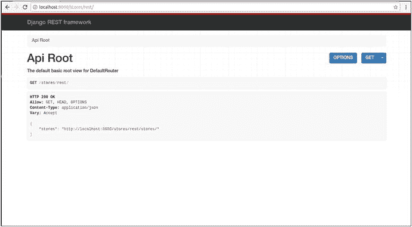

# 十二、Django 的 REST 服务

自 2000 年首次出现以来，表述性状态转移(REST)服务或简单的 RESTful 服务已经成为 web 开发中最流行的技术之一。关于 REST 服务有一个很长的背景故事，我不会在这里深入讨论，REST 服务在 web 开发中的吸引力和爆炸性增长仅仅是因为它们如何以一种简单和可重用的方式解决一个常见的问题。

在这一章中，您将了解到可用 Django 创建 REST 服务的选项，包括普通 Python/Django REST 服务和特定于框架的 REST 服务。此外，您将了解如何使用普通的 Python/Django 包创建 REST 服务，以及它们何时优于使用特定于框架的 REST 服务包。此外，您还将学习如何创建和使用用 Django REST 框架创建的 REST 服务的一些最重要的特性，以及将基本的安全性集成到 Django REST 框架服务中。

## Django 的 REST 服务

REST 服务通过端点或互联网 URL 提供对数据的访问，不假设谁使用它(例如，物联网设备、移动电话或桌面浏览器)；这意味着访问 REST 服务不需要任何设备或环境，您需要的只是互联网接入。

最重要的是，因为 REST 服务是在互联网 URL 上操作的，所以它们提供了一个非常直观的访问方案。例如，REST 服务 URL `/products/`可以表示“获取所有产品数据”，而 URL `/products/10/20/`可以表示获取价格在 10 到 20 之间的产品的所有数据，而 URL `/products/drinks/`可以获取饮料类别中的所有产品数据。

最后一种方法的强大之处在于，访问解决复杂数据查询的 REST 服务变体没有陡峭的学习曲线(例如，语言语法、复杂的业务逻辑)。由于这些特性和多功能性，REST 服务在许多领域和应用中都是可重用的数据骨干。例如，实际上整个 web API(应用编程接口)世界都是围绕 REST web 服务运行的，因为根据定义，API 必须为客户访问其功能提供一种设备/环境中立的方式。事实上，您访问的大多数网站很有可能以这样或那样的方式使用 REST 服务，这种做法允许网站运营商重用相同的数据，然后在桌面浏览器、物联网设备、移动应用、RSS 提要或任何其他目标(如加速移动页面(AMP))上为用户格式化数据。 <sup>2</sup>

简要概述了 REST 服务之后，让我们从在 Django 中创建 REST 服务的最简单的选项开始。

### 设计为 REST 服务的标准视图方法

您实际上可以在 Django 中创建一个 REST 服务，只需要 Django 包和 Python 的核心包，而不需要安装任何第三方包。清单 12-1 展示了一个标准的 Django url 和视图方法，它被设计成 REST 服务的功能。

```py
# urls.py (In stores app)
from coffeehouse.stores import views as stores_views

urlpatterns = [
    url(r'^rest/$',stores_views.rest_store,name="rest_index"),
]

# views.py (In stores app)
from django.http import HttpResponse
from coffeehouse.stores.models import Store
import json

def rest_store(request):
    store_list = Store.objects.all()
    store_names = [{"name":store.name} for store in store_list]
    return HttpResponse(json.dumps(store_names), content_type='application/json')

# Sample output
# [{"name": "Corporate"}, {"name": "Downtown"}, {"name": "Uptown"}, {"name": "Midtown"}]

Listing 12-1.Standard view method designed as REST service

```

清单 12-1 中的 url 语句定义了对`rest`目录下的`stores`应用的访问模式(即最终的 url `/stores/rest/`)。这最后一个 url 语句连接到`rest_store`视图方法——也在清单 12-1 中——该方法进行查询以从数据库中获取所有`Store`记录，然后创建一个列表理解以从结果查询中生成一个商店名称列表，最后使用 Django 的`HttpResponse`使用 Python 的`json`包返回一个带有商店名称的 JSON 响应。清单 12-1 中的设计是您可以在 Django 中创建的最简单的 REST 服务之一，并且有一些要点:

*   序列化。-请注意,`Store`查询并不直接用于响应，而是首先创建一个列表理解。这样做是为了将数据序列化为适当的格式。由于 Django 查询的构建方式，结果可能无法自然序列化，因此使用列表理解来确保数据是标准的 Python 字典，可以用 json 包转换成 JSON。在接下来的边栏中，我将提供更多的细节来说明为什么序列化是使用 REST 服务的一个重要部分。
*   响应处理。-注意使用 Django 的低级`HttpResponse`方法与 Django 更常用的`render()`方法来生成响应。虽然可以使用 Django 的`render()`方法，并进一步将数据传递给模板来格式化响应，但对于大多数 REST 服务来说，这是不必要的，因为响应往往是原始数据(例如 JSON、XML)，并且可以在没有支持模板的情况下生成。此外，注意清单 12-1 中的`HttpResponse`使用了`content_type`参数，该参数添加了 HTTP Content-Type `application/json`头，告诉请求方响应是 JSON。HTTP Content-Type 响应值很重要，因为它避免了消费者必须猜测如何处理 REST 服务响应(例如，另一个 Content-Type 选项可以是带有 XML 响应的 REST 服务的`application/xml`)。Django 视图方法的 HTTP 响应处理将在第二章中详细讨论。
*   (否)查询参数。-为了简单起见，清单 12-1 中的 view 方法没有参数，所以它提供了一个非常严格的输出(即所有存储都是 JSON 格式)。

Error: Is Not JSON/XML Serializable

在 Django 中创建 REST 服务时，最容易遇到的错误之一是“不是 JSON/XML 可序列化的”错误。这意味着 Django 不能将源数据序列化(即表示/转换)成所选择的格式——JSON 或 XML。当源数据由可能产生不确定或不明确的序列化结果的对象或数据类型组成时，会发生此错误。

比如你有一个`Store`带关系的模型类，Django 应该如何序列化这些关系？类似地，如果您有一个 Python `datetime`实例，Django 应该如何将值序列化为 DD/MM/YYYY、DD-MM-YYYY 或其他值？在任何情况下，Django 从不试图猜测序列化表示，所以除非源数据是自然可序列化的——如清单 12-1 所示——你必须显式指定一个序列化方案——我将在下面解释——否则你会得到“不是 JSON/XML 可序列化的”错误。

现在您已经对 Django 中的一个简单的 REST 服务有了一个简单的了解，让我们重新编写清单 12-1 中的 REST 服务，以利用参数，这样它就可以返回不同的数据结果和数据格式。

```py
# urls.py (In stores app)
from coffeehouse.stores import views as stores_views

urlpatterns = [
    url(r'^rest/$',stores_views.rest_store,name="rest_index"),
    url(r'^(?P<store_id>\d+)/rest/$',stores_views.rest_store,name="rest_detail"),

]

# views.py (In stores app)
from django.http import HttpResponse
from coffeehouse.stores.models import Store

from django.core import serializers

def rest_store(request,store_id=None):
    store_list = Store.objects.all()
    if store_id:

        store_list = store_list.filter(id=store_id)
    if 'type' in request.GET and request.GET['type'] == 'xml':
        serialized_stores = serializers.serialize('xml',store_list)

        return HttpResponse(serialized_stores, content_type='application/xml')
    else:
        serialized_stores = serializers.serialize('json',store_list)

        return HttpResponse(serialized_stores, content_type='application/json')

Listing 12-2.Standard view method as REST service with parameters and different output formats

```

清单 12-2 中的第一个不同之处是一个额外的 url 语句，它接受带有`store_id`参数的请求(例如，`/stores/1/rest/`，`/stores/2/rest/`)。在这种情况下，新的 url 由相同的`rest_store()`视图方法处理，以处理来自清单 12-1 (即`/stores/rest/`)的商店索引

接下来，清单 12-2 中的视图方法是清单 12-1 中视图方法的修改版本，它接受一个`store_id`参数。这个修改允许 REST 服务处理所有商店(例如，`/stores/rest/`)或单个商店(例如，`/stores/1/rest/`的商店号`1`)的 url 请求。如果你不熟悉如何用参数设置 Django urls，请参阅第二章，其中描述了 url 参数。

一旦进入 view 方法，就会执行一个查询，从数据库中获取所有的`Store`记录。如果该方法接收到一个`store_id`值，将对查询应用一个额外的过滤器，以将结果限制在给定的`store_id`内。由于 Django 查询的工作方式，最后一个查询逻辑非常有效——如果您不熟悉 Django 查询的行为，请参见第八章“理解查询集”一节。

接下来，对`request`进行检查，看它是否具有带有`xml`值的`type`参数。如果一个请求匹配最后一个规则(例如`/stores/rest/?type=xml`，那么为 REST 服务生成一个 XML 响应；如果它不符合最后一条规则，那么将为 REST 服务生成一个 JSON 响应(默认)。

虽然清单 12-2 中的例子也使用了`HttpResponse`和`content_type`参数，就像清单 12-1 一样，但是请注意，数据是用 Django 的`django.core.serializers`包准备的，该包旨在使数据序列化更容易——不像清单 12-1 中的 REST 服务需要用清单理解预处理查询数据，然后使用 Python 的`json`包来完成这个过程。

清单 12-2 中`django.core.serializers`的使用非常简单。使用了`serialize()`方法，该方法期望将序列化类型作为其第一个参数(例如，`'xml'`或`'json'`)，将要序列化的数据作为第二个参数(例如，表示查询的`store_list`引用)。在`django.core.serializers package`后面有更多的功能(例如过滤器)，为了简单起见，我不在这里探究，但是图 12-1 和 12-2 显示了来自清单 12-2 中 REST 服务的两个示例结果。


图 12-2。

XML output from Django REST service


图 12-1。

JSON output from Django REST serviceXML output from Django REST service

正如您在图 12-1 和 12-2 中看到的，Django 能够序列化一个查询，并以 JSON 或 XML 的形式将其结果输出为 REST 服务响应，只需清单 12-2 中的几行代码。清单 12-2 中的这几行代码可能会带您在 Django 中构建自己的 REST 服务，但是如果您从未做过 REST 服务或计划将 REST 服务作为应用或网站的核心，您应该停下来分析一下您的需求。

因为 REST 服务以一种简单且可重用的方式解决了一个常见的问题，所以它们容易受到范围蔓延的影响，这是一个变化似乎永无止境且功能总是“没有完全完成”的特征。看到这个最初的 Django REST 服务示例后，问自己以下问题:

*   您是否需要支持多个 Django 模型类型的 REST 服务？(例如，商店、饮料、员工)。
*   您需要将 JSON/XML 响应定制为不直接映射到 Django 模型记录的东西吗？(例如，使用自定义模式，过滤某些属性)。
*   是否需要为用户提供一个友好的界面，描述一个 REST 服务做什么，接受什么参数？
*   您是否需要支持某种身份验证机制，以便 REST 服务不公开可用？
*   您是否需要 REST 服务来支持不仅仅是显示数据或读取操作？(例如，更新和删除操作)？

如果你对前面的大部分问题回答是肯定的，那么你的 REST 服务已经超出了基本的范围。虽然您可以继续构建清单 12-2 中的例子——使用一个标准的 Django 视图方法和额外的 Python 包——来支持前面所有的场景，但是在 Django 中支持这些更复杂的 REST 服务特性是许多人以前走过的路，甚至有专门的框架来支持这个目的。

### Django REST 框架 <sup>3</sup>

Django REST 框架现在是它的第三个版本。与我刚才描述的从普通 Python/Django 包编写自己的 REST 服务相比，Django REST 框架提供了以下优势:

*   web 可浏览界面。-为所有 REST 服务提供用户友好的描述页面(例如，输入参数、选项)。类似于 Django admin 提供了一个几乎不费力的界面来查看 Django 项目的数据库，Django REST 框架为最终用户提供了一个几乎不费力的界面来发现 Django 项目的 REST 服务。
*   集成认证机制。-为了限制对 REST 服务的访问并节省集成认证逻辑的时间，Django REST 框架与 OAuth2、HTTP 签名、HTTP 摘要认证、JSON Web Token 认证和 HAWK (HTTP Holder-Of-Key 认证方案)等认证机制紧密集成。
*   更加灵活和复杂的序列化程序。-为了避免重新发明轮子和不断处理“不可序列化”的错误，Django REST 框架有自己的序列化器，用于处理复杂的数据关系。

这些只是使用 Django REST 框架的一些核心好处。如您所知，如果您计划创建多个 REST 服务，那么与使用普通 Python/Django 包处理部署 REST 服务所必需的搭建代码相比，花时间学习 Django REST 框架是非常值得的。

### 决哥打字框架

Django Tastypie 框架是作为 Django REST 框架的替代方案出现的。虽然 Django Tastypie 框架是 0.14 版本，但是不要让 1.0 之前的版本号欺骗了你:Django Tastypie 框架从 2010 年就开始开发了。虽然 Django Tastypie 框架和 Django REST 框架可能产生相同的结果，但是 Django Tastypie 框架有以下不同之处:

Tastypie 提供了更多的默认行为，使得配置和设置 REST 服务比使用 Django REST 框架更简单。

Tastypie 仍然是第二个最常用的 Django REST 包<sup>5</sup>——尽管它获得了 Django REST 框架一半的下载量——所以它仍然是许多 Django 项目的一个有吸引力的选择。

Tastypie 最初是由 Django haystack 的相同创建者开发的，Django haystack 仍然是最受欢迎的 Django 搜索包<sup>6</sup>——所以 Tastypie 在一些非常坚实的 Python/Django 基础上运行。

尽管 Django Tastypie 框架不像 Django REST 框架那样主流，但是如果您觉得用后者创建 REST 服务有些力不从心，您总是可以尝试前者以获得更快的 REST 解决方案，而不是用普通的 Python/Django 包从头开始构建您的 REST 服务。

## Django REST 框架概念和介绍

Django REST 框架以标准 Python 包的形式发布。所以要开始，你需要用命令:`pip install djangorestframework`安装 Django REST 框架。

一旦安装了 Django REST 框架包，将它添加到 Django 项目的`settings.py`文件中的`INSTALLED_APPS`列表变量中，文件名为`rest_framework`。一旦完成，您就可以开始使用 Django REST 框架了。接下来，让我们使用 Django REST 框架来浏览 REST 服务的核心概念和创建过程。

### 序列化程序和视图

序列化器是 Django REST 框架的主要构建块之一，用于定义数据记录的表示，通常基于 Django 模型。如前一节 Django REST 服务选项介绍中所述，Python 记录可以有不明确的数据表示(例如，带有`datetime`值的记录可以表示为 DD/MM/YYYY、DD-MM-YYYY 或 MM-YYYY ),序列化程序消除了如何表示记录的任何不确定性。清单 12-3 展示了一个使用其`serializers`包之一的 Django REST 框架序列化程序。

```py
# coffeehouse.stores.serializers.py file
from rest_framework import serializers

class StoreSerializer(serializers.Serializer):
    name = serializers.CharField(max_length=200)
    email = serializers.EmailField()

Listing 12-3.Serializer class based on Django REST framework

```

正如你在清单 12-3 中看到的，Django REST 框架序列化器是一个标准的 Python 类，在这种情况下，它从 Django REST 框架的`serializers.Serializer`类继承了它的行为。接下来，在 serializer 类中有一组字段，它们使用来自同一个 Django REST 框架的`serializers`包的数据类型。请注意这个 Django REST 框架序列化程序类和 Django 模型类或 Django 表单类之间的相似结构(即，它们从父类继承它们的行为，并使用不同的字段来表示不同的数据类型，如字符和电子邮件字段)。

清单 12-3 中的例子是最简单的 Django REST 框架序列化类之一，因为它只有两个字段，并且从最基本的`serializers.Serializer`类继承了它的行为。但是就像 Django 模型和表单一样，随着 Django REST 框架的发展，您会发现自己使用了更高级的数据类型，并且使用比`serializers.Serializer`更复杂的基类创建了序列化器。我将很快描述一个更高级的串行化器。接下来让我们在 Django REST 框架的上下文中探索一个视图。

序列化程序类本身什么也不做，必须与完成大部分 REST 服务逻辑(即处理传入请求、查询数据库中的数据)的视图集成，然后使用序列化程序来转换数据。在本章的第一节中，您了解了如何将一个常规的 Django 视图方法转换成 REST 服务。虽然完全可以在常规的 Django 视图方法中使用 Django REST 框架序列化程序类——如清单 12-3 所示——但是 Django REST 框架还提供了一个额外的视图语法——如清单 12-4 所示——以使构建 REST 服务变得更加容易。

```py
from coffeehouse.stores.models import Store
from coffeehouse.stores.serializers import StoreSerializer

from rest_framework.decorators import api_view
from rest_framework.response import Response

@api_view(['GET','POST','DELETE'])
def rest_store(request):
    if request.method == 'GET':
        stores = Store.objects.all()
        serializer = StoreSerializer(stores, many=True)
        return Response(serializer.data)
    elif request.method == 'POST':
        ... #logic for HTTP POST  operation
    elif request.method == 'DELETE':
        ... #logic for HTTP DELETE operation

Listing 12-4.Django view method decorated with Django REST framework

```

首先注意清单 12-4 中的方法是一个常规的 Django 视图方法，但是它使用了 Django REST 框架中的`@api_view`装饰器。`@api_view`的参数指示支持哪些 HTTP REST 方法——参见第二章或第六章了解 Django 或维基百科 REST 条目中 HTTP 方法主题的详细信息， <sup>7</sup> 因为 HTTP 方法是一个通用的 REST 概念，而不是 Django/REST 主题。接下来，在视图方法内部，执行一系列条件来处理构成 REST 服务的不同 HTTP 请求方法。

如果在 view 方法上发出 GET 请求，就会发出一个查询来获取所有的`Store`模型记录。然而，注意在清单 12-4 的例子中，它使用清单 12-3 中的`StoreSerializer`来转换 Django queryset。此外，`return`语句使用 Django REST 框架`Response`方法，而不是 Django 的标准`HttpResponse`或`render`方法。

更重要的是，注意清单 12-4 中的请求和响应逻辑都没有任何 REST 输出格式(例如 JSON、XML)。通过利用 Django REST 框架，您不再需要处理检测或处理输出格式的底层细节——这由 REST 框架直接负责，并且基于您如何向 REST 服务发出请求，我将很快对此进行描述。

接下来，清单 12-4 中的`rest_store()`视图方法必须被配置成可以通过 url 访问。添加到应用的`urls.py`文件中的一行类似于`url(r'^rest/$',stores_views.rest_store,name="rest_index")`的代码解决了这个问题。一旦你这样做了，如果你访问这个 URL，你会看到如图 12-3 所示的结果。


图 12-3。

Django REST framework main service response Caution

如果你得到的是错误`'TemplateDoesNotExist at /stores/rest/ rest_framework/api.html'`而不是图 12-3 中的页面，这意味着你没有将 REST 框架添加到你的项目的`INSTALLED_APPS`中，如本节开始所述(例如`INSTALLED_APPS = ['rest_framework']`)。

正如你在图 12-3 中看到的，REST 框架服务响应与 Django 的基本`HttpResponse`响应相比，信息非常丰富，非常漂亮，而 Django 的基本`HttpResponse`响应是由本章开始部分创建的 Django REST 服务生成的。

例如，您可以看到 REST 服务提供的不同选项，并通过几次点击来调用它的各种操作。还要注意，由于清单 12-3 中的`StoreSerializer`定义，REST 服务的输出只有带有两个字段的`Store`对象。接下来，让我们修改序列化程序类来输出完整的`Store`记录。清单 12-5 展示了一个基于清单 12-3 的更新后的序列化器类。

```py
from rest_framework import serializers

from coffeehouse.stores.models import Store

class StoreSerializer(serializers.ModelSerializer):
    class Meta:
        model = Store
        fields = '__all__'

Listing 12-5.Serializer class using Django model based on Django REST framework

```

为了序列化基于 Django `Store`模型的完整`Store`记录，清单 12-5 利用 Django REST 框架`ModelSerializer`类来简化序列化器语法。更重要的是，注意清单 12-5 中的 REST 框架`StoreSerializer`类如何使用与 Django 模型表单相同的语法，这些表单也是基于 Django 模型的。

在这种情况下，`StoreSerializer`类使用一个`Meta`类，其中`model`选项设置为`Store`以指定要序列化的 Django 模型，而`fields`选项设置为`__all__`以指示所有模型字段都应该序列化——注意,`fields`选项同样可以声明一个有限的模型字段名称列表，就像在模型表单中所做的那样。

有了清单 12-5 中的这个更加专门化的父序列化器`ModelSerializer`类——与清单 12-3 中的通用`Serializer`类相比——使用 Django REST 框架序列化用于 REST 服务的 Django 模型类就是这么简单。

但是，尽管这些 Django REST 框架序列化特性非常强大，而且清单 12-4 中使用的 Django REST 框架视图语法非常有用——减少了底层逻辑并提供了一个用户友好的界面——但是在视图方法中仍然有许多脚手架代码可以进一步削减。

为了进一步简化 REST 服务的构造，Django REST 框架可以利用基于类的视图。

### 基于类的视图

第二章介绍了 Django 基于类的视图的概念，第八章用基于类的视图扩展了这个主题，这些视图使用 Django 模型来执行 CRUD 操作。因为在 Django 中已经介绍了基于类的视图的原理，所以我假设您对这个主题有一个最低的熟悉程度；如果没有，那么回到其他章节学习基础知识。

清单 12-6 展示了一个基于 REST 框架类的基于类的视图，它简化了早期的标准视图方法——在清单 12-4 中——用 REST 框架中的`@api_view`修饰。

```py
from coffeehouse.stores.models import Store
from coffeehouse.stores.serializers import StoreSerializer

from rest_framework.views import APIView
from rest_framework.response import Response

class StoreList(APIView):

    def get(self, request, format=None):
        stores = Store.objects.all()
        serializer = StoreSerializer(stores, many=True)
        return Response(serializer.data)

    def post(self, request, format=None):
        ...
        #logic for HTTP POST operation

    def delete(self, request, format=None):
        ...
        #logic for HTTP DELETE operation

Listing 12-6.Django REST framework class-based views

```

注意清单 12-6 中的类是如何从 Django REST 框架`APIView`类继承其行为的。这使得该类可以包含代表每个 REST 服务的 HTTP 方法(即 GET、POST、DELETE)的各种方法，类似于处理多个 HTTP 方法(如表单处理)的标准 Django 基于类的视图。

正如您所看到的，与清单 12-4 中的常规 Django 视图方法相比，清单 12-6 产生了更具可读性的 REST 服务逻辑，后者要求您手动检查请求并执行条件语句。清单 12-6 中的`get`方法内部的逻辑使用了与清单 12-4 中相同的 Django REST 框架语法，所以没有什么新的东西。

同样，您必须将一个常规的 Django 视图方法连接到一个 url，您还必须关联一个 Django REST 框架的基于类的视图，以便在某个 url 上可以访问它。清单 12-7 展示了一个`urls.py`文件，它具有从清单 12-6 中访问 REST 服务基于类的视图的语法。

```py
from django.conf.urls import url
from coffeehouse.store import stores_views

urlpatterns = [
    url(r'^$',stores_views.index,name="index"),
    url(r'^rest/$',stores_views.StoreList.as_view(),name="rest_index"),    ]

Listing 12-7.Django URL definition linked to Django REST framework class-based views

```

在清单 12-7 中，您可以看到`urls.py`文件使用`as_view()`方法声明了`r'^rest/$'` url 模式被映射到 Django REST 框架`StoreList`类，这是所有基于 Django 类的视图将它们链接到 url 的主要方式。以这种方式，如果在`/stores/rest/` url 上发出 HTTP GET 请求，则由基于类的视图的`get()`方法处理，如果在同一`/stores/rest/`上发出 HTTP POST 请求，则由基于类的视图的`post()`方法处理。

值得一提的是，点击清单 12-6 中由 REST 框架基于类的视图支持的 url 也会产生如图 12-3 所示的相同界面，这是由清单 12-4 中的标准视图方法产生的。

现在，尽管 REST 框架基于类的视图有助于简化 REST 服务逻辑，但基于类的视图仍然需要您编写每个方法背后的所有逻辑。例如，在清单 12-6 中的`get()`方法中，执行一个查询来获取所有`Store`记录，然后序列化数据，最后返回一个响应。对于清单 12-6 中的`post()`方法，您同样需要用提供的数据插入/更新一个`Store`记录，而对于`delete()`方法，您需要用提供的数据删除一个`Store`记录。

一旦您用 Django REST 框架编写了几个基于类的视图，您就会意识到每种类型的视图方法背后都有一个固定的模式(例如，读取一个记录，序列化它，并返回一个响应)。除此之外，您还将认识到 REST 方法(例如 GET、POST 和 DELETE)和它们在 Django 模型上执行的操作(例如创建-读取-更新-删除(CRUD)操作)之间的密切关系。

为了避免为与 REST 服务相关联的不同 Django 对象不断编写相同的 CRUD 操作和样板逻辑，遵循 Django 的 DRY(不要重复自己)原则和 Django 的基于类的模型视图原则的 Django REST 框架提供了另一种构造:mixins。

### 混合和通用的基于类的视图

mixin 用于封装和重用相同的逻辑，并且能够在基于类的视图中使用它。例如，不是编写清单 12-6 中的相同逻辑——获取所有记录，序列化它们，并生成一个响应——针对不同的 REST 服务(例如，`Item`、`Drink,`或`Store`服务)反复进行；可以使用`mixins.ListModelMixin`类，快速达到同样的效果。

我不会在这里更详细地介绍 mixin 类，主要是因为 mixin 类不像其他 Django REST 框架选项那样被广泛使用，更不用说 Django mixins 已经在第九章使用模型的基于类的视图中描述过了。

对于大多数 Django framework REST 服务，要么使用基于类的视图——以获得对逻辑的完全控制——要么使用基于 mixins 的更简洁的方法，称为“混合通用类视图”。清单 12-8 基于清单 12-6 中基于类的视图展示了一个等价的混合通用类视图。

```py
from coffeehouse.stores.models import Store
from coffeehouse.stores.serializers import StoreSerializer

from rest_framework import generics

class StoreList(generics.ListCreateAPIView):
    queryset = Store.objects.all()
    serializer_class = StoreSerializer

Listing 12-8.Django mixed-in generic class views in Django REST framework

```

注意清单 12-8 甚至比之前相同 REST 服务的迭代更加简洁。在这种情况下，通用类名`ListCreateAPIView`表明了该类产生了什么——基于指定获取所有`Store`记录的`queryset`选项和指向清单 12-5 中的`StoreSerializer`类的`serializer`选项，生成一个列表的 REST 视图。

就像以前一样，即使您现在有一个由几行代码组成的 REST 服务，Django REST 框架也可以通过使用视图集和路由器来进一步扩展 Django 的 DRY 原则。

### 查看集合和路由器

清单 12-8 中的通用类视图对于仅仅三行代码来说已经非常强大了，但是它只是一个显示`Store`记录列表的类。假设您现在需要创建一个 REST 服务来显示特定的`Store`记录，创建另一个 REST 服务来更新`Store`记录，创建另一个 REST 服务来删除`Store`记录。在这种情况下，您将需要再创建三个通用类视图和三个 URL 映射来推出这个基本的 CRUD 功能。但是您可以依赖 Django REST 框架视图集，而不是为每种情况创建单独的视图类。

Django REST 框架视图集，顾名思义，就是一组视图。要创建 Django REST 框架视图集，您需要做的就是创建一个类，该类继承了 Django REST 框架中用于此目的的一个类的行为。清单 12-9 展示了用`ModelViewSet`类创建的视图集。

```py
from coffeehouse.stores.models import Store
from coffeehouse.stores.serializers import StoreSerializer

from rest_framework import viewsets

class StoreViewSet(viewsets.ModelViewSet):
    queryset = Store.objects.all()
    serializer_class = StoreSerializer

Listing 12-9.Django viewset class in Django REST framework

```

清单 12-9 和清单 12-8 中的 REST 服务类一样短，但是除了类名的变化，父类`ModelViewSet`继承的类给了这个 REST 服务一个全新的维度。单独使用这个类，REST 服务会自动显示一个`Store`记录列表，以及创建、读取、更新或删除单个`Store`记录。

因为一个视图集生成多个视图，所以仍然需要将每个视图配置到一个 url，在这种情况下，最简单的方法是使用 Django REST 框架路由器。路由器对于视图集就像 url 语句对于基于类的视图一样:一种连接端点的方式。清单 12-10 展示了用 Django REST 框架路由器设置的`urls.py`文件。

```py
from django.conf.urls import include, url
from coffeehouse.stores import views as stores_views

from rest_framework import routers

router = routers.DefaultRouter()
router.register(r'stores', stores_views.StoreViewSet)

urlpatterns = [
    url(r'^rest/', include(router.urls,namespace="rest")),
    ]

Listing 12-10.Django URL definition with Django REST framework router for view set

```

Caution

视图集和路由器的组合会自动创建敏感的 REST 端点(例如，删除和更新)，默认情况下，任何人都可以访问这些端点。参见下一节 REST 框架安全性来限制这些服务端点。

清单 12-10 中的第一步是用`routers.DefaultRouter()`初始化一个路由器，然后用它注册不同的视图集。正如您在清单 12-10 中看到的，`router`注册过程使用了接受两个参数的`router.register`方法:第一个参数表示 REST url 前缀——在本例中为`stores`——第二个参数指定视图集——在本例中为清单 12-9 中的`StoreViewSet`类。

接下来，你可以看到`router`是使用 Django 的标准`url`和`include`方法赋值的。在这种情况下，路由器实例被分配在`r'^rest/'` url 下，这意味着`Store`视图集的最终根 url 变成了`/rest/stores/`，如图 12-4 所示。



图 12-4。

Django REST framework view set main page

如图 12-4 所示，REST 框架呈现了一个默认的 Api 根页面。您可以进一步导航到 Api 根页面下的其他 URL(即`/stores/rest/`)来执行与视图集相关联的其他 CRUD 操作(例如，对`/stores/rest/stores/`的 HTTP GET 请求以获取所有`Store`记录的列表，对`/stores/rest/stores/1/`的 HTTP GET 请求以获取带有`id=1,`的`Store`记录，或者对`/stores/rest/stores/2/`的 HTTP DELETE 请求以删除带有`id=3`的`Store`记录)。

通过对视图集和路由器的描述，我们总结了用 Django REST 框架建立 REST 服务所需的基本概念。现在您已经熟悉了基础知识，在下一节中，您将学习如何保护用 Django REST 框架构建的 REST 服务。

## Django REST 框架安全性

虽然 Django REST 框架为创建允许访问应用数据的 REST 服务节省了大量时间，但是您需要小心不要无意中允许访问数据或功能。对 Django REST 框架使用错误的类或配置参数会使您的应用面临安全风险，尽管 Django REST 框架从根本上来说是安全的。

### 设置 REST 框架服务权限

默认情况下，所有 REST 框架服务都对任何人开放，只要他们知道或发现一个 REST 服务端点(即 url)。虽然这种默认行为很方便，但它也可能是一个严重的安全威胁，特别是当您创建带有敏感操作(例如，更新或删除操作)或视图集的 REST 框架服务时——比如清单 12-9 中的视图集——它们会自动创建支持敏感操作的端点。

默认的 REST 框架权限可以通过`setting.py`文件中的`REST_FRAMEWORK`变量，通过`DEFAULT_PERMISSION_CLASSES`选项来配置。开箱即用，REST 框架将该选项设置为使用`rest_framework.permissions.AllowAny`类，如下面的代码片段所示:

```py
REST_FRAMEWORK = {
    'DEFAULT_PERMISSION_CLASSES': (
        'rest_framework.permissions.AllowAny',
    )
}

```

这意味着除非您在 Django 项目的`settings.py`文件中定义了一个`DEFAULT_PERMISSION_CLASSES`选项，否则所有的 REST 框架服务都是对公众开放的。为了禁止公众访问 REST 服务，您可以更改 REST 框架的默认权限策略。

清单 12-11 展示了设置为`rest_framework.permissions.IsAuthenticated`类的`DEFAULT_PERMISSION_CLASSES`选项，它强制规定只有通过 Django 的内置用户系统登录的用户——在第十章中描述——才被允许访问 REST 框架服务。

```py
REST_FRAMEWORK = {
    'DEFAULT_PERMISSION_CLASSES': (
        'rest_framework.permissions.IsAuthenticated',
    )
}
Listing 12-11.Django REST framework set to restrict all services to authenticated users

```

除了`rest_framework.permissions.IsAuthenticated`类，REST 框架还支持表 12-1 中的类成为`DEFAULT_PERMISSION_CLASSES`选项的一部分。

表 12-1。

Django REST framework permission classes

<colgroup><col> <col></colgroup> 
| REST 框架权限类 | 描述 |
| --- | --- |
| rest _ framework . permissions . allow any | (默认)允许任何人访问。 |
| rest _ framework . permissions . is 已验证 | 允许通过 Django 的内置用户系统访问登录的用户。 |
| rest _ framework . permissions . isadminuser | 基于 Django 的内置用户系统，允许访问 Django 管理员用户。 |
| rest _ framework . permissions . isauthenticedorreadonly | 允许任何人(无论是否登录)进行读取访问，但需要登录才能执行非读取操作。 |
| rest _ framework . permissions . djangodelpermissions | 允许登录用户访问，但也要求所述用户具有必要的添加/更改/删除模型权限，REST 服务可以在这些权限上操作。 |
| rest _ framework . permissions . djangodelpermissionsoranonreadonly | 就像 DjangoModelPermissions 类一样，但是允许任何人(无论是否登录)进行读取访问。 |
| rest _ framework . permissions . djangobjectpermissions | 类似于 DjangoModelPermissions 类，除了它在 REST 服务操作的模型上处理每个对象的权限。 |

如表 12-1 所示，REST 框架提供了各种类来设置项目中所有 REST 服务的默认访问权限。例如，如果您允许公共读取访问项目的 REST 服务，但是想要限制更敏感的 REST 服务操作，那么表 12-1 中的`IsAuthenticatedOrReadOnly`和`DjangoModelPermissionsOrAnonReadOnly`类是`DEFAULT_PERMISSION_CLASSES`选项的很好的替代。

尽管如此，通过依赖于`DEFAULT_PERMISSION_CLASSES`选项，您给了项目中的每个 REST 服务相同的访问权限。如果想为一两个服务提供更灵活或更严格的权限策略呢？REST 框架还支持在单个 REST 服务上指定更细粒度的权限，使用表 12-1 中的相同类。

清单 12-12 展示了清单 12-4 中 REST 服务的一个修改版本，它使用`@permission_classes` decorator 来指定一个不同于全局`DEFAULT_PERMISSION_CLASSES`选项的权限策略。

```py
from coffeehouse.stores.models import Store
from coffeehouse.stores.serializers import StoreSerializer

from rest_framework.decorators import api_view, permission_classes

from rest_framework.permissions import IsAuthenticated

from rest_framework.response import Response

@api_view(['GET','POST','DELETE'])

@permission_classes((IsAuthenticated, ))

def rest_store(request):
    if request.method == 'GET':
        stores = Store.objects.all()
        serializer = StoreSerializer(stores, many=True)
        return Response(serializer.data)

Listing 12-12.Django view method decorated with Django REST framework and @permission_classes decorator

```

在清单 12-12 中可以看到，标准视图方法除了用`@api_view`修饰外，还用`@permission_classes`修饰。在这种情况下，`@permission_classes`装饰器被设置为`IsAuthenticated`类值，确保这个 REST 服务权限策略优先于`DEFAULT_PERMISSION_CLASSES`选项中的默认服务权限。

清单 12-13 展示了清单 12-9 中 REST 服务的一个修改版本，它使用 permission_classes 字段来指定一个不同于全局`DEFAULT_PERMISSION_CLASSES`选项的权限策略。

```py
from coffeehouse.stores.models import Store
from coffeehouse.stores.serializers import StoreSerializer

from rest_framework.permissions import IsAuthenticated

from rest_framework import viewsets

class StoreViewSet(viewsets.ModelViewSet):
    permission_classes = (IsAuthenticated,)

    queryset = Store.objects.all()
    serializer_class = StoreSerializer

Listing 12-13.Django viewset class in Django REST framework and permission_classes field

```

正如您在清单 12-13 中看到的，REST 框架视图集方法利用了`permission_classes`字段。在这种情况下，`permission_classes`字段用`IsAuthenticated`类值设置，确保这个 REST 服务权限策略优先于`DEFAULT_PERMISSION_CLASSES`选项中的默认服务权限。

### 设置 REST 框架登录页面

默认情况下，如果用户试图通过浏览器访问 REST 框架，并且没有必要的权限，那么用户会看到一个警告页面，如图 12-5 所示。


图 12-5。

Django REST framework access denied page

尽管图 12-5 代表了一个标准的拒绝访问页面，但它有一个明显的遗漏:这是一个没有链接让用户登录的死胡同。如果用户到达图 12-5 中的页面，他需要手动进入应用或 Django 管理中的 Django 登录页面，提供他的凭证，然后返回 REST 服务来访问它。

最后一个工作流给用户造成了不必要的负担，这就是为什么 REST 框架提供了一种集成登录页面的简单方法——包括所有页面上的登录/注销链接——它直接绑定到 Django admin 的相同认证后端。

清单 12-14 展示了 Django 项目的 main urls.py，它声明了 REST 框架的 URL 以自动激活其内置的登录页面和链接。

```py
from django.conf.urls import include, url
urlpatterns = [
    url(r'^rest-auth/', include('rest_framework.urls',namespace='rest_framework')),
]
Listing 12-14.Django REST framework url declaration

to enable log in

```

在清单 12-14 中，你可以看到`rest_framework.urls`配置了 Django 的标准`include()`语句和`namespace`参数，此外还配置了`rest-auth/` url，最后一个可以更改为你选择的任何 url 模式。

通过添加到 Django 项目的主`urls.py`文件中，所有 REST 框架页面都在右上角生成了一个登录链接，该链接将用户带到 url 配置的登录路径下的一个可访问的登录页面(例如，如果是`url(r'^rest-auth/')`，则登录页面在`/rest-auth/login/`可用)。

Enhanced Rest Framework User Interface Options

尽管 REST 框架提供的内置用户界面(UI)提供了比呈现原始数据 REST 服务输出更好的选择，如图 12-3 到 12-5 所示，如图 12-1 和 12-2 所示，但与更现代的 UI web 布局相比，REST 框架 UI 仍然相当初级。

REST 框架 UI 有多种替代方式，它们是专门为使用 REST 框架而设计的。一些比较成熟的项目包括 Django REST Swagger<sup>8</sup>和 DRF Docs。 <sup>9</sup>

Footnotes 1

[`https://en.wikipedia.org/wiki/Representational_state_transfer`](https://en.wikipedia.org/wiki/Representational_state_transfer)

  2

[`https://www.ampproject.org/`](https://www.ampproject.org/)

  3

[`http://www.django-rest-framework.org/`](http://www.django-rest-framework.org/)

  4

[`http://tastypieapi.org/`](http://tastypieapi.org/)

  5

[`https://djangopackages.org/grids/g/rest/`](https://djangopackages.org/grids/g/rest/)

  6

[`https://djangopackages.org/grids/g/search/`](https://djangopackages.org/grids/g/search/)

  7

[`https://en.wikipedia.org/wiki/Hypertext_Transfer_Protocol#Request_methods`](https://en.wikipedia.org/wiki/Hypertext_Transfer_Protocol#Request_methods)

  8

[`http://marcgibbons.github.io/django-rest-swagger/`](http://marcgibbons.github.io/django-rest-swagger/)

  9

[`http://drfdocs.com/`](http://drfdocs.com/)