# 1.从烧瓶开始

Flask 是一个 BSD 许可的 Python 微框架，基于 Werkzeug 和 Jinja2。作为一个微框架并不会降低它的功能性；Flask 是一个非常简单但高度可扩展的框架。这使得开发人员能够选择他们想要的配置，从而使编写应用程序或插件变得容易。Flask 最初是由 Pocoo(一个开源开发团队)在 2010 年创建的，现在由 Pallets 项目开发和维护，该项目为 Flask 背后的所有组件提供动力。Flask 由一个活跃的、有帮助的开发者社区支持，包括一个活跃的 IRC 频道和一个邮件列表。

## 烧瓶简介

Flask 有两个主要组件，Werkzeug 和 Jinja2。Werkzeug 负责提供路由、调试和 Web 服务器网关接口(WSGI)，而 Flask 利用 Jinja2 作为模板引擎。Flask 本身不支持数据库访问、用户认证或任何其他高级实用程序，但它支持扩展集成来添加所有这些功能，这使 Flask 成为一个用于开发 web 应用程序和服务的微型生产就绪框架。一个简单的 Flask 应用程序可以放入一个 Python 文件中，也可以模块化来创建一个生产就绪的应用程序。Flask 背后的想法是为所有的应用程序建立一个良好的基础，把其他的一切都留在扩展上。

Flask 社区非常大，并且非常活跃，有数百个开源扩展。Flask 核心团队不断审查扩展，并确保批准的扩展与未来版本兼容。Flask 作为一个微框架，为开发人员提供了选择适合他们项目的设计决策的灵活性。它维护一个定期更新和持续维护的扩展注册表。

### 起始烧瓶

Flask 就像所有其他 Python 库一样，可以从 Python 包索引(PPI)安装，并且非常容易设置和开始开发，只需要几分钟就可以开始使用 Flask。为了能够理解这本书，你应该熟悉 Python、命令行(或者至少是 PIP)和 MySQL。

正如承诺的那样，Flask 非常容易上手，仅五行代码就可以让您开始使用一个最小的 Flask 应用程序。

```py
from flask import Flask
app = Flask(__name__)

@app.route('/')
def hello_world():
    return 'Hello, From Flask!'

if __name__== '__main__':
      app.run()

Listing 1-1Basic Flask Application

```

前面的代码导入 Flask 库，通过创建 Flask 类的实例启动应用程序，声明路由，然后定义调用路由时要执行的函数。这段代码足以启动您的第一个 Flask 应用程序。

下面的代码启动了一个非常简单的内置服务器，这对于测试来说已经足够好了，但是当您想要投入生产时，可能就不行了，但是我们将在后面的章节中介绍这一点。

当该应用程序启动时，索引路由将根据请求返回“您好，来自 Flask！”如图 [1-1](#Fig1) 所示。

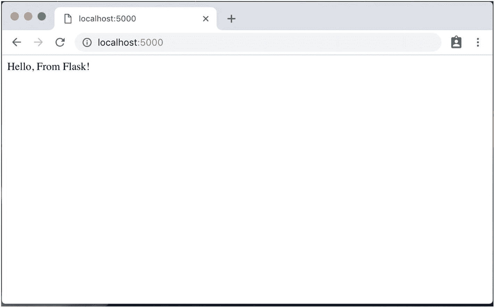

图 1-1

烧瓶最小应用

### 本书涵盖的烧瓶组件

既然已经向您介绍了 Flask，我们将讨论本书 Flask REST API 开发中涉及的组件。

这本书将作为使用 Flask 开发 REST API 的实用指南，我们将使用 MySQL 作为后端数据库。正如已经讨论过的，Flask 没有自带数据库访问支持，为了弥补这一缺陷，我们将使用一个名为 Flask-SQLAlchemy 的 Flask 扩展，它在 Flask 中增加了对 SQLAlchemy 的支持。SQLAlchemy 本质上是一个 Python SQL 工具包和对象关系映射器，它为开发人员提供了 SQL 的全部功能和灵活性。

SQLAlchemy 提供了对企业级设计模式的全面支持，是为高性能数据库访问而设计的，同时保持了效率和易用性。我们将构建一个用户认证模块，CRUD(创建、读取、更新和删除)REST APIs，用于对象创建、检索、操作和删除。我们还将集成一个名为 Swagger 的文档实用程序，用于创建 API 文档、编写单元和集成测试、学习应用程序调试，最后，了解在云平台上部署和监控 REST APIs 以供生产使用的不同方法。

对于单元测试，我们将使用 pytest，这是一个全功能的 Python 测试工具——pytest 易于编写测试，并且可扩展以支持复杂的用例。我们还将使用 Postman，它是一个完整的 REST API 平台——Postman 为 API 生命周期的每个阶段提供集成工具，使 API 开发更容易、更可靠。

API 部署和监控是 REST API 开发的关键部分；当谈到为生产用例扩展 API 时，开发范式发生了巨大的变化，为了本书，我们将使用 uWSGI 和 Nginx 在云 Ubuntu 服务器上部署我们的 REST APIs。我们还将在 Heroku 上部署 REST APIs，Heroku 是一个云平台，有助于 Flask 应用程序的部署和开箱即用。

最后但同样重要的是，我们将讨论调试常见的 Flask 错误和警告，调试 Nginx 请求，并检查 Flask 应用程序监控，以确保生产使用的停机时间最少。

## RESTful 服务简介

表述性状态转移(REST)是 web 服务的一种软件架构风格，它为不同类型的系统之间的数据通信提供了标准。Web 服务是开放的标准 web 应用程序，它以交换数据为目的与其他应用程序进行交互，使其成为现代 web 和移动应用程序中客户端服务器架构的重要组成部分。简而言之，REST 是为了计算机系统之间的互操作性而在 Web 上交换数据的标准。符合 REST 架构风格的 Web 服务被称为 RESTful web 服务，它允许请求系统使用一组统一的、预定义的无状态操作来访问和操作数据。

自从 Roy Feilding 在 2000 年提出 RESTful 架构以来，RESTful 架构已经有了很大的发展，并且已经在数百万个系统中实现。REST 现在已经成为基于 web 的应用程序的最重要的技术之一，并且随着它在移动和基于物联网的应用程序中的集成，可能会增长得更快。每一种主要的开发语言都有构建 REST web 服务的框架。REST 原则是它受欢迎和被大量使用的原因。REST 是无状态的，这使得任何类型的系统都可以直接使用 REST，并且每个请求都可以由不同的系统提供服务。

REST 使我们能够区分客户机和服务器，让我们独立地实现客户机和服务器。REST 最重要的特性是它的无状态性，也就是说客户机和服务器都不需要知道对方的状态就可以进行通信。这样，客户端和服务器都可以理解接收到的任何消息，而无需查看之前的消息。既然我们在讨论 RESTful web 服务，那么让我们深入 web 服务并比较其他 web 服务标准。

简单地说，Web 服务是一种由一个电子设备向另一个电子设备提供的服务，能够通过万维网进行通信。在实践中，web 服务提供面向资源的、基于 web 的接口给数据库服务器，并由另一个 web 客户机使用。Web 服务为不同类型的系统相互通信提供了一个平台，使用一种解决方案，程序能够以它们理解的语言相互通信(图 [1-2](#Fig2) )。

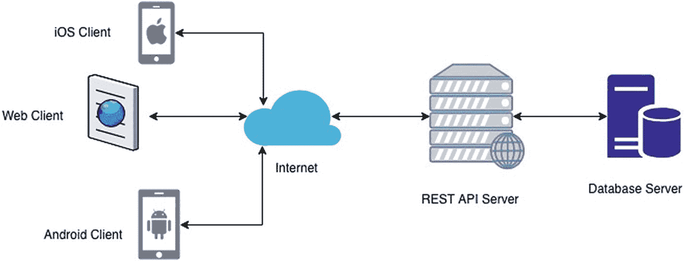

图 1-2

REST 架构图

SOAP(简单对象访问协议)是另一种 web 服务通信协议，近年来已经被 REST 取代。根据 Stormpath 的数据，REST 服务现在主导着这个行业，代表了超过 70%的公共 API。它们通过公开一致的接口来访问命名资源。然而，SOAP 将应用程序逻辑的组件公开为服务，而不是数据。SOAP 现在是最初由微软创建的遗留协议，与 REST 相比，它有许多其他限制。SOAP 只通过 XML 交换数据，REST 提供了通过各种数据格式交换数据的能力。RESTful 服务相对来说速度更快，资源消耗更少。然而，SOAP 仍然有自己的用例，在这些用例中，它是比 REST 更受欢迎的协议。

当健壮的安全性至关重要时，最好使用 SOAP，因为它提供了对 web 服务安全性(WS-Security)的支持，这是一种规范，定义了如何在 Web 服务中实现安全措施以保护它们免受外部攻击。SOAP 优于 REST 的另一个优点是它内置的重试逻辑，可以补偿失败的请求，这与 REST 不同，REST 中客户端必须通过重试来处理失败的请求。SOAP 与其他技术和协议(如 WS-Security、WS-addressing、WS-coordination 等)高度可扩展，这使它比其他 web 服务协议更具优势。

现在，当我们简要讨论了 web 服务——REST 和 SOAP——之后，让我们来讨论 REST 协议的特性。一般来说，REST 服务是使用以下特性定义和实现的:

1.  统一界面

2.  陈述

3.  信息

4.  资源之间的链接

5.  贮藏

6.  无国籍的

### 统一界面

RESTful 服务应该有一个统一的接口来访问资源，顾名思义，API 的系统接口在整个系统中应该是统一的。一个具有统一的获取和操作数据方式的逻辑 URI 系统使得 REST 易于使用。HTTP/1.1 提供了一组处理基于名词的资源的方法；为此，这些方法通常被称为动词。

在 REST 架构中，有一个安全和幂等方法的概念。安全方法是不像 GET 或 HEAD 方法那样修改资源的方法。幂等方法是一种无论执行多少次都会产生相同结果的方法。表 [1-1](#Tab1) 提供了 RESTful 服务中常用的 HTTP 动词列表。

表 1-1

RESTful 服务中常用的 HTTP 动词

<colgroup><col class="tcol1 align-left"> <col class="tcol2 align-left"> <col class="tcol3 align-left"> <col class="tcol4 align-left"> <col class="tcol5 align-left"></colgroup> 
| 

动词

 | 

create, read, update, and delete

 | 

操作

 | 

安全的

 | 

幂等

 |
| --- | --- | --- | --- | --- |
| 得到 | 阅读 | 获取单个或多个资源 | 是 | 是 |
| 邮政 | 创造 | 插入新资源 | 不 | 不 |
| 放 | 更新/创建 | 插入新资源或更新现有资源 | 不 | 是 |
| 删除 | 删除 | 删除单个或多个资源 | 不 | 是 |
| 选择 | 阅读 | 列出资源上允许的操作 | 是 | 是 |
| 头 | 阅读 | 只返回响应头，不返回正文 | 是 | 是 |
| 修补 | 更新/修改 | 仅更新对资源提供的更改 | 不 | 不 |

### 陈述

RESTful 服务关注资源并提供对资源的访问。在 OOP 中，资源很容易被认为是一个对象。设计 RESTful 服务时要做的第一件事是识别不同的资源并确定它们之间的关系。表示是定义资源当前状态的机器可读解释。

一旦确定了资源，下一步就是表示。REST 让我们能够使用任何格式来表示系统中的资源。不像 SOAP 限制我们使用 XML 来表示数据，我们可以使用 JSON 或者 XML。通常，JSON 是表示移动或 web 客户端调用的资源的首选方法，但是 XML 可以用来表示更复杂的资源。

下面是一个用两种格式表示资源的小例子。

```py
{
      "ID": "1",
      "Name": "Building REST APIs wiith Flask",
      "Author": "Kunal Relan",
      "Publisher": "Apress"
}

In REST Systems, you can use either of the methods or both the methods depending on the requesting client to represent the data.

Listing 1-3JSON Representation of a Book resource

```

```py
<?xml version="1.0" encoding="UTF-8"?>
<Book>
  <ID> 1 </ID>
  <Name> Building REST APIs with Flask </Name>
  <Author> Kunal Relan </Author>
  <Publisher > Apress </ Publisher >
</Book>

Listing 1-2XML Representation of a Book Resource

```

### 信息

在 REST 架构中，消息是一个重要的关键，它本质上建立了客户机-服务器风格的数据通信方式。客户端和服务器通过消息相互通信，其中客户端向服务器发送消息，这通常被称为请求，而服务器发送响应。除了客户端和服务器之间以请求和响应主体的形式交换的实际数据之外，客户端和服务器还以请求和响应头的形式交换一些元数据。HTTP 1.1 以如下方式定义了请求和响应头格式，以便在不同种类的系统之间实现统一的数据通信方式(图 [1-3](#Fig3) )。

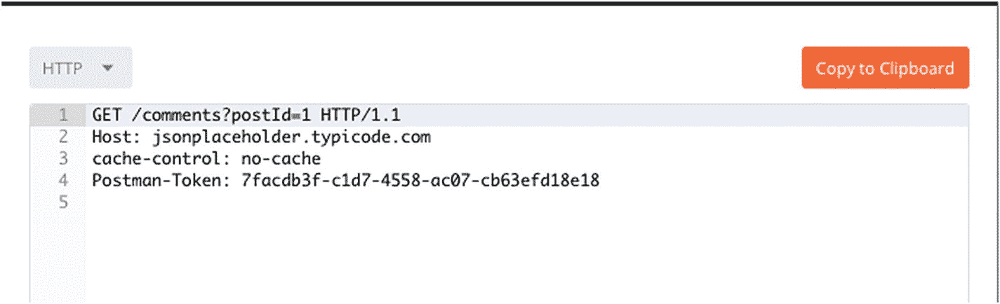

图 1-3

HTTP 示例请求

在图 [1-4](#Fig4) 中，GET 是请求方法，“/comments”是服务器中的路径，“postId=1”是请求参数，“HTTP/1.1”是客户端正在请求的协议版本，“jsonplaceholder.typicode.com”是服务器主机，内容类型是请求头的一部分。所有这些结合起来就是服务器能够理解的 HTTP 请求。

作为回报，HTTP 服务器发送对所请求资源的响应。

```py
[
  {
    "postId": 1,
    "id": 1,
    "name": "id labore ex et quam laborum",
    "email": "Eliseo@gardner.biz",
    "body": "laudantium enim quasi est quidem magnam voluptate ipsam eos\ntempora quo necessitatibus\ndolor quam autem quasi\nreiciendis et nam sapiente accusantium"
  },
  {
    "postId": 1,
    "id": 2,
    "name": "quo vero reiciendis velit similique earum",
    "email": "Jayne_Kuhic@sydney.com",
    "body": "est natus enim nihil est dolore omnis voluptatem numquam\net omnis occaecati quod ullam at\nvoluptatem error expedita pariatur\nnihil sint nostrum voluptatem reiciendis et"
  },
  {
    "postId": 1,
    "id": 3,
    "name": "odio adipisci rerum aut animi",
    "email": "Nikita@garfield.biz",
    "body": "quia molestiae reprehenderit quasi aspernatur\naut expedita occaecati aliquam eveniet laudantium\nomnis quibusdam

delectus saepe quia accusamus maiores nam est\ncum et ducimus et vero voluptates excepturi deleniti ratione"
  },
  {
    "postId": 1,
    "id": 4,
    "name": "alias odio sit",
    "email": "Lew@alysha.tv",
    "body": "non et atque\noccaecati deserunt quas accusantium unde odit nobis qui voluptatem\nquia voluptas consequuntur itaque dolor\net qui rerum deleniti ut occaecati"
  },
  {
    "postId": 1,
    "id": 5,
    "name": "vero eaque aliquid doloribus et culpa",
    "email": "Hayden@althea.biz",
    "body": "harum non quasi et ratione\ntempore iure ex voluptates in ratione\nharum architecto fugit inventore cupiditate\nvoluptates magni quo et"
  }]

```

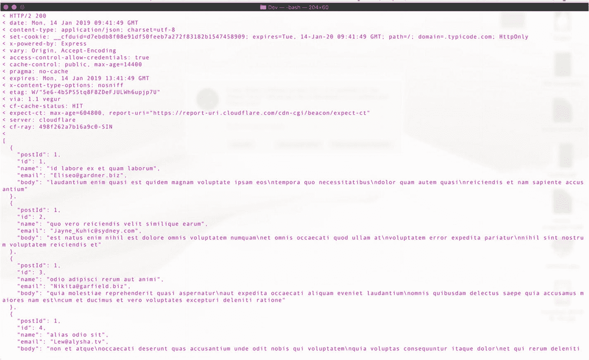

图 1-4

HTTP 示例响应

在上图中，“HTTP/2”是响应 HTTP 版本，“200”是响应代码。“cf-ray”下面的部分是响应头，“cf-ray”下面的 post 注释数组是请求的响应体。

### 资源之间的链接

资源是 REST 架构世界中的基本概念。资源是一个具有类型、相关数据、与其他资源的关系以及一组可以在其上执行的方法的对象。REST API 中的资源可以包含到应该驱动流程流的其他资源的链接。例如在 HTML 网页中，主页中的链接驱动用户流，REST API 中的资源应该能够在用户不知道流程图的情况下驱动用户流。

```py
{
      "ID": "1",
      "Name": "Building REST APIs wiith Flask",
      "Author": "Kunal Relan",
      "Publisher": "Apress",
       "URI" : "https://apress.com/us/book/123456789"
}

Listing 1-4A Book with Link to Buy

```

### 贮藏

缓存是一种技术，它存储给定资源的副本，并在请求时返回，从而节省额外的数据库调用和处理时间。它可以在不同的层次上完成，如客户机、服务器或中间件代理服务器。缓存是提高 API 性能和扩展应用程序的重要工具；但是，如果管理不当，会导致向客户端提供旧的结果。REST APIs 中的缓存是使用 HTTP 头来控制的。缓存头是 HTTP 头规范的重要组成部分，也是高效扩展 web 服务的重要组成部分。在 REST 规范中，当在资源 URL 上使用安全方法时，反向代理通常会缓存结果，以便在下次请求相同的资源时使用缓存的数据。

### 无国籍的

> 从客户端到服务器的每个请求都必须包含理解请求所需的所有信息，并且不能利用服务器上存储的任何上下文。因此，会话状态完全保存在客户端
> 
> —罗伊·菲尔丁

这里的无状态意味着每个 HTTP 响应本身是一个完整的实体，足以提供要执行的信息，而不需要另一个 HTTP 请求。无状态的意义在于破坏了与服务器保持一致的目的，即允许基础设施具有预期的灵活性。为了方便起见，REST 服务器在 HTTP 响应中提供了客户机可能需要的足够信息。无状态是能够扩展基础设施的重要部分，使我们能够部署多个服务器来服务数百万并发用户，因为不存在服务器会话状态依赖性。它还支持 REST 基础设施的缓存特性，因为它让缓存服务器决定是否缓存请求，只需查看特定的请求，而不考虑之前的任何请求。

### 规划 REST API

下面是我们在计划创建 REST APIs 时需要检查的事项列表:

1.  理解用例。知道你为什么要构建 API 以及 API 将提供什么服务是非常重要的。

2.  列出 API 特性来理解你的 API 将要做的所有动作。这还包括列出行动，并将它们组合在一起，以处理冗余的端点。

3.  确定将使用 API 的不同平台，并相应地提供支持。

4.  对支持增长和扩展基础架构进行长期规划。

5.  规划 API 版本控制策略，确保对不同版本的 API 提供持续支持。

6.  规划 API 访问策略，即身份验证、ACL 和限制。

7.  计划 API 文档和测试。

8.  理解如何在你的 API 中使用超媒体。

因此，这是在规划你的 API 时需要确保的八件重要的事情，并且对于开发一个稳定的、以生产为中心的 API 系统是非常关键的。

### API 设计

现在让我们来看看 API 设计。在这里，我们将讨论设计 REST APIs 的标准，记住我们刚刚谈到的一系列事情。

#### 长期实施

长期实施帮助你在实际实施前分析设计上的缺陷。这有助于开发人员选择合适的平台和工具，以确保相同的系统以后可以扩展到更多的用户。

#### 规格驱动开发

规范驱动的开发使用定义而不仅仅是代码来实施 API 设计，这确保了在 API 设计完好无损的情况下对代码库进行更改。使用像 API Designer 这样的工具在开发之前理解 API 设计是一个很好的实践，这也可以让你预见缺陷。像 swagger 或 RAML 这样的工具可以让您保持 API 设计的标准化，并在需要时将 API 移植到不同的平台上。

#### 样机研究

一旦 API 规范到位，原型设计就可以让开发人员创建模拟 API，帮助他们理解 API 的每个潜在方面，从而帮助您在实际开发之前将 API 可视化。

#### 认证和授权

身份验证涉及到知道这个人是谁的验证过程，但它还不涉及授予对所有资源的访问权，这就是授权的由来，它涉及到授权经过身份验证的人使用访问控制列表(ACL)检查允许访问的资源。

我们有不同的用户认证和授权方式，如基本认证、HMAC 和 OAuth。然而，OAuth 2.0 是实现这一点的首选方法，并且是企业和小公司在其 REST APIs 中用于身份验证和授权的标准协议。

所以，这些是 REST 基础设施的关键特性，我们将在后面的章节中更多地讨论 REST 是如何工作的以及如何实现更好的通信。

现在，我们将开始设置我们的开发环境，并了解使用 Python 开发应用程序的一些关键因素。

## 设置开发环境

在这一部分中，我们将讨论为 Flask 应用程序设置 Python 开发环境。我们将使用虚拟环境作为我们的依赖项的独立隔离环境。在设置开发环境的过程中，我们将使用 PIP 来安装和管理我们的依赖项以及一些其他有用的实用程序。为了这本书，我们将在 macOS Mojave 和 Python 2.7 上做所有的事情，但是你可以根据自己的方便随意使用任何操作系统。因此，如果您的操作系统中没有安装 Python 的正确版本，您可以使用此链接继续在您选择的操作系统上安装 Python:[`www.python.org/downloads/`](https://www.python.org/downloads/)(图 [1-5](#Fig5) )。

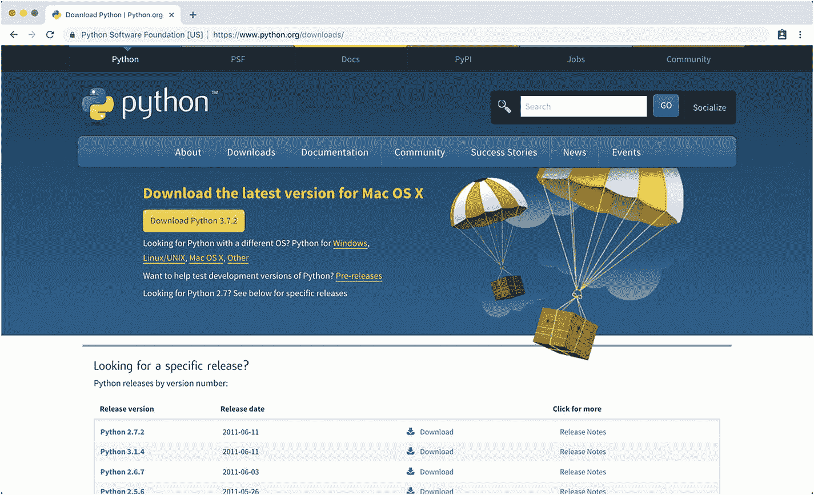

图 1-5

Python 下载

### 使用 PIP

PIP 是 PyPi 推荐的项目依赖管理工具。如果您使用从 [`www.python.org`](http://www.python.org) 下载的 Python，PIP 会预装 Python。

但是，如果您的系统中没有安装 PIP，请按照此处的指南安装 PIP。

要安装 PIP，请在终端中使用以下命令(或 Windows 中的命令行)下载 get-pip.py。

```py
$ curl https://bootstrap.pypa.io/get-pip.py -o get-pip.py

```

获得 get-pip.py 文件后，安装并运行下一个命令:

```py
$ python get-pip.py

```

前面的命令将安装 PIP、setuptools(安装源发行版所需的)和 wheel。

如果您已经有 pip，您可以使用以下命令升级到 PIP 的最新版本:

```py
$ pip install -U pip

```

要测试您的安装，您应该在您的终端(或 Windows 中的命令行)中运行以下命令(图 [1-6](#Fig6) ):

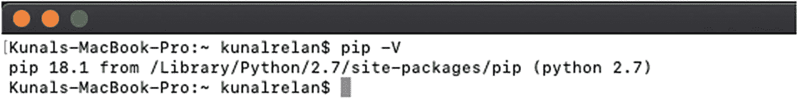

图 1-6

检查 Python 和 PIP 安装

```py
$ python -V
$ pip -V

```

### 选择 IDE

在我们开始写代码之前，我们需要一些东西来写。在本书中，我们将使用 Visual Studio 代码，这是一个在所有主要操作系统上都可用的开源免费 IDE。Visual Studio 代码可以从 [`www.code.visualstudio.com`](http://www.code.visualstudio.com) 下载，它为开发 Python 应用提供了很好的支持，提供了大量方便的插件来方便开发。您可以选择使用自己喜欢的文本编辑器或 IDE 来阅读这本书(图 [1-7](#Fig7) )。

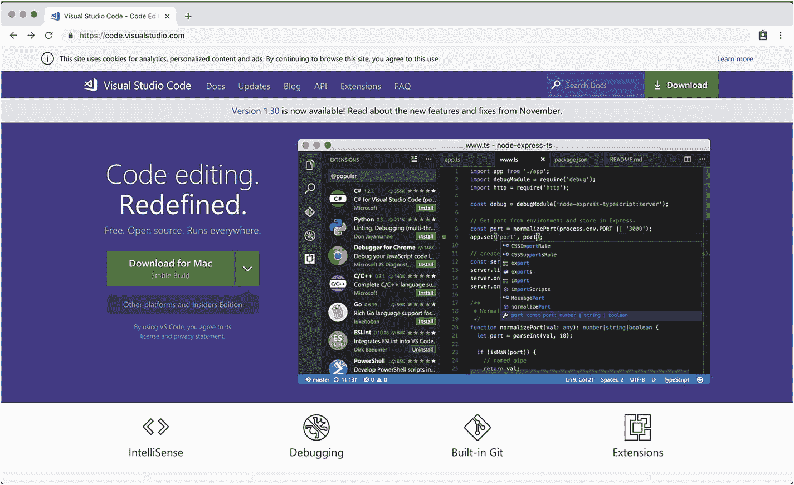

图 1-7

Visual Studio 代码

一旦我们有了 IDE 设置，我们就可以开始安装和设置虚拟环境了。

### 了解 Python 虚拟环境

Python 就像其他现代编程语言一样，提供了大量的第三方库和 SDK。不同的应用程序可能需要各种特定版本的第三方模块，一个 Python 安装不可能满足每个应用程序的这种需求。因此，在 Python 的世界中，这个问题的解决方案是虚拟环境，它创建一个独立的自包含目录树，包含所需版本的 Python 安装以及所需的包。

从本质上讲，虚拟环境的主要目的是创建一个隔离的环境来包含 Python 的安装和应用程序所需的包。您可以创建的虚拟环境的数量没有限制，并且创建它们非常容易。

#### 使用虚拟环境

在 Python 2.7 中，我们需要一个名为 **virtualenv** 的模块，它是使用 PIP 安装的，以便开始使用 Python 虚拟环境。

### 注意

在 Python 3 中，venv 模块是作为标准库的一部分预装的。

要安装 virtualenv，请在终端中键入以下命令(如果是 Windows，请键入命令行)。

```py
$ pip install virtualenv

```

一旦我们在系统中安装了 virtualenv 模块，接下来我们将创建一个新目录，并在其中创建一个虚拟环境。

现在，键入以下命令创建一个新目录，并在终端中打开它。

```py
$ mkdir pyenv && cd pyenv

```

前面的命令将创建一个目录，并在您的终端中打开它，然后我们将使用 virtualenv 模块在目录中创建一个新的虚拟环境。

```py
$ virtualenv venv

```

前面的命令将使用 virtualenv 模块并创建一个名为 venv 的虚拟环境。你可以给你的虚拟环境起任何名字，但是在这本书里，为了统一起见，我们只使用 venv。

一旦这个命令停止执行，您将看到一个名为 venv 的目录。这个目录现在将保存您的虚拟环境。

venv 文件夹的目录结构应类似于图 [1-8](#Fig8) 中的目录结构。

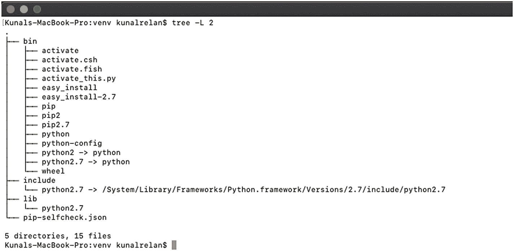

图 1-8

虚拟环境目录结构

下面是结构中每个文件夹包含的内容:

1.  bin:与虚拟环境交互的文件。

2.  include: C 头文件来编译 Python 包。

3.  lib:这个文件夹包含 Python 版本和所有其他第三方模块的副本。

接下来，有不同 Python 工具的副本或符号链接，以确保所有 Python 代码和命令都在当前环境中执行。这里重要的部分是 bin 文件夹中的激活脚本，它将 shell 设置为使用虚拟环境的 Python 和 site 包。为此，您需要通过在终端中键入以下命令来激活虚拟环境。

```py
$ source venv/bin/activate

```

一旦执行了这个命令，您的 shell 提示符将会以虚拟环境的名称为前缀，如图 [1-9](#Fig9) 所示。

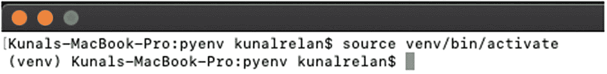

图 1-9

激活虚拟环境

现在，让我们使用以下命令在我们的虚拟环境中安装 Flask:

```py
$ pip install flask

```

前面的命令应该在我们的虚拟环境中安装 Flask。我们将使用我们在示例 Flask 应用程序中使用的相同代码。

```py
$ nano app.py

```

并在 nano 文本编辑器中键入以下代码:

```py
from flask import Flask
app = Flask(__name__)

@app.route('/')
def hello_world():
    return 'Hello, From Flask!'

Now,  try running your app.py using python app.py command.

$ FLASK_APP=app.py flask run

```

使用前面的命令，您应该能够运行简单的 Flask 应用程序，并且应该在您的终端中看到类似的输出(图 [1-10](#Fig10) )。

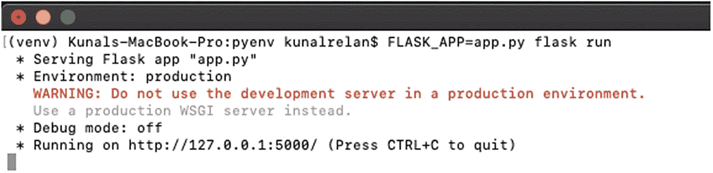

图 1-10

在虚拟环境中运行 Flask 应用程序

现在，要停用虚拟环境，您需要执行以下命令:

```py
$ deactivate

```

该命令执行后，shell 中的(venv)前缀将消失，如果您尝试再次运行该应用程序，它将抛出一个错误(图 [1-11](#Fig11) )。

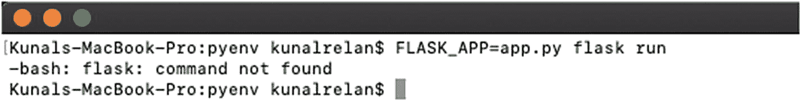

图 1-11

不使用虚拟环境运行 Flask 应用程序

现在，您已经了解了虚拟环境的概念，我们可以更深入地了解虚拟环境内部的情况。

理解虚拟环境的工作方式可以真正帮助您调试应用程序和理解执行环境。首先，让我们检查一下激活和停用虚拟环境的 Python 可执行文件，以便理解基本的区别。

让我们在激活虚拟环境的情况下执行以下命令(图 [1-12](#Fig12) ):

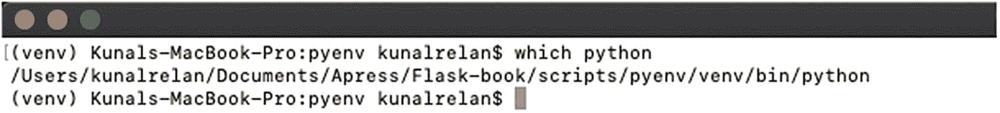

图 1-12

使用虚拟环境检查 Python 可执行文件

```py
$ which python

```

如下图所示，外壳正在使用虚拟环境的 Python 可执行文件，如果您停用该环境并重新运行 Python 命令，您会注意到外壳现在正在使用系统的 Python(图 [1-13](#Fig13) )。

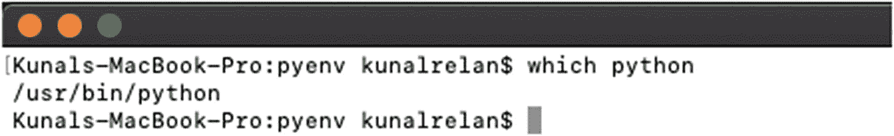

图 1-13

在没有虚拟环境的情况下检查 Python 可执行文件

因此，一旦激活了虚拟环境，就会修改$path 环境变量，使其指向我们的虚拟环境，从而使用我们虚拟环境中的 Python，而不是系统环境。然而，这里需要注意的一件重要的事情是，它基本上是系统的 Python 可执行文件的一个副本或一个符号链接。

## 安装烧瓶

我们已经在前面的模块中安装了 Flask，但是让我们重新开始并设置 Flask 微框架。

### 安装烧瓶

激活虚拟环境后，执行以下命令安装最新版本的 Flask。

```py
$pip install flask

```

前面的命令将在您的虚拟环境中安装 Flask。

但是，如果您希望在发布之前使用最新的 Flask，请通过执行以下命令，使用其存储库的主分支安装/更新 Flask 模块:

```py
$pip install -U https://github.com/pallets/flask/archive/master.tar.gz

```

当您安装 Flask 时，以下发行版会随主框架一起安装:

1.  *Werkzeug(*[`http://werkzeug.pocoo.org/`](http://werkzeug.pocoo.org/)*):*Werkzeug 实现了 WSGI，应用和服务器之间的标准 Python 接口。

2.  Jinja ( [`http://jinja.pocoo.org/`](http://jinja.pocoo.org/) ): Jinja 是 Flask 中的模板引擎，为应用程序呈现页面。

3.  MarkupSafe (

4.  its dangerous([`https://pythonhosted.org/itsdangerous/`](https://pythonhosted.org/itsdangerous/)):its dangerous 负责安全地对数据进行签名，以确保数据的完整性，并用于保护 Flask 会话 cookies。

5.  Click ( [`http://click.pocoo.org/`](http://click.pocoo.org/) ): Click 是一个写 CLI 应用的框架。它提供了“Flask”CLI 命令。

## 结论

一旦在虚拟环境中安装了 Flask，就可以进入开发阶段的下一步了。在此之前，我们将讨论 MySQL 和 Flask-SQLAlchemy，它是我们将在 Flask 应用程序中使用的 ORM。数据库是 REST 应用程序的重要组成部分，在下一章，我们将讨论 MySQL 数据库和 Flask-SQLAlchemy ORM，并学习如何将我们的 Flask 应用程序与 Flask-SQLAlchemy 连接起来。