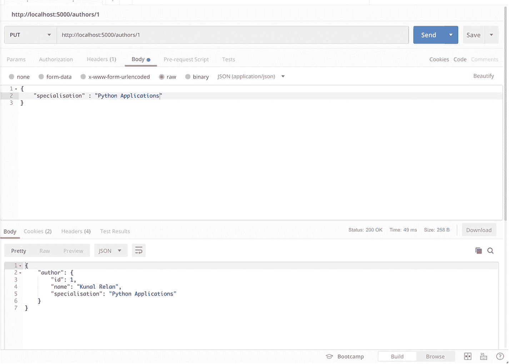

# 2.Flask 中的数据库建模

本章涵盖了 REST 应用程序开发的一个最重要的方面，即与数据库系统的连接和交互。在本章中，我们将讨论 NoSQL 和 SQL 数据库，以及它们之间的连接和交互。

在本章中，我们将讨论以下主题:

1.  NoSQL 与 SQL 数据库

2.  连接烧瓶-SQLAlchemy

3.  使用 Flask-SQLAlchemy 与 MySQL 数据库交互

4.  连接 Flask-MongoEngine

5.  使用 Flask-MongoEngine 与 MongoDB 交互

## 介绍

Flask 作为一个微框架，为应用程序提供了数据源的灵活性，并为与不同种类的数据源进行交互提供了库支持。Flask 中有一些库可以连接到基于 SQL 和基于 NoSQL 的数据库。它还提供了使用原始数据库库或使用 ORM(对象关系映射器)/ODM(对象文档映射器)与数据库进行交互的灵活性。在这一章中，我们将简要讨论基于 NoSQL 和 SQL 的数据库，并通过 Flask-SQLAlchemy 学习如何在 Flask 应用程序中使用 ORM 层，之后我们将通过 Flask-MongoEngine 使用 ODM 层。

大多数应用程序在某些时候确实需要数据库，MySQL 和 MongoDB 只是众多工具中的两个。为您的应用程序选择正确的方法完全取决于您要存储的数据。如果表中的数据集是相互关联的，那么 SQL 数据库是一个不错的选择，或者 NoSQL 数据库也可以达到这个目的。

现在，让我们简要地看一下 SQL 和 NoSQL 数据库。

### SQL 数据库

SQL 数据库使用结构化查询语言(SQL)进行数据操作和定义。SQL 是一个通用的、被广泛使用和接受的选项，这使它成为数据存储的最佳选择。当使用的数据需要是关系型的并且模式是预定义的时，SQL 系统非常适合。然而，预定义的模式也有缺点，因为它要求整个数据集遵循相同的结构，这在某些情况下可能很困难。SQL 数据库以由行和列组成的表格的形式存储数据，并且是垂直可伸缩的。

### NoSQL 数据库

NoSQL 数据库有一个非结构化数据的动态模式，并以不同的方式存储数据，包括基于列的(Apache Cassandra)、基于文档的(MongoDB)和基于图形的(Neo4J)或作为键值存储(Redis)。这提供了在没有预定义结构的情况下存储数据的灵活性，以及随时向数据结构添加字段的多功能性。无模式是 NoSQL 数据库的主要特点，这也使它们更适合分布式系统。与 SQL 数据库不同，NoSQL 数据库是水平可伸缩的。

既然我们已经简要解释了 SQL 和 NoSQL 数据库，我们将跳转到 MySQL 和 MongoDB 之间的功能差异，因为这是我们将在本章中研究的两个数据库引擎。

### 主要区别:MySQL 与 MongoDB

如前所述，MySQL 是一个基于 SQL 的数据库，它将数据存储在具有列和行的表中，并且只处理结构化数据。另一方面，MongoDB 可以处理非结构化数据，存储类似 JSON 的文档而不是表格，并使用 MongoDB 查询语言与数据库通信。MySQL 是一个非常成熟的数据库，具有巨大的社区和极大的稳定性，而 MongoDB 是一项相当新的技术，社区不断增长，由 MongoDB Inc .开发。MySQL 是垂直可伸缩的，其中单个服务器上的负载可以通过升级 RAM、SSD 或 CPU 来增加，而在 MongoDB 的情况下，它需要共享和添加更多的服务器，以便增加服务器负载。MongoDB 是高写负载和大数据集的首选，MySQL 非常适合高度依赖多行事务的应用程序，如会计系统。对于具有动态结构和高数据负载的应用程序，如实时分析应用程序或内容管理系统，MongoDB 是一个很好的选择。

Flask 提供了与 MySQL 和 MongoDB 交互的支持。有各种本地驱动程序以及 ORM/ODM 用于与数据库通信。MySQL 是一个 Flask 扩展，允许本地连接到 MySQL；PyMongo 是在 Flask 中使用 MongoDB 的本地扩展，也是 MongoDB 推荐的。Flask-MongoEngine 是一个 Flask 扩展，用于 Flask 和 MongoDB 的 ODM。Flask-SQLAlchemy 是一个 ORM 层，用于 Flask 应用程序连接 MySQL。

接下来，我们将讨论 Flask-SQLAlchemy 和 Flask- MongoEngine，并使用它们创建 Flask CRUD 应用程序。

## 使用 SQLAlchemy 创建 Flask 应用程序

Flask-SQLAlchemy 是 Flask 的扩展，为应用程序增加了对 SQLAlchemy 的支持。SQLAlchemy 是一个 Python 工具包和对象关系映射器，使用 Python 提供对 SQL 数据库的访问。SQLAlchemy 提供了企业级的持久性模式和高效高性能的数据库访问。如果安装了适当的 DBAPI 驱动程序，Flask-SQLAlchemy 支持以下基于 SQL 的数据库引擎:

*   一种数据库系统

*   关系型数据库

*   神谕

*   数据库

*   搜寻配置不当的

*   火鸟赛贝斯

我们将在应用程序中使用 MySQL 作为数据库引擎，所以让我们开始安装 SQLAlchemy 并设置我们的应用程序。

让我们创建一个名为 flask-MySQL 的新目录，创建一个虚拟环境，然后安装 flask-sqlalchemy。

```py
$ mkdir flask-mysql && cd flask-mysql

```

现在，使用以下命令在目录中创建一个虚拟环境:

```py
$ virtualenv venv

```

如前所述，我们可以使用以下命令激活虚拟环境:

```py
$ source venv/bin/activate

```

一旦虚拟环境被激活，让我们安装 flask-sqlalchemy。

Flask 和 Flask-SQLAlchemy 可以使用 PIP 和以下命令进行安装。

```py
(venv)$ pip install flask flask-sqlalchemy

```

除了 SQLite，所有其他数据库引擎都需要单独的库与 Flask-SQLAlchemy 一起安装才能运行。SQLAlchemy 使用 MySQL-Python 作为与 MySQL 连接的默认 DBAPI。

现在，让我们安装 PyMySQL 来启用 MySQL 与 Flask-SQLAlchemy 的连接。

```py
(venv) $ pip install pymysql

```

现在，我们应该拥有了创建示例 flask-MySQL 应用程序所需的一切。

让我们从创建 app.py 开始，它将包含我们的应用程序的代码。创建文件后，我们将启动 Flask 应用程序。

```py
from flask import Flask
from flask_sqlalchemy import SQLAlchemy

app = Flask(__name__)
app.config['SQLALCHEMY_DATABASE_URI'] = 'mysql+pymysql://<mysql_username>:<mysql_password>@<mysql_host>:<mysql_port>/<mysql_db>'
db = SQLAlchemy(app)

if __name__ == "__main__":
    app.run(debug=True)

```

这里，我们导入 Flask 框架和 Flask-SQLAlchemy，然后初始化 Flask 的一个实例。之后，我们配置 SQLAlchemy 数据库 URI 以使用我们的 MySQL 数据库 URI，然后我们创建一个名为 DB 的 SQLAlchemy 对象，它将处理我们的 ORM 相关活动。

现在，如果您正在使用 MySQL，请确保您提供了正在运行的 MySQL 服务器的连接字符串，并且所提供的数据库名称确实存在。

### 注意

使用环境变量在应用程序中提供数据库连接字符串。

确保您有一个正在运行的 MySQL 服务器来跟踪这个应用程序。但是，您也可以通过在 SQLAlchemy 数据库 URI 中提供 SQLite 配置详细信息来使用 SQLite，如下所示:

```py
app.config['SQLALCHEMY_DATABASE_URI'] = 'sqlite:////tmp/<db_name>.db'

```

为了运行应用程序，您需要在终端中执行以下代码:

```py
(venv) $ python app.py

```

如果没有错误，您应该在终端中看到类似的输出:

```py
(venv) $ python app.py
* Serving Flask app "app" (lazy loading)
 * Environment: production
   WARNING: Do not use the development server in a production environment.
   Use a production WSGI server instead.
 * Debug mode: on
 * Running on http://127.0.0.1:5000/ (Press CTRL+C to quit)
 * Restarting with stat
 * Debugger is active!
 * Debugger PIN: 779-301-240

```

### 创建作者数据库

我们现在将创建一个作者数据库应用程序，它将提供 RESTful CRUD APIs。所有作者都将存储在名为“authors”的表中。

在声明的 db 对象之后，添加以下代码行，以将一个类声明为 Authors，该类将保存 author 表的模式:

```py
class Author (db.Model):
    id = db.Column(db.Integer, primary_key=True)
    name = db.Column(db.String(20))
    specialisation = db.Column(db.String(50))

    def __init__(self, name, specialisation):
        self.name = name
        self.specialisation = specialisation
    def __repr__(self):
      return '<Product %d>' % self.id
db.create_all()

```

使用这段代码，我们创建了一个名为“Authors”的模型，它有三个字段——ID、name 和 specialisation。Name 和 specialisation 是字符串，但是 ID 是一个自动生成并自动递增的整数，它将作为主键。注意最后一行“db.create_all()”，它指示应用程序创建应用程序中指定的所有表和数据库。

为了使用 SQLAlchemy 返回的数据为来自 API 的 JSON 响应提供服务，我们需要另一个名为 marshmallow 的库，它是 SQLAlchemy 的附加组件，用于将 SQLAlchemy 返回的数据对象序列化到 JSON。

```py
(venv)$ pip install flask-marshmallow

```

以下命令将在我们的应用程序中安装 marshmallow 的 Flask 版本，我们将使用 marshmallow 从 Authors 模型中定义输出模式。

在应用程序文件的顶部，其他导入的下面添加下面几行来导入 marshmallow。

```py
from marshmallow_sqlalchemy import ModelSchema
from marshmallow import fields

```

在 db.create_all()之后，使用以下代码定义输出模式:

```py
class AuthorSchema(ModelSchema):
    class Meta(ModelSchema.Meta):
        model = Authors
        sqla_session = db.session

    id = fields.Number(dump_only=True)
    name = fields.String(required=True)
    specialisation = fields.String(required=True)

```

前面的代码将变量属性映射到字段对象，在 Meta 中，我们定义了与我们的模式相关的模型。所以这应该有助于我们从 SQLAlchemy 返回 JSON。

在建立了模型和返回模式之后，我们可以开始创建端点了。让我们创建第一个 GET /authors 端点来返回所有注册的作者。这个端点将查询 Authors 模型中的所有对象，并以 JSON 的形式返回给用户。但是在我们编写端点之前，将第一个导入行编辑为以下内容，以便从 Flask 导入 jsonify、make_response 和 request。

```py
from flask import Flask, request, jsonify, make_response

```

在 AuthorSchema 之后，用以下代码编写第一个端点/作者:

```py
@app.route('/authors', methods = ['GET'])
def index():
    get_authors = Authors.query.all()
    author_schema = AuthorSchema(many=True)
    authors, error = author_schema.dump(get_authors)
    return make_response(jsonify({"authors": authors}))

```

在这个方法中，我们获取数据库中的所有作者，将其转储到 AuthorSchema 中，并在 JSON 中返回结果。

如果您现在启动应用程序并点击端点，它将返回一个空数组，因为我们还没有在 DB 中添加任何东西，但是让我们继续尝试端点。

使用 Python app.py 运行应用程序，然后使用首选的 REST 客户端查询端点。我将使用 Postman 来请求端点。

所以只需打开你的 Postman，让`http://localhost:5000/authors`查询端点(图 [2-1](#Fig1) )。


图 2-1

获得/作者回应

您应该在您的 Postman 客户端中看到类似的结果。现在让我们创建 POST 端点，将作者添加到我们的数据库中。

我们可以通过在我们的方法中直接创建一个 Authors 类，或者通过创建一个 classMethod 在 Authors 类中创建一个新对象，然后在我们的端点中调用该方法，来将一个对象添加到表中。让我们在 Authors 类中添加 class 方法来创建一个新对象。

在字段定义之后，在 Authors 类中添加以下代码:

```py
    def create(self):
      db.session.add(self)
      db.session.commit()
      return self

```

前面的方法使用数据创建一个新的对象，然后返回创建的对象。现在，您的 Authors 类应该如下所示:

```py
class Authors(db.Model):
    id = db.Column(db.Integer, primary_key=True)
    name = db.Column(db.String(20))
    specialisation = db.Column(db.String(50))

    def create(self):
      db.session.add(self)
      db.session.commit()
      return self

    def __init__(self, name, specialisation):
        self.name = name
        self.specialisation = specialisation
    def __repr__(self):
        return '<Author %d>' % self.id

```

现在，我们将创建 POST authors 端点，并在 GET 端点后编写以下代码:

```py
@app.route('/authors', methods = ['POST'])
def create_author():
    data = request.get_json()
    author_schema = AuthorsSchema()
    author, error = author_schema.load(data)
    result = author_schema.dump(author.create()).data
    return make_response(jsonify({"author": authors}),201)

```

前面的方法将获取 JSON 请求数据，将数据加载到 marshmallow 模式中，然后调用我们在 Authors 类中创建的 create 方法，该方法将返回带有 201 状态代码的已创建对象。

因此，让我们用示例数据请求 POST 端点并检查响应。让我们用 JSON 请求体打开 Postman 和 POST /authors。我们需要在主体中添加名称和专门化字段来创建对象。我们的示例请求体应该如下所示:

```py
{
      "name" : "Kunal Relan",
      "specialisation" : "Python"
}

```

一旦我们请求了端点，我们将获得 Author 对象作为对我们新创建的 Author 的响应。注意，在这种情况下，返回状态代码是 201，这是新对象的状态代码(图 [2-2](#Fig2) )。


图 2-2

帖子/作者端点

所以现在，如果我们请求 GET /authors 端点，我们将在响应中获得新创建的作者。

重新访问 Postman 中的 GET /authors 选项卡并再次点击请求；这一次，您应该得到一个由我们新创建的作者组成的作者数组(图 [2-3](#Fig3) )。


图 2-3

用新对象获取所有作者

到目前为止，我们已经创建了注册新作者和获取作者列表的端点。接下来，我们将创建一个端点来使用作者 ID 返回作者，然后更新端点来使用作者 ID 更新作者详细信息，最后一个端点使用作者 ID 删除作者。

对于通过 ID 获取作者，我们将有一个类似/authors/ <id>的路径，它将从请求参数中获取作者 ID 并找到匹配的作者。</id>

将以下代码添加到 GET author by ID 端点的 GET all authors 路径下。

```py
@app.route('/authors/<id>', methods = ['GET'])
def get_author_by_id(id):
    get_author = Authors.query.get(id)
    author_schema = AuthorsSchema()
    author, error = author_schema.dump(get_author)
    return make_response(jsonify({"author": author}))

```

接下来我们需要测试这个端点，我们将请求 ID 为 1 的 author，就像我们在前面的 GET all authors API response 中看到的那样，所以让我们再次打开 Postman 并请求应用服务器上的/authors/1 来检查响应。


图 2-4

通过 ID 端点获取作者

正如您在前面的屏幕截图中看到的，我们正在返回一个具有密钥 author 的对象，该对象包含 ID 为 1 的 author 对象。现在，您可以使用 POST 端点添加更多作者，并使用返回的 ID 获取他们。

接下来，我们需要创建一个端点来更新作者姓名或专业，为了更新任何对象，我们将使用在“RESTful 服务简介”一节中讨论过的 PUT HTTP 动词。这个端点将类似于 GET authors by ID 端点，但是将使用 PUT 动词而不是 GET 动词。

下面是 PUT 端点更新 author 对象的代码

```py
@app.route('/authors/<id>', methods = ['PUT'])
def update_author_by_id(id):
    data = request.get_json()
    get_author = Authors.query.get(id)
    if data.get('specialisation'):
        get_author.specialisation = data['specialisation']
    if data.get('name'):
        get_author.name = data['name']
    db.session.add(get_author)
    db.session.commit()
    author_schema = AuthorsSchema(only=['id', 'name', 'specialisation'])
    author, error = author_schema.dump(get_author)
    return make_response(jsonify({"author": author}))

```

因此，让我们测试我们的 PUT 端点，并更改 author ID 1 的专门化。

我们将在下面的 JSON 主体中更新作者专门化。

```py
{
      "specialisation" : "Python Applications"
}

```



图 2-5

按 ID 端点更新作者

如图 [2-5](#Fig5) 所示，我们用 ID 1 更新了作者，现在专门化已经更新为“Python 应用”。

现在，从数据库中删除作者的最后一个端点。添加以下代码以添加一个删除端点，该端点类似于 get author by ID endpoint，但将使用删除谓词并返回没有内容的 204 状态代码。

```py
@app.route('/authors/<id>', methods = ['DELETE'])
def delete_author_by_id(id):
    get_author = Authors.query.get(id)
    db.session.delete(get_author)
    db.session.commit()
    return make_response("",204)

```

现在我们将请求删除端点删除 ID 为 1 的作者(图 [2-6](#Fig6) )。


图 2-6

按 ID 删除作者

现在，如果您请求获取所有作者端点，它将返回一个空数组。

现在，您的 app.py 应该具有以下代码:

```py
from flask import Flask, request, jsonify, make_response
from flask_sqlalchemy import SQLAlchemy
from marshmallow_sqlalchemy import ModelSchema
from marshmallow import fields

app = Flask(__name__)
app.config["SQLALCHEMY_DATABASE_URI"] = 'mysql+pymysql://<mysql_username>:<mysql_password>@<mysql_host>:<mysql_port>/<mysql_db>'

db = SQLAlchemy(app)

class Authors(db.Model):
    id = db.Column(db.Integer, primary_key=True)
    name = db.Column(db.String(20))
    specialisation = db.Column(db.String(50))

    def create(self):
      db.session.add(self)
      db.session.commit()
      return self

    def __init__(self, name, specialisation):
        self.name = name
        self.specialisation = specialisation

    def __repr__(self):
        return '<Author %d>' % self.id

db.create_all()

class AuthorsSchema(ModelSchema):
    class Meta(ModelSchema.Meta):
        model = Authors
        sqla_session = db.session

    id = fields.Number(dump_only=True)
    name = fields.String(required=True)
    specialisation = fields.String(required=True)

@app.route('/authors', methods = ['GET'])
def index():
    get_authors = Authors.query.all()
    author_schema = AuthorsSchema(many=True)
    authors, error = author_schema.dump(get_authors)
    return make_response(jsonify({"authors": authors}))

@app.route('/authors/<id>', methods = ['GET'])
def get_author_by_id(id):
    get_author = Authors.query.get(id)
    author_schema = AuthorsSchema()
    author, error = author_schema.dump(get_author)
    return make_response(jsonify({"author": author}))

@app.route('/authors/<id>', methods = ['PUT'])
def update_author_by_id(id):
    data = request.get_json()
    get_author = Authors.query.get(id)
    if data.get('specialisation'):
        get_author.specialisation = data['specialisation']
    if data.get('name'):
        get_author.name = data['name']
    db.session.add(get_author)
    db.session.commit()

    author_schema = AuthorsSchema(only=['id', 'name', 'specialisation'])
    author, error = author_schema.dump(get_author)
    return make_response(jsonify({"author": author}))

@app.route('/authors/<id>', methods = ['DELETE'])
def delete_author_by_id(id):
    get_author = Authors.query.get(id)
    db.session.delete(get_author)
    db.session.commit()
    return make_response("",204)

@app.route('/authors', methods = ['POST'])
def create_author():
    data = request.get_json()
    author_schema = AuthorsSchema()
    author, error = author_schema.load(data)
    result = author_schema.dump(author.create()).data
    return make_response(jsonify({"author": result}),200)

if __name__ == "__main__":
    app.run(debug=True)

```

因此，我们现在已经创建并测试了我们的样本 Flask-MySQL CRUD 应用程序。我们将在后面的章节中使用 Flask-SQLAlchemy 检查复杂的对象关系，接下来我们将使用 MongoEngine 创建一个类似的 Flask CRUD 应用程序。

## 示例烧瓶 MongoEngine 应用程序

正如我们所讨论的，MongoDB 是一个强大的基于文档的 NoSQL 数据库。它使用类似 JSON 的文档模式结构，具有高度的可伸缩性。在这个例子中，我们将再次创建一个 Authors 数据库 CRUD 应用程序，但是这次我们将使用 MongoEngine 而不是 SQLAlchemy。MongoEngine 增加了对 Flask 的 MongoDB 支持，与 SQLAlchemy 非常相似，但是它缺少一些特性，因为 MongoDB 仍然没有广泛用于 Flask。

让我们开始为 flask-mongodb 应用程序设置项目。就像上次一样，创建一个新的目录 flask-mongodb，并在其中初始化一个新的虚拟环境。

```py
$ mkdir flask-mongodb && cd flask-mongodb

```

创建目录后，让我们生成虚拟环境并激活它。

```py
$ virtualenv venv
$ source venv/bin/activate

```

现在让我们使用 PIP 安装我们的项目依赖项。

```py
(venv) $ pip install flask

```

我们需要 Flask-MongoEngine 和 Flask-marshmallow，所以让我们也安装它们。

```py
(venv) $ pip install flask-mongoengine
(venv) $ pip install flask-marshmallow

```

安装完依赖项后，我们可以创建 app.py 文件并开始编写代码。

因此，下面的代码是应用程序的框架，其中导入 flask，创建一个应用程序实例，然后导入 MongoEngine 创建一个 db 实例。

```py
from flask import Flask, request, jsonify, make_response
from flask_mongoengine import MongoEngine
from marshmallow import Schema, fields, post_load
from bson import ObjectId

app = Flask(__name__)
app.config['MONGODB_DB'] = 'authors'
db = MongoEngine(app)

Schema.TYPE_MAPPING[ObjectId] = fields.String

if __name__ == "__main__":
    app.run(debug=True)

Here TYPE_MAAPPING helps marshmallow understand the ObjectId type while serializing and de-serializing the data.

```

### 注意

这里我们不需要 db.create_all()，因为 MongoDB 会在您第一次将值保存到集合中时动态创建它。

如果您现在运行应用程序，您的服务器应该会启动，但是它没有什么要处理的，只是创建 db 实例并建立连接。接下来，让我们使用 MongoEngine 创建一个作者模型。

在这种情况下，创建作者模型的代码相当简单，如下所示:

```py
class Authors(db.Document):
    name = db.StringField()
    specialisation = db.StringField()

```

现在让我们创建 marshmallow 模式，我们需要用它将 db 对象转储到序列化的 JSON 中。

```py
class AuthorsSchema(Schema):
    name = fields.String(required=True)
    specialisation = fields.String(required=True)

```

前面的代码让我们创建一个模式，我们将使用该模式将 db 对象映射到 marshmallow。请注意，这里我们没有使用 marshmallow-sqlalchemy，它对 sqlalchemy 有一个额外的支持层，因此代码看起来略有变化。

现在，我们可以编写 GET 端点来从数据库中获取所有作者。

```py
@app.route('/authors', methods = ['GET'])
def index():
    get_authors = Authors.objects.all()
    author_schema =AuthorsSchema(many=True,only=['id','name','specialisation'])
    authors, error = author_schema.dump(get_authors)
    return make_response(jsonify({"authors": authors}))

```

### 注意

MongoEngine 在“Id”字段中返回唯一的 ObjectId，它是自动生成的，因此没有在模式中指定。

现在，让我们使用下面的命令再次启动应用程序。

```py
(venv) $ python app.py

```

如果没有错误，您应该会看到下面的输出，并且您的应用程序应该已经启动并正在运行。

```py
(venv) $ python app.py
* Serving Flask app "app" (lazy loading)
 * Environment: production
   WARNING: Do not use the development server in a production environment.
   Use a production WSGI server instead.
 * Debug mode: on
 * Running on http://127.0.0.1:5000/ (Press CTRL+C to quit)
 * Restarting with stat
 * Debugger is active!
 * Debugger PIN: 779-301-240

```


图 2-7

请求获取/作者

既然我们的 GET 端点正在工作(图 [2-7](#Fig7) )，让我们创建一个 POST /authors 端点来在数据库中注册作者。

```py
@app.route('/authors', methods = ['POST'])
def create_author():
    data = request.get_json()
    author = Authors(name=data['name'],specialisation=data['specialisation'])
    author.save()
    author_schema = AuthorsSchema(only=['name', 'specialisation'])
    authors, error = author_schema.dump(author)
    return make_response(jsonify({"author": authors}),201)

```

前面的代码将请求 JSON 数据放在数据变量中，创建一个类 Authors 对象，并对其调用 save()方法。接下来，它使用 AuthorsSchema 创建一个模式，并转储新对象以将其返回给用户，确认用户是用 201 状态代码创建的。

现在重新运行应用程序，并使用示例作者详细信息请求 POST 端点进行注册。

我们将使用相同的 JSON 数据发送到这个应用程序，就像我们在另一个应用程序中所做的那样。

```py
{
      "name" : "Kunal Relan",
      "specialisation" : "Python"
}

```


图 2-8

请求帖子/作者

在请求时，您应该得到类似于图 [2-8](#Fig8) 中所示的输出，现在只是为了确认我们的 get 端点工作正常，我们将再次请求它，看看它是否返回数据。

如图 [2-9](#Fig9) 所示，我们在 GET /authors 端点中获得了最近注册的作者。


图 2-9

请求获取/作者

接下来，我们将创建一个端点，使用作者 ID 返回作者，然后更新端点，使用作者 ID 更新作者详细信息，最后一个端点使用作者 ID 删除作者。

对于通过 ID 获取作者，我们将有一个类似/authors/ <id>的路径，它将从请求参数中获取作者 ID 并找到匹配的作者。</id>

将以下代码添加到 GET author by ID 端点的 GET all authors 路径下。

```py
@app.route('/authors/<id>', methods = ['GET'])
def get_author_by_id(id):
    get_author = Authors.objects.get_or_404(id=ObjectId(id))
    author_schema = AuthorsSchema(only=['id', 'name', 'specialisation'])
    author, error = author_schema.dump(get_author)
    return make_response(jsonify({"author": author}))

```

现在，当您请求端点/作者/ <id>时，它将返回用户匹配的 ObjectId(图 [2-10](#Fig10) )。</id>


图 2-10

按 ID 获取作者

因此，接下来我们将创建 PUT 端点来使用作者 ID 更新作者信息。为 PUT author 端点添加以下代码。

```py
@app.route('/authors/<id>', methods = ['PUT'])
def update_author_by_id(id):
    data = request.get_json()
    get_author = Authors.objects.get(id=ObjectId(id))
    if data.get('specialisation'):
        get_author.specialisation = data['specialisation']
    if data.get('name'):
        get_author.name = data['name']
    get_author.save()
    get_author.reload()
    author_schema = AuthorsSchema(only=['id', 'name', 'specialisation'])
    author, error = author_schema.dump(get_author)
    return make_response(jsonify({"author": author}))

```

打开 Postman 并点击与我们在其他模块中所做的相同的路由来更新作者信息，但是这里使用 GET 端点中返回的 ObjectID。


图 2-11

放置作者端点

正如您在图 [2-11](#Fig11) 中看到的，我们能够使用 PUT 端点更新作者专业化。接下来，我们将创建删除端点，使用作者 ID 删除作者，以完成我们的 CRUD 应用程序。

添加以下代码，为我们的应用程序创建删除端点。

```py
@app.route('/authors/<id>', methods = ['DELETE'])
def delete_author_by_id(id):
    Authors.objects(id=ObjectId(id)).delete()
    return make_response("",204)

```

现在，让我们使用作者 ID 删除新创建的作者，与上一个应用程序类似，这个端点不会返回任何数据，只会返回 204 状态代码。

使用您之前使用的作者 ID 请求删除端点，它将返回如图 [2-12](#Fig12) 所示的类似响应。


图 2-12

删除作者端点

这就结束了我们的 flask-mongo CRUD 应用程序，app.py 中的最终代码应该是这样的。

```py
from flask import Flask, request, jsonify, make_response
from flask_mongoengine import MongoEngine
from marshmallow import Schema, fields, post_load
from bson import ObjectId

app = Flask(__name__)
app.config['MONGODB_DB'] = 'DB_NAME'
db = MongoEngine(app)

Schema.TYPE_MAPPING[ObjectId] = fields.String

class Authors(db.Document):
    name = db.StringField()
    specialisation = db.StringField()

class AuthorsSchema(Schema):
    name = fields.String(required=True)
    specialisation = fields.String(required=True)

@app.route('/authors', methods = ['GET'])
def index():
    get_authors = Authors.objects.all()

    author_schema = AuthorsSchema(many=True, only=['id', 'name', 'specialisation'])
    authors, error = author_schema.dump(get_authors)
    return make_response(jsonify({"authors": authors}))

@app.route('/authors/<id>', methods = ['GET'])
def get_author_by_id(id):
    get_author = Authors.objects.get_or_404(id=ObjectId(id))
    author_schema = AuthorsSchema(only=['id', 'name', 'specialisation'])
    author, error = author_schema.dump(get_author)
    return make_response(jsonify({"author": author}))

@app.route('/authors/<id>', methods = ['PUT'])
def update_author_by_id(id):
    data = request.get_json()
    get_author = Authors.objects.get(id=ObjectId(id))
    if data.get('specialisation'):
        get_author.specialisation = data['specialisation']
    if data.get('name'):
        get_author.name = data['name']
    get_author.save()
    get_author.reload()
    author_schema = AuthorsSchema(only=['id', 'name', 'specialisation'])
    author, error = author_schema.dump(get_author)
    return make_response(jsonify({"author": author}))

@app.route('/authors/<id>', methods = ['DELETE'])
def delete_author_by_id(id):
    Authors.objects(id=ObjectId(id)).delete()

    return make_response("",204)

@app.route('/authors', methods = ['POST'])
def create_author():
    data = request.get_json()
    author = Authors(name=data['name'],specialisation=data['specialisation'])
    author.save()
    author_schema = AuthorsSchema(only=['id','name', 'specialisation'])
    authors, error = author_schema.dump(author)
    return make_response(jsonify({"author": authors}),201)

if __name__ == "__main__":
    app.run(debug=True)

```

## 结论

现在我们已经介绍了 SQLAlchemy 和 MongoEngine，并使用它们创建了示例 CRUD 应用程序。在下一章，我们将详细讨论 REST API 的架构，并为我们的 Flask REST API 应用程序建立基础。