# 3.烧瓶积垢应用(第一部分)

在上一章中，我们讨论了数据库并实现了基于 NoSQL 和 SQL 的例子。在本章中，我们将从头开始创建一个 RESTful Flask 应用程序。这里我们将维护一个作者对象的数据库，以及他们写的书。这个应用程序将有一个用户认证机制，只允许登录的用户执行某些功能。我们现在将为 REST 应用程序创建以下 API 端点:

1.  GET /authors:这将获取作者及其书籍的列表。

2.  GET /authors/ <id>:获取带有指定 ID 的作者及其书籍。</id>

3.  POST /authors:这将创建一个新的 Author 对象。

4.  PUT /authors/ <id>:这将编辑具有给定 ID 的作者对象。</id>

5.  DELETE /authors/ <id>:这将删除具有给定 ID 的作者。</id>

6.  GET /books:这将返回所有的书。

7.  GET /books/ <id>:获取指定 ID 的书籍。</id>

8.  POST /books:这将创建一个新的 book 对象。

9.  PUT / books/ <id>:这将编辑给定 ID 的 book 对象。</id>

10.  DELETE /book/ <id>:删除给定 ID 的图书。</id>

让我们直接进入主题，我们将从创建一个新项目开始，并将其命名为 author-manager。因此，创建一个新目录，并从创建一个新的虚拟环境开始。

```py
$ mkdir author-manager && cd author-manager

$ virtualenv venv

```

现在我们应该有我们的虚拟环境设置；接下来，我们需要激活环境并安装依赖项，就像我们在上一章中所做的那样。

我们将从安装以下依赖项开始，并在需要时添加更多依赖项。

```py
(venv) $ pip install flask flask-sqlalchemy marshmallow-sqlalchemy

```

我们还将在这个应用程序中使用蓝图。Flask 使用蓝图的概念来制作应用程序组件，并支持应用程序中的通用模式。蓝图有助于为应用程序创建更小的模块，使其易于管理。Blueprint 对于大型应用程序非常有价值，它简化了大型应用程序的工作方式。

我们将应用程序构建成小模块，并将所有应用程序代码保存在 app 文件夹内的/src 文件夹中。因此，在当前工作目录下创建一个 src 文件夹，然后在其中创建 run.py 文件。

```py
(venv) $ mkdir src && cd src

```

在 src 文件夹中，我们将有我们的 run.py 文件和另一个名为 api 的目录，它将导出我们的模块，所以继续在 src 中创建一个 api 文件夹。我们将在 src 内的 main.py 文件中初始化我们的 Flask 应用程序，然后创建另一个文件 run.py，该文件将导入 main.py、config 文件并运行应用程序。

先说 main.py。

添加以下代码以导入所需的库，然后初始化 app 对象。这里我们将定义一个函数，它将接受应用程序配置，然后初始化我们的应用程序。

```py
import os
from flask import Flask
from flask import jsonify

app = Flask(__name__)

if os.environ.get('WORK_ENV') == 'PROD':
    app_config = ProductionConfig
elif os.environ.get('WORK_ENV') == 'TEST':
    app_config = TestingConfig
else:
    app_config = DevelopmentConfig

app.config.from_object(app_config)

if __name__ == "__main__":
    app.run(port=5000, host="0.0.0.0", use_reloader=False)

```

这就是我们 main.py 的框架。接下来，我们将创建 run.py 来调用 app 并运行应用程序。稍后我们将添加路由，初始化我们的 db 对象，并在 main.py 中配置日志记录。

将以下代码添加到 run.py 中，以导入 create_app 并运行应用程序。

```py
from main import app as application

if __name__ == "__main__":
    application.run()

```

这里我们已经定义了配置，导入了 create_app，并初始化了应用程序。接下来，我们将把配置移动到一个单独的目录，并指定特定于环境的配置。我们将在 src 中创建另一个目录/api，并从 api 目录中导出配置、模型和路由，因此现在在 src 中创建一个名为 api 的目录，然后在 api 中创建另一个名为 config 的目录。

### 注意

创建一个名为 __init__ 的空文件。py，让 Python 知道它包含模块。

现在，在 config 目录中创建 config.py 和 __init__.py

```py
class Config(object):
    DEBUG = False
    TESTING = False
    SQLALCHEMY_TRACK_MODIFICATIONS = False

class ProductionConfig(Config):
    SQLALCHEMY_DATABASE_URI =  <Production DB URL>

class DevelopmentConfig(Config):
    DEBUG = True
    SQLALCHEMY_DATABASE_URI =  <Development DB URL>
    SQLALCHEMY_ECHO = False

class TestingConfig(Config):
    TESTING = True
    SQLALCHEMY_DATABASE_URI = <Testing DB URL>
    SQLALCHEMY_ECHO = False

```

前面的代码定义了我们在 main.py 中所做的基本配置，然后在顶部添加了特定于环境的配置。

因此，除了 main 之外，我们还从配置模块导入开发、测试和生产配置，并导入 OS 模块以读取环境模块。之后，我们检查是否提供了 WORK_ENV 环境变量来相应地启动应用程序；否则，我们默认使用开发配置启动应用程序。

所以我们已经提供了数据库配置，但还没有在我们的应用程序中初始化数据库；接下来，我们现在就开始吧。

现在在 api 中创建另一个名为 utils 的目录，它将保存我们的实用程序模块；现在，我们将在那里启动我们的 db 对象。

在实用程序中创建 database.py，并在其中添加以下代码。

```py
from flask_sqlalchemy import SQLAlchemy
db = SQLAlchemy()

```

这将开始创建我们的数据库对象；接下来，我们将在 main.py 中导入 db 对象并初始化它。

在我们导入库的地方添加下面的代码，以导入 db 对象。

```py
from api.utils.database import db

def create_app(config):
    app = Flask(__name__)

    app.config.from_object(config)

    db.init_app(app)
    with app.app_context():
        db.create_all()
    return app

```

并更新 create_app 来初始化 db 对象。

现在我们有了 REST 应用程序的基础，您的应用程序结构应该是这样的。

```py
venv/
src
├── api/
│   ├── __init__.py
│   ├── utils
│   │     └── __init__.py
│   │     └── database.py
│   └── config
│           └── __init__.py
│           └── database.py
├── run.py
├── main.py
└── requirements.txt

```

接下来让我们定义我们的数据库模式。这里我们将处理两个资源，即作者和书。所以让我们先创建图书模式。我们将把所有的模式放在 api 目录中一个名为 models 的目录中，所以继续启动 models 模块，然后创建 books.py

将以下代码添加到 books.py 中，以创建 books 模型。

```py
from api.utils.database import db
from marshmallow_sqlalchemy import ModelSchema
from marshmallow import fields

class Book(db.Model):
    __tablename__ = 'books'

    id = db.Column(db.Integer, primary_key=True, autoincrement=True)
    title = db.Column(db.String(50))
    year = db.Column(db.Integer)
    author_id = db.Column(db.Integer, db.ForeignKey('authors.id'))

    def __init__(self, title, year, author_id=None):
        self.title = title
        self.year = year
        self.author_id = author_id

    def create(self):
        db.session.add(self)
        db.session.commit()
        return self

class BookSchema(ModelSchema):
    class Meta(ModelSchema.Meta):
        model = Book
        sqla_session = db.session

    id = fields.Number(dump_only=True)
    title = fields.String(required=True)
    year = fields.Integer(required=True)
    author_id = fields.Integer()

```

这里我们正在导入 db 模块 marshmallow，就像我们之前做的那样来映射字段并帮助我们返回 JSON 对象。

注意，这里有一个字段 author_id，它是 authors 模型中 id 字段的外键。接下来，我们将创建 authors.py 和创建 authors 模型。

```py
from api.utils.database import db
from marshmallow_sqlalchemy import ModelSchema
from marshmallow import fields
from api.models.books import BookSchema

class Author(db.Model):
    __tablename__ = 'authors'

    id = db.Column(db.Integer, primary_key=True, autoincrement=True)
    first_name = db.Column(db.String(20))
    last_name = db.Column(db.String(20))
    created = db.Column(db.DateTime, server_default=db.func.now())
    books = db.relationship('Book', backref="Author", cascade="all, delete-orphan")

    def __init__(self, first_name, last_name, books=[]):
        self.first_name = first_name
        self.last_name = last_name
        self.books = books

    def create(self):
        db.session.add(self)
        db.session.commit()
        return self

class AuthorSchema(ModelSchema):
    class Meta(ModelSchema.Meta):
        model = Author
        sqla_session = db.session

    id = fields.Number(dump_only=True)
    first_name = fields.String(required=True)
    last_name = fields.String(required=True)
    created = fields.String(dump_only=True)
    books = fields.Nested(BookSchema, many=True, only=['title','year','id']

```

前面的代码将创建我们的作者模型。请注意，我们还在这里导入了 books 模型，并创建了作者和他们的书籍之间的关系，这样当我们检索 author 对象时，我们还可以获得与其 ID 相关联的书籍，因此我们在这个模型中建立了作者和书籍之间的一对多关系。

现在，一旦我们有了 DB 模式，接下来我们需要开始创建我们的路由，但是在我们开始编写路由之前，作为应用程序模块化的一部分，我们还应该做一件事，创建另一个模块 responses.py 来创建 HTTP 响应的标准类。

之后，我们将在 main.py 中创建全局 HTTP 配置

在 api/utils 内部创建 responses.py，这里我们将使用来自 Flask 库的 jsonify 和 make_response 为我们的 api 创建标准响应。

因此，在 responses.py 中编写以下代码来启动该模块。

```py
from flask import make_response, jsonify

def response_with(response, value=None, message=None, error=None, headers={}, pagination=None):
    result = {}
    if value is not None:
        result.update(value)

    if response.get('message', None) is not None:
        result.update({'message': response['message']})

    result.update({'code': response['code']})

    if error is not None:
        result.update({'errors': error})

    if pagination is not None:
        result.update({'pagination': pagination})

    headers.update({'Access-Control-Allow-Origin': '*'})
    headers.update({'server': 'Flask REST API'})

    return make_response(jsonify(result), response['http_code'], headers)

```

前面的代码公开了一个函数 response_with，供我们的 API 端点使用和响应；除此之外，我们还将创建标准响应代码和消息。

这里是我们的应用程序将支持的响应列表。

表 [3-1](#Tab1) 提供了我们将在应用程序中使用的 HTTP 响应。在 response_with 上面添加以下代码，以便在 responses.py 中定义它们。

表 3-1

HTTP 响应

<colgroup><col class="tcol1 align-left"> <col class="tcol2 align-left"> <col class="tcol3 align-left"></colgroup> 
| Two hundred | 200 好吧 | 对 HTTP 请求的标准响应 |
| Two hundred and one | 201 已创建 | 意味着请求得到满足，并且创建了新的资源 |
| Two hundred and four | 204 无内容 | 请求成功，但未返回任何数据 |
| four hundred | 400 个错误请求 | 意味着由于客户端错误，服务器无法处理请求 |
| Four hundred and three | 403 未授权 | 有效的请求，但发出请求的客户端无权获取资源 |
| Four hundred and four | 404 未找到 | 服务器上不存在请求的资源 |
| Four hundred and twenty-two | 422 无法处理的实体 | 由于语义错误，无法处理请求 |
| Five hundred | 500 内部服务器错误 | 暗示服务器中出现意外情况的一般错误 |

```py
INVALID_FIELD_NAME_SENT_422 = {
    "http_code": 422,
    "code": "invalidField",
    "message": "Invalid fields found"

}

INVALID_INPUT_422 = {
    "http_code": 422,
    "code": "invalidInput",
    "message": "Invalid input"
}

MISSING_PARAMETERS_422 = {
    "http_code": 422,
    "code": "missingParameter",
    "message": "Missing parameters."
}

BAD_REQUEST_400 = {
    "http_code": 400,
    "code": "badRequest",
    "message": "Bad request"
}

SERVER_ERROR_500 = {
    "http_code": 500,
    "code": "serverError",
    "message": "Server error"
}

SERVER_ERROR_404 = {
    "http_code": 404,
    "code": "notFound",
    "message": "Resource not found"
}

UNAUTHORIZED_403 = {
    "http_code": 403,
    "code": "notAuthorized",
    "message": "You are not authorised to execute this."
}

SUCCESS_200 = {
    'http_code': 200,
    'code': 'success'
}

SUCCESS_201 = {
    'http_code': 201,
    'code': 'success'
}

SUCCESS_204 = {
    'http_code': 204,
    'code': 'success'
}

```

现在我们应该有我们的工作响应。py 模块；接下来，我们将添加用于处理错误的全局 HTTP 配置。

接下来在 main.py 中导入 status 和 response_with 函数。

```py
from api.utils.responses import response_with
import api.utils.responses as resp

```

然后在 db.init_app 函数上方添加以下代码来配置全局 HTTP 配置。

```py
    @app.after_request
    def add_header(response):
        return response

    @app.errorhandler(400)
    def bad_request(e):
        logging.error(e)
        return response_with(resp.BAD_REQUEST_400)

    @app.errorhandler(500)
    def server_error(e):
        logging.error(e)
        return response_with(resp.SERVER_ERROR_500)

    @app.errorhandler(404)
    def not_found(e):
        logging.error(e)
        return response_with(resp. SERVER_ERROR_404)

```

下面的代码添加了错误情况下的全局响应。现在你的 main.py 应该是这样的。

```py
from flask import Flask
from flask import jsonify
from api.utils.database import db
from api.utils.responses import response_with
import api.utils.responses as resp

app = Flask(__name__)

if os.environ.get('WORK_ENV') == 'PROD':
    app_config = ProductionConfig
elif os.environ.get('WORK_ENV') == 'TEST':
    app_config = TestingConfig
else:
    app_config = DevelopmentConfig

app.config.from_object(app_config)

db.init_app(app)
with app.app_context():
    db.create_all()

# START GLOBAL HTTP CONFIGURATIONS
@app.after_request
def add_header(response):
    return response

@app.errorhandler(400)
def bad_request(e):
    logging.error(e)
    return response_with(resp.BAD_REQUEST_400)

@app.errorhandler(500)
def server_error(e):
    logging.error(e)
    return response_with(resp.SERVER_ERROR_500)

@app.errorhandler(404)
def not_found(e):
    logging.error(e)
    return response_with(resp.SERVER_ERROR_404)

db.init_app(app)
with app.app_context():
    db.create_all()

if __name__ == "__main__":
    app.run(port=5000, host="0.0.0.0", use_reloader=False)

```

接下来，我们需要创建 API 端点，并使用蓝图将它们包含在 main.py 中。

我们将把我们的路由放在 api 中一个名为 routes 的目录中，所以继续创建这个文件夹；接下来添加 authors.py 来创建图书路线。

接下来，使用下面的代码导入所需的模块。

```py
from flask import Blueprint
from flask import request
from api.utils.responses import response_with
from api.utils import responses as resp
from api.models.authors import Author, AuthorSchema
from api.utils.database import db

```

这里，我们从 Flask 导入 Blueprint 和 request 模块，从 responses util、Author schema 和 db 对象导入 resp _ with 和 resp 方法。

接下来，我们将配置蓝图。

```py
author_routes = Blueprint("author_routes", __name__)

```

一旦完成，我们可以从我们的 POST author 路径开始，并在 book_routes 下面添加以下代码。

```py
@author_routes.route('/', methods=['POST'])
def create_author():
    try:
        data = request.get_json()
        author_schema = AuthorSchema()
        author, error = author_schema.load(data)
        result = author_schema.dump(author.create()).data
        return response_with(resp.SUCCESS_201, value={"author": result})
    except Exception as e:
        print e
        return response_with(resp.INVALID_INPUT_422)

```

因此，前面的代码将从请求中获取 JSON 数据，并在 Author 模式上执行 create 方法，然后使用 response_with 方法返回响应，为该端点提供响应类型 201 和数据值，该数据值是带有新创建作者的 JSON 对象。

现在，在我们设置所有其他路线之前，让我们在应用程序中注册 author routes Blueprint，并运行应用程序来测试一切是否正常。

所以在你的 main.py 中，导入作者路线，然后注册蓝图。

```py
from api.routes.authors import author_routes

```

然后在@app.after_request 的正上方添加下面一行。

```py
app.register_blueprint(author_routes, url_prefix='/api/authors')

```

现在使用 Python run.py 命令运行应用程序，我们的 Flask 服务器应该启动并运行了。

让我们试试 POST authors 端点，因此在`http://localhost:5000/api/authors/`用下面的 JSON 数据打开 postmand 请求。

```py
{
       "first_name" : "kunal",
       "last_name" : "Relan"
 }

```

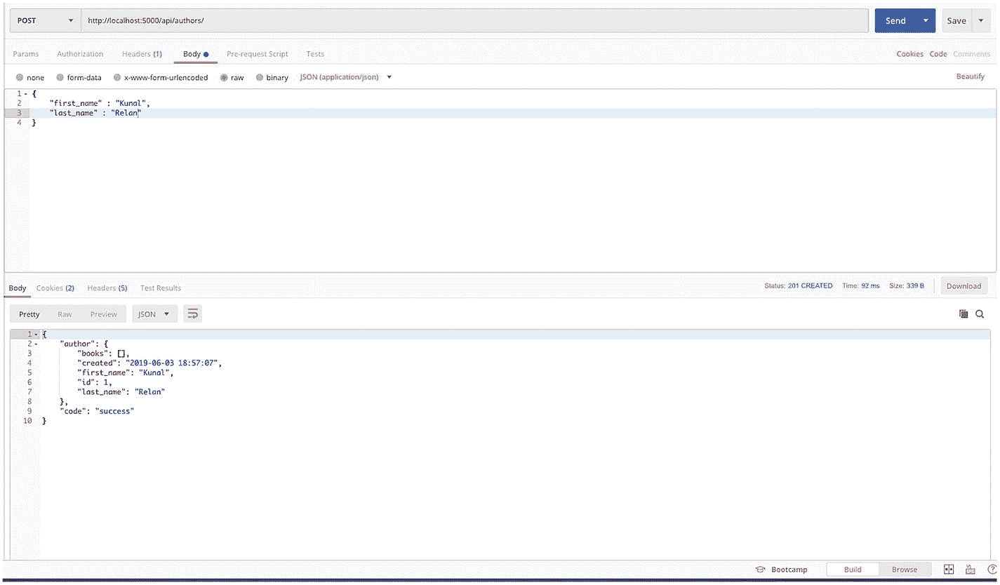

图 3-1

帖子作者端点

如您所见，books 是一个空数组，因为我们还没有创建任何书；接下来让我们添加 GET authors 端点(图 [3-1](#Fig1) )。

```py
@author_routes.route('/', methods=['GET'])
def get_author_list():
    fetched = Author.query.all()
    author_schema = AuthorSchema(many=True, only=['first_name', 'last_name','id'])
    authors, error = author_schema.dump(fetched)
    return response_with(resp.SUCCESS_200, value={"authors": authors})

```

前面的代码将添加 GET all authors route，这里我们将用一个只包含作者 ID、名字和姓氏的作者数组来响应。所以让我们来测试一下。

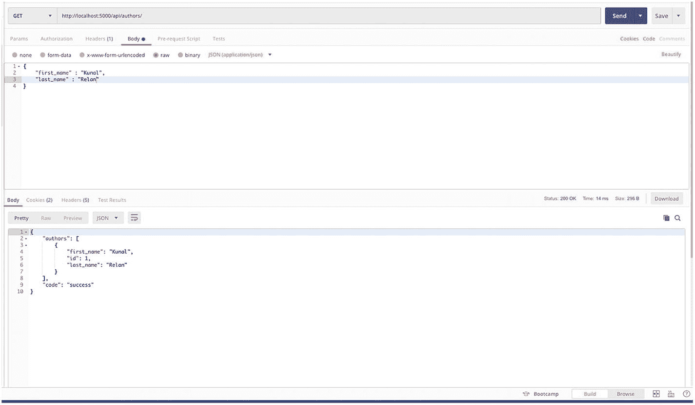

图 3-2

获取作者路线

正如您在图 [3-2](#Fig2) 中看到的，端点响应了一组作者。

接下来，让我们添加另一个 GET route 来使用作者的 ID 获取特定的作者，并添加以下代码来添加该 route。

```py
@author_routes.route('/<int:author_id>', methods=['GET'])
def get_author_detail(author_id):
    fetched = Author.query.get_or_404(author_id)
    author_schema = AuthorSchema()
    author, error = author_schema.dump(fetched)
    return response_with(resp.SUCCESS_200, value={"author": author})

```

前面的代码从 route 参数中获取一个整数，查找具有相应 ID 的作者，并返回 author 对象。

因此，让我们尝试获取 ID 为 1 的作者(图 [3-3](#Fig3) )。

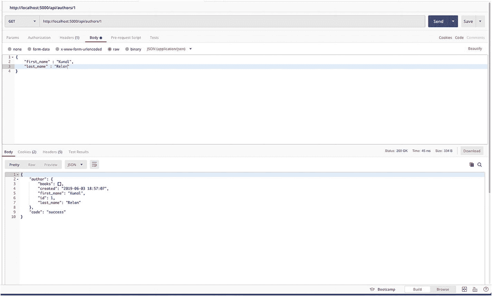

图 3-3

正在获取 ID 为 1 的作者

如果具有该 ID 的作者存在，我们将得到带有 200 状态代码和作者对象的响应，否则为 404，如下图所示。正如您所看到的，没有 ID 为 2 的作者，get_or_404 方法在端点上抛出 404 错误，然后由 app.errorhandler(404)按照我们在 main.py 中提到的方式进行处理(图 [3-4](#Fig4) )。

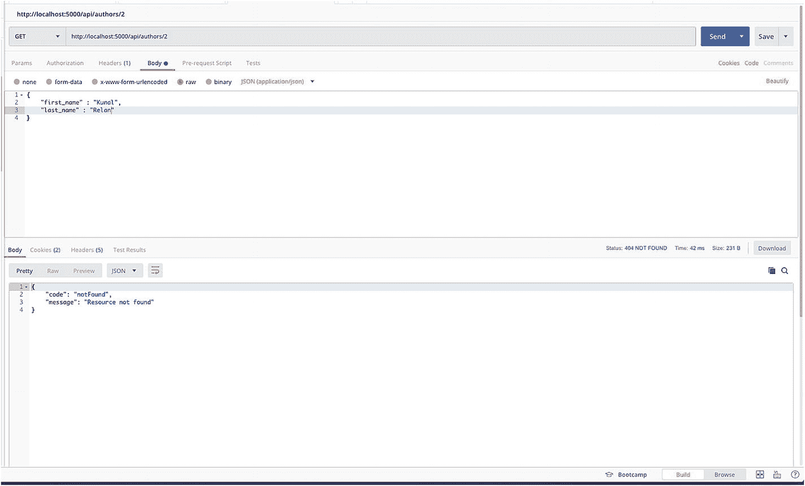

图 3-4

找不到 ID 为 2 的作者

在我们继续为 author 对象创建 PUT 和 DELETE 端点之前，让我们启动图书路由。在同一个 routes 文件夹中创建 books.py，并添加以下代码来启动路由。

```py
from flask import Blueprint, request
from api.utils.responses import response_with
from api.utils import responses as resp
from api.models.books import Book, BookSchema
from api.utils.database import db

book_routes = Blueprint("book_routes", __name__)

```

然后在 main.py 中注册 book routes，就像我们注册 author routes 一样。将下面的代码添加到导入作者路径的位置。

```py
from api.routes.books import book_routes

```

然后，在您添加了 author route blueprint 注册的地方的正下方，添加以下代码。

```py
app.register_blueprint(book_routes, url_prefix='/api/books')

```

现在您的 main.py 应该有以下代码。

```py
import logging
import sys
import api.utils.responses as resp
from flask import Flask, jsonify
from api.utils.database import db
from api.utils.responses import response_with
from api.routes.authors import author_routes
from api.routes.books import book_routes

def create_app(config):
    app = Flask(__name__)

    app.config.from_object(config)

    db.init_app(app)
    with app.app_context():
        db.create_all()
    app.register_blueprint(author_routes, url_prefix='/api/authors')
    app.register_blueprint(book_routes, url_prefix='/api/books')

    @app.after_request
    def add_header(response):
        return response

    @app.errorhandler(400)
    def bad_request(e):
        logging.error(e)
        return response_with(resp.BAD_REQUEST_400)

    @app.errorhandler(500)
    def server_error(e):
        logging.error(e)
        return response_with(resp.SERVER_ERROR_500)

    @app.errorhandler(404)
    def not_found(e):
        logging.error(e)
        return response_with(resp.SERVER_ERROR_404)

    db.init_app(app)
    with app.app_context():
        db.create_all()

    logging.basicConfig(stream=sys.stdout,
                        format='%(asctime)s|%(levelname)s|%(filename)s:%(lineno)s|%(message)s',
                        level=logging.DEBUG)
    return app

```

接下来让我们从创建 POST book 端点开始；打开 routes 文件夹中的 books.py，并在 book_routes 下添加以下代码。

```py
@book_routes.route('/', methods=['POST'])
def create_book():
    try:
        data = request.get_json()
        book_schema = BookSchema()
        book, error = book_schema.load(data)
        result = book_schema.dump(book.create()).data
        return response_with(resp.SUCCESS_201, value={"book": result})
    except Exception as e:
        print e
        return response_with(resp.INVALID_INPUT_422)

```

前面的代码将获取用户数据，然后对 book schema 执行 create()方法，就像我们在 author object 中所做的一样；让我们保存文件并测试端点。

```py
{
       "title" : "iOS Penetration Testing",
       "year" : 2016,
       "author_id": 1
 }

```

我们将使用前面的 JSON 数据发送到端点，我们应该得到一个包含 200 状态代码和新创建的 book 对象的响应。正如我们之前所讨论的，我们已经建立了作者和书籍之间的关系，在前面的例子中，我们已经为新书指定了 ID 为 1 的作者，所以一旦这个 API 成功，我们将能够获取 ID 为 1 的作者，作为响应，books 数组将把这本书作为一个对象(图 [3-5](#Fig5) )。

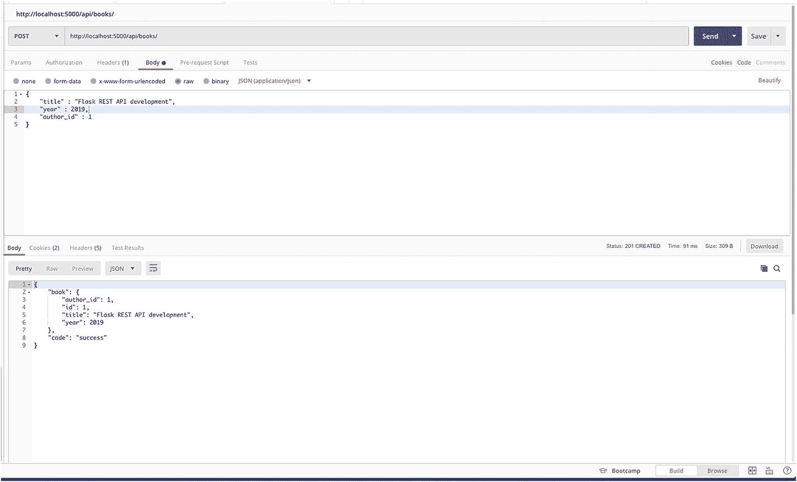

图 3-5

获取 ID 为 1 的作者

正如您在图 [3-6](#Fig6) 中看到的，当我们请求/authors/1 端点时，除了作者详细信息，我们还获得了 books 数组，其中包含作者链接到的书籍列表。

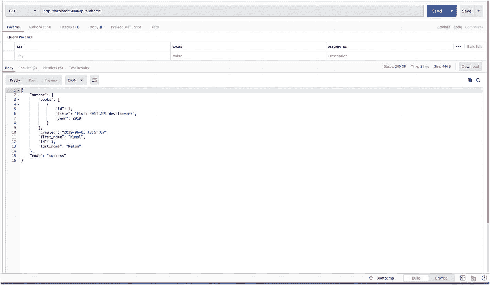

图 3-6

获取作者端点

所以我们的模特关系很好。现在我们可以继续为作者路由创建其余的端点。继续添加下面的代码来获取作者路由的 PUT 端点，以更新作者对象。

```py
@author_routes.route('/<int:id>', methods=['PUT'])
def update_author_detail(id):
    data = request.get_json()
    get_author = Author.query.get_or_404(id)
    get_author.first_name = data['first_name']
    get_author.last_name = data['last_name']
    db.session.add(get_author)
    db.session.commit()
    author_schema = AuthorSchema()
    author, error = author_schema.dump(get_author)
    return response_with(resp.SUCCESS_200, value={"author": author})

```

前面的代码将创建我们的 PUT 端点来更新 author 对象。在前面的代码中，我们在数据变量中获取一个请求 JSON，然后用请求参数中提供的 ID 获取作者。如果没有找到具有该 ID 的作者，请求以 404 状态代码结束，或者 get_author 包含 author 对象，然后我们用请求 JSON 中提供的数据更新 first_name 和 last_name，然后保存会话。

所以让我们继续更新我们不久前创建的作者的名字和姓氏(图 [3-7](#Fig7) )。

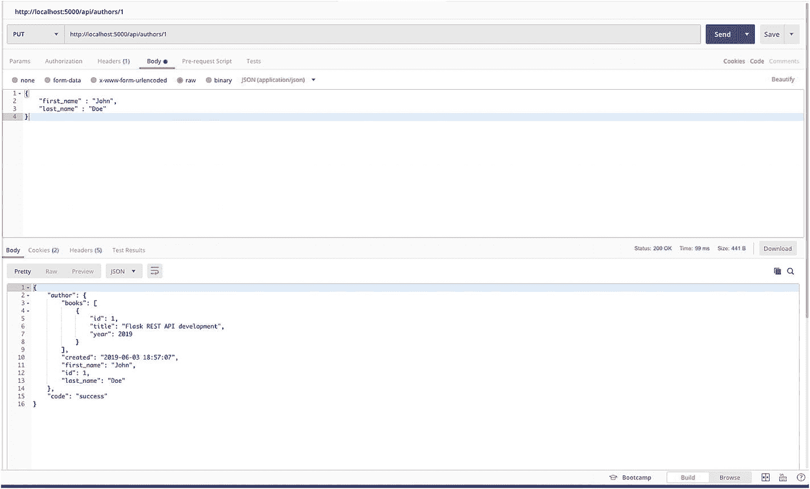

图 3-7

放置作者端点

所以这里我们更新了作者的名和姓。然而，在 PUT 中，我们需要发送对象的整个请求体，正如我们在第二章中所讨论的，所以接下来我们将创建一个补丁端点来只更新 author 对象的一部分。为修补程序端点添加以下代码。

```py
@author_routes.route('/<int:id>', methods=['PATCH'])
def modify_author_detail(id):
    data = request.get_json()
    get_author = Author.query.get(id)
    if data.get('first_name'):
        get_author.first_name = data['first_name']
    if data.get('last_name'):
        get_author.last_name = data['last_name']
    db.session.add(get_author)
    db.session.commit()
    author_schema = AuthorSchema()
    author, error = author_schema.dump(get_author)
    return response_with(resp.SUCCESS_200, value={"author": author})

```

前面的代码像另一个端点一样获取请求 JSON，但并不期望整个请求体，而只是请求体中需要更新的字段，同样，它更新 author 对象并保存会话。让我们尝试一下，这次我们将只更改 author 对象的名字。

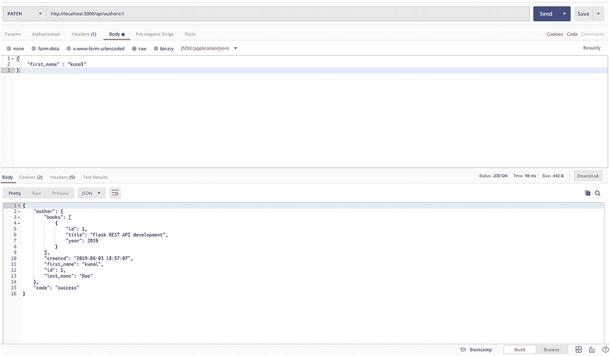

图 3-8

更改作者对象的名字

正如您在图 [3-8](#Fig8) 中看到的，我们只在请求体中提供了名字，它已经被更新了。接下来，我们将最终创建删除作者端点，它将从请求参数中获取作者 ID 并删除作者对象。注意，在这个例子中，我们将用 204 状态码来响应，没有任何内容。

```py
@author_routes.route('/<int:id>', methods=['DELETE'])
def delete_author(id):
    get_author = Author.query.get_or_404(id)
    db.session.delete(get_author)
    db.session.commit()
    return response_with(resp.SUCCESS_204)

```

添加前面的代码，现在这将创建我们的删除端点。让我们继续尝试删除 ID 为 1 的作者(图 [3-9](#Fig9) )。

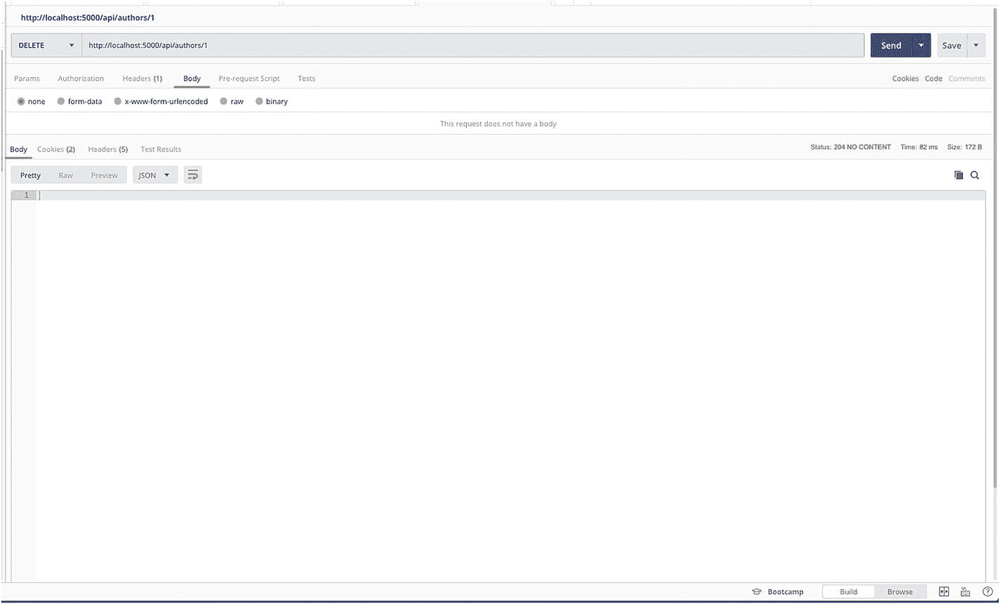

图 3-9

删除作者端点

有了这个端点，我们的 author 对象应该从数据库中删除，并且在创建 author 模式时，我们配置了 book 关系中的所有级联。因此，所有与作者 ID 1 相关的书籍也将被删除，以确保我们没有任何没有作者 ID 的书籍。

这就是我们的作者路线，接下来我们将致力于我们的书端点的其余部分。接下来，在 books.py 中添加以下代码来创建 GET books 端点。

```py
@book_routes.route('/', methods=['GET'])
def get_book_list():
    fetched = Book.query.all()
    book_schema = BookSchema(many=True, only=['author_id','title', 'year'])
    books, error = book_schema.dump(fetched)
    return response_with(resp.SUCCESS_200, value={"books": books})

```

保存文件并尝试端点；现在你将得到一个空数组，因为当我们删除作者时，作者 ID 为 1 的书也被删除了。

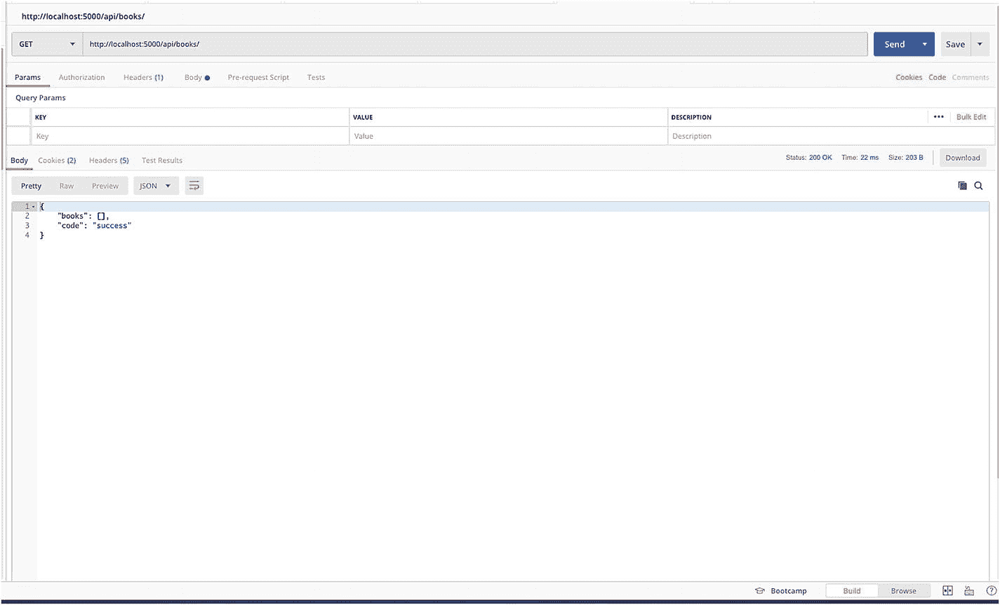

图 3-10

获取书籍端点

正如您在图 [3-10](#Fig10) 中看到的，到目前为止，表中没有书籍，所以继续创建一个作者，然后添加几本具有该作者 ID 的书籍，因为我们不能添加没有作者的书籍，否则它会以 422 不可处理的实体错误结束。

接下来，我们将通过 ID 端点创建 GET Book。

```py
@book_routes.route('/<int:id>', methods=['GET'])
def get_book_detail(id):
    fetched = Book.query.get_or_404(id)
    book_schema = BookSchema()
    books, error = book_schema.dump(fetched)
    return response_with(resp.SUCCESS_200, value={"books": books})

```

以下代码将创建按 ID 端点获取图书；接下来，我们将创建 PUT、PATCH 和 DELETE 端点，并为其添加以下代码。

```py
book_routes.route('/<int:id>', methods=['PUT'])
def update_book_detail(id):
    data = request.get_json()
    get_book = Book.query.get_or_404(id)
    get_book.title = data['title']
    get_book.year = data['year']
    db.session.add(get_book)
    db.session.commit()
    book_schema = BookSchema()
    book, error = book_schema.dump(get_book)
    return response_with(resp.SUCCESS_200, value={"book": book})

@book_routes.route('/<int:id>', methods=['PATCH'])
def modify_book_detail(id):
    data = request.get_json()
    get_book = Book.query.get_or_404(id)
    if data.get('title'):
        get_book.title = data['title']
    if data.get('year'):
        get_book.year = data['year']
    db.session.add(get_book)
    db.session.commit()
    book_schema = BookSchema()
    book, error = book_schema.dump(get_book)
    return response_with(resp.SUCCESS_200, value={"book": book})

@book_routes.route('/<int:id>', methods=['DELETE'])
def delete_book(id):
    get_book = Book.query.get_or_404(id)
    db.session.delete(get_book)
    db.session.commit()
    return response_with(resp.SUCCESS_204)

```

因此，这将结束我们的图书和作者路线，现在我们有一个工作休息应用程序。现在，您可以尝试在 author 和 book 路径上执行 CRUD。

## 用户认证

一旦我们准备好了所有的路由，我们需要添加用户身份验证以确保只有登录的用户才能访问特定的路由，所以现在我们将添加用户登录和注册路由，但在此之前，我们需要添加用户模式。

在模型中创建 users.py。在模式中，我们将添加两个静态方法来加密密码和验证密码，为此我们需要一个名为 passlib 的 Python 库，所以在创建模式之前，让我们使用 PIP 安装 passlib。

```py
(venv)$ pip install passlib

```

完成后，添加以下代码来添加用户模式和方法。

```py
from api.utils.database import db
from passlib.hash import pbkdf2_sha256 as sha256
from marshmallow_sqlalchemy import ModelSchema
from marshmallow import fields

class User(db.Model):
    __tablename__ = 'users'

    id = db.Column(db.Integer, primary_key = True)
    username = db.Column(db.String(120), unique = True, nullable = False)
    password = db.Column(db.String(120), nullable = False)

    def create(self):
        db.session.add(self)
        db.session.commit()
        return self

    @classmethod
    def find_by_username(cls, username):
        return cls.query.filter_by(username = username).first()

    @staticmethod
    def generate_hash(password):
        return sha256.hash(password)

    @staticmethod

    def verify_hash(password, hash):
        return sha256.verify(password, hash)

class UserSchema(ModelSchema):
    class Meta(ModelSchema.Meta):
        model = User
        sqla_session = db.session

    id = fields.Number(dump_only=True)
    username = fields.String(required=True)

```

因此，我们在这里添加了一个类方法，通过用户名查找用户，创建一个用户，然后创建两个静态方法来生成散列并验证它。我们将在创建用户路线时使用这些方法。

接下来在 routes 目录中创建 users.py，这是我们添加用户登录和注册路由的地方。

对于跨应用程序的用户认证，我们将使用 JWT (JSON Web 令牌)认证。JWT 是一个开放标准，它定义了一种紧凑的、自包含的方式，以 JSON 对象的形式安全地传输信息。JWT 是 REST 世界中一种流行的用户授权方式。在 Flask 中有一个名为 Flask-JWT 扩展的开源扩展，它提供了 JWT 支持和其他有用的方法。

让我们继续安装烧瓶-JWT-扩展。

```py
(venv)$ pip install flask-jwt-extended

```

接下来，我们将在 main.py 中初始化应用程序中的 JWT 模块，以便在 main.py 中导入库

```py
from flask_jwt_extended import JWTManager

```

接下来用 db.init_app()上面的代码初始化 JWTManager。

```py
jwt = JWTManager(app)

```

安装和初始化之后，让我们导入用户路由文件所需的模块。

```py
from flask import Blueprint, request
from api.utils.responses import response_with
from api.utils import responses as resp
from api.models.users import User, UserSchema
from api.utils.database import db
from flask_jwt_extended import create_access_token

```

这些是我们在用户路线中需要的模块；接下来，我们将使用 Blueprint 配置路由，代码如下。

```py
user_routes = Blueprint("user_routes", __name__)

```

接下来，我们将在 main.py 文件中导入并注册/users 路由，因此在 main.py 中添加以下代码来导入用户路由。

```py
from api.routes.users import user_routes

```

现在，在我们已经声明了其他路由的地方的正下方，添加以下代码行。

```py
app.register_blueprint(user_routes, url_prefix='/api/users')

```

接下来，我们将创建我们的 POST 用户路由来创建一个新用户，并在 routes 内部的 users.py 中添加以下代码。

```py
@user_routes.route('/', methods=['POST'])
def create_user():
    try:
        data = request.get_json()
        data['password'] = User.generate_hash(data['password'])
        user_schmea = UserSchema()
        user, error = user_schmea.load(data)
        result = user_schmea.dump(user.create()).data
        return response_with(resp.SUCCESS_201)
    except Exception as e:
        print e
        return response_with(resp.INVALID_INPUT_422)

```

这里，我们将用户请求数据放在一个变量中，然后对密码执行 generate_hash()函数并创建用户。一旦完成，我们将返回一个 201 响应。

接下来，我们将为注册用户创建一个登录路径。为相同的添加以下代码。

```py
@user_routes.route('/login', methods=['POST'])
def authenticate_user():
      try:
        data = request.get_json()
        current_user = User.find_by_username(data['username'])
        if not current_user:
            return response_with(resp.SERVER_ERROR_404)
        if User.verify_hash(data['password'], current_user.password):
            access_token = create_access_token(identity = data['username'])
            return response_with(resp.SUCCESS_201, value={'message': 'Logged in as {}'.format(current_user.username), "access_token": access_token})
        else:
            return response_with(resp.UNAUTHORIZED_401)
      except Exception as e:
        print e
        return response_with(resp.INVALID_INPUT_422)

```

下面的代码将从请求数据中获取用户名和密码，并使用我们在模式中创建的 find_by_username()方法检查具有所提供用户名的用户是否存在。接下来，如果用户不存在，我们将使用 404 进行响应，或者使用模式中的 verify_hash()函数来验证密码。如果用户存在，我们将生成一个 JWT 令牌并用 200 来响应；否则以 401 回应。现在我们已经有了用户登录。接下来，我们需要将 jwt required decorator 添加到我们想要保护的路由中。因此，在 routes 中导航到 authors.py，并使用下面的代码导入装饰器。

```py
from flask_jwt_extended import jwt_required

```

然后在端点定义之前，使用下面的代码添加装饰器。

```py
@jwt_required

```

我们将把装饰器添加到 authors.py 和 books.py 的 DELETE、PUT、POST 和 PATCH 端点，这些函数现在应该是这样的。

```py
@author_routes.route('/', methods=['POST'])
@jwt_required
def create_author():
      ....Function code

```

让我们继续测试我们的用户端点。打开 Postman，用用户名和密码请求 POST 用户端点。我们将使用下面的样本数据。

```py
{
       "username" : "admin",
       "password" : "flask2019"
 }

```

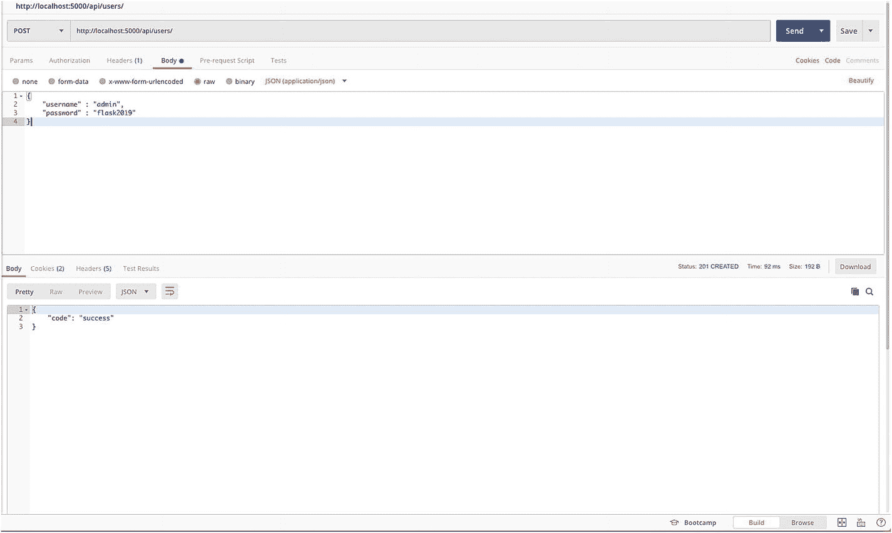

图 3-11

用户注册端点

这样我们的新用户就创建好了(图[3-11](#Fig11))；接下来，我们将尝试使用相同的凭据登录并获取 JWT。

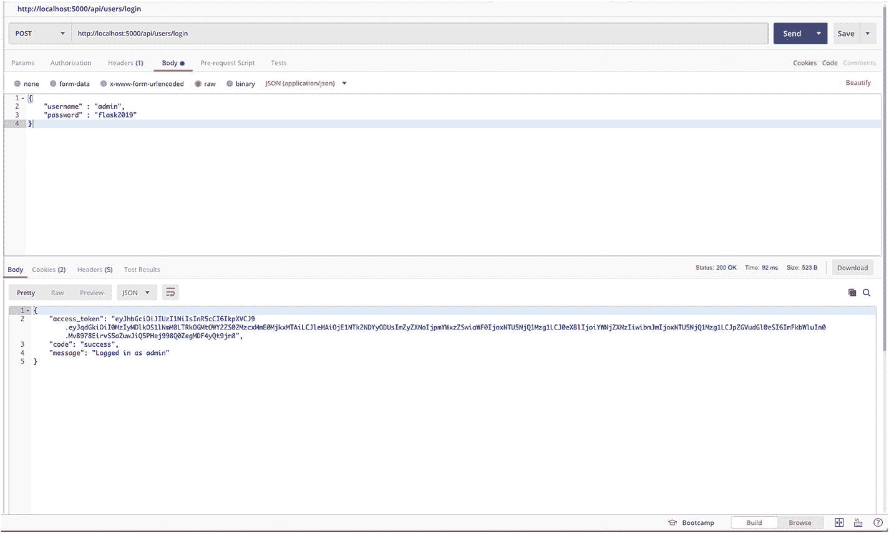

图 3-12

用户登录端点

如图 [3-12](#Fig12) 所示，我们已经使用新创建的用户成功登录。现在让我们尝试访问最近添加了 jwt_required decorator 的 POST author 路径(图 [3-13](#Fig13) )。

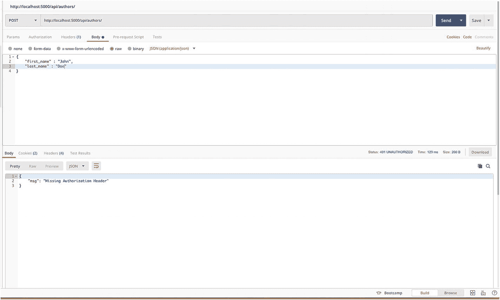

图 3-13

无 JWT 令牌的帖子作者路线

如图 [3-14](#Fig14) 所示，我们无法再访问 POST author 路径，jwt_required decorator 返回 401 错误。现在，让我们通过在报头中提供 JWT 来尝试访问相同的路由。在 Postman 中请求的头部分，添加带有名为 Authorization 的密钥的令牌，然后在 value 中添加 Bearer <令牌>来提供 JWT 令牌，如图 [3-14](#Fig14) 所示。

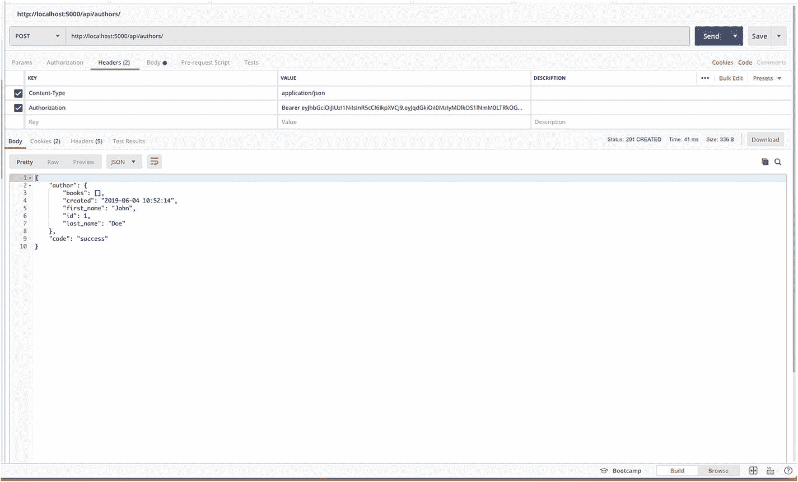

图 3-14

JWT 后作者路线

如您所见，添加 JWT 令牌后，我们能够再次访问端点，这就是我们保护 REST 端点的方式。

因此，在下面的场景中，我们允许任何人登录平台，然后访问路线。然而，在实际应用中，我们还可以进行电子邮件验证和限制用户注册，同时我们还可以启用基于用户的访问控制，不同类型的用户可以访问特定的 API。

## 结论

本章到此结束，我们已经成功地创建了一个带有用户认证的 REST 应用程序。在下一章，我们将致力于记录 REST APIs，集成单元测试，以及部署我们的应用程序。