# 4.烧瓶积垢应用(第二部分)

在上一章中，我们使用 Flask 创建了 REST APIs，现在我们有了一个工作的 CRUD 应用程序。在这一章中，我们将讨论和实现支持和扩展 REST APIs 的特性。虽然我们已经做好了部署的一切准备，但是，在部署应用程序之前，我们还需要讨论一些事情。

1.  电子邮件验证

2.  文件上传

3.  讨论 API 文档

4.  整合霸气

## 介绍

在上一章中，我们使用 Flask 和 MySQL 创建了一个 REST 应用程序。在这一章中，我们将讨论如何扩展应用程序的附加功能。我们首先将电子邮件验证添加到我们的用户模型中。接下来，我们还将向用户对象添加文件上传端点，我们还将讨论 API 文档的需求、记录 API 的最佳实践以及使用 Swagger 作为 API 文档工具。

## 电子邮件验证

在上一章中，我们创建了使用唯一用户名和密码的用户注册和登录。在这一章中，我们将通过在用户模型中添加电子邮件注册来扩展用户身份验证，并添加电子邮件验证。为此，我们将在模型中添加 email 字段，一旦使用 signup API 创建了新的用户对象，我们将创建一个验证令牌，并向用户发送一封电子邮件，其中包含验证帐户的链接。我们还将禁用用户登录，直到电子邮件被验证。首先，让我们在用户模型中添加必需的字段。

在模型中浏览到 users.py，并在 User 类中的 password 下添加以下几行。

```py
    isVerified = db.Column(db.Boolean,  nullable=False, default=False)
    email = db.Column(db.String(120), unique = True, nullable = False)

```

并在 UserSchema 类中的 username 下面添加下面一行。

```py
    email = db.Column(db.String(120), unique = True, nullable = False)

```

此外，由于现在我们有了用户电子邮件，我们将更新 find_by_username 类方法以通过电子邮件查找。因此，将 find_by_username 方法更新为以下内容。

```py
    @classmethod
    def find_by_email(cls, email):
        return cls.query.filter_by(email = email).first()

```

现在，您的用户类应该具有以下代码。

```py
class User(db.Model):
    __tablename__ = 'users'

    id = db.Column(db.Integer, primary_key = True)
    username = db.Column(db.String(120), unique = True, nullable = False)
    password = db.Column(db.String(120), nullable = False)
    isVerified = db.Column(db.Boolean,  nullable=False, default=False)
    email = db.Column(db.String(120), unique = True, nullable = False)
    def create(self):
        db.session.add(self)
        db.session.commit()
        return self
    @classmethod
    def find_by_email(cls, email):
        return cls.query.filter_by(email = email).first()

    @classmethod
    def find_by_username(cls, email):
        return cls.query.filter_by(username = username).first()

    @staticmethod
    def generate_hash(password):
        return sha256.hash(password)

    @staticmethod
    def verify_hash(password, hash):
        return sha256.verify(password, hash)

```

和 UserSchema 应该具有以下代码。

```py
class UserSchema(ModelSchema):
    class Meta(ModelSchema.Meta):
        model = User
        sqla_session = db.session

    id = fields.Number(dump_only=True)
    username = fields.String(required=True)
    email = fields.String(required=True)

```

请注意，默认情况下，isVerified 字段设置为 False，一旦用户验证了电子邮件，我们会将其设置为 True，以便用户登录。

接下来，我们将添加一个名为 token.py 的 util，它将包含生成验证令牌和确认验证令牌的方法。邮件中的验证链接将包含一个带有验证令牌的唯一 URL，该验证令牌应该类似于`htttp://host/api/users/confirm/<verification_token>`，并且这里的令牌应该始终是唯一的。我们将使用它的危险包来编码用户电子邮件和时间戳，所以让我们继续在 api/utils 中创建 token.py。

在我们编写生成令牌的代码之前，我们需要向 app config 添加几个变量，因为它的 dangerous 需要一个密钥和密码 salt 才能工作，我们将从 config.py 中提供这些密钥和密码 salt。

```py
    SECRET_KEY= 'your_secured_key_here'
    SECURITY_PASSWORD_SALT= 'your_security_password_here'

```

接下来，在 token.py 中添加以下代码来导入需求。

```py
from itsdangerous import URLSafeTimedSerializer
from flask import current_app

```

然后添加以下代码来生成令牌。

```py
def generate_verification_token(email):
    serializer = URLSafeTimedSerializer(current_app.config['SECRET_KEY'])
    return serializer.dumps(email,salt=current_app.config['SECURITY_PASSWORD_SALT'])

```

在前面的方法中，我们使用 URLSafeTimedSerializer 生成一个使用电子邮件地址的令牌，电子邮件被编码在令牌中。接下来，我们将创建另一种方法来验证令牌和过期时间，只要令牌有效且未过期，我们将返回电子邮件并验证用户电子邮件。

```py
    def confirm_verification_token(token, expiration=3600):
    serializer = URLSafeTimedSerializer(current_app.config['SECRET_KEY'])
    try:
        email = serializer.loads(
            token,
            salt=current_app.config['SECURITY_PASSWORD_SALT'],
            max_age=expiration
        )
    except Exception as e :
        return e
    return email

```

一旦我们有了令牌工具，我们现在就可以修改用户路由了。让我们从在电子邮件验证之前禁用用户登录开始。更新登录路由，使其具有以下代码；在这里，我们将 find_by_username 更改为 find_by_email，现在我们希望用户在登录端点 JSON 数据中发送电子邮件地址，如果用户没有通过验证，我们将返回一个 400 错误代码的请求，但不包含令牌。

现在，您的登录方法应该包含以下代码。

```py
@user_routes.route('/login', methods=['POST'])
def authenticate_user():
      try:
        data = request.get_json()
        if data.get('email') :
            current_user = User.find_by_email(data['email'])
        elif data.get('username') :
            current_user = User.find_by_username(data['username'])
        if not current_user:
            return response_with(resp.SERVER_ERROR_404)
        if current_user and not current_user.isVerified:
            return response_with(resp.BAD_REQUEST_400)
        if User.verify_hash(data['password'], current_user.password):
            access_token = create_access_token(identity = current_user.username)
            return response_with(resp.SUCCESS_201, value={'message': 'Logged in as {}'.format(current_user.username), "access_token": access_token})
        else:
            return response_with(resp.UNAUTHORIZED_401)
      except Exception as e:
        return response_with(resp.INVALID_INPUT_422)

```

现在，让我们创建一个端点来验证电子邮件令牌。

我们将从导入 user.py 中最近创建的方法开始

```py
from api.utils.token import generate_verification_token, confirm_verification_token

```

接下来，在用户注册方法的正下方添加下面的 GET 端点来处理电子邮件验证。

```py
@user_routes.route('/confirm/<token>', methods=['GET'])
def verify_email(token):
    try:
        email = confirm_verification_token(token)
    except:
        return response_with(resp.SERVER_ERROR_401)
    user = User.query.filter_by(email=email).first_or_404()
    if user.isVerified:
        return response_with(resp. INVALID_INPUT_422)
    else:
        user.isVerified = True
        db.session.add(user)
        db.session.commit()
        return response_with(resp.SUCCESS_200, value={'message': 'E-mail verified, you can proceed to login now.'})

```

下一步是更新用户注册方法，以生成令牌并将电子邮件发送到指定的地址进行验证，因此这里我们将从在我们的实用程序中创建一个电子邮件实用程序来发送电子邮件开始。

为了做到这一点，我们需要一个 flask-mail 库；让我们从安装相同的开始。确保您仍然在虚拟环境中，使用下面一行在您的终端中安装 flask-mail。

```py
(venv) $ pip install Flask-Mail

```

安装完成后，让我们启动并配置 flask-mail。在 config.py 中添加以下变量来配置邮件。

```py
    MAIL_DEFAULT_SENDER= 'your_email_address'
    MAIL_SERVER= 'email_providers_smtp_address'
    MAIL_PORT= <mail_server_port>
    MAIL_USERNAME= 'your_email_address'
    MAIL_PASSWORD= 'your_email_password'
    MAIL_USE_TLS= False
    MAIL_USE_SSL= True

```

接下来在 utils 中创建 email.py 并添加以下代码。

```py
from flask_mail import Message,Mail
from flask import current_app
mail = Mail()

```

接下来，让我们在 main.py 中导入邮件，并使用 app config 启动它。

```py
from api.utils.email import mail

```

将它添加到 main.py 中的其他导入中，然后在 create_app 中启动 JWTManager 的位置的正下方，添加以下代码。

```py
    mail.init_app(app)

```

现在我们的邮件对象应该用 app config 初始化；接下来在 email.py 中，我们来写一个发送邮件的方法。

在 email.py 中添加以下代码，以创建一个 send_email 方法，该方法将接收发件人的地址、主题和要发送的邮件模板。

```py
def send_email(to, subject, template):
    msg = Message(
        subject,
        recipients=[to],
        html=template,
        sender=current_app.config['MAIL_DEFAULT_SENDER']
    )
    mail.send(msg)

```

因此，这就是我们为了发送验证邮件所需要做的全部工作；让我们返回到 users.py 并更新用户注册方法来合并这些更改。

让我们首先使用下面的代码行在 users.py 中导入 send_email、url_for 和 render_template_string 方法。

```py
from api.utils.email import send_email
from flask import url_for, render_template_string

```

更新 users.py 中 create_user()方法的以下代码，就在 return 函数之前。

```py
    try:
        data = request.get_json()
        if(User.find_by_email(data['email']) is not None or User.find_by_username(data['username']) is not None):
            return response_with(resp.INVALID_INPUT_422)
        data['password'] = User.generate_hash(data['password'])
        user_schmea = UserSchema()
        user, error = user_schmea.load(data)
        token = generate_verification_token(data['email'])
        verification_email = url_for('user_routes.verify_email', token=token, _external=True)
        html = render_template_string("<p>Welcome! Thanks for signing up. Please follow this link to activate your account:</p> <p><a href='{{ verification_email }}'>{{ verification_email }}</a></p> <br> <p>Thanks!</p>", verification_email=verification_email)
        subject = "Please Verify your email"
        send_email(user.email, subject, html)
        result = user_schmea.dump(user.create()).data
        return response_with(resp.SUCCESS_201)
    except Exception as e:
        print e
        return response_with(resp.INVALID_INPUT_422)

```

在这里，我们提供电子邮件来生成 _ 验证 _ 令牌，并获得令牌作为回报。接下来，我们使用 Flask 的 url_for，使用我们刚刚创建的验证路由和令牌来生成验证 url。之后，我们使用 Jinja2 的 render_template_string 呈现 HTML 模板，其中我们提供 HTML 字符串和验证变量，然后我们将所有用户提供的电子邮件、主题和 HTML 提供给 send_email 方法，以发送验证电子邮件。

这就是我们设置电子邮件验证所需的全部内容。让我们开始测试注册、登录和验证路径，检查是否一切正常。

让我们从注册端点开始；打开你的邮递员，请求 POST/users API；但是，在 JSON 主体中，添加一个有效的电子邮件地址。

```py
{
      "username" : "kunalrelan",
      "password" : "helloworld",
      "email" : "kunal.relan@hotmail.com"
 }

```

我们将在请求数据中使用以下 JSON 并访问端点；响应应该与前面类似；但是，您应该会从您在 JSON 数据中使用令牌指定的电子邮件上配置的邮件地址收到一封验证电子邮件(图 [4-1](#Fig1) )。

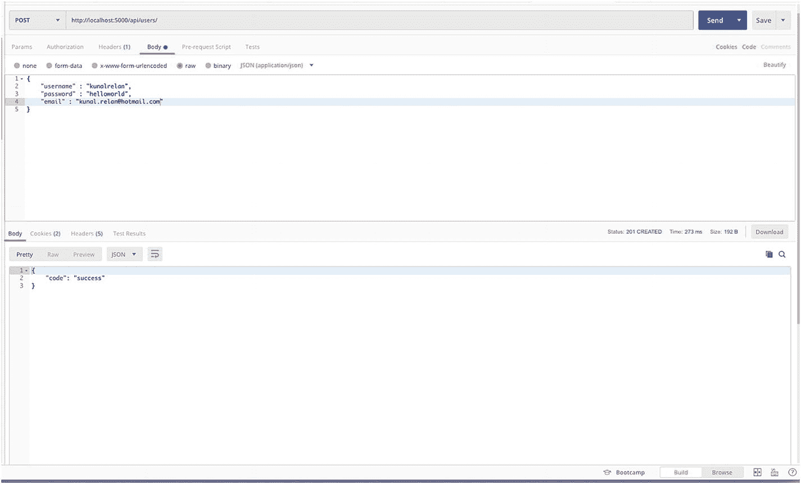

图 4-1

用户注册 API

接下来，让我们检查电子邮件收件箱，以检查电子邮件是否到达并验证用户。

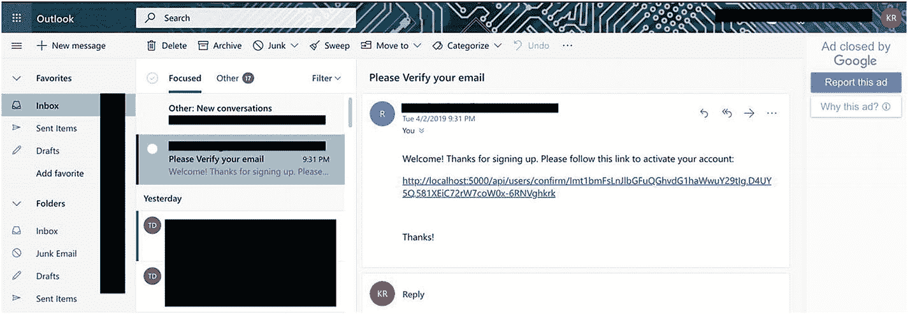

图 4-2。

正如您在图 [4-2](#Fig2) 中看到的，验证电子邮件到达时带有验证用户帐户的链接。在我们激活用户帐户之前，让我们尝试使用用户凭证登录，以检查电子邮件验证是否正常工作(图 [4-3](#Fig3) )。

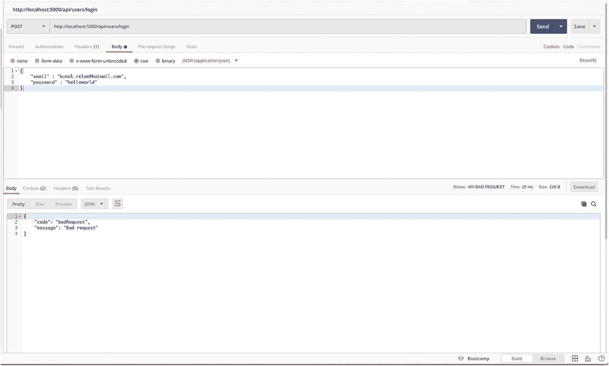

图 4-3

未经验证的用户登录

如图 [4-4](#Fig4) 所示，用户未经验证，因此无法登录。现在让我们打开电子邮件中提供的链接来验证用户，然后允许用户登录并获得 JWT 令牌。

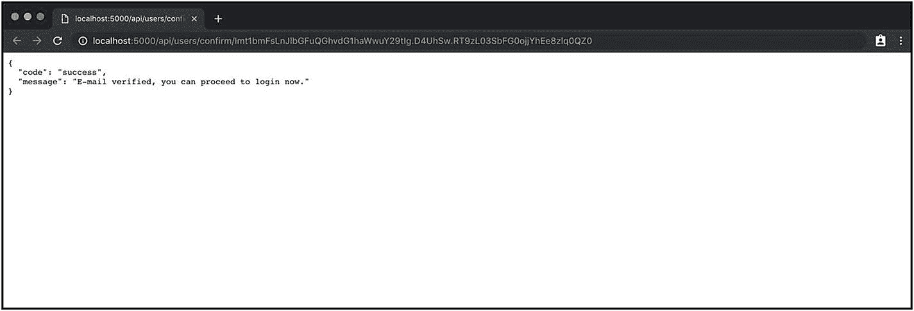

图 4-4

用户电子邮件验证

一旦用户通过验证，让我们再次尝试登录，现在我们应该能够登录并获得 JWT 令牌。

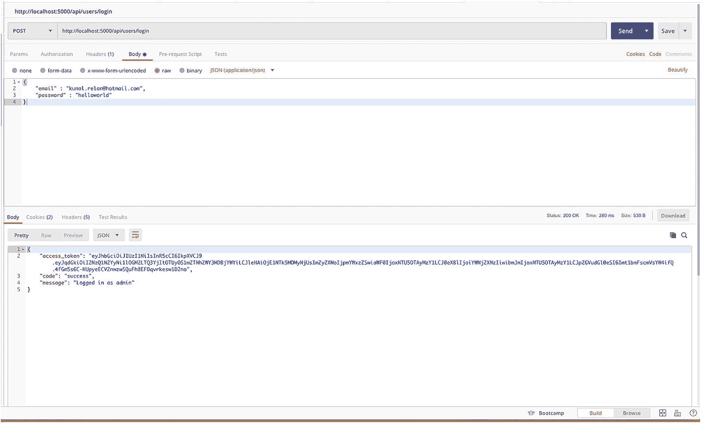

图 4-5

用户验证后登录

正如您在图 [4-5](#Fig5) 中看到的，我们现在再次能够在验证电子邮件地址后登录到帐户。

这就是本节的内容。我们已经成功地实现了用户电子邮件验证，这里我们所做的只是电子邮件验证的一个用例；有很多方法可以使用电子邮件验证。在许多应用程序中，用户甚至可以在电子邮件验证之前登录；但是，对于未经验证的用户，某些功能是禁用的，可以通过我们在登录端点中所做的更改来复制这些功能。在下一节中，我们将实现文件上传和处理。

## 文件上传

文件上传是 REST APIs 中的另一个常见用例。在本节中，我们将实现作者模型的头像上传和访问头像的端点。这里的想法很简单；我们将更新作者模型以存储头像 URL，为登录用户创建另一个端点以使用作者 ID 为作者上传头像，将文件保存在文件系统中，并创建另一个端点以处理静态图像文件。

在我们开始开发这个特性之前，让我们再谈一谈在 Flask 中处理文件上传的问题。这里，我们将使用 multipart/form-data 内容类型，它向客户端指示请求资源的媒体类型，并使用 request.files。我们还将定义一组允许的文件扩展名，因为除了要上传的图像之外，我们不需要任何其他文件类型，否则会导致很大的安全漏洞。然后，我们将使用 werkzeug.secure_filename()对上传文件的名称进行转义，这遵循了“永远不要相信用户输入”的原则，因此文件名可能包含恶意代码，从而导致安全漏洞被利用。因此，该方法将对文件名中的特殊字符进行转义。

首先，让我们更新作者模型，添加头像字段。因此，在模型中打开 authors.py，并在模型声明中，在 Author 类中添加以下行

```py
    avatar = db.Column(db.String(20), nullable=True)

```

AuthorSchema 类中的下面一行

```py
    avatar = fields.String(dump_only=True)

```

之后，在/src 中创建一个新文件夹，命名为 images，并在 app config 中添加上传文件夹配置，我们稍后将使用它来保存和获取上传的头像。

因此，在 config 中打开 config.py 并添加以下参数。

```py
    UPLOAD_FOLDER= 'images'

```

现在，我们将从 Flask 中导入 werkzeug.secure_filename()和 url_for，我们将在将要创建的端点中需要它们，因此在 routes 中 authors.py 的其他导入下面添加以下代码行。

```py
from werkzeug.utils import secure_filename

```

接下来，我们从 Flask 导入蓝图和请求，添加 url_for，如下所示。

```py
from flask import Blueprint, request, url_for, current_app

```

在导入之后，声明 allowed_extensions，它将包含一组允许的文件扩展名。

```py
allowed_extensions = set(['image/jpeg', 'image/png', 'jpeg'])

```

一旦我们有了集合，让我们创建一个方法来检查上传文件的扩展名是否是图像的扩展名。

将以下代码添加到 allowed_extensions 的正下方。

```py
def allowed_file(filename):
       return filetype in allowed_extensions

The above function will take the filename from the file and check if the extension is valid and return.

```

现在添加以下端点以添加头像上传端点。

```py
@author_routes.route('/avatar/<int:author_id>', methods=['POST'])
@jwt_required
def upsert_author_avatar(author_id):
    try:
        file = request.files['avatar']
        get_author = Author.query.get_or_404(author_id)
        if file and allowed_file(file.content_type):
            filename = secure_filename(file.filename)
            file.save(os.path.join(current_app.config['UPLOAD_FOLDER'], filename))
        get_author.avatar = url_for('uploaded_file', filename=filename, _external=True)
        db.session.add(get_author)
        db.session.commit()
        author_schema = AuthorSchema()
        author, error = author_schema.dump(get_author)
        return response_with(resp.SUCCESS_200, value={"author": author})
    except Exception as e:
        print e
        return response_with(resp.INVALID_INPUT_422)

```

在下面的代码中，我们在 request.files 中查找 avatar 字段，然后用提供的用户 ID 查找用户。一旦我们有了它，我们将检查一个文件是否被上传，然后使用我们刚刚导入的 secure_filename 函数对文件名进行转义。然后，我们将使用 file.save 方法，并通过连接配置中的 UPLOAD_FOLDER 和文件名来提供路径，从而将文件保存在 images 文件夹中。现在，一旦保存了文件，我们将使用 url_for 方法创建一个用于访问上传文件的 url，为此，我们将使用 uploaded_file 方法创建一个路由，该方法接受一个文件名，并从我们接下来将创建的已配置的上传文件夹中提供该文件名。完成后，我们将更新作者模型，并用上传的头像的 URL 更新头像字段。

接下来转到 main.py，并在 create_app 函数中的路由蓝图声明之后添加以下路由。

```py
 @app.route('/avatar/<filename>')
  def uploaded_file(filename):
      return send_from_directory(app.config['UPLOAD_FOLDER'],filename)

```

因此，这个函数将接受文件名，并在响应中从配置的 UPLOAD_FOLDER 返回文件。

这就是文件上传，现在我们应该能够上传一个作者的头像并取回它。让我们回到邮差那里试一试。

现在用表单数据请求更新头像端点，指定关键头像，选择你想上传的图片，然后发送。我们将得到 200 个成功响应，用户对象作为响应；现在注意带有文件链接的头像字段(图 [4-6](#Fig6) )。

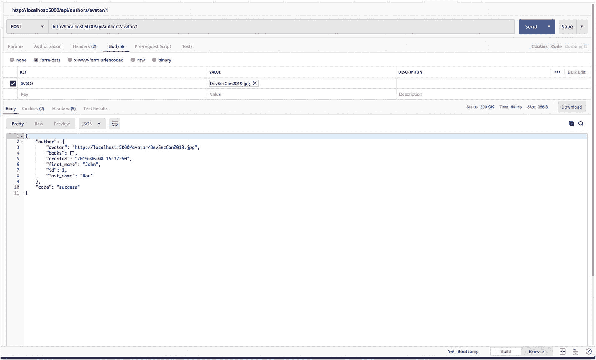

图 4-6

作者头像上传端点

接下来，单击头像链接获取您刚刚创建的图像，检查它是否存在。


图 4-7

获取化身端点

正如您在图 [4-7](#Fig7) 中看到的，我们能够使用我们创建的路线获取图像。接下来，让我们尝试上传一个 HTML 文件，检查允许的扩展名检查是否工作正常。为此，只需创建一个包含任何文本的 HTML 文件，或者使用任何已有的 HTML 文件并尝试上传。

现在，正如您在图 [4-8](#Fig8) 中看到的，我们在尝试上传该端点上不允许的 HTML 文件时出错，确保我们的扩展检查工作正常。

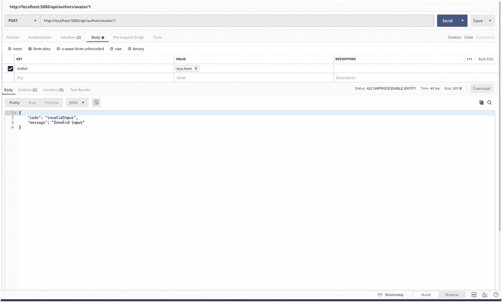

图 4-8

上传具有无效文件类型的头像端点

## 美国石油学会文件

API 开发的过程并不仅仅在编程之后就结束了。由于 REST APIs 被各种各样的客户端使用，因此也被其他开发人员使用，这些开发人员要么通过 REST 客户端直接访问它们，要么与某种 REST 客户端集成，API 文档提供了一种理解 REST 端点功能的简单方法，这使得 API 文档成为开发基于 REST 的应用程序的重要部分。

在本节中，我们将讨论 API 文档、OpenAPI 规范和 Swagger 的基础知识，使用 OpenAPI 规范生成 API 文档，发布 API 文档，以及使用 Swagger UI 测试 API。

### API 文档的构建块

在 REST API 参考文档中，文档基于五个部分，即:

1.  资源描述:如前所述，资源指的是从 API 返回的信息；在本书的上下文中，作者、书籍和用户都是资源。资源描述通常很简短，只有一到两句话。每个资源都有可以访问的特定动词。

2.  端点和方法:端点定义如何访问所提供的资源，方法指示资源上允许的交互或动词，例如 GET、POST、PUT、DELETE 等。任何资源都有路径和方法不同的相关端点，但都将围绕同一资源。

3.  参数:参数是端点的可变部分，它指定了您正在处理的数据。

4.  请求示例:请求示例包括一个示例请求，其中包含必需字段、可选字段及其示例值。请求示例通常应该尽可能丰富，并包含所有可接受的字段。

5.  响应示例和模式:顾名思义，响应示例包含一个根据请求的 API 响应的详细示例。另一方面，模式定义了如何格式化和标记响应。响应的描述通常称为响应模式，它是描述所有可能的参数和响应类型的复杂文档。

### OpenAPI 规范

OpenAPI 规范(OAS)为 REST API 定义了一个标准的、与语言无关的接口，允许人类和计算机在不查看源代码或进行网络检查的情况下理解应用程序的功能，使 API 消费者在不知道实现逻辑的情况下理解应用程序的工作。

OpenAPI 定义可以有多个用例，包括显示 API 的文档生成、测试工具等等。

对于本书的上下文，我们将使用 OpenAPI 规范和 Swagger UI 来生成和显示 API 参考文档。

OpenAPI 定义了一个标准集，用于描述 API 的各个部分；通过这样做，像 Swagger UI 这样的发布工具可以以编程方式解析信息，并使用定制的样式和交互功能来显示信息。OpenAPI 规范文档可以用 YAML (YAML 不是标记语言)或 JSON 表示，但最终规范文件将是一个 JSON 文档。由于 YAML 可读性更强，格式更通用，我们将使用 YAML 创建 OpenAPI 规范文档，然后使用 Swagger UI 发布。

因此，在我们开始为我们的端点编写 OpenAPI 规范之前，让我们了解一下 OpenAPI 规范的基础。OpenAPI 规范文档具有三个必需的组成部分，即定义 openapi 规范的语义版本号的 OpenAPI，这对于用户理解文档是如何格式化的以及对于解析工具相应地解析文档是必不可少的；Info，包含 API 的元数据，其本质上具有作为必填字段的标题和 API 版本，以及附加字段，如描述、法律信息和联系人；和路径，其中包含有关端点及其可用操作的信息。

Paths 对象是 OpenAPI 规范文档的核心，它包含了可用端点的详细信息，也就是我们在上一节中讨论的五个组件。

OpenAPI 规范 3.0 是最新版本；它的旧版本是 Swagger specification 2.0，后来被更新为 OpenAPI spec。对于本书，我们将使用 Swagger 2.0 规范并定义 API 文档；为此，您可以使用 Swagger 中的 Inspector，或者使用构建时 Swagger 生成工具来生成它们。让我们看看这两种方法。我们将从检查 Swagger Inspector 开始，然后继续构建时间生成器，我们将把它集成到我们的应用程序中。

首先，在您的浏览器窗口(Chrome 浏览器)中打开 [`https://inspector.swagger.io`](https://inspector.swagger.io) ，用您喜欢的调制解调器登录/注册(图 [4-9](#Fig9) )。

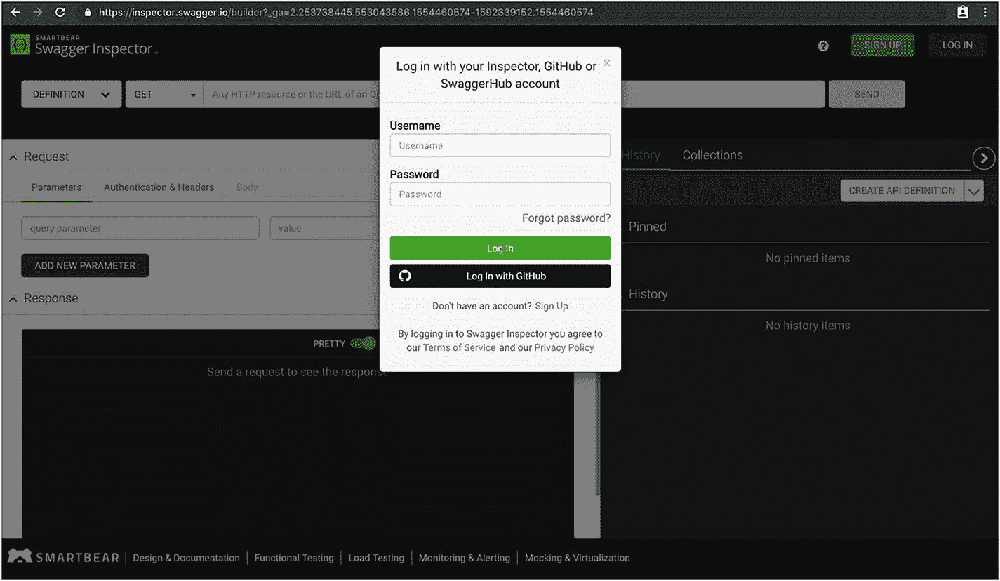

图 4-9

神气活现的检查员

一旦你登录，你就可以使用 Swagger Inspector 的所有功能；接下来，我们将需要使用他们的 REST 客户端访问我们的 API 资源，一旦我们这样做了，它将出现在历史中，我们将能够将其转换为 OpenAPI 规范文件，但在我们可以访问我们在本地服务器上运行的应用程序之前，我们需要添加 Swagger Inspector Chrome 扩展，为此，使用 [`https://chrome.google.com/webstore/detail/swagger-inspector-extensi/biemppheiopfggogojnfpkngdkchelik`](https://chrome.google.com/webstore/detail/swagger-inspector-extensi/biemppheiopfggogojnfpkngdkchelik) 添加扩展。一旦您安装了扩展，Swagger Inspector 将能够在本地服务器上运行请求。

完成后，让我们从访问创建用户端点开始。因此，继续操作，类似于我们在 Postman 中所做的，添加 URL 并选择 POST 方法，在 body 中添加 JSON body 数据并单击 send(图 [4-10](#Fig10) )。

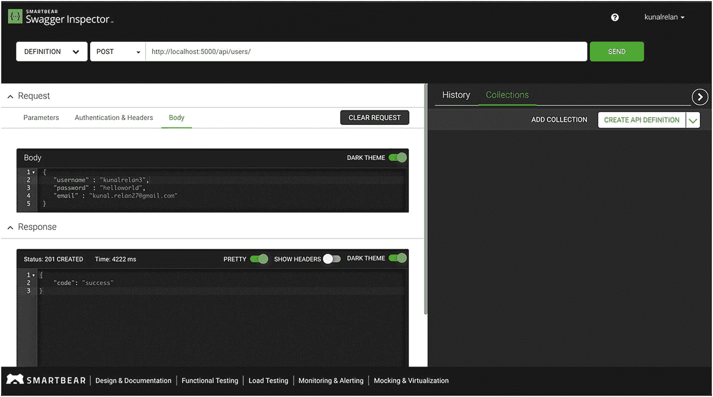

图 4-10

创建用户端点 Swagger 检查器

与 Postman 类似，您应该能够在响应窗口中检查 API 响应，如上图所示。接下来，您可以验证电子邮件，然后访问登录端点(图 [4-11](#Fig11) )。

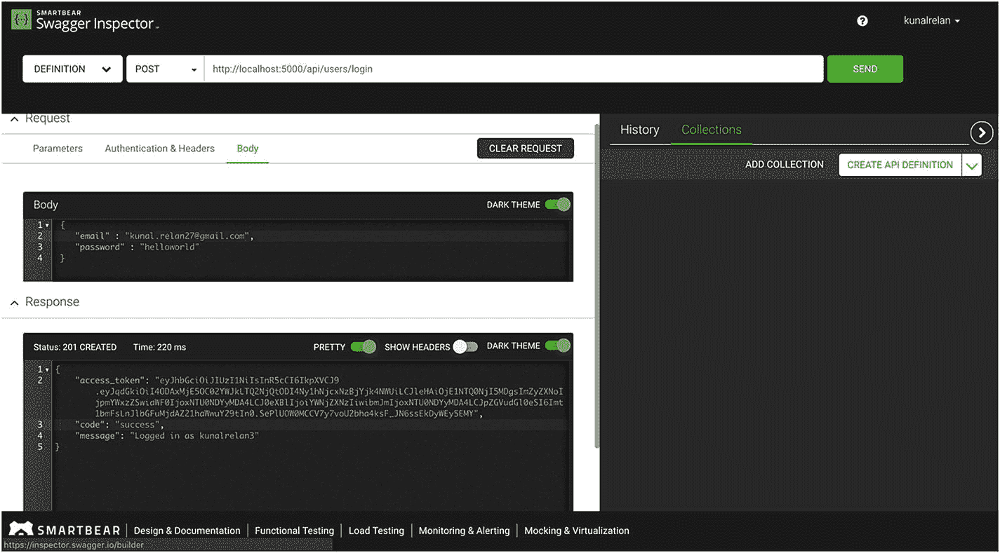

图 4-11

登录端点

一旦您请求了您希望 API 文档生成的所有端点，只需单击 History 选项卡并选择您希望规范文档生成的端点并固定它们。一旦您锁定了它们，单击 Create API Definition 按钮旁边的小箭头并选择 OAS 2.0 以使用规范的 2.0 版本(图 [4-12](#Fig12) )。

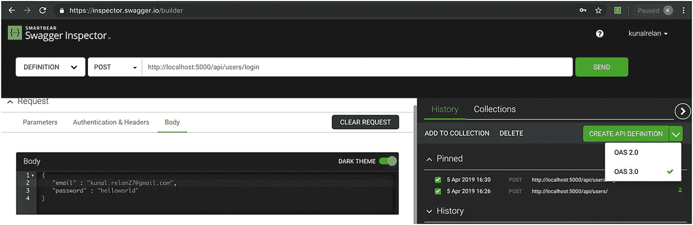

图 4-12

固定请求

现在，单击创建定义，一旦完成，将打开一个弹出窗口，其中包含打开 SwaggerHub 的链接，您可以在其中导入 OpenAPI 规范并查看 API 文档(图 [4-13](#Fig13) )。

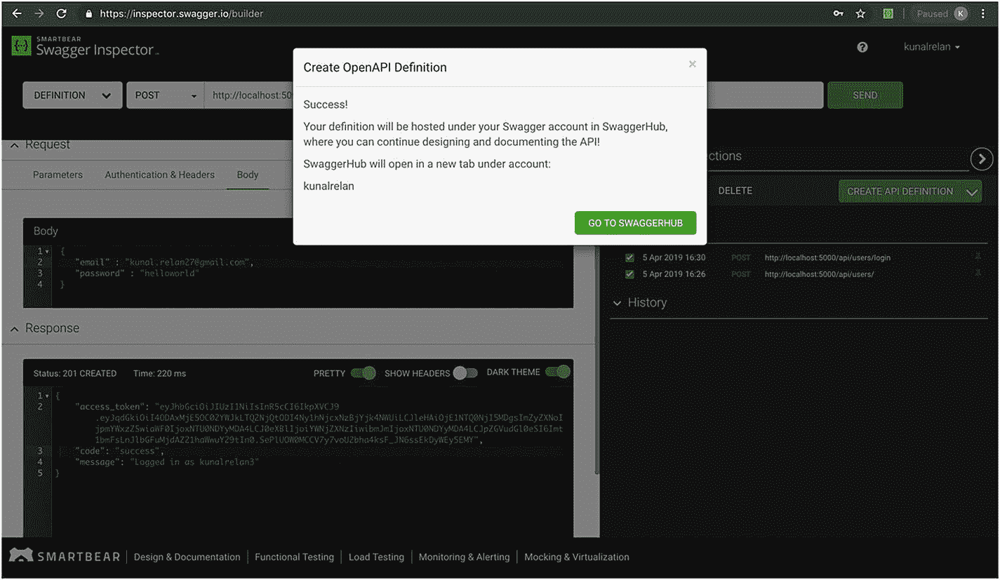

图 4-13

OpenAPI 规格层代

现在点击链接，SwaggerHub 将打开，要求您输入 API 的标题和版本。在这里，我们将添加 Author DB 并让版本默认为 0.1，使可见性为 private，并单击导入 API，如图 [4-14](#Fig14) 所示。

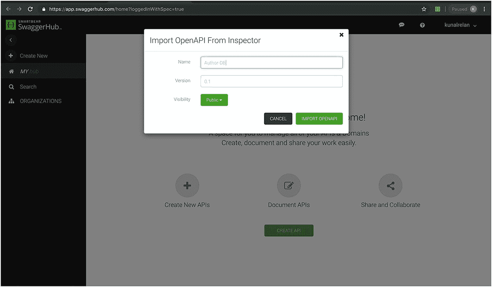

图 4-14

从检查器导入 OpenAPI

一旦完成，你应该能够检查你的 API 的文档，如下图所示。在本教程中，我只选择了两个端点，但是您可以在这里记录您的所有端点。

在图 [4-15](#Fig15) 中你可以看到选择的服务器是我们本地服务器的地址，然后我们有了我们选择的端点。

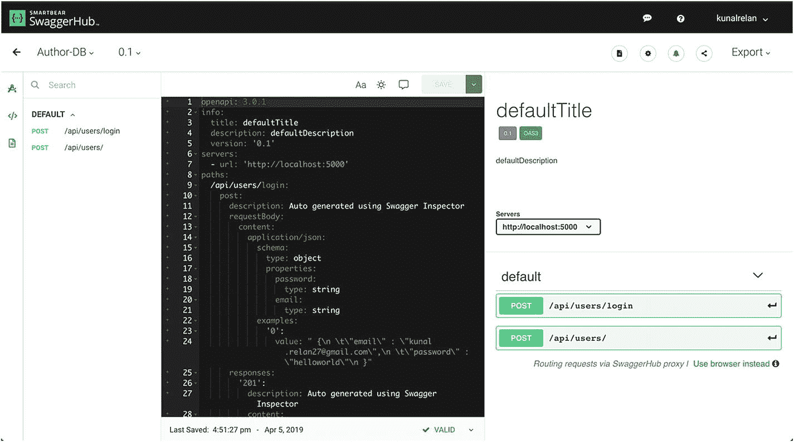

图 4-15

SwaggerHub

接下来，让我们通过点击顶栏上的纸张图标查看 API 文档，如图 [4-16](#Fig16) 和 [4-17](#Fig17) 所示。

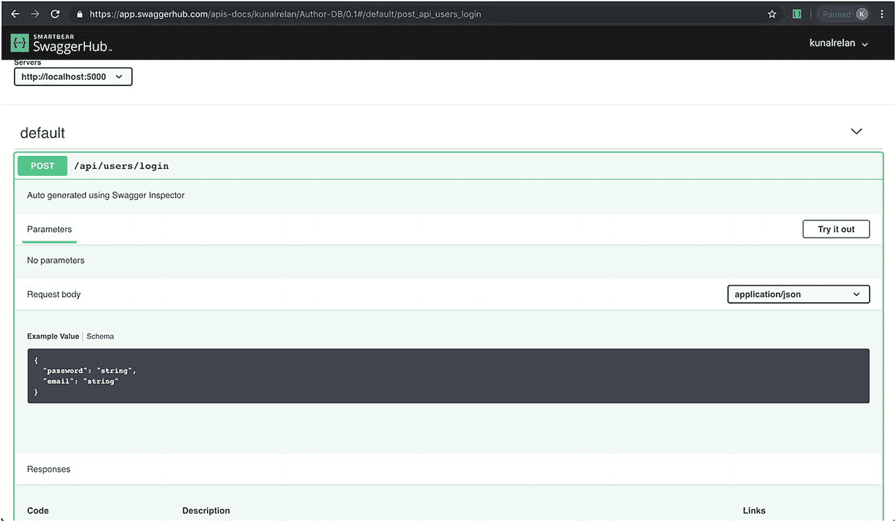

图 4-17

查看文档页面

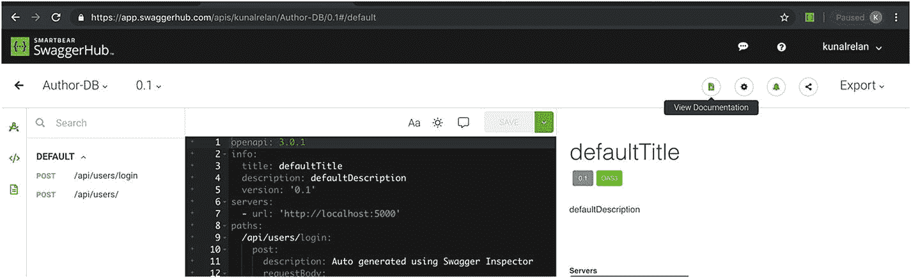

图 4-16

查看文档

一旦页面加载完毕，您就进入了 API 文档的交互模式，在这里您可以看到端点、参数、示例请求和示例响应。接下来点击“试用”,请求正文窗口将变为可编辑状态，您可以在其中填写请求正文数据，如图 [4-18](#Fig18) 所示。在它下面，你还可以看到响应和它们的格式。

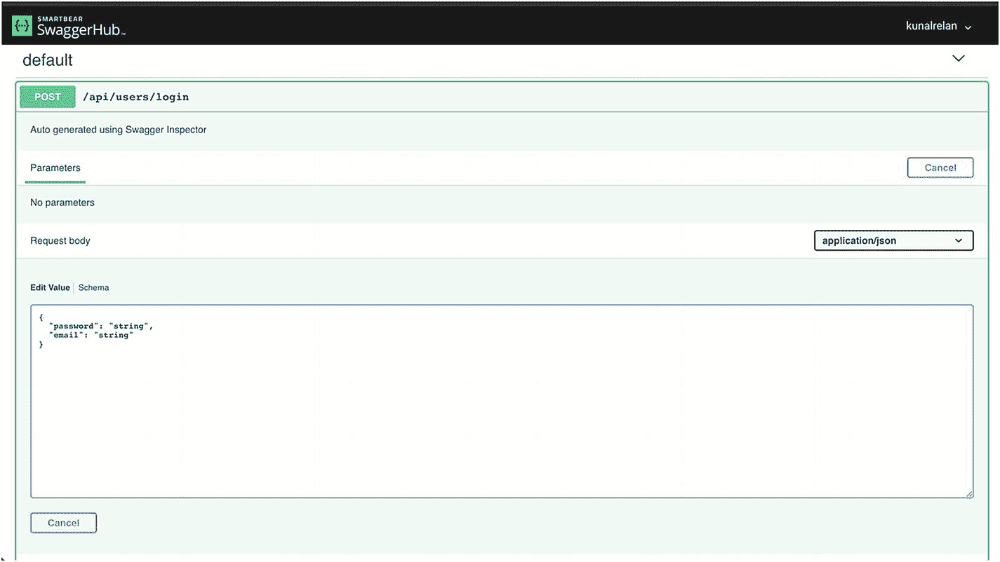

图 4-18

API 请求模式

因此，请继续编辑电子邮件和密码，然后单击“执行”请求访问 API。

接下来，您还可以导出规范文档的 YAML/JSON 版本，以便与您的 Swagger UI 版本一起使用。

接下来，我们将使用我们自己安装的 Swagger UI 和构建时规范来集成 API 文档。

同样，我们将使用 flask_swagger 和 flask_swagger_ui 扩展；让我们继续使用 PIP 安装它们。

```py
(venv)$ pip install flask_swagger flask_swagger_ui

```

安装完成后，让我们将它集成到我们的应用程序中；为此，打开 main.py 并使用以下代码行导入这两个库。

```py
from flask_swagger import swagger
from flask_swagger_ui import get_swaggerui_blueprint

```

我们将在/api/docs 端点上提供 Swagger UI。

现在我们将使用 Swagger 2.0 创建一个端点来服务我们定义的 API 规范

因此，在 errorhandler 函数下面添加以下代码，我们将在其中定义/api/spec route，并启动我们的 Swagger 定义，然后返回生成的 JSON 文件。

```py
@app.route("/api/spec")
    def spec():
        swag = swagger(app, prefix='/api')
        swag['info']['base'] = "http://localhost:5000"
        swag['info']['version'] = "1.0"
        swag['info']['title'] = "Flask Author DB"
        return jsonify(swag)

```

现在，我们将启动 flask_swagger_ui 来获取这个 JSON 文件，并使用它呈现 Swagger UI。在新路径下添加以下代码，以启动我们刚刚从 flask_swagger_ui 导入的 get_swagger_blueprint 方法，这里我们将在配置变量中提供 docs 路径、JSON 文件路由器和 app_name，然后注册 blueprint。

```py
    swaggerui_blueprint = get_swaggerui_blueprint('/api/docs', '/api/spec', config={'app_name': "Flask Author DB"})
    app.register_blueprint(swaggerui_blueprint, url_prefix=SWAGGER_URL)

```

现在当你尝试访问`htttp://localhost:5000/api/docs`时，你应该能看到 Swagger UI(图 [4-19](#Fig19) )。

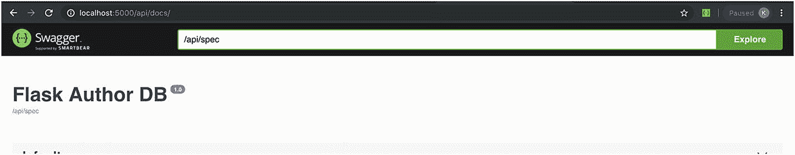

图 4-19

Swagger UI

在前面的 URL 栏中，您还可以提供从 SwaggerHub 导出的 JSON 文件的 URL，以探索您的 API。

#### 构建时文档

接下来，我们将使用构建时文档记录 API，并生成 JSON 文档文件；然而，在描述端点时，我们将使用 YAML。

Flask Swagger 将自动从方法定义中选取 YAML 文档，方法定义中使用' ' " " '后跟描述。我们将在创建用户端点中使用一个示例定义来学习它。因此，在 users.py routes 中的 def create_user()之后添加以下行。

```py
    """
    Create user endpoint
    ---
    parameters:
        - in: body
          name: body
          schema:
            id: UserSignup
            required:
                - username
                - password
                - email
            properties:
                username:
                    type: string
                    description: Unique username of the user
                    default: "Johndoe"
                password:
                    type: string
                    description: Password of the user
                    default: "somethingstrong"
                email:
                    type: string
                    description: email of the user
                    default: "someemail@provider.com"
    responses:
            201:
                description: User successfully created
                schema:
                  id: UserSignUpSchema
                  properties:
                    code:
                      type: string
            422:
                description: Invalid input arguments

                schema:
                    id: invalidInput
                    properties:
                        code:
                            type: string
                        message:
                            type: string
    """

```

这里我们使用 YAML 来定义参数和响应，正如你在前面的例子中看到的；我们定义参数的种类，在我们的例子中，它是一个主体参数，然后我们用样本数据和字段名定义所需参数的模式。在响应中，我们定义了不同类型的预期响应及其模式(图 [4-20](#Fig20) )。

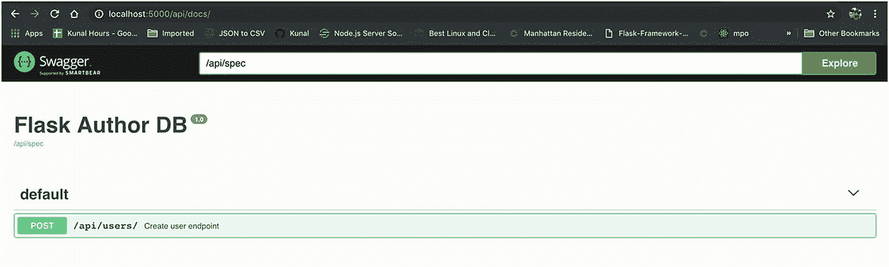

图 4-20

构建时文档生成

现在，如果您重新加载您的应用程序并访问 Swagger UI，您应该能够看到您创建的用户端点并使用 Swagger UI 访问它。

请注意描述、参数和响应是如何被解释并放置在 Swagger UI 中的。

接下来将它添加到登录方法中，为登录端点生成文档。

```py
    """
    User Login
    ---
    parameters:
        - in: body
          name: body
          schema:
            id: UserLogin
            required:
                - password
                - email
            properties:
                email:
                    type: string
                    description: email of the user
                    default: "someemail@provider.com"
                password:
                    type: string
                    description: Password of the user
                    default: "somethingstrong"
    responses:
            200:
                description: User successfully logged In
                schema:
                  id: UserLoggedIn
                  properties:
                    code:
                      type: string
                    message:
                      type: string
                    value:
                      schema:
                        id: UserToken
                        properties:
                            access_token:
                                type: string
                            code:
                                type: string
                            message:
                                type: string
            401:
                description: Invalid input arguments
                schema:
                    id: invalidInput
                    properties:
                        code:
                            type: string
                        message:
                            type: string
    """

```

接下来，我们将转到 authors.py 路由文件，并为 Create author 创建 doc，如果您还记得，此路由需要用户登录，在这里我们将添加一个额外的 header 参数，该参数将接受授权头。

```py
"""
    Create author endpoint
    ---
    parameters:
        - in: body
          name: body
          schema:
            id: Author
            required:
                - first_name
                - last_name
                - books
            properties:
                first_name:
                    type: string
                    description: First name of the author
                    default: "John"
                last_name:
                    type: string
                    description: Last name of the author
                    default: "Doe"
        - in: header
          name: authorization
          type: string
          required: true
    security:
        - Bearer: []
    responses:
            200:
                description: Author successfully created

                schema:
                  id: AuthorCreated
                  properties:
                    code:
                      type: string
                    message:
                      type: string
                    value:
                      schema:
                        id: AuthorFull
                        properties:
                            first_name:
                                type: string
                            last_name:
                                type: string
                            books:
                                type: array
                                items:
                                    schema:
                                        id: BookSchema
            422:
                description: Invalid input arguments
                schema:
                    id: invalidInput
                    properties:
                        code:
                            type: string
                        message:
                            type: string
    """

```

接下来，为 Upsert 作者头像端点添加以下行；注意，在这种情况下，我们将为 author ID 添加一个参数，作为 path 中的一个变量。

```py
    """
    Upsert author avatar
    ---
    parameters:
        - in: body
          name: body
          schema:
            id: Author
            required:
                - avatar
            properties:
                avatar:
                    type: file
                    description: Image file
        - name: author_id
          in: path
          description: ID of the author
          required: true
          schema:
            type: integer
    responses:
            200:
                description: Author avatar successfully upserted
                schema:
                  id: AuthorCreated
                  properties:
                    code:
                      type: string
                    message:
                      type: string
                    value:
                      schema:
                        id: AuthorFull
                        properties:
                            first_name:
                                type: string

                            last_name:
                                type: string
                            books:
                                type: array
                                items:
                                    schema:
                                        id: BookSchema
            422:
                description: Invalid input arguments
                schema:
                    id: invalidInput
                    properties:
                        code:
                            type: string
                        message:
                            type: string
    """

```

现在您可以重新加载您的 Swagger UI，您应该能够看到所有记录的端点(图 [4-21](#Fig21) )。

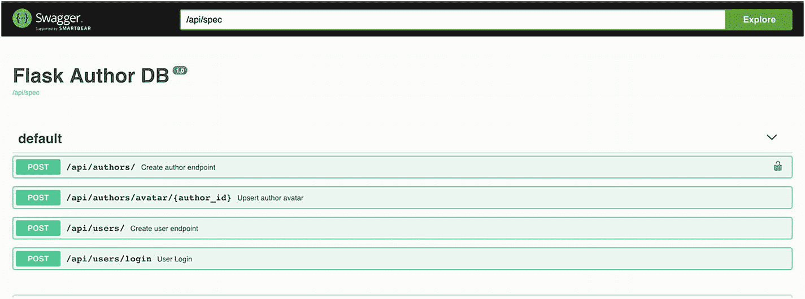

图 4-21

重新加载 Swagger UI 以查看端点

## 结论

对于本章，我们将只为给定的端点创建文档，您可以使用相同的方法在它的基础上构建，这将帮助您为 REST 端点创建完整的文档。在下一章，我们将讨论测试我们的 REST 端点，涵盖单元测试、模拟、代码覆盖率等主题。