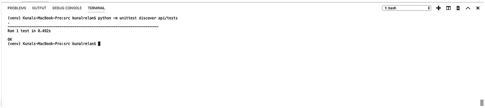
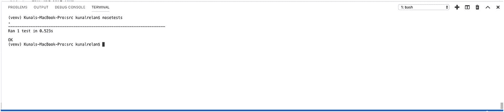
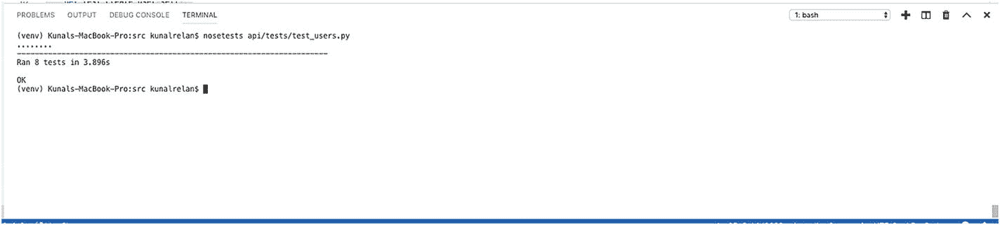
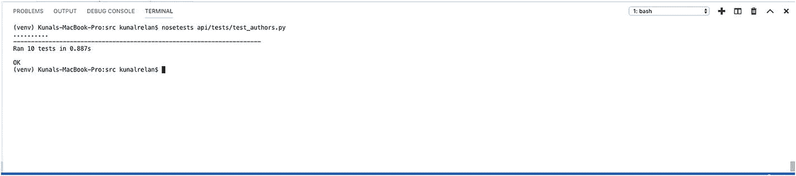
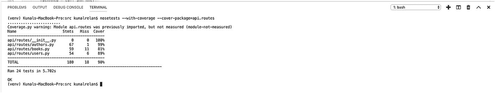
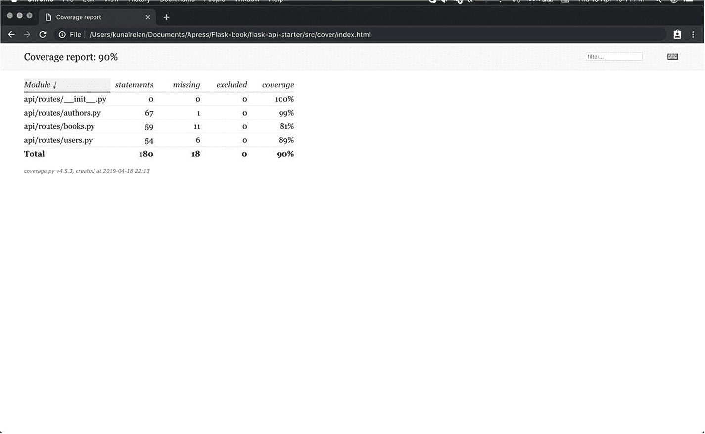

# 5.烧瓶测试

> 未经检验的东西坏了。

这段引文来源不明；然而，这并不完全正确，但大部分是正确的。未经测试的应用程序总是不安全的赌注。虽然开发人员对他们的工作很有信心，但在现实世界中，事情会有所不同；因此，从头到尾测试应用程序总是一个好主意。未经测试的应用程序也很难改进现有的代码。然而，有了自动化测试，总是很容易做出改变，并立即知道什么时候出了问题。因此，测试不仅可以确保应用程序是否按照预期的方式运行，还可以促进持续的开发。

本章涵盖了 REST APIs 的自动化单元测试，在我们进入实际的实现之前，我们将了解什么是单元测试以及背后的原理。

## 介绍

大多数软件开发人员通常已经熟悉了“单元测试”这个术语，但是对于那些不熟悉的人来说，单元测试围绕着将大量代码分解成单独的单元进行独立测试的概念。所以通常在这种情况下，一个更大的代码集是软件，而单独的组件是被隔离测试的单元。因此，在我们的例子中，一个单独的 API 请求是一个需要测试的单元。单元测试是软件开发的第一级，通常由软件开发人员完成。

让我们来看看单元测试的一些好处:

1.  单元测试是对非常窄的代码块的简单测试，作为更大范围的应用程序测试的构建块。

2.  由于范围狭窄，单元测试是最容易编写和实现的。

3.  单元测试增加了修改代码的信心，如果实现正确的话，单元测试也是第一个失败点，它会提示开发人员部分逻辑破坏了应用程序。

4.  编写单元测试使开发过程更快，因为它使开发人员做更少的模糊测试，并帮助他们更快地发现错误。

5.  在开发过程中使用单元测试来捕捉和修复 bug 比在产品中部署代码后进行更容易，也更便宜。

6.  与手动模糊测试相比，单元测试也是一种更可靠的测试方式。

### 设置单元测试

因此，在这一节中，我们将直接进入行动，开始实现测试；同样，我们将使用一个名为 unittest2 的库，它是 Python 的原始单元测试框架 unittest 的扩展。

让我们先安装库。

```py
(venv)$ pip install unittest2

```

这将为我们安装 unittest2 接下来，我们将设置一个基本的测试类，并将其导入到所有的测试文件中。顾名思义，这个基类将为测试建立基础并启动测试客户机。因此，在 utils 文件夹中创建一个名为 test_base.py 的文件。

现在让我们配置我们的测试环境，打开 config.py 并添加下面的代码来添加测试配置。

```py
class TestingConfig(Config):
    TESTING = True
    SQLALCHEMY_ECHO = False
    JWT_SECRET_KEY = 'JWT-SECRET'
    SECRET_KEY= 'SECRET-KEY'
    SECURITY_PASSWORD_SALT= 'PASSWORD-SALT'
    MAIL_DEFAULT_SENDER= '
    MAIL_SERVER= 'smtp.gmail.com'
    MAIL_PORT= 465
    MAIL_USERNAME= "
    MAIL_PASSWORD= "
    MAIL_USE_TLS= False
    MAIL_USE_SSL= True
    UPLOAD_FOLDER= 'images'

```

注意，我们不会在这里配置 SQLAlchemy URI，我们将在 test_base.py 中进行配置

接下来，添加以下代码行，以便在 test_base.py 中导入所需的依赖项

```py
import unittest2 as unittest
from main import create_app
from api.utils.database import db
from api.config.config import TestingConfig
import tempfile

```

接下来，使用以下代码添加 BaseTestCase 类。

```py
class BaseTestCase(unittest.TestCase):
    """A base test case"""
    def setUp(self):
        app = create_app(TestingConfig)
        self.test_db_file = tempfile.mkstemp()[1]
        app.config['SQLALCHEMY_DATABASE_URI'] = 'sqlite:///' + self.test_db_file
        with app.app_context():
            db.create_all()
        app.app_context().push()
        self.app = app.test_client()

    def tearDown(self):
        db.session.close_all()
        db.drop_all()

```

在这里，我们使用 tempfile 动态创建 SQLAlchemy sqlite 数据库。

我们之前刚刚创建的称为存根，它是一个模块，作为被调用模块的临时替代，提供与实际产品相同的输出。

因此，前面的方法将在每个测试运行之前运行，并产生一个新的测试客户端。我们将在我们创建的所有测试中导入这个方法。以 test_ prefix 开头的类中的所有方法都可以识别测试。在这里，我们每次都会有一个唯一的数据库 URL，因为我们已经配置了 tempfile，我们将用时间戳作为它的后缀，然后我们在 app config 中配置 TESTING= True，这将禁用错误捕获以实现更好的测试，最后我们运行 db.create_all()为应用程序创建 db 表。

接下来，我们定义了另一个方法 tearDown，它将删除当前的数据库文件，并为每个测试使用一个新的数据库文件。

### 单元测试用户端点

现在我们将开始编写测试，第一步是在 api 目录中创建一个名为 tests 的文件夹，在这里我们将创建所有的测试文件。因此，继续创建 tests 文件夹，并创建我们的第一个测试文件 test_users.py。

现在在 test_users.py 中添加以下导入

```py
import json
from api.utils.test_base import BaseTestCase
from api.models.users import User
from datetime import datetime
import unittest2 as unittest
from api.utils.token import generate_verification_token, confirm_verification_token

```

一旦完成，我们将定义另一种方法来使用 SQLAlchemy 模型创建用户，以便于测试。

接下来将它添加到文件中。

```py
def create_users():
    user1 = User(email="kunal.relan12@gmail.com", username="kunalrelan12",
    password=User.generate_hash('helloworld'), isVerified=True).create()
    user2 = User(email="kunal.relan123@gmail.com", username="kunalrelan125",
    password=User.generate_hash('helloworld')).create()

```

现在我们有了导入和创建用户的方法；接下来，我们将定义 TestUsers 类来保存我们所有的测试。

```py
class TestUsers(BaseTestCase):
    def setUp(self):
        super(TestUsers, self).setUp()
        create_users()

if __name__ == '__main__':
    unittest.main()

```

将这段代码添加到文件中，该文件将导入我们的基本测试类，并设置测试客户机和调用 create_users()方法来创建用户。注意，在 create_users()方法中，我们创建了一个已验证的用户和一个未验证的用户，这样我们就可以覆盖所有的测试用例。现在我们可以开始编写单元测试了。在 TestUsers()类中添加以下代码。

我们将从测试登录端点开始，因为我们刚刚创建了一个经过验证的用户，所以应该允许我们使用一组有效的凭证登录。

```py
    def test_login_user(self):
        user = {
          "email" : "kunal.relan12@gmail.com",
          "password" : "helloworld"
        }
        response = self.app.post(
            '/api/users/login',
            data=json.dumps(user),
            content_type='application/json'
        )
        data = json.loads(response.data)
        self.assertEqual(200, response.status_code)
        self.assertTrue('access_token' in data)

```

将下面的代码添加到 TestUsers 类中，我们应该有了我们的第一个单元测试，其中我们创建了一个用户对象并将用户发送到登录端点。一旦我们收到响应，我们将使用断言来检查我们是否在响应中获得了预期的状态代码和 access_token。断言是一个布尔表达式，除非有错误或者条件语句不匹配，否则它将为真。单元测试提供了一个断言方法列表，我们可以用它来验证我们的测试。

但是 assertEqual()、assertNotEqual()、assertTrue()和 assertNotTrue()涵盖了大部分。

这里，assertEqual()和 assertNotEqual()匹配值，assertTrue()和 assertNotTrue()检查传递的变量的值是否为布尔值。

现在让我们运行我们的第一个测试，所以只需打开您的终端并激活您的虚拟环境。

在您的终端中运行以下命令来运行测试。

```py
(venv)$ python -m unittest discover api/tests

```

前面的命令将运行测试目录中的所有测试文件；由于我们现在只有一个测试，我们可以在下图中看到我们的测试结果。



图 5-1

运行单元测试

这是运行单元测试的一种方式，在我们进一步编写更多测试之前，我想向您介绍 unittest 库的另一个扩展，称为 nose，它使测试更容易，所以让我们继续安装 nose。

使用以下代码安装 nose。

```py
(venv)$ pip install nose

```

现在，一旦我们有了 nose，让我们看看如何使用 nose 来运行我们的测试，因为接下来我们将使用 nose 来运行我们所有的测试。

默认情况下，nose 会使用(？:\b|_)[Tt]est 正则表达式；但是，您也可以指定要测试的文件名。让我们使用 nose 再次运行相同的测试。

```py
(venv)$ nosetests

```



图 5-2

用 nose 运行单元测试

正如您在前面的图中看到的，我们可以使用一个简单的 nosetest 命令来运行我们的测试。接下来，让我们再次为用户模型编写单元测试。

因此，我们的目标是涵盖所有场景，并检查每个场景中的应用程序行为；接下来，我们将在用户未被验证和提交错误凭证时测试登录 API。

为各个测试添加以下代码。

```py
    def test_login_user_wrong_credentials(self):
        user = {
          "email" : "kunal.relan12@gmail.com",
          "password" : "helloworld12"
        }
        response = self.app.post(
            '/api/users/login',
            data=json.dumps(user),
            content_type='application/json'
        )
        data = json.loads(response.data)
        self.assertEqual(401, response.status_code)

    def test_login_unverified_user(self):
        user = {
          "email" : "kunal.relan123@gmail.com",
          "password" : "helloworld"
        }
        response = self.app.post(
            '/api/users/login',
            data=json.dumps(user),
            content_type='application/json'
        )
        data = json.loads(response.data)
        self.assertEqual(400, response.status_code)

```

在前面的代码中，在 test _ log in _ user _ error _ credentials 方法中，我们检查响应中的 401 状态代码，因为我们提供了错误的凭据；在 test_login_unverified_user()方法中，我们尝试使用未经验证的用户登录，这将引发 400 错误。

接下来，让我们测试 create_user 端点，首先创建一个测试，用正确的字段创建一个用户，以创建一个新用户。

```py
    def test_create_user(self):
        user = {
          "username" : "kunalrelan2",
          "password" : "helloworld",
          "email" : "kunal.relan12@hotmail.com"
        }

        response = self.app.post(
            '/api/users/',
            data=json.dumps(user),
            content_type='application/json'
        )
        data = json.loads(response.data)
        self.assertEqual(201, response.status_code)
        self.assertTrue('success' in data['code'])

```

前面的代码将使用新的用户对象请求创建用户端点，并且应该能够这样做，并使用 201 状态代码进行响应。

接下来，我们将添加另一个测试，此时 username 没有提供给 Create user 端点，在这种情况下，我们将得到 422 响应。这是代码。

```py
    def test_create_user_without_username(self):
        user = {
          "password" : "helloworld",
          "email" : "kunal.relan12@hotmail.com"
        }

        response = self.app.post(
            '/api/users/',
            data=json.dumps(user),
            content_type='application/json'
        )
        data = json.loads(response.data)
        self.assertEqual(422, response.status_code)

```

现在我们可以继续测试我们的确认电子邮件端点，这里我们将首先创建一个包含有效电子邮件的单元测试，因此您会注意到我们在 create_users()方法中创建了一个未经验证的用户，这里我们将首先生成一个验证令牌，因为我们没有使用单元测试读取电子邮件，然后将令牌发送到确认电子邮件端点。

```py
    def test_confirm_email(self):
        token = generate_verification_token('kunal.relan123@gmail.com')

        response = self.app.get(
            '/api/users/confirm/'+token
        )
        data = json.loads(response.data)
        self.assertEqual(200, response.status_code)
        self.assertTrue('success' in data['code'])

```

接下来，我们将使用已经验证的用户的电子邮件编写另一个测试，以测试我们是否在响应状态代码中得到 422。

```py
    def test_confirm_email_for_verified_user(self):
        token = generate_verification_token('kunal.relan12@gmail.com')

        response = self.app.get(
            '/api/users/confirm/'+token
        )
        data = json.loads(response.data)
        self.assertEqual(422, response.status_code)

```

这个端点的最后一个问题是，我们将提供一个不正确的电子邮件，并应该得到一个 404 响应状态代码。

```py
    def test_confirm_email_with_incorrect_email(self):
        token = generate_verification_token('kunal.relan43@gmail.com')

        response = self.app.get(
            '/api/users/confirm/'+token
        )
        data = json.loads(response.data)
        self.assertEqual(404, response.status_code)

```

一旦我们的测试就绪，就该对它们进行测试了，所以继续使用 nosetests 并运行测试。



图 5-3

test_users.py 上的 Nosetests

所以这些都是我们想用用户模型覆盖的测试；接下来我们可以继续讨论作者和书籍。

接下来，让我们创建 test_authors.py，我们将添加一些变化的依赖项，因此添加以下行来导入所需的依赖项。

```py
import json
from api.utils.test_base import BaseTestCase
from api.models.authors import Author
from api.models.books import Book
from datetime import datetime
from flask_jwt_extended import create_access_token
import unittest2 as unittest
import io

```

接下来，我们将定义两个助手方法，即 create_authors 和 login，并为其添加以下代码。

```py
def create_authors():
    author1 = Author(first_name="John", last_name="Doe").create()
    author2 = Author(first_name="Jane", last_name="Doe").create()

```

我们将使用前面定义的方法为测试创建两个作者，login 方法将生成一个登录令牌，并返回仅授权的路由。

```py
def login():
    access_token = create_access_token(identity = 'kunal.relan@hotmail.com')
    return access_token

```

接下来让我们像前面一样定义我们的测试类并初始化它。

```py
class TestAuthors(BaseTestCase):
    def setUp(self):
        super(TestAuthors, self).setUp()
        create_authors()

if __name__ == '__main__':
    unittest.main()

```

现在我们有了作者单元测试的基础，我们可以添加下面的测试用例，它们应该是不言自明的。

这里，我们将使用 POST author 端点创建一个新的作者，该端点带有我们使用 login 方法生成的 JWT 令牌，并期待 author 对象以 201 状态代码作为响应。

```py
    def test_create_author(self):
        token = login()
        author = {
            'first_name': 'Johny',
            'last_name': 'Doee'
        }
        response = self.app.post(
            '/api/authors/',
            data=json.dumps(author),
            content_type='application/json',
            headers= { 'Authorization': 'Bearer '+token }
        )
        data = json.loads(response.data)
        self.assertEqual(201, response.status_code)
        self.assertTrue('author' in data)

```

这里我们将尝试创建一个带有 authorization 头的 author，它应该在响应状态代码中返回 401。

```py
    def test_create_author_no_authorization(self):
        author = {
            'first_name': 'Johny',
            'last_name': 'Doee'
        }

        response = self.app.post(
            '/api/authors/',
            data=json.dumps(author),
            content_type='application/json',
        )
        data = json.loads(response.data)
        self.assertEqual(401, response.status_code)

```

在这个测试用例中，我们将尝试创建一个没有姓氏字段的作者，它应该会返回 422 状态代码。

```py
    def test_create_author_no_name(self):
        token = login()
        author = {
            'first_name': 'Johny'
        }

        response = self.app.post(
            '/api/authors/',
            data=json.dumps(author),
            content_type='application/json',
            headers= { 'Authorization': 'Bearer '+token }
        )
        data = json.loads(response.data)
        self.assertEqual(422, response.status_code)

```

在这个例子中，我们将测试上传头像端点，并使用 io 创建一个临时图像文件，并将其作为多部分/表单数据发送以上传图像。

```py
    def test_upload_avatar(self):
        token = login()
        response = self.app.post(
            '/api/authors/avatar/2',
            data=dict(avatar=(io.BytesIO(b'test'), 'test_file.jpg')),
            content_type='multipart/form-data',
            headers= { 'Authorization': 'Bearer '+ token }
        )
        self.assertEqual(200, response.status_code)

```

在这里，我们将通过提供一个 CSV 文件来测试上传头像，正如预期的那样，它不应该响应 200 状态代码。

```py
    def test_upload_avatar_with_csv_file(self):
        token = login()
        response = self.app.post(
            '/api/authors/avatar/2',
            data=dict(file=(io.BytesIO(b'test'), 'test_file.csv)),
            content_type='multipart/form-data',
            headers= { 'Authorization': 'Bearer '+ token }
        )
        self.assertEqual(422, response.status_code)

```

在这个测试中，我们将使用 GET all authors 端点获取所有作者。

```py
    def test_get_authors(self):
        response = self.app.get(
            '/api/authors/',
            content_type='application/json'
        )
        data = json.loads(response.data)
        self.assertEqual(200, response.status_code)
        self.assertTrue('authors' in data)

```

这里我们有一个通过 ID 端点获取作者的单元测试，它将返回 200 个响应状态代码和作者对象。

```py
    def test_get_author_detail(self):
        response = self.app.get(
            '/api/authors/2',
            content_type='application/json'
            )
        data = json.loads(response.data)
        self.assertEqual(200, response.status_code)
        self.assertTrue('author' in data)

```

在这个测试中，我们将更新最近创建的 author 上的 author 对象，它也将在响应中返回 200 状态代码。

```py
    def test_update_author(self):
        token = login()
        author = {
            'first_name': 'Joseph'
        }
        response = self.app.put(
            '/api/authors/2',
            data=json.dumps(author),
            content_type='application/json',
            headers= { 'Authorization': 'Bearer '+token }
        )
        self.assertEqual(200, response.status_code)

```

在这个测试中，我们将删除 author 对象，并期待 204 响应状态代码。

```py
    def test_delete_author(self):
        token = login()
        response = self.app.delete(
            '/api/authors/2',
            headers= { 'Authorization': 'Bearer '+token }
        )
        self.assertEqual(204, response.status_code)

```



图 5-4

作者测试

所以现在你可以像上图一样运行 authors test，它应该像上图一样全部通过；接下来，我们将进行图书模型测试。

对于书籍模型测试，我们可以在同一个模块中修改作者测试并为书籍设置单元测试，所以让我们更新 create_authors 方法来创建一些书籍；继续用下面的代码更新这个方法。

```py
def create_authors():
    author1 = Author(first_name="John", last_name="Doe").create()
    Book(title="Test Book 1", year=datetime(1976, 1, 1), author_id=author1.id).create()
    Book(title="Test Book 2", year=datetime(1992, 12, 1), author_id=author1.id).create()

    author2 = Author(first_name="Jane", last_name="Doe").create()
    Book(title="Test Book 3", year=datetime(1986, 1, 3), author_id=author2.id).create()
    Book(title="Test Book 4", year=datetime(1992, 12, 1), author_id=author2.id).create()

```

这是图书路线的单元测试。

```py
    def test_create_book(self):
        token = login()
        author = {
            'title': 'Alice in wonderland',
            'year': 1982,
            'author_id': 2
        }

        response = self.app.post(
            '/api/books/',
            data=json.dumps(author),
            content_type='application/json',
            headers= { 'Authorization': 'Bearer '+token }
        )
        data = json.loads(response.data)
        self.assertEqual(201, response.status_code)
        self.assertTrue('book' in data)

    def test_create_book_no_author(self):
        token = login()
        author = {
            'title': 'Alice in wonderland',
            'year': 1982
        }

        response = self.app.post(

            '/api/books/',
            data=json.dumps(author),
            content_type='application/json',
            headers= { 'Authorization': 'Bearer '+token }
        )
        data = json.loads(response.data)
        self.assertEqual(422, response.status_code)

    def test_create_book_no_authorization(self):
        author = {
            'title': 'Alice in wonderland',
            'year': 1982,
            'author_id': 2
        }

        response = self.app.post(
            '/api/books/',
            data=json.dumps(author),
            content_type='application/json'

        )
        data = json.loads(response.data)
        self.assertEqual(401, response.status_code)

    def test_get_books(self):
        response = self.app.get(
            '/api/books/',
            content_type='application/json'
        )
        data = json.loads(response.data)
        self.assertEqual(200, response.status_code)
        self.assertTrue('books' in data)

    def test_get_book_details(self):
        response = self.app.get(
            '/api/books/2',
            content_type='application/json'
            )
        data = json.loads(response.data)
        self.assertEqual(200, response.status_code)
        self.assertTrue('books' in data)

    def test_update_book(self):
        token = login()
        author = {
            'year': 1992,
            'title': 'Alice'
        }
        response = self.app.put(
            '/api/books/2',
            data=json.dumps(author),
            content_type='application/json',
            headers= { 'Authorization': 'Bearer '+token }
        )
        self.assertEqual(200, response.status_code)

    def test_delete_book(self):
        token = login()
        response = self.app.delete(
            '/api/books/2',
            headers= { 'Authorization': 'Bearer '+token }

        )
        self.assertEqual(204, response.status_code)

```

## 测试覆盖率

现在我们已经学会了为我们的应用程序编写测试用例，单元测试的目标是测试尽可能多的代码，所以我们必须确保每个函数及其所有分支都被覆盖，你越接近 100%，在做出改变之前你就越放心。测试覆盖率是开发中使用的重要工具；然而，100%的覆盖率并不能保证没有 bug。

您可以通过以下命令使用 PIP 安装 coverage.py。

```py
(venv)$ pip install coverage

```

Nose 库有一个内置的插件，可以与覆盖率模块一起工作，因此要运行测试覆盖率，您需要在运行 nosetests 时向终端添加两个参数。

使用下面的命令运行 nosetests，并启用测试覆盖率。

```py
(venv)$ nosetests  --with-coverage --cover-package=api.routes

```

因此，我们在这里使用- with-coverage 标志启用覆盖，并指定只覆盖 routes 模块，否则默认情况下，它还将覆盖已安装的模块。



图 5-5

测试覆盖率

正如你所看到的，我们已经获得了大量的代码测试覆盖率，你可以覆盖所有其他的边缘案例来实现 100%的测试覆盖率。

接下来，您还可以启用- cover-html 标志，以 html 格式输出信息，这种格式更具可读性和可预置性。

```py
(venv)$ nosetests --with-coverage --cover-package=api.routes --cover-html

```

前面的命令会生成测试覆盖率的 HTML 格式结果，现在你应该会在你的工作目录中看到一个名为 cover 的文件夹；打开文件夹，使用浏览器打开 index.html，查看 HTML 格式的测试覆盖率报告。

正如您在前面的图中所看到的，我们已经得到了测试覆盖报告的 HTML 版本。



图 5-6

HTML 格式的测试覆盖报告

## 结论

这就是本章的内容。我们已经学习了单元测试的基础知识，为我们的应用程序实现了测试用例，并且使用 nose 测试库覆盖了所有路线的单元测试和集成测试。这涵盖了我们这个应用程序的开发旅程。在下一章，我们将讨论部署，并在不同的云服务提供商上部署我们的应用程序。