# 六、部署 Flask 应用

因此，到目前为止，在本书中，我们完全专注于开发应用，在本章中，我们将讨论下一步，即部署我们的应用和管理应用部署后，这是应用开发的一个非常重要的部分。在本章中，我们将主要讨论安全部署 Flask 应用的各种方法。部署 Flask 应用有多种方式，每种方式都有其优缺点，因此我们将权衡它们，讨论它们的成本效益和安全性，并执行部署我们的应用的方式。正如我前面提到的，Flask 的服务器不适合生产部署，只用于开发和调试，所以我们将研究各种选项。

在本章中，我们将讨论以下主题:

1.  在阿里云 ECS 上部署带有 uWSGI 和 Nginx 的 Flask

2.  在阿里云 ECS 上部署带 Gunicorn 的 Flask

3.  在 Heroku 部署Flask

4.  在 AWS 弹性豆茎上展开Flask

5.  在 Google 应用引擎上部署 Flask

因此，在这一章中，我们将完全专注于在所有这些平台上部署我们的应用，并讨论每个平台的优缺点。虽然它们都是很好的选择，但完全是业务用例及资源决定了我们在哪里部署应用。

## 在阿里云 ECS 上部署带有 uWSGI 和 Nginx 的 Flask

以这种方式部署应用通常被称为传统托管，其中依赖项是手动安装的或通过脚本安装程序安装的，这涉及手动安装应用及其依赖项并保护它。在本节中，我们将使用 uWSGI 和 Nginx 在阿里云弹性计算服务上托管的 Linux 操作系统上安装和运行我们的应用。

uWSGI 是一个成熟的 HTTP 服务器和一个能够运行生产应用的协议。uWSGI 是一个流行的 uwsgi(协议)服务器，而 Nginx 是一个免费、开源、高性能的 HTTP 服务器和反向代理。在我们的例子中，我们将使用 Nginx 来反向代理我们与 uwsgi 服务器之间的 HTTP 调用，我们将在 Ubuntu OS 上部署 uw SGI 服务器。

因此，让我们直接进入业务并部署我们的应用，但在此之前，我们必须使用 pip freeze 冻结 requirements.txt 中的库。运行以下命令，确保该文件包含所有必需依赖项的列表。

```py
(venv)$ pip freeze > requirements.txt

```

所以这里 pip freeze 将以需求格式输出所有需要的安装包。接下来，我们需要将我们的代码库推送到一个版本管理系统，比如 GitHub，稍后我们将在我们的 Linux 实例中使用它。为此，我们将在阿里云上创建一个 Ubuntu 实例，你可以在 [`www.alibabacloud.com`](https://www.alibabacloud.com) 注册，或者你可以在任何其他云提供商上使用你的 Ubuntu 实例，甚至可以使用虚拟实例。

因此，在我们开始部署之前，我们还需要一个 MySQL 服务器，因为这是关于部署 Flask 应用的，所以我们不会涉及部署 MySQL 服务器。但是，您可以在同一个实例上部署一个，或者使用托管的 MySQL 服务器服务，并在 config.py 中编辑 DB 配置细节。

一旦你设置好了云账户，创建一个 Ubuntu 实例，最好是 16.04 或更高版本。这里我们有阿里云 ECS(弹性计算服务)，一旦我们有了实例，我们将使用密钥对或密码进行 SSH。

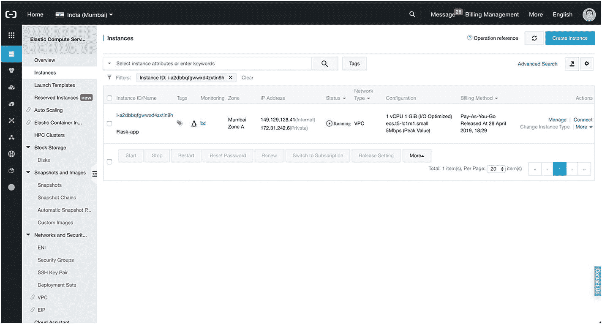

图 6-1

阿里云 ECS 控制台

一旦你的 Ubuntu 实例启动并运行，SSH 进入并从你的首选版本管理系统中提取代码库。

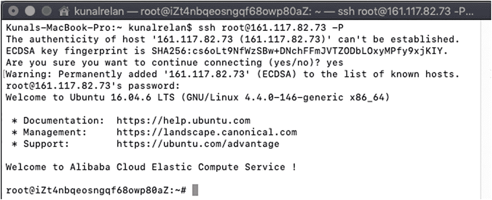

图 6-2

SSH 到 Ubuntu 实例

正如您默认看到的，我们已经以 root 用户身份登录，所以在继续之前，我们将创建另一个名为 Flask 的 sudo 用户，这是一个很好的安全措施。为了限制应用中的安全漏洞可能造成的损害，在每个应用自己的用户帐户下运行是一个好主意。

```py
$ adduser flask

```

接下来它会提示你为新用户设置一个密码，并输入一些细节；如果愿意，您可以只输入密码，将其他字段留空，然后运行以下命令将用户添加到 sudoers 列表中。

```py
$ usermod -aG sudo flask

```

现在，一旦我们有了新用户，让我们使用下面的命令在 shell 中使用该用户登录。

```py
$ su - flask

```

接下来，我们将从 GitHub repo 中提取我们的应用，因此请确保您已经安装了 git 客户端，如果您没有安装，请使用以下命令。

```py
$ sudo apt-get install git

```

使用以下命令克隆应用存储库。

```py
$ sudo git clone <repo_name>

```

接下来，将您当前的目录更改为 app 源代码，并安装 virtualenv 和 uwsgi，因为我们的 reqiurements.txt 中没有这些内容。

```py
$ sudo pip install virtualenv uwsgi

```

像我们在上一章所做的那样创建一个虚拟 env，并在用下面的命令激活虚拟环境之后安装依赖项。

```py
$ pip install -r requirements.txt

```

我们将从 Ubuntu 库安装设置应用所需的所有依赖项，我们将从安装 python-pip 开始，它是 python 和 python-dev 的包管理器，包含编译 Python 扩展所需的头文件。

```py
$ sudo apt-get install python-pip python-dev

```

安装完依赖项后，我们将创建一个名为 flask-app.ini 的 uWSGI 配置文件，在当前目录下创建一个名为 flask-app.ini 的文件，并在其中添加以下代码行。

```py
[uwsgi]
module = run:application

master = true
processes = 5

socket = flask-app.sock
chmod-socket = 660
vacuum = true

die-on-term = true

```

这个文件以[uwsgi]头开始，以便 wsgi 知道如何应用这些设置。我们还指定了模块和可调用程序，在我们的例子中是 run.py，不包括扩展名和可调用程序 application。

然后，我们指示 uwsgi 作为主进程启动该进程，并派生五个工作进程来处理请求。

接下来，我们将为 Nginx 提供 Unix 套接字文件，以遵循应用的 uWSGI 请求。让我们也改变套接字上的权限。稍后我们将把 uWSGI 进程的所有权交给 Nginx 组，因此我们需要确保套接字的组所有者可以从它那里读取信息并向它写入信息。我们还将通过添加真空选项在进程停止时清理插座。

我们要做的最后一件事是设置定期死亡选项。这有助于确保 init 系统和 uWSGI 对每个进程信号的含义有相同的假设。

接下来，我们将创建一个 systemd 服务单元文件，它将允许 Ubuntu 的 init 系统在服务器启动时自动启动我们的应用。

```py
This file will be called flask-app.service and will be placed in /etc/systemd/system
Directory.
$ sudo nano /etc/systemd/system/flask-app.service

```

并将下面几行粘贴到文件中。

```py
#Metadata and dependencies section
[Unit]
Description=Flask App service
After=network.target
#Define users and app working directory
[Service]
User=flask
Group=www-data
WorkingDirectory=/home/flask/flask-api-app/src
Environment="WORK_ENV=PROD"
ExecStart=/home/flask/flask-api-app/src/venv/bin/uwsgi --ini flask-app.ini
#Link the service to start on multi-user system up
[Install]
WantedBy=multi-user.target

```

之后，运行以下命令来启用并启动我们的新服务。

```py
$ sudo systemctl start flask-app
$ sudo systemctl enable flask-app

```

我们的 uWSGI 服务器现在应该启动并运行，等待我们前面创建的套接字文件中的请求。我们现在将安装和配置 Nginx，使用 uwsgi 协议传递和处理请求。

```py
$ sudo apt-get install nginx

```

现在我们应该有一个 Nginx 服务器启动并运行，我们将开始在/etc/nginx/sites-available 中创建一个新的服务器块配置文件，我们将它命名为 flask-app。

```py
$ sudo nano /etc/nginx/sites-available/flask-app

```

我们将打开一个服务器块，指示它监听端口 80，并定义服务器名，它应该是您的服务的域名。接下来，我们将在服务器块中定义一个位置块来定义基本位置，并在其中导入 uwsgi_params 头，指定一些需要设置的常规 uwsgi 参数。然后，我们将把请求传递给使用 uwsgi_pass 指令定义的套接字。

```py
server {
    listen 80;
    server_name flaskapp;

    location / {
        include uwsgi_params;
        uwsgi_pass unix:/home/flask/flask-api-app/src/flask-app.sock;
    }
}

```

前面几行应该配置我们的服务器块来监听套接字上的服务器请求。一旦我们都准备好了，接下来我们将创建一个网站启用目录的符号链接。

```py
$ sudo ln -s /etc/nginx/sites-available/flask-app /etc/nginx/sites-enabled

```

有了这些，我们现在可以使用下面的命令测试我们的更改是否有语法错误。

```py
$ sudo nginx -t

```

如果没有语法错误，您应该在您的终端上看到这个输出。

```py
$ nginx: the configuration file /etc/nginx/nginx.conf syntax is ok
$ nginx: configuration file /etc/nginx/nginx.conf test is successful

```

现在，当您访问您的域名时，它应该可以正常工作。如果您没有域，并且想要访问应用，您应该在“启用站点”中编辑默认服务器块，而不是创建一个新的服务器块，或者删除默认应用，这样您就可以使用 IP 地址访问应用。

还要确保如果你在云服务上运行 Ubuntu 服务器，防火墙上的端口 80 是允许的，在我们的例子中，它是使用安全组设置的。

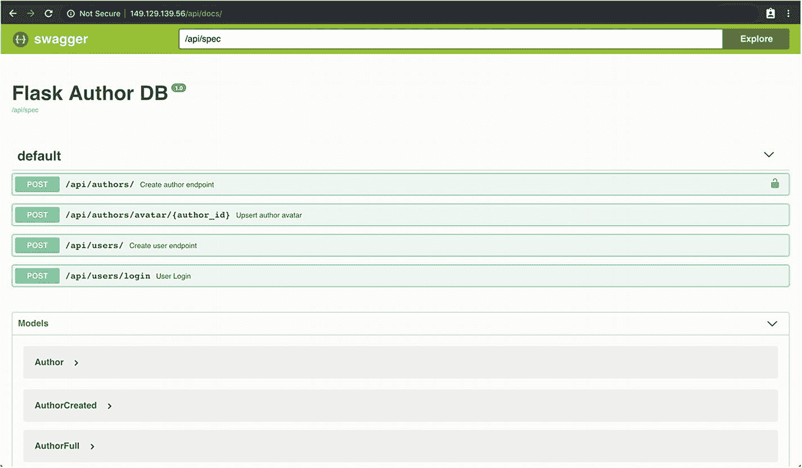

图 6-3

部署的应用

## 在 Gunicorn 上部署 Flask，在阿里云 ECS 上部署 Apache

现在我们将使用 Gunicorn 安装我们的 Flask 应用，guni corn 是用于 Unix 的 Python WSGI HTTP 服务器，它将运行我们的应用，然后我们将使用 Apache 服务器反向代理请求。

要了解本节内容，您需要具备以下条件:

1.  拥有 sudo 权限的非 root 用户的 Ubuntu 服务器

2.  Apache 服务器已安装

3.  主目录中我们的 Flask 应用的副本

正如我提到的，我们将使用 Gunicorn 来运行我们的应用，所以让我们使用 PIP 来安装 Gunicorn。

```py
$ pip install gunicorn

```

接下来，我们将创建一个系统服务，就像我们在上一节中所做的那样，所以继续用下面的命令创建我们的新服务。

```py
$ sudo nano /etc/systemd/system/flask-app.service

```

接下来在你的 nano 编辑器中添加下面几行。

```py
[Unit]
Description= Flask App service
After=network.target

[Service]
User=flask
Group=www-data
Restart=on-failure
Environment="WORK_ENV=PROD"
WorkingDirectory=/home/flask/flask-api-app/src
ExecStart=/home/flask/flask-api-app/src/venv/bin/gunicorn -c /home/flask/flask-api-app/src/gunicorn.conf -b 0.0.0.0:5000 wsgi:application

[Install]
WantedBy=multi-user.target

```

现在保存文件并退出，我们应该有我们的系统服务。接下来，我们将使用以下命令启用并启动我们的服务。

```py
$ sudo systemctl start flask-app
$ sudo systemctl enable flask-app

```

所以现在我们的应用应该运行在端口 5000 上；接下来，我们需要配置 Apache 来反向代理我们的应用。

默认情况下，反向代理模块在 Apache 中是禁用的，要启用它，请输入以下命令。

```py
$ a2enmod

```

它会提示激活模块；输入以下要激活的模块:

```py
$ proxy proxy_ajp proxy_http rewrite deflate headers proxy_balancer proxy_connect proxy_html

```

现在将我们的应用添加到 Apache web 服务器配置文件中。将以下行(在 VirtualHost 块中)添加到/etc/Apache 2/sites-available/000-default . conf 中

```py
    <Proxy *>
        Order deny,allow
        Allow from all
    </Proxy>
    ProxyPreserveHost On
    <Location "/">
          ProxyPass "http://127.0.0.1:5000/"
          ProxyPassReverse "http://127.0.0.1:5000/"
    </Location>

```

现在，它应该在根路由上代理我们的应用，您的最终服务器块应该如下所示。

```py
<VirtualHost *:80>
    # The ServerName directive sets the request scheme, hostname and port that
    # the server uses to identify itself. This is used when creating
    # redirection URLs. In the context of virtual hosts, the ServerName
    # specifies what hostname must appear in the request's Host: header to
    # match this virtual host. For the default virtual host (this file) this
    # value is not decisive as it is used as a last resort host regardless.
    # However, you must set it for any further virtual host explicitly.
    #ServerName www.example.com

    ServerAdmin webmaster@localhost
    DocumentRoot /var/www/html

    # Available loglevels: trace8, ..., trace1, debug, info, notice, warn,
    # error, crit, alert, emerg.
    # It is also possible to configure the loglevel for particular
    # modules, e.g.
    #LogLevel info ssl:warn

    ErrorLog ${APACHE_LOG_DIR}/error.log
    CustomLog ${APACHE_LOG_DIR}/access.log combined
     <Proxy *>
        Order deny,allow
        Allow from all
    </Proxy>
    ProxyPreserveHost On
    <Location "/">
          ProxyPass "http://127.0.0.1:5000/"
          ProxyPassReverse "http://127.0.0.1:5000/"
    </Location>
    # For most configuration files from conf-available/, which are
    # enabled or disabled at a global level, it is possible to
    # include a line for only one particular virtual host. For example the
    # following line enables the CGI configuration for this host only
    # after it has been globally disabled with "a2disconf".
    #Include conf-available/serve-cgi-bin.conf
</VirtualHost>

# vim: syntax=apache ts=4 sw=4 sts=4 sr noet

```

保存文件并退出，我们已经全部介绍过了。只需用下面的命令重启服务器。

```py
$ sudo service apache2 restart

```

现在使用 IP 地址访问浏览器中的应用。

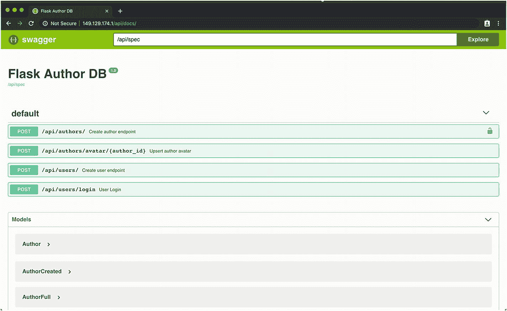

图 6-4

在 Gunicorn 上部署 Flask 应用

## 在 AWS 弹性豆茎上展开Flask

在本节中，我们将使用 AWS Elastic Beanstalk 部署我们的 Flask 应用。AWS Elastic Beanstalk 是一个易于使用的服务，用于部署和扩展 web 应用和服务。

我们假设您在开发机器中已经有一个活动的 AWS 帐户和 AWS CLI 设置，或者您可以在其上使用 AWS 文档。

要创建应用环境并部署应用，请使用 eb init 命令初始化您的 EB CLI 存储库。

```py
$ eb init -p python-2.7 flask-app --region <your_region>

```

### 注意

有关地区列表，请参考本指南: [`https://docs.aws.amazon.com/general/latest/gr/rande.html`](https://docs.aws.amazon.com/general/latest/gr/rande.html)

您应该在终端中看到以下响应。

```py
$ Application flask-app has been created.

```

前面的命令创建一个名为 flask-app 的新应用，并配置您的本地存储库，以使用最新的 Python 2.7 创建环境。

接下来再次运行 eb init，为 SSH 登录配置一个密钥对。

接下来，我们将创建一个环境，并使用 eb create 将您的应用部署到该环境中。

```py
$ eb create

```

接下来输入环境名称、DNS 前缀和负载平衡器类型，这将消除向外界公开 web 服务器的需要。

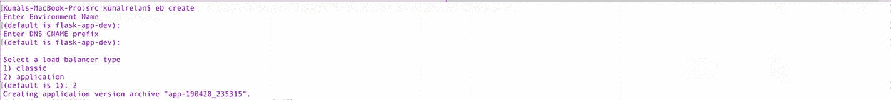

图 6-5

eb 创建

现在大约需要 5 分钟来部署。部署完成后，我们只需要配置一些更多的细节，这将直接在 AWS web 控制台中完成。

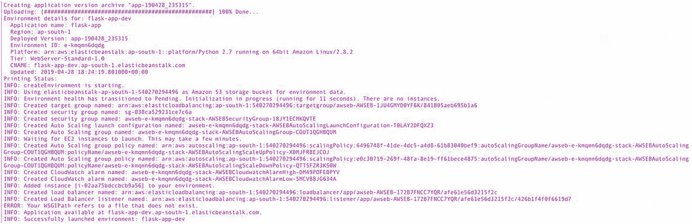

图 6-6

eb 创造成功

一旦应用完成部署，您应该会看到类似于上图的输出。接下来登录 AWS web 控制台，打开 Elastic Beanstalk 配置选项卡。

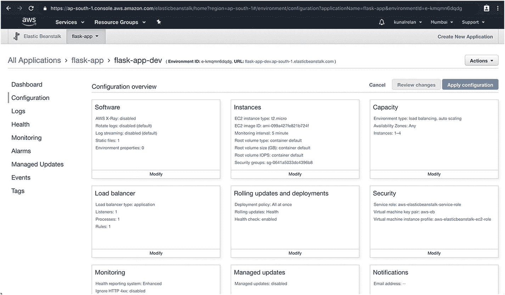

图 6-7

弹性豆茎应用配置

接下来点击修改；在“软件”选项卡和“容器内选项”中，将 WSGIPath 更新为 run.py。

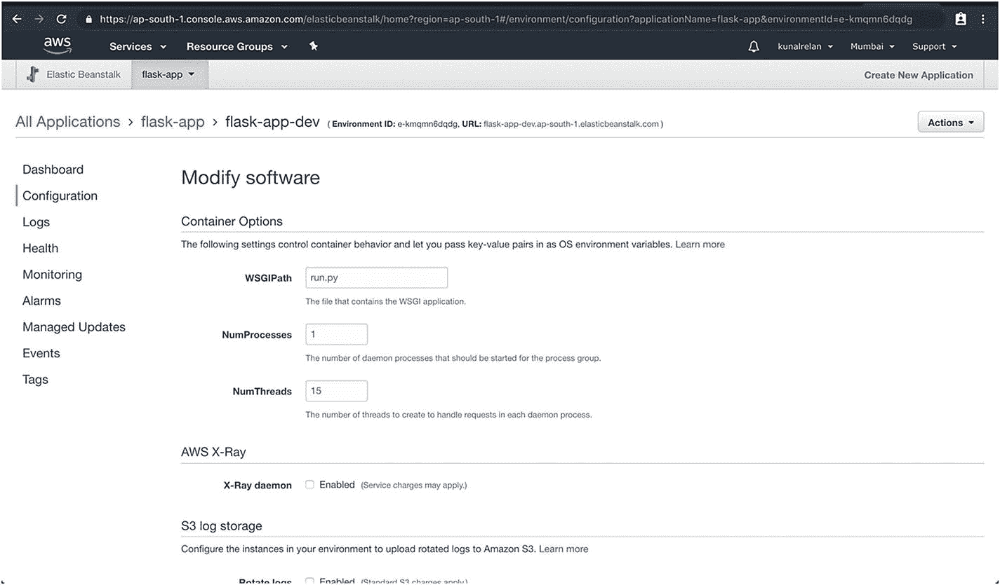

图 6-8

WSGIpath 集

现在向下滚动，在环境变量中，提供 WORK_ENV 并将其设置为 Prod，以便我们的应用在生产模式下运行。接下来单击 apply，应用应该会重新加载并开始工作。

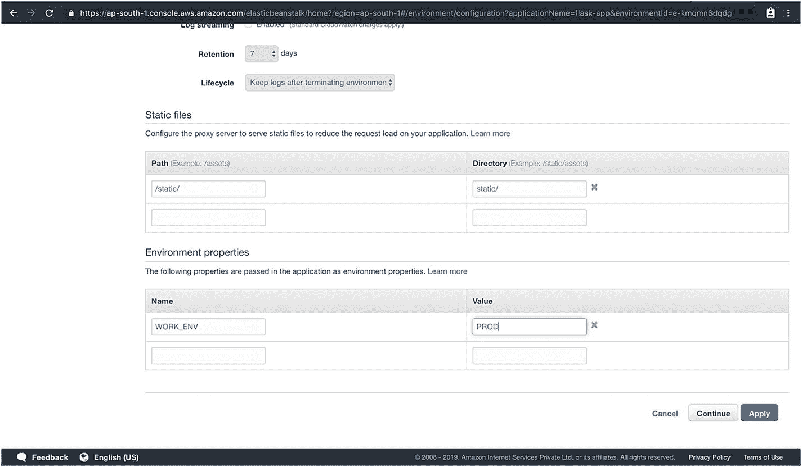

图 6-9

弹性豆茎环境变量

现在，您可以返回 dashboard 来查找应用的 URL，它应该已经启动并运行了。

### 注意

在 Elastic Beanstalk 中，您还可以配置并启动一个连接到环境的 MySQL RDS 服务器来运行应用，但这超出了本书的范围。

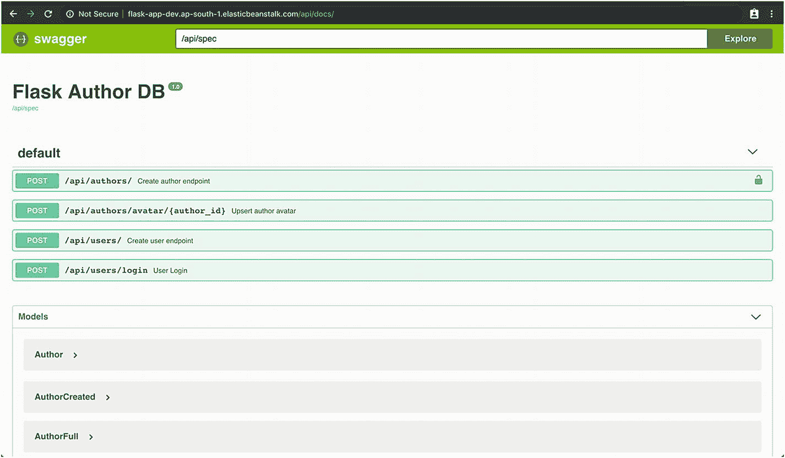

图 6-10

在弹性豆茎上部署Flask应用

## 在 Heroku 上部署 Flask 应用

Heroku 是一个平台即服务(PaaS ),支持各种现代应用，为在云中大规模部署和管理应用提供基于容器的环境。在 Heroku 上部署应用非常简单快捷。你可以使用 Heroku git，用你当前的 GitHub 账户连接，或者使用容器注册。这里我们将使用 Heroku CLI 部署我们的应用；因此，请确保您在 [`https://signup.heroku.com/`](https://signup.heroku.com/) 有一个有效的 Heroku 帐户，它可以让您免费部署多达五个应用。

您还需要 Heroku CLI，可从 [`https://devcenter.heroku.com/articles/heroku-command-line`](https://devcenter.heroku.com/articles/heroku-command-line) 下载。拥有 CLI 后，使用以下命令登录 Heroku CLI，该命令将提示您提供登录凭据。

```py
$ heroku login

```

### 添加配置文件

为了在 Heroku 上成功部署我们的应用，我们必须向该应用添加 Procfile，它定义了应用运行时要执行的命令。

对于 Heroku，我们将使用一个名为 Gunicorn 的 web 服务器，因此在创建 Procfile 之前，使用以下命令安装 Gunicorn。

```py
(venv)$ pip install gunicorn

```

现在使用 pip freeze 命令更新 requirements.txt 文件。

```py
(venv)$ pip freeze > requirements.txt

```

现在让我们首先测试 Gunicorn 是否能很好地与我们的应用一起工作；运行以下命令在本地启动 Gunicorn 服务器。

```py
(venv)$ gunicorn run:application

```

运行后，您应该在终端上得到以下输出，这意味着服务器工作正常。

```py
[2019-04-29 22:54:41 +0530] [37191] [INFO] Starting gunicorn 19.9.0
[2019-04-29 22:54:41 +0530] [37191] [INFO] Listening at: http://127.0.0.1:8000 (37191)
[2019-04-29 22:54:41 +0530] [37191] [INFO] Using worker: sync
[2019-04-29 22:54:41 +0530] [37194] [INFO] Booting worker with pid: 37194

```

### 注意

默认情况下，Gunicorn 从端口 8000 开始。

接下来，在 src 目录中创建一个名为 Procfile 的文件，并在其中添加以下代码行。

```py
web: gunicorn run:application

```

这里为 Heroku 指定了 web，以便为应用启动一个 Web 服务器。现在，在我们在 Heroku 上创建和部署我们的应用之前，还需要做一件事情。由于 Heroku 默认使用 Python 3.6 运行时，我们必须创建另一个名为 runtime.txt 的文件，并添加以下代码行，以便 Heroku 为我们的应用使用正确的 Python 版本。

```py
python-2.7.16

```

现在我们已经准备好部署我们的应用了；在应用的 src 目录中，运行以下命令创建一个新的 Heroku 应用。

```py
$ heroku create <app_name>

```

这需要几秒钟的时间，您应该会在终端上看到类似的输出。

```py
Creating flask-app-2019... done
https://flask-app-2019.herokuapp.com/ | https://git.heroku.com/flask-app-2019.git

```

接下来用下面的命令初始化一个新的 Heroku git repo。

```py
$ git init
$ heroku git:remote -a flask-app-2019

```

现在添加所有文件，并用下面的命令提交代码。

```py
$ git add .
$ git commiti -m "init"

```

在推送和部署代码之前，我们需要做的最后一件事是设置 WORK_ENV 环境变量，因此使用下面的命令来完成。

```py
$ heroku config:set WORK_ENV=PROD

```

接下来我们需要将代码推送到 Heroku git，它将被自动部署。

```py
$ git push heroku master

```

几分钟后，您的应用就应该部署并运行了。您的应用的 URL 是`htttps://<app_name>.herokuapp.com`

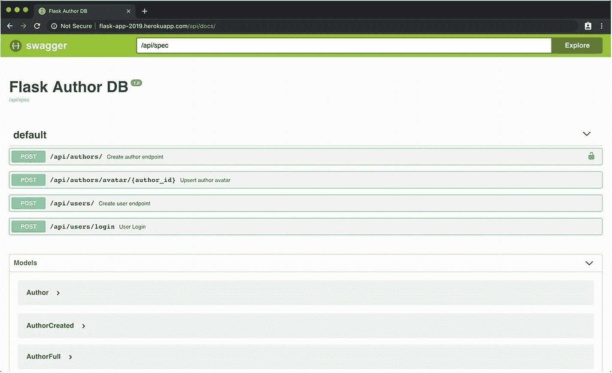

图 6-11

Heroku 上的 Flask 应用

这就是在 Heroku 上部署我们的应用的原因；您可以在 [`https://devcenter.heroku.com`](https://devcenter.heroku.com) 上了解更多关于 Heroku 的信息

## 在谷歌应用引擎上部署 Flask 应用

在本节中，我们将在 Google Cloud App Engine 上部署我们的应用，这是一个完全托管的无服务器平台，用于在云上部署和扩展应用。App Engine 支持包括 Python 在内的各种平台，并为部署后端服务提供完全托管的服务。因此，在我们开始之前，请确保您有一个有效的谷歌云帐户，或者您可以在 [`https://cloud.google.com/products/search/apply/`](https://cloud.google.com/products/search/apply/) 注册。谷歌云也提供一年 300 美元的积分。

接下来使用以下指南安装 Google Cloud CLI:[`https://cloud.google.com/sdk/docs/quickstarts`](https://cloud.google.com/sdk/docs/quickstarts)。设置完成后，运行以下命令登录您的 Google Cloud 帐户。

```py
$ gcloud auth login

```

一旦成功，我们就可以开始创建我们的 Google App Engine 应用，但是在此之前，我们需要创建几个配置文件。

首先用下面的代码在 src 目录中创建 app.yaml，为 Google App Engine 配置应用基础。

```py
runtime: python27
api_version: 1
threadsafe: true
handlers:
- url: /avatar
  static_dir: images
- url: /.*
  script: wsgi.application

libraries:
  - name: ssl
    version: latest
env_variables:
  WORK_ENV: PROD

```

接下来创建 appengine_config.py，它将从我们的虚拟环境中获取已安装的模块，以便 appengine 知道第三方模块安装在哪里。

```py
from google.appengine.ext import vendor

vendor.add('venv/lib/python2.7/site-packages/')

```

现在我们准备初始化我们的应用；对同一运行以下命令:

```py
$ gcloud init

```

这将提示您创建应用、名称和项目，并选择区域，因此请正确输入。

完成后，运行以下命令在 Google Cloud App Engine 上部署您的应用。

几分钟之内，它就应该部署并运行了。现在，您可以在终端中运行以下命令，在默认浏览器中打开应用。

```py
$ gcloud app browse

```

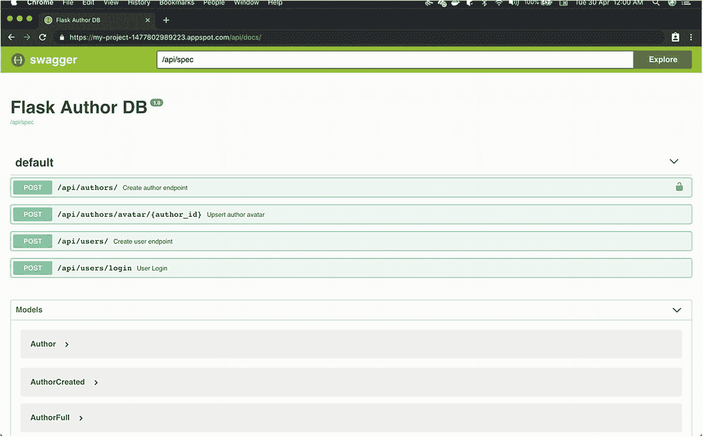

图 6-12

谷歌云应用引擎上的 Flask 应用

## 结论

因此，在本章中，我们使用不同的方法在各种云平台上部署了我们的应用，这应该已经为您提供了入门知识，或者部署 Flask 应用的各种部署和扩展选项。在下一章，我们将讨论管理和调试已部署应用的部署后步骤。