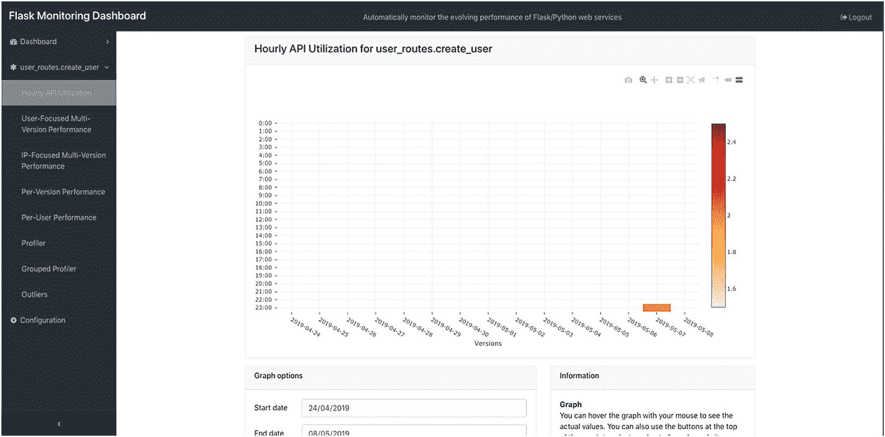
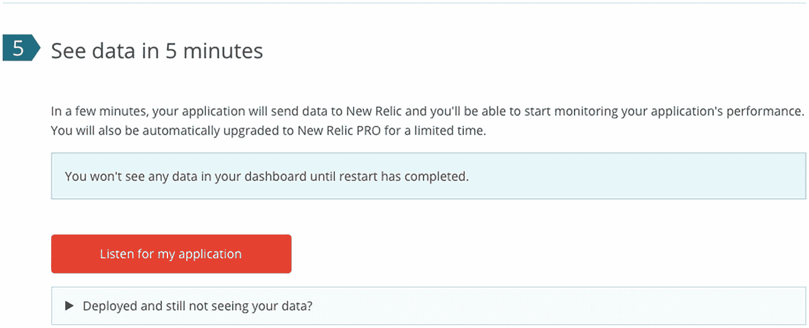
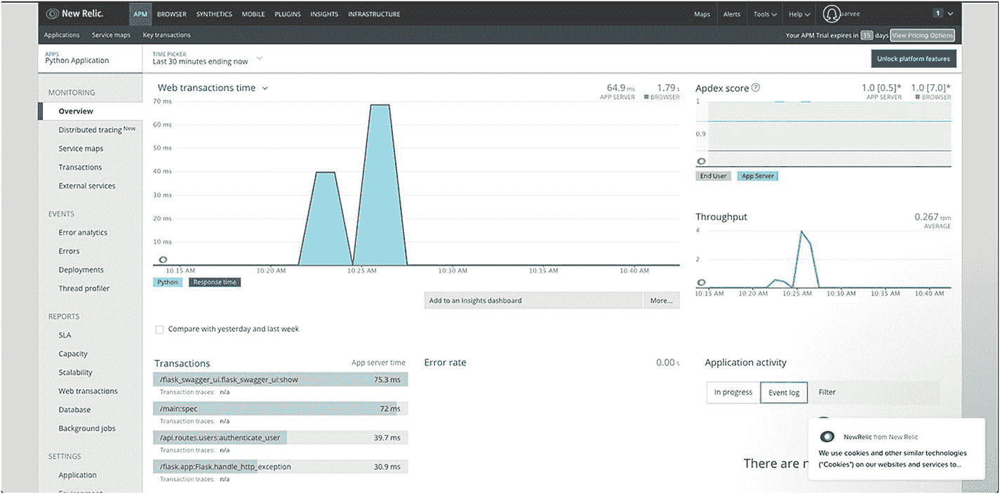

# 七、监控 Flask 应用

到目前为止，我们已经介绍了 flask 应用的开发、测试和部署。在这一章中，我们将讨论一些管理和支持你的 Flask 应用的附加组件，以及从这里开始的步骤。

## 应用监控

即使在对我们的应用执行了各种各样的测试之后，在现实世界中，总会有一些我们在开发时没有意识到的异常场景和瓶颈，当人们开始使用应用时，它们会作为 bug 和错误出现在产品中。这就是我们需要应用监控的时候，它可以监控您的应用在生产中的行为，包括停机检查、端点错误、崩溃、异常和与性能相关的问题。监控对于应用来说至关重要，因为原始日志文件很难解释，而且开发人员需要花费大量时间来理解它们。日志文件在大多数情况下可以检测到功能错误，但是它不会告诉您太多与性能相关的问题，而这些问题对于您的应用也是至关重要的，因为业务依赖于应用能够及时地为其客户提供服务。因此，主动应用监控对于处理应用中的稳定性、性能和错误至关重要。

所有主要的云服务提供商都支持监控虚拟机的功能。我们在上部署我们的应用，用于操作系统级别的 CPU 利用率、内存利用率和网络。但是，应用监控通常包括以下内容:

1.  应用错误和警告

2.  每个事务的应用性能

3.  数据库和第三方集成查询性能

4.  基本服务器监控和指标

5.  应用日志数据

市场上有许多优秀的应用监控工具，在这一章中，我们将介绍其中一些工具的集成，因为它们都具有不同的功能、支付选项等。

以下是一些开源监控项目的列表:

1.  哨兵

2.  扇子

3.  服务金丝雀

4.  Flask 监控仪表板

市场上也有一些监控服务，如 New Relic、Sentry.io、Scout 等，它们可以减轻部署监控软件的负担，但需要付出一定的代价。我们将研究应用监控工具的类型。

### 哨兵

Sentry 是一个用 Python 开发的开源应用监控系统，但可用于所有主要平台。Sentry 还有一个云托管服务，有不同的订阅模式，从面向开发者的免费版本到每月花费约 80 美元的商业版本。在这方面，我们将检查免费版本，并将其与我们的集成，这是非常简单的。


图 7-1

创建新项目

首先，在 [`https://sentry.io/signup/`](https://sentry.io/signup/) 上注册哨兵，注册成功后，登录您的仪表板。完成后，点击 add project 按钮，选择 Flask 作为框架，输入名称，提交创建项目。

一旦完成，它将把我们带到下一页，这一页有集成的细节，所以只需使用 PIP 安装 sentry SDK，并把集成代码复制粘贴到 main.py 中。

```py
(venv)$pip install sentry-sdk[flask]

```

接下来在 app = Flask(__name__)前添加以下代码。

```py
sentry_sdk.init(
    dsn="<your_dsn_here>"
    integrations=[FlaskIntegration()]
)

```

一旦完成，您就可以部署应用，剩下的工作就交给 sentry 了。让我们通过在 sentry dashboard 中点击 404 端点来测试一下。

在您的浏览器中，请求任何不存在的端点，sentry SDK 将从应用中触发一个事件，如下图所示。


图 7-2

哨兵问题清单

点击该问题将使您深入了解该问题及其详细信息，从而帮助您解决该问题，如下图所示。


图 7-3

哨兵问题详情

Sentry 有更多的特性供你探索，让你的应用稳定无误。

### Flask 监控仪表板

Flask 监控仪表板是 Flask 应用的扩展。它严格监控应用的性能和利用率，分析请求，还可以配置为运行特定的作业来管理您的应用。它是开源和免费的，所以让我们开始吧。

使用 PIP 安装 Flask 监控仪表板，代码如下。

```py
(venv)$pip install flask_monitoringdashboard

```

接下来，在 main.py 文件中，使用下面的代码导入扩展，这里有其他库导入。

```py
import flask_monitoringdashboard as dashboard

```

现在，就在我们初始化 app 对象的下方，添加以下代码。

```py
dashboard.bind(app)

```

差不多就是这样。现在重启你的应用，访问 http:// <host>: <port>/dashboard，就会打开登录页面。默认凭据是 admin 和 admin，您应该在之后立即更改。</port></host>


图 7-4

Flask 监控仪表盘

登录后，您将被重定向到控制面板，该面板将概述您的终端，您可以单击每个终端以获得更深入的了解，还可以根据您的偏好设置每个终端的监控级别。


图 7-5

Flask 监控仪表板概述

单击端点会将您重定向到每个端点的 insights 页面，在这里您可以生成每个请求的图形数据，并获得有关端点使用情况的更深入的信息。



图 7-6

API 利用率洞察

### 新遗迹

New Relic 是市场上最可靠、最具竞争力的应用监控工具之一；他们提供了一个全面的数据库和实时监控服务。New Relic 是一项基于订阅的付费服务，但他们有 14 天的试用期，我们将用它来检验一下。那就去报名参加 [`https://newrelic.com/signup`](https://newrelic.com/signup) 的活动吧

一旦你注册，你将被要求选择平台；继续选择 Python 作为平台。


图 7-7

新遗迹设置

在您的应用目录中，使用以下命令安装新的 Relic 代理。

```py
(venv)$ pip install newrelic

```

接下来，我们需要使用新的遗留密钥来生成配置，因此单击屏幕上的“显示许可证密钥”按钮，这将显示您的私钥。

现在用您的密钥执行以下命令。

```py
(venv)$ newrelic-admin generate-config <your-key-goes-here> newrelic.ini

```

所以现在我们的应用应该配置好了；接下来，使用下面的命令运行您的应用并测试配置。

```py
(venv)$ NEW_RELIC_CONFIG_FILE=newrelic.ini newrelic-admin run-program python run.py

```

一旦你这样做，点击监听我的应用按钮，如下图所示，这将开始监听来自你的应用的请求，以配置你的仪表板，一旦它成功地接收到数据，你会看到一个按钮重定向到你的新的遗迹仪表板。



图 7-8

新遗迹听申请

现在你会看到应用仪表板，其中列出了你的应用；单击 Python 应用，因为我们这里只有一个应用。


图 7-9

新遗迹应用仪表板

点击后，您将被重定向到您的应用仪表板，它看起来非常全面，但提供了许多关于应用状态的见解。参考以下截图为例。



图 7-10

Python 应用仪表板

如您所见，我们可以查看最新的事务和事务时间图，然后我们可以查看吞吐量图和 apdex 分数，该分数根据 0.5 秒响应时间的设定值对应用进行评分。在“事件”下，您可以查看错误分析和错误，它们提供了系统中出现的错误的详细信息。

你可以在 [`https://docs.newrelic.com/docs/apm/new-relic-apm/guides`](https://docs.newrelic.com/docs/apm/new-relic-apm/guides) 的官方文档中了解更多关于新遗迹的信息。

### 奖励服务

因此，我们已经涵盖了所有主题，让您开始使用 Flask 开发 REST 应用。然而，这只是一个初学者指南，对于真正的业务用例，还有更多的东西要涵盖，包括集成第三方服务，如搜索、缓存、发布订阅、实时通信等等。这本书涵盖了 Flask REST API 开发的基础知识，可以作为构建 REST 应用的基础。在本模块中，我们将介绍一些附加库和工具的基础知识，这些库和工具可以为您的应用增加价值。

#### 使用 Flask 进行全文搜索

Flask 与一些库兼容，这些库提供了与全文搜索应用(如 Elasticsearch)的集成。

##### 肾盂弹性研究

Pyelasticsearch 是一个集成 elasticsearch 的干净的库，Elasticsearch 是 flask 应用中一个非常流行和强大的搜索引擎。然而，Elasticsearch 提供了 REST 端点来连接搜索引擎，但 pyelasticsearch 使与端点的通信更容易。您可以在 [`https://pyelasticsearch.readthedocs.io`](https://pyelasticsearch.readthedocs.io) 了解更多关于弹性搜索的信息，并查看此链接了解更多关于弹性搜索 [`www.elastic.co/guide/en/elasticsearch/reference/current/getting-started.html`](https://www.elastic.co/guide/en/elasticsearch/reference/current/getting-started.html)

##### Flask 化学

Whoosh 是一个用 Python 构建的快速搜索引擎库，非常灵活，支持基于自由格式或结构化文本的复杂数据搜索。Flask-WhooshAlchemy 是一个 Flask 扩展，用于将 Whoosh 搜索引擎库与 Flask 中的 SQLAlchemy 集成在一起。不像 pyelasticsearch 那样，不需要任何第三方应用就可以集成并获得全文搜索，这非常简单。可以在 [`https://pythonhosted.org/Flask-WhooshAlchemy/`](https://pythonhosted.org/Flask-WhooshAlchemy/) 了解更多

#### 电子邮件

我们使用 Flask mail 来验证用户邮件。这里有一个其他库的列表，您可以使用它们在您的应用中有效地集成电子邮件。

##### 弗拉斯克-SendGrid

Flask-SendGrid 是一个 Flask 扩展，使用 SendGrid 简化发送电子邮件，sendgrid 是一个著名的电子邮件服务；可以在 [`https://sendgrid.com/`](https://sendgrid.com/) 报名 SendGrid 他们提供免费订阅，包括前 30 天的 40，000 封电子邮件和永远的 100 封/天。您可以在 [`https://github.com/frankv/flask-sendgrid`](https://github.com/frankv/flask-sendgrid) 查看 Flask-SendGrid，这让发送电子邮件变得轻而易举。

##### 使用 Boto3 的 AWS SNS

Boto3 是一个用于 Python 的 AWS SDK，你可以使用 AWS 的 SNS(简单通知服务)通过 Boto 发送电子邮件和文本消息。下面是一个使用 Python 和 Boto [`https://docs.aws.amazon.com/ses/latest/DeveloperGuide/send-using-sdk-python.html`](https://docs.aws.amazon.com/ses/latest/DeveloperGuide/send-using-sdk-python.html) 发送电子邮件的指南。你需要一个有效的 AWS 帐户，并从 [`https://boto3.readthedocs.io/en/latest/guide/quickstart.html#installation`](https://boto3.readthedocs.io/en/latest/guide/quickstart.html%2523installation) 安装 Boto。

#### 文件存储器

文件存储是应用的一个重要方面；我们将用户头像存储在应用服务器文件系统中，这对于生产应用来说并不是一个好方法，在这种情况下，您可能希望使用文件存储服务来存储和访问您的文件。这里有一些相同的建议。

##### 使用 Boto3 的自动气象站 S3

你可以利用 Boto3 来管理亚马逊 AWS S3 上的文件，这是一个强大的文件管理系统。本指南将为您提供使用 Flask [`https://boto3.amazonaws.com/v1/documentation/api/latest/reference/services/s3.html`](https://boto3.amazonaws.com/v1/documentation/api/latest/reference/services/s3.html) 管理文件所需的一切

##### 阿里巴巴云 OSS

阿里云提供了一个复杂的文件存储平台，叫做对象存储服务；您可以从 [`https://github.com/aliyun/aliyun-oss-python-sdk`](https://github.com/aliyun/aliyun-oss-python-sdk) 使用他们的 Python SDK，并使用他们在 [`https://help.aliyun.com/document_detail/32026.html`](https://help.aliyun.com/document_detail/32026.html) 提供的 OSS 指南轻松设置文件管理

## 结论

这标志着本章和本书的结束。在优化和升级您的应用方面还有很多需要探索的地方，但这将是您成长的正确基础；如果您在集成任何提到的服务时遇到问题，请查看它们的官方文档，寻求支持，或寻求堆栈溢出来解决它们。您也可以使用此链接询问或阅读有关 Flask [`https://stackoverflow.com/search?q=flask`](https://stackoverflow.com/search%253Fq%253Dflask) 的问题。