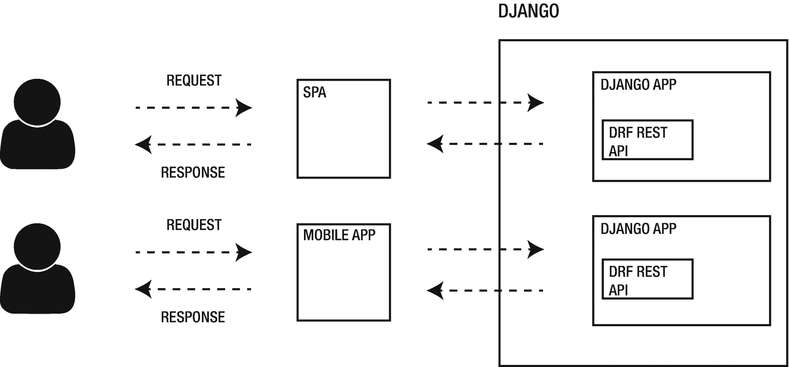

# 四、解耦架构的优点和缺点

在这一章中，我们概述了分离 Django 项目的各种方法。特别是，我们涵盖:

*   混合架构

*   基于 REST 和 GraphQL 的完全解耦架构

*   两种风格的优缺点

到本章结束时，你应该能够辨别一种或多种解耦风格，并成功地应用到你的下一个 Django 项目中。

## 伪解耦 Django

*伪解耦*，或*混合解耦* *，*是一种用少量 JavaScript 扩充静态前端的方法；只要能让最终用户觉得事情有互动性和趣味性就够了。

在接下来的两节中，我们将通过研究两种不同的方法来讨论伪解耦设置的优点和缺点:无 REST 和有 REST。

### 无休止伪解耦

根据您编程的时间长短，您会开始注意到在构建 web 应用时有一类模式反复出现:数据获取和表单处理。

例如，在 Django 应用中可能有一个插入新数据的页面。如何处理数据插入取决于用户需求，但基本上有两种选择:

*   用 Django 单独处理表单

*   用 JavaScript 处理表单

Django 表单和模型表单能够很好地为您生成字段，但是大多数时候我们希望拦截表单处理的经典`GET` / `POST` /Redirect 模式，尤其是表单的`submit`事件。为此，我们在 Django 模板中引入了一点 JavaScript。清单 4-1 展示了这样一个例子。

```py

   <script>
       const form = document.getElementById("reply-create");
       form.addEventListener('submit', function (event) {

           event.preventDefault();
           const formData = new FormData(this);

           fetch("", {
               method: 'POST',
               body: formData
           }).then(response => {
               if (!response.ok) throw Error(response.statusText);
               return response;
           }).then(() => {
               location.reload();
               window.scrollTo({top:0});
           });
       });


Listing 4-1JavaScript Logic for Form Handling

```

在这个例子中，我们将 JavaScript 绑定到表单上，这样当用户提交数据时，表单的默认事件就会被拦截和停止。接下来，我们构建一个`FormData`对象，它被发送给 Django `CreateView`。还要注意我们如何使用 Django 的`url`模板标签来构建获取的 URL。为了让这个例子工作，表单必须包含一个`CSRF`标记，如清单 4-2 所示。

```py
<form id="reply-create">
   
   <!-- fields here -->
</form>

Listing 4-2Django’s CSRF Token Template Tag

```

如果令牌在表单之外，或者对于任何其他不直接来自表单的`POST`请求，`CSRF`令牌必须包含在`XHR`请求头中。这里概述的例子只是 JavaScript 在 Django 模板中的众多用例之一。正如在第二章 ?? 中简要提到的，我们看到了微框架的寒武纪大爆发，它为 Django 模板增加了足够的交互性。本书篇幅有限，无法涵盖所有可能的例子。在这里，我们将重点放在更广泛的架构上，检查每种方法的优缺点。图 4-1 显示了没有 REST 的伪解耦 Django 的表示。


图 4-1

一个伪解耦的 Django 项目可以有一个或多个应用，每个应用都有自己的模板。JavaScript 融入到模板中，并与常规 Django 视图对话

记住 Django 在开发速度方面所提供的东西，在伪解耦或混合方法的情况下，我们得到了什么，又失去了什么？

*   *认证和 cookie*:因为我们在 Django 模板中提供 JavaScript，所以我们不需要担心复杂的认证方法。我们可以使用内置的会话认证。此外，在伪解耦设置中，cookies 可以在同一个域中的每个请求上自由传播。

*   表单:Django 有一个惊人的表单系统，在开发过程中节省了大量时间。在伪解耦设置中，我们仍然可以使用 Django 表单来构建用于数据插入的 HTML 结构，只需要足够的 JavaScript 来使它们具有交互性。

*   *什么 JS 库？在伪解耦设置中，我们可以使用任何不需要构建管道的轻量级前端库，比如 Vue.js，或者更好的普通 JavaScript。如果我们事先知道我们的目标是什么用户代理，我们就可以提供现代的 JavaScript 语法，而不需要编译步骤。*

*   *路由* : Django 负责路由和 URL 构建。无需担心 JavaScript 路由库或浏览器后退按钮的奇怪问题。

*   *搜索引擎优化*:对于内容密集型网站，伪解耦设置往往是最安全的选择，只要我们不使用 JavaScript 动态生成关键内容。

*   *开发人员生产力/负担*:在混合设置中，JavaScript 的数量希望很低，以至于我们不需要复杂的构建工具。一切仍然以 Django 为中心，开发人员的认知负荷很低。

*   测试:在 Django 应用的上下文中测试 JavaScript 交互总是很棘手。Selenium for Python 不支持自动等待。有很多工具，主要是 Selenium 的包装器，比如 Splinter，都有这种能力。然而，在没有支持 JavaScript 的测试运行器的情况下测试伪解耦的 Django 前端仍然很麻烦。像 Cypress 这样的工具，我们将在第九章中介绍，与 Django 配合得非常好，减轻了测试 JavaScript 丰富的接口的负担。

### 与 REST 伪解耦

不是每个应用都必须被设计成单页应用，从本书开始我们就强调了这一点。

按照唐纳德·克努特的说法，过度设计的应用是万恶之源。然而，也有混合的情况，UI 需要大量的 JavaScript 交互性，而不仅仅是简单的表单处理，但是我们仍然不想离开 Django 的保护伞。在这些配置中，你会发现在 Django 项目中引入像 Vue.js 或 React 这样的 JavaScript 库是合理的。虽然 Vue.js 是高度进步的，但它不想控制所有页面。React 迫使开发人员在 React 中做所有的事情。在这些情况下，由模板构成并增加了表单或模型表单的 Django 前端可能会失去重要性，而支持伪解耦设置，从而:

*   一个或多个 Django 应用的前端完全由 JavaScript 构建

*   后端公开了一个 REST API

这种设置与前端与 REST API 位于不同域/源的架构之间的区别在于，在伪解耦设置中，我们在同一个 Django 项目中为 SPA 前端和 REST API 提供服务。这有许多积极的副作用。为什么要在这样的设置中引入 REST？Django `CreateView`和模型在一定程度上工作良好，之后我们不想重新发明轮子，就像模型的 JSON 序列化一样。Django REST 与现代前端库的结合为健壮的解耦项目打下了坚实的基础。图 4-2 显示了一个带有 REST 的伪解耦 Django 的表示。


图 4-2

一个带有 REST 的伪解耦 Django 项目可以有一个或多个应用，每个应用都有自己的 REST API。JavaScript 作为 Django 项目中的单页应用，与 Django REST 视图对话

在下一章中，我们将看到一个使用 Django REST 框架和 Vue.js 的伪解耦设置的实际例子。在这里，我们将讨论伪解耦配置的优点和缺点，正如我们在上一节中对 REST-less 设置所做的那样。

*   *认证和 cookie*:基于会话的认证是伪解耦项目的默认选择，即使是 REST 也是如此。因为我们在同一个 Django 项目中提供单页面应用，所以在从 JavaScript 发出`POST`请求之前，只需要通过常规的 Django 视图对用户进行身份验证，并获取适当的 cookies。

*   *表单*:如果我们决定构建一个或多个 Django 应用作为单页面应用，我们就失去了使用 Django 表单和模型表单的能力。这开始导致代码重复和团队的更多工作，因为 good 'ol Django 表单及其数据验证层必须用选择的 JavaScript 库重新实现。

*   *什么 JS 库？*在 REST 的伪解耦设置中，我们可以使用任何 JavaScript 库或框架。这需要一些额外的步骤来将包包含在 Django 静态系统中，但是这对于任何库都是可能的。

*   *路由*:Django 项目中的单页面应用的路由实现起来并不容易。Django 仍然可以为每个应用提供主路径，例如 [`https://decoupled-django.com/billing/`](https://decoupled-django.com/billing/) ，但是每个应用都必须处理其内部路由。与基于历史的路由相比，基于哈希的路由是最简单的路由形式，也最容易实现。

*   搜索引擎优化:单页面应用(SPAs)不适合内容丰富的网站。在将 SPA 集成到 Django 之前，这是需要考虑的最重要的方面之一。

*   开发人员的生产力/负担:任何现代的 JavaScript 库都有自己的挑战和工具。在使用 REST 和一个或多个单页面应用的伪解耦设置中，Python 开发人员的开销可能会呈指数级增长。

*   *测试*:在使用少量 JavaScript 的伪解耦设置中，考虑到实现自动等待 JavaScript 交互的需要，使用 Selenium 或 Splinter 等工具可能是有意义的。相反，在基于 REST 和 SPA 的伪解耦配置中，以 Python 为中心的工具表现不佳。要测试大量使用 JavaScript 的接口和 JavaScript UI 组件，比如用 Vue.js 或 React 实现的那些，像 Cypress 这样的工具用于功能测试，Jest 用于单元测试是更好的选择。

## 完全解耦的 Django

与伪解耦设置相反，*完全解耦*架构，也称为*无头*，是一种前端和后端完全分离的方法。

在前端，我们可以发现 JavaScript 单页面应用位于与后端不同的域/源上，后端现在充当 REST 或 GraphQL 的数据源。在接下来的两节中，我们将讨论这两种方法。

### 与 REST 完全解耦

与 REST 完全解耦的 Django 项目是目前最普遍的设置之一。由于其高度的灵活性，REST API 和前端可以部署在不同的域或源上。Django REST 框架是用于在 Django 中构建 REST APIs 的事实上的库，而 JavaScript 以 React、Vue.js 和 Angular 领先于前端。在这些配置中，架构通常安排如下:

*   一个或多个 Django 应用的前端作为单页 JavaScript 应用存在于 Django 之外

*   一个或多个 Django 应用公开了一个 REST API

用 REST API 完全解耦配置的 Django 项目可以很好地充当:

*   SPA、移动应用或渐进式 Web 应用的 REST API

*   静态站点生成工具(SSG)或服务器端呈现的 JavaScript 项目(SSR)的内容存储库

图 4-3 显示了完全解耦的 Django 项目与 REST 的关系。



图 4-3

带有 REST 的完全解耦的 Django 项目可以有一个或多个应用，每个应用都有自己的 REST API。JavaScript 作为单页应用存在于 Django 项目之外，并通过 JSON 与 Django REST 视图对话

值得注意的是，并不是项目中的每个 Django 应用都必须公开 REST API:人们可以选择分离应用的一个或多个方面，而将其余部分保持在经典的 MVT 安排下。REST 规定的关注点分离为灵活但更复杂的设置开辟了道路。如果我们将 Django 项目与 REST 解耦，会有什么结果呢？

*   *认证和 cookie*:完全解耦项目的认证实现起来并不容易。基于会话的认证可以用于 REST 和单页面应用，但是它打破了无状态的限制。有许多不同的方法可以绕过 REST APIs 的基于会话的身份验证的限制，但是在后来的几年中，社区似乎倾向于采用无状态的身份验证机制，比如基于令牌的 JWT 身份验证(JSON web tokens)。然而，由于其安全缺陷和潜在的实施陷阱，JWT 在 Django 社区并不那么受欢迎。

*   *表单*:离开 Django 模板和表单意味着我们失去了轻松构建表单的能力。在完全解耦的设置中，表单层通常完全由 JavaScript 构建。数据验证经常在前端重复，现在必须在向后端发送请求之前清理和验证用户输入。

*   *什么 JS 库？在与 REST 完全解耦的设置中，我们可以使用任何 JavaScript 库或框架。将 Django REST 后端与解耦前端配对没有任何特别的限制。*

*   *路由:*在完全解耦的设置中，Django 不再处理路由。一切都压在客户肩上。对于单页应用，可以选择实现基于哈希的路由或历史路由。

*   *搜索引擎优化*:单页应用不太会玩 SEO。然而，随着诸如 Gatsby、Next.js 和 Nuxt.js 等 JavaScript 静态站点生成器的出现，JavaScript 开发人员可以使用最新的闪亮工具从一个无头 Django 项目中生成静态页面，而没有损害 SEO 的风险。

*   *开发人员生产力/负担*:在 REST 和一个或多个单页面应用完全解耦的环境中，Python 开发人员的工作量会成倍增加。出于这个原因，大多数 Django 和 Python web 代理都有一个专门的前端团队，专门处理 JavaScript 及其相关工具。

*   *测试*:在完全解耦的项目中，前端和后端是分开测试的。`APITestCase`和`APISimpleTestCase`帮助测试 Django REST APIs，而在前端，我们再次看到 Jest 和 Cypress 用于测试 UI。

### 与 GraphQL 完全解耦

与使用 REST 的完全解耦的 Django 一样，使用 GraphQL 的完全解耦的 Django 项目提供了高度的灵活性，但也带来了更多的技术挑战。

REST 是一项久经考验的技术。另一方面，GraphQL 是最近才出现的，但似乎比 REST 有一些明显的优势。然而，与任何新技术一样，在生产项目中集成新工具和潜在的新挑战之前，开发人员和 CTO 必须仔细评估优缺点。图 4-4 显示了一个用 GraphQL 和 REST API 解耦的 Django 项目。


图 4-4

完全解耦的 Django 项目可以公开 REST 和 GraphQL APIs。在同一个项目中使用这两种技术并不罕见

在图 4-4 中，我们想象了一个完全解耦的 Django 项目，它公开了两个不同的应用:一个使用 REST，另一个使用 GraphQL。事实上，GraphQL 可以与 REST 共存，以支持从遗留 REST API 到 GraphQL 端点的渐进重构。这对于在从 REST 切换之前评估 GraphQL 或者为 Gatsby 之类的工具公开 GraphQL API 非常有用。拥抱 GraphQL 要付出什么代价？让我想想。

*   *认证和 cookie*:在完全解耦的设置中，GraphQL 的认证主要通过基于令牌的认证来处理。在后端，GraphQL 需要实现突变来处理登录、注销、注册和所有相关的极端情况。

*   *什么 JS 库？*在 GraphQL 的完全解耦设置中，我们可以使用任何 JavaScript 库或框架。将 Django GraphQL 后端与解耦前端配对没有任何特别的限制。GraphQL 查询甚至可以用`Fetch`或者`XMLHttpRequest`来完成。

*   *搜索引擎优化*:前端的 GraphQL 多与 React 这样的客户端库配合使用。这意味着我们不能按原样发布客户端生成的页面，否则我们将冒 SEO 受损的风险。Gatsby、Next.js 和 Nuxt.js 等工具可以在 SSG(静态站点生成)模式下运行，从 GraphQL API 生成静态页面。

*   *开发人员生产力/负担* : GraphQL 是一种新颖的技术，尤其是在前端，有十几种方法可以实现数据提取层。GraphQL 似乎提高了开发人员的工作效率，但同时也引入了新的学习内容和新的模式。

由于 GraphQL 是一个数据提取层，所以对表单、路由和测试的考虑与解耦 REST 项目没有什么不同。

## 摘要

在这一章中，我们概述了分离 Django 项目的各种方法:

*   带和不带 REST 的伪解耦

*   与 REST 或 GraphQL 完全解耦

希望你现在已经准备好为你的下一个 Django 项目做出明智的选择。在下一章，我们在转移到 JavaScript 和 Vue.js 之前准备 Django 项目。