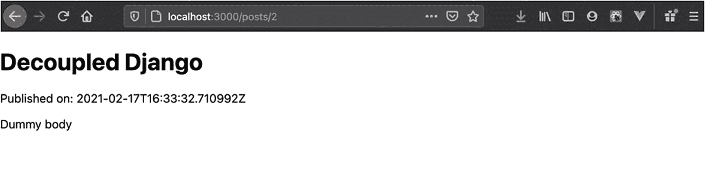

# 八、Django REST 和 Next.js

本章涵盖:

*   Django 作为内容回购

*   React 及其生态系统

*   Vue.js 及其生态系统简介

在本章中，在讨论了安全性和部署之后，我们回到本地工作站，用 Next.js、React 生产框架和 TypeScript 来构建一个博客。

## Django 作为一个无头 CMS

基于 REST 和 GraphQL 的解耦架构促进了近年来一种新趋势的兴起:无头 CMS。

有了专门处理输入/输出的数据和序列化的后端，我们可以创建与后端完全分离的消费者前端。这些前端不仅限于充当单页面应用，还可以从后端检索数据来构建静态网站。在本章中，我们将介绍 Next.js，这是一个用于服务器端渲染和静态站点生成的 React 框架。

## 构建博客应用

Django 上有无数的书籍和教程使用博客应用作为向初学者介绍这个奇妙框架的最直接的方式。

它可能不是最令人兴奋的应用，但是在我们的例子中，它是使用 Django 作为 JavaScript 框架的内容存储库的完美候选。我们开始吧。

Note

本章假设您在回购根`decoupled-dj`中，Python 虚拟环境处于活动状态，环境变量`DJANGO_SETTINGS_MODULE`设置为`decoupled_dj.settings.development`。

### 构建模型

对于我们的博客应用，我们需要一个`Blog`模型。这个模型应该连接一个`User`。每个`User`也应该能够访问其博客文章。首先，我们在`blog/models.py`中创建模型，如清单 [8-1](#PC1) 所示。

```py
from django.db import models
from django.conf import settings

class Blog(models.Model):
   class Status(models.TextChoices):
       PUBLISHED = "PUBLISHED"
       UNPUBLISHED = "UNPUBLISHED"

   user = models.ForeignKey(
       to=settings.AUTH_USER_MODEL,
       on_delete=models.PROTECT,
       related_name="blog_posts"
   )
   title = models.CharField(max_length=160)
   body = models.TextField()
   status = models.CharField(
       max_length=15,
       choices=Status.choices,
       default=Status.UNPUBLISHED
   )
   created_at = models.DateTimeField(auto_now_add=True)

Listing 8-1blog/models.py - Model for the Blog App

```

在这个模型中，我们为博客条目定义了一些最常见的字段:

*   `title`:博客条目的标题

*   `body`:博客条目的文本

*   `created_at`:创建日期

*   `status`:条目是否发布

在`user`字段中，我们有一个`User`的外键，并适当地配置了`related_name`，这样用户就可以通过 ORM 中的`.blog_posts`属性访问它的帖子。我们可以添加更多的字段，比如 slug，但是对于本章的范围来说，这些已经足够了。

### 启用应用

模型就绪后，我们在`decoupled_dj/settings/base.py`中启用应用，如清单 [8-2](#PC2) 所示。

```py
INSTALLED_APPS = [
   ...
   "blog.apps.BlogConfig",
]

Listing 8-2decoupled_dj/settings/base.py - Enabling the Blog App

```

最后，我们应用迁移:

```py
python manage.py makemigrations
python manage.py migrate

```

当我们在那里时，让我们在数据库中创建几个博客条目。首先我们打开一个 Django shell:

```py
python manage.py shell_plus

```

然后我们创建条目(`>>>`是 shell 提示符):

```py
>>> juliana = User.objects.create_user(username="jul81", name="Juliana", email="juliana@acme.io")
>>> Blog.objects.create(title="Exploring Next.js", body="Dummy body", user=juliana)
>>> Blog.objects.create(title="Decoupled Django", body="Dummy body", user=juliana)

```

我们以后会需要这些条目，所以这一步不能跳过。有了这个应用，我们现在就可以在继续之前构建 REST 逻辑了。

## 构建 REST 后端

我们的目标是将`Blog`模型暴露给外界。这样，任何 JavaScript 客户机都可以检索博客条目。正如我们在第 5 章[中对计费应用所做的，我们需要连接 DRF 的基础:序列化器和视图。在下一节中，我们将为`Blog`构建一个序列化器，并为公开博客条目构建两个视图。](05.html)

### 构建序列化程序

为了构建我们的 REST API，我们在`blog`中创建了一个名为`api`的新 Python 包。在这个包中，我们放置了 REST API 的所有逻辑。首先，让我们用清单 [8-3](#PC6) 中的序列化程序在`blog/api/serializers.py`创建一个新文件。

```py
from blog.models import Blog
from rest_framework import serializers

class BlogSerializer(serializers.ModelSerializer):
   class Meta:
       model = Blog
       fields = ["title",
                 "body",
                 "created_at",
                 "status",
                 "id"]

Listing 8-3blog/api/serializers.py - DRF Serializer for the Blog Model

```

这个序列化器没有什么神秘的:它公开了模型的字段，减去了`user`。保存并关闭文件。有了序列化器，我们就可以构建视图和 URL 配置了。

### 构建视图和 URL

对于这个项目，我们需要两个视图:

*   一个`ListAPIView`来暴露整个帖子列表

*   一个`RetrieveAPIView`暴露单个条目

我们在`blog/api/views.py`的一个新文件中创建视图，如清单 [8-4](#PC7) 所示。

```py
from .serializers import BlogSerializer
from blog.models import Blog
from rest_framework.generics import ListAPIView, RetrieveAPIView

class BlogList(ListAPIView):
   serializer_class = BlogSerializer
   queryset = Blog.objects.all()

class BlogDetail(RetrieveAPIView):
   serializer_class = BlogSerializer
   queryset = Blog.objects.all()

Listing 8-4blog/api/views.py - REST Views for Our Blog

```

接下来，我们在`blog/urls.py`的新文件中创建一个 URL 配置。像往常一样，我们给这个配置一个`app_name`，这有助于在根 URL 配置中命名应用，如清单 [8-5](#PC8) 所示。

```py
from django.urls import path
from .api.views import BlogList, BlogDetail

app_name = "blog"

urlpatterns = [
   path("api/posts/",
        BlogList.as_view(),
        name="list"),
   path("api/posts/<int:pk>",
        BlogDetail.as_view(),
        name="detail"),
]

Listing 8-5blog/urls.py - URL Configuration for the Blog App

```

最后，我们在`decoupled_dj/urls.py`中包含了我们博客的 URL 配置，如清单 [8-6](#PC9) 所示。

```py
from django.urls import path, include

urlpatterns = [
   ...
   path("blog/", include("blog.urls", namespace="blog")),
]

Listing 8-6blog/urls.py - Project URL Configuration

```

运行 Django 开发服务器后，我们应该能够在`http://localhost:8000/blog/api/posts/`访问端点。这将是 Next.js 的数据源。

Note

为了避免被本章的认证所困扰，可以暂时在`decoupled_dj/setting/base.py`中注释`DEFAULT_PERMISSION_CLASSES`。

## React 生态系统简介

React 是一个用于构建用户界面的 JavaScript 库，风靡了 web 开发。

通过组件、独立的标记单元和 JavaScript 代码来构建用户界面的 React 方法并不新鲜。然而，由于其灵活性，React 获得了巨大的人气，超过 Angular 和 Vue.js 成为构建单页面应用的首选库。在接下来的部分中，我们将回顾 React 基础知识，并介绍 Next.js，React 生产框架。

### 重新引入反应

大多数时候，用户界面不是一个单一的整体:它们由独立的单元组成，每个单元控制整个界面的一个特定方面。

例如，如果我们想到一个`<select>` HTML 元素，我们可能会注意到，在一个典型的应用中，它很少只出现一次。相反，它可以在同一个界面中多次使用。一开始，web 开发人员(包括我自己)通过一遍又一遍地复制粘贴相同的标记来重用应用的一部分。然而，这种方法经常导致不可持续的混乱。过去的问题是:“我如何重用这个标记及其 JavaScript 逻辑”？React 填补了这个巨大的空白，它仍然在某种程度上影响着 web 平台:缺乏原生组件，即可重用的标记和逻辑。

Note

值得注意的是，Web 组件(用于构建界面的原生组件)已经成为现实，但该规范仍有许多不完善之处。

React 支持基于组件的方法来构建用户界面。最初，React 组件是作为 ES2015 类构建的，因为它们能够保留内部状态。随着钩子的出现，React 组件可以作为简单的 JavaScript 函数构建，如清单 [8-7](#PC10) 所示。

```py
import React, { useState } from "react";

export default function Button(props) {
 const [text, setText] = useState("");
 return (
   <button onClick={() => setText("CLICKED")}>
     {text || props.initialText}
   </button>
 );
}

Listing 8-7React Component Example

```

在这个例子中，我们将一个`Button`组件定义为一个 JavaScript 函数。在组件中，我们使用`useState`钩子来保持内部状态。当我们点击按钮时，`onClick`处理程序(它映射到`click` DOM 事件)触发`setText()`，改变组件的内部状态。此外，组件从外部获取`props`，即一个只读对象，它获取任意数量的属性，组件可以使用这些属性向用户呈现数据。一旦我们创建了一个组件，我们就可以无限地重用它，如清单 [8-8](#PC11) 所示。

```py
import Button from "./Button";

export default function App() {
 return (

     <Button initialText="CLICK ME" />
     <Button initialText="CLICK ME" />

 );
}

Listing 8-8React Component Usage Example

```

这里我们有一个嵌套了我们的`Button`两次的`App`根组件。从外面我们经过一个`initialText`属性。React 组件并不总是那么简单，但是这个例子总结了 React 的重要理论，并为下一节铺平了道路。

## Next.js 简介

构建单页应用可能看起来很容易。我们已经习惯于使用 create-react-app 和 Vue CLI 等工具来创建新的 SPA 项目。

这些工具给人一种工作已经完成的错觉，这在某种程度上是真实的。现实是，在生产中事情并不那么简单。根据项目的不同，我们需要路由、高效的数据获取、搜索引擎优化、国际化以及性能和图像优化。Next.js 是 React 的一个框架，旨在减轻反复手动设置的负担，并为开发人员提供一个自以为是的生产就绪环境。

在第 [2](02.html) 章中，我们简单讨论了通用 JavaScript 应用，触及了在后端和前端之间共享和重用代码的能力。Next.js 正好属于这一类工具，因为它使开发人员能够编写服务器端呈现的 JavaScript 应用。Next.js 有两种主要的操作模式:

*   服务器端渲染

*   静态站点生成

在接下来的部分中，我们将在用 React 和 TypeScript 构建我们的博客前端时研究这两者。需要注意的是，这些框架不能直接与 Django 集成，因为它们有自己的服务器，由 Node.js 操作。它处理路由、认证、国际化，以及介于两者之间的一切。在这种安排中，像 Django 这样的框架只通过 REST 或 GraphQL API 为 Next.js 提供数据。

## 构建 Next.js 前端

首先，我们初始化一个 Next.js 项目。从根项目文件夹`decoupled_dj/`中，启动以下命令:

```py
npx create-next-app --use-npm next-blog

```

这将在`decoupled_dj/next-blog`中创建项目。项目就绪后，进入文件夹:

```py
cd next-blog

```

在 Next.js 项目文件夹中，安装 TypeScript 和几个其他类型定义，一个用于 Node、js，另一个用于 React:

```py
npm i typescript @types/react @types/node --save-dev

```

安装完成后，使用以下命令创建 TypeScript 的配置文件:

```py
touch tsconfig.json

```

在这个文件中，根据我们希望 TypeScript 执行的严格程度，我们可以将`strict`选项设置为`false`。然而，对于大多数项目，我们可能希望将其设置为`true`。文件就绪后，启动 Next.js 开发服务器:

```py
npm run dev

```

这将在`http://localhost:3000`开始 Next.js。如果一切顺利，您应该会从控制台看到以下输出:

```py
ready - started server on 0.0.0.0:3000, url: http://localhost:3000
We detected TypeScript in your project and created a tsconfig.json file for you.

```

从那里，我们准备好编写我们的第一个组件。

### 页面和路由

Next.js 的基础理论围绕着页面的概念。

如果我们查看新创建的项目，应该会看到一个名为`pages`的文件夹。在这个文件夹中，我们可以定义子文件夹。例如，通过在`pages/posts`创建一个新文件夹，当运行 Next.js 项目时，我们可以访问`http://localhost:3000/posts/`。没什么特别刺激的。有趣的部分来自 React 组件。放置在`pages`中的任何`.js`、`.jsx`、`.ts`或`.tsx`文件都成为 Next.js 的一个页面。为了理解 Next.js 如何工作，我们先从固定数据开始一步一步地创建一个页面，稍后介绍数据获取。

Note

对于 Next.js 部分，从现在开始我们在`decoupled_dj/next-blog`中工作。必须从该路径开始，在适当的子文件夹中创建每个建议的文件。

我们将在 Next.js 中创建一个简单的页面。对于下面的例子，在`pages/posts/index.tsx`中创建一个新文件，下面的 React 组件如清单 [8-9](#PC18) 所示。

```py
const BlogPost = () => {
 return (
   <div>
     <h1>Post title</h1>
     <div>
       <p>Post body</p>
     </div>
   </div>
 );
};

export default BlogPost;

Listing 8-9pages/posts/index.tsx - A First Next.js Page

```

这是一个 React 组件，也是 Next.js 的一个页面。让我们运行开发服务器:

```py
npm run dev

```

现在，我们可以前往`http://localhost:3000/posts`，我们应该能够看到一个简单的页面，其中包含我们放在 React 组件中的内容。确实很有趣，但是对于一个动态网站来说有点没用。如果我们想显示不同的博客文章，也许可以通过`id`获取它们，该怎么办？

在 Next.js 中，我们可以使用*动态路由*按需构建页面。例如，用户应该能够访问`http://localhost:3000/posts/2`并在那里看到想要的内容。为此，我们需要将组件的文件名从`index.ts`改为:

```py
[id].tsx

```

通过这样做，Next.js 将响应对`http://localhost:3000/posts/$id`的任何请求，其中`$id`是我们可以想象的任何数字 ID 的占位符。有了这些信息，组件就可以根据`id`从 REST API 中获取数据，对于 Next.js 来说，这就变成了一个 URL 参数。有了这些知识，让我们在进入数据获取之前用类型声明来丰富组件。清除我们一分钟前创建的组件中的所有内容，并将下面的代码放入`pages/posts/[id].tsx`，如清单 [8-10](#PC21) 所示。

```py
enum BlogPostStatus {
 Published = "PUBLISHED",
 Unpublished = "UNPUBLISHED",
}

type BlogPost = {
 title: string;
 body: string;
 created_at: string;
 status: BlogPostStatus;
 id: number;
};

const BlogPost = ({ title, body, created_at }: BlogPost) => {
 return (
   <div>
     <header>
       <h1>{title} </h1>
       <span>Published on: {created_at}</span>
     </header>
     <div>
       <p>{body}</p>
     </div>
   </div>
 );
};

export default BlogPost;

Listing 8-10pages/posts/[id]tsx - Blog Component for the Corresponding Next.js Page

```

该组件是用 TypeScript 静态类型化的。这个文件中有三种特定的类型脚本符号。这里有一个解释:

*   `BlogPostStatus` : TypeScript `enum`，为博客文章定义一组可能的状态。它映射了 Django 模型中定义的嵌套的`Status`类。

*   `BlogPost`:定义 React 组件属性的类型脚本`type`。它映射模型的字段(减去`user`)。

*   `BlogPost`:在组件参数中使用，强类型化我们的道具。

有了这个组件，我们现在就可以定义数据获取逻辑，用相应的数据填充每个博客文章。

Note

在 TypeScript 中，枚举在编译过程中会产生大量的 JavaScript 代码。这个问题的解决方案是 const enums，但是 Babel 不支持它们，Next.js 使用它们将 TypeScript 编译成 JavaScript。

### 数据提取

如前所述，Next.js 可以在两种模式下运行:

*   服务器端渲染

*   静态站点生成

使用服务器端呈现，页面是根据每个请求构建的，非常像传统的服务器端呈现的网站。想想 Django 模板或 Rails。在这种模式下，当用户点击相应的路径时，我们可以获取每个请求的数据。在 Next.js 中，这是通过`getServerSideProps`完成的。这应该是一个异步方法，从 React 组件所在的同一个文件中导出。在`getServerSideProps`中我们需要注意两件事:

*   获取所需的数据

*   至少返回一个`props`对象

一旦这些都完成了，Next.js 将负责把`props`传递给我们的 React 组件。清单 [8-11](#PC22) 展示了一个函数的示例框架，包括类型。

```py
export const getServerSideProps: GetServerSideProps = async (context) => {
 // fetch data
 return { props: {} };
};

Listing 8-11getServerSideProps Skeleton

```

`context`对象参数携带关于请求、响应和一个`params`对象的信息，我们可以在这个对象上访问请求参数。为了方便起见，我们将从`context`中析构`params`。让我们将这个函数添加到`pages/posts/[id].tsx`中，如清单 [8-12](#PC23) 所示，并带有相应的数据获取逻辑。

```py
import { GetServerSideProps } from "next";

const BASE_URL = "http://localhost:8000/blog/api";

export const getServerSideProps: GetServerSideProps = async ({ params }) => {
 const id = params?.id;

 const res = await fetch(`${BASE_URL}/posts/${id}`);

 if (!res.ok) {
   return {
     notFound: true,
   };
 }

 const json = await res.json();
 const { title, body, created_at, status } = json;

 return { props: { title, body, created_at, status } };
};

Listing 8-12pages/posts/[id].tsx - Data Fetching Logic for the Page

```

这段代码需要解释一下:

*   我们导入了`GetServerSideProps`类型，它用于为实际函数提供类型

*   在`getServerSideProps`中:
    *   我们从`params`得到`id`

    *   我们从 Django REST API 获取数据

    *   如果来自 API 的响应是否定的，我们返回`notFound`

    *   如果后端返回博客文章，我们将为组件返回一个`props`对象

Note

`getServerSideProps`有更多的返回属性，便于特定的用例。请查看官方文档以了解更多信息。

有了这些代码，我们就可以进行测试了。首先，Django 必须逃跑。在终端中，转到`decoupled_dj`并启动 Django:

```py
python manage.py runserver

```

在启动 Next.js 的另一个终端中，运行开发服务器(如果它还没有运行的话)(从`decoupled_dj/next_blog`文件夹中):

```py
npm run dev

```

现在，访问`http://localhost:3000/posts/1`或`http://localhost:3000/posts/2`。你应该会看到一篇博文，如图 [8-1](#Fig1) 所示。



图 8-1

Next.js 回应了一篇博文的详细路线

如您所见，这种方法完美无缺。在这种模式下，Next.js 在将页面发送给用户之前检索数据。但是对于博客来说，这不是最好的方法:没有比静态网站更好的让搜索引擎开心的网站了。下一节将解释如何使用 Next.js 实现数据获取和静态站点生成。

### 静态站点生成

每当我们想要向用户显示一篇博客文章时，调用 REST API 有点低效。

博客更适合作为静态页面。除了在每个请求上获取数据，Next.js 还支持在构建时获取数据。在这种模式下，我们可以以静态 HTML 的形式生成页面及其相应的数据，Next.js 将把这些数据提供给我们的用户。为了实现这一点，我们需要结合使用 Next.js 中的另外两个方法:`getStaticPaths`和`getStaticProps`。上一节的`getServerSideProps`和这些方法有什么区别？

`getServerSideProps`用于在服务器端渲染中异步获取每个请求的数据。也就是说，当用户到达给定的页面时，它必须等待一段时间，因为 Next.js 服务器必须从给定的源(REST API 或 GraphQL 服务)获取数据。这种方法对于动态且变化很大的数据来说很方便。

相反，`getStaticProps`用于在构建时异步获取数据。也就是说，当我们运行`npm run build`或`yarn build`时，Next.js 会创建一个产品包，其中包含它需要的所有 JavaScript，以及任何标记为静态的页面。清单 [8-13](#PC26) 显示了该函数的示例框架。

```py
import { GetStaticProps } from "next";

const BASE_URL = "http://localhost:8000/blog/api";

export const getStaticProps: GetStaticProps = async (_) => {
 const res = await fetch(`${BASE_URL}/posts/1`);

 const json = await res.json();
 const { title, body, created_at, status } = json;

 return { props: { title, body, created_at, status } };
};

Listing 8-13getStaticProps Example

```

注意我们是如何具体调用`http://localhost:8000/blog/api/1`的，这是相当有限的。在构建阶段之后，Next.js 生成相应的静态页面。通过运行`npm run start`或`yarn start`，Next.js 可以为我们的网站服务。当页面导出`getStaticProps`时，相关组件接收从该方法返回的`props`。然而，为了让我们的例子工作，页面必须有一个固定的路径，比如`1.tsx`。事先知道我们后端的每篇博客文章的 ID 是不切实际的。这就是`getStaticPaths`发挥作用的地方。使用这种方法，结合使用`getStaticProps`，我们可以生成一个路径列表，供`getStaticProps`用来获取数据。为了利用静态站点生成，让我们更改`pages/posts/[id].tsx`，以便它使用`getStaticPaths`和`getStaticProps`而不是`getServerSideProps`，如清单 [8-14](#PC27) 所示。

```py
import { GetStaticPaths, GetStaticProps } from "next";

const BASE_URL = "http://localhost:8000/blog/api";

export const getStaticPaths: GetStaticPaths = async (_) => {
 const res = await fetch(`${BASE_URL}/posts/`);
 const json: BlogPost[] = await res.json();
 const paths = json.map((post) => {
   return { params: { id: String(post.id) } };
 });

 return {
   paths,
   fallback: false,
 };
};

export const getStaticProps: GetStaticProps = async ({ params }) => {
 const id = params?.id;

 const res = await fetch(`${BASE_URL}/posts/${id}`);

 if (!res.ok) {
   return {
     notFound: true,
   };
 }

 const json: BlogPost = await res.json();
 const { title, body, created_at, status } = json;

 return { props: { title, body, created_at, status } };
};

Listing 8-14pages/posts/[id].tsx - Data Fetching at Build Time with getStaticPaths and getStaticProps

```

这里，`getStaticProps`的逻辑与上一节中`getServerSideProps`的逻辑相同。然而，我们也有`getStaticPaths`。在此功能中，我们:

*   调用 REST API 获取来自`http://127.0.0.1:8000/blog/api/posts/`的所有帖子的列表

*   生成并返回路径数组

这个路径数组很重要，必须具有以下形状:

```py
   paths: [
     { params: { id: 1 } },
     { params: { id: 2 } },
     { params: { id: 3 } },
   ]

```

在我们的代码中，它由以下代码片段生成:

```py
...
 const paths = json.map((post) => {
   return { params: { id: String(post.id) } };
 });
...

```

在`getStaticPaths`的返回对象中，还有一个`fallback`选项。它用于显示不包含在`paths`中的任何路径的 404 页面。此时，我们可以使用以下命令来构建博客:

```py
npm run build

```

注意 Django 一定还在另一个终端中运行。一旦构建就绪，我们应该在`.next/server/pages/posts`中看到静态页面。为了给博客提供服务(至少目前是在本地)，我们运行以下命令:

```py
npm run start

```

现在，访问`http://localhost:3000/posts/1`或`http://localhost:3000/posts/2`，你应该会看到一篇博文，如图 [8-1](#Fig1) 所示。显然，对于用户来说，这个版本和之前的`getServerSideProps`版本没有什么变化。但是如果我们停止 Django API，我们仍然可以访问我们的博客，因为现在它只是一堆静态页面，更重要的是，静态 HTML 的性能增益是无可匹敌的。

Note

`getStaticProps`和`getServerSideProps`并不互斥。根据用例，Next.js 项目中的页面可以使用这两者。例如，站点的一部分可以作为静态 HTML，而另一部分可以作为单页应用。

我们谈了很多。这里展示的概念在一个简单的博客中可能看起来有点太多了。毕竟，单凭 Django 就足以处理这种类型的网站。但是越来越多的团队正在采用这种设置，前端开发人员可以使用他们最喜欢的工具来塑造 UI，从单页应用到静态网站。

### 部署 Next.js

Next.js 是一个成熟的 React 框架。它需要自己的 Node.js 服务器，这个服务器已经集成了，这也意味着它不能在 Django 内部运行。通常，部署的结构是 Django 后端和 Next.js 系统位于各自独立的机器/容器上。

### 对 Django 使用 React

2019 年，我在博客上发表了一篇题为“Django REST with React”的帖子。

该教程说明了如何配置 webpack 环境以在正确的 Django 静态文件夹中构建 React，就像我们在第 [5](05.html) 章中使用 Vue.js 所做的一样。博文中概述的方法本质上并不坏，但它可能不适合较大的团队，并且由于 webpack 中潜在的突破性变化，它可能变得难以跟上变化。一个解决方案是流行的 create-react-app，它抽象出了所有与 webpack 和 Babel 相关的平凡细节。然而，要让 Django 使用 create-react-app，必须指示 Django 寻找 react 静态文件。这包括调整`TEMPLATES`和`STATICFILES_DIRS`中的`DIRS`键。

## Vue.js 生态系统

对于一个不经意的观察者来说，现代 web 开发领域似乎完全由 React 主导。

这与事实相去甚远。Vue.js 和 Angular 占据了不错的市场份额。Vue.js 有一个称为 Nuxt.js 的框架，在功能上等同于 Next.js。没有足够的空间来涵盖本书中的所有内容，但是考虑到 Next.js 和 Nuxt.js 几乎具有完全相同的功能，习惯于使用 Vue.js 的开发人员可以将本章中看到的相同概念应用到他们选择的框架中。事实上，我们鼓励您尝试一下 Nuxt.js。

Note

这是提交到目前为止所做的更改并将工作推送到 Git repo 的好时机。你可以在 [`https://github.com/valentinogagliardi/decoupled-dj/tree/chapter_08_django_rest_meets_next`](https://github.com/valentinogagliardi/decoupled-dj/tree/chapter_08_django_rest_meets_next) 找到本章的源代码。

### 摘要

本章将 Next.js 项目与博客应用 REST API 配对。在此过程中，您了解了:

*   React 的类型脚本

*   Next.js 操作模式

*   Next.js 数据提取

在下一章，我们将更加认真地对待从后端到前端的整个范围的单元和功能测试。

### 额外资源

*   [接下来。js 文档](https://nextjs.org/docs)