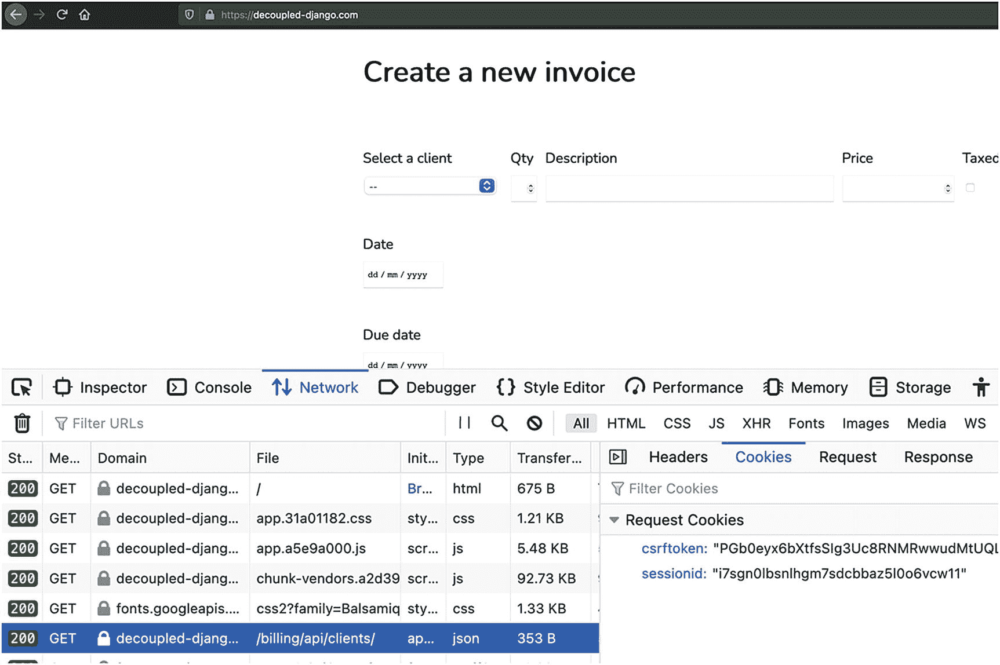
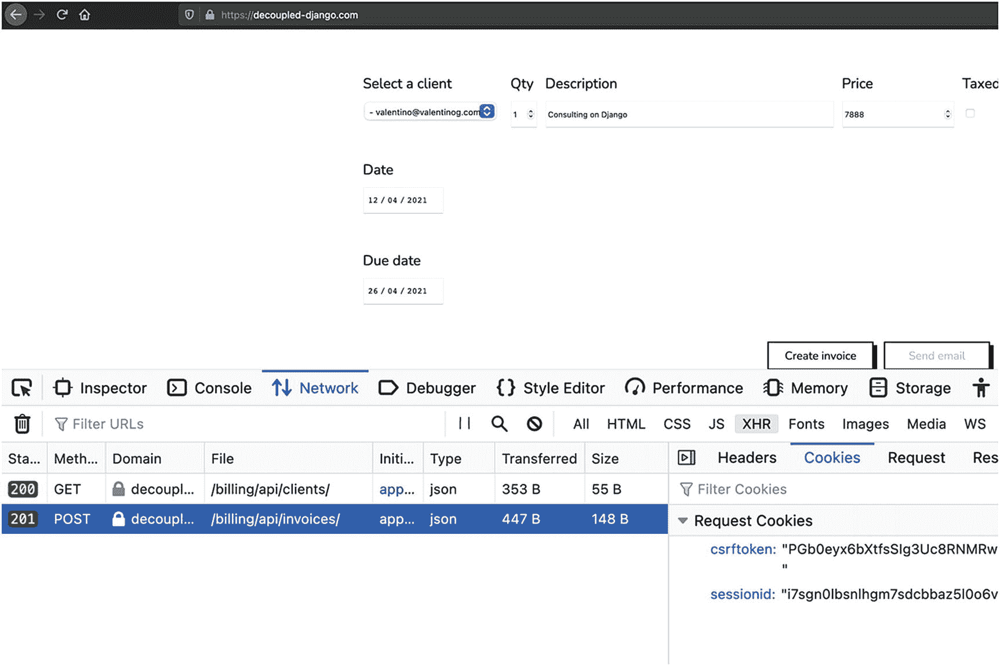

# 十、Django REST 框架中的认证和授权

本章涵盖:

*   基于令牌的认证和 JWT 简介

*   针对单页面应用的基于会话的认证

写一本技术书籍意味着从十亿个主题开始，没有足够的空间来容纳所有的内容。

认证是一个庞大的主题，几乎不可能在一章中深入讨论。有太多的场景:移动应用、桌面应用和单页应用。因为这本书更多的是关于单页应用和 JavaScript 与 Django 的结合，所以本章只关注这两个角色之间的交互。在第一部分中，我们讨论基于令牌的认证。在第二部分中，我们求助于一个久经考验的身份验证流程，与单页面应用配对。

Note

本章的其余部分假设您在 repo root `decoupled-dj`中，Python 虚拟环境是活动的，并且`DJANGO_SETTINGS_MODULE`被配置为`decoupled_dj.settings.development`。

## 基于令牌的身份验证和 JWT 简介

在第 6 章中，我们用 DRF 和 Vue.js 创建了一个伪解耦的 Django 项目

在第 [7](07.html) 章中，我们通过添加一个最小形式的认证和授权来加强我们项目的安全性。我们看到了如何使用基于会话的认证来保护从 Django 视图提供的单页面应用。在第 8 章[中，我们添加了 Next.js。为了从我们的 Django 项目开始生成博客，我们必须完全禁用认证。这远远不是最佳的，这让我们想到了前端与 Django 后端完全分离的所有情况。在传统设置中，使用 cookies 和基于会话的身份验证没有太多麻烦。然而，当前端和后端在不同的域上时，认证就变得棘手了。此外，由于会话存储在服务器上，前端和后端之间的会话 cookie 和 CSRF cookie 的交换违反了 REST 的无状态特性。出于这个原因，多年来，社区提出了一种基于令牌的认证形式，称为 *JSON Web Token* 。](08.html)

对于非耦合设置中的身份验证，使用 JWT 进行基于令牌的身份验证现在非常流行，尤其是在 JavaScript 社区中。在Django，JWT 还没有标准化。接下来是对 JWT、基于令牌的身份验证的介绍，以及对它们潜在缺陷的讨论。

### 基于令牌的认证:好与坏

无论如何，基于令牌的认证并不是一个新概念。

令牌是一个简单的标识符，前端可以与后端交换，以证明它有权读取或写入后端。在最简单的安排中，解耦的前端向后端发送用户名和密码。另一方面，后端验证用户的凭证，如果它们有效，它就向前端发回一个令牌。令牌通常是简单的字母数字字符串，如下例所示:

```py
9944b09199c62bcf9418ad846dd0e4bbdfc6ee4b

```

当前端想要向 API 上的受保护资源发出请求时，无论是`GET`还是`POST`请求，它都必须通过将令牌包含在请求头中来发回这个令牌。Django REST 框架通过`TokenAuthentication`方案为基于令牌的认证提供了现成的支持。

在安全性方面，这种认证机制远非刀枪不入。首先，通过网络发送凭证，即用户名和密码，即使在 HTTPS 下也不是最好的方法。此外，一旦我们在前端获得一个令牌，我们需要在整个用户会话期间持久化它，有时甚至超过这个时间。为了持久化令牌，大多数开发人员求助于将它保存在`localStorage`中，这是一个巨大的错误，实际上给应用带来了一系列全新的风险。`localStorage`易受 XSS 攻击，攻击者在其控制的网页中注入恶意 JavaScript 代码，引诱用户访问该网页，并窃取任何非`HttpOnly`cookie，以及保存在`localStorage`中的任何潜在数据。

相反，就这些令牌的功能而言，它们非常简单。它们不携带关于用户的信息，也不指示用户拥有什么权限。它们被严格地绑定到 Django 和它的数据库，只有 Django 可以将一个给定的用户和它的令牌配对。它们的简单性是这些基本令牌的一个“特征”。尽管有这些限制，基于令牌的身份验证在前端和后端位于不同域的所有情况下都工作得很好。然而，多年来，JavaScript 社区一直在思考创造更多结构化标记的机会。这导致了名为 JSON Web Tokens 的新标准的诞生，它带来了创新，也带来了更多的挑战。

### Django 中的 JSON Web 令牌:优势和挑战

JSON Web Token(简称 JWT)是一种标准，它定义了一种在客户机和服务器之间交换身份验证信息的便捷方式。

JWT 令牌与简单的字母数字令牌完全不同。首先，他们已经签字了。也就是说，它们在通过网络发送出去之前由服务器加密，然后在客户机上解密。这是必要的，因为 JWT 令牌包含敏感信息，如果这些令牌被盗，可用于针对受保护的资源进行身份验证。JWT 在 JavaScript/Node.js 社区拥有稳固的市场份额。

相反，在 Django 场景中，它们被认为是一种不安全的身份验证方法。其原因是服务器端的 JWT 实现很难正确，规范中有太多的东西留给实现者去解释，这可能会在不知道的情况下构建一个不安全的 JWT 服务器。要了解更多关于 JWT 的所有安全含义，请查看附加资源中的第一个链接。简而言之，到今天为止，Django没有对 JWT 的核心支持，这种情况在未来也不会改变。

如果你想在你自己的 Django 项目中使用 JWT，有很多库可以使用，比如`django-rest-framework-simplejwt`。该库不处理注册流程，而只处理 JWT 的发行阶段。换句话说，从前端我们可以使用用户名和密码的`api/token/`和`api/token/refresh/`来请求新的令牌或者刷新令牌，如果我们手中有令牌的话。当客户端向服务器请求令牌时，服务器用两个令牌进行回复:访问令牌和刷新令牌。作为一种安全措施，访问令牌通常有一个截止日期。另一方面，当新的访问令牌过期时，客户端使用刷新令牌来请求新的访问令牌。访问令牌用于认证，刷新令牌用于请求新的认证令牌。因为这两个令牌同等重要，所以必须在客户端对它们进行充分保护。

与任何令牌一样，JWT 令牌也经常会遇到同样的问题。大多数开发人员在`localStorage`中保留 JWT 令牌，这容易受到 XSS 的攻击。这可能比保存一个简单的字母数字标记更糟糕，因为 JWT 在它的主体中携带了更多的敏感信息，即使它是加密的，我们也不能放松对它的保护。为了避免这些风险，开发人员求助于在`HttpOnly`cookie 中保存 JWT 令牌，巧合的是，这听起来很像最经典的基于会话的认证方法。最后，即使 JWT 令牌便于跨域和移动认证，维护这样的基础设施也可能很困难，并且容易出现安全风险。对于 Django 和单页面应用，有没有简单的认证方法？我们将在下一节探讨这个问题。

## 针对单页应用的基于会话的认证

最后，Django 项目的认证不应该很复杂，至少对于 web 应用是这样。

事实上，在 NGINX 的帮助下，我们可以使用基于会话的认证来代替令牌，即使是单页应用。在第 [7](07.html) 章中，我们用传统设置部署了 Django 应用，这是一个为单页面应用服务的 Django 模板。如果我们现在把事情颠倒过来，把一个单页面应用作为 Django 项目的主要入口，会怎么样？在这发生之前，我们需要考虑几个步骤。尤其是，NGINX 应该:

*   从根位置块提供单页应用

*   对 Django 的代理 API、auth 和 admin 请求

为此，我们需要对第 [7](07.html) 章的配置进行必要的调整。让我们看看在接下来的部分需要做什么。

Note

我们将要看到的配置完全独立于第 [7](07.html) 章中的配置。这是两种不同的方法，都是有效的。

### 关于生产和发展的一些话

除非您使用 Docker 或虚拟机，否则以下部分提供的场景不容易在本地工作站上复制。

为了尽可能接近现实，我们提供了一个生产环境，其中应用部署在 [`https://decoupled-django.com/`](https://decoupled-django.com/) ，带有有效的 SSL 证书。如果您想要复制相同的环境，您有两种选择:

*   使用 Docker 运行 NGINX、Django 和 Vue.js(本书不涉及)。

*   使用虚拟机环境，如 VirtualBox，创建一个 Linux 机器，然后从 [`https://github.com/valentinogagliardi/decoupled-dj/tree/chapter_10_authentication`](https://github.com/valentinogagliardi/decoupled-dj/tree/chapter_10_authentication) 运行 Ansible playbook。

如果你选择第二种，这里有一些建议:

*   在 VirtualBox 实例中，将一个 SSH 端口和另一个 web 服务器端口从客户机转发到主机。对于 SSH，您可以为客户机选择 8022，转发到主机上的 22，对于 web 服务器，选择从客户机转发到主机的端口 80。

*   在主工作站的`/etc/hosts`文件中，配置 [`decoupled-django.com`](http://decoupled-django.com) 域和 [`static.decoupled-django.com`](http://static.decoupled-django.com) 子域指向`127.0.0.1`。

虚拟机就绪后，从您的工作站使用以下命令运行 Ansible 行动手册:

```py
ansible-playbook -i deployment/inventory deployment/site.yml --extra-vars "trustme=yes"

```

这个剧本将配置环境，部署代码，并为 [`decoupled-django.com`](http://decoupled-django.com) 和 [`static.decoupled-django.com`](http://static.decoupled-django.com) 创建一个假的 SSL 证书。一旦完成，在为证书添加例外后，您可以在浏览器中访问 [`https://decoupled-django.com/`](https://decoupled-django.com/) 。

Note

如何运行行动手册的说明可在 [`https://github.com/valentinogagliardi/decoupled-dj/blob/chapter_10_authentication/README.md#deployment`](https://github.com/valentinogagliardi/decoupled-dj/blob/chapter_10_authentication/README.md%2523deployment) 找到。

### 为新设置准备 NGINX

作为第一步，我们需要配置 NGINX 来服务根`location`块上的单页面应用。

清单 [10-1](#PC3) 显示了第一个变化。

```py
...
location / {
   alias /home/{{ user }}/code/billing/vue_spa/dist/;
}
...

Listing 10-1deployment/templates/decoupled-django.​com.j2 - NGINX Configuration to Serve the Single-Page Application

```

这与我们在第 7 章中看到的不同，在第 7 章中，项目的主要入口是 Gunicorn。在本例中，我们重用了第 [6](06.html) 章中的 Vue.js 单页应用，这是一个创建发票的简单表单，但是为了进行测试，我们将它提升为我们项目的主单页应用。这里我们对 NGINX 说，当一个用户访问我们网站的根目录时，发送到`/home/decoupled-django/code/billing/vue_spa/dist/`中的 Vue.js app。这里的`dist`是什么？默认情况下，Vue CLI 在 Vue.js 项目的`dist`文件夹中构建生产 JS 包。这是默认配置，但是在第 [6](06.html) 章中，我们对其进行了修改，以在静态文件中向 Django 期望的地方发出包。现在我们回到默认值。为了实现这一点，我们还需要稍微调整一下 Vue.js。有了这个配置，通过访问生产中的 [`https://decoupled-django.com/`](https://decoupled-django.com/) ，NGINX 将服务于单页 app。然而，Vue.js 一加载，它就调用`billing/api/clients/`来获取`<select>`的客户列表。这导致我们再次调整 NGINX 的配置，以便任何对`/api/`的请求都被代理到 Gunicorn，从而被代理到 Django。清单 [10-2](#PC4) 显示了额外的 NGINX 块。

```py
location ~* /api/ {
   proxy_pass http://gunicorn;
   proxy_set_header Host $host;
   proxy_set_header X-Real-IP $remote_addr;
   proxy_set_header X-Forwarded-For $proxy_add_x_forwarded_for;
   proxy_set_header X-Forwarded-Proto $scheme;
}

Listing 10-2deployment/templates/decoupled-django.com.j2 - NGINX Configuration to Proxy API Requests to Django

```

有了这个改变，API 调用将真正到达 Django。还缺少一个细节:身份验证。这种设置改变了一切。Django 不再负责为单页面应用提供服务，但它确实应该为 API 和登录流提供服务，这是有道理的——下一节将详细介绍。

### 用 Django 处理登录流

我们希望使用一个单页面应用作为 Django 项目的主要入口点，但是我们还希望使用来自 Django 的基于会话的身份验证。

这就是我们遇到难题的地方。我们如何在不涉及令牌的情况下认证我们的用户？Django 有一个内置的认证系统，是`contrib`模块的一部分，从中我们可以看到一组处理最常见的认证流程的视图:登录/注销、注册/确认和密码重置。例如，`django.contrib.auth.views`的`LoginView`可以帮助登录流程。然而，我们当前设置的问题是，单页面应用现在已经与 Django 项目完全分离了。

作为一种幼稚的方法，我们可以尝试从 JavaScript 向 Django `LoginView`发出一个`POST`请求，但是这些视图受到 CSRF 检查的保护。这也是我们之前遇到的问题，但是现在问题更严重了，因为我们没有任何 Django 视图可以在发出请求之前获取 CSRF 令牌。解决方案？我们可以让 Django 处理认证流程。为此，我们将为认证逻辑创建一个独立的 Django 应用。在根项目文件夹中，运行以下命令:

```py
python manage.py startapp login

```

接下来，在`login/urls.py`中创建一个新的 URL 配置，并将清单 [10-3](#PC6) 中所示的代码放入其中。

```py
from django.urls import path
from django.contrib.auth.views import LoginView, LogoutView

app_name = "auth"

urlpatterns = [
   path(
       "login/",
       LoginView.as_view(
           template_name="login/login.html",
           redirect_authenticated_user=True
       ),
       name="login",
   ),
   path("logout/", LogoutView.as_view(), name="logout"),
]

Listing 10-3login/urls.py - URL Configuration for Login and Logout Views

```

这里我们声明了两个路由，一个用于登录，另一个用于注销。`LoginView`使用自定义的`template_name`。在`login/templates/login/login.html`中创建模板，如清单 [10-4](#PC7) 所示。

```py
<!DOCTYPE html>
<html lang="en">
<head>
   <meta charset="UTF-8">
   <title>Login</title>
</head>
<body>
<form method="POST" action="">
   
   <div>
       <label for="{{ form.username.id_for_label }}">Username:</label>
       <input type="text" name="username" autofocus maxlength="254" required id="id_username">
   </div>
   <div>
       <label for="{{ form.password.id_for_password }}">Password:</label>
       <input type="password" name="password" autocomplete="current-password" required="" id="id_password">
   </div>
   <input type="hidden" name="next" value="{{ next }}">
   <button type="submit" value="login">
       LOGIN
   </button>
</form>
{{ form.non_field_errors }}
</body>
</html>

Listing 10-4login/templates/login/login.html - Login Form

```

这是一个简单的 HTML 表单，增加了 Django 模板标签；具体包括``。当表单被呈现时，Django 在标记中放置一个隐藏的 HTML 输入，如清单 [10-5](#PC8) 所示。

```py
<input type="hidden" name="csrfmiddlewaretoken" value="2TYg60oC0GC2LW7oJEPwBsg2ajZsjJ0n5Wvjqd28J9wMcGBanbnNfkmfT5Qw3juK">

Listing 10-5Django’s CSRF Token in HTML Forms

```

这个输入的值和`POST`请求一起发送给 Django `LoginView`。如果用户的凭证有效，Django 将用户重定向到选择的 URL，并向浏览器发送两个 cookie:`csrftoken`和`sessionid`。为此，我们需要加载登录应用并在`decoupled_dj/settings/base.py`中配置重定向 URL，如清单 [10-6](#PC9) 所示。

```py
INSTALLED_APPS = [
   ...
   "login"
]

...

LOGIN_REDIRECT_URL = "/"

Listing 10-6decoupled_dj/settings/base.py - Enabling the Login App and Configuring the Login Redirect URL

```

一旦完成，在根配置中包含新的 URL，`decoupled_dj/urls.py`，如清单 [10-7](#PC10) 所示。

```py
urlpatterns = [
   ...
   path("auth/", include("login.urls", namespace="auth")),
]

Listing 10-7decoupled_dj/urls.py - Including the URL from the Login App

```

最后一步，我们告诉 NGINX 任何对`/auth/`的请求都必须被代理给 Django，如清单 [10-8](#PC11) 所示。

```py
location /auth/ {
   proxy_pass http://gunicorn;
   proxy_set_header Host $host;
   proxy_set_header X-Real-IP $remote_addr;
   proxy_set_header X-Forwarded-For $proxy_add_x_forwarded_for;
   proxy_set_header X-Forwarded-Proto $scheme;
}

Listing 10-8deployment/templates/decoupled-django.com.j2 - NGINX Configuration to Proxy Authentication Requests to Django

```

我们用这种设置实现了什么？NGINX 现回复如下:

*   对 [`https://decoupled-django.com/auth/login/`](https://decoupled-django.com/auth/login/) 的请求被代理到 Gunicorn/Django

*   对 [`https://decoupled-django.com/`](https://decoupled-django.com/) 的请求被代理到 Vue.js

*   对 [`https://decoupled-django.com/billing/api/`](https://decoupled-django.com/billing/api/) 的请求被代理到 Gunicorn/Django

在这种安排中，Django 通过基于会话的认证来处理整个认证流程。另一方面，单页面应用只对 Django 进行 API 调用。在这方面，我们需要修复 Vue.js，以便与新的设置一起工作。

Note

你可以在 [`https://github.com/valentinogagliardi/decoupled-dj/tree/chapter_10_authentication/deployment/templates/`](https://github.com/valentinogagliardi/decoupled-dj/tree/chapter_10_authentication/deployment/templates/) 找到 NGINX 配置的源代码。

### 为新设置准备 Vue.js 应用

概括一下，在第 [6](06.html) 章中，我们配置了`vue.config.js`和`.env.staging`来让 Django 静态文件与 Vue.js 一起工作

在第 [7](07.html) 章中，我们添加了另一块拼图，通过配置`.env.production`使 Vue.js 能够识别它被加载的子域。在本章中，我们可以去掉那些配置。配置文件`vue.config.js`、`.env.staging`和`.env.production`可以从`billing/vue_spa/`中移除。通过这样做，当构建产品包时，JavaScript 文件和资产将放在`dist`文件夹中。这个文件夹通常被排除在源代码控制之外，所以我们需要在目标机器上安装 Node.js 来安装 JavaScript 依赖项，并从`/home/decoupled-django/code/billing/vue_spa`开始构建捆绑包。一旦完成，我们就可以运行我们的 Vue.js 应用作为 Django 项目的主要入口。

Note

位于 [`https://github.com/valentinogagliardi/decoupled-dj/tree/chapter_10_authentication`](https://github.com/valentinogagliardi/decoupled-dj/tree/chapter_09_authentication) 的 Ansible playbook 负责安装 Node.js 并构建包。

这种设置的效果是 JavaScript 前端会将 cookies 传递给 Django，而无需我们的任何干预。图 [10-1](#Fig1) 显示`csrftoken`和`sessionid`随着`GET`的请求行进至`/billing/api/clients`。



图 10-1

从 JavaScript 到 Django 的 GET 请求包括会话 cookie 和 CSRF 令牌

图 [10-2](#Fig2) 显示了相同的 cookies，这次是通过`POST`请求传输的。



图 10-2

从 JavaScript 到 Django 的 POST 请求包括会话 cookie 和 CSRF 令牌

在这个设置中没有任何神奇之处:cookies 可以在同一个源上传播，甚至超过 Fetch。

### 关于 HttpOnly Cookies 的说明

cookie 是一种不能从 JavaScript 代码中读取的 cookie。

默认情况下，Django 已经确保了`sessionid`具有`HttpOnly`属性。这不会中断与`fetch`的 cookie 交换，因为`same-origin`的默认行为确保了当调用的 JavaScript 代码与目标 URL 具有相同的来源时，cookie 会被来回发送。至于`csrftoken`，我们需要让 JavaScript 可以访问它，因为我们将它作为一个头包含在不安全的 HTTP 请求(`POST`之类的)旁边。

### 在前端处理认证

既然我们已经配置了 NGINX 来将请求代理到适当的目的地，并且 Django 后端已经准备好处理登录请求，我们就可以在前端处理身份验证了。

好消息是，我们不会手工编写身份验证表单、发送令牌或将其保存在`localStorage`中。然而，我们需要找到一种绕过`HttpOnly`cookie 的方法，因为我们不能再从 JavaScript 访问`sessionid`。常见的做法是通过查看 cookies 来检查用户是否通过了 JavaScript 代码的身份验证。有了`sessionid`这个`HttpOnly`饼干，我们就没有这种奢侈了(放松这种保护也不是一个选项)。一个可能的解决方案隐藏在来自 REST API 的错误消息中。任何对 DRF 的未经验证的请求实际上都返回`Authentication credentials were not provided`，以及一个`403 Forbidden`错误。在前端，我们可以检查这个信号，然后将用户重定向到`/auth/login/`。我们开`billing/vue_spa/src/App.vue`吧。这是我们的 Vue.js 应用的根组件。在这个组件中，我们可以在将用户重定向到登录视图之前检查用户是否通过了身份验证。首先，在模板部分，我们只在通过检查组件状态中的布尔值来验证用户时才呈现`InvoiceCreate`。清单 [10-9](#PC12) 显示了`<template>`部分的变化。

```py
<template>
 <div id="app">
   <div v-if="isLoggedIn">
     <InvoiceCreate />
   </div>
   <div v-else></div>
 </div>
</template>

Listing 10-9billing/vue_spa/src/App.vue - Checking if the User Is Logged In

```

在组件的脚本部分，我们组装了以下逻辑:

*   在`mounted()`中，我们调用一个端点

*   如果我们得到一个`200`，我们就认为用户通过了身份验证

*   如果我们得到了一个`Forbidden`，我们就从 Django REST 框架中检查错误的确切类型

清单 [10-10](#PC13) 显示了`<script>`部分的变化。

```py
<template>
 <div id="app">
   <div v-if="isLoggedIn">
     <InvoiceCreate />
   </div>
   <div v-else></div>
 </div>
</template>

<script>
import InvoiceCreate from "@/components/InvoiceCreate";

export default {
 name: "App",
 components: {
   InvoiceCreate
 },
 data: function() {
   return {
     isLoggedIn: false
   };
 },
 methods: {
   redirectToLogin: function() {
     this.isLoggedIn = false;
     window.location.href = "/auth/login/";
   }
 },
 mounted() {
   fetch("/billing/api/clients/")
     .then(response => {
       if (
         !response.ok &&
         response.statusText === "Forbidden"
       ) {
         return response.json();
       }
       this.isLoggedIn = true;
     })
     .then(drfError => {
       switch (drfError?.detail) {
         case "Authentication credentials were not provided.":
           this.redirectToLogin();
           break;
         default:
           break;
       }
     });
 }
};
</script>

Listing 10-10billing/vue_spa/src/App.vue - Handling Authentication in the Frontend

```

在这段代码中，我们向选择的端点发出一个 AJAX 请求。如果请求返回一个`Forbidden`，我们用一个简单的`switch`语句检查 Django REST 框架给出了什么样的错误。我们可能要检查的第一个错误消息是`Authentication credentials were not provided.`,这是一个明显的信号，表明我们试图在没有凭证的情况下访问受保护的资源。如果您担心通过字符串的方式检查身份验证或权限看起来不太好，因为 Django 迟早会更改错误消息并返回一个意外的字符串，根据我的经验，前端和后端开发人员之间总是有某种契约来商定他们可以从对方那里得到哪些响应体或错误消息。如果需要考虑字符串，可以很容易地将其抽象成常量。这还不算前端和后端必须始终置于强大的测试套件之下。

Note

在这个例子中，我们使用`fetch()`来避免引入额外的依赖关系。另一个有效的选择是`axios`，它有一个方便的拦截器特性。

有了这个逻辑，我们可以添加更多的检查，比如权限，我们将在下一节中看到。这不是最聪明的实现，但它完成了工作，更重要的是，它使用了一种久经考验的身份验证方法。React 也可以使用同样的方法:我们可以从 NGINX 提供单页面应用，Django 隐藏在后台。值得注意的是，只有当 Django 和单页面在同一个域中提供服务时，这种设置才有效。使用 NGINX 和 Docker 很容易实现这一点。对于客户端位于不同域的所有配置，都需要基于令牌的身份验证。有了身份验证部分，现在让我们探索 Django REST 框架中的授权。

Note

在前面的例子中，我们使用了`window.location`来重定向用户。如果使用 Vue 路由器，代码必须调整使用`this.$router.push()`。

### Django REST 框架中的授权和许可

一旦用户登录，我们就处于流程的中间。

认证是整个故事中“你是谁”的一部分。接下来是“你能做什么”的部分。在第 7 章中，我们通过只允许管理员用户访问来锁定我们的 API。清单 [10-11](#PC14) 显示了`decoupled_dj/settings/base.py`中应用的配置。

```py
REST_FRAMEWORK = {
   "DEFAULT_AUTHENTICATION_CLASSES": [
       "rest_framework.authentication.SessionAuthentication",
   ],
   "DEFAULT_PERMISSION_CLASSES": [
       "rest_framework.permissions.IsAdminUser"
   ],
}

Listing 10-11decoupled_dj/setting/base.py - Adding Permissions Globally in the DRF

```

为了在前端进行测试，我们可以在 Django 项目中创建一个无特权用户。打开 Django shell 并运行下面的 ORM 指令:

```py
User.objects.create_user(username="regular-user", password="insecure-pass")

```

这将在数据库中创建一个新用户。如果我们试图在`auth/login/`用这个用户登录，Django 会像预期的那样重定向回主页，但是一旦我们登陆到那里，我们就不会在界面上看到任何东西。这是因为我们的 JavaScript 前端不能处理 Django REST 框架用`You do not have permission to perform this action`响应的情况。我们可以在调用`billing/api/clients`的浏览器控制台的网络标签中看到这个错误。通过 DRF 权限，我们可以让用户访问 REST 视图。权限不仅可以在配置级别设置，还可以在每个视图上设置粒度。为了允许经过身份验证的用户访问，而不仅仅是管理员访问`billing/api/clients`，我们可以使用`IsAuthenticated`权限类。要应用该权限，打开`billing/api/views.py`并调整代码，如清单 [10-12](#PC16) 所示。

```py
...
from rest_framework.permissions import IsAuthenticated

class ClientList(ListAPIView):
   permission_classes = [IsAuthenticated]

   serializer_class = UserSerializer
   queryset = User.objects.all()
...

Listing 10-12billing/api/views.py - Applying Permissions on the View Level

```

通过这一更改，任何经过身份验证的用户都可以访问该视图。在前端，我们可以通过在`switch`语句中添加另一个检查来处理权限错误，它在来自 API 的响应中寻找`You do not have permission to perform this action`,并向我们的用户显示一条用户友好的消息。当然，许可的故事并没有到此为止。在 Django REST 框架中，我们可以定制权限，在对象级别授予权限，等等。文档几乎涵盖了所有可能的用例。

Note

这是提交到目前为止所做的更改并将工作推送到 Git repo 的好时机。你可以在 [`https://github.com/valentinogagliardi/decoupled-dj/tree/chapter_10_authentication`](https://github.com/valentinogagliardi/decoupled-dj/tree/chapter_10_authentication) *找到本章的源代码。*

## 摘要

您从本章中学到了一些重要的要点:

*   切勿在`localStorage`中存储令牌或其他敏感数据

*   尽可能使用基于会话的身份验证来保护单页面应用

在下一章中，我们将从 Ariadne 开始探索 Django 中的 GraphQL。

## 额外资源

*   django 的 jwts