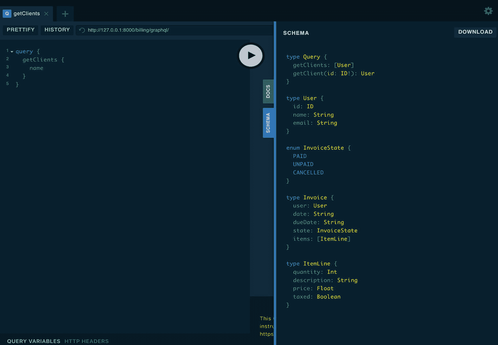
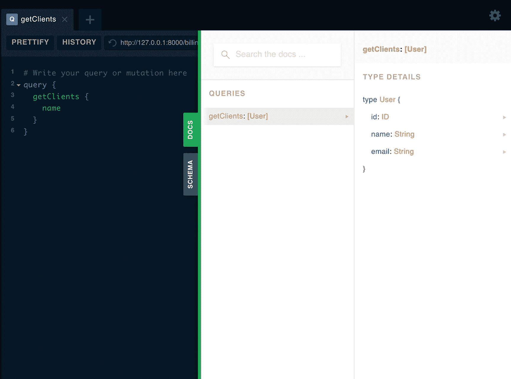
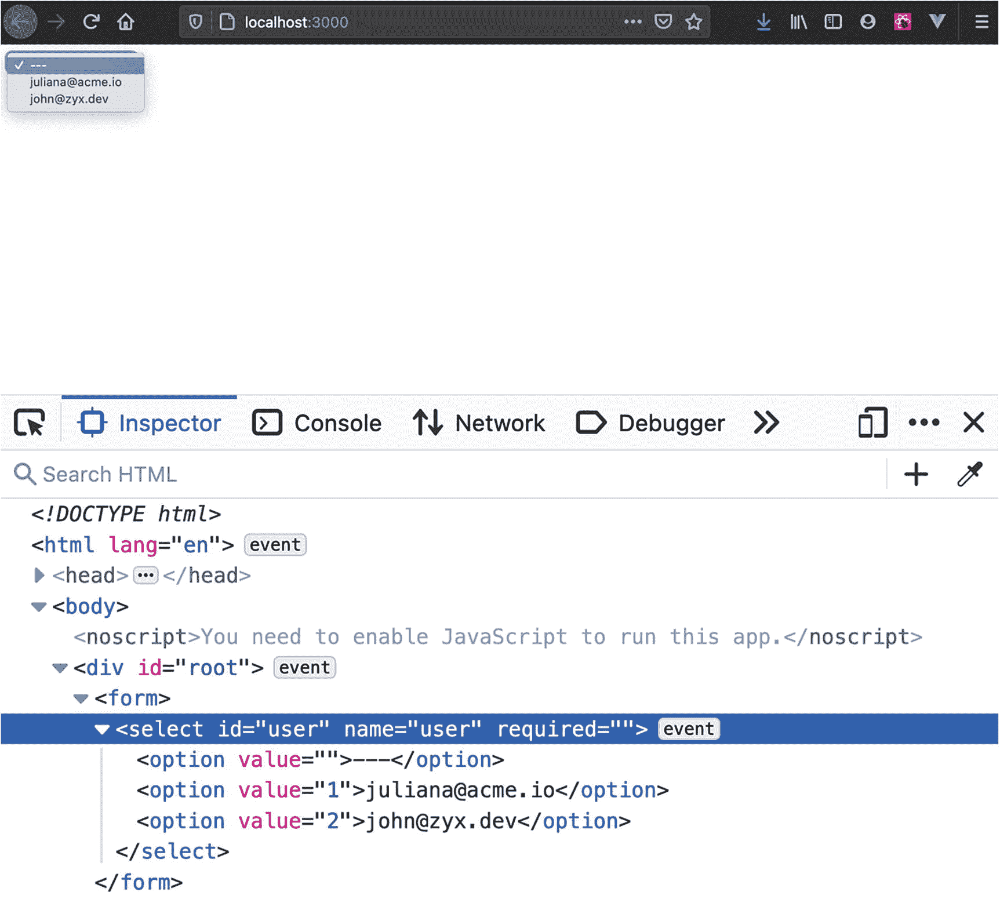

# 11.Django 的 GraphQL 和 Ariadne

本章涵盖:

*   GraphQL 模式、操作和解析器

*   阿里阿德涅

*   React 和 Django 与 GraphQL

在本章的第一部分，我们用一个 GraphQL API 扩充了第 [6](06.html) 章的计费应用。稍后，我们开始将 React/TypeScript 前端连接到 GraphQL 后端。

Note

本章假设您在 repo root `decoupled-dj`中，Python 虚拟环境是活动的，并且`DJANGO_SETTINGS_MODULE`被配置为`decoupled_dj.settings.development`。

## Django Ariadne 入门

第 [1](01.html) 章讲述了 GraphQL 的基础知识。

我们了解到，为了从 GraphQL API 获取数据，我们通过一个`POST`请求发送一个查询。为了改变数据库中的数据，我们发送了一个所谓的*突变*。现在是时候通过 Ariadne 将 GraphQL 引入我们的 Django 项目了，Ariadne 是一个用于 Python 的 GraphQL 库。Ariadne 使用模式优先的方法。在 schema-first 中，GraphQL API 由 GraphQL 模式定义语言以字符串或`.graphql`文件的形式形成。

### 安装 Ariadne

首先，我们在 Django 项目中安装 Ariadne:

```py
pip install ariadne

```

安装完成后，我们更新`requirements/base.txt`以包含新的依赖项。接下来，我们在`decoupled_dj/settings/base.py`中启用 Ariadne，如清单 [11-1](#PC2) 所示。

```py
INSTALLED_APPS = [
      ...
      "ariadne.contrib.django",
]

Listing 11-1decoupled_dj/settings/base.py - Enabling Ariadne in INSTALLED_APPS

```

我们还需要确保`TEMPLATES`中的`APP_DIRS`被设置为`True`，如清单 [11-2](#PC3) 所示。

```py
TEMPLATES = [
      {
      ...
      "APP_DIRS": True,
      ...
]

Listing 11-2decoupled_dj/settings/base.py - Template Configuration

```

这就是我们要开始做的所有事情。启用 Ariadne 后，我们现在准备开始构建我们的 GraphQL 模式。

### 设计 GraphQL 模式

GraphQL 强制使用模式定义语言来定义模式，这是 GraphQL API 的主要构建块。

这与 REST 有很大的不同，在 REST 中，后端代码通常是第一位的，只有在后面我们才会为 API 生成文档。GraphQL 中的这个概念是颠倒的:我们首先创建模式，它既作为文档，又作为 GraphQL API 和它的消费者之间的契约。如果没有模式，我们就不能向 GraphQL API 发送查询或变更:我们会得到一个错误，因为模式驱动的正是消费者可以向服务询问的内容。模式中有什么？GraphQL 模式包含消费者可用的所有操作和模型实体的定义。在考虑我们的模式之前，让我们回顾一下计费应用中涉及的实体。我们有以下端点:

*   `/billing/api/clients/`

*   `/billing/api/invoices/`

此外，我们还有以下型号:

*   `User`

*   `Invoice`，用一个外键连接到`User`

*   `ItemLine`，用一个外键连接到`Invoice`

我们的 GraphQL 模式必须包含所有这些模型的形状(只要我们想在 API 中公开它们)，加上每个允许的 GraphQL 操作的形状，以及它们的返回值。这在实践中意味着什么？为了向 GraphQL API 发送一个`getClients`查询，我们首先需要在模式中定义它的形状。以清单 [11-3](#PC4) 中的查询为例。

```py
query {
  getClients {
      name
  }
}

Listing 11-3Example of a Typical GraphQL Query

```

如果没有相应的模式，查询将会失败，并出现以下错误:

```py
Cannot query field 'getClients' on type 'Query'

```

GraphQL 模式中所有可用的查询、变异和订阅都以*操作*命名。

有了这些知识，让我们定义我们的第一个模式。在`billing/schema.graphql`创建一个新文件。注意它有一个`.graphql`扩展名。大多数编辑器和 ide 为语言提供了补全和智能感知，因此将模式放在自己的文件中是有意义的。作为一种选择，我们也可以将模式直接写成代码中的三重引号字符串。在这个例子中，我们采用第一种方法。在该模式中，我们将为计费应用定义所有实体，外加从数据库获取所有客户端的第一个查询。我们从哪里得到物体的形状？由于我们的应用已经有了一个包含 DRF 的 REST API，我们可以查看一下`billing/api/serializers.py`，看看那里公开了哪些字段。毕竟，DRF 序列化器是 Django 模型和世界其他部分之间的公共接口，因此它是 GraphQL 模式的一种独特方式。此外，我们应该在`billing/models.py`中查看我们的模型是如何连接的，以便在 GraphQL 中表达相同的关系。清单 [11-4](#PC6) 展示了我们第一个基于模型和 DRF 序列化器中定义的适当字段的模式。

```py
enum InvoiceState {
   PAID
   UNPAID
   CANCELLED
}

type User {
   id: ID
   name: String
   email: String
}

type Invoice {
   user: User
   date: String
   dueDate: String
   state: InvoiceState
   items: [ItemLine]
}

type ItemLine {
   quantity: Int
   description: String
   price: Float
   taxed: Boolean
}

type Query {
   getClients: [User]
}

Listing 11-4billing/schema.graphql - First Iteration of the GraphQL Schema for the Billing App

```

从模式中我们可以立即识别出 GraphQL 标量类型:`ID`、`String`、`Boolean`、`Int`和`Float`。这些类型描述了对象的每个字段有什么类型的数据。我们还可以注意到一个`enum`类型，它代表了一个`Invoice`的不同状态。在我们的序列化器中，我们没有为`Invoice`公开`state`字段，但是现在是将它包含在 GraphQL 模式中的好时机。至于我们数据库中的模型实体，请注意`User`、`Invoice`和`ItemLine`是带有字段的定制对象类型。另一件突出的事情是描述模型关系的方式。从上到下，我们可以看到:

*   `Invoice`为一个`user`字段为一个`User`

*   `Invoice`作为一个`items`字段添加到一个`ItemLine`列表中

*   `getClients`查询解析(返回)一个`User`列表

实际上，该模式是表达能力的最佳体现。同样值得注意的是，由于许多原因，这个模式还不完善。例如，`Invoice`有`date`和`dueDate`表示为`String`。这不是姜戈所期望的。我们稍后将修复这些不一致之处。渴望看到 Django 中的 GraphQL API 是什么样子，在下一节中，我们将在 Ariadne 中加载模式。

### 在 Ariadne 中加载模式

我们离在 Django 建立第一个 GraphQL 端点只有几步之遥。

为此，我们需要加载模式并使其可执行。在`billing/schema.py`创建另一个文件，它应该包含清单 [11-5](#PC7) 中的代码。

```py
from ariadne import load_schema_from_path, gql, make_executable_schema
from ariadne import ObjectType
from pathlib import Path

BASE_DIR = Path(__file__).resolve().parent

schema_file = load_schema_from_path(BASE_DIR / "schema.graphql")
type_defs = gql(schema_file)

query = ObjectType("Query")

"""
TODO: Write resolvers
"""

schema = make_executable_schema(type_defs, query)

Listing 11-5billing/schema.py - Loading the Schema in Ariadne

```

在这个代码片段中，我们从 Ariadne 导入必要的工具。特别是:

*   从文件系统加载我们的模式文件

*   `gql`验证模式

*   `ObjectType`创建根类型(查询、变异和订阅)

*   `make_executable_schema`将模式连接到*解析器*，Python 函数对数据库执行查询

在第一个片段中，我们还没有任何解析器。我们将在下一节中添加一些。还需要注意的是，这段代码还没有对数据库做任何事情。在下一节中，我们将`billing/schema.py`连接到一个 Django URL。

### 连接 GraphQL 端点

在对 GraphQL API 进行查询之前，我们需要将我们的模式连接到 Django URL。

为此，我们在`billing/urls.py`中添加一个名为`graphql/`的 URL，如清单 [11-6](#PC8) 所示。

```py
from django.urls import path
from .views import Index
from .api.views import ClientList, InvoiceCreate
from ariadne.contrib.django.views import GraphQLView
from .schema import schema

app_name = "billing"

urlpatterns = [
   path("", Index.as_view(), name="index"),
   path("api/clients/", ClientList.as_view(), name="client-list"),
   path("api/invoices/", InvoiceCreate.as_view(), name="invoice-create"),
   path("graphql/", GraphQLView.as_view(schema=schema), name="graphql"),
]

Listing 11-6billing/urls.py - Enabling the GraphQL Endpoint

```

在 Django 的这个 URL 配置中，我们从 Ariadne 导入了`GraphQLView`,它的工作方式很像普通的 CBV。保存文件并用`python manage.py runserver`启动 Django 项目后，我们可以前往`http://127.0.0.1:8000/billing/graphql/`。这应该会打开 GraphQL Playground，一个用于探索 GraphQL API 的交互式工具。在操场上，我们可以发出查询、变更，或者只是探索模式和集成文档。图 [11-1](#Fig1) 显示了我们之前创建的模式，它出现在 GraphQL 平台上。



图 11-1

阿里阿德涅的 GraphQL 游乐场。它公开了模式和方便的文档

图 [11-2](#Fig2) 显示了我们第一个查询的自动生成文档。



图 11-2

我们的第一个查询出现在自动生成的文档中

为了向这个 GraphQL 端点发送查询，我们可以使用 playground 或者更实际的 JavaScript 客户机。快速测试，也可以用`curl`。打开另一个终端并启动以下命令:

```py
curl -X POST --location "http://127.0.0.1:8000/billing/graphql/" \
      -H "Accept: application/json" \
      -H "Content-Type: application/json" \
      -d "{
      \"query\": \"query { getClients { name } }\"
      }"

```

作为响应，您应该得到以下结果:

```py
{"data": {"getClients": null } }

```

这表明我们的 GraphQL API 正在工作，但是我们的查询没有返回任何东西。在下一节中，我们将讨论解决方案。

### 使用解析器

GraphQL 中的解析器是什么？最简单的形式是，解析器是一个负责查询数据库或任何其他来源的*可调用的*(一个方法或函数)。GraphQL 中的解析器是公共 API 和数据库之间的桥梁，这也是等式中最难的部分。GraphQL 只是一个规范，大多数实现都不包含数据库层。幸运的是，Django 有一个很好的 ORM 来减轻直接处理原始 SQL 查询的负担。让我们重温一下我们的模式，特别是清单 [11-7](#PC11) 中显示的查询。

```py
type Query {
      getClients: [User]
}

Listing 11-7Our First Query

```

这个查询有一个名为`getClients`的字段。为了让我们的`getClients`查询工作，我们需要将这个查询字段绑定到一个解析器。为此，我们回到`billing/schema.py`添加第一个解析器，如清单 [11-8](#PC12) 所示。

```py
from ariadne import load_schema_from_path, gql, make_executable_schema
from ariadne import ObjectType
from pathlib import Path
from users.models import User

BASE_DIR = Path(__file__).resolve().parent

schema_file = load_schema_from_path(BASE_DIR / "schema.graphql")
type_defs = gql(schema_file)

query = ObjectType("Query")

@query.field("getClients")
def resolve_clients(obj, info):
   return User.objects.all()

schema = make_executable_schema(type_defs, query)

Listing 11-8billing/schema.py - Adding a Resolver to the Mix

```

这个文件中最显著的变化是我们导入了`User`模型，并用`@query.field()`修饰了一个解析器函数。在这个例子中，解析器`resolve_clients()`得到两个参数:`obj`和`info`。`info`包含关于被请求字段的细节，更重要的是，它携带一个附加了 HTTP 请求的上下文对象。这是同步运行的 Django 项目的一个实例`WSGIRequest`。`obj`是从父解析器返回的任何值，因为解析器也可以嵌套。在我们的例子中，我们现在不使用这些参数。保存文件后，我们可以在每个用户的查询中包含任意多的字段。例如，我们可以在 GraphQL Playground 中发送清单 [11-9](#PC13) 中的查询。

```py
query {
  getClients {
      id
      name
      email
  }
}

Listing 11-9A GraphQL Query for Fetching All Clients

```

注意，在 Ariadne 的 Python 代码中，我们没有为`id`、`name`或`email`定义解析器。我们简单地为`getClients`查询定义了一个解析器。为每个字段手工定义一个解析器是不切实际的，幸运的是，GraphQL 涵盖了我们。Ariadne 可以用默认解析器的概念处理这些字段，这个概念来自于 Ariadne 构建的`graphql-core`。我们的查询现在将返回清单 [11-10](#PC14) 中所示的响应。

```py
{
    "data": {
        "getClients": [
            {
                "id": "1",
                "name": "Juliana",
                "email": "juliana@acme.io"
            },
            {
                "id": "2",
                "name": "John",
                "email": "john@zyx.dev"
            }
        ]
    }
}

Listing 11-10The Response from the GraphQL API

```

如果数据库中还没有用户，请从 shell 中创建一些:

```py
python manage.py shell_plus

```

要创建两个用户，请运行以下查询(`>>>`是 shell 提示符):

```py
>>> User.objects.create_user(username="jul81", name="Juliana", email="juliana@acme.io")
>>> User.objects.create_user(username="john89", name="John", email="john@zyx.dev")

```

Note

到目前为止，我们讨论了数据库，但是 GraphQL 几乎可以处理任何数据源。Gatsby 是这种能力的一个很好的例子:例如，Markdown 插件可以解析来自`.md`文件的数据。

祝贺您创建了第一个 GraphQL 端点！现在让我们了解一下 GraphQL 中的查询参数。

### 在 GraphQL 中使用查询参数

到目前为止，我们从数据库中获取了所有用户。

如果我们只想取一个呢？这就是查询参数发挥作用的地方。让我们想象下面的 GraphQL 查询:

```py
query {
 getClient(id: 2) {
   name
   email
 }
}

```

这里我们有一个查询字段，使用起来很像一个函数。`id`是“函数”的自变量。相反，在主体中，我们声明了要为单个用户获取的字段。为了支持这个查询，模式必须知道它。这意味着我们需要:

*   在模式中定义新的查询字段

*   创建一个解析器来完成该字段

首先，在`billing/schema.graphql`中，我们将新字段添加到现有的`Query`对象中，如清单 [11-11](#PC18) 所示(所有现有的对象类型必须保持不变)。

```py
type Query {
   getClients: [User]
   getClient(id: ID!): User
}

Listing 11-11billing/schema.graphql - Adding a New Field to the Query

```

在新的`getClient`字段中，注意带有标量类型`ID`的`id`参数，现在后面跟了一个感叹号。这个符号意味着参数是不可空的:由于显而易见的原因，我们不能使用空 ID 进行查询。

Note

不可空约束可应用于任何 GraphQL 对象字段或列表。

有了良好的模式，我们现在开始在`billing/schema.py`中定义新的解析器，如清单 [11-12](#PC19) 所示(为了简洁，我们只显示了新的解析器)。

```py
...
@query.field("getClient")
def resolve_client(obj, info, id):
   return User.objects.get(id=id)
...

Listing 11-12billing/schema.py - An Additional Resolver for Fulfilling the New Query

```

在这个新的解析器中，除了`obj`和`info`，我们还可以看到第三个名为`id`的参数。这个参数将由我们的 GraphQL 查询传递给解析器。通常，查询中定义的任意数量的参数都会传递给相应的解析器。我们现在可以在操场上发出清单 [11-13](#PC20) 中所示的查询。

```py
query {
 getClient(id: 2) {
   name
   email
 }
}

Listing 11-13Retrieving a Single User from the GraphQL Playground

```

服务器应该返回清单 [11-14](#PC21) 中所示的响应。

```py
{
 "data": {
   "getClient": {
     "name": "John",
     "email": "john@zyx.dev"
   }
 }
}

Listing 11-14The GraphQL Response for a Single User

```

在这次数据获取之旅之后，现在是时候做一些更有挑战性的事情了:添加带有突变的数据。

### 关于模式优先和代码优先的一句话

在我们的 GraphQL API 中添加了几个查询和解析器之后，我们已经可以发现一个模式了。

每当我们需要一个新字段时，我们就更新两个文件:

*   `billing/schema.graphql`

*   `billing/schema.py`

这个问题的解决方案是将文本模式放在代码中。考虑以下示例:

```py
type_defs = gql(
   """
   type User {
       id: ID
       name: String
       email: String
   }
   """
)

```

我们没有从文件中加载模式，而是直接将它放在`gql`中。这是一种方便的方法。然而，使用代码优先的方法，从代码开始派生和生成模式的能力比处理字符串更加灵活。石墨烯和草莓正是遵循这条路径。

### 实施突变

GraphQL 中的突变是副作用，即意味着改变数据库状态的操作。

在第 [6 章](06.html)中，我们在 REST 后端工作，它接受来自前端的`POST`请求来创建新的发票。为了创建新的发票，我们的后端需要:

*   要与发票关联的用户 ID

*   发票日期

*   发票到期日

*   与发票关联的一个或多个项目行(数组)

为了在 GraphQL 中实现相同的逻辑，我们必须从突变的角度来考虑。突变具有以下特征:

*   这不是一个查询

*   这需要争论

我们已经看到了带有参数的 GraphQL 查询的外观。一个突变并没有太大的不同。考虑到创建新发票的需求，我们希望能够设计清单 [11-15](#PC23) 中所示的变体。

```py
mutation {
 invoiceCreate(invoice: {
   user: 1
   date: "2021-02-15"
   dueDate: "2021-02-15"
   state: PAID
   items: [{
     quantity: 1
     description: "Django backend"
     price: 6000.00
     taxed: false
   },
   {
     quantity: 1
     description: "React frontend"
     price: 8000.00
     taxed: false
   }]
 }) {
   user { id }
   date
   state
 }
}

Listing 11-15The Mutation Request for Creating a New Invoice

```

我们可以从 invoice 参数中看出，有效载荷不再是简单的标量，而是一个复杂的对象。这样的输入对象被称为*输入类型*，即强类型参数。我们可以在变异的签名中单独传递这些参数，但更好的是，我们可以利用 GraphQL 类型系统将单个对象的形状定义为一个参数。作为该查询的返回值，我们要求服务器使用以下数据进行响应:

*   连接到新发票的用户 ID

*   发票的日期和状态

在 GraphQL 中添加变异的过程与添加查询没有什么不同:

*   首先，我们在模式中定义突变及其输入

*   然后我们创建一个解析器来处理副作用

在 GraphQL 中，突变在`Mutation`类型下声明。为了创建我们的第一个变异，添加清单 [11-16](#PC24) 到`billing/schema.graphql`中的代码。

```py
type Mutation {
   invoiceCreate(invoice: InvoiceInput!): Invoice!
}

Listing 11-16billing/schema.graphql - The Mutation for Creating a New Invoice

```

`invoiceCreate`变异接受一个名为`invoice`的参数，类型为`InvoiceInput`，不可为空。作为交换，它返回一个不可空的`Invoice`。我们现在需要定义输入类型。它们应该是什么样子？首先，它们应该包含创建发票所需的所有字段。我们也不要忘记项目行是一个项目数组。在`billing/schema.graphql`中，我们创建了两种输入类型，如清单 [11-17](#PC25) 所示。

```py
input ItemLineInput {
   quantity: Int!
   description: String!
   price: Float!
   taxed: Boolean!
}

input InvoiceInput {
   user: ID!
   date: String!
   dueDate: String!
   state: InvoiceState
   items: [ItemLineInput!]!
}

type Mutation {
   invoiceCreate(invoice: InvoiceInput!): Invoice!
}

Listing 11-17billing/schema.graphql - Input Types for the Mutation

```

我们现在有:

*   `InvoiceInput`:用作变异参数类型的输入类型。它有一个`ItemLineInput`的`items`数组。

*   `ItemLineInput`:表示单项的输入类型，作为输入类型。

这些输入类型将反映在模式和文档中。有了模式，我们现在可以连接相应的解析器了。

Note

在对`billing/schema.graphql`进行更改之后，您应该重启 Django development server，否则更改将不会生效。

### 为突变添加解析器

有了突变的定义，我们现在可以添加相应的解析器了。

这个解析器将接触数据库以保存新的发票。为了实现这一点，我们需要在我们的模式中引入更多的代码，特别是:

*   `MutationType`:创建突变根类型

*   `Invoice`和`ItemLine`:Django 模型

清单 [11-18](#PC26) 显示了我们需要在`billing/schema.py`中进行的更改。

```py
...
from ariadne import ObjectType, MutationType
...
from billing.models import Invoice, ItemLine

...

mutation = MutationType()

@mutation.field("invoiceCreate")
def resolve_invoice_create(obj, info, invoice):
   user_id = invoice.pop("user")
   items = invoice.pop("items")

   invoice = Invoice.objects.create(user_id=user_id, **invoice)
   for item in items:
       ItemLine.objects.create(invoice=invoice, **item)
   return invoice

schema = make_executable_schema(type_defs, query, mutation)

Listing 11-18billing/schema.py - Adding a Resolver to Fulfill the Mutation

```

这段代码中发生了很多事情。让我们来分解一下:

*   我们使用`MutationType()`在 Ariadne 中创建新的突变根类型

*   我们修饰突变解析器，使其映射到模式中定义的字段

*   在解析器中，我们用 ORM 创建一个新的发票

*   我们把突变和模式联系起来

Django 想要一个用户实例来创建新的发票，但是我们从 GraphQL 请求中得到的只是用户的 ID。这就是为什么我们从有效载荷中移除了`user`来将它作为`user_id`传递给`Invoice.objects.create()`。至于接下来的步骤，逻辑类似于我们在第 [5 章](05.html)中在串行化器中所做的。有了这些额外的代码，我们现在可以将清单 [11-19](#PC27) 中所示的变异发送到 GraphQL。

```py
mutation {
 invoiceCreate(invoice: {
   user: 1
   date: "2021-02-15"
   dueDate: "2021-02-15"
   state: PAID
   items: [{
     quantity: 1
     description: "Django backend"
     price: 6000.00
     taxed: false
   },
   {
     quantity: 1
     description: "React frontend"
     price: 8000.00
     taxed: false
   }]
 }) {
   user { id }
   date
   state
 }
}

Listing 11-19The Mutation Request for Creating a New Invoice

```

在 GraphQL Playground 中发出变异，您应该会看到以下错误:

```py
Invoice() got an unexpected keyword argument 'dueDate'

```

这来自 Django 的 ORM 层。在我们的变异中，我们发出一个名为`dueDate`的字段，这是 camel case 中 GraphQL/JS 世界的惯例。然而，Django 期望`due_date`，正如它在模型中定义的那样。为了修复这种不匹配，我们可以使用阿里阿德涅的`convert_kwargs_to_snake_case`。打开`billing/schema.py`并应用清单 [11-20](#PC29) 中所示的更改。

```py
...
from ariadne.utils import convert_kwargs_to_snake_case
...

...
@mutation.field("invoiceCreate")
@convert_kwargs_to_snake_case
def resolve_invoice_create(obj, info, invoice):
...

Listing 11-20billing/schema.py - Converting from Camel Case to Snake Case

```

这里，我们用转换器工具来修饰我们的变异解析器。如果一切都在正确的位置，服务器现在应该返回以下响应:

```py
{
 "data": {
   "invoiceCreate": {
     "user": {
       "id": "1",
       "email": "juliana@acme.io"
     },
     "date": "2021-02-15",
     "state": "PAID"
   }
 }
}

```

有了查询和变异，我们现在就可以将一个 React 前端连接到我们的 GraphQL 后端了。但是首先，我要说一下 GraphQL 客户端。

## GraphQL 客户端简介

我们看到，就网络层而言，GraphQL 似乎不需要神秘的工具。

GraphQL 客户机和它的服务器之间的对话通过 HTTP 进行，带有`POST`请求。我们甚至可以用`curl`调用 GraphQL 服务。这意味着，在浏览器中，我们可以使用`fetch`、axios 甚至`XMLHttpRequest`对 GraphQL API 发出请求。在现实中，这对小应用来说可能很好，但迟早，在现实世界中，我们需要的不仅仅是`fetch`。具体来说，对于几乎每个数据提取层，我们都需要考虑某种缓存。由于 GraphQL 的工作方式，我们可以只请求数据的一个子集，但这并不排除节省往返服务器的需要。在接下来的部分中，我们将使用最流行的 JavaScript graph QL 客户端之一:Apollo 客户端。对于在前端使用 GraphQL 的开发人员来说，这个工具抽象出了性能优化的所有平凡细节。

### 构建 React 前端

在第 [6](06.html) 章，我们构建了一个用于创建发票的 Vue.js app。

该应用有一个`<form>`，它又包含一个`<select>`和一些用于插入发票详细信息的字段。对于这个 React 应用，我们构建了相同的结构，这次将每个子组件拆分到自己的文件中。在本章中，我们将使用查询部分。在第 12 章[中，我们看到了如何处理突变。首先，我们初始化一个 React 项目。我们移动到`billing`文件夹，然后启动`create-react-app`。要创建 React 项目，请运行以下命令:](12.html)

```py
npx create-react-app react_spa --template typescript

```

这将在`billing/react_spa`中创建项目。一旦项目就位，在新的终端移入文件夹:

```py
cd react_spa

```

一旦 GraphQL 层就位，我们将从这个文件夹启动 React 应用。

Note

对于反应部分，我们在`decoupled_dj/billing/react_spa`中工作。必须从该路径开始，在适当的子文件夹中创建或更改每个建议的文件。

### Apollo 客户端入门

首先，我们需要在项目中安装 Apollo 客户机。

为此，请运行以下命令:

```py
npm i @apollo/client

```

一旦安装完成，打开`src/App.tsx`，清除所有的样板文件，并用清单 [11-21](#PC34) 中所示的代码填充文件。

```py
import {
 ApolloClient,
 InMemoryCache,
 gql,
} from "@apollo/client";

const client = new ApolloClient({
 uri: "http://127.0.0.1:8000/billing/graphql/",
 cache: new InMemoryCache(),
});

Listing 11-21src/App.tsx - Initializing Apollo Client

```

这里，我们通过提供 GraphQL 服务的 URL 来初始化客户端。`ApolloClient`构造函数至少接受这两个选项:

*   `uri`:graph QL 服务地址

*   `cache`:客户端的缓存策略

这里我们使用`InMemoryCache`，它是 Apollo 客户端中包含的默认缓存包。一旦我们有了一个客户端实例，要向服务器发送请求，我们可以使用:

*   `client.query()`发送查询

*   `client.mutate()`送突变

为了配合 React 使用，Apollo 还提供了一套方便的挂钩。在接下来的几节中，我们将创建三个 React 组件，并了解如何使用客户端方法，以及如何使用钩子。

### 创建选择组件

这个`<select>`是我们形态的一部分，会从外部接受道具。它应该为数据库中的每个用户呈现一个`<option>`元素。在`src/Select.tsx`中，我们创建了清单 [11-22](#PC35) 中所示的组件。

```py
import React from "react";

type Props = {
 id: string;
 name: string;
 options: Array<{
   id: string;
   email: string;
 }>;
};

const Select = ({ id, name, options }: Props) => {
 return (
   <select id={id} name={name} required={true}>
     <option value="">---</option>
     {options.map((option) => {
       return (
         <option value={option.id}>{option.email}</option>
       );
     })}
   </select>
 );
};

export default Select;

Listing 11-22src/Select.tsx - Select Component with TypeScript Definitions

```

该组件从外部接受一个选项列表以呈现给用户。在添加 GraphQL 之前，在 Vue.js 中，我们从 REST API 获取这些数据。相反，在这个应用中，我们让一个根组件处理数据获取，这次是从 GraphQL 服务，并将数据传递给`<select>`。现在让我们构建表单。

### 创建表单组件

表单组件相当简单，因为它接受一个处理`submit`事件的函数，以及一个或多个子组件。在`src/Form.tsx`中，我们创建了清单 [11-23](#PC36) 中所示的组件。

```py
import React from "react";

type Props = {
 children: React.ReactNode;
 handleSubmit(
   event: React.FormEvent<HTMLFormElement>
 ): void;
};

const Form = ({ children, handleSubmit }: Props) => {
 return <form onSubmit={handleSubmit}>{children}</form>;
};

export default Form;

Listing 11-23src/Form.tsx - Form Component with TypeScript Definitions

```

有了`<form>`和`<select>`之后，我们现在可以连接包含两者的根组件。

### 创建根组件并进行查询

每个 React 应用必须有一个根组件，负责渲染整个应用的外壳。为了简单起见，我们将在`src/App.tsx`中创建根组件。在我们的根组件中，我们需要:

*   使用以下查询向 GraphQL 服务查询客户端列表

*   处理提交事件，有一个突变

这里的想法是，当应用挂载时，我们使用`useEffect()`用`client.query()`查询 GraphQL API。在 GraphQL Playground 中，我们使用以下查询来获取客户端列表:

```py
query {
 getClients {
   id
   email
 }
}

```

在我们的 React 组件中，我们将使用相同的查询来获取客户端。这也是我们`<select>`的数据来源。组装查询时要记住的唯一一件事是，这是一个匿名查询，而在我们的 React 组件中，我们需要使用稍微不同的形式，作为命名查询。让我们在`src/App.tsx`中创建组件，如清单 [11-24](#PC38) 所示。

```py
import React, { useEffect, useState } from "react";
import {
 ApolloClient,
 InMemoryCache,
 gql,
} from "@apollo/client";
import Form from "./Form";
import Select from "./Select";

const client = new ApolloClient({
 uri: "http://127.0.0.1:8000/billing/graphql/",
 cache: new InMemoryCache(),
});

const App = () => {
 const [options, setOptions] = useState([
   { id: "", email: "" },
 ]);

 const handleSubmit = (
   event: React.FormEvent<HTMLFormElement>
 ) => {
   event.preventDefault();
   // client.mutate()
 };

 const GET_CLIENTS = gql`
   query getClients {
     getClients {
       id
       email
     }
   }
 `;

 useEffect(() => {
   client
     .query({
       query: GET_CLIENTS,
     })
     .then((queryResult) => {
       setOptions(queryResult.data.getClients);
     })
     .catch((error) => {
       console.log(error);
     });
 }, []);

 return (
   <Form handleSubmit={handleSubmit}>
     <Select id="user" name="user" options={options} />
   </Form>
 );
};

export default App;

Listing 11-24src/App.tsx - React Component for Fetching Data

```

让我们详细解释一下这段代码的内容:

*   我们为阿波罗客户端保留逻辑

*   我们使用`useState()`来初始化组件的状态

*   该状态包含了作为道具传递的`<select>`的选项列表

*   我们定义了一个处理`submit`事件的最小方法

*   我们使用`useEffect()`从 GraphQL API 获取数据

*   我们将`Form`和`Select`呈现给用户

阿波罗部分也值得一读。首先，查询如清单 [11-25](#PC39) 所示。

```py
...
 const GET_CLIENTS = gql`
   query getClients {
     getClients {
       id
       email
     }
   }
 `;
...

Listing 11-25Building the Query

```

这里我们使用`gql`将查询包装在一个模板文字标签中。这将生成一个 GraphQL 抽象语法树，供实际的 GraphQL 客户端使用。接下来，让我们检查发送查询的逻辑:

```py
...
   client
     .query({
       query: GET_CLIENTS,
     })
     .then((queryResult) => {
       setOptions(queryResult.data.getClients);
     })
     .catch((error) => {
       console.log(error);
     });
...

```

在这个逻辑中，我们通过为一个对象提供一个`query`属性来调用`client.query()`，这个属性被分配给前面的查询。`client.query()`回报诺言。这意味着我们可以使用`then()`来消费结果，使用`catch()`来处理错误。在`then()`中，我们访问查询结果，并使用来自组件状态的`setOptions`来保存结果。在`data.getClients`上可以访问查询结果，这恰好是我们查询的名称。这看起来有点冗长。事实上，Apollo 提供了一个`useQuery()`钩子来减少样板文件，我们马上就会看到。保存好所有的东西后，为了进行测试，我们应该运行 Django，像往常一样在终端中运行`decoupled-dj`:

```py
python manage.py runserver

```

在另一个终端中，从`/billing/react_spa`我们可以运行 React 应用:

```py
npm start

```

这将在`http://localhost:3000/`启动 React。在用户界面中，我们应该能够看到一个`select`元素，其中每个选项呈现了每个客户的 ID 和电子邮件，如图 [11-3](#Fig3) 所示。



图 11-3

选择组件从 GraphQL API 接收数据

这可能看起来不像是一个巨大的成就，与用 axios 或`fetch`获取数据没有太大区别。在下一节中，我们将看到如何用 Apollo 钩子来清理 React 的逻辑。

### 使用阿波罗挂钩进行反应

Apollo 客户端并不劝阻使用`client.query()`。

然而，在 React 应用中，开发人员可能希望使用 Apollo 钩子来保持代码库的一致性，就像我们习惯于在组件中使用`useState()`和`useEffect()`一样。Apollo Client 包含一组钩子，使得在 React 中使用 GraphQL 变得轻而易举。要进行查询，我们可以使用`useQuery()`钩子来代替`client.query()`。然而，在我们的应用中，这需要一点重新安排。首先，我们需要用`ApolloProvider`包装整个应用。对于那些熟悉 Redux 或 React 上下文 API 的人来说，这是 Redux `Provider`或 React 上下文对等物所公开的相同概念。在我们的应用中，我们首先需要在`src/index.tsx`中移动 Apollo 客户端实例化。在同一个文件中，我们还用提供者包装了整个应用。清单 [11-26](#PC43) 展示了我们需要做出的改变。

```py
import React from "react";
import ReactDOM from "react-dom";
import {
 ApolloClient,
 InMemoryCache,
 ApolloProvider,
} from "@apollo/client";
import App from "./App";

const client = new ApolloClient({
 uri: "http://127.0.0.1:8000/billing/graphql/",
 cache: new InMemoryCache(),
});

ReactDOM.render(
 <React.StrictMode>
   <ApolloProvider client={client}>
     <App />
   </ApolloProvider>
 </React.StrictMode>,
 document.getElementById("root")
);

Listing 11-26src/index.tsx - The App Shell

```

现在，在`src/App.tsx`中，我们只从 Apollo 客户端导入了`gql`和`useQuery`,另外，我们通过将查询移出组件来对其进行一些安排。在组件体中，我们使用`useQuery()`，如清单 [11-27](#PC44) 所示。

```py
import React from "react";
import { gql, useQuery } from "@apollo/client";
import Form from "./Form";
import Select from "./Select";

const GET_CLIENTS = gql`
 query getClients {
   getClients {
     id
     email
   }
 }
`;

const App = () => {
 const { loading, data } = useQuery(GET_CLIENTS);

 const handleSubmit = (
   event: React.FormEvent<HTMLFormElement>
 ) => {
   event.preventDefault();
   // client.mutate()
 };

 return loading ? (
   <p>Loading ...</p>
 ) : (
   <Form handleSubmit={handleSubmit}>
     <Select
       id="user"
       name="user"
       options={data.getClients}
     />
   </Form>
 );
};

export default App;

Listing 11-27src/App.tsx - GraphQL Query with Apollo Hook

```

`Form`和`Select`都可以保持不变。我们还可以注意到，`useQuery()`将我们的查询作为一个参数，并免费返回一个`loading`布尔值(便于条件渲染)和一个包含查询结果的`data`对象。这比`client.query()`干净多了。如果我们再次运行这个项目，一切应该仍然像预期的那样工作，在 UI 中呈现一个`<select>`。通过这一改变，我们现在可以充分利用钩子的声明式风格，与 GraphQL 配合使用。

Note

这是提交到目前为止所做的更改并将工作推送到 Git repo 的好时机。你可以在 [`https://github.com/valentinogagliardi/decoupled-dj/tree/chapter_11_graphql_ariadne`](https://github.com/valentinogagliardi/decoupled-dj/tree/chapter_11_graphql_ariadne) 找到本章的源代码。

## 摘要

本章用 GraphQL API 扩充了第 [6](06.html) 章的计费应用。您还看到了如何将 React 连接到 GraphQL 后端。在此过程中，您了解到:

*   GraphQL 构建模块

*   使用 Ariadne 向 Django 项目添加 GraphQL

*   将 React 连接到 GraphQL 后端

在下一章中，我们将继续在 Django 中探索 GraphQL，使用 Strawberry，并且我们还在混合中添加了一些变化。

## 额外资源

*   [阿里阿德涅文档](https://ariadnegraphql.org/docs/)

*   [GraphQL:设计一种数据语言](https://www.youtube.com/watch%253Fv%253DOh5oC98ztvI)