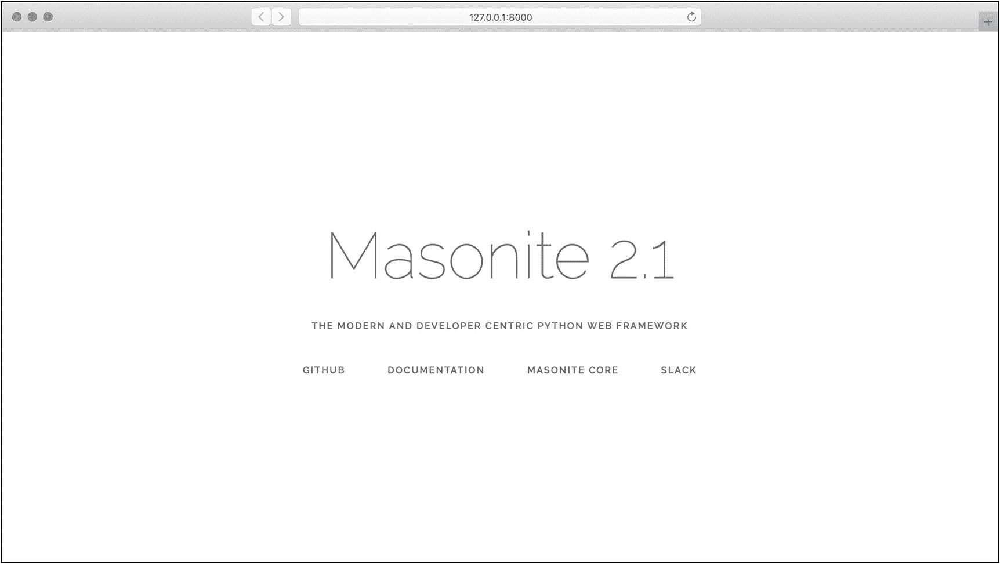
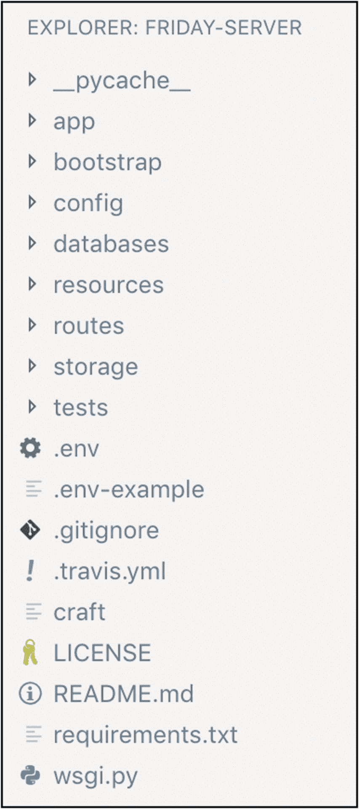

# 一、入门指南

通过写这本书，我们希望教你如何使用 Masonite 框架( [`https://github.com/masoniteframework/masonite`](https://github.com/masoniteframework/masonite) )构建伟大的应用。Masonite 是一个现代的 Python 框架，它包含了旨在简化该任务的工具和约定。

如果你是 Python 的新手，这是可以的。如果你是 Masonite 的新用户，没关系。写这本书是为了让你仍能从中获得最大收益。在这个过程中，可能会有一些更高级的主题，但我们会尽最大努力使它们成为额外的、对您的体验不重要的内容。

如果你从未使用过 Python，我们推荐这个短期课程让你熟悉基础知识: [`https://teamtreehouse.com/library/python-basics-3`](https://teamtreehouse.com/library/python-basics-3) 。

你需要的是一台安装 Python 的计算机，一些阅读时间和一些实验时间。它不需要一台花哨的计算机，也不需要大量的时间。

我们已经安排好了章节，这样你就可以了解框架的核心概念，并构建一个功能应用。你可以阅读这本书作为参考指南。你可以把它作为一系列教程来阅读。你可以一次读一章，或者一起读。

感谢您迈出成为 Masonite pro 的第一步。

## “我从哪里开始？”

有许多不同种类的编程。你可能最熟悉的是应用编程，这是在手机、平板电脑或电脑上安装应用(或使用已安装的应用)的地方。

仔细想想，你可能还熟悉另一种类型:网站编程。这类程序是通过 Chrome、Safari 或 Firefox 等网络浏览器使用的。

Masonite 介于这两种程序之间。我来解释一下原因。

Python 最初被设计为一种系统编程语言。这意味着它旨在用于简短的服务器管理脚本，以配置其他软件和执行批处理操作。

随着时间的推移，它已经成为一种强大的多范例编程语言。一些编程语言主要用于 web 编程，它们是通过 web 服务器使用的，像 Apache 和 Nginx。其他语言对 web 服务器的行为有更全面的控制。Python 是后一种语言之一。

Python web 应用，尤其是 Masonite 应用，通常负责从监听端口到解释 HTTP 请求到发送 HTTP 响应的所有事情。如果 Masonite 应用有问题，那么整个服务器也有问题。随着风险的增加，灵活性也随之增加。

此外，控制整个服务器使我们能够做更高级的事情，如服务 web 套接字和与外部设备交互(如打印机和装配线)。

## Masonite 如何处理版本

在我们看代码之前，讨论一下 Masonite 如何处理发布是很重要的。像 Masonite 这样的大框架变化很快。你可能在 2.1 版本上开始一个项目，但是几个星期后 2.2 版本就发布了。这可能会导致一些重要的问题:

*   我应该升级吗？

*   升级需要什么？

*   这种情况多久发生一次？

我们来回答这些，一个一个来。

### 我应该升级吗？

升级是好事，但有时也有取舍。

功能可能被否决，这意味着它被标记为将来删除。您可能需要进行多项更改，以便您的应用能够在新版本中工作。你可能会发现一些你没有测试过的错误或东西。

尽管如此，升级也可以带来新的功能和安全修复。光是安全方面的好处就足以让我们认真对待任何升级。

最好的做法是查看升级指南，并确定升级的成本是否值得它带来的好处。保留几个主要版本没有害处，只要您仍然使用可以接收安全更新的框架的次要版本(并且只要您使用的版本没有明显的安全问题)。

您可以在文档网站上找到最新的升级指南: [`https://docs.masoniteproject.com/upgrade-guide`](https://docs.masoniteproject.com/upgrade-guide) 。

### 升级需要什么？

这个问题很容易通过阅读升级指南来回答。如果您落后几个版本，您可能需要阅读多份升级指南以获得最新版本。

Masonite 使用一个三部分版本方案:`PARADIGM.MAJOR.MINOR`。

这意味着当从`2.1.1`升级到`2.1.2`时，你应该几乎没有问题。从`2.1`升级到`2.2`有点复杂，但是我发现它们通常只需要 10 分钟或者更少，假设我没有偏离框架的惯例太远。

与这种版本化方案相反，每个 Masonite 库都使用语义版本化( [`https://semver.org`](https://semver.org) )。如果你使用的是单个的 Masonite 库，而不是整个框架，那么从`2.1`升级到`2.2`是相当安全的，不会破坏变更。

### 这种情况多久发生一次？

Masonite 遵循 6 个月的发布周期。这意味着你可以每 6 个月期待一个新的`MAJOR`版本。这些版本旨在要求不到 30 分钟的升级。

如果他们被期望接受更多，他们会被转移到一个新的版本。

## 安装依赖项

Masonite 需要一些依赖项才能正常工作。当我们安装它们的时候，我们可能还会讨论一下如何最好地编写 Python 代码。首先，让我们安装 Python。

### 在 macOS 上安装 Python 和 MySQL

我在苹果电脑上工作，所以我想从这里开始。macOS 没有命令行包管理器(就像你在 Linux 中期望的那样)，所以我们需要安装一个。

在本节中，我们假设您安装了最新版本的 macOS，并且可以访问互联网。

打开 Safari，进入 [`https://brew.sh`](https://brew.sh) 。这是家酿啤酒的故乡。这是一个很棒的包管理器，它将为我们提供安装 Python 3 和数据库的方法。

有一个命令，前面和中心。它应该看起来像这样

```py
/usr/bin/ruby -e "$(curl -fsSL https://raw.githubusercontent.com/Homebrew/ install/master/install)"

```

它说从那个 URL 下载一个 Ruby 脚本，用大多数 macOS 系统已经安装的 Ruby 解释器执行它。如果你觉得特别可疑，请随意在 Safari 中打开该 URL 并检查其内容。

对那些告诉你盲目执行来自互联网的脚本的网站保持怀疑是有好处的。在这种情况下，家酿啤酒在安全性和实用性方面享有盛誉。他们正在权衡安装的便利性和潜在的怀疑。

如果您仍然认为这样做风险太大，请查看本节的末尾，在那里我推荐了一个关于设置新 Python 环境的更深入的参考资料。

在终端中运行此命令，将开始安装 Homebrew。这需要一点时间，并且会在过程中提出问题。其中一个问题是你是否想安装 Xcode 命令行工具。

如果你想使用自制软件，你没有选择的余地。这些实用程序包括用于代码自制下载的编译器，所以没有它们就无法安装太多。

当安装完成时，您应该能够开始通过 Homebrew 安装依赖项。我们感兴趣的是 Python 3 和 MySQL 5.7。让我们安装它们:

```py
$ brew install python3
$ brew install mysql@5.7

```

安装 MySQL 后，您会得到一些启动服务器的说明。我建议您遵循这些，否则您将无法登录或更改数据库。

您可以通过运行以下命令来验证 Python 和 MySQL 的版本

```py
$ python --version
$ mysql --version

```

您应该看到安装了`Python 3.x.x`和`mysql ... 5.7.x`。

如果这个命令告诉你你还在使用`Python 2.x`，那么你可能需要把路径添加到你的`PATH`变量中，这个路径是在`python3`安装结束时建议的。我的看起来像这样:

```py
export PATH="/usr/local/opt/python/libexec/bin:$PATH"

```

这是从`~/.zshrc`开始的，但是你应该把它放在`~/.profile`或者`~/.bashrc`，这取决于你的系统是如何设置的。

在新的终端窗口中运行`--version`命令，您应该会看到`Python 3.x.x`作为版本。

### 在 Linux 上安装 Python 和 MySQL

接下来，我们将看看如何在 Debian/Ubuntu Linux 上安装这些依赖项。在这里，我们可以访问命令行包管理器，称为 aptitude。

您可以使用以下命令来安装 Python 和 MySQL:

```py
$ sudo apt update
$ sudo apt install python-dev libssl-dev
$ sudo apt install mysql-server-5.7

```

如果`apt`命令不存在，您可能使用的是稍微旧一点的 Linux 版本，您应该使用`apt-get`来代替。

最好启动 MySQL 服务器，否则您将无法登录或更改它:

```py
$ systemctl start mysql
$ systemctl enable mysql

```

您可以通过运行以下命令来验证 Python 和 MySQL 的版本

```py
$ python --version
$ mysql --version

```

您应该看到安装了`Python 3.x.x`和`mysql ... 5.7.x`。

### 编辑代码

您应该使用您最熟悉的代码编辑器或集成开发环境。我们建议您使用类似 Visual Studio 代码的东西，因为它包含足够有用的自动化工具，但仍然快速且免费。

可以在 [`https://code.visualstudio.com`](https://code.visualstudio.com) 下载。

当您打开 Masonite 文件时，您会看到安装代码扩展的提示。这些将为您提供方便的提示，并在您的代码中出现错误时告诉您。我们建议您在出现提示时安装这些软件。

### 在其他环境中设置

如果您使用的是 macOS 或 Linux，这些说明应该适合您。如果您使用不同版本的 Linux 或 Windows，您可能需要遵循不同的指南在您的系统上安装 Python。

一个很好的地方是查看 Masonite 官方文档: [`https://docs.masoniteproject.com`](https://docs.masoniteproject.com) 。

如果你想重温一下 Python 语言，可以看看 [`www.apress.com/la/book/9781484200292`](http://www.apress.com/la/book/9781484200292) 。

## 创建新的 Masonite 应用

Masonite 提供的工具之一是一个全局命令行实用程序，用于帮助创建和维护项目。除了 Python，前面的指令还应该安装了一个名为 Pip 的依赖性管理工具。我们可以使用 Pip 安装 Masonite 的命令行实用程序:

```py
pip install --user masonite-cli

```

根据您的系统设置，您可能需要使用一个名为`pip3`的二进制文件。如果你不确定使用哪个，运行`which pip`和`which pip3`。这些将提示您二进制文件的安装位置，您可以选择看起来更好的二进制文件。

该命令执行完毕后，您应该可以访问 Masonite 的命令行实用程序`craft`。您可以通过检查其版本来验证这一点:

```py
craft --version

```

现在，是时候创建新的 Masonite 项目了。导航到您希望项目的代码文件夹所在的位置，并运行`new`命令:

```py
craft new friday-server

```

您可以在看到`friday-server`的地方替换自己的项目名称。我之所以这样称呼我的名字，是因为一会儿就会明白的原因。

然后应该会提示您导航到新创建的文件夹并运行一个`install`命令。让我们这样做:

```py
cd friday-server
craft install

```

该命令安装 Masonite 需要运行的依赖项。运行这段代码后，您应该会看到一些文本，告诉您“key added to your。env 文件”。

为了确保一切正常，让我们运行`serve`命令:

```py
craft serve

```

这将告诉您应用将在“`http://127.0.0.1:8000`”或类似的时间提供服务。在您的浏览器中打开该 URL，您应该会看到如图 [1-1](#Fig1) 所示的 Masonite 2.1 登录页面。



图 1-1

Masonite 2.1 登录页面

### 探索 Masonite 文件夹结构

我们将在这个代码库中花费大量时间，因此对文件夹结构的基本理解(如图 [1-2](#Fig2) 所示)将有助于我们知道在哪里创建新文件和更改现有文件。



图 1-2

Masonite 2.1 文件夹结构

让我们看看这些文件和文件夹的用途，不要涉及太多细节:

1.  `app`–该文件夹开始保存应用中响应单个 HTTP 请求的部分，并对所有请求和响应应用一揽子规则和限制。当我们为应用添加响应请求的方式时，我们将向这个文件夹添加很多。

2.  `bootstrap`–此文件夹保存用于启动应用的脚本，并缓存应用运行期间生成的文件。

3.  `config`–该文件夹保存配置文件，这些文件告诉 Masonite 应用在运行时使用哪些设置。

4.  `databases`–该文件夹保存数据库配置脚本。与`config`文件夹的脚本不同，这些脚本旨在修改现有的数据库，创建和修改表和记录。

5.  这个文件夹保存静态文件，比如 HTML 模板。

6.  `routes`–该文件夹保存将 HTTP 请求映射到`app`文件夹中用于处理这些请求的部分的文件。它是我们告诉应用如何从浏览器 URL 获取应用文件的地方。

7.  这个文件夹存放更多的静态文件，但通常是我们自己放进去的那种。比如文件上传、Sass 文件和可公开访问的文件(比如`favicon.ico`和`robots.txt`)。

8.  这个文件夹包含测试脚本，我们将编写这些脚本来确保我们的应用按预期运行。

9.  `.env`–该文件存储环境变量。这些变量可能会在不同的环境中发生变化，并且通常是秘密值(如服务密钥)。这个文件不应该提交到共享代码存储位置，比如 GitHub。这就是为什么默认的`.gitignore`文件特别忽略了`.env`。

    Python 应用中还有其他常见的文件。在适当的时候，我们会谈论这些文件。

当我们构建示例应用时，我们将开始添加文件并更改这些现有的文件。当您看到文件的路径时，您可以假设我们是在谈论相对于基本文件夹的路径。

## 规划示例应用

有些人发现当他们使用一种工具来构建东西时，学习这种工具更容易。

因此，在本书中，我们将构建一个示例应用。

您不一定要跟着示例走，因为这本书的主要焦点是 Masonite 库的理论和技术用法。这仅仅是对你将要学习的 Masonite 知识的补充，是巩固你所学知识的一种手段。

我喜欢尝试电子产品，这种兴奋感只是在看了《钢铁侠》这样的电影后才有所增长。在《T2 钢铁侠》中，观众认识了一个名叫托尼·斯塔克的人，他建造了充满科技的豪宅，让生活的方方面面实现了自动化。

看完那些电影后，我有一种强烈的冲动想做同样的事情。

当我们计划这本书时，我们试图为一个示例项目想出有趣的主题，于是这个想法出现了。因此，我们将构建我们的示例项目，目标是自动化我们生活的一部分。

我们将从简单的任务开始，如实现播客和媒体中心管理，然后继续更大的事情，如获得最新的天气预报和自动回复电子邮件。

如果我们有时间，我们甚至会钻研电子世界，将设备连接到我们的代码，并让它们为我们执行物理任务。

跟随电影的潮流，我想把我的家庭自动化和个人助理称为星期五。我对这个示例应用的潜力感到兴奋不已，我希望它能像我们希望的那样激励您的学习。

## 摘要

在本章中，我们迈出了学习 Masonite 的第一步。我们安装了一些工具并创建了一个新的应用。在本书的其余部分，我们将继续构建这个应用。

我们还讨论了这个示例应用的主题。随着我们的继续，您可以随意在示例中添加自己的设计和风格。它旨在让您对使用 Masonite 保持兴趣，并希望在本书结束时成为对您有用的东西。