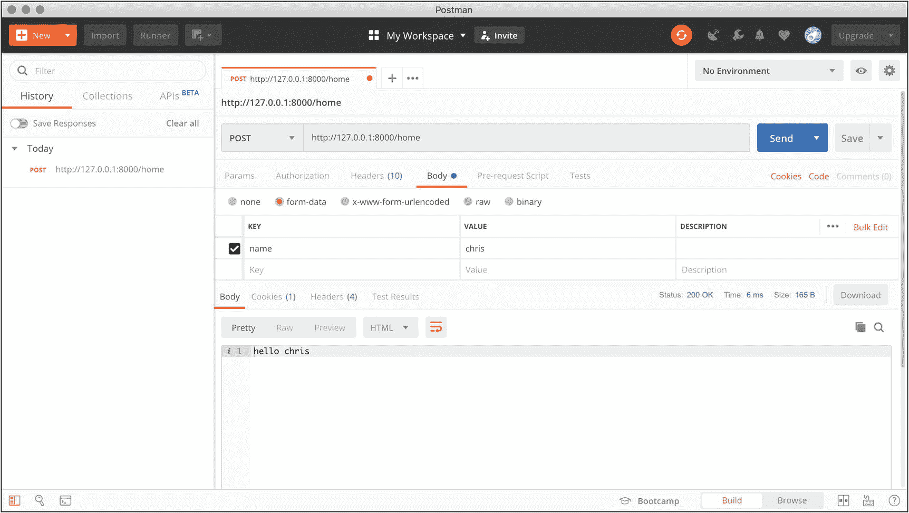

# 二、路由

在前一章中，我们已经做好了开始构建 Masonite 应用的准备。我们安装了 Python、数据库和 craft 命令行实用程序。

在这一章中，我们将学习将浏览器 URL 连接到处理每个请求的应用代码的过程。我们将了解 Masonite 可以解释的不同类型的请求，并且我们将开始为我们的示例应用构建功能。

## " Masonite 如何处理请求？"

互联网是围绕着请求/响应循环的思想而建立的。每当您打开浏览器并输入 URL 时，都会发生同样的事情:

1.  你的浏览器将你输入的地址(如 [`www.apress.com`](http://www.apress.com) )与一个 IP 地址连接起来。IP 地址有两种形式:IPv4 和 IPv6。这两种类型的地址都是为了将不同的机器连接在一起，但人类不容易处理。

    称为域名服务器(或简称 DNS)的东西有查找表，它接受人类可读的域名，并将 IPv4 或 IPv6 地址返回给浏览器。

2.  浏览器在 IPv4 或 IPv6 地址的末尾(通常在端口 80 或端口 443)向服务器发出请求。在 DNS 解析后，对 [`www.apress.com`](http://www.apress.com) 的请求将导致浏览器向`151.101.172.250:443`发送请求(当您尝试时，地址可能会有所不同，因为服务器可以更改它们的 IP 地址)。

3.  然后，服务器有机会解释请求并做出相应的响应。大多数情况下，响应是一个文本体(可以包含 HTML)和一些描述服务器和响应体的头。

这是 Masonite 接管的第三步。Masonite 应用监听端口 80 和端口 443，除非另外配置，并被给予 HTTP 请求来解释。

HTTP 是超文本传输协议的意思，它描述了发出请求和发送响应的格式。我忽略了大量的细节，因为这对我们学习 Masonite 来说并不重要。如果你想看完整的规格，你可以在 [`https://tools.ietf.org/html/rfc2616`](https://tools.ietf.org/html/rfc2616) 找到。

Masonite 接收一个 HTTP 请求，对其执行一些初始格式化，并将该请求传递给路由处理程序。为了让我们响应特定的请求，我们需要创建路由处理程序和相应的控制器。

## 创建控制器和路由

此代码可在 [`https://github.com/assertchris/friday-server/tree/chapter-2`](https://github.com/assertchris/friday-server/tree/chapter-2) 找到。

在 Masonite 中，我们认为路由是应用的第一个入口点，但是在创建新路由之前，我们必须创建新的控制器。

craft 命令具有内置功能，可以帮助我们轻松创建新的控制器。在我们的项目文件夹中，我们可以使用以下命令:

```py
craft controller Home

```

这将在`app/http/controllers`文件夹中创建一个名为`HomeController.py`的文件。控制器是 HTTP 请求和响应之间的粘合剂。我们刚刚做的这个看起来像这样:

```py
"""A HomeController Module."""

from masonite.request import Request
from masonite.view import View

class HomeController:
    """HomeController Controller Class."""

def __init__ (self, request: Request):
    """HomeController Initializer

    Arguments:
        request {masonite.request.Request}...
    """
    self.request = request
    def show(self, view: View):
        pass

```

这是来自`app/http/controllers/HomeController.py`。

控制器是普通的 Python 类。它们的强大之处在于它们是使用依赖注入容器创建和调用的。我们将在第 [3](03.html) 章深入探讨这意味着什么。

现在，你需要知道的是你看到的`Request`和`View`对象，会自动提供。我们不需要创建这个控制器的新实例，也不需要用这些对象来填充它，就可以让它正常工作。

大多数控制器代码都是文档。为了简洁起见，我们将尽可能多地省略这类文档。您将在您的文件中看到它(它仍然在我们的文件中)，但是我们不会在代码清单中重复它。

现在我们已经制作了一个控制器，我们可以将它连接到一个路由。如果你打开`routes/web.py`，你会注意到它已经有了一个定义好的路由。您可能还注意到了现有的控制器。暂时忘掉这些吧。让我们添加自己的路由，以响应在`/home`的`GET`请求:

```py
from masonite.routes import Get, Post

ROUTES = [
    # ...
    Get().route('/home', 'HomeController@show').name('home'),
]

```

这是来自`routes/web.py`。

这应该够了吧？让我们启动服务器:

```py
craft serve

```

旧版本的 Masonite 需要一个`-r`标志，以使服务器在每次看到文件更改时重新启动。如果您的更新没有显示在浏览器中，请检查控制台，确保服务器在每次文件更改时都重新加载。如果你没有看到任何活动，你可能需要这个标志。

当我们在浏览器中打开服务器时(在`http://127.0.0.1:8000/home`，我们看到如图 [2-1](#Fig1) 所示的屏幕。


图 2-1

哎呀！一个错误

那不可能是正常的，不是吗？好吧，让我们回到控制器代码:

```py
from masonite.request import Request
from masonite.view import View

class HomeController:
    def __init__ (self, request: Request):
        self.request = request

    def show(self, view: View):
        pass

```

这是来自`app/http/controllers/HomeController.py`。

我们的路由告诉 Masonite 使用`show`方法，但是`show`方法刚好通过。为了让路由工作，它们需要返回一些东西。错误消息告诉我们这一点，尽管是以一种迂回的方式:“响应的类型不能是:None。”

修复出奇的简单。我们只需要从`show`方法中返回一些东西。简单的字符串就可以了:

```py
def show(self, view: View):
    return 'hello world'

```

这是来自`app/http/controllers/HomeController.py`。


图 2-2

从`show`返回一个字符串

成功！这可能看起来不多，但这是构建功能性应用的第一步。

让我们回顾一下到目前为止发生了什么:

1.  我们打开了一个浏览器`http://127.0.0.1:8000/home`。浏览器创建了一个 HTTP 请求并将其发送到该地址。

2.  Masonite 服务器从`craft serve -r`开始，监听端口 80，接收 HTTP 请求。

3.  Masonite 服务器使用`GET`请求方法寻找匹配`/home`的路由。它找到一个匹配，并查看使用哪个控制器和方法。

4.  Masonite 服务器获取主要的请求和视图对象，实例化控制器，并将这些对象发送给控制器和`show`方法。

5.  我们告诉控制器为该类型的请求返回一个字符串，它确实这样做了。该字符串被格式化为 HTTP 响应并发送回浏览器。

6.  浏览器显示了 HTTP 响应。

    您创建的每条路由都将与控制器中的一个方法相连接，或者直接连接到一个响应文件。你需要经常遵循这个过程，所以现在掌握它是很重要的。

这只是一条普通的`GET`路由，但是我们可以使用许多不同种类的路由和变体。

## 创建不同种类的路由

我们已经掩盖了这一点，但是 HTTP 请求可以有不同的方面来区分它们。我们已经看到了`GET`请求的样子——当你在浏览器中输入地址时发生的那种请求。

### 不同的方法

还有其他一些方法:

*   当您在浏览器中提交表单时，通常会出现这种请求。它们用于表示正在传送的对象应该在服务器上创建。

*   `PATCH`、`PUT`——这类请求通常不会出现在浏览器中，但它们有特殊的含义，操作类似于`POST`请求。它们分别用于表示被传送的对象应该被部分改变或覆盖。

*   `DELETE`–这些类型的请求通常也不会在浏览器中发生，但是它们的操作类似于`GET`请求。它们用于表示正在传送的对象应该从服务器上移除。

*   `HEAD`–这类请求确实发生在浏览器中，但它们更多的是关于被传送对象的元数据，而不是对象本身。`HEAD`请求是检查有问题的对象以及浏览器是否有权限对其进行操作的方法。

使用这些请求方法，对同一路径的请求(如`/room`)可能意味着不同的事情。一个`GET`请求可能意味着浏览器或使用它的人想要查看关于一个特定房间的信息。

一个`POST`、`PATCH`或`PUT`请求可以指示用户想要创建或改变一个房间，指定创建或改变它的属性。

`DELETE`请求可以指示用户想要从系统中移除房间。

### 不同参数

路由(和请求)也可以有不同种类的参数。第一个，也是最容易想到的，是作为 URL 一部分的那种参数。

你知道当你看到博客文章，有类似 [`https://assertchris.io/post/2019-02-11-making-a-development-app`](https://assertchris.io/post/2019-02-11-making-a-development-app) 的网址..？URL 的最后一部分是一个参数，可以是硬编码的，也可以是动态的，这取决于应用。

我们可以通过改变路由的外观来定义这些类型的参数:

```py
from masonite.routes import Get, Post

ROUTES = [
    # ...
    Get().route('/home/@name', 'HomeController@show')
    .name('home'),
]

```

这是来自`routes/web.py`。

注意我们是如何将`/@name`添加到路由中的？这意味着我们可以使用像`/home/ chris`这样的 URL，并且`chris`将被映射到`@id`。我们可以在控制器中访问这些参数:

```py
def __init__ (self, request: Request):
    self.request = request

def show(self, view: View):
    return 'hello ' + self.request.param('name')

```

这是来自`app/http/controllers/HomeController.py`。

__ `init__`方法(或构造函数)接受一个`Request`对象，我们可以在`show`方法中访问它。我们可以调用`param`方法来获取命名的 URL 参数，这是我们在路由中定义的。

因为我们只有`show`方法，而所有 __ `init__`所做的就是存储`Request`对象，我们可以缩短这段代码:

```py
from masonite.request import Request
from masonite.view import View

class HomeController:
    def show(self, view: View, request: Request):
        return 'hello ' + request.param('name')

```

这是来自`app/http/controllers/HomeController.py`。

和以前一样，这是可行的，因为控制器方法是在从依赖注入容器中解析了它们的依赖关系之后被调用的。

如果你在一个方法中使用一个依赖项，你应该在同一个方法中接受那个参数。如果您多次重用它，那么在构造函数中接受依赖关系会更快一些。

参数化请求的另一种方法是允许查询字符串参数。这是当一个 URL 被请求时，但是以类似于`?name=chris`的语法结束。让我们使路由的`@name`部分可选，并允许它作为查询字符串参数给出:

```py
from masonite.routes import Get, Post

ROUTES = [
    # ...
    Get().route('/home/@name', 'HomeController@show')
    .name('home-with-name'), Get().route('/home', 'HomeController@show')
    .name('home-without-name'),
]

```

这是来自`routes/web.py`。

使参数成为可选参数的最快、最简单的方法是定义不需要提供参数的第二条路径。然后，我们必须修改控制器，使其同时适用于这两种情况:

```py
from masonite.request import Request
from masonite.view import View

class HomeController:
    def show(self, view: View, request: Request):
        return 'hello ' + (
            request.param('name') or request.input('name')
        )

```

这是来自`app/http/controllers/HomeController.py`。

我们可以在`Request`对象上使用`input`方法访问查询字符串参数。想知道这段代码最棒的部分吗？如果我们想响应`POST`、`PATCH`或`PUT`的请求，我们不需要修改任何控制器代码。

我们可以修改`/home`路由以接受`GET`和`POST`请求:

```py
from masonite.routes import Get, Post, Match

ROUTES = [
    # ...
    Match(['GET', 'POST'], '/home/@name',
          'HomeController@show').name('home-with-name'),
    Match(['GET', 'POST'], '/home',
          'HomeController@show').name('home-without-name'),
]

```

这是来自`routes/web.py`。

在 CSRF 中间件中，我们必须允许对这些 URL 的不安全 POST 请求:

```py
from masonite.middleware import CsrfMiddleware as Middleware

class CsrfMiddleware(Middleware):
    exempt = [
        '/home',
        '/home/@name',
    ]

    every_request = False
    token_length = 30

```

这是来自`app/http/middlware/CsrfMiddleware.py`。

我们将在第 [8 章](08.html)中学习中间件，在第 [4 章](04.html)中学习 CSRF 保护。现在，知道`POST`请求来自应用外部时通常会被阻止就足够了。

浏览器请求应该继续工作，但是现在我们也可以向这些端点发出`POST`请求。最简单的测试方法是安装一个名为 Postman 的应用。以下是测试的步骤:

1.  前往 [`www.getpostman.com`](http://www.getpostman.com) 下载安装 app。当你打开应用时，你需要创建一个免费帐户，除非你以前使用过 Postman。

2.  将方法下拉菜单从`Get`更改为`Post`，并输入网址`httsp:// 127.0.0.1:8000/home`。

3.  将数据选项卡从`Params`更改为`Body`，并输入`name`(键)= `chris`(值)。

4.  Click `Send`.

    

    图 2-3

    向服务器发送 POST 请求

如果`GET`或`POST`请求给你一个错误，比如“只能连接 str(不是“bool”)到 str”，这可能是因为你既没有提供路由*参数*，也没有提供查询字符串/post 主体名称。

### 路由组

有时，您希望将多条路由配置为相似的名称，或者以相似的方式运行。我们可以通过将`/home`路由组合在一起来简化它们:

```py
from masonite.routes import Get, Match, RouteGroup

ROUTES = [
    # ...
    RouteGroup(
        [
            Match(['GET', 'POST'], '/@name',
                  'HomeController@show').name('with-name'),
            Match(['GET', 'POST'], '/',
                  'HomeController@show').name('without-name'),
        ],
        prefix='/home',
        name='home-',
    )
]

```

这是来自`routes/web.py`。

如果我们使用`RouteGroup`而不是`Match`或`Get`，我们可以定义公共路径和名称前缀。这节省了大量的输入，并且更容易看到有共同点的路由。

`RouteGroup`还有一些更高级的方面，但它们最好留在适当解释它们的章节中。注意第 8 章[的](08.html)中的中间件和第 13 章[的](13.html)中的域(部署)。

## 探索请求和响应

当我们在控制器中时，让我们更详细地看一下请求和响应类。我们已经使用了几个请求方法，但是还有更多的要看。

我们已经看到了如何请求单个指定的输入，但是还有一种方法可以获得请求的所有输入:

```py
request.all()

```

这将返回一个输入字典。对于`HEAD`、`GET`和`DELETE`方法，这可能意味着查询字符串值。对于`POST`、`PATCH`和`PUT`方法，这可能意味着请求主体数据。

后一种方法可以将它们的主体数据作为 URL 编码的值发送，甚至作为 JSON 数据发送。

我说这“可能意味着”是因为后面的方法也可能有查询字符串值。虽然这在大多数设置中是允许的，但它违反了 HTTP 规范。当您设计应用使用后一种方法时，您应该尽量避免混合查询字符串和主体数据。

`request.all()`非常有用，在你不确定你到底想要什么数据的情况下。这种方法有多种变体，变得更加具体:

```py
request.only('name')
request.without('surname')

```

这些方法分别限制返回的字典项和排除指定的字典项。

如果您不确定您期望的输入是什么，但是您想知道某些键是否存在，那么您可以使用另一种方法:

```py
request.has('name')

```

`request.has()`根据指定的键是否被定义，返回`True`或`False`。例如，您可以根据某些数据位的存在来改变 route 方法的行为。如果您检测到特定于某个用户的数据，您可能希望更新该用户的帐户详细信息。或者，如果您在他们提交的表单中找到相关数据，您可能需要重置他们的密码。由你决定。

### 读写 Cookies

我们记住用户并存储与其会话相关的数据的方法之一是通过设置 cookies。这些可以在浏览器中设置和读取，因此认识到 Masonite 默认设置可以防止这种情况的发生是很重要的。

可以使用以下方法设置 Cookies:

```py
request.cookie('accepts-cookies', 'yes')

```

除非我们也禁用仅 HTTP 和服务器端加密，否则我们将无法使用 JavaScript 读取这些内容:

```py
request.cookie(
    'accepts-cookies',
    'yes',
    encrypt=False,
    http_only=False,
    expires='5 minutes',
)

```

这段代码还演示了如何设置 cookies 的过期时间。默认情况下，它们将在用户关闭浏览器时过期，因此任何长期或持久数据都必须设置该值。

可以用几种方式阅读 Cookies。第一种是通过指定一个键:

```py
request.get_cookie('accepts-cookies', decrypt = False)

```

如果你设置`Encrypt`为`False`，那么你需要设置`Decrypt`为`False`。否则`Decrypt`的论点可能会被省略。如果 Masonite 试图解密一个 cookie，但失败了，那么它将删除该 cookie。这是针对 cookie 篡改的安全预防措施。

如果您想手动删除 cookie，可以使用以下方法:

```py
request.delete_cookie('accepts-cookies')

```

### 发送其他类型的响应

到目前为止，我们只向浏览器发回了普通字符串。我们可以发送无数的其他响应，从 JSON 响应开始:

```py
return response.json({'name': 'chris'})

```

这种响应将在响应后附加适当的内容类型和长度头。通过返回字典，我们可以使它更短:

```py
return {'name': 'chris'}

```

正是这种魔力让我如此享受 Masonite！当我们返回普通字符串时，也有类似的事情发生，但这是我们第一次深入了解发生了什么。

现在，假设我们想要重定向用户，而不是向浏览器返回一些可呈现的响应。为此，我们可以使用`redirect`方法:

```py
return response.redirect('/home/joe')

```

这本身并不太灵活。然而，我们可以使用一个类似命名的`Request`方法，重定向到一个命名的路由:

```py
return request.redirect_to(
    'home-with-name',
    {'name': 'chris'},
)

```

这是我建议你总是给你的路由命名的主要原因之一。如果您稍后想要更改路由的路径，则引用命名路由的所有代码将继续运行，无需修改。使用一个命名的路径通常比重建或硬编码你需要的 URL 更快。

## 创建视图

我想谈的最后一种回应是涉及 HTML 的那种。如果我们对构建丰富的 UI 感兴趣，普通的字符串是不够的。我们需要一种方法来构造更复杂的模板，这样我们就可以显示动态的和风格化的界面元素。

让我们看看如果让`/home`路由显示动态 HTML 会是什么样子。第一步是创建布局文件:

```py
<!doctype html>
<html lang="en">
    <head>
        <meta charset="utf-8">
    </head>
    <body>
        @block content
            <!-- template content will be put here-->
        @endblock
    </body>
</html>

```

这是来自`resources/templates/layout.html`。

构建适合布局的模板是个好主意，这样就可以在一个地方应用全局更改。我们很快就会看到这一点。现在，让我们创建一个主页模板:

```py
@extends 'layout.html'

@block content
    <h1>hello {{ name }}</h1>
@endblock

```

这是来自`resources/templates/home.html`。

注意这个模板需要重复的地方有多少，因为我们扩展了`layout.html`模板。此路径相对于 templates 文件夹。“外部”模板中定义的块可以被“内部”模板覆盖。这意味着我们可以定义默认内容，“内部”模板可以用更具体的内容来替换。

Masonite 视图使用 Jinja2 模板语法的超集，可以在 [`http://jinja.pocoo.org/docs`](http://jinja.pocoo.org/docs) 找到。一个重要的区别是 Masonite 模板可以使用`@extends`语法来代替``语法。

为了使用这些模板，我们需要在控制器中做一些改动。首先，我们使用动态数据，以`{{ name }}`的形式。这些数据需要传递到视图中。其次，我们需要指定加载哪个视图模板。

下面是这段代码的样子:

```py
def show(self, view: View, request: Request):
    return view.render('home', {
        'name': request.param('name') or request.input('name')
    })

```

这是来自`app/http/controllers/HomeController.py`。

我们通过定义一个动态数据字典将`name`数据传递给视图。

关于 Jinja2 语法以及 Masonite 如何扩展它，还有很多东西需要学习。在我们构建示例应用时，我们将进一步探索它。

## 启动示例应用

在开始之前，我想强调的是，示例应用对于您的学习来说是完全可选的。每一章的示例代码都可以在 GitHub 上找到，所以你不用重新输入任何东西。

也就是说，我们强烈建议您至少跟随示例应用的开发。我们相信，如果你看到你所学的东西融入到真实的东西中，你会更容易记住它。如果你自己建造一些真实的东西，就更是如此。

此代码可在 [`https://github.com/assertchris/friday-server/tree/between-chapters-2-and-3`](https://github.com/assertchris/friday-server/tree/between-chapters-2-and-3) 找到。

我听很多播客，所以我想让 Friday(我的个人助理和家庭自动化软件)按需组织和播放播客。星期五将开始她作为一个美化的播客应用的生活。

让我们从创建一个搜索新播客的页面开始。我们需要一个新的控制器和模板:

```py
craft controller Podcast
craft view podcasts/search

```

这个新的控制器和我们创建的`HomeController`一模一样，除了名字。我们应该重命名`show`方法，以便它更准确地反映我们想要显示的内容:

```py
from masonite.view import View

class PodcastController:
    def show_search(self, view: View):
        return view.render('podcasts.search')

```

这是来自`app/http/controllers/PodcastController.py`。

这个新视图只是一个空文件，但是它位于正确的位置。让我们给它一些标记，这样我们就可以知道它是否被正确地呈现了:

```py
@extends 'layout.html'

@block content
    <h1>Podcast search</h1>
@endblock

```

这是来自`resources/templates/podcasts/search.html`。

在此之前，我们需要添加一条路由。我们可以从一个`RouteGroup`开始，因为我们希望添加更多具有相似名称和前缀的路由。

```py
from masonite.routes import Get, Match, RouteGroup

ROUTES = [
    # ...
    RouteGroup(
        [
            Get().route('/', 'PodcastController@show_search')
            .name('-show-search')
        ],
        prefix='/podcasts',
        name='podcasts',
    ),
]

```

这是来自`routes/web.py`。

如果你正在运行`craft serve -r`命令，你只需要在浏览器中进入`/podcasts`就可以看到这个新页面。看起来有点丑，所以我觉得应该开始应用一些风格了。让我们使用一个叫做顺风( [`https://tailwindcss.com`](https://tailwindcss.com) )的工具，因为它很容易上手:

```py
npm init -y
npm install tailwindcss --save-dev

```

这将添加两个新文件和一个新文件夹。您可以将文件提交给 Git，但是我建议将文件夹(即`node_modules`)添加到您的`.gitignore`文件中。你可以通过运行`npm install`来重新创建它。

Masonite 为我们的应用提供了一种构建 Sass ( [`https://sass-lang.com`](https://sass-lang.com) )的简单方法。我们可以将以下链接添加到布局文件中:

```py
<!doctype html>
<html lang="en">
    <head>
        <meta charset="utf-8">
        <link href="/static/style.css" rel="stylesheet" type="text/css">
    </head>
    <body>
        @block content
            <!-- template content will be put here-->
        @endblock
    </body>
</html>

```

这是来自`resources/templates/layout.html`。

这个`/static/style.css`文件不存在，但那是因为它被重定向到了`storage/compiled/style.css`。这个文件是由我们放入`storage/static/sass/style.css`的内容生成的。我们可以向该文件添加新的样式，并看到它们在我们的应用中得到反映:

```py
@import "node_modules/tailwindcss/dist/base";
@import "node_modules/tailwindcss/dist/components";
@import "node_modules/tailwindcss/dist/utilities";

h1 {
    @extend .text-xl;
    @extend .font-normal;
    @extend .text-red-500;
}

input {
    @extend .outline-none;
    @extend .focus\:shadow-md;
    @extend .px-2;
    @extend .py-1;
    @extend .border-b-2;
    @extend .border-red-500;
    @extend .bg-transparent;

    &[type="button"], &[type="submit"] {
        @extend .bg-red-500;
        @extend .text-white;
    }
}

```

这是来自`storage/static/sass/style.scss`。

这只有在我们使用`pip install libsass`或`pip3 install libsass`安装了 Sass 库的情况下才有效。您也可能看不到仅通过刷新页面所做的更改。如果您看不到更改，请重新启动服务器并清除浏览器缓存。

关于 Tailwind 我不想说太多细节，除了说它是一个基于实用工具的 CSS 框架。这意味着样式是通过给元素类(内联)来应用的，或者像我们用这些`h1`和`input`选择器所做的那样提取类。

让我们重新定位内容，使其位于页面中间:

```py
<!doctype html>
<html lang="en">
    <head>
        <meta charset="utf-8">
        <link href="/static/style.css" rel="stylesheet" type="text/css">
    </head>
    <body>
        <div class="container mx-auto py-4">
            @block content
                <!-- template content will be put here-->
            @endblock
        </div>
    </body>
</html>

```

这是来自`resources/templates/layout.html`。

让我们添加一个搜索表单和一些虚拟结果:

```py
@extends 'layout.html'

@block content
    <h1 class="pb-2">Podcast search</h1>
    <form class="pb-2">
        <label for="terms" class="hidden">Terms:</label>
        <input type="search" name="terms" id="terms" />
        <input type="submit" value="search" />
    </form>
    <div class="flex flex-row flex-wrap">
        <div class="w-full md:w-2/5 mr-2 flex flex-row pb-2">
            <div class="min-h-full w-48 bg-red-300"></div>
            <div class="p-4 flex flex-col flex-grow">
                <div class="mb-8 flex flex-col flex-grow">
                    <div class="text-xl mb-2">Title</div>
                    <p class="text-base">Description</p>
                </div>
                <div class="flex flex-grow items-center">
                    <div class="w-10 h-10 bg-red-300"></div>
                    <div class="text-sm ml-4">
                        <p class="leading-none">Author</p>
                        <p class="">date</p>
                    </div>
                </div>
            </div>
        </div>
        <div class="w-full md:w-2/5 mr-2 flex flex-row pb-2">
            <div class="min-h-full w-48 bg-red-300"></div>
            <div class="p-4 flex flex-col flex-grow">
                <div class="mb-8 flex flex-col flex-grow">
                    <div class="text-xl mb-2">Title</div>
                    <p class="text-base">Description</p>
            </div>
            <div class="flex flex-grow items-center">
                <div class="w-10 h-10 bg-red-300"></div>
                <div class="text-sm ml-4">
                    <p class="leading-none">Author</p>
                    <p class="">date</p>
                </div>
            </div>
        </div>
    </div>
    <div class="w-full md:w-2/5 mr-2 flex flex-row pb-2">
        <div class="min-h-full w-48 bg-red-300"></div>
        <div class="p-4 flex flex-col flex-grow">
            <div class="mb-8 flex flex-col flex-grow">
                <div class="text-xl mb-2">Title</div>
                    <p class="text-base">Description</p>
                </div>
                <div class="flex flex-grow items-center">
                    <div class="w-10 h-10 bg-red-300"></div>
                    <div class="text-sm ml-4">
                        <p class="leading-none">Author</p>
                        <p class="">date</p>
                    </div>
                </div>
            </div>
        </div>
    </div>
@endblock

```

这是来自`resources/templates/podcasts/search.html`。


图 2-4

播客搜索表单和结果

## 摘要

在本章中，我们学习了控制器、路由和视图。我们在应用中创建了多个入口点，接受了多种请求方法，并用简单和复杂的响应进行响应。

我们还开始开发我们个人助理应用，启动并运行 Sass，并开始将样式应用于定制标记。

在下一章，我们将学习 Masonite 提供的一些更高级的工具，从依赖注入容器开始。