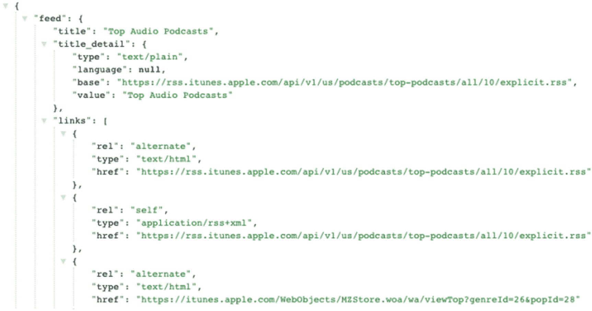

# 三、服务容器

Masonite 是围绕所谓的“服务容器”构建的但是不要让这种措辞迷惑你。一个服务容器就是一组…服务，确切地说！这个上下文中的服务只是功能。把服务容器想象成一个工具箱，把服务想象成你的工具，把 Masonite 想象成你的工作室。一个服务可以小到一个用于发送邮件的`Mail`类，或者一个用于向 RabbitMQ 这样的消息代理发送作业的`Queue`类。服务甚至可以变得更高级，比如路由引擎将 URL 映射到给定的控制器。

所有这些服务都被加载(绑定)到服务容器中，然后我们在以后获取服务。稍后我会详细解释为什么这很重要。

服务容器的真正好处是它为您处理应用依赖性。举个例子，你不得不:

*   导入对象。

*   初始化对象。

*   将一些数据传递给 setter 方法。

*   最后调用对象方法。

*   在几个文件中做同样的事情。

Masonite 的服务容器也称为 IoC 容器。服务容器和 IoC 容器将互换使用。IoC 代表控制反转。控制反转仅仅意味着对象的常规控制被翻转。正常情况下，一个对象负责

*   寻找对象

*   实例化对象

使用 Masonite 的 IoC 容器，所有对象都

*   实例化

*   传递给对象

看到控制反转了吗？构建包装在服务容器周围的应用的好处实际上非常简单。容器有两个主要的好处。

第一个好处是，它允许您在应用启动(如启动服务器)之初将所有服务(对象)加载到容器中，然后在整个应用中使用。这样就不需要在多个地方实例化一个类。它还允许您在以后将该类与任何其他类交换。也许你不喜欢你正在使用的日志类，所以你把它换成另一个实现。

第二个好处是，它允许您将大多数相互依赖的类连接在一起。例如，如果一个`Logger`类需要`Request`和`Mail`类，Masonite 会把它们连接在一起，给你一个已经完成并初始化好的类供你使用。没有必要将所有的应用依赖项连接在一起。这对可维护的代码库来说是无价的。

让我们开始更多地了解容器。

## 我们正在解决的问题

以此为例。我们有两节非常简单的课。

第一个类从请求对象发送一封简单的电子邮件，并记录一条消息，说明邮件已发送:

```py
from some.package import SMTPMail, BaseMail

class Mail(BaseMail):
    def __init__ (self, request, logger):
        self.request = request
        self.logger = logger

    def send(self, message):
        self.to(self.request.input('email')).smtp(message)

```

很简单，对吧？我们可以像这样在控制器方法中使用它:

```py
from masonite.request import Request

from app.mail import Mail
from app.logger import Logger

class MailController:

    def show(self, request: Request):
        logger = Logger(level='warning', dir='/logs')
        mail = Mail(request, logger)
        mail.send('Email has been sent!')

```

这段代码看起来不错，但是请注意，我们必须设置一个名为 logger 的新对象，以便将信息传递给 mail 类。想象一下，我们必须在十个不同的文件中使用这个类。可能有 20 个其他对象不得不使用这个`Logger`类。我们真的要每次都把它导入到文件中，初始化它，然后传入吗？

## 类型提示

现在请注意，我们在前面的方法签名中有一行，如下所示:

```py
def show(self, request: Request):

```

这被称为“类型提示”，它是我们主要如何与服务容器交互的基础。

类型提示是告诉参数它应该是哪种类型的艺术。我们可以告诉一个参数是一个`Request`类还是一个`Logger`类。

在 Masonite 方面，Masonite 会说“哦，这个参数想要成为一个 Logger 类。我已经知道了那个 logger 类，所以我将强制那个参数成为我已经知道的同一个对象。”

类型提示在语义上是这样写的:

```py
from some.package import Logger

def function(logger: Logger):
  pass

```

语法是`{variable}: Class`。

变量可以用你喜欢的名字命名。例如，签名可以用以下任何一种方式书写:

```py
def function(log:  Logger):

def function(logging: Logger):

def function(l: Logger):

```

变量仅仅是一个变量。随便你怎么命名。

在调用对象之前，Masonite 会在代码库中的几个地方检查对象。这些地方包括控制器、中间件和队列作业方法。这些只是 Masonite 为您解析的地方，但是您也可以总是解析您自己的类。

### 服务提供商

现在你可能想知道 Masonite 是怎么知道提供哪个类的？我申请了`Logger`班，我得到了`Logger`班。那么 Masonite 如何知道提供哪个类呢？

这都是由 Masonite 所谓的“服务提供商”来完成的

服务提供者是用于将服务注入容器的简单类。它们是构成 Masonite 应用的构建块。Masonite 检查它的服务提供者列表，并使用它来引导应用。Masonite 实际上主要由这些服务提供商组成。

这是服务提供商列表的一个示例:

```py
from masonite.providers import AppProvider, SessionProvider, ...

PROVIDERS = [
    # Framework Providers
    AppProvider,
    SessionProvider,
    RouteProvider,
    StatusCodeProvider,
    WhitenoiseProvider,
    ViewProvider, HelpersProvider,
]

```

这是 Masonite 应用核心的简单流程:

1.  WSGI 服务器(像 Gunicorn 一样)首先启动。

2.  Masonite 遍历服务提供者列表，并对所有服务提供者运行`register`方法。

3.  Masonite 在所有服务提供者上运行所有的方法。这个`wsgi = False`属性只是告诉 Masonite，我们不需要运行 WSGI 服务器来引导应用的这一部分。如果是`wsgi = True`，那么 Masonite 将对每个请求运行`boot`方法。如果我们有一个服务提供者在容器中加载了一个`Mail`服务，那么它不需要对每个请求都运行。

4.  然后，Masonite 将监听特定端口上的任何请求。

5.  当请求到达服务器时(比如主页)，Masonite 将只在不存在`wsgi = True`或属性的服务提供者上运行`boot`方法(默认情况下是`True`)。这些是需要运行的提供者，比如将请求 URL 映射到路由和控制器，或者将 WSGI 环境加载到请求对象中。

通过前面的要点可以看出，Masonite 完全依赖于这个服务容器。如果您需要交换 Masonite 的功能，那么您可以交换服务容器。

在流程中，您将构建执行特定服务(如日志记录)的类，然后使用服务提供者将其放入任何 Masonite 应用中。

一个简单的服务提供者应该是这样的:

```py
from masonite.providers import ServiceProvider

class SomeServiceProvider(ServiceProvider):

def register(self):
    pass

def boot(self):
    pass

```

### 注册方法

让我们进一步分解服务提供者，因为如果您知道这是如何工作的，那么您就可以在您的 Masonite 应用中编写非常易于维护的代码。

`register`方法首先在所有服务提供者上运行，并且是将您的类`bind`到容器中的最佳位置(稍后将详细介绍绑定)。永远不要试图从 register 方法内部的容器中获取任何东西。这应该只用于将类和对象放入。

我们可以使用`bind`方法注册类和对象。绑定是将对象放入容器的概念。

```py
from some.package import Logger
..

def register(self):
    self.app.bind('Logger', Logger(level='warning', dir='/logs'))

```

我们还希望 Masonite 为我们的新`Mail`类管理应用依赖性:

```py
from some.package import Logger, Mail
..

def register(self):
    self.app.bind('Logger', Logger(level='warning', dir='/logs'))
    self.app.bind('Mail',  Mail)

```

这些类现在已经被放到容器中了。现在我们可以将它“类型提示”到我们的邮件类中。

```py
from some.package import Logger

class Mail:

   def __init__ (self, logger: Logger):
     self.logger   =   logger

```

现在，当 Masonite 试图构造这个类时，它会初始化这个类，但是会说“嘿，我看到你想要一个`Logger`类。嗯，我已经有了那个日志类。让我给你一个我知道的，已经在我的容器里面设置好的。”

现在，当我们解析这个`Mail`类时，它会像这样:

```py
from some.place import Mail

mail = container.resolve(Mail)
mail.logger #== <some.package.Logger x82092jsa>

```

我们稍后将更多地讨论解决问题，所以不要让这一部分迷惑了你。现在请注意，Masonite 知道的`Logger`类被传递到了`Mail`类中，因为我们对它进行了类型暗示。

## 该引导方法

boot 方法是您与容器进行大部分交互的地方。在这里，您可以做一些事情，比如构造类，调整容器中已经存在的类，以及指定容器挂钩。

添加邮件功能的典型服务提供商如下所示:

```py
from some.place import MailSmtpDriver, Mail

class MailProvider(ServiceProvider):

    wsgi = False

    def register(self):
        self.app.bind('MailSmtpDriver',  MailSmtpDriver)
        self.app.bind('Mail', Mail)

    def boot(self, mail: Mail):
        self.app.bind('Mail', mail.driver('smtp'))

```

所以我们在这里做的是，当容器被注册时，我们将一个`MailSmtpDriver`以及完整的`Mail`类绑定到容器中。然后在所有的提供者都注册之后，我们将`Mail`类解析出容器，然后将它绑定回容器，但是将驱动程序设置为`smtp`。

这是因为可能会有其他服务提供者将额外的邮件驱动程序注册到容器中，所以我们希望只有在所有东西都被注册之后才与容器进行交互。

## WSGI 属性

您会注意到有一个 wsgi 属性被设置为`True`或`False`。只显示了类的前半部分，看起来像这样:

```py
class MailProvider(ServiceProvider):

    wsgi = False

    def register(self):

```

如果这个属性缺失或者设置为`True`(默认情况下是`True`，那么它将在每个请求上运行。但是我们在这里看到，我们只是添加了一个新的邮件功能，所以我们真的不需要它在每个请求上运行。

几乎所有的服务提供商都不需要对每个请求都运行。需要在每个请求上运行的服务提供者主要是那些对框架本身至关重要的服务提供者，比如“`RouteProvider`”，它接收传入的请求并将其映射到正确的路径。

在这些提供程序上，您可能会看到一个重要的参数“`wsgi = True`”。此属性将用于指示特定的提供程序应该在每个请求上运行。如果您需要基于用户的 CSRF 令牌运行代码，这可能会在请求之间发生变化，因此您需要将属性设置为`True`。您应该会发现，大多数应用级服务提供者只需要将更多的类绑定到服务容器中，因此该属性通常被设置为 False。

另一个在每个请求上运行的提供者是`StatusCodeProvider`，它将接受一个错误的请求(例如`404`或`500`)，并在生产过程中显示一个通用视图。

但是现在我们有了一个提供者，它简单地将一些类绑定到容器，我们不需要任何与请求相关的东西，我们可以确保`wsgi`是`False`。

不这样做的唯一缺点是，它将在请求上花费一些额外的时间来执行实际上不需要执行的代码。

## 关于绑定的更多信息

谈到`bind`方法，有一些重要的事情需要注意。基本上有两种类型的对象可以绑定到容器中，它们是类和初始化的对象。让我们来看看这两种类型的对象是什么。

### 类与对象行为

类是简单的未初始化对象，所以回顾我们之前的`Mail`类，我们有这个例子:

```py
from some.place import Mail

mail = Mail # this is a class
mail = Mail() # this is an uninitialized object

```

这很重要，因为你可以有几个不同的对象。如果修改一个对象，不会修改另一个对象。以此为例:

```py
from some.place import Mail

mail1 = Mail()
mail2 = Mail()

mail1.to = 'user@email.com'
mail2.to #== '' empty
mail2.to = 'admin@email.com'

```

因此，由于这种行为，我们可以将一个类绑定到容器中，而不是一个已初始化的对象:

```py
from some.place import Mail

container.bind('Mail', Mail)

```

现在每次我们解决它，它都会不同，因为它每次都是被构造的:

```py
from some.place import Mail

container.bind('Mail', Mail)

mail1 = container.resolve(Mail)
mail2 = container.resolve(Mail)

mail1.to = 'user@email.com'
mail2.to #== '' empty
mail2.to = 'admin@email.com'

```

既然我们知道了这种行为，我们也可以将初始化的对象绑定到容器中。不管我们分解多少次，这都是同一个物体。现在请看这个例子:

```py
from some.place import Mail

container.bind('Mail', Mail())

mail1 = container.resolve(Mail)
mail2 = container.resolve(Mail)

mail1.to = 'user@email.com'
mail2.to #== 'user@email.com'

```

以这种方式绑定类很有用，因为您可以添加新的服务提供者来为您操作对象。因此，添加服务提供者可能会为您的请求类添加一个完整的基于会话的特性。因为它是同一个对象，所以当我们稍后解析它时，与容器中初始化的类的任何交互都将具有相同的功能。

根据您的用例，这样做的缺点或优点是需要您手动设置您的类，因为我们需要在将它绑定到容器之前构建完整的对象。

所以回到我们的`Logger`和`Mail`的例子，我们必须这样做:

```py
from some.place import Mail, Logger

container.bind('Mail', Mail(Logger()))

mail1 = container.resolve(Mail)
mail2 = container.resolve(Mail)

mail1.to = 'user@email.com'
mail2.to #== 'user@email.com'

```

没什么大不了的，但这只是一个简单的例子。

在这种情况下，我们将调用单例模式。

### 绑定单线态

单体是一个非常简单的概念。这只是意味着，每当我们需要这个类的时候，我们每次都想要相同的类。当我们绑定类时，Masonite 通过解析类**简单地实现了这一点。因此实例化的对象被放入容器中，在服务器的整个生命周期中，它始终是同一个对象。**

我们可以通过以下方法将单例绑定到容器中

```py
from some.package import Logger, Mail
..

def register(self):
  self.app.bind('Logger', Logger)
  self.app.singleton('Mail', Mail)

```

那么每当我们解析它的时候，每次都会得到和`Logger`对象一样的对象。我们可以通过获取它并检查内存位置来证明这一点:

```py
mail1 = container.make('Mail')
id(mail1) #== 163527
id(mail1.logger)  #==  123456

mail2 = container.make('Mail')
id(mail2) #== 163527
id(mail2.logger) #== 098765

```

注意到`Mail`类是相同的，但是`Logger`类是不同的。

### 简单装订

我们已经注意到，当我们绑定到容器中时，有时我们在复制自己。我们的大多数绑定键只是我们的类的名字。为了解决这个问题，我们可以使用`simple`绑定。

```py
# Instead of:
def register(self):
  container.bind('Mail', Mail)

# We can do:
def register(self):
  container.simple(Mail)

```

这两行代码完全相同，我们现在可以像通常使用类名作为键一样`make`它:

```py
container.make('Mail')

```

## 解析类别

因此，我们已经简单地讨论了如何用容器中已经存在的对象来解析一个对象，但是让我们更详细地讨论解析实际上做了什么。

解析仅仅意味着我们将获取 objects 参数列表，提取哪些对象是类型提示的，在我们的容器中找到它们，然后将它们注入参数列表并返回新的对象。

需要注意的是，我们解析的对象不需要在容器中，**，但是所有的参数都需要在容器中。因此，如果我们正在解析我们一直在处理的`Mail`类，我们不需要将`Mail`类绑定到容器中，但是`Mail`类初始化器中的`Logger`类需要。如果不是，那么 Masonite 将抛出一个异常，因为它不能正确地构建对象。**

因此，代码示例如下所示:

```py
from some.place import Mail, Logger

container.bind('Logger', Logger)

mail = container.resolve(Mail)
mail.logger #== <some.place.Logger  x098765>

```

注意`Mail`类不在容器中，但是它的依赖项在容器中。这样我们就能正确地为你构建这个对象。

## 钩住

钩子是另一个有趣的概念。当你想拦截一个对象的解析、生成或绑定时，钩子是很有用的。

我们可以使用三种方法之一来注册带有钩子的可调用函数:`on_make`、`on_bind`、`on_resolve`。

### 正在制作

一个例子是这样的:

```py
def change_name(obj):
  obj.name = 'John'
  return  obj
...

def register(self):
  self.app.on_make('Mail',  change_name)

def boot(self):
  mail = self.app.make('Mail')
  mail.name #== 'John'

```

注意，当我们使用`make`方法时，它触发了这个钩子。这是因为`make`方法触发了`on_make`钩子，寻找任何注册的钩子，并在返回之前将对象传递给它。

### 受约束

按照前面的例子，我们可以在将对象绑定到容器时做同样的事情:

```py
def change_name(obj):
  obj.name = 'John'
  return  obj
...

def register(self):
  self.app.on_bind('Mail', change_name)
  mail = self.app.make('Mail')
  mail.name #== 'John'

```

注意它和前面的例子做的是一样的，但是在后端，当我们绑定对象的时候钩子是运行的。

### 决心已定

每次解析对象时都会执行最后一次挂钩:

```py
from some.place import Mail, TerminalLogger

def change_logger(obj):
  obj.logger = TerminalLogger()
  return obj
...

def register(self):
  self.app.bind('Mail', Mail)
  mail = self.app.make('Mail')
  mail.logger #== <some.place.Logger x098765>

def boot(self, mail: Mail):
  mail.logger #== '<some.place.TerminalLogger   x098765>'

```

注意，当我们使用`bind`和`make`方法时，我们的钩子从未运行过。直到我们解决了这个问题，记录器才被更换。当您希望在类遇到测试用例之前修改类的一些属性时，这对于测试来说是非常有用的。

## 交换

服务容器的另一个令人惊叹的特性是能够将类替换为其他类。当你想简化你的类型提示或者想编码抽象而不是具体化时，这是很有用的。

下面是一个代码片段示例:

```py
from some.place import ComplexLogger, TerminalLogger, LogAdapter

container.swap(
  TerminalLogger,
  ComplexLogger(LogAdapater).driver('terminal')
)

```

现在，每当我们解析这个`TerminalLogger`类时，我们将返回更复杂的记录器:

```py
from some.place import TerminalLogger

def get_logger(logger: TerminalLogger)
    return logger

logger = container.resolve(get_logger)
logger #== '<some.place.ComplexLogger x098765>'

```

这对于构建抽象类而不是具体类来说非常好。我们可以用一种简单的方式用更复杂的实现替换复杂的实现。

## 设计模式知识

为了成为服务容器方面的绝对专家，我认为先掌握一些知识再继续很重要。这应该给你足够全面的知识来完全掌握一切。如果你仍然不确定任何事情，你甚至可能需要重读几遍这一章，以使一切都更好。

### 抽象编码

软件设计中一个常见的设计模式是依赖倒置的概念。依赖倒置是一个定义。简单来说，它的意思就是你想依赖一个抽象类，而不必担心直接类本身。当你需要改变底层的类来做一些不同的事情时，这是很有用的。

例如，如果你正在使用一个`TerminalLogger`，那么你实际上不想使用`TerminalLogger`类本身，而是想使用它的一些抽象，比如一个新的`LoggerConnection`类。这个类被称为抽象类，因为`LoggerConnection`可以是任何东西。它可能是一个终端记录器，一个哨兵记录器，一个文件记录器等。它是抽象的，因为类`LoggerConnection`实际上并不清楚它在使用什么，因此它的实现可以在以后的任何时候被换出。

### 依赖注入

我们已经讨论过依赖注入，你可能还没有意识到。这是另一个定义的 10 个短语。依赖注入所做的只是将一个依赖传递给一个对象。

这很简单，只需将一个变量传递给一个函数，如下所示:

```py
def take(dependency):
    return dependency

inject_this = 1
x = take(inject_this)

```

就这样！我们刚刚完成了依赖注入。我们获得一个依赖项(“`inject_this`”变量)，并将其赋予(或注入)到`take`函数中。

### 控制反转(IoC)

好，这是简单的一个。这与前面的依赖注入是一样的，但是它只是依赖于逻辑发生在的**。如果依赖注入来自你，那只是正常的依赖注入，但如果来自容器或框架，那就是控制反转。**

这就是为什么 Masonite 的服务容器有时被称为 IoC 容器。

这是任何新的信息，但只是背景知识，这将使您更好地理解容器到底试图实现什么。

## 实现抽象

### 建立我们的抽象概念

让我们从制作我们的`LoggerConnection`类开始。我们可以通过创建一个简单的基类来编码抽象，我们的具体类将从这个基类继承:

```py
class LoggerConnecton:
  pass

```

然后我们可以构建我们的终端记录器，并继承我们的新`LoggerConnection`类:

```py
from some.place import LoggerConnection

class TerminalLogger(LoggerConnection):

  def log(self, message):
    print(message)

```

现在最后一步是将`TerminalLogger`绑定到我们的容器中。我们将在我们的一个服务提供商的`register`方法中实现这一点:

```py
from some.place import TerminalLogger

class LoggerServiceProvider:

  def register(self):
    self.app.bind('Logger', TerminalLogger)

```

太好了。现在，我们已经准备好对抽象进行编码了。记住我们的抽象是`LoggerConnection`类，所以现在如果我们键入提示那个类，我们将实际得到我们的`TerminalLogger`:

```py
from some.place import LoggerConnection

class SomeController:

  def show(self, logger: LoggerConnection):
    logger #== <some.place.TerminalLogger x09876>

```

所以你可能想知道它是怎么做到的。其工作原理是，当 Masonite 试图查找`LoggerConnection`类时，它会跟踪任何属于`LoggerConnection`子类的类。Masonite 将知道它的容器中没有`LoggerConnection`，并将返回它的第一个实例。在这种情况下，它就是`TerminalLogger`。

### 换出记录器

以这种方式编码的最大好处是，将来你可以为一个不同的日志记录器切换日志记录器，而不必接触应用的任何其他部分。这就是如何构建可维护的代码库。

以此为例。我们现在想把我们的`TerminalLogger`换成新的改进的`FileLogger`。

首先，我们构造这个类:

```py
from some.place import LoggerConnection

class FileLogger(LoggerConnection):

  def log(self, message):
    # Write to log file
    with open('logs/log.log', 'a') as fp:
      fp.write(message)

```

然后，我们再次将它绑定到容器，但删除之前的绑定:

```py
from some.place import FileLogger

class LoggerServiceProvider:

  def register(self):
    # self.app.bind('Logger', TerminalLogger)
    self.app.bind('Logger', FileLogger)

```

就这样！现在当我们解决它时，我们得到了`FileLogger`:

```py
from some.place import LoggerConnection

class SomeController:

  def show(self, logger: LoggerConnection):
    logger #== <some.place.FileLogger x09876>

```

除了容器绑定，我们没有改变应用的任何其他部分，它改变了代码库中其他地方的日志类型。

## 记住

如您所知，`resolve`方法需要做很多事情。它需要检查对象以了解它是什么，它需要提取出参数列表，然后需要逐个检查每个参数，它需要遍历容器中的所有对象，实际上找到正确的对象，然后构建列表并将其注入到对象中。

可以想象，这是极其昂贵的。它不仅昂贵，而且有时每个请求需要运行几十次。

幸运的是，Masonite 的容器会记住每个对象需要解析的内容并缓存它们。下次该对象再次需要它的依赖项时，比如在下一次请求时，它将从它构建的特殊字典中获取它，并为您注入它们。

这可以使您的应用至少提升近 10 倍。测试表明，当 Masonite 记住对象签名时，解析一个类可以从每次解析 55ns 降低到每次解析 3.2ns。

## 收集

Collecting 是一个非常棒的特性，您可以从容器中指定想要的对象，它会返回一个包含所有对象的新字典。

可以用两种不同的方式收集:按键和按对象。

### 按键收集

您可以通过在键名之前、期间或之后指定通配符来按键收集。

以此为例，如果您想获得所有以`Command`结尾的键:

```py
container.bind('Request', Request())
container.bind('MigrateCommand', MigrateCommand)

container.collect('∗Command')
#== {'MigrateCommand':  MigrateCommand}

```

注意，我们让容器中的所有对象通过通配符`∗Command`绑定了键。这将得到以`Command`结尾的所有内容。

您也可以用另一种方式获得以特定键开始的所有内容:

```py
container.bind('Request', Request())
container.bind('MigrateCommand', MigrateCommand)

container.collect('Migrate∗')
#== {'MigrateCommand': MigrateCommand}

```

注意这些都是一样的，因为之前我们得到的都是以`Command`键开始的，现在我们得到的都是以`Migrate`键开始的。您也可以在键中间指定通配符:

```py
container.bind('Request', Request())
container.bind('SessionCookieDriver', SessionCookieDriver)

container.collect('Session∗Driver')
#== {'SessionCookieDriver': SessionCookieDriver}

```

收集`Session∗Driver`将获得`SessionCookieDriver`、`SessionMemoryDriver`或`SessionRedisDriver`等钥匙。

当您想用特定的格式绑定时，这真的很有用，这样您以后可以很容易地再次检索它们。

### 收集对象

您还可以收集对象和对象的子类。也许您有一个基类，并希望收集该基类的所有实例。Masonite 将其用于其调度任务包，其中所有任务都继承了一个基本的`Task`类，然后我们可以收集容器中的所有任务:

```py
class Task1(BaseTask):
  pass

class Task2(BaseTask):
  pass

container.simple(Task1)
container.simple(Task2)

container.collect(BaseTask)
#== {'Task1': Task1, 'Task2', Task2}

```

如果您想将对象绑定到容器中，然后使用父类将它们取回，这是非常有用的。如果你正在开发一个包，那么这是一个非常有用的特性。

## 应用

好了，现在你已经是服务容器方面的专家了，让我们看看如何利用我们目前所掌握的知识来为我们的 Friday 应用添加一个 RSS 提要。我们将:

*   在我们的容器中添加一个 RSS 提要类

*   将代码添加到抽象中，而不是具体化中

*   从容器中解析该类，并将其用于我们的控制器方法

### 包裹

一个很好的包就是`feedparser`包。因此，在我们的应用和虚拟环境中，让我们安装这个包:

```py
$ pip install feedparser

```

让它安装好，现在我们开始构建我们的抽象类和具体化类。

### 抽象类

我们的抽象类将非常简单。它基本上是一个基类，我们的具体类将继承它。

让我们称这个类为`RSSParser`类。在这个类中，我们将创建一个`parse`方法，它将返回我们将在具体类中定义的经过解析的 RSS 提要。

让我们也在一个`app/helpers/RSSParser.py`类中手动创建这个类:

```py
# app/helpers/RSSParser.py

class RSSParser:

  def parse(self, url):
      pass

```

我们称之为`RSSParser`,是因为我们将在将来与其他 RSS 解析器交换这个实现，所以我们需要给它一个足够抽象的名字，这样我们就可以这么做了。

### 混凝土类

因为我们使用的是`feedparser`库，所以让我们称这个具体的类为`FeedRSSParser`类:

```py
# app/helpers/FeedRSSParser.py

import feedparser
from .RSSParser import RSSParser

class FeedRSSParser(RSSParser):

  def parse(self, url):
      return feedparser.parse(url)

```

如果前面代码中第二个导入令人困惑，它只是意味着从当前目录开始导入文件。由于两个文件都在`app/helpers`目录中，我们可以像这样导入它。

### 服务提供商

让我们创建一个新的服务提供商，它将只负责处理我们的 RSS 提要类。

我们想称它为`RSSProvider`，因为它为我们的应用提供了 RSS 类。我们可以用手艺来做这件事:

```py
$ craft provider RSSProvider

```

一旦我们这样做了，我们就可以像这样开始将类绑定到容器:

```py
from masonite.provider import ServiceProvider
from app.helpers.FeedRSSParser import FeedRSSParser

class RSSProvider(ServiceProvider):

  wsgi = False

  def register(self):
    self.app.bind('FeedRSSParser', FeedRSSParser())

  def boot(self):
        """Boots services required by the container """

        pass

```

最后，我们需要告诉 Masonite 我们的提供商，让我们将其导入到`config/providers.py`中，并将其添加到底部的列表中:

我们将首先在顶部导入我们的提供者，并将其添加到列表底部的`# Application Providers`注释旁边:

```py
from app.providers.RSSProvider import RSSProvider
...

    CsrfProvider,
    HelpersProvider,

    # Third Party Providers

    # Application Providers
    RSSProvider,
]

```

### 控制器

好了，现在是最后一步，我们需要在控制器方法中使用这个新的抽象。

#### 创建控制器

让我们首先创建一个专门用于解析 RSS 提要的控制器，名为`FeedController`。

craft 命令将用`Controller`作为控制器的后缀，所以我们只需要运行这个命令:

```py
craft controller Feed

```

#### 设置控制器

这一部分非常简单，但是第一次做的时候可能会有点棘手。我们将首先导入我们创建的抽象类，而不是导入和使用我们之前创建的具体类。

这意味着不是导入和使用`FeedRSSParser`，而是导入和使用我们创建的`RSSParser`抽象类。

现在让我们导入这个类，并在我们的控制器`show`方法中返回它。我们现在将在 [`https://rss.itunes.apple.com/api/v1/us/podcasts/top-podcasts/all/10/explicit.rss`](https://rss.itunes.apple.com/api/v1/us/podcasts/top-podcasts/all/10/explicit.rss) 使用 iTunes 播客 RSS 源。以下是完整控制器的示例:

```py
from app.helpers.RSSParser import RSSParser

class FeedController:
    """FeedController Controller Class."""

    def __init__ (self, request: Request):
        self.request = request

    def show(self, parser: RSSParser):
        return
parser.parse('https://rss.itunes.apple.com/api/v1/us/podcasts/top-podcasts/all/10/explicit.rss')

```

### 抽象和具体化的复习

记住抽象和具体，以及容器如何将它们匹配起来。这是一个需要把握的重要概念。你不需要这样做，但是编写抽象类而不是具体类的代码通常是一个好的设计模式。当一个库被废弃或者你需要换一个更好或更快的库时，它将使代码在未来的 2 到 3 年内更易维护。

**在切换实现的情况下，您只需在服务提供者中切换出绑定，就大功告成了**。

### 路由

最后一步是设置路由，这样我们就可以点击这个控制器方法。这是一个非常简单的步骤，我们已经学过了。

```py
Get().route('/feed', 'FeedController@show').name('feeds'),

```

太好了！现在，当我们转到`/feed`路由时，我们会看到 iTunes podcast 提要，如图 [3-1](#Fig1) 所示。



图 3-1

RSS 源响应