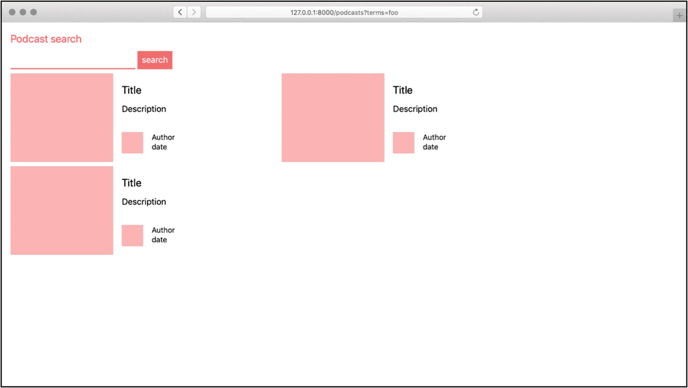
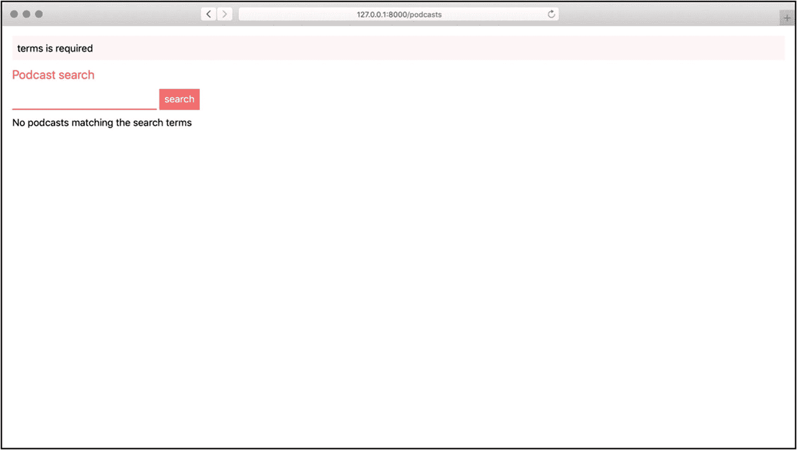
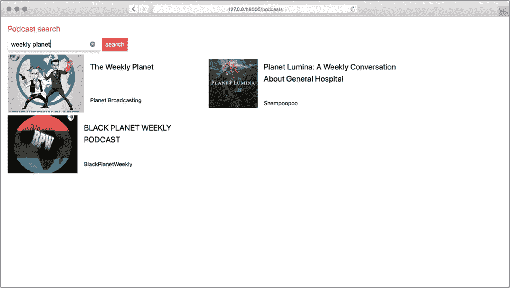

# 4.用表单接受数据

在前几章中，我们学习了一些 Masonite 用来组织应用程序的模式。我们从容器中学习了绑定和解析。我们还看到了如何使用管理器、驱动程序和工厂来创建高度可定制的系统。

在这一章中，我们将使用这些新的技术和工具回到构建应用程序的实际方面。

## “我如何存储数据？”

使用浏览器向 web 应用程序发送数据有多种方式。有一些显而易见的方法，比如当我们在浏览器的地址栏中输入一个网站地址时。我们告诉浏览器我们想去哪里，这个请求最终到达了 web 应用程序的门口。

在第 2 章中，我们看到了向 Masonite 应用程序发出请求的许多方式。就本章而言，我更感兴趣的是我们发送和接收数据的其他方式。

你以前听说过“Ajax”这个术语吗？这个名字最初是一组特定技术的缩写( **A** 同步**J**avaScript**A**nd**X**ML)，但现在已经成为描述多种部分页面加载的术语。

从本质上讲，Ajax 是指我们通常发送的 GET 或 POST 请求在幕后悄悄发生，通常是为了保持某种状态或用新内容重新加载页面的一部分。

然后是网络插座。这些是我们到目前为止看到的 HTTP 请求的演变。与对新内容的全部或部分请求不同，web 套接字是一个连续的开放连接，通过它服务器可以将新内容推送到浏览器。

还有更多方法，但这些有助于说明我希望我们解决的一个问题。当我们构建 web 应用程序时，我们需要能够沿着这些通道发送数据。在处理数据之前，我们还需要验证数据是否有序。通常，表单数据被存储起来，但是它也可以被发送到其他服务，这些服务需要特定格式的特定内容。

因此，在这一章中，我们将研究如何创建表单以及如何将表单数据安全地发送到服务器。我们将探索我们拥有的选项，以确保数据被正确格式化，并且不会试图在服务器上做恶意的事情。

## 构建安全表单

此代码可在 [`https://github.com/assertchris/friday-server/tree/chapter-5`](https://github.com/assertchris/friday-server/tree/chapter-5) 找到。

让我们从第 2 章结束时我们停下的地方继续。我们构建了几个页面，包括一个列出播客搜索结果的页面，如图 [4-1](#Fig1) 所示。



图 4-1

到目前为止，我们所拥有的

我们将从动态页面开始。当有人第一次访问它时，我们可以显示一个空的搜索结果。我们通过向模板发送一个空的播客列表，并使用所谓的条件:

```py
from masonite.controllers import Controller
from masonite.view import View

class PodcastController(Controller):
      def show_search(self, view: View):
            return view.render('podcasts.search', {

                   'podcasts': self.get_podcasts()
            })
      def get_podcasts(self, query=“):
            return []

```

这是来自`app/http/controllers/PodcastController.py`。

```py
@extends 'layout.html'

@block content
         <h1 class="pb-2">Podcast search</h1>
         <form class="pb-2" method="POST">
                {{ csrf_field }}
                <label for="terms" class="hidden">Terms:</label>
                <input type="search" name="terms" id="terms" />
                <input type="submit" value="search" />
         </form>
         <div class="flex flex-row flex-wrap">
              @if podcasts|length > 0
                   @for podcast in podcasts
                          @include 'podcasts/_podcast.html'
                   @endfor
              @else
                      No podcasts matching the search terms
              @endif
         </div>
@endblock

```

这是来自`resources/templates/podcasts/search.html`。

因为我们要动态制作播客列表，所以我们创建了一个`PodcastController`方法来返回该列表。目前，它返回一个空数组，但我们会随着时间的推移扩展它。

通过向`view.render`提供一个字典，该数组被传递给`podcasts/search.html`模板。然后，在模板中，我们用一些动态代码替换预览静态内容。我们检查是否有播客，如果没有，我们会提供一些有用的文本。

如果有播客，我们循环播放。这里有很多事情要做，所以我们要花一些时间来看看这个模板在做什么，以及模板一般能做什么。系好安全带。

### 模板条件句

Masonite 模板是 Jinja2 模板的超集。这意味着，在普通的 Jinja2 模板中可以做的任何事情在 Masonite 中都可以做。Masonite 包括一些额外的好东西，比如交替块语法。

您可以通过以下几种方式与控制器中的数据进行交互:

1.  **If 语句**

    这些是我们在模板中可以做的最简单的检查。它们接受一个不一定是布尔值的变量或表达式。变量或表达式的值被解释为`True`或`False`。如果`True`，嵌套块将被显示。

    当我们说`@if podcasts|length > 0`时，我们是说“如果播客的数量大于零，显示下一个嵌套层次的内容。”我们还可以定义一个`@else`块和多个`@elif`块。

    我个人不喜欢使用`@elif`块的想法，因为它们会很快使模板变得混乱。定义多个模板并在控制器内部尽可能多地执行条件逻辑要清楚得多。

2.  **循环语句**

    这些帮助我们为列表中的每一项呈现内容/标记块。在我们的示例应用程序中，我们可以使用它们来呈现播客列表，就像我们在前面的示例中所做的那样。

    注意`@endfor`和`@endif`的区别。这些帮助编译器知道哪种条件块被关闭，所以使用合适的关闭块是很重要的。这是一件需要习惯的事情，尤其是因为 Python 没有像这样的块终结符。

3.  **包含报表**

    这对于将其他模板包含到当前模板中很有用。例如，我们可以将为每个播客呈现的块放入另一个模板中，并将其包含在循环中。

    包含的模板可以访问包含它的模板中定义的所有变量。我们不需要“传下去”什么的。我们可以直接开始使用它们。

4.  **扩展/阻塞语句**

    正如我们在第 [3](03.html) 章中了解到的，这些对于扩展现有布局非常有用。随着我们向应用程序中添加更多的 JavaScript，我们将了解更多关于块的知识。

    你可以在官方文档中看到更多的细节:Views - Masonite 文档。

### 模板过滤器

除了可以使用 Masonite 块语法之外，Jinja2 还附带了一系列过滤器:

1.  **值| '默认'**

    当我们开始显示播客细节时，我们会看到这个过滤器被更多地使用。它说，“如果`value`不是假的，显示它。否则，显示值`'default'`。它非常适合填补没有内容可展示的空白。

2.  **项|第一项**

    此过滤器显示项目列表中的第一个项目。如果您有一个事物列表，但您只想显示第一个，这很有用。当然，您总是可以在控制器中从列表中取出第一个项目，然后只将它发送给视图。

3.  **‘你好% s’|格式(名称)**

    该过滤器的工作方式类似于 Python 字符串插值法。如果您想要在模板中使用模板字符串，并且您可以访问想要用其替换占位符的变量，这将非常有用。

4.  **项|联接('，')**

    该过滤器有助于将一系列项目组合成一个字符串，在每个项目之间使用另一个字符串。如果列表只有一个条目，则根本不会添加“join”字符串。

5.  **项|最后一项**

    类似于`first`，但它返回最后一项。

6.  **项目|长度**

    该过滤器返回项目列表的长度。这对于在搜索结果中分页和汇总列表内容是必不可少的。

7.  **items|map(attribute='value ')或 items|map('lower')|join('，')**

    `map`是一个极其强大的过滤器。有了它，我们可以从列表中的每个对象中提取属性，或者为列表中的每个项目提供另一个过滤器。然后，甚至可以通过提取一个属性，然后对每个提取的值应用另一个过滤器来合并它。

8.  **物品|随机**

    从较长的项目列表中随机返回一个项目。

9.  **值|反转**

    反转 n 对象(如字符串)，或返回一个迭代器，该迭代器反向遍历列表中的项目。

10.  **项目|排序或项目|排序(attribute='name '，reverse=True)**

    此过滤器对项目列表进行排序。如果条目是字符串，只使用`|sort`就足够了，尽管您可能还想更改`reverse`参数使其降序排序。如果项目是字典，您可以选择按哪个属性排序。

11.  **值|修剪**

    修剪字符串前后的空格。

    有相当多的过滤器没有包括在这个列表中。我认为其中一些很简单，但没有那么有用，而另一些则更深入一些，我希望我们在这一点上继续下去。如果你正在寻找一个你在这里看不到的过滤器，查看 Jinja2 过滤器文档: [`https://jinja.palletsprojects.com/en/2.10.x/templates/#list-of-builtin-filters`](https://jinja.palletsprojects.com/en/2.10.x/templates/%2523list-of-builtin-filters) 。

### CSRF 保护

在我们看如何在后端使用这个表单之前，我想提一件事，就是`{{ csrf_field }}`字段。CSRF(或称 **C** 罗斯-**S**ite**R**equest**F**org ery)是当您开始在站点上使用表单时出现的一个安全问题。

需要用户登录才能执行敏感操作的 Web 应用程序可能会在浏览器中存储一些凭据。这样，当您从一个页面导航到另一个页面时(或者当您过一会儿返回站点时)，您仍然处于登录状态。

这样做的问题是，恶意的人可以伪造一个从您到 web 应用程序的请求，要求进行身份验证。假设您在浏览器中登录到脸书。当你浏览一个不相关的网站时，该网站使用 Ajax 请求将你的浏览器导航到脸书 URL，使你的帐户跟随他们的帐户。

这不可能发生，因为脸书正在使用一种叫做 CSRF 保护的东西。它在页面上添加了一个特殊的标记，这样你的帐户就可以自然地跟随另一个帐户。然后，当你的浏览器启动请求跟随另一个帐户时，脸书会将它为你记住的令牌与 HTTP 请求传递的令牌进行比较。

如果它们匹配，您的浏览器一定已经通过一个自然的路径开始了跟随操作。

我不想过多地讨论这个问题的细节，只想说 Masonite 提供了一个简单的机制来使用脸书使用的安全性。创建一个隐藏字段，保存这个 CSRF 令牌。如果您的表单不使用`{{ csrf_field }}`，默认情况下，您可能无法将其内容提交到另一个 Masonite URL。

在较小的程度上，CSRF 保护也使自动化脚本(或机器人)更难使用您的 web 应用程序。他们必须将请求的数量加倍，并适应找到初始标记的页面标记的变化。

CSRF 可以影响通过 HTTP GET 请求执行破坏性或敏感操作的 web 应用程序。只是好的应用程序很少通过 GET 请求执行这类操作，因为这违背了 HTTP 规范的最初设计。你也应该这样做。

在第 2 章中，当我们给一些中间件添加异常时，我们瞥见了 CSRF。重要的是要记住，虽然我们不应该养成这种习惯，但我们肯定可以绕过这种内置的 CSRF 保护。如果有我们想要“开放”给其他服务的 HTTP 端点，我们可以通过将它们添加到 CSRF 中间件例外列表来实现:

```py
"""CSRF Middleware."""

from masonite.middleware import CsrfMiddleware as Middleware

class CsrfMiddleware(Middleware):
       """Verify CSRF Token Middleware."""

       exempt = [
                '/home',
                '/home/@name',
                '/paypal/notify',
       ]

       very_request = False
       token_length = 30

```

这是来自`app/http/middleware/CsrfMiddleware.py`。

一个很好的例子是，在我们的要求下，PayPal 和 Stripe 等服务将向我们发送客户支付的详细信息。在我们的家庭自动化中，我们不会使用它们，但是随着你构建的越来越多，你可能会遇到类似的事情。

像这样的服务需要一种方法来向我们发送 HTTP POST 请求，而不需要通过 CSRF 环。他们不会首先在浏览器中打开一个表单并找到 CSRF 令牌。

诀窍在于明确哪些端点被允许绕过内置保护，并确保它们是防弹的。

当人们在浏览器中用有效的用户会话调用这些端点时会发生什么？当他们用恶意数据呼叫端点时怎么办？端点被机器人锤了怎么办？

在允许终端绕过保护之前，您应该问这些问题。

## 验证表单数据

表单提交后，我们需要检查它提供的数据是否有效。您可以在用于显示搜索页面的同一个控制器动作中实现这一点，但是我建议您将这些动作分开一点。

当您没有将多个 HTTP 请求方法和路径组合到同一个动作中时，更容易发现哪里需要进行更改。

```py
from masonite.request import Request
from masonite.validation import Validator

# ...snip

def get_podcasts(self, query=“):
      if query:
           dd(query)

      return []

def do_search(self, view: View, request: Request,
                        validate: Validator):
      errors = request.validate(
            validate.required('terms')
      )

      if errors:
           request.session.flash('errors', errors)
           return request.back()
           return view.render('podcast.search', {
                 'podcasts': self.get_podcasts(request.input('terms'))
           })

```

这是来自`app/http/controllers/PodcastController.py`。

Masonite 附带了一个强大的验证类，我们无疑会在本书中重用它。这是最简单的使用方法:

1.  我们在搜索动作中输入提示参数`Request`和`Validator`。Masonite 的容器，我们在第 3 章[中了解到，反映了参数，以查看它应该将哪些对象注入到函数调用中。](03.html)

2.  我们使用`Request`类的`validate`方法，以及我们想要执行的验证列表。`Validator`类提供了不同的规则生成方法，我们可以用它们来定义有效数据的样子。

3.  如果有错误，我们会找到一种合理的方式来通知用户这些错误。我们在第 [2](02.html) 章中了解到，在会话中闪现它们可以让我们暂时记住它们。然后，在重定向之后，我们可以向用户显示它们。

```py
@if session().has('errors')
       <div class="bg-red-100 px-2 pt-2 pb-1 mb-2">
             @for field in session().get('errors')
                    <div class="mb-1">
                          {{ session().get('errors')[field]|join('. ') }}
                    </div>
             @endfor
        </div>
@endif

```

这是来自`resources/templates/podcasts/search.html`。

如果有验证错误，我们希望能够在搜索模板中显示它们。这里，我们可以访问一个`session()`函数，它是我们在控制器中看到的同一个`request.session`对象的快捷方式。

如果会话有一个`errors`值，我们显示它包含错误的字段的枚举。在一个简单的数组中，`@for item in items`将返回我们可以直接放入标记中的值。对于字典来说，它变成了`@for key in items`。每个键都是验证失败的字段的名称。

然后，我们取消对这些错误的引用(其中每个字段名或键都有一组错误消息),并用我们刚刚学习过的`join`过滤器将它们连接起来。

有许多内置的验证方法。事实上，太多了，以至于我更希望我们在阅读本书的过程中发现它们，而不是一下子全部发现。如果你迫不及待，请阅读官方文档了解更多信息: [`https://docs.masoniteproject.com/advanced/validation`](https://docs.masoniteproject.com/advanced/validation) 。



图 4-2

在模板中呈现错误消息

## 提取远程数据

既然我们已经获得并验证了搜索词，是时候获取匹配播客的列表了。我们将接入 iTunes 来寻找新的播客并解析它们的数据。

首先，我们需要一个库来发出远程请求:

```py
pip install requests

```

在第 [3](03.html) 章中，我们学习了如何创建服务提供商。让我们回顾一下我们所学的内容。

首先，我们使用一个`craft`命令创建了一个新类:

```py
craft provider RssParserProvider

```

我们在配置中注册了这个:

```py
# ...snip

from app.providers.RssParserProvider import RssParserProvider

PROVIDERS = [
          # ...snip
          RssParserProvider,

]

```

这是来自`config/providers.py`。

这个新的提供者将一个解析器类绑定到 IoC 容器:

```py
from masonite.provider import ServiceProvider
from app.helpers.RssParser import RssParser

class RssParserProvider(ServiceProvider):
       wsgi = False

       def register(self):
             self.app.bind('RssParser', RssParser())

       def boot(self):
             pass

```

这是来自`app/providers/RssParserProvider.py`。

这个`RssParser`类使用了一个名为 feedparser ( [`https://pythonhosted.org/feedparser/index.html`](https://pythonhosted.org/feedparser/index.html) )的第三方库来解析一个提要 URL:

```py
import feedparser

class RssParser:
      def parse(url):
            return feedparser.parse(url)

```

这是来自`app/helpers/RssParser.py`。

当我们将 HTTP 请求库绑定到 IoC 容器时，我们将重复这个过程。我们将使用一个名为 Requests ( [`https://2.python-requests.org/en/master`](https://2.python-requests.org/en/master) )的库，从新的提供者开始:

```py
craft provider HttpClientProvider

```

然后，我们需要在提供者内部绑定一个`HttpClient`:

```py
from masonite.provider import ServiceProvider
from app.helpers.HttpClient import HttpClient

class HttpClientProvider(ServiceProvider):
      wsgi = False

def register(self):
      self.app.bind('HttpClient', HttpClient())

      def boot(self):
            pass

```

这是来自`app/providers/HttpClientProvider.py`。

我们还需要将此提供程序添加到配置:

```py
# ...snip
from app.providers import (
       HttpClientProvider,
       RssParserProvider

)

PROVIDERS = [
          # ...snip
          HttpClientProvider,
          RssParserProvider,
]

```

这是来自`config/providers.py`。

只有当我们也创建一个`init__`文件时，这种导入速记才是可能的:

```py
from .HttpClientProvider import HttpClientProvider
from .RssParserProvider import RssParserProvider

```

这是来自`app/providers/init.py`。

`HttpClient`类只是请求库的一个代理:

```py
import requests

class HttpClient:
       def get(*args):
              return requests.get(*args)

```

这是来自`app/helpers/HttpClient.py`。

### 从容器中解析依赖关系

现在我们有了这些工具，我们需要把它们从容器中取出来，这样我们就可以用它们来搜索新的播客:

```py
from masonite.controllers import Controller
from masonite.request import Request
from masonite.validation import Validator
from masonite.view import View

class PodcastController(Controller):
      def __init__ (self, request: Request):
           self.client = request.app().make('HttpClient')
           self.parser = request.app().make('RssParser')

      def show_search(self, view: View):
            return view.render('podcasts.search', {
                  'podcasts': self.get_podcasts()
            })

      def get_podcasts(self, query=“):
            if query:
                 dd([query, self.client, self.parser])

            return []

      def do_search(self, view: View, request: Request,
                              validate: Validator):
            errors = request.validate(
                  validate.required('terms')
            )

            if errors:
                 request.session.flash('errors', errors)
                 return request.back()

            return view.render('podcasts.search', {
                  'podcasts': self.get_podcasts(
                        request.input('terms')
                  )

            })

```

这是来自`app/http/controllers/PodcastController.py`。

我们添加了一个`init__`方法，它将`HttpClient`和`RssParser`解析出容器。

这不是解决这些依赖性的唯一方法，替代方法肯定值得考虑。我们很快就会回到他们身边。

现在，剩下的工作就是发出 iTunes 请求并解析搜索结果:

```py
def get_podcasts(self, query="):
      if query:
           response = self.client.get(
                   'https://itunes.apple.com/search?media=podcast&term=' + query)
           return response.json()['results']

      return []

```

这是来自`app/http/controllers/PodcastController.py`。

iTunes 提供了一个简洁、开放的 HTTP 端点，通过它我们可以搜索新的播客。我们唯一要做的就是格式化从这个端点返回的数据:

```py
<div class="w-full md:w-2/5 mr-2 flex flex-row pb-2">
      <div class="min-h-full w-48"

style="background-image: url('{{podcast.artworkUrl600}}');
background-size: 100% auto; background-repeat: no-repeat;
background-position: center center; "></div>
        <div class="p-4 flex flex-col flex-grow">
              <div class="mb-8 flex flex-col flex-grow">
                    <div class="text-xl mb-2">
{{ podcast.collectionName }}</div>
                   <!-- <p class="text-base">description</p> -->
              </div>
              <div class="flex flex-grow items-center">
                    <!-- <div class="w-10 h-10 bg-red-300"></div> -->
                    <div class="text-sm">
                          <p class="leading-none">
{{ podcast.artistName }}</p>
                        <!-- <p class="">date</p> -->
                  </div>
            </div>
      </div>
</div>

```

这是来自`resources/templates/podcasts/_podcast.html`。

我已经注释掉了一些字段，因为我们需要解析每个播客的 RSS 提要来找到这些信息。既然我们可以从 IoC 容器中提取 RSS 提要解析器，这肯定是可能的，但是我觉得我们已经为这一章取得了足够的成就。



图 4-3

在我们开发的应用中寻找新的播客！

## 摘要

我们在这一章里讲了很多东西。我们还可以添加很多东西。想想看，找到更多关于每个播客的信息，并填写更多的`_podcast.html`模板是一个挑战。

除了学习所有关于表单和模板的知识，我们还有机会进一步巩固我们对 IoC 容器的了解，以及如何向它添加我们自己的服务。

在下一章中，我们将探索如何将这种数据保存到数据库中，以及所有需要做的事情。