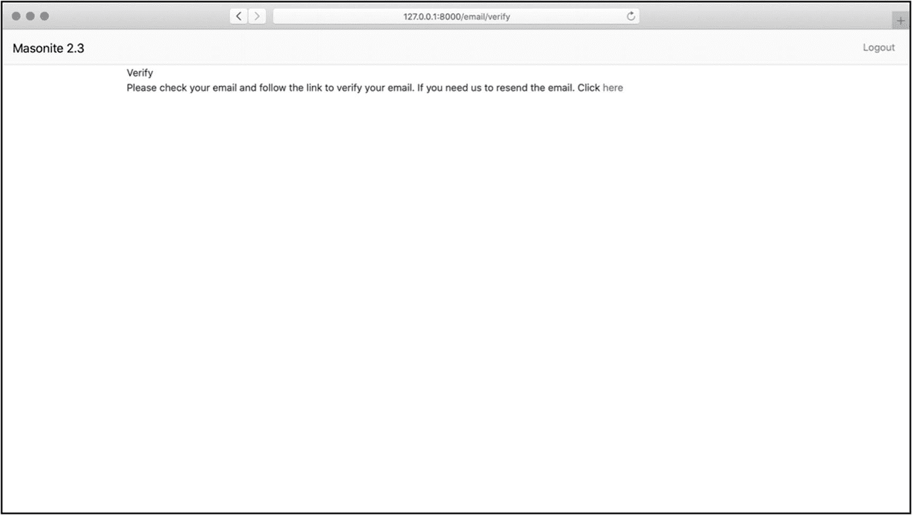

# 七、认证

在前几章中，我们学习了很多关于创建表单和使用它们填充数据库的知识。对于 web 应用来说，很常见的一件事是尝试将这种数据发送给用户帐户。

对于你所使用的服务，你可能有很多不同的“用户账户”。也许你在推特或脸书上。这些将你发布的数据和你喜欢看的东西与个性化的“身份”联系起来。

Masonite 在这方面提供了很多工具，这样我们就不必每次构建这些用户注册系统时都做繁重的工作。因此，在这一章中，我们将学习如何使用这个工具。

## 我如何认证用户？

您可能会惊讶地发现，我们已经使用了认证用户所需的所有不同位。需要明确的是，有许多不同种类的身份验证。

我们将要学习的这种方法将用户凭据与数据库记录进行比较，并记住有效凭据的存在，这样用户就可以在未经身份验证的用户无法到达的地方移动。

为此，我们将了解 Masonite 如何帮助我们建立接受这些凭证的安全表单。我们将查看一些代码，这些代码将凭据与数据库中的凭据进行比较，并告诉我们用户凭据是否有效。

最后，我们将看到成功的登录是如何被“记住”的，并且还可以与其他数据库记录结合使用。

## 使用提供的工具

此代码可在 [`https://github.com/assertchris/friday-server/tree/chapter-8`](https://github.com/assertchris/friday-server/tree/chapter-8) 找到。

我们需要做的第一件事是使用 craft 命令生成一些新的与 auth 相关的文件:

```py
craft auth

```

这做了很多，所以让我们来看一下每一部分。首先，它创建了一系列新路由。我们可以在已经定义的路由之后看到它们:

```py
ROUTES = ROUTES + [
    Get().route('/login', 'LoginController@show').name('login'),
    Get().route('/logout', 'LoginController@logout').name('logout'),
    Post().route('/login', 'LoginController@store'),
    Get().route('/register', 'RegisterController@show').name('register'),
    Post().route('/register', 'RegisterController@store'),
    # Get().route('/home', 'HomeController@show').name('home'),
    Get().route('/email/verify',
'ConfirmController@verify_show').name('verify'),
    Get().route('/email/verify/send', 'ConfirmController@send_verify_email'),
    Get().route('/email/verify/@id:signed', 'ConfirmController@confirm_email'),
    Get().route('/password', 'PasswordController@forget').name('forgot.password'),
    Post().route('/password', 'PasswordController@send'),
    Get().route('/password/@token/reset', 'PasswordController@reset').name('password.reset'),
    Post().route('/password/@token/reset', 'PasswordController@update'),
]

```

这是来自`routes/web.py`。

使用`ROUTES = ROUTES + [...]`插入代码的方式意味着它不会覆盖现有的路由。您可能希望更改这些内容的添加格式。

例如，您可能更喜欢将它们放在一个组中。没关系。只要确保它们指向相同的控制器，并相应地调整您调用的 URL。

`auth`命令做的下一件事是生成这些控制器。主要的是`RegisterController`和`LoginController`，主要是因为大部分“认证”工作都是在其中完成的。`RegisterController`提供显示注册表单和保存用户帐户的操作。

`LoginController`提供显示登录表单和根据数据库记录检查凭证的操作。

奇怪的是“检查这些凭证”方法被命名为`store`，但是这可能是为了与 POST 请求使用的其他动作保持一致。

其他控制器用于密码重置和电子邮件验证——内置的强大功能，但完全是可选的。

请随意重命名这些控制器及其动作，使它们更容易被您理解。只要记得更新相关的路由，所以一切都保持工作。

第三个变化是`auth`添加的视图。它们都放在`resources/templates/auth`文件夹中，并与新控制器中的动作相对应。花些时间浏览一下控制器和模板，感受一下它们是如何组合在一起的。

## 等等，我不是已经看过“用户”的东西了吗？

您可能已经注意到了代码库中一些与用户相关的文件，特别是`User`模型和`CreateUsersTable`迁移。这些在所有新的 Masonite 安装中都存在，部分原因是 auth 配置也存在(并且依赖于模型，而模型依赖于迁移的存在)。

这是一个奇怪的依赖链，但它意味着新鲜的应用包括拼图的一小部分，其余部分来自`craft auth`。

在使用注册和登录表单之前，我们需要确保所有内容都已迁移:

```py
craft migrate:refresh --seed

```

如果您在这里遇到错误，请记住您需要安装一个 MySQL 驱动程序(使用`pip install mysqlclient`)并在`.env`中配置正确的数据库细节。

您现在应该会看到一个`users`表，这是`User`模型获取和放置数据的地方。让我们创建一个新账户，运行`craft serve`，进入注册页面，如图 [7-1](#Fig1) 所示。


图 7-1

创建新用户

这应该会让我们自动登录，但是万一没有登录(或者你想稍后登录)，我们可以转到`/login`页面(图 [7-2](#Fig2) )并在那里使用相同的凭证。


图 7-2

登录

注意在`users`表中有一条新记录。那是你！

## 我如何使用不同的字段？

默认情况下，`email`字段用于识别用户。这是将在登录方法中使用的字段名称:

```py
auth.login(request.input('email'), request.input('password'))

```

这是来自`app/http/controllers/LoginController.py`。

根据您使用的 Masonite 版本，您的模型可能为此定义了一个常数:

```py
__auth__ = 'email'

```

这是来自`app/User.py`。

同样，根据您的版本，各种新控制器可能会使用此常量作为字段名称:

```py
auth.login(
    request.input(auth_config.AUTH['model']. __auth__),
    request.input('password')
)

```

这是来自`app/http/controllers/RegisterController.py`。

我更喜欢所有的引用都使用相同的值，所以如果我看到多种变化，我会把它们都改为使用常量或硬编码的值。我建议您也这样做，这样代码更容易理解。

在任何情况下，这都是 Masonite 将登录凭证与现有数据库记录进行比较的方式。这也意味着我们可以把“电子邮件”换成另一个领域。核心身份验证代码引用常量，因此我们可以更改它:

```py
__auth__ = 'name'

```

这是来自`app/User.py`。

```py
if auth.login(
    request.input(auth_config.AUTH['model']. __auth__),
    request.input('password')
):

    return request.redirect('/home')

```

这是来自`app/http/controllers/LoginController.py`。

如果您要更改这个字段，我建议您将任何字段切换为唯一字段。您可以在迁移级别和验证级别做到这一点。

## 如何让用户自动登录？

`RegisterController`是让用户自动登录的一个很好的例子，但这不是唯一的方法。假设我们知道用户是谁，但是手头没有他们的登录凭证。在这种情况下，我们可以通过他们的 ID 登录他们:

```py
auth.login_by_id(user.id)

```

原来，可能有这样的情况，您拥有用户(和他们的 ID)，他们需要做一些需要认证的事情，但是您不希望他们保持登录状态。

`auth`对象也有一个`once`方法，它让用户登录，而不“记得”他们已经登录，在后续请求中:

```py
auth.once().login_by_id(user.id)

# ...or

auth.once().login(
    request.input('email'),
    request.input('password')
)

```

## 注销用户

虽然我们的主题是让用户登录，但是知道用户可以用另一种方法注销也是有用的:

```py
def logout(self, request: Request, auth: Auth):
    auth.logout()
    return request.redirect('/login')

```

这是来自`app/http/controllers/LoginController.py`。

## 使用令牌(JWT)而不是凭据

Masonite 提供不同的认证方式。我们的应用实际上只需要凭证身份验证，但是知道 JWT(基于令牌)身份验证也受支持是很有用的。

查看官方文档了解更多关于配置它的信息: [`https://docs.masoniteproject.com/security/authentication#jwt-driver`](https://docs.masoniteproject.com/security/authentication%2523jwt-driver) 。

## 如何保护我的部分应用？

让用户登录到您的应用与保护部分内容不被未登录的用户看到和/或使用密切相关。让我们来看看几种“保护”应用的方法。

第一种方法是在我们运行`craft auth`命令时介绍给我们的。再看`HomeController`:

```py
def show(self, request: Request, view: View, auth: Auth):
    if not auth.user():
        request.redirect('/login')

    return view.render('home', {
        'name':
              request.param('name') or request.input('name'),
    })

```

这是来自`app/http/controllers/HomeController.py`。

当我们对用户是否登录感到好奇时，我们可以将`auth: Auth`对象引入到我们的操作中。`auth().user()`要么为空，要么有一个与当前登录用户相关联的`User`模型对象。

这是有效的，但我猜它会导致大量的重复。此外，我们可能会忘记将它添加到所有需要它的操作中。当我定义路由时，我发现决定一个动作是否应该被“保护”要容易得多:

```py
RouteGroup(
    [
        Match(['GET', 'POST'], '/@name', 'HomeController@show').name('with-name'),
Match(['GET', 'POST'], '/', 'HomeController@show').name('without-name'),
    ],
    prefix='/home',
    name='home-',
    middleware=['auth'],
),

```

这是来自`routes/web.py`。

我们可以在路由组中组织受保护的路由，并为整个组定义一个`middleware`参数。`auth`中间件内置在 Masonite 中，所以我们不必自己定义。

我们没有花太多时间学习中间件，但这是下一章的主题，所以我们将深入探讨。

或者，我们可以保护个别路由:

```py
Match(['GET', 'POST'], '/home', 'HomeController@show')
    .name('without-name')
    .middleware('auth'),

```

这是来自`routes/web.py`。

这两种方法(命名参数和`middleware`方法)都接受一个中间件列表或一个单独的中间件字符串。这取决于你是否想要采取声明性的方法来保护路由，或者命令性的方法来保护动作本身。

## 我如何确保有效的电子邮件？

我希望我们以简单了解一下电子邮件验证来结束本章。我不想深究其中的机制，因为我觉得 Masonite 自动生成的代码对于大多数情况来说都是惊人的。

当我们从用户那里寻找“有效”的电子邮件地址时，只有一个有效的解决方案。当然，我们可以使用表单验证来判断一个电子邮件地址*看起来*是否有效，但是知道它*是否*有效的唯一有效方法是向它发送电子邮件。

这就是电子邮件验证的目的。这是一种确保用户的电子邮件地址是他们所说的那个地址的方法，这样我们就可以与他们进行有效的沟通。

为此，`CreateUsersTable`迁移包含一个名为`verified_at`的时间戳，`auth`命令生成路由、控制器和视图，以允许用户验证他们的电子邮件地址。

要启用它，我们需要更改默认的`User`模型:

```py
from config.database import Model
from masonite.auth import MustVerifyEmail

class User(Model, MustVerifyEmail):
    __fillable__ = ['name', 'email', 'password']
    __auth__ = 'email'

```

这是来自`app/User.py`。

此外，我们需要引入一种新的中间件，它将促使用户验证他们的电子邮件地址:

```py
RouteGroup(
        [
            Match(['GET', 'POST'], '/@name', 'HomeController@show').name('with- name'),
        ],
        prefix='/home',
        name='home-',
        middleware=['auth', 'verified'],
      ),

      Match(['GET', 'POST'], '/home', 'HomeController@show')
          .name('without-name')
          .middleware('auth', 'verified'),

```

这是来自`routes/web.py`。

现在，当用户的`verified_at`字段为空时，他们将被提示验证他们的电子邮件地址，即使他们已经登录，如图 [7-3](#Fig3) 所示。



图 7-3

提示电子邮件验证

您可能需要配置 Masonite 发送电子邮件的方式，然后才能看到这些验证电子邮件: [`https://docs.masoniteproject.com/useful-features/mail#configuring-drivers`](https://docs.masoniteproject.com/useful-features/mail%2523configuring-drivers) 。在第 [11 章](11.html)中，当我们在应用中添加通知时，我们会深入研究这个配置。

## 摘要

在这一章中，我们学习了 Masonite 提供的认证工具，如何使用它，以及如何定制体验以适应我们的应用。

这是很强大的东西，毫无疑问，您将需要在您可能要构建的一些应用中使用它。最好现在就抓住它！

在下一章，我们将更深入地研究中间件。我们将了解它是如何工作的，有多少是新应用自带的，以及如何制作自己的应用。