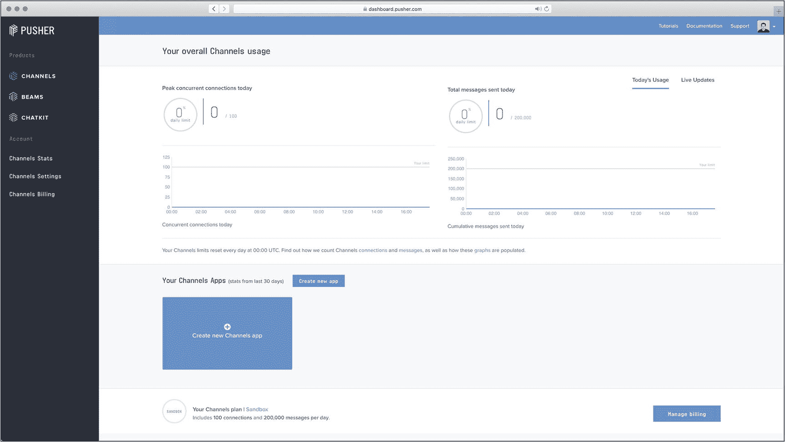

# 11.使用 Pusher 添加 Websockets

我们已经做了很多服务器端的工作，但现在是时候在浏览器中做一些工作了。具体来说，我希望我们看看如何将新信息“推”到浏览器，而不需要用户发起操作(通过单击按钮或键入消息)。

## “那不是阿贾克斯吗？”

在第 5 章中，我们谈到了创建表单，我们谈到了 Ajax 和 Websockets。概括地说，Ajax 是一种向服务器发送请求的方法，无需在浏览器中加载新的 URL，并在请求完成时更新页面的一小部分。

这是 Ajax 的简单定义，但也是它最常见的用例。当请求完成时，页面没有*需要更新。*

Ajax 和“普通”表单请求通常是用户发起的动作。有时，web 应用程序可以启动这些操作，但结果越激烈，原因越不可能是自动的。

有时候，不必等待用户操作是很有用的。想象一下，你希望收到新邮件或推文的通知，但你不想点击按钮。

你*可以*在浏览器中建立一种循环，发出 Ajax 请求，但是大多数时候它们不会显示任何新数据。这将是浪费工作，这将减缓其他类似的行动，零收益。

另一方面，Websockets 是到服务器的开放连接。服务器可以在任何时候通过 Websocket 推送新数据，而不需要用户发起动作或不必要的 HTTP 请求。

## 安装推杆

该代码可在 [`https://github.com/assertchris/friday-server/tree/chapter-13`](https://github.com/assertchris/friday-server/tree/chapter-13) 找到。

建立 Websockets 的方法有很多，但我最喜欢的是通过一种叫做 Pusher 的服务。这是一个托管的 Websocket 服务，允许从服务器向浏览器推送新事件，而无需服务器直接支持 Websockets。

我们开始吧！进入 [`https://pusher.com`](https://pusher.com) ，点击“报名”我更喜欢使用我的 GitHub 帐户，所以我需要密码保护的帐户较少。一旦你注册了，你应该被带到仪表板，如图 [11-1](#Fig1) 所示。



图 11-1

推杆仪表板

接下来，单击“创建新应用程序”按钮，您应该会看到一个弹出窗口，询问应用程序的详细信息。我选择 Vanilla JS 作为前端技术，Python 作为后端技术。

如图 [11-2](#Fig2) 所示，我还输入了“星期五”作为应用名称，并选择了一个离我最近的地区。


图 11-2

设置新的推送应用程序

### 前端集成推动器

应用程序页面显示了打开 pusher 连接所需的代码。我们先来添加前端代码:

```py
<!doctype html>
<html lang="en">
    <head>
        <meta charset="utf-8">
        <link href="/static/style.css" rel="stylesheet" type="text/css">
    </head>
    <body>
        <div class="container mx-auto p-4">
            @block content
                <!-- template content will be put here-->
            @endblock
        </div>
        <script src="https://js.pusher.com/5.0/pusher.min.js"></script>
        <script>
            Pusher.logToConsole = true;

            var pusher = new Pusher('c158052fb78ff1c7b4b2', {
                cluster: 'eu',
                forceTLS: true
            });

            var channel = pusher.subscribe('my-channel');

            channel.bind('my-event', function(data) {
                console.log(data);
            });
        </script>
    </body>
</html>

```

这是来自`resources/templates/layout.html`。

这是一个公钥，所以它可以直接出现在视图中，但是您可能想考虑将它移到`.env`文件中。通常，最好将与服务相关的键(和秘密)放在`.env`中，而不要将该文件提交给 Git。

确保用您的推动器应用密钥替换`c158052fb78ff1c7b4b2`。我已经包括了我的，所以你可以看到它的确切位置，但它不会为你的应用程序工作。

Pusher 使用通道的概念。浏览器(或者手机 app 等。)连接到他们感兴趣的通道，pusher 在这些通道内发送事件。

在这里，我们连接到`my-channel`频道并监听`my-event`事件。当我们添加服务器端代码时，我们将再次看到这些值。

### 创建命令

我们可以在很多地方触发推送事件，但我认为重新审视控制台命令是有意义的。让我们安装 Pusher 库并创建一个新的控制台命令，向所有在线浏览器发送消息:

```py
pip install pusher
craft command SendMessageToOnlineBrowsers

```

这将创建一个类似于以下内容的文件:

```py
from cleo import Command

class SendMessageToOnlineBrowsersCommand(Command):
    """
    Description of command

    command:name
        {argument : description}
    """

     def handle(self):
        pass

```

这是来自`app/commands/SendMessageToOnlineBrowsersCommand.py`。

让我们定制该命令以反映其目的，并打印一些内容:

```py
from cleo import Command

class SendMessageToOnlineBrowsersCommand(Command):
    """
    Sends a message to all currently online browsers

    send-messages-to-online-browsers
        {message : The text to send}
    """

    def handle(self):
        print("in the command")

```

这是来自`app/commands/SendMessageToOnlineBrowsersCommand.py`。

每个新的控制台命令都有一个`handle`方法，该方法在控制台命令被调用时被调用。我们需要在`craft`中注册这个命令，所以让我们在一个新的服务提供者中这样做:

```py
craft provider CraftProvider

```

这将创建一个类似于以下内容的文件:

```py
from masonite.provider import ServiceProvider

class CraftProvider(ServiceProvider):
    wsgi = False

    def register(self):
        pass

    def boot(self):
        pass

```

这是来自`app/providers/CraftProvider.py`。

提供者的`register`方法在应用程序启动时被调用，而`boot`方法仅在应用程序完全启动后被调用。区别很重要，因为放置其他提供商可能*想要*的服务的最佳位置在`register`，而放置*使用*其他服务的最佳位置在`boot`。

在这种情况下，我们想让我们的新`craft`命令*对其他提供者和服务*可用:

```py
from masonite.provider import ServiceProvider
from app.commands.SendMessageToOnlineBrowsers import
SendMessageToOnlineBrowsers

class CraftProvider(ServiceProvider):
    wsgi = False

    def register(self):
        self.app.bind(
            'SendMessageToOnlineBrowsers',
            SendMessageToOnlineBrowsers()
        )

    def boot(self):
        pass

```

这是来自`app/providers/CraftProvider.py`。

反过来，这个提供者需要在应用程序配置中注册:

```py
from .HttpClientProvider import HttpClientProvider
from .RssParserProvider import RssParserProvider
from .CraftProvider import CraftProvider

```

这是来自`app/providers/__init__.py`。

```py
# ...snip

from app.providers import (
    HttpClientProvider,
    RssParserProvider,
    CraftProvider, )

PROVIDERS = [
    # ...snip

    HttpClientProvider,
    RssParserProvider,
    CraftProvider,
]

```

这是来自`config/providers.py`。

现在，当我们运行`craft`命令时，在一个新的终端窗口中，我们应该看到我们添加的新命令，如图 [11-3](#Fig3) 所示。


图 11-3

列出新命令

并且，我们可以运行命令:

```py
craft send-messages-to-online-browsers "hello world"

```

### 后端集成推动器

好，我们有一个可以使用的命令，但是它没有使用我们发送的消息。让我们安装 Pusher 库，并在命令中使用它:

```py
pip install pusher

from cleo import Command
from pusher import Pusher

class SendMessageToOnlineBrowsersCommand(Command):
    """
    Sends a message to all currently online browsers

    send-messages-to-online-browsers
        {message : The text to send}
    """

    def handle(self):
        message = self.argument('message')

        pusher = Pusher(
            app_id='935879',
            key='c158052fb78ff1c7b4b2',
            secret='ab37b95e1648ba5c67cc',
            cluster='eu',
            ssl=True
        )

        pusher.trigger('my-channel', 'my-event', {'message': message})

```

这是来自`app/commands/SendMessageToOnlineBrowsers.py`。

如果我们再次运行该命令，我们应该会在 Pusher app 窗口中看到该消息，如图 [11-4](#Fig4) 所示。记住在布局和命令中使用你自己的按键，否则将不起作用。


图 11-4

在 pusher 中接收消息

这太酷了。我们应该在 JavaScript 控制台中看到相同的事件，从我们应用程序的任何页面，如图 [11-5](#Fig5) 所示。


图 11-5

在控制台中查看事件

## 根据收到的消息采取行动

让我们添加一个弹出窗口，它显示这些消息几秒钟。我们可以在 include 中添加标记，并从已经添加的 JavaScript 中引用它:

```py
<div
    class="
        message
        hidden flex-row items-center justify-center
        absolute top-0 left-0 p-2 m-8
        bg-blue-100 border-2 border-blue-200
    "
>
    <div class="text-blue-700">message text here</div>
    <button class="text-blue-500 ml-2">&cross;</button>
</div>

```

这是来自`resources/templates/_message.html`。

```py
@include '_message.html' <script src="https://js.pusher.com/5.0/pusher.min.js"></script>
<script>
    Pusher.logToConsole = true;

    var pusher = new Pusher('c158052fb78ff1c7b4b2', {
        cluster: 'eu',
        forceTLS: true
    });

    var channel = pusher.subscribe('my-channel');
    var message = document.querySelector('.message');
    var messageClose = message.querySelector('button');
    var messageText = message.querySelector('div');

    messageClose.addEventListener('click', function() {

        message.classList.remove('flex');
        message.classList.add('hidden');
    });

    channel.bind('my-event', function(data) {
        messageText.innerHTML = data.message;

        message.classList.remove('hidden');
        message.classList.add('flex');

        setTimeout(function() {
            message.classList.remove('flex');
            message.classList.add('hidden');
        }, 1000 * 5 /* 5 seconds */)
    });
</script>

```

这是从`resources/templates/layout.html`开始的。

我们定制了 JavaScript 来查找消息 HTML 元素，并在新消息到来时使它们可见。用户可以选择通过点击“关闭”按钮来关闭消息，或者消息会自动消失。

## 摘要

在本章中，我们学习了如何安装和使用 Pusher。还有一些其他有趣的推送功能，如频道存在和私人频道，但它们更复杂一些。也许这是进一步学习 Websocket 的好地方！

Websockets 是一个强大的工具，也是我经常使用的工具。想想你能告诉用户的所有事情，通过一个永久开放的直接连接到他们的浏览器。