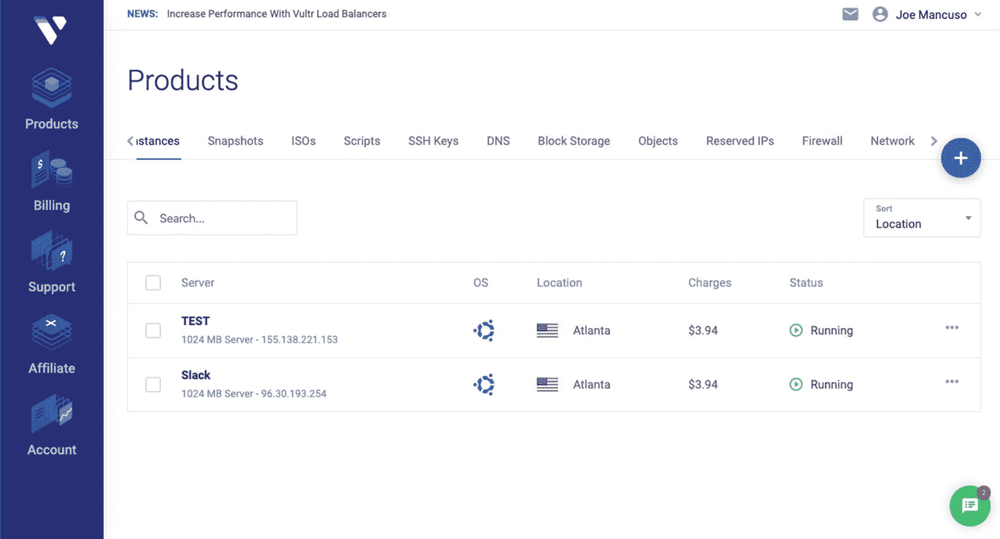
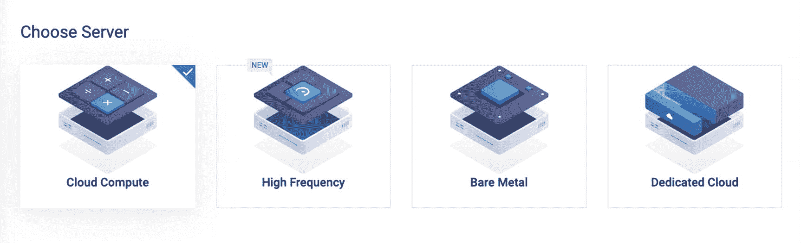
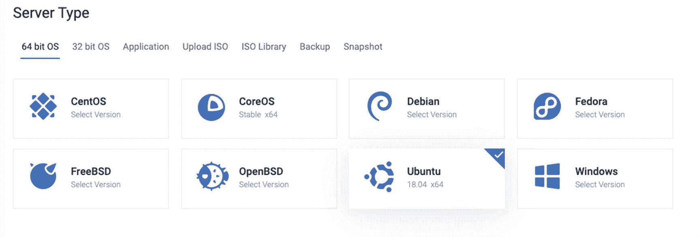
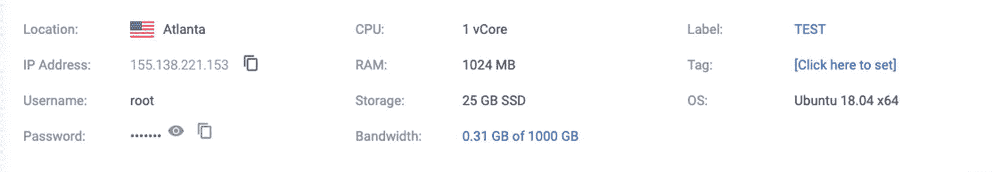
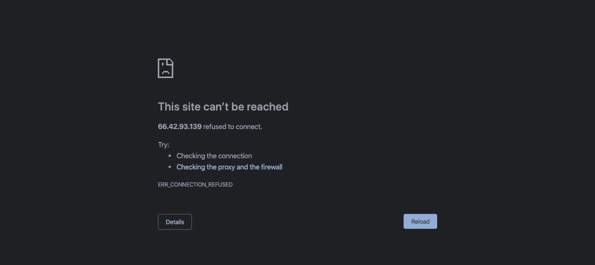
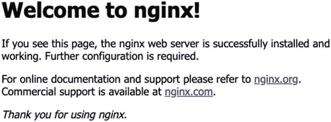

# 13.部署 Masonite

有许多服务使应用程序的生命周期变得极其简单。这些服务包括像 Heroku 或 Python anywhere 这样的东西。在这一章中，我们将主要关注手动部署您的应用程序，从底层开始，通过配置服务器、安装所需的软件，以及安装和运行我们的应用程序。如果你知道如何做这些低级的任务，并了解更大的画面，那么你可以很容易地弄清楚如何使用像 Heroku 这样的点击系统。

需要注意的是，本章的某些部分需要一种支付方式来设置服务器和部署应用程序。

## 请求生命周期

让我们来谈谈当你在网络浏览器中输入一个域名并点击回车会发生什么。一旦我们做到这一点，你应该有足够的背景信息来开始适应我们的生命周期。

当你在网络浏览器(如 Chrome 或 Firefox)中输入`masoniteproject.com`并按回车键时，网络浏览器将建立一个请求。该请求包含一组标头形式的元信息。此时，我们的请求继续执行一项任务，将`masoniteproject.com`转换成 IP 地址，这样互联网就知道如何将该请求定向到服务器。

我们可以通过查找 DNS(域名系统)来完成这种转换。在我们的本地计算机上有一个域系统(想想你的主机文件)，在我们的内部网络上有一个域系统(想想公司是如何屏蔽某些网站或者让某些网站只能从办公室内部访问)，然后在互联网层面上有一个域系统(想想 Cloudflare 或者 Namecheap DNS)。

假设我们在本地或内部网络级别没有特殊指令，该请求(仍在搜索 IP 地址)将发送到 Cloudflare。Cloudflare 是一家 DNS 提供商，由于其慷慨的免费计划而非常受欢迎。Cloudflare 收到请求，查看他们自己的系统，然后说“好的，我这里有一个 IP 地址为`17.154.195.7`的`masoniteproject.com`的记录”。

此时，请求就知道该去哪里了。然后，互联网将该请求路由到 Vultr 上的服务器。该请求连接到服务器，然后将所有 web 流量定向到一个端口，通常是端口 80。有一个名为 NGINX 的应用程序监听端口 80 上的所有流量。NGINX 收到请求，说“好的，当前的域名是`masoniteproject.com`，我有一个 Python 应用程序来监听这个域的所有重定向请求。”

NGINX 将该域重定向到另一个端口，称为端口 8001 或套接字，稍后将详细介绍。

现在，这一部分很重要，并且特定于 Python 应用程序。在请求到达我们的 Masonite 应用程序之前，还需要进行另一次转换。我们需要将传入的请求转换成 Python 字典，并通过我们的应用程序发送字典。

这种中间人转换被称为 WSGI 服务器。因为请求的转换相当简单，所以已经为 Python 构建了几个。最常见的有 Gunicorn 和 uWSGI。这些也可以随时换出。Gunicorn 非常容易启动，但是 uWSGI 更容易配置，并且有许多不同的选项可以用来调整设置。

一旦完成了从请求到字典的转换，它就将字典传递给 Masonite 框架，Masonite 框架调用 Masonite 应用程序的所有相关部分，并以字节为单位返回响应。然后，WSGI 服务器将这些 Python 字节转换成 NGINX 能够理解的响应。

这个请求现在附带了一个来自 Masonite 的响应，它可以一路返回到整个流程中，但是现在反过来了。最终，请求和响应会一路返回到您的 web 浏览器，而您的 web 浏览器会将该响应转换为您所看到的内容。

既然我们知道了整个生命周期是如何工作的，我们就可以着手做我们需要做的事情，以使我们自己和我们的新应用程序适应这个生命周期。

我们需要做的主要事情如下:

*   建立网络服务器(数字海洋、Vultr 等)。).

*   在我们的网络服务器上安装特殊软件(NGINX 和其他软件包)。

*   将我们的 Masonite 应用程序放到我们的 web 服务器上(git 克隆)。

*   运行我们的 Masonite 应用程序(以便 NGINX 可以将响应定向到我们的应用程序)。

## 网络服务器

第一部分是网络服务器。传统上，这是一些公司仓库中的物理服务器，但我们已经在服务器的工作方式方面取得了很大进展，因此实际上它可能只是物理机的一个孤立部分。然而，出于解释的目的，该服务器将是物理服务器。

web 服务器实际上只是一台安装了特殊软件的普通计算机，它可以接受传入的请求，并产生一个响应发送回您的 web 浏览器。请记住这个“特殊软件”,因为我们稍后将对此进行更详细的解释。

事实上，任何计算机都可以成为 web 服务器。我个人曾经在地下室的一台台式电脑上托管我所有的网站，后来我才知道这是多么不安全，或者我离一次可能使我的互联网瘫痪或暴露一些敏感信息的攻击有多近。那是我早期编程的日子。我必须确保我的电脑一直开着。我记得我收到消息说我的网站关闭了，却发现我的台式电脑进入了睡眠状态，或者我的电源暂时中断了，我的电脑从来没有正常重启过。

现在有许多公司能以相对低廉的价格向你提供这些网络服务器。你可以每月花 5 美元左右买一台基本服务器，它可以为你托管几个网站。

个人选择的最大公司包括

*   数字海洋

*   填妥了吗

*   利诺德

许多企业选择 AWS(亚马逊网络服务)和微软这样的公司。出于本书的目的，我们将使用我个人最喜欢的:Vultr。

同样重要的是要注意，这些 web 服务器通常不包含 GUI，并且是严格基于终端的(想想最初的微软 DOS 系统或者只通过终端使用你的计算机)。这是因为 web 服务器应该只做一件事，那就是处理 web 流量。在 web 服务器上运行的任何不促进这个目标的东西都是不必要的开销，所以当你设置你的服务器时，如果你只看到一个黑色的终端屏幕，不要感到惊讶。

### 设置服务器

我们来谈谈如何设置服务器。我们将在本书中使用 Vultr。如果我们去 Vultr.com，创建一个帐户，然后去仪表板，我们会看到一个类似图 [13-1](#Fig1) 的屏幕。



图 13-1

Vultr.com 仪表板

需要注意的是，本章的其余部分需要一种支付方式来设置服务器和部署应用程序。

如果你是在 Masonite Slack 频道上做的，你会看到我们有一个服务器用于那个网站，我们也有一个服务器用于我们需要做的随机测试，比如浏览教程或模仿人们遇到的 Linux 问题。

在右上角，我们会看到一个`+`图标。当我们点击它时，我们会看到一个屏幕，上面有许多不同的选项可供选择。

#### 选项

我们需要做的第一件事是选择服务器的类型。我们目前有四种选择，如图 [13-2](#Fig2) 所示。



图 13-2

选择所需的服务器类型

我们可以选择最符合我们需要的选项，但在大多数情况下，第一个选项是好的。这是一个非常标准的盒子，我们可以在云中使用，完全符合我们的需求。

接下来，我们会看到一个我们希望服务器所在位置的列表，如图 [13-3](#Fig3) 所示。**需要注意的是，你应该选择离你的观众最近的服务器。**服务器离您的受众越近，服务器响应时间就越快。


图 13-3

选择服务器位置

如图 [13-4](#Fig4) 所示，下一步我们需要选择服务器类型。最受欢迎的选项之一是 Ubuntu。



图 13-4

选择服务器类型

最后一步是选择服务器的大小。我发现我的大多数 Masonite 应用程序都运行在大约 150MB 的内存上，你应该有一些缓冲空间，因为你的应用程序的某些部分可能比其他部分需要更多的内存，而且你也很可能会安装一个数据库，所以你可能会有峰值。我建议留出大约 20%的空闲内存，以免降低应用程序的速度。

因此，如果您选择 512MB 的服务器并留出 20%的空闲空间，那么您将有大约 409MB 的空间可以使用。其中一些空间将专用于其他应用程序，因此一台 512MB 的服务器可以运行两到三个 Masonite 应用程序。这个规则不是通用的，而是非常特定于应用程序的，所以在添加其他应用程序之前，您应该监视您的服务器性能。

在这个页面的底部有几个选项，比如设置 SSH 密钥和启动脚本，但是现在可以跳过这些选项。

#### 连接到服务器

一旦服务器完成配置(安装所有必要的操作系统软件)，我们现在就可以连接到它，并开始安装运行 Python 应用程序所需的所有东西。

当你点击刚刚构建的新服务器时，你会看到一些连接凭证，如图 [13-5](#Fig5) 所示。在左侧，您会看到“IP 地址”、“用户名”和“密码”



图 13-5

您的服务器的连接凭据

您将使用这三个设置连接到服务器并开始运行命令。如果您使用的是 Mac 或 Linux，可以使用终端自带的内置`ssh`命令。如果你用的是 Windows，你就需要用油灰之类的东西。

我发现大多数开发人员使用 Mac 和 Linux，所以我们将演示连接到服务器的这条路线。

首先，在 Mac 或 Linux 机器上打开终端并运行以下命令:

```py
$ ssh {username}@{host}

```

用您在控制面板中看到的用户名和 IP 地址替换用户名和主机。一旦运行，您将看到另一个提示，要求您输入密码。回到您的控制面板，单击眼睛显示您的密码，或者单击复制图标复制密码。将密码粘贴到提示符中，您的终端将变成服务器的终端。您应该会看到类似这样的内容:

```py
Last login: Sun Feb 16 13:39:21 2020 from 69.119.199.3
root@{server name}:~#

```

恭喜你！您已经连接到服务器，我们现在可以开始安装您需要启动和运行的一切。让我们继续安装任何需要的软件。

## 网络服务器软件

在上一节中，我们说过将更详细地解释“特殊软件”。web 服务器需要安装一些软件来告诉它应该如何处理进入它的 web 流量。web 服务器软件有两个主要参与者。

首先是 **NGINX** 。根据我的经验，这是目前最流行的网络服务器软件。在过去的十年里，它真的在 web 服务器领域占据了主导地位。NGINX 的设置非常简单，并且根据其配置文件的风格，具有极强的可扩展性和可插拔性。我们将使用这个选项来部署我们的 Masonite 应用程序。

第二个是**阿帕奇**。这是一个有点老的标准软件，人们曾经使用过，现在许多公司还在使用。它当然不再受 NGINX 的青睐，但仍然是一个可行的选择。与 NGINX 相比，它的设置时间要长一些，配置起来也要困难一些。

这个软件为我们的用例工作的方式是，它简单地接受传入的请求，并将其重定向到服务器上的特定应用程序。例如，我们可能有一个 Laravel PHP 应用程序和一个 Python Masonite 应用程序；NGINX 会将请求发送到每个服务器。

Web 服务器软件还可以做许多其他事情，如负载平衡、电子邮件服务器代理，以及在许多其他协议上执行通信，但就我们的目的而言，它只是将请求重定向到我们的应用程序中。

为了这本书，我们将与 NGINX 合作。

### 安装 NGINX

我们需要做的第一件事是安装 NGINX。请记住，这个软件负责接收一个传入的请求，将其路由到正确的应用程序以获得响应，然后将其发送出去，最终返回到您的浏览器。

因此，如果我们测试这个流程，现在我们可以看到有一个断开。只要进入你的浏览器，输入你从 Vultr 仪表板上得到的 IP 地址。您将看到如图 [13-6](#Fig6) 所示的错误页面。



图 13-6

重定向错误消息

因此，让我们安装 NGINX，这样我们就可以让这个功能正常工作。

在我们安装任何东西之前，我们需要更新我们的 Ubuntu 包目录:

```py
$ apt-get update

```

接下来，我们可以简单地安装 NGINX。只需运行以下命令:

```py
$ apt-get install nginx

```

让安装步骤运行。如果你被提示一个是或否的问题来确认你是否想安装 NGINX，只需输入 Y 并按回车键。

安装完成后，我们可以回到网络浏览器，再次输入我们的 IP 地址。我们现在将看到一个 NGINX 加载页面:



请记住，NGINX 必须将请求重定向到某个地方才能得到响应，所以在 NGINX 安装的同时，NGINX 还会向服务器发送一些静态网页，以确认它安装正确。

NGINX 需要一些额外的配置，但是我们会在我们的新服务器上安装我们的应用程序时进行配置。

## 设置 Python 软件

如果您以前安装过 Masonite，您可能会阅读安装 Masonite 的文档。

您需要的 Linux 包有

*   python3-dev

*   python3-pip

*   libssl-dev

*   构建-基本

*   python3-venv

*   饭桶

当使用之前的`apt-get install`命令时，您可以通过在每个包之间使用一个空格来同时安装它们:

```py
$ apt-get install python3-dev python3-pip libssl-dev build-essential
python3-venv git

```

安装完成后，您就拥有了启动和运行 Masonite 所需的一切。

## 配置 NGINX

我们需要做的下一步是告诉 NGINX 将请求重定向到哪里。为此，我们需要稍微配置 NGINX。幸运的是，我们只需要添加几行配置。

为了找出我们需要在哪里添加这个配置，我们需要检查我们的主 NGINX 配置文件。我们可以通过运行找到这个位置

```py
$ nginx -t

```

这个`-t`标志将测试配置文件，但也方便地输出其位置。我们应该会看到这样的结果:

```py
root@{server name}:~# nginx -t nginx: the configuration file
/etc/nginx/nginx.conf syntax is ok nginx: configuration file
/etc/nginx/nginx.conf test is successful

```

这个`/etc/nginx/nginx.conf`位置是我们的 NGINX 配置所在的位置，所以我们可以打开它来找到放置我们的几行应用程序配置的位置。

让我们通过运行以下命令来查看该文件的内容

```py
cat/etc/nginx/nginx.conf

```

cat 命令将显示文件的内容。如果我们向上滚动一点，我们会看到这样一个部分:

```py
  ##
  # Virtual Host Configs
  ##

  include /etc/nginx/conf.d/∗.conf;
  include /etc/nginx/sites-enabled/∗;

```

除了所有的配置设置，还有这两行。这些将只是在这些位置附加任何配置文件。因此，我们可以将我们的配置添加到这些目录中，而不是将所有内容添加到这个文件中并拥有一个巨大的配置文件，它们将自动添加到这里，以便 NGINX 读取配置。

现在我们可以转到这个目录，开始构建我们的应用程序配置文件:

```py
$ cd /etc/nginx/sites-enabled
$ nano example.com.conf

```

`nano`命令将为您提供一个基于终端的编辑器，您可以使用它来创建文件。我通常每个域名都有一个 web 应用程序，所以无论您希望您的域名被称为什么，您都可以输入它而不是“example.com ”,但是您可以随意命名这个文件。

如果我们想关闭编辑器，我们可以按“Ctrl+X”，输入 Y，然后按 Enter。

现在您应该看到一个空白编辑器。让我们开始构建我们的配置文件。我将展示完整的文件，我们将逐行查看:

```py
server {
    listen 80;
    server_name {ip address};

    location / {
        include uwsgi_params;
        uwsgi_pass unix:///srv/sockets/{example.com}.sock;
        proxy_request_buffering off;
        proxy_buffering off;
        proxy_redirect off;
    }
}

```

为了避免部署过程中的额外步骤，我们将使用套接字。套接字只是一些文件，NGINX 和我们的 WSGI 服务器都可以通过这些文件来获取它们需要的必要信息。这样，我们就不用监听端口，也不需要在部署之间重启应用程序。这将改善停机时间。

因此，从上到下，我们有所谓的“服务器块”这只是一组配置。请记住，这基本上会包含在主 NGINX 配置文件中，因此需要将它封装在一个块中，以隔离这些设置。

接下来我们看到的是一首`port`来听。这很可能始终是端口 80，因为默认情况下，所有 web 流量都将在端口 80 上传输。

下一行是一个`server_name`。如果你有域名，你可以在这里输入。如果没有，你可以简单地把服务器的 IP 地址放在这里。

接下来，我们有另一个块，但这次是一个`location`块。我们希望所有的流量都指向我们的应用程序，所以我们将放置一个基本位置`/`。

在这个块中，我们将设置特殊的头，我们的 WSGI 服务器将需要这些头来构建我们的 Python 字典，并将其传递给 Masonite 框架。

接下来是一条`uwsgi_pass`线。这将把流量流式传输到一个套接字文件，我们的 WSGI 服务器也将从该文件流式传输。所以这是 NGINX 和我们的 WSGI 服务器之间的通信点。这一行实际上以`unix://`开始，其后的所有内容都是一个目录路径。我们将`/srv/sockets/`设置为保存所有套接字的目录。

最后，我们有一些代理设置，用于配置连接的一些行为。

配置完成后，我们可以点击“Ctrl+X”关闭编辑器，输入 Y，然后点击 Enter。

### 重新安置 nginx

您可能还需要重新加载 NGINX，这样我们就可以运行另一个简单的命令:

```py
$ nginx -s reload

```

#### 测试一切正常

现在，您可以在浏览器中返回到您的 IP 地址，以确保一切正常。如果你把你的 IP 地址放入你的应用程序配置中，你应该会看到一个网关错误，如图 [13-7](#Fig7) 所示。


图 13-7

错误的网关错误消息

这是一件好事。这意味着 NGINX 正在尝试与我们的 Masonite 应用程序(没有正确安装)正确通信。

### 设置任务

我们放入配置文件中的一些东西还不存在，比如`/srv/sockets`目录。所以我们现在就能做到:

```py
$ mkdir -p /srv/sockets

```

我们还需要确保 NGINX 和我们的应用程序都有权限访问这个目录，这样我们就可以运行另一个简单的命令:

```py
$ chmod 0777 /srv/sockets

```

## 设置我们的应用程序

好了，现在我们终于可以进入正题了——设置我们的 Masonite 应用程序。

我个人喜欢把所有东西都放在一个目录里，以保持整洁。现在让我们创建目录:

```py
$ mkdir -p /srv/sites

```

现在我们可以将我们的存储库克隆到这个目录。该示例回购将在 GitHub 上托管，因此我们的链接将如下所示:

```py
$ git clone https://github.com/username/repo.git example
$ cd example

```

用你的 GitHub 项目的用户名和 repo 替换`username`和`repo`。如果你没有，你可以使用`masoniteframework`和`cookie-cutter`分别作为用户名和回购。

这将把我们的应用程序放在一个`/srv/sites/example`目录中。

## 运行应用程序

我们要做的下一件事是安装并运行我们的应用程序。这部分你已经习惯了，在你的机器上开发和这个服务器之间没有太多的变化。我们只需要再次创建一个虚拟环境，并安装我们的 Python 包:

```py
$ python3 -m venv /venvs/example
$ source /venvs/example/bin/activate
$ pip install -r requirements.txt

```

我们的 Masonite 应用程序现在应该完全安装好了，我们现在可以运行它了。

为了运行我们的应用程序，我们将使用`uWSGI`。我们现在可以安装`uWSGI`并运行一个简单的命令来开始:

```py
$ pip install uwsgi $ uwsgi
--socket /srv/sockets/example.com.sock --wsgi-file wsgi.py \
    --chmod-socket=777 --pidfile /srv/sockets/example.com.pid &>
/dev/null &

```

只要确保这个套接字的位置与您在应用程序配置文件中放置的套接字的位置相同。我们还使用了一个`--chmod-socket`命令，它将给予 uWSGI 正确的权限。权限的事情有点棘手，没有它，你会遇到奇怪的问题，看起来好像应用程序没有运行。您将继续得到 502 错误。

我们有一个`--wsgi-file wsgi.py`行，它简单地运行所有 Masonite 应用程序根目录中的`wsgi.py`文件。这是需要通过 WSGI 服务器运行的 Masonite 应用程序的入口点。

您还会注意到结尾有一个奇怪的`&> /dev/null &`语法。这告诉 uwsgi 在后台运行这个命令。这样，我们可以退出服务器或执行其他服务器操作，但应用程序仍在运行。

你还会注意到我们放了一个`--pidfile`标志。它的作用是将文件连接到应用程序的这个实例。问题在未来；我们可以随时通过简单地杀死 PID 文件来杀死它。

如果前面的步骤由于某种原因不起作用，您可以检查 NGINX 的错误日志。错误日志很可能位于`/var/log/nginx/error.log`处，可以通过运行

`$ cat /var/log/nginx/error.log`

使用文件的内容开始调试任何问题。

如果路径不存在，您可以在主 nginx 配置文件中找到该路径，如下所示

`error_log /var/log/nginx/error.log;`

现在，您终于可以在 web 浏览器中最后一次访问服务器了，您将看到您的 Masonite 应用程序正在运行！

这里需要注意的是，运行服务器并不像将 web 应用程序放在服务器上并运行它们那么简单。维护服务器包括安全更新、管理部署和文件权限，以及保持第三方服务(如数据库、管理程序等)的运行。您必须管理您的应用程序的正常运行时间。如果出现任何问题，您将需要 SSH 回到服务器并调试问题所在。

让像 Heroku 这样的第三方服务为你管理这一切可能更明智。启动计划开始于每月几美元的低费用。

## 部署

在上一节中，我们解释了如何设置服务器和执行部署。您将使用两种类型的部署:手动部署和自动部署。

手动部署是当您 SSH 回到服务器时，终止您的应用程序的以前运行的实例，然后启动新的实例。

自动部署是指服务在您启动并运行新版本的应用程序之前执行所有这些步骤。这些操作可能是当一个新的提交被提交到你的主分支或者当你删除一个新的发布时。

### 手动部署

如果您想要执行手动部署，您将 SSH 回到您的服务器，终止 PID 文件，更新代码库，然后重新运行 uWSGI serve 命令。

例如，当我们第一次启动我们的应用程序时，我们有一个这样的标志:

```py
--pidfile /srv/sockets/example.com.pid

```

这将我们正在运行的应用程序的生命线连接到这个 PID 文件的生命线。杀死 PID 文件也就杀死了应用程序。您可以通过运行以下命令来终止 PID 文件

```py
uwsgi --stop /srv/sockets/example.com.pid

```

既然应用程序已经死了，就不能再访问它了。我们现在可以重新启动应用程序。

1.  激活应用程序的虚拟环境:

    ```py
    source /venvs/example/bin/activate

    ```

2.  转到目录并获取新的代码更改(这取决于您想要部署的分支或提交):

    ```py
    $ cd /srv/sites/example
    $ git pull -f https://github.com/username/repo.git master

    ```

3.  安装任何新要求:

    ```py
    $ pip install -r requirements.txt

    ```

4.  运行`uwsgi`命令启动“运行应用程序”一节中描述的应用程序:

    ```py
    $ uwsgi --socket /srv/sockets/example.com.sock --wsgi-file wsgi.py \
        --chmod-socket=777 --pidfile /srv/sockets/example.com.pid &> /dev/null &

    ```

### 自动部署

如果您愿意，也可以使用许多自动部署。有许多服务可以为你做到这一点，这些服务在网上有很好的记录，试图在这本书里复制这些记录是不明智的，但我最喜欢的是 Heroku。这是一个非常简单的服务，通常只需在本地点击很少的终端命令就可以让你的服务启动并运行。

您也可以查看 Masonite 文档，了解获取其他形式的自动部署的其他链接，例如在 GitHub 上执行提交或剪切发行版，这将为您完成本章中的大部分步骤。链接可以在主要的在线文档中找到。