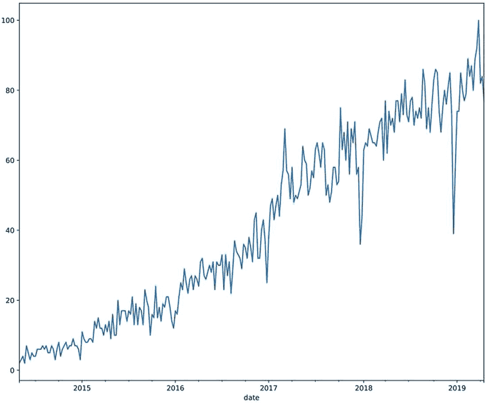
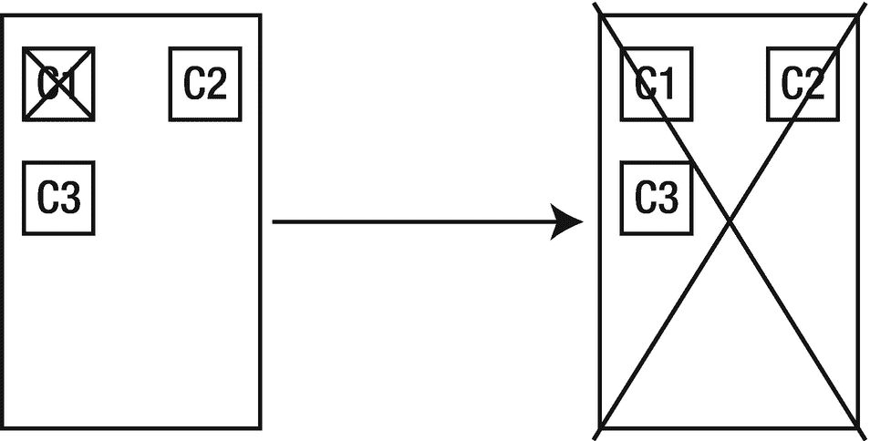
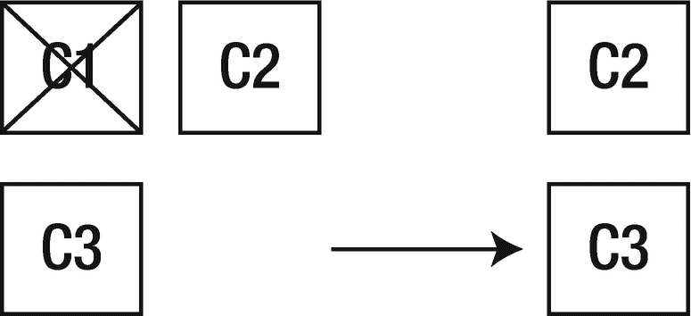

# 一、什么是服务？

早在农业革命之前，服务就已经存在于人类之中。每当我们走进商店或餐馆，我们都在使用一种服务。有些服务比其他服务更复杂，提供给我们的商品更符合我们的口味，或者需要更少的工作，而有些服务更专业，专注于一项任务，并且做得非常好。让我们看一个简单的例子。

市场和餐馆都可以算作服务，尽管它们提供给我们不同的东西，但它们都给我们一般的食物。当你进入一个市场，你可以从各种各样的卖家那里买到各种各样的食材。之后，你可以在家里将所有这些材料组合成你喜欢的各种菜肴。然而，一家豪华的餐馆会为你提供现场制作的美味佳肴。在餐馆的后台有许多流程和系统在工作，其中大部分你都不知道，但是在你的请求被处理后，你的饭菜就被送到了。

当我们谈论服务时，餐馆/市场摊位的类比只是我们可以提出的众多类比之一。从概念上讲，它们的工作方式与软件中的服务相同。

1.  您，即客户端，向服务发出请求。

2.  服务，在我们的例子中是餐馆，接收你的订单。

3.  后台的一些算法和过程(菜谱和厨师)会为你准备一个回应。

4.  您会收到上述回复(至少在大多数情况下)。

一个服务可以是你的应用，它通过人们的电话提供他们昨天离家次数的信息。或者一个服务可以是一个大规模的持续集成系统，你只能看到运行你的应用测试的一小部分。服务也可以是软件中的小东西，一个提供接口获取匈牙利布达佩斯时间信息的应用。

在本书中，我们将重点关注驻留在 web 上的服务，为最终用户和其他内部服务提供数据。让我们先来看看行业中出现的不同定义。

## 服务行话

在过去的几年中，围绕服务设计、软件即服务、微服务、单片、面向服务的体系结构等等有很多讨论。在下图中，可以清楚地看到微服务越来越受欢迎。图 [1-1](#Fig1) 提供了过去五年谷歌搜索“微服务”的图形视图。

图 1-1

2014 年以来“微服务”一词的流行，谷歌

在接下来的几节中，我们将试着弄清楚其中每一个的含义，以及当你在这样的系统中工作时需要记住的重要术语。请记住，这些术语不是刻在石头上的。

### 软件即服务

术语“软件即服务”(或 SaaS)主要描述一种许可模式，在这种模式下，你可以为某种在线服务的使用付费。这些软件中的大部分都存在于云中，并为最终用户提供各种方式来修改和查询他们系统中的数据。Spotify 就是一个例子，这是一个在线音乐流媒体软件，最终用户可以用它来听音乐和创建自己的播放列表。此外，Spotify 有一个广泛的软件界面和软件包，工程师可以使用它们以编程方式获取和修改 Spotify 云中的数据。

### 面向服务的架构

面向服务的架构(或 SoA)可能是业界最受欢迎的术语之一。简单地说，这种风格的架构设计比任何东西都更支持服务。正如我们在上面所了解的，服务需要服务于某种业务需求，并且需要围绕现实世界的需求进行建模。服务需要是自包含的，并且有一个干净的接口，通过它可以进行通信。它们是独立部署和开发的，在抽象层次上代表一个功能单元。该架构还涉及这些服务之间使用的通信协议。一些软件即服务公司使用面向服务的架构向他们的最终用户交付高质量的产品。

### 整体服务

对软件工程师来说，这是十年来最可怕的词汇之一。单一的应用和单一的服务是单一的服务，它们增长得太大了，以至于无法进行推理。“太大”到底意味着什么，将是本书的核心话题之一。我们还会看到，这个可怕的词不一定意味着不好的事情。

### 微服务

软件工程师十年来的另一个可怕的词(尽管原因不同)。简而言之，微服务是一种存在于面向服务的架构中的服务，并且易于推理。这些是松散耦合的轻量级组件，具有定义良好的接口、单一用途，并且易于创建和处理。由于细粒度的性质，更多的人可以并行处理它们，特性的所有权成为组织要解决的一个更干净的问题。

现在，我们已经看了一下高层次的定义，让我们深入研究一下独石。

## 了解整块石头

正如我们所了解到的，monoliths 是一个开发人员甚至一个开发团队都难以理解的庞大的代码库，其复杂性已经达到了一个程度，即使只更改几行代码也会在其他部分产生意想不到的未知后果。

首先，我们需要在这里打下一个基础，那就是独石本身并不坏。有许多公司已经在单片应用上建立了成功的 IT 业务。

事实上，独石实际上对发展你的业务很有帮助。只需很少的管理费用，您就可以为您的产品添加更多的功能。在 IDE 中只需几个组合键就可以轻松导入模块，这使得开发变得轻而易举，并让您对向雇主交付大量代码(无论是高质量还是低质量)充满信心。就像生活中的大多数成长过程一样，公司和软件需要快速启动并经历快速迭代。软件需要快速增长，这样企业才能得到更多的钱，这样软件才能增长，这样企业才能得到更多的钱。你会看到它在哪里生长。所以下次你参加一个会议，听到一个演讲者说独石是旧设计的系统，一定要半信半疑。顺便提一句，我想说的是，如果你的初创公司正在努力维护你的遗留单片应用，这通常是一个健康业务的标志。

然而，趋势表明，随着时间的推移，软件的可靠性和可伸缩性变得越来越重要，这种快速增长往往会放缓。拥有单个应用可能会为您的团队赢得快速部署和易于维护的基础设施，但这也意味着单个工程师的错误可能会导致整个应用瘫痪。越多的人开始在一个应用上工作，他们就越开始干扰彼此的工作，他们就越需要进行不必要的交流，他们就越需要等待他们的构建和部署。

想象一下下面的情况:你是一名基础设施工程师，在一家通过互联网提供视频流服务的公司工作。该公司正在挣扎，但不知何故，CMO 设法让你的国家的政府流总统选举演讲。这对你的公司来说是一个惊人的增长机会，所以有大量的投资进入，以确保系统很好地承担负载。在活动开始前的几周，你已经做了大量的负载测试，并指示后端工程师修复某些不能正常运行的代码部分。你已经说服首席运营官投入一些钱到更重的基础设施上，这样系统的负荷就会减轻。演讲的一切看起来都很完美，你和你的同事在活动期间焦急地等待着，以体验你在过去几周如此专注地工作的奇迹。然后它发生了。就在演讲之前，溪流停止了。你完全不知道发生了什么，并开始疯狂地寻找答案。你试着用 SSH 连接到机器上，但没有成功，被无情地拒绝了，时间一分一秒地过去。停电已经 13 分钟了，演讲也快结束了。Twitter 在你的公司上贴上可以观看总统演讲的标签，并指责首席执行官的无能。盛怒之下，决定硬重启你正在使用的云提供商网站上的机器，但为时已晚。活动结束了。数百万人感到失望，该公司的状况不太好，无法获得下一轮投资。两天后，你回去工作，开始调查发生了什么。原来，ads 团队在 2 天前推出了一些更改，导致后端应用出现内存泄漏。服务器上的内存已满，阻塞了所有进程。这时，您开始梦想公司的基础设施有一个更好、更可靠的未来。

图 [1-2](#Fig2) 简单展示了该视频流公司在应用中发生的事情。

图 1-2

由紧密耦合的损坏组件导致的全面停机

上面的故事，尽管完全是虚构的，却发生在每个成功的软件系统和每个成功的软件公司的生命周期中。如果你认为脸书或谷歌在其一生中从未在重要时刻出现过长达一小时的宕机，那你就大错特错了。你可以在网上找到关于各种谷歌 [1](#Fn1) 宕机的文档，其中(有时)详细描述了系统的哪些部分导致了这个和那个部分在这段时间内宕机。在这些中断之后，他们学习、适应并使他们的系统更有弹性，这样同样的问题就不会再次发生。

许多人没有想到单片应用的一个方面，我喜欢称之为“单片瀑布”或“级联单片”架构。这基本上意味着当你在一个单一的应用上工作时，你几乎被鼓励以一种单一的方式来设计你的代码和数据的架构。围绕你的模块设计接口变成了一件苦差事和额外开销，所以你只需要导入你需要的代码行。为订阅信息添加一个新的数据库会花费太多的时间，而且只会带来更多的复杂性，所以您需要在用户和产品信息所在的数据库中创建模型。如果你在一个整体上工作，你的代码和架构的所有层都将是整体的。自然，严格的编码指南、架构原则和富有挑战性的工程文化可以构建和维护一个具有清晰内部接口边界的整体，这个整体以后可以更容易地分解为微服务。

现在，在这一部分的结尾不提及独石的好处是不公平的。抛开上面所有的恐怖故事和消极因素，建议是利用单一模型来发展你的业务和工程。只要确保紧紧抓住方向盘，每个人都在技术债务上保持一致。

现在我们已经了解了 monolith 的外观和行为，我们将看看它在本书中的对应部分，微服务。

## 了解微服务

简单回顾一下:微服务是一个单一用途的软件应用，驻留在 web 上的某个地方，是一个小型的代码库，即使是一个工程师也可以很容易地对其进行推理。

就像我们了解到独石不是撒旦的后代一样，我们将了解到微服务也不是银弹。

让我们回到上一个故事中的基础设施工程师。事件发生后，他与公司的其他人进行了一次事后分析(如果你不确切知道那是什么，不要担心，我们将在本书的后面探讨它),并得出结论，公司可以采取的避免像几周前在新年致辞中那样的灾难的最佳解决方案之一是适应和实施基于微服务的架构，并放弃整体架构。他概述了工程师和投资者将承担的成本，并确保每个人都了解迁移的利弊。不久之后，董事会批准了这个项目。一段时间后，该公司已经有十几项服务在云中运行(仍然包括 monolith 的剩余部分)，另一场运动开始了。这一次负载很高，但系统保持了弹性。尽管聊天服务停止了，但视频播放仍然正常，这确保了公司的声誉完好无损，投资者把钱投到了好的地方。我们的工程师回到床上，知道核心业务不会再有问题，从此过上了幸福的生活。在下图 [1-3](#Fig3) 中，我们可以看到我们是如何从之前的图中失去耦合架构的，现在只有部分中断。

图 1-3

松散耦合的组件可能只会导致部分停机

就这样吗？嗯，不。在上面的故事中，我们公司有一个运行聊天系统的服务，但核心业务仍然最有可能驻留在 monolith 中。如果聊天系统在那里，这是完全可能的营销活动也将是一场灾难，导致该公司真正的结束。总之，在关键情况下，在系统中构建或提取哪怕是很小的模块都会带来巨大的成功。

当你去参加会议的时候，你会听到很多这样令人惊奇的故事，我自己也讲过几个。在大多数成功故事中，都有一件微小但意义重大的事情，是演讲者(包括我自己)不太喜欢谈论的。这是投入的时间量，以确保上面描述的系统既能在软件层面上工作，也能在组织层面上工作。在大多数情况下，实现一个有效的微服务架构需要数年的工程工作，不仅包括编码，还包括架构计划、大量的工具、当前系统的研究、发布计划、会议、会议，最后但同样重要的是耐心。

请记住，像这样的转换是一种很好的方式，可以让您组织中的工程师成长，并测试他们的知识，不仅仅是技术方面，还有组织方面。这是一个很好的机会，可以留住贵公司的高级工程师，并使正式员工和初级员工能够探索他们还不需要接触的新领域。

在这一点上，用微服务开始你的 entre 架构似乎是一个好主意。让我们在下一节探讨这个选项。

## 早期设计选择

从经验来看，如今公司可能犯的最大错误之一是开始使用微服务构建他们的架构。尽管今天的工具远远优于 5 年前的工具。我们有令人惊叹的协调器，如 Kubernetes，容器化工具，如 Docker，AWS 上的各种服务，如 EBS，它们帮助我们构建和部署服务。然而，尽管有惊人的工具，开发可能会很快陷入困境。

企业在开始时需要的东西(正如我们已经简要讨论过的)是敏捷性。数据、逻辑和表示层的快速变化，以提供尽可能多的用户特性。另一方面，设计和构建服务需要时间、奉献和核心流程。随后，用微服务架构开始你的工程文化和开发过程可能会导致灾难。

我自己工作的系统从一开始就被设计成面向“微服务”的。理论上，一切看起来都很棒。这些服务有清晰的接口定义，并且都有所有者。这些服务被编译在一起，并通过一个异步的、基于事件的系统相互通信。构建过程使用一个非常成熟的构建协调器作为基础系统，并经过优化以帮助所有工程师取得成功。受到如此多的赞扬后，你可以预料结果是负面的。是的，它是。理论上一切看起来都很完美，但实际上大多数事情都失败了。系统过于分散，依赖性成了负担，而不是促进因素。工程师们需要的是速度，而不是一个当他们更新另一个组件时需要升级每个组件版本的系统。不久之后，维护接口定义变成了一场噩梦，因为很难理解组件之间的交叉依赖和版本控制。工程师们更多地是在寻找定制的、不受监管的捷径，而不是目前的工作方式。构建系统，虽然非常专业，但被认为是为时过早，减缓了开发人员的速度，而不是使他们能够加速开发。

后来，该公司决定将微服务架构合并到一个整体应用中，此后速度开始加快。最终证明该系统是成功的。最终，代码库变得太大，团队开始考虑再次拆分的方法。

从微服务开始是个坏主意吗？当工程规范要求你应该转向另一个方向时，转向一个整体是个好主意吗？

第一个问题的答案不是那么明显。如果公司规模更大，工程文化是围绕这种类型的架构设计的，并且会有更多的时间投入到工具开发中，那么它可能会成功。然而，中小型公司通常负担不起专门的工具工程师。另一方面，拥有闲置产能的大公司可以从一开始就使用这些理念来设计他们的系统。

至于第二个问题，不管你问谁，答案都会是响亮的“是”。在这个故事中，一个很好的例子是能够回头看，并后退两步，从长远来看，向前迈出巨大的一步。

这个故事的寓意之一是，为了实现这一飞跃，你不仅需要了解行业中的技术和最佳实践，还需要了解你的业务、组织以及在你公司工作的人。可能适用于其他公司(在某些情况下，甚至只是你的工程组织中的其他团队)的东西对你来说可能是一个巨大的失误。

## 摘要

在这一章中，我们学习了在办公室喝咖啡时与同事谈论微服务时可以使用的基本语言学。我们还了解到，monoliths 本身并不坏，它们甚至可以帮助您快速发展业务，就像如果您在错误的时间使用微服务会减慢您的速度一样，但从长远来看，可以更好地改变您的用户与您的系统交互的方式。在本书的其余部分，我们将探索对您，工程师、产品所有者、架构师的确切要求，以确保适应这种开发心态将是对您公司的良好补充，而不是敏捷灾难。

<aside class="FootnoteSection" epub:type="footnotes">Footnotes [1](#Fn1_source)

[T2`https://googleblog.blogspot.com/2014/01/todays-outage-for-several-google.html`](https://googleblog.blogspot.com/2014/01/todays-outage-for-several-google.html)

 </aside>