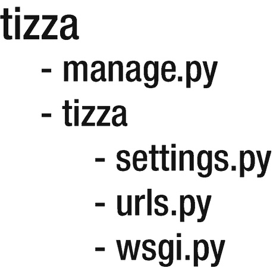
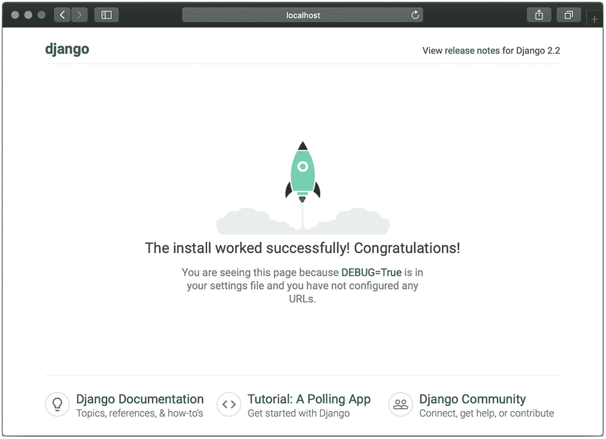
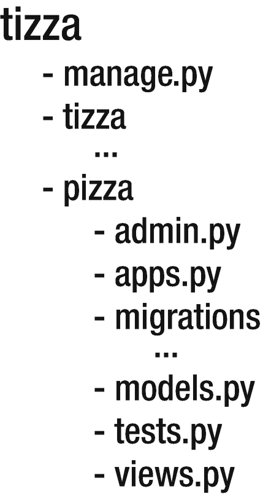
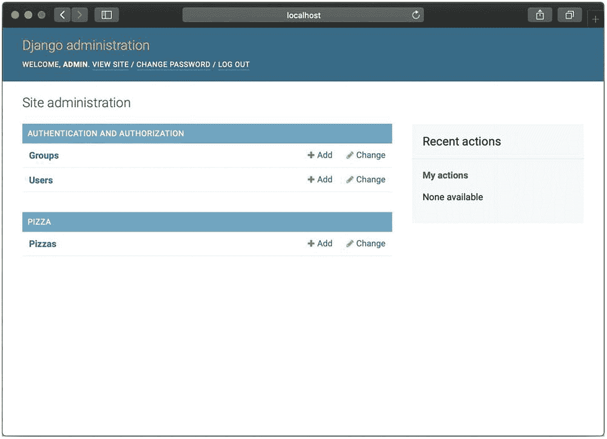
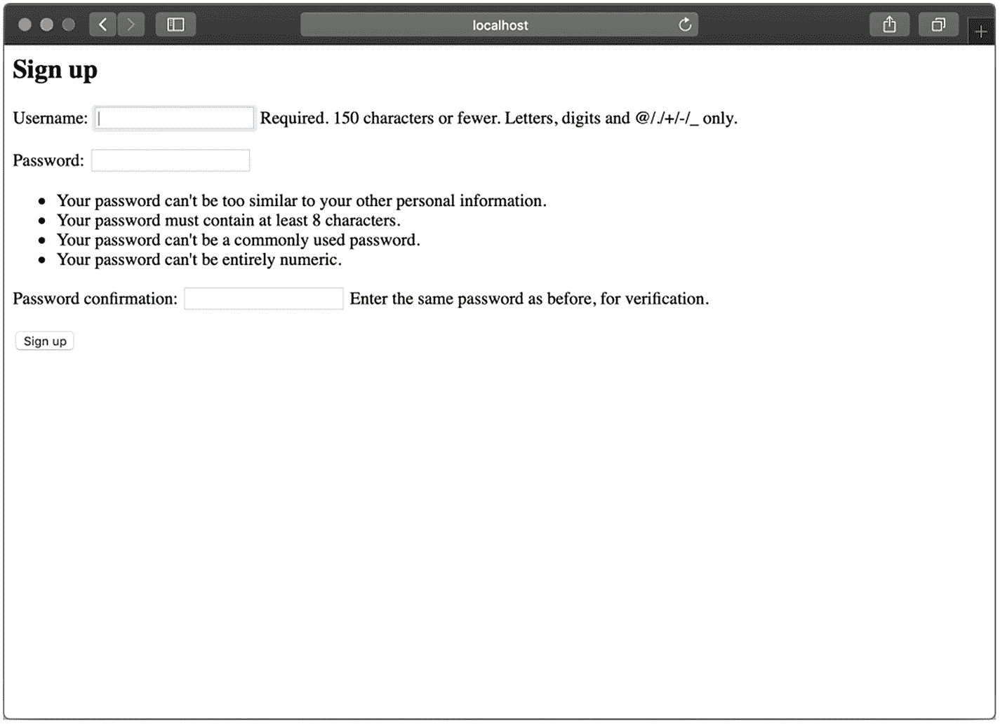
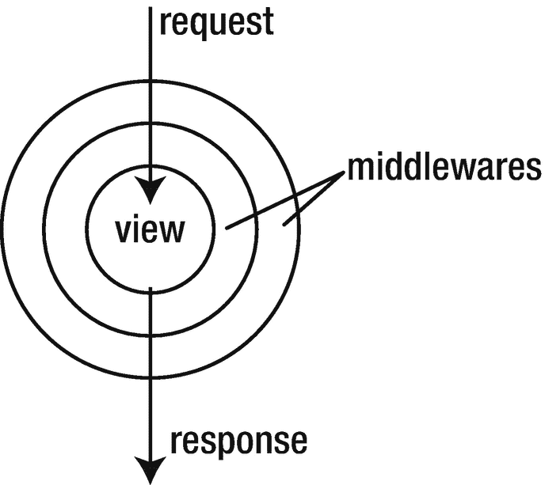

# 二、一点 Django

在设计软件服务时，需要考虑的最重要的一点是编程语言和在项目中使用的相关框架。

出于教育目的，在本书中，我们将使用 Python 编程语言和 Django Web 框架以及相关的工具链来实现我们的目标。为了稍微了解一下知识，我们将学习 Django 的核心概念，并自己构建一个服务。

## 引入问题

在本书中，我们将致力于尽可能贴近现实生活的问题。因此，我们将根据业务需求开展工作，并尝试遵循整个产品的服务设计流程，而不仅仅是其中的一小部分。以下是我们的问题空间:

提扎。Tizza 是一个移动优先应用，用户可以通过照片和对披萨的描述来决定他们是否喜欢披萨。喜欢一个地方后，用户将收到使用该应用组织到给定比萨饼店的团体参观的通知。最终用户有一个朋友列表，他们应该能够管理。用户可以设置私人(仅朋友)和公共(不仅仅是朋友)事件。

自然，我们公司需要以某种方式赚钱。为此，我们从比萨店收取广告费/排名费，以放在我们的平台上。根据销售系统，我们需要确定一家公司在我们的排名中的位置，以及最终用户应该以什么顺序查看餐厅。

## 入门指南

在我们深入研究服务设计之前，我们将在终端中运行几个命令来开始我们的 Django 项目。

### 注意

强烈建议将您的代码和依赖项组织到虚拟环境或容器中。如果您不完全熟悉这些概念，我强烈推荐您使用 virtualenv 或 Docker 查看 Python 开发。

要安装 Django，您只需在终端中运行以下代码:

```py
pip install django

```

当我们看到 Django 应用作为一个整体运行时，我们称之为项目。要创建 Django 项目，只需在终端中执行以下命令:

```py
django-admin startproject tizza

```

这样，一个简单的 Django 应用将被创建在一个名为 tizza 的文件夹中，如图 [2-1](#Fig1) 所示。



图 2-1

裸露 django 文件夹结构

如果我告诉你，在这一点上，你已经有一个功能正常的网站？在您的终端中键入以下内容:

```py
python manage.py runserver

```

并在您的浏览器中访问 *http://localhost:8000*

您应该会看到图 [2-2](#Fig2) 中的屏幕。



图 2-2

Django 已成功安装

恭喜你！现在真正的工作开始了。

## Django 应用

Django 在其通用文件夹结构中有第二层逻辑。这些被称为应用。命名可能会有点混乱，因为它们与智能手机上运行的软件无关。应用通常用作业务案例和/或应用功能之间的逻辑分隔符。你可以认为项目能够在不同的应用之间进行编排，而一个应用只能属于一个项目。要创建新的应用，我们只需运行以下命令:

```py
python manage.py startapp pizza

```

现在我们的目录结构已经更新，如图 [2-3](#Fig3) 所示。



图 2-3

带 app 的裸 django 文件夹结构

默认情况下，有些应用在 Django 项目中，所以我们不需要每次创建新项目时都处理它们。它们是与 Django 本身一起安装的，这就是为什么在文件夹结构中看不到它们。其中之一是包含用户创建和授权工具的 auth 应用。我们将大量使用的另一个工具是管理包，它让我们对应用的数据有很大的控制权。

## 模型和 ORM 的力量

每当您收到一个新功能或开始开发一个全新的产品或应用时，您通常需要考虑的第一件事就是驱动它的数据。一旦数据搞清楚了，借助 Django 和 ORMs 的力量，我们可以马上开始。

### 什么是 ORM？

ORM(或对象关系映射)充当数据库和应用之间的抽象层。您不希望每次在数据库上运行原始查询时都创建封送和解封代码。我们不仅在讨论漏洞问题，还在讨论这些未受保护的系统可能存在的巨大安全问题。

相反，我们将使用 ORM，大多数语言和 web 框架都有类似的东西。对于不使用 Django(或者不需要整个 web 框架)的 Python 开发人员来说，有 SQLAlchemy。对于 PHP 开发人员来说，这是一个信条，对于 Ruby 爱好者来说，这就是 ActiveRecord。简而言之，我强烈建议您开始使用并习惯 ORM，如果您还没有的话，因为它们会让您和您公司的其他开发人员的生活更加简单。

为了让您对 ORMs 有更多的了解，请想象以下情况:您是一名刚从学校毕业的工程师，渴望完成您的第一份工作，即维护和扩展 web 应用。您得到的第一个任务是从数据库中获取并显示一些数据。幸运的是，你上过数据库和网络课程，所以你对数据应该如何流动有一个模糊的概念。您编写的第一段代码如清单 [2-1](#PC5) 所示。

```py
import database

def get_pizzas(pid):
    cursor = database.cursor()
    return cursor.execute(f"""
SELECT * FROM pizzas WHERE id = {pid};
""")

Listing 2-1Simple query to get a pizza

```

代码本身并不可怕，但是有几个非常严重的问题，有经验的工程师可能已经注意到了:

1.  保安。如果 pizza id 来自用户(很可能来自用户)，他们可以简单地通过巧妙的注入删除整个数据库。如果您希望原始查询具有额外的安全性，您需要自己实现它。对你来说可能是一个很好的练习，但是，对你的生意来说绝对是一个糟糕的练习。

2.  可维护性:使用文本对象是...至少可以说很难。在上面这段代码中，您在文本中隐藏了一个条件，没有 IDE 能够帮助您重构它。此外，如果查询越来越多，问题也会越来越多。这里您可能要考虑的另一个方面是多个数据库引擎的维护。如果您想将数据库从 Postgres 更改为 MySQL，您可能需要手动更新所有查询，这很容易出错。

总而言之，像上面这样写代码是危险的，会给数据完整性和工程寿命带来不必要的风险。当然，有些问题是无法用我们将要学习的方法解决的，在这种情况下，你总是可以使用原始的 SQL 查询，只是要特别注意你输入的内容。

### 披萨

在 Django 中，我们需要在应用中创建一个 models.py 文件来开始使用 ORM。该文件应该如下所示:

```py
# pizza/models.py
from django.db import models

class Pizza(models.Model):
    title = models.CharField(max_length=120)
    description = models.CharField(max_length=240)

Listing 2-2Database model for our pizza

```

您在上面看到的是一个数据库表作为 Django 模型的表现形式。Pizza 类继承了 Django 提供的 Model 类。这将通知系统有一个我们想要使用的新数据类型，以及我们在接下来的几行中列出的字段。在我们的例子中，标题和描述都是字符字段。为了简单起见，我们将在数据库中创建我们的表。为此我们将利用移民的力量。

### 迁移

迁移就是从您的模型中生成脚本，您可以使用这些脚本自动搭建您的数据库，而无需运行手动 **CREATE TABLE** 等操作。迁移是一个非常强大的工具，我推荐阅读更多关于它的内容，就本书而言，我们只使用最基本的内容。

```py
python manage.py makemigtations

```

在您的项目目录中运行上面的命令将导致 Django 收集每个应用中的模型，这些模型在 **insalled_apps** 下的设置文件中注册，然后为它们创建一个迁移计划。迁移计划本质上是包含数据库操作的 Python 文件，这些操作按照将在数据库上运行的执行顺序排列。也就是说，如果您运行以下命令:

```py
python manage.py migrate

```

现在，您的表应该已经准备好了，该是我们探索数据库中的内容的时候了。

#### 关于迁移的更多信息…

因此，您只需创建一个模型，在 shell 中运行 2 个命令，突然您就有了一个数据库设置，其中包含了您想要处理的所有表。刚刚发生了什么？生活怎么这么神奇？

Django 做的事情实际上非常不可思议。当您运行 makemigrations 命令时，Django 收集在您的应用中创建的所有模型(每个应用)，在内存中注册它们，并解析它们的元数据，例如其中需要的列、索引和序列。之后，它运行一个代码生成模块，该模块将在数据库元信息的先前状态和当前状态之间创建一个差异，并在 migrations 文件夹中呈现一个文件。这个文件是一个简单的 Python 文件，可能看起来像这样:

```py
from django.db import migrations, models

class Migration(migrations.Migration):
    initial = True
    dependencies = [
    ]

    operations = [
        migrations.CreateModel(
            name='Pizza',
            fields=[
                ('id', models.AutoField(auto_created=True, primary_key=True, serialize=False, verbose_name="ID")),
                ('title', models.CharField(max_length=120)),
                ('description', models.CharField(max_length=240)),
            ],
        ),
    ]

Listing 2-3Migration file for the initial pizza

```

您可以查看并根据需要进行修改。请务必查看在 pizza 应用的 migrations 文件夹中创建的迁移文件。尝试向模型中添加一个新字段，再次运行 makemigrations，并查看所创建的两个文件之间的差异。

当您使用 migrate 命令应用迁移时，您只需使用数据库引擎按顺序执行这些 Python 文件。这里需要注意的一点是，根据表的大小、分配的资源以及迁移的复杂性，在实时数据库上运行迁移可能是一项开销很大的操作。我总是建议在实际环境中执行迁移时要小心！

移民并不总是 Django 核心的一部分。在很长一段时间里，我们不得不使用外部工具或原始 SQL 脚本来生成数据库。如今，几乎所有主流框架都有这样或那样的方式来运行迁移。请务必研究文档中的更多技术细节！

### 简单的 ORM 示例

访问项目运行时的行为方式非常简单。只需执行:

```py
python manage.py shell

```

这将启动一个交互式 Python REPL，它具有从您的 Django 应用加载的所有设置，并且行为与您的应用在当前上下文中的行为完全一样。

```py
>>> from pizza.models import Pizza
>>> Pizza.objects.all()
<QuerySet []>

```

我们可以看到数据库中目前没有比萨饼，所以让我们创建一个:

```py
>>> Pizza.objects.create(title="Pepperoni and Cheese", description="Best pizza ever, clearly")
<Pizza: Pizza object (1)>
>>> Pizza.objects.all()|
<QuerySet [<Pizza: Pizza object (1)>]>
>>> pizza = Pizza.objects.get(id=1)
>>> pizza.title
'Pepperoni and Cheese'

```

在我们的数据存储中创建一个新对象就是这么简单。更新现有的也很简单。

```py
>>> pizza.description
'Best pizza ever, clearly'
>>> pizza.description = "Actually the best pizza ever."
>>> pizza.save()
>>> pizza2 = Pizza.objects.get(id=1)
>>> pizza2.description
'Actually the best pizza ever.'

```

对于这个例子，我们很幸运，但是，我们还没有真正满足任何业务需求，所以让我们继续添加几个模型，以便在我们享受巨大乐趣的同时至少满足一些需求:

```py
# pizza/models.py
from django.db import models

from user.models import UserProfile

class Pizzeria(models.Model):
    owner = models.ForeignKey(UserProfile, on_delete=models.CASCADE)
    address = models.CharField(max_length=512)
    phone = models.CharField(max_length=40)

class Pizza(models.Model):
    title = models.CharField(max_length=120)
    description = models.CharField(max_length=240)
    thumbnail_url = models.URLField()
    approved = models.BooleanField(default=False)
    creator = models.ForeignKey(Pizzeria, on_delete=models.CASCADE)

class Likes(models.Model):
    user = models.ForeignKey(UserProfile, on_delete=models.CASCADE)
    pizza = models.ForeignKey(Pizza, on_delete=models.CASCADE)

Listing 2-4Extended models file for our application

```

与此同时，我们创建了一个名为 auth 的新应用，其中我们添加了一个名为 UserProfile 的模型。在 Django 中，以这种方式扩展已经存在且功能完善的用户模型是很常见的。Django 的新版本也提供了扩展现有用户模型的不同方法，你可以在 Django 官方网站( [`https://www.djangoproject.com/`](https://www.djangoproject.com/) )上了解更多信息。由于我们已经是经验丰富的 Django 程序员，我们知道使用 UserProfile 作为外键通常比使用用户模型更稳定，这是由于它的灵活性。确保在每次模型更改后，都运行 makemigrations 和 migrate 命令来保持数据库最新。

现在我们已经创建了许多模型，我们可以在练习 2-1 中更多地使用 shell。

### 练习 2-1:玩贝壳

在外壳中创建几个新的比萨饼，并将它们放在新创建的比萨饼店下面。试着去买一家披萨店的所有披萨。为比萨饼创造几个赞。尝试访问所有喜欢的比萨饼店！这些都是很棒的特性，有一天会成为我们应用的一部分。请随意探索外壳和模型层。

## 意见交流

公开我们数据的主要方式是使用 Django 的视图。视图本质上是端点，您可以利用它向客户返回各种类型的数据，包括他们浏览器中的 HTML 页面。

为了设置视图，我们将在**披萨**应用中创建一个名为 **views.py** 的文件。

```py
# pizza/views.py
from django.http import HttpResponse

from .models import Pizza

def index(request, pid):
    pizza = Pizza.objects.get(id=pid)
    return HttpResponse(
        content={
            'id': pizza.id,
            'title': pizza.title,
            'description': pizza.description,
        }
    )

Listing 2-5The first view we’ve created to return pizzas

```

我们还需要为此添加一个 url。我们可以通过在**披萨**和 **tizza** 模块中创建和编辑一个 **urls.py** 文件来实现。

```py
# pizza/urls.py
from django.urls import include, path

from .views import index

urlpatterns = [
    path('<int:pid>', index, name="pizza"),
]

# tizza/urls.py
from django.contrib import admin
from django.urls import include, path

urlpatterns = [
    path('admin/', admin.site.urls),
    path('pizzas/', include('pizza.urls')),
]

Listing 2-6The edited urls files so we can access the resources

```

太棒了！现在是我们开始利用互联网的力量获取数据的时候了。根据您使用的工具类型，您可以远程呼叫 pizzas 端点。这里有一个可以从终端运行的 curl:

```py
curl http://localhost:8000/pizzas/1

```

你也可以把它输入你的浏览器，它仍然会工作。

### 注意

curl 是一个命令行工具，可以对 url 进行各种操作，我们将在整本书中使用它来测试我们的端点和代码。建议稍微熟悉一下。在 [`https://ec.haxx.se/`](https://ec.haxx.se/) 查看。

如果您能看到我们几分钟前刚刚创建的比萨饼的 id、描述和标题，我有一个好消息要告诉您:您已经成功地通过互联网查询了数据库！如果您有问题，我建议检查您的服务器是否正在运行，如果没有，在重试之前运行以下命令:

```py
python manage.py runserver

```

现在，让我们尝试以下内容:

```py
curl http://localhost:8000/pizzas/42

```

是啊，这真的没用。如果我们想返回正确的响应，我们需要修改视图函数(练习 2-2)。

### 练习 2-2:修复丑陋的 42

比萨饼的视图功能现在实际上相当糟糕。我们花了大约 15 秒钟找到了一个非常讨厌的 bug。幸运的是，我们有一个周末的时间来研究这个问题，所以让我们确保如果我们的一个客户调用一个不存在的比萨饼的端点，我们返回一个合理的响应，比如:

```py
{
    "status": "error",
    "message": "pizza not found"
}

```

我们的视图功能看起来很棒，但我们需要一些额外的功能来满足业务需求(练习 2-3)。

### 练习 2-3:随机披萨

让我们创建一个端点，它将从数据库中返回一个随机的比萨饼。端点应具有以下路径:

```py
/pizzas/random

```

让我们确保在这样做的时候不会弄乱其他端点！

完成后，我们还可以向客户端返回 15 个随机的披萨(这样我们就不会对后端服务器进行那么多远程调用)。我们还应该确保，如果用户看到了一个比萨饼，他们不应该再次收到相同的。你可以使用 **Likes** 模型来实现。

## 管理面板

您可能已经注意到，我们已经在 url 模式中添加了一个名为 **admin** 的 url。默认情况下，Django 为整个应用提供了一个非常方便的管理视图。如果您需要手动管理数据库中的对象，这可能非常有用。要访问管理面板，首先您需要在数据库中创建一个超级用户。

```py
python manage.py createsuperuser

```

添加您想要登录的凭证，启动开发服务器(如果还没有运行的话)，并作为管理员用户登录到 **/admin** url。超级用户可以访问管理站点上的所有内容，这是你进入系统的第一个入口。

在这一点上，除了用户管理，你可能看不到很多有用的模块。如果您想在这里使用 pizza 资源，您需要将下面的代码添加到 **tizza/pizza/admin.py** 中，这将告诉管理面板注册 pizza 模型以进行管理。

```py
from django.contrib import admin

from .models import Pizza

class PizzaAdmin(admin.ModelAdmin):
    pass

admin.site.register(Pizza, PizzaAdmin)

```

此时，我们可以访问 Django 管理面板，查看我们的模型在 UI 上的行为(图 [2-4](#Fig4) )。



图 2-4

Django 管理面板

在这个屏幕上，您可以访问所有用户信息，所有在 Django 中注册的模型，包括用户组和权限。总的来说非常方便，是快速帮助客户的一个非常强大的工具。

当您检查应用是否正常工作时，它也是一个非常好的测试工具。只需点击几下鼠标，创建用户就变成了一项非技术性的任务。

管理面板也是一个高度可配置的界面。您可以向已经实现的各种模型添加自定义字段和自定义操作。如果您想了解更多关于 Django admin 的知识，我建议您查看文档。这里还有很多值得探索的地方。

### 注意

如果您希望以这种方式访问实时数据库，您需要为每个环境创建一个超级用户。

为了确保我们熟悉管理面板，让我们在练习 2-4 中创建几个用户和几个比萨饼。

### 练习 2-4:管理操场

让我们试着从我们创建的 API 访问比萨饼。

只是为了实践管理应用的多功能性，让我们为 pizza 添加一个新的字段，通过它我们可以选择 pizza 是肉、素食还是纯素食。提示:对于数据库模型，您应该检查 models.ChoiceField。添加它之后，运行迁移并尝试在管理面板中创建新的 pizza。有什么变化？

## 登录、注销和注册

在我们继续之前，我们真的需要让我们的用户能够注册、登录和退出我们的系统。让我们为此开发一个快速应用，好吗？

### 报名

可能我们想给我们的用户一些方法，让他们在我们希望他们登录之前注册(并不总是这样，但在这个例子中，我们将这样做)。

Django 提供了一个非常强大的工具集来为用户实现一个简单的注册表单。

首先，我们将创建一个注册视图。但是我们应该把它放在哪里呢？我猜用户应用现在应该没问题。我们将使用 Django 表单来解决这个问题，因为 auth 应用默认为注册用户提供了一个表单。

```py
from django.contrib.auth.forms import UserCreationForm

```

为了给用户分配一个会话并确保他们是他们所声称的那个人，我们将使用来自**认证**应用的**登录**和**认证**助手。

```py
from django.contrib.auth import login, authenticate

```

在这一点上，这是一个将这些功能粘合在一起的问题。为了使我们的系统更加灵活，我们将使用基于类的视图，也是由 Django 提供的:

```py
# user/views.py
from django.contrib.auth import login, authenticate
from django.contrib.auth.forms import UserCreationForm
from django.shortcuts import render, redirect
from django.views import View

class SignupView(View):
    template_name = 'signup.html'

    def post(self, request):
        if form.is_valid():
            form.save()
            username = form.cleaned_data.get('username')
            password = form.cleaned_data.get('password1')
            user = authenticate(username=username, password=password)
            login(request, user)
            return redirect('/')

    def get(self, request):
        return render(request, self.template_name, {'form': UserCreationForm()})

Listing 2-7Class based view for signing up

```

正如您所看到的，基于类的视图是一种更简洁的方式来描述在您的端点上会发生什么，这取决于您在其上使用的操作。我们现在只需要一个屏幕，向用户显示这些内容。

```py
{# user/templates/signup.html #}


<h2>Sign up</h2>
<form method="post">

    {{ form.as_p }}
    <button type="submit">Sign up</button>
</form>


Listing 2-8Template for the sign up form

```

这是一个使用 jinja2 模板语言编写的模板文档。你可以看到它的大部分看起来像普通的 HTML。有用操作符定义的可替换块，我们在渲染时用{{...}}个标签。我们还为 csrf 令牌使用了一个特殊的标签，用来确保只有授权的实体才能使用我们的表单，这是 Django 所要求的。as_p 方法将把表单呈现为作为段落列出的元素。现在，我们需要做的就是确保我们的端点是公开的。

```py
from django.urls import path
from tizza.user.views import SignupView

urlpatterns = [
    path(r'^register/—', SignupView.as_view()),|
]

```

太好了。使用 as_view 方法，我们可以很容易地将基于类的视图转换成我们在本章前面遇到的常规 Django 视图。您可以在图 [2-5](#Fig5) 中看到我们创建的注册页面。



图 2-5

注册页面

### 登录和注销

正如我们之前看到的，Django 提供的 **auth** 包附带了许多内置功能。这些也包括客户端身份验证端点。

### 注意

身份验证与授权:混淆身份验证和授权是很常见的。辨别这两者最简单的方法如下:**认证**验证**你是谁**，而**授权**说明**你可以在一个系统中做什么**。只要记住这一点，你就再也不会在谈话中混淆它们了。

其中包括以下内容:

*   **/登录** -用户可以在此页面验证您的系统。

*   **/logout** -用户可以从您的系统中取消认证的页面。

*   **/password_change** -用户可以修改密码的页面。

*   **/password_reset** -用户可以在忘记密码时重置密码的页面。

将这些端点添加到您的系统中并不是最难的事情，我们需要做的只是更改项目目录中的 **urls.py** 文件。

```py
# tizza/urls.py
from django.contrib import admin
from django.urls import include, path
from django.contrib.auth import views as auth_views

urlpatterns = [
    path('admin/', admin.site.urls),
    path('pizzas/', include('pizza.urls')),
    path('login/', auth_views.login, name="login"),
    path('logout/', auth_views.logout, name="logout"),
]

Listing 2-9Urls for logging in and logging out

```

默认情况下，Django 会尝试呈现 **registration/login.html** 模板。让我们用下面的格式创建这个文件。，这与注册页面非常相似:

```py
Login


  <h2>Login</h2>
  <form method="post">
    
    {{ form.as_p }}
    <button type="submit">Login</button>
  </form>


```

既然我们已经向 urlpatterns 添加了身份验证 URL，我们将需要创建几个页面来确保用户可以登录到我们的系统。

现在让我们将**pizza**的端点再扩展一点，因为我们需要能够与它们进行交互。

首先，我们将为拥有比萨店的用户添加一个比萨创建端点，这可以通过多种方式完成，这次我们将使用 HTTP 动词来区分我们希望在实体上执行的各种操作。

```py
# pizza/views.py
import json

from django.contrib.auth.decorators import login_required
from django.http import HttpResponse

from .models import Pizza

@login_required
def index(request, pid):
    if request.method == 'POST':
        data = json.loads(request.body)
        new_pizza = Pizza.objects.create(
            title=data['title'], description=data['description'],
            creator=request.user,
        )
        new_pizza.save()
        return HttpResponse(
            content={
                'id': new_pizza.id,
                'title': new_pizza.title,
                'description': new_pizza.description,
            }
        )
    elif request.method == 'GET':
        pizza = Pizza.objects.get(id=pid)
        return HttpResponse(
            content={
                'id': pizza.id,
                'title': pizza.title,
                'description': pizza.description,
            }
        )

Listing 2-10Extended pizzas endpoint

```

现在，我们的登录用户可以创建一个新的比萨饼。代码有点乱，但我们可以稍后修复它，对吗？好的。你还可以看到，我使用了一个装饰器来确保只有登录的用户才能制作披萨。Django 默认提供了各种装饰器和基于类的视图混合。我建议检查一下它们，选择适合你使用的。在设计服务时，装饰者是非常非常强大的工具，我们在本书的后面肯定会遇到他们。

您还可以注意到一件微妙的事情，我可以用 **login_required** 装饰器的力量来做这件事。这不亚于使用由**认证中间件**填充的**请求用户**。等等，什么是中间件？

### 中间件入门

中间件是 Django 的核心概念之一。就像食人魔和洋葱一样，Django 也有层次，当请求和响应进入和退出应用时，它们会经过这些层次。这个分层系统的核心是视图功能和基于类的视图本身。考虑图 [2-6](#Fig6) 。



图 2-6

Django 请求响应周期一览

在这里您可以看到，当一个请求进入您的应用时，它进入各种中间件层，这些中间件层可以做很多事情。中间件的几个例子:

**AuthenticationMiddleware**——确保 **request.user** 对象存在，并且您可以访问它。如果用户已经登录，那么它将被用户对象填充。如果不是，那么一个匿名用户将坐在这个属性上。通常，将这个中间件子类化，并用其他用户相关数据扩展它是非常方便的，比如我们前面提到的**用户资料**。

**安全中间件** -提供各种安全相关功能，如 HTTPS 重定向、重定向阻止、xss 保护。

**common middleware**——提供一些基本的功能，这些功能的实现很简单。例如发送禁止的用户代理，并确保 URL 以斜杠结尾。

正如你所看到的，中间件有各种各样的用途，但是要小心你放在中间件代码库中的东西。由于服务中的所有请求都将进入该中间件，计算密集型和网络操作可能会显著降低应用的速度。

### 练习 2-5:速率限制中间件

如果你在关注 tizza，你会知道我们的虚拟企业正在迅速发展。高速增长带来了高流量，而我们的服务器几乎无法承受负载。新机器将在几周内提供，但是，在此之前我们需要一个解决方案。创建一个中间件，将某段时间内来自同一个 IP 地址的调用次数限制在 Django 设置中可配置的数量。另外，检查一下您是否可以使用装饰器模式来更加注意您想要保护的端点。

### 练习 2-6:喜欢比萨饼

还记得我们扩展 pizza 端点时，根据用户是否看过，返回一组随机的 pizza 吗？好消息是，现在我们实际上有了实现“喜欢”功能的工具。因此，您的任务将是创建一个端点，它可以根据登录用户的喜好来决定是否喜欢某个比萨饼。可能还需要编辑我们的模型来实现这一点。幸运的是，我们在项目的早期。

## 模板

现在我们已经熟悉了 Django 的工作方式，并且我们已经创建了几个可以通过浏览器访问的简单页面，让我们更深入地了解一下，在我们公司请得起设计师之前，我们如何让用户体验变得更容易接受。

正如我们在登录表单中看到的，Django 后端和我们的用户之间的主要通信渠道是通过模板(以及 Javascript，但我们稍后会回到这个话题)。让我们快速提醒自己模板实际上是什么样子的:

```py
{# user/templates/signup.html #}



<h2>Sign up</h2>
<form method="post">

    {{ form.as_p }}
    <button type="submit">Sign up</button>
</form>


Listing 2-11Reminder on templates

```

第一行是注释，如果你正在读这本书，你可能已经熟悉了注释。

第二行是扩展语句。这基本上意味着该模板将使用注册为 base.html 的模板中的所有块，然后扩展并覆盖其中指定的属性。这意味着，我们可以为我们的应用构建一个基础模板，其中我们需要指定网站中只需要在任何地方出现一次的部分。让我们看一个简单的例子:

```py
<html>
    <head>
        <meta charset="utf-8"/>
        
    </head>

    
    <header>This is the header of the website, the designers will probably want it to be sticky and we need to add a login button to the right if the customer is logged our or a logout button if they are logged in</header>
    

    
    

    
    <footer>This will be our footer where we will put columns about our company values and the job openings.</footer>
    

    
</html>

Listing 2-12Simple base template

```

我知道，上面的东西是很多代码，但是让我们运行一个快速分析和思想实验，看看每一行是如何有意义的:

1.  我们的大多数应用都会有相同的 **<头>** 信息。meta 标签很少改变，而且肯定有 css 文件和样式，我们希望应用于我们所有的页面，但是，我们很可能希望将不同的 css 文件分发到我们网站的不同页面，所以 CSS 块在那里完全有意义。

2.  页眉很可能会出现在我们所有的页面上，但是，有时我们希望页眉消失，或者以完全不同的方式出现(可能出现在营销页面上)。在这种情况下，我们允许覆盖整个标题。页脚也一样。

3.  内容块本质上是您希望在页面中覆盖的内容。

4.  在页面的最后，我们将有加载的 javascript 文件。如果我们需要更多，我们只需将它们添加到页面上的覆盖块中，我们也完成了。

作为一个简单的例子，我们将创建一个视图和一个模板，显示我们在视图中返回的比萨饼的信息。

```py
from django.shortcuts import render
from django.views import View

from pizza.models import Pizza

class GetTenPizzasView(View):
    template_name = 'ten_pizzas.html'

    def get(self, request)
        pizzas = Pizza.objects.order_by('?')[:10]
        return render(request, self.template_name, {'pizzas': pizzas})

Listing 2-13Pizza shuffling endpoint

```

上面的代码有点笨拙，但是现在它将为我们完成返回 10 个随机比萨饼的工作。让我们来看看我们将要构建的模板:

```py
{# pizza/templates/ten_pizzas.html #}



<h2>Look at all the pizzas!</h2>
<table>
<th>
    <td>Name</td>
    <td>Description</td>
</th>

<tr>
    <td>{{ pizza.title }}</td>
    <td>{{ pizza.description }}</td>
</tr>

</table>



Listing 2-14Pizza shuffling template

```

很简单，但它能完成工作。因此，在这里我们看到，我们有十个比萨饼呈现在一个表中，一个接一个地显示它们的名称和描述。在 Django 模板中，我们有各种各样的控件，比如循环和条件。请记住，所有这些操作都占用了宝贵的服务器时间，因为一切都是在那里计算的。这可能对你的 web 应用在搜索引擎上的页面排名有好处，但是，这可能会给你的客户带来缓慢的客户端体验。如果你想要更快的感觉，我可能会建议你完全依赖 Javascript，让你的模板尽可能的薄。

关于模板的进一步阅读，我建议查阅文档。

## 许可

当你编写一个应用时，你总是需要确保实体只能被有权限的用户查看、编辑和删除。同样，我们很幸运选择 Django 作为我们构建 tizza 的工具，因为我们已经有了一个内置的许可系统。如果您已经熟悉基于 UNIX 的权限，您可能会跳过接下来的几段，直接进入代码示例，对于我们其他人来说，这里有一个术语入门:

*   **用户**——我们已经遇到了用户，他们来自**django . contrib . auth . models . User**模型，在我们的系统中描述一个人(或一个注册)。

*   **组**——一个组描述一组用户。一个用户可以是许多组的一部分，一个组可以包含许多用户。来源于**django . contrib . auth . models . group**。群组是标记用户的一种简单方式。一个可能的用例是，在 tizza 应用中，我们希望限制餐馆老板由于我们缓存中的维护而更新他们的食谱。在这种情况下，我们可以从 restaurant_owners 组的所有用户中取消 **restaurant_admin_page** 权限。

*   权限对象也存在于 Django 生态系统中，而不仅仅是标签。使用**django . contrib . auth . models . permission**类，您可以在数据库本身中创建权限对象。

用户对象有以下两个字段，在使用权限和组时会很方便:

*   **user.groups** -您可以通过该字段获取、设置、添加、删除和清除用户的组。

*   **user.user_permissions** -您可以通过该字段获取、设置、添加、删除和清除单个用户的单个权限。

让我们来看一个快速的权限示例:

```py
# pizza/views.py
from django.contrib.auth.models import Permission

def index(request, pid):
    # ...
    elif request.method == 'DELETE':
        if 'can_delete' in request.user.user_permissions:
            pizza = Pizza.objects.get(id=pid)
            pizza.delete()
            return HttpResponse(
                content={
                    'id': pizza.id,
                }
        )
        else:
            return HttpResponse(status_code=404)

Listing 2-15Permissions example

```

在上面的简单例子中，我们检查用户是否有权限删除给定的比萨饼。当他们创建了这个披萨，或者如果他们加入了有权处理这个披萨的组，我们可以授予这个权限。

## 结论

到目前为止，我们在 tizza 应用上已经做了很多工作，但要完成产品还有很长的路要走。现在我们将把它留在这里。我为渴望的人增加了练习 2-7 到 2-9。如果您只想看到项目的运行，您可以访问下面的存储库，克隆代码库，并试用应用:

[T2`https://github.com/akoskaaa/dmswd-monolith`](https://github.com/akoskaaa/dmswd-monolith)

尽管代码库仍然只有几千行，但我们已经可以看到项目中的某些区域可能会更好。在下一章中，我们将探索将项目分割成小块的选择，并熟悉我们将在本书其余部分遵循的原则。

如果你在这一章之后需要更多的学习资料，我强烈推荐你查看 Django 的官方网站( [`https://djangoproject.com`](https://djangoproject.com) )，因为他们为初学者和高级用户提供了极好的文档和资料。还有另外一个由两勺出版社( [`https://www.twoscoopspress.com/`](https://www.twoscoopspress.com/) )提供的优秀资源，你可以在那里更深入地了解这个话题。

### 练习 2-7:比萨饼页面

很高兴我们已经为正在使用的模型创建了 API，然而，我们的大多数用户并不完全熟悉 curl 的神奇之处。对于这些人，让我们创建一个页面，在那里我们随机获取比萨饼，一个接一个地展示它们，并提供给他们喜欢或不喜欢的比萨饼。当我们卖完比萨饼时(或者更好:快卖完了)，让我们去拿下一批。

### 练习 2-8:餐馆仪表板

如果您以前使用过电子商务应用，您会知道有两种类型的用户。买的人(客户)和卖的人(商家)。到目前为止，我们主要是迎合客户的用例，让我们确保商家也得到一些爱。对于拥有比萨饼店的用户来说，他们应该会收到一个仪表板页面，在那里他们可以管理所有他们想在我们的系统中显示的比萨饼(创建新的，更新和删除现有的)。

### 练习 2-9:支付服务

我们需要开始赚钱。创建一个新的应用，将从商家方面模拟我们的支付，所以他们可以从他们的管理页面“提高”他们的产品的可见性。