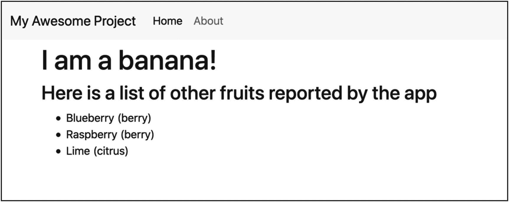
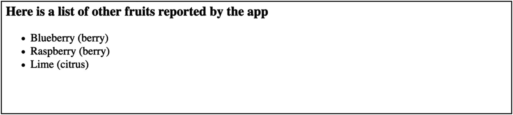

# 5.模板

在独立应用程序中包含 HTML 模板的机制与在 Django 项目的应用程序中包含模板没有什么不同。但是，您确实需要仔细考虑命名以及包含在模板中的内容。在本章中，您将学习如何为最终用户命名模板，以及如何为开发人员用户优化模板内容。

## 三个基本策略

如果您的应用程序包含返回呈现的 HTML 响应的视图，它将通过呈现 HTML 模板来做到这一点。由于 Django 加载模板的方式，您有三种选择来处理初始模板内容:

1.  不要包括模板——毕竟，这是用户的网站。

2.  包括基本的 HTML 模板。

3.  包括详细的甚至是风格化的模板。

在大多数情况下，你应该在你的应用程序中包含基本的 HTML 模板，这些模板显示了开发过程中的渲染结果和你的视图中包含的模板上下文的结构。

## 包括什么

第一个选择，发布你的独立应用程序，但不包含你的视图所引用的 HTML 模板，应该被认为是不可行的。排除模板的主要好处是，它使你的应用程序的用户在哪里需要添加他们自己的模板变得很明显。然而，虽然应用程序的最终用户能够提供他们自己的模板，并且您可以记录应该包括哪些模板，但这增加了使用应用程序的摩擦。这使得探索性的使用变得更加困难，并使得在最终的模板中应该期望什么变得不那么明显。

第二个和第三个选项之间没有明显的区别，但是除了样式之外，我们可以确定一个更详细的模板，它引入了一些元素的组合，这些元素对于交付应用程序的功能并不是严格必需的。这个简短的模板，我们可能会认为是一个简单的应用程序视图，引入了一些不必要的假设。

```py


<h3>Here is a list of other fruits reported by the app</h3>
<ul>

        <li class="fruit-{{fruit.category }}">{{ fruit }}</li>

</ul>


```

我们期望页面呈现如图 [5-1](#Fig1) 所示。



图 5-1

呈现的网页

虽然这是一个好的、流行的约定，但是没有什么要求*要求*任何人将基础模板命名为 base.html，也没有任何要求，如果这样的模板存在，它应该是这个特定级别的直接基础模板。同样，不要求任何项目模板都包含名为 content 的模板块。这可能是有意义的，并且可能是你在 Django 项目中见过的最一致的东西，但是这仍然是一个方便的约定。因此，虽然这个模板将为拥有 base.html 和内容块的人创造更丰富的初始体验，但对于那些没有的人来说，它将失败。

更好的策略——在大多数情况下——是包含基本模板，用最少的结构和样式向用户显示模板上下文的全部范围。下面是之前的例子:

```py
<h3>Here is a list of other fruits reported by the app.</h3>
<ul>

        <li class="fruit-{{fruit.category }}">{{ fruit }}</li>

</ul>

```

图 [5-2](#Fig2) 中的结果并不令人兴奋，但是预期用户将会覆盖我们的



图 5-2

最少的结构和样式

模板最终会使它们在发布的应用程序中看起来不适合生产。

有些情况下，提供更详细的模板是有用的，例如，应用程序的业务目标是提供风格化的结果，定制的管理皮肤。

在你的模板中包含翻译字符串是一个好主意，但是对于简单的例子模板来说没有必要。考虑到您的开发人员用户将会覆盖这些，他们可以包含这个或他们选择的语言。参见第 [13](13.html) 章了解如何解决这个问题。

### 电子邮件和杂项模板

从视图中呈现 HTML 响应同样适用于任何其他模板化的内容，包括电子邮件。电子邮件模板是应用程序中的一个常见功能，包括用户注册、邀请和任何其他类型的出站通知。

关于电子邮件和通知模板的一个新增功能是将它们包含在自己的 templates 子文件夹中，例如 email/。

Flat is Better than Nested: The Zen of Python

"使用额外的目录不是不必要的嵌套吗？"记住实用性胜过纯粹性，目录“仅仅”是名称空间。myapp/email/welcome_body.html 和 myapp/email_welcome_body.html 的命名空间深度差异为零；他们只是性格不同而已。查看文件夹系统的不同之处在于它们总是显而易见的，不仅在文件系统中，更重要的是在调用源代码中。

## 摘要

在这一章中，你学习了如何最好地在你的独立应用程序中包含 HTML 模板，以及在其中包含什么。您了解到，与其包含依赖于特定基础模板的大量样式的模板，不如只包含模板的核心结构来演示模板中的可用内容。在下一章中，您将学习如何包含像 CSS 和 JavaScript 这样的静态资产来提供基本样式和前端功能。