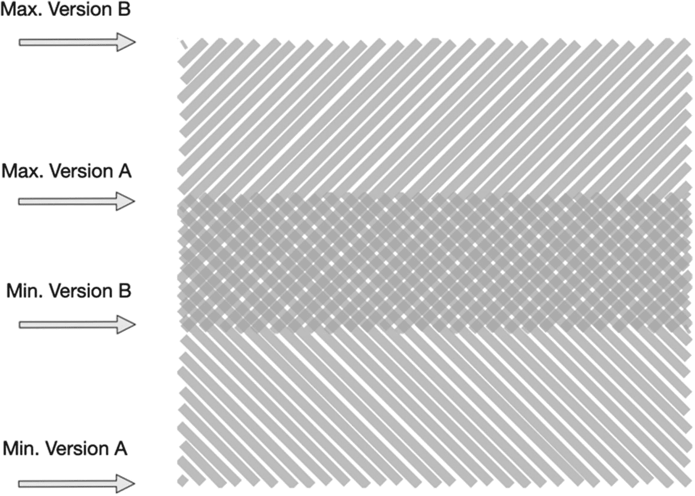

# 十一、重新添加你的应用

从项目中提取应用需要几个步骤:

1.  重构应用

2.  将其移动到顶级名称空间(如果需要)

3.  从项目中移除它

第三步给你留下了一个难题，如果你想在你原来的项目中继续使用应用。除非您不需要新的独立应用，或者在某些情况下，您需要在项目中保留原始的、未重构的源代码，否则您需要将新的独立应用包含在衍生它的一个或多个项目中。

## 本地验证

第一步是使用项目外部本地安装的源代码来验证集成。为此，您可以使用 python setup.py develop 在项目的 Python 环境中进行安装，如第八章所述。注意，如果您的项目只能通过一个虚拟机(例如，使用 vagger)或一个容器(例如，Docker)获得，那么跳到下一个部署步骤会更快。

我们在这一点上的假设是，您已经从项目中移除了应用，无论是从项目根还是从项目存储库中，这样它就不在项目路径中了。至少，这意味着如果您试图在没有以某种明确的方式安装应用的情况下运行您的项目，您可能会遇到一两个导入错误。

然而，简单地从项目根目录之外的应用自己的根目录安装意味着您可以验证项目是否仍然如预期的那样运行，其中的代码已经从项目本身删除。

## 基于源代码管理的包

从本地安装的包中安装和使用您的应用对于测试和开发新功能来说很好，但在部署项目时就不行了。为此，我们需要远程可用的应用，一个简单的方法是通过源代码控制提供包。作为起点，或者对于没有私有包索引的私有可重用应用，这是一个简单的起点。

Python 包安装程序 pip 允许您以多种方式安装包。当然，您可以只提供包名，pip 将在 Python 包索引中查找指定的包。但是，pip 也可以从远程源代码控制链接安装软件包，也就是 Git 存储库。

完整的细节记录在 pip 网站上，但是简单地说，它通过提供(I)版本控制协议，(ii)到存储库的路径，以及(iii)目标包名来工作。在以下示例中，软件包 myapp 是从 Git repo 安装的，并带有 Git 存储库的完整路径:

```py
pip install git://githost.org/myapp.git@v1.0#egg=myapp

```

此示例还通过使用 Git 标记安装了一个特定的版本。片段@v1.0 由两部分组成:@表示后面是存储库中已命名的*头*，即分支名、标记名或提交 SHA，其余部分是该名称本身。然后，行尾 egg=myapp 指定了目标包的名称。

这可以像包名一样添加到 requirements.txt 文件中。

如果你是从你的 GitHub 库安装的，假设你的用户名是 me，同样的一行应该是这样的:

```py
pip install git://github.com/me/myapp.git@v1.0#egg=myapp

```

使用标记或提交的源代码管理版本规范在技术上是可选的，但是为了使用这种策略实际安装包，您应该总是使用通过标记名或提交 SHA 的提交版本。分支名称可能很吸引人，但却是移动的目标，不允许您有效地声明版本。

从 Git 而不是从 Python 包索引(PyPI)使用和安装包的优势主要与发布包的控制和开销有关。您不需要在 PyPI 上注册名称，不需要构建任何东西，也不需要认真担心 changelog 或者您的包元数据是否正确。这些都不是很重要的问题，但是如果你只是想开始重用你的应用，你可以先跳过这些准备工作。

这些限制不仅包括可见性的降低，这是通过 PyPI 和通过一个简短的 pip install myapp 安装提供的，还包括可重用性的降低。可见性对此有影响，但最大的障碍是缺乏连续可用的版本。使用 Git 标签和提交 sha 可以让您锁定特定的版本，这对于单个项目来说是一个很好的策略，但是对于其他包来说却是不可行的，因为您失去了基于范围(例如`django>=3.0`)选择版本的能力。当包固定它们需求的版本时，它们将在环境中强制使用那个版本，即使其他包可能需要相同的包。



图 11-1

阴影区域是相互兼容版本的范围

如果两个包都通过提供最小和/或最大支持版本号来要求相同的依赖性(如图 11-1 所示)，那么我们通常可以期望找到一些相互兼容的版本。相反，如果这些包中的一个*固定了一个特定的版本，*，那么它可能会安装这个特定的版本，这个版本不在另一个包指定的兼容范围内，即使这个特定的固定版本是不必要的。

基于源代码控制的包安装排除了像这样的版本范围的使用，并将*要求*版本锁定。

## 已发布打包

为了易于使用和安装的一致性，以及在更大的 Django 生态系统中的可见性和访问，您需要将您的应用发布到一个包索引中。发布还允许您充分利用需求规范中的版本号，甚至是私有索引。

发布包的最基本的工作包括(I)在索引上注册包名，(ii)构建包，以及(iii)上传构建文件。

你需要两个额外的包裹，轮子和绳子。wheel 包用于构建 Python wheels，这是预构建的 Python 包，使用。whl 分机。对于开发人员来说，安装 Wheel 文件比安装普通的源代码包要快得多。twine 包用于将您的包构建上传到包索引。您可以在没有 twine 的情况下做到这一点，但 twine 将确保使用 HTTPS，并简化注册和上传多种包格式的步骤。

```py
pip install wheel twine

```

注册名称是一个一次性的步骤，它会保留包的名称。这可以防止名称冲突，所以您需要确保您选择的包名称还没有被使用。然而，这是我们不会明确采取的一个步骤。可以使用 setup.py 的“注册”命令；然而，这不一定是安全的，twine 会安全地做到这一点，并且不需要添加显式的用户步骤。尽管如此，这是值得注意的一步！

为了利用基于版本号的安装，您的软件包将需要一个版本号。我们希望在两个地方包含版本号，setup.py 文件和您的模块根目录。如果是一个独立的 Django 应用，后者应该是 myapp/__init__.py。作为传播版本号的更复杂方法的替代，您可以从在两个地方对其进行硬编码开始。

```py
# setup.py
from setuptools import setup, find_packages

setup(
    name="blog",
    version="0.1.0",

    author="Ben Lopatin",
    author_email="ben@benlopatin.com",
    url="http://www.django-standalone-apps.com",

    packages=find_packages(exclude=["tests"]),
)

# __init__.py
__version__ = "0.1.0"

```

setup.py 文件中的版本号用于在软件包索引中注册版本号，并在安装时管理版本。您的软件包中包含的版本号，即 __init__。py 文件是非常有用的元数据，可以用来验证安装和使用的是哪个版本的软件包。这并不意味着它是多余的，但这意味着只改变 __init__ 中的版本。py 文件本身不会对作为新版本发布到包索引的内容产生任何实质性影响。这些更改必须在 setup.py 文件中或通过该文件进行。

*   在第四部分中，我们将会看到一些处理版本号更新的改进方法。

在构建和上传之前，最好快速检查一下您的包元数据是否有效。您可以通过运行 python setup.py check:

```py
python setup.py check -r -s

```

check 命令将对您的包元数据执行最少的验证。您应该始终运行此步骤，以确保其格式正确。如果检查失败，则-s 选项将导致脚本退出并显示错误代码，而-r 选项检查所有字符串是否都符合 reStructuredText。如果您打算在自述文件中使用 Markdown 并读入 setup.py 文件，则应跳过此选项；否则，这可以防止包索引的格式被破坏。

设置了版本号并验证了元数据后，接下来您需要构建一个发行版，即人们在安装您的应用时实际下载的文件。大致来说，有两种方式来构建这个包:使用一个源发行版和使用一个轮发行版。它们并不相互排斥，所以我们将构建两者(记住，您需要安装 wheel 包来构建包含以下内容的 wheel):

```py
python setup.py sdist bdist_wheel

```

这将在您的软件包的 dist/目录中创建一个扩展名为. whl 的归档文件和一个归档文件，两者都根据您的软件包名称和版本进行命名(sdist 创建的特定扩展名因系统而异，并且是可配置的)。

然后是上传发行版的时候了，安装了 twine 之后，命令看起来像这样:

```py
twine upload dist/*

```

如果您还没有注册包名，twine 上传步骤将在上传前首先注册包名。如果成功，您将看到您的新版本——或新软件包——安装在软件包索引上。如果由于某种原因上传失败，例如，只有一个分发选项，您可以修复问题(如果有的话)，并尝试重新上传失败的分发。不可能重新上传相同版本的发行版，但是如果发行版没有成功上传，那么这个限制就不适用。

最后一步是标记您的发布版本。使用 Git，您可以使用 tag 命令，就像这样:

```py
git tag -a v0.1.0 -m "Initial version"

```

标记的目的是确保您可以跟踪每个版本中到底部署了什么。出于这个原因，您应该在成功发布新版本之后的在您的存储库中标记您的提交。如果您必须在上传软件包版本之前进行最终更改，这可以防止标记错误的版本。

## 摘要

在本章中，您学习了一些将提取的应用作为独立应用添加回项目的策略。您学习了如何在本地完成这项工作，方法是在项目路径中安装应用，使用源代码控制和版本标签远程完成这项工作，最后作为已发布的可安装包发布到 PyPI。我们将在随后的章节中进一步探讨改进打包过程的方法。