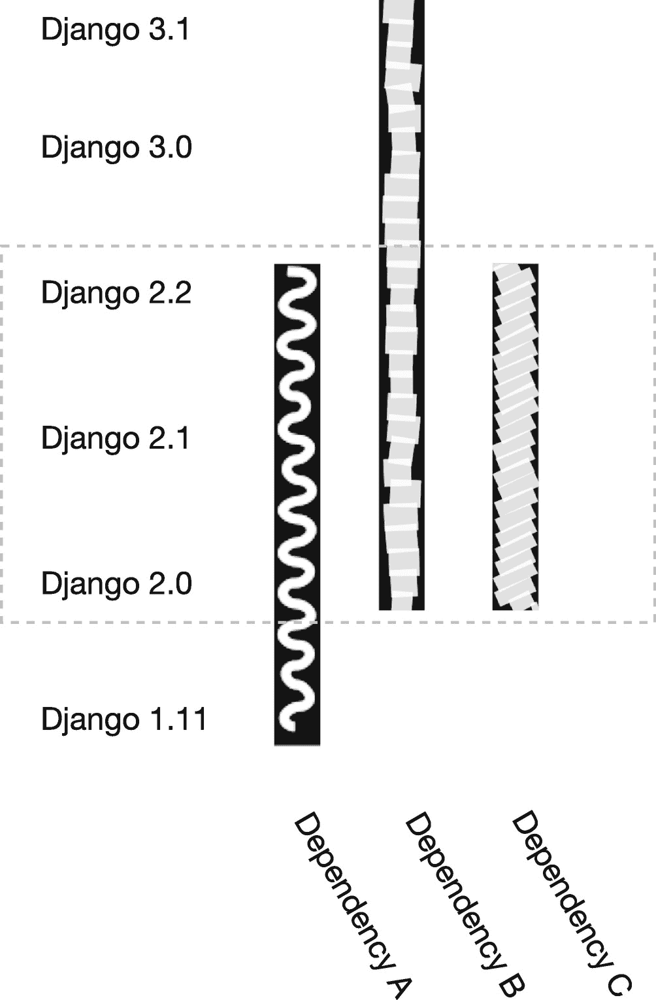

# 14.管理版本兼容性

当您编写一个 Django 应用来包含在您自己的项目中时，您已经知道 Python、Django 和其他所有使用的依赖项的版本。当你创建一个独立的应用时，你既不知道也不能控制这些版本，因为它们会被部署到其他人的项目中。因此，对其他开发人员来说,“对我有用”的东西可能甚至在微妙不同的环境中也不起作用。您可能无法确切知道每个用户和潜在用户部署了哪些版本，但您可以预测 Python、Django 甚至依赖版本的主要组合，并确保您的应用在每个版本中都可以工作。这有一个额外的好处，无论你在哪里使用你自己的独立应用，升级都变得更加容易。

这里的关键工具是测试这些版本差异的策略，以及同时支持不同的可能不兼容的 Python、Django 版本和其他库依赖的策略。

## Python 版本

Python 版本的差异可能看起来是最难解决的版本差异，但随着 Python 2 官方支持的结束，大多数独立应用需要解决的实际差异不再那么重要。也就是说，在某些情况下，您会发现某些功能在一个 Python 版本中有效，但在另一个版本中无效。例如，Python 的 f 字符串是在 Python 3.6 中添加的，如果你的目标是*完全*支持 Django 2.2 作为长期支持版本，那么你需要支持 Python 3.5。因此，f 字符串应该用标准的字符串格式替换。类似地，赋值表达式，俗称 walrus 运算符，仅在 Python 3.8 中添加，因此在您的独立应用中使用它们会阻止任何运行 Python 3.7 的人使用您的应用。

这就涉及到您需要解决的关于 Python 版本的主要问题，即支持哪些版本。如果支持额外版本的成本很低，那么宁可支持这些版本。这可能意味着 Python 或其他解释器的另一个版本号。大多数部署肯定运行在 CPython 上，但这不是运行 Python 的唯一方式。在撰写本文时，唯一支持 Python 3 的主要替代实现是 PyPy，一个 JIT 编译器；Jython 和 IronPython，Java 和。NET 运行时实现最高只支持 Python 2.7。

针对不同版本的 Python 进行测试的工作方式与预期的非常相似——设置版本独特的虚拟环境，并在每个环境中运行测试:

```py
$ python3.6 -m venv venvs/python36
$ source venvs/python36/bin/activate
$ python setup.py install
$ ./runtests.py
$ python3.7 -m venv venvs/python37
$ source venvs/python3.7/bin/activate
$ python setup.py install
$ ./runtests.py
$ python3.8 -m venv venvs/python38
$ source venvs/python3.8/bin/activate
$ python setup.py install
$ ./runtests.py

```

然而，这将很快变得乏味且容易出错。相反，我们可以用测试工具 tox 替换整个结构和流程，就像这样:

```py
$ pip install tox
$ tox

```

首先，我们需要一个最小的 tox.ini 配置文件，以便 tox 知道要创建什么环境以及要在其中安装什么:

```py
[tox]
envlist = py36, py37, py38

[testenv]
setenv =
    PYTHONPATH = {toxinidir}:{toxinidir}/myapp
commands = python runtests.py
basepython =
    py36: python3.6
    py37: python3.7
    py38: python3.8
deps =
    -r{toxinidir}/requirements.txt

```

该文件有两个组成块，tox 和 testenv。第一个是我们声明默认环境的地方。如果它们不存在，将会创建它们，并且每次在没有指定环境的情况下运行 tox 时，测试都会在其中运行。

testenv 的第二个模块是我们指定什么进入测试环境，如何运行测试，以及我们指定 Python 版本的地方。basepython 中描述的每一项都应该对应一个可执行名称。这也是您可以包含替代 Python 实现的地方:

```py
basepython =
        pypy: pypy
    py36: python3.6
    py37: python3.7
    py38: python3.8

```

这里要指出的另一项是 deps 配置。这允许您指定在哪些环境中安装哪些依赖项。对于这个基本示例，我们将假设所有应用和测试依赖项都在 requirements.txt 文件中定义，当工具运行时，每个依赖项都将从该文件安装在各自的 tox 环境中。

## 姜戈和附属地

您需要关注的最明显也是最重要的版本差异是不同的 Django 版本。主要的版本变化带来了不赞成和突破性的改变，如果你的独立应用运行的 Django 版本不同于你最初测试的版本，可能会导致意想不到的错误。

*   关于版本锁定的一句话:虽然将 Django 作为独立应用的一个要求是一个好主意，但要小心不要过于激进地设置版本界限。只有当你的独立应用的当前版本与已发布或即将发布的版本之间存在已知的不兼容时，才应该设置上限。较低的边界同样应该代表来自已知和不支持的版本问题的安全性。如果你决定不支持较低版本的 Django，设置一个最低版本要求将有助于确保开发者用户在你的应用中只使用已知的工作环境。这也意味着，即使它恰好适用于其他人需要使用的 Django 版本，他们也无法使用。

您将面临的主要问题是测试和支持哪个版本。如果您自己的项目中没有任何需要新版本特性的特殊需求，一个好的经验法则是以 Django 开源项目本身支持的 Django 版本为目标。这意味着最新版本和当前的长期支持版本。在 2020 年初，这将意味着 Django 3.0 和 2.2 (LTS)。

如果您的独立应用依赖于其他 Django 应用，您可能会面临类似的问题。如果这些应用不提供类似的版本覆盖，事情可能会变得更加复杂。

在图 [14-1](#Fig1) 中，我们比较了三种不同的依赖项(命名为 A、B 和 C)及其各自的 Django 版本支持范围。如果这些依赖项都是必需的，那么您自己的独立应用所支持的版本会受到它们所支持的 Django 版本的限制，用虚线表示。



图 14-1

兼容 Django 版本的范围

你也可能遇到这样的问题，例如，依赖项 C 只支持 Django 3.0 和更高版本，而依赖项 A 只支持 Django 2.2，但作为可选的依赖项，而不是必需的依赖项。这种情况不太可能发生，但在支持应用中的可选功能时会发生。

## 解决不兼容问题

API 中的更改需要有条件的特性命名和导入。*可能*这意味着尝试在你的独立应用的多个模块中多次导入正确的名称，无论这些名称是否相同。这样做的问题不是它不能工作，而是它会使你的模块变得混乱，并且需要重复代码。

解决方案是将所有特性和版本条件的导入和定义合并到一个模块中，就像应用设置一样。

```py
try:
        from django.urls import reverse
except ImportError:
        from django.core.urlresolvers import reverse

try:
        from third_party.lib import cool_function
except ImportError:
        from third_party.utils import cool_function

```

一个常见的约定是简单地将它们包含在 compat.py 模块中。从历史上看，这对于支持 Python 2 和 Python 3 都是至关重要的，但是您可能会发现对于 Django 版本、第三方依赖性，甚至 Python 版本的差异，这也是必要的。

如果有必要，不要害怕供应商。这可能是复制一个单独的函数，甚至是一个模块，如果它对你的独立应用很重要，但在你想要支持的 Django 或其他依赖版本中不可用的话。当您这样做时，请记住包括并遵守所有许可条款。

## 面向未来

即使您决定在发布应用后不希望对其进行任何功能更新，您也可能会发现它使用的 Django 功能变得越来越不值钱。确保您的应用继续与新版本的 Django(和 Python)一起工作的基础是不断测试最新版本的 Django 和 Python，甚至是未发布或不受支持的版本。

下面的基本 tox 文件是为测试 Django 的两个不同的 LTS 版本和(假设的)预发布版本 4.0a1 而设计的。预发布包可以发布到 PyPI 并使用其固定版本下载，但不能使用 ranges 安装。缺点是，随着后续预发布版本的发布，您可能需要对此进行更新。

```py
[tox]
envlist = py37, py38

[testenv]
setenv =
    PYTHONPATH = {toxinidir}:{toxinidir}
commands = python runtests.py
basepython =
    py37: python3.7
    py38: python3.8
deps =
        django22: Django>=2.2,<3
    django32: Django>=3.2,<4
        django40: Django==4.0a1
    -r{toxinidir}/requirements-test.txt

```

## 摘要

在本章中，您了解了支持不同版本的 Python 和 Django 所带来的挑战，使用附加依赖项时的依赖范围问题，以及解决这些问题的策略。这些解决方案包括依赖专用的兼容性模块，以及严格测试 Python 和 Django 版本的组合。

在下一章中，我们将研究为不仅仅支持 Django 的应用提供多个框架和后端目标。