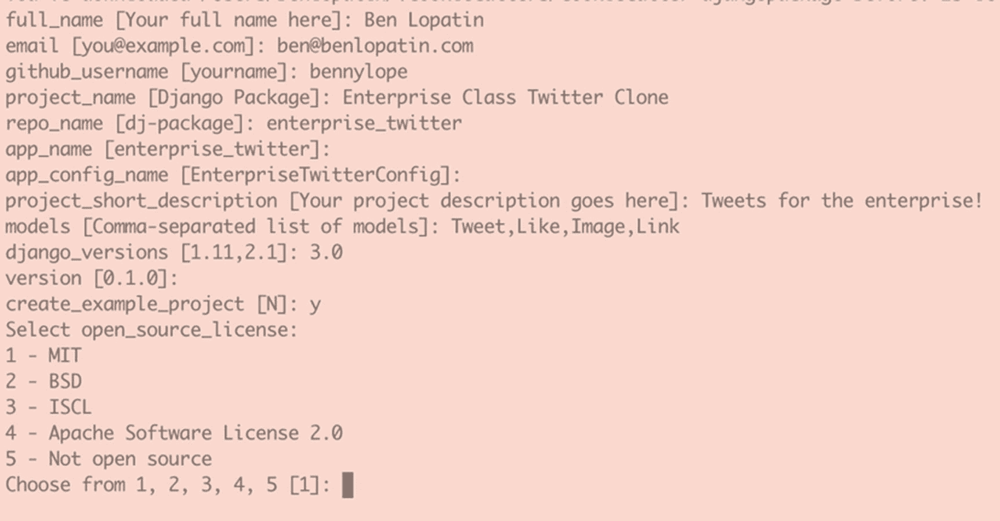

# 24.使用应用模板

一旦你掌握了创建自己的独立应用的诀窍，你可能会想开始写更多。在这一点上，你可能会发现有很多你不想一遍又一遍地做的决定，还有一些你不想写的必要的样板文件。解决这个问题的一个办法是从模板开始创建应用。

在这一章中，我们将回顾一些从模板创建新的独立应用的选项，包括 Django 自己的 startapp 管理命令和古老的 Cookiecutter 工具。

## 启动应用

您可能已经了解并使用 Django 的 startapp 管理命令在您自己的 Django 项目中创建新的应用:

```py
./manage.py startapp myapp

```

默认情况下，该命令将采用一个应用名称，并基于 Django 包中的模板目录结构创建一个具有最小文件结构的目录，包括 models.py 和 tests.py 文件:

```py
myapp/
        migrations/
        __init__.py
        admin.py
        app.py
        models.py
        tests.py
        views.py

```

该命令的核心功能是在现有项目的环境中创建应用。然而，该命令没有理由不能用于在其他任何地方创建应用结构；只需使用 django-admin 脚本:

```py
django-admin startapp myapp

```

这本身并不十分有用，因为唯一的好处是在一个特定的目录中创建了一个除空白文件之外的小集合。这可以通过创建和使用您自己的模板目录并使用- template 标志向 startapp 命令提供一个参数来改进，例如:

```py
django-admin.py startapp myapp --template ~/app.template

```

通过使用您自己的模板，您不仅可以选择使用不同的文件，还可以用常用的导入和您使用的其他代码预先填充它们。startapp 命令支持一些特定的上下文变量，包括应用名称，因此您还可以在这些文件中包含一些特定于应用的引用。此外，您可以更改整个结构，包括将应用作为一个包放在父目录中，其中包含您的设置文件、自述文件等。

如果你每次都基于完全相同的结构和特性集来创建应用，这种策略可能就足够了。然而，最低限度支持的模板上下文意味着即使有模板支持，也没有多少可配置的空间。

## 饼干成型切割刀

对于更健壮的替代方法，可以考虑使用 Cookiecutter。Cookiecutter 是一个 Python 包，被描述为“一个从 cookiecutter(项目模板)创建项目的命令行实用程序”。使用 Jinja 模板和 cookiecutter JSON 配置文件的组合，您可以在交互式提示符下基于单个 cookiecutter 创建高度可配置的项目。

在使用 pip、brew(在 macOS 上)或 apt-get(在 Debian 上)进行安装之后，从远程模板创建项目是一个简单的命令:

*   值得注意的是，虽然 cookiecutter 是一个 Python 包，并在 Python 社区中广泛使用，但 Cookiecutter 项目模板可以被创建并用于任何类型的项目，与语言无关。

```py
cookiecutter https://location.com/of-the-cookiecutter.git

```

也许比 cookiecutter 提供的特性集更重要的是公开共享的 Cookiecutter 项目模板社区，包括用于创建“普通”Python 包和 Django 独立应用的模板。使用社区构建的模板的好处是多方面的，包括消除从零开始创建模板所需的时间和各种决策，以及“免费”获得大量已经过众多用户审核的最佳实践。

主要缺点是，模板可能会排除一些您想要的特性，但更多的是，它们可能过于复杂且特性丰富，无法满足您的需求。编辑可能比从头开始更费力。在最流行的 Django 包 cookiecutter，py Danny/cookiecutter-Django package 中，没有包含太多过于具体的决定，这意味着它是一个安全的起点，不会添加不必要的 cruft。它将执行一个顶级包(而不是使用源目录),并且特定的 Python 和 Django 版本可能不是最新的。谢天谢地，你可以改变这些事情。图 [24-1](#Fig1) 提供了 py Danny/cookiecutter-Django package 为配置新的 Django 独立应用提供的提示示例。



图 24-1

py Danny/cookiecutter-django package 提供的提示

有两种方法可以创建您自己的 cookiecutter 项目模板来启动 Django 独立应用:从头开始或者修改现有的项目模板。修改现有的 cookiecutter 非常简单，只需克隆源代码库，进行必要的修改，并使用您的本地克隆作为模板。

```py
cookiecutter path/to/local/cookiecutter

```

改编一个现有的模板意味着你不必从头开始一切，从计算文件的模板名称到决定如何跟踪各种包的依赖关系。如果你需要的改变太激进，你可以从头开始。从头开始时，请记住，尽管模板有巨大的价值，但模板的核心是将文件从一个源复制到另一个源。换句话说，用尽可能少的配置创建您的结构，只在您需要的时候开始并构建可配置性。

## 摘要

在这一章中，我们看了从模板创建新的 Django 独立应用的两种方法:使用 Django 的 startapp 命令和通用项目模板工具 Cookiecutter。两者都可以与定制的起始模板一起使用，以加强后续 Django 独立应用的项目设计决策；然而，Cookiecutter 的模板比 startapp 更灵活，应该作为独立的应用模板解决方案优先考虑。