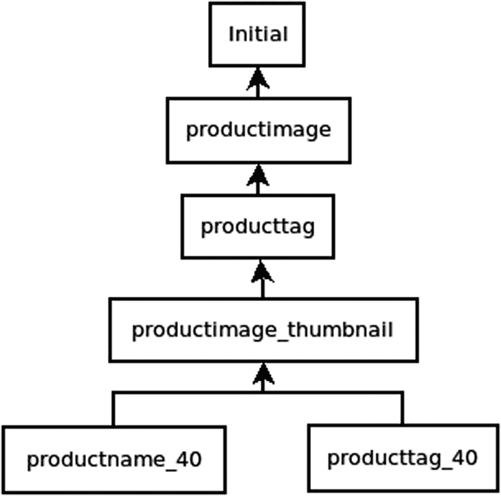
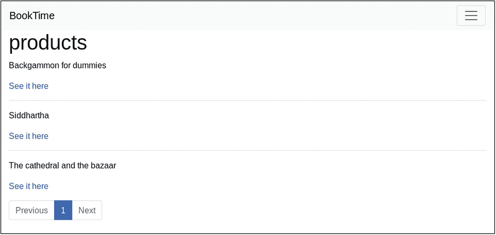

# 3.将产品目录添加到网站

在这一章中，我们将开始为我们的 BookTime 网站构建产品页面，这些页面将由数据库中包含的数据驱动。我们还将看到如何操作数据以及如何从 CSV 文件导入数据。

本章介绍

*   姜戈奥姆

*   迁移

*   管理命令

*   信号

*   `ListView`和`DetailView`

*   上传文件管理

## 创建第一个模型

Django 有一个叫做 ORM 的层，代表对象关系映射器。这是软件中的一种已知模式，已经存在多年了。它包括将从数据库加载的所有行包装到一系列模型中。模型是 Python 对象，其属性对应于数据库行中的列。

模型有与底层数据库行交互的方法:`save()`将模型属性的任何更改写回数据库，`delete()`删除数据库行。

这些模型首先被声明为 Python 类，继承自`django.db.models.Model`。为了让 Django 检测添加到系统中的任何新模型，它们必须包含在文件`models.py`中(或者包含在模型包中，就像我们在第 [2](02.html) 章中对测试所做的那样)。

### 产品

我们公司需要可视化关于其产品的数据，所以我们将从一个`Product`模型开始。要创建它，请在空文件`models.py`中写入以下内容:

```py
from django.db import models

class Product(models.Model):
    name = models.CharField(max_length=32)
    description = models.TextField(blank=True)
    price = models.DecimalField(max_digits=6, decimal_places=2)
    slug = models.SlugField(max_length=48)
    active = models.BooleanField(default=True)
    in_stock = models.BooleanField(default=True)
    date_updated = models.DateTimeField(auto_now=True)

```

分析前面的模型，您会注意到它是一个具有许多属性的类。那里的所有属性最终都是从`django.db.models.fields.Field`继承的，它们大致映射到数据库类型。例如，`CharField`映射到 SQL 类型`VARCHAR`，`IntegerField`映射到 SQL 整数，`BooleanField`映射到 SQL 布尔值，等等。

传递给字段构造函数的许多属性表示进一步的 SQL 说明符。以`CharField`为参考，`max_length`是允许的最大字符数，它作为参数传递给`VARCHAR`:这个最大值是在数据库级强制的。

Django 的其他部分也使用这些属性。例如,`blank`由 Django admin 使用。`auto_now`(仅适用于日期/日期时间字段)由 Django 管理:它自动使用模型的最后修改时间来更新字段。每个字段都有自己可能的配置。

一旦我们在文件中声明了模型，它仍然不能工作。我们需要首先创建一个迁移。迁移是一些特殊的文件，包含一系列创建表、添加列、删除列等数据库指令。所有数据定义语言(DLL)命令(创建和更改模式的命令)都封装在迁移文件中使用的 Python API 中。

虽然这些迁移文件可以手动创建，但是 Django 提供了`makemigrations`命令来自动创建它们。在大多数情况下，它像预期的那样工作，如下所示。对于一些特别困难的情况，自动创建可能无法创建正确的迁移。在这些情况下，必须手动纠正。

```py
$ ./manage.py makemigrations
Migrations for 'main':
  main/migrations/0001_initial.py
    - Create model Product

```

为了说明我之前提出的关于包含 DDL 命令的迁移的观点，下面是我们刚刚运行的一个例子:

```py
from django.db import migrations, models

class Migration(migrations.Migration):

    initial = True

    dependencies = [
    ]

    operations = [
        migrations.CreateModel(
            name='Product',
            fields=[
                ('id', models.AutoField(auto_created=True,
                                        primary_key=True,
                                        serialize=False,
                                        verbose_name='ID')),
                ('name', models.CharField(max_length=32)),
                ('description', models.TextField(blank=True)),
                ('price', models.DecimalField(decimal_places=2,
                                              max_digits=6)),
                ('slug', models.SlugField(max_length=48)),
                ('active', models.BooleanField(default=True)),
                ('in_stock', models.BooleanField(default=True)),
                ('date_updated', models.DateTimeField(auto_now=True)),
            ],
        ),
    ]

```

注意文件中有一个额外的`id`字段。当您的模型中没有字段明确具有属性`primary_key=True`时，这是由 Django 自动添加的。ORM 需要一个主键来将 Python 对象映射到数据库行。

### 产品图像

对于任何产品目录来说，每个产品都必须有一个图片。在我们的例子中，我们希望每个产品可以有任意数量的图像。为了实现这一点，关于图像的信息需要放在一个单独的表中，我们可以通过外键关系将它链接回`Product`模型:

```py
class ProductImage(models.Model):
    product = models.ForeignKey(
        Product, on_delete=models.CASCADE
    )
    image = models.ImageField(upload_to="product-images")

```

与之前的模型相比，这里有几个更复杂的字段。`ForeignKey`是存储链接`Product`模型主键的字段。ORM 使用它在被访问时自动运行连接操作。

`ImageField`是`FileField`的子类，它专门为上传的图像提供了一些额外的功能。这些额外的功能需要一个叫做`Pillow`的额外的库。要安装它，需要运行`pipenv install Pillow`。

此时，我们可以再次运行 Django `./manage.py makemigrations`命令。它将为这个模型生成一个新的迁移。迁移将包含一个`CreateModel`指令和三个字段，两个刚刚引入的字段和一个`id`字段。

### ProductTag(产品标签)

我们要介绍的最后一个模型是作为类别概括的“标签”概念:一个产品可能有一个或多个标签，一个标签可能包含一个或多个产品。

```py
class ProductTag(models.Model):
    products = models.ManyToManyField(Product, blank=True)
    name = models.CharField(max_length=32)
    slug = models.SlugField(max_length=48)
    description = models.TextField(blank=True)
    active = models.BooleanField(default=True)

```

Django 提供了一种特殊类型的字段`ManyToManyField`，它自动在两个表之间创建一个链接表，在本例中是 Product Tags 和 Products。这个链接表允许您创建任何标签可以与任何产品相关联的关系，反之亦然。

这是目前的最后一种型号。记住要为此生成迁移，然后您可以通过运行`migrate`命令来运行它们:

```py
$ ./manage.py migrate
Operations to perform:
  Apply all migrations: admin, auth, contenttypes, main, sessions
Running migrations:
  ...
  Applying main.0001_initial... OK
  Applying main.0002_productimage... OK
  Applying main.0003_producttag... OK

```

后面的章节将介绍更多的模型，但是在本章的剩余部分，我们将关注在这三个模型之上实现功能。

### 缩略图生成

在这个阶段，我们已经有足够的东西来构建新的网页，但在此之前，我们将为`ProductImage`模型添加一些额外的功能:缩略图。

我们不想为网络客户提供太大的图像，因为加载时间太长，客户会因为我们的网站无响应而离开。

我们需要向模型添加一个新的`ImageField`字段，它将保存缩略图:

```py
class ProductImage(models.Model):
    ...
    thumbnail = models.ImageField(
        upload_to="product-thumbnails", null=True
    )

```

在其上运行`makemigrations`命令将生成一个带有`AddField`指令的新迁移:

```py
from django.db import migrations, models

class Migration(migrations.Migration):

    dependencies = [
        ('main', '0003_producttag'),
    ]

    operations = [
        migrations.AddField(
            model_name='productimage',
            name='thumbnail',
            field=models.ImageField(null=True,
                                    upload_to='product-thumbnails'),
        ),
    ]

```

添加之后，这个字段的内容需要自动填充，为此，我们将使用 Django 信号。信号是在特定事件发生时运行代码的一种方式，Django 提供了许多钩子将它们连接到 ORM 操作。

信号在某些情况下非常有用，但你应该谨慎使用。使用大量信号的应用可能会变得更难调试，因为它们的执行顺序是不确定的。

编写信号处理程序时的惯例是将它们放在相关 Django 应用中的一个名为`signals.py`的文件中，在我们的例子中是`main`。这里我们将放入生成缩略图的代码:

```py
from io import BytesIO
import logging
from PIL import Image
from django.core.files.base import ContentFile
from django.db.models.signals import pre_save
from django.dispatch import receiver
from .models import ProductImage

THUMBNAIL_SIZE = (300, 300)

logger = logging.getLogger(__name__)

@receiver(pre_save, sender=ProductImage)
def generate_thumbnail(sender, instance, **kwargs):
    logger.info(
        "Generating thumbnail for product %d",
        instance.product.id,
    )
    image = Image.open(instance.image)
    image = image.convert("RGB")
    image.thumbnail(THUMBNAIL_SIZE, Image.ANTIALIAS)
    temp_thumb = BytesIO()
    image.save(temp_thumb, "JPEG")
    temp_thumb.seek(0)

    # set save=False, otherwise it will run in an infinite loop
    instance.thumbnail.save(
        instance.image.name,
        ContentFile(temp_thumb.read()),
        save=False,
    )
    temp_thumb.close()

```

一旦我们完成了这些，我们需要确保当 Django 应用由内部的 Django 应用注册中心启动时，这个文件被初始化。建议的方法是在`main/apps.py`内的应用配置中添加一个名为`ready()`的方法:

```py
from django.apps import AppConfig
class MainConfig(AppConfig):
    name = 'main'

    def ready(self):
        from . import signals

```

这足以确保信号被记录。现在，将为上传到网站的每个新产品图像调用处理程序。

鉴于这是我们第一次管理用户上传的文件，我们需要确保 Django 知道在哪里存储这些文件，以及从哪里提供这些文件。这两个值需要在`booktime/settings.py`中指定:

```py
...

MEDIA_ROOT = os.path.join(BASE_DIR, "media")
MEDIA_URL = "/media/"

```

为了测试信号，我们将编写一个 Django 测试。我们将把这个测试放在一个名为`main/tests/test_signals.py`的文件中。

下面的测试，以及本章中的许多测试，将依赖于一些引导数据(图像和 CSV)。这些数据包含在本书的代码库中。

```py
from django.test import TestCase
from main import models
from django.core.files.images import ImageFile
from decimal import Decimal

class TestSignal(TestCase):
    def test_thumbnails_are_generated_on_save(self):
        product = models.Product(
            name="The cathedral and the bazaar",
            price=Decimal("10.00"),
        )
        product.save()

        with open(
            "main/fixtures/the-cathedral-the-bazaar.jpg", "rb"
        ) as f:
            image = models.ProductImage(
                product=product,
                image=ImageFile(f, name="tctb.jpg"),
            )
            with self.assertLogs("main", level="INFO") as cm:
                image.save()

        self.assertGreaterEqual(len(cm.output), 1)
        image.refresh_from_db()

        with open(
            "main/fixtures/the-cathedral-the-bazaar.thumb.jpg",
            "rb",
        ) as f:
            expected_content = f.read()
            assert image.thumbnail.read() == expected_content

        image.thumbnail.delete(save=False)
        image.image.delete(save=False)

```

在测试中，我们正在创建一些数据库内容，假设测试基类继承自`TransactionTestCase`，那么任何创建的模型都会在测试结束时被重置。对于需要手动删除的文件，情况就不一样了。

## 查询集和管理器

在上一节中，我们讨论了模型，包括我们如何定义它们以及如何用它们创建数据库行。我们将研究的下一组 SQL 操作包括选择和更新，它们依赖于查询集和管理器。

管理器是负责针对模型构建查询的类。每个模型至少需要一个经理。默认情况下，`django.db.models.Manager`的实例通过模型中名为`objects`的属性连接到每个模型。管理器的所有标准方法都返回查询集。

QuerySet 是从数据库加载的模型的集合。查询集由管理器实例构造和填充。QuerySets 也有可以用来进一步过滤模型的方法，比如`filter()`或`exclude()`。查询集类似于 Python 列表:它们可以被切片，并且可以用一个`for`循环进行迭代。

这两个方法接受表示字段查找的关键字参数，Django 在查询时将其转换为 WHERE 子句。字段查找以`field__lookuptype=value`的形式表示。如果您省略了`lookuptype`部分，则假设您想要检查相等性。

下面是一些使用默认管理器对之前创建的模型进行查询的示例:

*   `Product.objects.all()`:返回所有产品

*   `Product.objects.filter(price__gt=Decimal("2.00"))`:返回价格大于 2.00 的产品

*   `Product.objects.filter(price__lte=Decimal("2.00"))`:返回价格小于(或等于)2.00 的产品

*   `Product.objects.exclude(price__gt=Decimal("12.00"))`:返回价格大于 12.00 的产品

*   `Product.objects.filter(price=Decimal("2.00"))`:返回价格正好为 2.00 的产品

*   `Product.objects.filter(name__icontains="cathedral")`:返回名称中包含单词“cathedral”的产品(不区分大小写)

*   `...filter(name__startswith="The"`，`price__gt=Decimal("9.00"))`:返回带有 AND 的两个子句的组合

所有前面的查询都限于一个表。如果需要匹配其他表中的字段，Django 提供了一种在查询时构建连接的方法。`Product.objects.filter(producttag__name="sci-fi")`就是这样的一个例子。它将返回与标签“sci-fi”相关联的产品，为了进行计算，它构建了两个额外的连接:一个连接到链接表，另一个连接到标签表。

如果您想构建更高级的查询，如 OR 查询或引用其他字段的查询，您需要使用`django.db.models.Q`对象或`django.db.models.F`对象。以下是一些例子:

*   `...filter(Q(name__startswith="The") | Q(price__gt=Decimal("9.00")))`:返回名称以“The”开头或价格大于 9.00 的产品。

*   `...filter(price__gt=F("price") – 1)`:返回价格大于价格本身减 1 的产品。这是一个愚蠢的例子来证明它是如何工作的。

现在我们知道了经理是如何工作的，我们将创建一个。这样做的原因是为了添加额外的方法来返回经过筛选的查询集。假设我们在`Product`模型中有一个`active`字段，我们将添加一个带有过滤器的管理器:

```py
class ActiveManager(models.Manager):
    def active(self):
        return self.filter(active=True)

```

声明之后，我们将通过覆盖一个由约定`objects`调用的属性来将其连接到模型:

```py
class Product(models.Model):
    ...

    objects = ActiveManager()

```

这个方法将可以像前面的例子一样使用:`Product.objects.active()`只返回活动的产品。为了完成这个功能，我们需要编写测试。这里有一个有效的方法:

```py
from decimal import Decimal
from django.test import TestCase
from main import models

class TestModel(TestCase):
    def test_active_manager_works(self):
        models.Product.objects.create(
            name="The cathedral and the bazaar",
            price=Decimal("10.00"))
        models.Product.objects.create(
            name="Pride and Prejudice",
            price=Decimal("2.00"))
        models.Product.objects.create(
            name="A Tale of Two Cities",
            price=Decimal("2.00"),
            active=False)
        self.assertEqual(len(models.Product.objects.active()), 2)

```

## 迁移

考虑到数据库模式管理的影响力，它应该有自己的章节。我们已经看到，迁移是 Django 在模型更改后应用数据库更改的方式。这些迁移文件一旦生成，就是项目的一部分。它们需要被置于源代码控制之下，并在参与项目的每个人之间共享。

执行迁移时，需要了解一些命令:

*   `makemigrations`:生成移植文件(Python 语言)，以后可以修改

*   `migrate`:运行未按顺序应用的迁移文件

*   `showmigrations`:列出已应用或未应用的迁移

*   `sqlmigrate`:显示迁移的 SQL

记住这些命令，值得再看一看我们到目前为止生成的迁移文件，并讨论迁移依赖关系。如果您打开任何迁移文件，您会注意到一个名为`dependencies`的属性。这用于构建依赖图。我们的如图 [3-1](#Fig1) 所示。


图 3-1

迁移

### 方向性

使用命令`migrate`，迁移可以向前或向后运行，这意味着应用更改或恢复已经应用的更改。为了让这种双向性发挥作用，在创建迁移时，应该以可逆的方式构建迁移。反向操作的一些示例如下

*   添加字段时，与删除字段相反。

*   添加表格时，与删除表格相反。

*   当删除一个可空的字段时，反过来就是将它添加回去。

然而，有些情况是不可逆转的。一些例子是不可空字段移除和将文本数据转换回数字。进行迁移时，我们应该避免进行不可逆的迁移。

作为双向性给我们的可能性的概述，我们将从分析当前数据库状态开始:

```py
$ ./manage.py showmigrations main
main
 [X] 0001_initial
 [X] 0002_productimage
 [X] 0003_producttag
 [X] 0004_productimage_thumbnail

```

我们已经应用了所有迁移，但是如果我们愿意，我们可以恢复它们。使用`migrate`命令可以恢复它们，或者向后应用它们:

```py
$ ./manage.py migrate main 0003_producttag
Operations to perform:
  Target specific migration: 0003_producttag, from main
Running migrations:
  Rendering model states... DONE
  Unapplying main.0004_productimage_thumbnail... OK

```

在多个分支上工作时，恢复/应用迁移非常有用。如果不同版本的代码需要不同的数据库状态，这允许您切换它。要重新应用，我们只需使用`migrate`命令，无需指定迁移:

```py
$ ./manage.py migrate main
Operations to perform:
  Apply all migrations: main
Running migrations:
  Applying main.0004_productimage_thumbnail... OK

```

### 合并迁移

当使用 Git 这样的版本控制系统时，创建分支并独立地处理相同代码库的副本是非常容易的。鉴于 Django 中的数据库结构是通过 Python 代码管理的，两个分支可能包含两组不同的模型。

两个源代码控制系统都有合并代码的方法，但是在这样做之后，我们可能会遇到这样的情况:多个迁移位于依赖图的顶部。一个例子是说明这一点的最好方法。假设在分支“A”上，有人将产品的名称字段编辑为 40 个字符，而不是当前的 32 个字符。`makemigrations`的结果将是

```py
./manage.py makemigrations -n productname_40
Migrations for 'main':
  main/migrations/0005_productname_40.py
    - Alter field name on product

```

但是在另一个分支“B”上，其他人编辑了同一个 Django 应用的模型(在我们的例子中，`main`)。此人将标签的名称改为 40 个字符长:

```py
$ ./manage.py makemigrations -n producttagname_40
Migrations for 'main':
  main/migrations/0005_producttagname_40.py
    - Alter field name on producttag

```

当需要将其合并到分支时，我们将有两个“0005”迁移，它们都依赖于同一个基础。如果我们试图在这种情况下运行`migrate`,我们会得到一个错误:

```py
$ ./manage.py migrate
CommandError: Conflicting migrations detected;...
...multiple leaf nodes in the migration graph:
(0005_productname_40, 0005_producttagname_40 in main).

To fix them run 'python manage.py makemigrations --merge'

```

这是因为 Django 不允许迁移图有两个头部，这是当前状态(如图 [3-2](#Fig2) 所示)。



图 3-2

双重移民

如果我们运行推荐的`makemigrations --merge`命令，我们将通过一个特殊的空迁移来纠正这个问题，该迁移依赖于我们在分支 A 和 B 中创建的每个迁移(参见图 [3-3](#Fig3) )。


图 3-3

合并后的迁移

### 数据迁移

除了模式更改之外，还可以使用迁移来加载数据或转换现有数据。例如，在通过三步过程更改字段类型时，通常会进行类型转换:

1.  添加目标字段的模式迁移。

2.  数据迁移，将数据转换并保存到新字段。

3.  架构迁移以删除原始字段。

为了说明它们的用法，我们将关注一个更简单的用例。让我们创建一个将产品名称大写的数据迁移。为此，我们从空迁移开始:

```py
$ ./manage.py makemigrations main --empty -n productname_capitalize

```

生成的文件需要填充我们的代码:

```py
from django.db import migrations

def capitalize(apps, schema_editor):
    Product = apps.get_model('main', 'Product')
    for product in Product.objects.all():
        product.name = product.name.capitalize()
        product.save()

class Migration(migrations.Migration):
    ...

    operations = [
        migrations.RunPython(
            capitalize,
            migrations.RunPython.noop
        ),
    ]

```

我们没有使用像`CreateModel`或`AlterField`这样的操作，而是使用一个叫做`RunPython`的底层操作，它采用一个向前函数和一个向后函数。在我们的例子中，我们指定了一个 noop backward 函数，它将允许我们不做任何事情而返回，而不是引发一个异常。

一旦我们应用这一点，所有当前产品的名称都将大写。认识到这种迁移只应用一次是很重要的。如果我们的数据转换必须独立于数据库更改来应用，那么迁移可能不是最好的方法。

需要注意的一点是，在向前/向后函数中，我们必须使用那种特殊的方式来导入模型。这是因为在执行迁移时，数据库模式将不同于模型文件中声明的模式。`apps.get_model()`方法将返回旧模型，从它的自定义方法中剥离出来。

## 通过 Django admin 管理数据

Django 经常被引用的杀手级特性之一是它的管理界面。这是一个创建、更新和删除系统中任何模型的 UI。它还提供了一个认证和许可系统，用于为不同的用户分配不同级别的权限。

Admin 是一个非常有用的免费工具；它只需要被激活。为此，我们将首先创建一个名为`main/admin.py`的文件:

```py
from django.contrib import admin
from . import models

admin.site.register(models.Product)
admin.site.register(models.ProductTag)
admin.site.register(models.ProductImage)

```

一旦我们完成了这些，我们需要创建 Django 项目的第一个用户。它将是管理员用户。Django 没有任何初始数据，因此这一步需要手动完成。为此，有一个名为`createsuperuser`的 Django 命令:

```py
$ ./manage.py createsuperuser
Username (leave blank to use 'flagz'): admin
Email address: me@site.domain
Password:
Password (again):
Superuser created successfully.

```

这个应该够开始用了。默认情况下，可以在`http://localhost:8000/admin/`访问管理界面。

当使用管理界面时，用户将登陆其登录页面，一旦登录，将看到 Django 应用划分的模型列表，如图 [3-4](#Fig4) 所示。可以单击每个模型名称，这将导致一个视图，其中列出了模型的所有实例。


图 3-4

Django 管理初始页面

在这个阶段，您还没有任何数据。要完全尝试管理界面，您应该至少插入一个产品。继续插入你最喜欢的书的书名。您可以在产品列表视图中执行此操作。单击产品，然后单击右上角的添加按钮。

对于任何模型列表视图，页面上都有一些东西。右上角有一个按钮，用于添加所选模型的新实例。在左侧，有一个模型列表，以及每个模型的复选框。单击复选框后，可以对选定的模型应用操作。

管理操作是可以应用于一组模型(同类)的操作。型号列表上方的下拉框中列出了可用的操作。默认情况下，唯一可用的操作是删除。

### 简单定制

在这一点上，再多一点努力，我们就可以让管理界面对我们更有用。以下是列表视图的一些简单自定义:

*   `list_display`是字段列表，如果指定，将用于在模型列表视图中创建列。除了字段，这些也可以是函数。

*   `list_filter`是将用作该列表过滤器的字段列表。选中时，将只显示所有模型的子集。

*   `search_fields`是一个选项，当它出现时，会指示 Django 添加一个搜索框，可以用来搜索指定的字段。

*   `list_editable`是一个字段列表，它将使`list_display`中指定的一些列可编辑。

当可视化单个项目而不是项目列表时，请使用以下内容:

*   如果您有一个字段引用了另一个包含许多实体的表，那么`autocomplete_fields`非常有用。由于选项的数量，这可能会使使用标准的选择框变得困难。

*   `prepopulated_fields`对段塞油田有用。它告诉管理界面从另一个字段自动创建 slug。

*   `readonly_fields`是不可编辑的字段列表。

使用所有这些定制，我们可以组合出比默认配置更友好的东西，其结果如图 [3-5](#Fig5) 所示:


图 3-5

我们的产品管理员

```py
from django.contrib import admin
from django.utils.html import format_html

from . import models

class ProductAdmin(admin.ModelAdmin):
    list_display = ('name', 'slug', 'in_stock', 'price')
    list_filter = ('active', 'in_stock', 'date_updated')
    list_editable = ('in_stock', )
    search_fields = ('name',)
    prepopulated_fields = {"slug": ("name",)}

admin.site.register(models.Product, ProductAdmin)

class ProductTagAdmin(admin.ModelAdmin):
    list_display = ('name', 'slug')
    list_filter = ('active',)
    search_fields = ('name',)
    prepopulated_fields = {"slug": ("name",)}
    autocomplete_fields = ('products',)

admin.site.register(models.ProductTag, ProductTagAdmin)

class ProductImageAdmin(admin.ModelAdmin):
    list_display = ('thumbnail_tag', 'product_name')
    readonly_fields = ('thumbnail',)
    search_fields = ('product__name',)

    def thumbnail_tag(self, obj):
        if obj.thumbnail:
            return format_html(
                '' % obj.thumbnail.url
            )
        return "-"
    thumbnail_tag.short_description = "Thumbnail"

    def product_name(self, obj):
        return obj.product.name

admin.site.register(models.ProductImage, ProductImageAdmin)

```

这种配置将

*   列出产品时，显示列`name, slug, in_stock,`和`price`。在这四列中，`in_stock`将是可编辑的。更改产品是否有库存后，单击保存按钮保存更改。

*   使产品在指定的字段上可过滤。这些过滤器列在右侧。

*   在产品表上方添加搜索框。无论您搜索什么，Django 都会查找包含在指定字段中的字符串，忽略字母的大小写。

*   添加产品时，在输入产品名称的同时，即时计算 slug。

*   While working on the product tags, provide a similar configuration to the one of products (see Figure [3-6](#Fig6)).

    

    图 3-6

    标签管理

*   在选择属于特定标签的产品时添加自动完成功能。

*   在两列中显示图像，其内容将是 admin 类中指定的两个函数的返回值，其中一个函数返回 HTML。

*   Add a search box in the images list view. This search will be applied on the linked product table (using a JOIN) rather than the productimage table (see Figure [3-7](#Fig7)).

    

    图 3-7

    图像管理

此时，有几个问题需要解决。Django admin 在构建选择器或一般可视化项目时，依赖于它的字符串表示。在我们的例子中，自动完成需要一个好的字符串表示。要解决这个问题，我们需要向所有模型添加方法。这里有一个例子:

```py
class Product(models.Model):
    ...

    def __str__(self):
        return self.name

```

最后要解决的是提供用户上传的图片。此时，虽然提供了正确的图像和缩略图 URL，但是这些 URL 返回 404。我们需要在主 URL 文件`booktime/urls.py`中解决这个问题。

```py
from django.contrib import admin
from django.urls import path, include
from django.conf import settings
from django.conf.urls.static import static

urlpatterns = [
    path('admin/', admin.site.urls),
    path('', include('main.urls')),
] + static(settings.MEDIA_URL, document_root=settings.MEDIA_ROOT)

```

这就是我们现在要定制的。在接下来的章节中，我们将讨论更高级的特性。

## 管理命令

到目前为止，你已经在书中看到了几个命令，如`./manage.py runserver`或`./manage.py migrate`。在 Django，这些工具被称为*管理命令*。这些可以随意添加，但是有一些已经包含在内，随时可以使用。您可以使用`./manage.py`打印可用命令的完整列表。

`makemessages`和`compilemessages`用于管理 Django 中的翻译文件。如果您的项目的用户界面需要支持多种语言，您可以使用这些。

`check`是 Django 系统检查框架的接口，在启动任何 Django 命令时使用，以确保满足项目运行所需的所有条件。例如，如果您的项目依赖于环境中指定的一些配置变量，这将非常有用。

`dbshell`和`shell`是交互式命令行提示。`dbshell`将启动数据库命令行客户端，而`shell`将启动 Python 解释器，Django 项目已经初始化。

`loaddata`和`dumpdata`作为简单的数据加载机制非常有用。它们被用来引导一个数据库，其中包含来自*设备*的数据，这些数据是 Django 能够理解的格式的简单数据文件。它们可以是 JSON 或 XML，只要结构符合 Django 的要求，就可以不用任何额外的代码来管理它们。

我们将利用`loaddata`和`dumpdata`命令来管理标签。标签将是一个固定的集合，由开发人员管理，并且这个固定装置将被提交到存储库中。我们还将介绍 Django 的另一个功能，叫做*自然键*。

我们可以使用 Django admin 来创建它们。添加六个标签后(见图 [3-8](#Fig8) ，我们将使用`dumpdata`命令导出它们。


图 3-8

标签列表

### 序列化和自然键

*序列化*，在 Django 中，意思是将存储在数据库表中的数据转换成可以写入文件的东西。Django 支持 XML、JSON 和 YAML 文件格式。*反序列化*是相反的操作，从文件到填充的数据库表。

Django 通过助手函数和管理命令提供序列化和反序列化功能。我们现在将集中讨论管理命令。以下是如何使用`dumpdata`命令的示例:

```py
$ ./manage.py dumpdata --indent 2 main.ProductTag
[{
  "model": "main.producttag",
  "pk": 2,
  "fields": {
    "name": "Finance",
    "slug": "finance",
    "description": "",
    "active": true,
    "products": [
      16
    ]
  }
},
...

```

不幸的是，这不适合与我们的库一起发布。它包含许多特定于数据库实例的内部 id。

解决这个问题的一个方法是使用独立的 id，比如 UUIDs，但是它们对人不太友好。相反，我们将使用自然键，因此我们需要对当前模型做一些事情:

*   将`ManyToManyField`移出标签并移入`Product`模型

*   确保定义了标签的`__str__()`方法

*   定义标签`natural_key()`的方法

通过删除`ProductTag`模型中的`products`字段，并将其重新添加到`Product`模型中，可以很容易地完成第一个要点:

```py
class Product(models.Model):
    ...
    tags = models.ManyToManyField(ProductTag, blank=True)
    ...

```

在数据库级别，没有太大的变化:我们仍然有一个链接表。现在的区别是，这个链接更容易从产品中穿过。这个变化影响了 Django 管理，特别是`autocomplete_fields`设置，它也需要移动:

```py
class ProductAdmin(admin.ModelAdmin):
    ...
    autocomplete_fields = ('tags',)

```

第二个调整是添加`__str__()`方法，我们这样做的原因和我们已经做的一样，那就是可用性。

作为最后一步，我们将添加一个名为`natural_key()`的方法，它将返回标签自然键。在我们的例子中，我们将使用 slug 作为自然键。这背后的基本原理是，作为 URL 的一部分，slugs 不太可能改变(这里简化了一点)。

按照所有建议的更改，该类现在看起来应该是这样的:

```py
class ProductTag(models.Model):
    name = models.CharField(max_length=40)
    slug = models.SlugField(max_length=48)
    description = models.TextField(blank=True)
    active = models.BooleanField(default=True)

    def __str__(self):
        return self.name

    def natural_key(self):
        return (self.slug,)

```

有了这个模型，就有可能使用自然键而不是内部数据库键来运行`dumpdata`。我们还将把下面的内容输出到一个文件中，供以后使用。生成的文件将独立于内部标识符，因此在不同的数据库环境之间更容易移植。

```py
$ ./manage.py dumpdata --indent 2 --natural-primary main.ProductTag
[
{
  "model": "main.producttag",
  "fields": {
    "name": "Finance",
    "slug": "finance",
    "description": "",
    "active": true
  }
},
...

$ ./manage.py dumpdata --indent 2 --natural-primary main.ProductTag \
    > main/fixtures/producttags.json

```

### 如何使用自然键加载

当使用自然键加载数据时，Django 不能使用我们已经定义的`natural_key()`方法，因为模型加载是通过管理器进行的，而不是模型本身。为了能够加载回标签，我们需要为该模型创建一个管理器，并实现`get_by_natural_key()`方法:

```py
class ProductTagManager(models.Manager):
    def get_by_natural_key(self, slug):
        return self.get(slug=slug)

class ProductTag(models.Model):
    ...
    objects = ProductTagManager()
    ...

```

如果您遵循了前面的所有步骤，加载(或重新加载)它应该只是一个命令操作。为了测试这一点，我们可以在文件中添加一些标签描述并重新加载它们。如果数据已经存在于数据库中，它将被更新。

```py
$ ./manage.py loaddata main/fixtures/producttags.json
Installed 6 object(s) from 1 fixture(s)

```

## 使用管理命令导入数据

除了已经包含的管理命令之外，项目还可以定义新的命令。一旦创建，就可以使用`manage.py`脚本启动它们。

我们将创建一个专用命令来导入产品数据。

为了创建管理命令，您需要在`main/management/commands/`中添加一个文件。您选择的文件名将成为命令名。每个文件将有一个管理命令；如果您想要创建多个命令，您将需要多个文件。

每个管理命令都可以接受选项:这些选项是用`argparse`解析的，Django 在指定这些选项时也有一些约定。

要开始创建管理命令的任务，我们首先需要设置一些基本文件夹:

```py
$ mkdir main/management
$ touch main/management/__init__.py
$ mkdir main/management/commands
$ touch main/management/commands/__init__.py

```

这些命令将使这些文件夹成为 Python 模块，使 Django 能够检查和执行它们的内容。接下来我们将创建`main/management/commands/import_data.py`，它将包含进口商:

```py
from django.core.management.base import BaseCommand

class Command(BaseCommand):
    help = 'Import products in BookTime'

    def handle(self, *args, **options):
        self.stdout.write("Importing products")

```

这足以让命令执行，这里的约定清晰可见。这些文件需要包含一个继承自`django.core.management.base.BaseCommand`并实现`handle()`功能的 Python 类。这也会让 Django 发现它。

以下是一些交互示例:

```py
$ ./manage.py
Type 'manage.py help <subcommand>' for help on a specific subcommand.

Available subcommands:

...
[main]
    import_data
...

$ ./manage.py import_data
Importing products

```

`handle()`方法的主体是导入逻辑所在的地方。假设我们需要从 CSV 文件中填充数据，如下所示:

```py
name,description,tags,image_filename,price
The cathedral and the bazaar,A book about open source methodologies,Open source|Programming,cathedral-Siddhartha,A novel by Hermann Hesse,Religion|Narrative,siddhartha.jpg,6.00
Backgammon for dummies,How to start playing Backgammon,Games|Manual,backgammon.jpg,13.00

```

要在本节稍后测试该命令，请将前面的数据保存在一个文件中。

这个文件包含我们数据库结构中分散在不同表中的字段。因此，我们不能在这里使用`loaddata`命令。另一个原因是 CSV 不是 Django 处理的序列化格式之一。这是一个导入前面文件的实现:

```py
from collections import Counter
import csv
import os.path
from django.core.files.images import ImageFile
from django.core.management.base import BaseCommand
from django.template.defaultfilters import slugify
from main import models

class Command(BaseCommand):
    help = "Import products in BookTime"

    def add_arguments(self, parser):
        parser.add_argument("csvfile", type=open)
        parser.add_argument("image_basedir", type=str)

    def handle(self, *args, **options):
        self.stdout.write("Importing products")
        c = Counter()
        reader = csv.DictReader(options.pop("csvfile"))
        for row in reader:
            product, created = models.Product.objects.get_or_create(
                name=row["name"], price=row["price"]
            )
            product.description = row["description"]
            product.slug = slugify(row["name"])
            for import_tag in row["tags"].split("|"):
                tag, tag_created = models.ProductTag.objects.get_or_create(
                    name=import_tag
                )
                product.tags.add(tag)
                c["tags"] += 1
                if tag_created:
                   c["tags_created"] += 1
            with open(
                os.path.join(
                    options["image_basedir"],
                    row["image_filename"],
                ),
                "rb",
            ) as f:
                image = models.ProductImage(
                    product=product,
                    image=ImageFile(
                        f, name=row["image_filename"]
                    ),
                )

                image.save()
                c["images"] += 1
            product.save()
            c["products"] += 1
            if created:
                c["products_created"] += 1

        self.stdout.write(
            "Products processed=%d (created=%d)"
            % (c["products"], c["products_created"])
        )
        self.stdout.write(
            "Tags processed=%d (created=%d)"
            % (c["tags"], c["tags_created"])
        )
        self.stdout.write("Images processed=%d" % c["images"])

```

这个新的`import_data`命令的代码中有很多需要解释的地方。首先，`add_arguments`函数:管理命令可以接受命令行选项，Django 提供了一些对所有命令都可用的选项(例如 verbosity)，但是这个列表可以扩展。

我们还在所有 Django 选项之上添加了两个位置参数。第一个位置参数是要导入的 CSV 文件的路径，第二个是 images 目录的路径。`add_argument`的语法在`argparse`模块文档中有解释，这是 Django 正在使用的 Python 模块。

脚本参数的使用，而不是硬编码的变量，为这个脚本提供了灵活性。当在不同于您的机器环境的环境中运行这些导入时，您可以将它与其他命令(如`wget`或`gunzip`)结合使用，以下载和解压缩具有动态生成名称的临时文件夹中的档案。

打开 CSV 文件后，脚本循环遍历这些行，并尝试加载(或生成)具有相同名称/价格组合的产品。`get_or_create`函数返回两个值:一个模型和一个指示它是否是新模型的布尔标志。

一旦我们加载了一个产品，我们就通过循环浏览 CSV 文件中`tags`字段的所有标签来更新它的标签列表。鉴于 CSV 是一种平面格式，这个列表需要从其压缩形式(管道分隔列表)扩展。

一旦标签被插入，脚本试图通过用`os.path.join()`连接`basedir`和指定的文件名来打开图像。通过传递包装在一个`ImageFile`对象中的产品和打开的文件，创建了一个`ProductImage`模型的新实例，它添加了关于文件的额外信息。

在命令中，有几个对`self.stdout.write`的调用。这会写入标准输出。类似地，如果标准误差更可取，也可以使用`self.stderr.write`。

至于到目前为止出现的所有相当大的程序代码，这段代码需要测试，以确保它永远不会出错:

```py
from io import StringIO
import tempfile
from django.conf import settings
from django.core.management import call_command
from django.test import TestCase, override_settings
from main import models

class TestImport(TestCase):
    @override_settings(MEDIA_ROOT=tempfile.gettempdir())
    def test_import_data(self):
        out = StringIO()
        args = ['main/fixtures/product-sample.csv',
                'main/fixtures/product-sampleimages/']

        call_command('import_data', *args, stdout=out)

        expected_out = ("Importing products\n"
                        "Products processed=3 (created=3)\n"
                        "Tags processed=6 (created=6)\n"
                        "Images processed=3\n")

        self.assertEqual(out.getvalue(), expected_out)
        self.assertEqual(models.Product.objects.count(), 3)
        self.assertEqual(models.ProductTag.objects.count(), 6)
        self.assertEqual(models.ProductImage.objects.count(), 3)

```

如您所见，Django 提供了函数`call_command()`从 Python 本身调用管理命令，这在测试中非常方便。

在我们将示例 CSV 文件(以及一些图像)放在指定的位置后，就可以运行这个测试了。该测试断言 stdout 等于预期的结果，并且在导入之后出现的模型数量是应该的。

在测试中，使用了装饰器`override_settings`。它的目的是覆盖特定测试的 Django 设置。在本例中，我们创建了一个新的临时文件夹`MEDIA_ROOT`，因为我们要处理很多上传的文件。与数据库不同，Django 不清理这些文件。使用临时文件夹可以确保它最终会被操作系统清除。

对于所有涉及数据库的测试，Django 在运行这些测试之前，会创建一个临时使用的测试数据库。在测试运行结束时，此测试数据库将被删除。在我们的例子中，测试数据库将是一个新的 PostgreSQL 数据库，其名称与指定名称相同，只是添加了一个前缀`test_`。这种管理是自动的。

这个测试并不详尽:它没有测试 csv 文件是否存在，图像是否出现在`basedir`中，等等。这是留给你的练习。

## 添加产品列表页面

在这一章中，到目前为止，我们还没有做任何网站的工作，只有数据基础。现在是时候创建我们的第一个数据库驱动的网页了，从列出产品开始。我们可以利用另一个名为`ListView`的基于类的视图。Django 有很多 cbv 来帮助构建数据库驱动的视图，我们将在适当的时候使用它们。下面是我们将要使用的视图:

```py
from django.views.generic.list import ListView
from django.shortcuts import get_object_or_404
from main import models

class ProductListView(ListView):
    template_name = "main/product_list.html"
    paginate_by = 4

    def get_queryset(self):
        tag = self.kwargs['tag']
        self.tag = None
        if tag != "all":
            self.tag = get_object_or_404(
                models.ProductTag, slug=tag
            )
        if self.tag:
            products = models.Product.objects.active().filter(
                tags=self.tag
            )
        else:
            products = models.Product.objects.active()

        return products.order_by("name")

```

我们的视图利用了`ListView`，但是增加了一个定制:一个额外的过滤参数(tag)。根据`kwargs`的内容，它返回属于该标签的活动产品列表，或者如果指定了标签`all`，则返回所有活动产品。

`ListView`和我们目前看到的 cbv 一样，使用`template_name`进行渲染。它将在呈现视图时寻找该模板。请注意，与最初的视图不同，我们添加了一个额外的`main`。这是一个惯例，我们将开始使用它来反映其他数据库视图所做的事情。

这个视图还使用`paginate_by`参数透明地管理分页。

当这个视图的实例被创建时，属性`args`和`kwargs`被来自 URL 路由的信息填充。在我们的例子中，这个视图期望用 URL 路径中指定的标记来调用，而不是在 GET 参数中。另一方面，如果标签是一个 GET 参数，可以使用`self.request.GET`字典访问它。

函数`get_object_or_404`是一个非常有用的快捷方式:它返回一个对应于指定过滤器的对象，或者引发一个 404 异常(`django.http.Http404`)。Django 将捕获这个消息，并创建一个 404 状态的 HTML 响应(404 是“未找到”HTTP 状态代码)，如果可用的话，使用`404.html`模板。

要使用这个新视图，它需要 urlpatterns 中的一个条目:

```py
from main import views

...

urlpatterns = [
    path(
        "products/<slug:tag>/",
        views.ProductListView.as_view(),
        name="products",
    ),
    ...
]

```

这是项目中第一个具有可变路径的 URL。Django 将尝试使用接受字母、数字、连字符和下划线的`slug`转换器来转换由`<`和`>`包围的部分中的任何内容。

产品列表页面需要的最后一样东西是一个模板，它将存储在`main/templates/main/product_list.html`中:

```py



  <h1>products</h1>
  
    <p>{{ product.name }}</p>
    <p>
      <a href="">See it here</a>
    </p>
    
      <hr>
    
  
  <nav>
    <ul class="pagination">
      
        <li class="page-item">
          <a
            class="page-link"
            href="?page={{page_obj.previous_page_number}}">Previous</a>
        </li>
      
        <li class="page-item disabled">
          <a class="page-link" href="#">Previous</a>
        </li>
      
      
        <li
          class="page-item active">
          <a class="page-link" href="?page={{pagenum}}">{{pagenum}}</a>
        </li>

      
      
        <li class="page-item">
          <a class="page-link" href="?page={{page_obj.next_page_number}}">Next</a>
        </li>
      
        <li class="page-item disabled">
          <a class="page-link" href="#">Next</a>
        </li>
      
    </ul>
  </nav>


```

这个模板中有一些新的东西值得解释。我们在已经看到的现有基础模板和标签的基础上构建，并使用一个新的`for`标签。这个标记做 Python 中的等效标记所做的事情:它重复一个部分。我们将生成与列表中的元素一样多的 HTML 部分。

在`for`循环中，我们可以使用一个名为`forloop`的变量，它包含一系列我们可以使用的动态值。这个变量由 Django 自动设置。在我们的例子中，除了最后一个周期，我们为每个周期打印一个水平分隔符。

模板中的最后一部分打印分页部分。视图填充的`page_obj`变量包含一部分需要可视化的结果，以及一些页面信息，比如当前页面是什么，是否有下一个页面。图 3-9 显示了上面的模板在渲染时的样子。



图 3-9

产品列表视图

作为产品列表视图的最后一步，我们将添加它的测试。我们可以将它们添加到`test_views.py`文件中:

```py
...
from decimal import Decimal
from main import models

class TestPage(TestCase):
    ...

    def test_products_page_returns_active(self):
        models.Product.objects.create(
            name="The cathedral and the bazaar",
            slug="cathedral-bazaar",
            price=Decimal("10.00"),
        )
        models.Product.objects.create(
            name="A Tale of Two Cities",
            slug="tale-two-cities",
            price=Decimal("2.00"),
            active=False,
        )
        response = self.client.get(
            reverse("products", kwargs={"tag": "all"})
        )
        self.assertEqual(response.status_code, 200)
        self.assertContains(response, "BookTime")

        product_list = models.Product.objects.active().order_by(
            "name"
        )
        self.assertEqual(
            list(response.context["object_list"]),
            list(product_list),
        )

    def test_products_page_filters_by_tags_and_active(self):
        cb = models.Product.objects.create(
            name="The cathedral and the bazaar",
            slug="cathedral-bazaar",
            price=Decimal("10.00"),
        )
        cb.tags.create(name="Open source", slug="opensource")
        models.Product.objects.create(
            name="Microsoft Windows guide",
            slug="microsoft-windows-guide",
            price=Decimal("12.00"),
        )
        response = self.client.get(
            reverse("products", kwargs={"tag": "opensource"})
        )
        self.assertEqual(response.status_code, 200)
        self.assertContains(response, "BookTime")

        product_list = (
            models.Product.objects.active()
            .filter(tags__slug="opensource")
            .order_by("name")
        )

        self.assertEqual(
            list(response.context["object_list"]),
            list(product_list),
        )

```

假设产品列表页面总是返回数据库数据，那么每个测试都需要填充这些表。两个主要的执行路径是是否有带标签的查询，每个都有一个测试。

两个测试的最后一个断言是测试是否将正确的产品传递给模板进行呈现的断言。这里我们用`object_list`代替`page_obj`，但原理差不多。

我们使用`product_list`作为最后一个断言的预期结果。如您所见，在创建时，所有返回 querysets 的方法都是可链接的。这就是为什么可以将`active()`与`filter()`和`order_by()`一起使用。

### 路径转换器

我在前面简单提到了 URL 路径和转换器，以及`slug`转换器。路径转换器和`path()`函数是 Django 在 2.0 版本中的新增功能。它们是一种非常方便的快捷方式，而不是重复指定长而难读的正则表达式。

格式为`<type:name>`。Django 已经包含了一些路径转换器:

*   `str`匹配除字符`/`以外的任何非空字符串。

*   `int`匹配任何大于或等于零的整数。

*   `slug`匹配字母、数字、连字符和下划线。

*   `uuid`匹配 UUIDs。

*   `path`像`str`但也配`/`。

如果您有一些经常出现在项目中的标识符，并且不属于任何列出的类，那么您可以创建自己的转换器。在线文档解释了在需要时如何创建它们。

## 添加单个产品页面

为了完善这一章，我们将为单个产品创建一个可视化效果，比产品列表页面更详细。与`ListView`类似，我们可以利用另一个名为`DetailView`的视图。

与之前的视图不同，我们的详细视图版本不需要很多定制。我们将只定制模板和连接网址。我们将依赖它的约定，包括它构造模板名称的方式。在我们的例子中是`main/templates/main/product_detail.html`。

```py



  <h1>products</h1>
  <table class="table">
    <tr>
      <th>Name</th>
      <td>{{ object.name }}</td>
    </tr>
    <tr>
      <th>Cover images</th>
      <td>
        
          
        
      </td>
    </tr>
    <tr>
      <th>Price</th>
      <td>{{ object.price }}</td>
    </tr>
    <tr>
      <th>Description</th>
      <td>{{ object.description|linebreaks }}</td>
    </tr>
    <tr>
      <th>Tags</th>
      <td>{{ object.tags.all|join:","|default:"No tags available" }}</td>
    </tr>
    <tr>
      <th>In stock</th>
      <td>{{ object.in_stock|yesno|capfirst }}</td>
    </tr>
    <tr>
      <th>Updated</th>
      <td>{{ object.date_updated|date:"F Y" }}</td>
    </tr>
  </table>
  <a href="?product_id={{ object.id }}">Add to basket</a>


```

模板本身非常简单:它只显示变量`object`的一些属性，这是`DetailView`为模型实例定义的。然而，这个模板展示了模板过滤器的一个很好的例子。

模板过滤器是将一些值转换成另一个值的操作，这在数据有一些原始形式不能满足的可视化需求的情况下很有帮助。

`linebreaks`获取`description`字段的内容，并为字段中的每一个新行生成一个`<p>`标签。`join`用指定的分隔符连接字符串列表。`default`在当前输出为 None 的情况下输出其参数。

`yesno`将 true/false 转换为字符串 yes/no。`capfirst`将第一个单词大写。`date`在将日期对象转换成字符串时很有用，并且可以指定格式。这种情况下的格式仅为月和年。

使用过滤器的常见格式是`variable|filtername:arg1,arg2...`。有些过滤器接受参数，有些不接受。

模板中另一个值得一提的是相关模型是如何被遍历的。如果一个模型有另一个表的外键，只需指定相关管理器的名称就可以调用它们的方法。例如，模板中的`object.tags.all`相当于 Python 中的`object.tags.all()`。

Django 还有很多其他的过滤器。也有创建我们自己的过滤器的方法，我们将在本书的后面看到。

为了连接起来，下面是正确的 urlpattern:

```py
from django.views.generic.detail import DetailView
from main import models

urlpatterns = [
    path(
        "product/<slug:slug>/",
        DetailView.as_view(model=models.Product),
        name="product",
    ),
    ...

```

使用没有子类化的`DetailView`对于我们的用例来说已经足够好了。正因为如此，我们避免了编写任何 Python 代码，因此，没有必要为它编写自动化测试。图 [3-10](#Fig10) 显示了该页面的外观。


图 3-10

产品明细视图

## 摘要

在这一章中，我们定义了我们的第一个模型。我们对虚构公司在线销售的产品进行建模，包括描述性标签和所有链接到特定产品的图像。除了模型之外，我们还包括视图和 URL 来向网站用户显示这些数据。

我们谈到了移民。在 Django 中，迁移是数据库管理的一个重要部分。它曾经是一个独立的库，但在最近的版本中已经集成到框架中。

本章还介绍了 Django admin，这是一个供内部用户管理数据库内容的管理仪表板。在我们的例子中，我们创建面板来添加、更改和删除关于我们产品的数据。

我们还讨论了管理命令、它们是什么以及它们如何工作，以及模型序列化和反序列化。我们利用这两个概念从 CSV 文件创建了一个产品导入器。

在下一章中，我们将讨论如何在网上列出这些待售产品，以便可以通过网络直接下订单。