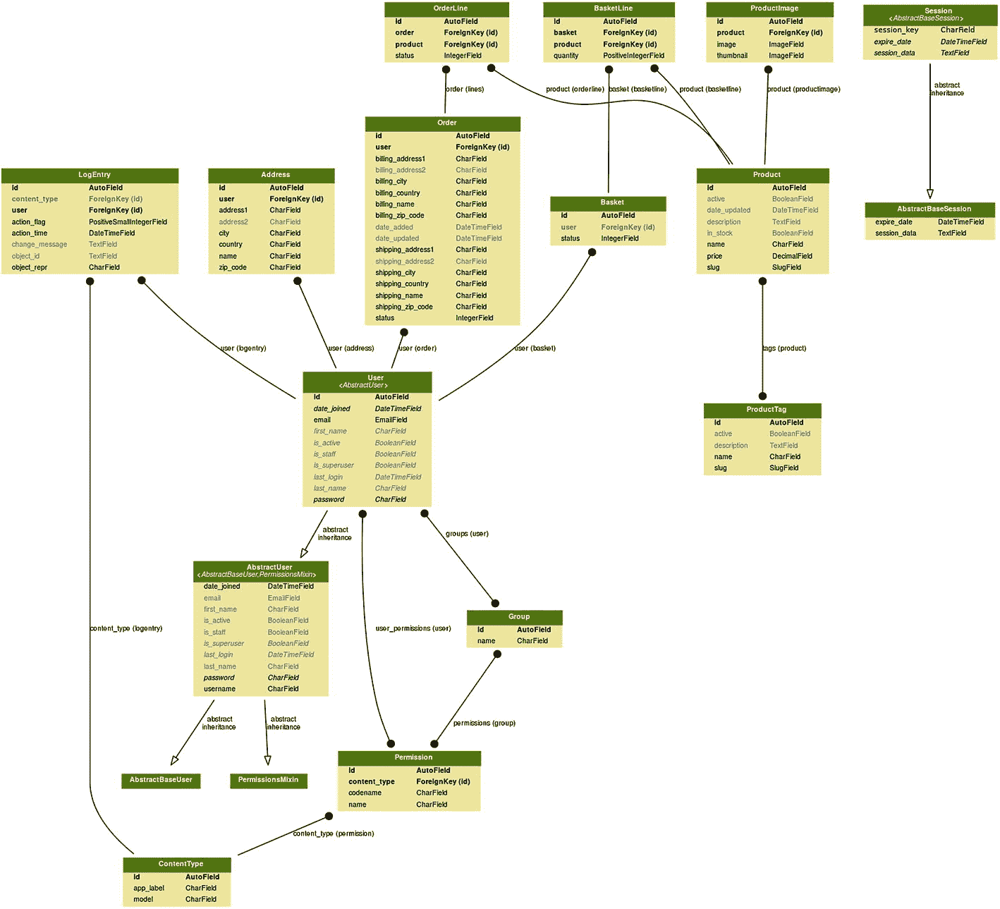
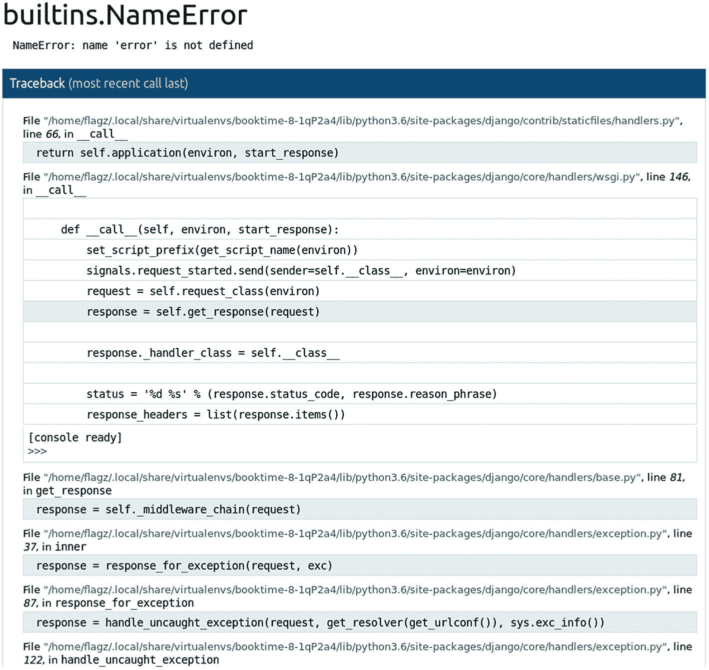
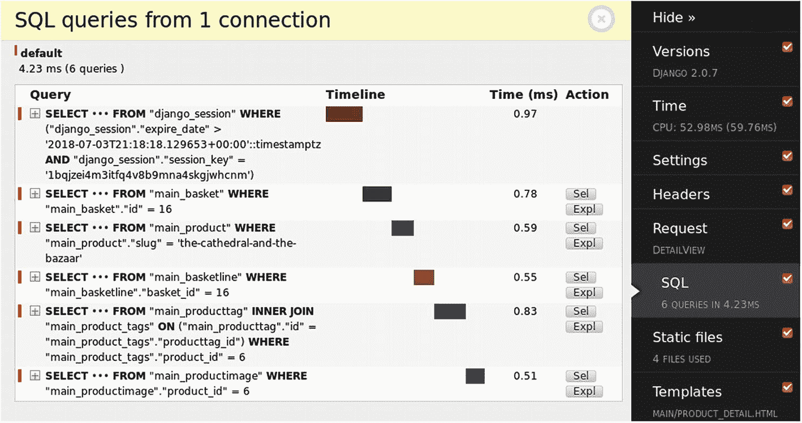
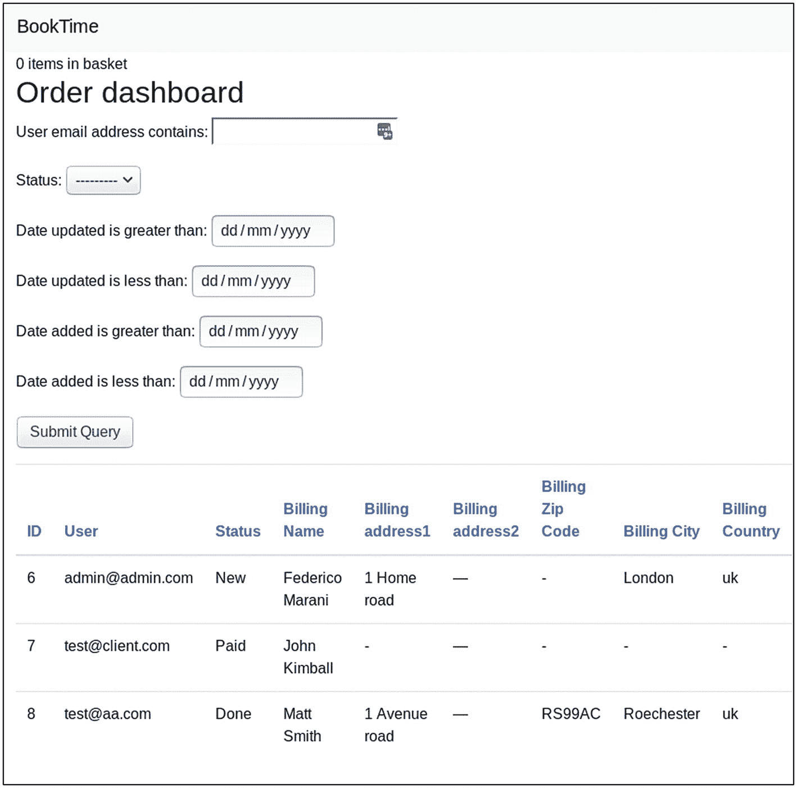
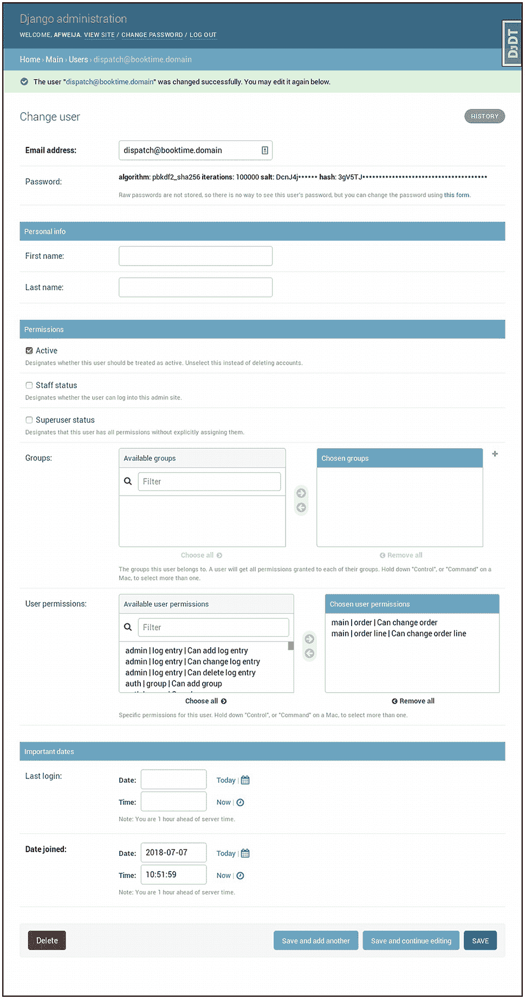
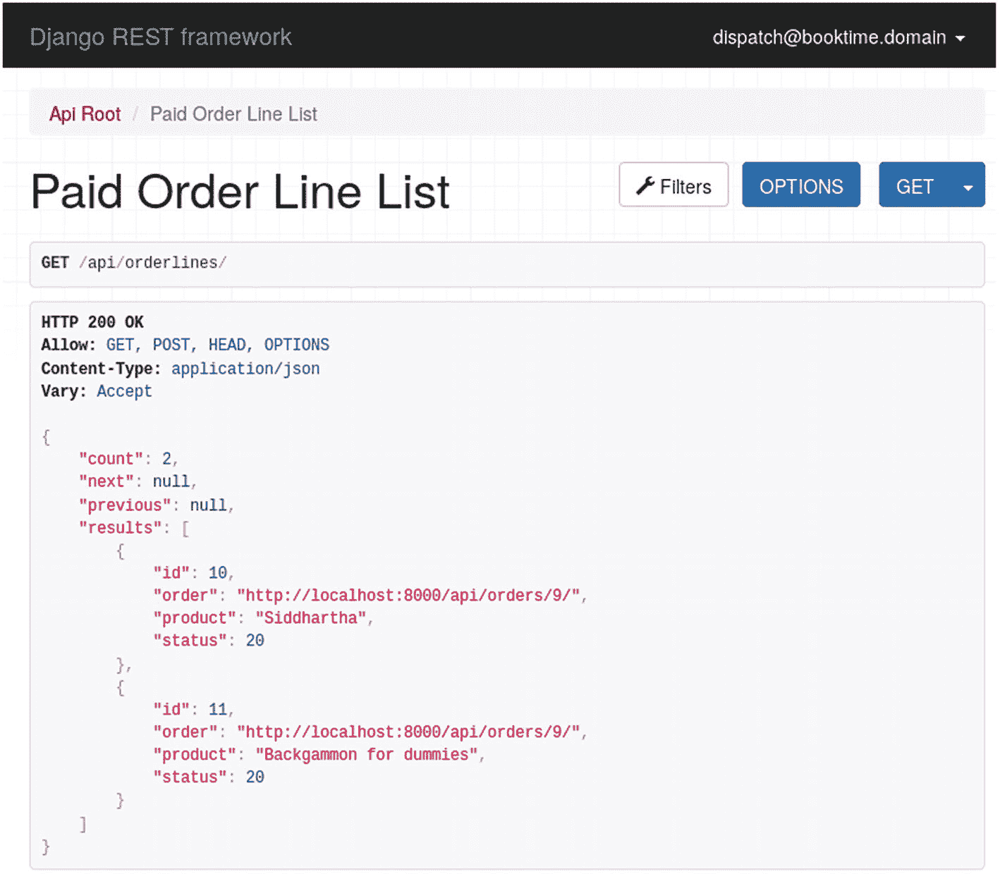

# 6.在我们的项目中使用外部库

本章介绍了在我们的项目中包含外部 Django 库是多么容易，以及我们如何使用其中的一些库来加速开发或添加在普通 Django 中不可用的特性。

## 使用 Django 扩展

django Extensions<sup>[1](#Fn1)</sup>库提供了一些我们的项目可以使用的有用的附加命令。要了解它们是什么，我们需要首先安装库:

```py
$ pipenv install django-extensions
$ pipenv install pydotplus   # for graph_models
$ pipenv install ipython     # for shell_plus
$ pipenv install werkzeug    # for runserver_plus

```

我们还需要将库添加到`INSTALLED_APPS`:

```py
INSTALLED_APPS = [
    "django.contrib.admin",
    "django.contrib.auth",
    "django.contrib.contenttypes",
    "django.contrib.sessions",
    "django.contrib.messages",
    "django.contrib.staticfiles",
    'webpack_loader',
    'django_extensions',
    "main.apps.MainConfig",
]

```

完成后，我们应该能够在标准命令中看到新命令:

```py
$ ./manage.py

Type 'manage.py help <subcommand>' for help on a specific subcommand.

Available subcommands:

[auth]
    changepassword
    createsuperuser

[contenttypes]
    remove_stale_contenttypes

[django]
    check
    compilemessages
    createcachetable
    dbshell

    ...

    test
    testserver

[django_extensions]
    admin_generator
    clean_pyc
    clear_cache
    compile_pyc

    ...

    sync_s3
    syncdata
    unreferenced_files
    update_permissions
    validate_templates

[main]
    import_data

[sessions]
    clearsessions

[staticfiles]
    collectstatic
    findstatic
    runserver

```

这个库提供了很多命令。在这一章中，我不会一一介绍，只介绍一些比较常用的。您可以在在线 Django 文档中找到这些管理命令的完整列表。 <sup>[2](#Fn2)</sup>

第一个命令通过外键生成一个包含所有模型以及它们之间的连接的图:

```py
$ ./manage.py graph_models -a -o booktime_models.png

```

你可以在图 [6-1](#Fig1) 中看到我们项目的图表。



图 6-1

graph_models 命令输出

另一个有用的命令是`shell_plus`，它启动一个 shell(使用本节开始时安装的 IPython 库),为我们的模型提供历史、自动完成、自动导入等等:

```py
$ ./manage.py shell_plus
# Shell Plus Model Imports
from django.contrib.admin.models import LogEntry
from django.contrib.auth.models import Group, Permission
from django.contrib.contenttypes.models import ContentType
from django.contrib.sessions.models import Session
from main.models import Address, Basket, BasketLine, ...
# Shell Plus Django Imports
from django.core.cache import cache
from django.conf import settings
from django.contrib.auth import get_user_model
from django.db import transaction
from django.db.models import Avg, Case, Count, F, ...
from django.utils import timezone
from django.urls import reverse
Python 3.6.3 (default, Oct 3 2017, 21:45:48)
Type 'copyright', 'credits' or 'license' for more information
IPython 6.4.0 -- An enhanced Interactive Python. Type '?' for help.

In [1]:

```

除了这个库，还有一个增强版的`runserver`命令，我们用它来启动开发服务器。这个命令是`runserver_plus`:

```py
$ ./manage.py runserver_plus
Performing system checks...
System check identified no issues (0 silenced).

Django version 2.0.7, using settings 'booktime.settings'
Development server is running at http://[127.0.0.1]:8000/
Using the Werkzeug debugger (http://werkzeug.pocoo.org/)
Quit the server with CONTROL-C.
 * Debugger is active!
 * Debugger PIN: 130-358-807

```

当使用这个来浏览站点时，Django 错误页面会被 Werkzeug ( [`http://werkzeug.pocoo.org`](http://werkzeug.pocoo.org) )替代，它提供了一个交互式调试器，对于快速调试问题非常有用，如图 [6-2](#Fig2) 所示。



图 6-2

带有 runserver_plus 示例的 Werkzeug 调试器

## 使用 factory_boy 进行更好的测试

factory_boy 库 <sup>[3](#Fn3)</sup> 简化了测试数据的生成。历史上，在 Django 中，测试数据要么从称为 fixtures 的文件中加载，要么直接嵌入到代码中。对于需要大量设置数据的情况，对数据进行硬编码可能会产生维护问题，尤其是对于夹具。

为了解决这个问题，factory_boy 库为我们提供了一种基于测试中指定的约束自动生成测试数据的方法。这个库在每次运行时都会为姓名、地址等生成假数据。除非您另外指定，否则它还会在所有字段上生成数据。

我们可以安装这个库

```py
$ pipenv install factory_boy

```

为了展示这个库的强大，我们将修改一个测试文件，这个文件在我们的项目中在数据设置方面特别繁重:`main/tests/test_models.py`。在此之前，我们将在`main/factories.py`创建一些工厂:

```py
import factory
import factory.fuzzy
from . import models

class UserFactory(factory.django.DjangoModelFactory):
    email="user@site.com"

    class Meta:
        model = models.User
        django_get_or_create = ('email',)

class ProductFactory(factory.django.DjangoModelFactory):
    price = factory.fuzzy.FuzzyDecimal(1.0, 1000.0, 2)

    class Meta:
        model = models.Product

class AddressFactory(factory.django.DjangoModelFactory):
    class Meta:
        model = models.Address

```

工厂是用于为特定模型生成数据的类。这些被称为测试。这是我们更新版的`main/tests/test_models.py`:

```py
from decimal import Decimal
from django.test import TestCase
from main import models
from main import factories

class TestModel(TestCase):
    def test_active_manager_works(self):
        factories.ProductFactory.create_batch(2, active=True)
        factories.ProductFactory(active=False)
        self.assertEqual(len(models.Product.objects.active()), 2)

    def test_create_order_works(self):
        p1 = factories.ProductFactory()
        p2 = factories.ProductFactory()
        user1 = factories.UserFactory()
        billing = factories.AddressFactory(user=user1)
        shipping = factories.AddressFactory(user=user1)

        basket = models.Basket.objects.create(user=user1)
        models.BasketLine.objects.create(
            basket=basket, product=p1
        )
        models.BasketLine.objects.create(
            basket=basket, product=p2
        )

        with self.assertLogs("main.models", level="INFO") as cm:
            order = basket.create_order(billing, shipping)

        self.assertGreaterEqual(len(cm.output), 1)

        order.refresh_from_db()

        self.assertEquals(order.user, user1)
        self.assertEquals(
            order.billing_address1, billing.address1
        )

        self.assertEquals(
            order.shipping_address1, shipping.address1
        )

        self.assertEquals(order.lines.all().count(), 2)
        lines = order.lines.all()
        self.assertEquals(lines[0].product, p1)
        self.assertEquals(lines[1].product, p2)

```

正如您所看到的，我们从这两个测试的设置中提取了很多额外的信息，比如产品名称、航运公司等等。如果在将来，我们决定向任何一个被调用的模型(例如，`Address`)添加另一个字段，测试仍然会通过，不需要更新。

## Django 调试工具栏

Django 调试工具栏 <sup>[4](#Fn4)</sup> 是一个众所周知的库，它显示了许多关于加载的网页的有用信息。它包括关于 HTTP 请求/响应、Django 内部设置、触发的 SQL 查询、使用的模板、缓存调用和其他细节的信息。

这个库还可以使用插件进行扩展，以防包含的内容没有涵盖您想要显示的信息。网上有几个插件。

要安装 Django 调试工具栏，您可以使用以下命令:

```py
$ pipenv install django-debug-toolbar

```

除了安装之外，还需要一些额外的设置，从对`booktime/settings.py`的一些更改开始:

```py
...

INSTALLED_APPS = [
    ....
    'debug_toolbar',
    "main.apps.MainConfig",
]

MIDDLEWARE = [
    "debug_toolbar.middleware.DebugToolbarMiddleware",
    ...
]

INTERNAL_IPS = ['127.0.0.1']

...

```

在`booktime/urls.py`的末尾添加以下内容:

```py
...

if settings.DEBUG:
    import debug_toolbar
    urlpatterns = [
        path('__debug__/', include(debug_toolbar.urls)),
    ] + urlpatterns

```

这足以开始使用该工具。屏幕右侧会出现一个黑条，带有可点击的部分，打开后可以看到特定类别的信息。图 [6-3](#Fig3) 显示了显示产品页面时生成的 SQL 查询。



图 6-3

产品页面上的 SQL 查询

其他面板是 Settings(设置),用于查看当前 Django 配置、Request(请求),用于查看关于当前视图的信息，Templates(模板),用于查看哪些模板已用于编写响应以及传入了哪些变量，以及 Cache(缓存),用于查看视图执行的所有缓存调用。

以我们的图书电商系统 BookTime 为例，这个库工作得很好，因为所有页面都是 Django 返回的模板。如果在您的项目中，您有一个带有后端 API 的 SPA 架构，那么这种方法就不能很好地工作，因为 Django Debug Toolbar 依赖于后端将 HTML 返回给浏览器。这样的话，你可能想看看姜戈丝绸。

## 使用 django-tables2 和 django-filter 可视化订单

django-tables2 <sup>[5](#Fn5)</sup> 和 django-filter <sup>[6](#Fn6)</sup> 库是独立的，但经常结合使用，可以帮助我们加快创建非常简单的仪表板的过程。在这里，我们将为内部用户开发一个可过滤的订单列表:

```py
$ pipenv install django-tables2 django-filter

```

使用这些库非常容易。我们将在`main/views.py`的视图列表中添加一个经过验证的视图:

```py
from django.contrib.auth.mixins import (
    LoginRequiredMixin,
    UserPassesTestMixin
)
from django import forms as django_forms
from django.db import models as django_models
import django_filters
from django_filters.views import FilterView
...

...

class DateInput(django_forms.DateInput):
    input_type = 'date'

class OrderFilter(django_filters.FilterSet):
    class Meta:
        model = models.Order
        fields = {
                'user__email': ['icontains'],
                'status': ['exact'],
                'date_updated': ['gt', 'lt'],
                'date_added': ['gt', 'lt'],
                }
        filter_overrides = {
                django_models.DateTimeField: {
                    'filter_class': django_filters.DateFilter,
                    'extra': lambda f:{
                        'widget': DateInput}}}

class OrderView(UserPassesTestMixin, FilterView):
    filterset_class = OrderFilter
    login_url = reverse_lazy("login")

    def test_func(self):
        return self.request.user.is_staff is True

```

`OrderView`是一个视图，只有有权访问管理界面的用户才可以使用，因为`test_func`函数会对此进行检查。这个视图继承自`FilterView`，带有一个`filterset_class`来指定页面中有哪些过滤器可用。

`FilterSet`类的格式类似于 Django 自己的`ModelForm`，在这里你可以直接定义过滤器或者使用`Meta`类自动生成过滤器。在前面的示例中，我们定义了要过滤的字段以及在这些字段上活动的查找表达式。我们还希望确保使用 HTML5 日期输入字段来输入日期。

除了这个视图，我们还将添加一个模板(在视图的默认位置，`main/templates/main/order_filter.html`):

```py




  <h2>Order dashboard</h2>
  <form method="get">
    {{ filter.form.as_p }}
    <input type="submit"/>
  </form>
  <p>
    
  </p>


```

这个模板利用`django-tables2`来呈现表格，以及排序控件。它简化了打印标题的工作，只需一个模板标签就可以循环显示结果。但是，需要安装这个标签。我们将在`settings.py`中这样做:

```py
INSTALLED_APPS = [
    ...
    'django_tables2',
    "main.apps.MainConfig",
]

...

DJANGO_TABLES2_TEMPLATE = 'django_tables2/bootstrap.html'

```

这个库还允许我们指定在呈现表格时使用什么样的模板。在我们的实例中，我们需要引导框架的 CSS 样式。

当任何 Django 库被添加到`INSTALLED_APPS`列表中时，Django 会将其`static`和`templates`文件夹添加到静态文件和模板文件的搜索路径中。这就是这个库如何通过指定一个初始模板来引入它所有的依赖项。

下一个(也是最后一个)操作是使其在`main/urls.py`中可用:

```py
urlpatterns = [
    ...
    path(
        "order-dashboard/",
        views.OrderView.as_view(),
        name="order_dashboard",
    ),
]

```

这个新创建的仪表板现在可以在上面指示的 URL 上获得。在您的项目中输入一些订单后，您将能够在仪表板中看到一些结果，并使用我们设置的过滤器，如图 [6-4](#Fig4) 所示。



图 6-4

简单订单仪表板

正如你所看到的，用少量的代码，我们已经建立了一个非常实用的仪表板。

## django tweak 小部件

这个库 <sup>[7](#Fn7)</sup> 在处理需要某种结构的复杂表单模板时很有帮助。例如，Bootstrap CSS 框架要求每个输入都用`form-control` CSS 类标记。在标准的 Django 中，这可以通过指定完整的 HTML 标记或者在 Python 中注入类来实现。如果您发现自己正在做这些事情，特别是修改`form`类以输出正确的 CSS 样式，您正在处理代码中的设计问题，这不是这两个领域之间的一个很好的分离。

在这个库的帮助下，我们可以重写和简化 BookTime 项目中的一些模板。首先，让我们安装它:

```py
$ pipenv install django-widget-tweaks

```

它还需要包含在设置中:

```py
INSTALLED_APPS = [
    ...
    'widget_tweaks',
    "main.apps.MainConfig",
]

```

一旦我们有了这些，这个库中的所有模板标签都可以在模板中使用了。我们可以在内置的 Django 小部件渲染的基础上，添加我们需要的 CSS 类和 HTML 结构。

Django 模板，除了扩展其他，还可以使用`include`模板标签，我们将开始使用。让我们将所有的字段渲染 HTML 提取到它自己的模板中，称为`main/templates/includes/field.html`:

```py


<div class="form-group">
  {{ field.label_tag }}
  {{ field|add_class:"form-control"|add_error_class:"is-invalid" }}
  
    <div class="invalid-feedback">
      {{ field.errors }}
    </div>
  

</div>

```

`field`变量是一个小部件，它应用了一些修改输出的标签。我们正在添加一些 CSS 类，一个总是和另一个在错误的情况下。

这个片段现在可以被其他模板包含。这是`main/templates/login.html`模板使用它的方式:

```py



  <h2>Login</h2>
  <p>Please fill the form below.</p>
  <form method="POST">
    
    {{ form.non_field_errors }}
    
    
    <button type="submit" class="btn btn-primary">Submit</button>
  </form>


```

类似的重组可以在`signup.html`和`contact_form.html`(在`main/templates/`内部)进行。我们其余的模板使用`{{ form }}`快捷方式。要在那里使用它，模板变量需要通过迭代它的`fields`来分解。

## 使用 Django Rest 框架为订单履行构建 API

对于电子商务组织，订单调度通常由第三方调度服务管理。这个外部实体可能正在使用自己的交付管理系统，在这种情况下，需要进行数据集成。

我们将在 API 中涵盖这些用例:

*   调度服务需要能够看到订单和订单行通过系统，但只有在他们被支付后。

*   调度服务需要能够按状态或顺序过滤前面的列表。

*   调度服务会将订单行标记为“处理中”以示确认。

*   调度服务将订单行标记为“已发送”或“已取消”,以通知中心办公室其状态。

*   如果需要，配送服务可以更改订单的送货地址。

### Curl 演示流程

我们将使用`curl`命令来显示 API。Curl 是一个非常简单的命令行工具，可以在许多平台上使用( [`https://curl.haxx.se`](https://curl.haxx.se) )。除了 API，你可以把它看作是浏览器的等价物。如果您还没有安装这个工具，您可以使用软件包管理器来安装它。

这是我们将要实现的 API 流。

要获取准备发货的订单行列表(状态 10)，我们将使用以下命令:

```py
$ curl -H 'Accept: application/json; indent=4' \
    -u dispatch@booktime.domain:abcabcabc \
    http://127.0.0.1:8000/api/orderlines/

{
    "count": 2,
    "next": null,
    "previous": null,
    "results": [
        {
            "id": 10,
            "order": "http://127.0.0.1:8000/api/orders/9/",
            "product": "Siddhartha",
            "status": 10
        },
        {
            "id": 11,
            "order": "http://127.0.0.1:8000/api/orders/9/",
            "product": "Backgammon for dummies",
            "status": 10
        }
    ]
}

```

要获取订单编号 9 的发货地址:

```py
$ curl -H 'Accept: application/json; indent=4' \
    -u dispatch@bookime.domain:abcabcabc \
    http://127.0.0.1:8000/api/orders/9/

{
    "shipping_name": "John Smith",
    "shipping_address1": "1 the road",
    "shipping_address2": "",
    "shipping_zip_code": "LC11RA",
    "shipping_city": "Smithland",
    "shipping_country": "uk",
    "date_updated": "2018-07-07T11:46:09.367227Z",
    "date_added": "2018-07-05T22:22:01.067294Z"
}

```

一旦调度系统拥有订单行和订单列表，它将能够开始逐步将这些行标记为“处理中”(状态 20)或“已发送”(状态 30):

```py
$ curl -H 'Accept: application/json; indent=4' \
    -u dispatch@booktime.domain:abcabcabc -XPUT \
    -H 'Content-Type: application/json' \
    -d '{"status": 20}' http://127.0.0.1:8000/api/orderlines/10/

{
    "id": 10,
    "order": "http://127.0.0.1:8000/api/orders/9/",
    "product": "Siddhartha",
    "status": 20
}

$ curl -H 'Accept: application/json; indent=4' \
    -u dispatch@bookime.domain:abcabcabc -XPUT \
    -H 'Content-Type: application/json' \
    -d '{"status": 30}' http://127.0.0.1:8000/api/orderlines/11/

{
    "id": 11,
    "order": "http://127.0.0.1:8000/api/orders/9/",
    "product": "Backgammon for dummies",
    "status": 30
}

$ curl -H 'Accept: application/json; indent=4' \
    -u dispatch@bookime.domain:abcabcabc -XPUT \
    -H 'Content-Type: application/json' \
    -d '{"status": 30}' http://127.0.0.1:8000/api/orderlines/10/

{
    "id": 10,
    "order": "http://127.0.0.1:8000/api/orders/9/",
    "product": "Siddhartha",
    "status": 30
}

```

我们使用数字状态代码，因为这是我们在`OrderLine`模型的状态选择列表中定义它们的方式。

拥有数字状态给了我们一些优势，比如空间效率和有序性，但是这些数字的含义并不总是很清楚。在 API 文档中记录这一点很重要。

一旦所有行被标记为“已发送”或“已取消”，这些行将不再出现在订单行列表中:

```py
$ curl -H 'Accept: application/json; indent=4' \
    -u dispatch@bookime.domain:abcabcabc \
    http://127.0.0.1:8000/api/orderlines/

{
    "count": 0,
    "next": null,
    "previous": null,
    "results": []
}

```

### 框架安装和配置

Django Rest 框架 <sup>[8](#Fn8)</sup> 与`django-filter`集成在一起，我们将使用它进行过滤。确保您已经安装了它。要安装 Django Rest 框架，请键入以下命令:

```py
$ pipenv install djangorestframework

```

安装完成后，在`settings.py`中进行配置:

```py
INSTALLED_APPS = [
    ...
    'rest_framework',
    "main.apps.MainConfig",
]

...

REST_FRAMEWORK = {
    'DEFAULT_AUTHENTICATION_CLASSES':
    ('rest_framework.authentication.SessionAuthentication',
     'rest_framework.authentication.BasicAuthentication'),
    'DEFAULT_PERMISSION_CLASSES':
    ('rest_framework.permissions.DjangoModelPermissions',),
    'DEFAULT_FILTER_BACKENDS':
    ('django_filters.rest_framework.DjangoFilterBackend',),
    'DEFAULT_PAGINATION_CLASS':
    'rest_framework.pagination.PageNumberPagination',
    'PAGE_SIZE': 100
}

```

这种配置对于我们的用例来说足够灵活，等等。身份验证类用于验证用户/密码组合是否与数据库中存储的内容相对应。权限类用于了解用户在系统上可以或不可以做什么。

在我们的例子中，我们利用了创建模型时默认生成的内置权限。

除此之外，我们将`django-filter`设置为我们的过滤后端，并设置每页 100 个项目的默认分页。

最后，我们需要添加一些额外的 URL，我们将在`booktime/urls.py`中完成:

```py
urlpatterns = [
    ...
    path('api-auth/', include('rest_framework.urls')),
    path("", include("main.urls")),
] + ...

```

### 用户和权限

我们将在系统中创建一个用户，在调用 API 时使用。该用户至少需要两种权限:

*   可以改变顺序

*   可以更改订单行

正如你在图 [6-5](#Fig5) 中看到的，这就是我们在前面的例子中使用的用户。您可以随意使用您想要的任何用户/密码，但是要记得适当地更新`curl`命令。



图 6-5

休息用户

## API 端点

Django Rest 框架是一个非常灵活的库，有很多功能。有足够的材料写很多页，但这不是这本书的重点。下面是一些使用这个库的代码，涵盖了我们提到的用例；将此代码放入`main/endpoints.py`:

```py
from rest_framework import serializers, viewsets
from . import models

class OrderLineSerializer(serializers.HyperlinkedModelSerializer):
    product = serializers.StringRelatedField()

    class Meta:
        model = models.OrderLine
        fields = ('id', 'order', 'product', 'status')
        read_only_fields = ('id', 'order', 'product')

```

```py
class PaidOrderLineViewSet(viewsets.ModelViewSet):

    queryset = models.OrderLine.objects.filter(
        order__status=models.Order.PAID).order_by("-order__date_added")
    serializer_class = OrderLineSerializer
    filter_fields = ('order', 'status')

class OrderSerializer(serializers.HyperlinkedModelSerializer):
    class Meta:
        model = models.Order
        fields = ('shipping_name',
                  'shipping_address1',
                  'shipping_address2',
                  'shipping_zip_code',
                  'shipping_city',
                  'shipping_country',
                  'date_updated',
                  'date_added')

class PaidOrderViewSet(viewsets.ModelViewSet):
    queryset = models.Order.objects.filter(
        status=models.Order.PAID).order_by("-date_added")
    serializer_class = OrderSerializer

```

我们需要为前面的视图分配 URL。我们将在`main/urls.py`中这样做:

```py
...

from django.urls import path, include
from rest_framework import routers
from main import endpoints

router = routers.DefaultRouter()
router.register(r'orderlines', endpoints.PaidOrderLineViewSet)
router.register(r'orders', endpoints.PaidOrderViewSet)

urlpatterns = [
    ...
    path('api/', include(router.urls)),
]

```

## 使用信号完成订单

现在我们有足够的信息让 dispatcher 将订单标记为已发送，我们需要确保标记的订单不再出现在 list api 中。我们将以一种不依赖于它们如何被标记的方式来做这件事，无论是通过 REST API 还是通过 Django admin。

为此，我们将再次使用 Django 信号。这个新信号将被插入`main/signals.py`:

```py
...

from django.db.models.signals import pre_save, post_save
from .models import ProductImage, Basket, OrderLine, Order

...

@receiver(post_save, sender=OrderLine)
def orderline_to_order_status(sender, instance, **kwargs):
    if not instance.order.lines.filter(status__lt=OrderLine.SENT).exists():
        logger.info(
            "All lines for order %d have been processed. Marking as done.", instance.order.id,
        )
        instance.order.status = Order.DONE
        instance.order.save()

```

该信号将在保存`OrderLine`模型的实例后执行。它做的第一件事是检查连接到订单的任何订单行的状态是否低于“已发送”如果有，则终止执行。如果“已发送”状态下没有行，则整个订单被标记为“完成”

要尝试这个流程，您需要使用我们上面列出的`curl`命令。您需要打开两个终端，一个运行 Django `runserver`命令，另一个输入`curl`命令。

## 使用 DRF 网络客户端

除了使用`curl`来测试 API 之外，还可以使用 Django Rest Framework (DRF) web 客户端，当直接通过浏览器浏览 API URLs 时，可以使用这个客户端。

图 [6-6](#Fig6) 是 web 客户端的截图。当比命令行更可取时，展示 API 和快速测试是有用的。



图 6-6

DRF 网络客户端

## 摘要

在本章中我们已经看到了这些库:

*   django-extensions:包括一些 django 中没有的非常有用的命令

*   工厂男孩:为测试动态生成数据

*   django-debug-toolbar:在调试时给我们很多信息的工具

*   django-widget-tweaks:为定义前端属性提供了更多的灵活性

*   django-rest-framework:完全关于 rest 的框架中的框架

当然，网上还有很多其他的图书馆。本章旨在向您展示一些扩展 Django 的方法。我鼓励你在网上做你的研究，选择适合你需要的。

在下一章，我们将再次讨论 Django admin，这次会更深入。

<aside class="FootnoteSection" epub:type="footnotes">Footnotes [1](#Fn1_source)

[T2`https://github.com/django-extensions/django-extensions`](https://github.com/django-extensions/django-extensions)

  [2](#Fn2_source)

[T2`https://docs.djangoproject.com/en/2.0/ref/django-admin/`](https://docs.djangoproject.com/en/2.0/ref/django-admin/)

  [3](#Fn3_source)

[T2`https://factoryboy.readthedocs.io/en/latest/`](https://factoryboy.readthedocs.io/en/latest/)

  [4](#Fn4_source)

[T2`https://github.com/jazzband/django-debug-toolbar`](https://github.com/jazzband/django-debug-toolbar)

  [5](#Fn5_source)

[T2`https://django-tables2.readthedocs.io/en/latest/`](https://django-tables2.readthedocs.io/en/latest/)

  [6](#Fn6_source)

[T2`https://django-filter.readthedocs.io/en/master/`](https://django-filter.readthedocs.io/en/master/)

  [7](#Fn7_source)

[T2`https://github.com/jazzband/django-widget-tweaks`](https://github.com/jazzband/django-widget-tweaks)

  [8](#Fn8_source)

[T2`http://www.django-rest-framework.org/`](http://www.django-rest-framework.org/)

 </aside>