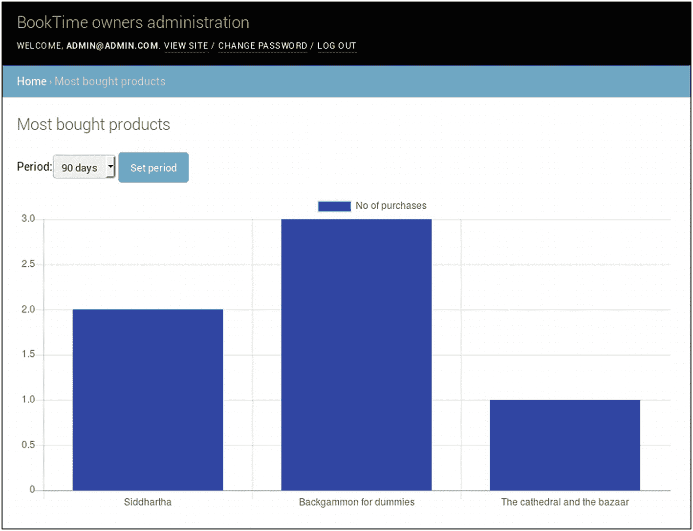
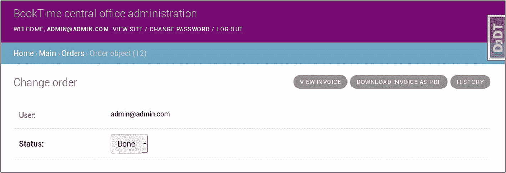

# 7.为公司制作内部仪表板

在这一章中，我们将在 Django 管理界面上为 Booktime 公司员工构建一个仪表板。我们将讨论为什么和如何这样做，以及公司中不同类型的用户。

我们将讨论这些主题:

*   配置管理界面

*   添加管理视图

*   配置用户和权限

*   创建内部报告

*   生成 pdf

## 使用 Django admin 的原因

在这一章中，我们将使用 Django 管理界面来演示这个应用是如何可定制的。正如我们在前面章节中看到的，只需一些基本的定制，我们就已经能够管理我们的产品和订单数据。我们还能够在系统中过滤和搜索产品和订单。

Django 管理接口带有一个内置的认证和许可系统。您可以轻松地将多个用户配置为只能查看和更改部分数据。这个界面还有一个内置的日志来跟踪谁更改了数据库中的哪些模型。

这个应用可以让我们不需要太多的努力就可以获得足够的状态。在本章中，我们将通过创建集成在管理界面中的新视图、修改用户权限、集成报告功能以及定制其外观，继续构建我们已经完成的定制。

所有这些都可以通过重写基类来实现，尽管这种方法有局限性。鉴于此，在定制管理界面时，我们总是用额外的代码覆盖内置行为，建议不要过度定制，因为您的代码会很快变得难以阅读。

这种方法的另一个限制是，你不能从根本上改变应用的用户流。就像在基于类的视图和基于函数的视图之间的选择一样，如果你花更多的时间重写内置的行为而不是编写你自己的行为，定制管理界面不是正确的方法。

在这一章中，我们将尝试将这个接口扩展到它的极限，以实现对一个电子商务公司应该能够做的所有标准操作的支持，或者至少对我们虚构的图书销售公司所需要的那些操作的支持。

## 管理界面中的视图

要在管理中列出所有公开的视图，我们可以使用来自`django-extensions`库的`show_urls`命令。以下是其输出的一小部分:

```py
...

/admin/
    django.contrib.admin.sites.index
    admin:index
/admin/<app_label>/
    django.contrib.admin.sites.app_index
    admin:app_list
/admin/auth/user/
    django.contrib.admin.options.changelist_view
    admin:auth_user_changelist
/admin/auth/user/<id>/password/
    django.contrib.auth.admin.user_change_password
    admin:auth_user_password_change
/admin/auth/user/<path:object_id>/
    django.views.generic.base.RedirectView
/admin/auth/user/<path:object_id>/change/
    django.contrib.admin.options.change_view
    admin:auth_user_change
/admin/auth/user/<path:object_id>/delete/
    django.contrib.admin.options.delete_view
    admin:auth_user_delete
/admin/auth/user/<path:object_id>/history/
    django.contrib.admin.options.history_view
    admin:auth_user_history
/admin/login/
    django.contrib.admin.sites.login
    admin:login
/admin/logout/
    django.contrib.admin.sites.logout
    admin:logout

...

```

正如您所看到的，对于 Django admin 的一个实例，有许多页面(在前面的代码片段中没有全部显示):

*   *索引视图*:初始页面，列出所有 Django 应用及其模型

*   *App 列表视图*:单个 Django app 的型号列表

*   *变更列表视图*:Django 模型的所有条目列表

*   *变更视图*:变更 Django 模型单个实体的视图

*   *添加视图*:添加 Django 模型新实体的视图

*   *删除视图*:删除 Django 模型单个实体的确认视图

*   *历史视图*:单个实体通过 Django 管理界面完成的所有变更的列表

*   *支持视图*:登录、注销和更改密码视图

这些视图中的每一个都可以通过在正确的 admin 类中覆盖特定的方法来定制(我们将探索一个这样的例子)。这些视图中的每一个都使用一个可以自定义的模板:

*   *索引视图* : `admin/index.html`

*   *应用列表视图* : `admin/app_index.html`

*   *变更列表视图* : `admin/change_list.html`

*   *更改项目视图* : `admin/change_form.html`

*   *添加项目视图* : `admin/change_form.html`

*   *删除一个项目上的项目视图* : `admin/delete_confirmation.html`

*   *删除多个项目上的项目视图* : `admin/delete_selected_confirmation.html`

*   *历史查看* : `admin/object_history.html`

有更多的模板表示这些视图的屏幕的特定部分。我鼓励您研究这些模板，了解它们的结构。你可以在你的 Python virtualenv 或者在线的 GitHub <sup>[1](#Fn1)</sup> 上找到它们。

Django 管理界面带有一组内置的视图，但是您可以添加新的视图。您可以在顶层和模型层定义视图。新视图将继承相应管理实例的所有安全检查和 URL 命名空间。例如，这使得可以将所有的报告视图添加到我们的管理实例中，并进行适当的授权检查。

除了前面所有的特性之外，还可以在一个站点上运行多个 Django 管理界面，每个界面都有自己的定制。到目前为止，我们已经使用了`django.contrib.admin.site`，它是`django.contrib.admin.AdminSite`的一个实例，但是没有什么可以阻止我们拥有它的许多实例。

## 为公司配置用户类型和权限

在编写任何代码之前，明确系统中不同类型的用户以及每种用户与系统交互的方式是很重要的。在 BookTime 公司，我们有三种类型的用户:

*   业主
    *   可以查看和操作所有有用的模型

*   中心办公室员工
    *   可以将订单标记为已支付

    *   可以更改订单数据

    *   可以查看关于网站性能的报告

    *   可以管理产品和相关信息

*   调度办公室
    *   可以将订单行标记为已装运(或已取消)

    *   可以将产品标记为缺货

在 Django 中，我们将以这种方式存储会员信息:

*   *所有者*:is _ super user 字段设置为 True 的任何用户

*   *中心局员工*:属于“员工”组的任何用户

*   *调度室*:属于“调度员”组的任何用户

为了在系统中创建这些用户类型，我们将使用数据夹具，这与测试夹具的原理相同。将此内容放入`main/data/user_groups.json`:

```py
[
  {
    "model": "auth.group",
    "fields": {
      "name": "Employees",
      "permissions": [
        [ "add_address", "main", "address" ],
        [ "change_address", "main", "address" ],
        [ "delete_address", "main", "address" ],
        [ "change_order", "main", "order" ],
        [ "add_orderline", "main", "orderline" ],
        [ "change_orderline", "main", "orderline" ],
        [ "delete_orderline", "main", "orderline" ],
        [ "add_product", "main", "product" ],
        [ "change_product", "main", "product" ],
        [ "delete_product", "main", "product" ],
        [ "add_productimage", "main", "productimage" ],
        [ "change_productimage", "main", "productimage" ],
        [ "delete_productimage", "main", "productimage" ],
        [ "change_producttag", "main", "producttag" ]
      ]
    }
  },
  {
    "model": "auth.group",
    "fields": {
      "name": "Dispatchers",
      "permissions": [
        [ "change_orderline", "main", "orderline" ],
        [ "change_product", "main", "product" ]
      ]
    }
  }

]

```

要加载上述代码，请键入以下内容:

```py
$ ./manage.py loaddata main/data/user_groups.json
Installed 2 object(s) from 1 fixture(s)

```

我们还将向我们的`User`模型添加一些辅助函数，以帮助我们识别用户的类型:

```py
class User(AbstractUser):
    ...

    @property
    def is_employee(self):
        return self.is_active and (
            self.is_superuser
            or self.is_staff
            and self.groups.filter(name="Employees").exists()
        )

    @property
    def is_dispatcher(self):
        return self.is_active and (
            self.is_superuser
            or self.is_staff
            and self.groups.filter(name="Dispatchers").exists()
       )

```

## 为用户实现多个管理界面

我们将从一堆代码开始，我将用代码注释来解释它们。从`main/admin.py`开始，我们将用一个更高级的版本替换我们所有的产品，支持我们列出的所有用例。

```py
from datetime import datetime, timedelta
import logging
from django.contrib import admin
from django.contrib.auth.admin import (
    UserAdmin as DjangoUserAdmin
)
from django.utils.html import format_html
from django.db.models.functions import TruncDay
from django.db.models import Avg, Count, Min, Sum
from django.urls import path
from django.template.response import TemplateResponse

from . import models

logger = logging.getLogger(__name__)

class ProductAdmin(admin.ModelAdmin):
    list_display = ("name", "slug", "in_stock", "price")
    list_filter = ("active", "in_stock", "date_updated")
    list_editable = ("in_stock",)
    search_fields = ("name",)
    prepopulated_fields = {"slug": ("name",)}
    autocomplete_fields = ("tags",)

    # slug is an important field for our site, it is used in
    # all the product URLs. We want to limit the ability to
    # change this only to the owners of the company.
    def get_readonly_fields(self, request, obj=None):
        if request.user.is_superuser:
            return self.readonly_fields
        return list(self.readonly_fields) + ["slug", "name"]

    # This is required for get_readonly_fields to work
    def get_prepopulated_fields(self, request, obj=None):
        if request.user.is_superuser:
            return self.prepopulated_fields
        else:
            return {}

class DispatchersProductAdmin(ProductAdmin):
    readonly_fields = ("description", "price", "tags", "active")
    prepopulated_fields = {}
    autocomplete_fields = ()

class ProductTagAdmin(admin.ModelAdmin):
    list_display = ("name", "slug")
    list_filter = ("active",)
    search_fields = ("name",)
    prepopulated_fields = {"slug": ("name",)}

    # tag slugs also appear in urls, therefore it is a
    # property only owners can change
    def get_readonly_fields(self, request, obj=None):
        if request.user.is_superuser:
            return self.readonly_fields
        return list(self.readonly_fields) + ["slug", "name"]

    def get_prepopulated_fields(self, request, obj=None):
        if request.user.is_superuser:
            return self.prepopulated_fields
        else:
            return {}

class ProductImageAdmin(admin.ModelAdmin):
    list_display = ("thumbnail_tag", "product_name")
    readonly_fields = ("thumbnail",)
    search_fields = ("product__name",)

    # this function returns HTML for the first column defined
    # in the list_display property above
    def thumbnail_tag(self, obj):
        if obj.thumbnail:
            return format_html(
                '' % obj.thumbnail.url
            )
        return "-"

    # this defines the column name for the list_display
    thumbnail_tag.short_description = "Thumbnail"

    def product_name(self, obj):
        return obj.product.name

class UserAdmin(DjangoUserAdmin):
    # User model has a lot of fields, which is why we are
    # reorganizing them for readability
    fieldsets = (
        (None, {"fields": ("email", "password")}),
        (
            "Personal info",
            {"fields": ("first_name", "last_name")},
        ),
        (
            "Permissions",
            {
                "fields": (
                    "is_active",
                    "is_staff",
                    "is_superuser",
                    "groups",
                    "user_permissions",
                )
            },
        ),
        (
            "Important dates",
            {"fields": ("last_login", "date_joined")},
        ),
    )
    add_fieldsets = (
        (
            None,
            {
                "classes": ("wide",),
                "fields": ("email", "password1", "password2"),
            },
        ),
    )
    list_display = (
        "email",
        "first_name",
        "last_name",
        "is_staff",
    )

    search_fields = ("email", "first_name", "last_name")
    ordering = ("email",)

class AddressAdmin(admin.ModelAdmin):
    list_display = (
        "user",
        "name",
        "address1",
        "address2",
        "city",
        "country",
    )
    readonly_fields = ("user",)

class BasketLineInline(admin.TabularInline):
    model = models.BasketLine
    raw_id_fields = ("product",)

class BasketAdmin(admin.ModelAdmin):
    list_display = ("id", "user", "status", "count")
    list_editable = ("status",)
    list_filter = ("status",)
    inlines = (BasketLineInline,)

class OrderLineInline(admin.TabularInline):
    model = models.OrderLine
    raw_id_fields = ("product",)

class OrderAdmin(admin.ModelAdmin):
    list_display = ("id", "user", "status")
    list_editable = ("status",)
    list_filter = ("status", "shipping_country", "date_added")
    inlines = (OrderLineInline,)
    fieldsets = (
        (None, {"fields": ("user", "status")}),
        (
            "Billing info",
            {
                "fields": (
                    "billing_name",
                    "billing_address1",
                    "billing_address2",
                    "billing_zip_code",
                    "billing_city",
                    "billing_country",
                )
            },
        ),
        (
            "Shipping info",
            {
                "fields": (
                    "shipping_name",
                    "shipping_address1",
                    "shipping_address2",
                    "shipping_zip_code",
                    "shipping_city",
                    "shipping_country",
                )
            },
        ),
    )

# Employees need a custom version of the order views because

# they are not allowed to change products already purchased

# without adding and removing lines

class CentralOfficeOrderLineInline(admin.TabularInline):
    model = models.OrderLine
    readonly_fields = ("product",)

class CentralOfficeOrderAdmin(admin.ModelAdmin):
    list_display = ("id", "user", "status")
    list_editable = ("status",)
    readonly_fields = ("user",)
    list_filter = ("status", "shipping_country", "date_added")
    inlines = (CentralOfficeOrderLineInline,)
    fieldsets = (
        (None, {"fields": ("user", "status")}),
        (
            "Billing info",
            {
                "fields": (
                    "billing_name",
                    "billing_address1",
                    "billing_address2",
                    "billing_zip_code",
                    "billing_city",
                    "billing_country",
                )
            },
        ),
        (
            "Shipping info",
            {
                "fields": (
                    "shipping_name",
                    "shipping_address1",
                    "shipping_address2",
                    "shipping_zip_code",
                    "shipping_city",
                    "shipping_country",
                )
            },
        ),
    )

# Dispatchers do not need to see the billing address in the fields

class DispatchersOrderAdmin(admin.ModelAdmin):
    list_display = (
        "id",
        "shipping_name",
        "date_added",
        "status",
    )
    list_filter = ("status", "shipping_country", "date_added")
    inlines = (CentralOfficeOrderLineInline,)
    fieldsets = (
        (
            "Shipping info",
            {
                "fields": (
                    "shipping_name",
                    "shipping_address1",
                    "shipping_address2",
                    "shipping_zip_code",
                    "shipping_city",
                    "shipping_country",
                )
            },
        ),
    )

    # Dispatchers are only allowed to see orders that
    # are ready to be shipped
    def get_queryset(self, request):
        qs = super().get_queryset(request)
        return qs.filter(status=models.Order.PAID)

# The class below will pass to the Django Admin templates a couple

# of extra values that represent colors of headings

class ColoredAdminSite(admin.sites.AdminSite):
    def each_context(self, request):
        context = super().each_context(request)
        context["site_header_color"] = getattr(
            self, "site_header_color", None
        )
        context["module_caption_color"] = getattr(
            self, "module_caption_color", None
        )
        return context

# The following will add reporting views to the list of

# available urls and will list them from the index page

class ReportingColoredAdminSite(ColoredAdminSite):
    def get_urls(self):
        urls = super().get_urls()
        my_urls = [
            path(
                "orders_per_day/",
                self.admin_view(self.orders_per_day),
            )
        ]
        return my_urls + urls

    def orders_per_day(self, request):
        starting_day = datetime.now() - timedelta(days=180)
        order_data = (
            models.Order.objects.filter(
                date_added__gt=starting_day
            )
            .annotate(
                day=TruncDay("date_added")
            )
             .values("day")
             .annotate(c=Count("id"))
         )
         labels = [
             x["day"].strftime("%Y-%m-%d") for x in order_data
         ]
         values = [x["c"] for x in order_data]

         context = dict(
             self.each_context(request),
             title="Orders per day",
             labels=labels,
             values=values,
        )
        return TemplateResponse(
            request, "orders_per_day.html", context
        )

    def index(self, request, extra_context=None):
        reporting_pages = [
            {
                "name": "Orders per day",
                "link": "orders_per_day/",
            }
        ]
        if not extra_context:
            extra_context = {}
        extra_context = {"reporting_pages": reporting_pages}
        return super().index(request, extra_context)

# Finally we define 3 instances of AdminSite, each with their own

# set of required permissions and colors

class OwnersAdminSite(ReportingColoredAdminSite):
    site_header = "BookTime owners administration"
    site_header_color = "black"
    module_caption_color = "grey"

    def has_permission(self, request):
        return (
            request.user.is_active and request.user.is_superuser
        )

class CentralOfficeAdminSite(ReportingColoredAdminSite):
    site_header = "BookTime central office administration"
    site_header_color = "purple"
    module_caption_color = "pink"

    def has_permission(self, request):
        return (
            request.user.is_active and request.user.is_employee
        )

class DispatchersAdminSite(ColoredAdminSite):
    site_header = "BookTime central dispatch administration"
    site_header_color = "green"
    module_caption_color = "lightgreen"

    def has_permission(self, request):
        return (
            request.user.is_active and request.user.is_dispatcher
        )

main_admin = OwnersAdminSite()
main_admin.register(models.Product, ProductAdmin)
main_admin.register(models.ProductTag, ProductTagAdmin)
main_admin.register(models.ProductImage, ProductImageAdmin)
main_admin.register(models.User, UserAdmin)
main_admin.register(models.Address, AddressAdmin)
main_admin.register(models.Basket, BasketAdmin)
main_admin.register(models.Order, OrderAdmin)

central_office_admin = CentralOfficeAdminSite(
    "central-office-admin"
)
central_office_admin.register(models.Product, ProductAdmin)
central_office_admin.register(models.ProductTag, ProductTagAdmin)
central_office_admin.register(
    models.ProductImage, ProductImageAdmin
)
central_office_admin.register(models.Address, AddressAdmin)
central_office_admin.register(
    models.Order, CentralOfficeOrderAdmin
)

dispatchers_admin = DispatchersAdminSite("dispatchers-admin")
dispatchers_admin.register(
    models.Product, DispatchersProductAdmin
)
dispatchers_admin.register(models.ProductTag, ProductTagAdmin)
dispatchers_admin.register(models.Order, DispatchersOrderAdmin)

```

代码太多了！首先，Django admin 有三个实例，分别对应于我们在上一节中声明的用户类型。每个实例都注册了一组不同的模型，这取决于与该类型用户相关的内容。

Django 管理网站将被彩色编码。颜色是通过一些自定义的 CSS 注入的。所有者和中心办公室的管理界面也有一些额外的报告视图。额外的视图分三步插入:实际视图(`orders_per_day`)、URL 映射(在`get_urls()`)和包含在索引模板中(`index()`)。

具体到`DispatchersAdminSite`，我们为`Product`和`Order`专门准备了一个版本的`ModelAdmin`。`DispatchersOrderAdmin`覆盖了`get_queryset()`方法，因为调度办公室只需要看到已经被标记为已支付的订单。在这些网站上，他们只需要看到送货地址。

对于除了所有者之外的任何人，我们也限制了修改 slugs 的能力，因为它们是 URL 的一部分。如果他们被改变，谷歌或任何其他链接到我们网站的实体将会断开链接。

Django 管理接口的新实例现在需要在`main/urls.py`的`urlpatterns`中有一个条目，如下所示。不要忘记删除`booktime/urls.py`中`admin/`的旧条目。如果你忘记删除它，你会遇到一些路径名冲突的问题。

```py
...

from main import admin

urlpatterns = [
    ...
    path("admin/", admin.main_admin.urls),
    path("office-admin/", admin.central_office_admin.urls),
    path("dispatch-admin/", admin.dispatchers_admin.urls),
]

```

要完成这个设置，我们需要覆盖几个管理模板。首先，我们将在顶层文件夹中添加一个名为`templates`的目录，用于覆盖模板。这意味着`booktime/settings.py`的变化:

```py
TEMPLATES = [
    ...
    {
        "DIRS": [os.path.join(BASE_DIR, 'templates')],
    ...

```

然后我们覆盖模板。这是我们新的管理基础模板，它将负责设置 CSS 中的颜色。将以下内容放入`templates/admin/base_site.html`:

```py



  {{ title }} | {{ site_title|default:_('Django site admin') }}



  <style type="text/css" media="screen">
    #header {
      background: {{site_header_color}};
    }
    .module caption {
      background: {{module_caption_color}};
    }
  </style>



  <h1 id="site-name">
    <a href="">
      {{ site_header|default:_('Django administration') }}
    </a>
  </h1>




```

在上面我们看到的代码中，索引视图有一些额外的模板变量。要显示这些内容，需要一个新模板。我们将把这个文件放在`templates/admin/index.html`中，它将是一个内置管理模板的定制。

让我们为我们的项目复制这个管理模板。从我们的顶层文件夹中，运行以下命令。

```py
cp $VIRTUAL_ENV/lib/python3.6/site-packages/django/contrib/admin/templates/admin/index

```

新模板需要在`content`程序块的开头进行更改。下面是修改后的模板内容:

```py

...


<div id="content-main">

  
    <div class="module">
      <table>
        <caption>
          <a href="#" class="section">Reports</a>
        </caption>
        
          <tr>
            <th scope="row">
                <a href="{{ page.link }}">
                    {{ page.name }}
                </a>
            </th>
            <td>&nbsp;</td>
            <td>&nbsp;</td>
          </tr>
        
      </table>
    </div>
  
    <p>No reports</p>
  

  ...


...

```

我们现在有三个仪表板，我们想给我们的内部团队。请在以超级用户身份登录后，在浏览器中打开这些 URL。请记住，报告部分还没有完成。

在下一节中，我们将更多地讨论用 Django ORM 进行报告。代码包含在上面(`orders_per_day()`)，但是考虑到它的重要性，它值得在它自己的部分中解释。

## 订单报告

当涉及到报告时，SQL 查询往往会变得更加复杂，使用聚合函数、`GROUP BY`子句等。Django ORM 的目的是将数据库行映射到模型对象。它可以用来做报告，但这不是它的主要功能。这可能会导致一些难以理解的 ORM 表达式，所以要小心。

在 Django 中，有两类聚合:一类作用于一个`QuerySet`中的所有条目，另一类作用于它的每个条目。第一种使用`aggregate()`方法，第二种使用`annotate()`。另一种解释方式是`aggregate()`返回一个 Python 字典，而`annotate()`返回一个`QuerySet`，其中每个条目都用附加信息进行了注释。

这个规则有一个例外，那就是当`annotate()`函数与`values()`一起使用时。在这种情况下，不是为`QuerySet`的每一项生成注释，而是在`values()`方法中指定的字段的每一个唯一组合上生成注释。

如果有疑问，您可以通过检查任何`QuerySet`上的属性`query`来查看 ORM 正在生成的 SQL。

接下来的几个部分提供了一些报告，并分解了 ORM 查询。

### 每天的订单数量

在上面的代码中，有一个名为`orders_per_day`的视图运行这个聚合查询:

```py
order_data = (
    models.Order.objects.filter(
        date_added__gt=starting_day
    )
    .annotate(
        day=TruncDay("date_added")
    )
    .values("day")
    .annotate(c=Count("id"))
)

```

Postgres 中的查询如下:

```py
SELECT DATE_TRUNC('day', "main_order"."date_added" AT TIME ZONE 'UTC') AS "day",
    COUNT("main_order"."id") AS "c" FROM "main_order"
    WHERE "main_order"."date_added" > 2018-01-16 19:20:01.262472+00:00
    GROUP BY DATE_TRUNC('day', "main_order"."date_added" AT TIME ZONE 'UTC')

```

前面的 ORM 代码做了一些事情:

*   创建一个临时/带注释的`day`字段，用基于`date_added`字段的数据填充它

*   使用新的`day`字段作为聚合单位

*   统计特定日期的订单

前面的查询包括两个`annotate()`调用。第一个作用于订单表中的所有行。第二种方法不是作用于所有行，而是作用于由`values()`调用生成的`GROUP BY`子句的结果。

为了完成上一节介绍的报告功能，我们需要在`main/templates/orders_per_day.html`中创建一个模板:

```py


  <script
     src="https://cdnjs.cloudflare.com/ajax/libs/Chart.js/2.7.2/Chart.bundle.min.js"
     integrity="sha256-XF29CBwU1MWLaGEnsELogU6Y6rcc5nCkhhx89nFMIDQ="
     crossorigin="anonymous"></script>


  <canvas id="myChart" width="900" height="400"></canvas>
  <script>
    var ctx = document.getElementById("myChart");
    var myChart = new Chart(ctx, {
      type: 'bar',
      data: {
        labels: {{ labels|safe }},
        datasets: [
          {
            label: 'No of orders',
            backgroundColor: 'blue',
            data: {{ values|safe }}
          }
        ]
      },
      options: {
        responsive: false,
        scales: {
          yAxes: [
            {
              ticks: {
                beginAtZero: true
              }
            }
          ]
        }
      }
    });
  </script>


```

在模板中，我们使用了一个名为`Chart.js`的开源库。将图表库用于报告视图是一个常见的主题，您应该熟悉一些图表库以及它们要求的数据格式。

### 查看购买最多的产品

我们将添加另一个视图，显示购买最多的产品。与`orders_per_day()`不同的是，我们将通过更多的定制和集成测试来展示你可以将普通视图的相同概念应用于管理视图。

这些是我们将为该视图添加的`main/admin.py`的片段:

```py
from django import forms

...

class PeriodSelectForm(forms.Form):
    PERIODS = ((30, "30 days"), (60, "60 days"), (90, "90 days"))
    period = forms.TypedChoiceField(
        choices=PERIODS, coerce=int, required=True
    )

class ReportingColoredAdminSite(ColoredAdminSite):
    def get_urls(self):
        urls = super().get_urls()
        my_urls = [
            ...
            path(
                "most_bought_products/",
                self.admin_view(self.most_bought_products),
                name="most_bought_products",
            ),
        ]
        return my_urls + urls

    ...

    def most_bought_products(self, request):
        if request.method == "POST":
            form = PeriodSelectForm(request.POST)
            if form.is_valid():
                days = form.cleaned_data["period"]
                starting_day = datetime.now() - timedelta(
                    days=days
                )
             data = (
                 models.OrderLine.objects.filter(
                     order__date_added__gt=starting_day
                 )
                 .values("product__name")
                 .annotate(c=Count("id"))
             )

             logger.info(
                "most_bought_products query: %s", data.query
            )
            labels = [x["product__name"] for x in data]
            values = [x["c"] for x in data]
    else:
        form = PeriodSelectForm()
        labels = None
        values = None

    context = dict(
        self.each_context(request),
        title="Most bought products",
        form=form,
        labels=labels,
        values=values,
    )
    return TemplateResponse(
        request, "most_bought_products.html", context
    )

def index(self, request, extra_context=None):
    reporting_pages = [
            ...
            {
                "name": "Most bought products",
                "link": "most_bought_products/",
            },
        ]
        ...

```

如您所见，我们可以在这个视图中使用表单。我们创建了一个简单的表单来选择我们想要多长时间的报告。

此外，我们将创建`main/templates/most_bought_products.html`:

```py


  <script
    src="https://cdnjs.cloudflare.com/ajax/libs/Chart.js/2.7.2/Chart.bundle.min.js"

    integrity="sha256-XF29CBwU1MWLaGEnsELogU6Y6rcc5nCkhhx89nFMIDQ="
    crossorigin="anonymous"></script>


  <p>
    <form method="POST">
      
      {{ form }}
      <input type="submit" value="Set period" />
    </form>
  </p>
  
    <canvas id="myChart" width="900" height="400"></canvas>
    <script>
      var ctx = document.getElementById("myChart");
      var myChart = new Chart(ctx, {
        type: 'bar',
        data: {
          labels: {{ labels|safe }},
          datasets: [
            {
              label: 'No of purchases',
              backgroundColor: 'blue',
              data: {{ values|safe }}
            }
          ]
        },

        options: {
          responsive: false,
          scales: {
            yAxes: [
              {
                ticks: {
                  beginAtZero: true
                }
              }
            ]
          }
        }
      });
    </script>
  


```

前面的模板与前面的模板非常相似，唯一的区别是我们只在表单提交后才呈现图形。查询需要选定的期间。结果页面如图 [7-1](#Fig1) 所示。



图 7-1

最常购买的产品视图

为了总结这个功能，我们将添加我们的第一个管理视图测试。我们将创建一个名为`main/tests/test_admin.py`的新文件:

```py
from django.test import TestCase
from django.urls import reverse
from main import factories
from main import models

class TestAdminViews(TestCase):
    def test_most_bought_products(self):
        products = [
            factories.ProductFactory(name="A", active=True),
            factories.ProductFactory(name="B", active=True),
            factories.ProductFactory(name="C", active=True),
        ]
        orders = factories.OrderFactory.create_batch(3)
        factories.OrderLineFactory.create_batch(
            2, order=orders[0], product=products[0]
        )
        factories.OrderLineFactory.create_batch(
            2, order=orders[0], product=products[1]
        )
        factories.OrderLineFactory.create_batch(
            2, order=orders[1], product=products[0]
        )
        factories.OrderLineFactory.create_batch(
            2, order=orders[1], product=products[2]
        )
        factories.OrderLineFactory.create_batch(
            2, order=orders[2], product=products[0]
        )
        factories.OrderLineFactory.create_batch(
            1, order=orders[2], product=products[1]
        )

        user = models.User.objects.create_superuser(
            "user2", "pw432joij"
        )
        self.client.force_login(user)

        response = self.client.post(
            reverse("admin:most_bought_products"),
            {"period": "90"},
        )
        self.assertEqual(response.status_code, 200)
        data = dict(
            zip(
               response.context["labels"],
               response.context["values"],
            )
        )

        self.assertEqual(data,  {"B": 3, "C": 2, "A": 6})

```

这个测试大量使用工厂来为报告创建足够的数据，以包含一些有用的信息。以下是我们在`main/factories.py`中添加的新工厂:

```py
...

class OrderLineFactory(factory.django.DjangoModelFactory):
    class Meta:
        model = models.OrderLine

class OrderFactory(factory.django.DjangoModelFactory):
    user = factory.SubFactory(UserFactory)

    class Meta:
        model = models.Order

```

## 产品批量更新

在 Django 管理界面中，可以批量应用动作。删除就是一个例子:从 change list 视图中，我们可以选择多个条目，然后从表格顶部的下拉菜单中选择 delete 操作。

这些被称为“动作”，可以向特定的`ModelAdmin`实例添加定制动作。我们将添加两个标签来标记产品是活动的还是非活动的。

为此，让我们更改`main/admin.py`:

```py
...

def make_active(self, request, queryset):
    queryset.update(active=True)

make_active.short_description = "Mark selected items as active"

def make_inactive(self, request, queryset):
    queryset.update(active=False)

make_inactive.short_description = (
    "Mark selected items as inactive"
)

class ProductAdmin(admin.ModelAdmin):
    ...

    actions = [make_active, make_inactive]

```

如你所见，这是一个非常简单的改变。点击列名前左侧的下拉按钮，可以在产品列表页面中看到结果，如图 [3-5](03.html#Fig5) 所示。

## 打印订单发票(pdf 格式)

我们要解决的最后一个问题是电子商务商店的常见问题:打印发票。在 Django，没有生成 pdf 的工具，所以我们需要安装一个第三方库。

网上有多个 Python PDF 库可用；在我们的例子中，我们将选择 WeasyPrint。这个库允许我们用 HTML 页面创建 pdf，这就是我们在这里开始的方式。如果您想要更大的灵活性，也许您应该依赖不同的库。

WeasyPrint 需要在系统中安装两个系统库:Cairo 和 Pango。它们都用于呈现文档。你可以用你的软件包管理器来安装它们。您还需要正确呈现 CSS 所需的字体。

让我们安装 WeasyPrint:

```py
$ pipenv install WeasyPrint

```

我们将为此创建一个管理视图，并将其添加到相关的`AdminSite`类中:

```py
...

from django.shortcuts import get_object_or_404, render
from django.http import HttpResponse
from django.template.loader import render_to_string
from weasyprint import HTML
import tempfile

...

class InvoiceMixin:
    def get_urls(self):
        urls = super().get_urls()
        my_urls = [
            path(
                "invoice/<int:order_id>/",
                self.admin_view(self.invoice_for_order),
                name="invoice",
            )
        ]
        return my_urls + urls

    def invoice_for_order(self, request, order_id):
        order = get_object_or_404(models.Order, pk=order_id)

        if request.GET.get("format") == "pdf":
            html_string = render_to_string(
                "invoice.html", {"order": order}
            )
            html = HTML(
                string=html_string,
                base_url=request.build_absolute_uri(),
            )

            result = html.write_pdf()

            response = HttpResponse(
                content_type="application/pdf"
            )
            response[
                "Content-Disposition"
            ] = "inline; filename=invoice.pdf"
            response["Content-Transfer-Encoding"] = "binary"
            with tempfile.NamedTemporaryFile(
                delete=True
            ) as output:
                output.write(result)
                output.flush()
                output = open(output.name, "rb")
                binary_pdf = output.read()
                response.write(binary_pdf)

            return response
        return render(request, "invoice.html", {"order": order})

# This mixin will be used for the invoice functionality, which is

# only available to owners and employees, but not dispatchers

class OwnersAdminSite(InvoiceMixin, ReportingColoredAdminSite):
    ...

class CentralOfficeAdminSite(
    InvoiceMixin, ReportingColoredAdminSite
):
    ...

```

这个 Django 视图有两种呈现模式，HTML 和 PDF。两种模式都使用相同的`invoice.html`模板，但是在 PDF 的情况下，WeasyPrint 用于对模板引擎的输出进行后处理。

当生成 pdf 时，我们不使用普通的`render()`调用，而是使用`render_to_string()`方法并将结果存储在内存中。PDF 库然后将使用它来生成 PDF 正文，我们将把它存储在一个临时文件中。在我们的例子中，临时文件将被删除，但是如果我们愿意，我们可以将它保存在一个`FileField`中。

我们案例中使用的模板是`main/templates/invoice.html`:

```py

<!doctype html>
<html lang="en">
  <head>
    <link
      rel="stylesheet"
      href="">
    <title>Invoice</title>
  </head>
  <body>
    <div class="container-fluid">
      <div class="row">
        <div class="col">
          <h1>BookTime</h1>
          <h2>Invoice</h2>
        </div>
      </div>
      <div class="row">
        <div class="col-8">
          Invoice number BT{{ order.id }}
          <br/>
          Date:
          {{ order.date_added|date }}
        </div>
        <div class="col-4">
          {{ order.billing_name }}<br/>
          {{ order.billing_address1  }}<br/>
          {{ order.billing_address2  }}<br/>
          {{ order.billing_zip_code }}<br/>
          {{ order.billing_city }}<br/>
          {{ order.billing_country }}<br/>
        </div>
      </div>
      <div class="row">
        <div class="col">
          <table
            class="table"
            style="width: 95%; margin: 50px 0px 50px 0px">
            <tr>
              <th>Product name</th>
              <th>Price</th>
            </tr>

            
              <tr>
                <td>{{ line.product.name }}</td>
                <td>{{ line.product.price }}</td>
              </tr>
            
          </table>
        </div>
      </div>
      <div class="row">
        <div class="col">
          <p>
            Please pay within 30 days
          </p>
          <p>
            BookTime inc.
          </p>
        </div>
      </div>
    </div>
  </body>

</html>

```

这足以让功能正常工作，但是在管理界面中还看不到它。为了使其可见，我们将向 change order 视图添加按钮，如图 [7-2](#Fig2) 所示。



图 7-2

发票按钮

Django admin 允许我们覆盖特定于模型视图的模板。我们已经通过在`templates/`文件夹中创建新的模板覆盖了一些管理模板，我们将遵循类似的方法。我们将创建`templates/admin/main/order/change_form.html`:

```py



  
  
    <li>
      <a href="{{ invoice_url }}">View Invoice</a>
    </li>
    <li>
      <a href="{{ invoice_url }}?format=pdf">
        Download Invoice as PDF
      </a>
    </li>
  
  {{ block.super }}


```

此时，请继续尝试检索和查看 PDF。如果它不能正确生成，你可能需要去 WeasyPrint 论坛找出原因。您会发现大多数情况下，问题是您的系统中缺少一个依赖项。

### 测试发票生成

这项功能最不需要的就是测试。我们希望确保，给定一个包含一些特定数据的订单，HTML 和 PDF 版本的结果完全符合我们的预期。

这个测试依赖于两个设备，HTML 发票和 PDF 版本。在运行该测试之前，使用如下所示的测试数据创建一个订单，并将两张发票下载到正确的文件夹中。

```py
from datetime import datetime
from decimal import Decimal
from unittest.mock import patch
...

class TestAdminViews(TestCase):
    ...

    def test_invoice_renders_exactly_as_expected(self):
        products = [
            factories.ProductFactory(
                name="A", active=True, price=Decimal("10.00")
            ),
            factories.ProductFactory(
                name="B", active=True, price=Decimal("12.00")
            ),
        ]

        with patch("django.utils.timezone.now") as mock_now:
            mock_now.return_value = datetime(
                2018, 7, 25, 12, 00, 00
            )
            order = factories.OrderFactory(
                id=12,
                billing_name="John Smith",
                billing_address1="add1",
                billing_address2="add2",
                billing_zip_code="zip",
                billing_city="London",
                billing_country="UK",
            )

        factories.OrderLineFactory.create_batch(
            2, order=order, product=products[0]
        )
        factories.OrderLineFactory.create_batch(
            2, order=order, product=products[1]
        )

        user = models.User.objects.create_superuser(
            "user2", "pw432joij"
        )
        self.client.force_login(user)

        response = self.client.get(
            reverse(
                "admin:invoice", kwargs={"order_id": order.id}
            )
        )
        self.assertEqual(response.status_code, 200)
        content = response.content.decode("utf8")

        with open(
            "main/fixtures/invoice_test_order.html", "r"
        ) as fixture:
            expected_content = fixture.read()
        self.assertEqual(content, expected_content)

        response = self.client.get(
            reverse(
                "admin:invoice",  kwargs={"order_id":  order.id}
            ),
            {"format": "pdf"}
        )
        self.assertEqual(response.status_code, 200)
        content = response.content

        with open(
            "main/fixtures/invoice_test_order.pdf", "rb"
        ) as fixture:
            expected_content = fixture.read()
        self.assertEqual(content, expected_content)

```

## 摘要

本章深入探讨了 Django 管理界面。我们看到了这款应用的可定制性。我们还谈到了将这个应用推得太远的危险:如果我们想要提供的用户流不同于简单的创建/编辑/删除方法，定制管理可能不值得，相反，在管理之外添加定制视图可能会更好。

我们还讨论了报告以及如何为此构建 ORM 查询。Django 文档在这方面更深入，我鼓励您研究它以获得更高级的查询。

我们还讨论了 PDF 生成。在我们的例子中，这只是为后台人员做的。一些网站为网站用户直接提供发票生成。在这种情况下，很容易改编本章中的代码，以在普通(非管理员)视图中提供它。

在下一章中，我们将讨论 Django 的一个名为 Channels 的扩展，以及我们如何使用它来构建一个聊天页面与我们的客户进行交互。

<aside class="FootnoteSection" epub:type="footnotes">Footnotes [1](#Fn1_source)

[T2`https://github.com/django/django/tree/master/django/contrib/admin/templates/admin`](https://github.com/django/django/tree/master/django/contrib/admin/templates/admin)

 </aside>