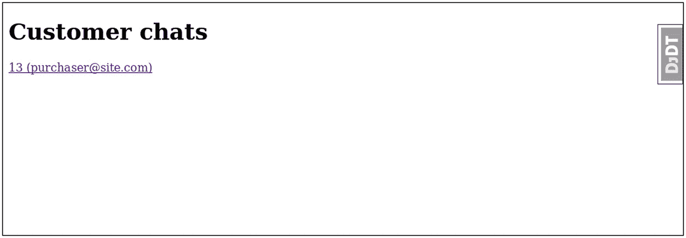
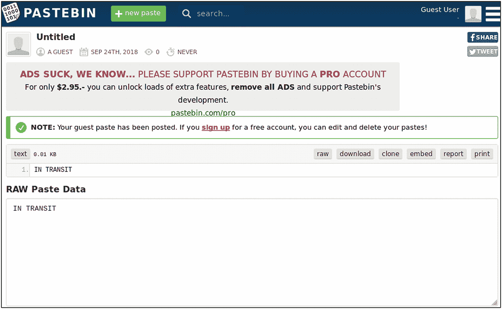

# 八、移动客服应用的后端

在这一章中，我们将离开 HTML 和普通的 HTTP。我们将创建必要的基础设施来支持移动应用，包括使用 WebSocket 和 HTTP 服务器端事件的异步通信。

本章以 Django 频道为中心，包括以下主题:

*   如何整合

*   如何构建 WebSocket 消费者

*   如何将其与 Redis 整合

*   如何使用它来异步提供内容

## Django频道

Django Channels 是 Django 生态系统的新成员。它得到了 Django 的官方支持，所有的开发都是和 Django 一起在 GitHub 上进行的。但是，在安装 Django 时不包括它。

Channels 允许我们编写异步代码来处理传入的请求，这在客户端和服务器之间有自然异步交互的情况下很有帮助——例如，聊天会话。

虽然如果实时组件不是关键的话，在技术上可以构建一个具有普通 Django 视图的聊天服务器，但是当客户端数量增加时，同步系统将无法像异步系统那样扩展。

也就是说，在同步系统上开发要容易得多。不要认为异步编程总是一个更好的范例，因为，和计算中的任何事情一样，它也有代价。

### 异步代码与同步代码

同步编程是一个非常好理解的执行模型。你的代码被从头到尾执行，然后将控制权返回给 Django。另一方面，在异步编程中，情况并非总是如此。您的异步代码与一个`asyncio`事件循环协同工作。网上有很多文档，我鼓励你去看看，比如 <sup>[1](#Fn1)</sup> 。

幸运的是，在使用 Django 通道之前，您不需要理解异步编程的所有内容。这个库隐藏了一些底层细节，简化了您的工作。要理解的最重要的事情之一是，您不能自由地混合同步和异步代码。每次这样做，你都需要跨越一个边界 <sup>[2](#Fn2)</sup> 。

我鼓励你花一些时间在线阅读关于异步编程的内容。它将帮助你理解本章中的代码和概念。

### 安装和配置

为了在我们的系统上安装通道，我们将把它和 Redis 一起安装，Redis 是一个开源的内存数据结构服务器( [`https://redis.io`](https://redis.io) )。这与我们一开始使用 PostgreSQL 的原因相同:总是在生产部署将使用的相同环境中工作。

继续下载并在您的操作系统上安装 Redis。完成后，继续安装通道:

```py
pipenv install channels
pipenv install channels_redis

```

我们的项目需要一个新文件`routing.py`，放在同一个文件夹`settings.py`中。目前，这个文件除了内置的路由之外，不会声明任何路由。

`booktime/routing.py`的内容是:

```py
from channels.routing import ProtocolTypeRouter

application = ProtocolTypeRouter({})

```

我们将使用 Redis 将该文件与通道配置连接起来。应用`channels`需要成为第一个，因为它覆盖了标准 Django 的`runserver`命令:

```py
INSTALLED_APPS = [
    'channels',
    ...
]
ASGI_APPLICATION = "booktime.routing.application"

CHANNEL_LAYERS = {
    'default': {
        'BACKEND': 'channels_redis.core.RedisChannelLayer',
        'CONFIG': {
            "hosts": [('127.0.0.1', 6379)],
        },
    },
}

```

您现在可以使用这个库了。这是新的`runserver`命令的输出:

```py
$ ./manage.py runserver
Performing system checks...

System check identified no issues (0 silenced).
August 15, 2018 - 18:56:30
Django version 2.1, using settings 'booktime.settings' Starting ASGI/Channels version 2.1.2 development server at...
Quit the server with CONTROL-C.
2018-08-15 18:56:30,270 - INFO - server - HTTP/2 support not enabled
2018-08-15 18:56:30,271 - INFO - server - Configuring endpoint...
2018-08-15 18:56:30,272 - INFO - server - Listening on 127.0.0.1:8000

```

### 用缰绳

如前所述，Redis 是一个内存数据结构服务器。它可以用作非常简单的数据库、缓存或消息代理。它有一组与普通数据库非常不同的操作，它的用例也非常不同。

在我们的设置中，通道将使用 Redis 在运行的 Django 应用的不同实例之间传递消息。Redis 还将使我们能够在不同机器上运行的实例之间以及在单个服务器上运行的实例之间传递消息。

除了要求 Redis 支持进程间的通信，本章的代码将直接使用 Redis 创建一个简单的存在机制。默认情况下，通道不提供确定某些用户是否连接到我们的端点的方法。

### 顾客

我们可以把渠道中的*消费者*看作是基于类别的视图的等价物，区别在于消费者不像 cbv 那样层次高、数量多。有两个基本的消费者类别，`SyncConsumer`和`AsyncConsumer`。除了异步代码依赖于 Python `async/await`语法之外，它们的接口是相同的。

消费者的结构基于使用类方法和`send()`内置方法的消息处理程序的组合。消费者可以有多个消息处理程序，消息的路由基于消息的`type`值。

当类初始化时，每个消费者都将收到一个存储在`self.scope`中的`scope`对象。它包含关于初始请求的信息，例如:

*   `scope["path"]`:请求的路径

*   `scope["user"]`:当前用户(仅在认证启用时)

*   `scope["url_route"]`:包含匹配的路由(如果使用 URL 路由器)

原始消费者有几个子类:

*   `WebsocketConsumer`和`AsyncWebsocketConsumer`

*   `JsonWebsocketConsumer`和`AsyncJsonWebsocketConsumer`

*   `AsyncHttpConsumer`

这些子类中的每一个都添加了一些 helper 方法，例如，管理 JSON 编码/解码或 WebSockets。

### 频道、频道层和群组

这个库的核心概念之一是通道。通道本质上是一个邮箱，当它作为请求处理的一部分被实例化时，每个使用者会自动获得一个邮箱，当使用者终止时，它会被删除。这就是消息从外部发送给给定消费者的方式。

通道层相当于邮递员。它们需要在 Django 的不同实例之间传输消息。该层可以将消息传递给单个消费者(通过知道其通道名)或一组消费者(通过知道其组通道名)。

向单个消费者发送消息并不是常见的用例。更常见的是向与特定用户相关的所有消费者发送消息(在他或她在多个选项卡上打开站点的情况下很有用)，或者向一组特定用户的所有消费者发送消息(就像我们的聊天案例)。

为此，Channels 提供了一个名为*组*的抽象。群组是您可以向其发送消息的实体，这些消息将被转发到与其连接的所有消费者渠道。通过通道层上的方法`group_add()`和`group_discard()`将通道连接到组。

要向群组发送信息，您可以使用`group_send()`。当通过此方法发送消息时，通道层会将消息转发到所有连接的消费者通道。然后，消费者将通过调用特定消息类型的消息处理程序来自动处理消息。

然后，处理程序负责将消息转发回 HTTP 客户端(通过使用`send()`)或进行所需的计算。

### 路由和中间件

通道包括各种路由器，用于将请求路由到特定的消费者。路由可以基于协议(HTTP 或 WebSocket)、URL 或通道名称。

在我们的项目中，我们最初将使用`ProtocolTypeRouter`,因为我们需要将 WebSocket 处理代码与普通的 Django 视图分开。我们将使用路由器和渠道提供的特殊中间件。

这里的中间件不同于标准 Django 中的中间件。这个中间件是完全异步的。它提供了一些原则上类似于 Django 中间件的东西:过滤、阻止和向作用域添加附加信息。

在我们的应用中，我们将使用`AuthMiddlewareStack`，它是认证、会话和 cookie 中间件组件的组合。这个中间件堆栈将负责加载用户会话，确定连接是否经过身份验证，如果是，则加载消费者范围内的用户对象。

## 为我们的客服人员聊天

让我们开始用渠道构建一些具体的东西:客服人员的内部聊天页面。我们将从下载一个必备软件`reconnecting-websocket`开始，它将为我们处理不稳定的连接:

```py
$ curl -o main/static/js/reconnecting-websocket.min.js \
   https://raw.githubusercontent.com/joewalnes/reconnecting-websocket/
   \master/reconnecting-websocket.min.js

```

我们将为我们的客服代表提供一个非常简单的聊天页面，您可以随意设计。这是`main/templates/chat_room.html`的内容:

```py

<!DOCTYPE html>

<html>

  <head>
    <meta charset="utf-8"/>
    <title>Chat Room</title>
    <script
      src=""
      charset="utf-8"></script>
  </head>
  <body>
    <textarea id="chat-log" cols="100" rows="20"></textarea><br/>
    <input id="chat-message-input" type="text" size="100"/><br/>
    <input id="chat-message-submit" type="button" value="Send"/>
  </body>
  <script>
    var roomName = {{ room_name_json }};
    var chatSocket = new ReconnectingWebSocket(
      'ws://' + window.location.host + '/ws/customer-service/' +
      roomName + '/'
    );
    chatSocket.onmessage = function (e) {
      var data = JSON.parse(e.data);
      var username = data['username'];
      if (data['type'] == "chat_join") {
        message = (username + ' joined\n ');
      } else if (data['type'] == "chat_leave") {
        message = (username + ' left\n ');
      } else {
        message = (username + ': ' + data['message'] + '\n');
      }
      document
        .querySelector('#chat-log')
        .value += message;
    };
    chatSocket.onclose = function (e) {
      console.error('Chat socket closed unexpectedly');
    };
    document
      .querySelector('#chat-message-input')
      .focus();
    document
      .querySelector('#chat-message-input')
      .onkeyup = function (e) {
        if (e.keyCode === 13) { // enter, return
          document
            .querySelector('#chat-message-submit')
            .click();
        }

      };
    document
      .querySelector('#chat-message-submit')
      .onclick = function (e) {
        var messageInputDom = document.querySelector(
          '#chat-message-input'
        );
        var message = messageInputDom.value;
        chatSocket.send(
          JSON.stringify({'type': 'message', 'message': message})
        );
        messageInputDom.value = ";
      };
    setInterval(function () {
      chatSocket.send(JSON.stringify({'type': 'heartbeat'}));
    }, 10000);
  </script>

</html>

```

这是我们定制的包含在渠道库中的示例版本。它是一个简单的消息可视化器/发送器，通过 WebSocket 连接发送和接收 JSON 消息。

### WebSocket 协议格式

我们将为 WebSocket 消息定义一个非常简单的格式，服务器到客户端:

```py
{
    type: "TYPE",
    username: "who is the originator of the event",
    message: "This is the displayed message" (optional)
}

```

这里，`TYPE`可以有以下值:

*   `chat_join`:用户名加入了聊天。

*   `chat_leave`:用户名离开了聊天。

*   `chat_message`:用户名发送消息。

这足以定义服务器到客户端。现在，对于客户端到服务器:

```py
{
    type: "TYPE",
    message: "This is the displayed message" (optional)
}

```

`TYPE`在这种情况下可以有以下值:

*   `message`:用户名发送消息。

*   `heartbeat`:ping 命令，让服务器知道用户是活动的。

这描述了我们的整个 WebSocket 协议。我们将使用它来为我们公司的客户构建客服部分和移动界面。

### Redis 中的心跳机制

我们的聊天需要一个以用户为中心而不是以连接为中心的在线系统。任何用户，无论是客服代表还是最终用户，一旦他们发起的所有 WebSocket 连接被关闭或处于非活动状态超过 10 秒钟，他们都将变得不可用。这将确保以更可靠的方式处理网络问题或浏览器崩溃。

我们将依赖 Redis 的到期功能。Redis 有一种非常有效的方法来设置特定键的值，只是暂时的。当设置值和过期时间时，Redis 会在适当的时候自动删除它们。对我们来说，这是一个完美的机制，因为它可以自动回收密钥。

来自客户端的心跳信号将在名为 customer-service _ ORDERID _ user email 的键上发出 Redis `SETEX`命令，设置虚拟值 1，10 秒后到期。

这足以支持一个页面来显示谁连接到哪个客服聊天的动态列表。该页面将发出带有前缀`customer-service_`的 Redis `KEYS`命令，并从返回的结果中生成信息。

为了直接使用 Redis，我们需要向我们的系统添加一个新的依赖项:

```py
$ pipenv install aioredis

```

假设我们使用异步消费者，我们将需要异步网络库。`aioredis`库是 Redis Python 客户端的异步版本。

### 引导页面

我们将添加一个到`main/urls.py`的 URL 和一个到`main/views.py`的视图，以服务前面给出的`chat_room.html`模板。让我们从视图开始:

```py
...

def room(request, order_id):
    return render(
        request,
        "chat_room.html",
        {"room_name_json": str(order_id)},
    )
...

urlpatterns = [
    ...

    path(
        "customer-service/<int:order_id>/",
        views.room,
        name="cs_chat",
    ),
]

```

聊天引导页面现在已经完成，但是它的 JavaScript 不能工作，因为 WebSocket 端点还不存在。

### WebSocket 消费者

消费者是大部分工作发生的地方。我们将把消费者放在`main/consumers.py`:

```py
import aioredis
import logging
from django.shortcuts import get_object_or_404
from channels.db import database_sync_to_async
from channels.generic.websocket import AsyncJsonWebsocketConsumer
from . import models

logger = logging.getLogger(__name__)

class ChatConsumer(AsyncJsonWebsocketConsumer):
    EMPLOYEE = 2
    CLIENT = 1

    def get_user_type(self, user, order_id):
        order = get_object_or_404(models.Order, pk=order_id)

        if user.is_employee:
            order.last_spoken_to = user order.save()
            return ChatConsumer.EMPLOYEE
        elif order.user == user:
            return ChatConsumer.CLIENT
        else:
            return None

    async def connect(self):
        self.order_id = self.scope["url_route"]["kwargs"][
            "order_id"
        ]
        self.room_group_name = (
            "customer-service_%s" % self.order_id
        )
        authorized = False
        if self.scope["user"].is_anonymous:
           await self.close()

        user_type = await database_sync_to_async(
            self.get_user_type
        )(self.scope["user"], self.order_id)

        if user_type == ChatConsumer.EMPLOYEE:
            logger.info(
                "Opening chat stream for employee %s",
                self.scope["user"],
            )
            authorized = True
        elif user_type == ChatConsumer.CLIENT:
            logger.info(
                "Opening chat stream for client %s",
                self.scope["user"],
            )
            authorized = True
        else:
            logger.info(
                "Unauthorized connection from %s",
                self.scope["user"],
            )
            await self.close()

        if authorized:
            self.r_conn = await aioredis.create_redis(
                "redis://localhost"
            )
            await self.channel_layer.group_add(
                self.room_group_name, self.channel_name
            )
            await self.accept()
            await self.channel_layer.group_send(
                self.room_group_name,
                {
                    "type": "chat_join",
                    "username": self.scope[
                        "user"
                    ].get_full_name(),
                },
            )

    async def disconnect(self, close_code):
        if not self.scope["user"].is_anonymous:
            await self.channel_layer.group_send(
                self.room_group_name,
                {
                    "type": "chat_leave",
                    "username": self.scope[
                        "user"
                    ].get_full_name(),
                },
            )
            logger.info(
                "Closing chat stream for user %s",
                self.scope["user"],
            )
            await self.channel_layer.group_discard(
                self.room_group_name, self.channel_name
            )

    async def receive_json(self, content):
        typ = content.get("type")
        if typ == "message":
            await self.channel_layer.group_send(
                self.room_group_name,
                {
                    "type": "chat_message",
                    "username": self.scope[
                        "user"
                    ].get_full_name(),
                    "message": content["message"],
                },
            )
        elif typ == "heartbeat":
            await self.r_conn.setex(
                "%s_%s"
                % (
                    self.room_group_name,
                    self.scope["user"].email,
                ),
                10,  # expiration (in 10 seconds)
                "1", # dummy value
            )

    async def chat_message(self, event):
        await self.send_json(event)
    async def chat_join(self, event):
        await self.send_json(event)
    async def chat_leave(self, event):
        await self.send_json(event)

```

我们从`AsyncJsonWebsocketConsumer`派生出我们的消费者，它负责`WebSocket`的底层方面和 JSON 编码。我们需要实现`receive_json()`、`connect()`和`disconnect()`来让这个类工作。

`connect()`做的第一件事是生成一个房间名，它将被用作`group_*()`呼叫的通道名。在此之后，我们需要确保用户有权限在这里，这需要访问数据库。

从异步消费者访问数据库需要将代码包装在同步函数中，然后使用`database_sync_to_async()`方法。这是因为 Django 本身，尤其是 ORM，是以同步方式编写的。

前面代码中的`get_user_type()`方法除了检查用户类型之外，还存储订单中客户与之交谈的最后一个雇员的姓名。

三种主要的方法，`receive_json()`、`connect()`和`disconnect()`，使用通道层方法`group_send()`、`group_add()`和`group_discard()`来管理一个聊天室的所有不同消费者实例之间的通信和同步。

在方法`receive_json()`中，我们使用`group_send()`方法来处理我们在 WebSocket 协议格式部分列出的两种类型的消息。“message”类型的消息按原样转发给所有连接的消费者，而“heartbeat”类型的消息用于更新 Redis 密钥的到期时间(如果该密钥尚不存在，则创建该密钥)。

在方法`connect()`和`disconnect()`中，我们使用`group_send()`方法来生成不同用户的加入/离开消息。

记住`group_send()`不是将数据发送回浏览器的 WebSocket 连接，这一点很重要。它仅用于使用配置的通道层在消费者之间传递信息。每个消费者将通过消息处理程序接收这些数据。

最后，在 ChatConsumer 中有三个处理程序:`chat_message()`、`chat_join()`和`chat_leave()`。它们都将消息直接发送回浏览器的 WebSocket 连接，因为所有的处理都将发生在前端。

将处理消息的消息处理程序的名称来自 type 字段。如果用`chat_message`的`message[` ' `type` ' `]`调用`group_send()`，则接收消费者将使用`chat_message()`处理程序处理此事。

根据最后几段，花点时间重读代码，并交叉引用我刚才提到的关于代码功能的内容。阅读代码时还要考虑到，异步编程不是 Python 中的默认风格。

这个消费者需要我们数据库模式中的一个新字段。让我们快速添加到我们的`main/models.py`:

```py
...

class Order(models.Model):
    ...

    last_spoken_to = models.ForeignKey(
        User,
        null=True,
        related_name="cs_chats",
        on_delete=models.SET_NULL,
    )

    ...

```

添加之后，不要忘记运行管理命令`makemigrations`和`migrate`来将其应用到数据库。

在定义了消费者及其所有需求之后，我们将继续为这个消费者定义路由。

### 选择途径

目前我们在`booktime/routing.py`中有一个空的`{}`路由变量。我们需要改变这种情况。

我们将在`main/routing.py`管理所有特定于我们站点的路线:

```py
from django.urls import path

from . import consumers

websocket_urlpatterns = [
    path(
        "ws/customer-service/<int:order_id>/",
        consumers.ChatConsumer
    )
]

```

我们将管理`booktime/routing.py`中的所有常规路线:

```py
from channels.auth import AuthMiddlewareStack
from channels.routing import ProtocolTypeRouter, URLRouter
import main.routing

application = ProtocolTypeRouter({
    # (http->django views is added by default)
    'websocket': AuthMiddlewareStack(
        URLRouter(
            main.routing.websocket_urlpatterns
        )
    ),
})

```

这个设置将为我们的 WebSocket 消费者分配一个 URL 路径，并将 WebSocket 流量中继到这个新的“websocket”路由。如果我们不将“http”协议类型添加到主路由器，通道将自动添加它以支持标准 Django 视图。

现在，您可以通过在浏览器中加载聊天 URL 来测试您的页面。您应该能够加载聊天，并在聊天中键入一些句子。如果您在多个浏览器中加载聊天内容，您会看到您在一个窗口中输入的内容会出现在另一个窗口中。

### 自动化测试

正如本书中的任何内容一样，我将解释如何测试到目前为止公开的代码。Channels 提供了名为*communicator*的构造。您可以将通信器视为 Django 测试用例中包含的测试客户端的等价物。

与消费者不同，通信者没有同步版本和异步版本。它们只带有一个异步 API。要将它与同步运行的标准 Python Unittest 框架一起使用，我们需要使用一些低级别的 asyncio API。这就是我们在测试中要做的。

我们将把这些测试放在`main/tests/test_consumers.py`中:

```py
import asyncio
from django.contrib.auth.models import Group
from django.test import TestCase
from channels.db import database_sync_to_async
from channels.testing import WebsocketCommunicator
from main import consumers
from main import factories

class TestConsumers(TestCase):
    def test_chat_between_two_users_works(self):
        def init_db():
            user = factories.UserFactory(
                email="john@bestemails.com",
                first_name="John",
                last_name="Smith",
            )
            order = factories.OrderFactory(user=user)
            cs_user = factories.UserFactory(
                email="customerservice@booktime.domain",
                first_name="Adam",
                last_name="Ford",
                is_staff=True,
            )
            employees, _ = Group.objects.get_or_create(
                name="Employees"
            )
            cs_user.groups.add(employees)

            return user, order, cs_user

        async def test_body():
            user, order, cs_user = await database_sync_to_async(
                init_db
            )()

            communicator = WebsocketCommunicator(
                consumers.ChatConsumer,
                "/ws/customer-service/%d/" % order.id,
            )
            communicator.scope["user"] = user
            communicator.scope["url_route"] = {
                "kwargs": {"order_id": order.id}
            }
            connected, _ = await communicator.connect()
            self.assertTrue(connected)

            cs_communicator = WebsocketCommunicator(
                consumers.ChatConsumer,
                "/ws/customer-service/%d/" % order.id,
            )
            cs_communicator.scope["user"] = cs_user
            cs_communicator.scope["url_route"] = {
                "kwargs": {"order_id": order.id}
            }
            connected, _ = await cs_communicator.connect()
            self.assertTrue(connected)

            await communicator.send_json_to(
                {
                    "type": "message",
                    "message": "hello customer service",
                }
            )

            await asyncio.sleep(1)

            await cs_communicator.send_json_to(
                {"type": "message", "message": "hello user"}
            )

            self.assertEquals(
                await communicator.receive_json_from(),
                {"type": "chat_join", "username": "John Smith"},
            )
            self.assertEquals(
                await communicator.receive_json_from(),
                {"type": "chat_join", "username": "Adam Ford"},
            )
            self.assertEquals(
                await communicator.receive_json_from(),
                {
                    "type": "chat_message",
                    "username": "John Smith",
                    "message": "hello customer service",
                },
            )

            self.assertEquals(
                await communicator.receive_json_from(),
                {
                    "type": "chat_message",
                    "username": "Adam Ford",
                    "message": "hello user",
                },
            )

            await communicator.disconnect()
            await cs_communicator.disconnect()

            order.refresh_from_db()
            self.assertEquals(order.last_spoken_to, cs_user)

        loop = asyncio.get_event_loop()
        loop.run_until_complete(test_body())

```

在这个测试中，我们测试连接是否正常工作，消息是否按照预期的方式被转发。为了测试这一点，我们使用两个通信器，一个代表客服操作员，另一个代表最终用户。

注意，前面的测试函数包含两个子函数，一个用于同步数据库初始化，另一个用于主要的异步主体。然后，通过直接引用 asyncio 循环来运行主异步体。

通信器将消费者要连接的对象和 URL 作为参数。URL 不是绝对必要的，但是 URLRouter 使用它来在使用者范围内注入路由。URLRouter 不支持命名路由，因此在引用 URL 时不能使用`reverse()`。

我们的消费者还需要一个阻止未授权用户的测试:

```py
    ...

    def test_chat_blocks_unauthorized_users(self):
        def init_db():
            user = factories.UserFactory(
                email="john@bestemails.com",
                first_name="John",
                last_name="Smith",
            )
            order = factories.OrderFactory()

            return user, order

        async def test_body():
            user, order = await database_sync_to_async(init_db)()

            communicator = WebsocketCommunicator(
                consumers.ChatConsumer,
                "/ws/customer-service/%d/" % order.id,
            )
            communicator.scope["user"] = user
            communicator.scope["url_route"] = {
                "kwargs": {"order_id": order.id}
            }
            connected, _ = await communicator.connect()
            self.assertFalse(connected)

        loop = asyncio.get_event_loop()
        loop.run_until_complete(test_body())

```

不可否认，这里的低级 asyncio 函数过于简单。如果您打算开始编写许多异步测试，您可能想看看 Pytest，这是 Django Channels 在内部发布时使用的。

## 聊天仪表板(带在线状态)

我们的客服代表需要能够看到是否有客户在等待服务。我们需要建立一个仪表板，动态更新聊天室和其中各种人的列表。

我们将采用与之前构建的聊天类似的方法，但是我们将使用更简单的单向方法来代替 WebSockets。我们将使用 HTTP 服务器发送的事件。

服务器发送的事件(SSE)本质上是一个 HTTP 连接，它保持打开，并在事件发生时接收大量信息。每个信息块都以单词“data:”为前缀，并以两个换行符结束。

我邀请你在线阅读一些关于协议格式 <sup>[3](#Fn3)</sup> 的文档。SSE 没有 WebSockets 复杂。它很容易实现，所有主流浏览器都支持它。

类似于我们之前所做的，我们将使用`reconnecting-eventsource`，它将为我们处理不稳定的连接:

```py
$ curl -o main/static/js/reconnecting-eventsource.js \
    https://cdn.jsdelivr.net/npm/reconnecting-eventsource@1.0.1/\
    dist/ReconnectingEventSource.js

```

本着与聊天页面相同的精神，这是我们非常简单的仪表板，存储在`main/templates/customer_service.html`:



图 8-1

客服仪表板

```py

<!DOCTYPE html>

<html>

  <head>
    <meta charset="utf-8"/>
    <title>Chat Rooms</title>
    <script
      src=""
      charset="utf-8"></script>
    </head>
    <body>
      <h1>Customer chats</h1>
      <div id="notification-area"></div>
      <script>
        var source = new ReconnectingEventSource('/customer-service/notify/');
        source.addEventListener('message', function (e) {
          document
            .getElementById("notification-area")
            .innerHTML = "";
          var data = JSON.parse(e.data);
          var html;
          for (var i = 0; i < data.length; i++) {
            html = '<div><a href="' + data[i]['link'] + '">' + data[i]['text'] + '</a></div>';
            document
              .getElementById("notification-area")
              .innerHTML += html;
          }

        }, false);
    </script>
  </body>

</html>

```

我们将再次添加一个到`main/urls.py`的 URL 来提供上面的模板:

```py
...

urlpatterns = [
    ...

    path(
        "customer-service/",
        TemplateView.as_view(
            template_name="customer_service.html"
        ),
        name="cs_main",
    ),
]

```

### HTTP 服务器发送的事件消费者

上面的页面将从`main/consumers.py`的一个新消费者那里接收动态数据:

```py
...

import asyncio
import json
from django.urls import reverse
from channels.exceptions import StopConsumer
from channels.generic.http import AsyncHttpConsumer

...
class ChatNotifyConsumer(AsyncHttpConsumer):
    def is_employee_func(self, user):
        return not user.is_anonymous and user.is_employee

    async def handle(self, body):
        is_employee = await database_sync_to_async(
            self.is_employee_func
        )(self.scope["user"])

        if is_employee:
            logger.info(

                "Opening notify stream for user %s and params %s",
                self.scope.get("user"),
                self.scope.get("query_string"),
            )
            await self.send_headers(
                headers=[
                    ("Cache-Control", "no-cache"),
                    ("Content-Type", "text/event-stream"),
                    ("Transfer-Encoding", "chunked"),
                ]
            )
            self.is_streaming = True
            self.no_poll = (
                self.scope.get("query_string") == "nopoll"
            )
            asyncio.get_event_loop().create_task(self.stream())
        else:
            logger.info(
                "Unauthorized notify stream for user %s and params %s",
                self.scope.get("user"),
                self.scope.get("query_string"),
            )
            raise StopConsumer("Unauthorized")

    async def stream(self):
        r_conn = await aioredis.create_redis("redis://localhost")
        while self.is_streaming:
            active_chats = await r_conn.keys(
                "customer-service_*"
            )

            presences = {}
            for i in active_chats:
                _, order_id, user_email = i.decode("utf8").split(
                    "_"
                )
                if order_id in presences:
                    presences[order_id].append(user_email)
                else:
                    presences[order_id] = [user_email]

            data = []
            for order_id, emails in presences.items():
                data.append(
                    {
                        "link": reverse(
                        "cs_chat",
                        kwargs={"order_id": order_id}
                    ),
                    "text": "%s (%s)"
                    % (order_id, ", ".join(emails)),
                }
            )

            payload = "data: %s\n\n" % json.dumps(data)
            logger.info(
                "Broadcasting presence info to user %s",
                self.scope["user"],
            )
            if self.no_poll:
                await self.send_body(payload.encode("utf-8"))
                self.is_streaming = False
            else:
                await self.send_body(
                    payload.encode("utf-8"),
                    more_body=self.is_streaming,
                )
                await asyncio.sleep(5)

    async def disconnect(self):
        logger.info(
            "Closing notify stream for user %s",
            self.scope.get("user"),
        )

        self.is_streaming = False

```

这个消费者用`handle()`和`disconnect()`方法实现了`AsyncHttpConsumer`接口。由于我们试图构建的端点的流性质，我们需要保持连接开放。我们将调用`send_headers()`方法来启动 HTTP 响应，并且我们将调用`send_body()`，将`more_body`参数设置为`True`，在一个独立的异步任务中保持活动状态。

`stream()`方法激活被添加到事件循环中，并且将保持活动状态，直到`disconnect()`方法被调用(客户端发起的断开连接)。当这个方法被调用时，它会将一个`is_streaming`标志设置为`False`，这将导致运行在不同 asyncio 任务中的`stream()`内循环退出。

`stream()`方法将定期从 Redis 中读取未过期的密钥，并将它们发送回客户端。如果在连接时传入了`nopoll`标志，它将退出循环，而不等待客户端断开连接。

只有授权用户才能进行流式传输。对于未经授权的用户，`handle()`方法将引发一个`StopConsumer`异常，该异常将停止消费者并关闭与客户端的当前连接。

### 选择途径

SSE 消费者是我们创建的第一个 HTTP 消费者，它需要一些额外的配置才能工作。我们将在`main/routing.py`中定义所有非 websocket HTTP 路由:

```py
from channels.auth import AuthMiddlewareStack

...

http_urlpatterns = [
    path(
        "customer-service/notify/",
        AuthMiddlewareStack(
            consumers.ChatNotifyConsumer
        )
    )
]

```

我们将用一个定制的路由覆盖`booktime/routing.py`中的默认 HTTP 路由:

```py
from django.urls import re_path
from channels.auth import AuthMiddlewareStack
from channels.routing import ProtocolTypeRouter, URLRouter
from channels.http import AsgiHandler
import main.routing

application = ProtocolTypeRouter(
    {
        "websocket": AuthMiddlewareStack(
            URLRouter(main.routing.websocket_urlpatterns)
        ),
        "http": URLRouter(
            main.routing.http_urlpatterns
            + [re_path(r"", AsgiHandler)]
        ),
    }
)

```

HTTP 路由现在与一个 URLRouter 相关联，该 URL router 包含我们在`main/routing.py`中定义的`http_urlpatterns`，对于所有其他路由，它退回到`AsgiHandler`，后者又转发到标准的 Django 处理程序。

`AsgiHandler`是从异步服务器网关接口(ASGI)协议到 Web 服务器网关接口(WSGI)协议的翻译器，WSGI 是核心 Django 使用的内部协议。

### 自动化测试

针对 SSE 消费者的测试将使用不同类型的通信器`HttpCommunicator`。我们将在建立 WebSocket 连接和连接超时后使用它，我们将检查 SSE 请求是否返回了正确的事件。超时是为了给 Redis 时间从内存中删除条目。

```py
...

import json
from channels.testing import HttpCommunicator

class TestConsumers(TestCase):
    ...

    def test_chat_presence_works(self):
        def init_db():
            user = factories.UserFactory(
                email="user@site.com",
                first_name="John",
                last_name="Smith",
            )
            order = factories.OrderFactory(user=user)
            cs_user = factories.UserFactory(
                email="customerservice@booktime.domain",
                first_name="Adam",
                last_name="Ford",
                is_staff=True,
            )

            employees, _ = Group.objects.get_or_create(
                name="Employees"
            )
            cs_user.groups.add(employees)

            return user, order, cs_user
        async def test_body():
            user, order, notify_user = await database_sync_to_async(
                init_db
            )()

            communicator = WebsocketCommunicator(
                consumers.ChatConsumer,
                "/ws/customer-service/%d/" % order.id,
            )
            communicator.scope["user"] = user
            communicator.scope["url_route"] = {
                "kwargs": {"order_id": order.id}
            }
            connected, _ = await communicator.connect()
            self.assertTrue(connected)

            await communicator.send_json_to(
                {"type": "heartbeat"}
            )
            await communicator.disconnect()

            communicator = HttpCommunicator(
                consumers.ChatNotifyConsumer,
                "GET",
                "/customer-service/notify/",
            )

            communicator.scope["user"] = notify_user
            communicator.scope["query_string"] = "nopoll"

            response = await communicator.get_response()
            self.assertTrue(
                response["body"].startswith(b"data: ")
            )
            payload = response["body"][6:]
            data = json.loads(payload.decode("utf8"))
            self.assertEquals(
                data,
                [
                    {
                        "link": "/customer-service/%d/" % order.id,
                        "text": "%d (user@site.com)" % order.id,
                    }
                ],
                "expecting someone in the room but no one found",
            )

            await asyncio.sleep(10)

            communicator = HttpCommunicator(
                consumers.ChatNotifyConsumer,
                "GET",
                "/customer-service/notify/",
            )
            communicator.scope["user"] = notify_user
            communicator.scope["query_string"] = "nopoll"
            response = await communicator.get_response()
            self.assertTrue(
                response["body"].startswith(b"data: ")
            )
            payload = response["body"][6:]
            data = json.loads(payload.decode("utf8"))
            self.assertEquals(
                data,
                [],
                "expecting no one in the room but someone found",
            )

        loop = asyncio.get_event_loop()
        loop.run_until_complete(test_body())

```

## 移动 API

在本章的剩余部分，我们将停止使用 Django 通道。我们计划在移动应用中使用的其他 API 将使用 Django REST 框架(DRF)构建。我们将为订单检索构建一个身份验证端点和一个 API。

### 证明

对于我们的移动应用，我们将使用基于令牌的身份验证。这是非 web 应用的最佳实践，因为它为我们提供了更多的安全性，以防客户端设备受到威胁。除了令牌之外，设备上不存储任何凭据，如果需要，令牌很容易失效。

为此，我们需要在 Django Rest 框架中启用它:

```py
INSTALLED_APPS = [
    ...
    "rest_framework",
    "rest_framework.authtoken",
    ...
]

REST_FRAMEWORK = {
    "DEFAULT_AUTHENTICATION_CLASSES": (
        "rest_framework.authentication.SessionAuthentication",
        "rest_framework.authentication.TokenAuthentication",
        "rest_framework.authentication.BasicAuthentication",
    ),
    ...
}

```

这将为我们的系统增加一个额外的模型。前一步需要运行`migrate`命令。此后，我们将在`main/signals.py`中为每个有新信号的新用户自动生成一个令牌:

```py
from django.conf import settings
from rest_framework.authtoken.models import Token

...

@receiver(post_save, sender=settings.AUTH_USER_MODEL)
def create_auth_token(
    sender, instance=None, created=False, **kwargs
):
    if created:
        Token.objects.create(user=instance)

```

从现在开始，除了已经存在的方法之外，每个新用户都可以使用令牌访问经过身份验证的 DRF 端点。接下来我们需要创建登录端点，我们可以将它添加到我们的`main/urls.py`的底部:

```py
from rest_framework.authtoken import views as authtoken_views

...

urlpatterns = [
    ...
    path(
        "mobile-api/auth/",
        authtoken_views.obtain_auth_token,
        name="mobile_token",
    ),
]

```

就是这样。我们有一个工作的移动认证端点。为了完成这项工作，需要进行相关的测试(`main/tests/test_endpoints.py`):

```py
from django.urls import reverse
from rest_framework.test import APITestCase
from main import models

class TestEndpoints(APITestCase):

    def test_mobile_login_works(self):
        user = models.User.objects.create_user(
            "user1", "abcabcabc"
        )
        response = self.client.post(
            reverse("mobile_token"),
            {"username": "user1", "password": "abcabcabc"},
        )

        jsonresp = response.json()
        self.assertIn("token", jsonresp)

```

### 检索订单

我们的移动应用需要一种方法来检索当前已验证用户的订单。我们将向我们的`main/endpoints.py`添加一个新的端点:

```py
from rest_framework.decorators import (
    api_view,
    permission_classes,
)
from rest_framework.permissions import IsAuthenticated
from rest_framework.response import Response

...

@api_view()
@permission_classes((IsAuthenticated,))
def my_orders(request):
    user = request.user
    orders = models.Order.objects.filter(user=user).order_by(
        "-date_added"
    )
    data = []
    for order in orders:
        data.append(
            {
                "id": order.id,
                "image": order.mobile_thumb_url,
                "summary": order.summary,
                "price": order.total_price,
            }
        )
    return Response(data)

```

这是一个定义为函数的 Django Rest 框架 API。正如 Django 一样，DRF 允许我们将端点定义为类或函数。因为这是一个自定义的只读端点，所以将其定义为函数比定义为类更容易。

这个视图使用了`Order`模型的一些新属性:

```py
class Order(models.Model):
    ...

    @property
    def mobile_thumb_url(self):
        products = [i.product for i in self.lines.all()]
        if products:
            img = products[0].productimage_set.first()
            if img:
                return img.thumbnail.url

    @property
    def summary(self):
        product_counts = self.lines.values(
            "product__name"
        ).annotate(c=Count("product__name"))
        pieces = []
        for pc in product_counts:
            pieces.append(
                "%s x %s" % (pc["c"], pc["product__name"])
            )
        return ", ".join(pieces)

    @property
    def total_price(self):
        res = self.lines.aggregate(
            total_price=Sum("product__price")
        )
        return res["total_price"]

```

最后，视图需要一个位于`main/urls.py`中的 URL:

```py
urlpatterns = [
    ...
    path(
        "mobile-api/my-orders/",
        endpoints.my_orders,
        name="mobile_my_orders",
    ),
]

```

这足以让这个视图工作。我们将为`main/test/test_endpoints.py`添加特定的测试，以及之前的测试:

```py
...

from rest_framework import status
from rest_framework.authtoken.models import Token
from main import factories

class TestEndpoints(APITestCase):
    ...

    def test_mobile_flow(self):
        user = factories.UserFactory(email="mobileuser@site.com")
        token = Token.objects.get(user=user)
        self.client.credentials(
            HTTP_AUTHORIZATION="Token " + token.key
        )

        orders = factories.OrderFactory.create_batch(
            2, user=user
        )
        a = factories.ProductFactory(
            name="The book of A", active=True, price=12.00
        )
        b = factories.ProductFactory(
            name="The B Book", active=True, price=14.00
        )
        factories.OrderLineFactory.create_batch(
            2, order=orders[0], product=a
        )
        factories.OrderLineFactory.create_batch(
            2, order=orders[1], product=b
        )

        response = self.client.get(reverse("mobile_my_orders"))
        self.assertEqual(
            response.status_code, status.HTTP_200_OK
        )

        expected = [
            {
                "id": orders[1].id,
                "image": None,
                "price": 28.0,
                "summary": "2 x The B Book",
            },
            {
                "id": orders[0].id,
                "image": None,
                "price": 24.0,
                "summary": "2 x The book of A",
            },
        ]
        self.assertEqual(response.json(), expected)

```

### 订单发货跟踪

BookTime 依靠外部公司运送网上购买的商品。这家公司有自己的跟踪系统，我们希望利用它将这些额外的信息反馈给我们的移动应用用户。

我们将添加一个自定义端点来获取订单的发货状态。让我们假设快递公司已经为 BookTime 提供了对 HTTP API 的访问，我们可以使用该 API 来获取关于货物状态的实时信息，这就是这些信息的来源。

送货公司的 API 不会被移动应用直接使用，因为我们可能希望在未来添加其他公司，而不必更改移动应用代码。

这就是我们的系统要做的:

*   接收移动应用对运输信息的请求

*   向第三方公司发出 API 请求

*   将货件信息转发回手机应用

简单地说，它看起来像一个反向代理系统。

鉴于通道的异步特性，这是一个很好的用例。以异步方式这样做将使我们的解决方案可以扩展到更多的并发请求。

如果我们以标准的同步方式这样做，我们可能会阻塞所有线程等待远程系统返回装运状态。如果发生这种情况，我们的 API 将变得没有响应。我们需要避免这种情况。

通过使用非阻塞的异步代码，我们的 API 不会变得无响应，即使我们与之交互的第三方系统离线。

为了模拟这个假设的 API，我们将使用 Pastebin。进入 [`https://pastebin.com`](https://pastebin.com) ，点击新建粘贴按钮，在文本框中输入**在途**，点击新建粘贴。一旦你这样做了(见图 [8-2](#Fig2) )，点击“raw”标签获得其原始网址。复制网址。我们将用它来模拟我们的 API。



图 8-2

单击“raw”复制 API 模拟的原始 Pastebin URL

既然我们已经有了公认的简单的测试 API，我们可以为它编写一个客户端。这个 API 将需要与一个异步网络库一起使用。出于与我们在前面章节中使用`aioredis`相同的原因，我们将使用一个名为`aiohttp`的 HTTP 客户端库，需要安装它:

```py
$ pipenv install aiohttp

```

这样做之后，我们就可以编写我们的消费者了。我们会将其添加到`main/consumers.py`(用您的 Pastebin URL 替换 put_url_here):

```py
import aiohttp
...

...

class OrderTrackerConsumer(AsyncHttpConsumer):
    def verify_user(self, user, order_id):
        order = get_object_or_404(models.Order, pk=order_id)
        return order.user == user

    async def query_remote_server(self, order_id):
        async with aiohttp.ClientSession() as session:
            async with session.get(
                "http://pastebin.com/put_url_here"
            ) as resp:
                return await resp.read()

    async def handle(self, body):
        self.order_id = self.scope["url_route"]["kwargs"][
            "order_id"
        ]
        is_authorized = await database_sync_to_async(
            self.verify_user
        )(self.scope["user"], self.order_id)

        if is_authorized:
            logger.info(
                "Order tracking request for user %s and order %s",
                self.scope.get("user"),
                self.order_id
            )
            payload = await self.query_remote_server(self.order_id)
            logger.info(
                "Order tracking response %s for user %s and order %s",
                payload,
                self.scope.get("user"),
                self.order_id
            )
            await self.send_response(200, payload)
        else:
            raise StopConsumer("unauthorized")

```

这个消费者是完全异步的，除了数据库查询。它使用 URL 中指定的订单 ID 接受请求，然后将`query_remote_server()`的结果转发回客户端。

`query_remote_server()`正在使用我们刚刚安装的库向我们刚刚创建的远程 Pastebin 发出 GET 请求。这样做的结果将简单地传递回客户端。

该消费者将需要一个 URL，该 URL 需要添加到`main/routing.py`:

```py
...

http_urlpatterns = [
    ...
    path(
        "mobile-api/my-orders/<int:order_id>/tracker/",
        AuthMiddlewareStack(consumers.OrderTrackerConsumer),
    )
]

```

您现在应该能够测试这一点了。请确保您在系统中至少有一个来自当前用户的订单。如果您使用正确的订单 ID 导航到前面的 URL，您应该会在浏览器中看到您的 Pastebin 的内容。

对此的测试将在`main/tests/test_consumers.py`中进行:

```py
from unittest.mock import patch, MagicMock
...

class TestConsumers(TestCase):
    ...

    def test_order_tracker_works(self):
        def init_db():
            user = factories.UserFactory(
                email="mobiletracker@site.com"
            )
            order = factories.OrderFactory(user=user)
            return user, order

        async def test_body():
            user, order = await database_sync_to_async(
                init_db
            )()

            awaitable_requestor = asyncio.coroutine(
                MagicMock(return_value=b"SHIPPED")
            )

            with patch.object(
                consumers.OrderTrackerConsumer, "query_remote_server"
            ) as mock_requestor:
                mock_requestor.side_effect = awaitable_requestor
                communicator = HttpCommunicator(
                    consumers.OrderTrackerConsumer,
                    "GET",
                    "/mobile-api/my-orders/%d/tracker/" % order.id,
                )
                communicator.scope["user"] = user
                communicator.scope["url_route"] = {
                    "kwargs": {"order_id": order.id}
                }

                response = await communicator.get_response()
                data = response["body"].decode("utf8")

                mock_requestor.assert_called_once()
                self.assertEquals(
                    data,
                    "SHIPPED"
                )

        loop = asyncio.get_event_loop()
        loop.run_until_complete(test_body())

```

在前面的测试中，我们用一个返回字符串“SHIPPED”的异步函数修补了整个方法`query_remote_server()`。通过这种方式，我们从测试中排除了 HTTP 客户端，这使得它运行起来更快，鉴于它的简单性，这对我们来说是一个很好的妥协。

## 将这一切结合在一起

为了使我们的移动集成尽可能顺利，还有一些更改需要申请。首先，我们的基于令牌的认证，目前只在 DRF 视图上工作，需要包括 WebSocket 和异步 HTTP 路由。

我们需要一个自定义的`AuthMiddlewareStack`，我们将把它放在一个新文件`booktime/auth.py`(与`settings.py`相同的文件夹)中，它在所有其他认证方式的基础上增加了令牌认证:

```py
from urllib.parse import parse_qs
from channels.auth import AuthMiddlewareStack
from rest_framework.authtoken.models import Token

class TokenGetAuthMiddleware:
    def __init__ (self, inner):
        self.inner = inner

    def __call__ (self, scope):
        params = parse_qs(scope["query_string"])
        if b"token" in params:
            try:
                token_key = params[b"token"][0].decode()
                token = Token.objects.get(key=token_key)
                scope["user"] = token.user
            except Token.DoesNotExist:
                pass
        return self.inner(scope)

TokenGetAuthMiddlewareStack = lambda inner: TokenGetAuthMiddleware(

    AuthMiddlewareStack(inner)
)

```

我们将在路由文件中使用这个新的中间件。以下是对`booktime/routing.py`的更改:

```py
from .auth import TokenGetAuthMiddlewareStack

...

application = ProtocolTypeRouter(
    {
        "websocket": TokenGetAuthMiddlewareStack(
            URLRouter(main.routing.websocket_urlpatterns)
        ),
        ...
    }
)

```

以下是对`main/routing.py`的更改:

```py
from booktime.auth import TokenGetAuthMiddlewareStack

...

http_urlpatterns = [
    ...
    path(
        "mobile-api/my-orders/<int:order_id>/tracker/",
        TokenGetAuthMiddlewareStack(consumers.OrderTrackerConsumer),
    )
]

```

在开发移动应用或任何移动应用的过程中，我们需要做的最后一件事是确保我们能够满足来自网络的请求，而不仅仅是我们的本地浏览器。

为了改变这一点，我们将为我们的`booktime/settings.py`添加一个额外的设置:

```py
ALLOWED_HOSTS = ['*']

```

这导致 Django 允许带有任何“Host”头的请求。请确保该设置在生产环境中是*而不是*(就像调试一样)。

从现在开始，我们将启动 dev 服务器，并选择监听所有可用的网络接口，而不仅仅是本地接口。我们可以使用以下命令来实现这一点:

```py
$ ./manage.py runserver 0.0.0.0:8000
Performing system checks...
System check identified no issues (0 silenced).
August 22, 2018 - 15:28:01
Django version 2.1, using settings 'booktime.settings'
Starting ASGI/Channels version 2.1.2 development server at http://0.0.0.0:8000/
Quit the server with CONTROL-C.
2018-08-22 15:28:01,644 - INFO - server - HTTP/2 support not enabled (install the http2 and tls Twisted extras)
2018-08-22 15:28:01,644 - INFO - server - Configuring endpoint tcp:port=8000:interface=0.0.0.0
2018-08-22 15:28:01,645 - INFO - server - Listening on TCP address 0.0.0.0:8000

```

这将允许我们的应用(运行在移动设备上)通过本地网络连接到我们的服务器。

## 摘要

本章的目标是使用 Channels(Django 的异步编程扩展)来构建一个聊天后端。信道引入了许多新概念，消费者、路由器、信道层和组，所有这些在本章中都有解释。

实际上，我们为公司的客服代表构建了一个聊天后端及其仪表板。我们还必须直接联系 Redis，以获得我们需要的、Channels 不提供的一些更高级的功能。

在上一节中，我们还讨论了移动应用的必要基础设施，我将在下一章介绍。

<aside class="FootnoteSection" epub:type="footnotes">Footnotes [1](#Fn1_source)

[T2`https://asyncio.readthedocs.io/en/latest/`](https://asyncio.readthedocs.io/en/latest/)

  [2](#Fn2_source)

[T2`https://www.aeracode.org/2018/02/19/python-async-simplified/`](https://www.aeracode.org/2018/02/19/python-async-simplified/)

  [3](#Fn3_source)

[T2`https://en.wikipedia.org/wiki/Server-sent_events`](https://en.wikipedia.org/wiki/Server-sent_events)

 </aside>