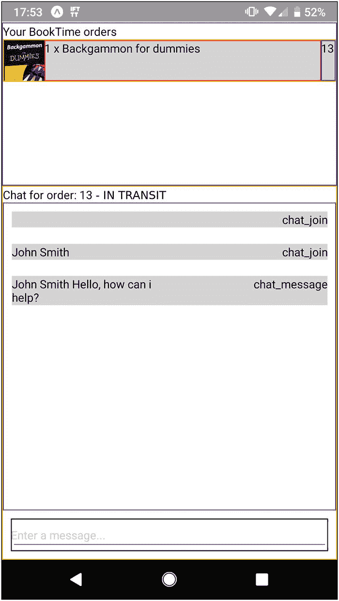
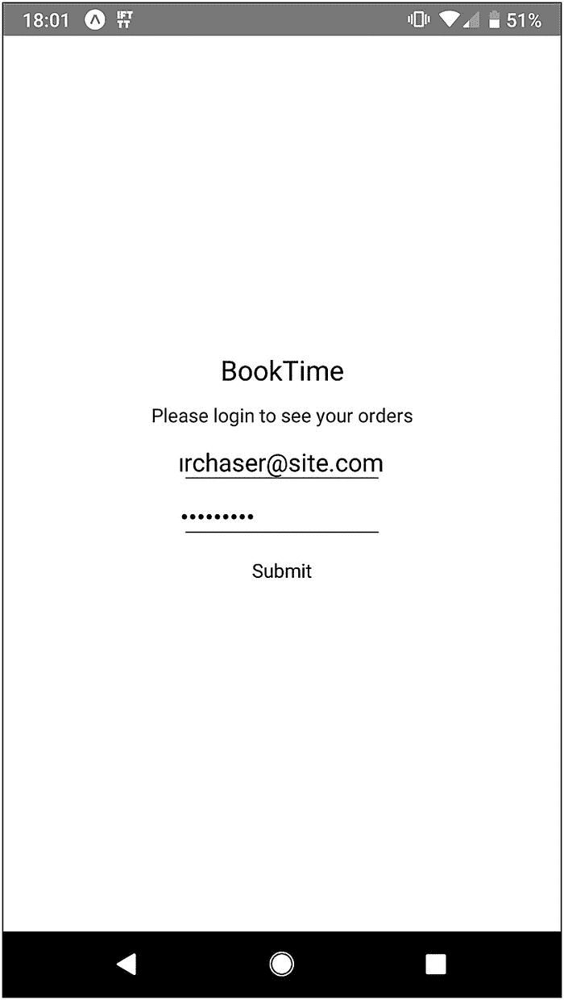
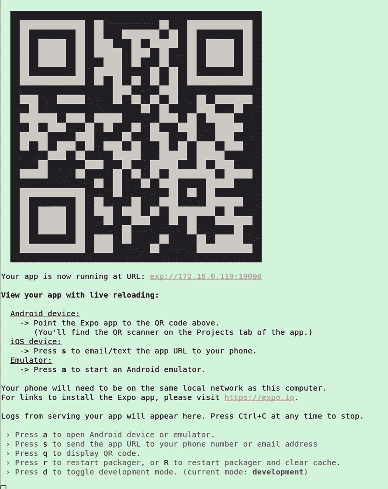

# 9.移动客户服务应用

在本章中，我们将使用 React Native 构建一个基本的移动应用。客户将使用我们开发的应用来检索他们的订单，并与客户服务代表讨论这些订单。

订单可视化和聊天都将使用我们在第 [8](08.html) 章中构建的 API。我们将使用这个移动应用来探索如何支持与静态 HTML 页面有不同需求的 API 消费者。

## 为什么反应本土

在本书中，除了 Django 之外，我不想支持任何技术。我不希望展示一个完美的原生应用，因为这需要更多的设置工作，并且会转移与 Django 集成的注意力。这一章将是关于有足够的应用来建立。

本章将介绍的许多概念可以应用于其他技术堆栈。有许多框架可以构建混合应用。鉴于在前面的章节中已经向您介绍了 React，您将不难理解 React Native。

React Native 重用了 React 的许多概念，但是它使用原生组件而不是 HTML 标签。React Native 在 mobile 上运行，这不是我们用来开发和运行 Django 应用的设备。记住这一点很重要，因为它会影响开发工作流。

我们将像使用 Bootstrap 一样使用 React Native。我们不会深入研究它，但足以消耗我们在第 [8](08.html) 章中已经完成的工作，并展示我们的用例。

## 设置本地反应

React Native 是用 JavaScript 写的。要运行下面的命令，您需要至少 8.x)版本的 Node，它提供了`npx`命令。我们将使用`create-react-native-app`进行初始设置:

```py
$ npx create-react-native-app booktime_mobile
...
Inside that directory, you can run several commands:

  yarn start
    Starts the development server so you can open your app in the Expo app on your phone.

  yarn run ios
    (Mac only, requires Xcode)
    Starts the development server and loads your app in an iOS simulator.

  yarn run android
    (Requires Android build tools)
    Starts the development server and loads your app on a connected Android device or emulator.

  yarn test
    Starts the test runner.

  yarn run eject
    Removes this tool and copies build dependencies, configuration files and scripts into the app directory. If you do this, you can't go back!

We suggest that you begin by typing:

  cd booktime_mobile
  yarn start

Happy hacking!

$ cd booktime_mobile

```

在刚刚创建的`booktime_mobile`文件夹中，所有 React 原生命令都可以用`yarn`启动。在启动建议的命令`yarn start`之前，请注意您可能需要调整一些系统参数。如果是这种情况，您会在屏幕上看到一条警告。

## 组件层次结构

在开始编写任何复杂的前端代码之前，你应该知道如何将应用的不同屏幕划分成组件。组件是用户界面中可重用的部分。它们可能是整个屏幕，也可能只是屏幕的一部分。

React Native 中的每个组件就像 React 组件一样:它可以有状态和属性。属性是只读的，从父对象传递，而状态是内部管理的。

在我们的例子中，我们简单的应用将有

*   带有用户名/密码表单的登录屏幕。这将是一个独立的组件。

*   订单选择和聊天屏幕。该屏幕将分为两个主要部分。

为了帮助我们识别每个组件在显示屏上的位置，我们可以使用一些视觉提示，如设置边框颜色，如图 [9-1](#Fig1) 和 [9-2](#Fig2) 所示。一般来说，为移动设备开发不像在浏览器中开发那样立竿见影。你需要一些时间来适应它。



图 9-2

移动主页



图 9-1

移动登录页面

## API 客户端库

在构建任何特定于 React Native 的东西之前，我们将创建一个 JavaScript 类来处理客户机和服务器之间的所有通信。我们这样做是因为，通过模仿它，将更容易测试我们的组件。

除了最初的`App.js`之外，我们将所有代码放在一个`src`文件夹中。这将在`src/backend.js`中(用相关的 URL 代替字符串`'CHANGETHIS'`):

```py
export default class BackendApi {
  constructor (envName) {
    if (envName == 'production') {
      this.hostName = 'CHANGETHIS'
    } else {
      this.hostName = 'CHANGETHIS'
    }
    this.baseHttpApi = 'http://' + this.hostName + '/mobile-api'
  }

```

```py
  auth (username, password) {
    return fetch(this.baseHttpApi + `/auth/`, {
      method: 'POST',
      headers: {
        Accept: 'application/json',
        'Content-Type': 'application/json'
      },
      body: JSON.stringify({
        username: username,
        password: password
      })
    })

      .then(response => response.json())
      .catch(error => {
        console.error(error)
      })
      .then(response => {
        if (response.token) {
          this.loggedInToken = response.token
          return true
        }
        return false
      })
  }

  fetchOrders () {
    return fetch(this.baseHttpApi + `/my-orders/`, {
      method: 'GET',
      headers: {
        Accept: 'application/json',
        'Content-Type': 'application/json',
        Authorization: 'Token ' + this.loggedInToken
      }
    })
      .then(response => response.json())
      .catch(error => {
        console.error(error)
      })
  }

  fetchShipmentStatus (id) {
    let url = this.baseHttpApi + `/my-orders/${id}/tracker` +
      `/?token=` + this.loggedInToken
    return fetch(url, {
      method: 'GET',
      headers: {
        Authorization: 'Token ' + this.loggedInToken
      }
    })
      .then(response=> response.text())
      .catch(error=> {
        console.error(error)
      })
  }

  openMessagesStream (id, onMessageCb) {
    var ws_url =
      `ws://` +
      this.hostName +
      `/ws/customer-service/` +
      Id +
      `/?token=` +
      this.loggedInToken

    this.ws = new WebSocket(ws_url)
    this.ws.onmessage = function (event) {
      var data = JSON.parse(event.data)
      onMessageCb(data)
    }
    this.ws.onerror = function (error) {
      console.error('WebSocket error: ', error)
    }
    this.ws.onopen = function () {
      this.heartbeatTimer = setInterval(this.sendHeartbeat.bind(this), 10000)
    }.bind(this)
  }

  closeMessagesStream () {
    clearInterval(this.heartbeatTimer)
    if (this.ws) {
      this.ws.close()
    }
  }

  sendMessage (message) {
    this.ws.send(
      JSON.stringify({
        type: 'message',
        message: message
      })
    )
  }

  sendHeartbeat () {
    this.ws.send(
      JSON.stringify({
        type: 'heartbeat'
      })
    )
  }

  createAbsUrl (relative_uri) {
    return 'http://' + this.hostName + relative_uri
  }
}

```

这个基本的 JavaScript 类将处理所有的 HTTP 请求。所有请求都将被定向到实例化该类时指定的环境。

前面代码中的`auth()`方法使用我们在前一章中创建的认证端点，如果成功，将返回的令牌存储在`BackendApi`实例中。该令牌将在以后的每个请求中使用。

聊天组件有几种方法:`openMessagesStream()`、`closeMessagesStream()`和`sendMessage()`。在内部使用`sendHeartbeat()`方法向服务器发出这个客户机存在的信号。

## 登录查看

我们将把所有的 React 组件放在`src/components/`中。这是我们的第一个组件，`LoginView.js`:

```py
import React, { Component } from 'react'
import {
  StyleSheet,
  Text,
  View,
  TouchableHighlight,
  TextInput
} from 'react-native'

const styles = StyleSheet.create({
  container: {
    flex: 1,
    justifyContent: 'center',
    alignItems: 'center'
  },

  welcome: {
    fontSize: 20,
    textAlign: 'center',
    margin:10
  },
  instructions: {
    textAlign: 'center',
    color: '#333333',
    marginBottom: 5
  },
  input: {
    height: 40,
    fontSize: 18,
    width: 150
  },
  button: {
    padding: 10
  }
})

export default class LoginView extends Component {
  constructor (props) {
    super(props)
    this.state = {
      username: '',
      password: ''
    }
    this.handleSubmitLogin = this.handleSubmitLogin.bind(this)
  }

  handleSubmitLogin () {
    if (this.state.username && this.state.password) {
      return this .props.backendApi
        .auth(this.state.username, this.state.password)
        .then(loggedIn => {
          if (loggedIn) {
            this.props.setLoggedIn()
          } else {
            this.setState({
              username: '',
              password: ''
            })
            alert('Login unsuccessful')
          }
        })
    }
  }

  render () {
    return (
      <View style={styles.container}>
        <Text style={styles.welcome}>BookTime</Text>
        <Text style={styles.instructions}>Please login to see your orders</Text>
        <TextInput
          style={styles.input}
          placeholder="Username"
          value={this.state.username}
          onChangeText={text => {
            this.setState({ username: text })
          }}
        />
        <TextInput
          style={styles.input}
          placeholder="Password"
          value={this.state.password}
          secureTextEntry={true}
          onChangeText={text => {
            this.setState({ password: text })
          }}
        />
        <TouchableHighlight
          style={styles.button}
          onPress={this.handleSubmitLogin}
        >
          <Text>Submit</Text>
        </TouchableHighlight>
        </View>
    )
  }
}

```

React Native 正在使用 flexbox 作为布局引擎，这是一个来自 CSS 的功能。这用于前面代码中的`styles`变量。我们的风格大多是做元素的定位和大小，而不是视觉造型。这是我们开始行动的最低要求。

在`render()`方法中，我们构建渲染树，这是我们使用 React 本地内置组件的地方。`View`是屏幕一部分的包装器，并不带来额外的功能——它纯粹是其他组件的包装器。

`Text`是一个标签组件，用来打印文本。`TextInput`，相当于 HTML 中的`<input type="text">`，用于输入文本。`TouchableHighlight`是一个带触摸反馈的按钮。

我们将包含对这个视图的测试。它非常简单，通过直接调用内部函数来避免测试事件触发。只要我们相信我们写的 JSX <sup>[1](#Fn1)</sup> ，对于我们的目的来说，这是一个可以接受的妥协。

我们将在`src/components/LoginView.test.js`中放置以下代码:

```py
import React from 'react'
import LoginView from './LoginView'

import renderer from 'react-test-renderer'

it('renders without crashing', () => {
  const rendered = renderer.create(<LoginView />)
  expect(rendered).toBeTruthy()
})

it('logins successfully when backend returns true', () => {
  const setLoggedIn = jest.fn()
  const backendApi = {
    auth: jest.fn(() => new Promise((resolve, reject) => resolve(true)))
  }
  const rendered = renderer.create(
    <LoginView backendApi={backendApi} setLoggedIn={setLoggedIn} />
  )
  rendered.root.instance.state.username = 'a'
  rendered.root.instance.state.password = 'b'
  rendered.root.instance
    .handleSubmitLogin()
    .then(() => expect(setLoggedIn.mock.calls.length).toBe(1))
  expect(backendApi.auth.mock.calls.length).toBe(1)
  expect(backendApi.auth.mock.calls[0][0]).toBe('a')
  expect(backendApi.auth.mock.calls[0][1]).toBe('b')
})

it('login fails when backend returns false', () => {
  const setLoggedIn = jest.fn()
  const backendApi = {
    auth: jest.fn(() => new Promise((resolve, reject) => resolve(false)))
  }
  const rendered = renderer.create(
    <LoginView backendApi={backendApi} setLoggedIn={setLoggedIn} />
  )
  rendered.root.instance.state.username = 'a'
  rendered.root.instance.state.password = 'b'
  rendered.root.instance
    .handleSubmitLogin()
    .then(() => expect(setLoggedIn.mock.calls.length).toBe(0))
  expect(backendApi.auth.mock.calls.length).toBe(1)
  expect(backendApi.auth.mock.calls[0][0]).toBe('a')
  expect(backendApi.auth.mock.calls[0][1]).toBe('b')
})

it('login fails when backend fails', () => {
  const setLoggedIn = jest.fn()
  const backendApi = {
    auth: jest.fn(() => new Promise((resolve, reject) => reject()))
  }
  const rendered = renderer.create(
    <LoginView backendApi={backendApi} setLoggedIn={setLoggedIn} />
  )
  rendered.root.instance.state.username = 'a'
  rendered.root.instance.state.password = 'b'
  rendered.root.instance
    .handleSubmitLogin()
    .then(() => expect(setLoggedIn.mock.calls.length).toBe(0))
  expect(backendApi.auth.mock.calls.length).toBe(1)
  expect(backendApi.auth.mock.calls[0][0]).toBe('a')
  expect(backendApi.auth.mock.calls[0][1]).toBe('b')
})

```

我将在本章的后面解释如何运行这个测试。

## 阅读器

我们将把这个组件专用于所有聊天交互，它将位于主屏幕(`src/components/ChatView.js`)的一个部分:

```py
import React from 'react'
import {StyleSheet, Text, TextInput, ScrollView, View } from 'react-native'

const styles = StyleSheet.create({
  chatContainer: {
    borderColor: 'orange',
    borderWidth: 1,
    flex: 1
  },
  chatMessages: {
    borderColor: 'purple',
    borderWidth: 1,
    flex: 1
  },
  chatInput: {
    height: 40,
    margin: 10,
    borderWidth: 1
  },
  chatMessage: {
    backgroundColor: 'lightgrey',
    margin: 10,
    flex: 1,
    flexDirection: 'row',
    alignSelf: 'stretch'
  },
  chatMessageText: {
    flex: 1
  },
  chatMessageType: {
    flex: 1,
    textAlign: 'right'
  }
})

export default class ChatView extends React.Component {
  constructor (props) {
    super(props)
    this.state = {
      messages: [],
      shipmentStatus: "n/a"
    }
    this.handleSubmit = this.handleSubmit.bind(this)
  }

  componentDidUpdate (prevProps) {
    if (prevProps.orderCurrentId !== this.props.orderCurrentId) {
      this.props.backendApi.closeMessagesStream()
      this.state = {
        messages: []
      }
      this.props.backendApi
        .fetchShipmentStatus(this.props.orderCurrentId)
        .then(result => {
            this.setState({shipmentStatus: result})
        })
      this.props.backendApi.openMessagesStream(
        this.props.orderCurrentId,
        message => {
          this.setState({
            messages: this.state.messages.concat([message])
          })
        }
      )
    }
  }

  handleSubmit(event) {
    var text = event.nativeEvent.text
    this.props.backendApi.sendMessage(text)
    this.refs.textInput.setNativeProps({text: '' })
  }

  render() {
    if (this.props.orderCurrentId) {
      return (
        <View style={styles.chatContainer}>
          <Text>Chat for order: {this.props.orderCurrentId}
          - { this.state.shipmentStatus}</Text>
          <ScrollView
            style={styles.chatMessages}
            showsVerticalScrollIndicator={true}
            ref={ref => (this.scrollView = ref)}
            onContentSizeChange={(contentWidth, contentHeight) => {
              this.scrollView.scrollToEnd({ animated: true })
            }}
          >
            {this.state.messages.map((m, index) => {
             return (
               <View key={index} style={styles.chatMessage}>
                 <Text style={styles.chatMessageText}>
                   {m.username} {m.message}
                 </Text>
                 <Text style={styles.chatMessageType}>{m.type}</Text>
               </View>
             )
           })}
         </ScrollView>
         <TextInput
           style={styles.chatInput}
           ref="textInput"
           placeholder="Enter a message..."
           returnKeyType="send"
           onSubmitEditing={this.handleSubmit}
         />
        </View>
      )
    } else {
      return (
        <View>
          <Text>No order selected for chat</Text>
        </View>
      )
    }
  }
}

```

当 React 组件使用传入 <sup>[2](#Fn2)</sup> 的新`prop`进行渲染时，将调用前面代码中的方法`componentDidUpdate()`。该组件的第一次呈现总是没有选择图书订单，但是当它被选择时，该方法将接收新的订单 id 并打开相应的聊天。

当选择一个顺序时，呈现的组件树将利用`ScrollView`，它相当于一个固定大小的`<div>`，内部内容设置为自动在内部溢出。我们还通过使用事件处理程序自动滚动到其内容的底部。

对于`ChatView.js`中的文本输入，我们使用引用，而不是像在前面的组件中那样存储状态。引用允许 React 代码通过在代码中使用`this.refs`来直接引用组件。

这是测试(`src/components/ChatView.test.js`):

```py
import React from 'react'
import ChatView from './ChatView'

import renderer from 'react-test-renderer'

it('renders without orders specified', () => {
  const rendered = renderer.create(<ChatView />).toJSON()
  expect(rendered).toBeTruthy()
})

it('renders with orders specified', () => {
  const backendApi = {
    openMessagesStream: jest.fn(),
    closeMessagesStream: jest.fn(),
    sendMessage: jest.fn(),
    fetchShipmentStatus: jest.fn(
      () => new Promise((resolve, reject) => resolve())
    ),
  }
  const rendered = renderer.create(
    <ChatView backendApi={backendApi} orderCurrentId="1" />
  )
  rendered.root.instance.componentDidUpdate({})
  expect(backendApi.openMessagesStream.mock.calls.length).toBe(1)
  expect(backendApi.openMessagesStream.mock.calls[0][0]).toBe('1')
  expect(backendApi.fetchShipmentStatus.mock.calls.length).toBe(1)

  expect(backendApi.fetchShipmentStatus.mock.calls[0][0]).toBe('1')
  rendered.getInstance().setState({shipmentStatus: 'shipped'})
  backendApi.openMessagesStream.mock.calls[0][1]('initial message')
  expect(rendered.toJSON()).toMatchSnapshot()

  rendered.root.instance.handleSubmit({ nativeEvent:{ text: 'answer back' } })
  expect(backendApi.sendMessage.mock.calls.length).toBe(1)
  expect(backendApi.sendMessage.mock.calls[0][0]).toBe('answer back')
  expect(rendered.toJSON()).toMatchSnapshot()
})

```

## 订单 w

该组件将管理登录屏幕后的整个屏幕。它还将加载所有子组件，包括 ChatView。

下面是组件(`src/components/OrderView.js`):

```py
import React from 'react'
import{
  StyleSheet,
  Text,
  Image,
  TouchableHighlight,
  TouchableOpacity,
  View
} from 'react-native'

import ChatView from './ChatView'

const styles = StyleSheet.create({
  container: {
    paddingTop: 25,
    flex: 1
  },
  orderContainer: {
    borderColor: 'blue',
    borderWidth: 1,
    height: 200
  },
  orderRowOut: {
    borderColor: 'yellow',
    borderWidth: 1,
    height: 52
  },
  orderRowIn: {
    flex: 1,
    flexDirection: 'row',
    alignSelf: 'stretch'
  },
  orderSelected: {
    backgroundColor: 'lightgrey'
  },
  orderImage: {
    borderColor: 'green',
    borderWidth: 1,
    width: 50,
    height: 50
  },
  orderSummary: {
    borderColor: 'red',
    borderWidth: 1,
    flex: 1,
    alignSelf: 'stretch'
  },
  orderPrice: {
    borderColor: 'blue',
    borderWidth: 1
  }
})

function OrderImage (props) {
  if (props.image) {
    return (
      <Image
        style={{ width: 50, height: 50 }}
        source={{ uri: props.backendApi.createAbsUrl(props.image) }}
      />
    )
  } else {
    return <View />
  }
}

function OrderTouchArea (props) {
  return (
    <View
      style={[
        styles.orderRowIn,
        props.order.id == props.orderCurrentId ? styles.orderSelected: null
      ]}
    >
      <View style={styles.orderImage}>
        <OrderImage backendApi={props.backendApi} image={props.order.image} />
      </View>
      <Text style={styles.orderSummary}>{props.order.summary}</Text>
      <Text style={styles.orderPrice}>{props.order.price}</Text>
    </View>
  )
}

function OrderSingleView (props) {
  return (
    <TouchableHighlight
      style={styles.orderRowOut}
      onPress={() => props.setOrderId(props.order.id)}
    >
      <OrderTouchArea
        backendApi={props.backendApi}
        order={props.order}
        orderCurrentId={props.orderCurrentId}
      />
    </TouchableHighlight>
  )
}

export default class OrderView extends React.Component {
  constructor (props) {
    super(props)
    this.state = {
      orders: [],
      orderCurrentId: null
     }
  }

  componentDidMount () {
    this.props.backendApi
      .fetchOrders()
      .then(orders => this.setOrders(orders))
      .catch(() => alert('Error fetching orders'))
    }

    setOrders (orders){
        this.setState({
       orders: orders
    })
  }

  render(){
    return (
      <View style={styles.container}>
        <View style={styles.orderContainer}>
          <Text>Your BookTime orders</Text>
          {this.state.orders.map(m=> (
            <OrderSingleView
              backendApi={this.props.backendApi}
              key={m.id}
              order={m}
              orderCurrentId={this.state.orderCurrentId}
              setOrderId={ordered => this.setState({ orderCurrentId: orderId })}
            />
          ))}
        </View>
        <ChatView
          backendApi={this.props.backendApi}
          orderCurrentId={this.state.orderCurrentId}
        />
      </View>
    )
  }
}

```

在 React Native 中，像 React 的最新版本一样，可以将组件定义为函数或类。对于简单的组件，函数就足够了。这是我们在这里使用的，使代码更可读。

声明为函数的组件没有内部状态。前面代码中声明的组件是纯函数，它们的输出完全基于传入的属性。

早期组件中的所有状态都由主`OrderView`组件管理。

一旦安装了组件，就会获取订单，这意味着它会显示在屏幕上。可以在 UI 中按下订单条目，这将初始化聊天组件并打开到我们服务器的 WebSocket 连接。

下面是测试(`src/components/OrderView.test.js`):

```py
import React from 'react'
import OrderView from './OrderView'

import renderer from 'react-test-renderer'

it('renders without crashing', () => {
  const mockOrders = [{ id: 5, image: null, summary: '2xaa', price: 22 }]
  const backendApi = {
    fetchOrders: jest.fn(
      () => new Promise((resolve,reject)=>resolve(mockOrders))
    ),
    createAbsUrl: jest.fn(url => 'http://booktime.domain' + url)
  }

  const rendered = renderer.create(<OrderView backendApi={backendApi} />)
  expect(rendered).toBeTruthy()
  expect(backendApi.fetchOrders.mock.calls.length).toBe(1)
  rendered.getInstance().setOrders(mockOrders)
  expect(rendered.getInstance().state.orders).toBe(mockOrders)
  expect(rendered.toJSON()).toMatchSnapshot()
})

```

## 主要成分

我们将用启动应用所需的代码覆盖主文件夹中自动生成的`App.js`的内容:

```py
import React from 'react'
import LoginView from './src/components/LoginView'
import ChatView from './src/components/ChatView'
import OrderView from './src/components/OrderView'
import BackendApi from './src/backend'

export default class App extends React.Component {
  constructor (props) {
    super(props)
    this.backendApi = new BackendApi()
    this.state = {
      loggedIn: false
    }
  }

  render () {
    if (this.state.loggedIn) {
      return <OrderView backendApi={this.backendApi} />
    } else {
      return (
        <LoginView
          backendApi={this.backendApi}
          setLoggedIn={() => this.setState({loggedIn: true })}
        />
      )
    }
  }
}

```

我们在这个类中构造 API 对象，并可选地传递我们希望这个应用运行的环境，无论是生产环境还是不太重要的环境。

主容器只有一个状态标志`loggedIn`，用于显示第一个屏幕(登录)或主屏幕(订单视图)。

我们将把它的测试放在同一个文件夹和文件`App.test.js`中:

```py
import React from 'react'
import App from './App'

import renderer from 'react-test-renderer'

it('renders without crashing', () => {
  const rendered = renderer.create(<App />).toJSON()
  expect(rendered).toBeTruthy()
})

```

## 运行、测试和打包

正如本章前面提到的，一切都是用`yarn`运行的。我们使用`yarn start`来启动我们的移动开发服务器(见图 [9-3](#Fig3) )。要查看该应用，我们将在移动设备上安装一个名为 Expo ( [`https://expo.io`](https://expo.io) )的开发客户端。请从您移动设备的应用商店下载此移动应用。

我们也可以用 Jest 运行我们在本章前面写的测试。我们正在使用 Jest 的一个称为快照测试的特性，它为我们简化了很多断言工作。

下面是`yarn test`的输出，它在幕后使用 Jest:

```py
$ yarn test
yarn run v1.7.0
$ jest
 PASS src/components/OrderView.test.js (6.403s)
 › 1 snapshot written.
PASS src/components/LoginView.test.js (6.576s)
PASS ./App.test.js
PASS src/components/ChatView.test.js (8.404s)
 - Console

   console.warn node_modules/react-native/jest/setup.js:93
     Calling .setNativeProps() in the test renderer environment is not supported. Instead, mock

 - 2 snapshots written.

Snapshot Summary

 - 3 snapshots written in 2 test suites.

Test Suites: 4 passed, 4 total
Tests:       8 passed, 8 total
Snapshots:   3 added,  3 total
Time:        9.967s
Ran all test suites.
Done in 11.87s.

```

在第一次运行`yarn test`时，它会为我们生成所有的快照。在所有后续运行中，它将使用生成的快照作为参考进行检查。



图 9-3

纱线起始样本输出

### Android 包装

到目前为止，我们所做的所有工作都让我们知道，我们有一个潜在的应用，但我们仍然需要将其打包并分发给我们的客户，这就是以下步骤成为特定于平台的地方。

我将展示如何在 Android 上做到这一点，因为 apk(打包的应用)的分发不需要您登录 Google Play。您可以在使用`npm install -g exp`安装了`exp`命令行界面之后这样做

世博会客户(`exp`)将要求您在他们的系统上建立一个账户。打包 React 本地应用不需要这个客户端，但是如果没有它，我们将不得不做更多的设置工作。我们将不得不安装我们想要定位的所有平台的 SDK。使用 Expo 客户端允许我们使用他们的系统来编译我们的文件。

```py
$ exp build:android
[16:29:11] Making sure project is set up correctly...[16:29:13] Your project looks good!
[16:29:13] Checking if current build exists...

[16:29:14] No currently active or previous builds for this project.
[16:29:15] Unable to find an existing exp instance for this directory, starting a new one...
[16:29:16] Starting Metro Bundler on port 19001.
[16:29:17] Metro Bundler ready.
[16:29:17] Publishing to channel 'default'...
[16:29:17] Tunnel URL not found, falled back to LAN URL.
[16:29:17] Building iOS bundle
[16:29:37] Tunnel URL not found, falled back to LAN URL.
[16:29:47] Building Android bundle
Building JavaScript bundle [======================] 100%[16:29:47]
[16:29:57] Tunnel URL not found, falled back to LAN URL.
[16:30:14] Analyzing assets
Building JavaScript bundle [======================] 100%[16:30:14]
Finished building JavaScript bundle in 26994ms.
[16:30:17] Tunnel URL not found, falled back to LAN URL.
Building JavaScript bundle [======================] 100%[16:30:23]
Finished building JavaScript bundle in 9449ms.
[16:30:33] Uploading assets
Building JavaScript bundle [=======================] 100%[16:30:33]
Finished building JavaScript bundle in 9853ms.
[16:30:34] No assets changed, skipped.
[16:30:34] Uploading JavaScript bundles
[16:30:37] Tunnel URL not found, falled back to LAN URL.
[16:30:39] Published
[16:30:39] Your URL is

https://exp.host/@flagz/booktime_mobile

[16:30:39] Building...
[16:30:40] Build started, it may take a few minutes to complete.
[16:30:40] You can check the queue length at
 https://expo.io/turtle-status

[16:30:40] You can monitor the build at

https://expo.io/builds/0bcd5ecb-bd99-419d-94fa-44433820be5e

|[16:30:40] Waiting for build to complete. You can press Ctrl+C to exit.
[16:34:42] Successfully built standalone app: https://expo.io/artifacts/793ffef3-10a2-4803-a791-c659756c3a8b

```

成功运行之后，您可以通过输出中的链接下载生成的 APK。

## 摘要

本章介绍了一个简单的 React Native 应用，它使用了我们在第 [8](08.html) 章中编写的 API。您可以学习这里介绍的课程并扩展它们，或者使用 Java 或 Swift 简单地重写这个应用。

<aside class="FootnoteSection" epub:type="footnotes">Footnotes [1](#Fn1_source)

[T2`https://reactjs.org/docs/introducing-jsx.html`](https://reactjs.org/docs/introducing-jsx.html)

  [2](#Fn2_source)

[T2`https://reactjs.org/docs/components-and-props.html`](https://reactjs.org/docs/components-and-props.html)

 </aside>