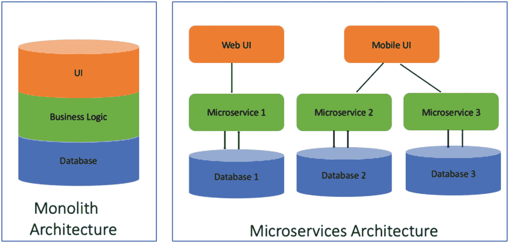
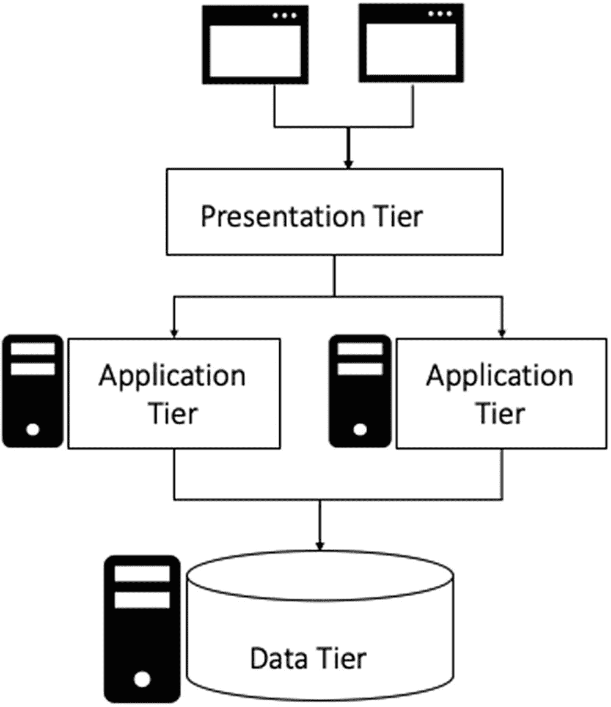
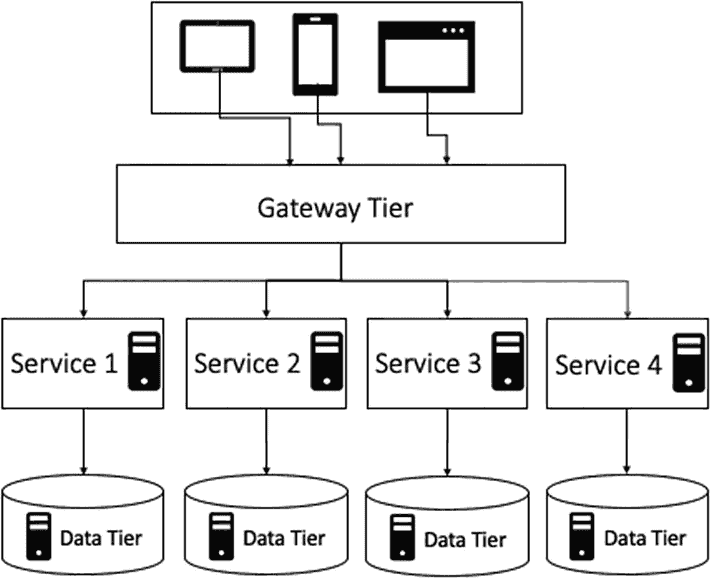
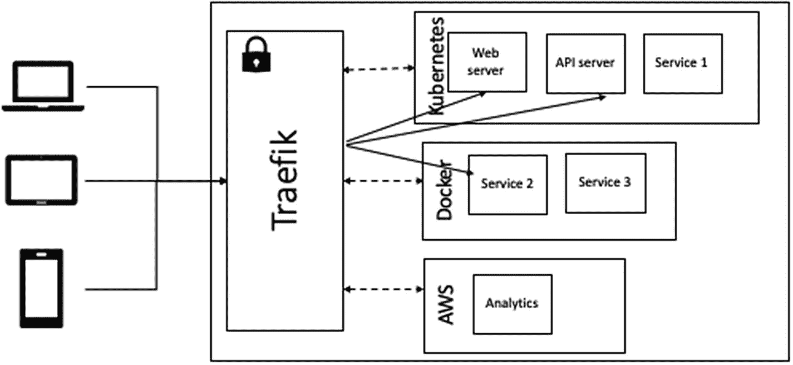
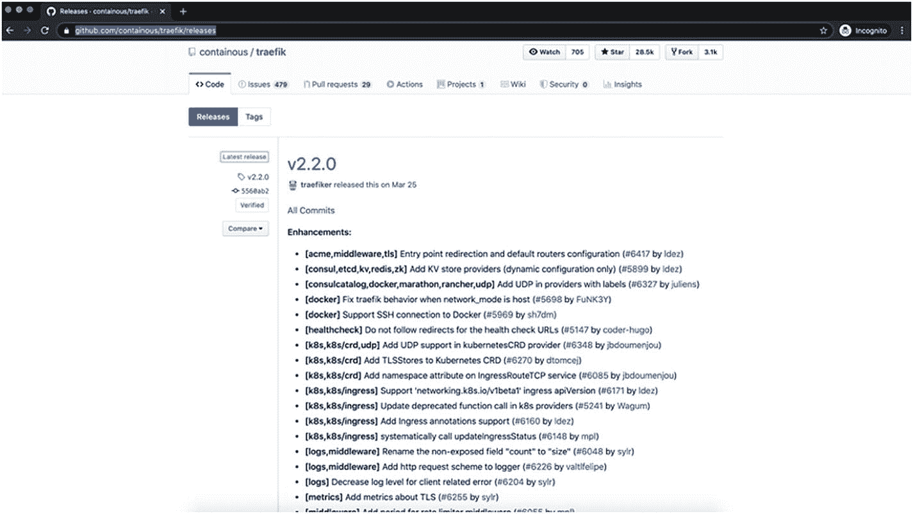
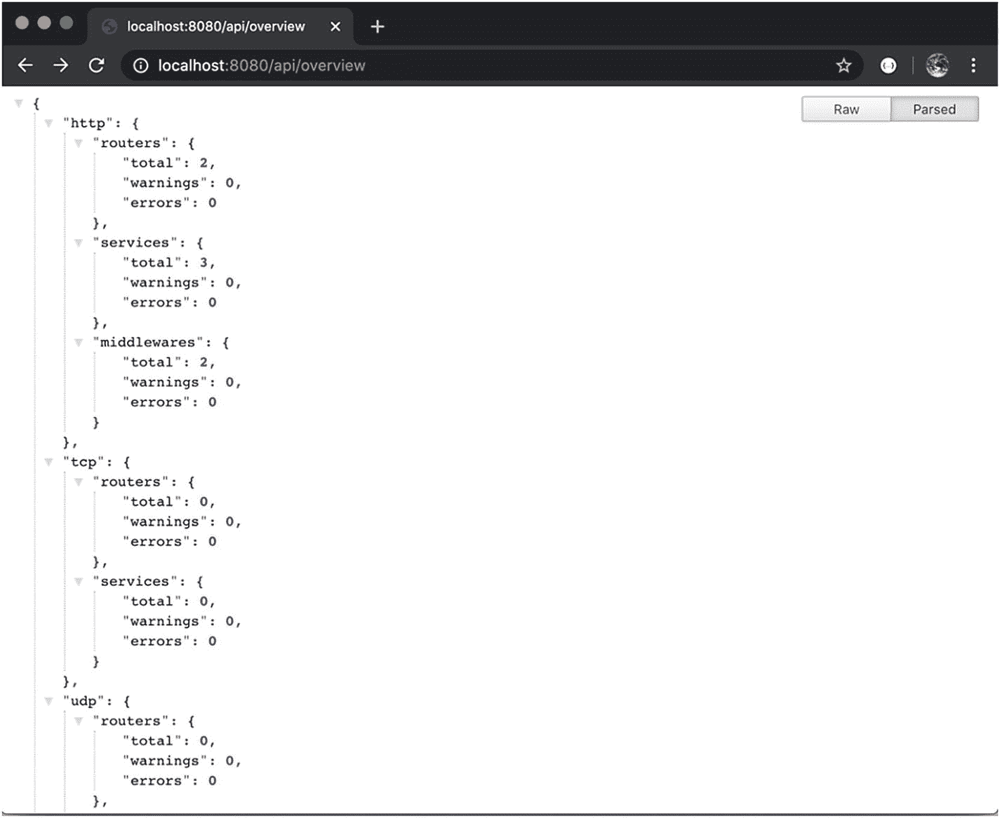
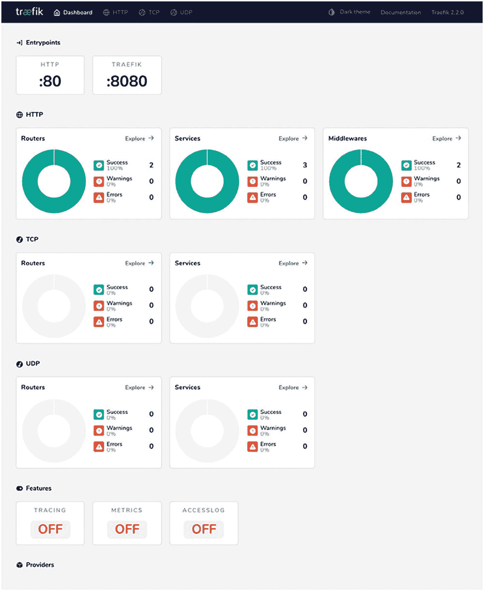

# 一、Traefik 简介

在过去的几年中，微服务已经成为企业应用开发的主流架构范例。它们已经取代了过去几十年来作为主流的应用开发的整体架构。单片应用是在模块化架构中开发的。这意味着被称为*模块*的离散逻辑组件被创建来基于它们的职责隔离组件。即使一个应用由离散的组件组成，它们也被打包并作为一个可执行文件部署。总的来说，应用具有非常紧密的耦合。对这些模块中的每一个的改变都不能单独发布。您需要每次发布一个完整的应用。

当您构建一个未知的应用时，单片架构非常适合。在这种情况下，您通常需要为每个功能快速构建原型。单片架构在这种情况下很有帮助，因为应用有一个统一的代码库。该架构具有以下优势。

*   开发简单。

*   测试简单。例如，您可以通过启动应用并使用 Selenium 测试 UI 来实现端到端测试。

*   易于部署。您只需将打包的应用复制到服务器上。

*   通过在负载平衡器后运行多个副本，可以轻松地进行水平扩展。

总之，您可以在这些早期阶段快速交付完整的应用。但是随着应用的有机增长，收益会逐渐减少。在后期阶段，应用变得更难维护和操作。大多数子组件承担更多的责任，成为大的子系统。每个子系统都需要一个开发团队来维护。因此，完整的应用通常由多个开发团队维护。但是应用具有高耦合性，因此开发团队在提供新功能时是相互依赖的。由于单一的二进制文件，该组织面临以下一系列问题。

*   **季度发布**:应用功能需要更多时间发布。大多数时候，一个应用的特性需要跨不同的子系统来处理。每个团队都可以进行开发，但是部署需要整套组件。因此，团队很少能独立工作。发布通常是跨不同团队的大规模协同工作，每个周期只能做几次。

*   **弃用的技术**:通常，当你使用技术时，你必须定期升级它。升级确保所有的漏洞都被覆盖。应用库通常需要频繁升级，因为它们还会添加新功能。但是升级一个整体的库是困难的。团队可以尝试使用最新的版本，但通常需要确保升级不会破坏其他子系统。在某些情况下，升级甚至会导致子系统的完全重写，这对业务来说是非常危险的。

*   陡峭的学习曲线:单片应用通常有很大的代码库。但是单个开发人员经常在代码库的一个非常小的子集上工作。乍一看，代码行给开发人员造成了心理瓶颈。此外，由于应用是紧密耦合的，开发人员通常需要知道其他人是如何调用代码的。因此，新开发人员的总体入职时间很长。即使是有经验的开发人员也很难对没有维护好的模块进行修改。这造成了一个随着时间推移而扩大的知识缺口。

*   **应用扩展**:通常情况下，单一应用只能垂直扩展。水平扩展应用是可能的，但是您需要确定每个子系统如何维护其内部状态。在任何情况下，应用都需要所有子系统的资源。资源不能有选择地提供给有负载的子系统。因此，对于整体式应用来说，这是一个要么全有要么全无的场景。这通常是一件昂贵的事情。

面对挑战时，组织会寻找替代架构来解决这些问题。

## 微服务架构

微服务架构是整体架构的替代方案(见图 1-1 )。它将单一应用转换为具有以下特征的分布式系统。



图 1-1

整体服务与微服务

*   **服务**:微服务是作为可以独立工作，提供一组业务能力的服务而开发的。服务可能依赖于其他服务来执行所需的功能。独立的团队可以开发这些服务。团队可以自由选择和升级他们服务所需的技术。组织通常将服务的全部责任委托给他们各自的团队。团队必须确保他们各自的服务按照约定的可用性运行，并满足约定的质量标准。

*   **业务环境**:服务通常是围绕业务领域创建的。这确保了它不会太细粒度或太大。服务需要首先回答它是所述业务功能的所有者还是该功能的消费者。函数所有者必须维护所有相应的函数数据。如果它需要更多的支持功能，它可能会从另一个服务中使用相同的功能。因此，确定业务上下文边界有助于检查服务依赖关系。微服务旨在构建一个具有松耦合和高内聚属性的系统。聚合所有逻辑上相关的功能使服务成为一个独立的产品。

*   **应用治理**:在企业系统中，治理扮演着重要的角色。你很少想制造难以运行的系统。由于这个原因，一个治理小组保持对开发人员使用的技术的检查，以便操作团队仍然可以运行系统。但是微服务架构为各个团队提供了完全的所有权。所有权不限于开发。它还委托服务操作。因此，大多数组织必须采用 DevOps 实践。这些实践使开发团队能够有效地操作和治理服务。

*   **自动化**:自动化在微服务中起着重要的作用。它适用于所有形式，如基础设施自动化、测试自动化和发布自动化。团队需要高效运作。他们需要更频繁地测试并快速发布。这只有在他们更多地依赖机器而不是人工干预的情况下才有可能。开发后的手工测试是一个主要的瓶颈。因此，团队经常以多种方式自动化他们的测试，比如 API 测试、冒烟测试、夜间测试等等。他们经常手动执行探索性测试来验证构建。发布和基础设施准备通常通过使用 DevOps 实践来自动化。

总之，一个整体有一个集中的经营模式。这意味着所有代码都驻留在一个地方；每个人都使用同一个库，同时发布，等等。但另一方面，微服务是一种完全去中心化的方法。团队可以完全自主地做出最佳决策。采用这样的架构不仅要求软件设计的改变，还要求组织交互的改变。组织从这种应用设计中获得了以下好处。

### 灵活

这是组织采用微服务架构的最大驱动因素之一。组织变得更具适应性，他们可以更快地响应不断变化的业务需求。该架构提供的松散耦合允许加速开发。在将小型、松散耦合的服务部署到生产环境之前，可以单独构建、修改和测试它们。该模型指示小型独立开发团队在其定义的边界内工作。这些团队负责维护高水平的软件质量和服务可用性。

### 创新ˌ革新

微服务架构促进了支持每个服务的独立小型开发团队。每个团队在其服务范围内拥有所有权。他们不仅负责开发，还负责运营服务。因此，团队采用了大量的自动化和工具来帮助他们实现这些目标。这些高层次的目标推动了组织内的工程文化。

此外，开发团队通常很清楚他们服务的缺点。这样的团队可以使用他们的自主决策能力来解决这些问题。他们可以经常解决问题并提高服务质量。在这里，团队被充分授权为他们的目的选择合适的工具和框架。它最终会提高整个产品的技术质量。

### 弹性

故障隔离是将故障的影响限制到有限的子系统/组件的行为。这个原则允许子系统失败，只要它不影响整个应用。微服务架构的分布式特性提供了故障隔离，这是构建弹性系统的主要要求。任何出现故障的服务都可以独立处理。开发人员可以修复问题并部署新版本，而应用的其余部分继续独立运行。

弹性，或者说*容错*，通常被定义为应用在某些部分出现故障的情况下正常运行的能力。像微服务这样的分布式系统是基于各种原则的，比如电路断开、节流来处理故障传播。这是一个重要的方面；如果做得好，它提供了一个弹性系统的好处。但是，如果这种情况不处理，就会由于故障级联而导致频繁停机。弹性还提高了业务敏捷性，因为开发人员可以发布新的服务，而不用担心系统中断。

### 可量测性

可伸缩性被定义为系统处理工作增长的能力。在一个整体中，很容易量化系统的可伸缩性。在单块系统中，随着负载的增加，并非所有子系统的流量都成比例增加。通常情况下，系统的某些部分比其他部分获得更多的流量。因此，整体系统性能由服务的子集决定。通过添加更多的硬件，可以更容易地扩展单芯片系统。但有时，这也很困难，因为不同的模块可能有冲突的资源需求。总的来说，一个杂草丛生的庞然大物没有充分利用硬件。它通常会降低系统性能。

微服务提供的分离使组织能够了解每个微服务所服务的流量。*分而治之*原则有助于提高整体系统性能。开发人员可以为每个服务采用适当的任务并行化或集群技术来提高系统吞吐量。他们可以采用适当的编程语言和框架，用尽可能好的配置进行微调。最后，可以通过研究服务需求来分配硬件，而不是扩展整个生态系统。

### 可维护性

技术债务是单体系统的一个主要问题。过度生长的巨石通常有不被整个团队很好理解的部分。在一个整体中解决技术债务是困难的，因为人们经常害怕破坏任何工作特性。曾经有过这样的例子，不需要的死代码通过解决某个特定模块上的技术债务而复活了。

微服务架构遵循分而治之的原则，有助于缓解这一问题。好处可以与面向对象的应用设计联系起来，在面向对象的应用设计中，系统被分解成对象。每个对象都有一个定义好的契约，从而改进整个系统的维护。开发人员可以对每个被重构的对象进行单元测试，以验证正确性。类似地，围绕业务环境创建的微服务有一个定义好的契约。这些松散耦合的服务可以单独重构和测试。开发人员可以在验证服务契约的同时解决服务的技术债务。采用微服务通常被称为一个整体的技术债务偿还。

您已经了解了微服务架构的优势。但是架构也带来了很多挑战。一些挑战是由于系统的分布式性质，而另一些挑战是由应用环境的多样性引起的。服务可以用不同的技术实现，并以不同的方式扩展。同一服务可以有多个版本来满足不同的需求。团队应该在应用设计期间制定策略来克服这些挑战，而不是事后才想到。应用部署就是这样一个重要方面。Monoliths 已经部署在一个三层模型上。但同样的模式在微服务上效果并不好。下一节讨论部署模型中所需的更改。

## *n*-分层部署

层部署是一种设计实现，其中 web 应用被分为应用表示、应用处理和数据管理功能。这些功能由称为*层*的独立组件提供服务。应用层允许职责分离。各层之间的所有通信都是线性的。每一层都由自己的软件子系统管理。 *n* 层部署提供了改进应用可伸缩性的好处。整体式应用通常部署为三层(见图 1-2 )应用。



图 1-2

三层

*   **表示层**:这一层负责提供应用的所有静态内容。它通常通过使用 Apache、Nginx 和 IIS 等 web 服务器来管理。这些 web 服务器不仅为应用提供静态 UI 组件，还通过将请求路由到应用层来处理动态内容。Web 服务器经过优化，可以处理许多静态数据请求。因此，在负载下，它们表现良好。其中一些服务器还提供不同的负载平衡机制。这些机制可以支持应用层的多个节点。

*   **应用层**:该层负责提供所有的处理功能。它包含交付应用核心功能的业务处理逻辑。开发团队负责在合适的技术堆栈(如 Java、Python 和. NET)中构建这一层。这一层能够为用户请求提供服务，并生成适当的动态响应。它接收来自表示层的请求。为了满足请求，应用层可能需要额外的数据来与数据层交互。

*   **数据层**:该层提供数据存储和数据检索的能力。这些数据管理功能超出了应用的范围。因此，应用使用数据库来满足这些需求。数据层使用 API 提供数据操作功能。应用层调用这个 API。

使用三层架构有很多好处，包括可伸缩性、性能和可用性。您可以在不同的机器上部署这些层，并以优化的方式使用可用资源。应用层提供了大部分的处理能力。因此，它需要更多的资源。另一方面，web 服务器提供静态内容，不需要很多资源。这种部署模式通过对每一层采用不同的复制策略来提高应用的可用性。

### 四层部署

三层部署与 monolith 应用一致。整体通常是应用层。但是有了微服务，整块被转换成几个服务。因此，三层部署模型不足以处理微服务架构。它需要以下四层部署模型(见图 1-3 )。



图 1-3

四层

*   **内容交付层**:这一层负责将内容交付给最终用户。客户端可以在 web 浏览器或移动应用中使用应用。它经常要求在不同的平台上制作不同的用户界面。内容交付层负责确保应用 UI 在这些不同的平台上正常工作。该层还抽象了服务层，并允许开发人员快速开发新的服务来满足不断变化的业务需求。

*   **网关层**:这一层有两个角色。
    *   动态发现已部署的服务，并将它们与用户请求相关联

    *   将请求路由到服务并发送响应

对于每个请求，网关层从所有底层服务接收数据，并发回一个聚合响应。它必须处理不同的场景，比如基于角色的访问、延迟响应和错误响应。这些行为使得服务层更容易。服务层可以只关注业务需求。

*   服务层:这一层负责提供所有的业务功能。服务层是为微服务方法设计的。该层向其客户端提供数据，而不关心数据是如何被使用的。客户端可以是其他服务或应用 UI。每个服务都可以基于它们的请求负载模式进行扩展。客户端有责任确定新的实例。所有这些都支持应用生态系统的可插拔方法。新服务可以通过使用现有服务来构建。它们可以很容易地集成到企业环境中。

*   **数据层**:该层提供数据存储和数据检索的能力。数据管理功能仍然超出了应用的范围。但是每项服务都有专属的数据管理基础设施。可以是 MySQL 这样的 DBMS，也可以是 Mongo 这样的文档库。

四层架构(见图 1-3 )是由早期的微服务采用者如网飞、亚马逊和 Twitter 开创的。在范例的中心，网关层负责将完整的解决方案绑定在一起。网关需要一个能够将其余层链接在一起的解决方案，以便所有层都能够通信、扩展和交付。在三层架构中，表示层拥有可用于网关层的 web 服务器。但是首先，您应该确定网关层解决方案所需的特征。

## 网关特征

网关是所有用户流量的入口点。它通常负责将请求委托给不同的服务，整理它们的响应，并将其发送回用户。在微服务架构下，网关必须与架构的动态特性协同工作。以下部分讨论网关组件的不同特征。

### 应用层协议

OSI 网络模型在第 4 层和第 7 层处理流量。第 4 层仅提供底层连接细节。这一层的流量管理只能使用协议(TCP/UDP)和端口细节来执行。另一方面，第 7 层在应用层运行。它可以根据每个消息的实际内容执行流量路由。HTTP 是使用最广泛的应用协议之一。您可以检查 HTTP 头和正文来执行服务路由。

第 7 层负载平衡使负载平衡器能够做出更明智的负载平衡决策。它可以应用各种优化，比如压缩、连接重用等等。您还可以配置缓冲来卸载上游服务器的慢速连接，以提高整体吞吐量。最后，您可以应用加密来保护我们的通信。

在当前的生态系统中，有各种各样的应用协议可供选择。这些协议中的每一个都满足一组需求。团队可能会采用特定的应用协议，比如 gRPC，因为它更适合他们的微服务。这不需要其他团队适应相同的应用协议。但是在生态系统中，网关需要将流量分配给大多数服务。因此，它需要支持所需的协议。应用协议的列表非常广泛。因此，网关需要有一组丰富的当前协议。此外，通过添加新的协议来扩展这个列表应该很容易。

PROTOCOLS

**HTTP/2** 是 HTTP/1.1 协议的下一个版本。它是一个二进制协议，不会改变任何现有的 HTTP 语义。但它提供实时多路通信，并通过更好地利用底层 TCP 连接来提高应用性能。

**gRPC** 是一个二进制 RPC 协议。它提供了各种功能，例如多路复用、流、健康指标和连接池。它通常与 JSON 或协议缓冲区等有效负载序列化一起使用。

**REST** (表述性状态转移)是基于 HTTP 语义的应用协议。该协议表示使用 HTTP 方法访问的资源。它通常与 JSON 有效负载一起使用来描述状态。

另一个重要方面是进程间通信范式。传统上，我们基于 HTTP 创建同步应用。但是对于数据驱动的微服务，您可能希望采用异步模型，如 ReactiveX 和 Zeromq。网关组件需要支持这两种形式的通信。开发人员应该能够挑选适合他们应用的模型。

### 动态配置

在 monolith 应用中，您知道后端应用的位置。位置不会经常改变，并且在运行时不会创建应用的更多实例。因为大多数服务器都是已知的，所以在静态配置文件中提供这些细节更容易。

但是在微服务应用中，这种解决方案不起作用。第一个挑战来自微服务的数量。通常，在开始时有有限的服务。但是随着系统的增长，人们意识到每个业务功能可以有多个细粒度的服务。通常这个数字可以增长到几百个服务。为每个服务分配一个静态地址并在静态文件中维护相同的更新是一项艰巨的任务。

第二个挑战来自微服务提供的可扩展性。服务可以在加载期间复制。当负载减轻时，这些服务将被删除。微服务的这种运行时行为会随着生态系统中服务的数量而成倍增加。在静态配置文件中跟踪所有这些变化是不可能的。

为了解决发现问题，微服务架构提倡服务注册。它是一个包含服务实例的网络位置的数据库。服务注册表需要近乎实时地更新。它需要在新位置可用时尽快反映出来。服务注册中心需要具有高可用性。因此，它由复制数据以保持一致性的节点群集组成。

SERVICE REGISTRY PROVIDERS

下面是最广泛使用的服务注册中心提供者。

Eureka 是一个基于 REST 的解决方案，用于注册和查询服务实例。网飞开发的解决方案是其微服务之旅的一部分。它经常在 AWS 云中使用。

etcd 是一个高度可用、分布式、一致的键值存储。它用于共享配置和服务发现。Kubernetes 使用 etcd 进行服务发现和配置存储。

**Consul** 是由 Hashicorp 创建的用于发现和配置服务的解决方案。除了服务注册之外，Consul 还提供了广泛的功能，比如健康检查和锁定。Consul 提供了一个 API，允许客户端注册和发现服务。

Apache Zookeeper 是为 Hadoop 生态系统而创建的。它是分布式应用的高性能协调服务。馆长是一个 Java 库，创建于 Zookeeper 之上，提供服务发现特性。

网关组件需要与服务注册中心进行交互。它可以尝试轮询服务注册表，但这样效率不高。或者，服务注册中心需要将更改推送到网关。网关需要选择这些更改并重新配置自己。因此，总而言之，网关需要与注册中心很好地集成。

#### 热重装

在微服务架构中，部署了许多服务。这些现有服务中的每一个都可以被更新，或者可以添加新的服务。所有这些更改都需要传播到网关层。此外，网关组件可能需要一些升级来解决问题。这些操作必须在不影响最终用户的情况下执行。甚至几秒钟的停机时间都是有害的。如果网关需要停机进行服务更新，那么停机时间将乘以服务更新的频率。总之，这可能导致频繁的服务中断。

网关组件应该处理所有更新，而不需要任何重启。它不能对配置更新或升级进行任何区分。

### 可观察性

可观性是从控制理论中借来的概念。它是在系统之外了解系统状态的过程。它包含了诊断故障所需的所有信息。微服务中的可观测性完全不同于整体系统中的可观测性。在 monolith 应用中，有一个包含以下日志的三层部署。

*   请求日志

*   应用日志

*   错误日志

您可以连接回日志来确定(相当准确地)系统一直在执行什么。但是在微服务架构中，您需要跟踪数十或数百种不同的服务。仅使用日志来预测应用状态不再可能。为此，我们需要新的机制。微服务架构推荐以下方法。

#### 追踪

请求跟踪是一种分析和监控分布式架构(如微服务)的方法。在微服务中，一个用户请求通常由多个服务处理。这些服务中的每一个都执行其各自的处理。所有这些都以请求跨度的形式记录下来。一个请求的所有这些跨度被组合成整个请求的单个跟踪。因此，请求跟踪显示了每个服务为特定请求花费的时间。

任何服务失败都可以很容易地在请求跟踪中看到。该跟踪还有助于确定性能瓶颈。跟踪是调试应用行为的一个很好的解决方案，但是它是以牺牲一致性为代价的。所有服务都必须传播正确的请求垃圾邮件。如果服务不提供 span 或者通过忽略现有报头来重新生成 span，则结果请求跟踪不能捕获所述服务。

网关组件接收来自微服务生态系统外部的所有流量。它可以跨不同的服务分发请求。因此，网关组件需要为跟踪生成请求范围。

#### 韵律学

微服务最佳实践建议生成可分析的应用指标。这些指标反映了我们服务的状态。随着时间的推移，收集指标有助于分析和改进服务性能。在失败场景中，度量有助于确定根本原因。应用级指标可以包括排队入站 HTTP 请求的数量、请求延迟、数据库连接和缓存命中率。应用还必须创建特定于其上下文的自定义指标。网关组件还必须导出可以捕获的相关指标。这些指标可以是不同应用协议的状态代码，如 HTTP(2XX、4XX、3XX、5XX)、服务错误率、请求队列等。

总之，网关组件需要提供各种各样的可观察性输出。它必须导出统计数据、指标和日志，以便与微服务架构中的监控解决方案集成。

### TLS 终止

数据安全性通常是系统的非功能性需求。应用已经使用 TLS 通信实现了数据安全。TLS 通信允许使用私有-公共密钥对加密/解密数据。在网关或表示层终止 TLS 的过程使应用能够更好地执行，因为应用不必自己处理加密和解密。这在传统架构中运行良好，因为进程间网络调用很少。但是在微服务架构中，许多服务都在生态系统中运行。根据安全标准，服务之间未加密的通信会带来严重的风险。因此，作为最佳实践，您需要加密整个集群中的所有网络通信。

服务授权是微服务架构中的另一个挑战。在微服务中，更多的请求是通过网络发出的。服务需要确定哪个客户端正在进行调用。这有助于在客户端服务出现故障时设置限制。把这些控制作为一个胭脂服务是必要的，并在系统中肆虐。身份可以通过多种方式建立。客户端可以传递不记名令牌，但是这个过程已经过时了。潜在的攻击者可以捕获和传递不记名令牌。作为最佳实践，您希望确保客户端仅使用不可移植的身份进行身份验证。因此，相互 TLS (mTLS)身份验证是推荐的做法。对于相互验证身份的服务，在建立连接之前，它们都需要提供对方信任的证书和密钥。客户端和服务器提供和验证证书的这一动作被称为相互 TLS。它确保强服务标识作为进程间通信的一部分得到实施和交换。因此，网关组件需要具有双重行为。

*   来自外界的流量的 TLS 终止

*   使用相互 TLS 调用不同服务的 TLS 身份

### 其他功能

网关组件执行反向代理和负载平衡器的双重职责。它必须为高级负载平衡技术提供支持。此外，该组件需要支持以下特性。

*   超时和重试次数

*   限速

*   断路

*   阴影和缓冲

*   基于内容的路由

特征列表是不受限制的。负载平衡器通常使用 IP 地址标记、识别和定位来实现各种安全功能，如身份验证和 DoS 缓解。网关组件也必须满足所有这些需求。

我们已经讨论了网关解决方案的高级行为。这些需求是 Apache、Nginx 和 HAProxy 等成熟市场产品的愿望清单。这些服务器提供了对一些特性的支持，但是有些特性必须使用变通方法来处理。总之，这些久经考验的解决方案没有对微服务架构的一流支持。这些产品在十年前就已经开发了它们的架构，当时需求列表是不同的。下一节将讨论 Traefik，这是一个为处理微服务部署需求而创建的开源产品。

## Traefik

Traefik 是一个开源 API 网关。它旨在简化微服务操作的复杂性。Traefik 通过执行服务的自动配置来达到同样的目的。根据产品文档，开发人员应该负责开发和部署服务。Traefik 可以用合理的默认值自动配置自己，并向所述服务发送请求。

如今的微服务有着不断变化的需求。Traefik 通过遵循可插拔架构来支持所有这些需求。它支持每一种主要的集群技术，如 Kubernetes、Docker、Docker Swarm、AWS、Mesos 和 Marathon(见图 1-4 )。所有这些引擎都有自己的集成点，也称为*提供者*。不需要维护静态配置文件。提供者负责连接到编排引擎，并确定在其上运行的服务。然后，它将此信息传递回 Traefik 服务器，后者可以将此信息应用于其路由。Traefik 能够同时与多个提供商集成。



图 1-4

Traefik

Traefik 是以 Unix 为中心开发的。它是在戈朗建造的。它提供了一个公平的表现。它遇到了一些内存问题。但是有一个很大的活跃开发人员社区在开发 Traefik。Traefik 提供的整体性能稍逊于 Nginx 等成熟的市场领导者，但它通过为所有微服务功能提供一流的支持弥补了这一点。

Note

Traefik 拥有超过 25K 个 GitHub stars(在撰写本文时)，使其成为最受关注的项目之一。

### 装置

Traefik 经常被释放。这些版本的二进制工件可以在项目发布页面上获得( [`https://github.com/containous/traefik/releases`](https://github.com/containous/traefik/releases) )。该产品针对每种受支持的操作系统和架构发布。在撰写本文时，Traefik 2.2.0 是最新发布的版本(见图 1-5 )。



图 1-5

trafik 发布页面

在本章的剩余部分，我们将使用 macOS 版本，但是您可以使用以下任何方法下载合适的版本。

*   打开 [`https://github.com/containous/traefik/releases`](https://github.com/containous/traefik/releases) ，点击释放。`traefik_v2.2.0_darwin_amd64.tar.gz`

*   对终端执行`curl`命令:`curl -o` [`https://github.com/containous/traefik/releases/download/v2.2.0/traefik_v2.2.0_darwin_amd64.tar.gz`](https://github.com/containous/traefik/releases/download/v2.2.0/traefik_v2.2.0_darwin_amd64.tar.gz)

*   解压存档:`tar -zxvf traefik_v2.2.0_darwin_amd64.tar.gz`

*   该文件夹应该包含`traefik`可执行文件，以及另外两个文件。

```py
$ ls -al
total 150912
-rw-rw-r--@  1 rahulsharma  staff  551002   Mar 25 22:38 CHANGELOG.md
-rw-rw-r--@  1 rahulsharma  staff  1086     Mar 25 22:38 LICENSE.md
-rwxr-xr-x@  1 rahulsharma  staff  76706392 Mar 25 22:55 traefik

```

单个二进制文件在跨不同平台工作时提供了简化的体验。现在让我们学习如何使用 Traefik。

### trafik 命令行

Traefik 可以通过调用`traefik`命令来启动。该命令可以执行以下任何操作。

*   根据提供的配置配置 trafik

*   确定 trafik 版本

*   对 Traefik 执行运行状况检查

理解`traefik`命令如何支持这些行为是很重要的。在`traefik`命令中提供了几个参数。一旦我们到达相关的主题，你将与他们一起工作。首先，让我们通过执行以下命令来验证 Traefik 的版本。

```py
$ ./traefik version
Version:      2.2.0
Codename:     chevrotin
Go version:   go1.14.1
Built:        2020-03-25T17:17:27Z
OS/Arch:      darwin/amd64

```

该输出不仅显示了 Traefik 版本，还显示了与平台相关的信息以及创建 Traefik 二进制文件的日期。一般来说，`traefik`命令的语法如下。

```py
traefik [sub-command] [flags] [arguments]

```

在这个命令中，所有参数都是可选的。现在，您可以通过调用命令来配置 Traefik。请务必注意，Traefik 配置可以通过以下方式提供。

*   配置文件

*   用户指定的命令行标志

*   系统环境变量

它们按列出的顺序进行评估。如果未指定值，Traefik 将应用默认值。您可以在不传递这些值的情况下执行该命令。

```py
$ ./traefik
INFO[0000] Configuration loaded from flags.

```

这个输出告诉您 Traefik 已经启动。它配置了基于标志的配置。该命令开始监听端口 80。现在让我们通过对 http://localhost/执行 cURL 来验证这一点。

```py
$ curl -i http://localhost/
HTTP/1.1 404 Not Found
Content-Type: text/plain; charset=utf-8
X-Content-Type-Options: nosniff
Date: Fri, 01 May 2020 16:16:32 GMT
Content-Length: 19

404 page not found

```

cURL 请求从服务器获得 404 响应。在下一章讨论入口点、路由器和服务时，我们将再次讨论配置细节。

### Traefik API

Traefik 还提供了 REST API，它可以访问 Traefik 中所有可用的信息。表 1-1 描述了几个主要的终点。

表 1-1

trafik 中的 api 端点

<colgroup><col class="tcol1 align-left"> <col class="tcol2 align-left"></colgroup> 
| 

端点

 | 

描述

 |
| --- | --- |
| /API/版本 | 提供了有关 trafik 版本的信息 |
| /API/概述 | 提供有关 HTTP 和 TCP 的统计信息，以及启用的功能和提供程序 |
| /API/entry tips | 列出所有入口点信息。 |
| /API/http/服务 | 列出所有 HTTP 服务信息 |
| /API/http/路由器 | 列出所有 HTTP 路由器信息 |
| /API/http/中间件 | 列出所有 HTTP 中间件信息 |

api 的完整列表可在 traefik.io/v2.2/运营/API/#端点获得。默认情况下，API 是禁用的。需要通过传递适当的标志来启用它。您可以通过使用`api.insecure`标志启动 Traefik 来激活 API，这会将 REST API 部署为 Traefik 端点。

```py
rahulsharma$ ./traefik -api.insecure true
INFO[0000] Configuration loaded from flags.

```

现在让我们在浏览器中查找`http://localhost:8080/api/overview`。输出显示从 API 返回的统计数据(见图 1-6 )。



图 1-6

API 概述输出

该行为也可以通过使用`TRAEFIK_API_INSECURE`环境变量来实现。环境变量相当于`api.insecure`标志。让我们通过设置环境变量再次运行该命令。

```py
rahulsharma$ export TRAEFIK_API_INSECURE=True
rahulsharma$ ./traefik
INFO[0000] Configuration loaded from environment variables.

```

Note

不建议在生产系统上启用 API。API 可以公开完整的基础设施和服务细节，包括敏感信息。

前面的命令以不安全的模式部署了 Traefik API。不建议这样做。Traefik 应该通过身份验证和授权来保护。此外，API 端点应该只能在内部网络中访问，而不能暴露给公共网络。本书将在后续章节中介绍这些实践。

### 交通控制面板

Traefik API 开箱后带有一个仪表盘(参见图 1-7 )。仪表板仅供查看。它显示 Traefik 中配置的所有组件的状态。仪表板还显示每个部署的组件的执行情况。仪表板是一个直观的表示，运营团队可以使用它来进行监控。一旦你以一种不安全的方式启动了 Traefik，查一下`http://localhost:8080/dashboard#/`。



图 1-7

交通控制面板

仪表板显示 TCP 和 UDP 服务。基于 HTTP 的应用有两个监听端口。仪表板还捕获每个服务的错误率。

## 摘要

在本章中，您了解了微服务的采用如何改变了网关的要求。我们讨论了网关组件的各种预期行为。像 Nginx 和 HAProxy 这样的成熟市场产品已经尝试适应这些功能。但是这些产品已经无法提供所有需求的一流支持。Traefik 就是为了满足这些需求而构建的。有多种方法可以配置 Traefik。可以从文件、参数或环境变量传递配置。对于所有未指定的配置，它都有合理的默认值。最后，您了解了 Traefik 中可用的 API 和仪表板。既然我们已经部署了 Traefik，让我们在下一章中配置它来处理一些端点。