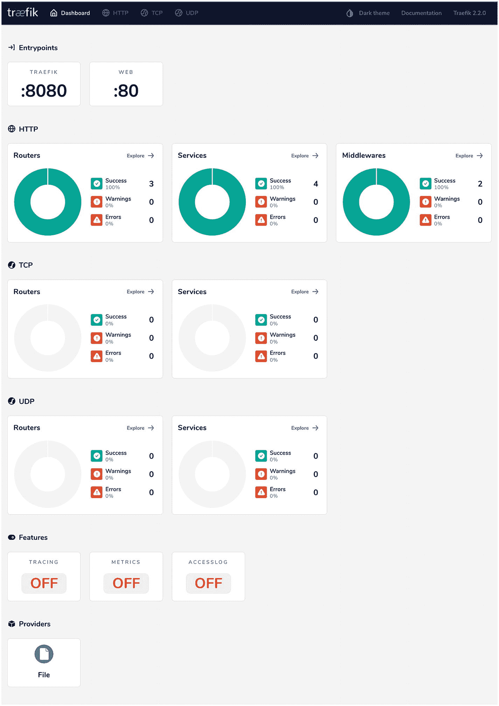

# 二、配置 Traefik

在上一章中，您了解了微服务的采用如何改变了对网关组件的行为要求。Traefik 就是为了满足所有这些需求而构建的。配置 Traefik 有多种方法；配置可以通过文件、参数或环境变量传递。对于所有未指定的配置，它都有合理的默认值。您还了解了 Traefik 中可用的 API 和仪表板。在本章中，让我们在您离开的地方继续深入研究配置 Traefik 以公开几个端点的各种方法。

本章涵盖了路由的基础知识。它讨论了路由中使用的各种组件。我们将介绍一个贯穿本章的小示例应用。Traefik 路由配置用于向外界公开该应用。在本章中，您将尝试手动配置 Traefik 来公开一个简单的服务。在后面的章节中，您可以在此基础上利用 Traefik 的自动配置功能。

## 配置主题

让我们介绍以下 Traefik 配置，以在 Traefik 网关上公开一个示例应用。

*   入口点

*   提供者

*   路由器
    *   规则

    *   中间件

*   服务

这些配置件之间的相互作用如图 2-1 所示。我们会在您前进的过程中详细描述每一项。


图 2-1

trafik 配置架构

## 示例 Web 服务简介

在继续进行 Traefik 配置之前，让我们看一下要在 Traefik 中公开的示例应用。在本章中，我们使用这个简单的 web API 来通过 Traefik 提供流量服务。

这个简单的服务是用 Go 编写的(如清单 2-1 所示),它监听 HTTP 端口 9080。它在默认路径“/”上返回一个“Hello World”字符串。

```py
main.go
package main

import (
"fmt"
"log"
"net/http"
)

func main() {
http.HandleFunc("/", handler)
log.Println("Server listening on port 9080...")
log.Fatal(http.ListenAndServe(":9080", nil))
}

func handler(w http.ResponseWriter, r *http.Request) {
fmt.Fprintf(w, "Hello, World")
}

Listing 2-1Simple Web API Written in Go

```

Note

您需要在系统上安装 Go 1.1.3 来运行此示例。然而，除此之外，它不需要任何其他特殊要求。关于 Go 安装和执行的讨论超出了本书的范围；但是，官方的 Go 文档非常全面。

在上一章中，您看到了如何在机器上以独立模式安装和设置 Traefik。在这里，您使用 Traefik CLI。本章所有的例子都是在 macOS 上运行的。但是，如果您安装了 Go 和 Traefik CLI，您应该能够很容易地理解。

当您运行 Go 服务时，您会看到清单 2-2 中的控制台消息。

```py
➜ hello-world-service> go run main.go
2020/05/02 20:34:26 Server listening on port 9080...

Listing 2-2Running the Go web API

```

当您在浏览器中打开该 URL 时，您会看到以下内容(参见图 2-2 )。


图 2-2

打开 URL http://localhost:9080/的浏览器截图

您会在命令行上看到下面的`curl`(参见清单 2-3 )。

```py
➜ hello-world-service> curl localhost:9080
Hello, World

Listing 2-3Testing the API endpoint with curl

```

在本章的其余部分，我们将运行这个示例应用并配置 Traefik 来公开这个应用的端点。在此过程中，我们将探索各种 Traefik 配置。


图 2-3

在 Traefik 上公开“Hello World”Go 服务

Note

对于本章的其余部分，术语*上游*和*下游*描述了与消息流相关的方向要求:所有消息从上游流向下游。术语*入站*和*出站*描述了与请求路由相关的方向要求:*入站*意味着朝向原始服务器，而*出站*意味着朝向用户代理。这符合 HTTP 规范 RFC 7230 第 2.3 节( [`https://tools.ietf.org/html/rfc7230#section-2.3`](https://tools.ietf.org/html/rfc7230%2523section-2.3) )。

## 流量配置

Traefik 有两种方式提供配置:静态和动态(见图 2-4 )。


图 2-4

Traefik 中的不同配置类型

静态配置在启动时通过以下机制提供。一旦 Traefik 启动，它就不会改变。

*   文件

*   硬币指示器 （coin-levelindicator 的缩写）命令行界面（Command Line Interface for batch scripting）

*   环境变量

对于静态配置，首先通过 CLI 配置 Traefik，然后是环境变量，最后是静态文件配置。

您可以在静态配置(文件或 CLI)中定义入口点。Entrypoints 是 Traefik 侦听传入 TCP/UDP 流量的端口的端口定义。

提供者是难题的另一部分，必须在静态启动配置中指定。提供商赋予 Traefik 强大的功能。动态配置(如路由器和服务)在运行时被更改和刷新，并通过提供者进行配置。Traefik 可以通过一组预配置的提供者与您的服务目录对话，而不必手动配置每个下游服务。有 Docker、Kubernetes 和 Consul 的提供者，也有诸如 files 之类的存储和诸如 etcd 之类的键值存储。这允许 Traefik 自动在边缘公开下游服务。在本章中，您将通过手动使用 FileProvider 来指定动态配置。在后面的章节中，您将深入了解 Traefik 如何与其他提供者集成，比如 Consul 和 Kubernetes。

### 入口点

Traefik 配置定义了一组侦听传入请求的入口点(或端口号)。这些入口点可以服务于 HTTP、TLS、gRPC 或 TCP 流量。您可以为希望通过 Traefik edge gateway 公开的每个后端服务定义一个入口点。入口点定义了地址、协议、报头、传输细节(如超时)和 TLS 细节的底层细节。

在开始定义入口点之前，让我们先回顾一下您希望如何运行 Traefik，并确定您如何在运行时观察已定义的配置。您可以从命令行启动 Traefik，无需任何其他配置。为了在后续步骤中观察配置的结果，您还可以通过传递`'--api.dashboard=true'`标志来启用 Traefik web 仪表板。

#### 使用 cli 参数启动流量

```py
➜  ~ ./traefik --api.dashboard=true --api.insecure=true
INFO[0000] Configuration loaded from flags.

Listing 2-4Start Traefik with command line arguments

```

清单 2-4 在本地主机的端口 8080 上启动 Traefik，Traefik 仪表板以默认配置显示。仪表板位于/api/dashboard/ route 下。

默认情况下，Traefik 建议在安全模式下公开仪表板；因为您现在只想看到仪表板，而不需要太多的配置，所以您用`'--api.insecure=true'`标志在不安全模式下启动它。请注意，对于生产用例，不建议这样做。

正如您在图 2-5 中看到的，Traefik 仪表板有一组区域，允许您观察在 Traefik 中配置和启用的所有功能。目前，Traefik 实例中只公开了默认配置。


图 2-5

在`http://localhost:8080/`打开 Traefik 仪表板的屏幕截图

默认情况下定义了两个入口点。

*   端口 80 上侦听的默认 HTTP 入口点

*   一个名为 Traefik 的入口点侦听端口 8080，它提供对仪表板的访问

仪表板不通过任何特殊机制公开。Traefik 使用标准的入口点配置公开它。在入口点下面，您可以看到按协议(HTTP、TCP 和 UDP)分类的路由器、中间件和服务。随着您向前移动，您可以深入查看您在控制面板上看到的这些进一步的部分。

如您所见，Traefik 定义了许多入口点、路由器、中间件和服务。下一步是使用这些相同的机制公开下游服务。

如您所见，当您启用 web 仪表板时，默认情况下 Traefik 已经监听端口 80(默认 HTTP)和 8080(仪表板 HTTP)。

让我们定义自己的入口点来公开已经通过 Traefik 讨论过的“Hello World”Go 服务。

首先，您需要定义一个入口点。这是在静态配置中启动时使用以下方法之一完成的。

*   CLI 参数

*   环境变量

*   当前目录下的配置文件 traefik.yml

#### 使用 cli 定义的入口点启动流量

```py
➜ ~ ./traefik --api.dashboard=true --api.insecure=true  --entryPoints.web.address=:80
INFO[0000] Configuration loaded from flags.

Listing 2-5Traefik entrypoint defined through command line argument

```

清单 2-5 定义了一个名为 web 的入口点，它监听端口 80。这将覆盖您之前在端口 80 上看到的默认 HTTP 入口点(参见图 2-6 )。


图 2-6

Traefik 仪表板中的入口点于`http://localhost:8080/`打开

当您尝试从 cURL 访问本地主机上的这个端口时，您会看到清单 2-6 中的输出。Traefik 正在侦听此端口，但是后端还没有连接到此端口的服务。

```py
➜ hello-world-service> curl localhost
404 page not found

Listing 2-6Testing the localhost 80 port with curl

```

我们使用命令行参数定义静态配置，成功地公开了入口点。接下来，让我们尝试使用环境变量做同样的事情。

#### 使用环境变量中定义的入口点启动 trafik

您在终端中执行以下命令来启动 Traefik，在端口 80 上公开一个名为 web 的入口点(参见清单 2-7 )。

```py
➜ traefik-config> export TRAEFIK_API_DASHBOARD=true
➜ traefik-config> export TRAEFIK_API_INSECURE=true
➜ traefik-config> export TRAEFIK_ENTRYPOINTS_WEB_ADDRESS=":80"
➜ traefik-config> traefik
INFO[0000] Configuration loaded from environment variables.

Listing 2-7Starting Traefik with entrypoint configuration in environment variables

```

当您在浏览器中访问该端点时，您会看到与之前相同的结果(参见图 2-7 )。


图 2-7

还没有后端服务连接到端口 80

命令行参数和环境变量可以随意使用；但是，对于本章的其余部分，您将通过文件提供所有配置。这是配置 Traefik 的推荐方式，因为文件配置简单，不容易出现打字错误和错误。在源代码控制中也可以很容易地跟踪它，支持更多的 GitOps 模型。接下来，让我们看看如何实现这一点。

#### 用当前目录中的配置文件 Traefik.yml 定义的入口点

Traefik 静态配置文件可以通过多种方式提供。

*   当前目录中的 Traefik.yml 文件

*   Traefik.yml file in $HOME/.config

*   作为命令行参数传入 CLI 的文件的位置

    `--configFile=path/to/traefik-static-config.yml`

为简单起见，在本章的剩余部分，我们将 Traefik 配置文件限制在当前目录中。

#### TOML 诉 YAML 案

在 Traefik 中有两种定义文件配置的竞争格式:TOML 和 YAML。

虽然 Traefik 团队更喜欢 TOML，但本章中的所有配置示例都在 YAML。TOML 是一种不太知名和晦涩的格式，而 YAML 在各种平台中得到广泛支持，并且是 Docker 和 Kubernetes 生态系统的默认声明性状态配置格式。不要学习定义简单配置的新格式，让我们坚持使用 YAML 来满足所有需求。在 Traefik 配置的所有问题上，YAML 与 TOML 拥有同等的功能。

当前目录下的 traefik.yml 文件指定了入口点，如清单 2-8 所示。您还可以在此文件中添加配置来启用仪表板，而不是在命令行中启用它。

```py
# Entrypoints have to be defined as static configuration in traefik.yml
entryPoints:
  web:
   address: ":80"

api:
  insecure: true
  dashboard: true

Listing 2-8Traefik Static YAML Configuration

```

为了比较，在清单 2-9 中定义了 TOML 格式的相同配置。你不用这个；它只是被包括在内以供参考。

```py
# Entrypoints have to be defined as static configuration in traefik.yml
[entryPoints]
  [entryPoints.web]
  address = ":80"

[api]
insecure = true
dashboard = true

Listing 2-9Traefik Static TOML Configuration

```

现在让我们用静态 YAML 配置启动 Traefik。

```py
➜ traefik-config> ./traefik
INFO[0000] Configuration loaded from file: /Users/akshay/traefik-book/traefik-config/traefik.yml

Listing 2-10Startup Traefik with static file configuration

```

当您启动 Traefik 时(参见清单 2-10 ，它会自动提取当前目录中的 traefik.yml 文件。这样做的结果与前两个小节中看到的结果相同。

### 路由器

对于 Traefik 公开的每个入口点，必须连接相应的路由器来进一步路由流量。路由器由两部分组成。

*   一套规则。入口点上的每个传入请求都与这组规则相匹配。

*   一套中间件。规则匹配的每个请求都可以使用相应的中间件进行转换。中间件是执行认证和速率限制的所有专用网关功能的地方。

既然入口点已经公开，那么使用路由器配置将后端 Go API 连接到入口点。让我们首先来看看 Traefik 仪表板中定义的默认路由器。

默认情况下定义了两个 HTTP 路由器。当您点击主页上路由器部分的“浏览->”时，您会看到如图 2-8 所示的内容。


图 2-8

深入了解默认 HTTP 路由器。

*   在“/api”下定义的第一个路由是名为 api@internal 的默认父路由。

*   “/”下的第二条路线是名为“dashboard@internal”的仪表板路线。

您可以进一步深入这些路由器并检查它们的详细信息(参见图 2-9 和 2-10 )。这些路由分别服务于 API 和仪表板的流量。


图 2-10

仪表板@内部 HTTP 路由器的详细视图


图 2-9

api @内部 HTTP 路由器的详细视图

您必须定义 HTTP 路由器，以便在 Traefik 仪表板上显示类似的内容。从现在开始，您将利用 FileProvider 来指定动态配置。Traefik 可以通过支持的提供者与您平台的服务发现机制对话。对于这个简单的用例，您在一个文件中指定所有的配置，这很容易被 Traefik 支持。路由器、中间件和服务的所有配置都是通过动态配置指定的。有两种方法可以指定 FileProvider 配置。

*   通过文件名指定的单个文件

*   配置文件的整个目录，这是生产中推荐的方法，因为您可以将各种配置分成多个文件

在清单 2-11 中，您在存放所有动态配置的当前目录中指定了一个文件名。然后 Traefik 监视该文件是否有任何更改，并且在 Traefik 中自动刷新配置。

```py
# Entrypoints have to be defined as static configuration in traefik.yml
entryPoints:
  web:
   address: ":80"

providers:
  file:
    filename: "traefik-dynamic-conf.yml"
    watch: true

api:
  insecure: true
  dashboard: true

Listing 2-11Dynamic configuration file name defined in static cofiguration

```

#### 路由器规则

在 traefik-dynamic-conf.yml 动态配置文件中，首先定义 HTTP 路由器及其路由规则(参见清单 2-12 )。

```py
http:
  routers:
    router0:
      entryPoints:
      - web
      service: hello-world
      rule: Path(`/hello-world`)

Listing 2-12traefik-dynamic-conf.yml dynamic configuration file

```

一旦所有的配置都设置好了，您就可以在同一个目录中运行 Traefik CLI(参见清单 2-13 )。

```py
➜ traefik-config> ./traefik
INFO[0000] Configuration loaded from file: /Users/akshay/code/k8s/traefik-book/traefik-config/traefik.yml
ERRO[2020-05-13T09:22:17+05:30] the service "hello-world@file" does not exist entryPointName=web routerName=router0@file
ERRO[2020-05-13T09:22:18+05:30] the service "hello-world@file" does not exist entryPointName=web routerName=router0@file

Listing 2-13Running Traefik with router rule in dynamic configuration file

```

您定义了一个规则来将请求路径(`/hello-world`)匹配到一个尚未配置的后端服务，因此 Traefik 在启动时会抛出一个控制台错误。您会在仪表板中看到类似的错误(参见图 2-11 )。HTTP 路由器部分显示一个错误。同样有趣的是页面底部的 Providers 部分，它现在有一个 FileProvider 条目。


图 2-11

带有 HTTP 路由器的仪表板视图

路由器的下一块要配置的应该是中间件；然而，我们将暂时跳过它，稍后再回来。首先，您配置服务后端并获得端到端的通信。

## 服务

服务定义了请求必须被路由到的实际目标。它们是您希望通过 Traefik 公开的实际 API 端点。请注意，服务类型必须与路由器类型匹配(例如，HTTP 路由器只能连接到 HTTP 服务)。在匹配和转换请求之后，路由器将它们转发到您希望公开的服务。

在定义服务之前，让我们看看 Traefik 仪表板中配置的默认服务。定义了三种 HTTP 服务。当你点击“服务”部分的“浏览->”时，你会看到如图 2-12 所示的内容。


图 2-12

仪表板默认服务

您可以进一步深入这些服务。api@internal service 处理 Traefik API 请求(参见图 2-13 )。


图 2-13

仪表板默认服务 api@internal

仪表板@内部服务(见图 2-14 )处理仪表板请求。当启用 API 和仪表板时，Traefik 会隐式注册这两个服务。


图 2-15

仪表板默认服务 noop@internal


图 2-14

仪表板默认服务仪表板@内部

还有一个 noop@internal(如图 2-15 所示)用于重定向。

清单 2-14 在 traefik-dynamic-conf.yml 中定义了一个后端服务，以满足上一节中设置的规则，将流量路由到 Go“Hello World”服务。请记住，该服务运行在本地主机端口 9080 上。

```py
# Dynamic configuration
http:
  routers:
    router0:
      entryPoints:
      - web
      service: hello-world
      rule: Path(`/hello-world`)

  services:
    hello-world:
      loadBalancer:
        servers:
        - url: http://localhost:9080/

Listing 2-14Service configuration in dynamic configuration file

```

您现在启动 Traefik 并尝试在子路径'/hello-world '上的 Traefik 端口 80 上访问 Go 服务。当您使用 curl 时，您会看到清单 2-15 中的输出。

```py
➜  traefik-config> curl localhost/hello-world
Hello, World

Listing 2-15Access service endpoint on localhost with curl

```

现在，您已经成功地在 Traefik 的端口 80 上公开了后端服务。让我们看看 Traefik 仪表板中显示了什么。您可以在主仪表板页面上看到 HTTP 路由器、服务和中间件(参见图 2-16 )。


图 2-16

路由器和服务已配置

您可以深入到 HTTP 服务页面，在这里您会看到 hello-world 服务的一个新条目(参见图 2-17 )。


图 2-17

向下钻取到配置的 HTTP 服务。

然后，您可以深入到 hello-world 服务以查看其详细信息(参见图 2-18 )。这也显示了 Servers 部分中的后端服务 URL。


图 2-18

细化到已配置的 Hello World 文件 HTTP 服务

然后导航回主仪表板页面(参见图 2-19 )。



图 2-19

配置中间件之前的 trafik 仪表板

从这里，您可以深入到 HTTP 路由器(参见图 2-20 )。


图 2-20

深入查看已配置的 HTTP 路由器

然后您可以深入到 HTTP 路由器，它将 hello-world 服务附加到 web 入口点(参见图 2-21 )。


图 2-21

连接到 hello-world 服务的 HTTP 路由器

### 中间件

现在，您已经成功地在 Traefik 中公开了第一个服务，让我们回头向路由器添加一个中间件，以添加额外的 API 网关功能。

默认定义了两个 HTTP 中间件。当你点击中间件部分的“浏览->”时，你会看到如图 2-22 所示的内容。


图 2-22

默认中间件

您可以轻松地向下导航，查看隐式定义的中间件的详细信息。它们与仪表板一起自动启用，对于 URL 模式的特殊处理非常有用(参见图 2-23 和 2-24 )。这样，即使内部 Traefik 服务也遵循与用户定义的服务相同的配置机制。


图 2-24

默认 stripprefix 中间件


图 2-23

默认仪表板重定向中间件

对于用例，您定义内置的基本身份验证中间件来保护 Hello World API。

让我们从使用`htpasswd`命令行工具生成用户名-密码对开始。这是 Traefik 文档中基本验证页面上推荐的方法。如果您的系统上没有此工具，您可以使用任何其他兼容的密码哈希实用程序。你用 *admin* 作为用户名，用 *admin@123* 作为密码。用户名可以指定为纯文本，但密码必须以 MD5、SH1 或 BCrypt 格式散列提供(参见清单 2-16 )。

```py
➜  traefik-config> htpasswd -nb admin admin@123
admin:$apr1$JsindKAS$zCWAvabJOgQvI.Dd3zjtE.

Listing 2-16Generate username password pair for authentication

```

您将这个值复制到 Traefik 动态配置中(参见清单 2-17 )。

```py
# Dynamic configuration
http:
  routers:
    router0:
      entryPoints:
      - web
      middlewares:
      - basic-auth
      service: hello-world
      rule: Path(`/hello-world`)

  services:
    hello-world:
      loadBalancer:
        servers:
        - url: "http://localhost:9080/"

# Declaring the basic auth middleware with the user credentials
  middlewares:
    basic-auth:
      basicAuth:
        users:
          - "admin:$apr1$JsindKAS$zCWAvabJOgQvI.Dd3zjtE."

Listing 2-17Basic auth middleware configuration in dynamic configuration file

```

现在让我们试试浏览器中的/hello-world 端点。您会在浏览器中看到一个基本的授权提示，要求您输入用户名和密码(参见图 2-25 )。输入这些之后，你可以看到 hello-world 服务的响应(见图 2-26 )。


图 2-26

最终认证 Hello World


图 2-25

浏览器基本身份验证

让我们在命令行上用`curl`做同样的尝试(参见清单 2-18 )。

```py
➜  traefik-config> curl localhost/hello-world
401 Unauthorized
➜  traefik-config> curl -u admin localhost/hello-world
Enter host password for user 'admin':
Hello, World

Listing 2-18Testing basic auth middleware applied on localhost endpoint

```

现在这已经可以工作了，让我们最后看一下 Traefik 仪表板中的配置。你可以看到主页上的 HTTP 中间件平铺显示了另一个中间件(见图 2-27 )。


图 2-27

最终配置

您可以深入到中间件页面，在那里您可以查看已定义的`basic-auth@file`中间件。Traefik 会自动指定名称。你还可以看到其他隐式中间件(见图 2-28 )。


图 2-28

向下钻取到已配置的 HTTP 中间件

然后进一步深入查看中间件的配置。您还可以看到您为认证定义的用户(参见图 2-29 )。


图 2-29

已配置的基本身份验证中间件

在该页面中，您可以直接导航到该中间件的关联路由器并查看其详细信息(参见图 2-30 )。


图 2-30

连接路由器、服务和中间件

## 摘要

在本章中，您了解了 Traefik 的基本配置，以及如何手动配置 Traefik 以在特定端口上公开 API，并将流量路由到相应的后端服务。您了解了配置 Traefik 的各种方法，并从文件、CLI 参数和环境变量传递了配置。您还深入研究了 Traefik 仪表板，以了解如何使用它来理解配置。

到目前为止，您只是简单地将流量路由到一个后备服务实例。在下一章中，您将深入了解 Traefik 针对 HTTP 和 TCP 流量的负载平衡器功能。