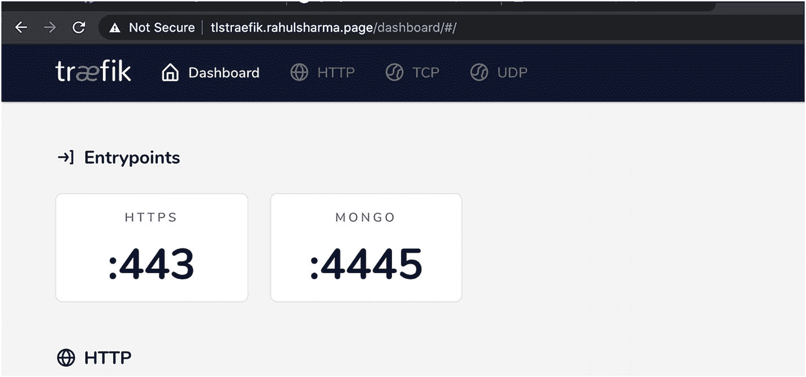
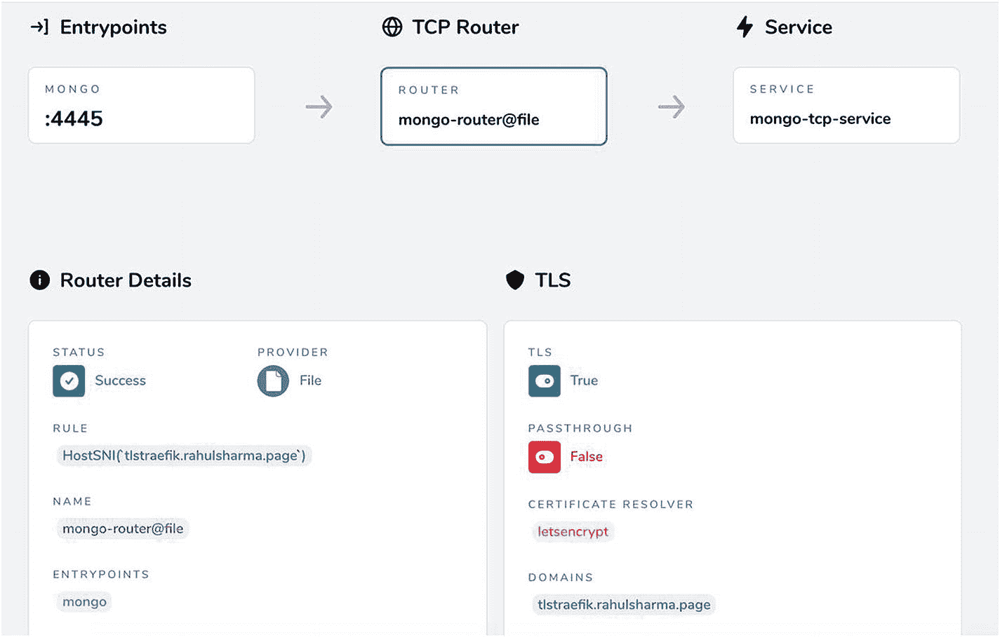
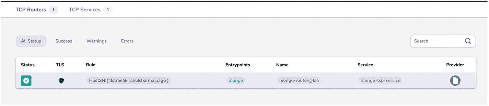
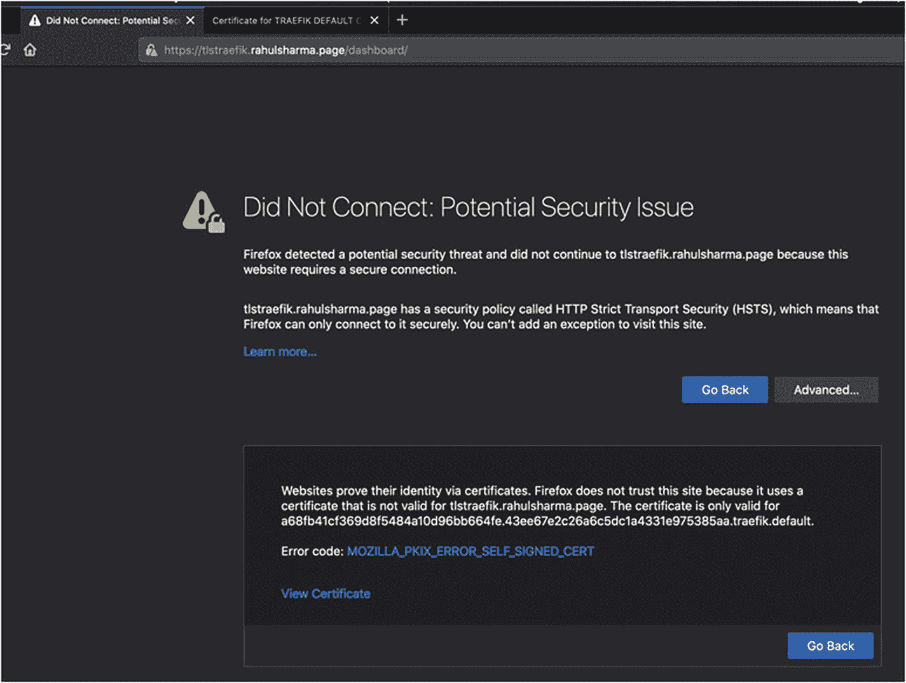
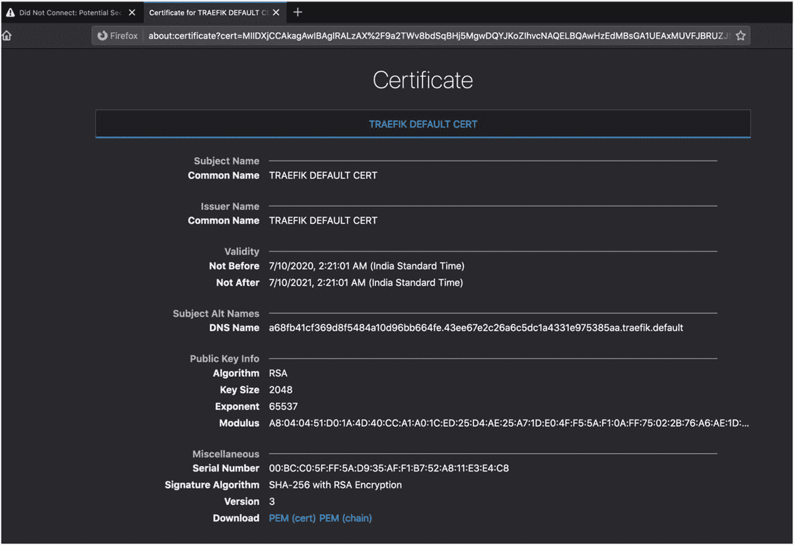
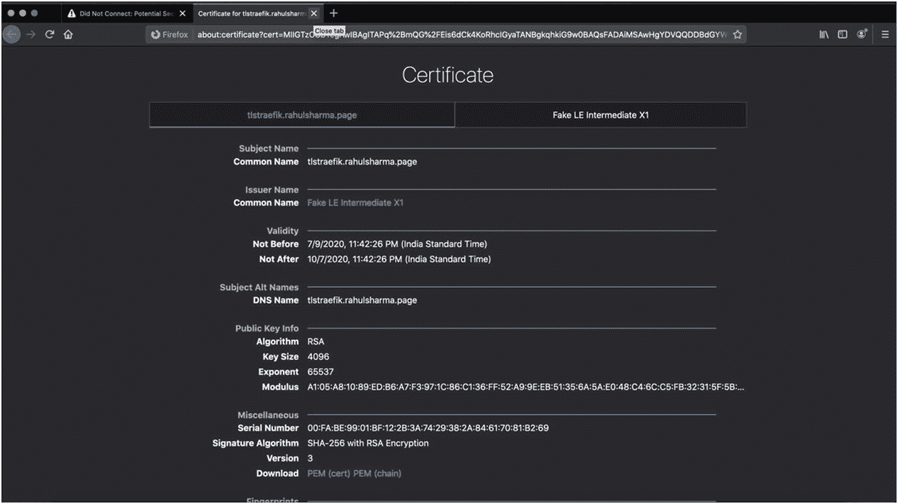
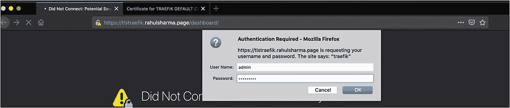
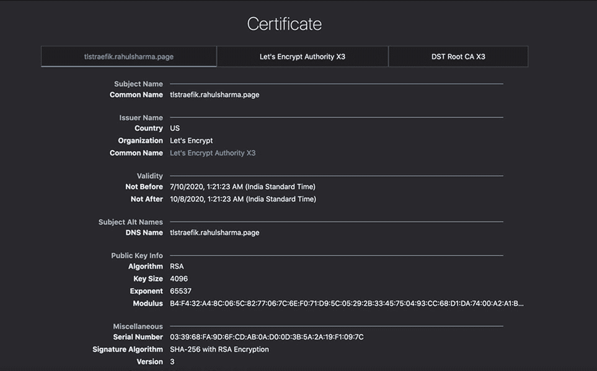
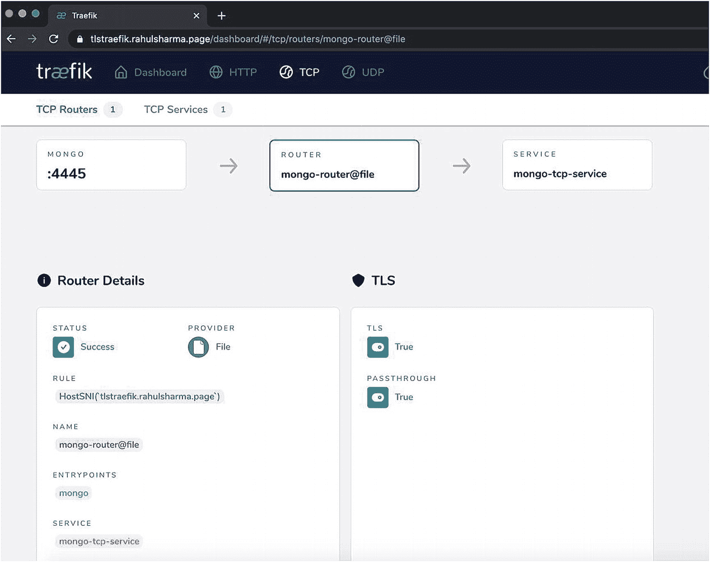

# 四、配置 TLS

前几章介绍了如何通过 HTTP、TCP 和 UDP 连接使用 Traefik 公开服务。他们还深入了解了 Traefik 提供的特殊交通管理功能。到目前为止，您只处理过普通的未加密流量——HTTP 或 TCP。但是，对于任何严肃的生产用途，您都需要通过 TLS 安全地公开端点。在本章中，您将了解 Traefik 为加密和解密网络流量提供的功能。

涵盖了以下两种情况。

*   带 trafik 的 tls 终端

*   TLS 转发到后端服务

对于 Traefik 的 TLS 终止，我们使用 Let's Encrypt 为公共云中运行的服务自动提供 TLS 证书。Traefik 和 Let's Encrypt 一起让这个复杂的过程变得相当琐碎。

## TLS 快速概述

TLS 加密的常见用例是保护 HTTP 流量。这意味着所有 API 和 web 流量都可以抵御中间人攻击和其他形式的网络窥探。我们不是公开普通的 HTTP 流量，而是通过 HTTPS 路由数据包。这意味着传输数据包的底层通道是加密的。

这种安全性的主要需求是保护敏感数据，从您可以用来验证对受保护资源的访问的用户名/密码开始。你不应该在普通的 HTTP 连接上传输任何秘密，因为它很容易被网络嗅探软件截获。

TLS 流量在离开源端时被加密，然后在目的端被解密。解密部分就是我们所说的 *TLS 终止*。这种加密和解密通常在应用层(OSI 或 TCP/IP 术语)之下执行。

除了指定适当的配置之外，大多数应用层代码从不需要担心 TLS 的细节。因为实现加密协议不适合胆小的人，也不应该掉以轻心，所以大多数编程语言和平台都带有标准库，这些库已经过实战测试，并由密码学专家实现。

Note

尽管我们触及了在 Traefik 中使用 TLS 的许多部分，但对 TLS 的深入讨论超出了本书的范围。它的核心是基于标准的密码原语，特别是公钥密码学，这是一个专门的领域。本演练涵盖使用 TLS 的实际方面，包括从证书颁发机构获取有效的 TLS 证书，并在客户端-服务器配置中使用它们。我们不涉及高级网络安全实践或 DNS，尽管我们确实对它们有所涉猎。我们鼓励您更深入地研究这些领域，根据它们的用例来微调配置。

一般来说，连接到启用了 TLS 的服务器的客户端可以验证其真实性。它们通过向证书颁发机构(或 CA)验证服务器的 TLS 证书来实现这一点，证书颁发机构签署并颁发服务器的证书。该服务器证书包含服务器的公钥，该公钥在客户端和服务器之间建立加密通道。这有助于防范中间人和其他攻击。CA 通常是受信任的第三方公共机构，大多数浏览器已经自动配置了这些。大型专用企业网络通常有一个专用 CA 来为内部 Intranet 站点颁发证书，并且该专用 CA 在企业管理的设备上自动受到信任。

这种机制有一个扩展，可以向服务器验证客户端的身份；这是通过通常由同一个 CA 颁发的客户端证书来实现的，并在服务器端进行验证。虽然 Traefik 支持这种方法，但我们并不在本章中讨论这种方法。

通常，HTTP 流量的默认端口是 80，HTTPS 是 443，尽管各种平台和应用在它们选择的任何端口上提供 TCP 和 HTTP/HTTPS 流量。例如，端口 8080 和 8443 分别是公开 HTTP 和 HTTPS 流量的非常流行的备选方案。(它们是非限制性端口，但是这方面的讨论超出了本书的范围。)然而，大多数面向互联网的服务器都公开标准端口 80 和 443。到目前为止，我们主要公开了 8080、80 或其他 HTTP 和 TCP 自定义端口上的 Traefik 入口点。Traefik 仪表板通过 HTTP 8080 或 80 以未经身份验证的不安全模式公开，不建议在生产环境中使用。

虽然 TLS 广泛保护 web 上的 HTTP 流量，但我们使用它来保护普通的 TCP 连接。我们可以很容易地将 HTTPS 暴露给前几章中介绍的一个 HTTP APIs 示例。我们认为 TLS 比简单 TCP 更好地展示了 Traefik 的高级 TLS 功能。作为通过 TLS 公开 TCP 端口的一部分，我们还包括一些 HTTPS 流量。

## 在 Traefik 终止 TLS

前一章介绍了如何使用 Traefik 公开和负载平衡 MongoDB TCP 服务。本地使用有一个简单的连接是好的；然而，对于任何一种严肃的生产用例，您都需要使用 TLS 加密到 MongoDB 的连接。您可以通过两种方式实现这一点。

*   在 MongoDB 服务器上启用 TLS，这样 TLS 在 MongoDB 服务器级别终止。这要求 Traefik 传递加密的流量。或者，

*   MongoDB 仍然服务于普通的 TCP 流量；但是，我们在 Traefik 入口点上启用 TLS 来公开 MongoDB 连接。然后，TLS 在 Traefik 入口点终止，该入口点将解密的流量传递到后端 MongoDB 端口。

虽然第一种选择似乎更有利和安全，但这在实践中通常不是可行的方法。由于 Traefik 通常充当负载平衡器或反向代理，因此它通常会在多个后端实例之间对您的请求进行负载平衡。这在上一章中已经讲过了。

通常，您有多个集群节点或服务实例(分别用于数据库和 API)暴露在一个路由后面。在这种情况下，任何客户端都希望将一个一致的端点暴露给它们所连接的任何服务。出于安全原因，TLS 证书与部署它们的服务器域主机紧密耦合。如果我们在单个实例级别终止 TLS，那么我们需要额外的证书，或者在每个复制副本实例上重复使用相同的证书。对于消费者来说，很明显客户端每次都连接到不同的主机。这是不太可取的。

在实际生产中，我们总是使用 Traefik 进行 TLS 终止，然后通过简单的 TCP 连接将数据包从 Traefik 路由到后端(在当前示例中是 MongoDB)。这并没有看起来那么大的安全风险，因为内部流量是在一个封闭的网络中，通常是您自己的 VPC/VLAN。对于共享基础设施的场景，总是有一种高级的做法，即启动一个从边缘网关到后端服务的新的内部 TLS 连接；我们不报道这个。

### 在 TLS 上公开 MongoDB 路由

本节通过公共云提供商在云 VM 上运行 MongoDB 实例。您可以使用托管数据库产品。如果您调整了正确的端口并为该数据库使用了合适的客户机，那么您可以自由地使用任何其他数据库。为了简单起见，我们在同一个云 VM 上运行 MongoDB 实例和 Traefik，这样 Traefik 可以安全地连接到在本地主机上运行的 MongoDB，而没有任何其他复杂性。

对于这个例子，我们正在运行一个运行 Ubuntu 18 的 DigitalOcean droplet(或 VM)。然而，这些概念对于任何其他云 VM 都是相同的，比如 AWS EC2 实例。设置 DigitalOcean 或 AWS 实例超出了本书的范围；然而，这很容易做到。一旦 VM 设置完成，Traefik 可以使用第一章中的说明轻松安装。

默认情况下，不允许 Ubuntu Traefik CLI 监听端口 80 或 443。因此，如果这些端口被定义为入口点，Traefik 会在启动时抛出一个错误。我们需要运行清单 4-1 中的命令来允许 Traefik 绑定到这些端口。

```py
ubuntu-blr1-01:~$ wget https://github.com/containous/traefik/releases/download/v2.2.1/traefik_v2.2.1_linux_amd64.tar.gz
ubuntu-blr1-01:~$ tar -zxvf traefik_v2.2.1_linux_amd64.tar.gz
ubuntu-blr1-01:~$ sudo setcap 'cap_net_bind_service=+ep' traefik
ubuntu-blr1-01:~$ ./traefik  --entryPoints.web.address=:80

Listing 4-1Install and Set Permissions for Traefik

```

您可能想知道我们为什么选择云部署。原因是我们需要一个公共 DNS 名称，Traefik 才能获得有效的 TLS 证书。我们建立了一个单独的子域来指向 DigitalOcean droplet，并在 DNS 提供程序中添加了一个 A 记录来指向它的 IP 地址(同样，这个讨论也超出了本书的范围)。您可以在本地尝试 Traefik 的 TLS 支持，但您需要手动提供或自签名的证书。你也会错过 Traefik 让整个过程变得多么简单。手动获取的证书的 TLS 配置很简单；我们在此提供它以供参考。这对于有效的公共域证书和本地自签名测试证书都是一样的。

清单 4-2 用一个`tls: {}`键定义了一个 TCP 路由。这足以在此路由上启用 TLS。

```py
# traefik.yml with only 443 entrypoint
entryPoints:
  websecure:
    address: ":443"
# Also enable DEBUG log
log:
  level: DEBUG
providers:
  file:
    filename: "traefik-tls-conf.yml"
    watch: true

# traefik-tls-conf.yml
tcp :
  routers :
    mongo-router :
      entryPoints :
      - websecure
      rule : "HostSNI(`localhost`) || HostSNI(`127.0.0.1`)"
      service : mongo-tcp-service
      tls: {} #This block will enable TLS for this route
#We also need to provide the TLS certificates
tls:
  certificates:
    - certFile: localhost+1.pem
      keyFile: localhost+1-key.pem

Listing 4-2Route Configuration for MongoDB TCP over TLS: Manual Certificates

```

我们还在单独的部分提供了证书路径。这是一个动态配置，这意味着我们可以在运行时添加新的证书。这些只能通过 FileProvider 定义。根据匹配的域，在运行时使用正确的证书。如果您没有提供自己的证书，或者没有为匹配的域提供证书，Traefik 会生成并使用其默认的自签名证书。也可以覆盖这个默认证书。手动生成证书超出了本章的范围。对于本地测试，像 [`https://mkcert.dev/`](https://mkcert.dev/) 这样的工具会很有用。在前面的配置中，您可以通过安全的 TCP+TLS 连接连接到 MongoDB。

MongoDB 的安装在书外；然而，它基本上是默认安装，只是增加了一点——为了基本的安全性，我们设置了一个 DB 用户和密码。为了简单起见，我们只使用一个后端 MongoDB 实例，而不是跨多个实例进行负载平衡。配置看起来如清单 4-3 所示。

```py
#tls-config.yaml dynamic config
tcp :
  routers :
    mongo-router :
      entryPoints :
      - mongo
      rule : "HostSNI(`tlstraefik.rahulsharma.page`)"
      service : mongo-tcp-service
      tls:
        certResolver: "letsencrypt"
        domains:
          - main: "tlstraefik.rahulsharma.page"

  services :
    mongo-tcp-service :
      loadBalancer :
        servers :
        - address  : "localhost:27017"

Listing 4-3Route Configuration for MongoDB TCP over TLS

```

这些作品中的大部分已经为我们所知。我们查看了`HostSNI`属性。在前面的例子中，我们将其设置为匹配所有可能的主机名(`*`)。虽然这种方法对于未加密的流量可能没问题，但对于 TLS 是不可行的。它与运行服务的实际域名相匹配，并且服务器证书也验证了这一点。`tlstraefik.rahulsharma.page`是指向 DigitalOcean droplet 的 IP 地址的公共 DNS 名称。还有一个设置为`letsencrypt` `,`的`certresolver`属性，它自动提供一个 TLS 证书，从第一次请求时加密到这个端点。

### 让我们加密自动证书供应

获取 TLS 证书通常是一个多步骤的过程。所有平台上都有很好的实用程序，可以帮助你生成必要的片段。对于无处不在的 TLS 证书，证书生成是一个复杂的过程，需要设置许多属性，如果某些配置是错误的，您需要重新开始。通常的步骤是为服务器证书生成证书签名请求(CSR ),并将其提交给 CA 进行签名。CA 签署并返回可以使用的有效证书。不同的 ca 有不同的定价模式，证书功能和网站可以自由选择他们想要的。传统上，这是一个手动过程，其中包含一些自动化部分。

这个领域的大颠覆是由一个叫做“让我们加密”( [`https://letsencrypt.org`](https://letsencrypt.org) )的非营利组织带来的。Let's Encrypt 已经为超过 2.25 亿个网站颁发了免费的 TLS 证书(超过 10 亿份)。它通过编程 API 自动完成整个过程，因此不需要人工干预。

让我们加密几个官方和第三方客户端，使最终用户的证书提供过程变得简单。它通过利用 ACME 标准( [`https://tools.ietf.org/html/rfc8555`](https://tools.ietf.org/html/rfc8555) )来实现这种自动化，ACME 标准代表自动证书管理环境。我们不会深入研究这个问题，但是它完全自动化了从 ACME 兼容的 CA 获取和管理证书的工作。最重要的是，你必须做的就是启动你的 HTTPS 服务器，剩下的就交给你了。如果有人正在考虑建立一个网站，需要 TLS 证书，让我们加密是正确的做法。

Note

让我们只加密面向 Internet 的公共站点的设置证书。这意味着您的端点需要可以通过公共域名访问，以便我们加密来提供 TLS 证书。对于私有或内部 API，需要从其他 ca 提供证书。这对示例有影响，到目前为止，这些示例一直在本地系统上运行。

### 为公共 TCP 端点设置 TLS 证书

为了自动提供来自 Let's Encrypt 的 TLS 证书，我们需要在公共互联网上公开 MongoDB 端口。

显然，作为一种实践，您永远不应该在互联网上公开您的数据库端口。有许多新闻报道称，不安全的 MongoDB 连接暴露在开放的互联网上，并成为黑客的目标，导致数据受损。对于这个例子，我们暂时使用一个空白数据库，所以应该没问题。我们还使用适当的访问凭证来保护 MongoDB，该端口只能通过 Traefik 访问。这里需要注意的一点是，我们还在虚拟机上设置了云防火墙规则，只允许端口 80、443 和 4445 上的入站流量。来自 Internet 的所有其他入站流量都被阻止。

如清单 4-2 所示，我们在`tlstraefik.rahulsharma.page`域上公开了 Mongo TCP 端点。`tlstraefik`这里是 TLS 路由匹配的子域。Let's Encrypt 颁发的证书是为同一个子域颁发的。支持额外的域条目，这些条目请求额外的 SNI(服务器名称指示)主机名，这些主机名支持同一 IP 和端口上的多个域和 TLS 证书。我们不打算深究此事。

Traefik 首先检查域条目，然后检查 HostSNI 值，以确定自动请求 TLS 证书的域。这里两者都不需要；我们把它们包括进来只是为了参考。这对于通配符证书更有用，这里不讨论。

引用了`certresolver`属性。它与入口点一起在静态配置中定义。我们需要定义一个 TLS 入口点和证书解析器，目前主要是加密。

在清单 4-4 中，有两个感兴趣的条目。首先是要指定的`caServer` URL 属性。通常，默认情况下，这是让我们加密生产 API 端点。然而，这个终点有严格的(尽管是宽松的)速率限制。

```py
#traefik.yaml static config
entryPoints:
  mongo:
    address: ':4445'
  https:
    address: ':443'
providers:
  file:
    watch: true
    filename: tls-config.yml
certificatesResolvers:
  letsencrypt:
    # ACME support via Let's Encrypt
    acme:
      # Email address required for certificate registration
      email: "<email address>"

      # File or key required for certificates storage.
      storage: "acme.json"

      # CA server URL
      caServer: "https://acme-staging-v02.api.letsencrypt.org/directory"

      tlsChallenge: {}

Listing 4-4Entrypoint and Certificate Resolver

```

如果您是第一次使用 Let's Encrypt 并在测试环境中试验配置来弄清楚您的 TLS 设置，那么使用 Let's Encrypt staging 端点的 URL 更有意义，它在清单 4-4 中使用。这不提供可用的 TLS 证书。签署证书的 CA 是假的，大多数浏览器拒绝由此产生的证书。Let's Encrypt 允许您下载虚拟 CA 证书(fakelerootx1.pem ),并根据它验证您生成的服务器证书。这允许您在使用有效证书进入生产环境之前测试整体集成。

其次，`tlsChallenge`属性是我们感兴趣的。为了验证请求服务器证书的第三方拥有主机的所有权，让我们加密支持各种自动化挑战。标准的挑战是 HTTP-01 挑战和 DNS-01 挑战。两者都适合不同类型的用例。然而，TLS 终止反向代理有一个特殊的挑战，这就是 Traefik 在这里扮演的角色，称为 TLS-ALPN-01 挑战。更多的信息超出了本书的范围。在 Traefik 中配置这种质询类型很简单，所以在这里使用它。

有一个警告:这个挑战需要 Traefik 访问端口 443；因此，我们在端口 443 上暴露了一个额外的入口点。这没什么大不了的，因为我们无论如何都会在下一节中使用这个端口。对于基于云的安装，有必要在入站流量防火墙规则中打开端口 443。当您在 Traefik 仪表板上查看时，您会看到两个入口点(参见图 4-1 )。



图 4-1

TLS entry points-TLS 输入类型

如果您使用这个 Traefik 配置来公开与 Traefik 实例运行在同一服务器上的 MongoDB 实例，您可以在主机名 tlstraefik.rahulsharma.page *、*上访问端口 4445 上的 MongoDB，但只能使用 TLS 连接。您可以用 Mongo 客户端 CLI 来尝试一下(参见清单 4-5 )。

```py
ch04 % mongo --port 4445 --host tlstraefik.rahulsharma.page
MongoDB shell version v4.2.7
connecting to: mongodb:// tlstraefik.rahulsharma.page:4445/?compressors=disabled&gssapiServiceName=mongodb

Listing 4-5Mongo Client Simple Connection

```

这并不连接到 Mongo 实例，也不工作。为了让它工作，我们需要传递一个`--tls`选项(参见清单 4-6 )。

```py
ch04 % mongo --port 4445 --host tlstraefik.rahulsharma.page --tls
MongoDB shell version v4.2.7
connecting to: mongodb:// tlstraefik.rahulsharma.page:4445/?compressors=disabled&gssapiServiceName=mongodb
2020-07-05T17:44:26.901+0530 E  NETWORK  [js] SSL peer certificate validation failed: Certificate trust failure: CSSMERR_TP_NOT_TRUSTED; connection rejected
2020-07-05T17:44:26.901+0530 E  QUERY    [js] Error: couldn't connect to server tlstraefik.rahulsharma.page:4445, connection attempt failed: SSLHandshakeFailed: SSL peer certificate validation failed: Certificate trust failure: CSSMERR_TP_NOT_TRUSTED; connection rejected :
connect@src/mongo/shell/mongo.js:341:17
@(connect):2:6
2020-07-05T17:44:26.904+0530 F  -   [main] exception: connect failed
2020-07-05T17:44:26.904+0530 E  -   [main] exiting with code 1

Listing 4-6Mongo Client TLS Connection

```

这也不行；如果您使用了“让我们加密”的临时 CA URL，则无法验证生成的服务器证书。要用这个证书连接到 MongoDB，您需要传递一个`–tlsAllowInvalidCertificates`标志或`--tlsCAFile`选项(参见清单 4-7 )。

```py
ch04 % mongo --port 4445 --host tlstraefik.rahulsharma.page –tls --tlsCAFile fakelerootx1.pem
MongoDB shell version v4.2.7
connecting to: mongodb:// tlstraefik.rahulsharma.page:4445/?compressors=disabled&gssapiServiceName=mongodb
Implicit session: session { "id" : UUID("0b2ccc38-f8bd-4346-a08a-3da0ef9793b0") }
MongoDB server version: 3.6.3
> use admin
switched to db admin
> db.auth("akshay", "password");
1
> db.version()
3.6.3

Listing 4-7Mongo Client TLS Connection

```

如果您简单地省略清单 4-4 中的`caServer` URL 属性，Traefik 会自动连接到 Let's Encrypt production URL 并获取一个有效的证书。然后，清单 4-8 中的命令开始工作。

```py
ch04 % mongo --port 4445 --host tlstraefik.rahulsharma.page –tls
MongoDB shell version v4.2.7
connecting to: mongodb:// tlstraefik.rahulsharma.page:4445/?compressors=disabled&gssapiServiceName=mongodb
Implicit session: session { "id" : UUID("0b2ccc38-f8bd-4346-a08a-3da0ef9793b0") }
MongoDB server version: 3.6.3
>

Listing 4-8Mongo Client Valid TLS Certificate

```

这里有两点需要注意。首先，默认情况下，Traefik 将获得的证书保存在一个名为 acme.json 的文件中。您可以在清单 4-4 中看到这个文件名。如果需要，我们可以添加自定义文件名或位置。如果从临时 URL 切换到生产 URL，您还需要删除此文件或使用其他位置。否则，Traefik 默认使用已经保存的证书。

其次，虽然 TLS 终端可能与入口点端口(本例中为 4445)紧密相关，但 TLS 配置是由动态路由器配置驱动的。归根结底，Traefik 不会向 Let's Encrypt 发送证书生成请求，直到它为特定的路由进行了配置。因此，为同一个入口点生成不同的证书来服务不同的路由是完全可行的。

我们可以在 Traefik 仪表板中看到下面的 TCP 路由器，其中提到了 TLS 细节(参见图 4-2 和图 4-3 )。



图 4-3

带有 TLS 详细信息的 TCP 路由器



图 4-2

启用 TLS 的 TCP 路由器

### 通过 tls 保护流量仪表板

到目前为止，我们已经在不安全的模式下公开了 Traefik 仪表板，以检查 UI 上的配置。但是，在公共云上，您希望控制面板受到身份认证和 TLS 的保护。作为其中的一部分，我们在同一台主机上的 entrypoint 443 上公开 Traefik 仪表板，并在显式仪表板路由上应用身份验证中间件。该路由在同一个主机名上公开，尽管我们可以为带有 DNS 条目和 TLS 证书的仪表板指定不同的主机名。这方面的配置见清单 4-9 。我们还将端口 80 上的所有 HTTP 流量重定向到端口 443 上的 HTTPS。

```py
#traefik.yaml static config
entryPoints:
  https:
    address: ':443'
  http:
    address: :80
    http:
      redirections:
        entryPoint:
          to: https
          scheme: https
providers:
  file:
    watch: true
    filename: tls-config.yml
api:
  dashboard: true
#tls-config.yaml dynamic config
http:
  routers:
    dashboard:
      entryPoints:
        - https
      rule: "Host(`tlstraefik.rahulsharma.page`) && (PathPrefix(`/api`) || PathPrefix(`/dashboard`))"
      service: api@internal
      tls:{}
      middlewares:
        - auth
  middlewares:
    auth:
      basicAuth:
        users:
          - "admin:$apr1$JsindKAS$zCWAvabJOgQvI.Dd3zjtE."

Listing 4-9Entrypoint and Route Config for Secure Dashboard

```

在应用这种配置时，您可能会观察到两种不同的结果。如果您已经执行了前面几节中为 MongoDB 配置 TLS 的步骤，那么 Traefik 将重用服务器为 MongoDB 路由获得的相同证书，因为它们共享相同的主机条目。但是，如果忽略 MongoDB TLS 配置，Traefik 会返回生成一个默认的自签名 TLS 证书。您在浏览器中观察到类似图 4-4 所示的情况，它抱怨证书问题，并且不让您继续。这是因为我们没有为仪表板路线指定任何`certResolver`值。



图 4-4

自签名 Traefik 证书错误

如果我们检查证书，我们可以看到细节(见图 4-5 )。



图 4-5

自签名 Traefik 证书详细信息

您也可以为仪表板路线使用一个`certResolver`属性。在配置中甚至可以有两个`certResolver`属性:一个指向让我们加密暂存，另一个指向生产。在清单 4-10 中可以看到一个例子，我们为仪表板定义了一个不同的域(它仍然必须是一个有效的公共域)和一个 staging `certResolver`。

```py
#traefik.yaml has both staging and prod LE config
# only relevant config for brevity
certificatesResolvers:
  letsencrypt:
    acme:
      email: "<email address>"
      storage: "acme.json"
      tlsChallenge: {}
  letsencrypt-staging:
    acme:
      email: "<email address>"
      storage: "acme-staging.json"
      # CA server to use.
      caServer: "https://acme-staging-v02.api.letsencrypt.org/directory"
      tlsChallenge: {}
#tls-config.yaml dynamic config
http:
  routers:
    dashboard:
      entryPoints:
        - https
      rule: "Host(`dashboard.rahulsharma.page`) && (PathPrefix(`/api`) || PathPrefix(`/dashboard`))"
      service: api@internal
      tls:
        certResolver: "letsencrypt-staging"
# Rest of config omitted for brevity

Listing 4-10Multiple Lets Encrypt Resolvers

```

在这种配置下，您会在浏览器中看到以下错误(参见图 4-6 )，并且不允许您继续操作。



图 4-6

让我们加密临时证书的详细信息

一旦我们修复了配置并从 Let's Encrypt 获得了正确的生产证书，我们就可以在浏览器中检查证书的详细信息(参见图 4-7 )。我们还被要求提供仪表板的基本认证凭证(见图 4-8 )。



图 4-8

仪表板的基本身份验证



图 4-7

让我们加密有效的证书细节

## tls 转发的流量

在某些罕见的情况下，您的目标服务或数据库可能需要自己管理 TLS 终止，而不需要在其间使用反向代理。这意味着 Traefik 需要在不解密或终止的情况下转发 TLS 流量。令人高兴的是，Traefik 通过`passthrough`选项很容易支持这一点。我们需要在启用服务器 TLS 的情况下运行 MongoDB，并使用有效的 TLS 证书来证明这种支持。配置超出了本书的范围；然而，通过遵循 MongoDB 文档，这应该很容易做到。MongoDB 配置可能会看起来像清单 4-11 所示。

```py
net:
  port: 27017
  bindIp: 127.0.0.1,tlstraefik.rahulsharma.page
   tls:
      mode: requireTLS
      certificateKeyFile: /etc/ssl/mongodb.pem

Listing 4-11Sample MongoDB TLS Configuration in /etc/mongod.conf

```

和以前一样，您可以自由选择任何其他目标，例如另一个云管理的数据库，连接的过程是不同的。您也可以在本地尝试这种方法；您需要自签名服务器证书和您自己的 CA 证书。对此的深入讨论超出了本节的范围；然而，OpenSSL 是一个很好的实用程序，可以在所有主流平台上生成 TLS 证书。

本节的 Traefik 设置与之前运行在同一云 VM 主机上的 Traefik 实例相同，防火墙上暴露了必要的 Traefik 端口。然而，这次我们没有为`mongo-router`路由定义一个`certResolver`，而是添加了一个不同的属性，如清单 4-12 所示。

```py
#tls-config.yaml dynamic config
tcp :
  routers :
    mongo-router :
      entryPoints :
      - mongo
      rule : "HostSNI(`tlstraefik.rahulsharma.page`)"
      service : mongo-tcp-service
      tls:
        passthrough: true

# Rest omitted for brevity

Listing 4-12Route Configuration for TLS Forwarding

```

当我们试图在这个主机/端口上访问 MongoDB 时，Traefik 会将 TLS 连接不加解密地转发到运行在同一个 VM 上的 MongoDB 服务器，在那里发生实际的 TLS 终止，如清单 4-13 所示。

```py
code % mongo --tls --host tlstraefik.rahulsharma.page --port 4445
MongoDB shell version v4.2.8
connecting to: mongodb://tlstraefik.rahulsharma.page:4445/?compressors=disabled&gssapiServiceName=mongodb
Implicit session: session { "id" : UUID("88df0a97-6ff8-4764-897b-82746b621598") }
MongoDB server version: 4.2.8
> use admin
switched to db admin
> db.auth("akshay", "password");
1

Listing 4-13Connect Mongo over TLS

```

如果您在 Traefik 仪表板上检查此配置，您会看到 passthrough 属性设置为 true(参见图 4-9 )。



图 4-9

带 tls 穿透的 trafik 路由器

对于客户端应用，行为没有真正的改变。至此，我们结束了这一节和这一章。为了进一步深入，我们鼓励您深入研究 Traefik 文档中提供的不同 TLS 配置选项。

## 摘要

在这一章中，您快速地、表面地了解了设置 TLS 证书来保护您的网络流量的深层领域。我们理解，你们中的一些人可能会对我们快速浏览的所有主题感到不知所措。我们仅仅触及了 TLS 证书生态系统的表面。然而，我们认为我们已经展示了 Traefik 与 Let's Encrypt 结合使用是多么容易，特别是对于公共 DNS 域。事实上，您可能会发现，从 Let's Encrypt 为 Traefik 端点提供有效的 TLS 证书比生成自签名或有效的 TLS 证书更容易。如果你对 TLS 更感兴趣，我们鼓励你去探索它。

为了安全起见，我们没有提到通过 Let's Encrypt 获得的证书每 90 天更新一次。在传统的 IT 环境中，证书续订是一个繁琐的手动过程，必须由人来跟踪。因此，随着长期运行的 TLS 证书的使用，这样做的频率降低了。有了 Traefik/Let's Encrypt 集成，这是自动处理的，不需要任何手动干预。Let's Encrypt 会在您注册时使用的电子邮件地址上自动发送提前提醒。

在下一章中，您将深入了解 Traefik 中针对操作问题提供的大量简单选项。Traefik 使收集运行时指标变得非常容易，并与许多标准监控框架集成。