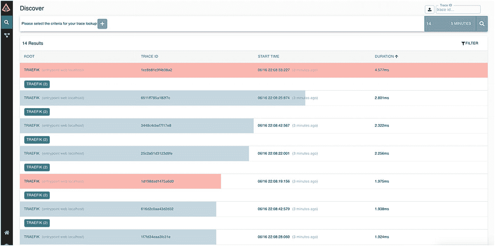

# 5.日志、请求跟踪和指标

业务运营执行应用程序监控。该流程旨在发现并修复应用程序停机，以免影响正常业务运营。传统上，团队执行简单的检查，如流程启动/关闭或端口打开/关闭。但是这些支票还不够好。随着时间的推移，已经开发了许多工具来改进应用程序监控过程。该过程包括捕获使用指标和执行分析。但是，仅仅依靠应用程序监控是一种软弱的做法。应用程序监控只能提供关于持续应用程序问题的通知。下一步是确定*根本原因*。

根本原因主要与上下文有关:一个新特性出现故障，或者规范中遗漏了一些控件，或者用户正在执行一个有效的请求，导致“内存不足”，等等。我们无法仅通过查看通知得出结论。我们需要更多的信息来确定根本原因。这就是所谓的*失败背景*。

上下文是通过首先查看应用程序日志(如果有)来创建的。堆栈跟踪提供了可能的错误的线索，但是错误是由特定的边缘场景引起的。这些边缘场景由用户数据和应用程序状态定义。如果已经捕获了用户数据，则从请求访问日志中确定用户数据。所有这些说起来容易做起来难。

多年来，企业应用程序环境变得越来越复杂。以前的实践不足以处理停机。Google 推出了*请求追踪*的做法。请求跟踪捕获了跨不同分布式系统的用户请求流。这个互补的过程有助于预测失败的场景和涉及的系统。

总之，日志、度量和跟踪是互补的实践(见图 [5-1](#Fig1) )用于不同的目的。在大修期间，这些实践中没有一个是单独足够的。因此，应用程序监控的简单实践已经从单个应用程序状态转变为整个生态系统的整体视图。这也被称为*可观测性*。可观察性包括度量、日志和跟踪的收集、可视化和分析，以获得对系统运行的整体理解。


图 5-1

可观察性数据

像 Twitter、Google、优步等公司，开创了可观察性，定义了基于以下支柱的完整实践。

*   应用和业务指标

*   日志

*   分布式跟踪

*   警报和通知

*   形象化

Note

与监控相比，可观察性项目*为什么*有问题，监控只是告诉*什么时候*有问题。

作为 API 网关，Traefik 是所有外部发起的用户请求的单一入口点。它必须与企业现有的解决方案集成，以捕获所有的请求流和指标。为了捕获端到端的请求流，Traefik 需要生成请求范围，并将其发送给跟踪后端系统。Traefik 还需要生成访问日志和基于请求的度量，以建立对分布式系统行为的可见性。本章通过一个示例 HTTP 应用程序来讨论这些特性。

## 先决条件

在本章中，我们使用一个 HTTP 服务的例子。我们部署和配置 httpbin 服务( [`https://github.com/postmanlabs/httpbin`](https://github.com/postmanlabs/httpbin) )来服务我们的目的。这是一个开源应用程序。服务是用 Python 写的。我们需要一个 Python 运行时来运行应用程序。部署的服务是使用 Traefik 配置的。

Note

这是一个可选步骤。这是一个用于验证配置更改的示例服务。如果您有正在运行的服务，可以跳过这一步。

首先，检查所需的`python, pip,`和`virtualenv`命令。

```py
~/Projects$ python3 --version
Python 3.8.0

~/Projects$ pip3 --version
pip 19.2.3 from /Library/Frameworks/Python.framework/Versions/3.8/lib/python3.8/site-packages/pip (python 3.8)

~/Projects$ virtualenv --version
16.7.8

```

确保您拥有 Python 和 pip 的 3.x 版本。如果命令失败，您需要安装所需的软件。Python、pip 和 virtualenv 的安装说明超出了本书的范围。

下一步，我们从发布页面 [`https://github.com/postmanlabs/httpbin/releases`](https://github.com/postmanlabs/httpbin/releases) 下载一个版本的 httpbin 服务(见图 [5-2](#Fig2) )。在撰写本文时，0.6.1 是最新的发布版本。


图 5-2

httpbin 版本

下载发布的工件，并将它们解压缩到一个目录中。该目录包含源文件、应用程序许可证、构建文件等等。目的是编译代码并从中获得一个二进制工件。

```py
~/Projects/httpbin-0.6.1$ ls -1
AUTHORS
Dockerfile
LICENSE
MANIFEST.in
Pipfile
Pipfile.lock
Procfile
README.md
app.json
build
dist
httpbin
httpbin.egg-info
setup.cfg
setup.py
test_httpbin.py
tox.ini

```

该服务是使用`setuptools`构建的。您可以部署和运行服务，如下所述。

1.  创建一个虚拟环境，然后激活它。

1.  以`develop`模式构建服务。

    ```py
    (venv) ~/Projects/httpbin-0.6.1$ python setup.py develop
    running develop
    running egg_info
    writing httpbin.egg-info/PKG-INFO
    ####                     ####
    #### removed for brevity ####
    ####                     ####
    /Users/rahulsharma/Projects/httpbin-0.6.1/venv/bin
    Using /Users/rahulsharma/Projects/httpbin-0.6.1/venv/lib/python3.8/site-packages
    Finished processing dependencies for httpbin==0.6.1
    (venv) ~/Projects/httpbin-0.6.1$

    ```

2.  在 Gunicorn 中部署应用程序`.`

```py
~/Projects/httpbin-0.6.1$ virtualenv venv
Using base prefix '/Library/Frameworks/Python.framework/Versions/3.8'
New python executable in /Users/rahulsharma/Projects/httpbin-0.6.1/venv/bin/python3.8
Also creating executable in /Users/rahulsharma/Projects/httpbin-0.6.1/venv/bin/python
Installing setuptools, pip, wheel...
done.
~/Projects/httpbin-0.6.1$ source venv/bin/activate
(venv) ~/Projects/httpbin-0.6.1$

```

```py
(venv) ~/Projects/httpbin-0.6.1$ gunicorn -b 0.0.0.0 httpbin:app
[2020-06-12 14:35:04 +0530] [67528] [INFO] Starting gunicorn 20.0.4
[2020-06-12 14:35:04 +0530] [67528] [INFO] Listening at: http://0.0.0.0:8000 (67528)
[2020-06-12 14:35:04 +0530] [67528] [INFO] Using worker: sync
[2020-06-12 14:35:04 +0530] [67530] [INFO] Booting worker with pid: 67530

```

httpbin 服务现在正在我们的系统上运行。您可以在`http://localhost:8000`访问它(参见图 [5-3](#Fig3) )。您还可以测试一些可用的端点。


图 5-3

httpbin 服务

### 流量配置

在上一节中，我们添加了一个 HTTP 服务。现在让我们配置 Traefik 向它发送用户请求。我们将为 web 应用程序创建以下带有入口点的`treafik.yml`。

```py
entryPoints :
  web :
    address : ":80"

providers :

    directory : /Users/rahulsharma/Projects/traefik-book/ch05/services
    watch : true
    filename : config
    debugLogGeneratedTemplate : true

api :
  insecure : true
  dashboard : true

```

在之前的配置中，Traefik 正在侦听端口 80。接下来，让我们为部署的 httpbin 应用程序定义路由和服务。

```py
 http :
  routers :
    guest-router :
      entryPoints :
      - web
      rule : Host(`localhost`)
      service : httpbin-service

  services :
    httpbin-service :
      loadBalancer :
        servers :
        - url  : http://192.168.1.4:8000/

```

此配置向运行在 192.168.1.4 实例上的 httpbin 发送请求。这个配置需要复制到`services`文件夹作为`config.yml.`在这之后，你可以查找 http://localhost。浏览器应该加载应用程序。展开的配置可以在 Traefik 仪表板上看到(参见图 [5-4](#Fig4) )。


图 5-4

httpbin 入口点的仪表板

## 特拉菲克日志

Traefik 报告有关遇到的问题的信息。默认情况下，Traefik 将这些报告给标准输出。这些报告的问题对应于 Traefik 应用程序中的事件。信息以不同的严重级别报告。您可以通过添加`log`配置来配置 Traefik 日志。该配置可以设置特定文件的日志记录。它还可以指定消息的最低严重级别。

```py
entryPoints :
  web :
    address : ":80"

providers :
  # removed for Brevity

log:
  level: INFO
  filePath: traefik.json.log
  format: json

```

该代码执行以下操作。

*   将日志定向到当前工作目录中的`tarefik.json.log`文件

*   将默认日志级别更改为 INFO `,`,它写入致命、错误、警告和信息级别的消息

*   以 JSON 格式记录消息

默认情况下，Traefik 以通用日志格式写入所有消息。或者，您可以将其更改为 JSON 格式，如图所示。Traefik 可以报告调试、信息、警告、错误和致命级别的日志消息。配置较低的级别可以报告高于配置级别的所有严重级别。

定义的代码是用于启动 Traefik 的静态配置的一部分。Traefik 不会自动加载这些更改。进行更改后，重新启动服务器。您可以如下所示跟踪日志文件。

```py
ch05 $ tail -f traefik.json.log
{"level":"info","msg":"Traefik version 2.2.0 built on 2020-03-25T17:17:27Z","time":"2020-06-13T20:27:08+05:30"}
{"level":"info","msg":"\nStats collection is disabled.\nHelp us improve Traefik by turning this feature on :)\nMore details on: https://docs.traefik.io/contributing/data-collection/\n","time":"2020-06-13T20:27:08+05:30"}
{"level":"error","msg":"unsupported access log format: \"foobar\", defaulting to common format instead.","time":"2020-06-13T20:27:08+05:30"}
{"level":"error","msg":"Failed to create new HTTP code ranges: strconv.Atoi: parsing \"foobar\": invalid syntax","time":"2020-06-13T20:27:08+05:30"}
{"level":"info","msg":"Starting provider aggregator.ProviderAggregator {}","time":"2020-06-13T20:27:08+05:30"}
{"level":"info","msg":"Starting provider *file.Provider {\"directory\":\"/Users/rahulsharma/Projects/traefik-book/ch05/code\",\"watch\":true,\"filename\":\"config\",\"debugLogGeneratedTemplate\":true}","time":"2020-06-13T20:27:08+05:30"}
{"level":"info","msg":"Starting provider *traefik.Provider {}","time":"2020-06-13T20:27:08+05:30"}

```

### 访问日志

Traefik 可以报告有关客户端请求的信息。处理完请求后，信息被写入`access log`。但是`access log`不是默认创建的。`access log`配置设置对特定文件的日志记录。但是默认访问日志是以通用日志格式编写的。可以将其配置为以 JSON 格式报告。

```py
# Removed for Brevity

log:
  level: INFO
  filePath: traefik.json.log
  format: json

accessLog:
  filePath: access.json.log
  format: json

```

该代码执行以下操作。

*   将访问日志定向到当前工作目录中的`access.json.log`文件

*   以 JSON 格式记录消息

添加上述配置后，重新启动 Traefik 服务器。当我们访问 http://localhost/时，会生成以下访问日志。

```py
logs $ tail -f access.json.log
{"ClientAddr":"[::1]:63226","ClientHost":"::1","ClientPort":"63226","ClientUsername":"-","DownstreamContentSize":12026,"DownstreamStatus":200,"Duration":28245000,"OriginContentSize":12026,"OriginDuration":28187000,"OriginStatus":200,"Overhead":58000,"RequestAddr":"localhost","RequestContentSize":0,"RequestCount":1,"RequestHost":"localhost","RequestMethod":"GET","RequestPath":"/","RequestPort":"-","RequestProtocol":"HTTP/1.1","RequestScheme":"http","RetryAttempts":0,"RouterName":"httpbin-router@file","ServiceAddr":"192.168.1.4:8000","ServiceName":"httpbin-service@file","ServiceURL":{"Scheme":"http","Opaque":"","User":null,"Host":"192.168.1.4:8000","Path":"/","RawPath":"","ForceQuery":false,"RawQuery":"","Fragment":""}
#### TRUNCATED }

```

访问日志包含各种信息。使用以下报告的属性有助于确定停机和缓慢响应时间。

*   `Duration`:处理一个请求所花费的总时间

*   `OriginDuration`:从建立连接到从上游服务器接收到响应体的最后一个字节所花费的时间

*   `Overhead`:从上游服务器收到的响应和发送回客户端的响应之间的时间差

*   `OriginStatus`:上游服务器发送的响应码

```py
   "Duration":28245000,
   "OriginContentSize":12026,
   "OriginDuration":28187000,
   "OriginStatus":200,
   "Overhead":58000,

```

因为访问日志是在请求处理之后写入的，所以会增加开销。但是可以通过为日志消息配置缓冲区来优化日志开销。缓冲区支持日志消息的异步写入，而不是请求后写入。缓冲区指定 Traefik 在将日志行写入所选输出之前保留在内存中的日志行数。要启用缓冲区，请配置`buffersize`属性。

Note

访问日志是仅用于 HTTP 服务的全局配置。这不是入口点或特定于路由的配置。启用后，Traefik 会为所有入口点/用户请求生成日志。

#### 日志过滤器

Traefik 访问日志描述了服务器处理的每个请求。信息很详细。如果服务器正在处理许多用户请求，访问日志会增长得非常快。大量信息很快变得无人管理。或者，您可以根据预配置的标准记录选择性请求。这确保了我们只查看相关的用户请求。它从访问日志中排除无关紧要的日志条目。使用 filters 属性启用选择性日志记录。过滤器属性提供了以下三个选项。

*   `statusCodes`:仅记录指定的响应代码列表。

*   `retryAttempts`:有重试尝试时的日志

*   `minDuration`:当请求花费的时间超过指定时间时记录日志

```py
# Removed for Brevity

accessLog:
  filePath: logs/access.json.log
  format: json
  bufferingSize: 50
  filters:
    statusCodes:
      - 200
      - 300-302
    retryAttempts: true
    minDuration: 5s

```

当下列任一条件为真时，此代码写入访问日志。

*   响应代码是 200/300/301/302

*   使用断路来撤回请求

*   请求时间超过 5 秒

访问`http://localhost/`应该生成一条日志消息，因为状态代码是 200。现在接入`http://localhost/status/418`。不应该有任何日志语句。

```py
logs $ tail -f access.json.log
{"ClientAddr":"[::1]:64020","ClientHost":"::1","ClientPort":"64020","ClientUsername":"-","DownstreamContentSize":12026,"DownstreamStatus":200,"Duration":27516000,"OriginContentSize":12026,"OriginDuration":27467000,"OriginStatus":200,"Overhead":49000,"RequestAddr":"localhost","RequestContentSize":0,"RequestCount":1,"RequestHost":"localhost","RequestMethod":"GET","RequestPath":"/","RequestPort":"-","RequestProtocol":"HTTP/1.1","RequestScheme":"http","RetryAttempts":0,"RouterName":"httpbin-router@file","ServiceAddr":"192.168.1.4:8000","ServiceName":"httpbin-service@file"...... TRUNCATED }

```

#### 日志字段

之前，我们讨论了如何登录响应标准。但是 Traefik 也可以配置为在日志语句中报告选择性信息。您可能需要隐藏用户身份、删除敏感信息或优化日志。Traefik 日志信息由以下两种类型组成。

*   请求头:用户在请求中传递的头

*   字段:Traefik 添加的附加信息

这两种信息类型都具有可由以下选项控制的属性。

*   `keep`在日志中按原样报告信息。

*   `drop`从日志中删除信息。

*   `redact`替换和屏蔽日志中的信息。

```py
accessLog:
  filePath: logs/access.json.log
  format: json
  bufferingSize: 50
  fields:
    defaultMode: keep
    names:
      ClientUsername: drop
    headers:
      defaultMode: keep
      names:
          User-Agent: redact
          Authorization: drop
          Content-Type: keep

```

在这段代码中，我们配置了以下内容。

*   `defaultmode`的`keep`值允许报告字段和标题。

*   `defaultmode`的`keep`值启用报告标题。

*   `ClientUsername`的`drop`值将其从日志中删除。

*   `Content-Type`和`Authorization`的`drop`值从日志中删除这些头。

*   `User-Agent`的`redact`值将该值报告为`redacted`。

添加上述配置后，重新启动 Traefik 服务器。当您访问 http://localhost/时，会生成以下访问日志。

```py
logs $ tail -f access.json.log
{"ClientAddr":"[::1]:49537","ClientHost":"::1","ClientPort":"49537",

 <!-- REMOVED for Brevity -->

,"origin_X-Processed-Time":"0","request_Accept":"text/html,application/xhtml+xml,application/xml;q=0.9,image/webp,image/apng,*/*;q=0.8,application/signed-exchange;v=b3;q=0.9","request_Accept-Encoding":"gzip, deflate, br","request_Accept-Language":"en-US,en;q=0.9","request_Cache-Control":"max-age=0","request_Connection":"keep-alive","request_Sec-Fetch-Dest":"document","request_Sec-Fetch-Mode":"navigate","request_Sec-Fetch-Site":"none","request_Sec-Fetch-User":"?1","request_Upgrade-Insecure-Requests":"1","request_User-Agent":"REDACTED","request_X-Forwarded-Host":"localhost","request_X-Forwarded-Port":"80","request_X-Forwarded-Proto":"http","request_X-Forwarded-Server":"XE-GGN-IT-02498.local","request_X-Real-Ip":"::1","time":"2020-06-14T16:35:18+05:30"}

```

Note

Traefik 报告了大约 25 个附加字段。Traefik 文档中提供了字段列表。

### 原木旋转

生产部署的应用程序更喜欢日志轮换策略。这有助于在清除历史日志时优化磁盘使用。但是默认情况下 Traefik 日志不会循环。因此，我们需要使用系统程序来执行日志管理。日志管理涉及归档和清除活动。根据操作系统的不同，有不同的程序来完成这项工作。在 FreeBSD 系统上，可以使用`newsyslog`，而在 Linux 上，可以使用`logrotate`。它们都依赖于发送 USR1 信号来旋转日志。在下面的讨论中，我们和`newsyslog`一起工作。概述的步骤对于任何其他程序都是一样的。

FreeBSD 中包含的`newsyslog`实用程序会循环使用，并在必要时归档日志文件。程序需要输入一个配置文件。该文件标识需要处理哪些日志文件。它提供了一组不同的属性，可以描述文件权限、复制行为、存档数量等。通过使用类似`crontab`的调度程序，该程序被配置为定期运行。让我们在名为 syslog.conf 的文件中创建以下配置。

```py
/Users/rahulsharma/Projects/traefik-book/ch05/logs/access.json.log    rahulsharma:staff    640  5    500    *     Z

```

在这个配置中，我们为`acces.json.log`配置了日志轮转。

*   将文件所有者和组设置为`rahulsharma:staff`。这适用于压缩文件和新的日志文件。

*   将文件权限设置为 640。

*   文件只有五次旋转。

*   当大小增长到 500，000 以上时，会发生旋转。

*   Z 标志配置压缩文件。

您可以使用下面的命令用描述的配置运行`newsyslog`。

```py
code $ sudo newsyslog -vf  syslog.conf
/Users/rahulsharma/Projects/traefik-book/ch05/logs/access.json.log <5Z>: size (Kb): 532 [500] --> trimming log....
Signal all daemon process(es)...
Notified daemon pid 91 = /var/run/syslog.pid
Pause 10 seconds to allow daemon(s) to close log file(s)
Compress all rotated log file(s)...

```

Note

前面的过程不适用于 Windows，因为缺少 USR 信号，所以没有 log rotate 程序。

### 黑名单

Traefik 通过使用中间件来提供对反向列表的支持。我们在第 2 章中讨论了中间件。它们被配置为路由器的一部分。中间件在规则匹配之后但在将请求转发给服务之前执行。Traefik 通过配置`ipWhiteList`中间件支持 IP 反向列表。可以使用以下选项进行配置。

*   `sourceRange`:以 CIDR 格式描述允许的 IP 集合

*   `ipstrategy`:描述如何从`X-forward-for`头识别客户端 IP

```py
http :
  routers :
    httpbin-router :
      entryPoints :
      - web
      rule : HostRegexp(`{name:.*}`)
      middlewares :
      - allowed-sources
      service : httpbin-service

  middlewares:
    allowed-sources:
      ipWhiteList:
        sourceRange:
          - "127.0.0.1/32"

  services :
  # Removed for Brevity

```

在前面的代码中，我们执行了以下操作。

*   我们将`router rule`修改为允许所有主机名使用正则表达式。这是使用`HostRegexp`函数而不是`Host`操作符来完成的。

*   我们添加了带有已配置的`ipWhiteList`中间件名称的中间件部分。

*   我们用`ipWhiteList.`的配置配置了中间件部分

*   我们使用`sourceRange`选项添加了允许的 IP 列表。

现在让我们运行配置。访问 http://localhost/页面以访问 httpbin 服务。

```py
$ curl -v http://localhost/
*   Trying ::1...
* TCP_NODELAY set
* Connected to localhost (::1) port 80 (#0)
> GET / HTTP/1.1
> Host: localhost
> User-Agent: curl/7.64.1
> Accept: */*
>
< HTTP/1.1 403 Forbidden
< Date: Sat, 20 Jun 2020 17:41:11 GMT
< Content-Length: 9
< Content-Type: text/plain; charset=utf-8
<
* Connection #0 to host localhost left intact
Forbidden* Closing connection 0

```

我们得到一个被禁止的回应。这是因为我们的本地主机域被解析为 IP6 环回地址(::1)。环回地址不在白名单中。或者，您可以使用 IP4 环回地址(127.0.0.1)来访问。这将按预期加载页面。访问日志中会报告禁止的访问。确保从静态配置中删除基于状态代码的日志过滤器。

```py
{"ClientAddr":"[::1]:64616","ClientHost":"::1","ClientPort":"64616","ClientUsername":"-","DownstreamContentSize":9,"DownstreamStatus":403,"Duration":128000,"OriginContentSize":9,"OriginDuration":79000,"OriginStatus":403,"Overhead":49000,"RequestAddr":"localhost","RequestContentSize":0,"RequestCount":63,"RequestHost":"localhost","RequestMethod":"GET","RequestPath":"/","RequestPort":"-","RequestProtocol":"HTTP/1.1","RequestScheme":"http","RetryAttempts":0,"RouterName":"httpbin-router@file","StartLocal":"2020-06-20T23:11:01.21434+05:30","StartUTC":"2020-06-20T17:41:01.21434Z","entryPointName":"web","level":"info","msg":"","time":"2020-06-20T23:11:01+05:30"}

```

## 请求跟踪

你学到了可观察性是一种多样的实践。请求跟踪或分布式跟踪是分析应用程序行为的重要支柱。它通常应用于分布式系统，以预测跨不同系统的请求处理是如何发生的。它可以指出导致性能问题或请求处理失败的应用程序。

简而言之，分布式跟踪映射了系统处理请求的流程。处理流是在一个被称为*请求跨度*的构建块上创建的。请求跨度表示服务处理所花费的时间。所有处理请求的服务都生成各自的跨度。然后，这些跨度被组合成整个请求的单个分布式跟踪。

作为 API 网关，Traefik 接收不同应用程序的传入请求。它是所有外部请求的单一入口点。Traefik 必须支持请求跨度的生成。生成的请求跨度作为请求头传播到应用程序。反过来，应用程序必须进一步传播这些头。Traefik 生成以下 B3 跟踪头。

*   x-b3-traceid

*   x-b3 西班牙语

*   x-b3 亲西班牙语

*   x-B3-采样

这些跨度被发送到跟踪后端服务。该服务负责存储和处理这些信息。Traefik 支持几个 OpenTracing 后端，如 Zipkin、Datadog 和 Jagger。在本节中，我们将使用 Zipkin。其他后端也需要类似的配置。

### 安装 Zipkin

Zipkin 是一个用 Java 构建的开源跟踪收集引擎。它不仅支持跟踪收集，还提供了可视化跟踪的仪表板。还有其他允许您分析请求流的特性。由于 Zipkin 是开源的，所以它提供了可以为目标平台编译的代码。或者，我们直接运行一个发布的二进制文件。使用以下命令可以下载 Zipkin 的最新版本。

```py
code $curl -sSL https://zipkin.io/quickstart.sh | bash -s
Thank you for trying Zipkin!
This installer is provided as a quick-start helper, so you can try Zipkin out
without a lengthy installation process.

Fetching version number of latest io.zipkin:zipkin-server release...
Latest release of io.zipkin:zipkin-server seems to be 2.21.4

Downloading io.zipkin:zipkin-server:2.21.4:exec to zipkin.jar...

```

下载完`zipkin.jar`后，使用下面的命令运行它。

```py
code $ java -jar zipkin.jar
2020-06-20 21:57:31.012  INFO 47685 --- [           main] z.s.ZipkinServer                         : Starting ZipkinServer on XE-GGN-IT-02498.local with PID 47685 (/Users/rahulsharma/Projects/trafik/code/zipkin.jar started by rahulsharma in /Users/rahulsharma/Projects/trafik/code)
2020-06-20 21:57:31.016  INFO 47685 --- [           main] z.s.ZipkinServer                         : The following profiles are active: shared
2020-06-20 21:57:32.040  INFO 47685 --- [           main] c.l.a.c.u.SystemInfo                     : hostname: xe-ggn-it-02498.local (from 'hostname' command)
2020-06-20 21:57:32.537  INFO 47685 --- [oss-http-*:9411] c.l.a.s.Server                           : Serving HTTP at /0:0:0:0:0:0:0:0:9411 - http://127.0.0.1:9411/
2020-06-20 21:57:32.538  INFO 47685 --- [           main] c.l.a.s.ArmeriaAutoConfiguration         : Armeria server started at ports: {/0:0:0:0:0:0:0:0:9411=ServerPort(/0:0:0:0:0:0:0:0:9411, [http])}

```

服务器已启动并运行在 9411 端口上。您可以在`http://localhost:9411/`访问其仪表盘。


图 5-5

Zipkin 仪表板

### 集成 Zipkin

Traefik 与 Zipkin 的集成非常简单。我们只需要提供 Zipkin API 的位置。这些参数是 Traefik 静态配置的一部分。Traefik 还提供以下属性来自定义跟踪行为。

*   `sameSpan`:为 RPC 调用配置一个 span

*   `id128Bit`:生成 128 位跟踪 id

*   `samplerate`:被追踪请求的百分比

```py
# Removed for Brevity

tracing:
  zipkin:
    httpEndpoint: http://localhost:9411/api/v2/spans
    id128Bit : true
    sameSpan: true

```

在这个配置中，我们提供了 Zipkin API 的位置。我们还为 RPC 客户端和服务器配置了具有相同跨度的 128 位跟踪。现在重新启动服务器。

```py
ch05 $ traefik  --configfile traefik.yml
INFO[0000] Configuration loaded from file: /Users/rahulsharma/Projects/traefik-book/ch05/traefik.yml

```

您可以在 Traefik 仪表板中验证配置(参见图 [5-6](#Fig6) )。它应该报告在应用程序中配置了哪个跟踪后端。


图 5-6

跟踪仪表板状态

Note

跟踪是在全局级别启用的。一旦启用，它将为所有请求生成跟踪，包括仪表板 API。

现在，让我们提几个要求。httpbin 应用程序(见图 [5-7](#Fig7) )提供了几种请求类型。尝试加载 IP、状态代码和重定向请求。Traefik 生成请求跟踪，并将其发送给部署的 Zipkin。


图 5-7

httpbin 应用程序

你可以跟踪访问日志。Traefik 记录所有传递的请求头，包括生成的 B3 头。

```py
  {
   # Removed for Brevity

   "request_User-Agent":"REDACTED",
   "request_X-B3-Parentspanid":"12f1ca6cf7671169",
   "request_X-B3-Sampled":"1",
   "request_X-B3-Spanid":"1704e2a62f95fa8b",
   "request_X-B3-Traceid":"12f1ca6cf7671169",
  }

```

Traefik 集成由以下步骤组成。

*   基于配置的采样率为请求生成 TraceId 和 Span

*   将跟踪头转发给服务应用程序

*   根据响应代码更新跨度

*   将生成的跟踪范围发送到跟踪后端

现在，您可以加载 Zipkin 仪表板了。仪表板提供了一个 UI 来可视化请求跟踪。您可以搜索过去 15 分钟内的请求。结果页面应该如下所示。tracer/Zipkin 仪表板(见图 [5-8](#Fig8) )用蓝色标记所有带有 2XX 或 3XX 回路的轨迹。但是返回代码 4XX /5XX 显示为红色。



图 5-8

请求跟踪

## 特拉菲克指标

Traefik 可以生成应用程序级别的指标。这些指标必须在后台服务中捕获，以便进行监控和警报通知。Traefik 支持使用最广泛的度量解决方案，如 StatsD、Datadog、Prometheus 等。在当前部分，我们与 Prometheus 合作，作为一家有指标支持的商店。Prometheus 是一个使用 Golang 构建的开源解决方案。Prometheus 可以从 Traefik 中暴露的端点获取指标。它还提供了一个可视化指标的仪表板。普罗米修斯的细节超出了本书的范围。

让我们首先通过添加相关配置来启用 Traefik 指标。需要将配置添加到静态配置文件中。Traefik 提供了以下选项。

*   存储桶:定义响应延迟的存储桶

*   `addEntryPointLabels`:向请求度量添加入口点名称

*   `addServiceLabels`:将服务名添加到请求度量中

*   `entryPoint`:命名配置为发布度量的入口点

*   `manualrouting`:为 prometheus@internal 服务启用自定义路由器

```py
entryPoints :
  web :
    address : ":80"

# Removed for Brevity

metrics:
  prometheus:
     addEntryPointsLabels: true
     addServicesLabels : true

```

此配置在默认端点上启用指标。这些指标在`http://locahost:8080/metrics`生成。重新启动服务器并验证 Traefik 仪表板上的配置。


图 5-9

启用指标

### 配置普罗米修斯

现在我们需要在 Prometheus 中捕获生成的指标。让我们从使用发布页面( [`https://prometheus.io/download/`](https://prometheus.io/download/) )下载最新版本开始。您可以解压缩该版本。但是在启动 Prometheus 服务器之前，我们需要配置端点，这个端点需要报废。这可以通过更新捆绑的`prometheus.yml`来完成

```py
# my global config
global:
  scrape_interval:     15s # Set the scrape interval to every 15 seconds. Default is every 1 minute.
  evaluation_interval: 15s # Evaluate rules every 15 seconds. The default is every 1 minute.
  # scrape_timeout is set to the global default (10s).

### REMOVED for BREVITY

    static_configs:
    - targets: ['localhost:8080']

```

在此配置中，Traefik 端点(localhost:8080)被添加到目标列表中。Prometheus 使用`http:// localhot:8080/metrics`查找指标。现在使用下面的命令启动 Prometheus。

```py
prometheus-2.19.1.darwin-amd64 $ ./prometheus
level=info ts=2020-06-21T06:14:37.958Z caller=main.go:302 msg="No time or size retention was set so using the default time retention" duration=15d
level=info ts=2020-06-21T06:14:37.959Z caller=main.go:337 msg="Starting Prometheus" version="(version=2.19.1, branch=HEAD, revision=eba3fdcbf0d378b66600281903e3aab515732b39)"
level=info ts=2020-06-21T06:14:37.959Z caller=main.go:338 build_context="(go=go1.14.4, user=root@62700b3d0ef9, date=20200618-16:45:01)"
level=info ts=2020-06-21T06:14:37.959Z caller=main.go:339 host_details=(darwin)
level=info ts=2020-06-21T06:14:37.959Z caller=main.go:340 fd_limits="(soft=2560, hard=unlimited)"
level=info ts=2020-06-21T06:14:37.959Z caller=main.go:341 vm_limits="(soft=unlimited, hard=unlimited)"
level=info ts=2020-06-21T06:14:37.960Z caller=main.go:678 msg="Starting TSDB ..."
level=info ts=2020-06-21T06:14:37.960Z caller=web.go:524 component=web msg="Start listening for connections" address=0.0.0.0:9090

```

我们可以使用`http://locahost:9090/`加载普罗米修斯仪表板。指标下拉菜单有不同的选项，前缀为`traefik_`。我们加载`traefik_entrypoint_requests_total`度量。它描述了 Traefik 处理的请求总数。此外，您还可以使用以下 bash 脚本向 Traefik 发送几个请求。

```py
$ for ((i=1;i<=10000;i++)); do   curl -v --header "Connection: keep-alive" "localhost"; done

```

该脚本向 Traefik 服务器发送大约 10，000 个请求。最后，您可以查看普罗米修斯仪表盘(见图 [5-10](#Fig10) )，它捕捉到了流量的增长。


图 5-10

请求流量度量

## 摘要

本章讨论了可观测性。我们讨论了它的三个支柱:错误日志、请求跟踪和应用程序度量。首先，我们配置了错误日志。这些日志捕获关于 Traefik 中发生的任何错误的信息。下一步，我们配置了访问日志。访问日志捕获由 Traefik 处理的传入请求。随着传入请求的增加，访问日志会迅速膨胀。

我们讨论了通过使用过滤器、旋转和标题屏蔽来管理它的方法。我们还配置了`IPwhitelist`中间件，并捕获了它生成的禁止日志。之后，我们使用 Zipkin 启用了请求跟踪。Traefik 生成用于跟踪的 B3 标头。这些标题可以在访问日志中看到。

您查看了流程流，并在 Zipkin 仪表板中生成了跟踪。最后，我们启用了 Traefik 指标，并在 Prometheus 中捕获了它们。Traefik 支持许多用于跟踪和度量的后端存储。以齐普金和普罗米修斯为例来说明其集成。这些工具在像微服务这样的分布式架构中很有帮助。

在下一章中，您将使用微服务的 Traefik 支持。