# 6.用于微服务的 Traefik

在第 [1](1.html) 章中，我们讨论了微服务架构。企业越来越多地从整体架构转向利用微服务架构。但是微服务系统是一个分布式系统。为了有效地使用它，我们需要采用额外的基础设施组件。这些附加组件规定了每个微服务必须遵循的一套新准则。

微服务架构提倡粒度服务来满足不断发展的业务需求。根据不断变化的业务需求，开发团队可以创建或组合服务。此外，在生产环境中，每个服务都是独立部署和扩展的。基于云的自动伸缩通常基于服务负载复制实例。因此，架构处于不断的演进中，并且没有微服务的最终状态列表。

动态生态系统需要最新运行的微服务的目录。这也被称为*服务注册中心*。简而言之，注册中心是一个包含服务实例和相应位置细节的服务数据库。为了有效地工作，服务必须在启动时注册，在关闭时删除。有许多方法可以实现这一点，但是服务自注册的过程是推荐的机制。

服务在注册中心注册后，客户机需要查找相同的服务。这个客户端过程被称为服务发现(见图 [6-1](#Fig1) )。客户端首先查询服务注册中心来查找服务的可用实例。获得活动服务实例列表后，客户端可以向所需的服务发送请求。

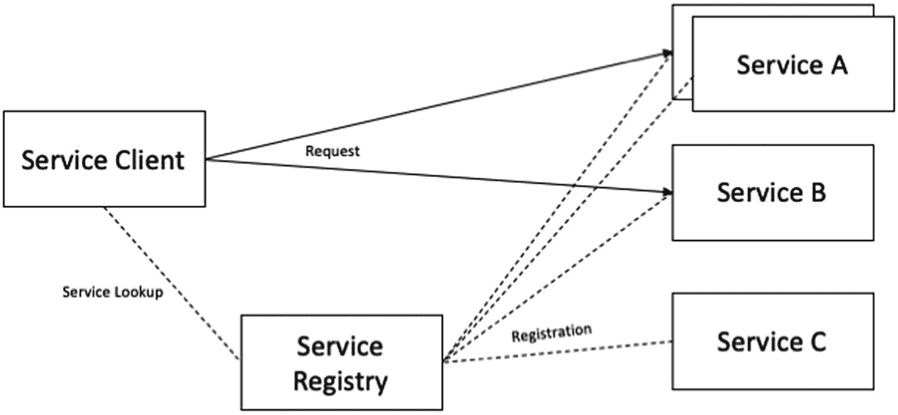

图 6-1

服务注册和服务发现

服务注册中心通常是信息的键值存储。很多时候，您必须注册关于服务的附加信息。这些信息可能与多租户系统中的客户端类型有关，也可能与所提供的视图有关，比如 web 或 mobile，或者其他任何信息。每个服务负责将这些数据添加到存储中。在本章中，我们使用服务自注册机制来集成 Traefik 和微服务。

微服务架构推荐服务协作。这意味着一个服务可以调用其他服务来获取用户请求所需的数据。但是这个机制有它自己的一系列问题。当一个服务同步调用另一个服务时，总有可能另一个服务不可用，或者表现出很高的延迟，以至于基本上不可用。

在等待其他服务响应时，调用方可能会消耗线程等宝贵的资源。这可能会导致资源耗尽，从而使调用服务无法处理其他请求。

一个服务的失败可能会影响整个应用程序中的其他服务。这个问题可以通过在应用设计中采用断路器来解决(见图 [6-2](#Fig2) )。当连续失败的次数超过阈值时，断路器跳闸，并且在超时期间，所有调用远程服务的尝试都会立即失败。

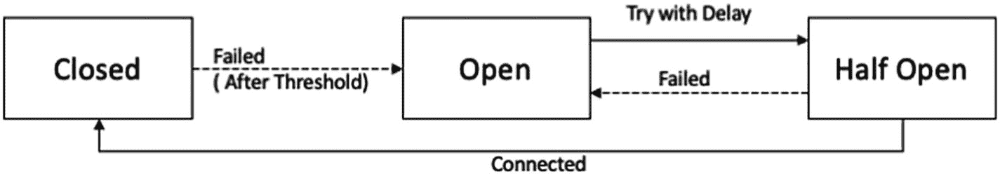

图 6-2

断路器模式

超时后，断路器允许有限数量的测试请求通过。如果这些请求成功，断路器恢复正常运行。否则，如果出现故障，超时周期将重新开始。在本章中，我们在调用 Traefik 的不同微服务时集成断路器。

API 网关是任何基于微服务的架构的重要组成部分。诸如身份验证、负载平衡、依赖关系解析、数据转换和动态请求调度等跨领域的问题可以方便而通用地处理。然后，微服务可以专注于特定的任务，而无需重复代码。这使得每个微服务的开发更加容易和快速。

实现一个 API 网关，它是所有客户端的单一入口点。API 网关以两种方式之一处理请求。一些请求被代理/路由到适当的服务。它通过分散到多个服务来处理其他请求。在前面的章节中，我们为单一服务的需求配置了 Traefik。在本章中，我们将 Traefik 配置为微服务网关。

## pet-临床应用

在本章中，我们需要一个基于微服务的应用程序。应用程序必须至少有两个或更多与 Traefik 集成的微服务。我们使用 PetClinic 应用程序。PetClinic 是一个基于 Java 的应用程序，它与 Spring 框架打包在一起，用于学习目的。Spring 社区维护这个应用程序。它详细解释了基于 Spring 框架的技术。因此，该应用程序是企业技术的良好测试平台。

PetClinic 应用程序是为兽医诊所的需要而设计的。该应用程序使其用户能够查看和管理兽医、客户和他们的宠物。该应用程序支持以下用例。

*   查看兽医及其专业的列表

*   查看宠物主人的信息

*   更新宠物主人的信息

*   在系统中添加一个新的宠物主人

*   查看宠物的信息

*   更新宠物的信息

*   向系统中添加新宠物

*   查看宠物的访问历史信息

*   向宠物的访问历史记录中添加有关访问的信息

该解决方案需要使用微服务架构来构建。让我们从 [`https://github.com/rahul0208/spring-petclinic-microservices`](https://github.com/rahul0208/spring-petclinic-microservices) 下载 PetClinic 应用程序。

Spring PetClinic 微服务是围绕小型独立服务(几百行代码)构建的，运行在自己的 JVM 中，通过 REST API 在 HTTP 上通信。这些微服务都是用 Java 写的。三个客户、vet 和访问业务微服务中的每一个都是 Spring Boot 意义上的应用。为了在分布式环境中工作，这些微服务依赖于 Spring Cloud 提供的一组工具:集中配置管理、自动发现其他微服务和负载平衡(见图 [6-3](#Fig3) )。应用 UI 用 Angular 开发，部署在 Nginx。Traefik 将执行请求路由。在本章中，我们将构建和部署一个应用程序。书中涵盖了一些重要的方面，但是完整的应用技术细节超出了本书的范围。

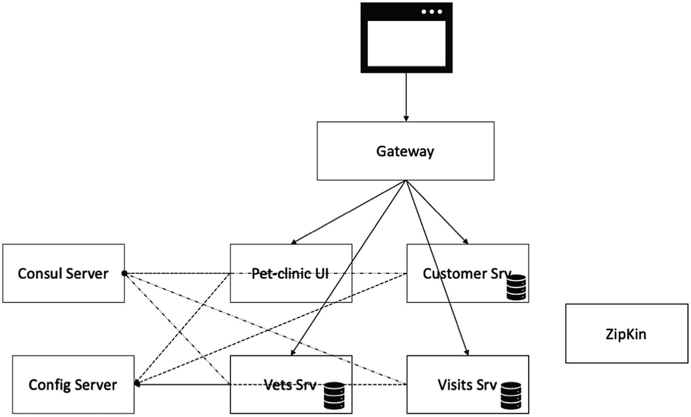

图 6-3

宠物诊所服务

### 应用程序配置

PetClinic 应用程序配置位于 [`https://github.com/rahul0208/spring-petclinic-microservices-config`](https://github.com/rahul0208/spring-petclinic-microservices-config) 。使用 spring-cloud-config 服务器提供配置。配置服务器在以下 REST URLs 上提供配置。

*   /{应用程序}/{个人资料}[/{标签}]

*   /{应用程序}-{个人资料}。阳明海运股份有限公司

*   /{标签}/{应用程序}-{个人资料}。阳明海运股份有限公司

*   /{应用程序}-{个人资料}。性能

*   /{标签}/{应用程序}-{个人资料}。性能

配置服务器还消除了在配置改变的情况下重新打包应用的需求。由于所有最新的配置在列出的 REST 端点上都是可用的，所以我们只需要重启服务。还可以通过使用`@RefreshScope`注释或`EnvironmentChangeEvent`事件监听器来配置热重载服务。

Spring 遵循从`application.properties.`加载应用程序配置的惯例，但是如前所述，当使用 spring-cloud-config 服务器时，`application.properties`不再是应用程序的一部分。相反，spring-cloud-context 被配置为从外部源加载配置属性。它也可以配置为解密外部配置文件中的属性。Spring Cloud 应用程序启动一个 bootstrap 上下文，从 bootstrap.yml 文件中加载它的配置。bootstrap.yml 文件非常简洁。它包含微服务的名称和配置服务器的 URL。以下是来自 vets-service 微服务的一个例子。

```py
spring:
  cloud:
    config:
      uri: http://localhost:8888
  application:
    name: vets-service

```

我们在配置中指定了 spring-config-server 在 localhost:8888 的位置。vets-service 微服务要求服务器位于上述位置。它查询服务器以确定配置值，然后完成服务器启动。值得注意的是，可以使用 SPRING_CLOUD_CONFIG 这样的环境变量来注入配置服务器的位置。但是不能使用服务注册表来发现它。

### 咨询服务登记处

之前，我们讨论了微服务架构的演进本质。当服务部署在云中时，您很难预测相同微服务的实例数量(取决于负载)或它们部署在哪里(以及它们可以在哪个 IP 和端口上访问)。因此，需要一个服务注册中心。在 PetClinic 应用程序中，我们使用了咨询服务注册中心。启动时，每个微服务都向服务注册表注册自己。注册后，每个服务定期向注册中心提供心跳。这本书并不打算涵盖咨询服务注册的细节。有关更多信息，请参考文档。

现在让我们从 [`www.consul.io/`](http://www.consul.io/) 下载领事。下载后，提取压缩文件并启动服务。

```py
$ ./consul agent -dev
==> Starting Consul agent...
           Version: 'v1.8.0'
           Node ID: '935fccd6-74ca-e62e-c53f-c838de3c3681'
         Node name: 'XE-GGN-IT-02498.local'
        Datacenter: 'dc1' (Segment: '<all>')
            Server: true (Bootstrap: false)
       Client Addr: [127.0.0.1] (HTTP: 8500, HTTPS: -1, gRPC: 8502, DNS: 8600)
      Cluster Addr: 127.0.0.1 (LAN: 8301, WAN: 8302)
           Encrypt: Gossip: false, TLS-Outgoing: false, TLS-Incoming: false, Auto-Encrypt-TLS: false

==> Log data will now stream in as it occurs:

```

我们可以在`http://localhost:8500/ui/dc1/services`加载 Consul UI。(见图 [6-4](#Fig4) )

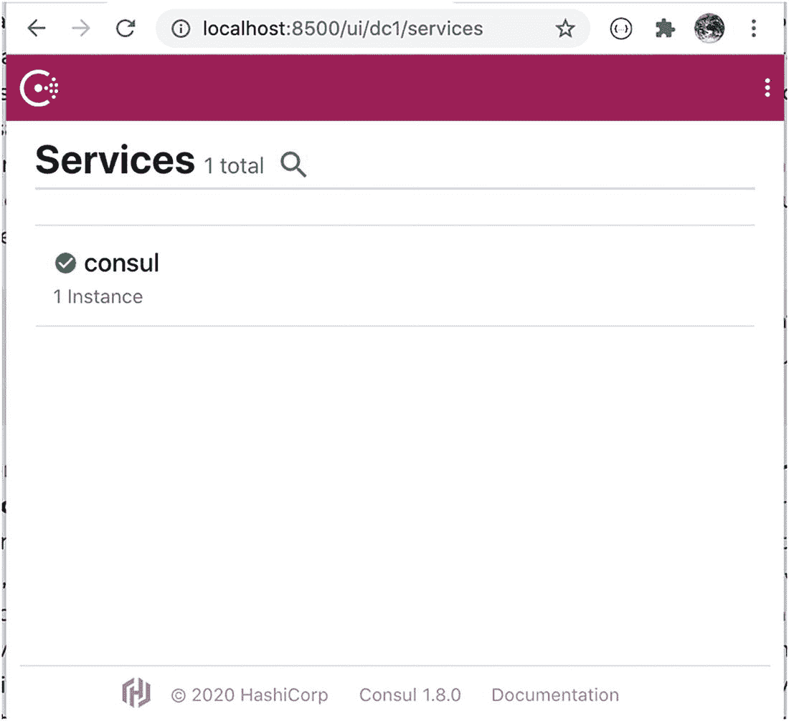

图 6-4

领事服务

### 部署宠物诊所

现在我们可以以任何顺序运行 PetClinic 微服务。该应用程序由以下三个微服务组成。

*   兽医服务

*   探访服务

*   客户服务

所有的服务都基于 Spring Boot。它们被打包成可执行的 JAR 文件。执行特定于服务的 jar 启动带有嵌入式 servlet 引擎的服务。因为服务获取是来自 spring-config 服务器的配置，所以让我们确保我们是 bootstrap.yml 中配置服务器的正确位置。

接下来，确保 config-server 指向正确的 git 位置。在本例中， [`https://github.com/rahul0208/spring-petclinic-microservices-config`](https://github.com/rahul0208/spring-petclinic-microservices-config) 是应用配置源。我们建议您克隆此配置，并根据环境进行更新。

前面的 URL 是在 config-server 的 bootstrap.yml 中配置的。

```py
server.port: 8888
spring:
  cloud:
    config:
      server:
        git:
          uri: https://github.com/spring-petclinic/spring-petclinic-microservices-config
        native:
          searchLocations: file:///${GIT_REPO}

```

配置的细节超出了本书的范围。我们建议您用自己的克隆更新 URI。现在，我们需要使用包 maven 包装器来构建服务。

```py
$ ./mvnw clean install
[INFO] Scanning for projects...
[INFO] --------------------------------------------------------
[INFO] Reactor Build Order:
[INFO]
[INFO] spring-petclinic-microservices                                 [pom]
[INFO] spring-petclinic-customers-service                                 [jar]
[INFO] spring-petclinic-vets-service                                   [jar]
[INFO] spring-petclinic-visits-service                                   [jar]
[INFO] spring-petclinic-config-server                                   [jar]
...
..... Truncated for Brevity

```

该命令在目标文件夹下为每个服务创建一个可执行文件。

```py
$ find  . -type f  -name "*jar"
./spring-petclinic-config-server/target/spring-petclinic-config-server-2.3.1.jar
./spring-petclinic-ui/target/spring-petclinic-ui-2.3.1.jar
./spring-petclinic-vets-service/target/spring-petclinic-vets-service-2.3.1.jar
./.mvn/wrapper/maven-wrapper.jar
./spring-petclinic-customers-service/target/spring-petclinic-customers-service-2.3.1.jar
./spring-petclinic-visits-service/target/spring-petclinic-visits-service-2.3.1.jar

```

在当前设置中，我们将所有服务部署在同一个盒子中。因此，在配置中使用本地主机地址。通过在 git 配置中进行适当的更新，您可以在任何主机上自由部署服务。作为第一步，您需要用下面的命令启动配置服务器。

```py
target $ java -jar spring-petclinic-config-server-2.3.1.jar
2020-07-26 21:56:26.401  INFO 7442 --- [           main] o.s.s.p.config.ConfigServerApplication   : No active profile set, falling back to default profiles: default
2020-07-26 21:56:27.221  INFO 7442 --- [           main] o.s.cloud.context.scope.GenericScope     : BeanFactory id=15cd0375-3bcf-3529-9d02-67397a0dc277
2020-07-26 21:56:27.609  INFO 7442 --- [           main] o.s.b.w.embedded.tomcat.TomcatWebServer  : Tomcat initialized with port(s): 8888 (http)
2020-07-26 21:56:27.621  INFO 7442 --- [           main] o.apache.catalina.core.StandardService   : Starting service [Tomcat]
2020-07-26 21:56:27.621  INFO 7442 --- [           main] org.apache.catalina.core.StandardEngine  : Starting Servlet engine: [Apache Tomcat/9.0.36]
2020-07-26 21:56:27.690  INFO 7442 --- [           main]

```

下一步是运行每个微服务。但是首先让我们确保我们在`application.yml.`中有正确的咨询服务注册地址

```py
spring:
  cloud:
    consul:
      host: localhost
      port: 8500

```

现在让我们用下面的命令启动 vets 服务。

```py
target $ java -jar spring-petclinic-vets-service-2.3.1.jar
2020-07-21 15:34:11.693  INFO [vets-service,,,] 26509 --- [           main] c.c.c.ConfigServicePropertySourceLocator : Fetching config from server at : http://localhost:8888
2020-07-21 15:34:15.525  INFO [vets-service,,,] 26509 --- [           main] c.c.c.ConfigServicePropertySourceLocator : Located environment: name=vets-service, profiles=[default], label=null, version=062fb94b71dc6b99e6518fe7088a0bff3a9431d1, state=null
2020-07-21 15:34:15.527  INFO [vets-service,,,] 26509 --- [           main] b.c.PropertySourceBootstrapConfiguration : Located property source: [BootstrapPropertySource {name='bootstrapProperties-configClient'}, BootstrapPropertySource {name='bootstrapProperties-https://github.com/spring-petclinic/spring-petclinic-microservices-config/vets-service.yml (document #1)'}, BootstrapPropertySource {name='bootstrapProperties-https://github.com/spring-petclinic/spring-petclinic-microservices-config/vets-service.yml (document #0)'}, BootstrapPropertySource {name='bootstrapProperties-https://github.com/spring-petclinic/spring-petclinic-microservices-config/application.yml (document #0)'}]
- Start completed.

```

同样，我们需要启动客户服务和访问服务。每个服务都在 Consul 服务注册表中注册自己。您可以在咨询仪表板中验证服务详情(参见图 [6-5](#Fig5) )。此外，这些服务中的每一个都可能报告基于 Zipkin 的请求跟踪失败。请求跟踪提供了各种好处。在第 5 章[中，我们介绍了这些工具与 Traefik 的集成。我们在本章中不讨论这些集成。](5.html)

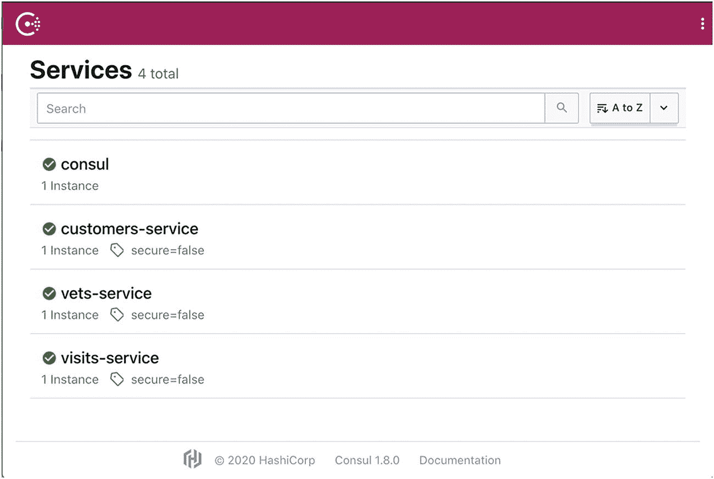

图 6-5

仪表板 UI

### 宠物诊所用户界面

应用程序 UI 是在 AngularJS 上使用 1.7 版本构建的。这些 HTML 页面被部署为 Spring web 应用程序的静态资源。或者，我们可以将它们打包并部署在像 Apache Tomcat 或 HTTPD 这样的服务器上。UI 也被打包成一个可执行的 JAR。现在让我们用下面的命令启动 UI。

```py
target $ java -jar spring-petclinic-ui-2.3.1.jar
2020-07-27 22:15:21.996  INFO [petclinic-ui,,,] 17732 --- [  restartedMain] c.c.c.ConfigServicePropertySourceLocator : Fetching config from server at : http://localhost:8888
2020-07-27 22:15:22.870  INFO [petclinic-ui,,,] 17732 --- [  restartedMain] c.c.c.ConfigServicePropertySourceLocator : Located environment: name=petclinic-ui, profiles=[default], label=null, version=8adeb754f96df6e7308344e7bb2ceddcca09b93f, state=null
2020-07-27 22:15:22.871  INFO [petclinic-ui,,,] 17732 --- [  restartedMain] b.c.PropertySourceBootstrapConfiguration : Located property source: [BootstrapPropertySource {name='bootstrapProperties-configClient'}, BootstrapPropertySource {name='bootstrapProperties-https://github.com/rahul0208/spring-petclinic-microservices-config/petclinic-ui.yml (document #0)'}, BootstrapPropertySource {name='bootstrapProperties-https://github.com/rahul0208/spring-petclinic-microservices-config/application.yml (document #0)'}]
...... TRUNCATED FOR BREVITY

```

UI 部署在 9000 端口上。我们可以用`http://localhost:9000/#!/welcome`来访问它。(见图 [6-6](#Fig6)

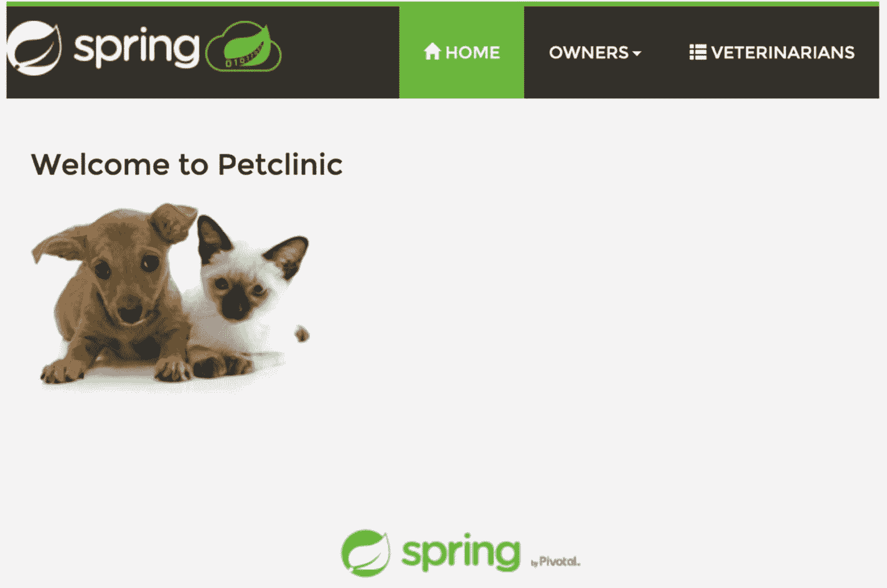

图 6-6

PetClinic UI(小诊所 UI)

UI 也在更新咨询服务注册中心。这样，注册表就是正在运行的服务的综合目录。

## 配置网关

在前面的设置中，我们部署了应用程序的所有微服务。现在我们需要配置 Traefik 来呈现 UI，并将调用路由到每个服务。我们可以像前面几章一样，把这个配置写在一个文件中。它配置 Traefik，但是这种方法不能处理微服务架构的动态特性。随着新的服务加入到生态系统中，我们需要不断更新配置。此外，很难保持更新服务的所有实例的 IP 地址。

或者，Traefik 可以作为配置提供者与 Consul 键值存储一起使用。所有 Traefik 配置都作为键和值分层添加到已配置的根节点下。默认根节点名为“traefik”。表 [6-1](#Tab1) 突出显示了一些 Traefik 键。

表 6-1

交通钥匙

<colgroup><col class="tcol1 align-left"> <col class="tcol2 align-left"></colgroup> 
| 

钥匙

 | 

价值

 |
| --- | --- |
| traefik/http/routers/<route-name>/entry points/0</route-name> | 指定各自的入口点名称 |
| traefik/http/routers/<route-name>/middleware/0</route-name> | 指定中间件名称 |
| traefik/http/routers/ <route-name>/rule</route-name> | 指定了匹配规则 |
| traefik/http/routers/<route-name>/service</route-name> | 指定各自的服务名称 |
| traefik/http/service/<service-name>/load balancers/0/URL</service-name> | 指定了实例 url 位置 |
| RAE fik/http/middleware/<middleware-name>/strip prefix/prefix/0</middleware-name> | 指定了中间件配置 |

Traefik 文档提供了用于配置它的密钥的更新列表。作为第一步，让我们将配置添加到 Consul。您可以使用 Consul GUI 创建它。或者，您可以从 JSON 文件中导入键。每个键的值都以 Base64 格式编码。

```py
$ consul kv import "$(cat config.json)"
Imported: traefik/http/middlewares/petclinic-customers-stripprefix/stripPrefix/prefixes/0
Imported: traefik/http/middlewares/petclinic-visits-stripprefix/stripPrefix/prefixes/0
Imported: traefik/http/routers/petclinic-customers-route/entryPoints/0
Imported: traefik/http/routers/petclinic-customers-route/middlewares/0
Imported: traefik/http/routers/petclinic-customers-route/rule
Imported: traefik/http/routers/petclinic-customers-route/service
Imported: traefik/http/routers/petclinic-route/entryPoints/0
Imported: traefik/http/routers/petclinic-route/rule
Imported: traefik/http/routers/petclinic-route/service
Imported: traefik/http/routers/petclinic-vets-route/entryPoints/0
Imported: traefik/http/routers/petclinic-vets-route/rule
Imported: traefik/http/routers/petclinic-vets-route/service
Imported: traefik/http/routers/petclinic-visits-route/entryPoints/0
Imported: traefik/http/routers/petclinic-visits-route/middlewares/0
Imported: traefik/http/routers/petclinic-visits-route/rule
Imported: traefik/http/routers/petclinic-visits-route/service

```

一旦配置被导入，我们应该在 Consul 存储中看到所有的键值。现在我们需要更新 Traefik 静态配置来使用 Consul provider。

```py
entryPoints :
  web :
    address : ":80"

providers:
  consul:
    endpoints:
      - "127.0.0.1:8500"
    rootKey : "traefik"

api :
  insecure : true
  dashboard : true

```

我们在配置中指定了 Consul provider 而不是 FileProvider。我们还指定了位置和根密钥。还有其他选项来配置身份验证和 TLS 信息。让我们启动 Traefik 服务器并查看仪表板。

仪表板显示来自 Consul 键值存储的配置。Traefik 已经创建了四条新路由，每条路由对应一个已部署的服务。如果服务没有运行，那么配置添加的路由是错误的，如图 [6-7](#Fig7) 所示。如果您单击某个路径，您会看到一条关于相应服务缺失详细信息的错误消息。

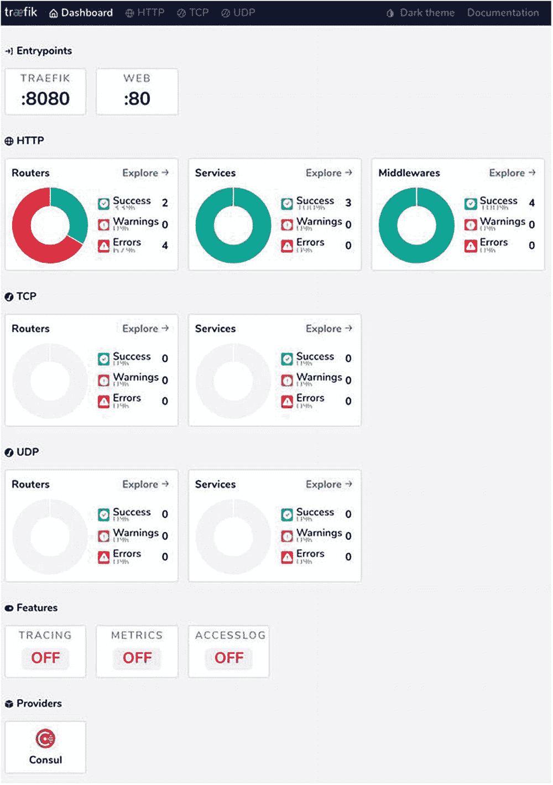

图 6-7

来自 consul 的流量配置

### 服务详情

Traefik 需要每个服务的服务器详细信息。在微服务架构中，服务注册是将所有细节添加到注册表中的过程。在我们看来，自注册是支持所有可能场景的最简单的机制。我们扩展了自助注册，为所需的咨询密钥添加了 Traefik 特定的详细信息。`ServiceRegistry`类完成了这一职责。

```py
@Configuration
public class ServiceRegistry implements ApplicationListener<ServletWebServerInitializedEvent> {

    final String serviceKey = "/traefik/http/services/{0}/loadBalancer/servers/";
    final String serverKey = "/traefik/http/services/{0}/loadBalancer/servers/{1}/";
    final String urlKey = "/traefik/http/services/{0}/loadBalancer/servers/{1}/url";

    @PreDestroy
    void removerServerMapping() {
        if(index > -1) {
            consulClient.deleteKVValues(format(serverKey, applicationName, index));
        }
    }

    void addServerMapping(int port)  {
        Response<List<String>> keys = consulClient.getKVKeysOnly(format(serviceKey, applicationName));
        index = keys.getValue()!=null ? keys.getValue().size() : 0;
        consulClient.setKVValue(format(urlKey, applicationName,index), format("http://{0}:{1,number,#}/","127.0.0.1",port));
    }

 // REMOVED for Brevity
}

```

前面的代码执行以下操作。

*   已确定启动应用程序的端口

*   使用 ConsulClient 将主机和端口信息添加到 Consul KV 存储中

*   将值添加到 Traefik keys/Traefik/http/services/{ 0 }/load balancer/servers/{ 1 }/URL 中

*   服务关闭时删除密钥

类是每个服务的一部分。如果您启动所有服务并重新加载仪表板，您会看到所有错误都已修复。(见图 [6-8](#Fig8)

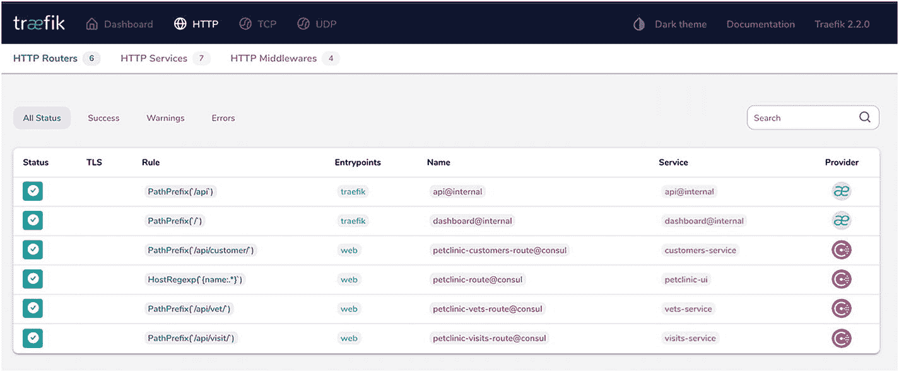

图 6-8

PetClinic 配置

Note

Traefik 继续关注 KVS 商店的价值。当配置在 Consul 中更新时，它会自动重新加载配置。

现在让我们在 http://localhost/上加载 PetClinic 应用程序。应用程序按预期执行。我们可以跨三种不同的微服务加载和保存数据。(参见图 [6-9](#Fig9) )

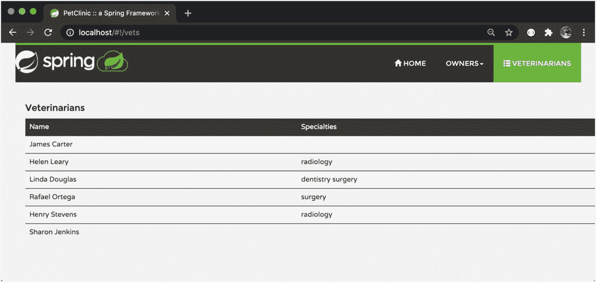

图 6-9

宠物诊所

### 断路器

我们说过，微服务经常协作来交付一个完整的用户功能。一个服务调用其他服务来获取相关数据。但是在像微服务这样的分布式系统中，远程服务调用在失败之前可能会挂起一段时间。无响应的服务调用会阻塞调用服务的资源。如果有许多这样的调用，系统可能会耗尽关键资源，导致跨多个系统的级联故障。

断路器经常被用来解决这个故障快速行为的问题。断路器跟踪远程呼叫。在不正常的响应中，断路器会立即返回，而不会将呼叫发送到目标服务。这本书没有详细介绍这种模式。

Traefik 提供了可以配置断路器的中间件。因为断路器被配置为中间件链的一部分，所以断路器仅在其执行后改变行为。值得注意的是，尽管断路器在配置中声明了一次，但它配置为每个路由的单独实例。Traefik 可以通过以下指标检测服务错误率。

*   **延迟** : Traefik 可以测量服务分位数延迟时间。如果测量的时间超过一个配置值(如`LatencyAtQuantileMS(50.0) > 100` ) `.`该参数指定分位数，则断路器可被触发。

*   **网络错误**:测量网络错误率(如`NetworkErrorRatio() > 0.30`)。

*   **响应代码** : Traefik 可以测量服务响应状态代码(如`ResponseCodeRatio(500, 600, 0, 600) > 0.25` ) `.`这里的四个参数是 HTTP 状态代码。
    *   错误状态代码来自

    *   错误状态代码至

    *   申请状态代码自

    *   申请状态代码至

这些度量值中的每一个都可以通过使用以下操作符来检查。

*   大于(>)

*   大于或等于(> =)

*   小于(

*   小于或等于(< =)

*   等于(==)和

*   不等于(！=)运算符

您还可以使用 AND (&&)和 OR (||)运算符组合两个或多个指标。当 Traefik 确定触发了断路器时，它不会将呼叫转发到目标服务；相反，它返回 503 响应。(参见图 [6-10](#Fig10) )

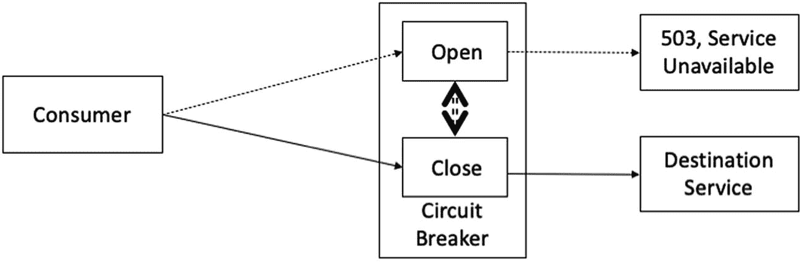

图 6-10

交通断路器

现在让我们将以下响应状态断路器添加到 over services 中。

```py
$ consul kv import "$(cat circuitbreaker.json)"
Imported: traefik/http/middlewares/response-check/circuitbreaker/expression
Imported: traefik/http/routers/petclinic-customers-route/middlewares/1

```

我们为配置中的客户服务路径添加了断路器中间件。当客户服务返回 500 错误代码时，断路器被触发。Traefik 还在仪表板上显示断路器中间件配置。(见图 [6-11](#Fig11) )

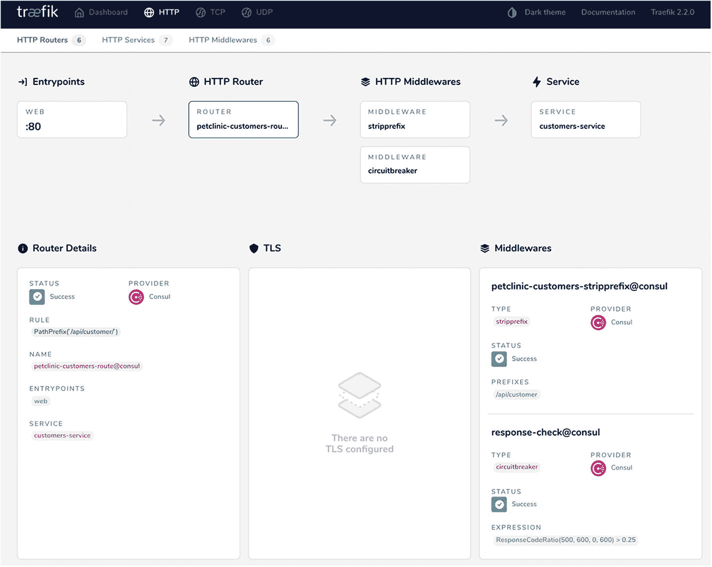

图 6-11

带断路器的路线

### 重试次数

在动态生态系统中，服务实例可以处于开始状态。可能会出现间歇性网络连接错误。这些瞬时误差通常是自校正的。如果您重试服务呼叫，很可能会成功。重试是使应用程序容错的另一种机制。

重试模式规定您可以重试失败的请求。重要的是要确定这种方法可能导致的故障。如果应用程序报告一个无效的数据错误，那么它很可能在重试时不起作用。此外，在整个系统中传播的失败请求会产生不必要的瓶颈。另一方面，如果请求由于连接或响应超时而失败，则重试成功的可能性很高。

Traefik 通过使用重试中间件来支持重试模式，如果出现超时错误，重试中间件会向服务重新发出指定次数的请求。一旦有来自服务的响应，中间件就停止重新发布。中间件 done 验证收到的响应是否是错误的。我们可以添加重试中间件配置，并按照以下方式为路由启用它。

```py
$ consul kv import "$(cat retry.json)"
Imported: traefik/http/middlewares/retry-check/retry/attempts
Imported: traefik/http/routers/petclinic-vets-route/middlewares/1

```

我们将重试中间件配置为四次重试。中间件应用于配置中的 vets-service 路由。很难测试这样的配置。该配置适用于服务响应缓慢的情况。只有在连接超时的情况下，才会复制该错误。这些是实际的网络错误。请求超时时，重试机制不起作用。在这些情况下，请求由服务处理，但是处理可能非常慢。如果重试这样的请求，可能会导致意想不到的问题，如帐户借记请求中的双重借记。

只有在 Traefik 中配置了超时，重试才能正常工作。这是全局级别的配置。Traefik 提供 serverstransport . forwarding time out 静态配置属性，可以控制服务器的超时。

*   `idleConnTimeout`:指定空闲连接在关闭前保持空闲的最长时间

*   `responseHeaderTimeout`:指定等待服务器响应头的时间

*   `dialTimeout`:指定建立连接所花费的时间

```py
serversTransport:
  forwardingTimeouts:
    responseHeaderTimeout: 1s
    dialTimeout: 1s
    idleConnTimeout: 1s

```

我们在配置中为服务响应和空闲连接配置了一秒超时。让我们重新启动 Traefik，并在仪表板上验证重试中间件配置。

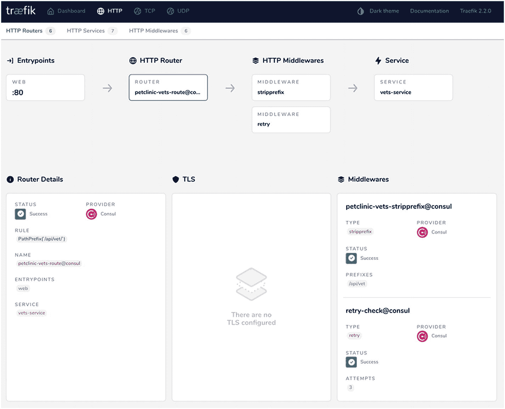

图 6-12

重试路由

该配置显示，对于失败的请求，将执行三次重试。

### 节流

在微服务架构中，不同的服务协作提供用户价值。这包括将企业集成技术应用到应用程序中，以解决各种问题。应用程序集成中的一个常见问题是控制资源消耗。有些资源的创建成本很高，因此它们的访问必须通过服务级别协议来控制。节流是一种通过发送比服务级别协议更多的请求来控制不当行为或欺诈服务的方法。如果临界区服务失败，将此应用于临界区服务作为整个生态系统停止是必要的。这有助于改进应用程序容量规划。

节流通常通过拒绝溢出请求来实现。Traefik 通过使用限速中间件支持节流。它可以测量特定来源在规定时间内的平均调用次数。如果中间件调用的调用超过了配置的限制，它会向源服务发送 HTTP 状态 429(调用太多)。中间件提供了以下三个属性来配置 API 比率。

*   **平均值**:统计配置周期内的请求数

*   **周期**:指定时间(费率定义为平均调用次数/周期)

*   **Burst** :指定如何在短时间内处理最大请求

有控制信号源识别的选项。我们可以为 vets 服务启用限速中间件。

```py
$ consul kv import "$(cat ratelimit.json)"
Imported: traefik/http/middlewares/ratelimit-check/ratelimit/average
Imported: traefik/http/middlewares/ratelimit-check/ratelimit/period
Imported: traefik/http/routers/petclinic-vets-route/middlewares/2

```

Traefik 更新配置并显示在仪表板中，如图 [6-13](#Fig13) 所示。

我们将速率定义为 1 个请求/30 秒。如果我们尝试对/ `api/vets/vets`发出几个请求，您会看到下面的响应。

```py
Request URL: http://localhost/api/vet/vets
Request Method: GET
Status Code: 429 Too Many Requests
Remote Address: [::1]:80
Referrer Policy: no-referrer-when-downgrade

```

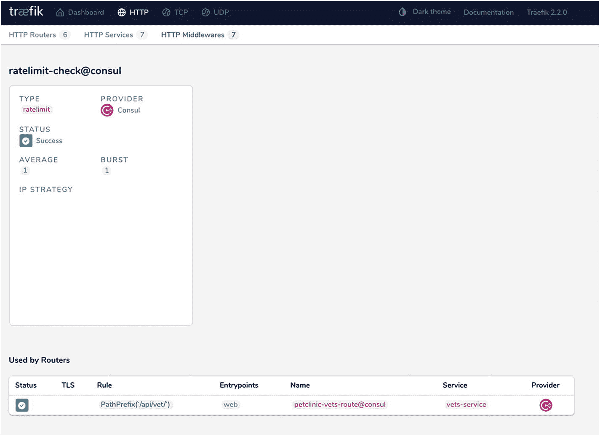

图 6-13

节气门仪表板

#### 中间件链

Traefik 提供了一个链式中间件，可用于简化跨不同服务应用的配置。链式中间件可以用来按顺序对中间件进行分组。整个组可以应用于一个路由，消除了单独应用每个中间件的需要。通过向链中间件属性提供一个逗号分隔的列表来指定完整的链。在这个场景中，我们可以将链配置为由断路器和速率限制中间件组成。

```py
$ consul kv import "$(cat chain-list.json)"
Imported: traefik/http/middlewares/chain-list/chain/middlewares
Imported: traefik/http/routers/petclinic-customers-route/middlewares/0

```

Traefik 更新配置并显示在仪表板中，如图 [6-14](#Fig14) 所示。

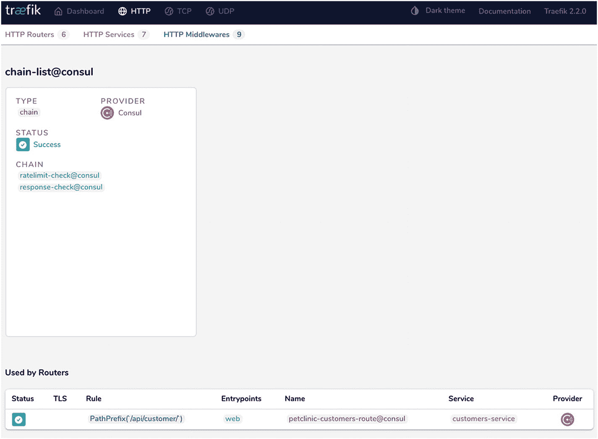

图 6-14

链式中间件

### 金丝雀部署

Traefik 使用加权循环法支持 Canary 部署。在上一节中，我们添加了`ServiceRegistry`类来添加实例细节。这些实例以循环方式使用。在第 3 章中，我们讨论了加权循环法，权重被添加到服务器实例中。Traefik 按照提供权重的比率划分收到的请求。当我们开始新的实例时，你会在咨询服务注册中心看到新的服务(见图 [6-15](#Fig15) )。可以从 UI 为每个实例添加权重。

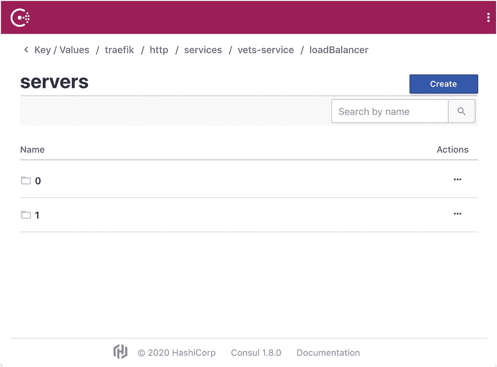

图 6-15

多个实例

将请求子集重定向到新服务是 canary 部署的基础之一。该机制可以通过使用 Consul 客户端来实现自动化。但是完整的端到端流程需要额外的组件来提供和部署新发布的版本。

Note

本章将 Traefik 与 Consul KV store 集成在一起。Traefik 还提供了与 Zookeeper 和 etcd 的集成。与他人的配置类似于基于 Consul 的集成，但是有些特性不能像预期的那样工作。

## 摘要

在本章中，我们部署了一个基于微服务的解决方案，并将 Traefik 配置为它的网关。我们使用了微服务的咨询服务注册。启用 Traefik 从 Consul KV 存储中读取配置。Traefik 可以检测 KV 存储中的更新并执行热重装。这使得配置在像微服务这样的动态生态系统中保持更新。

服务可以在它们启动/关闭时注册/注销它们。这些更新由 Traefik 挑选，它提供了可以在微服务架构中配置的中间件。本章介绍了断路器、重试、速率限制和链式中间件。它还研究了基于加权轮询的部署，这种部署可以拆分 canary 部署的请求。在下一章中，我们将在编排引擎上部署微服务解决方案并配置 Traefik。